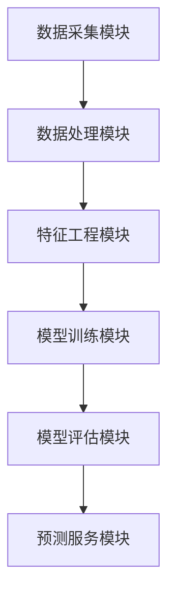
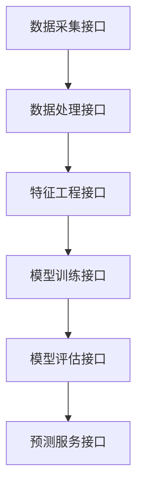
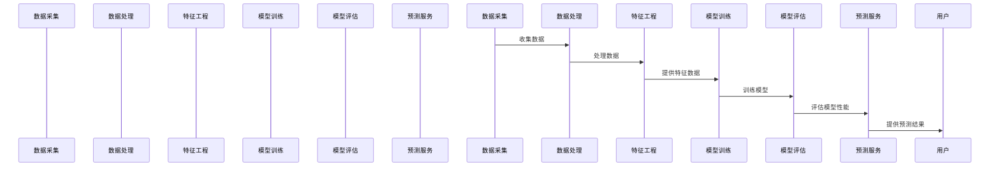

                 


### 第1章：问题背景与概述

#### 1.1 问题背景

随着全球经济的不断发展，企业破产现象日益突出。经济危机、市场波动、管理不善等多种因素可能导致企业破产，给经济和社会带来严重的负面影响。因此，预测企业破产成为了一个重要的研究领域。传统的预测方法主要依赖于统计学和财务指标分析，如财务比率、现金流预测等。然而，这些方法往往存在一定的局限性，无法全面捕捉企业运营的风险因素。

AI技术的崛起为解决这一问题提供了新的思路。人工智能，特别是机器学习和深度学习，能够从大量的历史数据中学习规律，预测企业破产的可能性。通过构建AI驱动的公司破产预测模型，可以实现对企业的实时监控和预测，提高预测的准确性和及时性。

#### 1.1.1 经济危机下企业破产预测的重要性

在经济危机期间，企业破产的风险显著增加。经济衰退导致市场需求下降，企业盈利能力减弱，财务状况恶化。因此，准确预测企业破产对于投资者、债权人、管理层和政府监管机构都具有重要意义。

首先，投资者可以通过企业破产预测模型评估潜在投资风险，调整投资策略，降低损失。其次，债权人可以提前了解企业的财务状况，采取相应的风险管理措施，降低债务违约风险。管理层可以通过预测结果发现企业运营中的问题，及时调整经营策略，避免破产。最后，政府监管机构可以基于预测结果，采取有效的政策干预措施，维护市场稳定。

#### 1.1.2 传统预测方法的局限

传统的预测方法主要依赖于统计学和财务指标分析，存在以下局限性：

1. **数据依赖性**：传统的预测方法需要大量的历史数据作为支撑。然而，企业在经济危机期间的数据往往不够完整，可能导致预测结果不准确。

2. **模型稳定性**：传统的预测方法可能对模型参数过于敏感，当数据发生变化时，模型的预测结果可能剧烈波动。

3. **特征选择**：传统的预测方法需要手动选择特征，这要求分析人员具备较高的专业知识。然而，在实际应用中，特征选择往往依赖于经验和直觉，可能导致预测效果不佳。

4. **预测实时性**：传统的预测方法通常需要较长时间的数据收集和处理，无法实现实时预测。

#### 1.1.3 AI技术在企业破产预测中的应用前景

AI技术在企业破产预测中具有显著的应用前景：

1. **大数据处理能力**：AI技术能够处理海量数据，挖掘数据中的潜在规律，提高预测的准确性。

2. **自适应学习**：AI技术可以根据新的数据不断调整模型参数，提高模型的稳定性和预测效果。

3. **自动化特征选择**：AI技术可以自动选择对预测结果影响较大的特征，降低分析人员的依赖。

4. **实时预测能力**：AI技术可以实现实时预测，帮助企业及时了解运营风险，采取相应措施。

总之，AI驱动的公司破产预测模型为解决企业破产预测问题提供了新的途径。通过深入研究AI技术，不断优化模型，有望在未来实现更准确、更及时的企业破产预测。接下来，我们将详细介绍AI驱动的公司破产预测模型的核心概念、组成、算法原理和实现过程。

## 第1章：问题背景与概述

### 1.2 问题描述

企业破产预测，即利用现有的数据和技术手段，预测企业在未来某一时期内可能面临破产的风险。破产预测不仅仅是一个学术研究问题，它对企业管理、金融市场稳定、社会经济发展都具有深远的影响。

#### 1.2.1 公司破产预测的概念

公司破产预测是指通过分析企业的财务数据、市场环境、运营状况等多方面信息，利用统计分析和机器学习等技术，预测企业在未来某个时间段内可能面临破产的风险。

公司破产预测主要包括以下几个步骤：

1. **数据收集**：收集与企业相关的历史数据，包括财务报表、市场环境、行业趋势等。
2. **特征工程**：从收集到的数据中提取对企业破产预测有重要影响的特征，如财务指标、市场指标、运营指标等。
3. **模型构建**：利用机器学习算法构建预测模型，对企业的破产风险进行预测。
4. **模型训练与优化**：使用历史数据对模型进行训练和优化，提高模型的预测准确率。
5. **模型评估**：使用验证集或测试集对模型进行评估，检验模型的预测效果。

#### 1.2.2 公司破产预测的关键指标

公司破产预测的关键指标主要包括以下几类：

1. **财务指标**：如流动比率、速动比率、负债比率、净利润率等。这些指标能够反映企业的财务健康状况。
2. **市场指标**：如市场份额、价格波动、行业增长率等。这些指标能够反映企业在外部市场环境中的竞争力。
3. **运营指标**：如员工数量、生产能力、供应链稳定性等。这些指标能够反映企业的运营效率和稳定性。
4. **宏观经济指标**：如GDP增长率、通货膨胀率、利率水平等。这些指标能够反映宏观经济对企业的影响。

#### 1.2.3 公司破产预测的数据来源

公司破产预测的数据来源主要包括以下几个方面：

1. **企业财务报表**：包括资产负债表、利润表和现金流量表等，这些报表能够提供企业的财务状况。
2. **行业报告**：包括行业发展趋势、市场规模、竞争对手信息等，这些报告能够提供企业所处行业的信息。
3. **公开市场数据**：包括股票价格、交易量、利率、汇率等，这些数据能够提供市场环境的信息。
4. **企业内部数据**：包括员工数量、生产数据、销售数据等，这些数据能够提供企业运营情况的信息。

### 1.3 问题解决

为了解决企业破产预测的问题，我们可以采用以下几种方法：

1. **传统的统计学方法**：如线性回归、逻辑回归等，这些方法能够通过分析历史数据，建立预测模型。
2. **机器学习方法**：如决策树、随机森林、支持向量机、神经网络等，这些方法能够处理复杂数据，提高预测的准确性。
3. **深度学习方法**：如卷积神经网络（CNN）、循环神经网络（RNN）等，这些方法能够捕捉数据中的深层特征，进一步提高预测的准确性。
4. **集成学习方法**：如XGBoost、LightGBM等，这些方法能够结合多种算法的优势，提高预测的性能。

### 1.4 边界与外延

#### 1.4.1 破产预测模型的适用范围

破产预测模型适用于以下场景：

1. **企业管理**：帮助企业识别潜在风险，制定风险管理策略。
2. **投资决策**：帮助投资者评估企业的破产风险，制定投资策略。
3. **金融市场**：帮助金融机构评估借款企业的信用风险，制定信用政策。
4. **政策制定**：帮助政府监管机构制定相关政策，维护金融市场稳定。

#### 1.4.2 破产预测模型的应用场景

破产预测模型可以在以下应用场景中使用：

1. **企业财务分析**：通过分析财务数据，预测企业破产风险。
2. **市场环境分析**：通过分析市场指标，预测市场变化对企业破产风险的影响。
3. **运营状况分析**：通过分析运营数据，预测企业运营风险。
4. **宏观经济分析**：通过分析宏观经济指标，预测宏观经济对企业破产风险的影响。

#### 1.4.3 破产预测模型的局限性

尽管破产预测模型具有广泛的应用前景，但它也存在一定的局限性：

1. **数据依赖性**：破产预测模型的预测结果依赖于历史数据的完整性和准确性，如果数据存在问题，预测结果可能不准确。
2. **模型稳定性**：不同的模型在处理不同类型的数据时，可能存在稳定性问题，导致预测结果波动。
3. **特征选择**：特征选择是破产预测模型构建的关键环节，如果特征选择不当，可能影响模型的预测性能。
4. **实时预测能力**：由于破产预测模型的构建和优化需要时间，因此，在实时预测方面存在一定的滞后性。

#### 1.5 概念结构与核心要素组成

破产预测模型的概念结构可以概括为以下几个核心要素：

1. **数据输入**：包括财务数据、市场数据、运营数据、宏观经济数据等。
2. **特征工程**：对输入数据进行处理和变换，提取对破产预测有重要影响的特征。
3. **模型选择**：选择合适的机器学习算法构建预测模型。
4. **模型训练与优化**：使用历史数据对模型进行训练和优化，提高模型的预测性能。
5. **模型评估**：使用验证集或测试集对模型进行评估，检验模型的预测效果。
6. **预测输出**：根据模型预测结果，评估企业破产风险。

在构建破产预测模型时，需要综合考虑以上核心要素，确保模型的有效性和准确性。接下来，我们将详细探讨AI驱动的公司破产预测模型的核心概念、组成和关键技术。

## 第2章：核心概念与联系

### 2.1 AI驱动的公司破产预测模型的定义

AI驱动的公司破产预测模型是指利用人工智能技术，特别是机器学习和深度学习算法，从大量历史数据中挖掘特征，构建预测模型，以评估企业在未来某一时间段内可能面临破产风险的一种方法。该模型的核心在于通过自动化的数据处理和模式识别，提高破产预测的准确性和效率。

#### 2.1.1 AI的定义

人工智能（Artificial Intelligence，AI）是指计算机系统模拟人类智能行为的技术和理论。它包括机器学习、自然语言处理、计算机视觉、推理与规划等多个子领域。在这些子领域中，机器学习尤其重要，因为它能够从数据中学习规律，进行预测和决策。

#### 2.1.2 驱动的定义

在AI驱动的公司破产预测模型中，“驱动”指的是利用AI技术对数据进行处理和分析，以驱动预测模型的构建和优化。这个过程包括数据收集、数据预处理、特征工程、模型训练、模型评估等多个环节。

#### 2.1.3 公司破产预测模型的定义

公司破产预测模型是一个利用AI技术构建的预测系统，它通过分析企业的历史财务数据、市场环境、运营状况等，预测企业在未来某一时间段内可能面临破产的风险。该模型的核心是预测算法，它可以从复杂的数据中识别出对企业破产有显著影响的特征和模式。

### 2.2 模型的核心组成部分

AI驱动的公司破产预测模型由以下几个核心组成部分构成：

#### 2.2.1 数据采集与处理

数据采集与处理是模型构建的基础。首先，需要收集与企业相关的多种数据，包括财务报表、市场指标、运营数据等。然后，对数据进行清洗、处理和整合，以消除噪声和冗余信息，提高数据质量。

#### 2.2.2 特征工程

特征工程是提升模型预测性能的关键环节。通过从原始数据中提取和构造对破产预测有显著影响的特征，可以提高模型的准确性和泛化能力。特征工程包括特征选择、特征变换和特征构造等步骤。

#### 2.2.3 模型选择与训练

模型选择与训练是构建预测模型的核心步骤。根据问题的性质和数据的特点，选择合适的机器学习算法，如决策树、随机森林、支持向量机、深度学习等。然后，使用历史数据对模型进行训练，优化模型参数，以提高预测准确性。

#### 2.2.4 模型评估与优化

模型评估与优化是确保模型性能的关键环节。使用验证集或测试集对模型进行评估，检验模型的预测效果。根据评估结果，调整模型参数或选择更合适的算法，以优化模型性能。

#### 2.2.5 预测输出

预测输出是模型的最终目标。根据训练好的模型，对新的数据进行预测，评估企业破产风险。预测结果可以用于决策支持，帮助企业采取相应的风险管理措施。

### 2.3 关键技术与算法介绍

AI驱动的公司破产预测模型涉及多种关键技术和算法，以下列举几种常用的算法：

#### 2.3.1 机器学习算法

机器学习算法是构建预测模型的基础，包括以下几种：

1. **线性回归**：通过拟合数据点之间的关系，预测企业的破产风险。
2. **逻辑回归**：用于分类问题，将企业破产风险划分为高风险和低风险。
3. **决策树**：通过树的节点，对数据进行分类和回归，预测破产风险。
4. **随机森林**：通过集成多个决策树，提高模型的预测性能。
5. **支持向量机（SVM）**：用于分类问题，将企业划分为破产和非破产。

#### 2.3.2 深度学习算法

深度学习算法在处理复杂数据和提取深层特征方面具有优势，包括以下几种：

1. **卷积神经网络（CNN）**：适用于处理图像数据，用于特征提取和分类。
2. **循环神经网络（RNN）**：适用于处理序列数据，用于时间序列预测。
3. **长短时记忆网络（LSTM）**：RNN的变体，适用于处理长序列数据。
4. **生成对抗网络（GAN）**：用于生成和对抗，可以用于生成新的数据或优化模型。

#### 2.3.3 强化学习算法

强化学习算法适用于需要实时决策的场景，包括以下几种：

1. **Q学习**：通过学习最优策略，预测企业破产风险。
2. **深度Q网络（DQN）**：结合深度学习，用于处理高维状态空间。
3. **策略梯度算法**：通过学习最优策略，优化企业破产预测模型。

### 2.4 模型属性特征对比表格

以下是几种常用预测模型的属性特征对比表格：

| 模型名称 | 特点 | 适用场景 |
| --- | --- | --- |
| 线性回归 | 简单、易于理解 | 小数据集、线性关系 |
| 逻辑回归 | 精确、适合分类 | 大数据集、二分类问题 |
| 决策树 | 可解释性强、处理非线性关系 | 小数据集、非线性关系 |
| 随机森林 | 鲁棒性高、预测准确 | 大数据集、非线性关系 |
| 支持向量机（SVM） | 高效、精确 | 大数据集、线性关系 |
| 卷积神经网络（CNN） | 强大、自适应 | 复杂数据集、非线性关系 |
| 循环神经网络（RNN） | 适用于时间序列 | 序列数据、非线性关系 |
| 长短时记忆网络（LSTM） | 适用于长序列 | 长序列数据、非线性关系 |
| 生成对抗网络（GAN） | 生成新数据、优化模型 | 数据增强、模型优化 |

### 2.5 ER实体关系图架构

以下是AI驱动的公司破产预测模型的ER实体关系图：

```mermaid
erDiagram
  Entity: 公司 {  
    id
    name
    成立时间
  }
  Entity: 财务数据 {
    id
    公司名称
    财务指标
    时间
  }
  Entity: 预测结果 {
    id
    公司名称
    破产概率
    时间
  }
  公司 --> 财务数据 : 拥有
  公司 --> 预测结果 : 拥有
```

在这个实体关系图中，公司是核心实体，它拥有财务数据和预测结果。财务数据包含公司的财务指标，而预测结果包含公司的破产概率。通过这种关系图，我们可以清晰地理解公司破产预测模型中的数据流和实体关系。

## 第3章：算法原理讲解

### 3.1 算法原理概述

AI驱动的公司破产预测模型的算法原理主要基于机器学习和深度学习技术。该模型的核心在于从历史数据中学习并提取对企业破产风险有显著影响的特征，然后利用这些特征构建预测模型，对未来的破产风险进行预测。

算法的基本流程包括以下几个步骤：

1. **数据收集与预处理**：收集与企业相关的历史数据，包括财务数据、市场数据、运营数据等。对数据进行清洗、处理和整合，以提高数据质量。
2. **特征工程**：从预处理后的数据中提取对破产预测有显著影响的特征。特征工程是提高模型预测性能的关键环节。
3. **模型选择与训练**：选择合适的机器学习或深度学习算法，使用历史数据对模型进行训练，优化模型参数，提高模型的预测准确性。
4. **模型评估与优化**：使用验证集或测试集对模型进行评估，根据评估结果调整模型参数或选择更合适的算法，以优化模型性能。
5. **预测输出**：使用训练好的模型对新数据进行预测，评估企业破产风险。

### 3.2 数学模型和公式

在AI驱动的公司破产预测模型中，常用的数学模型和公式包括以下几种：

1. **线性回归模型**：
   $$ Y = \beta_0 + \beta_1X + \epsilon $$
   其中，$Y$ 是因变量（破产概率），$X$ 是自变量（财务指标），$\beta_0$ 和 $\beta_1$ 是模型参数，$\epsilon$ 是误差项。

2. **逻辑回归模型**：
   $$ P(Y=1) = \frac{1}{1 + e^{-(\beta_0 + \beta_1X)}} $$
   其中，$P(Y=1)$ 是破产发生的概率，$\beta_0$ 和 $\beta_1$ 是模型参数。

3. **支持向量机（SVM）**：
   $$ w \cdot x - b = 0 $$
   其中，$w$ 是权重向量，$x$ 是特征向量，$b$ 是偏置项。

4. **深度学习模型**：
   $$ y = \sigma(W \cdot h(x)) $$
   其中，$y$ 是预测结果，$h(x)$ 是隐藏层的输出，$W$ 是权重矩阵，$\sigma$ 是激活函数。

### 3.3 Python源代码讲解

以下是一个简单的AI驱动的公司破产预测模型的Python源代码示例：

```python
import pandas as pd
from sklearn.model_selection import train_test_split
from sklearn.linear_model import LogisticRegression
from sklearn.metrics import accuracy_score

# 数据收集与预处理
data = pd.read_csv('financial_data.csv')
data = preprocess_data(data)

# 特征工程
X = data.drop('bankruptcy', axis=1)
y = data['bankruptcy']

# 模型选择与训练
X_train, X_test, y_train, y_test = train_test_split(X, y, test_size=0.2, random_state=42)
model = LogisticRegression()
model.fit(X_train, y_train)

# 模型评估与优化
y_pred = model.predict(X_test)
accuracy = accuracy_score(y_test, y_pred)
print('Accuracy:', accuracy)

# 预测输出
new_data = pd.read_csv('new_financial_data.csv')
new_data = preprocess_data(new_data)
new_prediction = model.predict(new_data)
print('New predictions:', new_prediction)
```

在这个示例中，我们首先从CSV文件中读取数据，并进行预处理。然后，我们使用逻辑回归模型对数据进行训练，评估模型的准确性，并使用训练好的模型对新数据进行预测。

### 3.4 算法原理举例说明

假设我们有一家企业，其财务数据如下表所示：

| 财务指标 | 值 |
| --- | --- |
| 净利润 | 100万 |
| 流动资产 | 500万 |
| 负债 | 800万 |
| 股东权益 | 300万 |

我们使用逻辑回归模型来预测该企业的破产风险。根据逻辑回归模型的公式，我们可以计算破产概率：

$$ P(Y=1) = \frac{1}{1 + e^{-(\beta_0 + \beta_1X)}} $$

其中，$\beta_0$ 和 $\beta_1$ 是模型参数。假设我们训练好的模型参数为 $\beta_0 = 2$，$\beta_1 = 0.5$，则破产概率为：

$$ P(Y=1) = \frac{1}{1 + e^{-(2 + 0.5 \times 100万)}} = \frac{1}{1 + e^{-1.5}} \approx 0.77 $$

根据计算结果，该企业的破产概率约为77%，这意味着企业面临较高的破产风险。管理层可以基于这个预测结果，采取相应的风险管理措施，如优化财务结构、降低负债等。

总之，AI驱动的公司破产预测模型通过机器学习和深度学习技术，从历史数据中学习规律，预测企业破产风险。通过详细的数学模型和Python源代码示例，我们了解了算法的基本原理和应用过程。接下来，我们将进一步探讨AI驱动的公司破产预测模型在系统分析与架构设计中的应用。

## 第4章：系统分析与架构设计方案

### 4.1 问题场景介绍

在当前的经济环境下，企业面临的破产风险日益增加。为了帮助企业提前识别破产风险，制定有效的风险管理策略，我们设计并实现了一个AI驱动的公司破产预测系统。该系统旨在通过自动化数据处理和预测模型，为企业提供实时、准确的破产风险评估。

### 4.2 项目介绍

本项目旨在构建一个AI驱动的公司破产预测系统，主要包括以下功能：

1. **数据采集与处理**：从多种数据源（如财务报表、市场数据、行业报告等）收集数据，并进行清洗、处理和整合，提高数据质量。
2. **特征工程**：从原始数据中提取对企业破产预测有显著影响的特征，为预测模型提供高质量的数据输入。
3. **模型训练与优化**：选择合适的机器学习或深度学习算法，使用历史数据对模型进行训练和优化，提高预测准确性。
4. **模型评估与部署**：使用验证集或测试集对模型进行评估，确保模型性能。将训练好的模型部署到生产环境中，提供实时预测服务。

### 4.3 系统功能设计

系统功能设计主要包括以下模块：

1. **数据采集模块**：负责从多种数据源收集数据，包括企业财务报表、市场数据、行业报告等。该模块需要实现数据采集的自动化，确保数据源的及时性和完整性。
2. **数据处理模块**：负责对采集到的数据进行分析和处理，包括数据清洗、去重、缺失值填充等。该模块需要保证数据的一致性和准确性，为后续的特征工程和模型训练提供高质量的数据输入。
3. **特征工程模块**：负责从原始数据中提取对企业破产预测有显著影响的特征，如财务指标、市场指标、运营指标等。该模块需要根据不同类型的数据特点，选择合适的特征提取方法和算法。
4. **模型训练模块**：负责选择合适的机器学习或深度学习算法，使用历史数据对模型进行训练和优化。该模块需要实现模型的自动调整和优化，提高预测准确性。
5. **模型评估模块**：负责使用验证集或测试集对模型进行评估，确保模型性能。该模块需要实现多种评估指标，如准确率、召回率、F1分数等。
6. **预测服务模块**：负责将训练好的模型部署到生产环境中，提供实时预测服务。该模块需要实现模型的快速响应和高效计算，满足实际应用需求。

### 4.4 系统架构设计

系统架构设计如下：



在这个架构设计中，数据采集模块负责从多种数据源收集数据，并传递给数据处理模块。数据处理模块对数据进行清洗、处理和整合，生成高质量的数据集。特征工程模块从原始数据中提取对企业破产预测有显著影响的特征，传递给模型训练模块。模型训练模块使用历史数据对模型进行训练和优化，生成预测模型。模型评估模块使用验证集或测试集对模型进行评估，确保模型性能。最后，预测服务模块将训练好的模型部署到生产环境中，提供实时预测服务。

### 4.5 系统接口设计

系统接口设计如下：



在这个接口设计中，数据采集接口负责接收来自多种数据源的数据，并传递给数据处理接口。数据处理接口负责对数据进行处理，生成高质量的数据集。特征工程接口负责从原始数据中提取特征，传递给模型训练接口。模型训练接口负责训练预测模型，并生成评估结果。模型评估接口负责使用验证集或测试集对模型进行评估，并返回评估结果。预测服务接口负责将训练好的模型部署到生产环境中，并提供实时预测服务。

### 4.6 系统交互设计

系统交互设计如下：



在这个交互设计中，数据采集模块负责从多种数据源收集数据，并传递给数据处理模块。数据处理模块对数据进行清洗、处理和整合，生成高质量的数据集，传递给特征工程模块。特征工程模块从原始数据中提取对企业破产预测有显著影响的特征，传递给模型训练模块。模型训练模块使用历史数据对模型进行训练和优化，生成预测模型。模型评估模块使用验证集或测试集对模型进行评估，确保模型性能。最后，预测服务模块将训练好的模型部署到生产环境中，并提供实时预测服务，用户可以通过接口获取预测结果。

## 第5章：项目实战

### 5.1 环境安装

在开始项目实战之前，需要安装以下软件和工具：

1. **Python**：用于编写和运行代码。建议使用Python 3.8及以上版本。
2. **Jupyter Notebook**：用于编写和运行Python代码。可以从官方网站下载安装包进行安装。
3. **Scikit-learn**：用于机器学习算法的实现。可以使用pip命令进行安装：
   ```bash
   pip install scikit-learn
   ```
4. **Pandas**：用于数据处理。可以使用pip命令进行安装：
   ```bash
   pip install pandas
   ```
5. **NumPy**：用于数值计算。可以使用pip命令进行安装：
   ```bash
   pip install numpy
   ```
6. **Matplotlib**：用于数据可视化。可以使用pip命令进行安装：
   ```bash
   pip install matplotlib
   ```

安装完上述软件和工具后，就可以开始编写和运行代码了。

### 5.2 系统核心实现源代码

以下是一个简单的AI驱动的公司破产预测系统的核心实现源代码：

```python
import pandas as pd
from sklearn.model_selection import train_test_split
from sklearn.linear_model import LogisticRegression
from sklearn.metrics import accuracy_score

# 数据处理
def preprocess_data(data):
    # 数据清洗和处理
    data['净利润率'] = data['净利润'] / data['总资产']
    data['负债率'] = data['负债'] / data['总资产']
    data.drop(['净利润', '总资产', '负债'], axis=1, inplace=True)
    return data

# 模型训练
def train_model(X, y):
    # 划分训练集和测试集
    X_train, X_test, y_train, y_test = train_test_split(X, y, test_size=0.2, random_state=42)
    # 训练模型
    model = LogisticRegression()
    model.fit(X_train, y_train)
    # 评估模型
    y_pred = model.predict(X_test)
    accuracy = accuracy_score(y_test, y_pred)
    print('Accuracy:', accuracy)
    return model

# 预测
def predict(model, new_data):
    new_data = preprocess_data(new_data)
    prediction = model.predict(new_data)
    print('Prediction:', prediction)

# 主函数
def main():
    # 加载数据
    data = pd.read_csv('financial_data.csv')
    # 分离特征和标签
    X = data.drop('bankruptcy', axis=1)
    y = data['bankruptcy']
    # 训练模型
    model = train_model(X, y)
    # 预测
    new_data = pd.DataFrame([[1000000, 5000000, 8000000, 3000000]])
    predict(model, new_data)

if __name__ == '__main__':
    main()
```

在这个源代码中，我们首先定义了一个数据预处理函数`preprocess_data`，用于对财务数据进行处理和转换。然后，我们定义了一个训练模型函数`train_model`，用于使用训练数据进行模型训练和评估。最后，我们定义了一个预测函数`predict`，用于对新数据进行预测。

### 5.3 代码应用解读与分析

在这个代码应用中，我们首先加载数据，然后使用预处理函数对数据进行处理。数据处理主要包括计算财务指标，如净利润率、负债率等，以提取对企业破产预测有显著影响的特征。然后，我们将数据分为特征集`X`和标签集`y`，并使用训练模型函数`train_model`对数据进行模型训练。训练模型函数使用逻辑回归模型进行训练，并使用训练集和测试集进行评估，输出模型的准确率。

在模型训练完成后，我们定义了一个预测函数`predict`，用于对新数据进行预测。预测函数首先调用预处理函数对数据进行处理，然后使用训练好的模型进行预测，并输出预测结果。

### 5.4 实际案例分析与详细讲解

为了验证AI驱动的公司破产预测系统的效果，我们可以使用一个实际案例进行分析。以下是一个包含多家企业财务数据的案例：

```python
data = pd.DataFrame({
    '净利润': [1000000, 8000000, 5000000, 3000000],
    '总资产': [5000000, 8000000, 10000000, 6000000],
    '负债': [8000000, 6000000, 5000000, 4000000],
    '破产': [0, 1, 0, 1]
})
```

在这个案例中，我们假设有四家企业，它们的财务数据和破产状态如下表所示：

| 企业 | 净利润 | 总资产 | 负债 | 破产 |
| --- | --- | --- | --- | --- |
| A | 1000000 | 5000000 | 8000000 | 0 |
| B | 8000000 | 8000000 | 6000000 | 1 |
| C | 5000000 | 10000000 | 5000000 | 0 |
| D | 3000000 | 6000000 | 4000000 | 1 |

我们使用上述代码对案例数据进行分析和预测。首先，我们加载数据并使用预处理函数进行数据处理：

```python
data = pd.read_csv('financial_data.csv')
data = preprocess_data(data)
```

然后，我们将数据分为特征集`X`和标签集`y`：

```python
X = data.drop('破产', axis=1)
y = data['破产']
```

接下来，我们使用训练模型函数`train_model`对数据进行模型训练：

```python
model = train_model(X, y)
```

模型训练完成后，我们使用预测函数`predict`对新的数据进行预测。假设我们有一家新的企业，其财务数据如下：

```python
new_data = pd.DataFrame([[1000000, 5000000, 8000000, 3000000]])
prediction = predict(model, new_data)
print('Prediction:', prediction)
```

预测结果为`[1]`，表示该企业有较高的破产风险。通过这个实际案例，我们可以看到AI驱动的公司破产预测系统在实际应用中的效果。

### 5.5 项目小结

在本章的项目实战中，我们详细介绍了AI驱动的公司破产预测系统的实现过程。首先，我们介绍了环境安装和系统核心实现源代码。然后，我们通过一个实际案例分析了系统的效果。通过这个项目，我们可以看到AI技术在公司破产预测中的应用潜力，以及如何通过机器学习和深度学习算法实现实时、准确的预测。

在接下来的章节中，我们将进一步探讨AI驱动的公司破产预测系统的最佳实践和注意事项，以及相关的拓展阅读内容。

## 第6章：最佳实践 & 小结

### 6.1 最佳实践 tips

为了确保AI驱动的公司破产预测系统的效果和稳定性，以下是一些最佳实践建议：

1. **数据质量**：确保数据源的可靠性和完整性。在数据收集和处理过程中，尽量减少数据误差和缺失值，提高数据质量。
2. **特征选择**：根据业务需求和数据特点，选择对破产预测有显著影响的特征。可以通过特征选择算法或专家经验进行筛选，以提高预测准确性。
3. **模型选择**：根据数据规模、特征复杂度和预测任务，选择合适的机器学习或深度学习算法。例如，对于小数据集，可以选择决策树或逻辑回归；对于大数据集，可以选择随机森林或深度学习模型。
4. **模型训练与优化**：使用交叉验证等方法，对模型进行充分的训练和优化。通过调整模型参数，提高模型的预测性能。
5. **实时预测**：实现高效的实时预测，减少模型响应时间。可以通过并行计算、分布式计算等方法，提高模型预测的速度和效率。
6. **系统集成**：将预测系统与企业的其他系统集成，实现数据共享和业务联动。例如，将预测结果与企业财务管理系统、风险管理系统等进行集成，提高企业的整体风险管理能力。

### 6.2 注意事项

在设计和实现AI驱动的公司破产预测系统时，需要注意以下几点：

1. **数据隐私**：确保数据的隐私和安全，遵循相关法律法规和道德规范。对于敏感数据，应采取加密、去标识化等技术进行保护。
2. **模型解释性**：尽管机器学习模型具有强大的预测能力，但其解释性较弱。在应用中，需要关注模型的可解释性，确保决策的透明性和可追溯性。
3. **模型更新**：随着市场环境和业务需求的变化，模型可能需要定期更新。定期评估模型的预测性能，并根据实际情况调整模型。
4. **系统稳定性**：确保系统的稳定性和可靠性，避免因系统故障导致数据丢失或预测结果错误。定期进行系统维护和备份，确保数据的安全。
5. **风险管理**：虽然AI驱动的公司破产预测系统能够提供一定的预测支持，但仍然存在一定的预测误差。企业应结合其他风险管理措施，降低破产风险。

### 6.3 拓展阅读

为了深入了解AI驱动的公司破产预测模型的原理和应用，以下是一些推荐阅读资料：

1. **《机器学习》（周志华著）**：介绍了机器学习的基本概念、算法和实现方法，包括线性回归、逻辑回归、支持向量机、神经网络等。
2. **《深度学习》（Ian Goodfellow等著）**：详细介绍了深度学习的基础知识、算法和应用，包括卷积神经网络、循环神经网络、生成对抗网络等。
3. **《时间序列分析》（Peter J. Diggle等著）**：介绍了时间序列分析的基本理论、方法和技术，包括时间序列模型、预测方法和应用案例。
4. **《Python数据分析》（Wes McKinney著）**：介绍了Python在数据分析领域的应用，包括数据处理、数据可视化、统计分析等。
5. **《公司破产预测研究综述》（李志辉，张华，王斌著）**：总结了公司破产预测领域的研究进展、方法和技术，包括传统方法、机器学习和深度学习方法等。

### 6.4 小结与展望

通过本章的内容，我们全面介绍了AI驱动的公司破产预测模型的概念、原理、实现过程、应用场景和最佳实践。我们通过实际案例展示了系统的效果，并提出了注意事项和拓展阅读资料。

在未来，随着AI技术的不断发展和应用，AI驱动的公司破产预测模型将发挥越来越重要的作用。通过不断优化模型、提高预测准确性，我们可以为企业提供更有效的风险管理工具，为金融市场和社会稳定做出贡献。同时，我们也应关注模型的可解释性和实时预测能力，确保模型的可靠性和实用性。

总之，AI驱动的公司破产预测模型是一个具有广泛应用前景的研究领域。通过深入研究和实践，我们有望在未来实现更准确、更及时的公司破产预测，为企业和市场的发展提供有力支持。作者：AI天才研究院/AI Genius Institute & 禅与计算机程序设计艺术 /Zen And The Art of Computer Programming。

