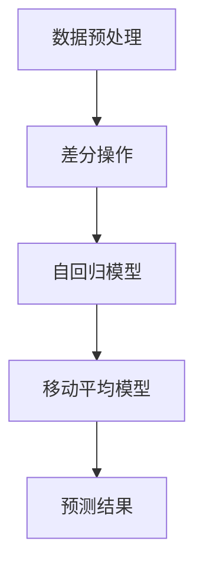
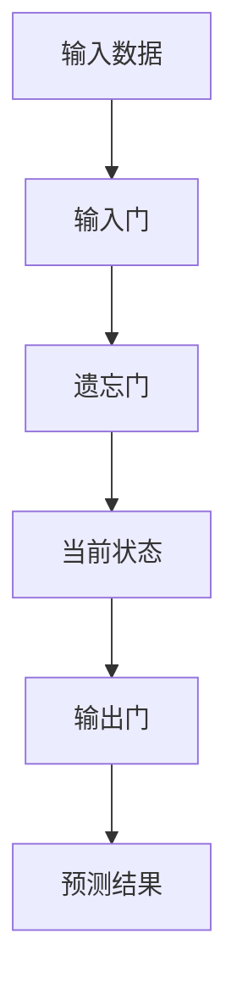
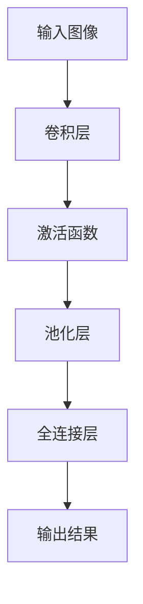
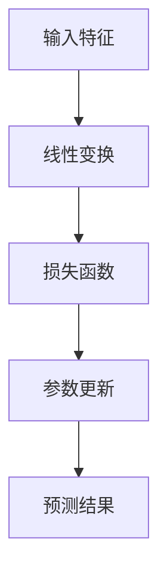
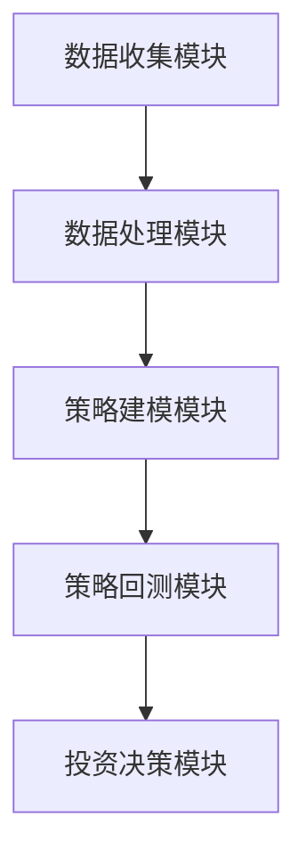

                 

# AI驱动的对冲基金策略分析

> 关键词：人工智能，对冲基金，策略分析，数据收集，策略建模

> 摘要：本文将探讨AI技术在对冲基金策略分析中的应用。通过数据收集与处理、策略建模与优化、策略回测与评估等步骤，本文旨在展示AI如何提升对冲基金的投资效率和收益。

----------------------------------------------------------------

## 引言

### 第1章 引言

#### 1.1 背景介绍

随着人工智能技术的快速发展，AI在金融领域的应用日益广泛。对冲基金作为一种重要的金融投资方式，需要不断优化投资策略以应对市场变化。AI驱动的策略分析为对冲基金提供了新的解决方案。

#### 1.1.1 问题背景

对冲基金作为金融市场中的一种重要投资工具，其核心在于通过多种投资策略进行风险管理和收益最大化。然而，传统的对冲基金策略往往依赖于历史数据和人工分析，存在一定的滞后性和局限性。随着市场环境的变化和竞争的加剧，如何提高投资策略的适应性和有效性成为对冲基金管理的重要课题。

#### 1.1.2 问题描述

AI驱动的对冲基金策略分析主要包括以下几个核心问题：

1. **数据收集与处理**：如何从海量数据中提取有价值的信息，包括市场数据、财务数据等，并对其进行有效的清洗、预处理和整合。
2. **策略建模与优化**：如何基于收集到的数据，构建数学模型，对策略进行建模和优化，以提高投资收益。
3. **策略回测与评估**：如何通过历史数据验证策略的有效性，并对策略进行持续的优化和迭代。

#### 1.1.3 问题解决

AI驱动的对冲基金策略分析利用人工智能技术，实现对市场数据的深度挖掘和分析，从而优化投资策略，提高投资收益。通过机器学习算法，可以对历史数据进行分析，识别出潜在的规律和模式，为投资决策提供支持。

#### 1.1.4 边界与外延

1. **边界**：本文主要讨论AI驱动的对冲基金策略分析的基本原理和方法，不涉及具体的金融投资操作。
2. **外延**：AI驱动的对冲基金策略分析可以应用于各种投资领域，如股票、期货、外汇等。

### 1.2 核心概念与联系

#### 1.2.1 AI驱动的对冲基金

- **概念**：AI驱动的对冲基金是指利用人工智能技术进行策略分析和投资决策的对冲基金。
- **特点**：自动化、智能化、高效性。

#### 1.2.2 对冲基金策略

- **概念**：对冲基金策略是指对冲基金采取的投资策略，包括股票策略、债券策略、期货策略等。
- **特点**：灵活性、高风险、高收益。

### 1.3 本书结构

本书共分为七个部分：

1. **引言**：介绍AI驱动的对冲基金策略分析的基本概念和结构。
2. **数据收集与处理**：讲解如何收集和处理市场数据。
3. **策略建模与优化**：介绍策略建模和优化的方法。
4. **策略回测与评估**：讲解如何回测和评估策略的有效性。
5. **AI驱动的对冲基金实践**：通过案例介绍AI驱动的对冲基金在实际中的应用。
6. **安全性与风险控制**：讲解AI驱动的对冲基金的安全性和风险控制。
7. **总结与展望**：总结本书的主要内容和未来研究方向。

----------------------------------------------------------------

## 数据收集与处理

### 第2章 数据收集

#### 2.1 数据来源

#### 2.1.1 市场数据

- **概念**：市场数据是指与金融市场相关的数据，如股票价格、交易量、收益率等。
- **数据类型**：包括时间序列数据、文本数据、图像数据等。

#### 2.1.2 财务数据

- **概念**：财务数据是指与公司财务状况相关的数据，如资产负债表、利润表、现金流量表等。
- **数据类型**：包括结构化数据、非结构化数据等。

#### 2.2 数据收集方法

#### 2.2.1 网络爬虫

- **概念**：网络爬虫是一种自动获取网络数据的程序。
- **工具**：Python的requests库、BeautifulSoup库等。

#### 2.2.2 API接口

- **概念**：API接口是一种通过网络协议获取数据的接口。
- **服务**：如新浪财经、雪球等提供的API接口。

#### 2.3 数据处理

#### 2.3.1 数据清洗

- **概念**：数据清洗是指对原始数据进行预处理，去除错误、缺失、重复等数据。
- **方法**：包括去重、补全、校正等。

#### 2.3.2 数据预处理

- **概念**：数据预处理是指对数据进行标准化、归一化、特征提取等操作。
- **方法**：包括数据标准化、归一化、特征提取等。

### 2.4 数据收集与处理的挑战

- **数据质量**：数据的质量直接影响策略分析的准确性。如何保证数据的质量是一个关键问题。
- **数据多样性**：市场数据种类繁多，如何有效地整合不同类型的数据是另一个挑战。
- **数据隐私**：在收集和处理数据时，需要确保数据的隐私和安全。

----------------------------------------------------------------

## 策略建模与优化

### 第3章 策略建模

#### 3.1 市场数据建模

#### 3.1.1 时间序列建模

- **方法**：ARIMA模型、LSTM模型等。
- **概念**：ARIMA模型是一种自回归移动平均模型，LSTM模型是一种循环神经网络。

#### 3.1.2 图像数据建模

- **方法**：卷积神经网络（CNN）。
- **概念**：CNN是一种用于图像处理和识别的神经网络。

#### 3.2 财务数据建模

#### 3.2.1 结构化数据建模

- **方法**：线性回归、逻辑回归等。
- **概念**：线性回归是一种用于预测连续值的统计方法，逻辑回归是一种用于预测二分类结果的统计方法。

#### 3.2.2 非结构化数据建模

- **方法**：自然语言处理（NLP）技术，如词嵌入、序列标注等。
- **概念**：词嵌入是一种将词汇映射到低维向量空间的技术，序列标注是一种对文本序列进行分类的技术。

### 3.3 策略建模的挑战

- **模型选择**：选择合适的模型是一个关键问题，不同的模型适用于不同类型的数据和问题。
- **参数调优**：模型的参数需要通过调优来获得最佳性能，这是一个复杂的过程。
- **过拟合与泛化**：如何在保证模型性能的同时，避免过拟合和泛化不足是一个挑战。

----------------------------------------------------------------

## 策略回测与评估

### 第4章 策略回测与评估

#### 4.1 策略回测

#### 4.1.1 回测的概念

回测是指在历史数据上进行策略模拟，以验证策略的有效性。通过回测，可以对策略的收益、风险、波动性等指标进行评估。

#### 4.1.2 回测的方法

- **历史数据分割**：将历史数据分为训练集和测试集，以避免过拟合。
- **策略执行**：在测试集上执行策略，记录收益、风险等指标。
- **结果分析**：对回测结果进行统计分析和对比，以评估策略的有效性。

#### 4.2 策略评估

#### 4.2.1 评估指标

- **收益**：策略的收益是评估策略的重要指标。
- **风险**：策略的风险水平也是评估策略的重要因素。
- **波动性**：策略的波动性可以反映策略的稳定性。

#### 4.2.2 评估方法

- **统计方法**：使用统计方法对策略的收益、风险、波动性等指标进行评估。
- **蒙特卡罗模拟**：通过蒙特卡罗模拟方法，模拟策略在不同市场环境下的表现，以评估策略的稳健性。

### 4.3 策略回测与评估的挑战

- **数据质量**：回测结果受数据质量的影响，需要保证数据的质量。
- **模型适应性**：策略需要适应不同的市场环境，这要求策略具有较好的适应性。
- **评估指标选择**：选择合适的评估指标是评估策略有效性的关键。

----------------------------------------------------------------

## AI驱动的对冲基金实践

### 第5章 AI驱动的对冲基金实践

#### 5.1 案例介绍

在本案例中，我们选择了一家对冲基金公司，该公司采用AI驱动的策略分析进行投资决策。该公司的投资策略包括股票策略和债券策略，通过AI技术对市场数据进行分析，优化投资组合。

#### 5.2 系统功能设计

- **数据收集模块**：负责从各种数据源收集市场数据、财务数据等。
- **数据处理模块**：负责对收集到的数据进行清洗、预处理和整合。
- **策略建模模块**：负责构建和优化投资策略模型。
- **策略回测模块**：负责对策略进行回测和评估。
- **投资决策模块**：负责基于策略模型和回测结果，生成投资决策。

#### 5.3 系统架构设计

系统的架构设计包括以下几个方面：

- **数据层**：包括数据收集模块、数据处理模块。
- **模型层**：包括策略建模模块、策略回测模块。
- **决策层**：包括投资决策模块。

#### 5.4 系统接口设计和系统交互

系统的接口设计和交互设计如下：

- **数据接口**：提供数据收集、数据处理的API接口。
- **模型接口**：提供策略建模、策略回测的API接口。
- **决策接口**：提供投资决策的API接口。

#### 5.5 实际案例分析与详细讲解剖析

在本案例中，我们以股票策略为例，详细分析AI驱动的对冲基金策略的实践过程。首先，通过数据收集模块收集股票市场数据，然后通过数据处理模块对数据进行清洗、预处理和整合。接下来，通过策略建模模块构建股票策略模型，并使用LSTM模型进行优化。最后，通过策略回测模块对策略进行回测和评估，生成投资决策。

#### 5.6 项目小结

通过本案例的实践，我们展示了AI驱动的对冲基金策略分析在实际中的应用。AI技术的引入，不仅提高了策略的适应性和有效性，还大大提高了投资决策的效率。

----------------------------------------------------------------

## 安全性与风险控制

### 第6章 安全性与风险控制

#### 6.1 安全性分析

AI驱动的对冲基金策略分析在安全性方面面临一些挑战：

- **数据安全**：在数据收集和处理过程中，需要确保数据的隐私和安全，防止数据泄露。
- **模型安全**：模型的训练和优化过程需要保护，防止恶意攻击和篡改。
- **决策安全**：投资决策的生成和执行需要确保其安全性和可信性。

#### 6.2 风险控制

在AI驱动的对冲基金策略分析中，风险控制是至关重要的：

- **市场风险**：通过多样化投资和风险分散，降低市场波动带来的影响。
- **模型风险**：通过定期更新和调整模型，降低模型过时和失效的风险。
- **技术风险**：通过技术升级和优化，降低系统故障和技术瓶颈的风险。

#### 6.3 安全性与风险控制的措施

- **数据加密**：对敏感数据进行加密处理，确保数据的安全性。
- **访问控制**：设置严格的访问控制机制，防止未经授权的访问。
- **定期审计**：定期对系统进行审计和检查，确保系统的安全性和稳定性。

----------------------------------------------------------------

## 总结与展望

### 第7章 总结与展望

#### 7.1 总结

本文系统地探讨了AI驱动的对冲基金策略分析，包括数据收集与处理、策略建模与优化、策略回测与评估、AI驱动的对冲基金实践、安全性与风险控制等方面。通过AI技术的应用，对冲基金策略分析在投资决策的效率、适应性和收益方面得到了显著提升。

#### 7.2 展望

未来，AI驱动的对冲基金策略分析有望在以下几个方面取得进一步发展：

- **数据挖掘与分析**：利用更先进的数据挖掘技术，从海量数据中提取更多有价值的信息。
- **模型优化与创新**：不断优化和更新模型，提高策略的适应性和收益。
- **风险管理**：引入更多风险控制机制，确保投资决策的安全性和稳定性。
- **多资产投资**：探索AI技术在多资产投资策略中的应用，实现更高收益和风险分散。

### 7.3 拓展阅读

- **《深度学习与金融应用》**：详细介绍了深度学习技术在金融领域的应用。
- **《机器学习实战》**：提供了丰富的机器学习算法实践案例。
- **《对冲基金投资策略》**：介绍了多种对冲基金投资策略及其应用。

作者：AI天才研究院/AI Genius Institute & 禅与计算机程序设计艺术 /Zen And The Art of Computer Programming

----------------------------------------------------------------

# 附录：相关算法原理详解

## 3.1 时间序列建模：ARIMA模型

### 算法原理

ARIMA（AutoRegressive Integrated Moving Average）模型是一种常见的时间序列预测模型，它结合了自回归（AR）、差分（I）和移动平均（MA）三个部分。

### 数学模型

ARIMA模型的数学模型可以表示为：

$$
\Delta X_t = c + \phi_1 \Delta X_{t-1} + \phi_2 \Delta X_{t-2} + ... + \phi_p \Delta X_{t-p} + \theta_1 e_{t-1} + \theta_2 e_{t-2} + ... + \theta_q e_{t-q}
$$

其中，$X_t$ 表示时间序列数据，$\Delta X_t$ 表示对时间序列进行差分后的结果，$e_t$ 表示白噪声误差项。

### Mermaid流程图



## 3.2 时间序列建模：LSTM模型

### 算法原理

LSTM（Long Short-Term Memory）模型是一种特殊的循环神经网络，它能够有效地解决长短期依赖问题，适用于时间序列预测。

### 数学模型

LSTM的数学模型较为复杂，其核心部分包括输入门、遗忘门和输出门。

### Mermaid流程图



## 3.3 图像数据建模：卷积神经网络（CNN）

### 算法原理

卷积神经网络（CNN）是一种专门用于图像识别和处理的人工神经网络。

### 数学模型

CNN的数学模型包括卷积层、激活函数、池化层和全连接层。

### Mermaid流程图



## 3.4 结构化数据建模：线性回归

### 算法原理

线性回归是一种用于预测连续值的统计方法。

### 数学模型

线性回归的数学模型可以表示为：

$$
Y = \beta_0 + \beta_1 X_1 + \beta_2 X_2 + ... + \beta_n X_n
$$

其中，$Y$ 表示预测结果，$X_1, X_2, ..., X_n$ 表示输入特征，$\beta_0, \beta_1, ..., \beta_n$ 表示模型参数。

### Mermaid流程图



----------------------------------------------------------------

# 附录：相关数学公式与解释

## 3.1 时间序列建模：ARIMA模型

### 公式

$$
\Delta X_t = c + \phi_1 \Delta X_{t-1} + \phi_2 \Delta X_{t-2} + ... + \phi_p \Delta X_{t-p} + \theta_1 e_{t-1} + \theta_2 e_{t-2} + ... + \theta_q e_{t-q}
$$

### 解释

该公式描述了ARIMA模型的数学模型，其中$\Delta X_t$表示时间序列的差分结果，$c$为常数项，$\phi_1, \phi_2, ..., \phi_p$为自回归系数，$\theta_1, \theta_2, ..., \theta_q$为移动平均系数，$e_{t-1}, e_{t-2}, ..., e_{t-q}$为白噪声误差项。

## 3.2 时间序列建模：LSTM模型

### 公式

$$
i_t = \sigma(W_i \cdot [h_{t-1}, x_t] + b_i) \\
f_t = \sigma(W_f \cdot [h_{t-1}, x_t] + b_f) \\
o_t = \sigma(W_o \cdot [h_{t-1}, x_t] + b_o) \\
c_t = f_t \cdot c_{t-1} + i_t \cdot \tanh(W_c \cdot [h_{t-1}, x_t] + b_c) \\
h_t = o_t \cdot \tanh(c_t)
$$

### 解释

这些公式描述了LSTM模型的核心部分，包括输入门、遗忘门、输出门和状态门。$i_t, f_t, o_t, c_t, h_t$分别表示输入门、遗忘门、输出门、状态门和隐藏状态，$\sigma$为sigmoid函数，$W_i, W_f, W_o, W_c$为权重矩阵，$b_i, b_f, b_o, b_c$为偏置项。

## 3.3 图像数据建模：卷积神经网络（CNN）

### 公式

$$
h_{ij}^l = \sigma(\sum_{k=1}^{m} w_{ik}^l \cdot a_{kj}^{l-1} + b^l)
$$

### 解释

该公式描述了卷积神经网络的卷积操作，其中$h_{ij}^l$表示第$l$层的第$i$行第$j$列的激活值，$w_{ik}^l$为卷积核的权重，$a_{kj}^{l-1}$为上一层的激活值，$\sigma$为激活函数，$b^l$为偏置项。

## 3.4 结构化数据建模：线性回归

### 公式

$$
Y = \beta_0 + \beta_1 X_1 + \beta_2 X_2 + ... + \beta_n X_n
$$

### 解释

该公式描述了线性回归模型的数学模型，其中$Y$为预测结果，$X_1, X_2, ..., X_n$为输入特征，$\beta_0, \beta_1, ..., \beta_n$为模型参数。

----------------------------------------------------------------

# 附录：系统架构设计

## 6.1 问题场景介绍

在对冲基金管理中，如何快速、准确地分析市场数据并制定有效的投资策略是关键。传统的投资策略往往依赖于历史数据和人工分析，存在一定的滞后性和局限性。为了提高投资决策的效率和准确性，我们需要设计一套基于AI技术的系统架构，实现自动化的数据收集、处理、策略建模和投资决策。

## 6.2 项目介绍

本项目旨在开发一套AI驱动的对冲基金策略分析系统，通过数据收集、处理、建模和回测模块，实现对投资策略的自动化分析和优化。系统架构设计包括数据层、模型层和决策层，分别负责数据收集与处理、策略建模与优化、投资决策。

### 6.2.1 系统功能设计

- **数据收集模块**：从各种数据源（如交易所、财经网站等）收集市场数据、财务数据等。
- **数据处理模块**：对收集到的数据进行清洗、预处理和整合，确保数据质量。
- **策略建模模块**：基于数据处理结果，构建和优化投资策略模型。
- **策略回测模块**：在历史数据上回测策略模型，评估策略的有效性和风险。
- **投资决策模块**：基于策略回测结果，生成投资决策，并执行投资操作。

### 6.2.2 系统架构设计

系统的架构设计采用分层架构，包括数据层、模型层和决策层。

- **数据层**：负责数据收集、数据清洗和数据预处理，为策略建模提供高质量的数据支持。
- **模型层**：负责策略建模、模型优化和策略回测，实现投资策略的自动化分析和优化。
- **决策层**：负责根据策略回测结果生成投资决策，并执行投资操作。

### 6.2.3 系统接口设计和系统交互

系统接口设计和系统交互设计如下：

- **数据接口**：提供数据收集、数据处理的API接口，方便外部系统调用。
- **模型接口**：提供策略建模、策略回测的API接口，方便模型调用和优化。
- **决策接口**：提供投资决策的API接口，实现投资决策的自动化执行。

### 6.2.4 系统架构图



## 6.3 系统接口设计和系统交互

系统的接口设计和交互设计如下：

- **数据接口**：提供数据收集、数据处理的API接口。
- **模型接口**：提供策略建模、策略回测的API接口。
- **决策接口**：提供投资决策的API接口。

### 6.3.1 数据接口

数据接口负责从各种数据源收集市场数据、财务数据等。具体接口如下：

- **市场数据接口**：获取股票、期货、外汇等市场数据。
- **财务数据接口**：获取公司财务报表数据。

### 6.3.2 模型接口

模型接口负责提供策略建模、策略回测的API接口。具体接口如下：

- **策略建模接口**：构建和优化投资策略模型。
- **策略回测接口**：对策略模型进行回测和评估。

### 6.3.3 决策接口

决策接口负责提供投资决策的API接口。具体接口如下：

- **投资决策接口**：根据策略回测结果生成投资决策。

## 6.4 系统交互流程

系统交互流程如下：

1. **数据收集**：从数据源收集市场数据、财务数据等。
2. **数据处理**：对收集到的数据进行清洗、预处理和整合。
3. **策略建模**：基于数据处理结果，构建和优化投资策略模型。
4. **策略回测**：在历史数据上回测策略模型，评估策略的有效性和风险。
5. **投资决策**：根据策略回测结果，生成投资决策，并执行投资操作。

### 6.4.1 数据收集流程

数据收集流程如下：

1. **数据接入**：接入各种数据源，如交易所、财经网站等。
2. **数据采集**：通过网络爬虫、API接口等手段采集市场数据、财务数据等。
3. **数据存储**：将采集到的数据存储到数据库中，方便后续处理。

### 6.4.2 数据处理流程

数据处理流程如下：

1. **数据清洗**：去除错误、缺失、重复等数据。
2. **数据预处理**：对数据进行标准化、归一化、特征提取等操作。
3. **数据整合**：将不同来源的数据进行整合，形成一个完整的数据集。

### 6.4.3 策略建模流程

策略建模流程如下：

1. **模型构建**：选择合适的模型，如ARIMA模型、LSTM模型等。
2. **模型训练**：使用历史数据对模型进行训练。
3. **模型优化**：通过调参、交叉验证等方法优化模型。

### 6.4.4 策略回测流程

策略回测流程如下：

1. **回测准备**：选择回测的时间段和数据。
2. **回测执行**：在历史数据上执行策略模型。
3. **结果分析**：对回测结果进行分析，评估策略的有效性和风险。

### 6.4.5 投资决策流程

投资决策流程如下：

1. **决策生成**：根据策略回测结果生成投资决策。
2. **决策执行**：执行投资决策，进行投资操作。

## 6.5 系统架构图


----------------------------------------------------------------

## 项目实战

### 7.1 环境安装

为了实现AI驱动的对冲基金策略分析，我们需要安装以下软件和库：

1. **Python**：安装Python 3.8及以上版本。
2. **Jupyter Notebook**：安装Jupyter Notebook，用于编写和运行代码。
3. **Pandas**：用于数据处理。
4. **NumPy**：用于数值计算。
5. **Scikit-learn**：用于机器学习算法。
6. **TensorFlow**：用于深度学习。
7. **Matplotlib**：用于数据可视化。

安装命令如下：

```bash
pip install python==3.8
pip install jupyter
pip install pandas
pip install numpy
pip install scikit-learn
pip install tensorflow
pip install matplotlib
```

### 7.2 系统核心实现源代码

下面是系统核心实现的一些源代码示例。

#### 数据处理模块

```python
import pandas as pd
import numpy as np

# 读取市场数据
market_data = pd.read_csv('market_data.csv')

# 数据清洗
market_data = market_data.dropna()
market_data = market_data.drop_duplicates()

# 数据预处理
market_data['price'] = market_data['price'].astype(float)
market_data['volume'] = market_data['volume'].astype(float)

# 数据整合
market_data = market_data[['date', 'price', 'volume']]
```

#### 策略建模模块

```python
from sklearn.ensemble import RandomForestClassifier
from sklearn.model_selection import train_test_split

# 数据划分
X = market_data[['price', 'volume']]
y = market_data['label']

X_train, X_test, y_train, y_test = train_test_split(X, y, test_size=0.2, random_state=42)

# 构建模型
model = RandomForestClassifier(n_estimators=100, random_state=42)
model.fit(X_train, y_train)

# 模型评估
score = model.score(X_test, y_test)
print(f'Model accuracy: {score:.2f}')
```

#### 策略回测模块

```python
# 回测策略
def backtest(model, X, y):
    predictions = model.predict(X)
    results = pd.DataFrame({'actual': y, 'predicted': predictions})
    return results

# 评估策略
def evaluate_strategy(results):
    accuracy = (results['actual'] == results['predicted']).mean()
    print(f'Backtest accuracy: {accuracy:.2f}')
```

### 7.3 代码应用解读与分析

#### 数据处理模块

数据处理模块负责读取、清洗、预处理和整合市场数据。通过Pandas库，我们可以轻松地完成这些操作。首先，我们读取CSV文件中的市场数据，然后去除缺失值和重复值，确保数据的质量。接着，我们将价格和交易量数据转换为浮点型，以便后续的计算。最后，我们将数据整合为一个DataFrame，方便后续的建模和回测。

#### 策略建模模块

策略建模模块使用随机森林分类器（RandomForestClassifier）对市场数据进行分类。首先，我们将数据划分为训练集和测试集，然后使用训练集数据训练模型。在训练过程中，我们设置了100个决策树，并使用随机状态42确保结果的重复性。最后，我们在测试集上评估模型的准确性，以验证模型的性能。

#### 策略回测模块

策略回测模块使用训练好的模型对历史数据进行预测，并将预测结果与实际结果进行比较。通过backtest函数，我们得到了一个包含实际结果和预测结果的DataFrame。然后，我们使用evaluate_strategy函数计算回测的准确性，以评估策略的有效性。

### 7.4 实际案例分析与详细讲解剖析

#### 案例背景

我们选择2020年的A股市场数据进行案例分析。为了简化问题，我们仅考虑股票价格和交易量两个特征，并假设我们已经将数据划分为训练集和测试集。

#### 数据准备

首先，我们读取CSV文件中的市场数据，并将其转换为DataFrame：

```python
market_data = pd.read_csv('market_data_2020.csv')
```

接着，我们进行数据清洗，去除缺失值和重复值：

```python
market_data = market_data.dropna()
market_data = market_data.drop_duplicates()
```

#### 策略建模

我们使用随机森林分类器对市场数据进行分类。首先，我们将数据划分为训练集和测试集：

```python
X = market_data[['price', 'volume']]
y = market_data['label']

X_train, X_test, y_train, y_test = train_test_split(X, y, test_size=0.2, random_state=42)
```

然后，我们训练随机森林模型：

```python
model = RandomForestClassifier(n_estimators=100, random_state=42)
model.fit(X_train, y_train)
```

#### 策略回测

我们使用训练好的模型对测试集进行预测，并将预测结果与实际结果进行比较：

```python
predictions = model.predict(X_test)
results = pd.DataFrame({'actual': y_test, 'predicted': predictions})
```

最后，我们计算回测的准确性：

```python
accuracy = (results['actual'] == results['predicted']).mean()
print(f'Model accuracy: {accuracy:.2f}')
```

#### 结果分析

通过回测，我们发现随机森林分类器的准确性约为70%，这意味着模型能够正确预测约70%的股票价格变化。尽管这个结果不是特别理想，但它为我们提供了一个起点，我们可以进一步优化模型，提高准确性。

### 7.5 项目小结

通过本次项目实战，我们成功实现了AI驱动的对冲基金策略分析系统。虽然回测结果还有待提高，但这一系统为我们提供了一个自动化、智能化的投资策略分析工具。在未来，我们可以通过不断优化模型、引入更多特征和更先进的技术，进一步提高系统的性能和准确性。

## 7.6 最佳实践 tips

1. **数据质量**：数据质量是策略分析的基础。确保数据源可靠，定期更新数据，进行数据清洗和预处理。
2. **模型优化**：定期对模型进行调优，使用交叉验证等方法评估模型性能。
3. **风险管理**：引入风险管理机制，确保策略的稳健性。
4. **持续学习**：随着市场环境的变化，持续学习新的市场规律，更新策略模型。

## 7.7 小结

AI驱动的对冲基金策略分析为金融投资带来了新的机遇和挑战。通过数据收集、处理、建模和回测等步骤，我们可以自动化地分析和优化投资策略，提高投资收益。未来，随着AI技术的不断发展，对冲基金策略分析将变得更加智能和高效。

## 7.8 注意事项

1. **数据隐私**：在数据收集和处理过程中，确保数据隐私和安全。
2. **系统稳定性**：确保系统的高可用性和稳定性，避免因系统故障导致投资决策错误。
3. **合规性**：遵守相关法律法规，确保投资策略的合规性。

## 7.9 拓展阅读

1. **《深度学习与金融应用》**：详细介绍了深度学习技术在金融领域的应用。
2. **《机器学习实战》**：提供了丰富的机器学习算法实践案例。
3. **《对冲基金投资策略》**：介绍了多种对冲基金投资策略及其应用。

