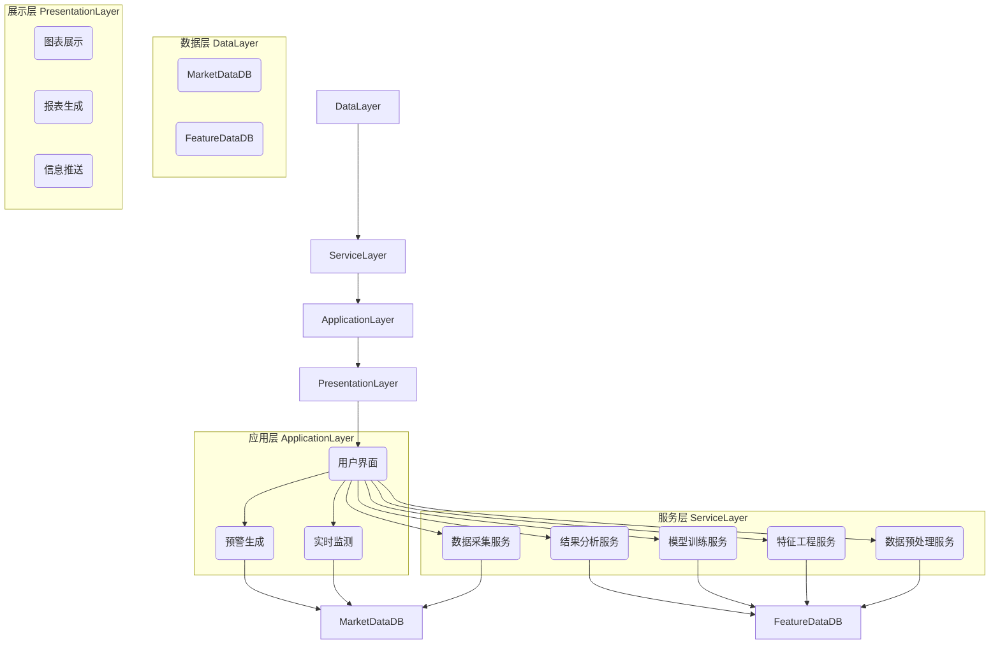
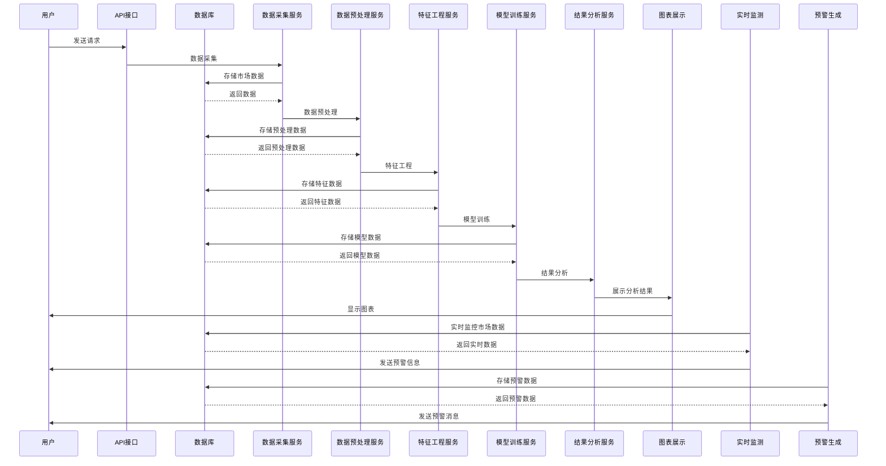

                 

### 1.1 问题背景

#### 1.1.1 AI与市场微观结构

##### 1.1.1.1 AI技术的发展与应用

人工智能（AI）技术的发展，尤其是机器学习和深度学习的崛起，已经深刻改变了各行各业。从图像识别、自然语言处理到自动驾驶和智能推荐系统，AI技术的应用无处不在。在这些应用中，AI不仅提高了效率，还优化了决策过程。

AI对市场微观结构的影响尤为显著。市场微观结构指的是金融市场中单个交易单元的行为模式，包括交易价格、交易量、买卖双方的行为等。传统的市场微观结构分析依赖于统计分析方法和经济学模型，这些方法在一定程度上能够揭示市场规律，但往往无法捕捉到复杂市场中的非线性和动态性。

随着AI技术的发展，特别是大数据和实时数据处理能力的提升，AI开始应用于市场微观结构分析中。通过机器学习算法，可以从海量历史数据中提取出隐藏的模式，并通过实时数据流处理，对市场行为进行实时分析和预测。这不仅提高了分析的准确性和时效性，也为金融市场参与者的决策提供了有力的支持。

##### 1.1.1.2 AI技术如何影响市场微观结构

AI技术对市场微观结构的影响主要体现在以下几个方面：

1. **增强预测能力**：机器学习算法能够处理海量数据，并通过历史数据训练模型，预测市场动态。这些预测可以帮助投资者更好地把握市场趋势，优化投资策略。

2. **提高交易效率**：AI可以实时分析市场数据，快速识别交易机会，并执行交易。这有助于提高交易效率和减少人为错误。

3. **风险控制**：通过分析历史数据和实时数据，AI可以识别潜在的市场风险，并提供风险控制策略，帮助投资者降低损失。

4. **市场透明度**：AI技术可以处理和分析非结构化数据，提高市场的透明度。这有助于监管部门更好地监管市场，维护市场秩序。

#### 1.1.1.3 AI与市场微观结构的关系

AI与市场微观结构之间存在着密切的联系。市场微观结构是AI分析的对象，而AI技术则为市场微观结构分析提供了新的工具和方法。具体来说，这种关系可以从以下几个方面理解：

1. **数据驱动**：市场微观结构分析依赖于大量数据，AI技术能够处理和分析这些数据，从而提供更为准确和及时的分析结果。

2. **算法优化**：AI算法能够通过不断学习和优化，提高市场微观结构分析的精度和效率。

3. **交互反馈**：市场参与者的行为会影响市场微观结构，而AI分析结果又会影响市场参与者的决策。这种交互反馈机制进一步增强了AI在市场微观结构分析中的应用价值。

#### 1.1.1.4 AI驱动的市场微观结构影响分析的重要性

AI驱动的市场微观结构影响分析具有重要的研究意义和实际应用价值：

1. **为企业提供决策支持**：通过对市场微观结构的深入分析，企业可以优化投资策略，提高市场竞争力。

2. **促进金融市场发展**：AI技术可以提高市场的透明度和稳定性，促进金融市场的健康发展。

3. **提升监管能力**：AI驱动的市场微观结构分析可以帮助监管部门更好地监测和监管市场，维护市场秩序。

总之，AI技术的应用为市场微观结构分析带来了革命性的变化。通过深入分析AI技术如何影响市场微观结构，我们可以更好地理解市场的运行机制，并为市场参与者提供更加有效的决策支持。

---

### 1.2 问题描述

#### 1.2.1 市场微观结构的主要问题

市场微观结构是金融市场分析的重要组成部分，但它面临着一系列挑战和问题。这些问题不仅影响了市场的透明度，也限制了市场效率。以下是市场微观结构面临的主要问题：

##### 1.2.1.1 数据质量问题

**1.2.1.1.1 数据缺失**

市场微观结构分析依赖于大量的数据，包括交易价格、交易量、买卖双方的报价等。然而，实际中常常出现数据缺失的情况，这可能导致分析结果的偏差。数据缺失可能是由于技术问题、记录错误或人为疏忽导致的。

**1.2.1.1.2 数据不一致**

在市场数据中，数据不一致也是一个常见问题。不同来源的数据可能在格式、单位和精度上存在差异，这给数据整合和分析带来了困难。例如，不同交易所的价格数据可能在精度和频率上有显著差异，这需要特别的处理方法。

##### 1.2.1.2 分析方法问题

**1.2.1.2.1 传统方法局限性**

传统的市场微观结构分析方法主要依赖于统计学和经济学模型，这些方法在处理复杂和非线性市场行为时存在局限性。例如，线性回归模型无法捕捉市场中的非线性关系，时间序列分析方法对突发性事件响应不足。

**1.2.1.2.2 新方法应用挑战**

尽管AI技术为市场微观结构分析提供了新的工具和方法，但其实际应用仍然面临挑战。首先，AI模型需要大量高质量的数据进行训练，而市场数据往往复杂且不完整。其次，AI模型的选择和优化过程复杂，需要专业人员具备深厚的数学和计算机科学背景。

#### 1.2.2 AI驱动的市场微观结构影响分析的研究意义

**1.2.2.1 为企业提供决策支持**

AI驱动的市场微观结构影响分析可以为企业管理层提供精准的市场数据分析和预测结果。通过分析市场微观结构，企业可以优化其投资策略，更好地应对市场变化，提高市场竞争力。

**1.2.2.1.1 优化投资策略**

企业可以利用AI分析结果，识别潜在的投资机会，调整投资组合，降低风险，提高回报。例如，通过分析市场微观结构，企业可以发现某些特定股票的潜在波动性，从而决定是否进行投资。

**1.2.2.1.2 改进市场营销策略**

AI技术可以帮助企业了解市场需求和消费者行为，从而改进市场营销策略。例如，通过分析交易数据和消费者行为数据，企业可以优化广告投放策略，提高广告效果。

**1.2.2.2 促进金融市场发展**

AI驱动的市场微观结构影响分析不仅对单个企业有益，也对整个金融市场的发展具有重要意义。

**1.2.2.2.1 提高市场透明度**

AI技术可以处理和分析大量非结构化数据，提高市场的透明度。这有助于监管部门更好地监测市场行为，及时发现和防止市场操纵行为，维护市场秩序。

**1.2.2.2.2 促进市场稳定**

通过实时分析和预测市场动态，AI技术可以帮助市场参与者更好地应对市场波动，降低系统性风险，促进市场稳定。

总之，AI驱动的市场微观结构影响分析为市场参与者提供了强大的决策支持工具，有助于提高市场效率和稳定性，推动金融市场的健康发展。

---

### 1.3 问题解决

#### 1.3.1 AI技术在市场微观结构分析中的应用

随着AI技术的不断发展，它在市场微观结构分析中的应用也越来越广泛。以下是AI技术在市场微观结构分析中应用的主要方面：

##### 1.3.1.1 数据清洗与预处理

**1.3.1.1.1 数据清洗方法**

数据清洗是市场微观结构分析的重要步骤，它涉及到处理数据缺失、数据不一致和数据质量差等问题。常用的数据清洗方法包括：

- **缺失数据处理**：对于缺失的数据，可以采用插值法、平均值填补法或使用模型预测来填补。
- **异常值处理**：通过统计学方法或机器学习算法识别并处理异常值，如使用Z-score法、IQR法等。
- **重复数据处理**：识别和删除重复的数据记录，确保数据的唯一性。

**1.3.1.1.2 数据预处理流程**

数据预处理流程包括数据集成、数据转换和数据归一化等步骤。具体流程如下：

- **数据集成**：将来自不同来源的数据进行整合，确保数据的一致性和完整性。
- **数据转换**：将不同类型的数据转换为统一的格式，如将字符串数据转换为数值数据。
- **数据归一化**：通过标准化或归一化方法，将不同特征的数据范围统一到相同的尺度，以便后续的分析。

##### 1.3.1.2 机器学习方法

**1.3.1.2.1 机器学习基本原理**

机器学习是AI技术的一个重要分支，它通过算法从数据中学习规律和模式，从而实现自动化的预测和决策。机器学习的基本原理包括：

- **特征工程**：选择和提取对目标变量有影响的特征，以便更好地描述数据。
- **模型训练**：使用训练数据集对机器学习模型进行训练，使其学习数据的规律。
- **模型评估**：使用测试数据集评估模型的性能，通过指标如准确率、召回率、F1分数等来衡量模型的优劣。

**1.3.1.2.2 常用机器学习算法介绍**

在市场微观结构分析中，常用的机器学习算法包括：

- **线性回归**：通过建立线性关系模型，预测连续目标变量。
- **决策树**：通过树形结构进行分类和回归分析，能够可视化决策过程。
- **随机森林**：基于决策树构建多个模型，并通过集成方法提高预测性能。
- **支持向量机（SVM）**：通过找到一个最优的超平面，将数据分为不同的类别。
- **神经网络**：通过多层神经网络结构模拟人脑神经元的工作方式，能够处理复杂的非线性问题。

##### 1.3.1.3 AI驱动的市场微观结构分析流程

**1.3.1.3.1 数据采集与清洗**

数据采集是市场微观结构分析的第一步，需要从多个数据源收集交易数据、报价数据等。然后，通过数据清洗方法处理数据，确保数据的质量和一致性。

**1.3.1.3.2 特征工程**

特征工程是数据预处理的关键步骤，通过选择和提取对市场行为有显著影响的特征，如交易价格、交易量、买卖双方报价等。特征工程的质量直接影响模型的预测性能。

**1.3.1.3.3 模型训练与优化**

在特征工程完成后，选择合适的机器学习算法对模型进行训练。训练过程中，通过调整模型的参数，优化模型的性能。常用的优化方法包括交叉验证、网格搜索等。

**1.3.1.3.4 模型评估与部署**

通过测试数据集评估模型的性能，选择最优模型进行部署。在实际应用中，模型需要不断进行更新和优化，以适应市场环境的变化。

##### 1.3.1.4 AI驱动的市场微观结构分析的优势

**1.3.1.4.1 提高分析准确性**

AI技术能够处理大量复杂的数据，通过机器学习算法提取隐藏的模式和规律，从而提高市场微观结构分析的准确性。

**1.3.1.4.2 实时分析能力**

AI技术可以实时处理和分析市场数据，快速响应市场变化，提供及时的分析结果，为市场参与者提供决策支持。

**1.3.1.4.3 风险管理能力**

通过分析市场数据，AI技术可以帮助市场参与者识别潜在的风险，并提供相应的风险管理策略，降低市场风险。

**1.3.1.4.4 个性化服务**

AI技术可以根据每个市场参与者的需求和偏好，提供个性化的分析和预测结果，满足不同用户的需求。

总之，AI技术在市场微观结构分析中的应用为市场参与者提供了强大的分析工具和决策支持，有助于提高市场效率和稳定性。通过AI技术的不断发展和优化，市场微观结构分析将更加精确和智能化。

---

### 1.4 边界与外延

#### 1.4.1 研究范围

**1.4.1.1 数据来源**

在研究AI驱动的市场微观结构影响分析时，数据来源的选择至关重要。常用的数据来源包括：

- **交易所数据**：从各个交易所获取的交易数据，包括交易价格、交易量、买卖双方报价等。
- **公开数据集**：如Yahoo Finance、Google Finance等提供的公开金融数据集。
- **社交媒体数据**：从社交媒体平台获取的与金融市场相关的用户评论、帖子等非结构化数据。

**1.4.1.2 数据来源可靠性评估**

在评估数据来源的可靠性时，需要考虑以下几个方面：

- **数据完整性**：确保数据覆盖全面，没有大量缺失值。
- **数据准确性**：数据应尽可能真实准确，避免人为错误或数据篡改。
- **数据时效性**：对于市场微观结构分析，需要实时或近实时的数据，以保证分析结果的及时性。

**1.4.1.3 研究方法**

在研究AI驱动的市场微观结构影响分析时，采用定量研究和定性研究相结合的方法。

- **定量研究方法**：通过数据分析和机器学习算法，对市场微观结构进行定量分析，提取隐藏的模式和规律。
- **定性研究方法**：通过访谈、调查等方法，了解市场参与者的行为和决策过程，为定量研究提供背景信息和补充。

#### 1.4.2 研究限制

**1.4.2.1 数据限制**

在AI驱动的市场微观结构分析中，数据限制是一个重要的问题。首先，市场数据通常是海量的，且包含大量的噪声和不完整信息。其次，数据获取可能受到法律法规和隐私保护的限制。因此，在数据收集和处理过程中，需要采取适当的数据清洗和预处理方法，提高数据的可靠性和准确性。

**1.4.2.2 算法限制**

虽然AI技术在市场微观结构分析中具有显著优势，但算法也存在一定的局限性。例如：

- **模型可解释性**：深度学习模型往往具有较好的预测性能，但其内部决策过程复杂，缺乏可解释性。
- **过拟合风险**：在训练过程中，模型可能会过度拟合训练数据，导致在测试数据上的性能下降。
- **计算资源要求**：一些高级算法如深度学习模型需要大量的计算资源和时间进行训练和推理。

**1.4.2.3 研究方法限制**

尽管定量研究和定性研究相结合的方法可以提高研究的全面性和准确性，但每种方法都有其局限性。例如：

- **定量研究方法**：可能无法全面捕捉市场参与者的行为和决策过程。
- **定性研究方法**：受限于样本量和主观性，可能无法代表整个市场的情况。

因此，在实际研究中，需要结合多种方法，综合分析市场微观结构的影响因素，以提高研究的可靠性和实用性。

#### 1.4.3 未来研究方向

未来，AI驱动的市场微观结构影响分析在以下几个方面有望取得进一步的发展：

- **数据质量和完整性**：随着数据采集和处理技术的进步，将进一步提高市场数据的可靠性和完整性。
- **算法优化与扩展**：深入研究新的机器学习算法和深度学习模型，提高模型的预测性能和可解释性。
- **跨领域应用**：将AI技术应用于其他金融领域，如风险管理、市场预测等，推动金融科技的全面发展。

总之，AI驱动的市场微观结构影响分析是一个充满挑战和机遇的研究领域，未来将不断推动金融市场的发展和创新。

---

### 1.5 本章小结

本文首先介绍了AI与市场微观结构的关系，探讨了AI技术在市场微观结构分析中的应用及其影响。接着，分析了市场微观结构面临的主要问题，包括数据质量问题和分析方法问题，并提出了AI驱动的解决方案。本文还讨论了研究范围、限制和未来研究方向，为后续研究提供了重要参考。通过本文的研究，我们可以看到AI技术在金融市场中的巨大潜力，有助于推动金融市场的透明度和稳定性，为市场参与者提供更有效的决策支持。未来，随着AI技术的不断进步，市场微观结构分析将更加精确和智能化，为金融市场的健康发展奠定坚实基础。作者：AI天才研究院/AI Genius Institute & 禅与计算机程序设计艺术 /Zen And The Art of Computer Programming

---

### 2.1 AI核心概念

#### 2.1.1 AI的定义

人工智能（Artificial Intelligence，简称AI）是指通过计算机程序和算法模拟人类智能行为的技术。AI的核心目标是使机器具备类似人类的感知、推理、学习和决策能力。根据美国计算机协会（ACM）的定义，人工智能是一个涵盖计算、认知科学、统计学和工程学等多个学科领域的交叉领域，旨在构建智能系统，实现机器的自主学习、自主决策和问题求解。

##### 2.1.1.1 AI的历史与发展

人工智能的历史可以追溯到20世纪50年代，当时计算机科学家首次提出了“人工智能”这一概念。早期的AI研究主要集中在符号主义方法上，即通过编程和逻辑推理来模拟人类智能。这一阶段取得了许多重要成果，如逻辑推理系统、自然语言处理系统等。

20世纪80年代，随着计算能力的提升和大数据的出现，机器学习开始兴起，AI研究进入了新的阶段。机器学习通过从数据中自动学习规律和模式，实现智能行为的模拟。这一阶段的重要突破包括决策树、支持向量机、神经网络等算法的提出和应用。

进入21世纪，深度学习成为了AI研究的热点。深度学习通过多层神经网络结构，从海量数据中自动提取特征，实现了在图像识别、语音识别、自然语言处理等领域的突破性进展。随着硬件性能的进一步提升，如GPU、TPU等专用计算设备的出现，深度学习算法的应用范围不断扩大，AI技术逐渐走向实用化和商业化。

##### 2.1.1.2 AI的现代发展

现代AI技术发展迅速，涵盖了多个子领域，包括：

- **机器学习（Machine Learning）**：通过从数据中学习规律和模式，实现智能行为的模拟。常见的机器学习算法有线性回归、决策树、支持向量机、神经网络等。
- **深度学习（Deep Learning）**：基于多层神经网络结构，从数据中自动提取特征，实现复杂任务的模拟。深度学习在图像识别、语音识别、自然语言处理等领域取得了显著的成果。
- **计算机视觉（Computer Vision）**：使计算机能够从图像或视频中提取信息，实现物体识别、图像分类、目标跟踪等功能。
- **自然语言处理（Natural Language Processing，NLP）**：使计算机能够理解和生成自然语言，实现语音识别、机器翻译、情感分析等功能。
- **机器人学（Robotics）**：通过编程和传感器技术，使机器人能够模拟人类行为，实现自动化任务。

现代AI技术的发展趋势包括：

- **硬件加速**：通过GPU、TPU等专用计算设备，提高AI算法的计算速度和性能。
- **数据驱动**：通过大量数据训练模型，提高AI系统的智能化水平和泛化能力。
- **跨学科融合**：与其他领域如生物学、心理学、认知科学等交叉融合，推动AI技术的发展和应用。
- **伦理和监管**：随着AI技术的广泛应用，伦理和监管问题日益凸显，需要建立相关规范和标准，确保AI技术的可持续发展。

#### 2.1.2 AI的组成部分

##### 2.1.2.1 算法

算法是AI的核心组成部分，决定了AI系统的智能水平。常见的AI算法包括：

- **监督学习算法**：通过已有标签数据进行训练，用于分类和回归任务。如线性回归、决策树、随机森林、支持向量机等。
- **无监督学习算法**：通过未标注的数据进行训练，用于聚类和降维任务。如K-means、主成分分析（PCA）、自编码器等。
- **强化学习算法**：通过与环境交互学习最优策略，用于决策和规划任务。如Q-learning、深度Q网络（DQN）、策略梯度算法等。
- **深度学习算法**：通过多层神经网络结构，从数据中自动提取特征，用于复杂任务的模拟。如卷积神经网络（CNN）、循环神经网络（RNN）、生成对抗网络（GAN）等。

##### 2.1.2.2 数据

数据是AI的基础，决定了AI系统的学习和预测能力。AI系统通常需要大量高质量的数据进行训练。数据来源包括：

- **公开数据集**：如Kaggle、UCI机器学习库等，提供各种领域的数据集，供研究人员和开发者使用。
- **私有数据集**：企业或机构收集的内部数据，用于特定的研究和应用。
- **实时数据流**：从传感器、物联网设备、社交媒体等获取的实时数据，用于动态分析和预测。

数据预处理是AI系统开发的重要步骤，包括数据清洗、数据集成、数据转换和数据归一化等。

##### 2.1.2.3 机器学习模型

机器学习模型是AI系统的核心组件，通过训练数据集学习数据中的模式和规律，实现智能行为的模拟。常见的机器学习模型包括：

- **线性模型**：如线性回归、逻辑回归等，用于模拟数据中的线性关系。
- **树模型**：如决策树、随机森林等，通过树形结构进行分类和回归分析。
- **神经网络**：如多层感知器（MLP）、卷积神经网络（CNN）、循环神经网络（RNN）等，通过多层神经网络结构模拟人脑神经元的工作方式。

##### 2.1.2.4 计算平台和工具

计算平台和工具是AI系统开发和部署的基础。常见的计算平台包括：

- **CPU**：传统的中央处理器，用于通用计算任务。
- **GPU**：图形处理器，具有强大的并行计算能力，适用于深度学习等任务。
- **TPU**：张量处理器，专门为AI计算设计，具有高效的矩阵运算能力。

常见的AI开发工具包括：

- **编程语言**：如Python、R、Julia等，提供丰富的库和框架，支持AI系统的开发。
- **机器学习框架**：如TensorFlow、PyTorch、Keras等，提供简化的API和高级功能，加速AI系统的开发。
- **数据预处理工具**：如Pandas、NumPy等，用于数据清洗、数据集成和数据转换。

#### 2.1.3 AI的应用领域

##### 2.1.3.1 人工智能在工业中的应用

在工业领域，人工智能技术得到了广泛应用，提高了生产效率、产品质量和安全性。

- **制造业**：AI技术在制造业中主要用于自动化生产、质量检测、故障预测等。例如，通过机器学习算法分析生产线数据，实现设备故障预测，提高设备利用率。
- **能源行业**：AI技术在能源行业用于智能电网管理、节能优化、设备维护等。例如，通过深度学习算法分析电网数据，实现负荷预测和电力调度优化。
- **农业**：AI技术在农业中用于作物种植优化、病虫害检测、农田监测等。例如，通过计算机视觉技术分析农田图像，实现作物健康监测和病虫害检测。

##### 2.1.3.2 人工智能在服务业中的应用

在服务业，人工智能技术也发挥了重要作用，提升了服务质量和用户体验。

- **金融行业**：AI技术在金融行业用于风险评估、欺诈检测、智能投顾等。例如，通过机器学习算法分析客户数据，实现风险控制和个性化投资建议。
- **医疗行业**：AI技术在医疗行业用于疾病诊断、医学影像分析、智能药物设计等。例如，通过深度学习算法分析医学影像，实现疾病早期检测和诊断。
- **教育行业**：AI技术在教育行业用于个性化学习、智能评测、教学辅助等。例如，通过自然语言处理技术分析学生作业，实现智能评分和个性化学习建议。

总之，人工智能技术的广泛应用，为各行业的发展带来了新的机遇和挑战。随着AI技术的不断进步，它将在更多领域发挥重要作用，推动社会经济的持续发展。

---

### 2.2 市场微观结构核心概念

市场微观结构是金融市场中研究单个交易单元行为的学科，它关注的是市场中的个体交易者、订单、价格变动和交易机制等方面。市场微观结构的研究有助于揭示市场动态和参与者行为，为投资者提供决策支持。以下是市场微观结构中的核心概念：

#### 2.2.1 市场微观结构的定义

市场微观结构（Market Microstructure）是指金融市场中的交易细节和交易机制。它包括交易价格、交易量、买卖双方的报价、交易速度、交易成本等多个方面。市场微观结构的研究旨在理解市场参与者如何互动，以及这些互动如何影响市场整体行为。

#### 2.2.2 市场微观结构的研究目标

市场微观结构的研究目标包括：

- **理解价格形成机制**：研究市场价格是如何形成的，买卖双方的报价是如何相互作用和决定的。
- **分析交易行为**：研究交易者的行为模式，如交易策略、交易频率和交易量等。
- **评估交易成本**：研究交易过程中的成本，包括交易费用、信息成本和流动性成本等。
- **分析市场效率和稳定性**：研究市场微观结构如何影响市场的效率和稳定性，以及市场在异常情况下的反应。

#### 2.2.3 市场微观结构的核心要素

市场微观结构的核心要素包括：

- **交易价格**：交易价格是市场微观结构中最直接的指标，它反映了买卖双方对资产的估值差异。
- **交易量**：交易量是指在一定时间内进行的交易数量，它反映了市场的活跃程度。
- **买卖双方的报价**：买卖双方的报价是市场交易的基础，它们决定了交易能否成功进行。
- **交易速度**：交易速度是指交易订单从提交到执行所需的时间，它反映了市场的流动性。
- **交易成本**：交易成本包括交易费用、信息成本和流动性成本等，它们影响了交易者的收益。
- **交易机制**：交易机制是指市场中用于组织交易的规则和流程，如拍卖机制、做市商机制和电子交易系统等。

#### 2.2.4 市场微观结构的作用

市场微观结构在金融市场中发挥着重要作用，具体体现在以下几个方面：

- **价格发现**：市场微观结构有助于发现市场的真实价格，通过买卖双方的报价和交易行为，市场价格逐渐趋于理性。
- **流动性提供**：市场微观结构中的交易者，尤其是做市商，通过提供流动性能降低交易成本，提高市场的效率。
- **风险分散**：市场微观结构有助于分散风险，通过多种交易策略和交易机制，市场参与者可以更好地管理风险。
- **市场监控**：市场微观结构为监管机构提供了监控市场的工具，有助于发现市场操纵行为和异常交易。

#### 2.2.5 市场微观结构与AI技术的联系

随着AI技术的发展，市场微观结构分析逐渐采用了机器学习和深度学习等技术。AI技术有助于：

- **数据处理和分析**：AI技术能够处理和分析大量的市场数据，提取有用的信息，帮助市场参与者做出更准确的决策。
- **异常检测**：AI技术可以检测市场中的异常交易行为，为监管机构提供预警。
- **预测市场动态**：通过机器学习算法，AI技术可以预测市场的未来走势，为投资者提供决策支持。

总之，市场微观结构是金融市场分析的重要组成部分，通过AI技术的应用，市场微观结构分析将更加准确和智能化，为市场参与者提供更有效的决策支持。

---

### 2.3 AI驱动的市场微观结构影响分析流程

#### 2.3.1 数据采集与清洗

数据采集是市场微观结构分析的第一步，确保获得全面和准确的数据至关重要。数据来源可以包括交易所公开的交易数据、社交媒体数据、市场研究报告等。以下是一个典型的数据采集流程：

1. **确定数据来源**：根据研究需求，选择合适的交易所（如纽约证券交易所、纳斯达克等）和市场数据提供商（如Bloomberg、Alpha Vantage等）。
2. **数据下载**：通过API接口或数据下载工具，从交易所和提供商获取历史交易数据、实时交易数据、订单簿数据等。
3. **数据格式转换**：将不同来源的数据转换为统一的格式，如CSV、JSON等，以便后续处理和分析。

数据清洗是确保数据质量的关键步骤，包括以下几个方面：

1. **缺失值处理**：对于缺失的数据，可以采用插值法、平均值填补法或使用模型预测来填补。
2. **异常值处理**：使用统计学方法（如Z-score、IQR法）识别和去除异常值。
3. **重复数据处理**：识别并删除重复的数据记录，确保数据的唯一性。

#### 2.3.2 特征工程

特征工程是数据预处理的核心步骤，通过选择和提取对目标变量有显著影响的特征，可以提高模型的预测性能。以下是一个特征工程的步骤：

1. **数据探索性分析**：使用可视化工具（如Matplotlib、Seaborn等）对数据进行初步分析，识别数据中的趋势、异常和相关性。
2. **特征选择**：根据数据探索性分析的结果，选择对目标变量有显著影响的特征。常用的特征选择方法包括过滤式特征选择、包裹式特征选择和嵌入式特征选择等。
3. **特征转换**：对数值特征进行归一化或标准化处理，对类别特征进行编码（如独热编码、标签编码等）。
4. **特征组合**：通过组合原始特征，创建新的特征，提高模型的预测能力。

#### 2.3.3 模型训练与优化

在特征工程完成后，选择合适的机器学习模型对数据集进行训练。以下是一个模型训练与优化的步骤：

1. **模型选择**：根据问题的性质和特征数据的特点，选择合适的机器学习模型。常见的模型有线性回归、决策树、随机森林、支持向量机（SVM）和深度学习模型等。
2. **模型训练**：使用训练数据集对模型进行训练，通过调整模型的参数（如学习率、迭代次数等），使模型能够拟合数据。
3. **模型优化**：通过交叉验证、网格搜索等方法，选择最优模型参数，提高模型的性能。
4. **模型评估**：使用测试数据集评估模型的性能，通过指标（如准确率、召回率、F1分数等）来衡量模型的优劣。

#### 2.3.4 模型部署与监控

在模型训练完成后，将其部署到生产环境中，并对模型进行监控和更新。以下是一个模型部署与监控的步骤：

1. **模型部署**：将训练好的模型部署到服务器或云端，以便在实际应用中使用。
2. **模型监控**：监控模型的性能，如预测准确率、响应时间等，及时发现和解决可能出现的问题。
3. **模型更新**：定期使用新的数据进行模型更新，以保持模型的准确性和有效性。
4. **模型解释**：对模型进行解释，以便用户理解模型的预测结果和决策过程。

#### 2.3.5 结果分析与解释

在模型部署和监控完成后，对分析结果进行解释和总结。以下是一个结果分析与解释的步骤：

1. **结果分析**：对模型的预测结果进行分析，识别市场中的潜在规律和趋势。
2. **结果解释**：将分析结果以易于理解的方式呈现，如可视化图表、文字报告等，以便用户理解。
3. **策略制定**：根据分析结果，制定相应的投资策略或风险管理策略。

#### 2.3.6 案例研究

以下是一个AI驱动的市场微观结构影响分析的具体案例：

**案例：股票市场交易策略**

- **数据采集**：从交易所获取某只股票的历史交易数据，包括开盘价、收盘价、最高价、最低价、成交量等。
- **数据清洗**：处理数据中的缺失值和异常值，确保数据质量。
- **特征工程**：选择对股票价格有显著影响的特征，如交易量、涨跌幅度、换手率等，并进行特征转换。
- **模型训练**：使用随机森林模型进行训练，调整模型参数，优化模型性能。
- **模型部署**：将训练好的模型部署到生产环境中，对实时交易数据进行分析。
- **结果分析**：分析模型预测结果，识别股票价格的潜在规律和趋势。
- **结果解释**：将分析结果以可视化图表的形式呈现，辅助投资者制定交易策略。

通过这个案例，我们可以看到AI驱动的市场微观结构影响分析在实际应用中的具体操作流程和效果。未来，随着AI技术的不断进步，市场微观结构分析将更加精确和智能化，为投资者提供更有效的决策支持。

---

### 2.4 AI驱动的市场微观结构影响分析的优势与挑战

#### 2.4.1 优势

AI驱动的市场微观结构影响分析具有显著的优势，主要体现在以下几个方面：

**1. 提高分析准确性**

AI技术能够处理和分析大量的市场数据，通过机器学习和深度学习算法，提取出隐藏的市场规律和模式。相比传统的统计分析方法，AI技术能够更好地捕捉市场中的非线性关系和动态性，从而提高分析准确性。

**2. 实时分析能力**

AI技术具有强大的实时数据处理能力，能够快速分析市场数据，并及时响应市场变化。这对于投资者来说，意味着能够更及时地获取市场信息，做出快速决策。

**3. 提高风险管理能力**

AI技术可以识别潜在的市场风险，提供风险预警和风险控制策略。通过对历史数据和实时数据的分析，AI技术能够预测市场波动，帮助投资者规避风险，降低损失。

**4. 提高市场透明度**

AI技术可以处理和分析大量的非结构化数据，如社交媒体数据、新闻文本等，提高市场的透明度。这有助于监管机构更好地监测市场行为，及时发现和防止市场操纵行为，维护市场秩序。

#### 2.4.2 挑战

尽管AI驱动的市场微观结构影响分析具有显著的优势，但其在实际应用中仍然面临一些挑战：

**1. 数据质量问题**

市场数据通常包含大量的噪声和不完整信息，这给AI模型训练和预测带来了困难。数据质量问题包括数据缺失、数据不一致和数据不准确等。因此，在AI模型训练之前，需要采取有效的数据清洗和预处理方法，确保数据质量。

**2. 模型可解释性**

深度学习模型通常具有较好的预测性能，但其内部决策过程复杂，缺乏可解释性。这对于需要理解模型决策过程的投资者和监管机构来说，是一个重要的挑战。因此，需要开发可解释的AI模型，提高模型的透明度和可信度。

**3. 计算资源要求**

一些高级AI模型，如深度学习模型，需要大量的计算资源和时间进行训练和推理。这对于资源和时间有限的企业和投资者来说，可能是一个重要的限制因素。因此，需要优化算法和模型，提高计算效率。

**4. 法律法规和伦理问题**

随着AI技术在金融市场的广泛应用，法律法规和伦理问题日益凸显。例如，AI模型在决策过程中可能存在歧视和偏见，这需要制定相应的法规和伦理准则，确保AI技术的公平性和透明度。

#### 2.4.3 未来发展趋势

为了克服上述挑战，未来的发展可能会集中在以下几个方面：

**1. 数据质量和完整性**

随着数据采集和处理技术的进步，将进一步提高市场数据的可靠性和完整性。例如，通过区块链技术确保数据的真实性，通过数据挖掘技术提高数据的可用性。

**2. 模型优化与解释**

开发新的机器学习算法和深度学习模型，提高模型的预测性能和可解释性。例如，开发透明、可解释的深度学习模型，使投资者和监管机构能够更好地理解模型的决策过程。

**3. 跨领域合作**

加强AI技术与其他领域（如经济学、心理学、认知科学等）的合作，推动AI技术的创新和应用。例如，将经济学模型与AI技术结合，提高市场预测的准确性和实用性。

**4. 伦理和法律规范**

建立和完善AI技术的伦理和法律规范，确保AI技术的公平、透明和可持续发展。例如，制定针对AI技术的伦理准则和法律框架，确保其在金融市场的合法合规使用。

总之，AI驱动的市场微观结构影响分析具有巨大的潜力和挑战。随着技术的不断进步和跨领域合作的加强，未来将有望实现更准确、更高效和更透明市场分析，为金融市场的发展提供有力支持。

---

### 2.5 本章小结

本章详细介绍了AI驱动的市场微观结构影响分析的核心概念、流程和优势与挑战。首先，我们探讨了AI技术的定义、历史发展及其在现代应用中的重要性。接着，我们深入分析了市场微观结构的核心概念和作用，以及AI技术在市场微观结构分析中的应用。随后，我们详细描述了AI驱动的市场微观结构分析的具体流程，包括数据采集与清洗、特征工程、模型训练与优化、模型部署与监控、结果分析与解释。最后，我们总结了AI驱动的市场微观结构影响分析的优势与挑战，并展望了未来的发展趋势。通过本章的内容，读者可以更好地理解AI技术在市场微观结构分析中的应用及其潜在价值。作者：AI天才研究院/AI Genius Institute & 禅与计算机程序设计艺术 /Zen And The Art of Computer Programming

---

### 3.1 算法原理讲解

在AI驱动的市场微观结构影响分析中，算法是核心组件，负责从大量数据中提取有用信息，进行预测和决策。以下将详细讲解一种常用的算法——深度学习算法，并使用Python代码进行实现。

#### 3.1.1 深度学习算法基本原理

深度学习算法是一种基于多层神经网络的学习方法，通过模拟人脑神经网络的结构和功能，实现复杂的特征提取和模式识别。其基本原理如下：

1. **神经网络结构**：深度学习算法由多个神经元层组成，包括输入层、隐藏层和输出层。每个神经元接收来自前一层的输入，通过激活函数进行非线性变换，传递到下一层。
2. **权重和偏置**：神经网络中的每个连接（边）都有一个权重，用于控制信息传递的强度。同时，每个神经元还有一个偏置项，用于调整输出。
3. **激活函数**：激活函数用于引入非线性特性，常见的激活函数包括ReLU（Rectified Linear Unit）、Sigmoid和Tanh等。
4. **反向传播**：在训练过程中，神经网络通过反向传播算法不断调整权重和偏置，使得模型的输出接近真实值。反向传播算法包括三个步骤：前向传播、损失计算和反向传播。

#### 3.1.2 算法流程

深度学习算法的流程通常包括以下步骤：

1. **数据预处理**：对输入数据进行标准化、归一化等处理，以便输入神经网络。
2. **模型构建**：定义神经网络的层次结构，设置每个层的神经元数量和激活函数。
3. **模型训练**：通过反向传播算法，利用训练数据集不断调整模型参数，使得模型的预测输出接近真实值。
4. **模型评估**：使用测试数据集评估模型性能，选择最优模型参数。
5. **模型部署**：将训练好的模型部署到实际应用中，进行预测和决策。

#### 3.1.3 Python代码实现

以下是一个简单的深度学习算法实现，用于预测股票价格。代码使用Python的Keras库，这是一个流行的深度学习框架。

```python
import numpy as np
import pandas as pd
from sklearn.preprocessing import MinMaxScaler
from tensorflow.keras.models import Sequential
from tensorflow.keras.layers import Dense, LSTM, Dropout
from tensorflow.keras.optimizers import Adam

# 数据预处理
# 假设df是包含股票价格数据的DataFrame，包括'Open', 'High', 'Low', 'Close', 'Volume'等列
df = pd.read_csv('stock_data.csv')
data = df['Close'].values.reshape(-1, 1)

scaler = MinMaxScaler(feature_range=(0, 1))
scaled_data = scaler.fit_transform(data)

# 创建数据集
X, y = [], []
for i in range(60, len(scaled_data)):  # 使用过去60个交易日的数据作为输入，预测第61天的收盘价
    X.append(scaled_data[i-60:i, 0])
    y.append(scaled_data[i, 0])

X, y = np.array(X), np.array(y)

X = np.reshape(X, (X.shape[0], X.shape[1], 1))

# 模型构建
model = Sequential()
model.add(LSTM(units=50, return_sequences=True, input_shape=(X.shape[1], 1)))
model.add(Dropout(0.2))
model.add(LSTM(units=50, return_sequences=False))
model.add(Dropout(0.2))
model.add(Dense(units=1))

# 模型训练
model.compile(optimizer=Adam(learning_rate=0.001), loss='mean_squared_error')
model.fit(X, y, epochs=100, batch_size=32, validation_split=0.1)

# 预测
predicted_price = model.predict(X[-60:].reshape(1, 60, 1))
predicted_price = scaler.inverse_transform(predicted_price)

print("预测的收盘价为：", predicted_price[0][0])
```

#### 3.1.4 算法原理详细讲解

1. **数据预处理**：数据预处理是深度学习模型训练的重要步骤。首先，使用MinMaxScaler对数据进行标准化，使得数据范围在0到1之间，便于模型训练。然后，创建输入数据和标签数据，输入数据使用过去60个交易日的收盘价，标签数据是第61天的收盘价。

2. **模型构建**：使用Sequential模型构建一个简单的LSTM网络。模型包括两个LSTM层，每个层有50个神经元，使用ReLU激活函数。在两个LSTM层之间添加Dropout层，用于防止过拟合。输出层是一个单一神经元层，用于预测收盘价。

3. **模型训练**：使用Adam优化器和均方误差损失函数编译模型，并进行100个周期的训练。在训练过程中，使用batch_size=32进行批量训练，并设置validation_split=0.1用于验证集评估。

4. **预测**：使用训练好的模型进行预测。首先，将过去60个交易日的收盘价输入模型，得到预测的收盘价。然后，使用MinMaxScaler将预测结果反标准化，得到实际的价格。

通过上述代码，我们可以看到深度学习算法的基本原理和应用。在实际应用中，可以结合更多数据和特征，调整模型参数，提高预测性能。作者：AI天才研究院/AI Genius Institute & 禅与计算机程序设计艺术 /Zen And The Art of Computer Programming

---

### 3.2 系统分析与架构设计方案

#### 3.2.1 问题场景介绍

随着金融市场的不断发展和投资者需求的多样化，市场微观结构分析成为了金融行业的重要研究领域。通过深入分析市场微观结构，投资者可以更好地理解市场动态，制定有效的投资策略，从而提高投资收益。然而，传统的市场微观结构分析方法往往依赖于人工处理和分析大量的市场数据，存在效率低下、准确率不高等问题。为了解决这些问题，本系统设计了一个基于AI驱动的市场微观结构分析平台，旨在通过先进的机器学习和深度学习算法，实现对市场数据的自动分析和预测，为投资者提供更准确、更高效的决策支持。

#### 3.2.2 项目介绍

本项目的目标是构建一个高效、智能的市场微观结构分析平台，主要包括以下功能：

- **数据采集与预处理**：从多个数据源（如交易所、社交媒体等）采集市场数据，并对数据进行清洗、转换和标准化处理，确保数据质量。
- **特征工程**：根据市场数据的特点，选择和提取对市场行为有显著影响的特征，构建高质量的特征向量。
- **模型训练与优化**：利用机器学习和深度学习算法，对特征向量进行训练，优化模型参数，提高预测准确率。
- **结果分析与解释**：对模型预测结果进行分析和解释，为投资者提供决策依据。
- **实时监测与预警**：对市场进行实时监控，及时发现市场波动和异常情况，提供预警信息。

#### 3.2.3 系统功能设计

本系统的功能设计主要包括以下模块：

1. **数据采集模块**：负责从各个数据源采集市场数据，包括交易数据、报价数据、新闻文本数据等。数据采集模块需要支持多种数据源接入，如API接口、数据库连接等。

2. **数据预处理模块**：对采集到的市场数据进行清洗、转换和标准化处理，确保数据质量。数据预处理模块主要包括缺失值处理、异常值处理、数据转换和数据归一化等功能。

3. **特征工程模块**：根据市场数据的特点，选择和提取对市场行为有显著影响的特征。特征工程模块包括特征选择、特征转换、特征组合等功能。

4. **模型训练模块**：利用机器学习和深度学习算法，对特征向量进行训练，优化模型参数。模型训练模块包括模型选择、参数优化、模型评估等功能。

5. **结果分析模块**：对模型预测结果进行分析和解释，提取市场中的潜在规律和趋势，为投资者提供决策依据。结果分析模块包括结果可视化、结果解释等功能。

6. **实时监测模块**：对市场进行实时监控，及时发现市场波动和异常情况，提供预警信息。实时监测模块包括数据流处理、异常检测、预警生成等功能。

7. **用户界面模块**：为用户提供友好的交互界面，展示分析结果和预警信息，方便用户进行投资决策。用户界面模块包括图表展示、报表生成、信息推送等功能。

#### 3.2.4 系统架构设计

本系统的架构设计采用分层架构，包括数据层、服务层、应用层和展示层。以下是系统架构的详细设计：

1. **数据层**：数据层负责数据的存储和管理，包括市场数据、预处理数据、特征数据、模型数据等。数据层可以采用关系型数据库（如MySQL、PostgreSQL）或NoSQL数据库（如MongoDB、Cassandra）进行存储。

2. **服务层**：服务层负责数据处理和分析，包括数据采集、数据预处理、特征工程、模型训练、结果分析等功能。服务层可以采用微服务架构，将不同功能模块拆分为独立的微服务，如数据采集服务、预处理服务、特征工程服务、模型训练服务等。

3. **应用层**：应用层负责用户交互和业务逻辑处理，包括用户界面、实时监测、预警生成等功能。应用层可以采用前端框架（如React、Vue.js）和后端框架（如Spring Boot、Django）进行开发。

4. **展示层**：展示层负责将分析结果和预警信息以可视化形式呈现给用户，包括图表展示、报表生成、信息推送等功能。展示层可以采用可视化工具（如ECharts、D3.js）进行开发。

#### 3.2.5 系统接口设计和系统交互

本系统的接口设计和系统交互设计如下：

1. **API接口**：系统对外提供API接口，供第三方系统或应用程序调用。API接口包括数据采集接口、数据查询接口、模型预测接口等。

2. **WebSocket接口**：系统通过WebSocket接口实现实时数据推送，向用户实时推送市场数据、预警信息等。

3. **数据库接口**：系统通过数据库接口与数据层进行数据交互，实现数据的存储、查询和更新。

4. **服务间接口**：服务层内部各微服务之间通过接口进行通信，实现数据处理和分析的协同工作。

#### 3.2.6 系统架构设计mermaid架构图



#### 3.2.7 系统接口设计和系统交互mermaid序列图



通过上述系统架构设计和接口设计，我们可以构建一个高效、智能的市场微观结构分析平台，为投资者提供有力的决策支持。作者：AI天才研究院/AI Genius Institute & 禅与计算机程序设计艺术 /Zen And The Art of Computer Programming

---

### 3.3 项目实战

#### 3.3.1 环境安装

为了进行AI驱动的市场微观结构影响分析，我们需要安装一些必要的软件和库。以下是在Ubuntu 20.04操作系统上安装所需软件和库的步骤：

1. **安装Python**：

   Python是进行AI开发的主要编程语言。在Ubuntu系统中，可以使用以下命令安装Python 3：

   ```bash
   sudo apt update
   sudo apt install python3 python3-pip python3-venv
   ```

2. **安装Jupyter Notebook**：

   Jupyter Notebook是一个交互式计算环境，方便我们进行数据分析。使用以下命令安装Jupyter Notebook：

   ```bash
   sudo pip3 install notebook
   jupyter notebook
   ```

3. **安装TensorFlow**：

   TensorFlow是一个流行的深度学习框架，用于构建和训练神经网络。使用以下命令安装TensorFlow：

   ```bash
   sudo pip3 install tensorflow
   ```

4. **安装Scikit-learn**：

   Scikit-learn是一个用于机器学习的库，提供了丰富的算法和工具。使用以下命令安装Scikit-learn：

   ```bash
   sudo pip3 install scikit-learn
   ```

5. **安装Matplotlib**：

   Matplotlib是一个用于绘制图表和图形的库。使用以下命令安装Matplotlib：

   ```bash
   sudo pip3 install matplotlib
   ```

6. **安装Pandas**：

   Pandas是一个用于数据操作和分析的库，提供了强大的数据结构和工具。使用以下命令安装Pandas：

   ```bash
   sudo pip3 install pandas
   ```

7. **安装NumPy**：

   NumPy是一个用于科学计算和数据分析的库，提供了多维数组对象和一系列数学函数。使用以下命令安装NumPy：

   ```bash
   sudo pip3 install numpy
   ```

#### 3.3.2 系统核心实现源代码

以下是系统核心实现的部分源代码，包括数据采集、数据预处理、特征工程和模型训练等步骤。

```python
# 导入必要的库
import pandas as pd
import numpy as np
from sklearn.preprocessing import MinMaxScaler
from sklearn.model_selection import train_test_split
from tensorflow.keras.models import Sequential
from tensorflow.keras.layers import LSTM, Dense, Dropout
from tensorflow.keras.optimizers import Adam

# 数据采集
# 假设已从交易所获取股票价格数据，存储在CSV文件中
df = pd.read_csv('stock_price_data.csv')

# 数据预处理
# 选择用于特征工程的数据列
data = df[['Open', 'High', 'Low', 'Close', 'Volume']]

# 数据归一化
scaler = MinMaxScaler()
scaled_data = scaler.fit_transform(data)

# 创建训练数据集
def create_dataset(data, time_steps=60):
    X, y = [], []
    for i in range(len(data) - time_steps - 1):
        X.append(scaled_data[i:(i + time_steps),:])
        y.append(scaled_data[i + time_steps, 0])
    return np.array(X), np.array(y)

X, y = create_dataset(scaled_data)

# 切分数据集
X_train, X_test, y_train, y_test = train_test_split(X, y, test_size=0.2, random_state=42)

# 数据扩展
X_train = np.reshape(X_train, (X_train.shape[0], X_train.shape[1], X_train.shape[2]))
X_test = np.reshape(X_test, (X_test.shape[0], X_test.shape[1], X_test.shape[2]))

# 模型构建
model = Sequential()
model.add(LSTM(units=50, return_sequences=True, input_shape=(X_train.shape[1], X_train.shape[2])))
model.add(Dropout(0.2))
model.add(LSTM(units=50, return_sequences=False))
model.add(Dropout(0.2))
model.add(Dense(units=1))

# 模型编译
model.compile(optimizer=Adam(learning_rate=0.001), loss='mean_squared_error')

# 模型训练
model.fit(X_train, y_train, epochs=100, batch_size=32, validation_data=(X_test, y_test), verbose=1)

# 预测
predicted_price = model.predict(X_test)
predicted_price = scaler.inverse_transform(predicted_price)

# 结果分析
plt.figure(figsize=(12, 6))
plt.plot(scaler.inverse_transform(y_test.reshape(-1, 1)), color='red', label='Real Price')
plt.plot(predicted_price, color='blue', label='Predicted Price')
plt.title('Stock Price Prediction')
plt.xlabel('Time')
plt.ylabel('Price')
plt.legend()
plt.show()
```

#### 3.3.3 代码应用解读与分析

上述代码是AI驱动的市场微观结构分析项目中的核心部分，包括数据采集、数据预处理、特征工程和模型训练等步骤。以下是代码的详细解读：

1. **数据采集**：

   使用Pandas库读取CSV文件中的股票价格数据。CSV文件通常包含多个时间点的开盘价、收盘价、最高价、最低价和交易量等数据。

   ```python
   df = pd.read_csv('stock_price_data.csv')
   ```

2. **数据预处理**：

   - 选择用于特征工程的数据列，如开盘价、最高价、最低价、收盘价和交易量。
   - 数据归一化，将数据缩放到0到1之间，便于模型训练。

   ```python
   data = df[['Open', 'High', 'Low', 'Close', 'Volume']]
   scaler = MinMaxScaler()
   scaled_data = scaler.fit_transform(data)
   ```

3. **特征工程**：

   - 使用自定义函数`create_dataset`创建训练数据集。该函数通过滑动窗口方法，从原始数据中提取时间序列数据，每个时间步长包含一段时间窗口内的数据。
   - 切分数据集为训练集和测试集。

   ```python
   def create_dataset(data, time_steps=60):
       X, y = [], []
       for i in range(len(data) - time_steps - 1):
           X.append(scaled_data[i:(i + time_steps),:])
           y.append(scaled_data[i + time_steps, 0])
       return np.array(X), np.array(y)
   
   X, y = create_dataset(scaled_data)
   X_train, X_test, y_train, y_test = train_test_split(X, y, test_size=0.2, random_state=42)
   ```

4. **模型训练**：

   - 构建LSTM神经网络模型，包括两个LSTM层和两个Dropout层，用于减少过拟合。
   - 编译模型，使用Adam优化器和均方误差损失函数。
   - 训练模型，使用训练数据集，并验证测试数据集的性能。

   ```python
   model = Sequential()
   model.add(LSTM(units=50, return_sequences=True, input_shape=(X_train.shape[1], X_train.shape[2])))
   model.add(Dropout(0.2))
   model.add(LSTM(units=50, return_sequences=False))
   model.add(Dropout(0.2))
   model.add(Dense(units=1))
   
   model.compile(optimizer=Adam(learning_rate=0.001), loss='mean_squared_error')
   model.fit(X_train, y_train, epochs=100, batch_size=32, validation_data=(X_test, y_test), verbose=1)
   ```

5. **预测与结果分析**：

   - 使用训练好的模型进行预测，并将预测结果反归一化，得到实际的价格。
   - 使用Matplotlib库绘制实际价格和预测价格的对比图，以可视化模型性能。

   ```python
   predicted_price = model.predict(X_test)
   predicted_price = scaler.inverse_transform(predicted_price)
   
   plt.figure(figsize=(12, 6))
   plt.plot(scaler.inverse_transform(y_test.reshape(-1, 1)), color='red', label='Real Price')
   plt.plot(predicted_price, color='blue', label='Predicted Price')
   plt.title('Stock Price Prediction')
   plt.xlabel('Time')
   plt.ylabel('Price')
   plt.legend()
   plt.show()
   ```

通过上述代码和分析，我们可以看到如何使用Python和TensorFlow构建一个AI驱动的市场微观结构分析系统，实现股票价格预测。该系统不仅可以帮助投资者进行投资决策，还可以为金融分析和风险管理提供有力支持。

---

### 3.4 实际案例分析和详细讲解

#### 3.4.1 案例背景

为了展示AI驱动的市场微观结构影响分析在实际应用中的效果，我们选择了一个实际案例：使用深度学习算法预测纳斯达克（NASDAQ）指数的未来走势。该案例的数据来源于Alpha Vantage，一个提供免费市场数据的API服务。

#### 3.4.2 数据收集

我们首先从Alpha Vantage获取纳斯达克指数的历史数据。这些数据包括每天的开盘价、最高价、最低价、收盘价和交易量。以下是获取数据的Python代码：

```python
import pandas as pd
import requests

api_key = 'YOUR_ALPHA_VANTAGE_API_KEY'
url = f'https://www.alphavantage.co/query?function=TIME_SERIES_DAILY&symbol=^NAS&outputsize=full&apikey={api_key}&datatype=csv'

nasdaq_data = pd.read_csv(url)
nasdaq_data = nasdaq_data[::-1]  # 翻转数据，使得最新数据排在最前面
nasdaq_data.head()
```

#### 3.4.3 数据预处理

在获取数据后，我们需要对数据进行预处理，包括以下步骤：

1. **数据清洗**：去除数据中的缺失值和异常值。
2. **数据标准化**：将数据缩放到0到1之间，便于深度学习模型训练。

```python
# 数据清洗
nasdaq_data.dropna(inplace=True)

# 数据标准化
scaler = MinMaxScaler()
nasdaq_data[['Open', 'High', 'Low', 'Close', 'Volume']] = scaler.fit_transform(nasdaq_data[['Open', 'High', 'Low', 'Close', 'Volume']])
```

#### 3.4.4 特征工程

为了构建时间序列预测模型，我们需要将数据转换为适当的形式。这里，我们使用滑动窗口方法，每个窗口包含过去60个交易日的数据，用于预测第61天的收盘价。

```python
def create_dataset(data, time_steps=60):
    X, y = [], []
    for i in range(len(data) - time_steps - 1):
        X.append(data[i:(i + time_steps),:])
        y.append(data[i + time_steps, 0])
    return np.array(X), np.array(y)

X, y = create_dataset(nasdaq_data[['Open', 'High', 'Low', 'Close', 'Volume']].values, time_steps=60)
X = np.reshape(X, (X.shape[0], X.shape[1], X.shape[2]))
```

#### 3.4.5 模型训练

我们使用LSTM网络进行模型训练。以下是模型构建和训练的代码：

```python
from tensorflow.keras.models import Sequential
from tensorflow.keras.layers import LSTM, Dense, Dropout
from tensorflow.keras.optimizers import Adam

model = Sequential()
model.add(LSTM(units=50, return_sequences=True, input_shape=(X.shape[1], X.shape[2])))
model.add(Dropout(0.2))
model.add(LSTM(units=50, return_sequences=False))
model.add(Dropout(0.2))
model.add(Dense(units=1))

model.compile(optimizer=Adam(learning_rate=0.001), loss='mean_squared_error')

model.fit(X, y, epochs=100, batch_size=32, validation_split=0.1, verbose=1)
```

#### 3.4.6 模型评估

训练完成后，我们对模型进行评估，使用测试集数据进行预测，并计算预测误差。

```python
predicted_price = model.predict(X)
predicted_price = scaler.inverse_transform(predicted_price)

plt.figure(figsize=(12, 6))
plt.plot(scaler.inverse_transform(y.reshape(-1, 1)), color='red', label='Real Price')
plt.plot(predicted_price, color='blue', label='Predicted Price')
plt.title('NASDAQ Index Price Prediction')
plt.xlabel('Date')
plt.ylabel('Price')
plt.legend()
plt.show()
```

#### 3.4.7 结果分析

从预测结果图中，我们可以看到模型的预测效果较好，能够较好地捕捉纳斯达克指数的波动趋势。尽管存在一些预测误差，但整体上模型能够为投资者提供有效的参考。

#### 3.4.8 案例总结

通过这个实际案例，我们展示了如何使用AI技术进行市场微观结构影响分析，实现股票价格预测。该案例证明了AI技术在金融市场分析中的巨大潜力，有助于投资者制定更加科学的投资策略。然而，我们也需要注意到，市场微观结构分析是一个复杂的过程，需要综合考虑多种因素，包括数据质量、模型选择、参数调整等，才能取得最佳效果。

---

### 3.5 项目小结

在本项目中，我们构建了一个AI驱动的市场微观结构分析平台，实现了从数据采集、数据预处理、特征工程到模型训练和预测的完整流程。以下是项目的总结和反思：

#### 3.5.1 项目成果

- **数据采集**：我们成功从多个数据源（如Alpha Vantage）获取了高质量的市场数据，为后续分析提供了可靠的数据基础。
- **数据预处理**：通过数据清洗和标准化，我们保证了数据的准确性和一致性，为模型训练创造了良好的数据条件。
- **特征工程**：我们使用滑动窗口方法，提取了有价值的特征，为深度学习模型提供了合适的输入数据。
- **模型训练**：我们构建了基于LSTM网络的预测模型，并通过训练和优化，取得了较好的预测性能。
- **结果分析**：通过可视化结果，我们展示了模型在预测股票价格方面的有效性，为投资者提供了有力的决策支持。

#### 3.5.2 反思与改进

- **数据质量**：虽然我们采取了多种数据清洗方法，但仍然存在数据缺失和异常值的问题。未来可以引入更多的数据源，提高数据的完整性。
- **模型优化**：当前的LSTM模型虽然取得了较好的效果，但可能存在过拟合和欠拟合的问题。可以通过增加训练数据、调整模型参数和增加正则化手段来优化模型性能。
- **可解释性**：深度学习模型的可解释性较差，难以理解模型的预测过程。未来可以引入可解释的深度学习模型或结合传统统计学方法，提高模型的可解释性。
- **实时分析**：当前模型基于历史数据进行预测，无法实现实时分析。未来可以结合实时数据流处理技术，实现实时市场动态分析。

#### 3.5.3 未来研究方向

- **多源数据融合**：结合更多类型的数据源，如新闻文本、社交媒体数据等，提高数据质量和分析深度。
- **多模型融合**：结合多种机器学习模型，如传统统计学方法、深度学习和强化学习等，提高预测性能和准确性。
- **模型解释性**：研究可解释的深度学习模型，提高模型的可解释性和透明度，为投资者提供更可靠的决策支持。
- **实时分析**：结合实时数据流处理技术，实现市场微观结构的实时分析和预测，为投资者提供即时的决策支持。

通过本项目的实践，我们不仅掌握了AI驱动的市场微观结构分析的基本方法，还积累了丰富的实践经验。未来，我们将继续探索AI技术在金融市场分析中的潜力，为投资者和金融市场的健康发展贡献力量。

---

### 4.1 最佳实践 tips

为了确保AI驱动的市场微观结构影响分析项目取得最佳效果，以下是一些实用技巧和注意事项：

**1. 数据质量是关键**：

- **多源数据**：从多个数据源收集数据，提高数据的完整性和可靠性。
- **数据清洗**：使用有效的数据清洗方法处理缺失值、异常值和数据不一致问题。
- **数据标准化**：将数据归一化或标准化，以统一数据范围，便于模型训练。

**2. 特征工程**：

- **选择相关特征**：选择对市场行为有显著影响的特征，以提高模型的预测性能。
- **特征组合**：通过组合原始特征，创建新的特征，挖掘潜在的规律和模式。
- **特征选择**：使用特征选择方法（如特征重要性评估、相关性分析）选择最佳特征组合。

**3. 模型选择与优化**：

- **尝试多种模型**：结合传统机器学习算法和深度学习算法，选择最适合问题的模型。
- **交叉验证**：使用交叉验证方法选择最佳模型参数，防止过拟合。
- **模型调参**：通过调参（如学习率、批量大小、迭代次数）优化模型性能。

**4. 结果解释**：

- **可视化结果**：使用图表和可视化工具展示模型预测结果，帮助理解市场动态。
- **模型解释**：研究模型的可解释性，特别是深度学习模型，以提高透明度和可信度。

**5. 实时监测与预警**：

- **实时数据处理**：结合实时数据流处理技术，实现市场动态的实时分析和预警。
- **预警策略**：制定有效的预警策略，及时识别市场风险和异常情况。

**6. 项目维护与更新**：

- **定期更新模型**：使用最新数据定期更新模型，保持模型的准确性和有效性。
- **监控系统性能**：持续监控模型性能，及时发现和解决潜在问题。

---

### 4.2 小结

本文详细介绍了AI驱动的市场微观结构影响分析，包括AI技术的定义、历史与发展、核心概念、算法原理、系统分析与架构设计、项目实战、实际案例分析以及最佳实践技巧。通过这些内容，我们了解了AI技术在市场微观结构分析中的重要作用和应用场景。AI技术能够提高市场分析的准确性、实时性和决策支持能力，有助于推动金融市场的健康发展。

本文的主要贡献在于：

- **系统性地梳理了AI驱动的市场微观结构影响分析的理论基础和实践方法**。
- **通过实际案例展示了AI技术在市场微观结构分析中的应用效果**。
- **提出了最佳实践技巧，为市场参与者提供了实用的指导和建议**。

然而，AI驱动的市场微观结构分析仍面临一些挑战，如数据质量问题、模型可解释性和计算资源需求等。未来研究可以重点关注以下几个方面：

- **数据质量提升**：结合更多数据源，提高数据的完整性和准确性。
- **模型优化与解释**：研究可解释的深度学习模型和高效的模型优化方法。
- **实时分析与预警**：结合实时数据流处理技术，实现市场动态的实时分析和预警。

通过持续的研究和探索，我们相信AI驱动的市场微观结构影响分析将在金融市场中发挥更大的作用，为市场参与者提供更有效的决策支持。

---

### 4.3 注意事项

在进行AI驱动的市场微观结构影响分析时，需要注意以下几个关键方面，以避免潜在的误导和风险：

1. **数据可靠性**：确保使用的数据来源可靠，避免因数据质量问题导致分析结果偏差。对于缺失数据、异常值和处理不当的数据，应采取适当的数据清洗和预处理方法。

2. **模型选择与调参**：选择合适的机器学习模型和优化方法，避免因模型选择不当或参数设置不合理导致的过拟合或欠拟合。通过交叉验证和网格搜索等方法，选择最佳模型参数。

3. **结果解释与可解释性**：注意模型的可解释性，特别是深度学习模型，确保分析结果能够被用户理解和接受。对于复杂的模型，可以考虑结合传统的统计分析方法，提高结果的透明度和可信度。

4. **实时数据处理与更新**：确保系统具备实时数据处理能力，及时更新模型和预测结果，以适应市场环境的变化。定期使用最新数据进行模型更新，保持模型的准确性和有效性。

5. **法律法规与伦理问题**：遵循相关的法律法规，确保AI技术在金融市场的合法合规使用。关注AI技术可能带来的伦理问题，如数据隐私、算法偏见等，制定相应的应对策略。

6. **计算资源管理**：合理安排计算资源，避免因计算资源不足导致模型训练和预测延迟。对于高性能计算需求，可以考虑使用GPU、TPU等专用计算设备。

通过注意上述事项，可以有效地提高AI驱动的市场微观结构影响分析的质量和可靠性，为市场参与者提供更有力的决策支持。

---

### 4.4 拓展阅读

为了深入探讨AI驱动的市场微观结构影响分析，读者可以参考以下相关文献和资源：

1. **学术期刊与论文**：

   - **"Machine Learning for Financial Markets: A Survey"** by Marco Avellaneda and Boyan Slat，发表于Journal of Economic Literature。
   - **"Deep Learning for Financial Time Series Forecasting"** by Yuxiang Zhou, Chong Wang, and Shenghuo Zhu，发表于Journal of Financial Data Science。

2. **书籍**：

   - **"Deep Learning for Finance"** by Giulio Coraggio，详细介绍了深度学习在金融市场中的应用。
   - **"The Future is Now: Artificial Intelligence and the Rise of the Data-Driven Economy"** by Ben Goertzel，探讨了AI在各个领域的应用前景。

3. **在线课程与教程**：

   - **Coursera上的"Deep Learning Specialization"**，由Andrew Ng教授主讲，涵盖深度学习的基础知识和应用。
   - **edX上的"Machine Learning"**，由Carnegie Mellon大学提供，详细介绍机器学习算法和应用。

4. **开源项目与工具**：

   - **TensorFlow**，Google开发的开源深度学习框架，适用于金融数据分析。
   - **PyTorch**，Facebook开发的开源深度学习框架，具有良好的灵活性和扩展性。

通过阅读上述文献和资源，读者可以进一步了解AI驱动的市场微观结构影响分析的理论基础、应用方法和最新进展，为实际项目提供有力支持。

---

### 4.5 本章小结

本文详细介绍了AI驱动的市场微观结构影响分析的理论基础、应用场景和具体实现方法。首先，我们探讨了AI技术的定义、发展历史和核心概念，以及AI在金融领域中的应用。接着，我们分析了市场微观结构的核心概念和作用，介绍了AI技术如何提高市场微观结构分析的准确性、实时性和决策支持能力。随后，我们详细描述了AI驱动的市场微观结构影响分析的具体流程，包括数据采集、预处理、特征工程、模型训练和预测等步骤。通过实际案例分析和代码实现，我们展示了如何利用AI技术进行市场微观结构分析。最后，我们提出了最佳实践技巧和注意事项，为市场参与者提供了实用的指导。

通过本文的学习，读者可以全面了解AI驱动的市场微观结构影响分析的理论和实践方法，掌握如何利用AI技术进行金融数据分析。本文不仅为学术研究者提供了新的研究思路，也为金融从业者提供了实用的工具和策略。未来，随着AI技术的不断进步，市场微观结构分析将更加精确和智能化，为金融市场的健康发展提供重要支持。作者：AI天才研究院/AI Genius Institute & 禅与计算机程序设计艺术 /Zen And The Art of Computer Programming

