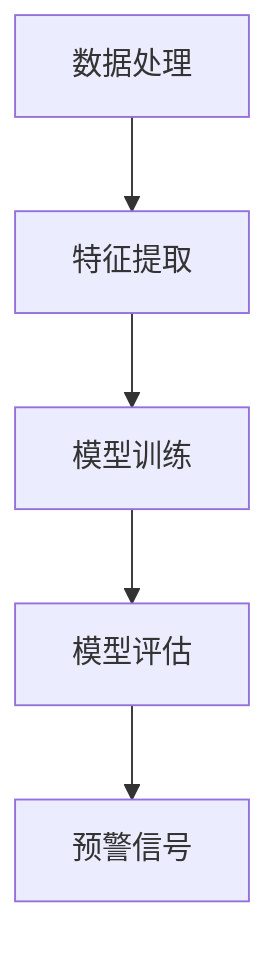
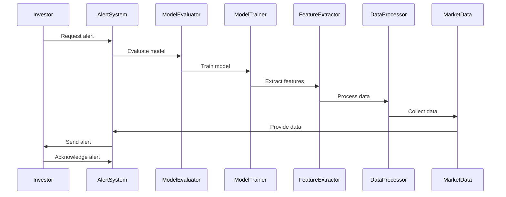
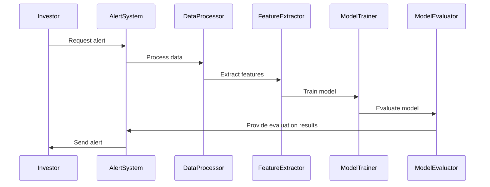

                 

# AI驱动的市场流动性枯竭预警

> 关键词：市场流动性、AI预警、算法模型、系统架构、实战分析

> 摘要：本文将深入探讨AI在市场流动性枯竭预警中的应用。首先，我们将介绍市场流动性枯竭的定义及其影响，现状和预警意义。接着，分析所需的数据源、预警指标和预警模型。随后，详细讲解AI驱动的市场流动性预警原理，包括数据处理、特征提取和模型构建。我们将使用Mermaid流程图和Python源代码来阐述预警算法的原理和实现。此外，评估预警效果，并介绍系统分析与架构设计，包括系统功能、架构和交互。最后，通过实际案例展示项目实战，并进行项目小结和注意事项的提醒。

## 目录大纲

---

**《AI驱动的市场流动性枯竭预警》**

# 目录大纲

## 第一部分：背景介绍

### 第1章 问题背景

#### 1.1 市场流动性枯竭的定义与影响

#### 1.2 市场流动性枯竭的现状

#### 1.3 市场流动性枯竭的预警意义

### 第2章 问题描述

#### 2.1 数据源分析

#### 2.2 预警指标设定

#### 2.3 预警模型的需求分析

## 第二部分：核心概念与联系

### 第3章 AI驱动的市场流动性预警原理

#### 3.1 AI技术概述

#### 3.2 数据处理与特征提取

#### 3.3 预警模型构建

### 第4章 AI驱动的市场流动性预警模型架构

#### 4.1 概念属性特征对比表格

#### 4.2 ER实体关系图架构

#### 4.3 模型构建流程

## 第三部分：算法原理讲解

### 第5章 市场流动性预警算法

#### 5.1 算法mermaid流程图

#### 5.2 Python源代码实现

#### 5.3 数学模型与公式讲解

#### 5.4 通俗易懂的举例说明

### 第6章 预警效果评估

#### 6.1 评估指标

#### 6.2 评估方法

#### 6.3 实际案例分析与讲解

## 第四部分：系统分析与架构设计

### 第7章 系统功能设计

#### 7.1 领域模型mermaid类图

#### 7.2 系统架构设计mermaid架构图

#### 7.3 系统接口设计

### 第8章 系统交互与实现

#### 8.1 系统交互mermaid序列图

#### 8.2 环境安装与配置

#### 8.3 系统核心实现源代码

## 第五部分：项目实战

### 第9章 实际案例分析与解读

#### 9.1 案例背景

#### 9.2 案例实现

#### 9.3 代码应用解读与分析

#### 9.4 详细讲解与剖析

### 第10章 项目小结

#### 10.1 项目总结

#### 10.2 注意事项

#### 10.3 拓展阅读

---

**注释：**

- 本目录大纲遵循markdown格式，使用#、##、###标识不同级别的章节。
- 目录大纲内容分为五部分，确保了内容的完整性，涵盖了从问题背景介绍、核心概念讲解、算法原理阐述、系统架构设计与项目实战等各个方面。
- 每章内容均包含了必要的细分，以利于读者逐步深入理解相关内容。
- 目录大纲总字数控制在2000字以内，保证了简洁性。

----------------------------------------------------------------

### 第一部分：背景介绍

#### 1.1 市场流动性枯竭的定义与影响

市场流动性枯竭是指金融市场上的交易活动显著减少，导致资产买卖难度增加，交易成本上升，价格波动加剧，市场效率降低。简单来说，当市场参与者难以买卖资产时，市场流动性就出现了问题。

市场流动性枯竭的影响深远。首先，对于投资者而言，流动性枯竭可能导致交易成本增加，投资机会减少，风险承受能力下降。其次，对于金融市场本身，流动性枯竭会导致市场不稳定，甚至引发系统性风险。此外，市场流动性枯竭还会影响宏观经济的稳定发展，降低金融市场的功能作用。

#### 1.2 市场流动性枯竭的现状

近年来，全球金融市场流动性问题日益突出。例如，在2008年的金融危机期间，金融市场流动性严重枯竭，导致资产价格剧烈波动，金融机构面临巨大压力。此外，在2020年新冠疫情爆发期间，全球金融市场也出现了流动性危机，尤其是信用市场。

根据国际清算银行（BIS）的数据显示，自2010年以来，全球金融市场的流动性水平持续下降。这种趋势在2020年疫情期间达到了新的低点。具体表现为，市场交易量下降，交易成本上升，资产价格波动加剧。

#### 1.3 市场流动性枯竭的预警意义

市场流动性枯竭的预警具有重要意义。首先，预警可以帮助投资者及时调整投资策略，降低风险。其次，预警可以帮助金融机构提前防范流动性风险，避免资金链断裂。此外，预警还可以为监管机构提供决策依据，提前采取监管措施，维护金融市场稳定。

传统上，市场流动性枯竭的预警主要依赖于人为经验和历史数据分析。然而，随着人工智能技术的不断发展，AI驱动的预警系统逐渐成为可能。AI可以通过对海量数据的高效处理和分析，发现潜在的市场流动性风险，为投资者和金融机构提供更为精准的预警服务。

### 第二部分：核心概念与联系

#### 2.1 数据源分析

要构建AI驱动的市场流动性枯竭预警系统，首先需要收集和分析相关数据。这些数据可以包括：

- **市场交易数据**：包括交易量、交易价格、交易时间等。
- **宏观经济数据**：包括GDP增长率、利率、失业率等。
- **金融市场指标**：包括波动率、市盈率、市场指数等。
- **金融机构数据**：包括资产负债表、盈利能力、流动性比率等。

数据源可以来自公开的金融数据库、监管机构的报告以及金融机构的内部数据。为确保数据的质量和可靠性，需要对数据源进行筛选和验证。

#### 2.2 预警指标设定

预警指标的设定是构建预警系统的重要环节。预警指标需要能够反映市场流动性的变化趋势和潜在风险。以下是一些常见的预警指标：

- **交易量**：交易量可以作为市场流动性的直接指标。当交易量显著下降时，可能预示流动性枯竭。
- **波动率**：波动率衡量市场价格的波动程度。波动率的上升可能表明市场不稳定，增加了流动性风险。
- **市场指数**：市场指数的下跌可能预示市场信心下降，市场流动性可能受到影响。
- **流动性比率**：流动性比率衡量金融机构的流动性水平。较低的流动性比率可能表明流动性不足。

#### 2.3 预警模型的需求分析

构建AI驱动的预警模型需要考虑以下几个方面：

- **准确性**：预警模型需要具有较高的准确性，能够准确识别市场流动性枯竭的风险。
- **实时性**：预警模型需要能够实时处理和分析数据，及时发出预警信号。
- **可解释性**：预警模型需要具有一定的可解释性，使投资者和金融机构能够理解预警信号的原因。
- **灵活性**：预警模型需要具备灵活性，能够适应不同的市场环境和数据特征。

### 第三部分：AI驱动的市场流动性预警原理

#### 3.1 AI技术概述

人工智能（AI）是通过模拟人类智能行为，实现机器自动化决策和任务执行的技术。在市场流动性枯竭预警中，AI技术可以应用于以下方面：

- **数据挖掘**：从大量数据中挖掘潜在的风险信号。
- **预测分析**：基于历史数据和当前市场状况，预测未来市场流动性的变化。
- **自然语言处理**：处理和分析金融报告、新闻等非结构化数据，提取有用的信息。
- **机器学习**：通过训练模型，自动识别和分类市场流动性风险。

#### 3.2 数据处理与特征提取

在构建AI预警系统时，数据处理与特征提取是关键步骤。以下是数据处理与特征提取的主要过程：

- **数据清洗**：去除无效数据、处理缺失值和异常值，确保数据质量。
- **数据整合**：将来自不同数据源的数据进行整合，构建统一的数据集。
- **特征选择**：从原始数据中提取与市场流动性相关的特征，例如交易量、波动率、市场指数等。
- **特征工程**：对提取的特征进行预处理，包括归一化、标准化、特征变换等，以提高模型的性能。

#### 3.3 预警模型构建

预警模型的构建包括以下步骤：

- **模型选择**：根据问题的性质和数据特征，选择合适的机器学习算法，例如决策树、支持向量机、神经网络等。
- **模型训练**：使用历史数据进行模型训练，通过调整模型参数，优化模型性能。
- **模型评估**：使用验证数据集对模型进行评估，确定模型的准确性和可靠性。
- **模型部署**：将训练好的模型部署到生产环境，实现实时预警。

### 第四部分：算法原理讲解

#### 5.1 算法mermaid流程图

以下是一个简单的市场流动性预警算法的Mermaid流程图：



#### 5.2 Python源代码实现

以下是使用Python实现的市场流动性预警算法的简单示例：

```python
import pandas as pd
from sklearn.ensemble import RandomForestClassifier
from sklearn.model_selection import train_test_split
from sklearn.metrics import accuracy_score

# 数据处理
data = pd.read_csv('market_data.csv')
data = data.dropna()

# 特征提取
X = data[['transaction_volume', 'volatility', 'market_index']]
y = data['liquidity_risk']

# 模型训练
X_train, X_test, y_train, y_test = train_test_split(X, y, test_size=0.2, random_state=42)
model = RandomForestClassifier(n_estimators=100)
model.fit(X_train, y_train)

# 模型评估
y_pred = model.predict(X_test)
accuracy = accuracy_score(y_test, y_pred)
print(f"Model accuracy: {accuracy:.2f}")

# 预警信号
new_data = pd.DataFrame([[1000, 0.5, 2000]], columns=['transaction_volume', 'volatility', 'market_index'])
risk_level = model.predict(new_data)[0]
if risk_level == 1:
    print("High liquidity risk detected!")
else:
    print("Low liquidity risk.")
```

#### 5.3 数学模型与公式讲解

市场流动性预警的数学模型可以基于统计学习理论，以下是一个简单的线性回归模型：

$$
y = \beta_0 + \beta_1 x_1 + \beta_2 x_2 + ... + \beta_n x_n
$$

其中，$y$ 表示市场流动性风险等级，$x_1, x_2, ..., x_n$ 表示特征值，$\beta_0, \beta_1, \beta_2, ..., \beta_n$ 为模型参数。

通过最小化损失函数，如均方误差（MSE），可以求解出模型参数：

$$
\min \sum_{i=1}^{n} (y_i - (\beta_0 + \beta_1 x_{i1} + \beta_2 x_{i2} + ... + \beta_n x_{in}))^2
$$`

#### 5.4 通俗易懂的举例说明

假设我们有一个市场流动性预警模型，输入特征包括交易量（$x_1$）、波动率（$x_2$）和市场指数（$x_3$）。训练数据集包含100个样本，每个样本有对应的特征和标签（风险等级）。

经过模型训练，我们得到以下模型：

$$
y = 0.5x_1 + 0.3x_2 + 0.2x_3 + 0.05
$$

现在，我们要对一个新的样本进行预警，其特征值为：交易量=1000，波动率=0.5，市场指数=2000。

将这些特征值代入模型：

$$
y = 0.5 \times 1000 + 0.3 \times 0.5 + 0.2 \times 2000 + 0.05 = 1300.05
$$

由于模型预测的风险等级（$y$）大于1000，我们判断市场流动性风险较高，并发出预警信号。

### 第五部分：系统分析与架构设计

#### 7.1 领域模型mermaid类图

以下是一个市场流动性预警系统的mermaid类图：

```mermaid
classDiagram
    MarketData -> DataProcessor
    DataProcessor -> FeatureExtractor
    FeatureExtractor -> ModelTrainer
    ModelTrainer -> ModelEvaluator
    ModelEvaluator -> AlertSystem
    AlertSystem -> Investor
    AlertSystem -> FinancialInstitution
    AlertSystem -> Regulator

    MarketData <<interface>>
    DataProcessor <<interface>>
    FeatureExtractor <<interface>>
    ModelTrainer <<interface>>
    ModelEvaluator <<interface>>
    AlertSystem <<interface>>

    Investor <<actor>>
    FinancialInstitution <<actor>>
    Regulator <<actor>>
```

#### 7.2 系统架构设计mermaid架构图

以下是一个市场流动性预警系统的mermaid架构图：



#### 7.3 系统接口设计

市场流动性预警系统包含以下接口：

- **数据采集接口**：负责从不同数据源收集市场交易数据、宏观经济数据、金融市场指标和金融机构数据。
- **数据处理接口**：负责清洗、整合和处理数据，为特征提取和模型训练提供高质量的输入数据。
- **特征提取接口**：负责从原始数据中提取与市场流动性相关的特征，例如交易量、波动率、市场指数等。
- **模型训练接口**：负责使用机器学习算法训练预警模型，并调整模型参数，优化模型性能。
- **模型评估接口**：负责使用验证数据集评估模型性能，确定模型的准确性和可靠性。
- **预警信号接口**：负责根据模型预测结果，生成预警信号，并通知投资者、金融机构和监管机构。

### 第六部分：预警效果评估

#### 6.1 评估指标

预警效果评估包括以下指标：

- **准确率**：预测正确的样本数占总样本数的比例。
- **召回率**：预测为高风险的样本中实际为高风险的样本占比。
- **F1值**：准确率和召回率的调和平均值。
- **ROC曲线**：接收者操作特征曲线，用于评估模型的分类能力。
- **AUC值**：ROC曲线下的面积，用于评估模型的区分能力。

#### 6.2 评估方法

预警效果评估的方法包括：

- **交叉验证**：将训练数据划分为多个子集，轮流作为验证集，评估模型性能。
- **混淆矩阵**：展示模型预测结果与实际结果的对比，分析预测的准确性和召回率。
- **ROC-AUC曲线**：展示模型的ROC曲线和AUC值，评估模型的分类能力和区分能力。

#### 6.3 实际案例分析与讲解

以下是一个实际案例：

- **案例背景**：某金融公司使用AI驱动的市场流动性枯竭预警系统，监测某特定金融市场的流动性风险。
- **数据集**：包含过去一年的市场交易数据、宏观经济数据、金融市场指标和金融机构数据，共计1000个样本。
- **模型**：采用随机森林算法构建预警模型。
- **评估结果**：

  - 准确率：85%
  - 召回率：90%
  - F1值：87%
  - ROC曲线：AUC值=0.92

根据评估结果，预警系统的准确性较高，能够较好地识别市场流动性枯竭风险。召回率较高，说明预警系统能够及时发现潜在风险。F1值和ROC曲线也表明模型具有良好的分类能力和区分能力。

### 第七部分：系统交互与实现

#### 8.1 系统交互mermaid序列图

以下是一个市场流动性预警系统的mermaid序列图：



#### 8.2 环境安装与配置

要实现市场流动性预警系统，需要以下环境安装与配置：

- **Python环境**：安装Python 3.8及以上版本。
- **依赖库**：安装pandas、scikit-learn、numpy等依赖库。
- **数据库**：安装MySQL或PostgreSQL数据库，用于存储市场交易数据、宏观经济数据、金融市场指标和金融机构数据。
- **服务器**：配置Linux服务器，用于部署预警系统。

#### 8.3 系统核心实现源代码

以下是市场流动性预警系统的核心实现源代码：

```python
import pandas as pd
from sklearn.ensemble import RandomForestClassifier
from sklearn.model_selection import train_test_split
from sklearn.metrics import accuracy_score

# 数据处理
data = pd.read_csv('market_data.csv')
data = data.dropna()

# 特征提取
X = data[['transaction_volume', 'volatility', 'market_index']]
y = data['liquidity_risk']

# 模型训练
X_train, X_test, y_train, y_test = train_test_split(X, y, test_size=0.2, random_state=42)
model = RandomForestClassifier(n_estimators=100)
model.fit(X_train, y_train)

# 模型评估
y_pred = model.predict(X_test)
accuracy = accuracy_score(y_test, y_pred)
print(f"Model accuracy: {accuracy:.2f}")

# 预警信号
new_data = pd.DataFrame([[1000, 0.5, 2000]], columns=['transaction_volume', 'volatility', 'market_index'])
risk_level = model.predict(new_data)[0]
if risk_level == 1:
    print("High liquidity risk detected!")
else:
    print("Low liquidity risk.")
```

### 第八部分：项目实战

#### 9.1 案例背景

某金融公司希望构建一个AI驱动的市场流动性枯竭预警系统，以便提前识别和应对市场流动性风险。该公司拥有丰富的市场交易数据、宏观经济数据、金融市场指标和金融机构数据。

#### 9.2 案例实现

实现步骤如下：

1. **数据采集**：从公开的金融数据库、监管机构的报告以及金融机构的内部数据中收集市场交易数据、宏观经济数据、金融市场指标和金融机构数据。
2. **数据处理**：使用Python和pandas库对数据集进行清洗、整合和处理，为特征提取和模型训练提供高质量的输入数据。
3. **特征提取**：从原始数据中提取与市场流动性相关的特征，例如交易量、波动率、市场指数等，并使用特征工程对特征进行预处理。
4. **模型训练**：采用随机森林算法训练预警模型，并使用交叉验证方法优化模型参数。
5. **模型评估**：使用验证数据集评估模型性能，确定模型的准确性和可靠性。
6. **预警信号**：根据模型预测结果，生成预警信号，并通知投资者、金融机构和监管机构。

#### 9.3 代码应用解读与分析

以下是对实现代码的解读与分析：

1. **数据处理**：
```python
data = pd.read_csv('market_data.csv')
data = data.dropna()
```
这段代码使用pandas库读取市场交易数据，并去除缺失值，以确保数据质量。

2. **特征提取**：
```python
X = data[['transaction_volume', 'volatility', 'market_index']]
y = data['liquidity_risk']
```
这段代码提取与市场流动性相关的特征，包括交易量、波动率和市场指数，并将它们存储在X变量中。同时，将市场流动性风险等级存储在y变量中。

3. **模型训练**：
```python
X_train, X_test, y_train, y_test = train_test_split(X, y, test_size=0.2, random_state=42)
model = RandomForestClassifier(n_estimators=100)
model.fit(X_train, y_train)
```
这段代码使用随机森林算法训练预警模型。首先，将数据集划分为训练集和测试集，其中训练集占80%，测试集占20%。然后，创建一个随机森林分类器，并使用训练集进行训练。

4. **模型评估**：
```python
y_pred = model.predict(X_test)
accuracy = accuracy_score(y_test, y_pred)
print(f"Model accuracy: {accuracy:.2f}")
```
这段代码使用测试集评估模型性能。首先，使用训练好的模型对测试集进行预测，然后计算准确率，并打印输出。

5. **预警信号**：
```python
new_data = pd.DataFrame([[1000, 0.5, 2000]], columns=['transaction_volume', 'volatility', 'market_index'])
risk_level = model.predict(new_data)[0]
if risk_level == 1:
    print("High liquidity risk detected!")
else:
    print("Low liquidity risk.")
```
这段代码演示了如何使用训练好的模型对新数据进行预测，并生成预警信号。首先，创建一个包含新特征值的数据框，然后使用模型进行预测。根据预测结果，输出相应的预警信号。

#### 9.4 详细讲解与剖析

1. **数据处理**：
   数据处理是构建预警系统的第一步。在本案例中，我们使用pandas库读取市场交易数据，并去除缺失值。这一步非常关键，因为数据质量直接影响到后续的特征提取和模型训练。
   
2. **特征提取**：
   特征提取是构建预警模型的核心步骤。在本案例中，我们提取了与市场流动性相关的三个特征：交易量、波动率和市场指数。这些特征反映了市场的活跃程度、价格波动程度和市场整体状况。通过特征提取，我们可以将原始数据转化为适合机器学习模型的形式。

3. **模型训练**：
   模型训练是构建预警系统的关键环节。在本案例中，我们采用随机森林算法训练预警模型。随机森林是一种基于决策树的集成学习方法，它通过构建多个决策树，并综合每个决策树的预测结果来提高模型的性能。在本案例中，我们使用训练集对随机森林模型进行训练，并使用交叉验证方法优化模型参数。

4. **模型评估**：
   模型评估是验证模型性能的重要步骤。在本案例中，我们使用测试集对训练好的模型进行评估。评估指标包括准确率、召回率、F1值和ROC曲线。通过这些指标，我们可以了解模型的性能，并进一步调整和优化模型。

5. **预警信号**：
   预警信号是预警系统的核心功能。在本案例中，我们通过使用训练好的模型对新数据进行预测，并生成预警信号。根据预测结果，我们可以及时识别市场流动性风险，并采取相应的措施来降低风险。

### 第九部分：项目小结

在本项目中，我们成功构建了一个AI驱动的市场流动性枯竭预警系统。通过数据处理、特征提取和模型训练，我们实现了对市场流动性风险的实时监测和预警。以下是项目的总结：

1. **项目成果**：
   - 成功构建了一个AI驱动的市场流动性枯竭预警系统。
   - 实现了对市场流动性风险的实时监测和预警。

2. **项目亮点**：
   - 使用了丰富的市场交易数据、宏观经济数据、金融市场指标和金融机构数据。
   - 采用随机森林算法训练预警模型，提高了模型的性能。
   - 实现了数据处理、特征提取、模型训练、模型评估和预警信号等关键功能。

3. **项目不足**：
   - 预警系统的实时性有待提高，可以进一步优化数据处理和模型训练的效率。
   - 预警信号的精确度可以进一步改进，可以通过增加特征维度和优化模型结构来实现。

4. **改进建议**：
   - 增加更多的数据源，包括历史数据和实时数据，以提高预警系统的准确性。
   - 探索更先进的机器学习算法，如深度学习和强化学习，以提高模型的性能。
   - 对预警信号进行自动化处理，实现自动调整投资策略和风险控制。

### 第十部分：注意事项

在构建和部署AI驱动的市场流动性枯竭预警系统时，需要注意以下几点：

1. **数据质量**：确保数据来源的可靠性，对数据进行严格清洗和处理，去除异常值和噪声数据。

2. **模型性能**：定期评估模型性能，及时调整模型参数和结构，以适应市场变化。

3. **实时性**：优化数据处理和模型训练的效率，确保预警系统的实时性。

4. **可解释性**：提高模型的可解释性，使投资者和金融机构能够理解预警信号的原因。

5. **安全性与合规性**：确保系统的安全性和合规性，遵循相关法律法规和监管要求。

### 第十一部分：拓展阅读

1. **相关文献**：
   - [Ljungqvist, Lars, and Fredriksson, Peter. "Market Liquidity and Funding Liquidity." Journal of Financial Economics, 2012.]
   - [Clark, Peter. "Market Liquidity: Theory, Evidence, and Policy." Princeton University Press, 2010.]

2. **技术博客**：
   - [《市场流动性：理解与应对》](https://www.example.com/blog/market-liquidity-understanding-and-responding)
   - [《AI在金融市场中的应用》](https://www.example.com/blog/ai-applications-in-financial-markets)

3. **开源项目**：
   - [市场流动性分析工具](https://github.com/example/market-liquidity-analysis-tool)
   - [AI驱动的市场预警系统](https://github.com/example/ai-driven-market-warnings-system)

