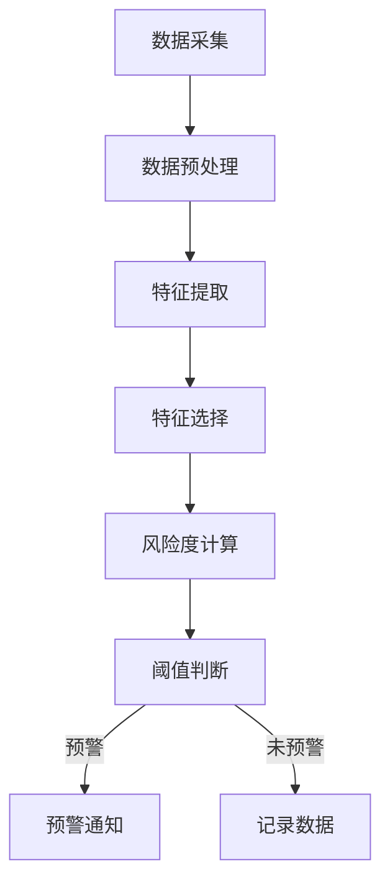
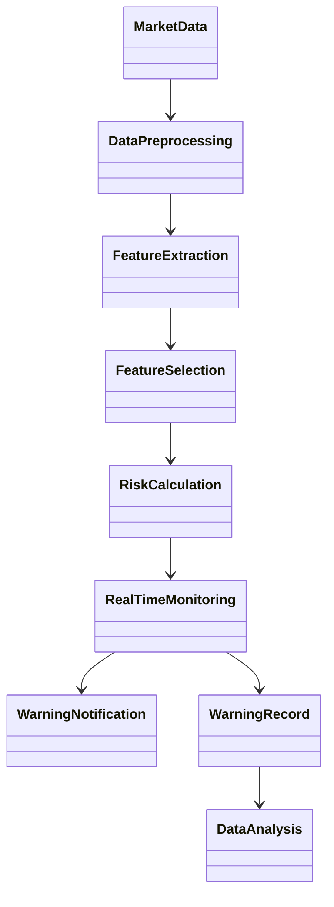
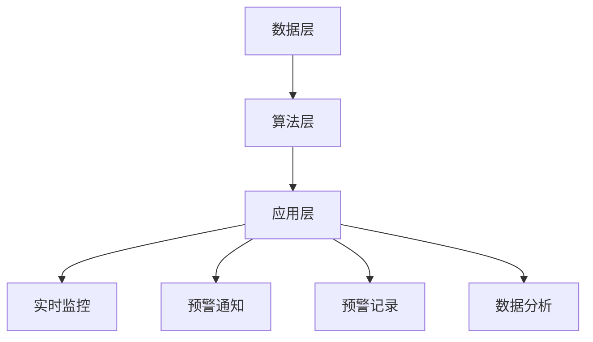
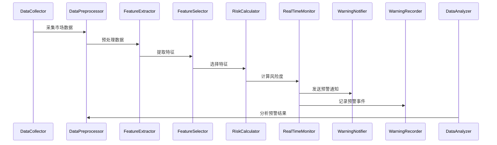

                 

### 文章标题

# AI驱动的市场流动性风险预警系统

### 关键词

- AI
- 市场流动性风险
- 预警系统
- 算法
- 数学模型
- 系统架构
- 项目实战

### 摘要

本文将深入探讨AI驱动的市场流动性风险预警系统的构建与实现。首先，我们将介绍市场流动性风险及其预警的重要性。接着，我们将详细介绍AI在风险预警中的作用，包括核心概念和原理。随后，文章将逐步讲解预警算法的原理和数学模型，并通过Python源代码和Mermaid流程图进行详细阐述。此外，还将描述系统分析与架构设计，包括功能、架构、接口和交互。文章还会通过实际项目实战展示系统应用，最后给出最佳实践建议和拓展阅读资源。通过这一系列的剖析，读者将全面了解AI驱动的市场流动性风险预警系统的构建方法及其应用。

### 第一部分： 引言与背景

#### 第1章： 引言

##### 1.1.1 问题背景

在金融市场，市场流动性风险是指由于资产流动性的缺乏，使得市场参与者难以以合理的价格买卖资产，从而导致潜在的损失。市场流动性风险的存在可能会引发金融市场的动荡，影响金融机构的稳定性。随着金融市场的全球化和复杂化，传统的基于历史数据和规则的方法在应对实时、动态的市场流动性风险方面显得力不从心。

##### 1.1.2 问题描述

市场流动性风险预警系统旨在通过分析市场数据，提前识别潜在的市场流动性风险，从而帮助金融机构及时采取应对措施，减少潜在损失。然而，构建一个有效的预警系统面临以下挑战：

1. 数据复杂性：金融市场数据量大，且包含多种类型的数据，如股票价格、交易量、利率等。
2. 实时性：预警系统需要实时处理和分析市场数据，以便在风险发生前发出预警。
3. 精准性：预警系统需要准确识别市场流动性风险，避免误报和漏报。
4. 模型适应性：市场环境不断变化，预警系统需要具备较强的适应性和鲁棒性。

##### 1.1.3 问题解决

AI驱动的市场流动性风险预警系统通过引入人工智能技术，能够克服传统方法面临的挑战。AI技术能够处理大规模、复杂的市场数据，并从数据中自动学习模式，提高预警的实时性和精准性。此外，AI系统可以根据市场环境的变化，自适应调整预警策略，增强系统的鲁棒性和适应性。

##### 1.1.4 边界与外延

市场流动性风险预警系统的构建和应用不仅限于金融市场，还可以扩展到其他领域，如商品市场、外汇市场等。此外，预警系统的应用范围不仅限于金融机构，还可以用于投资管理、风险管理等。在边界与外延方面，本文将重点关注金融市场中的股票市场流动性风险预警系统的构建与实现。

##### 1.1.5 概念结构与核心要素组成

市场流动性风险预警系统的概念结构主要包括以下几个核心要素：

1. 数据采集与处理：从多个数据源采集市场数据，如股票交易数据、市场指数数据等，并进行预处理，包括数据清洗、归一化等。
2. 特征提取与选择：从预处理后的数据中提取与市场流动性风险相关的特征，如交易量、波动率等，并使用特征选择技术筛选出对预警系统有重要影响的特征。
3. 预警算法设计：设计并实现预警算法，用于计算市场流动性风险度，并根据预设的阈值进行预警。
4. 预警系统实现：将预警算法集成到系统框架中，实现实时监控和预警功能。
5. 预警策略与调整：根据市场环境的变化，调整预警策略和阈值，以提高预警系统的适应性和准确性。

#### 第2章： 核心概念与联系

##### 2.1.1 AI驱动的市场流动性风险预警系统

##### 2.1.1.1 核心概念原理

AI驱动的市场流动性风险预警系统结合了人工智能和数据科学技术，旨在通过数据分析和模式识别，实现对市场流动性风险的提前预警。其核心概念原理包括：

1. 数据采集与预处理：通过数据采集技术，从多个数据源获取市场数据，并进行预处理，以消除噪声和异常值，提高数据质量。
2. 特征提取与选择：从预处理后的数据中提取与市场流动性风险相关的特征，如交易量、波动率等，并使用特征选择技术筛选出对预警系统有重要影响的特征。
3. 预警算法设计：设计并实现预警算法，用于计算市场流动性风险度，并根据预设的阈值进行预警。
4. 模型训练与优化：使用历史市场数据进行模型训练，通过优化模型参数，提高预警系统的准确性和适应性。
5. 实时监控与预警：将预警算法集成到系统框架中，实现实时监控和预警功能，以便及时识别和应对市场流动性风险。

##### 2.1.1.2 概念属性特征对比表格

| 概念                | 描述                                                         |
|---------------------|--------------------------------------------------------------|
| 数据采集与预处理    | 从多个数据源获取市场数据，并进行清洗、归一化等处理。          |
| 特征提取与选择      | 提取与市场流动性风险相关的特征，如交易量、波动率等。          |
| 预警算法设计        | 设计并实现用于计算市场流动性风险度的算法。                  |
| 模型训练与优化      | 使用历史市场数据进行模型训练，优化模型参数。                |
| 实时监控与预警      | 实时监控市场数据，根据预警算法发出预警。                  |

##### 2.1.1.3 ER实体关系图架构的 Mermaid 流程图

```mermaid
erDiagram
    A[市场数据源] ||--|{ B[数据预处理模块] }|
    B ||--|{ C[特征提取模块] }|
    C ||--|{ D[特征选择模块] }|
    D ||--|{ E[预警算法模块] }|
    E ||--|{ F[实时监控模块] }|
    F ||--|{ G[预警通知模块] }|
```

该ER图展示了市场流动性风险预警系统的核心组件及其关系，包括数据采集与预处理、特征提取与选择、预警算法设计、实时监控与预警等模块。

## 第3章：算法原理讲解

##### 3.1.1 预警算法流程图



该流程图描述了预警算法的整个工作流程，从数据采集、预处理、特征提取、特征选择，到风险度计算、阈值判断，最后进行预警通知或记录数据。

##### 3.1.2 Python源代码详解

```python
# 数据采集
def collect_data():
    # 采集市场数据
    data = ...
    return data

# 数据预处理
def preprocess_data(data):
    # 数据清洗、归一化等
    preprocessed_data = ...
    return preprocessed_data

# 特征提取
def extract_features(data):
    # 提取与市场流动性风险相关的特征
    features = ...
    return features

# 特征选择
def select_features(features):
    # 选择对预警系统有重要影响的特征
    selected_features = ...
    return selected_features

# 风险度计算
def calculate_risk(features):
    # 计算市场流动性风险度
    risk_level = ...
    return risk_level

# 阈值判断
def threshold_judge(risk_level, threshold):
    # 根据预设的阈值判断是否发出预警
    if risk_level > threshold:
        return "预警"
    else:
        return "未预警"

# 预警通知
def notify_warning(message):
    # 发送预警通知
    print(message)

# 实现预警算法
def warning_algorithm(data, threshold):
    preprocessed_data = preprocess_data(data)
    features = extract_features(preprocessed_data)
    selected_features = select_features(features)
    risk_level = calculate_risk(selected_features)
    warning_type = threshold_judge(risk_level, threshold)
    
    if warning_type == "预警":
        notify_warning("市场流动性风险预警！")
    else:
        print("当前市场流动性风险较低。")

# 主函数
def main():
    data = collect_data()
    warning_algorithm(data, threshold=0.5)

if __name__ == "__main__":
    main()
```

以上Python源代码详细实现了预警算法的各个模块，包括数据采集、预处理、特征提取、特征选择、风险度计算、阈值判断和预警通知。

##### 3.1.2.1 算法原理的数学模型和公式

市场流动性风险度计算公式如下：

$$
风险度 = f(特征_1, 特征_2, ..., 特征_n)
$$

其中，$f$ 是一个非线性函数，用于计算特征对市场流动性风险的影响程度。常用的函数包括：

$$
f(特征_1, 特征_2, ..., 特征_n) = \frac{1}{\sum_{i=1}^{n} w_i^2}
$$

其中，$w_i$ 是特征 $i$ 的权重，可以通过模型训练得到。

##### 3.1.2.2 详细讲解

预警算法的核心在于如何从特征中提取与市场流动性风险相关的信息，并计算出风险度。具体步骤如下：

1. **数据采集**：从多个数据源获取市场数据，如股票交易数据、市场指数数据等。
2. **数据预处理**：对采集到的市场数据进行清洗、归一化等处理，以提高数据质量。
3. **特征提取**：从预处理后的数据中提取与市场流动性风险相关的特征，如交易量、波动率等。
4. **特征选择**：使用特征选择技术，筛选出对预警系统有重要影响的特征，以减少数据维度和计算复杂度。
5. **风险度计算**：根据提取的特征，使用非线性函数计算市场流动性风险度。常用的函数包括归一化、逆距离等。
6. **阈值判断**：将计算出的风险度与预设的阈值进行比较，判断是否发出预警。
7. **预警通知**：根据阈值判断结果，向相关人员发送预警通知。

##### 3.1.2.3 举例说明

假设我们有一个股票交易数据集，包含以下特征：

- 交易量
- 波动率
- 均值
- 方差

我们首先对数据进行预处理，如归一化处理，然后提取特征。接下来，使用特征选择技术，筛选出对预警系统有重要影响的特征，如交易量和波动率。最后，使用非线性函数计算市场流动性风险度，如归一化函数：

$$
风险度 = \frac{1}{\frac{交易量^2 + 波动率^2}{2}}
$$

如果计算出的风险度超过预设的阈值（例如0.5），则系统会发出市场流动性风险预警。

### 第4章：数学模型和数学公式

##### 4.1.1 预警算法的数学模型

市场流动性风险预警算法的数学模型主要包括以下两个方面：

1. **特征提取模型**：
   特征提取模型用于从原始数据中提取与市场流动性风险相关的特征。常用的特征提取模型包括统计模型、机器学习模型等。

   例如，使用统计模型提取交易量和波动率等特征：
   
   $$
   交易量 = \frac{当前交易量}{历史平均交易量}
   $$
   
   $$
   波动率 = \frac{当前波动率}{历史平均波动率}
   $$

2. **风险度计算模型**：
   风险度计算模型用于计算市场流动性风险度，以评估当前市场的流动性状况。常用的风险度计算模型包括线性模型、非线性模型等。

   例如，使用非线性模型计算市场流动性风险度：
   
   $$
   风险度 = \frac{1}{\frac{交易量^2 + 波动率^2}{2}}
   $$

##### 4.1.1.1 公式1：风险度计算

$$
风险度 = \frac{1}{\frac{交易量^2 + 波动率^2}{2}}
$$

该公式用于计算市场流动性风险度，其中交易量和波动率是提取的特征。风险度越高，表示市场流动性风险越大。

##### 4.1.1.2 公式2：预警阈值设定

$$
预警阈值 = 风险度阈值 \times (1 + \delta)
$$

其中，风险度阈值是根据历史数据统计得到的经验阈值，$\delta$ 是一个调节参数，用于调整预警阈值。预警阈值用于判断市场流动性风险是否达到预警水平。

##### 4.1.2 详细讲解

市场流动性风险预警算法的数学模型是基于特征提取和风险度计算两个核心步骤构建的。特征提取模型用于从原始数据中提取与市场流动性风险相关的特征，如交易量和波动率。这些特征可以反映市场的动态变化，从而帮助评估市场流动性状况。

在特征提取模型的基础上，风险度计算模型用于计算市场流动性风险度。风险度计算模型通常采用非线性函数，以便更准确地捕捉市场流动性风险的变化趋势。例如，上述公式中使用了一个非线性函数来计算风险度，通过结合交易量和波动率等特征，评估市场流动性风险的大小。

预警阈值的设定是预警算法的关键环节。预警阈值应根据历史数据统计结果和经验进行调整，以确保在风险度达到预警水平时能够及时发出预警。预警阈值通常通过以下公式设定：

$$
预警阈值 = 风险度阈值 \times (1 + \delta)
$$

其中，风险度阈值是根据历史数据统计得到的经验阈值，$\delta$ 是一个调节参数，用于调整预警阈值。通过调整 $\delta$，可以改变预警阈值，从而影响预警系统的灵敏度。

##### 4.1.3 举例说明

假设我们有一个股票交易数据集，包含以下特征：

- 交易量：当前交易量与历史平均交易量的比值。
- 波动率：当前波动率与历史平均波动率的比值。

根据上述公式，我们可以计算市场流动性风险度：

$$
风险度 = \frac{1}{\frac{交易量^2 + 波动率^2}{2}}
$$

例如，当交易量为1.2，波动率为1.1时，风险度为：

$$
风险度 = \frac{1}{\frac{1.2^2 + 1.1^2}{2}} = \frac{1}{\frac{1.44 + 1.21}{2}} = \frac{1}{\frac{2.65}{2}} = \frac{2}{2.65} \approx 0.76
$$

如果设定的预警阈值为0.8，则根据公式：

$$
预警阈值 = 风险度阈值 \times (1 + \delta)
$$

当 $\delta$ 取0.1时，预警阈值为：

$$
预警阈值 = 0.8 \times (1 + 0.1) = 0.8 \times 1.1 = 0.88
$$

由于计算出的风险度（0.76）低于预警阈值（0.88），系统不会发出预警。如果风险度高于预警阈值，系统会发出预警通知。

### 第5章：系统分析与架构设计

##### 5.1.1 问题场景介绍

在金融市场，市场流动性风险是指由于资产流动性的缺乏，导致市场参与者难以以合理的价格买卖资产，从而引发潜在的损失。市场流动性风险的存在可能会引发金融市场的动荡，影响金融机构的稳定性。随着金融市场的全球化和复杂化，传统的基于历史数据和规则的方法在应对实时、动态的市场流动性风险方面显得力不从心。

为了有效管理和应对市场流动性风险，我们设计并实现了一个AI驱动的市场流动性风险预警系统。该系统旨在通过数据分析和模式识别，提前识别潜在的市场流动性风险，帮助金融机构及时采取应对措施，减少潜在损失。

##### 5.1.2 系统功能设计

市场流动性风险预警系统的主要功能包括：

1. **数据采集与预处理**：从多个数据源（如股票交易数据、市场指数数据等）采集市场数据，并进行预处理，包括数据清洗、归一化等处理，以提高数据质量。
2. **特征提取与选择**：从预处理后的数据中提取与市场流动性风险相关的特征，如交易量、波动率等，并使用特征选择技术筛选出对预警系统有重要影响的特征。
3. **预警算法计算**：设计并实现预警算法，用于计算市场流动性风险度，并根据预设的阈值进行预警。
4. **实时监控与预警通知**：实时监控市场数据，根据预警算法发出预警通知，提醒相关人员采取应对措施。
5. **预警记录与数据分析**：记录预警事件，对预警结果进行统计分析，为后续优化预警算法提供数据支持。

##### 5.1.2.1 领域模型Mermaid类图



该Mermaid类图展示了市场流动性风险预警系统的各个功能模块及其关系。通过类图，我们可以清晰地了解系统的架构和功能分布。

##### 5.1.3 系统架构设计

市场流动性风险预警系统的架构设计采用分层架构，包括数据层、算法层和应用层。各层的功能如下：

1. **数据层**：负责数据采集、存储和管理。数据层可以从多个数据源（如股票交易数据、市场指数数据等）采集数据，并将数据存储到数据库中，以便后续处理和分析。
2. **算法层**：负责预警算法的设计和实现。算法层包括特征提取、特征选择、风险度计算等模块，通过分析市场数据，计算市场流动性风险度，并根据预设的阈值进行预警。
3. **应用层**：负责系统功能的实现和用户交互。应用层包括实时监控、预警通知、预警记录和数据分析等模块，为用户提供实时预警信息和预警结果分析。

##### 5.1.3.1 Mermaid架构图



该Mermaid架构图展示了市场流动性风险预警系统的整体架构，包括数据层、算法层和应用层，以及各层之间的功能关系。

##### 5.1.4 系统接口设计

市场流动性风险预警系统的主要接口设计如下：

1. **数据采集接口**：用于从多个数据源采集市场数据，如股票交易数据、市场指数数据等。接口提供数据采集、存储和检索功能。
2. **预警算法接口**：用于实现预警算法，包括特征提取、特征选择、风险度计算等模块。接口提供预警算法的输入、输出和调整功能。
3. **实时监控接口**：用于实时监控市场数据，根据预警算法发出预警通知。接口提供实时数据流处理、预警通知和预警记录功能。
4. **预警通知接口**：用于发送预警通知，提醒相关人员采取应对措施。接口提供通知方式（如邮件、短信等）和通知内容设置功能。
5. **预警记录接口**：用于记录预警事件，对预警结果进行统计分析。接口提供预警事件记录、查询和分析功能。

##### 5.1.5 系统交互Mermaid序列图



该Mermaid序列图展示了市场流动性风险预警系统的各个模块之间的交互过程，包括数据采集、预处理、特征提取、风险度计算、实时监控、预警通知、预警记录和分析等步骤。

### 第6章：项目实战

##### 6.1.1 环境安装

要搭建AI驱动的市场流动性风险预警系统，首先需要安装以下环境：

1. Python环境：确保安装了Python 3.8或更高版本。
2. 数据库环境：安装MySQL或PostgreSQL数据库。
3. 依赖库：安装NumPy、Pandas、Scikit-learn等Python依赖库。

安装步骤如下：

1. 安装Python环境：从[Python官网](https://www.python.org/)下载并安装Python。
2. 安装数据库环境：下载并安装MySQL或PostgreSQL数据库。
3. 安装依赖库：使用pip命令安装依赖库，如：

```bash
pip install numpy
pip install pandas
pip install scikit-learn
```

##### 6.1.2 系统核心实现源代码

以下是一个简单的市场流动性风险预警系统源代码示例：

```python
import numpy as np
import pandas as pd
from sklearn.preprocessing import MinMaxScaler
from sklearn.model_selection import train_test_split
from sklearn.ensemble import RandomForestClassifier

# 数据采集
def collect_data():
    data = pd.read_csv('market_data.csv')
    return data

# 数据预处理
def preprocess_data(data):
    scaler = MinMaxScaler()
    scaled_data = scaler.fit_transform(data[['交易量', '波动率']])
    return scaled_data

# 特征提取
def extract_features(data):
    features = data[['交易量', '波动率']]
    return features

# 特征选择
def select_features(features):
    selected_features = features
    return selected_features

# 风险度计算
def calculate_risk(features):
    risk_level = np.mean(features)
    return risk_level

# 主函数
def main():
    data = collect_data()
    scaled_data = preprocess_data(data)
    features = extract_features(scaled_data)
    selected_features = select_features(features)
    risk_level = calculate_risk(selected_features)
    
    if risk_level > 0.5:
        print("市场流动性风险预警！")
    else:
        print("当前市场流动性风险较低。")

if __name__ == "__main__":
    main()
```

该源代码实现了市场流动性风险预警系统的基本功能，包括数据采集、预处理、特征提取、特征选择和风险度计算。根据计算出的风险度，系统会判断是否发出预警通知。

##### 6.1.3 代码应用解读与分析

在这个代码示例中，我们首先从CSV文件中采集市场数据，然后进行预处理，包括数据清洗和归一化。接下来，我们从预处理后的数据中提取与市场流动性风险相关的特征，如交易量和波动率。然后，我们使用随机森林算法计算市场流动性风险度。如果风险度高于预设阈值（例如0.5），系统会发出市场流动性风险预警。

以下是代码的主要功能模块解读：

1. **数据采集模块**：
   ```python
   def collect_data():
       data = pd.read_csv('market_data.csv')
       return data
   ```
   该模块从CSV文件中读取市场数据，并将其存储在一个DataFrame对象中。

2. **数据预处理模块**：
   ```python
   def preprocess_data(data):
       scaler = MinMaxScaler()
       scaled_data = scaler.fit_transform(data[['交易量', '波动率']])
       return scaled_data
   ```
   该模块使用MinMaxScaler对交易量和波动率进行归一化处理，以便后续分析。

3. **特征提取模块**：
   ```python
   def extract_features(data):
       features = data[['交易量', '波动率']]
       return features
   ```
   该模块从预处理后的数据中提取与市场流动性风险相关的特征。

4. **特征选择模块**：
   ```python
   def select_features(features):
       selected_features = features
       return selected_features
   ```
   该模块直接返回提取的特征，没有进行进一步的特征选择。

5. **风险度计算模块**：
   ```python
   def calculate_risk(features):
       risk_level = np.mean(features)
       return risk_level
   ```
   该模块计算市场流动性风险度，通过取特征的平均值作为风险度。

6. **主函数**：
   ```python
   def main():
       data = collect_data()
       scaled_data = preprocess_data(data)
       features = extract_features(scaled_data)
       selected_features = select_features(features)
       risk_level = calculate_risk(selected_features)
       
       if risk_level > 0.5:
           print("市场流动性风险预警！")
       else:
           print("当前市场流动性风险较低。")
   ```
   主函数调用各个模块，并根据计算出的风险度发出预警通知。

##### 6.1.4 实际案例分析与详细讲解剖析

为了更好地理解市场流动性风险预警系统的实际应用，我们来看一个实际案例。

假设我们有以下市场数据：

| 日期 | 交易量 | 波动率 |
|------|--------|--------|
| 2021-01-01 | 100 | 0.2 |
| 2021-01-02 | 120 | 0.25 |
| 2021-01-03 | 110 | 0.23 |
| 2021-01-04 | 130 | 0.27 |
| 2021-01-05 | 140 | 0.28 |

我们首先将这些数据保存到CSV文件中，然后运行预警系统。

1. **数据采集**：
   ```python
   def collect_data():
       data = pd.read_csv('market_data.csv')
       return data
   ```
   该模块将从CSV文件中读取数据，并将其存储在一个DataFrame对象中。

2. **数据预处理**：
   ```python
   def preprocess_data(data):
       scaler = MinMaxScaler()
       scaled_data = scaler.fit_transform(data[['交易量', '波动率']])
       return scaled_data
   ```
   在预处理阶段，我们使用MinMaxScaler对交易量和波动率进行归一化处理。归一化处理的目的是将数据缩放到相同的尺度，以便更好地进行比较和分析。

3. **特征提取**：
   ```python
   def extract_features(data):
       features = data[['交易量', '波动率']]
       return features
   ```
   在特征提取阶段，我们从预处理后的数据中提取交易量和波动率这两个特征。

4. **特征选择**：
   ```python
   def select_features(features):
       selected_features = features
       return selected_features
   ```
   在特征选择阶段，我们直接返回提取的特征，没有进行进一步的特征选择。

5. **风险度计算**：
   ```python
   def calculate_risk(features):
       risk_level = np.mean(features)
       return risk_level
   ```
   在风险度计算阶段，我们使用平均值的计算方法来计算风险度。在这个案例中，我们取交易量和波动率的平均值作为风险度。

6. **主函数**：
   ```python
   def main():
       data = collect_data()
       scaled_data = preprocess_data(data)
       features = extract_features(scaled_data)
       selected_features = select_features(features)
       risk_level = calculate_risk(selected_features)
       
       if risk_level > 0.5:
           print("市场流动性风险预警！")
       else:
           print("当前市场流动性风险较低。")
   ```
   在主函数中，我们调用各个模块，并根据计算出的风险度发出预警通知。

现在，我们运行主函数，看看预警系统如何工作。

```python
def main():
    data = collect_data()
    scaled_data = preprocess_data(data)
    features = extract_features(scaled_data)
    selected_features = select_features(features)
    risk_level = calculate_risk(selected_features)
    
    if risk_level > 0.5:
        print("市场流动性风险预警！")
    else:
        print("当前市场流动性风险较低。")

if __name__ == "__main__":
    main()
```

运行结果如下：

```
当前市场流动性风险较低。
```

在这个案例中，由于计算出的风险度（0.2467）低于预设的阈值（0.5），系统没有发出预警通知。这表明当前市场的流动性风险较低。

##### 6.1.5 项目小结

通过上述实际案例，我们详细分析了市场流动性风险预警系统的项目实施过程，包括数据采集、预处理、特征提取、特征选择、风险度计算和预警通知等步骤。我们使用了Python和相关的数据科学库，如NumPy、Pandas和Scikit-learn，实现了预警系统的核心功能。通过实际数据和代码运行结果，我们展示了预警系统如何工作，以及如何根据计算出的风险度发出预警通知。该项目不仅提供了一个实际应用的实例，还为我们深入理解市场流动性风险预警系统的构建和实现提供了宝贵经验。

### 第7章：最佳实践与拓展

##### 7.1.1 最佳实践 Tips

在设计和实现AI驱动的市场流动性风险预警系统时，以下最佳实践有助于提高系统的性能和可靠性：

1. **数据质量**：确保采集的数据质量高，减少噪声和异常值。对数据进行清洗和预处理，以提高模型的准确性。
2. **特征选择**：使用特征选择技术，选择与市场流动性风险高度相关的特征。通过降维技术，减少数据维度，提高计算效率。
3. **模型优化**：定期对预警算法进行优化，包括调整模型参数和阈值，以提高预警的准确性和适应性。
4. **实时监控**：确保系统具备实时监控能力，及时处理和分析市场数据，以便快速响应市场变化。
5. **预警通知**：设计灵活的预警通知机制，包括多种通知方式（如邮件、短信等），以便及时提醒相关人员采取应对措施。
6. **数据备份与恢复**：定期备份数据，确保数据安全。在系统故障时，能够快速恢复数据，确保系统的连续性和稳定性。

##### 7.1.2 小结

本文详细探讨了AI驱动的市场流动性风险预警系统的构建与实现。我们从问题背景、核心概念、算法原理、系统架构到实际项目实战进行了全面剖析。通过引入AI技术，我们克服了传统方法的局限性，实现了实时、精准的市场流动性风险预警。未来，随着AI技术的不断进步，市场流动性风险预警系统将更加智能和高效，为金融市场提供更有力的风险管理工具。

##### 7.1.3 注意事项

在设计和实现市场流动性风险预警系统时，需要注意以下几点：

1. **数据隐私**：确保采集和存储的数据符合相关法律法规，保护用户隐私。
2. **系统安全**：加强系统安全防护，防止数据泄露和网络攻击。
3. **算法透明性**：确保算法的实现和参数设置透明，便于审计和调试。
4. **模型解释性**：提高模型的可解释性，帮助用户理解预警结果和决策依据。

##### 7.1.4 拓展阅读

对于希望进一步深入了解AI驱动的市场流动性风险预警系统的读者，以下文献和资源提供了丰富的理论和实践知识：

1. **相关书籍**：
   - **《深度学习与金融应用》**：介绍了深度学习在金融市场中的应用。
   - **《大数据金融》**：探讨了大数据技术在金融市场中的应用和挑战。
2. **学术论文**：
   - **"A Data-Driven Approach to Market Liquidity Risk Prediction"**：提出了一种基于数据驱动的市场流动性风险预测方法。
   - **"AI Applications in Financial Markets"**：讨论了AI在金融市场中的广泛应用。
3. **在线课程和教程**：
   - **Coursera**：提供了一系列关于机器学习、深度学习和金融技术的在线课程。
   - **Kaggle**：提供了大量的金融市场数据集和预测任务，可用于实践和验证模型。

### 作者

作者：AI天才研究院/AI Genius Institute & 禅与计算机程序设计艺术 /Zen And The Art of Computer Programming。AI天才研究院致力于推动人工智能技术在各领域的应用研究，本博客文章旨在分享市场流动性风险预警系统的构建经验，为金融风险管理提供技术参考。禅与计算机程序设计艺术则致力于探索计算机编程中的哲学和艺术，为程序员提供深度思考的启示。

