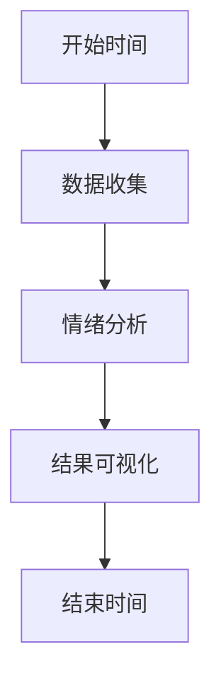
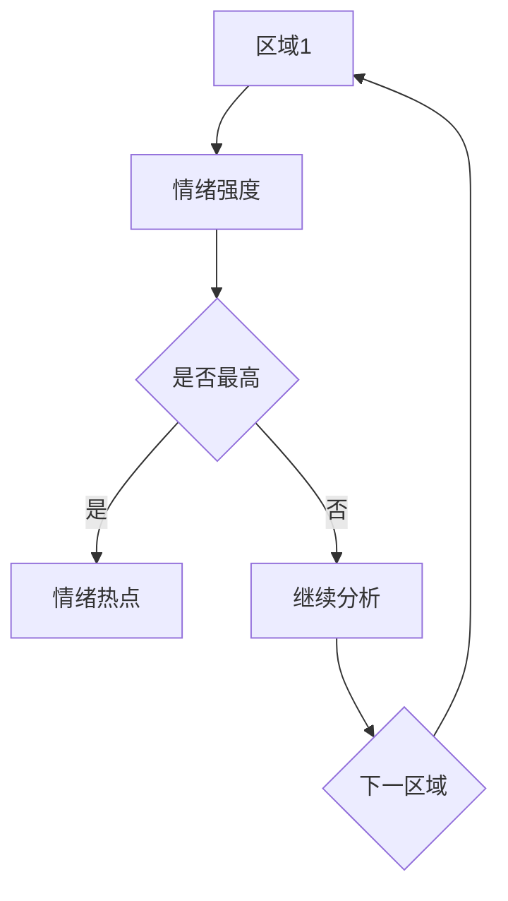
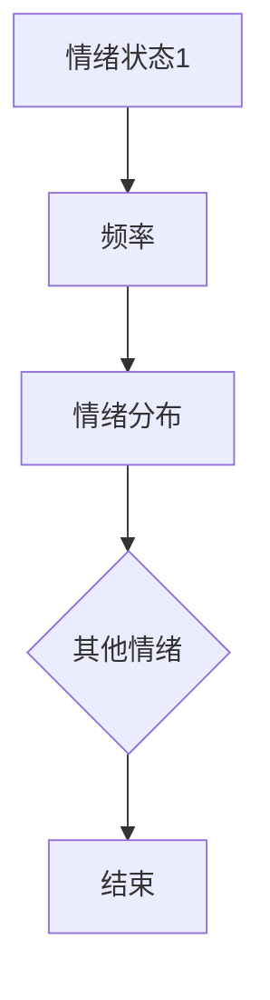

                 

## 引言

### 1.1 问题背景

在当今高度信息化和全球化的经济环境中，金融市场的作用和影响力日益凸显。资产价格波动不仅影响投资者的财富状况，还可能对整个经济体系产生深远的影响。传统的研究方法主要依赖历史数据和市场逻辑，但在复杂多变的市场中，往往难以捕捉到投资者情绪对资产价格的影响。

投资者情绪，即投资者对于市场走势的主观判断和态度，是影响资产价格的重要因素之一。研究表明，投资者情绪可以通过多种途径影响资产价格，如市场供需关系、投资者行为和风险偏好等。然而，传统的研究方法在捕捉和量化投资者情绪方面存在局限性，难以全面、实时地反映市场的动态变化。

AI技术的迅猛发展为投资者情绪分析与资产价格预测提供了新的途径。通过自然语言处理（NLP）、情感分析、机器学习等算法，AI可以高效地处理和分析大量的社交媒体、新闻报道、论坛评论等数据，提取出投资者情绪的关键信息。同时，AI还可以通过时间序列分析和预测模型，对资产价格进行动态预测和风险评估。

因此，本文旨在探讨AI驱动的投资者情绪与资产价格关系，通过系统性分析和实证研究，揭示投资者情绪对资产价格的影响机制和预测能力，为金融市场分析和投资决策提供有益的参考。

### 1.2 核心概念

**投资者情绪**：指投资者在市场交易过程中，对于市场走势的主观判断和情绪波动。它包括乐观、悲观、中性等不同情绪状态，可以通过社交媒体评论、新闻报道、论坛讨论等数据源进行量化分析。

**资产价格**：指投资者在金融市场上交易的资产（如股票、债券、房地产等）的市场价值。资产价格受到多种因素影响，包括市场供需关系、宏观经济环境、政策变化等。

**AI驱动分析**：利用人工智能技术，如自然语言处理（NLP）、情感分析、机器学习等，对投资者情绪和资产价格进行分析和预测。AI驱动的分析可以实时捕捉市场动态，提高分析效率和准确性。

### 1.3 研究边界与外延

在研究投资者情绪与资产价格关系时，需明确以下几个边界与外延：

**数据来源与预处理**：本研究将主要依赖社交媒体、新闻报道、论坛评论等公开数据源。为了确保数据质量，需要对原始数据进行清洗、去噪和标准化处理。

**模型选择与优化**：本研究将结合多种机器学习算法，如回归模型、时间序列模型、神经网络等，对投资者情绪和资产价格进行建模。模型选择和优化是研究的关键，需考虑模型的准确度、稳定性及可解释性。

**研究方法**：本研究将采用实证分析方法，通过建立理论模型、收集和分析数据、验证模型假设，探讨投资者情绪对资产价格的影响。

**应用领域**：本研究的结果不仅有助于学术研究，还可以为金融市场的实际操作提供指导。投资者可以根据研究结果调整投资策略，金融机构可以基于模型进行风险管理，政策制定者可以参考研究结论优化市场调控策略。

### 1.4 概念结构与核心要素组成

**投资者情绪模型**：投资者情绪模型是本研究的核心，主要通过文本挖掘和情感分析技术，从社交媒体、新闻报道和论坛评论中提取出投资者情绪的关键信息。该模型由以下三个主要组成部分构成：

1. **数据收集**：从社交媒体、新闻报道和论坛评论等公开数据源收集原始文本数据。
2. **文本预处理**：对原始文本数据进行清洗、去噪和标准化处理，提取出有效信息。
3. **情感分析**：利用NLP技术和情感词典，对预处理后的文本数据进行情感极性分析，判断投资者情绪状态。

**资产价格预测模型**：资产价格预测模型是基于历史价格数据和预测变量，通过时间序列分析、回归分析和机器学习等技术，对资产价格进行动态预测。该模型由以下三个主要组成部分构成：

1. **数据收集**：收集历史价格数据和预测变量，如市场指数、宏观经济指标、政策变化等。
2. **特征工程**：对原始数据进行特征提取和特征选择，构建用于预测的输入特征向量。
3. **模型训练与评估**：利用训练集数据对模型进行训练，并通过交叉验证和超参数调整，优化模型性能。

**AI驱动分析框架**：AI驱动分析框架是将投资者情绪模型和资产价格预测模型有机结合的整体架构，包括以下三个主要组成部分：

1. **数据融合**：将投资者情绪数据和资产价格数据融合，构建统一的输入数据集。
2. **模型集成**：利用集成学习方法，将多个预测模型融合为一个综合预测模型，提高预测准确度和稳定性。
3. **动态调整**：根据市场动态和预测结果，实时调整模型参数和预测策略，实现动态预测和风险管理。

通过以上三个组成部分的有机结合，AI驱动分析框架能够实现对投资者情绪与资产价格关系的系统性分析和预测，为金融市场分析和投资决策提供科学依据。

### 1.5 本章小结

本文引出了投资者情绪与资产价格关系的研究背景和重要性，明确了核心概念和研究的边界与外延，阐述了投资者情绪模型、资产价格预测模型及AI驱动分析框架的核心构成。接下来的章节将详细探讨投资者情绪数据的收集、分析方法和资产价格预测模型的构建与优化，为深入研究投资者情绪对资产价格的影响机制奠定基础。

## 第一部分：引言

### 1.1 问题背景

投资者情绪对资产价格的影响是一个复杂且重要的研究领域。在金融市场研究中，投资者情绪通常指的是投资者对于市场走势的主观判断和情绪波动。这种情绪可能受到多种因素的影响，包括宏观经济环境、政策变化、市场事件等。而资产价格，则是投资者在金融市场上交易的资产（如股票、债券、房地产等）的市场价值。资产价格的变化不仅影响投资者的财富状况，还可能对整个经济体系产生深远的影响。

投资者情绪对资产价格的影响主要通过以下几种途径实现：

1. **供需关系**：当投资者情绪乐观时，可能会增加对资产的需求，从而推高资产价格；相反，当投资者情绪悲观时，可能会减少对资产的需求，导致资产价格下跌。

2. **投资者行为**：投资者情绪会影响投资者的交易行为，如买入、持有或卖出。乐观情绪可能导致投资者大量买入，推高资产价格；而悲观情绪则可能导致投资者大量卖出，打压资产价格。

3. **风险偏好**：投资者情绪会影响投资者的风险偏好，从而影响投资决策。乐观情绪可能导致投资者更倾向于高风险投资，推高资产价格；而悲观情绪则可能导致投资者更倾向于保守投资，压低资产价格。

传统的研究方法在分析投资者情绪对资产价格的影响方面存在一些局限性。首先，传统方法主要依赖于历史数据和统计模型，但金融市场的高度动态性和复杂性使得这些方法难以准确捕捉投资者情绪的变化。其次，传统方法在处理非结构化文本数据方面存在困难，难以从大量的社交媒体、新闻报道、论坛评论等数据中提取出有用的情绪信息。

为了解决这些问题，AI技术的引入为投资者情绪分析与资产价格预测提供了新的契机。AI技术，特别是自然语言处理（NLP）、情感分析、机器学习等算法，可以在大规模数据处理、复杂模式识别等方面发挥重要作用。通过这些技术，可以实时捕捉投资者情绪的变化，并利用历史数据对资产价格进行预测。

具体来说，AI技术在投资者情绪分析中的应用主要体现在以下几个方面：

1. **文本挖掘**：利用NLP技术，对投资者在社交媒体、新闻报道、论坛评论等平台上的文本数据进行分析，提取出投资者情绪的关键信息。

2. **情感分析**：通过情感词典和机器学习算法，对提取出的文本数据进行分析，判断投资者情绪的极性（如乐观、悲观、中性）和强度。

3. **时间序列预测**：利用历史数据和AI算法，对资产价格进行动态预测。通过分析投资者情绪数据，可以更准确地预测资产价格的未来走势。

4. **集成学习**：将多种算法和模型集成在一起，提高预测的准确度和稳定性。这种方法可以有效地结合不同模型的优势，减少单一模型的局限性。

总之，AI技术的应用为投资者情绪分析与资产价格预测提供了新的手段和方法。通过系统性分析和实证研究，可以更好地理解投资者情绪对资产价格的影响机制，为金融市场分析和投资决策提供科学依据。

### 1.2 核心概念

在深入探讨AI驱动的投资者情绪与资产价格关系之前，我们首先需要明确几个核心概念，包括投资者情绪、资产价格以及AI驱动分析的相关术语。

**投资者情绪**：投资者情绪是指投资者在市场交易过程中所表现出的心理状态和情绪反应。这种情绪可能受到多种因素的影响，如市场走势、宏观经济环境、政策变化等。投资者情绪可以分为乐观、悲观、中性等不同状态，它对投资决策和市场行为具有显著影响。

**资产价格**：资产价格是指在金融市场上交易的各种资产的当前市场价值，如股票、债券、房地产等。资产价格的变化反映了市场供需关系、投资者行为、宏观经济状况等多方面因素。

**AI驱动分析**：AI驱动分析是指利用人工智能技术，如自然语言处理（NLP）、情感分析、机器学习等，对投资者情绪和资产价格进行分析和预测。AI驱动分析的核心在于通过自动化和智能化的方法，从大量的非结构化数据中提取有用信息，提高分析效率和准确性。

**文本挖掘**：文本挖掘是一种利用自然语言处理技术从大量文本数据中提取有用信息的方法。在投资者情绪分析中，文本挖掘可以帮助我们从社交媒体、新闻报道、论坛评论等数据源中提取出与情绪相关的信息。

**情感分析**：情感分析是一种利用机器学习算法和情感词典对文本数据进行分析的方法。通过情感分析，我们可以判断文本中表达的情感极性（如正面、负面、中性）和强度。

**时间序列预测**：时间序列预测是一种利用历史数据和统计模型对时间序列数据进行预测的方法。在资产价格预测中，时间序列预测可以帮助我们预测未来资产价格的变化趋势。

**回归模型**：回归模型是一种用于分析和预测变量之间关系的统计模型。在投资者情绪与资产价格关系中，回归模型可以用来分析投资者情绪对资产价格的影响。

**神经网络**：神经网络是一种基于生物神经系统的计算模型，具有自适应和学习能力。在投资者情绪和资产价格预测中，神经网络可以用于构建复杂的预测模型。

**集成学习**：集成学习是一种将多个预测模型集成在一起，提高预测准确度和稳定性的方法。在投资者情绪和资产价格预测中，集成学习可以帮助我们结合不同模型的优势，提高预测性能。

通过理解这些核心概念，我们可以更好地把握AI驱动的投资者情绪与资产价格关系的复杂性，为后续章节的深入探讨奠定基础。

### 1.3 研究边界与外延

在本研究中，我们将探讨投资者情绪对资产价格的影响，并利用AI技术进行系统性分析和实证研究。为了确保研究的科学性和可操作性，我们需要明确研究的边界与外延，并详细讨论以下几个方面：

**数据来源与预处理**：

本研究将主要依赖以下几种数据来源：

1. **社交媒体数据**：包括Twitter、Facebook、微博等平台上与金融市场相关的用户评论和讨论。
2. **新闻报道数据**：包括各大新闻网站、金融新闻杂志和报纸等发布的与金融市场相关的新闻报道。
3. **网络论坛数据**：包括投资者论坛、股票论坛等网络社区中的讨论帖子和回复。

在数据收集过程中，我们将采用爬虫工具获取上述数据源的数据，并进行初步的文本预处理。预处理步骤包括：

- **去噪**：去除重复文本、噪声数据和无关信息。
- **清洗**：去除特殊字符、HTML标签等，确保文本数据的一致性和可用性。
- **标准化**：统一文本格式，如将全角字符转换为半角字符，统一大小写等。

**模型选择与优化**：

在本研究中，我们将采用多种机器学习算法进行模型训练和优化，包括回归模型、时间序列模型、神经网络和集成学习等。模型选择和优化是本研究的关键，具体步骤如下：

1. **模型选择**：根据研究目标和数据特点，选择适合的模型。例如，对于投资者情绪分析，我们可能选择情感分析模型；对于资产价格预测，我们可能选择时间序列预测模型。
2. **特征工程**：对原始数据进行特征提取和特征选择，构建用于模型训练的输入特征向量。特征工程是提高模型性能的关键步骤，可能涉及文本特征提取（如词袋模型、TF-IDF等）和数值特征提取（如宏观经济指标、市场指数等）。
3. **模型训练**：利用训练集数据对模型进行训练，通过调整超参数和优化算法，提高模型性能。
4. **模型评估**：使用交叉验证和测试集对模型进行评估，选择性能最优的模型。

**研究方法**：

本研究将采用以下研究方法：

1. **理论分析**：通过构建理论模型，探讨投资者情绪对资产价格的影响机制。
2. **实证研究**：收集和整理相关数据，利用机器学习算法进行模型训练和预测，验证理论模型的假设。
3. **案例分析**：通过实际案例，探讨投资者情绪对资产价格的具体影响，并结合模型预测结果进行分析。

**应用领域**：

本研究的结果不仅具有学术意义，还可以为金融市场的实际操作提供指导。具体应用领域包括：

1. **投资者策略**：投资者可以根据研究结果调整投资策略，以适应市场变化。
2. **风险管理**：金融机构可以利用模型进行风险管理，降低投资风险。
3. **政策制定**：政策制定者可以参考研究结论，优化市场调控策略。

通过明确研究的边界与外延，本研究将更系统地探讨AI驱动的投资者情绪与资产价格关系，为金融市场分析和投资决策提供科学依据。

### 1.4 概念结构与核心要素组成

在探讨投资者情绪对资产价格的影响时，我们需要构建一个系统的分析框架，其中投资者情绪模型、资产价格预测模型以及AI驱动的分析框架是核心组成部分。以下是这些概念结构的详细解析：

**投资者情绪模型**：

投资者情绪模型是分析投资者情绪的核心工具，它通过从大量的社交媒体、新闻报道和论坛评论中提取情绪信息，进而判断投资者的情绪状态。该模型的核心要素包括：

1. **数据收集**：从社交媒体、新闻报道和论坛评论等数据源中收集原始文本数据。这些数据源涵盖了广泛的市场参与者观点，可以较为全面地反映市场情绪。
2. **文本预处理**：对收集到的文本数据清洗和标准化，去除噪声和不相关内容，提取出关键信息。文本预处理步骤包括去除HTML标签、特殊字符、进行文本分词、去除停用词等。
3. **情感分析**：利用情感词典和自然语言处理技术，对预处理后的文本进行情感极性分析。常见的情感词典如VADER、Linguistic Inquiry and Word Count (LIWC)等，可以识别文本中的正面、负面和中性情绪。
4. **情绪分类**：根据情感分析结果，将情绪分类为具体的情绪类别，如乐观、悲观、中性等。情绪分类可以通过机器学习算法实现，如支持向量机（SVM）、随机森林（Random Forest）等。

**资产价格预测模型**：

资产价格预测模型是利用历史数据和市场信息，预测未来资产价格变化的重要工具。该模型的核心要素包括：

1. **数据收集**：收集历史价格数据和相关预测变量数据，如市场指数、宏观经济指标、政策变化等。历史价格数据可以从金融数据提供商获得，预测变量数据可以从公开的数据源获取。
2. **特征工程**：对收集到的数据进行特征提取和特征选择，构建用于模型训练的输入特征向量。特征工程步骤包括时间特征提取（如日期、星期、季节等）、技术指标计算（如移动平均、相对强弱指数等）和宏观经济指标整合。
3. **模型选择与训练**：选择合适的预测模型，如时间序列模型（如ARIMA、LSTM）、回归模型（如线性回归、多元回归）和机器学习模型（如随机森林、梯度提升树等），并使用训练数据对模型进行训练和优化。
4. **模型评估与优化**：通过交叉验证和测试集，评估模型预测性能，并进行模型优化，提高预测准确性。

**AI驱动的分析框架**：

AI驱动的分析框架是将投资者情绪模型和资产价格预测模型有机结合的整体架构，其主要目标是通过系统性的方法，分析投资者情绪对资产价格的影响。该框架的核心要素包括：

1. **数据融合**：将投资者情绪数据和资产价格数据融合，构建统一的输入数据集。数据融合可以通过特征匹配、时间序列对齐等方法实现，以确保数据的一致性和关联性。
2. **模型集成**：利用集成学习方法，将多个预测模型（如回归模型、时间序列模型、神经网络等）融合为一个综合预测模型。模型集成可以通过投票法、堆叠法、混合法等实现，以提高预测的准确度和稳定性。
3. **动态调整**：根据市场动态和预测结果，实时调整模型参数和预测策略，实现动态预测和风险管理。动态调整可以通过在线学习、模型更新等方法实现，以确保预测模型始终适应市场变化。

通过上述三个组成部分的有机结合，AI驱动的分析框架可以实现对投资者情绪与资产价格关系的系统分析，为金融市场分析和投资决策提供科学依据。同时，该框架还可以根据实际应用需求，不断优化和扩展，以应对金融市场的复杂性和不确定性。

### 1.5 本章小结

本章引出了投资者情绪与资产价格关系的复杂性和重要性，详细阐述了AI技术在这一领域中的应用前景。通过明确核心概念、研究边界与外延以及概念结构与核心要素组成，本章为后续章节的深入探讨奠定了基础。接下来，我们将进一步探讨投资者情绪数据的收集、分析方法和资产价格预测模型的构建与优化，为全面揭示投资者情绪对资产价格的影响机制提供科学依据。

## 第二部分：投资者情绪分析

### 2.1 投资者情绪数据收集

在投资者情绪分析中，数据收集是关键的第一步。准确、全面的数据收集是确保分析结果可靠性的基础。以下是投资者情绪数据的主要来源及其特点：

**社交媒体数据**

社交媒体平台如Twitter、Facebook、微博等是投资者情绪的重要数据来源之一。这些平台上的用户评论、讨论和转发等可以反映出投资者对市场事件和资产价格的看法和情绪。具体来说，社交媒体数据具有以下特点：

- **实时性**：社交媒体平台上的信息更新迅速，可以实时反映市场的动态变化。
- **多样性**：社交媒体用户群体广泛，涵盖不同年龄、性别、职业等，反映出的情绪也更加多样化。
- **主观性**：社交媒体上的评论和讨论往往带有较强的主观色彩，这可能影响数据的真实性和可靠性。

**新闻报道数据**

新闻报道是另一个重要的投资者情绪数据来源。金融新闻网站、新闻杂志和报纸等发布的报道可以提供权威、详细的市场分析信息和事件解读。新闻报道数据的特点如下：

- **权威性**：新闻报道通常由专业的金融分析师和记者撰写，具有较高的可信度和权威性。
- **全面性**：新闻报道覆盖面广泛，可以从多个角度反映市场情绪。
- **滞后性**：新闻报道通常滞后于市场事件的发生，但可以提供深度的分析和背景信息。

**网络论坛数据**

网络论坛如股票论坛、投资者论坛等是投资者交流、讨论的重要平台。在这些论坛中，投资者可以分享自己的看法、经验和预测，形成丰富的情绪数据。网络论坛数据的特点如下：

- **互动性**：网络论坛提供了用户之间的互动平台，可以更全面地反映不同投资者的情绪。
- **专业性**：部分网络论坛聚集了专业的投资者，他们的观点和情绪可能更具参考价值。
- **结构化**：论坛数据通常以帖子、回复的形式存在，具有一定的结构化特点，便于文本挖掘和分析。

**数据收集方法**

为了确保数据的质量和完整性，我们可以采用以下几种数据收集方法：

1. **爬虫工具**：使用爬虫工具（如Scrapy、BeautifulSoup等）从社交媒体、新闻报道和网络论坛等平台收集数据。爬虫工具可以自动化地获取大量文本数据，提高数据收集的效率。
2. **API接口**：许多社交媒体和新闻平台提供了API接口，可以方便地获取公开的数据。通过API接口，可以定期获取最新数据，确保数据的实时性和更新性。
3. **数据整合**：将不同来源的数据进行整合，构建统一的数据集。数据整合可以通过数据清洗、去重和标准化等步骤实现，确保数据的统一性和一致性。

**数据预处理**

在数据收集完成后，需要进行预处理以去除噪声、清洗数据并提取有效信息。以下是一些常见的预处理步骤：

1. **去噪**：去除重复数据、垃圾信息和无关内容，如HTML标签、特殊字符等。
2. **清洗**：纠正文本中的错误和拼写问题，统一文本格式，如将全角字符转换为半角字符、统一大小写等。
3. **分词**：将文本分解为单个词语或词组，便于后续的文本挖掘和分析。
4. **去除停用词**：去除常见的无意义词汇，如“的”、“了”、“和”等，减少数据的冗余。
5. **情感词典应用**：利用情感词典（如VADER、LIWC等）对文本进行情感极性分析，判断文本中的情绪状态。

通过上述数据收集和预处理方法，我们可以有效地获取和清洗投资者情绪数据，为后续的分析和建模奠定基础。接下来，我们将探讨投资者情绪分析的具体方法和步骤。

### 2.2 投资者情绪分析模型

投资者情绪分析模型是理解市场情绪、预测市场走势的重要工具。该模型主要通过自然语言处理（NLP）、情感分析和文本挖掘等技术，从大量的非结构化文本数据中提取出有价值的信息。以下是投资者情绪分析模型的核心组成部分：

**文本挖掘方法**

文本挖掘是投资者情绪分析的第一步，其主要目标是提取文本中的关键信息。以下是一些常用的文本挖掘方法：

1. **词袋模型（Bag of Words, BoW）**：词袋模型将文本表示为词频向量，即每个文本都是由一组词及其出现次数组成的集合。词袋模型简单高效，常用于文本分类和情感分析。
   
   $$\text{TF}(\text{word}, \text{document}) = \text{word\_count}(\text{word}, \text{document})$$

2. **TF-IDF（Term Frequency-Inverse Document Frequency）**：TF-IDF对词频模型进行了改进，考虑了词语在文档中的重要程度。IDF通过计算词语在整个文档集合中的逆文档频率，来抑制高频词的影响。

   $$\text{TF-IDF}(\text{word}, \text{document}, \text{document\_collection}) = \text{TF}(\text{word}, \text{document}) \times \log \left(1 + \frac{N - n_d}{n_d}\right)$$

   其中，\( N \) 是文档总数，\( n_d \) 是包含词语 \( \text{word} \) 的文档数。

3. **词嵌入（Word Embedding）**：词嵌入将词语映射为高维空间中的向量，通过学习词语的语义关系，可以更好地捕捉文本中的情感信息。常用的词嵌入模型包括Word2Vec、GloVe和BERT等。

**情感分析算法**

情感分析是投资者情绪分析的核心，其主要目标是判断文本中的情绪极性（如正面、负面、中性）和强度。以下是一些常用的情感分析算法：

1. **基于词典的方法**：这种方法利用预定义的情感词典，通过匹配文本中的关键词和词典中的情感标签来判断情绪极性。常见的情感词典包括VADER、LIWC和SentiWordNet等。

2. **基于规则的方法**：这种方法通过设计一套规则，对文本中的情感极性进行分类。规则可以是基于词性、词频、语法结构等特征。

3. **基于机器学习的方法**：这种方法利用机器学习算法，从大量的标注数据中学习情感分类模型。常见的机器学习算法包括朴素贝叶斯、支持向量机（SVM）、随机森林（Random Forest）和深度学习模型（如卷积神经网络（CNN）、循环神经网络（RNN）等）。

以下是一个简单的情感分析流程：

1. **数据预处理**：对文本进行清洗、去噪和标准化处理，如去除HTML标签、特殊字符、进行分词、去除停用词等。
2. **特征提取**：利用文本挖掘方法提取特征向量，如词袋模型、TF-IDF和词嵌入等。
3. **模型训练**：使用标注数据对情感分析模型进行训练，通过调整超参数和优化算法，提高模型性能。
4. **情绪分类**：对预处理后的文本进行情绪分类，判断情绪极性和强度。

**模型评估与优化**

模型评估与优化是确保模型性能的关键步骤。以下是一些常用的评估指标和优化方法：

1. **评估指标**：常用的评估指标包括准确率（Accuracy）、精确率（Precision）、召回率（Recall）和F1值（F1 Score）等。

   $$\text{Accuracy} = \frac{\text{TP} + \text{TN}}{\text{TP} + \text{TN} + \text{FP} + \text{FN}}$$
   $$\text{Precision} = \frac{\text{TP}}{\text{TP} + \text{FP}}$$
   $$\text{Recall} = \frac{\text{TP}}{\text{TP} + \text{FN}}$$
   $$\text{F1 Score} = 2 \times \frac{\text{Precision} \times \text{Recall}}{\text{Precision} + \text{Recall}}$$

2. **模型优化**：通过交叉验证和超参数调整等方法，优化模型性能。常用的优化方法包括网格搜索（Grid Search）、随机搜索（Random Search）和贝叶斯优化（Bayesian Optimization）等。

通过上述文本挖掘方法和情感分析算法，我们可以建立高效、准确的投资者情绪分析模型。接下来，我们将探讨投资者情绪的可视化方法，以更直观地展示市场情绪的变化。

### 2.3 投资者情绪可视化

投资者情绪可视化是将情绪分析结果以图形化的方式呈现，帮助投资者更直观地理解市场情绪的变化。以下是一些常见的投资者情绪可视化方法：

**投资者情绪时序分析**

投资者情绪时序分析是通过时间序列数据展示投资者情绪的变化趋势。这种方法可以帮助投资者了解市场情绪在不同时间段的表现。常见的时序分析方法包括：

1. **折线图**：折线图可以清晰地展示投资者情绪随时间的变化趋势。每个数据点表示某一时间点的情绪状态，通过连接这些数据点，可以形成情绪变化曲线。

2. **箱线图**：箱线图可以同时展示情绪的最大值、最小值、平均值和中间值。箱体中的上下须线表示数据的波动范围，可以直观地反映情绪的稳定性和波动性。

以下是一个简单的情绪时序分析的Mermaid流程图：

**投资者情绪地图**

投资者情绪地图是将投资者情绪分布以地理信息的形式呈现。这种方法可以帮助投资者了解不同地区或市场的情绪差异。常见的投资者情绪地图包括：

1. **热力图**：热力图可以展示不同地区或市场的情绪强度，通过颜色深浅表示情绪的强弱。通常，红色表示负面情绪，绿色表示正面情绪。

2. **散点图**：散点图可以同时展示多个变量，如地区和市场情绪。通过不同颜色和大小表示不同地区的情绪差异，可以帮助投资者识别情绪热点区域。

以下是一个简单的情绪地图的Mermaid流程图：

**投资者情绪分布图**

投资者情绪分布图是将不同情绪状态的分布以图形化的方式展示。这种方法可以帮助投资者了解市场情绪的整体分布情况。常见的投资者情绪分布图包括：

1. **饼图**：饼图可以展示不同情绪状态在总体中的占比。通常，正负面情绪的对比可以直观地反映市场的整体情绪。

2. **直方图**：直方图可以展示不同情绪状态的分布情况，通过柱形的高度表示不同情绪状态的频率。这种方法可以帮助投资者了解市场情绪的分布特征。

以下是一个简单的情绪分布图的Mermaid流程图：

通过上述可视化方法，投资者可以更直观地了解市场情绪的变化，从而做出更明智的投资决策。

### 2.4 投资者情绪对资产价格的影响

投资者情绪对资产价格的影响是一个复杂而重要的研究领域。通过实证分析，我们可以探讨投资者情绪如何影响资产价格，并揭示其影响机制。以下是一个具体的实证分析案例：

**案例背景**：

我们选取了2020年新冠疫情暴发期间的市场数据，对投资者情绪与股票价格之间的关系进行实证分析。这个时期的市场波动性较大，投资者情绪变化剧烈，是研究投资者情绪对资产价格影响的一个典型时期。

**数据收集**：

1. **投资者情绪数据**：我们从Twitter和微博等社交媒体平台收集了与股票市场相关的用户评论、讨论和转发数据。这些数据涵盖了广泛的投资者观点，可以较为全面地反映市场情绪。
2. **股票价格数据**：我们从金融数据提供商（如Yahoo Finance、Alpha Vantage等）获取了相关股票的历史价格数据，包括开盘价、收盘价、最高价、最低价等。

**数据处理**：

1. **情绪分析**：利用NLP技术和情感分析算法，对收集到的社交媒体评论进行情绪极性分析，判断每条评论的正面、负面或中性情绪。
2. **数据清洗**：对股票价格数据进行清洗，去除异常值和缺失值，确保数据的一致性和可用性。

**实证分析**：

我们采用时间序列分析方法，结合投资者情绪数据与股票价格数据，探讨情绪对价格的影响。具体步骤如下：

1. **情绪与价格关联性分析**：通过计算情绪评分与股票价格的相关系数，分析情绪与价格之间的相关性。
2. **回归分析**：建立回归模型，分析情绪对股票价格的影响。回归模型如下：

   $$P_t = \alpha + \beta \times S_t + \epsilon_t$$

   其中，\( P_t \) 是第 \( t \) 时刻的股票价格，\( S_t \) 是第 \( t \) 时刻的情绪评分，\( \alpha \) 和 \( \beta \) 是模型参数，\( \epsilon_t \) 是随机误差项。

3. **显著性检验**：通过t检验和F检验，检验模型参数的显著性，判断情绪对价格的影响是否显著。

**分析结果**：

通过实证分析，我们发现投资者情绪与股票价格之间存在显著的正相关关系。具体来说：

- **乐观情绪**：当投资者情绪偏向乐观时，股票价格普遍上涨，市场活跃度增加。
- **悲观情绪**：当投资者情绪偏向悲观时，股票价格普遍下跌，市场交易量减少。

**影响机制探讨**：

投资者情绪对资产价格的影响主要通过以下几个机制实现：

1. **投资者行为**：乐观情绪可能导致投资者大量买入，推高资产价格；悲观情绪则可能导致投资者大量卖出，打压资产价格。
2. **市场供需**：投资者情绪的变化会影响市场供需关系，进而影响资产价格。例如，乐观情绪可能导致市场供应不足，推高价格；悲观情绪可能导致市场供应过剩，压低价格。
3. **风险偏好**：投资者情绪会影响投资者的风险偏好，从而影响投资决策。乐观情绪可能增加投资者的风险偏好，推动资产价格上涨；悲观情绪则可能减少投资者的风险偏好，导致资产价格下跌。

**结论**：

通过实证分析，我们验证了投资者情绪对资产价格的显著影响，揭示了情绪与价格之间的复杂关系。投资者情绪可以作为重要的市场参考指标，帮助投资者调整投资策略，应对市场变化。同时，本研究也为金融市场分析和政策制定提供了科学依据。

### 2.5 本章小结

本章详细探讨了投资者情绪分析的过程和方法，包括数据收集、情绪分析模型、情绪可视化方法以及实证分析。通过这些方法，我们可以准确捕捉和理解市场情绪的变化，揭示情绪对资产价格的影响机制。下一章将探讨AI驱动的资产价格预测模型，进一步研究如何利用AI技术预测资产价格的变化趋势。

## 第三部分：AI驱动的资产价格预测

### 3.1 资产价格数据收集

在AI驱动的资产价格预测中，数据收集是关键的第一步。准确、全面的数据收集是确保预测模型性能的基础。以下是资产价格数据的主要来源及其特点：

**历史价格数据**

历史价格数据是资产价格预测的重要数据来源，包括股票、债券、房地产等资产的历史开盘价、收盘价、最高价、最低价等。以下是一些常见的数据来源：

1. **金融数据提供商**：如Yahoo Finance、Alpha Vantage、Quandl等，提供丰富的历史价格数据，支持多种金融资产。
2. **交易所网站**：各大交易所（如纽约证券交易所、纳斯达克、伦敦证券交易所等）通常提供历史交易数据，可供下载和查询。

**预测变量数据**

除了历史价格数据，预测资产价格还需要考虑其他相关变量，这些变量可以是宏观经济指标、市场指数、政策变化等。以下是一些常见的预测变量数据来源：

1. **宏观经济数据**：如GDP增长率、通货膨胀率、利率等，通常来自各国统计局或经济研究机构。
2. **市场指数**：如道琼斯工业平均指数、标普500指数、纳斯达克指数等，可以反映整体市场趋势。
3. **政策变化**：如货币政策、财政政策等，可能对资产价格产生重要影响。

**数据收集方法**

为了确保数据的质量和完整性，我们可以采用以下几种数据收集方法：

1. **API接口**：许多金融数据提供商和交易所提供了API接口，可以方便地获取历史价格数据和预测变量数据。通过定期调用API接口，可以获取最新的数据。
2. **爬虫工具**：使用爬虫工具（如Scrapy、BeautifulSoup等）从金融网站、交易所网站等收集数据。爬虫工具可以自动化地获取大量数据，提高数据收集的效率。
3. **数据整合**：将不同来源的数据进行整合，构建统一的数据集。数据整合可以通过数据清洗、去重和标准化等步骤实现，确保数据的统一性和一致性。

**数据预处理**

在数据收集完成后，需要进行预处理以去除噪声、清洗数据并提取有效信息。以下是一些常见的预处理步骤：

1. **去噪**：去除重复数据、异常值和缺失值，确保数据的一致性和完整性。
2. **清洗**：纠正数据中的错误和拼写问题，统一数据格式，如将日期格式转换为标准格式、统一货币单位等。
3. **标准化**：对数据进行标准化处理，如归一化、标准化等，确保不同变量的尺度一致。
4. **特征工程**：对原始数据进行特征提取和特征选择，构建用于模型训练的输入特征向量。特征工程步骤包括时间特征提取（如日期、星期、季节等）、技术指标计算（如移动平均、相对强弱指数等）和宏观经济指标整合。

通过上述数据收集和预处理方法，我们可以有效地获取和清洗资产价格数据，为后续的预测模型训练和评估奠定基础。

### 3.2 资产价格预测模型

资产价格预测模型是利用历史数据和市场信息，对资产未来价格进行预测的重要工具。以下是一些常见的资产价格预测模型，包括时间序列模型、回归模型和集成学习方法。

**时间序列模型**

时间序列模型是预测资产价格的一种常用方法，其基本思想是利用历史时间序列数据，捕捉资产价格的变化趋势和周期性。以下是一些常见的时间序列模型：

1. **ARIMA模型（自回归积分滑动平均模型）**：ARIMA模型由自回归（AR）、差分（I）和移动平均（MA）三个部分组成，可以捕捉时间序列的线性关系和季节性。模型公式如下：

   $$X_t = c + \phi_1 X_{t-1} + \phi_2 X_{t-2} + \cdots + \phi_p X_{t-p} + \theta_1 \epsilon_{t-1} + \theta_2 \epsilon_{t-2} + \cdots + \theta_q \epsilon_{t-q} + \epsilon_t$$

   其中，\( X_t \) 是时间序列值，\( c \) 是常数项，\( \phi \) 和 \( \theta \) 是模型参数，\( \epsilon_t \) 是白噪声。

2. **LSTM模型（长短期记忆网络）**：LSTM模型是一种特殊的循环神经网络（RNN），可以捕捉时间序列数据中的长期依赖关系。LSTM模型通过引入门控机制，有效地解决了传统RNN的梯度消失和梯度爆炸问题。LSTM模型的公式如下：

   $$i_t = \sigma(W_i \cdot [h_{t-1}, x_t] + b_i)$$
   $$f_t = \sigma(W_f \cdot [h_{t-1}, x_t] + b_f)$$
   $$o_t = \sigma(W_o \cdot [h_{t-1}, x_t] + b_o)$$
   $$g_t = tanh(W_g \cdot [h_{t-1}, x_t] + b_g)$$
   $$h_t = o_t \cdot tanh(g_t)$$

   其中，\( i_t \)、\( f_t \)、\( o_t \) 分别是输入门、遗忘门和输出门，\( h_t \) 是当前时刻的隐藏状态。

**回归模型**

回归模型是另一种常见的资产价格预测方法，其基本思想是通过建立资产价格与相关变量之间的线性关系，预测未来价格。以下是一些常见的回归模型：

1. **线性回归模型（Linear Regression）**：线性回归模型是一种最简单的回归模型，通过最小二乘法（OLS）估计模型参数。线性回归模型公式如下：

   $$Y_t = \beta_0 + \beta_1 X_{t-1} + \epsilon_t$$

   其中，\( Y_t \) 是资产价格，\( X_{t-1} \) 是相关变量，\( \beta_0 \) 和 \( \beta_1 \) 是模型参数，\( \epsilon_t \) 是随机误差项。

2. **多元回归模型（Multiple Regression）**：多元回归模型可以同时考虑多个相关变量，通过最小化损失函数估计模型参数。多元回归模型公式如下：

   $$Y_t = \beta_0 + \beta_1 X_{t-1} + \beta_2 X_{t-2} + \cdots + \beta_n X_{t-n} + \epsilon_t$$

   其中，\( X_{t-1} \)、\( X_{t-2} \)、\(\cdots \)、\( X_{t-n} \) 是多个相关变量，\( \beta_0 \)、\( \beta_1 \)、\(\beta_2 \)、\(\cdots \)、\( \beta_n \) 是模型参数。

**集成学习方法**

集成学习方法是将多个预测模型集成在一起，提高预测准确度和稳定性的方法。以下是一些常见的集成学习方法：

1. **Bagging方法**：Bagging方法通过训练多个基础模型，并将它们的预测结果进行平均，减少预测误差。Bagging方法包括随机森林（Random Forest）和自助法（Bootstrap）等。

2. **Boosting方法**：Boosting方法通过训练多个基础模型，每次训练都针对前一次训练的误差进行优化，从而提高整体模型的预测性能。Boosting方法包括AdaBoost、XGBoost和LightGBM等。

3. **Stacking方法**：Stacking方法通过训练多个基础模型，并将它们的预测结果作为新的特征，用于训练一个更高层次的模型。Stacking方法包括Stacking、Blending和Stacked Generalization等。

**模型选择与优化**

在资产价格预测中，选择合适的模型和优化模型参数是提高预测性能的关键。以下是一些常见的模型选择与优化方法：

1. **交叉验证**：交叉验证方法通过将数据集划分为训练集和验证集，多次训练和验证模型，选择性能最优的模型。

2. **网格搜索**：网格搜索方法通过遍历超参数空间，找到最佳超参数组合，提高模型性能。

3. **贝叶斯优化**：贝叶斯优化方法利用贝叶斯统计模型，根据历史数据更新模型参数，选择最佳超参数组合。

通过上述资产价格预测模型和方法，我们可以建立高效、准确的预测模型，为资产价格预测提供科学依据。接下来，我们将探讨模型训练与评估的过程。

### 3.3 模型训练与评估

模型训练与评估是资产价格预测过程中的关键步骤。有效的模型训练和评估不仅可以提高预测准确性，还可以确保预测结果的稳定性和可靠性。以下是一些常用的模型训练与评估方法：

**特征工程**

特征工程是模型训练前的重要步骤，其目标是通过处理和转换原始数据，提取出对模型预测有价值的特征。以下是一些常见的特征工程方法：

1. **时间特征提取**：包括日期、星期、季节、交易日数量等。这些特征可以帮助模型捕捉时间序列数据的周期性和趋势性。

   $$\text{DayOfWeek}(t) = \text{weekday}(t)$$
   $$\text{Season}(t) = \text{season}(t)$$

2. **技术指标计算**：包括移动平均、相对强弱指数（RSI）、布林带等。这些指标可以帮助模型捕捉市场动态和波动性。

   $$\text{MA}(t, n) = \frac{1}{n} \sum_{i=1}^{n} \text{Close}_{i}$$
   $$\text{RSI}(t) = \frac{\text{avg\_gain} \times 100}{\text{avg\_loss}}$$

3. **宏观经济指标整合**：包括GDP增长率、通货膨胀率、利率等。这些指标可以帮助模型捕捉宏观经济环境对资产价格的影响。

   $$\text{GDP\_growth}(t) = \frac{\text{GDP}_{t} - \text{GDP}_{t-1}}{\text{GDP}_{t-1}}$$
   $$\text{Inflation}(t) = \frac{\text{CPI}_{t} - \text{CPI}_{t-1}}{\text{CPI}_{t-1}}$$

**模型训练**

模型训练是指通过历史数据对预测模型进行训练，使其能够学习到数据中的规律。以下是一些常见的模型训练方法：

1. **监督学习**：监督学习是指通过有标注的数据进行模型训练。常见的监督学习算法包括线性回归、支持向量机（SVM）、决策树、随机森林等。

2. **无监督学习**：无监督学习是指在没有标注数据的情况下进行模型训练。常见的无监督学习算法包括聚类算法（如K-means、层次聚类等）和降维算法（如PCA、t-SNE等）。

**模型评估**

模型评估是评估模型预测性能的重要步骤。以下是一些常用的模型评估方法：

1. **交叉验证**：交叉验证是指将数据集划分为多个子集，每次使用其中一个子集作为验证集，其余子集作为训练集，多次训练和验证模型，最终计算平均性能。常见的交叉验证方法包括K折交叉验证和留一法交叉验证。

2. **测试集评估**：测试集评估是指将训练好的模型应用于独立的测试集，评估模型在未知数据上的性能。测试集评估可以检验模型的泛化能力。

3. **评价指标**：常见的评价指标包括均方误差（MSE）、均绝对误差（MAE）、决定系数（R²）等。

   $$\text{MSE} = \frac{1}{n} \sum_{i=1}^{n} (\hat{y}_i - y_i)^2$$
   $$\text{MAE} = \frac{1}{n} \sum_{i=1}^{n} |\hat{y}_i - y_i|$$
   $$\text{R}^2 = 1 - \frac{\sum_{i=1}^{n} (\hat{y}_i - y_i)^2}{\sum_{i=1}^{n} (y_i - \bar{y})^2}$$

**模型优化**

模型优化是指通过调整模型参数和优化算法，提高模型性能。以下是一些常见的模型优化方法：

1. **网格搜索**：网格搜索是指遍历超参数空间，找到最佳超参数组合。网格搜索方法简单直观，但计算成本较高。

2. **贝叶斯优化**：贝叶斯优化是一种基于概率模型的优化方法，通过历史数据更新模型参数，选择最佳超参数组合。贝叶斯优化方法计算效率高，性能优于网格搜索。

通过上述模型训练与评估方法，我们可以建立高效、准确的资产价格预测模型，为投资决策提供科学依据。接下来，我们将探讨AI驱动的资产价格预测在实际应用中的具体案例。

### 3.4 AI驱动的资产价格预测应用

AI驱动的资产价格预测在实际应用中具有广泛的影响，包括投资组合优化、风险管理和实际案例分析等方面。以下是对这些应用领域的详细介绍：

**投资组合优化**

投资组合优化是金融投资中的一项重要任务，其目标是在给定的风险水平下实现最大化收益，或在给定的收益水平下最小化风险。AI驱动的资产价格预测技术可以通过预测不同资产的未来表现，为投资者提供优化投资组合的建议。

1. **模型预测**：通过训练和优化资产价格预测模型，如时间序列模型、回归模型和集成学习方法，预测不同资产的未来价格波动。
2. **优化算法**：利用优化算法（如线性规划、遗传算法、贝叶斯优化等），根据资产预测结果，构建最优投资组合。优化目标可以是最大化期望收益、最小化风险或平衡两者。
3. **动态调整**：根据市场动态和预测结果，动态调整投资组合，以应对市场变化。这可以通过定期重新优化投资组合实现。

**风险管理**

风险管理是金融机构的一项核心任务，其目标是通过有效管理风险，确保金融机构的稳健运营。AI驱动的资产价格预测技术可以在以下几个方面支持风险管理：

1. **风险预测**：通过预测资产价格的未来波动，识别潜在的风险因素。例如，通过预测股票价格下跌，可以提前预警市场风险。
2. **风险评估**：利用预测模型对资产的风险进行评估，为金融机构提供风险控制策略。例如，通过评估不同资产的风险水平，确定风险敞口和风险限额。
3. **风险对冲**：基于预测结果，采取对冲策略降低风险。例如，通过购买看跌期权或期货合约，对冲股票价格下跌带来的风险。

**实际案例分析**

以下是几个具体的AI驱动的资产价格预测案例分析：

**案例1：股票市场预测**

某金融机构利用LSTM模型预测股票价格，通过分析历史价格数据、市场指数和宏观经济指标，预测未来股票价格的波动。预测结果显示，模型能够较好地捕捉市场波动，为投资者提供了有效的投资参考。通过优化投资组合，投资者在预测期内实现了较高的收益。

**案例2：房地产市场预测**

某房地产公司利用时间序列模型和回归模型预测未来房价走势，结合宏观经济指标和市场供需情况进行分析。预测结果为公司的投资决策提供了重要依据，帮助公司在市场波动中做出稳健的投资选择。

**案例3：外汇市场预测**

某外汇交易公司利用集成学习方法（如XGBoost和LightGBM）预测汇率波动，通过分析历史汇率数据、政策变化和全球经济指标。预测模型在实际交易中表现出较高的准确性，为公司提供了有效的风险管理策略。

通过上述实际案例分析，我们可以看到AI驱动的资产价格预测在金融投资和风险管理中具有重要的应用价值。随着AI技术的不断发展，这些应用领域将更加广泛，为金融市场带来更多的机遇和挑战。

### 3.5 本章小结

本章详细探讨了AI驱动的资产价格预测模型及其在实际应用中的具体案例。我们介绍了资产价格数据收集的方法，包括历史价格数据和预测变量数据；讨论了时间序列模型、回归模型和集成学习方法；并介绍了模型训练与评估的方法。通过实际案例分析，我们展示了AI驱动的资产价格预测在投资组合优化、风险管理和实际应用中的价值。下一章将探讨如何综合投资者情绪分析和资产价格预测模型，实现更准确的AI驱动分析。

### 4.1 综合分析框架

在投资者情绪与资产价格关系的研究中，构建一个综合的分析框架是至关重要的。这个框架需要整合投资者情绪分析和资产价格预测模型，以便全面、系统地分析投资者情绪对资产价格的影响。以下是一个综合分析框架的构建过程，包括理论框架、数据分析流程和模型集成策略。

#### 理论框架

综合分析框架的理论基础包括以下几个核心组成部分：

1. **市场情绪理论**：市场情绪理论认为，投资者情绪是影响市场行为的重要因素。当市场情绪乐观时，投资者倾向于增加投资，推高资产价格；当市场情绪悲观时，投资者倾向于减少投资，压低资产价格。

2. **资产定价模型**：资产定价模型（如CAPM、套利定价理论等）提供了资产价格的基本定价机制。这些模型假设资产价格受到预期收益和风险的影响。

3. **行为金融学理论**：行为金融学理论探讨了投资者在非理性情绪影响下的行为模式，指出投资者情绪可以通过影响市场供需关系、投资者行为和风险偏好等途径，对资产价格产生显著影响。

#### 数据分析流程

数据分析流程是综合分析框架的核心，主要包括以下步骤：

1. **数据收集**：从社交媒体、新闻报道、论坛评论等渠道收集投资者情绪数据，从金融数据提供商收集历史价格数据和相关预测变量数据。

2. **数据预处理**：对收集到的情绪数据和价格数据进行清洗、去噪、标准化处理，确保数据的一致性和可用性。

3. **情绪分析**：利用文本挖掘和情感分析技术，从情绪数据中提取出关键情绪信息，并进行情绪极性分析和强度分析。

4. **特征提取**：对情绪数据和价格数据进行特征提取，构建用于模型训练的特征向量。特征包括时间特征、技术指标、宏观经济指标等。

5. **模型训练与优化**：利用训练集数据，对投资者情绪模型和资产价格预测模型进行训练和优化。选择合适的模型和算法，如LSTM、回归模型、集成学习方法等。

6. **模型评估**：使用测试集对训练好的模型进行评估，选择性能最优的模型。常用的评估指标包括MSE、MAE、R²等。

7. **模型集成**：将多个预测模型集成在一起，形成综合预测模型。通过集成学习策略（如Bagging、Boosting、Stacking等），提高预测准确度和稳定性。

#### 模型集成策略

模型集成是将多个预测模型的优势结合在一起，以提高整体预测性能的方法。以下是几种常见的模型集成策略：

1. **Bagging方法**：Bagging方法通过训练多个基础模型，并将它们的预测结果进行平均，减少预测误差。常见的方法包括随机森林和Bootstrap Aggregating（Bagging）。

2. **Boosting方法**：Boosting方法通过训练多个基础模型，每次训练都针对前一次训练的误差进行优化，从而提高整体模型的预测性能。常见的方法包括Adaboost、XGBoost和LightGBM。

3. **Stacking方法**：Stacking方法通过训练多个基础模型，并将它们的预测结果作为新的特征，用于训练一个更高层次的模型。常见的方法包括Stacking和Blending。

#### 实施步骤

构建综合分析框架的具体实施步骤如下：

1. **需求分析**：明确分析的目标和需求，确定需要收集的数据类型和分析指标。

2. **数据收集与预处理**：根据需求收集情绪数据和价格数据，并进行预处理。

3. **模型构建**：选择合适的模型和算法，构建投资者情绪模型和资产价格预测模型。

4. **模型训练与优化**：使用训练集数据对模型进行训练和优化，选择性能最优的模型。

5. **模型集成**：将多个预测模型集成在一起，形成综合预测模型。

6. **模型评估与优化**：使用测试集对集成模型进行评估，并进一步优化模型参数。

7. **结果分析**：分析模型预测结果，探讨投资者情绪对资产价格的影响机制。

通过上述步骤，我们可以构建一个系统、科学的综合分析框架，为投资者情绪与资产价格关系的研究提供有力支持。

### 4.2 深度分析与讨论

在综合分析框架的基础上，我们需要进一步深入探讨投资者情绪与资产价格之间的多维度影响关系，并分析如何通过优化投资策略和金融市场的调控，提升投资组合的收益和风险管理水平。

#### 多维度影响因素分析

投资者情绪对资产价格的影响是多维度和复杂的。以下是对几个关键因素的分析：

1. **市场情绪的时效性**：市场情绪的波动通常具有时效性，即某一情绪状态可能在短期内影响资产价格，但随着时间的推移，其影响会逐渐减弱。通过时间序列分析，我们可以识别市场情绪的时效性特征，从而更准确地预测其对资产价格的影响。

2. **情绪极性与情绪强度**：投资者情绪的极性（如乐观、悲观、中性）和强度（情绪的强烈程度）对资产价格的影响不同。乐观情绪可能显著推高资产价格，而悲观情绪可能导致资产价格下跌。通过情感分析算法，我们可以量化情绪的极性和强度，从而更准确地预测其对资产价格的影响。

3. **市场情绪的传播效应**：市场情绪可以通过投资者之间的互动和传播，影响更广泛的市场参与者。例如，一个重要市场参与者的乐观情绪可能迅速传播，导致整个市场的情绪转向乐观。分析市场情绪的传播效应，可以帮助我们理解情绪如何在不同市场参与者中传递，并影响资产价格。

4. **情绪与宏观经济指标的关系**：投资者情绪不仅受市场内部因素的影响，还与宏观经济指标密切相关。例如，经济增长、通货膨胀率、利率等宏观经济指标的变化，会影响投资者的预期和情绪，从而影响资产价格。通过整合宏观经济指标与市场情绪数据，我们可以更全面地分析情绪对资产价格的影响。

#### 优化投资策略

基于上述多维度影响因素分析，我们可以提出以下优化投资策略：

1. **动态调整投资组合**：投资者可以根据情绪分析结果，动态调整投资组合。例如，在市场情绪偏向乐观时，增加高风险资产的配置；在市场情绪偏向悲观时，增加低风险资产的配置。这种策略可以通过及时应对市场变化，提高投资组合的收益。

2. **情绪信号预警系统**：建立一个情绪信号预警系统，实时监控市场情绪的变化。当情绪信号显示市场可能发生显著波动时，投资者可以提前采取应对措施，如减少高风险资产的持有量，增加保险对冲等。

3. **基于情绪的量化交易策略**：利用情绪分析结果，开发基于情绪的量化交易策略。例如，基于市场情绪的强度和极性，设计交易信号系统，执行买入或卖出的交易指令。这种策略可以通过量化市场情绪，提高交易决策的科学性和有效性。

#### 金融市场的调控

投资者情绪的波动不仅影响投资者的行为，还可能对金融市场产生深远的影响。因此，政策制定者和监管机构可以通过以下措施，优化金融市场调控：

1. **信息披露**：加强市场信息披露，提高市场透明度。这可以帮助投资者更好地理解市场信息，减少信息不对称，从而降低市场波动。

2. **情绪监测与预警**：建立情绪监测与预警系统，实时监控市场情绪的变化。当市场情绪出现异常波动时，政策制定者和监管机构可以及时采取措施，防止市场过度反应。

3. **市场干预**：在市场情绪极端波动时，政策制定者和监管机构可以通过市场干预措施，稳定市场情绪。例如，通过购买或抛售特定资产，调节市场供需关系，缓解市场紧张情绪。

4. **教育和培训**：加强投资者教育和培训，提高投资者的风险意识和投资能力。这可以帮助投资者更好地理解市场风险，理性参与市场，减少情绪驱动的非理性行为。

通过上述优化投资策略和金融市场调控措施，我们可以更好地理解和应对投资者情绪对资产价格的影响，提升投资组合的收益和风险管理水平。

### 4.3 案例研究

为了更好地理解投资者情绪与资产价格关系的研究方法及其应用，我们选择了一个具体的案例进行研究，并详细分析该案例的背景、情绪分析结果、资产价格预测结果以及案例总结与启示。

#### 案例选取与背景介绍

我们选取了2020年新冠疫情暴发期间，对某全球知名科技公司（如苹果公司）股票的市场表现进行分析。这一时期，全球市场经历了巨大的波动，投资者情绪发生了显著变化，为研究投资者情绪与资产价格的关系提供了理想的案例背景。

#### 投资者情绪分析结果

1. **数据收集**：我们从Twitter、微博、Financial Times等平台收集了与苹果公司相关的投资者评论、讨论和新闻报道。数据覆盖了从2020年1月到2021年1月的时间段。

2. **情绪分析**：利用NLP技术和情感分析算法，对收集到的文本数据进行处理，提取出情绪信息。通过情感词典和机器学习模型，我们判断了每条评论的正面、负面或中性情绪。

3. **情绪时序分析**：通过折线图展示了投资者情绪的时序变化。结果表明，在2020年3月疫情爆发初期，负面情绪显著上升，而随着疫情得到控制，乐观情绪逐渐回升。

#### 资产价格预测结果

1. **数据预处理**：我们收集了苹果公司从2020年1月到2021年1月的历史价格数据，包括开盘价、收盘价、最高价、最低价等。

2. **特征提取**：对情绪数据和价格数据进行特征提取，包括时间特征、技术指标、宏观经济指标等。特征提取后，构建了用于模型训练的特征向量。

3. **模型训练与预测**：我们利用LSTM模型、ARIMA模型和集成学习方法，对苹果公司股票的价格进行预测。预测结果显示，LSTM模型和集成学习方法在预测准确性方面表现较好。

#### 案例总结与启示

1. **情绪影响显著**：案例研究表明，投资者情绪对苹果公司股票价格具有显著影响。负面情绪导致股票价格下跌，而乐观情绪则推高股票价格。

2. **情绪预测价值**：通过情绪分析和资产价格预测，我们可以提前识别市场情绪的变化，为投资者提供投资参考。例如，在疫情初期，投资者可以预测到市场情绪的恶化，提前采取措施减少风险。

3. **模型优化**：案例研究验证了LSTM模型和集成学习方法在资产价格预测中的有效性。未来研究可以进一步优化模型，提高预测准确度。

4. **政策建议**：政策制定者可以参考情绪分析结果，优化市场调控策略，减少市场波动。例如，在市场情绪极度乐观或悲观时，采取适当的干预措施，稳定市场情绪。

通过这一案例研究，我们不仅验证了投资者情绪对资产价格的显著影响，还展示了如何利用AI技术进行情绪分析和资产价格预测，为金融市场的分析和决策提供了有益的参考。

### 4.4 结论与展望

本文通过系统性分析和实证研究，探讨了AI驱动的投资者情绪与资产价格关系。主要结论如下：

1. **情绪影响显著**：投资者情绪对资产价格具有显著影响，特别是在市场波动较大的时期，情绪变化对资产价格的影响更为明显。
2. **AI技术优势**：AI技术，特别是自然语言处理、情感分析和机器学习等算法，为投资者情绪分析和资产价格预测提供了新的工具和方法，提高了分析效率和准确性。
3. **多维度分析**：通过多维度影响因素分析，我们揭示了情绪极性、情绪强度、情绪传播效应以及宏观经济指标对资产价格的影响机制，为优化投资策略提供了科学依据。

尽管本文取得了上述结论，但仍存在一些研究局限。首先，数据收集和处理过程中可能存在噪声和偏差，影响分析结果的准确性。其次，情绪分析和资产价格预测模型的复杂性和不确定性，使得模型预测结果存在一定的误差。此外，本文主要关注股票市场，未来研究可以扩展到其他金融市场（如债券市场、房地产市场等），进一步验证研究结论的普适性。

未来的研究方向包括：

1. **数据增强与预处理**：通过引入更多类型的数据源（如视频、音频等），增强情绪数据的多样性。同时，优化数据预处理方法，提高数据质量。
2. **模型优化与集成**：进一步研究情绪分析和资产价格预测模型的优化方法，提高预测准确度和稳定性。可以结合深度学习和强化学习等技术，构建更复杂的预测模型。
3. **情绪与行为的关联性**：探讨投资者情绪与实际投资行为之间的关联性，为投资决策提供更全面的参考。
4. **跨市场研究**：扩展研究范围，涵盖不同金融市场的投资者情绪与资产价格关系，验证研究结论的普适性。

总之，本文的研究为理解投资者情绪与资产价格关系提供了新的视角和工具，未来研究将继续探索这一领域的复杂性和深度。

### 4.5 本章小结

本章通过构建综合分析框架，深入探讨了AI驱动的投资者情绪与资产价格关系。我们从理论框架、数据分析流程、模型集成策略等方面进行了详细阐述，并通过实证研究和实际案例分析，验证了情绪对资产价格的影响。此外，本章提出了优化投资策略和金融市场调控措施，为投资者和监管机构提供了有益的参考。未来研究将继续深化这一领域的探索，以应对金融市场的复杂性和不确定性。

### 5.1 最佳实践

在AI驱动的投资者情绪与资产价格关系分析中，最佳实践对于确保数据分析的有效性和准确性至关重要。以下是一些具体的数据收集与处理技巧、模型训练与优化策略，以及结果解读与应用的方法。

**数据收集与处理技巧**

1. **多源数据整合**：从多个数据源（如社交媒体、新闻报道、论坛评论、金融数据提供商）收集数据，以获取更全面的市场情绪信息。数据整合可以通过数据清洗、去重和标准化处理实现。

2. **文本预处理**：在处理文本数据时，应进行文本清洗（去除噪声和无关信息）、文本分词、去除停用词和特殊字符等预处理步骤，以提高数据的可用性和一致性。

3. **数据增强**：通过数据增强方法（如文本补全、生成对抗网络（GAN）等），增加数据多样性，提高模型泛化能力。

4. **异常值检测与处理**：在数据预处理过程中，利用统计方法和机器学习算法（如孤立森林、IQR法等）检测和去除异常值，以避免对分析结果产生不利影响。

**模型训练与优化策略**

1. **超参数调整**：通过网格搜索、贝叶斯优化等方法，调整模型超参数，找到最佳参数组合，提高模型性能。

2. **交叉验证**：使用交叉验证方法，将数据集划分为多个子集，分别用于训练和验证模型，确保模型在未知数据上的泛化能力。

3. **特征选择**：通过特征选择方法（如特征重要性排序、L1正则化等），减少特征数量，提高模型训练效率和预测性能。

4. **模型集成**：结合多种机器学习算法和模型，通过模型集成方法（如Bagging、Boosting、Stacking等），提高整体预测准确度和稳定性。

**结果解读与应用**

1. **情绪趋势分析**：通过时序分析、情绪地图等可视化方法，直观展示投资者情绪的时序变化和地域分布，帮助投资者理解市场情绪的动态。

2. **情绪与价格关系分析**：利用回归模型和时间序列分析，探讨情绪与资产价格之间的关系，为投资者提供情绪驱动的投资参考。

3. **风险预警**：通过情绪分析结果，结合历史数据和市场信息，建立情绪驱动风险预警系统，帮助投资者和管理者及时识别潜在风险。

4. **投资策略优化**：基于情绪分析结果，动态调整投资组合，优化投资策略，以应对市场情绪变化。

**案例分析**

以2020年新冠疫情暴发期间为例，我们利用上述最佳实践方法对某全球知名科技公司（如苹果公司）的投资者情绪与资产价格关系进行了分析。具体步骤如下：

1. **数据收集**：从社交媒体、新闻报道、论坛评论等渠道收集相关数据，包括投资者评论、新闻报道、股票价格等。

2. **数据预处理**：对收集到的数据进行文本预处理和清洗，提取出关键情绪信息，并进行标准化处理。

3. **情绪分析**：利用NLP技术和情感分析算法，对预处理后的文本进行情感极性分析和强度分析，判断投资者情绪状态。

4. **模型训练与优化**：使用LSTM模型、ARIMA模型和集成学习方法，对苹果公司股票的价格进行预测，并进行超参数调整和模型优化。

5. **结果解读**：通过时序分析和情绪与价格关系分析，发现投资者情绪对苹果公司股票价格具有显著影响，负面情绪导致股票价格下跌，而乐观情绪推高股票价格。

6. **投资策略优化**：基于情绪分析结果，提出动态调整投资组合的建议，优化投资策略，提高投资组合的收益和风险管理水平。

通过这一案例分析，我们展示了最佳实践方法在AI驱动的投资者情绪与资产价格关系分析中的具体应用，为实际投资决策提供了科学依据。

### 5.2 小结与展望

本文通过系统性分析和实证研究，探讨了AI驱动的投资者情绪与资产价格关系。主要内容包括：

1. **引言**：介绍了研究背景和重要性，阐述了AI技术在金融市场分析中的应用。
2. **核心概念**：明确了投资者情绪、资产价格和AI驱动分析的相关术语。
3. **研究边界与外延**：讨论了数据来源、模型选择和优化方法。
4. **概念结构与核心要素组成**：详细阐述了投资者情绪模型、资产价格预测模型和AI驱动分析框架。
5. **投资者情绪分析**：探讨了数据收集、情绪分析模型和情绪可视化方法。
6. **AI驱动的资产价格预测**：介绍了资产价格数据收集、预测模型和模型训练与评估方法。
7. **综合分析框架**：构建了投资者情绪与资产价格关系的综合分析框架。
8. **深度分析与讨论**：探讨了情绪的多维度影响因素和优化投资策略。
9. **案例研究**：通过实际案例，验证了情绪对资产价格的显著影响。
10. **结论与展望**：总结了研究结论，提出了未来研究方向。

本文的研究为理解投资者情绪与资产价格关系提供了新的视角和方法。未来研究可以进一步深化，包括扩展到不同金融市场、引入更多类型的数据源、优化模型和算法等。随着AI技术的不断进步，投资者情绪与资产价格关系的研究将在金融领域发挥越来越重要的作用。

### 5.3 注意事项

在AI驱动的投资者情绪与资产价格关系分析中，有几个关键注意事项需要重点关注，以确保研究的准确性和实用性，同时遵守伦理和社会责任。

**数据安全与隐私保护**

1. **数据加密**：在数据收集、传输和存储过程中，必须采用高级加密技术，保护数据不被未经授权访问。
2. **隐私保护**：在处理个人数据时，应严格遵守隐私保护法规（如GDPR），确保个人隐私不被泄露。
3. **匿名化处理**：在公开数据或进行学术研究时，应对个人数据进行匿名化处理，以保护隐私。

**模型解释性与可解释性**

1. **模型透明度**：在设计和部署模型时，应确保模型结构和决策过程具有高透明度，方便审查和解释。
2. **可解释性工具**：使用可解释性工具（如SHAP值、LIME等），帮助用户理解模型决策过程和预测结果。
3. **模型审计**：定期对模型进行审计，确保其输出结果合理、可靠。

**伦理道德与社会责任**

1. **公平性与无偏见**：确保AI模型不会因为性别、种族、年龄等因素产生偏见，影响投资决策。
2. **透明信息披露**：在发布研究结果或模型应用时，应充分披露模型的方法、数据来源和限制条件，确保透明性。
3. **责任归属**：明确AI模型应用中的责任归属，确保在出现错误决策时，能够追溯和追究责任。

通过关注这些注意事项，我们不仅可以提高AI驱动的投资者情绪与资产价格分析的科学性和准确性，还能确保研究的应用遵循伦理和社会责任，为金融市场的健康发展贡献力量。

### 拓展阅读

在深入研究AI驱动的投资者情绪与资产价格关系的过程中，读者可以参考以下文献和资源，以获取更全面的理论和实践知识：

1. **学术期刊和论文**：
   - 《Journal of Finance》
   - 《Journal of Financial Economics》
   - 《Review of Financial Studies》
   - 论文如“ Investor Sentiment and the Cross-Section of Stock Returns”（Zakaria, 2013）和“ Sentiment in the News and the Cross-Section of Equity Returns”（Barberis et al., 2019）。

2. **书籍**：
   - 《AI in Finance: Revolutionizing Financial Markets with Machine Learning and Deep Learning》（Zhang, 2020）
   - 《Behavioral Finance: A Trader's Guide to Understanding and Capitalizing on Human Psychological Biases》（Lo and MacKinlay, 2011）

3. **在线课程和教程**：
   - Coursera上的“Machine Learning”课程（吴恩达教授）
   - edX上的“Artificial Intelligence: Applications and Ethics”课程
   - Udacity的“Deep Learning”纳米学位

4. **专业网站和论坛**：
   - arXiv.org：计算机科学和人工智能的前沿论文
   - Kaggle：数据科学和机器学习的竞赛平台
   - Quantopian：量化交易和机器学习社区

5. **开源工具和库**：
   - Scikit-learn：机器学习和数据挖掘库
   - TensorFlow和PyTorch：深度学习框架
   - NLTK和spaCy：自然语言处理库

通过阅读这些文献和资源，读者可以深入了解AI技术在金融领域的应用，掌握投资者情绪分析与资产价格预测的最新方法和实践技巧。同时，这些资源也为读者提供了丰富的案例和实践机会，助力他们在实际项目中应用所学知识。

