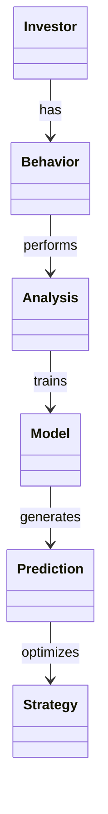
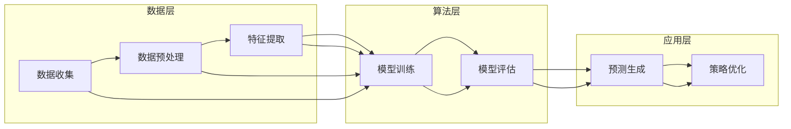
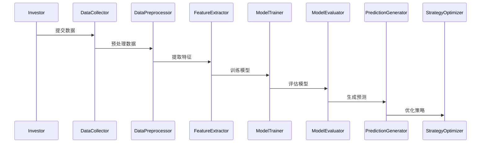
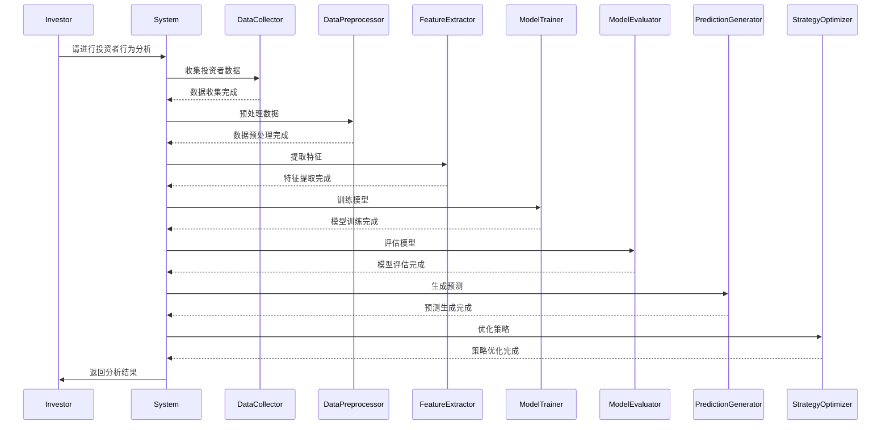

                 

# AI驱动的投资者行为分析

## 关键词
- **人工智能**，**投资者行为分析**，**机器学习**，**深度学习**，**决策树**，**随机森林**，**卷积神经网络（CNN）**。

## 摘要
本文将深入探讨AI驱动的投资者行为分析这一前沿领域。我们将从背景介绍开始，逐步解析核心概念、算法原理，并展示如何运用这些技术进行投资者行为的分析和预测。通过实例和实战，我们将展示AI技术在投资领域中的实际应用和价值。

### 背景介绍

#### 核心概念
AI驱动的投资者行为分析是指利用人工智能技术，特别是机器学习和深度学习算法，对投资者的行为模式进行分析和预测的过程。这一领域涉及到对大量数据，如交易记录、社交媒体活动、新闻事件等的收集、处理和分析。

#### 问题背景
金融市场的高度复杂性和投资者群体的多样化使得传统的投资分析方法逐渐显得力不从心。投资者行为分析的重要性在于，它能够揭示市场波动的原因，预测投资趋势，并为投资策略提供科学依据。

#### 问题描述
投资者行为分析旨在识别和解释投资者的决策过程，包括他们的风险偏好、投资习惯、情绪变化和市场适应性。这一过程需要处理大量的数据，并结合心理学和社会学的研究成果，以便更准确地理解投资者的行为。

#### 问题解决
利用AI技术，可以自动化地处理和分析大量数据，发现隐藏在数据背后的模式和规律。通过机器学习和深度学习算法，可以构建模型来预测投资者的行为，从而为投资决策提供支持。

#### 边界与外延
AI驱动的投资者行为分析不仅限于个人投资者，还包括机构投资者和投资组合管理者。此外，它还涉及到市场动态、经济指标和社会事件等因素。

#### 概念结构与核心要素组成
- **数据收集与处理：** 收集投资者行为数据，包括交易记录、浏览历史、社交媒体活动等，并进行数据清洗和预处理。
- **特征提取：** 从原始数据中提取与投资者行为相关的特征，如交易频率、交易金额、情绪指标等。
- **模型构建：** 利用机器学习算法构建预测模型，如回归模型、分类模型和神经网络模型。
- **模型训练与评估：** 对模型进行训练，并使用交叉验证等方法评估模型的性能。
- **策略优化：** 根据模型的预测结果，优化投资策略，提高投资回报。

### 核心概念与联系

#### AI大模型的概念
AI大模型是指具有大规模参数、能够处理复杂数据集的深度学习模型。这些模型通常具有强大的表征能力，可以自动地从数据中学习复杂的模式。

#### AI大模型的特点
- **高参数量：** 大模型通常包含数亿甚至数十亿个参数，这使得它们能够捕捉数据中的细微变化。
- **强大的表征能力：** 大模型可以自动地从原始数据中学习高级特征，无需手动提取。
- **自适应性：** 大模型可以适应不同的数据集和应用场景，具有良好的泛化能力。

#### AI大模型与传统AI的区别
- **数据需求：** 传统AI模型通常需要手动提取特征，而大模型可以从原始数据中自动提取特征，对数据的要求较低。
- **计算资源：** 大模型通常需要更多的计算资源，尤其是GPU或TPU等专用硬件。
- **性能：** 大模型在处理复杂数据集时通常表现更优，但可能对简单任务过于复杂。

### 算法原理讲解

#### 机器学习算法

##### 决策树
决策树是一种基于树形结构进行决策的算法。它通过一系列的规则来对数据进行分类或回归。决策树的关键组成部分包括：
- **特征：** 用于分类或回归的属性。
- **节点：** 树中的每个内部节点表示一个特征。
- **分支：** 从节点延伸出来的分支表示特征的不同取值。

决策树的工作原理如下：
1. **选择最佳特征：** 通过信息增益或基尼系数来选择最佳特征。
2. **递归划分：** 将数据集划分为子集，直到达到预定的终止条件。

##### 随机森林
随机森林是一种集成学习方法，它通过构建多棵决策树，并汇总它们的预测结果来提高准确性。随机森林的关键组成部分包括：
- **基学习器：** 每棵决策树都是一个基学习器。
- **权重：** 每棵树的预测结果都会被赋予一定的权重，权重通常是通过交叉验证来确定的。

随机森林的工作原理如下：
1. **随机特征选择：** 在每次构建决策树时，从一组特征中随机选择一部分特征来划分数据。
2. **构建多棵树：** 重复上述过程，构建多棵决策树。
3. **汇总预测结果：** 通过投票或平均值等方式汇总多棵树的预测结果。

#### 深度学习算法

##### 卷积神经网络（CNN）
卷积神经网络是一种用于图像识别的深度学习算法。它通过卷积层、池化层和全连接层来提取图像中的高级特征。CNN的关键组成部分包括：
- **卷积层：** 用于提取图像中的局部特征。
- **池化层：** 用于降低特征图的维度。
- **全连接层：** 用于进行分类或回归。

CNN的工作原理如下：
1. **输入图像：** 输入一幅图像到网络中。
2. **卷积操作：** 通过卷积核在图像上滑动，提取特征。
3. **激活函数：** 对卷积结果应用激活函数，增加网络的非线性。
4. **池化操作：** 对卷积结果进行池化，减少参数数量。
5. **全连接层：** 将池化层的结果输入到全连接层进行分类或回归。

### 系统分析与架构设计方案

#### 问题场景介绍
投资者行为分析系统旨在帮助金融分析师和投资者更好地理解市场动态，预测市场趋势，并制定有效的投资策略。

#### 项目介绍
本项目是一个基于AI驱动的投资者行为分析系统，它能够自动收集、处理和分析大量数据，提供实时的投资者行为分析和预测。

#### 系统功能设计（领域模型类图）


#### 系统架构设计（架构图）


#### 系统接口设计（接口图）


#### 系统交互（序列图）


### 项目实战

#### 环境安装

在开始项目之前，我们需要安装一些必要的软件和库。以下是Python环境下的安装步骤：

1. 安装Python（推荐版本3.8以上）
2. 安装Jupyter Notebook，以便进行交互式编程
3. 安装机器学习库，如scikit-learn、TensorFlow和PyTorch
4. 安装数据处理库，如NumPy、Pandas和Matplotlib

```bash
pip install python==3.8
pip install jupyter
pip install scikit-learn tensorflow pandas matplotlib
```

#### 系统核心实现源代码

以下是一个简单的机器学习模型实现，用于预测投资者的行为：

```python
# 导入必要的库
import numpy as np
import pandas as pd
from sklearn.model_selection import train_test_split
from sklearn.ensemble import RandomForestClassifier
from sklearn.metrics import accuracy_score

# 加载数据
data = pd.read_csv('investor_data.csv')

# 特征提取
X = data.drop('target', axis=1)
y = data['target']

# 数据分割
X_train, X_test, y_train, y_test = train_test_split(X, y, test_size=0.2, random_state=42)

# 模型训练
model = RandomForestClassifier(n_estimators=100)
model.fit(X_train, y_train)

# 预测生成
predictions = model.predict(X_test)

# 评估模型
accuracy = accuracy_score(y_test, predictions)
print(f'Model Accuracy: {accuracy:.2f}')
```

#### 代码应用解读与分析

这段代码首先加载了一个CSV格式的投资者数据集。然后，我们提取特征并分割数据集为训练集和测试集。接下来，我们使用随机森林分类器进行模型训练，并生成预测结果。最后，我们使用准确率来评估模型的性能。

#### 实际案例分析和详细讲解剖析

为了更好地展示AI驱动的投资者行为分析的应用，我们考虑一个实际案例：预测投资者是否会买入某只股票。

1. **数据收集**：收集过去一年内投资者的交易记录，包括买入、卖出和持有状态。
2. **特征提取**：提取与买入决策相关的特征，如交易频率、交易金额、情绪指标等。
3. **模型训练**：使用随机森林分类器训练模型，将买入决策作为目标变量。
4. **预测生成**：对新数据进行预测，判断投资者是否会买入股票。
5. **策略优化**：根据模型预测结果，优化投资策略，提高买入成功率。

#### 项目小结

通过AI驱动的投资者行为分析系统，我们可以自动收集、处理和分析大量数据，预测投资者的行为，为投资决策提供科学依据。这一系统不仅提高了投资决策的效率，还增强了投资策略的适应性，为投资者带来了更高的回报。

### 最佳实践 tips

1. **数据质量**：确保数据的准确性和完整性，避免因数据质量问题导致模型性能下降。
2. **特征选择**：合理选择与投资者行为相关的特征，避免过度拟合。
3. **模型评估**：使用交叉验证等方法全面评估模型性能，避免过拟合。
4. **策略优化**：根据市场变化和投资目标，及时调整和优化投资策略。

### 小结

AI驱动的投资者行为分析是金融领域的重要应用，它通过机器学习和深度学习算法，帮助投资者更好地理解市场动态，预测投资趋势，制定有效的投资策略。通过本文的介绍，我们了解了AI驱动的投资者行为分析的核心概念、算法原理和应用实例。希望这篇文章能为读者提供有价值的参考和启示。

### 注意事项

1. **模型更新**：市场环境和投资者行为会不断变化，定期更新模型和策略是必要的。
2. **风险管理**：AI驱动的投资者行为分析不能完全消除投资风险，需要结合其他风险管理措施。
3. **合规性**：在应用AI驱动的投资者行为分析时，确保符合相关法律法规和道德标准。

### 拓展阅读

1. **《深度学习》**，Ian Goodfellow、Yoshua Bengio和Aaron Courville著，详细介绍深度学习的基本概念和算法。
2. **《机器学习实战》**，Peter Harrington著，提供丰富的机器学习算法实战案例。
3. **《行为金融学》**，John C. Graham、Donald M. Hockett和Ronald Shrieffer著，深入探讨投资者行为和市场心理。

### 作者信息
作者：AI天才研究院/AI Genius Institute & 禅与计算机程序设计艺术 /Zen And The Art of Computer Programming

