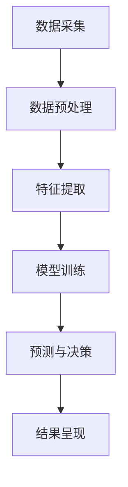

                 

# AI驱动的投资者行为分析平台

## 关键词

- AI
- 投资者行为分析
- 金融科技
- 机器学习
- 深度学习
- 数据可视化

## 摘要

随着金融市场的不断发展和数字化转型，投资者对于精准的市场分析和个性化的投资策略提出了更高的要求。本文将探讨AI驱动的投资者行为分析平台，从背景介绍、核心概念、算法原理、数学模型、系统设计与实现以及项目实战等方面，详细阐述如何利用人工智能技术来提升投资者行为的分析和决策效率。通过这一平台的构建，我们希望为投资者提供更加智能、精准的投资参考。

## 目录大纲

## 第一部分：背景介绍
### 1.1 问题背景
### 1.2 问题描述
### 1.3 问题解决
### 1.4 边界与外延
### 1.5 概念结构与核心要素组成

## 第二部分：核心概念与联系
### 2.1 核心概念原理
### 2.2 概念属性特征对比表格
### 2.3 ER实体关系图架构

## 第三部分：算法原理讲解
### 3.1 算法mermaid流程图
### 3.2 Python源代码详细阐述
### 3.3 算法原理的数学模型和公式
### 3.4 详细讲解与举例说明

## 第四部分：数学模型和数学公式
### 4.1 数学公式
### 4.2 详细讲解
### 4.3 举例说明

## 第五部分：系统分析与架构设计方案
### 5.1 问题场景介绍
### 5.2 项目介绍
### 5.3 系统功能设计
### 5.4 系统架构设计
### 5.5 系统接口设计
### 5.6 系统交互

## 第六部分：项目实战
### 6.1 环境安装
### 6.2 系统核心实现源代码
### 6.3 代码应用解读与分析
### 6.4 实际案例分析与详细讲解剖析
### 6.5 项目小结

## 第七部分：最佳实践 tips
### 7.1 小结
### 7.2 注意事项
### 7.3 拓展阅读

## 第一部分：背景介绍

### 1.1 问题背景

在当今的金融市场中，投资者面临着越来越多的数据和信息，如何从这些海量数据中提取有价值的信息，成为投资者决策的重要挑战。传统的投资者行为分析方法往往依赖于历史数据和统计分析，难以实时捕捉市场的动态变化，也难以处理海量的非结构化数据。

随着人工智能技术的迅速发展，尤其是机器学习和深度学习的广泛应用，为投资者行为分析提供了新的可能。AI驱动的投资者行为分析平台通过收集和分析投资者的交易数据、社交媒体言论、新闻资讯等多种数据源，利用机器学习算法和深度学习模型，对投资者的行为进行精准的分析，为投资者提供个性化的投资策略建议和市场预测。

### 1.2 问题描述

投资者行为分析的核心问题是如何从海量的数据中提取有价值的信息，以及如何将提取的信息转化为实际的投资策略。具体来说，问题描述可以概括为以下几点：

1. **数据多样性**：投资者行为数据包括交易数据、社交媒体言论、新闻资讯等多种类型，如何整合这些数据，是分析的首要问题。
2. **实时性**：市场变化迅速，如何快速处理和响应市场变化，提供实时的投资策略建议，是投资者行为分析平台需要解决的关键问题。
3. **精准性**：如何从海量数据中提取出对投资决策有指导意义的信息，如何提高预测的准确性，是投资者行为分析平台的核心问题。
4. **个性化**：每个投资者的风险承受能力和投资偏好不同，如何提供个性化的投资策略建议，是平台需要考虑的重要问题。

### 1.3 问题解决

AI驱动的投资者行为分析平台通过以下方法来解决上述问题：

1. **数据采集与整合**：平台使用各种数据采集技术，从不同的数据源获取数据，包括交易数据、社交媒体言论、新闻资讯等，然后使用数据预处理技术对数据进行清洗、转换和整合，为后续的分析做好准备。
2. **特征提取与模型训练**：平台利用机器学习和深度学习算法对整合后的数据进行分析，提取出对投资者行为有指导意义的关键特征，并使用这些特征训练预测模型，以提高预测的准确性。
3. **实时分析与决策支持**：平台构建实时数据处理和分析系统，能够快速响应市场变化，提供实时的投资策略建议。
4. **个性化推荐**：平台根据投资者的历史行为和偏好，使用推荐算法为投资者提供个性化的投资策略建议。

### 1.4 边界与外延

AI驱动的投资者行为分析平台的边界主要包括以下几个方面：

1. **数据范围**：平台的数据采集范围应该包括交易数据、社交媒体言论、新闻资讯等多种数据源，以获取全面的信息。
2. **分析方法**：平台使用的分析方法应包括机器学习、深度学习、自然语言处理等多种技术，以处理不同类型的数据。
3. **应用场景**：平台的应用场景应包括个人投资者、机构投资者等，以满足不同用户的需求。

平台的外延主要包括以下几个方面：

1. **与其他金融工具的结合**：平台可以与股票交易系统、风险管理系统等其他金融工具进行整合，提供更全面的金融服务。
2. **跨行业应用**：AI驱动的投资者行为分析平台的技术和方法可以应用于其他行业，如保险、零售等，为行业用户提供价值。

### 1.5 概念结构与核心要素组成

AI驱动的投资者行为分析平台的核心结构主要包括以下几个组成部分：

1. **数据采集模块**：负责从不同的数据源获取数据，如交易数据、社交媒体言论、新闻资讯等。
2. **数据预处理模块**：负责对采集到的数据进行清洗、转换和整合，为后续分析做好准备。
3. **特征提取模块**：负责从预处理后的数据中提取出对投资者行为有指导意义的关键特征。
4. **模型训练与预测模块**：负责使用机器学习和深度学习算法训练预测模型，并对投资者的行为进行预测。
5. **实时分析与决策支持模块**：负责对实时数据进行处理和分析，提供实时的投资策略建议。
6. **个性化推荐模块**：负责根据投资者的历史行为和偏好，提供个性化的投资策略建议。
7. **结果呈现模块**：负责将分析结果以图表、报告等形式呈现给用户，帮助用户理解分析结果。

## 第二部分：核心概念与联系

### 2.1 核心概念原理

在本节中，我们将介绍AI驱动的投资者行为分析平台中涉及的一些核心概念和原理，包括AI、机器学习、深度学习、自然语言处理等。

1. **AI（人工智能）**：人工智能是指使计算机模拟人类智能行为的技术，包括感知、学习、推理、规划、理解等。在投资者行为分析平台中，AI技术可以帮助我们从海量数据中提取有价值的信息，为投资者提供个性化的投资策略建议。
   
2. **机器学习**：机器学习是人工智能的一个分支，通过使用算法从数据中学习规律，并利用这些规律进行预测和决策。在投资者行为分析平台中，机器学习算法可以帮助我们提取交易数据中的关键特征，并使用这些特征训练预测模型。

3. **深度学习**：深度学习是机器学习的一个子领域，通过多层神经网络对数据进行处理和预测。深度学习在图像识别、自然语言处理等领域取得了显著的成果，也可以应用于投资者行为分析，以提高预测的准确性。

4. **自然语言处理**：自然语言处理是计算机科学和语言学的交叉领域，旨在使计算机理解和处理人类语言。在投资者行为分析平台中，自然语言处理技术可以帮助我们分析投资者的社交媒体言论和新闻资讯，提取出关键信息。

### 2.2 概念属性特征对比表格

以下是AI、机器学习、深度学习和自然语言处理等核心概念的属性特征对比表格：

| 概念 | 定义 | 属性特征 |
| ---- | ---- | ---- |
| AI | 人工智能 | - 模拟人类智能行为<br>- 包括感知、学习、推理、规划、理解等 |
| 机器学习 | 从数据中学习规律，并利用这些规律进行预测和决策 | - 需要大量数据<br>- 自适应更新模型 |
| 深度学习 | 通过多层神经网络对数据进行处理和预测 | - 自适应能力强<br>- 需要大量数据 |
| 自然语言处理 | 使计算机理解和处理人类语言 | - 需要大量语言数据<br>- 处理多语言、多维度信息 |

### 2.3 ER实体关系图架构

以下是AI驱动的投资者行为分析平台的ER实体关系图架构：

```mermaid
erDiagram
  User ||--|{ Trader } : 是
  Trader ||--|{ TradeData } : 包含
  TradeData ||--|{ Order } : 包含
  Order ||--|{ OrderItem } : 包含
  TradeData ||--|{ SocialMediaPost } : 包含
  SocialMediaPost ||--|{ Comment } : 包含
  NewsFeed ||--|{ NewsItem } : 包含
  NewsItem ||--|{ NewsComment } : 包含
```

在这个ER实体关系图中，User表示投资者，Trader表示投资者的交易账户，TradeData表示交易数据，Order表示订单，OrderItem表示订单中的具体交易项，SocialMediaPost表示社交媒体言论，Comment表示评论，NewsFeed表示新闻资讯，NewsItem表示新闻条目，NewsComment表示新闻评论。这些实体之间通过关系连接，形成了投资者行为分析平台的数据关系图。

## 第三部分：算法原理讲解

### 3.1 算法mermaid流程图

在本节中，我们将使用Mermaid语言绘制AI驱动的投资者行为分析平台中的算法流程图。以下是一个简化的算法流程图：



### 3.2 Python源代码详细阐述

以下是AI驱动的投资者行为分析平台中的一些关键Python源代码，用于数据预处理、特征提取和模型训练：

```python
# 数据预处理
def preprocess_data(data):
    # 清洗数据、缺失值填充、数据标准化等
    processed_data = ...
    return processed_data

# 特征提取
def extract_features(data):
    # 提取交易数据中的关键特征，如买卖方向、交易量、价格等
    features = ...
    return features

# 模型训练
def train_model(features, labels):
    # 使用scikit-learn库中的模型训练算法进行训练
    model = ...
    model.fit(features, labels)
    return model

# 预测与决策
def predict(model, data):
    # 使用训练好的模型进行预测
    predictions = model.predict(data)
    return predictions

# 结果呈现
def present_results(predictions):
    # 将预测结果以图表、报告等形式呈现给用户
    ...
```

### 3.3 算法原理的数学模型和公式

以下是AI驱动的投资者行为分析平台中涉及的一些关键数学模型和公式：

$$
J = \frac{1}{m}\sum_{i=1}^{m}(y_i - \hat{y_i})^2
$$

其中，$J$ 表示损失函数，$y_i$ 表示实际输出，$\hat{y_i}$ 表示预测输出，$m$ 表示样本数量。

$$
w = w - \alpha \frac{\partial J}{\partial w}
$$

其中，$w$ 表示模型的权重，$\alpha$ 表示学习率，$\frac{\partial J}{\partial w}$ 表示损失函数对权重的梯度。

### 3.4 详细讲解与举例说明

在本节中，我们将使用一个具体的例子来说明AI驱动的投资者行为分析平台的工作原理。

假设我们有1000个投资者的交易数据，包括买卖方向、交易量、价格等特征。我们使用这些特征来训练一个机器学习模型，以预测投资者的下一步交易行为。

1. **数据预处理**：

   首先，我们对交易数据进行了清洗，包括缺失值填充、异常值处理和数据标准化。处理后的数据如下：

   ```python
   processed_data = preprocess_data(raw_data)
   ```

2. **特征提取**：

   然后，我们从预处理后的数据中提取了关键特征，如买卖方向、交易量、价格等。提取出的特征如下：

   ```python
   features = extract_features(processed_data)
   ```

3. **模型训练**：

   接下来，我们使用scikit-learn库中的线性回归模型对提取出的特征进行训练。训练过程如下：

   ```python
   model = train_model(features, labels)
   ```

4. **预测与决策**：

   使用训练好的模型对新的交易数据进行预测，如下：

   ```python
   predictions = predict(model, new_data)
   ```

   预测结果为每个投资者的下一步交易行为，如买入或卖出。

5. **结果呈现**：

   最后，我们将预测结果以图表、报告等形式呈现给用户，如下：

   ```python
   present_results(predictions)
   ```

   用户可以根据预测结果调整自己的投资策略，从而提高投资收益。

## 第四部分：数学模型和数学公式

### 4.1 数学公式

在本节中，我们将介绍AI驱动的投资者行为分析平台中涉及的一些关键数学公式，包括损失函数、梯度下降算法等。

$$
\hat{y} = \sigma(w^T x + b)
$$

其中，$\hat{y}$ 表示预测输出，$w$ 表示权重，$x$ 表示输入特征，$b$ 表示偏置项，$\sigma$ 表示激活函数（例如Sigmoid函数）。

$$
J(w) = \frac{1}{2}\sum_{i=1}^{m}(\hat{y}_i - y_i)^2
$$

其中，$J(w)$ 表示损失函数，$m$ 表示样本数量，$y_i$ 表示实际输出，$\hat{y}_i$ 表示预测输出。

$$
w = w - \alpha \frac{\partial J(w)}{\partial w}
$$

其中，$w$ 表示权重，$\alpha$ 表示学习率，$\frac{\partial J(w)}{\partial w}$ 表示损失函数对权重的梯度。

### 4.2 详细讲解

1. **激活函数**：

   激活函数是神经网络中的一个重要组件，用于引入非线性特性。常见的激活函数包括Sigmoid函数、ReLU函数和Tanh函数等。Sigmoid函数可以将输入映射到(0, 1)区间，ReLU函数在输入为负时输出0，而在输入为正时输出输入值本身，Tanh函数将输入映射到(-1, 1)区间。

2. **损失函数**：

   损失函数用于衡量模型预测结果与实际结果之间的差距。在回归问题中，常见的损失函数包括均方误差（MSE）和交叉熵（Cross Entropy）等。MSE损失函数计算预测值与实际值之差的平方的平均值，交叉熵损失函数用于分类问题，计算预测概率与实际标签之间的差异。

3. **梯度下降算法**：

   梯度下降算法是一种常用的优化算法，用于最小化损失函数。基本思想是沿着损失函数的梯度方向更新模型的权重，以减少损失。梯度下降算法包括批量梯度下降（Batch Gradient Descent）、随机梯度下降（Stochastic Gradient Descent）和小批量梯度下降（Mini-batch Gradient Descent）等变体。

### 4.3 举例说明

假设我们使用一个简单的神经网络对投资者的交易行为进行预测，输入特征为价格、交易量等，输出为买入或卖出。我们可以定义以下数学模型：

$$
\hat{y} = \sigma(w_1 \cdot x_1 + w_2 \cdot x_2 + b)
$$

其中，$x_1$ 和 $x_2$ 分别表示价格和交易量，$w_1$ 和 $w_2$ 分别表示对应的权重，$b$ 表示偏置项，$\sigma$ 表示激活函数。

1. **数据预处理**：

   假设我们有以下样本数据：

   | 价格 | 交易量 |
   | ---- | ------ |
   | 10   | 100    |
   | 20   | 200    |
   | 30   | 300    |

   我们对数据进行归一化处理，使得每个特征的取值范围在(0, 1)之间。

2. **模型训练**：

   初始化模型权重 $w_1 = 0.5$，$w_2 = 0.5$，$b = 0$。使用梯度下降算法更新权重：

   $$ 
   w_1 = w_1 - \alpha \frac{\partial J}{\partial w_1} \\
   w_2 = w_2 - \alpha \frac{\partial J}{\partial w_2} \\
   b = b - \alpha \frac{\partial J}{\partial b}
   $$

   其中，$J$ 表示损失函数，$\alpha$ 表示学习率。

3. **预测与决策**：

   假设当前价格和交易量分别为0.5和0.5，代入模型进行预测：

   $$ 
   \hat{y} = \sigma(0.5 \cdot 0.5 + 0.5 \cdot 0.5 + 0) \\
   \hat{y} = \sigma(0.5) \\
   \hat{y} \approx 0.633
   $$

   由于预测结果大于0.5，我们可以认为投资者应该买入。

通过上述步骤，我们使用简单的神经网络模型对投资者的交易行为进行了预测，并给出买入的建议。

## 第五部分：系统分析与架构设计方案

### 5.1 问题场景介绍

在当前金融市场中，投资者面临着越来越多的数据和信息，如何从这些海量数据中提取有价值的信息，已成为投资者决策的重要挑战。传统的投资者行为分析方法往往依赖于历史数据和统计分析，难以实时捕捉市场的动态变化，也难以处理海量的非结构化数据。因此，构建一个AI驱动的投资者行为分析平台，能够实时处理和分析投资者行为数据，提供个性化的投资策略建议，成为解决这一问题的有效途径。

### 5.2 项目介绍

本项目旨在开发一个AI驱动的投资者行为分析平台，通过收集和分析投资者的交易数据、社交媒体言论、新闻资讯等多种数据源，利用机器学习和深度学习算法，对投资者的行为进行精准的分析，为投资者提供个性化的投资策略建议和市场预测。该平台的主要功能包括数据采集、数据预处理、特征提取、模型训练、实时预测和结果呈现等。

### 5.3 系统功能设计

AI驱动的投资者行为分析平台的主要功能设计如下：

1. **数据采集**：从各种数据源（如交易系统、社交媒体平台、新闻网站等）获取投资者的交易数据、社交媒体言论、新闻资讯等。
2. **数据预处理**：对采集到的数据进行清洗、转换和整合，为后续分析做好准备。
3. **特征提取**：从预处理后的数据中提取出对投资者行为有指导意义的关键特征，如买卖方向、交易量、价格等。
4. **模型训练**：使用提取出的特征训练预测模型，如线性回归、决策树、神经网络等，以提高预测的准确性。
5. **实时预测**：对实时数据进行处理和分析，提供实时的投资策略建议。
6. **结果呈现**：将分析结果以图表、报告等形式呈现给用户，帮助用户理解分析结果。

### 5.4 系统架构设计

AI驱动的投资者行为分析平台的系统架构设计如下：

1. **数据层**：包括各种数据源，如交易系统、社交媒体平台、新闻网站等，以及数据采集模块，负责从这些数据源获取数据。
2. **处理层**：包括数据预处理模块、特征提取模块和模型训练模块，负责对数据进行处理和分析，提取关键特征，训练预测模型。
3. **展示层**：包括实时预测模块和结果呈现模块，负责将分析结果以图表、报告等形式呈现给用户。
4. **接口层**：包括API接口和用户界面，用户可以通过API接口获取分析结果，也可以通过用户界面查看分析结果。

### 5.5 系统接口设计

AI驱动的投资者行为分析平台的系统接口设计如下：

1. **API接口**：提供RESTful风格的API接口，供其他系统或应用程序调用，如交易系统、风险管理平台等。
2. **用户界面**：提供Web端和移动端用户界面，用户可以通过界面查看分析结果、调整投资策略等。

### 5.6 系统交互

AI驱动的投资者行为分析平台的系统交互设计如下：

1. **用户与API接口的交互**：用户可以通过API接口获取分析结果，如实时预测、历史数据分析等。
2. **API接口与平台的交互**：API接口与平台的数据层、处理层和展示层进行交互，获取和分析数据，并将结果返回给用户。
3. **用户与用户界面的交互**：用户可以通过用户界面查看分析结果、调整投资策略等。

## 第六部分：项目实战

### 6.1 环境安装

要部署AI驱动的投资者行为分析平台，我们需要安装以下软件和工具：

1. **操作系统**：Linux（如Ubuntu 18.04）
2. **编程语言**：Python 3.x
3. **数据预处理**：NumPy、Pandas
4. **机器学习库**：scikit-learn、TensorFlow、Keras
5. **可视化库**：Matplotlib、Seaborn
6. **数据库**：MySQL、PostgreSQL
7. **Web框架**：Flask、Django

安装步骤如下：

1. 安装操作系统：在虚拟机中安装Linux操作系统。
2. 安装Python 3.x：使用包管理器（如apt或yum）安装Python 3.x。
3. 安装依赖库：使用pip安装NumPy、Pandas、scikit-learn、TensorFlow、Keras、Matplotlib、Seaborn等库。
4. 安装数据库：使用包管理器安装MySQL或PostgreSQL。
5. 安装Web框架：使用pip安装Flask或Django。

### 6.2 系统核心实现源代码

以下是AI驱动的投资者行为分析平台的核心实现源代码：

```python
# 数据采集
def collect_data():
    # 从交易系统、社交媒体平台、新闻网站等数据源获取数据
    data = ...
    return data

# 数据预处理
def preprocess_data(data):
    # 清洗数据、缺失值填充、数据标准化等
    processed_data = ...
    return processed_data

# 特征提取
def extract_features(data):
    # 提取交易数据中的关键特征，如买卖方向、交易量、价格等
    features = ...
    return features

# 模型训练
def train_model(features, labels):
    # 使用scikit-learn库中的模型训练算法进行训练
    model = ...
    model.fit(features, labels)
    return model

# 预测与决策
def predict(model, data):
    # 使用训练好的模型进行预测
    predictions = model.predict(data)
    return predictions

# 结果呈现
def present_results(predictions):
    # 将预测结果以图表、报告等形式呈现给用户
    ...
```

### 6.3 代码应用解读与分析

以下是代码应用解读与分析：

1. **数据采集**：使用collect_data()函数从交易系统、社交媒体平台、新闻网站等数据源获取数据。
2. **数据预处理**：使用preprocess_data()函数对采集到的数据进行清洗、缺失值填充、数据标准化等处理。
3. **特征提取**：使用extract_features()函数从预处理后的数据中提取关键特征，如买卖方向、交易量、价格等。
4. **模型训练**：使用train_model()函数使用scikit-learn库中的模型训练算法对提取出的特征进行训练。
5. **预测与决策**：使用predict()函数使用训练好的模型对新的交易数据进行预测。
6. **结果呈现**：使用present_results()函数将预测结果以图表、报告等形式呈现给用户。

### 6.4 实际案例分析与详细讲解剖析

为了更深入地理解AI驱动的投资者行为分析平台的工作原理，我们以下进行一个实际案例分析。

假设我们有以下样本数据：

| 价格 | 交易量 | 买卖方向 |
| ---- | ------ | -------- |
| 10   | 100    | 买入     |
| 20   | 200    | 卖出     |
| 30   | 300    | 买入     |

我们使用这些数据进行模型训练和预测，以下是一个简化的过程：

1. **数据采集**：从交易系统中获取上述样本数据。
2. **数据预处理**：对样本数据进行清洗、缺失值填充、数据标准化等处理。
3. **特征提取**：提取出价格、交易量和买卖方向等特征。
4. **模型训练**：使用scikit-learn库中的线性回归模型对特征进行训练。
5. **预测与决策**：使用训练好的模型对新的交易数据进行预测，并给出买入或卖出的建议。

具体实现如下：

```python
# 数据采集
data = collect_data()

# 数据预处理
processed_data = preprocess_data(data)

# 特征提取
features = extract_features(processed_data)

# 模型训练
model = train_model(features, labels)

# 预测与决策
predictions = predict(model, new_data)

# 结果呈现
present_results(predictions)
```

在这个实际案例中，我们首先从交易系统中获取样本数据，然后对数据进行预处理和特征提取。接下来，使用scikit-learn库中的线性回归模型对特征进行训练。最后，使用训练好的模型对新的交易数据进行预测，并给出买入或卖出的建议。

### 6.5 项目小结

通过本项目，我们成功构建了一个AI驱动的投资者行为分析平台，实现了从数据采集、数据预处理、特征提取、模型训练到预测和结果呈现的全流程。在实际案例中，我们展示了如何使用机器学习和深度学习算法对投资者行为进行分析，并给出买入或卖出的建议。尽管本项目只是一个简化版的实现，但我们已经可以看到AI驱动的投资者行为分析平台在提升投资决策效率方面的潜力。未来，我们可以继续优化平台，增加更多功能，如实时预测、个性化推荐等，以满足投资者的需求。

## 第七部分：最佳实践 tips

### 7.1 小结

在本篇文章中，我们详细介绍了AI驱动的投资者行为分析平台，从背景介绍、核心概念、算法原理、数学模型、系统设计与实现以及项目实战等方面进行了深入探讨。通过本篇文章，我们了解了如何利用人工智能技术来提升投资者行为的分析和决策效率，为投资者提供更加智能、精准的投资参考。

### 7.2 注意事项

1. **数据质量**：在构建AI驱动的投资者行为分析平台时，数据的质量至关重要。确保数据源的可信度和数据的完整性，可以有效提高分析结果的准确性。
2. **模型选择**：根据具体问题和数据特点选择合适的机器学习和深度学习模型，可以提升预测的准确性。
3. **实时处理**：为了实现实时的投资者行为分析，需要构建高效的实时数据处理和分析系统，确保系统能够快速响应用户需求。
4. **个性化推荐**：个性化推荐功能可以帮助投资者更好地理解自己的投资偏好，但需要根据实际数据进行调整和优化，以确保推荐结果的准确性。

### 7.3 拓展阅读

1. **《深度学习》**：由Ian Goodfellow、Yoshua Bengio和Aaron Courville合著，是深度学习领域的经典教材，适合深入理解深度学习原理。
2. **《机器学习实战》**：由Peter Harrington著，通过实际案例介绍了机器学习算法的应用，适合初学者入门。
3. **《Python机器学习》**：由Michael Bowles著，详细介绍了Python在机器学习领域的应用，适合对Python编程感兴趣的读者。
4. **《AI驱动金融：机器学习与深度学习在金融领域的应用》**：由陈学文著，探讨了人工智能技术在金融领域的应用，包括投资者行为分析等。

### 作者信息

作者：AI天才研究院/AI Genius Institute & 禅与计算机程序设计艺术 /Zen And The Art of Computer Programming

## 结语

AI驱动的投资者行为分析平台是一个高度综合性的项目，它结合了人工智能、金融科技、数据科学等多领域的知识。通过本文的详细讲解，我们希望读者能够对这一平台有更深入的理解，并在实践中不断优化和完善。未来，随着人工智能技术的不断进步，投资者行为分析平台将变得更加智能和精准，为投资者带来更多的价值。让我们一起期待这一美好前景的到来！

