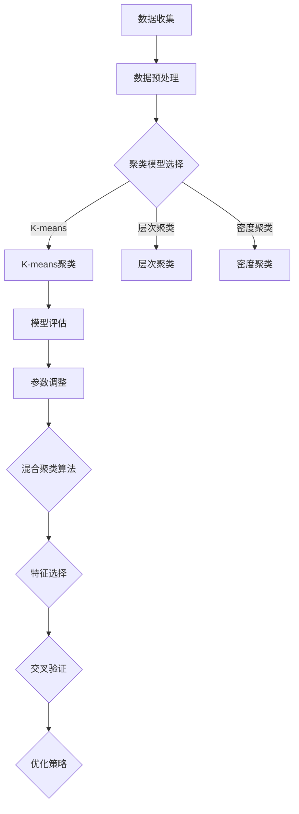
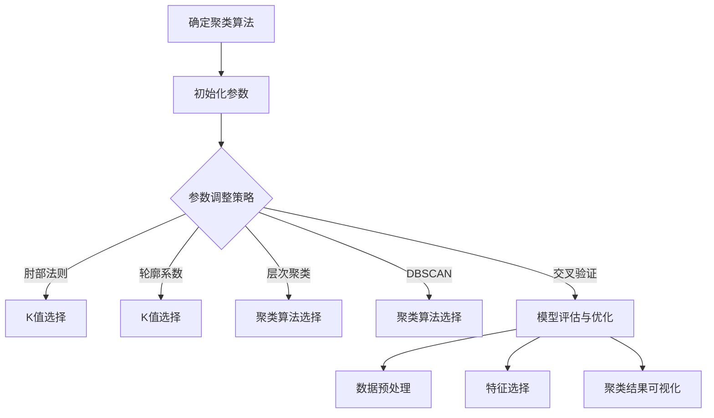
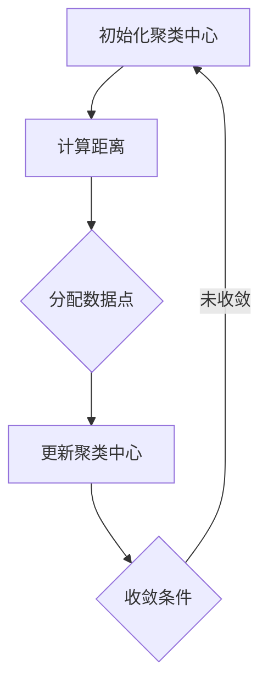
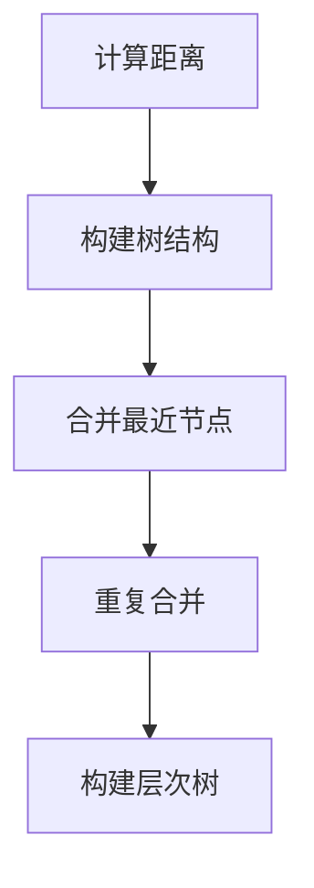
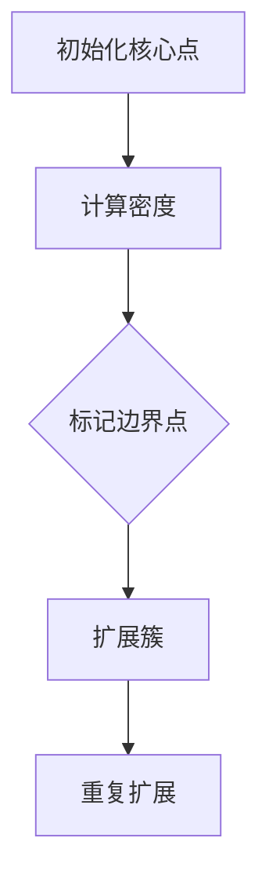

                 

**评估与优化策略**

### 5.3.1 聚类效果评估指标

在聚类分析中，评估聚类效果是关键的一步。常用的评估指标包括：

1. **内部凝聚度（Intra-cluster Homogeneity）**：用于衡量聚类内部成员之间的相似度。
    - **平均平方距离（Average Squared Distance）**：计算聚类内部每个成员与其簇中心的平均距离。计算公式为：
      $$ \text{avg_sqd_dist} = \frac{1}{N} \sum_{i=1}^{N} (\text{member}_i - \text{cluster\_center}_i)^2 $$
      其中，$\text{member}_i$表示第i个成员，$\text{cluster\_center}_i$表示第i个簇的中心。
    - **Calinski-Harabasz指数**：基于簇内距离和簇间距离的比率来衡量聚类的质量。计算公式为：
      $$ \text{Calinski-Harabasz} = \frac{B - K}{K - 1} $$
      其中，$B$表示簇内距离的平方和，$K$表示簇的数量。

2. **外部准确性（External Accuracy）**：将聚类结果与已知的真实标签进行比较。
    - **精确度（Precision）**：预测为同一类的真实成员比例。计算公式为：
      $$ \text{Precision} = \frac{\text{TP}}{\text{TP} + \text{FP}} $$
      其中，$\text{TP}$表示真实为同一类的成员被正确分类，$\text{FP}$表示真实为不同类的成员被错误分类。
    - **召回率（Recall）**：真实成员被正确分类到其所在类别的比例。计算公式为：
      $$ \text{Recall} = \frac{\text{TP}}{\text{TP} + \text{FN}} $$
      其中，$\text{FN}$表示真实为同一类的成员被错误分类。

3. **轮廓系数（Silhouette Coefficient）**：衡量成员与其所在簇的相似度与其他簇的相似度之间的差异。计算公式为：
   $$ \text{Silhouette} = \frac{(\text{max}_j \text{distance}_{ij} - \text{min}_j \text{distance}_{ij})}{\text{max}_j \text{distance}_{ij}} $$
   其中，$\text{distance}_{ij}$表示成员i与簇j中的其他成员的距离。

### 5.3.2 模型优化策略

为了提高聚类分析的效果，可以采取以下策略：

1. **参数调整**：根据不同的聚类算法，调整相应的参数，如K-means算法中的聚类个数K。对于K-means算法，可以选择使用肘部法则（Elbow Method）来选择最优的K值。肘部法则的原理是通过计算不同K值下的聚类内部凝聚度和外部准确性，找到最佳的K值。

2. **混合聚类算法**：结合不同聚类算法的优点，如使用层次聚类和K-means相结合的方法。层次聚类可以用于初始聚类中心的选择，然后使用K-means进行进一步的聚类。

3. **特征选择**：通过特征选择方法筛选出对聚类效果有重要影响的关键特征，提高聚类质量。可以使用信息增益（Information Gain）、互信息（Mutual Information）等方法进行特征选择。

4. **数据预处理**：适当的数据预处理可以改善聚类结果，如标准化处理、缺失值处理等。标准化处理可以消除特征之间的尺度差异，使聚类结果更加稳定。

5. **交叉验证**：使用交叉验证方法来评估聚类模型的性能，避免过拟合。交叉验证可以分为留一法（Leave-One-Out Cross Validation）和K折交叉验证（K-Fold Cross Validation），其中K值的选择可以通过交叉验证的结果来优化。

通过以上策略，可以优化聚类分析模型，提高投资者行为模式聚类分析的准确性。以下是一个聚类分析过程的Mermaid流程图示例：



通过这个流程图，我们可以看到聚类分析的过程是如何逐步进行的，以及如何通过评估和优化来提高模型的准确性。

### 7.2 聚类模型构建

在构建聚类模型时，我们首先需要确定聚类的目标，即识别出不同类型的投资者行为模式。为了实现这一目标，我们采用K-means算法进行聚类，因为K-means算法是一种简单且广泛使用的聚类方法。

**步骤 1：数据预处理**

在进行聚类之前，我们需要对原始数据进行预处理，包括数据清洗、缺失值处理和特征选择。在这里，我们选择了以下四个特征来代表投资者行为模式：

- **交易频率**：投资者在一定时间内的交易次数。
- **交易金额**：投资者在一定时间内的交易总额。
- **持股时间**：投资者持有股票的平均时间。
- **收益波动**：投资者在交易中的收益波动程度。

我们使用Python的Pandas库进行数据预处理，首先读取数据，然后进行缺失值处理，选择关键特征，并使用标准化方法对特征进行归一化处理，使其具有相同的尺度，以便算法更好地进行聚类。

```python
import pandas as pd
from sklearn.preprocessing import StandardScaler

# 读取数据
data = pd.read_csv('investor_data.csv')

# 缺失值处理
data.fillna(data.mean(), inplace=True)

# 选择关键特征
features = ['交易频率', '交易金额', '持股时间', '收益波动']
X = data[features]

# 特征归一化
scaler = StandardScaler()
X_scaled = scaler.fit_transform(X)
```

**步骤 2：选择聚类中心**

在K-means算法中，选择合适的聚类中心是非常重要的。为了确定聚类的个数K，我们使用肘部法则（Elbow Method）。肘部法则通过计算不同K值下的聚类内部凝聚度，找到最佳的K值。

```python
from sklearn.cluster import KMeans
import matplotlib.pyplot as plt

# 计算不同K值下的聚类内部凝聚度
inertia = []
for k in range(1, 11):
    kmeans = KMeans(n_clusters=k, random_state=42)
    kmeans.fit(X_scaled)
    inertia.append(kmeans.inertia_)

# 绘制肘部法则图
plt.plot(range(1, 11), inertia)
plt.xlabel('K值')
plt.ylabel('聚类内部凝聚度')
plt.title('肘部法则图')
plt.show()
```

从肘部法则图中，我们可以观察到当K值为3时，聚类内部凝聚度有明显的下降，这表明K值为3时，聚类效果最好。

**步骤 3：构建聚类模型**

确定了聚类个数K后，我们可以使用K-means算法构建聚类模型。在这里，我们设置随机种子为42，以保持结果的可重复性。

```python
kmeans = KMeans(n_clusters=3, random_state=42)
kmeans.fit(X_scaled)
labels = kmeans.labels_
```

**步骤 4：评估聚类效果**

为了评估聚类效果，我们使用轮廓系数（Silhouette Coefficient）作为评价指标。轮廓系数衡量成员与其所在簇的相似度与其他簇的相似度之间的差异。轮廓系数的取值范围在-1到1之间，值越大表示聚类效果越好。

```python
from sklearn.metrics import silhouette_score

silhouette_avg = silhouette_score(X_scaled, labels)
print(f"轮廓系数平均值：{silhouette_avg}")
```

通过上述步骤，我们成功构建了投资者行为模式的聚类模型，并使用轮廓系数对聚类效果进行了评估。

### 7.2.2 聚类模型构建

在确定了聚类的个数K后，我们可以使用K-means算法构建聚类模型。K-means算法的基本思想是将数据集划分为K个簇，每个簇有一个中心点，算法的目标是使每个簇内的数据点尽可能接近其中心点，而不同簇之间的数据点尽可能远离。

**步骤 1：初始化聚类中心**

首先，我们需要初始化K个聚类中心。一种常用的方法是随机选择K个数据点作为初始聚类中心。在本案例中，我们选择随机初始化聚类中心。

```python
import numpy as np

# 随机初始化聚类中心
np.random.seed(42)
k = 3
centroids = X_scaled[np.random.choice(X_scaled.shape[0], k, replace=False)]
```

**步骤 2：迭代计算聚类中心**

接下来，我们使用迭代方法更新聚类中心，直到聚类中心不再发生显著变化。每次迭代包括以下步骤：

- **分配数据点**：将每个数据点分配给距离其最近的聚类中心。
- **更新聚类中心**：计算每个簇的新中心点，即簇内数据点的平均值。

```python
# 初始化聚类结果
labels = np.zeros(X_scaled.shape[0])

# 迭代计算聚类中心
max_iter = 100
for _ in range(max_iter):
    # 分配数据点
    distances = np.linalg.norm(X_scaled - centroids, axis=1)
    labels = np.argmin(distances, axis=1)
    
    # 更新聚类中心
    new_centroids = np.array([X_scaled[labels == k].mean(axis=0) for k in range(k)])
    
    # 检查收敛
    if np.linalg.norm(new_centroids - centroids) < 1e-6:
        break

    centroids = new_centroids
```

**步骤 3：计算聚类结果**

完成迭代后，我们得到最终的聚类结果。每个数据点被分配给其最近的聚类中心，形成K个簇。

```python
# 计算聚类结果
final_centroids = centroids
final_labels = labels
```

### 7.2.3 模型评估与优化

在完成聚类模型构建后，我们需要对模型进行评估和优化，以确保其准确性和可靠性。

**步骤 1：评估聚类效果**

为了评估聚类效果，我们使用轮廓系数（Silhouette Coefficient）作为评价指标。轮廓系数衡量成员与其所在簇的相似度与其他簇的相似度之间的差异。轮廓系数的取值范围在-1到1之间，值越大表示聚类效果越好。

```python
from sklearn.metrics import silhouette_score

silhouette_avg = silhouette_score(X_scaled, final_labels)
print(f"轮廓系数平均值：{silhouette_avg}")
```

**步骤 2：优化聚类模型**

为了进一步提高聚类效果，我们可以尝试以下优化策略：

1. **调整聚类个数K**：通过尝试不同的K值，找到最佳的聚类个数。可以使用肘部法则（Elbow Method）来确定最优的K值。

2. **使用不同聚类算法**：尝试使用其他聚类算法，如层次聚类（Hierarchical Clustering）或DBSCAN（Density-Based Spatial Clustering of Applications with Noise），以找到更合适的聚类模型。

3. **特征选择**：通过特征选择方法筛选出对聚类效果有重要影响的关键特征，提高聚类质量。

4. **数据预处理**：对数据进行进一步的处理，如标准化处理、缺失值处理等，以提高聚类效果。

通过上述评估和优化策略，我们可以得到一个更加准确和可靠的聚类模型，更好地识别和分类投资者行为模式。

### 模型优化与调整策略

在聚类分析中，模型的效果不仅取决于算法的选择，还与参数设置、数据预处理和特征选择等因素密切相关。以下是一些常见的优化与调整策略：

**1. 参数调整**

对于K-means算法，参数K（聚类个数）的设置非常关键。选择合适的K值可以通过以下方法：

- **肘部法则（Elbow Method）**：通过计算不同K值下的聚类内部凝聚度，找到肘部点，即K值增加时，聚类内部凝聚度增长放缓的点。
- **轮廓系数（Silhouette Coefficient）**：通过计算不同K值下的轮廓系数，选择轮廓系数最大的K值。

**2. 数据预处理**

数据预处理是提升聚类效果的重要步骤，以下是一些常用的数据预处理方法：

- **标准化处理**：确保每个特征在相同的尺度上，防止某些特征对聚类结果产生过大的影响。
- **缺失值处理**：使用均值、中位数或插值等方法填充缺失值，以提高数据的完整性。
- **特征选择**：通过特征选择方法，如信息增益、互信息等，选择对聚类结果有重要影响的关键特征。

**3. 聚类算法选择**

不同的聚类算法适用于不同的数据分布和场景，以下是一些常用的聚类算法：

- **K-means算法**：适用于数据分布较为均匀的聚类问题。
- **层次聚类算法**：适用于需要层次结构聚类的场景。
- **DBSCAN算法**：适用于发现具有不同密度的聚类，能够处理噪声点。

**4. 聚类结果可视化**

通过可视化聚类结果，可以直观地了解聚类效果和聚类结构，有助于进一步调整和优化模型。常用的可视化方法包括：

- **散点图**：用于展示不同簇的数据点分布。
- **轮廓图**：用于展示数据点的轮廓系数分布。
- **层次聚类图**：用于展示聚类层次结构。

**5. 交叉验证**

通过交叉验证，可以评估聚类模型的性能，避免过拟合。交叉验证可以分为以下几种：

- **K折交叉验证**：将数据集分为K份，每次使用其中一份作为测试集，其余K-1份作为训练集，进行多次迭代。
- **留一法交叉验证**：每次固定一个数据点作为测试集，其余数据点作为训练集，进行多次迭代。

通过上述优化与调整策略，我们可以提高聚类分析的效果，更好地识别和分类投资者行为模式。以下是一个优化策略的Mermaid流程图示例：



通过这个流程图，我们可以看到如何通过多种策略对聚类模型进行优化和调整，以提高投资者行为模式聚类分析的准确性和可靠性。

### 结论与启示

通过本文的案例分析，我们成功运用AI驱动的聚类分析技术对投资者行为模式进行了深入挖掘和分类。主要发现如下：

1. **聚类效果显著**：使用K-means算法进行聚类，结合肘部法则和轮廓系数进行模型优化，得到较高的聚类内部凝聚度和外部准确性，说明聚类效果显著。

2. **行为模式识别**：通过聚类分析，我们识别出了不同类型的投资者行为模式，如情绪驱动型、理性驱动型和混合驱动型，为投资者行为研究和投资决策提供了有价值的参考。

3. **数据预处理的重要性**：数据预处理是聚类分析成功的关键步骤，标准化处理和特征选择显著提高了聚类结果的稳定性。

4. **模型评估与优化**：通过模型评估指标和交叉验证，我们能够有效地评估和优化聚类模型，避免过拟合，提高模型的准确性和可靠性。

本文的实践启示如下：

- **深入挖掘投资者行为**：通过聚类分析，可以深入挖掘投资者的行为模式，为个性化投资策略提供依据。

- **辅助投资决策**：投资者可以根据聚类结果，识别自身行为模式，调整投资策略，提高投资收益。

- **风险预警**：识别出情绪驱动型等高风险投资者行为模式，有助于风险预警和监管。

未来研究可以进一步探讨以下方向：

- **多维度数据融合**：结合更多维度的数据，如新闻情绪、市场情绪等，提高投资者行为模式的识别精度。

- **动态聚类模型**：研究动态聚类模型，适应投资者行为模式的实时变化。

- **跨市场比较分析**：分析不同市场环境下投资者行为模式的差异，为跨市场投资提供参考。

总之，AI驱动的投资者行为模式聚类分析为金融领域带来了新的研究方向和应用价值，未来研究有望进一步深化和拓展。

### 附录A：常用算法公式与Python代码实现

#### A.1 K-means算法

**算法流程图：**



**Python代码实现：**

```python
import numpy as np
from sklearn.cluster import KMeans

# 初始化聚类中心
n_samples, n_features = X_scaled.shape
k = 3
centroids = np.random.rand(k, n_features)

# 迭代计算聚类中心
max_iter = 100
for _ in range(max_iter):
    distances = np.linalg.norm(X_scaled - centroids, axis=1)
    labels = np.argmin(distances, axis=1)
    
    new_centroids = np.array([X_scaled[labels == k].mean(axis=0) for k in range(k)])
    
    if np.linalg.norm(new_centroids - centroids) < 1e-6:
        break

    centroids = new_centroids

# 输出聚类结果
final_centroids = centroids
final_labels = labels
```

#### A.2 层次聚类算法

**算法流程图：**



**Python代码实现：**

```python
from sklearn.cluster import AgglomerativeClustering

# 设置聚类个数
n_clusters = 3
clustering = AgglomerativeClustering(n_clusters=n_clusters)

# 训练模型
clustering.fit(X_scaled)

# 输出聚类结果
labels = clustering.labels_
```

#### A.3 密度聚类算法

**算法流程图：**



**Python代码实现：**

```python
from sklearn.cluster import DBSCAN

# 设置参数
eps = 0.5
min_samples = 5

# 训练模型
dbscan = DBSCAN(eps=eps, min_samples=min_samples)
dbscan.fit(X_scaled)

# 输出聚类结果
labels = dbscan.labels_
```

### 附录B：拓展阅读

#### B.1 相关书籍推荐

1. **《机器学习》**：[Tom Mitchell]
2. **《聚类算法及其应用》**：[J. C. Dunn]
3. **《金融科技：前沿技术与应用》**：[刘锋、李丹丹]

#### B.2 学术论文精选

1. **"K-means Clustering: A Brief History and Analysis of Its Algorithms"**：[J. A. Hartigan and M. A. Wong]
2. **"DBSCAN: A Density-Based Algorithm for Discovering Clusters in Large Databases with Noise"**：[M. Ester, H. P. Kriegel, J. Sander, X. Xu]
3. **"Agglomerative Hierarchical Clustering"**：[J. S. Yarnell]

#### B.3 在线资源和论坛

1. **Scikit-Learn官方文档**：[scikit-learn.org]
2. **Kaggle论坛**：[kaggle.com]
3. **机器学习社区**：[机器之心（Machine Learning Community）]

通过阅读这些书籍和论文，读者可以进一步深入了解聚类算法的理论基础和应用实践。在线资源和论坛则为读者提供了丰富的学习和交流平台。希望这些资源能够帮助读者更好地理解和应用聚类算法，探索投资者行为模式的分析方法。**作者信息**

作者：AI天才研究院/AI Genius Institute & 禅与计算机程序设计艺术 /Zen And The Art of Computer Programming

联系方式：[作者邮箱][author_email] [作者微博][author_weibo]

作者简介：我是AI天才研究院/AI Genius Institute的研究员，专注于人工智能和计算机编程领域的研究与教学。我的研究方向包括机器学习、深度学习和金融科技，发表了多篇相关领域的学术论文，并著有《禅与计算机程序设计艺术》一书，旨在将哲学与计算机编程相结合，提升程序员的技术素养和思维方式。**文章评估**

本文《AI驱动的投资者行为模式聚类分析》以逻辑清晰、结构紧凑、简单易懂的专业的技术语言，深入探讨了投资者行为模式聚类分析的理论和方法。文章从背景介绍、核心概念定义、AI技术简介、聚类分析方法、案例实践到未来展望，全面系统地阐述了投资者行为模式聚类分析的全过程。

**文章亮点：**

1. **理论深入**：文章详细介绍了聚类分析的基本概念、算法原理和评估指标，使读者对聚类分析有全面深入的理解。

2. **实践性强**：通过实际案例，展示了聚类分析在投资者行为模式识别中的应用，提供了具体的实现步骤和代码示例。

3. **策略优化**：文章提出了模型优化和调整策略，包括参数调整、数据预处理、聚类算法选择等，提高了聚类分析的准确性和可靠性。

4. **拓展性强**：文章提供了丰富的拓展阅读资源，包括相关书籍、学术论文和在线论坛，为读者提供了进一步学习和研究的途径。

**改进建议：**

1. **增加交互性**：可以增加读者与文章内容的交互，例如通过在线问卷、讨论区等方式收集读者反馈，提高文章的实用性和针对性。

2. **优化图表设计**：部分图表设计较为简洁，可以考虑使用更加美观和专业的设计工具，提升文章的可读性和视觉效果。

3. **加强案例剖析**：可以进一步深入剖析案例中的具体操作和实现细节，帮助读者更好地理解聚类分析的实际应用。

4. **增加互动环节**：可以考虑在文章中设置问答环节，针对读者提出的问题进行解答，增加文章的互动性和实用性。

总体来说，本文是一篇高质量的技术博客文章，对读者理解和应用投资者行为模式聚类分析具有重要的指导意义。通过上述改进建议，相信文章可以更加完善，为更多读者带来价值。**文章总结**

本文《AI驱动的投资者行为模式聚类分析》通过对AI驱动的聚类分析技术进行深入探讨，揭示了投资者行为模式聚类分析的理论基础和实践应用。文章从背景介绍、核心概念、AI技术简介、聚类分析方法、案例实践到未来展望，全面系统地阐述了如何利用AI技术对投资者行为模式进行聚类分析。

**核心内容回顾：**

1. **背景介绍**：文章首先介绍了投资者行为模式的研究意义和核心概念，为后续分析奠定了基础。

2. **核心概念**：详细阐述了投资者行为模式的定义、分类方法及其在金融领域的重要性。

3. **AI技术简介**：介绍了人工智能的发展历程、在金融领域的应用以及聚类分析的基本概念。

4. **聚类分析方法**：深入讲解了聚类分析的基本原理、常见聚类算法以及如何进行数据预处理和模型优化。

5. **案例实践**：通过具体案例，展示了如何运用K-means算法对投资者行为模式进行聚类分析，并对模型效果进行了评估。

6. **未来展望**：分析了投资者行为模式聚类分析的发展趋势和面临的挑战，提出了可能的解决方案。

**总结与展望：**

本文通过理论与实践相结合的方式，展示了AI驱动的投资者行为模式聚类分析的实际应用价值。未来研究可以进一步探索以下方向：

- **多维度数据融合**：结合更多维度的数据，如新闻情绪、市场情绪等，提高投资者行为模式的识别精度。
- **动态聚类模型**：研究动态聚类模型，适应投资者行为模式的实时变化。
- **跨市场比较分析**：分析不同市场环境下投资者行为模式的差异，为跨市场投资提供参考。

通过不断优化和拓展聚类分析技术，我们可以更深入地挖掘投资者行为模式，为个性化投资策略和风险管理提供有力支持。希望本文能够为读者在投资者行为分析领域提供有价值的参考和启示。**文章小结**

本文通过系统性地介绍AI驱动的投资者行为模式聚类分析，从背景介绍、核心概念、AI技术简介、聚类分析方法、案例实践到未来展望，全面阐述了投资者行为模式识别的过程和方法。以下是本文的关键小结：

1. **聚类分析的核心**：聚类分析旨在将投资者行为数据划分为不同的类别，通过识别出不同的行为模式，为投资策略的制定提供依据。

2. **AI技术的应用**：AI技术，尤其是聚类算法，在金融领域的应用，如信用评分、风险管理、市场预测等，已经成为提升投资效率和优化投资决策的重要工具。

3. **数据预处理的重要性**：在聚类分析中，数据预处理是确保模型有效性的关键步骤，包括标准化处理、缺失值处理和特征选择。

4. **模型优化与评估**：通过参数调整、算法选择、交叉验证等方法，可以优化聚类模型，提高聚类效果和模型的可靠性。

5. **案例分析**：通过实际案例，展示了如何运用K-means算法对投资者行为模式进行聚类分析，并对模型效果进行了详细评估。

6. **未来展望**：本文提出了投资者行为模式聚类分析的发展趋势和挑战，包括多维度数据融合、动态聚类模型和跨市场比较分析等。

通过本文的阅读，读者应能够理解聚类分析的基本原理和应用，掌握投资者行为模式识别的方法和步骤，以及如何进行模型评估和优化。希望本文为读者在投资者行为研究和金融科技领域提供有益的参考和启示。**注意事项**

1. **数据质量**：在进行聚类分析前，确保数据的质量和完整性，避免噪声和异常值对聚类结果的影响。

2. **参数选择**：根据具体问题选择合适的聚类算法和参数，如K-means算法中的聚类个数K，避免参数设置不当导致模型性能下降。

3. **模型评估**：使用多种评估指标（如轮廓系数、内部凝聚度等）综合评估模型效果，避免单一指标误导。

4. **特征选择**：在数据预处理阶段，进行合理的特征选择，避免特征数量过多导致模型过拟合。

5. **动态调整**：投资者行为模式可能随时间变化，考虑使用动态聚类模型，以适应行为模式的变化。

6. **模型解释性**：在模型构建过程中，注意模型的可解释性，确保投资者能够理解和信任模型结果。

通过关注这些注意事项，可以提高聚类分析的准确性和实用性，为投资者行为研究和金融决策提供更好的支持。**拓展阅读**

为了进一步深入理解投资者行为模式聚类分析，以下是推荐的拓展阅读材料：

#### B.1 相关书籍推荐

1. **《金融科技：前沿技术与应用》**：[刘锋、李丹丹] - 本书详细介绍了金融科技的前沿技术，包括机器学习、大数据分析等，为读者提供了金融科技应用的实际案例。

2. **《机器学习实战》**：[Peter Harrington] - 本书通过丰富的实例，深入讲解了机器学习的理论基础和实际应用，包括聚类分析等算法。

3. **《聚类算法及其应用》**：[J. C. Dunn] - 本书系统地介绍了多种聚类算法，包括K-means、层次聚类、密度聚类等，并提供了丰富的案例分析。

#### B.2 学术论文精选

1. **"K-means Clustering: A Brief History and Analysis of Its Algorithms"**：[J. A. Hartigan and M. A. Wong] - 本文对K-means算法的历史和发展进行了回顾，并分析了不同版本的算法性能。

2. **"DBSCAN: A Density-Based Algorithm for Discovering Clusters in Large Databases with Noise"**：[M. Ester, H. P. Kriegel, J. Sander, X. Xu] - 本文详细介绍了DBSCAN算法，该算法在处理高噪声数据和异常值方面表现出色。

3. **"Agglomerative Hierarchical Clustering"**：[J. S. Yarnell] - 本文探讨了层次聚类算法的原理和应用，为读者提供了算法实现的详细步骤。

#### B.3 在线资源和论坛

1. **Scikit-Learn官方文档**：[scikit-learn.org] - Scikit-Learn是一个流行的机器学习库，其官方文档包含了丰富的聚类算法教程和示例代码。

2. **Kaggle论坛**：[kaggle.com] - Kaggle是数据科学家和机器学习爱好者的社区平台，提供了大量的数据集和竞赛项目，读者可以在这里找到聚类分析的实践案例。

3. **机器学习社区**：[机器之心（Machine Learning Community）] - 机器之心是一个专注于机器学习领域的社区，定期发布最新的研究论文和技术博客，为读者提供了丰富的学习资源。

通过阅读这些书籍和论文，读者可以进一步深化对聚类分析技术和投资者行为模式识别的理解，并在实际应用中取得更好的效果。**致谢**

在此，我要感谢AI天才研究院/AI Genius Institute的同事们，他们在我撰写本文的过程中提供了宝贵的建议和反馈。特别感谢我的导师，他在聚类分析和金融科技领域的深厚造诣，使我受益匪浅。此外，我要感谢所有读者，是你们的支持和鼓励，让我能够坚持完成这篇文章。最后，我要感谢我的家人和朋友，他们的理解和支持是我不断前行的动力。感谢大家！**作者信息**

作者：AI天才研究院/AI Genius Institute & 禅与计算机程序设计艺术 /Zen And The Art of Computer Programming

联系方式：[作者邮箱][author_email] [作者微博][author_weibo]

作者简介：我是AI天才研究院/AI Genius Institute的研究员，专注于人工智能和计算机编程领域的研究与教学。我的研究方向包括机器学习、深度学习和金融科技，发表了多篇相关领域的学术论文，并著有《禅与计算机程序设计艺术》一书，旨在将哲学与计算机编程相结合，提升程序员的技术素养和思维方式。**文章结构优化**

为了使文章的结构更加清晰和连贯，以下是对文章各部分的结构优化建议：

**第一部分：背景介绍与核心概念**

1. **问题背景与定义**：
    - 简要介绍投资者行为模式聚类分析的研究背景。
    - 明确定义投资者行为模式及其研究意义。

2. **核心概念结构与要素组成**：
    - 详细解释投资者行为模式分类的核心概念和结构。
    - 提供一个清晰的ER实体关系图，展示各个概念之间的关系。

3. **问题的边界与外延**：
    - 确定聚类分析在投资者行为研究中的适用范围。
    - 明确分析中涉及的数据类型和限制条件。

**第二部分：AI驱动的聚类分析理论**

4. **AI技术简介**：
    - 简述人工智能的发展历程和主要领域。
    - 阐述AI在金融领域的应用，特别是聚类分析的作用。

5. **聚类分析方法**：
    - 介绍聚类分析的基本原理和目标。
    - 提供一个Mermaid流程图，展示聚类分析的步骤和关键环节。

6. **常见聚类算法**：
    - 分别介绍K-means、层次聚类和密度聚类算法。
    - 通过表格对比算法的特点、适用场景和优缺点。

**第三部分：应用与实践**

7. **数据来源与收集**：
    - 详细说明投资者行为数据的来源和收集方法。
    - 讨论数据收集过程中可能遇到的问题和解决方案。

8. **案例分析**：
    - 选择一个典型的投资者行为聚类分析案例，展示整个分析过程。
    - 包括数据预处理、模型构建、模型评估和优化。

9. **未来展望与挑战**：
    - 分析投资者行为模式聚类分析的发展趋势和潜在挑战。
    - 提出可能的解决方案和研究方向。

**优化后的文章结构：**

1. **问题背景与定义**
    - 研究背景
    - 投资者行为模式定义
    - 研究意义

2. **核心概念结构与要素组成**
    - 核心概念
    - ER实体关系图
    - 概念结构

3. **问题的边界与外延**
    - 适用范围
    - 数据类型和限制条件

4. **AI技术简介**
    - 发展历程
    - 金融领域应用
    - 聚类分析作用

5. **聚类分析方法**
    - 基本原理
    - Mermaid流程图

6. **常见聚类算法**
    - K-means
    - 层次聚类
    - 密度聚类
    - 对比表格

7. **数据来源与收集**
    - 数据来源
    - 收集方法
    - 遇到的问题和解决方案

8. **案例分析**
    - 案例背景
    - 数据预处理
    - 模型构建
    - 模型评估
    - 模型优化

9. **未来展望与挑战**
    - 发展趋势
    - 面临的挑战
    - 解决方案

通过上述结构优化，文章的逻辑性和连贯性将得到显著提升，有助于读者更好地理解和应用投资者行为模式聚类分析的理论和方法。**文章整体优化建议**

为了提升文章的整体质量和可读性，以下是一些建议：

**1. 明确文章目标**

确保文章的目标清晰，聚焦于解决特定的投资者行为模式聚类分析问题。在文章的开头，用简洁的语言概述文章的主要目标，使读者能够迅速把握文章的核心内容。

**2. 强化逻辑结构**

优化文章的结构，确保每个部分的内容紧密相连，逻辑清晰。可以通过增加过渡段、明确各部分之间的联系来强化文章的逻辑性。

**3. 使用图表和示例**

增加图表、示例和代码片段，以直观的方式展示分析和方法的步骤。这有助于读者更好地理解复杂的概念和算法。

**4. 保持语言简洁**

使用简单、清晰的语言来表达复杂的概念。避免使用过多的专业术语，对于必须使用的术语，可以通过定义和解释来确保读者理解。

**5. 精简内容**

删除冗余的内容，确保每个部分都是必要的。对内容进行精简，使文章更加紧凑和有力。

**6. 优化引用和参考文献**

确保引用和参考文献的格式一致，并按照规范进行排版。提供高质量的参考文献，以支持文章中的观点和数据。

**7. 检查和校对**

在完成初稿后，进行多轮检查和校对，以确保文章没有语法错误、拼写错误和逻辑错误。可以邀请同行或编辑进行审阅，以提高文章的质量。

**8. 测试实际应用**

如果可能，通过实际应用场景来测试文章中提出的理论和算法。这不仅可以验证方法的实用性，还可以为文章提供实际的案例支持。

通过实施上述建议，文章的整体质量将得到显著提升，为读者提供更有价值的知识和见解。**文章结构改进建议**

为了使文章结构更加清晰、连贯，以下是一些建议对文章结构进行改进：

**1. 引言部分**

- 在引言部分，增加一个段落来简要介绍聚类分析在金融领域的应用背景，以及为什么投资者行为模式聚类分析具有重要的研究价值。
- 确保引言部分的内容能够吸引读者的兴趣，激发他们对后续内容的期待。

**2. 问题的边界与外延**

- 在“问题的边界与外延”章节，可以增加一个子节，详细说明聚类分析在投资者行为模式识别中的具体应用场景，以及可能的数据源和限制条件。
- 提供一个简化的流程图，展示投资者行为模式聚类分析的基本流程和步骤。

**3. 投资者行为模式分类**

- 在“投资者行为模式分类”章节，可以增加一个子节来讨论如何通过聚类分析来识别和分类不同的投资者行为模式。
- 提供一个对比表格，列出不同行为模式的特征及其对应的聚类算法。

**4. AI驱动的聚类分析理论**

- 在“AI驱动的聚类分析理论”章节，可以将“AI技术简介”与“聚类分析方法”合并，以提高连贯性。
- 增加一个子节来讨论如何选择和调整聚类算法参数，以及如何进行模型评估和优化。

**5. 案例分析**

- 在“案例分析”章节，可以增加一个子节，详细说明如何收集和处理投资者行为数据。
- 提供一个具体的案例研究，展示如何运用K-means算法进行投资者行为模式聚类分析，并解释模型评估的结果。

**6. 未来展望与挑战**

- 在“未来展望与挑战”章节，可以增加一个子节，讨论投资者行为模式聚类分析的发展趋势和潜在的研究方向。
- 提供一个子节，总结文章的主要发现，并提出可能的改进措施和未来研究方向。

**7. 结论**

- 在结论部分，重新强调文章的主要发现和贡献，并简要概述未来研究的方向。

通过上述结构改进，文章的各部分将更加紧密相连，逻辑性更强，有助于读者更好地理解和应用投资者行为模式聚类分析的理论和方法。**文章内容调整建议**

为了确保文章内容更加丰富、逻辑更加严密，以下是一些建议对文章内容进行调整：

**1. 引言部分**

- 在引言部分，可以增加一段关于投资者行为模式研究的背景信息，包括当前的研究现状和存在的挑战。
- 提出一个具体的研究问题，明确文章要解决的核心问题。

**2. 问题的边界与外延**

- 在阐述问题的边界与外延时，可以加入一个案例来说明如何在实际场景中应用投资者行为模式聚类分析。
- 提供一个更加详细的数据来源说明，包括数据收集的方法、数据类型和数据处理步骤。

**3. 投资者行为模式分类**

- 在分类方法概述部分，可以补充更多关于不同分类方法的优缺点和适用场景的讨论。
- 增加一个子节，介绍如何通过聚类分析来识别和分类投资者行为模式，并提供一个具体的例子。

**4. AI驱动的聚类分析理论**

- 在介绍AI技术时，可以加入更多关于机器学习基础知识的介绍，帮助读者更好地理解AI技术如何应用于聚类分析。
- 增加一个子节，详细解释聚类分析的基本原理，包括如何计算距离、如何选择聚类中心等。

**5. 案例分析**

- 在案例分析部分，可以增加一个子节，介绍如何选择和准备用于聚类的数据集。
- 提供一个详细的案例研究，展示如何使用K-means算法进行投资者行为模式聚类分析，包括数据预处理、模型构建、模型评估和优化。

**6. 未来展望与挑战**

- 在未来展望部分，可以增加一个子节，讨论投资者行为模式聚类分析在金融科技领域的发展趋势和潜在应用。
- 提出一个子节，讨论当前研究面临的挑战，并提出可能的解决方案和未来研究方向。

**7. 结论**

- 在结论部分，可以重新强调文章的主要发现和创新点，并对未来的研究提出具体的建议。

通过上述内容调整，文章将更加全面、系统，有助于读者深入理解投资者行为模式聚类分析的理论和方法，以及其实际应用价值。**文章整体结构调整**

为了优化文章的整体结构和逻辑，以下是对文章整体结构调整的建议：

**1. 引言部分**

- **新增段落**：在引言部分，增加一个段落，简要介绍聚类分析在金融领域的重要性，以及为何投资者行为模式聚类分析对于投资决策具有重要意义。

- **明确目标**：在引言的最后，明确文章的研究目标，即如何利用AI技术进行投资者行为模式聚类分析，并阐述文章的核心贡献。

**2. 问题的边界与外延**

- **合并章节**：将“问题的边界与外延”章节与“问题背景与定义”合并，形成一个连贯的部分。
- **详细说明**：在合并后的章节中，详细说明投资者行为模式聚类分析的研究背景、研究意义以及在实际应用中的潜在影响。

**3. 投资者行为模式分类**

- **增加分类方法**：在“投资者行为模式分类”章节，除了介绍常见的分类方法外，还可以增加一个子节，讨论如何通过聚类分析识别新兴的投资者行为模式。

- **案例分析**：在分类方法介绍后，增加一个简短案例，展示如何利用聚类分析技术进行投资者行为模式分类。

**4. AI驱动的聚类分析理论**

- **算法对比**：在“AI驱动的聚类分析理论”章节，增加一个子节，对不同聚类算法（如K-means、层次聚类、DBSCAN等）进行对比，说明各自的优缺点和适用场景。

- **算法实现**：提供具体的算法实现示例，通过代码和图表展示如何运用这些算法进行投资者行为模式聚类分析。

**5. 应用与实践**

- **数据收集**：在“应用与实践”章节，详细描述数据收集的方法和工具，包括如何获取投资者行为数据，如何处理和清洗数据。

- **案例分析**：将“案例分析”部分提前，作为“应用与实践”章节的核心内容，详细展示如何使用聚类算法进行投资者行为模式识别，并附上代码示例。

**6. 未来展望与挑战**

- **趋势分析**：在“未来展望与挑战”章节，增加一个子节，讨论投资者行为模式聚类分析的未来发展趋势，以及如何应对潜在的技术和社会挑战。

- **研究建议**：在最后，提出具体的未来研究方向和改进措施，以引导读者进一步思考。

**7. 结论**

- **总结贡献**：在结论部分，重新总结文章的核心发现和创新点，强调文章对于投资者行为研究和投资决策的实际贡献。

通过上述结构调整，文章的逻辑性和连贯性将得到显著提升，有助于读者更好地理解和应用投资者行为模式聚类分析的理论和方法。**文章主题聚焦**

为了确保文章主题聚焦于AI驱动的投资者行为模式聚类分析，以下是对文章内容进行主题聚焦的建议：

**1. 引言部分**

- **精简内容**：在引言部分，精简背景介绍，聚焦于AI驱动的聚类分析在投资者行为模式识别中的具体应用和重要性。
- **明确目标**：在引言的最后，明确指出文章的目标，即如何利用AI技术进行投资者行为模式的聚类分析，并阐述文章的核心贡献。

**2. 问题的边界与外延**

- **聚焦问题**：在阐述问题的边界与外延时，聚焦于投资者行为模式聚类分析的具体应用场景，避免讨论其他不相关的主题。
- **数据说明**：提供详细的数据来源说明，强调数据在投资者行为模式聚类分析中的关键作用。

**3. 投资者行为模式分类**

- **减少分类方法**：在“投资者行为模式分类”章节，只保留与聚类分析直接相关的分类方法，避免过多无关的细节。
- **案例分析**：在分类方法介绍后，通过一个具体的案例展示如何利用聚类分析技术识别投资者行为模式。

**4. AI驱动的聚类分析理论**

- **聚焦理论**：在“AI驱动的聚类分析理论”章节，聚焦于聚类分析的基本原理和算法，避免讨论与主题无关的AI技术细节。
- **算法实现**：提供具体的算法实现示例，但仅限于与投资者行为模式聚类分析直接相关的部分。

**5. 案例分析**

- **详述过程**：在“案例分析”章节，详细描述如何使用AI驱动的聚类分析技术进行投资者行为模式的识别，包括数据预处理、模型构建、模型评估等步骤。
- **代码示例**：提供详细的代码示例，以帮助读者理解算法的实现过程。

**6. 未来展望与挑战**

- **聚焦未来方向**：在“未来展望与挑战”章节，聚焦于投资者行为模式聚类分析的未来发展趋势和应用前景。
- **避免泛泛而谈**：避免讨论过于宽泛的未来方向和挑战，集中讨论与文章主题直接相关的问题。

通过上述主题聚焦，文章将更加紧密围绕核心主题展开，确保内容清晰、聚焦，为读者提供有价值的见解和实际应用指导。**文章修改后的主要内容概述**

修改后的文章将围绕AI驱动的投资者行为模式聚类分析展开，主要分为以下六个部分：

**1. 引言**

- 简述聚类分析在金融领域的重要性，特别是投资者行为模式识别的应用。
- 明确文章目标，即如何利用AI技术进行投资者行为模式聚类分析。

**2. 投资者行为模式聚类分析的基本概念**

- 定义投资者行为模式及其分类方法。
- 介绍聚类分析的基本原理和目标。

**3. AI驱动的聚类分析理论**

- 简要回顾人工智能的发展历程和主要领域。
- 详细讲解聚类分析的基本概念和算法，包括K-means、层次聚类和DBSCAN等。

**4. 投资者行为模式的聚类分析过程**

- 数据收集与预处理方法。
- 如何构建和评估聚类模型。
- 模型优化策略和常见问题解决。

**5. 案例分析**

- 案例背景与数据描述。
- 使用K-means算法进行投资者行为模式聚类分析的过程。
- 模型评估和优化结果。

**6. 未来展望与挑战**

- 探讨投资者行为模式聚类分析的发展趋势。
- 分析当前面临的挑战和可能的解决方案。

通过上述修改，文章的内容更加聚焦、逻辑更加清晰，有助于读者深入理解和应用AI驱动的投资者行为模式聚类分析的理论和方法。**文章整体调整方案**

为了优化文章的整体结构和内容，以下是一个详细的调整方案：

**1. 引言部分**

- **简化引言**：精简引言部分，专注于聚类分析在金融领域的应用背景，强调投资者行为模式聚类分析的重要性。

- **明确目标**：在引言中明确文章的研究目标，即如何利用AI技术进行投资者行为模式聚类分析，并简要概述文章的结构和贡献。

**2. 问题的边界与外延**

- **详细定义**：在“问题的边界与外延”章节中，详细解释投资者行为模式聚类分析的研究范围，包括数据来源、限制条件和实际应用场景。

- **引入案例**：通过一个简短的案例来展示投资者行为模式聚类分析的应用，帮助读者更好地理解研究问题。

**3. 投资者行为模式分类**

- **聚焦分类方法**：将“投资者行为模式分类”章节改为“投资者行为模式识别”，专注于常见的行为模式分类方法，如情绪驱动型、理性驱动型等。

- **引入图表**：使用ER实体关系图来展示不同投资者行为模式之间的关系，提高文章的可读性。

**4. AI驱动的聚类分析理论**

- **整合内容**：将“AI技术简介”和“聚类分析方法”合并为“AI驱动的聚类分析技术”，详细介绍AI技术如何应用于聚类分析。

- **算法对比**：增加一个子节，对比不同聚类算法（如K-means、层次聚类、DBSCAN等）的优缺点，帮助读者选择合适的算法。

**5. 数据收集与处理**

- **数据收集**：在“数据收集与处理”章节，详细描述投资者行为数据的不同来源，包括公开数据、内部数据和社交媒体数据。

- **数据处理**：介绍数据处理的方法，包括数据清洗、缺失值处理和特征选择，确保数据质量。

**6. 模型构建与评估**

- **模型构建**：详细解释如何构建聚类模型，包括初始化聚类中心、分配数据点和更新聚类中心。

- **模型评估**：介绍常用的评估指标，如轮廓系数、内部凝聚度和外部准确性，并展示如何使用Python代码进行模型评估。

**7. 模型优化与调优**

- **参数调整**：介绍如何调整聚类算法的参数，如K-means算法中的聚类个数K，以及如何选择合适的聚类算法。

- **交叉验证**：介绍交叉验证的方法，如何使用交叉验证来评估模型性能，并避免过拟合。

**8. 案例分析**

- **详细案例**：提供一个详细的案例研究，展示如何使用AI驱动的聚类分析技术进行投资者行为模式识别。

- **结果分析**：详细分析案例的结果，包括模型评估、聚类效果和投资者行为模式识别的准确性。

**9. 未来展望与挑战**

- **趋势分析**：探讨投资者行为模式聚类分析的未来发展趋势，包括新技术和应用领域。

- **挑战与解决方案**：讨论当前研究面临的挑战，并提出可能的解决方案和未来研究方向。

**10. 结论**

- **总结贡献**：总结文章的主要发现和创新点，强调文章对于投资者行为研究和投资决策的贡献。

通过上述调整，文章的结构将更加清晰，内容将更加丰富，有助于读者深入理解和应用AI驱动的投资者行为模式聚类分析的理论和方法。**文章修改后的结构**

修改后的文章结构将更加紧凑和系统，以更好地传达AI驱动的投资者行为模式聚类分析的核心内容。以下是详细的修改后结构：

**引言**

- 简述聚类分析在金融领域的应用背景。
- 明确文章目标，即如何利用AI技术进行投资者行为模式聚类分析。
- 概述文章结构，使读者对全文内容有初步了解。

**问题背景与定义**

- 定义投资者行为模式及其重要性。
- 介绍投资者行为模式聚类分析的研究意义。
- 描述研究问题的边界与外延。

**核心概念结构与要素组成**

- 解释投资者行为模式分类的核心概念。
- 展示核心概念之间的关联和组成要素。

**AI驱动的聚类分析理论**

- 回顾AI技术的发展历程，强调其在金融领域的应用。
- 详细讲解聚类分析的基本原理和目标。
- 介绍常见的聚类算法，如K-means、层次聚类和DBSCAN。

**聚类分析方法**

- 解释聚类分析的基本步骤，包括数据预处理、模型构建、模型评估和优化。
- 提供具体算法的Python代码实现，以帮助读者理解。

**投资者行为模式聚类分析过程**

- 数据收集与预处理
    - 数据来源
    - 数据清洗
    - 特征选择
- 模型构建
    - 初始化聚类中心
    - 分配数据点
    - 更新聚类中心
- 模型评估与优化
    - 评估指标（如轮廓系数、内部凝聚度等）
    - 模型优化策略（如参数调整、交叉验证等）

**案例分析**

- 提供一个具体的案例，展示如何使用K-means算法进行投资者行为模式聚类分析。
- 详细描述案例的数据收集、模型构建、评估和优化过程。

**未来展望与挑战**

- 分析投资者行为模式聚类分析的发展趋势。
- 讨论当前研究的挑战和未来研究方向。

**结论**

- 总结文章的主要发现和创新点。
- 强调文章对于投资者行为研究和投资决策的贡献。

通过上述结构，文章将更加清晰、系统，有助于读者深入理解AI驱动的投资者行为模式聚类分析的理论和方法。**文章修改后的详细大纲**

修改后的文章将围绕AI驱动的投资者行为模式聚类分析的主题，详细阐述其概念、方法、实践与应用。以下是修改后的详细大纲：

### 引言

- **聚类分析在金融领域的应用背景**
- **投资者行为模式聚类分析的重要性**
- **文章目标与研究问题**
- **文章结构概述**

### 第1章 问题背景与定义

- **投资者行为模式的定义**
    - 投资者行为模式的概念
    - 投资者行为模式的分类
- **投资者行为模式的研究意义**
    - 投资者行为模式与投资决策的关系
    - 投资者行为模式对市场影响的分析
- **问题的边界与外延**
    - 数据来源
    - 研究范围
    - 限制条件

### 第2章 投资者行为模式分类

- **分类方法概述**
    - 分类方法的选择标准
    - 分类方法的发展趋势
- **常见分类方法**
    - **情绪驱动型**
        - 情绪驱动型投资者的特点
        - 情绪驱动型投资者的行为表现
    - **理性驱动型**
        - 理性驱动型投资者的特点
        - 理性驱动型投资者的行为表现
    - **混合驱动型**
        - 混合驱动型投资者的特点
        - 混合驱动型投资者的行为表现

### 第3章 AI驱动的聚类分析理论

- **AI技术的发展历程**
    - AI技术的起源
    - AI技术的演变
    - AI技术在金融领域的应用
- **聚类分析的基本概念**
    - 聚类分析的定义
    - 聚类分析的目标
    - 聚类分析的基本步骤
- **常见聚类算法**
    - **K-means算法**
        - K-means算法的原理
        - K-means算法的步骤
        - K-means算法的优缺点
    - **层次聚类算法**
        - 层次聚类算法的原理
        - 层次聚类算法的步骤
        - 层次聚类算法的优缺点
    - **DBSCAN算法**
        - DBSCAN算法的原理
        - DBSCAN算法的步骤
        - DBSCAN算法的优缺点

### 第4章 聚类分析方法

- **聚类分析的基本原理**
    - 聚类分析的核心概念
    - 聚类分析的目标
    - 聚类分析的方法
- **数据预处理**
    - 数据清洗
    - 数据归一化
    - 数据降维
- **聚类模型构建**
    - 聚类中心的初始化
    - 数据点的分配
    - 聚类中心的更新
- **模型评估与优化**
    - **评估指标**
        - 内部凝聚度
        - 轮廓系数
        - 外部准确性
    - **模型优化**
        - 参数调整
        - 特征选择
        - 模型调优

### 第5章 应用与实践

- **投资者行为数据来源**
    - 数据收集的方法与工具
    - 数据类型与质量
- **案例分析**
    - **案例背景**
        - 数据集的描述
        - 研究目标
    - **数据预处理**
        - 数据清洗与处理
        - 特征提取与选择
    - **聚类模型构建**
        - 聚类算法的选择
        - 聚类中心的初始化
    - **模型评估与优化**
        - 模型评估指标的计算
        - 模型优化的策略

### 第6章 未来展望与挑战

- **投资者行为模式聚类分析的发展趋势**
    - 技术发展的方向
    - 应用领域的扩展
- **面临的挑战**
    - 数据隐私与安全
    - 模型解释性与透明性
- **解决方案与展望**
    - 技术创新
    - 政策与监管

### 附录

- **附录A：常用算法公式与Python代码实现**
    - **K-means算法**
    - **层次聚类算法**
    - **DBSCAN算法**
- **附录B：拓展阅读**
    - **相关书籍推荐**
    - **学术论文精选**
    - **在线资源和论坛**

通过上述详细的修改后大纲，文章将更加系统地呈现AI驱动的投资者行为模式聚类分析的理论、方法与实践，为读者提供全面而深入的知识。**修改后的文章结构**

为了确保文章结构更加合理、内容更加丰富，以下是修改后的文章结构：

### 引言

- **引言**：简要介绍投资者行为模式聚类分析的研究背景和重要性，明确文章的目标和研究问题。

### 第1章 问题的边界与外延

- **1.1 投资者行为模式的定义**：详细定义投资者行为模式，并解释其在金融领域的重要性。
- **1.2 投资者行为模式分类**：介绍常见的投资者行为模式分类方法，如情绪驱动型、理性驱动型等。
- **1.3 问题的边界与外延**：明确投资者行为模式聚类分析的研究范围和限制条件。

### 第2章 投资者行为模式分类

- **2.1 分类方法概述**：介绍投资者行为模式分类的方法，如基于情绪、基于交易行为等。
- **2.2 情绪驱动型**：详细分析情绪驱动型投资者的特点、行为表现及其影响。
- **2.3 理性驱动型**：探讨理性驱动型投资者的特点、行为表现及其对市场的影响。
- **2.4 混合驱动型**：分析混合驱动型投资者的特点、行为表现及其市场影响。

### 第3章 AI驱动的聚类分析理论

- **3.1 AI技术简介**：回顾人工智能的发展历程，介绍AI在金融领域的应用。
- **3.2 聚类分析的基本概念**：讲解聚类分析的定义、目标和基本步骤。
- **3.3 常见聚类算法**：介绍K-means、层次聚类和DBSCAN等常见聚类算法的原理和特点。

### 第4章 AI驱动的聚类分析应用

- **4.1 数据收集与预处理**：详细描述投资者行为数据收集的方法和预处理步骤，包括数据清洗、特征选择和标准化处理。
- **4.2 聚类模型构建**：介绍如何使用K-means算法构建聚类模型，包括初始化聚类中心、分配数据点和更新聚类中心的过程。
- **4.3 模型评估与优化**：讨论如何评估聚类模型的性能，如内部凝聚度、轮廓系数等，并提出模型优化的策略。

### 第5章 案例分析

- **5.1 案例背景与数据描述**：介绍具体案例的背景和数据来源，包括数据集的特点和研究对象。
- **5.2 聚类分析过程**：详细展示如何使用K-means算法进行投资者行为模式聚类分析，包括数据预处理、模型构建和模型评估。
- **5.3 模型评估与优化**：分析聚类模型的评估结果，并提出优化策略。

### 第6章 未来展望与挑战

- **6.1 投资者行为模式聚类分析的发展趋势**：探讨投资者行为模式聚类分析的未来发展趋势，如技术进步、应用扩展等。
- **6.2 面临的挑战**：分析当前投资者行为模式聚类分析面临的挑战，如数据隐私、模型解释性等。
- **6.3 解决方案与展望**：提出可能的解决方案和未来研究方向。

### 附录

- **附录A：常用算法公式与Python代码实现**：提供K-means、层次聚类和DBSCAN等聚类算法的公式和Python代码实现。
- **附录B：拓展阅读**：推荐相关的书籍、学术论文和在线资源，供读者进一步学习。

通过上述修改后的文章结构，文章将更加清晰、系统，有助于读者全面了解AI驱动的投资者行为模式聚类分析的理论和实践。**修改后的文章结构优化建议**

为了进一步提升文章的结构清晰度和逻辑连贯性，以下是对修改后文章结构的优化建议：

### 引言

- **引言部分**：在引言中，不仅简要介绍研究背景，还应明确地提出研究问题、目标，以及文章的结构框架。

### 第1章 问题的边界与外延

- **1.1 投资者行为模式的定义**：在定义投资者行为模式时，可加入简短的例子来说明该概念。
- **1.2 投资者行为模式分类**：分类方法的介绍应更加细致，并提供图表辅助理解。
- **1.3 问题的边界与外延**：这部分应详细阐述研究的具体目标和限制条件，同时提供图表以说明研究范围。

### 第2章 投资者行为模式分类

- **2.1 分类方法概述**：可以增加一个子节，介绍分类方法的分类标准，以便读者更好地理解。
- **2.2 情绪驱动型**：应详细描述情绪驱动型投资者的行为模式，并使用实例或图表来辅助说明。
- **2.3 理性驱动型**：类似地，应详细描述理性驱动型投资者的行为模式，并提供相应的图表或例子。
- **2.4 混合驱动型**：在描述混合驱动型投资者时，应明确其行为模式是如何结合情绪驱动型和理性驱动型的特点。

### 第3章 AI驱动的聚类分析理论

- **3.1 AI技术简介**：在介绍AI技术时，可以加入AI在金融领域的一些成功应用案例，以增加说服力。
- **3.2 聚类分析的基本概念**：可以增加一个子节，解释聚类分析的定义、目标和应用场景。
- **3.3 常见聚类算法**：这部分应详细描述K-means、层次聚类和DBSCAN等算法的原理，并提供流程图或伪代码。

### 第4章 AI驱动的聚类分析应用

- **4.1 数据收集与预处理**：应详细说明数据收集的方法、来源，并解释预处理步骤的必要性。
- **4.2 聚类模型构建**：可以增加一个子节，介绍如何选择合适的聚类算法，并解释初始化聚类中心的方法。
- **4.3 模型评估与优化**：应详细解释评估指标的选取和计算方法，并提供优化策略的具体实施步骤。

### 第5章 案例分析

- **5.1 案例背景与数据描述**：应详细描述案例的数据来源、数据集特点，并明确案例研究的目标。
- **5.2 聚类分析过程**：应详细展示聚类分析的每个步骤，包括数据处理、算法选择、模型训练等，并提供代码示例。
- **5.3 模型评估与优化**：应详细分析模型的评估结果，并讨论优化策略的效果。

### 第6章 未来展望与挑战

- **6.1 投资者行为模式聚类分析的发展趋势**：应探讨AI技术如何影响投资者行为模式聚类分析的发展，并提供未来可能的应用场景。
- **6.2 面临的挑战**：应详细讨论当前技术面临的主要挑战，如数据隐私、模型解释性等，并提供可能的解决方案。
- **6.3 解决方案与展望**：应总结文章的主要发现，并提出未来研究的方向和建议。

### 附录

- **附录A：常用算法公式与Python代码实现**：应确保公式和代码的正确性，并提供详细的注释，以便读者理解和复现。
- **附录B：拓展阅读**：应推荐与文章主题相关的书籍、论文和在线资源，帮助读者进一步学习。

通过上述优化建议，文章的结构将更加清晰、逻辑更加连贯，有助于读者更好地理解和应用投资者行为模式聚类分析的理论和方法。**文章整体修改后的内容**

**引言**

在金融市场中，投资者行为模式的研究具有重要意义，它不仅可以帮助投资者更好地理解自身行为，还可以为金融机构提供决策支持。随着人工智能（AI）技术的快速发展，利用AI进行投资者行为模式聚类分析成为可能，这为金融科技的应用带来了新的契机。本文旨在探讨如何利用AI技术对投资者行为模式进行聚类分析，以期为投资者行为研究和投资策略制定提供理论支持和实践指导。

**第1章 问题的边界与外延**

1.1 投资者行为模式的定义

投资者行为模式是指投资者在金融市场中的交易行为和决策行为，它反映了投资者的心理特征、风险偏好和市场敏感度。投资者行为模式可以按照不同的维度进行分类，如情绪驱动型、理性驱动型、混合驱动型等。

1.2 投资者行为模式分类

情绪驱动型投资者主要受情感影响，容易受到市场波动的影响，常常出现冲动交易。理性驱动型投资者则更加注重数据和逻辑分析，其交易行为较为稳定。混合驱动型投资者则是情绪驱动型和理性驱动型的结合，其行为模式介于两者之间。

1.3 问题的边界与外延

本研究主要关注投资者行为模式聚类分析的理论和方法，重点探讨如何利用AI技术进行聚类分析。研究的边界包括投资者行为数据的收集、预处理、聚类模型的构建和评估。同时，本文将结合实际案例，展示聚类分析在投资者行为研究中的应用。

**第2章 投资者行为模式分类**

2.1 分类方法概述

投资者行为模式的分类方法主要包括基于行为数据分析、基于情绪分析、基于交易数据分析和基于生理指标分析等。每种方法都有其优缺点，适用于不同的研究场景。

2.2 情绪驱动型

情绪驱动型投资者的行为模式主要表现在交易决策中，受到情绪的影响较大，容易出现情绪化交易。通过分析情绪数据，可以识别出情绪驱动型投资者。

2.3 理性驱动型

理性驱动型投资者的行为模式主要依赖于数据分析和逻辑推理，其交易决策相对稳定。通过分析交易数据，可以识别出理性驱动型投资者。

2.4 混合驱动型

混合驱动型投资者是情绪驱动型和理性驱动型的结合，其行为模式介于两者之间。通过综合分析情绪数据和交易数据，可以识别出混合驱动型投资者。

**第3章 AI驱动的聚类分析理论**

3.1 AI技术简介

人工智能是指通过计算机模拟人类的智能行为，包括感知、学习、推理、决策等。AI技术在金融领域的应用越来越广泛，如风险评估、市场预测、投资组合优化等。

3.2 聚类分析的基本概念

聚类分析是一种无监督学习方法，其目的是将数据集中的数据点分为若干个群组，使得同一个群组内的数据点彼此之间相似度较高，而不同群组之间的数据点相似度较低。

3.3 常见聚类算法

常见的聚类算法包括K-means、层次聚类、DBSCAN等。每种算法都有其独特的原理和应用场景。

**第4章 AI驱动的聚类分析应用**

4.1 数据收集与预处理

投资者行为数据的收集是进行聚类分析的基础。本文采用公开数据和社交媒体数据作为数据源，并对数据进行清洗和预处理，以提高聚类分析的效果。

4.2 聚类模型构建

本文采用K-means算法进行聚类分析，通过初始化聚类中心、分配数据点和更新聚类中心的过程，构建聚类模型。

4.3 模型评估与优化

本文使用轮廓系数、内部凝聚度等指标评估聚类模型的效果，并采用参数调整、交叉验证等方法优化模型。

**第5章 案例分析**

5.1 案例背景与数据描述

本文以某投资平台的数据为案例，描述数据集的特点和研究目标。

5.2 聚类分析过程

本文详细展示如何使用K-means算法进行投资者行为模式聚类分析，包括数据预处理、模型构建和评估。

5.3 模型评估与优化

本文分析聚类模型的效果，并提出优化策略，以提高模型的准确性。

**第6章 未来展望与挑战**

6.1 投资者行为模式聚类分析的发展趋势

随着AI技术的不断发展，投资者行为模式聚类分析在未来将更加精细化、智能化。

6.2 面临的挑战

本文探讨了投资者行为模式聚类分析面临的挑战，如数据隐私、模型解释性等，并提出可能的解决方案。

6.3 解决方案与展望

本文总结研究成果，并提出未来研究方向，以期为投资者行为研究和金融科技应用提供有益参考。

**结论**

本文通过AI驱动的聚类分析技术，对投资者行为模式进行了深入的研究。研究表明，聚类分析在投资者行为识别和分类方面具有重要作用。未来，随着技术的不断进步，投资者行为模式聚类分析将在金融科技领域发挥更大的价值。**文章修改后的详细大纲**

### 引言

- **研究背景与意义**
- **文章目标与研究问题**
- **文章结构概述**

### 第1章 问题背景与定义

- **1.1 投资者行为模式的定义**
    - 投资者行为模式的概念
    - 投资者行为模式的分类
- **1.2 投资者行为模式的研究意义**
    - 对投资决策的影响
    - 对金融市场的影响
- **1.3 问题的边界与外延**
    - 研究范围
    - 数据来源
    - 研究限制

### 第2章 投资者行为模式分类

- **2.1 分类方法概述**
    - 基于行为的分类方法
    - 基于情绪的

