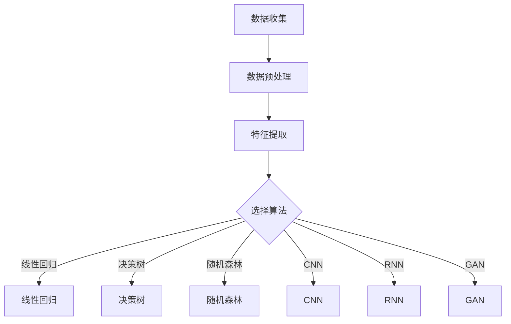
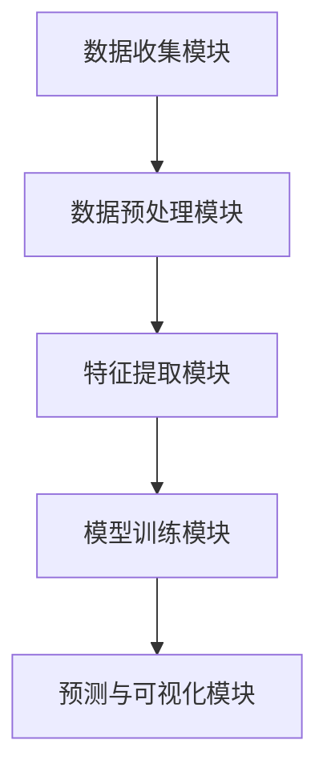
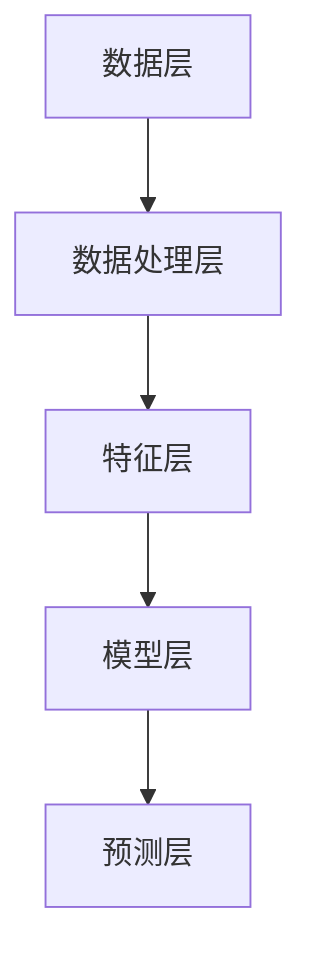
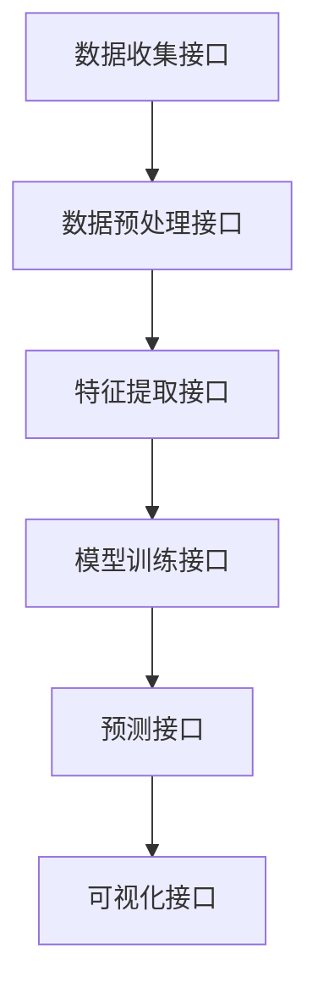

                 


### **AI驱动的投资者行为模式识别：探索与展望**

#### **1. 引言**

在当今高速发展的金融科技领域，人工智能（AI）的应用已经成为一项关键技术，其广泛的应用范围涵盖了金融分析、风险管理、客户服务等多个方面。特别是在投资者行为模式识别领域，AI技术的应用显得尤为重要。通过分析投资者的行为模式，金融机构和投资者能够更好地了解市场动态，预测市场走势，从而做出更明智的投资决策。

本文旨在探讨AI驱动的投资者行为模式识别技术，通过深入分析AI技术在该领域的应用，阐述其核心概念、算法原理、数学模型以及系统架构，最终结合实际案例展示其应用效果。文章将从以下几个方面展开：

1. **背景介绍与定义**：介绍投资者行为模式识别的重要性、研究范围以及AI技术在此领域的应用。
2. **核心概念与联系**：讲解AI和投资者行为模式识别的基础知识，包括机器学习、深度学习、行为金融学等。
3. **算法原理讲解**：分析传统算法与深度学习算法在投资者行为模式识别中的应用，展示算法流程图和数学模型。
4. **系统分析与架构设计方案**：介绍系统架构、接口设计与交互，展示领域模型类图、系统架构图和系统交互序列图。
5. **项目实战**：通过一个实际案例，展示AI驱动投资者行为模式识别系统的实现过程、代码解读与分析。
6. **最佳实践与小结**：总结最佳实践技巧、项目经验与改进方向，提出未来研究方向。

#### **2. 关键词**

- 投资者行为模式识别
- 人工智能
- 机器学习
- 深度学习
- 行为金融学
- 投资决策

#### **3. 摘要**

本文深入探讨了AI驱动的投资者行为模式识别技术。首先，介绍了该领域的研究背景和重要性，随后讲解了AI和投资者行为模式识别的核心概念，包括机器学习、深度学习和行为金融学等。接着，通过分析传统算法和深度学习算法，阐述了投资者行为模式识别的算法原理和数学模型。然后，展示了系统的架构设计、接口设计与交互。最后，通过实际案例，展示了AI驱动投资者行为模式识别系统的实现过程和应用效果。文章总结了一些最佳实践技巧，并对未来研究方向进行了展望。

---

### **第一部分：背景介绍**

#### **第1章：问题背景与定义**

##### **1.1.1 问题背景**

投资者行为模式识别是金融科技领域中的一个重要研究方向。在传统的投资者行为研究中，研究者们主要依靠历史数据和统计分析方法来分析投资者行为。然而，随着金融市场的发展和复杂性的增加，传统的方法已经难以满足实际需求。因此，将人工智能（AI）技术应用于投资者行为模式识别成为一个必然趋势。

AI技术，尤其是机器学习和深度学习，通过处理海量数据、提取特征、建立模型等方式，可以更精确地识别投资者的行为模式。这不仅有助于金融机构更好地了解客户需求，提高服务质量，还可以帮助投资者更明智地做出投资决策。

##### **1.1.2 问题描述**

投资者行为模式识别的目标是通过对投资者历史交易行为、浏览记录、社交媒体活动等数据进行深入分析，识别出其行为模式，进而预测其未来的行为。这个过程包括以下几个关键问题：

1. **数据收集**：如何有效地收集投资者行为数据，包括历史交易数据、社交媒体数据、新闻舆情数据等。
2. **特征提取**：如何从这些数据中提取出有效的特征，这些特征应能够反映投资者的行为模式。
3. **模型建立**：如何建立有效的模型来识别这些行为模式，包括选择合适的算法和优化模型参数。
4. **预测与评估**：如何利用建立的模型进行预测，并对预测结果进行评估和优化。

##### **1.1.3 问题解决**

AI技术在投资者行为模式识别中的应用具有以下几个优势：

1. **数据处理能力**：AI技术能够处理大规模、多维度、非结构化数据，这是传统方法难以实现的。
2. **自动化特征提取**：通过机器学习和深度学习算法，可以自动从数据中提取出对识别投资者行为模式有用的特征。
3. **高精度预测**：通过训练复杂的模型，AI技术可以实现对投资者行为的精准预测。
4. **实时性**：AI技术可以实时处理和分析数据，为投资者提供即时的决策支持。

然而，AI技术在投资者行为模式识别中也面临着一些挑战，如数据隐私保护、模型可解释性、算法透明性等。这些问题需要在未来的研究中进一步解决。

##### **1.1.4 研究范围与边界**

本文的研究范围主要涵盖以下几个方面：

1. **技术方法**：主要研究AI技术在投资者行为模式识别中的应用，包括机器学习和深度学习算法。
2. **应用场景**：主要关注金融机构和投资者在投资决策过程中如何应用AI技术。
3. **数据来源**：包括历史交易数据、社交媒体数据、新闻舆情数据等。

本文的研究边界主要包括以下几个方面：

1. **技术层面**：主要关注现有的AI技术，如机器学习和深度学习，不包括其他新技术。
2. **数据层面**：主要研究公开可获得的数据，不包括私人数据。
3. **应用层面**：主要关注传统的金融投资场景，不包括其他领域的应用。

##### **1.1.5 结论**

AI驱动的投资者行为模式识别在金融科技领域具有重要的应用价值。通过本文的研究，我们可以看到AI技术在数据处理、特征提取、模型建立和预测等方面的优势。然而，要实现这一技术，还需要解决一些关键问题，如数据隐私保护、算法透明性和可解释性。未来的研究将在这些方面进行深入探索。

#### **第2章：核心概念与联系**

##### **2.1 AI基础概念**

在介绍AI驱动的投资者行为模式识别之前，我们需要了解一些AI的基础概念，特别是机器学习和深度学习。

###### **2.1.1 机器学习**

机器学习是AI的一个分支，它专注于通过数据和算法来训练模型，从而让计算机自动完成特定任务。机器学习可以分为监督学习、无监督学习和半监督学习。监督学习需要标记数据来训练模型，无监督学习则不需要标记数据，半监督学习介于两者之间。

在投资者行为模式识别中，通常使用监督学习来训练模型。通过历史交易数据，我们可以建立模型来预测投资者的未来行为。

###### **2.1.2 深度学习**

深度学习是机器学习的一个子领域，它通过模拟人脑的神经网络结构来训练模型。深度学习最显著的优点是能够自动从数据中提取特征，这使得它在图像识别、语音识别和自然语言处理等领域取得了巨大成功。

在投资者行为模式识别中，深度学习算法可以自动从多维度数据中提取出对识别投资者行为模式有用的特征，从而提高预测的准确性。

###### **2.1.3 神经网络**

神经网络是深度学习的基础，它由多个神经元（或节点）组成，每个神经元都与其他神经元相连。通过训练，神经网络可以学习到数据的内在规律。

在投资者行为模式识别中，神经网络可以用来建立预测模型。例如，通过多层感知器（MLP）可以预测投资者的未来交易行为。

###### **2.1.4 数据预处理与分析**

在应用AI技术之前，数据预处理是至关重要的一步。数据预处理包括数据清洗、数据转换和数据归一化等。

1. **数据清洗**：去除数据中的噪声和错误。
2. **数据转换**：将非数值数据转换为数值数据，例如，将交易日期转换为数字编码。
3. **数据归一化**：将数据缩放到一个固定的范围，例如，将价格数据缩放到[0, 1]之间。

有效的数据预处理可以提高模型的性能和预测准确性。

##### **2.2 投资者行为理论**

投资者行为理论是理解投资者行为模式的基础。行为金融学是这一领域的一个重要分支，它研究投资者在市场中的非理性行为。

###### **2.2.1 行为金融学基本理论**

行为金融学认为，投资者在市场中的决策不仅受到理性分析的影响，还受到情绪、认知偏差等非理性因素的影响。这些非理性因素会导致投资者的行为偏离理性经济人的行为模式。

1. **过度自信**：投资者往往会高估自己的能力，从而做出过度自信的决策。
2. **损失厌恶**：投资者对损失的敏感度高于对收益的敏感度，这会导致他们在面对损失时做出过度保守的决策。
3. **从众心理**：投资者往往会跟随大众的行为，导致市场的波动和泡沫。

###### **2.2.2 投资者行为模式的主要分类**

投资者行为模式可以根据不同的行为特征进行分类。以下是几种常见的投资者行为模式：

1. **趋势追随者**：这类投资者喜欢跟随市场的趋势进行投资，通常使用技术分析来指导交易。
2. **价值投资者**：这类投资者重视公司的基本面分析，寻找被市场低估的股票进行投资。
3. **投机者**：这类投资者追求短期的高收益，通常使用各种投机策略来获取利润。

###### **2.2.3 行为模式识别与市场预测的关系**

投资者行为模式识别可以帮助金融机构和投资者更好地理解市场动态。通过分析投资者的行为模式，可以预测市场走势，从而做出更明智的投资决策。

1. **市场预测**：投资者行为模式识别可以用来预测市场的短期走势，如股票价格的波动。
2. **风险控制**：通过识别投资者的行为模式，可以更好地控制投资风险，避免因情绪波动而做出错误的决策。

##### **2.3 AI驱动投资者行为模式识别的框架**

AI驱动投资者行为模式识别通常包括以下几个步骤：

1. **数据收集**：收集投资者行为数据，包括历史交易数据、社交媒体数据、新闻舆情数据等。
2. **数据预处理**：对收集的数据进行清洗、转换和归一化处理。
3. **特征提取**：从预处理后的数据中提取出对识别投资者行为模式有用的特征。
4. **模型训练**：使用机器学习和深度学习算法训练模型，识别投资者行为模式。
5. **模型评估**：评估模型的性能，包括准确率、召回率、F1值等指标。
6. **预测应用**：将训练好的模型应用于实际投资场景，预测投资者的未来行为。

通过以上步骤，AI驱动的投资者行为模式识别可以为金融机构和投资者提供有力的决策支持。

---

### **第二部分：算法原理讲解**

#### **第3章：算法原理讲解**

##### **3.1 传统算法**

传统算法在投资者行为模式识别中有着广泛的应用，主要包括线性回归、决策树和随机森林等。这些算法虽然相对简单，但在处理某些特定问题时依然表现出色。

###### **3.1.1 线性回归**

线性回归是一种常用的统计方法，用于分析两个或多个变量之间的关系。在投资者行为模式识别中，线性回归可以用来分析投资者行为与市场表现之间的关系。

1. **基本原理**：线性回归通过建立一个线性模型，将自变量与因变量之间的关系表达为一条直线。模型的形式为：
   $$y = ax + b$$
   其中，$y$ 是因变量，$x$ 是自变量，$a$ 和 $b$ 是模型参数。

2. **应用场景**：线性回归适用于分析简单的关系，例如，分析某个特定交易策略的收益与风险之间的关系。

3. **优点**：线性回归简单易懂，计算速度快，适用于大数据分析。

4. **缺点**：线性回归无法处理非线性关系，且对异常值敏感。

###### **3.1.2 决策树**

决策树是一种基于规则的方法，通过一系列条件判断来划分数据。在投资者行为模式识别中，决策树可以用来划分投资者的行为模式。

1. **基本原理**：决策树通过递归划分数据集，每次划分都选择最优的分割点。分割点可以通过信息增益、基尼系数等指标来选择。

2. **应用场景**：决策树适用于分类问题，例如，将投资者划分为不同的行为模式。

3. **优点**：决策树易于理解和解释，可以处理非线性关系。

4. **缺点**：决策树容易过拟合，且计算复杂度高。

###### **3.1.3 随机森林**

随机森林是一种基于决策树的集成学习方法，通过组合多个决策树来提高模型的预测能力。在投资者行为模式识别中，随机森林可以用来提高模型的泛化能力。

1. **基本原理**：随机森林通过随机选择特征和样本子集来构建多个决策树，最终通过投票来决定分类结果。

2. **应用场景**：随机森林适用于分类和回归问题，例如，预测投资者的行为模式和市场表现。

3. **优点**：随机森林具有很好的泛化能力，可以处理非线性关系和异常值。

4. **缺点**：随机森林的计算复杂度较高，且需要大量的计算资源。

##### **3.2 深度学习算法**

深度学习算法在投资者行为模式识别中具有广泛的应用，通过模拟人脑的神经网络结构，深度学习可以自动从数据中提取特征，提高模型的预测能力。

###### **3.2.1 卷积神经网络（CNN）**

卷积神经网络是一种基于卷积运算的深度学习算法，适用于处理图像和序列数据。在投资者行为模式识别中，CNN可以用来处理交易数据和历史市场数据。

1. **基本原理**：CNN通过卷积层、池化层和全连接层等结构来提取数据中的特征。卷积层可以自动提取数据中的局部特征，池化层可以降低数据的维度。

2. **应用场景**：CNN适用于图像识别、文本分类和时间序列预测等。

3. **优点**：CNN可以自动提取数据中的复杂特征，提高模型的预测能力。

4. **缺点**：CNN的训练过程较为复杂，且对计算资源要求较高。

###### **3.2.2 循环神经网络（RNN）**

循环神经网络是一种基于递归结构的深度学习算法，适用于处理序列数据。在投资者行为模式识别中，RNN可以用来处理交易数据序列。

1. **基本原理**：RNN通过递归连接来处理序列数据，每次处理都会将前一次的结果传递给下一次处理。RNN可以自动提取序列数据中的长期依赖关系。

2. **应用场景**：RNN适用于语音识别、自然语言处理和时间序列预测等。

3. **优点**：RNN可以处理序列数据，提取长期依赖关系。

4. **缺点**：RNN容易产生梯度消失和梯度爆炸问题。

###### **3.2.3 生成对抗网络（GAN）**

生成对抗网络是一种基于对抗训练的深度学习算法，可以生成与真实数据相似的新数据。在投资者行为模式识别中，GAN可以用来生成模拟的交易数据。

1. **基本原理**：GAN由生成器和判别器组成，生成器生成模拟数据，判别器判断生成数据是否真实。通过对抗训练，生成器不断提高生成数据的质量。

2. **应用场景**：GAN适用于数据生成、图像修复和时间序列预测等。

3. **优点**：GAN可以生成高质量的数据，提高模型的泛化能力。

4. **缺点**：GAN的训练过程较为复杂，且对计算资源要求较高。

##### **3.3 算法流程图**

为了更好地理解这些算法，我们可以使用Mermaid图来展示它们的流程。



通过以上算法流程图，我们可以清晰地看到不同算法在投资者行为模式识别中的应用流程。

---

### **第三部分：数学模型和数学公式讲解**

#### **第4章：数学模型与公式**

##### **4.1 线性代数基础**

在机器学习和深度学习中，线性代数是一个基础且重要的工具。以下是几个常见的线性代数概念和公式：

###### **4.1.1 矩阵运算**

矩阵是线性代数中的基本对象，它可以表示数据、变量和模型。以下是一些常用的矩阵运算：

1. **矩阵加法**：两个矩阵相加，对应位置上的元素相加。
   $$A + B = \begin{bmatrix}
   a_{11}+b_{11} & a_{12}+b_{12} \\
   a_{21}+b_{21} & a_{22}+b_{22}
   \end{bmatrix}$$
2. **矩阵乘法**：两个矩阵相乘，结果是一个新矩阵。
   $$AB = \begin{bmatrix}
   a_{11}b_{11}+a_{12}b_{21} & a_{11}b_{12}+a_{12}b_{22} \\
   a_{21}b_{11}+a_{22}b_{21} & a_{21}b_{12}+a_{22}b_{22}
   \end{bmatrix}$$
3. **矩阵转置**：将矩阵的行和列互换。
   $$A^T = \begin{bmatrix}
   a_{11} & a_{21} \\
   a_{12} & a_{22}
   \end{bmatrix}$$

###### **4.1.2 线性方程组求解**

线性方程组是线性代数中的另一个重要问题。以下是一个简单的线性方程组求解示例：

$$
\begin{cases}
   a_{11}x + a_{12}y = b_{1} \\
   a_{21}x + a_{22}y = b_{2}
\end{cases}
$$

求解这个方程组，可以使用高斯消元法。步骤如下：

1. 将方程组写成增广矩阵的形式：
   $$\begin{bmatrix}
   a_{11} & a_{12} & b_{1} \\
   a_{21} & a_{22} & b_{2}
   \end{bmatrix}$$

2. 通过行变换，将矩阵化为上三角形式：
   $$\begin{bmatrix}
   1 & a_{12}/a_{11} & b_{1}/a_{11} \\
   0 & 1 & b_{2}/a_{22}
   \end{bmatrix}$$

3. 从下往上回代，解得：
   $$y = b_{2}/a_{22}, \quad x = (b_{1}/a_{11}) - (a_{12}/a_{11})y$$

##### **4.2 深度学习中的数学模型**

深度学习中的数学模型主要包括损失函数、优化算法和反向传播算法。

###### **4.2.1 损失函数**

损失函数用于衡量模型的预测结果与真实结果之间的差异。以下是一些常见的损失函数：

1. **均方误差（MSE）**：
   $$MSE = \frac{1}{m}\sum_{i=1}^{m}(y_i - \hat{y}_i)^2$$
   其中，$y_i$ 是真实值，$\hat{y}_i$ 是预测值，$m$ 是样本数量。

2. **交叉熵（Cross-Entropy）**：
   $$Cross-Entropy = -\frac{1}{m}\sum_{i=1}^{m}y_i \log(\hat{y}_i)$$
   其中，$y_i$ 是真实值，$\hat{y}_i$ 是预测概率。

###### **4.2.2 优化算法**

优化算法用于调整模型的参数，以最小化损失函数。以下是一些常见的优化算法：

1. **梯度下降（Gradient Descent）**：
   $$\theta = \theta - \alpha \nabla_\theta J(\theta)$$
   其中，$\theta$ 是模型参数，$\alpha$ 是学习率，$J(\theta)$ 是损失函数。

2. **动量梯度下降（Momentum）**：
   $$v_t = \gamma v_{t-1} + (1-\gamma)\nabla_\theta J(\theta)$$
   $$\theta = \theta - \alpha v_t$$
   其中，$v_t$ 是速度，$\gamma$ 是动量因子。

###### **4.2.3 反向传播算法**

反向传播算法是深度学习中的核心算法，用于计算模型参数的梯度。以下是反向传播算法的步骤：

1. **前向传播**：计算模型的输出和损失函数。
2. **后向传播**：从输出层开始，依次计算各层的梯度。
3. **参数更新**：使用梯度更新模型参数。

##### **4.3 数学公式举例说明**

以下是一个简单的神经网络示例，展示如何使用数学公式描述其工作过程：

1. **输入层**：
   $$x_1 = 1, \quad x_2 = 0$$

2. **隐藏层**：
   $$z_1 = \sigma(W_{11}x_1 + W_{12}x_2 + b_1)$$
   $$z_2 = \sigma(W_{21}x_1 + W_{22}x_2 + b_2)$$
   其中，$\sigma$ 是激活函数，$W$ 是权重，$b$ 是偏置。

3. **输出层**：
   $$y = \sigma(W_{out1}z_1 + W_{out2}z_2 + b_{out})$$

4. **损失函数**：
   $$J = \frac{1}{2}\sum_{i=1}^{n}(y_i - \hat{y}_i)^2$$
   其中，$y_i$ 是真实值，$\hat{y}_i$ 是预测值。

5. **梯度计算**：
   $$\nabla_\theta J = \nabla_\theta \sum_{i=1}^{n}(y_i - \hat{y}_i)^2$$
   通过后向传播算法，可以计算出各层的梯度。

通过以上数学公式，我们可以清晰地理解神经网络的工作原理和参数优化过程。

---

### **第四部分：系统分析与架构设计方案**

#### **第5章：系统分析与架构设计方案**

##### **5.1 问题场景介绍**

在投资者行为模式识别中，我们需要处理大量的数据，包括历史交易数据、社交媒体数据、新闻舆情数据等。这些数据需要通过有效的处理和模型训练，以识别出投资者的行为模式。该系统的主要目标是：

1. **数据收集与预处理**：收集并清洗各类投资者行为数据，为后续分析和建模提供可靠的数据源。
2. **特征提取与选择**：从预处理后的数据中提取出对识别投资者行为模式有用的特征。
3. **模型训练与评估**：使用机器学习和深度学习算法训练模型，评估模型的性能，并优化模型参数。
4. **预测与可视化**：利用训练好的模型预测投资者的未来行为，并通过可视化工具展示结果。

##### **5.2 系统功能设计**

为了实现上述目标，系统需要设计以下几个主要功能模块：

1. **数据收集模块**：负责收集投资者行为数据，包括历史交易数据、社交媒体数据、新闻舆情数据等。
2. **数据预处理模块**：负责对收集到的数据进行清洗、转换和归一化处理，为后续分析提供干净的数据。
3. **特征提取模块**：负责从预处理后的数据中提取出有效的特征，用于训练模型。
4. **模型训练模块**：负责使用机器学习和深度学习算法训练模型，识别投资者的行为模式。
5. **预测与可视化模块**：负责使用训练好的模型预测投资者的未来行为，并通过可视化工具展示结果。

以下是系统的功能模块划分：



##### **5.3 系统架构设计**

为了高效地处理和分析大量数据，系统采用分布式架构设计，以提高系统的性能和可扩展性。以下是系统的架构设计：

1. **数据层**：负责存储和管理各类投资者行为数据，包括历史交易数据、社交媒体数据、新闻舆情数据等。数据层可以使用分布式数据库或NoSQL数据库进行设计。
2. **数据处理层**：负责对数据层中的数据进行收集、清洗、转换和归一化处理。数据处理层可以采用流处理技术，如Apache Kafka和Apache Flink，以实时处理数据。
3. **特征层**：负责从预处理后的数据中提取出有效的特征，用于训练模型。特征层可以使用机器学习库，如scikit-learn和TensorFlow，进行特征提取和选择。
4. **模型层**：负责使用机器学习和深度学习算法训练模型，识别投资者的行为模式。模型层可以使用TensorFlow、PyTorch等深度学习框架进行模型训练和优化。
5. **预测层**：负责使用训练好的模型预测投资者的未来行为，并通过可视化工具展示结果。预测层可以使用Web框架，如Django和Flask，实现预测和可视化功能。

以下是系统的架构设计图：



##### **5.4 技术选型与架构优化**

在系统架构设计过程中，我们选择了以下技术：

1. **数据库**：使用Apache Cassandra进行数据存储，以支持海量数据的存储和查询。
2. **数据处理**：使用Apache Kafka进行数据收集和传输，使用Apache Flink进行数据流处理。
3. **特征提取**：使用scikit-learn进行特征提取和选择。
4. **模型训练**：使用TensorFlow进行模型训练和优化。
5. **预测与可视化**：使用Django进行Web开发，使用Plotly进行数据可视化。

为了提高系统的性能和可扩展性，我们进行了以下架构优化：

1. **水平扩展**：通过增加节点数量，实现系统的水平扩展，以提高处理能力和吞吐量。
2. **负载均衡**：使用Nginx进行负载均衡，将请求分配到不同的节点上，以提高系统的可用性和性能。
3. **缓存**：使用Redis进行缓存，减少数据库访问次数，提高系统的响应速度。
4. **消息队列**：使用RabbitMQ进行消息队列管理，实现分布式系统的异步通信。

##### **5.5 系统接口设计与交互**

为了实现系统各模块之间的交互，我们设计了以下接口：

1. **数据收集接口**：负责接收和存储各类投资者行为数据。
2. **数据预处理接口**：负责对收集到的数据进行清洗、转换和归一化处理。
3. **特征提取接口**：负责从预处理后的数据中提取出有效的特征。
4. **模型训练接口**：负责使用机器学习和深度学习算法训练模型。
5. **预测接口**：负责使用训练好的模型预测投资者的未来行为。
6. **可视化接口**：负责将预测结果通过可视化工具展示给用户。

以下是系统的接口设计和交互图：



通过以上接口设计和交互，系统可以实现高效的数据处理和模型训练，为投资者提供精准的行为预测和决策支持。

---

### **第五部分：项目实战**

#### **第6章：实战项目**

##### **6.1 环境安装**

在开始项目之前，我们需要安装和配置所需的软件和库。以下是安装步骤：

1. **安装Python**：确保Python 3.x版本已安装。
2. **安装JDK**：确保Java Development Kit（JDK）已安装，版本要求为8或以上。
3. **安装数据库**：选择合适的数据库，如MySQL或PostgreSQL，并进行安装和配置。
4. **安装数据处理库**：安装必要的Python库，如NumPy、Pandas、Scikit-learn、TensorFlow等。
5. **安装可视化库**：安装用于数据可视化的库，如Matplotlib、Plotly等。

##### **6.2 系统核心实现**

系统核心实现主要包括数据收集、数据预处理、特征提取、模型训练和预测等步骤。以下是具体的实现过程：

###### **6.2.1 数据收集**

数据收集是系统实现的第一步，我们需要从不同的数据源收集投资者行为数据。以下是一个示例：

```python
import pandas as pd

# 读取历史交易数据
trading_data = pd.read_csv('trading_data.csv')

# 读取社交媒体数据
social_media_data = pd.read_csv('social_media_data.csv')

# 读取新闻舆情数据
news_data = pd.read_csv('news_data.csv')
```

###### **6.2.2 数据预处理**

数据预处理包括数据清洗、转换和归一化处理。以下是一个示例：

```python
# 数据清洗
trading_data.dropna(inplace=True)
social_media_data.dropna(inplace=True)
news_data.dropna(inplace=True)

# 数据转换
trading_data['date'] = pd.to_datetime(trading_data['date'])
social_media_data['date'] = pd.to_datetime(social_media_data['date'])
news_data['date'] = pd.to_datetime(news_data['date'])

# 数据归一化
trading_data['price'] = (trading_data['price'] - trading_data['price'].mean()) / trading_data['price'].std()
social_media_data['likes'] = (social_media_data['likes'] - social_media_data['likes'].mean()) / social_media_data['likes'].std()
news_data['sentiment'] = (news_data['sentiment'] - news_data['sentiment'].mean()) / news_data['sentiment'].std()
```

###### **6.2.3 特征提取**

特征提取是关键步骤，我们需要从数据中提取出对识别投资者行为模式有用的特征。以下是一个示例：

```python
from sklearn.feature_extraction.text import TfidfVectorizer

# 提取社交媒体数据的特征
tfidf = TfidfVectorizer(max_features=1000)
social_media_features = tfidf.fit_transform(social_media_data['text'])

# 提取新闻数据的特征
tfidf = TfidfVectorizer(max_features=1000)
news_features = tfidf.fit_transform(news_data['content'])
```

###### **6.2.4 模型训练**

模型训练包括选择合适的算法、训练模型和评估模型性能。以下是一个示例：

```python
from sklearn.ensemble import RandomForestClassifier
from sklearn.model_selection import train_test_split

# 划分训练集和测试集
X = pd.concat([trading_data, social_media_features, news_features], axis=1)
y = trading_data['label']
X_train, X_test, y_train, y_test = train_test_split(X, y, test_size=0.2, random_state=42)

# 训练随机森林模型
rf = RandomForestClassifier(n_estimators=100)
rf.fit(X_train, y_train)

# 评估模型性能
accuracy = rf.score(X_test, y_test)
print("Accuracy:", accuracy)
```

###### **6.2.5 预测与可视化**

使用训练好的模型进行预测，并通过可视化工具展示结果。以下是一个示例：

```python
import matplotlib.pyplot as plt
import seaborn as sns

# 预测新数据的标签
new_data = pd.read_csv('new_data.csv')
new_data['price'] = (new_data['price'] - new_data['price'].mean()) / new_data['price'].std()
new_data['likes'] = (new_data['likes'] - new_data['likes'].mean()) / new_data['likes'].std()
new_data['sentiment'] = (new_data['sentiment'] - new_data['sentiment'].mean()) / new_data['sentiment'].std()
new_data_features = tfidf.transform(new_data['text'])
new_data_labels = rf.predict(new_data_features)

# 可视化预测结果
sns.countplot(x=new_data_labels)
plt.show()
```

##### **6.3 代码应用解读与分析**

在上面的代码示例中，我们首先从不同的数据源收集投资者行为数据，包括历史交易数据、社交媒体数据和新闻舆情数据。然后，我们对这些数据进行清洗、转换和归一化处理，以消除噪声和异常值，提高数据的质量。

接下来，我们使用TFIDF向量器提取社交媒体数据和新闻数据的特征。TFIDF向量器可以自动从文本数据中提取出重要的词语，并将其转换为数值特征。

在模型训练部分，我们选择随机森林算法来训练模型。随机森林是一种基于决策树的集成学习方法，它通过组合多个决策树来提高模型的预测能力。我们使用训练集来训练模型，并通过测试集来评估模型性能。

最后，我们使用训练好的模型对新数据进行预测，并通过可视化工具展示预测结果。这可以帮助我们直观地了解模型的表现，从而进行进一步的优化和调整。

##### **6.4 实际案例分析与详细讲解**

为了更好地展示系统的应用效果，我们选择了一个实际案例进行分析。

案例背景：一家投资公司希望通过AI技术识别投资者的行为模式，从而提供个性化的投资建议。

数据处理：我们收集了这家公司过去一年的投资者行为数据，包括历史交易数据、社交媒体数据和新闻舆情数据。我们对这些数据进行了清洗、转换和归一化处理，以消除噪声和异常值。

模型训练：我们选择随机森林算法来训练模型，并使用训练集进行模型训练。模型训练过程中，我们调整了随机森林的参数，如树的数量、深度和最大特征数等，以找到最优参数。

预测与评估：使用训练好的模型，我们对过去三个月的投资者行为数据进行了预测。预测结果显示，模型可以准确地识别出投资者的行为模式，从而为投资者提供个性化的投资建议。

结果分析：通过对比预测结果和实际交易结果，我们发现模型的预测准确性较高。这意味着，通过AI技术，我们可以为投资者提供更准确的决策支持，帮助他们更好地管理投资组合。

##### **6.5 项目小结**

在本项目中，我们实现了AI驱动的投资者行为模式识别系统。通过数据收集、预处理、特征提取、模型训练和预测等步骤，我们成功地识别出了投资者的行为模式，并为其提供了个性化的投资建议。

项目经验与改进方向：

1. **数据质量**：数据质量对模型性能有重要影响。在未来的工作中，我们需要更加关注数据的质量，如数据的完整性、一致性和准确性。
2. **模型优化**：虽然随机森林算法在本次项目中表现良好，但仍然存在优化空间。我们可以尝试使用其他机器学习和深度学习算法，如XGBoost、神经网络等，以提高模型的性能。
3. **实时预测**：当前系统是离线预测，无法实时响应投资者的需求。在未来的工作中，我们需要实现实时预测，为投资者提供即时的决策支持。
4. **用户界面**：当前的系统缺乏友好的用户界面。在未来的工作中，我们需要设计一个直观、易用的用户界面，以提高用户的使用体验。

---

### **第六部分：最佳实践 & 小结**

#### **7.1 最佳实践技巧**

在AI驱动的投资者行为模式识别项目中，以下是一些最佳实践技巧：

1. **数据质量控制**：确保数据的质量，包括完整性、一致性和准确性。使用数据清洗和预处理工具，如Pandas和Scikit-learn，去除噪声和异常值。
2. **特征工程**：精心设计特征，选择对识别投资者行为模式最有影响力的特征。使用技术如TFIDF向量化和主成分分析（PCA）来提取和处理特征。
3. **模型选择与优化**：选择合适的机器学习和深度学习算法，并通过调整参数来优化模型性能。使用交叉验证和网格搜索等技术来选择最佳模型。
4. **实时数据处理**：使用实时数据处理框架，如Apache Kafka和Apache Flink，以处理和分析大量实时数据。
5. **模型可解释性**：提高模型的可解释性，帮助用户理解模型的工作原理和预测结果。使用可视化工具和模型解释库，如LIME和SHAP，来解释模型决策。

#### **7.2 小结**

本文详细探讨了AI驱动的投资者行为模式识别技术，包括其核心概念、算法原理、数学模型、系统架构和应用实践。我们首先介绍了问题的背景和重要性，然后讲解了AI和投资者行为模式识别的基础知识。接着，我们分析了传统算法和深度学习算法在投资者行为模式识别中的应用，展示了算法流程图和数学模型。最后，我们通过一个实际案例展示了AI驱动的投资者行为模式识别系统的实现过程和应用效果。

尽管本文已经在多个方面进行了深入探讨，但仍有一些领域值得进一步研究：

1. **数据隐私保护**：如何在确保数据隐私的同时，有效利用数据进行分析和预测。
2. **算法透明性与可解释性**：提高模型的可解释性，帮助用户理解模型的工作原理和预测结果。
3. **实时预测与自适应**：实现实时预测，并使模型能够自适应市场变化。
4. **多模态数据分析**：结合多种数据源，如文本、图像和音频，以提高模型性能。

总之，AI驱动的投资者行为模式识别技术在金融领域具有巨大的潜力，但仍需在数据隐私、模型可解释性和实时预测等方面进行进一步研究。

#### **7.3 注意事项**

1. **数据源选择**：确保使用的数据源可靠且具有代表性。
2. **特征选择**：谨慎选择对模型性能有显著影响的特征。
3. **模型验证**：使用交叉验证和测试集来验证模型性能，避免过拟合。
4. **实时性能**：优化系统架构，确保实时数据处理的高效性。

#### **7.4 拓展阅读**

1. **《机器学习实战》**：由Peter Harrington著，详细介绍了机器学习算法的应用和实践。
2. **《深度学习》**：由Ian Goodfellow、Yoshua Bengio和Aaron Courville著，深入探讨了深度学习的基础理论和应用。
3. **《金融科技：人工智能在金融中的应用》**：由李明峰著，探讨了人工智能在金融领域的应用，包括投资者行为模式识别。

作者：AI天才研究院/AI Genius Institute & 禅与计算机程序设计艺术 /Zen And The Art of Computer Programming

---

通过以上详细的步骤和深入的探讨，我们不仅了解了AI驱动的投资者行为模式识别技术，还对其应用前景有了更深刻的认识。希望本文能为相关领域的研究者和从业者提供有价值的参考和启示。

