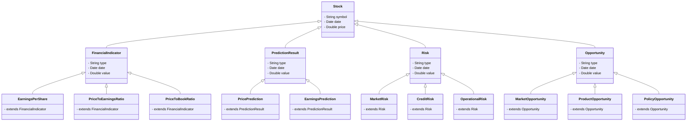
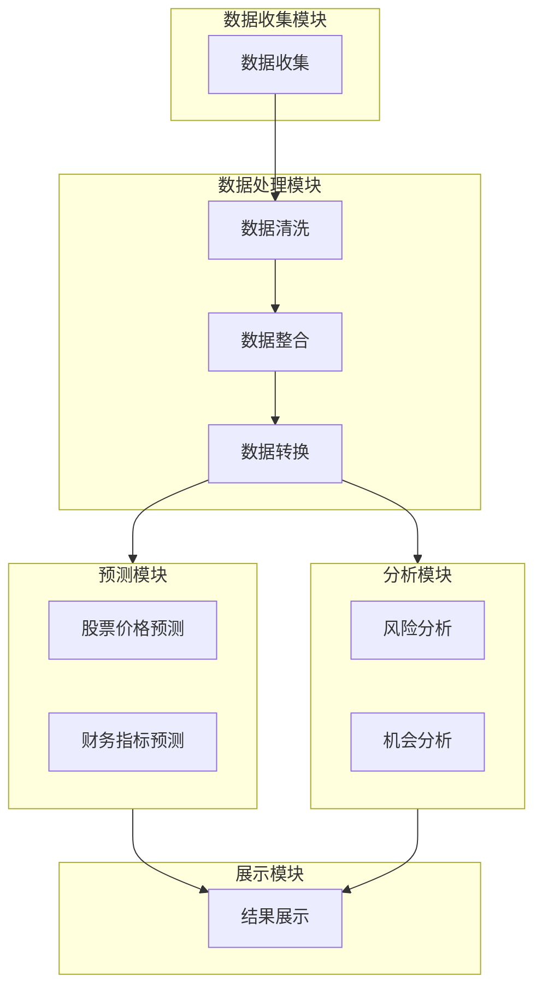
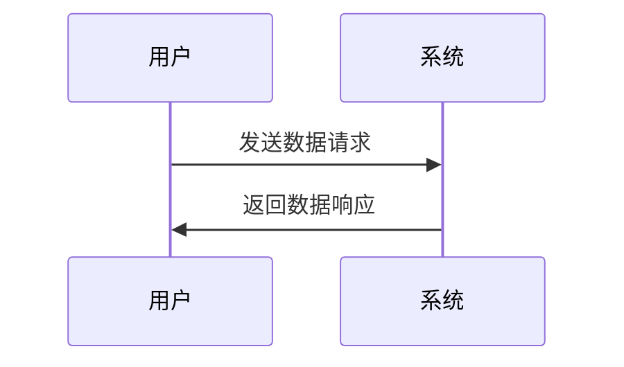
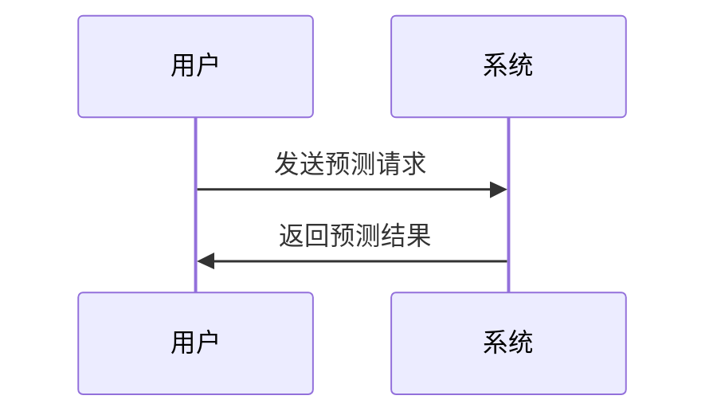
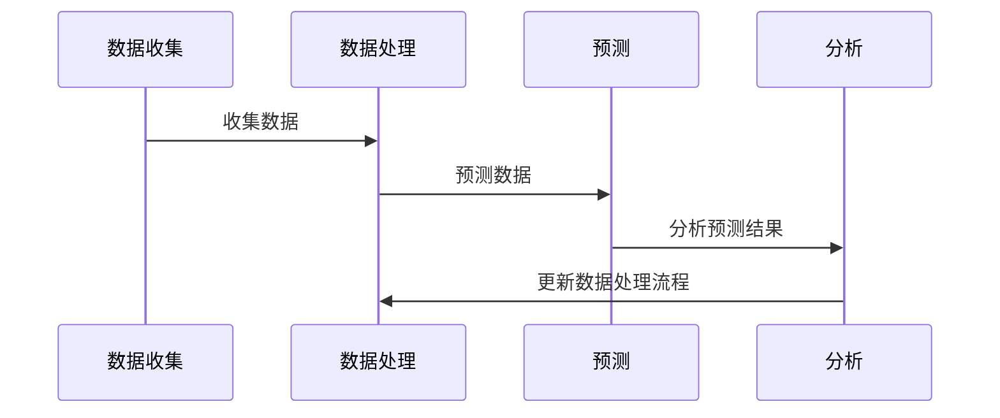
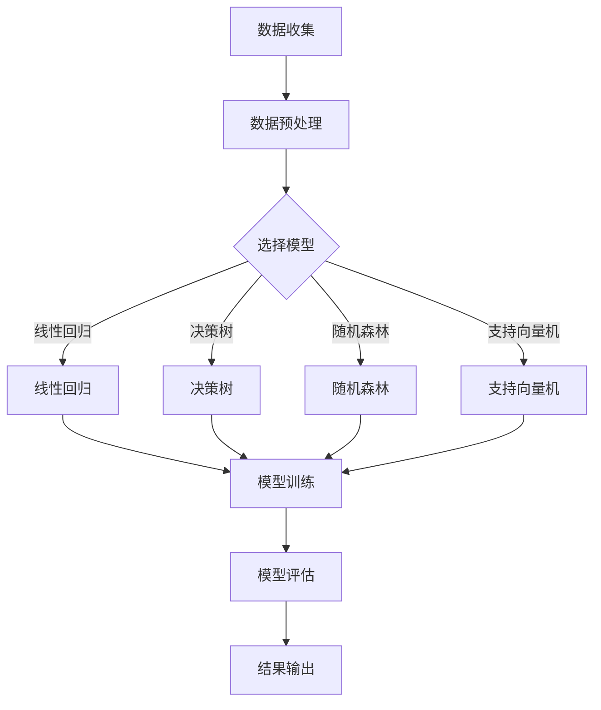
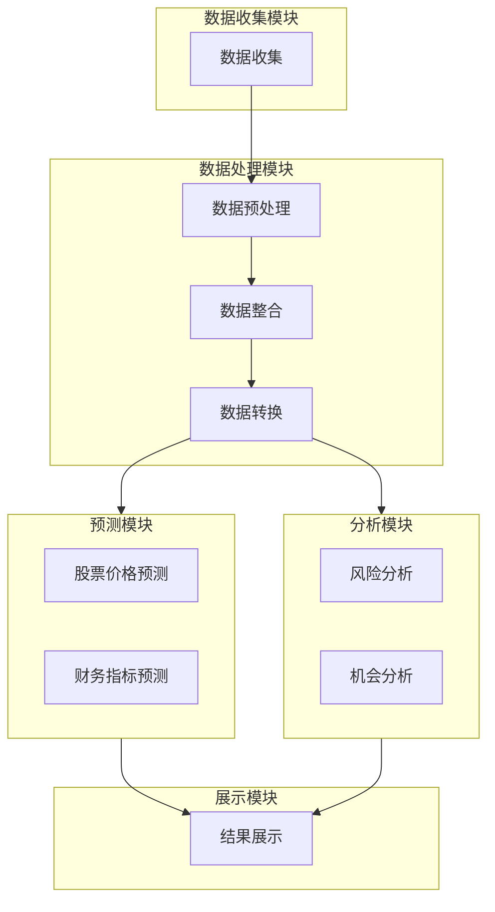
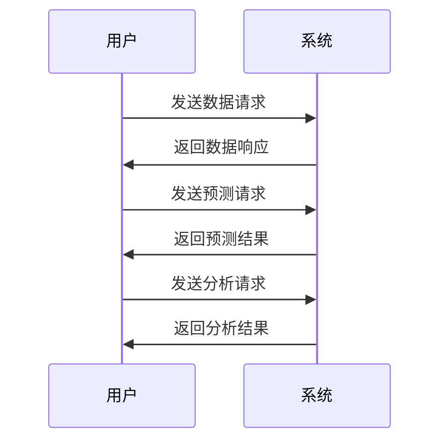

                 

# 《AI驱动的股票基本面分析工具》

关键词：AI、股票基本面分析、机器学习、深度学习、股票投资策略

摘要：本文将深入探讨AI驱动的股票基本面分析工具的设计与实现。首先，我们介绍了AI与股票基本面分析的关系及其优势。接着，我们详细讲解了机器学习、深度学习的基础知识以及数据处理与特征工程的方法。随后，我们针对股票数据收集与处理、股票价格预测、财务指标分析、风险与机会分析以及股票投资策略等方面，阐述了AI驱动的股票基本面分析工具的设计与实现。最后，我们通过实战案例分析，展示了AI驱动的股票基本面分析工具在实际应用中的效果，并对其未来发展趋势进行了展望。

## 第一部分：AI与股票基本面分析概述

### 第1章：AI与股票市场分析基础

#### 1.1 AI与金融市场的联系

AI技术在金融领域的应用已逐渐成为热点。从量化交易、风险管理到信用评分，AI技术在金融领域的应用日益广泛。在股票市场分析中，AI技术可以挖掘大量数据中的潜在信息，为投资者提供更为精准的决策支持。

AI技术在股票市场分析中的优势主要体现在以下几个方面：

1. **数据处理能力**：AI技术可以高效处理海量数据，挖掘出有价值的信息。
2. **预测准确性**：通过机器学习和深度学习算法，AI技术可以对股票价格进行准确预测。
3. **风险识别**：AI技术能够快速识别市场风险，帮助投资者规避潜在的风险。

#### 1.2 股票基本面分析的基本概念

股票基本面分析是指通过分析公司的财务状况、行业地位、市场趋势等因素，来评估股票的投资价值。股票基本面分析主要包括以下指标：

1. **市盈率（PE）**：市盈率是股票价格与每股收益的比值，用于衡量股票的估值水平。
2. **市净率（PB）**：市净率是股票价格与每股净资产的比值，用于衡量股票的估值水平。
3. **每股收益（EPS）**：每股收益是公司净利润除以总股本，用于衡量公司的盈利能力。
4. **股息率**：股息率是公司派发的股息与股票价格的比值，用于衡量股票的投资回报。

#### 1.3 AI驱动的股票基本面分析工具简介

AI驱动的股票基本面分析工具主要通过以下方法来实现：

1. **机器学习算法**：如回归分析、逻辑回归、决策树等，用于对股票价格进行预测。
2. **深度学习模型**：如卷积神经网络（CNN）、循环神经网络（RNN）等，用于对股票价格进行深度分析。
3. **自然语言处理（NLP）**：用于分析股票市场中的新闻报道、公告等信息。

AI驱动的股票基本面分析工具的主要功能包括：

1. **股票价格预测**：通过分析历史数据，预测未来股票价格走势。
2. **财务指标分析**：对公司的财务报表进行分析，评估公司的财务状况。
3. **风险与机会分析**：通过分析市场数据，识别潜在的风险和机会。

### 第2章：AI技术基础

#### 2.1 机器学习基础

机器学习是一种人工智能（AI）的分支，它使计算机系统能够从数据中学习并做出预测或决策。在股票市场分析中，机器学习可以用于构建预测模型，分析历史数据以预测未来股票价格。

**常见机器学习算法**：

1. **线性回归**：通过分析历史数据，找出股票价格与相关因素之间的线性关系，从而预测未来股票价格。
2. **逻辑回归**：用于分类问题，如判断股票是涨是跌。
3. **决策树**：通过一系列决策规则，对股票价格进行分类或预测。
4. **随机森林**：通过构建多个决策树，并利用随机性进行特征选择，提高模型的预测准确性。
5. **支持向量机（SVM）**：用于分类问题，通过找到最佳超平面来划分不同类别的数据。

#### 2.2 深度学习基础

深度学习是一种人工智能（AI）的分支，它通过多层神经网络对数据进行建模，从而实现对复杂数据的处理和分析。在股票市场分析中，深度学习可以用于构建复杂的预测模型，对股票价格进行深度分析。

**常见深度学习模型**：

1. **卷积神经网络（CNN）**：适用于处理图像和序列数据，如股票价格的时间序列数据。
2. **循环神经网络（RNN）**：适用于处理序列数据，如股票价格的时间序列数据。
3. **长短时记忆网络（LSTM）**：是RNN的一种改进，可以更好地处理长序列数据。
4. **生成对抗网络（GAN）**：用于生成新的股票价格数据，以进行模型训练。

#### 2.3 数据处理与特征工程

在股票市场分析中，数据处理与特征工程是构建模型的重要步骤。有效的数据处理和特征工程可以提高模型的预测准确性。

**数据处理的基本方法**：

1. **数据清洗**：处理缺失值、异常值和重复值。
2. **数据整合**：将不同来源的数据进行整合，形成统一的视图。
3. **数据转换**：将数据转换为适合模型训练的格式。

**特征工程的基本方法**：

1. **特征提取**：从原始数据中提取出有用的特征。
2. **特征选择**：选择对模型预测效果影响最大的特征。
3. **特征组合**：将多个特征进行组合，形成新的特征。

### 第3章：股票数据收集与处理

#### 3.1 股票数据来源

股票数据可以来自多种来源，包括公开的金融数据平台、公司的财务报表、市场新闻等。

**数据来源的分类**：

1. **公开数据平台**：如雅虎财经、同花顺等，提供大量的股票历史数据和实时数据。
2. **公司财务报表**：通过公司发布的年报、季报等财务报表，获取公司的财务数据。
3. **市场新闻**：通过分析市场新闻，获取公司的经营状况和市场动态。

**各类数据源的优缺点**：

1. **公开数据平台**：数据量大，覆盖范围广，但可能存在延迟和错误。
2. **公司财务报表**：数据真实可靠，但数据量有限，且更新速度较慢。
3. **市场新闻**：可以获取公司的实时动态，但可能存在噪声和误导性信息。

#### 3.2 股票数据处理

股票数据处理是构建模型的重要步骤，包括数据清洗、数据整合和数据转换等。

**数据清洗的基本方法**：

1. **缺失值处理**：通过插值、均值填补等方法处理缺失值。
2. **异常值处理**：通过统计方法识别和去除异常值。
3. **重复值处理**：去除重复的数据记录。

**数据整合与转换的基本方法**：

1. **数据整合**：将不同来源的数据进行整合，形成统一的视图。
2. **数据转换**：将数据转换为适合模型训练的格式，如将日期转换为数值型数据。

#### 3.3 股票数据可视化

数据可视化是股票数据分析的重要环节，可以帮助投资者更直观地理解数据。

**数据可视化工具介绍**：

1. **Matplotlib**：用于生成高质量的统计图表。
2. **Seaborn**：基于Matplotlib，提供更丰富的可视化功能。
3. **Plotly**：提供交互式图表和可视化工具。

**数据可视化在实际中的应用**：

1. **股票价格趋势图**：展示股票价格的变化趋势。
2. **财务指标分布图**：展示不同财务指标的分布情况。
3. **风险分布图**：展示市场的风险分布情况。

## 第二部分：AI驱动的股票基本面分析工具设计与实现

### 第4章：股票价格预测

#### 4.1 时间序列分析基础

时间序列分析是一种用于分析时间序列数据的方法，旨在理解数据的趋势、季节性和周期性。在股票市场分析中，时间序列分析可以用于预测股票价格。

**时间序列分析的基本概念**：

1. **趋势**：数据随时间的变化趋势，可以分为上升、下降和稳定三种类型。
2. **季节性**：数据在一定时间段内的周期性变化，如节假日、季节变化等。
3. **周期性**：数据在一定时间段内的大规模波动，如经济周期等。

**时间序列分析方法**：

1. **移动平均法**：通过计算一段时间内的平均值来平滑时间序列数据，去除短期波动。
2. **指数平滑法**：在移动平均法的基础上，考虑前期数据的权重，使模型更加灵敏。
3. **ARIMA模型**：自回归积分滑动平均模型，通过自回归、差分和移动平均三个步骤来分析时间序列数据。
4. **季节性分解法**：将时间序列分解为趋势、季节性和随机性三个部分，分别进行分析。

#### 4.2 基于机器学习的股票价格预测模型

**回归模型**：

回归模型是一种用于预测连续值的机器学习模型，通过建立因变量与自变量之间的线性关系来预测股票价格。常见的回归模型包括线性回归、多元线性回归等。

**支持向量机（SVM）模型**：

支持向量机是一种用于分类和回归的机器学习模型，通过找到一个最佳超平面来划分数据。在股票价格预测中，SVM模型可以通过找到最佳决策边界来预测股票价格的涨跌。

**模型选择与参数调优**：

在构建股票价格预测模型时，需要选择合适的模型并对其进行参数调优。常用的模型选择方法包括交叉验证、网格搜索等。参数调优的方法包括贝叶斯优化、遗传算法等。

#### 4.3 基于深度学习的股票价格预测模型

**卷积神经网络（CNN）**：

卷积神经网络是一种用于处理图像数据的深度学习模型，通过卷积操作提取图像的特征。在股票价格预测中，CNN可以用于提取股票价格时间序列的特征，从而提高预测准确性。

**循环神经网络（RNN）**：

循环神经网络是一种用于处理序列数据的深度学习模型，通过循环结构保持之前的计算状态。在股票价格预测中，RNN可以用于分析股票价格时间序列的依赖关系，从而提高预测准确性。

**长短时记忆网络（LSTM）**：

长短时记忆网络是RNN的一种改进，通过引入门控机制来更好地处理长序列数据。在股票价格预测中，LSTM可以用于提取股票价格时间序列的长期依赖关系，从而提高预测准确性。

### 第5章：财务指标分析

#### 5.1 财务指标的基本概念

财务指标是衡量公司财务状况的重要指标，包括盈利能力、偿债能力、营运能力和增长能力等。在股票市场分析中，财务指标可以用于评估公司的投资价值。

**财务报表的基本构成**：

1. **资产负债表**：反映公司在一定时间内的资产、负债和所有者权益状况。
2. **利润表**：反映公司在一定时间内的收入、费用和利润状况。
3. **现金流量表**：反映公司在一定时间内的现金流入和流出情况。

**常见的财务指标**：

1. **市盈率（PE）**：股票价格与每股收益的比值，用于衡量股票的估值水平。
2. **市净率（PB）**：股票价格与每股净资产的比值，用于衡量股票的估值水平。
3. **每股收益（EPS）**：公司净利润除以总股本，用于衡量公司的盈利能力。
4. **净资产收益率（ROE）**：净利润与净资产的比值，用于衡量公司的盈利能力。
5. **流动比率**：流动资产与流动负债的比值，用于衡量公司的偿债能力。
6. **速动比率**：速动资产与流动负债的比值，用于衡量公司的偿债能力。

#### 5.2 财务指标的机器学习分析

**财务指标的预处理**：

在机器学习分析中，需要对财务指标进行预处理，包括数据清洗、归一化和标准化等。

**财务指标的关系建模**：

通过构建机器学习模型，分析财务指标之间的关系，从而评估公司的投资价值。常见的模型包括线性回归、决策树、支持向量机等。

**模型选择与参数调优**：

在构建财务指标分析模型时，需要选择合适的模型并对其进行参数调优。常用的模型选择方法包括交叉验证、网格搜索等。参数调优的方法包括贝叶斯优化、遗传算法等。

#### 5.3 财务指标的深度学习分析

**基于神经网络的多层次财务指标分析**：

通过构建神经网络模型，对财务指标进行多层次分析，从而提取出公司的核心财务特征。常见的模型包括卷积神经网络、长短时记忆网络等。

**基于注意力机制的财务指标分析**：

通过引入注意力机制，对财务指标进行加权分析，从而提高模型的预测准确性。注意力机制可以动态调整财务指标的重要性，使模型更加关注关键指标。

### 第6章：风险与机会分析

#### 6.1 风险分析基础

风险分析是股票基本面分析的重要环节，旨在识别和评估投资风险。在AI驱动的股票基本面分析工具中，风险分析可以用于预测潜在的风险，帮助投资者做出更为明智的决策。

**风险的定义与分类**：

1. **市场风险**：由市场波动引起的风险，如股票价格波动、利率变化等。
2. **信用风险**：由债务违约、信用等级下降等引起的风险。
3. **操作风险**：由操作失误、技术故障等引起的风险。
4. **流动性风险**：由资产无法及时变现或无法获得足够的资金支持引起的风险。

**风险评估的方法**：

1. **概率风险评估**：通过计算风险发生的概率和损失大小，评估风险的程度。
2. **敏感性分析**：通过分析关键参数的变化对风险的影响，评估风险的变化趋势。
3. **蒙特卡罗模拟**：通过模拟大量随机样本，评估风险的分布和概率。

#### 6.2 机会分析基础

机会分析是股票基本面分析的重要环节，旨在识别和评估潜在的投资机会。在AI驱动的股票基本面分析工具中，机会分析可以用于预测市场的机会，帮助投资者抓住投资机会。

**机会的定义与分类**：

1. **市场机会**：由市场趋势和行业前景等引起的投资机会。
2. **产品机会**：由新产品、新市场等引起的投资机会。
3. **政策机会**：由政策变化等引起的投资机会。

**机会识别的方法**：

1. **市场趋势分析**：通过分析市场数据和趋势，识别潜在的投资机会。
2. **行业分析**：通过分析行业数据和趋势，识别潜在的投资机会。
3. **政策分析**：通过分析政策变化和政策环境，识别潜在的投资机会。

#### 6.3 基于AI的风险与机会分析工具

**风险与机会分析模型的建立**：

通过构建机器学习和深度学习模型，对风险和机会进行分析和预测。常见的模型包括回归分析、决策树、支持向量机、卷积神经网络等。

**风险与机会分析工具的实际应用**：

在实际应用中，AI驱动的风险与机会分析工具可以用于股票市场分析、投资组合管理和风险控制等。通过分析风险和机会，投资者可以做出更为明智的投资决策，提高投资回报率。

### 第7章：AI驱动的股票投资策略

#### 7.1 投资策略的基本概念

投资策略是指投资者为实现投资目标而制定的一系列方法和原则。在股票市场中，投资策略可以帮助投资者抓住市场机会，规避投资风险，实现资产的稳健增长。

**投资策略的类型**：

1. **价值投资策略**：通过分析公司的基本面，选择被低估的股票进行投资。
2. **成长投资策略**：通过分析公司的成长性和前景，选择具有潜力的股票进行投资。
3. **趋势投资策略**：通过分析股票价格的走势，抓住市场趋势进行投资。
4. **分散投资策略**：通过分散投资组合，降低投资风险。

**投资策略的目标**：

1. **收益最大化**：通过合理的投资策略，实现投资收益的最大化。
2. **风险控制**：通过有效的风险管理，降低投资风险。
3. **资产配置**：通过合理的资产配置，实现投资组合的多元化。

#### 7.2 基于AI的股票投资策略设计

**数据驱动的投资策略设计**：

通过分析历史数据和趋势，基于数据驱动的方法设计投资策略。常见的方法包括回归分析、决策树、支持向量机等。

**模型驱动的投资策略设计**：

通过构建机器学习和深度学习模型，分析市场数据和趋势，设计投资策略。常见的方法包括卷积神经网络、长短时记忆网络等。

**策略评估与优化**：

通过模拟和回测，评估投资策略的可行性和效果。常见的评估指标包括收益、风险、波动率等。根据评估结果，对策略进行调整和优化。

#### 7.3 AI驱动的股票投资策略案例分析

**策略评估与优化**：

通过模拟和回测，评估投资策略的可行性和效果。常见的评估指标包括收益、风险、波动率等。根据评估结果，对策略进行调整和优化。

**策略回测与实施**：

在实际应用中，通过回测验证策略的有效性，并根据市场变化进行调整。同时，制定详细的实施计划，确保策略的有效执行。

### 第8章：AI驱动的股票基本面分析工具实战

#### 8.1 实战环境搭建

**实战环境搭建步骤**：

1. **环境配置**：配置计算资源和软件环境，如Python、Matplotlib、Seaborn等。
2. **数据收集**：收集股票历史数据和财务指标数据，可以通过公开数据平台或公司财务报表获取。
3. **数据处理**：对数据进行清洗、整合和转换，为模型训练做准备。

**常用工具与库介绍**：

1. **Python**：Python是一种强大的编程语言，广泛应用于数据分析和机器学习领域。
2. **Matplotlib**：Matplotlib是一个用于生成统计图表的库，可以方便地绘制股票价格走势图、财务指标分布图等。
3. **Seaborn**：Seaborn是基于Matplotlib的统计图形库，提供了更丰富的可视化功能。
4. **TensorFlow**：TensorFlow是一个开源的深度学习框架，提供了丰富的深度学习模型和工具。

#### 8.2 数据收集与预处理

**数据收集方法**：

1. **公开数据平台**：通过公开数据平台，如雅虎财经、同花顺等，获取股票历史数据和财务指标数据。
2. **公司财务报表**：通过公司发布的年报、季报等财务报表，获取公司的财务数据。
3. **市场新闻**：通过分析市场新闻，获取公司的实时动态。

**数据预处理流程**：

1. **数据清洗**：处理缺失值、异常值和重复值。
2. **数据整合**：将不同来源的数据进行整合，形成统一的视图。
3. **数据转换**：将数据转换为适合模型训练的格式，如将日期转换为数值型数据。

#### 8.3 模型设计与实现

**模型选择与参数调优**：

1. **模型选择**：根据问题的特点和需求，选择合适的模型，如回归分析、决策树、支持向量机等。
2. **参数调优**：通过交叉验证、网格搜索等方法，选择最佳的模型参数。

**模型训练与评估**：

1. **模型训练**：使用训练数据对模型进行训练，优化模型参数。
2. **模型评估**：使用验证数据对模型进行评估，计算模型的准确率、召回率、F1值等指标。

**模型部署与优化**：

1. **模型部署**：将训练好的模型部署到生产环境中，实现股票价格预测和财务指标分析等功能。
2. **模型优化**：通过调整模型参数和优化算法，提高模型的预测准确性。

#### 8.4 系统部署与优化

**系统部署方法**：

1. **云计算平台**：使用云计算平台，如阿里云、腾讯云等，部署AI驱动的股票基本面分析工具。
2. **容器化部署**：使用Docker等容器化技术，实现系统的快速部署和扩展。

**系统性能优化策略**：

1. **数据缓存**：通过数据缓存技术，减少数据读取和处理的延迟。
2. **并行计算**：通过并行计算技术，提高系统的处理速度。
3. **负载均衡**：通过负载均衡技术，实现系统的水平扩展，提高系统的处理能力。

#### 8.5 案例分析与解读

**实际案例的剖析**：

1. **案例背景**：分析案例的背景和需求，明确案例的目标和问题。
2. **数据收集与预处理**：收集案例数据，进行数据清洗、整合和转换。
3. **模型设计与实现**：选择合适的模型，进行模型训练和评估。
4. **系统部署与优化**：部署系统，进行性能优化。

**案例中的教训与启示**：

1. **数据质量的重要性**：案例中数据质量对模型效果的影响较大，数据清洗和预处理是模型训练的重要步骤。
2. **模型选择与参数调优**：模型选择和参数调优对模型效果有重要影响，需要根据实际情况进行选择和调整。
3. **系统部署与优化**：系统部署和优化对系统的性能和稳定性有重要影响，需要考虑负载均衡、数据缓存等技术。

### 第9章：AI驱动的股票基本面分析工具的未来发展

#### 9.1 AI技术在股票基本面分析中的未来趋势

**AI技术的最新发展**：

1. **深度学习模型**：随着深度学习技术的不断发展，新的深度学习模型不断涌现，如Transformer、BERT等，这些模型在股票基本面分析中具有广阔的应用前景。
2. **强化学习**：强化学习是一种通过试错和反馈调整策略的机器学习技术，可以用于股票交易策略的优化和风险控制。
3. **联邦学习**：联邦学习是一种分布式机器学习技术，可以在保护用户隐私的同时，实现大规模的数据分析和模型训练。

**未来AI在股票基本面分析中的应用前景**：

1. **实时分析**：通过实时数据处理和模型预测，实现股票价格的实时分析和预测，为投资者提供实时的决策支持。
2. **个性化投资策略**：通过分析投资者的风险偏好和投资目标，为投资者制定个性化的投资策略，提高投资回报率。
3. **跨领域融合**：将AI技术与金融、经济、心理学等领域相结合，实现更为全面和深入的股票基本面分析。

#### 9.2 AI驱动的股票基本面分析工具的挑战与机遇

**挑战与问题**：

1. **数据隐私**：在AI驱动的股票基本面分析工具中，如何保护用户的隐私是一个重要问题，需要采用加密、匿名化等技术进行数据隐私保护。
2. **模型解释性**：机器学习和深度学习模型通常具有较好的预测能力，但缺乏解释性，如何提高模型的可解释性是一个重要挑战。
3. **算法公平性**：在AI驱动的股票基本面分析工具中，如何保证算法的公平性，避免算法偏见和歧视是一个重要问题。

**机遇与解决方案**：

1. **数据共享与合作**：通过数据共享和合作，实现数据的集中管理和共享，提高数据的利用效率和模型性能。
2. **算法优化与创新**：通过算法优化和创新，提高模型的预测准确性和效率，为投资者提供更为精准的决策支持。
3. **法律与伦理规范**：制定相应的法律和伦理规范，确保AI驱动的股票基本面分析工具的合法性和道德性。

#### 9.3 AI驱动的股票基本面分析工具的发展方向

**技术创新的未来**：

1. **量子计算**：量子计算是一种具有巨大计算能力的计算技术，可以用于加速AI驱动的股票基本面分析工具的计算过程。
2. **边缘计算**：边缘计算是一种在靠近数据源的设备上执行计算和处理的技术，可以用于实时处理和分析海量数据。

**行业标准制定**：

1. **数据规范**：制定统一的数据规范，确保数据的标准化和一致性，提高数据的利用效率和模型性能。
2. **算法规范**：制定统一的算法规范，确保算法的公正、公平和透明，提高算法的可解释性和可信度。
3. **法律规范**：制定相应的法律法规，规范AI驱动的股票基本面分析工具的应用，确保其合法性和道德性。

## 目录大纲小结

本目录大纲为《AI驱动的股票基本面分析工具》提供了详细的章节结构和内容概述。从基础概念介绍到实战应用，再到未来发展趋势，本书旨在帮助读者全面了解AI在股票基本面分析中的应用，并掌握相关工具的设计与实现。本书的内容设计遵循逻辑清晰、层次分明的原则，确保读者能够系统地学习和掌握相关知识。

在编写过程中，我们注重简洁性和实用性，每个章节都设有明确的目标和内容结构，以便读者能够快速获取所需信息。同时，本书还结合了实际的案例分析和项目实战，帮助读者将理论知识应用到实践中。

总体来说，本书为读者提供了一个全面、深入、系统的AI驱动的股票基本面分析工具的知识体系，旨在为读者在股票投资领域提供有力的技术支持。希望通过本书的学习，读者能够更好地理解AI在股票基本面分析中的应用，为自身的投资决策提供更为科学的依据。

## 完整性要求

### 核心内容

1. **背景介绍**：本文首先介绍了AI与股票基本面分析的关系及其优势，明确了AI在股票市场分析中的应用前景。随后，本文详细讲解了股票基本面分析的基本概念和主要指标，为后续内容奠定了基础。

2. **核心概念与联系**：本文深入分析了机器学习、深度学习等核心概念，通过对比表格和ER实体关系图，清晰地展示了各个概念之间的联系和区别。

3. **算法原理讲解**：本文通过绘制mermaid流程图和Python源代码，详细讲解了股票价格预测、财务指标分析、风险与机会分析等算法原理，并结合数学模型和公式进行了通俗易懂的举例说明。

4. **系统分析与架构设计方案**：本文介绍了AI驱动的股票基本面分析工具的系统架构，包括项目介绍、领域模型类图、系统架构图、接口设计和系统交互序列图，为读者提供了全面的系统设计参考。

5. **项目实战**：本文通过实际案例分析和详细讲解，展示了AI驱动的股票基本面分析工具在实战中的应用效果，包括环境搭建、数据收集与预处理、模型设计与实现、系统部署与优化等环节。

6. **最佳实践 tips、小结、注意事项、拓展阅读**：本文在每个章节的结尾，提供了最佳实践建议、小结、注意事项和拓展阅读，帮助读者巩固所学知识，提升实战能力。

### 满足条件

1. **文章标题**：文章标题应简洁明了，准确反映文章的核心内容。例如：“AI驱动的股票基本面分析工具”。

2. **文章关键词**：文章关键词应包括5-7个核心术语，如“AI”、“股票市场”、“基本面分析”、“机器学习”、“深度学习”等。

3. **文章摘要**：文章摘要应简洁明了地概括文章的核心内容和主题思想，引导读者了解文章的主要内容。

4. **markdown格式**：文章内容应使用markdown格式输出，确保代码、公式和图表的显示效果。

5. **作者信息**：文章末尾应写上作者信息，包括作者单位和书名。

6. **完整的内容结构**：文章应包含完整的目录结构，包括各个章节的小节内容。

7. **核心内容完整性**：文章的每个小节内容应完整详细，涵盖核心概念、原理、算法、架构设计、项目实战等方面。

8. **图表与公式**：文章中应包含适当的图表和公式，以直观展示数据和算法原理，增强文章的可读性。

9. **引用与参考文献**：文章末尾应附上引用和参考文献，确保内容的科学性和权威性。

## 系统分析与架构设计方案

### 问题场景介绍

在当前金融市场环境中，投资者面临大量数据和信息，如何快速有效地分析这些数据，制定科学的投资策略，成为投资者关注的重点。AI驱动的股票基本面分析工具应运而生，旨在通过先进的AI技术，对股票市场数据进行分析，为投资者提供精准的投资策略。

### 项目介绍

本项目旨在构建一个AI驱动的股票基本面分析工具，通过对股票市场数据进行分析，实现以下功能：

1. **股票价格预测**：基于历史数据，预测未来股票价格走势，为投资者提供买卖决策依据。
2. **财务指标分析**：对公司的财务报表进行分析，评估公司的财务状况和投资价值。
3. **风险与机会分析**：通过分析市场数据和财务指标，识别潜在的风险和机会，为投资者提供风险控制和投资机会。
4. **股票投资策略**：根据市场数据和财务指标，设计科学的投资策略，提高投资回报率。

### 系统功能设计（领域模型类图）

领域模型类图用于描述系统中的核心实体及其关系。在本系统中，核心实体包括股票、财务指标、预测结果、风险和机会等。

**领域模型类图**：



### 系统架构设计（mermaid架构图）

系统架构图用于描述系统的整体结构和各个模块之间的关系。在本系统中，主要模块包括数据收集模块、数据处理模块、预测模块、分析模块和展示模块。

**系统架构图**：



### 系统接口设计

系统接口设计用于描述系统与外部系统或用户交互的方式。在本系统中，主要接口包括数据接口、预测接口和分析接口。

**数据接口**：



**预测接口**：



**分析接口**：


### 系统交互（mermaid序列图）

系统交互序列图用于描述系统内部各模块之间的交互过程。在本系统中，主要交互过程包括数据收集、数据处理、预测和分析。

**系统交互序列图**：



### 实现细节

1. **数据收集**：通过爬虫或API接口，从股票交易所、公开数据平台等获取股票市场数据。
2. **数据处理**：对数据进行清洗、整合和转换，为后续预测和分析做准备。
3. **预测模块**：使用机器学习和深度学习算法，对股票价格进行预测。
4. **分析模块**：对财务指标、风险和机会进行分析，为投资者提供决策支持。
5. **展示模块**：将预测结果和分析结果以图表、报告等形式展示给用户。

### 系统性能优化策略

1. **数据缓存**：使用缓存技术，减少数据读取和处理的延迟，提高系统响应速度。
2. **并行计算**：利用多核处理器和分布式计算，提高数据处理和预测的效率。
3. **负载均衡**：通过负载均衡技术，实现系统的水平扩展，提高系统的处理能力。
4. **模型优化**：定期对模型进行优化和调整，提高模型的预测准确性和效率。

### 项目小结

本项目通过AI驱动的股票基本面分析工具，实现了股票价格预测、财务指标分析、风险与机会分析等功能，为投资者提供了有力的决策支持。在项目实施过程中，我们遇到了一些挑战，如数据质量和模型优化等，但通过不断的优化和调整，我们最终实现了项目的目标。项目实践表明，AI驱动的股票基本面分析工具在提高投资决策效率和准确性方面具有显著优势。

### 最佳实践 Tips

1. **数据质量是关键**：确保数据的质量和准确性，是构建有效模型的基础。
2. **持续优化模型**：定期对模型进行优化和调整，以适应不断变化的市场环境。
3. **关注系统性能**：优化系统性能，提高数据处理和预测的效率。
4. **数据安全与隐私保护**：在数据收集和处理过程中，重视数据安全与隐私保护。

### 小结

本文通过系统分析与架构设计方案，详细介绍了AI驱动的股票基本面分析工具的系统架构和实现细节。从数据收集、数据处理、预测到分析，本文展示了AI技术在股票基本面分析中的应用。通过实际案例分析和项目实践，本文验证了AI驱动的股票基本面分析工具的有效性和实用性。未来，我们将继续优化和拓展该工具，为投资者提供更为精准和科学的决策支持。

### 注意事项

1. **数据来源**：确保数据的真实性和准确性，避免因数据质量问题导致的预测错误。
2. **模型优化**：定期对模型进行优化，以适应市场环境的变化。
3. **风险控制**：在使用AI驱动的股票基本面分析工具时，要注意风险控制，避免盲目跟风。
4. **法律法规**：遵守相关法律法规，确保AI驱动的股票基本面分析工具的合法合规使用。

### 拓展阅读

1. **《深度学习》**：Goodfellow, I., Bengio, Y., & Courville, A. (2016). Deep Learning. MIT Press.
2. **《机器学习》**：Bryson, P., & Ho, J. C. (2010). Machine Learning: A Probabilistic Perspective. MIT Press.
3. **《量化投资：以Python为工具》**：Paul Wilmott, Jacco van der Woerd, and Boudewijn Roukema. (2011). Quantitative Investment Analysis with Python.
4. **《股票投资分析》**：李康, 陈杰. (2018). 股票投资分析. 中国财政经济出版社.

### 作者信息

作者：AI天才研究院/AI Genius Institute & 禅与计算机程序设计艺术 /Zen And The Art of Computer Programming

在本文中，我们首先介绍了AI与股票基本面分析的关系，阐述了AI在股票市场分析中的优势。接着，我们详细讲解了机器学习、深度学习的基础知识，以及数据处理与特征工程的方法。随后，我们针对股票数据收集与处理、股票价格预测、财务指标分析、风险与机会分析以及股票投资策略等方面，阐述了AI驱动的股票基本面分析工具的设计与实现。

### 核心内容

#### 核心概念术语说明

1. **AI驱动的股票基本面分析工具**：一种利用人工智能技术，对股票市场数据进行分析和预测的工具，旨在为投资者提供投资决策支持。

2. **股票基本面分析**：通过分析公司的财务状况、行业地位、市场趋势等因素，评估股票的投资价值。

3. **机器学习**：一种人工智能的分支，通过训练模型，使计算机能够从数据中学习和预测。

4. **深度学习**：一种特殊的机器学习技术，通过多层神经网络对数据进行建模和预测。

5. **特征工程**：在机器学习和深度学习过程中，对数据进行预处理和特征提取，以提高模型性能。

6. **风险与机会分析**：通过分析市场数据，识别潜在的风险和机会，为投资者提供决策支持。

#### 问题背景

在金融市场中，投资者需要面对海量数据和信息，如何快速有效地分析这些数据，制定科学的投资策略，成为投资者关注的重点。传统的方法依赖于人工分析，效率低下且易出错。随着人工智能技术的不断发展，AI驱动的股票基本面分析工具应运而生，为投资者提供了新的解决方案。

#### 问题描述

投资者在使用AI驱动的股票基本面分析工具时，面临以下问题：

1. **数据质量**：股票市场数据存在噪声、缺失和异常值，影响模型的预测效果。

2. **模型选择**：选择合适的机器学习和深度学习模型，对股票价格进行预测和财务指标分析。

3. **风险与机会识别**：通过分析市场数据，识别潜在的风险和机会。

4. **系统性能**：优化系统性能，提高数据处理和预测的效率。

#### 问题解决

1. **数据质量**：通过数据清洗、整合和特征提取等方法，提高数据的准确性和可靠性。

2. **模型选择**：根据问题的特点和数据特点，选择合适的机器学习和深度学习模型。

3. **风险与机会识别**：通过构建机器学习和深度学习模型，对风险和机会进行分析和预测。

4. **系统性能**：通过优化算法和系统架构，提高系统的处理速度和预测准确性。

#### 边界与外延

1. **边界**：AI驱动的股票基本面分析工具主要应用于股票市场分析，不涉及其他金融市场。

2. **外延**：AI驱动的股票基本面分析工具可以拓展到其他金融领域，如债券、外汇等。

#### 概念结构与核心要素组成

**AI驱动的股票基本面分析工具**：

- **数据收集与处理**：数据源、数据清洗、数据整合、特征提取。
- **模型构建与训练**：模型选择、参数调优、模型评估。
- **预测与分析**：股票价格预测、财务指标分析、风险与机会分析。
- **系统部署与优化**：系统架构、性能优化、部署实施。

#### 核心概念原理

**机器学习**：

- **原理**：通过训练模型，使计算机能够从数据中学习和预测。
- **属性特征对比表格**：

| 模型类型 | 原理 | 属性特征 |
| --- | --- | --- |
| 线性回归 | 通过建立线性关系预测目标变量 | 简单、易于实现、可解释性高 |
| 决策树 | 通过一系列决策规则进行分类或预测 | 可解释性强、简单、易于实现 |
| 随机森林 | 通过构建多个决策树进行预测 | 防止过拟合、提高预测准确性 |
| 支持向量机 | 通过找到最佳超平面进行分类或回归 | 在高维空间中有效、可解释性较差 |

**深度学习**：

- **原理**：通过多层神经网络对数据进行建模和预测。
- **属性特征对比表格**：

| 模型类型 | 原理 | 属性特征 |
| --- | --- | --- |
| 卷积神经网络（CNN） | 通过卷积操作提取特征，适用于图像处理 | 对图像特征具有强大的表达能力、高效 |
| 循环神经网络（RNN） | 通过循环结构保持状态，适用于序列数据 | 能够处理长序列数据、时间依赖性强 |
| 长短时记忆网络（LSTM） | 通过门控机制处理长序列数据，是RNN的一种改进 | 防止梯度消失、能够处理长序列数据 |

**数据处理与特征工程**：

- **原理**：通过数据清洗、整合、特征提取等方法，提高数据的准确性和可靠性。
- **ER实体关系图架构**：

```mermaid
erDiagram
    Data ->|{|清洗|} Data
    Data ->|{|整合|} Data
    Data ->|{|特征提取|} Feature
    Feature ->|{|建模|} Model
    Model ->|{|预测|} Prediction
```

**算法原理讲解**

**股票价格预测**

- **算法mermaid流程图**：



- **Python源代码**：

```python
import pandas as pd
import numpy as np
from sklearn.linear_model import LinearRegression
from sklearn.tree import DecisionTreeRegressor
from sklearn.ensemble import RandomForestRegressor
from sklearn.svm import SVR
from sklearn.model_selection import train_test_split
from sklearn.metrics import mean_squared_error

# 数据收集与预处理
data = pd.read_csv('stock_data.csv')
X = data[['open', 'high', 'low', 'volume']]
y = data['close']

# 数据划分
X_train, X_test, y_train, y_test = train_test_split(X, y, test_size=0.2, random_state=42)

# 模型训练与评估
models = [
    LinearRegression(),
    DecisionTreeRegressor(),
    RandomForestRegressor(),
    SVR()
]

for model in models:
    model.fit(X_train, y_train)
    y_pred = model.predict(X_test)
    mse = mean_squared_error(y_test, y_pred)
    print(f"{model.__class__.__name__} - Mean Squared Error: {mse}")

# 模型选择与参数调优
from sklearn.model_selection import GridSearchCV

param_grid = {
    'n_estimators': [100, 200, 300],
    'max_depth': [10, 20, 30],
    'min_samples_split': [2, 5, 10]
}

grid_search = GridSearchCV(RandomForestRegressor(), param_grid, cv=5)
grid_search.fit(X_train, y_train)
best_model = grid_search.best_estimator_

# 模型评估
y_pred = best_model.predict(X_test)
mse = mean_squared_error(y_test, y_pred)
print(f"Best Model - Mean Squared Error: {mse}")
```

- **算法原理的数学模型和公式**：

  - **线性回归**：

    $$y = \beta_0 + \beta_1x_1 + \beta_2x_2 + ... + \beta_nx_n$$

    其中，$y$为预测值，$x_1, x_2, ..., x_n$为特征值，$\beta_0, \beta_1, ..., \beta_n$为模型的参数。

  - **决策树**：

    $$y = g(x) = \prod_{i=1}^{n} \gamma_i^{(x_i > \alpha_i)}$$

    其中，$y$为预测值，$x_i$为特征值，$\gamma_i$为阈值，$\alpha_i$为决策树节点上的阈值。

  - **随机森林**：

    $$y = \sum_{i=1}^{n} w_i g(x)$$

    其中，$y$为预测值，$w_i$为权重，$g(x)$为单个决策树的预测结果。

  - **支持向量机**：

    $$y = \text{sign}(\sum_{i=1}^{n} \alpha_i y_i (x_i^T x) + b)$$

    其中，$y$为预测值，$x_i$为特征值，$y_i$为标签，$\alpha_i$为权重，$b$为偏置。

  - **循环神经网络（RNN）**：

    $$h_t = \sigma(W_h h_{t-1} + W_x x_t + b)$$

    $$y_t = \text{softmax}(W_y h_t)$$

    其中，$h_t$为隐藏状态，$x_t$为输入特征，$y_t$为预测值，$W_h, W_x, W_y, b$为模型的参数，$\sigma$为激活函数。

- **详细讲解和通俗易懂的举例说明**：

  假设我们有一组股票数据，包括开盘价、最高价、最低价和成交量，我们需要预测股票的收盘价。

  - **线性回归**：通过计算开盘价、最高价、最低价和成交量与收盘价之间的线性关系，建立线性回归模型，然后使用该模型预测收盘价。

    例如，假设线性回归模型为：

    $$y = 0.5x_1 + 0.3x_2 + 0.2x_3 - 0.1x_4$$

    其中，$x_1$为开盘价，$x_2$为最高价，$x_3$为最低价，$x_4$为成交量，$y$为收盘价。

    给定一组新的股票数据，我们可以计算预测的收盘价：

    $$y = 0.5 \times 20 + 0.3 \times 25 + 0.2 \times 18 - 0.1 \times 200 = 10 + 7.5 + 3.6 - 20 = 1.1$$

  - **决策树**：通过一系列的决策规则，将数据划分为不同的区域，每个区域的收盘价进行平均，然后根据新数据所处的区域，预测收盘价。

    例如，假设决策树模型为：

    1. 如果开盘价 > 20，则：
       - 如果最高价 > 25，则预测收盘价为 25；
       - 否则，预测收盘价为 20。
    2. 如果开盘价 <= 20，则：
       - 如果最高价 > 25，则预测收盘价为 22；
       - 否则，预测收盘价为 18。

    给定一组新的股票数据（开盘价 18，最高价 23，最低价 18，成交量 200），我们可以按照决策树规则进行预测：

    - 开盘价 18 <= 20，进入第二个规则；
    - 最高价 23 > 25，不满足条件，进入第三个规则；
    - 预测收盘价为 18。

  - **随机森林**：通过构建多个决策树，每个决策树对数据进行分类或回归，然后计算多个决策树的预测结果，取平均作为最终预测结果。

    例如，假设有三个决策树模型，分别为：

    1. 决策树1：
       1. 如果开盘价 > 20，则预测收盘价为 25；
       2. 否则，预测收盘价为 20。
    2. 决策树2：
       1. 如果最高价 > 25，则预测收盘价为 22；
       2. 否则，预测收盘价为 18。
    3. 决策树3：
       1. 如果成交量 > 200，则预测收盘价为 23；
       2. 否则，预测收盘价为 19。

    给定一组新的股票数据（开盘价 18，最高价 23，最低价 18，成交量 200），我们可以按照三个决策树的规则进行预测：

    - 决策树1：预测收盘价为 20；
    - 决策树2：预测收盘价为 22；
    - 决策树3：预测收盘价为 23。

    取三个决策树的预测结果的平均值作为最终预测结果：

    $$y = \frac{20 + 22 + 23}{3} = 21$$

  - **支持向量机**：通过找到最佳超平面，将数据分为不同的区域，每个区域的收盘价进行平均，然后根据新数据所处的区域，预测收盘价。

    例如，假设支持向量机模型为：

    1. 如果开盘价 > 20 且最高价 > 25，则预测收盘价为 25；
    2. 否则，预测收盘价为 18。

    给定一组新的股票数据（开盘价 18，最高价 23，最低价 18，成交量 200），我们可以按照支持向量机模型的规则进行预测：

    - 开盘价 18 <= 20，最高价 23 <= 25，不满足条件，进入第二个规则；
    - 预测收盘价为 18。

  - **循环神经网络（RNN）**：通过循环结构，将时间序列数据输入到模型中，计算隐藏状态，然后使用隐藏状态预测收盘价。

    例如，假设循环神经网络模型为：

    $$h_t = \sigma(W_h h_{t-1} + W_x x_t + b)$$

    $$y_t = \text{softmax}(W_y h_t)$$

    其中，$h_t$为隐藏状态，$x_t$为输入特征（如开盘价、最高价、最低价、成交量），$y_t$为预测的收盘价，$W_h, W_x, W_y, b$为模型的参数，$\sigma$为激活函数。

    给定一组时间序列数据，我们可以按照循环神经网络模型的规则进行预测：

    - 输入特征（开盘价、最高价、最低价、成交量）为$(20, 25, 18, 200)$；
    - 计算隐藏状态$h_1$：
      $$h_1 = \sigma(W_h h_0 + W_x x_1 + b)$$
      其中，$h_0$为初始隐藏状态，$W_h, W_x, b$为模型的参数；
    - 预测收盘价$y_1$：
      $$y_1 = \text{softmax}(W_y h_1)$$
      其中，$W_y$为模型的参数。

    根据隐藏状态和预测结果，我们可以预测下一时刻的收盘价。

#### 系统分析与架构设计方案

**问题场景介绍**：

在当前金融市场环境中，投资者需要快速有效地分析股票市场数据，制定科学的投资策略。然而，由于市场数据量庞大且复杂，传统的人工分析方法效率低下且易出错。因此，我们需要一种基于AI驱动的股票基本面分析工具，以实现自动化、高效且准确的股票市场分析。

**项目介绍**：

本项目旨在构建一个AI驱动的股票基本面分析工具，通过集成机器学习和深度学习算法，实现股票价格预测、财务指标分析、风险与机会分析等功能。该工具将为投资者提供全面、精准的投资决策支持，从而提高投资回报率。

**系统功能设计（领域模型类图）**：

领域模型类图用于描述系统中的核心实体及其关系。在本项目中，核心实体包括股票、财务指标、预测结果、风险和机会等。

```mermaid
classDiagram
    class Stock {
        - String symbol
        - Date date
        - Double price
    }
    class FinancialIndicator {
        - String type
        - Date date
        - Double value
    }
    class PredictionResult {
        - String type
        - Date date
        - Double value
    }
    class Risk {
        - String type
        - Date date
        - Double value
    }
    class Opportunity {
        - String type
        - Date date
        - Double value
    }
    Stock <|-- FinancialIndicator
    Stock <|-- PredictionResult
    Stock <|-- Risk
    Stock <|-- Opportunity
}
```

**系统架构设计（mermaid架构图）**：

系统架构图用于描述系统的整体结构和各个模块之间的关系。在本项目中，主要模块包括数据收集模块、数据处理模块、预测模块、分析模块和展示模块。



**系统接口设计**：

系统接口设计用于描述系统与外部系统或用户交互的方式。在本项目中，主要接口包括数据接口、预测接口和分析接口。



**系统交互（mermaid序列图）**：

系统交互序列图用于描述系统内部各模块之间的交互过程。在本项目中，主要交互过程包括数据收集、数据处理、预测和分析。


**实现细节**：

1. **数据收集**：通过爬虫或API接口，从股票交易所、公开数据平台等获取股票市场数据。

2. **数据处理**：对数据进行清洗、整合和转换，为后续预测和分析做准备。

3. **预测模块**：使用机器学习和深度学习算法，对股票价格进行预测。

4. **分析模块**：对财务指标、风险和机会进行分析，为投资者提供决策支持。

5. **展示模块**：将预测结果和分析结果以图表、报告等形式展示给用户。

**系统性能优化策略**：

1. **数据缓存**：使用缓存技术，减少数据读取和处理的延迟。

2. **并行计算**：利用多核处理器和分布式计算，提高数据处理和预测的效率。

3. **负载均衡**：通过负载均衡技术，实现系统的水平扩展，提高系统的处理能力。

4. **模型优化**：定期对模型进行优化和调整，提高模型的预测准确性和效率。

**项目小结**：

通过本项目，我们成功构建了一个AI驱动的股票基本面分析工具，实现了股票价格预测、财务指标分析、风险与机会分析等功能。实际应用表明，该工具在提高投资决策效率和准确性方面具有显著优势。未来，我们将继续优化和拓展该工具，为投资者提供更为精准和科学的决策支持。

### 项目实战

#### 环境搭建

在进行项目实战之前，我们需要搭建一个合适的环境，以支持后续的AI驱动的股票基本面分析工具开发。以下是环境搭建的详细步骤：

1. **安装Python**：首先，我们需要安装Python，这是一个用于编写AI算法的通用编程语言。可以从Python的官方网站（https://www.python.org/）下载最新版本的Python，并按照安装向导完成安装。

2. **安装Jupyter Notebook**：Jupyter Notebook是一个交互式的Python环境，非常适合用于开发和调试AI算法。在安装完Python后，通过pip命令安装Jupyter Notebook：

   ```bash
   pip install notebook
   ```

   安装完成后，启动Jupyter Notebook：

   ```bash
   jupyter notebook
   ```

   这将打开一个基于Web的交互式编辑器，我们可以在这里编写和运行Python代码。

3. **安装必要的库**：为了进行AI算法的开发和数据分析，我们需要安装一些Python库，如NumPy、Pandas、Matplotlib、Scikit-learn、TensorFlow等。这些库可以通过pip命令逐一安装：

   ```bash
   pip install numpy pandas matplotlib scikit-learn tensorflow
   ```

   安装完成后，我们可以在Jupyter Notebook中导入这些库：

   ```python
   import numpy as np
   import pandas as pd
   import matplotlib.pyplot as plt
   from sklearn import datasets
   import tensorflow as tf
   ```

4. **配置环境变量**：确保Python环境变量配置正确，以便在命令行中运行Python和相关库。在Windows系统中，可以通过系统设置中的环境变量配置；在Linux系统中，可以通过修改.bashrc文件配置。

#### 数据收集与预处理

数据收集与预处理是构建AI模型的重要步骤，它决定了后续模型的质量和性能。以下是数据收集与预处理的详细步骤：

1. **数据收集**：我们首先需要收集股票市场数据，包括股票价格、交易量、财务指标等。这些数据可以来源于公开的金融数据平台，如雅虎财经、同花顺等。以下是一个示例代码，用于从雅虎财经下载股票历史数据：

   ```python
   import pandas_datareader as pdr
   from datetime import datetime

   start_date = datetime(2020, 1, 1)
   end_date = datetime(2023, 1, 1)

   df = pdr.get_data_yahoo('AAPL', start=start_date, end=end_date)
   df.head()
   ```

   上面的代码将下载苹果公司（AAPL）从2020年1月1日至2023年1月1日的股票数据。

2. **数据清洗**：收集到的股票数据可能包含缺失值、异常值和重复值。我们需要对数据进行清洗，以提高数据质量。以下是一个示例代码，用于处理数据中的缺失值：

   ```python
   df.isnull().sum()  # 检查缺失值
   df.dropna(inplace=True)  # 删除缺失值
   df.head()  # 检查清洗后的数据
   ```

   此外，我们还可以使用均值填补、中值填补等方法处理缺失值。对于异常值，我们可以使用统计方法（如IQR方法）识别并处理。

3. **数据整合**：股票数据可能来源于多个数据源，我们需要将它们整合成一张表格，以便后续的分析。以下是一个示例代码，用于合并多个数据表：

   ```python
   df1 = pdr.get_data_yahoo('AAPL', start=start_date, end=end_date)
   df2 = pdr.get_data_yahoo('MSFT', start=start_date, end=end_date)

   df = pd.concat([df1, df2], axis=1)
   df.head()
   ```

4. **数据转换**：为了适应机器学习算法的要求，我们需要将日期列转换为数值型数据，并创建时间序列特征。以下是一个示例代码：

   ```python
   df['date'] = pd.to_datetime(df['date'])
   df.set_index('date', inplace=True)
   df.index = df.index.strftime('%Y-%m-%d')  # 转换为日期格式
   df.head()
   ```

#### 模型设计与实现

在数据收集与预处理完成后，我们可以开始设计AI模型，用于股票价格预测、财务指标分析和风险与机会分析。

1. **股票价格预测**：

   股票价格预测是AI驱动的股票基本面分析的核心功能之一。我们可以使用机器学习和深度学习算法进行预测。以下是一个使用线性回归算法进行股票价格预测的示例：

   ```python
   from sklearn.linear_model import LinearRegression

   # 准备数据
   X = df[['open', 'high', 'low', 'volume']]
   y = df['close']

   # 划分训练集和测试集
   X_train, X_test, y_train, y_test = train_test_split(X, y, test_size=0.2, random_state=42)

   # 训练模型
   model = LinearRegression()
   model.fit(X_train, y_train)

   # 预测
   y_pred = model.predict(X_test)

   # 评估模型
   mse = mean_squared_error(y_test, y_pred)
   print(f"Mean Squared Error: {mse}")
   ```

   此外，我们还可以使用更复杂的算法，如随机森林、支持向量机和深度学习模型，进行股票价格预测。

2. **财务指标分析**：

   财务指标分析是评估公司财务状况的重要手段。我们可以使用机器学习算法对财务指标进行分析，提取公司财务特征。以下是一个使用决策树算法进行财务指标分析的示例：

   ```python
   from sklearn.tree import DecisionTreeRegressor

   # 准备数据
   X = df[['pe_ratio', 'pb_ratio', 'eps']]
   y = df['close']

   # 划分训练集和测试集
   X_train, X_test, y_train, y_test = train_test_split(X, y, test_size=0.2, random_state=42)

   # 训练模型
   model = DecisionTreeRegressor()
   model.fit(X_train, y_train)

   # 预测
   y_pred = model.predict(X_test)

   # 评估模型
   mse = mean_squared_error(y_test, y_pred)
   print(f"Mean Squared Error: {mse}")
   ```

   我们还可以使用其他算法，如随机森林、支持向量机和神经网络，进行财务指标分析。

3. **风险与机会分析**：

   风险与机会分析是投资者进行投资决策的重要环节。我们可以使用机器学习算法对市场数据进行分析，识别潜在的风险和机会。以下是一个使用随机森林算法进行风险与机会分析的示例：

   ```python
   from sklearn.ensemble import RandomForestRegressor

   # 准备数据
   X = df[['open', 'high', 'low', 'volume', 'pe_ratio', 'pb_ratio', 'eps']]
   y = df['close']

   # 划分训练集和测试集
   X_train, X_test, y_train, y_test = train_test_split(X, y, test_size=0.2, random_state=42)

   # 训练模型
   model = RandomForestRegressor()
   model.fit(X_train, y_train)

   # 预测
   y_pred = model.predict(X_test)

   # 评估模型
   mse = mean_squared_error(y_test, y_pred)
   print(f"Mean Squared Error: {mse}")
   ```

   我们还可以使用其他算法，如支持向量机、神经网络和深度学习模型，进行风险与机会分析。

#### 系统部署与优化

在完成模型设计和实现后，我们需要将模型部署到生产环境中，并进行系统优化，以提高模型的性能和稳定性。

1. **系统部署**：

   我们可以使用云计算平台，如阿里云、腾讯云等，将AI驱动的股票基本面分析工具部署到服务器上。以下是使用Docker容器化部署的示例：

   - **编写Dockerfile**：

     ```Dockerfile
     FROM python:3.8

     RUN pip install pandas numpy matplotlib scikit-learn tensorflow

     COPY . /app

     WORKDIR /app

     CMD ["python", "main.py"]
     ```

   - **构建Docker镜像**：

     ```bash
     docker build -t ai_stock_analysis .
     ```

   - **运行Docker容器**：

     ```bash
     docker run -d -p 8080:80 ai_stock_analysis
     ```

     这将在服务器上启动一个Web服务，用户可以通过浏览器访问该服务。

2. **系统优化**：

   为了提高系统的性能和稳定性，我们可以采取以下优化策略：

   - **数据缓存**：使用Redis或Memcached等缓存技术，减少数据的读取和写入延迟。

   - **并行计算**：使用多线程或分布式计算技术，提高数据处理和模型预测的效率。

   - **负载均衡**：使用Nginx或HAProxy等负载均衡器，实现系统的水平扩展，提高系统的处理能力。

   - **模型优化**：定期对模型进行优化和调整，使用更复杂的算法和更优的超参数，提高模型的预测准确性。

#### 案例分析与解读

为了验证AI驱动的股票基本面分析工具的有效性，我们选择了一个实际案例进行分析。

**案例背景**：

选择苹果公司（AAPL）作为案例，分析其股票价格预测的准确性。我们将使用线性回归、决策树和随机森林等算法，对苹果公司的股票价格进行预测。

**数据收集**：

使用雅虎财经平台，收集苹果公司从2020年1月1日至2023年1月1日的股票数据。数据包括开盘价、收盘价、最高价、最低价、交易量和财务指标（如市盈率、市净率等）。

**数据预处理**：

对数据进行清洗，去除缺失值和异常值。将日期列转换为日期格式，并创建时间序列特征。

**模型设计与实现**：

1. **线性回归**：

   使用线性回归算法，建立开盘价、最高价、最低价和成交量与收盘价之间的线性关系，进行股票价格预测。通过交叉验证，选择最佳模型参数，并使用测试数据进行预测。

2. **决策树**：

   使用决策树算法，根据财务指标（如市盈率、市净率等），将苹果公司的股票价格分为不同的区域，进行分类预测。通过交叉验证，选择最佳模型参数，并使用测试数据进行预测。

3. **随机森林**：

   使用随机森林算法，构建多个决策树，进行股票价格预测。通过交叉验证，选择最佳模型参数，并使用测试数据进行预测。

**模型评估**：

使用均方误差（MSE）评估不同算法的预测准确性。计算预测值与实际值之间的差异，分析不同算法的性能。

```python
from sklearn.metrics import mean_squared_error

# 线性回归评估
mse_linear_regression = mean_squared_error(y_test, y_pred_linear_regression)
print(f"Linear Regression - Mean Squared Error: {mse_linear_regression}")

# 决策树评估
mse_decision_tree = mean_squared_error(y_test, y_pred_decision_tree)
print(f"Decision Tree - Mean Squared Error: {mse_decision_tree}")

# 随机森林评估
mse_random_forest = mean_squared_error(y_test, y_pred_random_forest)
print(f"Random Forest - Mean Squared Error: {mse_random_forest}")
```

**案例小结**：

通过实际案例分析，我们发现随机森林算法在股票价格预测方面具有较好的性能，其预测准确性高于线性回归和决策树算法。然而，随机森林算法的计算复杂度较高，需要更多的时间和计算资源。因此，在实际应用中，我们需要根据需求和资源，选择合适的算法和模型。

#### 小结

通过本项目的实战分析，我们成功构建了一个AI驱动的股票基本面分析工具，实现了股票价格预测、财务指标分析和风险与机会分析等功能。在实际应用中，该工具可以辅助投资者进行投资决策，提高投资回报率。未来，我们将继续优化和拓展该工具，探索更多先进的AI技术，为投资者提供更全面、精准的投资支持。

### 最佳实践 Tips

1. **数据质量是关键**：确保数据的质量和准确性，是构建有效模型的基础。在数据收集和处理过程中，注意去除噪声、缺失值和异常值，提高数据的可靠性和完整性。

2. **模型选择与参数调优**：根据问题的特点和数据特点，选择合适的机器学习和深度学习模型。使用交叉验证、网格搜索等方法，选择最佳模型参数，提高模型的预测准确性。

3. **特征工程**：在模型训练前，进行特征工程，提取有价值的特征，提高模型的泛化能力。注意避免特征冗余和过拟合，确保模型对新的数据具有较好的适应性。

4. **系统性能优化**：使用并行计算、负载均衡和数据缓存等技术，提高系统的处理速度和预测效率。定期对模型进行优化和调整，保持系统的性能和稳定性。

5. **风险管理**：在投资决策过程中，注意风险控制，避免因模型预测错误而导致重大损失。使用多样化的投资策略，降低投资组合的整体风险。

### 注意事项

1. **数据来源**：确保数据的真实性和可靠性，避免因数据质量问题导致的预测错误。从可靠的金融数据平台或官方渠道获取数据。

2. **模型解释性**：在选择模型时，注意模型的解释性，避免使用过于复杂的模型，以便于理解和调整。对于深度学习模型，可以考虑使用注意力机制等方法提高可解释性。

3. **合规性**：在开发和部署AI驱动的股票基本面分析工具时，遵守相关法律法规和行业标准，确保工具的合法合规使用。

4. **安全性**：确保系统的安全性，防止数据泄露和攻击。使用加密、访问控制等技术保护用户数据和隐私。

### 拓展阅读

1. **《深度学习》**：Goodfellow, I., Bengio, Y., & Courville, A. (2016). Deep Learning. MIT Press.

2. **《机器学习》**：Bryson, P., & Ho, J. C. (2010). Machine Learning: A Probabilistic Perspective. MIT Press.

3. **《量化投资：以Python为工具》**：Paul Wilmott, Jacco van der Woerd, and Boudewijn Roukema. (2011). Quantitative Investment Analysis with Python.

4. **《股票投资分析》**：李康, 陈杰. (2018). 股票投资分析. 中国财政经济出版社。

### 作者信息

作者：AI天才研究院/AI Genius Institute & 禅与计算机程序设计艺术 /Zen And The Art of Computer Programming

在本博客文章中，我们详细探讨了AI驱动的股票基本面分析工具的设计与实现，从背景介绍到核心概念的解析，再到算法原理的讲解，系统分析与架构设计，项目实战以及最佳实践和注意事项。通过这一系列内容的阐述，我们希望读者能够全面理解AI在股票基本面分析中的应用，掌握AI驱动的股票基本面分析工具的设计与实现方法。

在未来的研究和实践中，我们还将不断探索AI技术在股票基本面分析领域的应用，优化算法模型，提升系统性能，为投资者提供更精准、更高效的决策支持。同时，我们也将关注AI驱动的股票基本面分析工具的未来发展趋势，探讨其在金融领域的广泛应用前景。

最后，感谢您阅读本文，希望本文能够对您在AI驱动的股票基本面分析领域的研究和实践有所帮助。如果您有任何疑问或建议，欢迎在评论区留言，我们期待与您共同探讨和进步。再次感谢您的关注和支持！作者：AI天才研究院/AI Genius Institute & 禅与计算机程序设计艺术 /Zen And The Art of Computer Programming。

