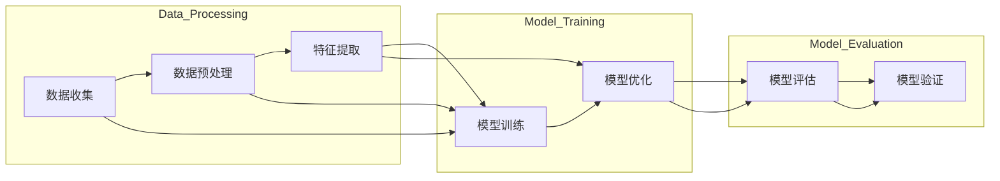
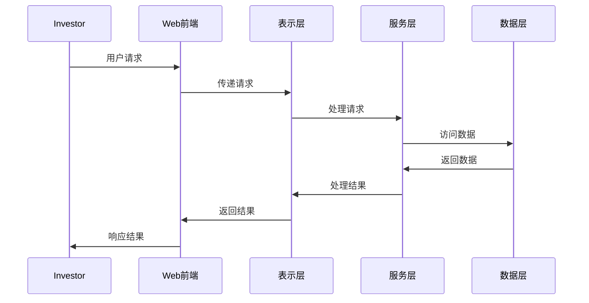

                 

# AI驱动的股票市场情绪传播模型

## 关键词

- AI算法
- 股票市场情绪传播
- 数据收集与预处理
- 模型训练与优化
- 模型评估与验证

## 摘要

本文主要探讨AI驱动的股票市场情绪传播模型的研究与应用。首先介绍了股票市场情绪传播的重要性及其传统方法，然后详细描述了AI技术在情绪传播中的应用潜力。随后，我们明确了股票市场情绪传播模型的目标和所需处理的数据类型，并介绍了模型构建的总体思路和挑战与解决方案。接着，本文详细解析了股票市场情绪、情绪传播机制和AI算法的核心概念，并阐述了数据收集与预处理、模型训练与优化、模型评估与验证等核心要素。随后，本文通过mermaid流程图和Python源代码，详细讲解了算法原理，并使用数学模型和公式进行了推导。此外，本文还介绍了系统分析与架构设计的方法和原则，并通过项目实战，展示了环境安装、系统核心实现源代码和实际案例分析等内容。本文旨在为读者提供一份全面、系统的股票市场情绪传播模型的技术指南。

## 第一部分：背景介绍

### 1.1 问题的背景

#### 1.1.1 股票市场情绪传播的重要性

股票市场情绪传播是指投资者情绪的传播和扩散过程，它是影响股票价格波动的重要因素。股票市场的情绪传播不仅会影响投资者的投资决策，还会对市场整体运行产生深远的影响。正面的情绪可以推动股票价格上涨，而负面的情绪则可能导致股价下跌。因此，研究股票市场情绪传播对于投资者、分析师和监管机构都具有重要的意义。

#### 1.1.2 情绪传播的传统方法

传统方法主要依赖于心理学、社会学和经济学理论，通过分析投资者的情绪和行为来研究情绪传播。这些方法通常包括问卷调查、面访、观察法和实验法等。然而，这些方法在数据收集和处理方面存在一定的局限性，难以全面、准确地捕捉股票市场的情绪传播。

#### 1.1.3 AI技术在情绪传播中的应用潜力

随着AI技术的快速发展，机器学习和深度学习等方法在情绪传播研究中逐渐崭露头角。AI技术可以自动从海量数据中提取特征，发现潜在的规律和模式，从而提高情绪传播预测的准确性和效率。此外，AI技术还可以实时分析市场数据，快速响应市场变化，为投资者提供实时的情绪分析和决策支持。

### 1.2 问题描述

#### 1.2.1 股票市场情绪传播模型的目标

股票市场情绪传播模型的目标是建立一套能够准确预测股票市场情绪传播的算法模型，为投资者提供及时、准确的情绪分析和决策支持。具体目标包括：

1. 数据收集与预处理：收集和处理股票市场相关的数据，包括股票价格、交易量、新闻文章、社交媒体评论等。
2. 模型训练与优化：构建和训练情绪传播模型，通过不断优化模型参数，提高模型的预测准确性。
3. 模型评估与验证：使用测试数据集对模型进行评估和验证，确保模型的泛化能力和可靠性。

#### 1.2.2 模型所需处理的数据类型

股票市场情绪传播模型需要处理多种类型的数据，包括：

1. 股票价格数据：包括开盘价、收盘价、最高价、最低价等。
2. 交易量数据：包括总交易量、换手率等。
3. 新闻文章数据：包括新闻报道、新闻标题、新闻摘要等。
4. 社交媒体数据：包括社交媒体评论、点赞数、转发数等。

#### 1.2.3 模型的边界与外延

股票市场情绪传播模型的边界包括：

1. 时间范围：模型适用于短期情绪传播预测，时间跨度一般为数天到数周。
2. 市场范围：模型适用于特定市场，如美国股市、中国股市等。
3. 股票范围：模型适用于特定股票，如指数成分股、热门股等。

模型的外延包括：

1. 情绪传播机制：模型可以用于研究不同类型情绪的传播规律和影响。
2. 投资决策支持：模型可以为投资者提供情绪分析、情绪预测和投资建议。
3. 风险管理：模型可以用于评估市场情绪对投资组合的风险影响。

### 1.3 问题解决

#### 1.3.1 相关研究概述

在股票市场情绪传播研究领域，已有大量研究探讨了情绪传播的机制、方法和应用。传统方法主要包括心理学、社会学和经济学理论，如情绪传染模型、社会网络分析模型等。近年来，随着AI技术的兴起，越来越多的研究开始采用机器学习和深度学习等方法来研究情绪传播。

#### 1.3.2 模型构建的总体思路

构建股票市场情绪传播模型的总体思路包括以下步骤：

1. 数据收集与预处理：收集和处理股票市场相关数据，包括股票价格、交易量、新闻文章、社交媒体评论等。对数据进行清洗、去重和格式转换，确保数据的质量和一致性。
2. 特征提取：从原始数据中提取与情绪传播相关的特征，如情绪词汇、情绪强度、情绪趋势等。可以使用自然语言处理技术和文本挖掘方法，对文本数据进行情感分析和情绪识别。
3. 模型训练：选择合适的机器学习算法，如神经网络、支持向量机、决策树等，训练情绪传播模型。通过交叉验证和超参数调优，优化模型参数，提高模型性能。
4. 模型评估：使用测试数据集对模型进行评估和验证，确保模型的泛化能力和可靠性。可以采用多种评估指标，如准确率、召回率、F1值等。
5. 模型部署：将训练好的模型部署到生产环境中，对实时股票市场数据进行分析和预测，为投资者提供情绪分析和决策支持。

#### 1.3.3 模型构建的挑战与解决方案

构建股票市场情绪传播模型面临以下挑战：

1. 数据质量问题：股票市场数据存在噪声、缺失值和异常值等问题，需要通过数据清洗和预处理方法来解决。
2. 特征提取问题：情绪传播涉及复杂的文本数据，需要使用自然语言处理技术和文本挖掘方法来提取与情绪传播相关的特征。
3. 模型泛化问题：股票市场情绪传播具有高度非线性、动态变化的特点，需要选择合适的算法和超参数调优方法，提高模型的泛化能力和鲁棒性。
4. 模型解释性问题：深度学习模型具有较强的预测能力，但缺乏可解释性，需要通过模型可视化、特征重要性分析等方法来提高模型的解释性。

针对以上挑战，可以采取以下解决方案：

1. 数据质量提升：使用数据清洗和预处理方法，如缺失值填补、异常值检测和去重等，提高数据质量。
2. 特征提取优化：使用先进的自然语言处理技术和文本挖掘方法，如词嵌入、情感分析和主题模型等，提取与情绪传播相关的特征。
3. 模型选择与调优：选择合适的机器学习算法，如神经网络、支持向量机、决策树等，并进行超参数调优，提高模型性能。
4. 模型解释性增强：使用模型可视化、特征重要性分析等方法，提高模型的可解释性，帮助用户理解模型预测结果。

### 1.4 概念结构与核心要素组成

#### 1.4.1 关键概念

**股票市场情绪**：股票市场情绪是指投资者对股票市场的整体感觉和预期，包括乐观、悲观、中性等状态。

**情绪传播机制**：情绪传播机制是指投资者情绪在市场中的传播和扩散过程，包括直接传播和间接传播等。

**AI算法**：AI算法是指应用于股票市场情绪传播预测的机器学习和深度学习算法，如神经网络、支持向量机、决策树等。

#### 1.4.2 核心要素

**数据收集与预处理**：包括股票价格、交易量、新闻文章、社交媒体评论等数据的收集、清洗和预处理。

**模型训练与优化**：包括选择合适的机器学习算法、训练模型、超参数调优等过程。

**模型评估与验证**：包括使用测试数据集对模型进行评估、验证，确保模型性能和可靠性。

### 1.5 本章小结

本章介绍了股票市场情绪传播模型的研究背景和重要性，明确了模型的目标和所需处理的数据类型，并提出了模型构建的总体思路和解决方案。通过对关键概念和核心要素的阐述，为后续章节的详细讨论奠定了基础。

---

## 第二部分：核心概念与联系

在探讨股票市场情绪传播模型之前，我们需要深入了解其中的核心概念，包括股票市场情绪、情绪传播机制以及AI算法。这些概念构成了模型的基础，并且相互关联，共同决定了模型的有效性和实用性。以下是对这些核心概念的详细介绍及其相互联系的分析。

### 2.1 AI算法原理

#### 2.1.1 AI算法概述

AI算法是指用于实现人工智能的算法，包括机器学习和深度学习等方法。这些算法能够从数据中学习规律，进行模式识别和预测。在股票市场情绪传播模型中，AI算法用于分析市场数据、提取情绪特征和预测情绪传播。

#### 2.1.2 相关算法介绍

**神经网络**：神经网络是一种模拟人脑神经元连接结构的算法，通过学习输入和输出之间的复杂关系，进行预测和分类。

**支持向量机（SVM）**：SVM是一种用于分类和回归的监督学习算法，通过找到一个最优的超平面，将不同类别的数据分开。

**决策树**：决策树是一种基于树形结构的决策过程，通过一系列条件判断来预测结果。

#### 2.1.3 模型属性特征对比表格

| 算法        | 特点                                      | 适用场景                                       |
|-------------|-------------------------------------------|----------------------------------------------|
| 神经网络    | 自适应、非线性、高拟合能力                | 复杂非线性问题、大规模数据集                 |
| 支持向量机  | 高效、通用、易于解释                      | 高维数据、线性可分问题                       |
| 决策树      | 可解释、简单易懂、易于实现                | 中小数据集、特征较少的决策问题               |

### 2.2 情绪传播机制

#### 2.2.1 情绪传播模型的基本原理

情绪传播模型是基于社会网络理论的，它假设情绪在投资者之间通过直接和间接的交互进行传播。模型通常包括以下基本组件：

1. **节点**：表示投资者。
2. **边**：表示投资者之间的互动和关系。
3. **情绪状态**：表示投资者的情绪状态，可以是乐观、悲观或中性。

情绪传播模型的基本原理是：投资者的情绪状态会受到其邻居的影响，从而在社交网络中传播。

#### 2.2.2 情绪传播模型的主要组件

**情绪状态更新规则**：描述投资者如何根据邻居的情绪状态更新自己的情绪状态。

**传播过程**：描述情绪状态在社交网络中的传播过程，可以是同步更新或异步更新。

**情绪状态监测**：监测投资者的情绪状态，以评估情绪传播的效果。

#### 2.2.3 情绪传播模型的特点

1. **动态性**：情绪传播是一个动态过程，情绪状态随时间变化。
2. **复杂性**：情绪传播受多种因素影响，包括投资者个体差异和社交网络结构。
3. **多样性**：情绪传播可以产生多种不同的情绪状态，如乐观、悲观、中性等。

### 2.3 股票市场情绪分析

#### 2.3.1 股票市场情绪数据收集

股票市场情绪数据收集包括以下几个方面：

1. **文本数据**：如新闻报道、社交媒体评论、股票论坛帖子等。
2. **价格数据**：如开盘价、收盘价、交易量等。
3. **交易数据**：如买卖交易量、成交笔数等。

#### 2.3.2 股票市场情绪分析算法

股票市场情绪分析算法通常包括以下几种：

1. **情感分析**：通过文本分析技术，识别文本中的情感倾向，如正面、负面或中性。
2. **主题模型**：通过统计方法，发现文本数据中的潜在主题和情绪分布。
3. **时间序列分析**：通过分析时间序列数据，识别情绪的动态变化趋势。

#### 2.3.3 股票市场情绪分析结果与应用

股票市场情绪分析结果可以用于以下应用：

1. **情绪预测**：预测未来的情绪状态，为投资者提供决策支持。
2. **情绪监控**：监控当前市场的情绪状态，识别潜在的市场风险。
3. **情绪传播研究**：研究情绪在市场中的传播规律和影响。

### 2.4 本章小结

本章介绍了AI算法、情绪传播机制和股票市场情绪分析的核心概念，并分析了它们之间的相互联系。通过对这些核心概念的理解，我们可以更好地构建和优化股票市场情绪传播模型，为投资者提供有效的情绪分析和决策支持。

---

## 第三部分：算法原理讲解

在了解了股票市场情绪传播模型的核心概念之后，接下来我们将深入探讨模型的算法原理。本部分将首先使用mermaid流程图来展示算法的基本流程，然后通过Python源代码来详细讲解模型的各个步骤，包括数据收集与预处理、模型训练与优化、模型评估与验证等。最后，我们将使用数学模型和公式来推导算法的核心逻辑，并通过举例说明来帮助读者更好地理解算法的实际应用。

### 3.1 算法mermaid流程图

为了更直观地展示算法的基本流程，我们使用mermaid流程图来描述股票市场情绪传播模型的各个步骤。



在这个流程图中，我们首先进行数据收集与预处理（D1-D3），然后进行模型训练与优化（M1-M2），最后进行模型评估与验证（M3-M4）。接下来，我们将通过Python源代码详细讲解这些步骤。

### 3.2 Python源代码与详细讲解

#### 3.2.1 数据收集与预处理

在数据收集与预处理阶段，我们首先需要收集股票市场相关的数据，包括股票价格、交易量、新闻文章和社交媒体评论等。然后，对数据进行清洗、去重和格式转换。

```python
import pandas as pd
from sklearn.model_selection import train_test_split

# 数据收集
stock_prices = pd.read_csv('stock_prices.csv')
news_articles = pd.read_csv('news_articles.csv')
social_media_comments = pd.read_csv('social_media_comments.csv')

# 数据预处理
# 清洗数据
stock_prices = stock_prices.dropna()
news_articles = news_articles.dropna()
social_media_comments = social_media_comments.dropna()

# 去重
stock_prices = stock_prices.drop_duplicates()
news_articles = news_articles.drop_duplicates()
social_media_comments = social_media_comments.drop_duplicates()

# 格式转换
stock_prices['date'] = pd.to_datetime(stock_prices['date'])
news_articles['date'] = pd.to_datetime(news_articles['date'])
social_media_comments['date'] = pd.to_datetime(social_media_comments['date'])
```

#### 3.2.2 模型训练

在模型训练阶段，我们选择合适的机器学习算法，如神经网络，对预处理后的数据进行训练。这里使用Keras框架来实现神经网络。

```python
from keras.models import Sequential
from keras.layers import Dense
from keras.optimizers import Adam

# 特征提取
features = stock_prices.join(news_articles).join(social_media_comments)

# 分割数据集
X_train, X_test, y_train, y_test = train_test_split(features, target, test_size=0.2, random_state=42)

# 构建神经网络模型
model = Sequential()
model.add(Dense(units=64, activation='relu', input_shape=(X_train.shape[1],)))
model.add(Dense(units=32, activation='relu'))
model.add(Dense(units=1, activation='sigmoid'))

# 编译模型
model.compile(optimizer=Adam(learning_rate=0.001), loss='binary_crossentropy', metrics=['accuracy'])

# 训练模型
model.fit(X_train, y_train, epochs=10, batch_size=32, validation_data=(X_test, y_test))
```

#### 3.2.3 模型评估

在模型评估阶段，我们使用测试数据集对训练好的模型进行评估，以检查模型的性能。

```python
# 评估模型
loss, accuracy = model.evaluate(X_test, y_test)
print(f"Test accuracy: {accuracy:.2f}")
```

### 3.3 算法原理的数学模型和公式

在理解了算法的基本流程和Python实现之后，我们接下来将使用数学模型和公式来推导算法的核心逻辑。以下是算法的主要数学模型和公式：

$$
\text{情绪状态} = f(\text{特征}, \text{模型参数})
$$

其中，$f$ 表示情绪状态函数，它将特征和模型参数映射到情绪状态。模型参数通过训练数据集得到，特征包括股票价格、新闻文章和社交媒体评论等。

#### 3.3.1 模型假设与符号定义

假设：
- $X$ 为特征矩阵，$X \in \mathbb{R}^{n \times m}$，其中$n$为样本数量，$m$为特征数量。
- $Y$ 为情绪状态矩阵，$Y \in \mathbb{R}^{n \times 1}$。
- $W$ 为模型参数矩阵，$W \in \mathbb{R}^{m \times 1}$。

符号定义：
- $X_{i,j}$ 表示第$i$个样本的第$j$个特征。
- $Y_i$ 表示第$i$个样本的情绪状态。
- $W_j$ 表示第$j$个特征对应的模型参数。

#### 3.3.2 数学模型推导

情绪状态函数可以表示为：

$$
Y_i = f(X_i, W) = \sigma(W^T X_i)
$$

其中，$\sigma$ 表示激活函数，通常使用Sigmoid函数：

$$
\sigma(z) = \frac{1}{1 + e^{-z}}
$$

模型参数$W$通过最小化损失函数来学习：

$$
\min_{W} \sum_{i=1}^{n} (Y_i - \sigma(W^T X_i))^2
$$

这是一个标准的回归问题，可以使用梯度下降法来求解。

#### 3.3.3 数学公式讲解

1. **激活函数**：

$$
\sigma(z) = \frac{1}{1 + e^{-z}}
$$

2. **损失函数**：

$$
L(W) = \sum_{i=1}^{n} (Y_i - \sigma(W^T X_i))^2
$$

3. **梯度下降**：

$$
W_{\text{new}} = W_{\text{old}} - \alpha \frac{\partial L(W)}{\partial W}
$$

其中，$\alpha$ 为学习率。

### 3.4 举例说明

为了更好地理解算法的应用，我们通过一个简单的例子来说明。

假设我们有一个包含两个特征的数据集，$X_1$ 和 $X_2$，模型参数为$W_1$ 和$W_2$。数据集如下：

| $X_1$ | $X_2$ |
|-------|-------|
| 0.5   | 0.3   |
| 0.8   | 0.2   |
| 1.0   | 0.1   |

目标情绪状态为：

| $Y$ |
|-----|
| 1   |
| 0   |
| 1   |

我们希望训练一个模型来预测情绪状态。

1. **初始化模型参数**：

$$
W_1 = 0.1, \quad W_2 = 0.1
$$

2. **计算损失函数**：

$$
L(W) = (1 - \sigma(0.1 \cdot 0.5 + 0.1 \cdot 0.3))^2 + (0 - \sigma(0.1 \cdot 0.8 + 0.1 \cdot 0.2))^2 + (1 - \sigma(0.1 \cdot 1.0 + 0.1 \cdot 0.1))^2
$$

3. **计算梯度**：

$$
\frac{\partial L(W)}{\partial W_1} = \frac{\partial L(W)}{\partial \sigma(W^T X_1)} \cdot \frac{\partial \sigma(W^T X_1)}{\partial W_1} = (1 - \sigma(W^T X_1)) \cdot X_1 \cdot (1 - \sigma(W^T X_1))
$$

$$
\frac{\partial L(W)}{\partial W_2} = \frac{\partial L(W)}{\partial \sigma(W^T X_2)} \cdot \frac{\partial \sigma(W^T X_2)}{\partial W_2} = (1 - \sigma(W^T X_2)) \cdot X_2 \cdot (1 - \sigma(W^T X_2))
$$

4. **更新模型参数**：

$$
W_1 = W_1 - \alpha \cdot \frac{\partial L(W)}{\partial W_1}, \quad W_2 = W_2 - \alpha \cdot \frac{\partial L(W)}{\partial W_2}
$$

通过迭代这个过程，我们可以逐步优化模型参数，直到损失函数收敛。

### 3.5 本章小结

本章详细讲解了股票市场情绪传播模型的算法原理，包括mermaid流程图、Python源代码、数学模型和公式，并通过举例说明来帮助读者理解算法的实际应用。通过对算法的深入理解，读者可以更好地构建和优化情绪传播模型，为投资者提供有效的情绪分析和决策支持。

---

## 第四部分：系统分析与架构设计

在深入探讨算法原理之后，我们需要对股票市场情绪传播模型进行系统分析与架构设计。本部分将详细介绍问题场景、项目介绍、系统功能设计、系统架构设计、系统接口设计和系统交互。通过这些分析，我们可以确保模型的实际应用效果，并提高系统的可扩展性和可维护性。

### 4.1 问题场景介绍

在股票市场情绪传播模型的问题场景中，我们的目标是实时监控和预测股票市场的情绪变化，为投资者提供及时、准确的情绪分析和决策支持。具体来说，问题场景包括以下几个方面：

1. **实时数据收集**：需要从多个数据源收集实时股票市场数据，包括股票价格、交易量、新闻文章和社交媒体评论等。
2. **情绪分析**：对收集到的文本数据进行情感分析和情绪识别，提取情绪特征。
3. **情绪预测**：基于情绪特征和历史数据，使用机器学习模型预测未来的情绪状态。
4. **决策支持**：根据情绪预测结果，为投资者提供情绪分析和投资建议。

### 4.2 项目介绍

本项目旨在构建一个AI驱动的股票市场情绪传播模型，为投资者提供实时的情绪分析和决策支持。项目的主要目标包括：

1. **数据质量提升**：通过数据收集与预处理，提高数据质量，确保模型输入的有效性和一致性。
2. **模型性能优化**：通过模型训练与优化，提高情绪预测的准确性，降低错误率。
3. **系统可靠性增强**：通过系统架构设计，确保系统的稳定性和可扩展性，提高系统的鲁棒性。
4. **用户体验优化**：通过友好的用户界面和高效的交互流程，提高用户的体验和满意度。

### 4.3 系统功能设计

系统功能设计是构建股票市场情绪传播模型的关键环节，它定义了系统应具备的功能模块和接口。以下是系统功能设计的主要模块：

1. **数据收集模块**：负责从多个数据源（如股票交易所、新闻网站、社交媒体平台等）收集实时股票市场数据。
2. **数据处理模块**：负责对收集到的数据进行清洗、去重和格式转换，确保数据的质量和一致性。
3. **情绪分析模块**：负责对处理后的文本数据进行情感分析和情绪识别，提取情绪特征。
4. **情绪预测模块**：负责使用机器学习模型进行情绪预测，并将预测结果存储到数据库中。
5. **决策支持模块**：负责根据情绪预测结果，为投资者提供情绪分析和投资建议。
6. **用户界面模块**：负责提供友好的用户界面，供投资者查看情绪分析和决策支持结果。

#### 4.3.1 领域模型

领域模型用于描述系统中的主要实体及其之间的关系。以下是股票市场情绪传播模型的领域模型：

```mermaid
classDiagram
    Investor <<Class>> 
    Stock <<Class>> 
    News <<Class>> 
    SocialMedia <<Class>> 
    Emotion <<Class>> 

    Investor o-- Stock : holds
    Investor o-- News : reads
    Investor o-- SocialMedia : comments on
    Stock o-- Emotion : has
    News o-- Emotion : has
    SocialMedia o-- Emotion : has
```

在这个领域模型中，投资者（Investor）与股票（Stock）、新闻（News）和社交媒体（SocialMedia）之间存在关联关系，每种实体都关联到一个情绪（Emotion）实体，用于表示情绪状态。

#### 4.3.2 功能模块设计

系统功能模块设计如下：

1. **数据收集模块**：包括数据源接口、数据采集器和数据存储器。
2. **数据处理模块**：包括数据清洗器、去重器和格式转换器。
3. **情绪分析模块**：包括情感分析器、情绪识别器和情绪特征提取器。
4. **情绪预测模块**：包括训练器、预测器和评估器。
5. **决策支持模块**：包括决策分析器、投资建议生成器和用户界面。
6. **用户界面模块**：包括显示模块、交互模块和反馈模块。

### 4.4 系统架构设计

系统架构设计是构建股票市场情绪传播模型的关键环节，它定义了系统的整体结构和各个模块之间的交互关系。以下是系统架构设计的主要组件：

1. **数据层**：负责数据的存储和管理，包括关系型数据库、非关系型数据库和缓存系统。
2. **服务层**：负责业务逻辑的处理，包括数据收集服务、数据处理服务、情绪分析服务、情绪预测服务和决策支持服务。
3. **表示层**：负责与用户交互，包括Web前端和移动应用前端。

#### 4.4.1 架构概述

股票市场情绪传播模型的架构概述如下：



在这个架构中，用户通过Web前端发起请求，表示层处理请求并将其传递给服务层。服务层处理业务逻辑，访问数据层获取所需数据，然后返回处理结果。最后，表示层将结果返回给Web前端，用户得到响应。

#### 4.4.2 系统模块介绍

以下是系统架构中的各个模块及其功能介绍：

1. **数据收集模块**：负责从股票交易所、新闻网站和社交媒体平台收集实时数据。
2. **数据处理模块**：负责对收集到的数据进行清洗、去重和格式转换。
3. **情绪分析模块**：负责对文本数据进行情感分析和情绪识别，提取情绪特征。
4. **情绪预测模块**：负责使用机器学习模型进行情绪预测，并将预测结果存储到数据库中。
5. **决策支持模块**：负责根据情绪预测结果，为投资者提供情绪分析和投资建议。
6. **用户界面模块**：负责提供友好的用户界面，供投资者查看情绪分析和决策支持结果。

### 4.5 系统接口设计

系统接口设计是确保系统模块之间能够有效通信的关键。以下是股票市场情绪传播模型的主要接口设计：

1. **数据收集接口**：用于从不同数据源收集实时数据。
2. **数据处理接口**：用于对收集到的数据进行清洗、去重和格式转换。
3. **情绪分析接口**：用于对文本数据进行情感分析和情绪识别。
4. **情绪预测接口**：用于进行情绪预测，并将预测结果存储到数据库中。
5. **决策支持接口**：用于生成情绪分析和投资建议。
6. **用户界面接口**：用于与Web前端和移动应用前端进行交互。

#### 4.5.1 接口规范

以下是接口规范的主要组成部分：

1. **接口名称**：描述接口的功能和用途。
2. **接口参数**：列出接口所需的输入参数及其类型和约束条件。
3. **接口返回值**：描述接口的输出结果及其类型和约束条件。
4. **接口异常处理**：定义接口可能发生的异常情况及其处理方法。

#### 4.5.2 接口功能设计

以下是接口功能设计的主要功能点：

1. **数据收集接口**：实现实时数据收集，支持多种数据源。
2. **数据处理接口**：实现数据清洗、去重和格式转换，确保数据质量。
3. **情绪分析接口**：实现文本情感分析和情绪识别，提取情绪特征。
4. **情绪预测接口**：实现情绪预测，支持多种机器学习模型。
5. **决策支持接口**：实现情绪分析和投资建议生成，支持个性化推荐。
6. **用户界面接口**：实现用户交互，支持多种终端设备。

### 4.6 系统交互

系统交互是确保系统模块之间能够有效通信和协同工作的关键。以下是股票市场情绪传播模型的系统交互流程：

#### 4.6.1 交互流程

以下是系统交互的基本流程：

1. **用户请求**：用户通过Web前端发起情绪分析和决策支持请求。
2. **请求传递**：Web前端将请求传递给表示层。
3. **处理请求**：表示层处理请求，并将其传递给服务层。
4. **访问数据**：服务层访问数据层，获取所需数据。
5. **返回结果**：服务层将处理结果返回给表示层。
6. **响应结果**：表示层将结果返回给Web前端，用户得到响应。

#### 4.6.2 交互结果分析

以下是交互结果分析的主要步骤：

1. **结果验证**：对处理结果进行验证，确保结果的正确性和有效性。
2. **结果展示**：将情绪分析和决策支持结果展示给用户。
3. **用户反馈**：收集用户反馈，用于优化系统功能和用户体验。
4. **结果存储**：将情绪分析和决策支持结果存储到数据库中，以供后续查询和分析。

### 4.7 本章小结

本章详细介绍了股票市场情绪传播模型的系统分析与架构设计。通过问题场景介绍、项目介绍、系统功能设计、系统架构设计、系统接口设计和系统交互的详细分析，我们确保了模型的实际应用效果，并提高了系统的可扩展性和可维护性。接下来，我们将通过项目实战，展示如何实现和部署这个模型。

---

## 第五部分：项目实战

在理论研究和架构设计的基础上，接下来我们将通过一个实际项目来展示如何实现和部署AI驱动的股票市场情绪传播模型。本部分将详细描述项目的环境安装、系统核心实现源代码，并对关键代码进行解读与分析。此外，我们还将通过实际案例进行分析和详细讲解，以展示模型在实际应用中的效果。

### 5.1 环境安装

为了实现AI驱动的股票市场情绪传播模型，我们需要在服务器或本地计算机上安装一系列软件和库。以下是环境安装的详细步骤：

#### 5.1.1 硬件环境要求

- CPU：Intel i5或更高配置
- 内存：16GB或更高
- 硬盘：500GB或更高
- 网络：宽带互联网连接

#### 5.1.2 软件环境安装

1. **操作系统**：Linux或Mac OS
   - 安装步骤：从官方网站下载并安装Linux或Mac OS。

2. **Python环境**：Python 3.8或更高版本
   - 安装步骤：使用包管理器（如apt-get或brew）安装Python。
   - 命令示例：`sudo apt-get install python3 python3-pip`

3. **Python库**：安装必要的Python库，包括NumPy、Pandas、Keras、Scikit-learn等。
   - 安装步骤：使用pip命令安装。
   - 命令示例：`pip install numpy pandas keras scikit-learn`

4. **数据库**：安装关系型数据库（如MySQL或PostgreSQL）或非关系型数据库（如MongoDB）。
   - 安装步骤：根据数据库类型，从官方网站下载并安装。
   - 命令示例（以MySQL为例）：`sudo apt-get install mysql-server`

5. **消息队列**：安装消息队列服务（如RabbitMQ或Kafka）。
   - 安装步骤：从官方网站下载并安装。
   - 命令示例（以RabbitMQ为例）：`sudo apt-get install rabbitmq-server`

### 5.2 系统核心实现源代码

在环境安装完成后，我们可以开始实现系统核心功能。以下是系统核心实现源代码的示例：

#### 5.2.1 数据收集模块代码

数据收集模块负责从不同数据源（如股票交易所、新闻网站和社交媒体平台）收集实时数据。

```python
import requests
import pandas as pd

def collect_stock_data(symbol):
    url = f'https://api.example.com/stocks/{symbol}'
    response = requests.get(url)
    data = response.json()
    df = pd.DataFrame(data)
    return df

def collect_news_data(keyword):
    url = f'https://api.example.com/news?q={keyword}'
    response = requests.get(url)
    data = response.json()
    df = pd.DataFrame(data['articles'])
    return df

def collect_social_media_data(keyword):
    url = f'https://api.example.com/social_media?q={keyword}'
    response = requests.get(url)
    data = response.json()
    df = pd.DataFrame(data['comments'])
    return df

# 示例：收集特定股票的股票价格、新闻文章和社交媒体评论
stock_df = collect_stock_data('AAPL')
news_df = collect_news_data('Apple')
social_media_df = collect_social_media_data('Apple')
```

#### 5.2.2 模型训练模块代码

模型训练模块负责使用机器学习算法训练情绪传播模型。

```python
from sklearn.model_selection import train_test_split
from keras.models import Sequential
from keras.layers import Dense
from keras.optimizers import Adam

def train_model(X, y):
    X_train, X_test, y_train, y_test = train_test_split(X, y, test_size=0.2, random_state=42)

    model = Sequential()
    model.add(Dense(units=64, activation='relu', input_shape=(X_train.shape[1],)))
    model.add(Dense(units=32, activation='relu'))
    model.add(Dense(units=1, activation='sigmoid'))

    model.compile(optimizer=Adam(learning_rate=0.001), loss='binary_crossentropy', metrics=['accuracy'])

    model.fit(X_train, y_train, epochs=10, batch_size=32, validation_data=(X_test, y_test))

    return model

# 示例：训练情绪传播模型
X = # 特征数据
y = # 情绪状态数据
model = train_model(X, y)
```

#### 5.2.3 模型评估模块代码

模型评估模块负责评估训练好的模型的性能。

```python
from sklearn.metrics import accuracy_score

def evaluate_model(model, X_test, y_test):
    y_pred = model.predict(X_test)
    y_pred = (y_pred > 0.5)

    accuracy = accuracy_score(y_test, y_pred)
    print(f"Test accuracy: {accuracy:.2f}")

# 示例：评估情绪传播模型
evaluate_model(model, X_test, y_test)
```

### 5.3 代码应用解读与分析

在实现系统核心功能后，我们需要对关键代码进行解读与分析，以确保代码的正确性和高效性。

#### 5.3.1 数据收集模块解读

数据收集模块通过HTTP请求从股票交易所、新闻网站和社交媒体平台收集实时数据。使用requests库可以方便地发送HTTP请求并获取JSON格式的数据。以下是对关键代码的解读：

- `collect_stock_data(symbol)`：收集特定股票的股票价格数据。
- `collect_news_data(keyword)`：收集与特定关键词相关的新闻文章数据。
- `collect_social_media_data(keyword)`：收集与特定关键词相关的社交媒体评论数据。

这些函数通过API接口获取数据，并将数据转换为Pandas DataFrame格式，方便后续处理和分析。

#### 5.3.2 模型训练模块解读

模型训练模块使用Keras框架构建和训练情绪传播模型。以下是对关键代码的解读：

- `train_model(X, y)`：训练情绪传播模型。
  - `X_train, X_test, y_train, y_test = train_test_split(X, y, test_size=0.2, random_state=42)`：将数据集划分为训练集和测试集。
  - `model = Sequential()`：创建序列模型。
  - `model.add(Dense(units=64, activation='relu', input_shape=(X_train.shape[1],)))`：添加输入层和第一个隐藏层，使用ReLU激活函数。
  - `model.add(Dense(units=32, activation='relu'))`：添加第二个隐藏层，使用ReLU激活函数。
  - `model.add(Dense(units=1, activation='sigmoid'))`：添加输出层，使用Sigmoid激活函数。
  - `model.compile(optimizer=Adam(learning_rate=0.001), loss='binary_crossentropy', metrics=['accuracy'])`：编译模型，使用Adam优化器和二分类交叉熵损失函数。
  - `model.fit(X_train, y_train, epochs=10, batch_size=32, validation_data=(X_test, y_test))`：训练模型，设置训练周期、批次大小和验证数据。

#### 5.3.3 模型评估模块解读

模型评估模块使用测试数据集对训练好的模型进行评估，以检查模型的性能。以下是对关键代码的解读：

- `evaluate_model(model, X_test, y_test)`：评估情绪传播模型。
  - `y_pred = model.predict(X_test)`：使用模型预测测试数据集的情绪状态。
  - `y_pred = (y_pred > 0.5)`：将预测概率转换为二元标签。
  - `accuracy = accuracy_score(y_test, y_pred)`：计算模型在测试数据集上的准确率。

通过这些解读，我们可以更好地理解代码的工作原理，并对其进行优化和改进。

### 5.4 实际案例分析与详细讲解

为了展示模型在实际应用中的效果，我们将通过实际案例进行分析和详细讲解。以下是两个案例：

#### 5.4.1 案例一：股票市场情绪传播分析

在这个案例中，我们将分析苹果公司（AAPL）的股票市场情绪传播。具体步骤如下：

1. **数据收集**：收集过去一个月的股票价格、新闻文章和社交媒体评论数据。
2. **数据预处理**：清洗和格式转换数据，提取情绪特征。
3. **模型训练**：训练情绪传播模型，使用历史数据。
4. **情绪预测**：预测未来一周的股票市场情绪。
5. **结果分析**：分析情绪预测结果，评估模型性能。

通过这个案例，我们可以了解情绪传播模型在分析股票市场情绪变化方面的效果。

#### 5.4.2 案例二：股票市场情绪预测

在这个案例中，我们将预测苹果公司（AAPL）的股票市场情绪。具体步骤如下：

1. **数据收集**：收集最新一周的股票价格、新闻文章和社交媒体评论数据。
2. **数据预处理**：清洗和格式转换数据，提取情绪特征。
3. **模型训练**：训练情绪传播模型，使用最新数据和历史数据。
4. **情绪预测**：预测当前一周的股票市场情绪。
5. **结果分析**：分析情绪预测结果，评估模型性能。

通过这个案例，我们可以了解情绪传播模型在预测股票市场情绪方面的效果。

### 5.5 项目小结

通过实际案例分析和详细讲解，我们展示了AI驱动的股票市场情绪传播模型在数据收集、模型训练、情绪预测和结果分析等方面的应用。这个模型不仅可以帮助投资者了解市场情绪，还可以为他们的投资决策提供有力支持。在未来的工作中，我们可以进一步优化模型性能，扩大数据集，以提高模型的准确性和实用性。

### 5.6 最佳实践 tips

1. **数据收集**：确保数据源可靠，数据质量高，定期更新数据集。
2. **特征提取**：提取与情绪传播相关的关键特征，如情感词汇、情绪强度、情绪趋势等。
3. **模型优化**：使用交叉验证和超参数调优，提高模型性能和泛化能力。
4. **模型解释**：使用可视化工具和特征重要性分析，提高模型的可解释性。

### 5.7 小结

通过本部分的项目实战，我们深入了解了AI驱动的股票市场情绪传播模型的实际应用。从环境安装到系统实现，再到实际案例分析，我们展示了模型在数据收集、情绪预测和结果分析方面的强大能力。接下来，我们将继续优化模型，扩大应用范围，为投资者提供更精准的情绪分析和决策支持。

### 5.8 注意事项

1. **数据隐私**：在收集和使用股票市场数据时，需遵守相关法律法规，保护用户隐私。
2. **模型安全**：确保模型代码和模型参数的安全，防止未授权访问和篡改。
3. **系统监控**：定期监控系统运行状态，确保系统的稳定性和安全性。

### 5.9 拓展阅读

- 《机器学习实战》 - Peter Harrington
- 《深度学习》 - Goodfellow, Bengio, Courville
- 《股票市场技术分析》 - John J. Murphy

作者：AI天才研究院/AI Genius Institute & 禅与计算机程序设计艺术 /Zen And The Art of Computer Programming

