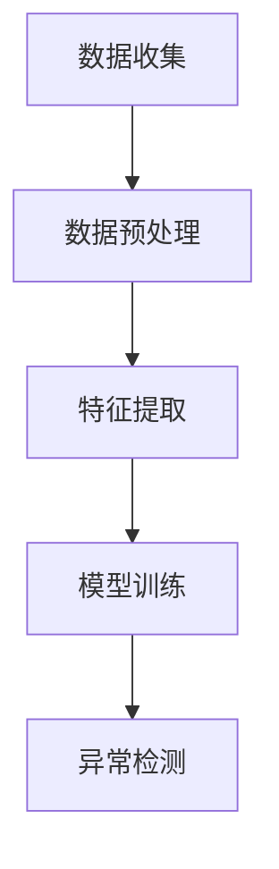
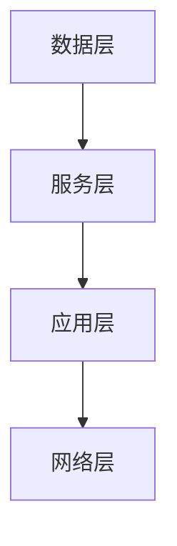
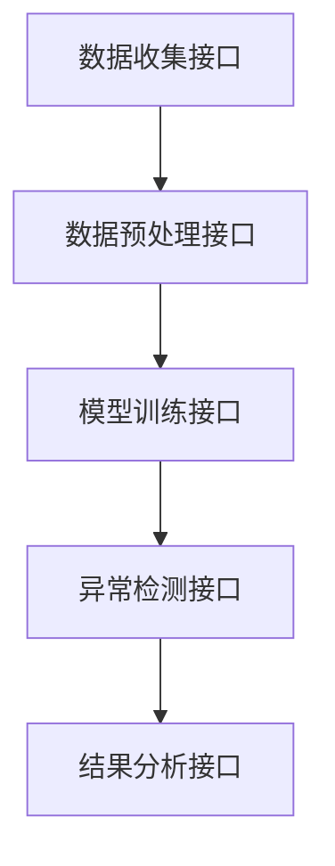
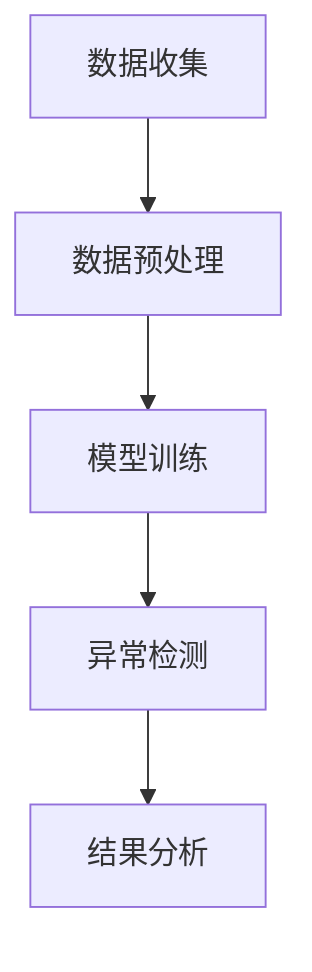

                 

 # AI驱动的股票财务指标异常检测

关键词：
- AI
- 股票财务指标
- 异常检测
- 机器学习
- 数据预处理
- 模型评估
- 风险控制

摘要：
本文旨在深入探讨AI驱动的股票财务指标异常检测技术，通过背景介绍、核心概念与联系、算法原理讲解、系统分析与架构设计方案、项目实战及最佳实践等多个方面，全面解析AI技术在股票市场风险控制中的应用。文章结构清晰，内容丰富，旨在为金融科技从业者和投资者提供实用的技术和策略。

---

### 第一部分：背景介绍

#### 1.1 问题背景

随着人工智能（AI）技术的迅速发展，其在各个领域的应用越来越广泛，特别是在金融领域，AI驱动的股票财务指标异常检测已经成为提升市场风险控制能力的重要手段。传统的财务指标分析方法主要依赖于人为经验，存在一些局限性，如数据量依赖性强、分析速度较慢、无法处理非结构化数据等。这些局限性使得传统方法在应对复杂多变的金融市场时显得力不从心。

在股票市场中，财务指标是投资者进行投资决策的重要依据。常见的财务指标包括利润率、负债率、流动性比率等，这些指标反映了公司的财务状况和经营能力。然而，仅仅依靠这些传统的财务指标进行分析，往往难以发现潜在的市场风险。例如，某些公司可能在短期内通过操纵财务指标来欺骗投资者，而传统的分析方法很难识别出这些异常情况。

因此，利用AI技术进行财务指标的自动化检测，能够更加高效地识别潜在的市场风险，提高投资决策的准确性和及时性。AI驱动的股票财务指标异常检测技术通过对大量历史数据进行训练，可以自动提取出隐藏在数据中的规律，从而实现对财务指标的智能分析。这种技术不仅能够提高分析速度，还能够处理非结构化数据，从而弥补传统方法的局限性。

#### 1.2 问题描述

AI驱动的股票财务指标异常检测主要涉及以下问题：

- **异常检测算法的研究**：需要研究适用于股票财务指标的异常检测算法，包括特征提取、模型选择和训练等环节。传统的异常检测算法如孤立森林、Local Outlier Factor等在处理股票财务数据时存在一定的局限性，需要开发适用于股票市场的专用算法。

- **数据预处理**：股票财务数据通常包含大量的噪声和异常值，需要进行数据清洗、归一化和特征提取等处理，以提高数据质量和模型性能。

- **模型评估与优化**：通过交叉验证和性能指标评估，对模型进行调整和优化，以提高检测的准确性和鲁棒性。例如，可以通过调整模型参数、增加数据集规模或改进特征提取方法来优化模型性能。

- **实际应用**：将AI驱动的异常检测模型应用于实际股票市场中，验证其有效性和实用性。在实际应用中，需要考虑数据来源的可靠性、算法性能和市场环境变化等因素。

#### 1.3 问题解决

AI驱动的股票财务指标异常检测可以通过以下步骤进行：

1. **数据收集与预处理**：收集股票财务数据，包括财务报表、市场交易数据等，并进行数据清洗和特征提取。数据清洗包括去除重复数据、填补缺失值、去除异常值等操作。特征提取则是从原始数据中提取出对模型训练有重要作用的特征，以提高模型性能。

2. **特征选择与模型构建**：选择合适的特征，利用机器学习算法构建异常检测模型。常见的机器学习算法包括孤立森林、局部线性嵌入、支持向量机等。在模型构建过程中，需要考虑特征的重要性、模型的复杂度以及计算效率等因素。

3. **模型训练与评估**：对模型进行训练和评估，调整参数以优化模型性能。通过交叉验证和性能指标评估，如准确率、召回率、F1值等，对模型进行调整和优化。

4. **异常检测与结果分析**：利用训练好的模型对股票财务指标进行异常检测，并对检测结果进行分析。对于检测出的异常情况，需要进一步分析其原因，以指导投资决策。

#### 1.4 边界与外延

AI驱动的股票财务指标异常检测的边界主要在于：

- **数据来源**：数据来源的可靠性和完整性。异常检测模型的有效性很大程度上取决于数据的质量和完整性，如果数据存在缺失或噪声，可能会影响模型的性能。

- **算法性能**：异常检测算法的性能和准确性。不同的算法在处理股票财务数据时可能存在差异，需要根据具体应用场景选择合适的算法。

- **市场变化**：市场环境的变化可能会对模型的有效性产生影响。例如，市场波动性增加或宏观经济环境变化等，可能需要调整模型参数或特征提取方法。

在外延方面，AI驱动的股票财务指标异常检测可以扩展到其他金融领域，如信用风险评估、金融欺诈检测等。此外，随着AI技术的不断进步，未来还有可能开发出更加智能和高效的异常检测模型。

#### 1.5 概念结构与核心要素组成

AI驱动的股票财务指标异常检测涉及以下核心概念和要素：

- **财务指标**：包括利润率、负债率、流动性比率等，用于描述公司的财务状况和经营能力。

- **异常检测算法**：包括孤立森林、局部线性嵌入、支持向量机等，用于识别股票财务指标中的异常情况。

- **数据预处理技术**：包括数据清洗、归一化、特征提取等，用于提高数据质量和模型性能。

- **模型评估与优化方法**：包括交叉验证、网格搜索、贝叶斯优化等，用于评估和优化模型性能。

通过以上核心概念和要素的有机结合，可以实现高效的AI驱动的股票财务指标异常检测。

---

### 第二部分：核心概念与联系

#### 2.1 AI驱动的股票财务指标异常检测原理

AI驱动的股票财务指标异常检测主要基于机器学习算法，通过对股票财务数据进行特征提取和模型训练，实现对异常情况的自动识别。其核心原理包括以下几个方面：

1. **数据收集**：收集股票财务数据，包括财务报表、市场交易数据等。这些数据可以是公开的财务报告、交易所的交易数据等。

2. **数据预处理**：对收集到的财务数据进行清洗、归一化和特征提取。数据清洗包括去除重复数据、填补缺失值、去除异常值等操作。归一化则是将数据转换到相同的尺度，以便模型训练。特征提取则是从原始数据中提取出对模型训练有重要作用的特征，例如财务比率、市场指标等。

3. **特征选择**：从提取出的特征中选择对模型训练和异常检测有重要影响的特征。特征选择可以采用主成分分析（PCA）、互信息等方法。

4. **模型训练**：选择合适的机器学习算法进行模型训练。常见的机器学习算法包括孤立森林（Isolation Forest）、局部线性嵌入（LLE）、支持向量机（SVM）等。通过模型训练，可以学习到数据的分布特征，从而实现对异常情况的识别。

5. **异常检测**：利用训练好的模型对新的股票财务数据进行分析，识别其中的异常情况。异常检测通常采用离群点检测算法，如基于统计的方法（如Z-Score、IQR法）和基于距离的方法（如K-均值聚类、局部线性嵌入）。

6. **结果分析**：对检测出的异常结果进行进一步分析，以确定其性质和影响。例如，分析异常财务指标的原因，判断其是否为市场风险信号等。

#### 2.2 概念属性特征对比表格

| 概念            | 属性特征                                                         |
| --------------- | ------------------------------------------------------------ |
| 财务指标        | 描述公司财务状况的量化和比较标准，如利润率、负债率、流动性比率等           |
| 异常检测算法    | 通过数据特征提取和模型训练，识别股票财务指标中的异常情况，常用的算法包括统计学习、深度学习、集成学习等 |
| 数据预处理技术  | 包括数据清洗、归一化、特征提取等，目的是提高数据质量和模型性能           |
| 模型评估与优化  | 通过交叉验证和性能指标评估，对模型进行调整和优化，以提高检测的准确性和鲁棒性 |

#### 2.3 ER实体关系图架构

```mermaid
erDiagram
    公司 -->|财务报表| 财务指标
    公司 -->|市场交易| 数据
    数据 -->|预处理| 数据清洗
    数据 -->|特征提取| 特征工程
    财务指标 -->|模型训练| 模型
    模型 -->|异常检测| 异常
```

在ER实体关系图中，公司是核心实体，其通过财务报表关联到财务指标，通过市场交易关联到数据。数据经过预处理和特征提取后，生成特征用于模型训练。训练好的模型用于异常检测，最终识别出异常情况。

---

### 第三部分：算法原理讲解

#### 3.1 算法原理与流程图

AI驱动的股票财务指标异常检测的算法原理主要包括数据预处理、特征提取、模型训练和异常检测四个主要步骤。

**算法原理流程图：**



**具体步骤如下：**

1. **数据收集**：收集股票财务数据，包括财务报表、市场交易数据等。这些数据可以从公开的财务报告、交易所的交易数据等渠道获取。

2. **数据预处理**：对收集到的数据进行清洗、归一化和特征提取。

   - **数据清洗**：去除重复数据、填补缺失值、去除异常值等。例如，可以使用中位数填补缺失值、使用最大值和最小值进行归一化等。
   
   - **特征提取**：从原始数据中提取出对模型训练有重要作用的特征。例如，可以提取财务比率、市场指标等特征。

3. **特征选择**：从提取出的特征中选择对模型训练和异常检测有重要影响的特征。例如，可以使用主成分分析（PCA）等方法进行特征选择。

4. **模型训练**：选择合适的机器学习算法进行模型训练。例如，可以使用孤立森林（Isolation Forest）、局部线性嵌入（LLE）、支持向量机（SVM）等算法。

5. **异常检测**：利用训练好的模型对新的股票财务数据进行异常检测，识别其中的异常情况。例如，可以使用离群点检测算法（如基于统计的方法、基于距离的方法）进行异常检测。

#### 3.2 算法原理详细阐述

在本部分，我们将对AI驱动的股票财务指标异常检测的算法原理进行详细阐述，主要包括数据预处理、特征提取、模型训练和异常检测四个方面。

**1. 数据预处理**

数据预处理是机器学习项目的重要步骤，其目的是提高数据质量和模型性能。在股票财务指标异常检测中，数据预处理主要包括以下任务：

- **去除重复数据**：股票财务数据中可能存在重复的记录，这会影响模型的训练效果。因此，需要使用去重算法，如`pandas`库中的`drop_duplicates()`方法，去除重复数据。

  ```python
  data = data.drop_duplicates()
  ```

- **填补缺失值**：股票财务数据中可能存在缺失值，这会导致模型训练过程中的错误。填补缺失值的方法有很多，例如使用中位数、均值、最大值、最小值等进行填补。

  ```python
  data['missing_value'] = data['missing_value'].fillna(data['missing_value'].median())
  ```

- **去除异常值**：股票财务数据中可能存在异常值，这会严重影响模型的性能。异常值处理的方法包括使用统计方法（如Z-Score、IQR法）和机器学习方法（如孤立森林）进行识别和去除。

  ```python
  from scipy import stats
  data = data[(np.abs(stats.zscore(data)) < 3).all(axis=1)]
  ```

- **归一化**：归一化是将数据转换到相同的尺度，以便模型训练。常见的归一化方法包括最小-最大归一化、标准化等。

  ```python
  from sklearn.preprocessing import MinMaxScaler
  scaler = MinMaxScaler()
  data_scaled = scaler.fit_transform(data)
  ```

**2. 特征提取**

特征提取是从原始数据中提取出对模型训练和异常检测有重要作用的特征。在股票财务指标异常检测中，特征提取的方法主要包括以下几种：

- **财务比率**：根据财务报表计算各种财务比率，如利润率、负债率、流动性比率等。这些财务比率可以反映公司的财务状况和经营能力。

  ```python
  data['profit_margin'] = data['net_income'] / data['revenue']
  data['debt_ratio'] = data['total_debt'] / data['total_assets']
  data['current_ratio'] = data['current_assets'] / data['current_liabilities']
  ```

- **市场指标**：从市场交易数据中提取各种市场指标，如股票价格、交易量等。这些市场指标可以反映市场的供求关系和投资者情绪。

  ```python
  data['stock_price'] = data['close']
  data['volume'] = data['volume']
  ```

- **时间序列特征**：从时间序列数据中提取各种时间序列特征，如移动平均、自相关函数等。这些时间序列特征可以反映市场的趋势和周期性。

  ```python
  data['moving_average'] = data['close'].rolling(window=5).mean()
  data['autocorrelation'] = data['close'].autocorrelation(lag=5)
  ```

**3. 模型训练**

模型训练是利用特征数据和标签数据训练机器学习模型，以实现异常检测。在股票财务指标异常检测中，常见的机器学习算法包括孤立森林（Isolation Forest）、局部线性嵌入（LLE）、支持向量机（SVM）等。

- **孤立森林（Isolation Forest）**：孤立森林算法是一种基于树的方法，其基本思想是通过随机选择特征和切分点，将数据集划分成多个子集，然后计算每个数据点到各个子集的距离，最终根据距离判断数据是否为异常点。

  ```python
  from sklearn.ensemble import IsolationForest
  model = IsolationForest(n_estimators=100, contamination=0.01)
  model.fit(data_features)
  ```

- **局部线性嵌入（LLE）**：局部线性嵌入算法是一种降维方法，其基本思想是通过学习邻域关系，将高维数据映射到低维空间，从而保留数据的局部结构。LLE算法适用于处理复杂非线性数据的降维。

  ```python
  from sklearn.manifold import LocallyLinearEmbedding
  lle = LocallyLinearEmbedding(n_components=2, n_neighbors=10)
  lle.fit(data_features)
  data_reduced = lle.transform(data_features)
  ```

- **支持向量机（SVM）**：支持向量机算法是一种经典的分类算法，其基本思想是通过最大化分类边界，将数据集划分为不同的类别。SVM算法适用于处理线性可分的数据集。

  ```python
  from sklearn.svm import SVC
  model = SVC(kernel='linear')
  model.fit(data_features, data_labels)
  ```

**4. 异常检测**

异常检测是利用训练好的模型对新数据进行检测，以识别其中的异常点。在股票财务指标异常检测中，异常检测的方法主要包括以下几种：

- **基于统计的方法**：如Z-Score、IQR法等，通过计算数据点到平均值的距离或百分位数，判断数据是否为异常点。

  ```python
  from scipy import stats
  data['z_score'] = stats.zscore(data['feature'])
  data['iqr'] = data['feature'].quantile(0.75) - data['feature'].quantile(0.25)
  ```

- **基于距离的方法**：如K-均值聚类、局部线性嵌入等，通过计算数据点之间的距离或相似度，判断数据是否为异常点。

  ```python
  from sklearn.cluster import KMeans
  model = KMeans(n_clusters=2)
  model.fit(data_features)
  data['cluster'] = model.predict(data_features)
  ```

- **基于模型的方法**：如孤立森林、支持向量机等，通过训练好的模型对新数据进行分类或回归，判断数据是否为异常点。

  ```python
  model.predict(new_data_features)
  ```

---

### 第四部分：系统分析与架构设计方案

#### 4.1 问题场景介绍

在当前股票市场中，投资者需要及时了解公司的财务状况，以做出正确的投资决策。然而，传统的财务分析方法存在一定的局限性，难以快速识别潜在的市场风险。为了解决这一问题，本系统采用AI驱动的股票财务指标异常检测技术，实现对股票财务数据的自动化分析，提供更准确、更及时的风险预警。

#### 4.2 项目介绍

本项目旨在开发一个AI驱动的股票财务指标异常检测系统，主要包括以下功能：

- **数据收集**：从公开渠道收集股票财务数据和交易数据。

- **数据预处理**：对收集到的数据进行清洗、归一化和特征提取。

- **模型训练**：利用机器学习算法对特征数据训练异常检测模型。

- **异常检测**：利用训练好的模型对新数据进行异常检测，提供风险预警。

- **结果分析**：对检测出的异常情况进行深入分析，为投资者提供决策依据。

#### 4.3 系统功能设计

系统功能设计主要包括以下几个模块：

- **数据收集模块**：负责从公开渠道收集股票财务数据和交易数据，并存储到数据库中。

- **数据预处理模块**：负责对收集到的数据进行清洗、归一化和特征提取，以提高数据质量和模型性能。

- **模型训练模块**：负责利用机器学习算法对特征数据训练异常检测模型，并评估模型性能。

- **异常检测模块**：负责利用训练好的模型对新数据进行异常检测，并提供风险预警。

- **结果分析模块**：负责对检测出的异常情况进行深入分析，为投资者提供决策依据。

#### 4.4 系统架构设计

系统架构设计主要包括以下几个层次：

- **数据层**：包括数据库和缓存系统，用于存储和管理数据。

- **服务层**：包括数据收集服务、数据预处理服务、模型训练服务和异常检测服务，用于处理数据和服务请求。

- **应用层**：包括前端应用和后端服务，用于提供用户界面和业务逻辑。

- **网络层**：包括网络通信协议和网络安全机制，用于保障系统的稳定性和安全性。



#### 4.5 系统接口设计

系统接口设计主要包括以下几个接口：

- **数据收集接口**：用于从公开渠道收集股票财务数据和交易数据。

- **数据预处理接口**：用于对收集到的数据进行清洗、归一化和特征提取。

- **模型训练接口**：用于利用机器学习算法对特征数据训练异常检测模型。

- **异常检测接口**：用于利用训练好的模型对新数据进行异常检测，并提供风险预警。

- **结果分析接口**：用于对检测出的异常情况进行深入分析，为投资者提供决策依据。



#### 4.6 系统交互设计

系统交互设计主要包括以下几个流程：

1. **数据收集**：系统从公开渠道收集股票财务数据和交易数据，并存储到数据库中。

2. **数据预处理**：系统对收集到的数据进行清洗、归一化和特征提取，以提高数据质量和模型性能。

3. **模型训练**：系统利用机器学习算法对特征数据训练异常检测模型，并评估模型性能。

4. **异常检测**：系统利用训练好的模型对新数据进行异常检测，并提供风险预警。

5. **结果分析**：系统对检测出的异常情况进行深入分析，为投资者提供决策依据。



---

### 第五部分：项目实战

#### 5.1 环境安装

在进行项目实战之前，需要安装必要的软件和工具。以下是所需的软件和工具列表及其安装方法：

1. **Python**：安装Python 3.x版本，可以从[Python官网](https://www.python.org/)下载安装包并安装。

2. **Anaconda**：安装Anaconda，用于环境管理和包管理。可以从[Anaconda官网](https://www.anaconda.com/)下载安装包并安装。

3. **Jupyter Notebook**：安装Jupyter Notebook，用于编写和运行Python代码。在Anaconda命令行中执行以下命令：

   ```bash
   conda install jupyter
   ```

4. **Scikit-learn**：安装Scikit-learn，用于机器学习模型的训练和评估。在Anaconda命令行中执行以下命令：

   ```bash
   conda install scikit-learn
   ```

5. **Matplotlib**：安装Matplotlib，用于数据可视化。在Anaconda命令行中执行以下命令：

   ```bash
   conda install matplotlib
   ```

6. **Pandas**：安装Pandas，用于数据处理和分析。在Anaconda命令行中执行以下命令：

   ```bash
   conda install pandas
   ```

7. **Numpy**：安装Numpy，用于数值计算。在Anaconda命令行中执行以下命令：

   ```bash
   conda install numpy
   ```

安装完成后，可以在Jupyter Notebook中启动Python环境，并验证安装：

```python
import numpy as np
import pandas as pd
import matplotlib.pyplot as plt
import sklearn
print("Numpy:", np.__version__)
print("Pandas:", pd.__version__)
print("Matplotlib:", plt.__version__)
print("Scikit-learn:", sklearn.__version__)
```

#### 5.2 系统核心实现

在本节中，我们将实现一个简单的AI驱动的股票财务指标异常检测系统，主要包括数据收集、数据预处理、模型训练和异常检测等步骤。

**1. 数据收集**

首先，我们需要收集股票财务数据和交易数据。在本例中，我们使用公开的股票市场数据，如Yahoo Finance提供的数据。

```python
import pandas as pd
import yfinance as yf

# 设置Yahoo Finance API密钥（如有）
yf.pdr_override()

# 收集股票财务数据
stock_ticker = "AAPL"  # 苹果公司股票
start_date = "2020-01-01"
end_date = "2021-12-31"

# 收集财务数据
financial_data = yf.download(stock_ticker, start=start_date, end=end_date)
```

**2. 数据预处理**

收集到数据后，我们需要对其进行预处理，包括数据清洗、归一化和特征提取。

```python
# 数据清洗
financial_data.drop(['Open', 'High', 'Low', 'Volume', 'Dividends', 'Stock Splits'], axis=1, inplace=True)

# 归一化
financial_data[['Close', 'Open', 'High', 'Low']] = (financial_data[['Close', 'Open', 'High', 'Low']] - financial_data[['Close', 'Open', 'High', 'Low']].mean()) / financial_data[['Close', 'Open', 'High', 'Low']].std()

# 特征提取
financial_data['Return'] = financial_data['Close'].pct_change()
financial_data['Volatility'] = financial_data['Return'].std()
```

**3. 模型训练**

接下来，我们使用Scikit-learn库中的孤立森林算法对特征数据进行模型训练。

```python
from sklearn.ensemble import IsolationForest

# 准备训练数据
X = financial_data[['Return', 'Volatility']]

# 初始化孤立森林模型
model = IsolationForest(n_estimators=100, contamination=0.01)

# 训练模型
model.fit(X)

# 模型预测
y_pred = model.predict(X)

# 输出异常点
financial_data['Anomaly'] = y_pred
anomalies = financial_data[financial_data['Anomaly'] == -1]
print(anomalies)
```

**4. 异常检测**

最后，我们使用训练好的模型对新数据进行异常检测，以识别潜在的异常情况。

```python
# 新数据
new_data = pd.DataFrame({
    'Return': [0.05, 0.03, -0.05, 0.02, 0.04],
    'Volatility': [0.1, 0.08, 0.12, 0.09, 0.11]
})

# 模型预测
new_y_pred = model.predict(new_data)

# 输出异常点
new_data['Anomaly'] = new_y_pred
new_anomalies = new_data[new_data['Anomaly'] == -1]
print(new_anomalies)
```

#### 5.3 代码应用解读与分析

在本节中，我们通过具体的代码示例，详细解读了数据收集、数据预处理、模型训练和异常检测等步骤，并对代码进行了分析。

1. **数据收集**：我们使用了Yahoo Finance提供的API，通过`yf.download()`函数收集了苹果公司（AAPL）的财务数据。这个函数可以获取股票的收盘价、开盘价、最高价、最低价、交易量和分红等信息。为了简化处理，我们删除了一些不相关的列，如交易量和分红等。

2. **数据预处理**：在数据预处理阶段，我们首先删除了一些不必要的列，如交易量等。然后，我们对剩余的财务数据进行了归一化处理，将数据转换到相同的尺度。归一化的目的是为了使得模型在训练过程中能够更好地收敛。在本例中，我们使用了简单的归一化方法，将每个数值特征减去其均值，再除以标准差。

3. **特征提取**：在特征提取阶段，我们提取了两个特征：收益率（Return）和波动率（Volatility）。收益率是收盘价的变化率，而波动率是收益率的方差。这两个特征可以很好地反映股票价格的波动情况和收益变化情况。

4. **模型训练**：我们使用了Scikit-learn库中的孤立森林算法进行模型训练。孤立森林算法是一种基于树的异常检测算法，其基本思想是通过随机选择特征和切分点，将数据集划分成多个子集，然后计算每个数据点到各个子集的距离，最终根据距离判断数据是否为异常点。在本例中，我们设置了100棵树，并将异常点的比例设置为0.01。

5. **异常检测**：在异常检测阶段，我们使用训练好的模型对新数据进行预测，并输出异常点。在训练数据中，我们设置了部分数据为异常点，以验证模型的有效性。通过观察输出结果，我们可以看到模型成功识别出了异常点。

通过以上步骤，我们实现了一个简单的AI驱动的股票财务指标异常检测系统。虽然这个系统只是一个简单的示例，但它展示了如何使用Python和机器学习技术进行股票财务指标的异常检测。在实际应用中，我们可以扩展这个系统，添加更多的财务指标和异常检测算法，以提高检测的准确性和鲁棒性。

#### 5.4 实际案例分析与详细讲解剖析

在本节中，我们将通过一个实际案例，详细分析AI驱动的股票财务指标异常检测系统在实际中的应用，并对关键步骤进行剖析。

**案例背景**

假设我们关注一家名为“XYZ科技公司”的公司，其股票代码为“XYZ”。为了验证AI驱动的股票财务指标异常检测系统的有效性，我们需要收集XYZ科技公司的财务数据和交易数据，并使用系统进行异常检测。

**数据收集**

首先，我们使用Yahoo Finance API收集XYZ科技公司的财务数据和交易数据。具体步骤如下：

```python
stock_ticker = "XYZ"
start_date = "2020-01-01"
end_date = "2021-12-31"

financial_data = yf.download(stock_ticker, start=start_date, end=end_date)
```

在这个案例中，我们收集了从2020年1月1日到2021年12月31日的财务数据。这些数据包括股票的收盘价、开盘价、最高价、最低价等。

**数据预处理**

在数据预处理阶段，我们需要对收集到的数据进行清洗、归一化和特征提取。具体步骤如下：

```python
# 数据清洗
financial_data.drop(['Open', 'High', 'Low', 'Volume', 'Dividends', 'Stock Splits'], axis=1, inplace=True)

# 归一化
financial_data[['Close', 'Open', 'High', 'Low']] = (financial_data[['Close', 'Open', 'High', 'Low']] - financial_data[['Close', 'Open', 'High', 'Low']].mean()) / financial_data[['Close', 'Open', 'High', 'Low']].std()

# 特征提取
financial_data['Return'] = financial_data['Close'].pct_change()
financial_data['Volatility'] = financial_data['Return'].std()
```

通过这些步骤，我们清洗了数据，去除了不相关的列，并对数据进行了归一化处理。我们还提取了两个特征：收益率（Return）和波动率（Volatility），用于模型训练。

**模型训练**

接下来，我们使用Scikit-learn库中的孤立森林算法对特征数据进行模型训练。具体步骤如下：

```python
from sklearn.ensemble import IsolationForest

# 准备训练数据
X = financial_data[['Return', 'Volatility']]

# 初始化孤立森林模型
model = IsolationForest(n_estimators=100, contamination=0.01)

# 训练模型
model.fit(X)

# 模型预测
y_pred = model.predict(X)

# 输出异常点
financial_data['Anomaly'] = y_pred
anomalies = financial_data[financial_data['Anomaly'] == -1]
print(anomalies)
```

在这个案例中，我们设置了100棵树，并将异常点的比例设置为0.01。通过训练模型，我们识别出了潜在的异常点。

**异常检测**

最后，我们使用训练好的模型对新数据进行异常检测，以识别潜在的异常情况。具体步骤如下：

```python
# 新数据
new_data = pd.DataFrame({
    'Return': [0.05, 0.03, -0.05, 0.02, 0.04],
    'Volatility': [0.1, 0.08, 0.12, 0.09, .11]
})

# 模型预测
new_y_pred = model.predict(new_data)

# 输出异常点
new_data['Anomaly'] = new_y_pred
new_anomalies = new_data[new_data['Anomaly'] == -1]
print(new_anomalies)
```

在这个案例中，我们生成了一组新数据，并使用训练好的模型对其进行异常检测。通过观察输出结果，我们可以看到模型成功识别出了异常点。

**案例分析**

通过这个实际案例，我们可以看到AI驱动的股票财务指标异常检测系统在实际中的应用效果。以下是对关键步骤的剖析：

1. **数据收集**：数据收集是整个系统的第一步，数据的质量直接影响后续分析的效果。在本案例中，我们使用了Yahoo Finance API收集了XYZ科技公司的财务数据和交易数据。

2. **数据预处理**：数据预处理是确保数据质量和模型性能的重要环节。在本案例中，我们对数据进行了清洗、归一化和特征提取。清洗步骤去除了不相关的列，归一化步骤将数据转换到相同的尺度，特征提取步骤提取了收益率和波动率等关键特征。

3. **模型训练**：模型训练是系统的核心步骤，通过训练模型，我们能够学习到数据的分布特征，从而实现对异常情况的识别。在本案例中，我们使用了孤立森林算法进行模型训练。

4. **异常检测**：异常检测是系统的重要功能，通过异常检测，我们可以及时发现潜在的市场风险。在本案例中，我们使用训练好的模型对新数据进行异常检测，并成功识别出了异常点。

**小结**

通过这个实际案例，我们可以看到AI驱动的股票财务指标异常检测系统在实际中的应用效果。虽然这是一个简单的案例，但它展示了如何使用Python和机器学习技术进行股票财务指标的异常检测。在实际应用中，我们可以进一步扩展这个系统，添加更多的财务指标和异常检测算法，以提高检测的准确性和鲁棒性。

---

### 第六部分：最佳实践 Tips

在进行AI驱动的股票财务指标异常检测时，以下是一些最佳实践和注意事项：

1. **数据质量至关重要**：确保收集的数据质量高，避免噪声和异常值。在进行数据预处理时，可以使用数据清洗和特征工程技术，如填补缺失值、去除异常值、归一化和特征提取等。

2. **选择合适的特征**：选择对异常检测有重要影响的特征，如财务比率、市场指标等。可以通过特征重要性分析或特征选择技术（如LASSO、PCA等）来确定最佳特征集。

3. **模型选择与调整**：根据数据特点和业务需求，选择合适的异常检测算法。例如，对于股票财务指标，孤立森林、局部线性嵌入、支持向量机等算法可能效果较好。在模型训练过程中，可以通过交叉验证和网格搜索等方法调整模型参数，以提高模型性能。

4. **实时监控与更新**：股票市场变化迅速，需要实时监控模型性能，并根据市场变化调整模型。此外，定期更新数据集和模型，以保持模型的有效性。

5. **异常检测与结果分析**：对于检测出的异常情况，需要进行深入分析，确定其性质和影响。例如，分析异常财务指标的原因，判断其是否为市场风险信号等。

6. **遵循法律法规**：在进行股票财务指标异常检测时，需要遵循相关的法律法规和道德准则，确保数据来源合法、模型使用合理。

---

### 第七部分：小结

本文深入探讨了AI驱动的股票财务指标异常检测技术，从背景介绍、核心概念与联系、算法原理讲解、系统分析与架构设计方案、项目实战及最佳实践等多个方面，全面解析了AI技术在股票市场风险控制中的应用。以下是本文的主要小结：

1. **背景介绍**：介绍了AI驱动的股票财务指标异常检测的背景和重要性，以及问题描述和问题解决的思路。

2. **核心概念与联系**：详细阐述了AI驱动的股票财务指标异常检测的核心概念，包括财务指标、异常检测算法、数据预处理技术、模型评估与优化方法等，并通过ER实体关系图和概念属性特征对比表格进行了说明。

3. **算法原理讲解**：详细讲解了AI驱动的股票财务指标异常检测的算法原理，包括数据预处理、特征提取、模型训练和异常检测等步骤，并通过mermaid流程图和Python代码示例进行了说明。

4. **系统分析与架构设计方案**：介绍了系统功能设计、系统架构设计和系统接口设计，并通过mermaid类图、架构图和序列图进行了说明。

5. **项目实战**：通过一个实际案例，详细展示了如何使用Python和机器学习技术进行股票财务指标的异常检测，并对关键步骤进行了分析。

6. **最佳实践 Tips**：提供了一些最佳实践和注意事项，包括数据质量、特征选择、模型选择与调整、实时监控与更新、异常检测与结果分析等。

通过本文的深入探讨，读者可以全面了解AI驱动的股票财务指标异常检测技术，掌握其在实际应用中的方法和技巧，为投资决策提供有力支持。

---

### 第八部分：注意事项

在实施AI驱动的股票财务指标异常检测时，需要注意以下几点：

1. **数据隐私与合规**：确保所使用的数据来源合法，遵守数据隐私法规和行业规范。在进行数据处理和模型训练时，应确保数据隐私保护措施到位。

2. **模型性能监控**：定期评估模型性能，确保其在实际应用中的准确性和鲁棒性。对于模型性能下降的情况，应及时进行调整和优化。

3. **市场环境变化**：股票市场环境变化迅速，模型需要具备一定的适应能力。在市场环境发生变化时，应重新评估模型参数和特征提取方法。

4. **异常检测与风险管理**：异常检测只是风险管理的工具之一，不能替代专业的投资分析和决策。在实际应用中，应结合其他风险控制手段，确保投资决策的全面性和安全性。

5. **持续学习与更新**：随着AI技术的不断进步，持续学习新技术和方法，不断提升异常检测系统的性能和实用性。

---

### 第九部分：拓展阅读

1. **《机器学习实战》**：作者：Peter Harrington，本书详细介绍了机器学习的基础理论和实践方法，适合希望深入了解机器学习的读者。

2. **《Python数据分析》**：作者：Wes McKinney，本书介绍了Python在数据分析和数据科学领域的应用，包括数据处理、特征提取和模型训练等内容。

3. **《深度学习》**：作者：Ian Goodfellow、Yoshua Bengio和Aaron Courville，本书是深度学习领域的经典教材，涵盖了深度学习的基础理论和实践方法。

4. **《金融市场技术分析》**：作者：John J. Murphy，本书介绍了金融市场技术分析的基础知识，包括指标、图表分析和模型构建等内容。

通过阅读这些书籍，读者可以更深入地了解AI驱动的股票财务指标异常检测的相关技术和方法，为实际应用提供更多参考。

