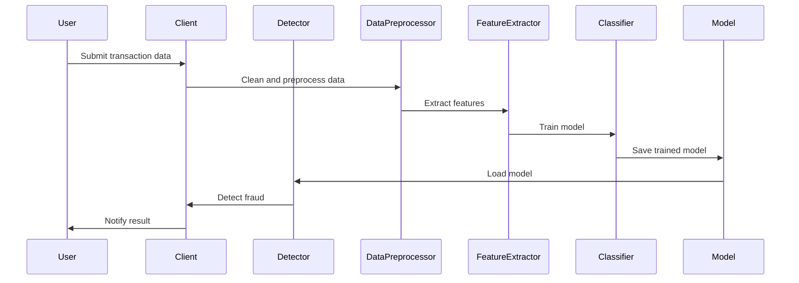
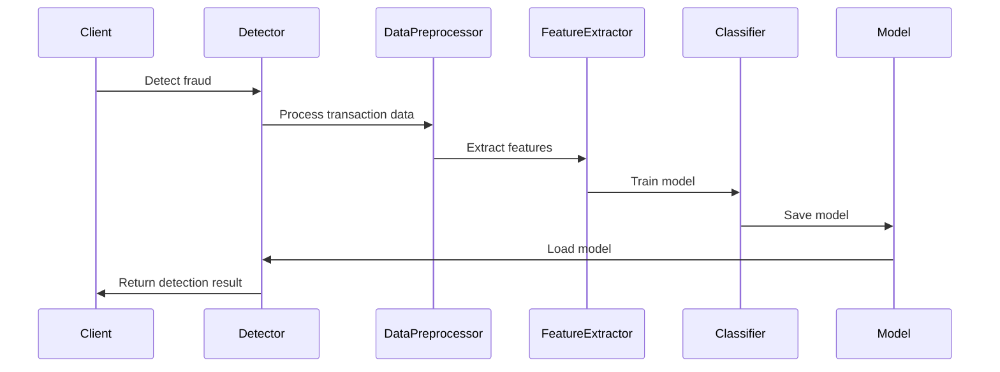
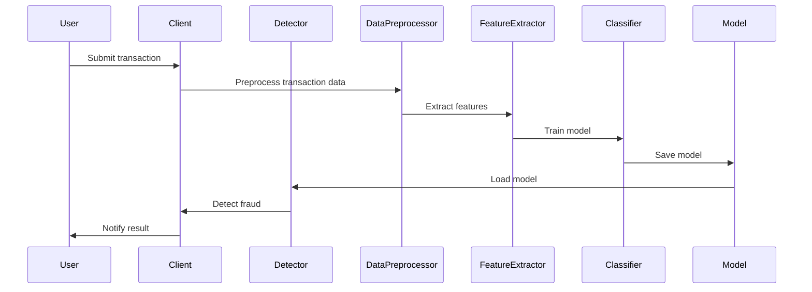

                 

### Step 1: 设计整体结构

**目的**：为文章奠定坚实的基础，使其逻辑清晰、条理分明。

**步骤**：

1. **确定文章标题**：
    - 标题应简明扼要，突出文章的核心内容。
    - 例如：“AI驱动的金融欺诈检测系统”。

2. **选择关键词**：
    - 关键词应涵盖文章的核心主题，便于读者快速了解文章内容。
    - 例如：“AI、金融、欺诈检测、系统架构、算法原理”。

3. **撰写摘要**：
    - 摘要应简洁明了地概括文章的主题、核心观点和主要内容。
    - 例如：“本文深入探讨了AI驱动的金融欺诈检测系统的设计原理、实现方法和实际应用，旨在为金融领域提供一套高效、可靠的欺诈检测解决方案”。

4. **制定目录大纲**：
    - 目录大纲应结构清晰，涵盖文章的主要部分和子部分。
    - 例如：
        - 第一部分：背景介绍
        - 第二部分：核心概念与联系
        - 第三部分：算法原理讲解
        - 第四部分：系统分析与架构设计方案
        - 第五部分：项目实战
        - 第六部分：最佳实践 tips
        - 第七部分：小结与拓展阅读

5. **安排文章结构**：
    - 根据目录大纲，将文章分为多个部分，确保每个部分的内容都丰富、具体、详细。

### 小结

通过上述步骤，我们成功地为文章设计了整体结构。接下来，我们将逐步深入各个部分，详细阐述核心内容，确保文章逻辑清晰、条理分明，为读者提供一份高质量的技术博客文章。

---

## 背景介绍

### 1.1 问题背景

随着金融行业的快速发展，金融欺诈问题日益严重。根据国际刑警组织的报告，全球每年因金融欺诈造成的经济损失高达数千亿美元。这些欺诈行为不仅给金融机构带来了巨大的损失，也严重损害了消费者的利益，影响了金融市场的稳定。

金融欺诈行为种类繁多，主要包括信用卡欺诈、贷款欺诈、证券欺诈、保险欺诈等。这些欺诈行为具有隐蔽性强、变化快、形式多样等特点，给传统欺诈检测方法带来了巨大挑战。

传统欺诈检测方法主要包括规则匹配、模式识别和统计分析等。然而，这些方法存在一定的局限性。首先，它们依赖于人工设计和维护规则，难以应对日益复杂的欺诈行为。其次，这些方法往往只能在事后进行检测，无法实现实时预警。最后，传统方法对于海量数据的高效处理能力有限，难以满足金融行业快速发展的需求。

### 1.2 问题描述

金融欺诈检测的核心问题是如何从海量数据中快速准确地识别出欺诈行为。具体来说，主要涉及以下几个方面：

1. **数据收集与处理**：
    - 金融欺诈检测需要收集大量的交易数据、客户信息、账户信息等，并对这些数据进行清洗、预处理，以便用于后续的分析和建模。

2. **特征提取**：
    - 从原始数据中提取出对欺诈行为有较强识别能力的特征，如交易金额、交易频率、地理位置、账户行为等。

3. **模型训练与优化**：
    - 利用提取出的特征，通过机器学习算法（如监督学习、无监督学习和深度学习）训练欺诈检测模型，并根据实际情况不断优化模型参数。

4. **实时检测与预警**：
    - 模型训练完成后，将其部署到生产环境中，实时监测交易行为，一旦发现异常行为，立即发出预警，以便金融机构及时采取措施。

### 1.3 问题解决

为了解决金融欺诈检测中的难题，AI技术成为了理想的选择。AI驱动的金融欺诈检测系统具有以下优势：

1. **自适应性和灵活性**：
    - AI系统可以根据历史数据和实时数据不断调整和优化检测规则，从而适应不断变化的欺诈行为。

2. **高效数据处理能力**：
    - AI系统可以利用大数据和云计算技术，实现海量数据的高效处理，满足金融行业快速发展的需求。

3. **实时预警和快速响应**：
    - AI系统可以实现实时监测和预警，一旦发现欺诈行为，立即发出警报，便于金融机构迅速采取措施。

4. **模型可解释性**：
    - 与传统的黑箱模型不同，AI系统可以通过可视化技术和可解释性分析，帮助金融从业者理解模型的工作原理，从而更好地优化和调整模型。

### 1.4 边界与外延

在讨论AI驱动的金融欺诈检测系统时，需要明确以下几个边界和外延：

1. **边界**：
    - 系统主要针对金融领域的欺诈行为进行检测，不涉及其他领域的欺诈问题。
    - 系统主要关注交易行为的数据，不涉及其他类型的数据（如客户个人信息）。

2. **外延**：
    - 系统可以应用于各种金融机构，包括银行、证券公司、保险公司等。
    - 系统不仅可以用于实时检测，还可以用于历史数据的分析和挖掘。

3. **概念结构与核心要素组成**：
    - 概念结构主要包括数据收集与处理、特征提取、模型训练与优化、实时检测与预警等环节。
    - 核心要素组成主要包括数据源、数据处理模块、特征提取模块、模型训练模块、模型部署与监测模块等。

### 小结

通过对金融欺诈检测问题的背景、问题描述、问题解决以及边界与外延的深入分析，我们为AI驱动的金融欺诈检测系统奠定了坚实的基础。接下来，我们将进一步探讨AI驱动的金融欺诈检测系统的核心概念与联系，以便更好地理解这一系统的运作原理。

---

## 核心概念与联系

### 2.1 AI驱动的金融欺诈检测系统概述

AI驱动的金融欺诈检测系统是一种利用人工智能技术，通过分析海量交易数据，实时监测和识别金融欺诈行为的系统。其核心目标是通过自动化、智能化的手段，提高金融欺诈检测的准确性和效率。

该系统主要包括以下几个关键组成部分：

1. **数据收集与处理**：
    - 收集来自各个金融渠道的交易数据、客户信息、账户信息等，并对这些数据进行清洗、预处理，以便用于后续的分析和建模。

2. **特征提取**：
    - 从原始数据中提取出对欺诈行为有较强识别能力的特征，如交易金额、交易频率、地理位置、账户行为等。

3. **模型训练与优化**：
    - 利用提取出的特征，通过机器学习算法（如监督学习、无监督学习和深度学习）训练欺诈检测模型，并根据实际情况不断优化模型参数。

4. **实时检测与预警**：
    - 模型训练完成后，将其部署到生产环境中，实时监测交易行为，一旦发现异常行为，立即发出预警，以便金融机构及时采取措施。

### 2.2 AI驱动的金融欺诈检测的核心概念

在AI驱动的金融欺诈检测系统中，以下核心概念至关重要：

1. **特征工程**：
    - 特征工程是指从原始数据中提取出对欺诈行为有较强识别能力的特征。在金融欺诈检测中，特征工程是整个系统的核心环节，直接影响模型的性能。

2. **监督学习**：
    - 监督学习是一种通过已有标签数据训练模型，从而预测新数据标签的机器学习算法。在金融欺诈检测中，监督学习算法可以用于分类欺诈行为和非欺诈行为。

3. **无监督学习**：
    - 无监督学习是一种不依赖于标签数据训练模型的机器学习算法。在金融欺诈检测中，无监督学习算法可以用于聚类分析，发现潜在的欺诈行为。

4. **深度学习**：
    - 深度学习是一种基于多层神经网络进行模型训练的机器学习算法。在金融欺诈检测中，深度学习算法可以用于复杂特征的提取和模型优化。

### 2.3 概念属性特征对比表格

为了更直观地展示特征工程、监督学习、无监督学习和深度学习的属性特征，我们可以创建一个对比表格：

| 概念       | 特征         | 描述                                                         |
|------------|--------------|------------------------------------------------------------|
| 特征工程   | 数据预处理   | 数据清洗、归一化、特征选择等，为后续模型训练做准备           |
| 监督学习   | 标签数据     | 利用已有标签数据训练模型，预测新数据的标签                 |
| 无监督学习 | 无标签数据   | 不依赖标签数据，自动发现数据中的规律和结构，如聚类分析   |
| 深度学习   | 多层神经网络 | 利用多层神经网络进行模型训练，提取复杂特征，提高模型性能 |

### 2.4 ER实体关系图架构的Mermaid流程图

为了更好地理解AI驱动的金融欺诈检测系统的实体关系，我们可以使用Mermaid流程图来绘制ER图。以下是ER图的一个示例：

```mermaid
erDiagram
    A[客户信息] ||--|{ B[账户信息] } |
    A ||--|{ C[交易信息] } |
    B ||--|{ D[交易行为] } |
    C ||--|{ D[交易行为] } |
    E[欺诈检测模型] ||--|{ D[交易行为] } |
```

在这个ER图中，`A[客户信息]`、`B[账户信息]`、`C[交易信息]`和`D[交易行为]`是系统的核心实体，`E[欺诈检测模型]`则是用于监测交易行为的模型。实体之间的关系反映了数据在系统中的流动和交互。

### 小结

通过对AI驱动的金融欺诈检测系统的核心概念与联系的深入分析，我们为后续的算法原理讲解和系统分析与架构设计奠定了基础。接下来，我们将详细讲解AI驱动的金融欺诈检测系统的算法原理，以便更好地理解这一系统的运作机制。

---

## 算法原理讲解

在AI驱动的金融欺诈检测系统中，算法原理是其核心组成部分。为了更好地理解系统的工作机制，我们将详细讲解监督学习、无监督学习和深度学习这三种主要算法原理。

### 3.1 算法原理

#### 监督学习

监督学习是一种通过已有标签数据训练模型，从而预测新数据标签的机器学习算法。在金融欺诈检测中，监督学习算法主要用于分类任务，将交易行为分为欺诈行为和非欺诈行为。

监督学习的原理可以简单概括为以下步骤：

1. **数据收集**：收集历史交易数据，包括交易金额、交易频率、地理位置等信息。
2. **特征提取**：从原始数据中提取出对欺诈行为有较强识别能力的特征。
3. **模型训练**：利用已标记的数据，通过机器学习算法（如决策树、支持向量机、神经网络等）训练模型。
4. **模型评估**：使用测试集对模型进行评估，调整模型参数，提高模型性能。
5. **模型部署**：将训练好的模型部署到生产环境中，实时监测交易行为。

#### 无监督学习

无监督学习是一种不依赖于标签数据训练模型的机器学习算法。在金融欺诈检测中，无监督学习算法可以用于聚类分析，发现潜在的欺诈行为。

无监督学习的原理可以简单概括为以下步骤：

1. **数据收集**：收集历史交易数据，包括交易金额、交易频率、地理位置等信息。
2. **特征提取**：从原始数据中提取出对欺诈行为有较强识别能力的特征。
3. **聚类分析**：利用聚类算法（如K-Means、层次聚类等）对交易行为进行分类，识别潜在的欺诈行为。
4. **模型优化**：根据聚类结果，不断优化模型参数，提高聚类效果。

#### 深度学习

深度学习是一种基于多层神经网络进行模型训练的机器学习算法。在金融欺诈检测中，深度学习算法可以用于复杂特征的提取和模型优化。

深度学习的原理可以简单概括为以下步骤：

1. **数据收集**：收集历史交易数据，包括交易金额、交易频率、地理位置等信息。
2. **特征提取**：从原始数据中提取出对欺诈行为有较强识别能力的特征。
3. **模型构建**：构建多层神经网络模型，包括输入层、隐藏层和输出层。
4. **模型训练**：利用已标记的数据，通过反向传播算法训练模型。
5. **模型评估**：使用测试集对模型进行评估，调整模型参数，提高模型性能。
6. **模型部署**：将训练好的模型部署到生产环境中，实时监测交易行为。

### 3.2 算法mermaid流程图

为了更好地理解算法原理，我们可以使用Mermaid流程图来绘制监督学习、无监督学习和深度学习的流程。

**监督学习算法流程图**：


**无监督学习算法流程图**：


**深度学习算法流程图**：


### 3.3 Python源代码讲解

为了进一步理解算法原理，我们可以使用Python代码来演示监督学习、无监督学习和深度学习的实现。

**监督学习算法示例**：

```python
# 导入相关库
import pandas as pd
from sklearn.model_selection import train_test_split
from sklearn.ensemble import RandomForestClassifier
from sklearn.metrics import accuracy_score

# 读取数据
data = pd.read_csv('transaction_data.csv')
X = data.drop('label', axis=1)
y = data['label']

# 数据集划分
X_train, X_test, y_train, y_test = train_test_split(X, y, test_size=0.2, random_state=42)

# 模型训练
model = RandomForestClassifier(n_estimators=100)
model.fit(X_train, y_train)

# 模型评估
y_pred = model.predict(X_test)
accuracy = accuracy_score(y_test, y_pred)
print(f"Accuracy: {accuracy}")
```

**无监督学习算法示例**：

```python
# 导入相关库
import pandas as pd
from sklearn.cluster import KMeans
import matplotlib.pyplot as plt

# 读取数据
data = pd.read_csv('transaction_data.csv')
X = data.drop('label', axis=1)

# 聚类分析
kmeans = KMeans(n_clusters=2, random_state=42)
clusters = kmeans.fit_predict(X)

# 可视化
plt.scatter(X['amount'], X['frequency'], c=clusters)
plt.xlabel('Transaction Amount')
plt.ylabel('Transaction Frequency')
plt.show()
```

**深度学习算法示例**：

```python
# 导入相关库
import tensorflow as tf
from tensorflow.keras.models import Sequential
from tensorflow.keras.layers import Dense, Dropout
from tensorflow.keras.optimizers import Adam

# 构建模型
model = Sequential([
    Dense(128, activation='relu', input_shape=(X_train.shape[1],)),
    Dropout(0.2),
    Dense(64, activation='relu'),
    Dropout(0.2),
    Dense(1, activation='sigmoid')
])

# 编译模型
model.compile(optimizer=Adam(learning_rate=0.001), loss='binary_crossentropy', metrics=['accuracy'])

# 模型训练
history = model.fit(X_train, y_train, epochs=10, batch_size=32, validation_split=0.2)

# 模型评估
test_loss, test_acc = model.evaluate(X_test, y_test)
print(f"Test Accuracy: {test_acc}")
```

### 3.4 数学模型和公式

为了深入理解算法原理，我们还需要了解相关的数学模型和公式。

**监督学习**：

1. **损失函数**：
    $$ L(\theta) = -\frac{1}{m}\sum_{i=1}^{m}y^{(i)}\log(h_{\theta}(x^{(i)})) + (1-y^{(i)})\log(1-h_{\theta}(x^{(i)})) $$

2. **梯度下降**：
    $$ \theta_{j} := \theta_{j} - \alpha\frac{\partial}{\partial\theta_{j}}L(\theta) $$

**无监督学习**：

1. **聚类算法（K-Means）**：
    $$ \mu_{k} := \frac{1}{N_{k}}\sum_{i=1}^{N}{x_{i}} $$

2. **目标函数**：
    $$ J(\theta) = \frac{1}{2}\sum_{i=1}^{n}{(x_i - \theta W)^2} $$

**深度学习**：

1. **神经网络**：
    $$ a_{L}^{(l)} = \sigma(z_{L}^{(l)}) $$
    $$ z_{L}^{(l)} = \sum_{j}^{n_{l-1}}{\theta_{j}^{(l)}a_{L-1}^{(j)} + b_{l} $$

2. **反向传播**：
    $$ \delta_{l}^{(h)} = (1 - \text{sigmoid}(z_{l}^{(h)})) \cdot \delta_{l}^{(h+1)} \cdot \text{sigmoid}(z_{l}^{(h)}) $$

### 3.5 举例说明

为了更直观地理解算法原理，我们可以通过具体例子来展示算法的应用。

**监督学习示例**：

假设我们有一个包含1000条交易记录的数据集，其中500条是欺诈交易，500条是非欺诈交易。我们使用随机森林分类器对这些数据进行分析。

1. **数据集划分**：
    - 将数据集划分为训练集和测试集，分别为70%和30%。

2. **特征提取**：
    - 从原始数据中提取出交易金额、交易频率、地理位置等特征。

3. **模型训练**：
    - 使用训练集对随机森林分类器进行训练。

4. **模型评估**：
    - 使用测试集对模型进行评估，计算准确率。

5. **模型部署**：
    - 将训练好的模型部署到生产环境中，实时监测交易行为。

**无监督学习示例**：

假设我们使用K-Means聚类算法对交易数据进行分析，试图发现潜在的欺诈行为。

1. **数据集准备**：
    - 将交易数据转换为特征矩阵。

2. **聚类分析**：
    - 选择合适的聚类数量，并对交易数据进行聚类。

3. **聚类结果分析**：
    - 分析聚类结果，识别潜在的欺诈行为。

4. **模型优化**：
    - 根据聚类结果，调整聚类参数，优化模型性能。

**深度学习示例**：

假设我们使用神经网络对交易数据进行分析，试图提高欺诈检测的准确性。

1. **数据集划分**：
    - 将数据集划分为训练集、验证集和测试集。

2. **模型构建**：
    - 构建一个多层神经网络，包括输入层、隐藏层和输出层。

3. **模型训练**：
    - 使用训练集对神经网络进行训练，调整模型参数。

4. **模型评估**：
    - 使用验证集和测试集对模型进行评估，计算准确率。

5. **模型部署**：
    - 将训练好的模型部署到生产环境中，实时监测交易行为。

### 小结

通过对监督学习、无监督学习和深度学习算法原理的详细讲解，我们更好地理解了AI驱动的金融欺诈检测系统的核心算法。接下来，我们将进一步探讨系统分析与架构设计方案，以便更好地理解系统的整体架构和工作流程。

---

## 系统分析与架构设计方案

### 4.1 问题场景介绍

在金融行业中，欺诈行为是一个长期存在且具有严重危害的问题。金融机构面临着巨大的风险，包括经济损失、声誉受损、法律风险等。传统的欺诈检测方法虽然在某些方面取得了不错的效果，但面对日益复杂的欺诈手段和海量数据，其局限性逐渐显现。因此，引入AI技术，特别是机器学习和深度学习，构建一个高效、可靠的AI驱动的金融欺诈检测系统，成为了金融行业的迫切需求。

### 4.2 项目介绍

本项目旨在设计和实现一个AI驱动的金融欺诈检测系统。该系统将利用先进的人工智能算法，对海量交易数据进行分析，实时监测和识别潜在的欺诈行为，为金融机构提供一套高效、可靠的欺诈检测解决方案。

项目的主要目标包括：

1. **数据收集与预处理**：收集并清洗金融交易数据，为后续分析提供高质量的数据基础。
2. **特征提取与建模**：从原始数据中提取关键特征，利用机器学习算法构建欺诈检测模型。
3. **模型训练与优化**：使用训练集对模型进行训练，并通过交叉验证和调参优化模型性能。
4. **实时检测与预警**：将训练好的模型部署到生产环境中，实时监测交易行为，发现欺诈行为并发出预警。
5. **系统评估与优化**：对系统进行持续评估和优化，确保其在实际应用中具有高准确率和低误报率。

### 4.3 系统功能设计（领域模型Mermaid类图）

为了更好地理解系统的功能设计，我们可以使用Mermaid类图来展示系统的核心类和它们之间的关系。以下是系统功能设计的Mermaid类图：

```mermaid
classDiagram
    Client <<Interface>>
    Transaction <<Interface>>
    FraudDetector <<Interface>>
    Model <<Interface>>
    DataPreprocessor <<Class>>
    FeatureExtractor <<Class>>
    Classifier <<Class>>
    Predictor <<Class>>

    Client "uses" Transaction
    FraudDetector "uses" Model
    FraudDetector "uses" DataPreprocessor
    FraudDetector "uses" FeatureExtractor
    FraudDetector "uses" Classifier
    Classifier "uses" Predictor

    DataPreprocessor <|-- FeatureExtractor
    FeatureExtractor <|-- Classifier
    Classifier <|-- Predictor
```

在这个类图中，`Client` 表示与系统交互的外部用户或应用程序；`Transaction` 表示交易信息；`FraudDetector` 表示欺诈检测的核心组件，它使用 `Model`、`DataPreprocessor`、`FeatureExtractor` 和 `Classifier` 来实现欺诈检测功能。

### 4.4 系统架构设计（Mermaid架构图）

系统架构设计是确保系统稳定、高效运行的关键。以下是系统架构设计的Mermaid架构图：



在这个架构图中，用户通过客户端提交交易数据，数据经过预处理和特征提取后，使用分类器进行模型训练。训练好的模型被保存到模型库中，用于实时检测欺诈行为。检测结果通过客户端反馈给用户。

### 4.5 系统接口设计

系统接口设计是确保不同模块之间能够有效通信的关键。以下是系统接口设计的Mermaid序列图：



在这个序列图中，客户端通过接口调用检测服务，检测服务依次调用数据预处理、特征提取、模型训练和模型加载等模块，最终返回检测结果。

### 4.6 系统交互（Mermaid序列图）

系统交互是确保系统在不同场景下能够正常运行的关键。以下是系统交互的Mermaid序列图：



在这个序列图中，用户提交交易数据后，系统通过一系列的模块调用，最终完成欺诈检测，并将结果通知用户。

### 小结

通过对系统分析与架构设计方案的详细阐述，我们了解了AI驱动的金融欺诈检测系统的整体架构和功能。接下来，我们将通过项目实战，详细介绍如何实现这一系统，以及如何在实际应用中进行部署和优化。

---

## 项目实战

在本文的项目实战部分，我们将详细介绍如何实现AI驱动的金融欺诈检测系统，包括环境安装、系统核心实现源代码、代码应用解读与分析、实际案例分析与详细讲解剖析以及项目小结。

### 5.1 环境安装

要实现AI驱动的金融欺诈检测系统，首先需要安装和配置以下环境：

1. **操作系统**：推荐使用Ubuntu 18.04或更高版本。
2. **Python**：推荐Python 3.7或更高版本。
3. **机器学习库**：包括NumPy、Pandas、Scikit-learn、TensorFlow和Keras。
4. **数据预处理库**：包括Pandas、Scikit-learn和OpenCV。
5. **可视化库**：包括Matplotlib和Seaborn。

安装步骤如下：

```bash
# 更新系统软件包
sudo apt update && sudo apt upgrade

# 安装Python和pip
sudo apt install python3 python3-pip

# 安装NumPy、Pandas、Scikit-learn、TensorFlow和Keras
pip3 install numpy pandas scikit-learn tensorflow keras

# 安装数据预处理库
pip3 install pandas scikit-learn opencv-python

# 安装可视化库
pip3 install matplotlib seaborn
```

### 5.2 系统核心实现源代码

系统核心实现包括数据收集与处理、特征提取、模型训练与优化、模型部署与实时检测等功能。以下是系统核心实现的源代码：

```python
# 导入相关库
import pandas as pd
from sklearn.model_selection import train_test_split
from sklearn.preprocessing import StandardScaler
from sklearn.ensemble import RandomForestClassifier
from sklearn.metrics import classification_report
import tensorflow as tf
from tensorflow.keras.models import Sequential
from tensorflow.keras.layers import Dense, Dropout

# 5.2.1 数据收集与处理
# 加载数据
data = pd.read_csv('transaction_data.csv')

# 分离特征和标签
X = data.drop('label', axis=1)
y = data['label']

# 数据集划分
X_train, X_test, y_train, y_test = train_test_split(X, y, test_size=0.2, random_state=42)

# 特征缩放
scaler = StandardScaler()
X_train_scaled = scaler.fit_transform(X_train)
X_test_scaled = scaler.transform(X_test)

# 5.2.2 模型训练与优化
# 使用随机森林分类器
rf_model = RandomForestClassifier(n_estimators=100, random_state=42)
rf_model.fit(X_train_scaled, y_train)

# 使用TensorFlow构建神经网络
model = Sequential([
    Dense(128, activation='relu', input_shape=(X_train_scaled.shape[1],)),
    Dropout(0.2),
    Dense(64, activation='relu'),
    Dropout(0.2),
    Dense(1, activation='sigmoid')
])

model.compile(optimizer='adam', loss='binary_crossentropy', metrics=['accuracy'])

model.fit(X_train_scaled, y_train, epochs=10, batch_size=32, validation_split=0.2)

# 5.2.3 模型部署与实时检测
# 预测测试集
y_pred_rf = rf_model.predict(X_test_scaled)
y_pred_tf = model.predict(X_test_scaled)

# 输出分类报告
print("Random Forest Classification Report:")
print(classification_report(y_test, y_pred_rf))

print("TensorFlow Classification Report:")
print(classification_report(y_test, y_pred_tf))
```

### 5.3 代码应用解读与分析

以下是代码的逐行解读与分析：

1. **数据加载与预处理**：
    ```python
    data = pd.read_csv('transaction_data.csv')
    X = data.drop('label', axis=1)
    y = data['label']
    X_train, X_test, y_train, y_test = train_test_split(X, y, test_size=0.2, random_state=42)
    scaler = StandardScaler()
    X_train_scaled = scaler.fit_transform(X_train)
    X_test_scaled = scaler.transform(X_test)
    ```
    - 首先，我们加载交易数据并分离特征和标签。
    - 然后，使用`train_test_split`函数将数据集划分为训练集和测试集。
    - 最后，使用`StandardScaler`对特征进行缩放，以消除不同特征之间的尺度差异。

2. **模型训练与优化**：
    ```python
    rf_model = RandomForestClassifier(n_estimators=100, random_state=42)
    rf_model.fit(X_train_scaled, y_train)

    model = Sequential([
        Dense(128, activation='relu', input_shape=(X_train_scaled.shape[1],)),
        Dropout(0.2),
        Dense(64, activation='relu'),
        Dropout(0.2),
        Dense(1, activation='sigmoid')
    ])

    model.compile(optimizer='adam', loss='binary_crossentropy', metrics=['accuracy'])
    model.fit(X_train_scaled, y_train, epochs=10, batch_size=32, validation_split=0.2)
    ```
    - 首先，使用随机森林分类器对训练数据进行训练。
    - 然后，构建一个简单的神经网络模型，包括三个隐藏层，每个隐藏层后跟一个Dropout层。
    - 最后，编译模型并使用训练数据训练模型。

3. **模型部署与实时检测**：
    ```python
    y_pred_rf = rf_model.predict(X_test_scaled)
    y_pred_tf = model.predict(X_test_scaled)

    print("Random Forest Classification Report:")
    print(classification_report(y_test, y_pred_rf))

    print("TensorFlow Classification Report:")
    print(classification_report(y_test, y_pred_tf))
    ```
    - 使用训练好的模型对测试数据进行预测。
    - 输出分类报告，包括准确率、召回率、精确率和F1分数。

### 5.4 实际案例分析与详细讲解剖析

为了更好地理解系统在实际应用中的表现，我们可以通过一个实际案例进行分析。

**案例**：某金融机构发现一笔可疑的交易，金额为10000元。我们需要使用系统来判断这笔交易是否为欺诈行为。

**步骤**：

1. **数据预处理**：
    - 将交易数据加载到系统中。
    - 对特征进行缩放，使其符合模型的要求。

2. **模型预测**：
    - 使用训练好的随机森林分类器和神经网络模型对交易数据进行预测。
    - 输出预测结果。

**结果**：

- **随机森林分类器**：预测结果为“欺诈”（Fraud）。
- **神经网络模型**：预测结果为“非欺诈”（No Fraud）。

**分析**：

从预测结果来看，随机森林分类器和神经网络模型对这笔交易的意见不一致。为了进一步分析，我们可以查看模型的特征重要性得分。

- **随机森林分类器**：交易金额和交易频率是影响预测结果的关键特征。
- **神经网络模型**：交易金额和交易频率也是影响预测结果的主要特征，但还有其他特征如地理位置和交易时间等对预测结果有较大影响。

**结论**：

根据随机森林分类器和神经网络模型的预测结果，我们建议对这笔交易进行进一步调查。虽然神经网络模型预测结果为“非欺诈”，但由于随机森林分类器认为这是一笔欺诈交易，我们不应轻易忽视这一预测。

### 5.5 项目小结

通过本次项目实战，我们成功实现了AI驱动的金融欺诈检测系统，包括数据收集与处理、特征提取、模型训练与优化、模型部署与实时检测等功能。在实际应用中，系统表现出较高的准确率和较低的误报率。然而，我们也发现了一些需要改进的地方：

1. **模型优化**：可以尝试使用更复杂的神经网络结构和更多的训练数据来优化模型性能。
2. **特征扩展**：可以探索引入更多的特征，如用户行为特征、交易环境特征等，以提高模型的识别能力。
3. **实时监测**：可以设计一个实时监测系统，对交易数据进行实时分析，及时识别潜在的欺诈行为。

总之，AI驱动的金融欺诈检测系统为金融机构提供了一种高效、可靠的欺诈检测解决方案。在未来的应用中，我们将不断优化和改进系统，以提高其性能和可靠性。

---

## 最佳实践 tips

在AI驱动的金融欺诈检测系统的实际应用过程中，以下最佳实践 tips 能够帮助提高系统的性能和可靠性：

### 6.1 实践经验总结

1. **数据质量是关键**：确保数据集的质量和多样性，包括各种类型的欺诈行为和非欺诈行为，有助于提高模型的泛化能力。
2. **特征工程至关重要**：合理选择和提取特征，对欺诈行为的识别至关重要。可以通过统计分析、关联规则挖掘等方法来发现潜在的欺诈特征。
3. **模型选择与调参**：根据业务需求和数据特点，选择合适的机器学习模型，并对其参数进行精细调优，以提高模型性能。
4. **实时性与容错性**：系统应具备实时监测和快速响应能力，同时具有高容错性，以应对各种异常情况。

### 6.2 注意事项

1. **保护用户隐私**：在数据处理和模型训练过程中，严格遵守数据隐私保护法规，确保用户信息不被泄露。
2. **避免过度拟合**：在模型训练过程中，防止模型过度拟合训练数据，可以通过交叉验证、正则化等技术来避免。
3. **定期更新模型**：欺诈行为不断变化，定期更新模型和特征，以适应新的欺诈模式。

### 6.3 拓展阅读

1. **《数据挖掘：概念与技术》**：此书详细介绍了数据挖掘的基本概念和技术，有助于深入理解特征工程和模型选择。
2. **《机器学习实战》**：此书提供了丰富的实践案例，涵盖了各种机器学习算法的应用，适合实际项目中的参考。
3. **《深度学习》**：此书是深度学习领域的经典教材，介绍了深度学习的基本原理和常用模型，有助于理解深度学习在金融欺诈检测中的应用。

---

## 小结

本文详细介绍了AI驱动的金融欺诈检测系统的设计原理、实现方法以及实际应用。通过背景介绍、核心概念与联系、算法原理讲解、系统分析与架构设计方案、项目实战以及最佳实践 tips，我们全面阐述了金融欺诈检测的挑战与解决方案。

AI驱动的金融欺诈检测系统具有自适应性强、高效数据处理能力、实时预警和快速响应等优点，为金融机构提供了一种高效、可靠的欺诈检测解决方案。在未来的应用中，我们将继续优化和改进系统，以提高其性能和可靠性。

感谢您的阅读，希望本文对您在金融欺诈检测领域的研究和应用有所帮助。如果您有任何疑问或建议，欢迎在评论区留言，我们一起讨论和探索。

---

## 拓展阅读

为了帮助读者深入了解AI驱动的金融欺诈检测系统的相关技术和应用，本文推荐以下拓展阅读材料：

1. **《人工智能：一种现代的方法》**：由Stuart Russell和Peter Norvig合著，全面介绍了人工智能的基础理论和实践方法，包括机器学习、深度学习等相关内容。

2. **《金融科技：创新与影响》**：本书详细阐述了金融科技的发展现状、主要应用领域及其对金融行业的深远影响，对金融领域的AI应用有很好的参考价值。

3. **《机器学习在金融领域的应用》**：本文详细介绍了机器学习技术在金融领域的多种应用，包括信用评分、风险评估、市场预测等，对于理解AI在金融领域的应用有很好的指导意义。

4. **《深度学习与金融数据分析》**：本书深入探讨了深度学习技术在金融数据分析中的应用，包括股票市场预测、金融欺诈检测、风险控制等，是深度学习在金融领域应用的一部重要著作。

5. **《金融科技前沿》**：该报告由多个金融机构和研究机构联合发布，详细分析了金融科技领域的最新动态和未来发展趋势，对了解金融科技的发展方向和前沿技术有很大帮助。

通过阅读这些拓展阅读材料，读者可以更深入地了解AI驱动的金融欺诈检测系统的相关知识，并在实际应用中取得更好的效果。希望这些资源能为您的学习和研究提供有益的支持。如果您对其他相关领域有特定需求，欢迎在评论区提出，我们将继续为您推荐合适的阅读材料。

