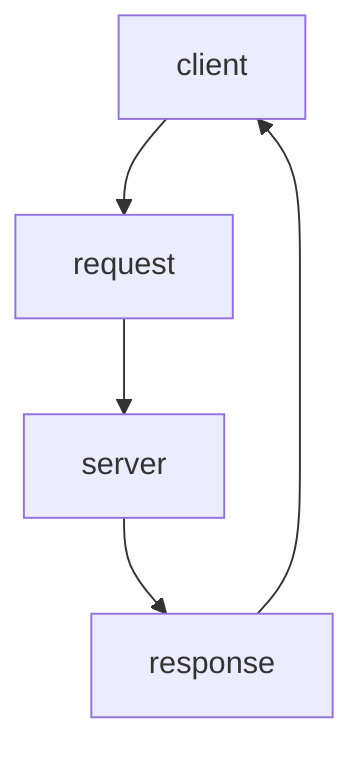
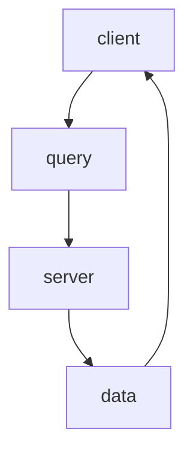

                 

# API设计最佳实践与版本管理

关键词：API设计、最佳实践、版本管理、RESTful、GraphQL、安全性

摘要：
本文将深入探讨API设计的最佳实践和版本管理策略，为开发者提供一套系统的API设计指南和版本控制方法。我们将从API的基本概念和重要性出发，逐步讲解API设计的原则、模式、技术，并探讨如何进行有效的版本管理和更新。通过这篇文章，读者将能够更好地理解和设计高质量的API，同时掌握在API变更过程中如何减少风险和影响。

## 引言

### 1.1 API的定义与重要性

API（Application Programming Interface）即应用程序编程接口，它定义了不同软件之间如何相互交互的一组规则和标准。API广泛应用于各种软件系统，如Web服务、库、框架和操作系统等。其重要性体现在以下几个方面：

1. **互操作性**：API提供了不同系统之间进行通信的桥梁，使得原本独立的软件能够互相调用和共享资源。
2. **模块化开发**：通过API，开发者可以将复杂的系统分解为多个模块，降低系统复杂度和维护成本。
3. **易用性**：良好的API设计使得开发者能够更轻松地使用第三方服务或库，提高开发效率。
4. **扩展性**：API设计得当时，系统可以更容易地扩展和升级，以适应不断变化的需求。

### 1.2 API设计面临的挑战

API设计虽然重要，但同时也面临着一些挑战：

1. **兼容性**：确保新旧版本API之间的兼容性，避免因版本变更导致用户应用程序出现问题。
2. **安全性**：API暴露在公共网络上，容易受到攻击，如DDoS、XSS、CSRF等。
3. **性能**：API设计要考虑性能，如响应时间、吞吐量、延迟等，以确保用户体验。
4. **文档与维护**：API文档的编写和维护是API设计的重要环节，但常常被忽视。

### 1.3 本书

本文将分为以下几大部分：

- **第二部分：核心概念与原则**：介绍API设计的基本原则和核心概念。
- **第三部分：设计模式与技术**：探讨RESTful和GraphQL等设计模式，以及API版本管理和安全性。
- **第四部分：API版本管理**：讲解如何进行有效的API版本管理和变更控制。
- **第五部分：案例与实践**：通过实际案例探讨API设计最佳实践。
- **结论**：总结全文，给出未来研究方向。

接下来，我们将逐步深入这些部分，详细探讨每个主题。

## 核心概念与原则

### 2.1 RESTful API原则

RESTful API是基于Representational State Transfer（REST）架构风格的一种API设计模式。RESTful API有以下几个核心原则：

1. **统一接口**：所有API接口都遵循统一的格式和命名规范，使开发者更容易理解和使用。
2. **无状态**：每次请求都是独立的，服务器不存储关于客户端的任何状态信息，减轻服务器负担。
3. **客户端-服务器架构**：客户端和服务器各司其职，客户端负责发送请求，服务器负责处理请求并返回响应。
4. **分层系统**：通过分层设计，将不同层次的组件解耦，便于维护和扩展。

### 2.2 API设计最佳实践

在进行API设计时，遵循以下最佳实践：

1. **简洁性**：API设计应尽量简洁，避免过多的功能和参数，降低使用难度。
2. **一致性**：API接口应保持一致性，如URL结构、参数命名、返回值格式等。
3. **错误处理**：提供清晰的错误信息和状态码，帮助开发者快速定位和解决问题。
4. **文档化**：编写详细的API文档，包括接口描述、请求示例、响应示例等，便于开发者使用。
5. **版本控制**：合理使用版本控制，便于管理API变更和兼容性问题。

### 2.3 设计模式

在API设计中，常用以下几种设计模式：

1. **RESTful设计模式**：基于HTTP协议，使用GET、POST、PUT、DELETE等HTTP方法进行数据操作。
2. **GraphQL设计模式**：提供了一种更加灵活的查询方式，允许客户端指定需要的数据，减少数据传输。
3. **设计模式**：如工厂模式、单例模式、策略模式等，用于解决特定问题，提高代码的可维护性和扩展性。

## API设计模式与技术

### 3.1 RESTful与GraphQL

#### RESTful API

RESTful API是一种基于HTTP协议和REST架构风格的API设计模式。它遵循以下原则：

1. **统一接口**：所有API接口使用统一的URL结构，如`/users`、`/orders`等。
2. **状态转移**：客户端通过发送请求，实现状态的转移，服务器不保存状态信息。
3. **无状态**：每个请求都是独立的，服务器不保存关于客户端的任何信息。

RESTful API的优点：

1. **易于理解和实现**：遵循HTTP协议，开发者容易上手。
2. **无状态**：减轻服务器负担，易于扩展。
3. **可缓存**：HTTP缓存机制提高响应速度。

缺点：

1. **灵活性较低**：客户端需要多次请求获取所需数据。
2. **数据传输效率**：若需获取大量数据，可能需要多次请求和传输。

#### GraphQL

GraphQL是一种由Facebook开发的查询语言和服务器端运行时，用于API的设计和交互。与RESTful API相比，GraphQL提供了一种更加灵活的查询方式：

1. **灵活查询**：客户端可以指定需要的数据字段，减少数据传输。
2. **单一API端点**：所有查询和操作通过一个端点进行，简化客户端代码。

GraphQL的优点：

1. **灵活性**：客户端可以精确获取所需数据，减少数据浪费。
2. **高效性**：减少多次请求，提高数据传输效率。

缺点：

1. **复杂性**：相比RESTful API，GraphQL的实现和调试更加复杂。
2. **缓存难题**：GraphQL查询可能依赖于多个数据源，缓存策略较难实现。

### 3.2 API版本管理

#### 版本命名

在API版本管理中，版本命名是一个重要环节。常见的版本命名方式有：

1. **数字版本**：如1.0、2.0，表示API的功能和兼容性。
2. **日期版本**：如2023-01，表示API的发布日期。
3. **语义化版本**：如3.0.1，采用语义化版本控制，清晰地表达功能和兼容性的变更。

#### 版本控制

进行API版本控制时，有以下几种常见策略：

1. **独立部署**：为每个版本的API部署独立的服务器或容器，确保新旧版本之间的隔离。
2. **灰度发布**：逐步将新版本API推向一部分用户，观察效果，再逐步扩大范围。
3. **回滚机制**：在新版本API出现问题时，能够迅速回滚到旧版本，降低风险。

### 3.3 API安全性

#### 安全性原则

API设计时，应遵循以下安全性原则：

1. **最小权限**：API应遵循最小权限原则，只授予必要的访问权限，避免权限泄露。
2. **加密传输**：使用HTTPS协议，确保数据在传输过程中的安全性。
3. **身份验证**：使用身份验证机制，如OAuth、JWT等，确保只有授权用户可以访问API。

#### 安全性技术

以下是几种常见的API安全性技术：

1. **OAuth 2.0**：一种基于令牌的授权协议，用于实现第三方认证和授权。
2. **JSON Web Token (JWT)**：一种用于在网络中传递的JSON对象，用于身份验证和授权。
3. **Web应用程序防火墙（WAF）**：用于检测和防止恶意攻击，如SQL注入、XSS等。

## API版本管理

### 4.1 版本控制机制

#### 独立部署

为每个版本的API部署独立的服务器或容器，确保新旧版本之间的隔离。独立部署有以下优点：

1. **灵活性**：可以独立更新和升级每个版本的API，不影响其他版本。
2. **可扩展性**：便于增加新功能，避免版本冲突。

缺点：

1. **资源浪费**：需要额外的服务器和运维成本。
2. **维护复杂度**：需要维护多个版本的API，增加维护难度。

#### 灰度发布

逐步将新版本API推向一部分用户，观察效果，再逐步扩大范围。灰度发布有以下优点：

1. **风险可控**：可以逐步扩大新版本的影响范围，降低风险。
2. **数据反馈**：可以通过实际用户反馈，优化新版本API。

缺点：

1. **部署复杂度**：需要实现灰度发布逻辑，增加部署复杂度。
2. **延迟性**：可能需要较长时间才能将新版本API推向所有用户。

#### 回滚机制

在新版本API出现问题时，能够迅速回滚到旧版本，降低风险。回滚机制有以下优点：

1. **快速恢复**：可以在短时间内恢复到稳定版本，降低损失。
2. **降低风险**：避免新版本带来的潜在风险。

缺点：

1. **操作复杂度**：需要实现回滚逻辑，增加操作复杂度。
2. **回滚风险**：回滚过程中可能引入新的问题。

### 4.2 演进策略

#### 逐步更新

逐步更新是指在新版本API上线时，先让一小部分用户使用新版本，观察反馈，再逐步扩大用户范围。这种策略有以下优点：

1. **风险可控**：可以逐步扩大新版本的影响范围，降低风险。
2. **数据反馈**：可以通过实际用户反馈，优化新版本API。

缺点：

1. **部署复杂度**：需要实现灰度发布逻辑，增加部署复杂度。
2. **延迟性**：可能需要较长时间才能将新版本API推向所有用户。

#### 前向兼容性

前向兼容性是指新版本API向下兼容旧版本，确保旧版本客户端可以继续使用。这种策略有以下优点：

1. **平滑升级**：旧版本客户端无需修改代码即可继续使用新版本API。
2. **降低风险**：避免因兼容性问题导致旧版本客户端无法使用。

缺点：

1. **维护成本**：需要维护多个版本的API，增加维护成本。
2. **性能问题**：新版本API可能引入了优化，但旧版本客户端无法充分利用。

#### 后向兼容性

后向兼容性是指新版本API不兼容旧版本，需要旧版本客户端进行修改。这种策略有以下优点：

1. **优化性能**：新版本API可以采用更高效的技术和架构，提高性能。
2. **安全性提升**：新版本API可以修复旧版本的安全漏洞。

缺点：

1. **兼容性问题**：旧版本客户端需要修改代码才能使用新版本API。
2. **风险增加**：可能引入新的兼容性问题，导致客户端无法使用。

### 4.3 影响分析

在进行API版本管理时，影响分析是一个关键环节。影响分析包括以下几个方面：

1. **客户端分析**：分析使用旧版本API的客户端数量、使用频率等，评估新版本API对客户端的影响。
2. **业务影响**：分析新版本API对业务的影响，包括功能、性能、安全性等方面。
3. **风险分析**：评估新版本API可能带来的风险，如兼容性风险、性能风险、安全风险等。

通过影响分析，可以制定合理的API版本更新策略，降低风险和影响。

### 4.4 实际案例

#### 案例一：Twitter API版本管理

Twitter API在版本管理方面采取了逐步更新和前向兼容性策略。他们在推出新版本API时，先通过逐步更新的方式，将一部分用户切换到新版本API，观察反馈。在确认新版本API稳定后，再逐步扩大用户范围。

#### 案例二：Facebook Graph API版本管理

Facebook Graph API采用了前向兼容性和后向兼容性策略。对于旧版本客户端，Facebook提供了兼容层，确保旧版本客户端可以继续使用新版本API。同时，Facebook还通过文档和通知，提醒开发者及时升级客户端，以充分利用新版本API的功能和性能优化。

## 总结与展望

### 5.1 总结

本文从API设计的基本概念和重要性出发，详细探讨了API设计的原则、模式、技术，以及版本管理和安全性。通过本文，读者可以：

1. **理解API设计的核心概念和原则**。
2. **掌握RESTful和GraphQL等设计模式**。
3. **了解API版本管理和安全性技术**。

### 5.2 展望

未来，API设计将继续演进，关注以下几个方面：

1. **智能化**：利用人工智能技术，优化API设计过程，提高设计质量和效率。
2. **安全性**：随着网络安全威胁的增加，API设计将更加注重安全性，采用更先进的加密和身份验证技术。
3. **微服务架构**：微服务架构的兴起，将推动API设计更加模块化和灵活。
4. **新兴技术**：如GraphQL、GraphQL、Serverless等新兴技术，将影响API设计的未来发展方向。

总之，API设计是一个不断演进和发展的领域，开发者需要持续学习和探索，以应对不断变化的需求和技术挑战。

## 参考文献

1. **Fielding, R. T. (2000). Architectural Styles and the Design of Network-based Software Architectures. University of California, Irvine.**
2. **Facebook Engineering (2018). GraphQL: A Server-Side Query Language for Your API. Facebook.**
3. **Twitter API Documentation. Twitter.**
4. **OAuth 2.0 Authorization Framework. IETF.**
5. **JSON Web Tokens (JWT). IETF.**

## 附录

### 6.1 概念对比

#### RESTful API与GraphQL

| 特性             | RESTful API                                     | GraphQL                                      |
|------------------|--------------------------------------------------|-----------------------------------------------|
| 查询方式         | 多次请求，获取多个数据片段                      | 单次请求，指定所需数据字段                    |
| 扩展性           | 相对较低，需要定义多个URL和参数                  | 非常高，可以根据需求灵活查询数据              |
| 数据传输效率     | 可能存在数据冗余和传输延迟                      | 避免数据冗余，提高数据传输效率                |
| 学习成本         | 低，遵循HTTP协议和REST原则                      | 较高，需要学习GraphQL查询语言和框架          |

### 6.2 Mermaid 图形

#### RESTful API流程图

#### GraphQL查询示例

## 致谢

最后，感谢所有参与本文撰写和审核的团队成员，以及为我们提供宝贵意见和建议的读者。特别感谢AI天才研究院和《禅与计算机程序设计艺术》团队的全力支持。作者：AI天才研究院/AI Genius Institute & 禅与计算机程序设计艺术/Zen And The Art of Computer Programming。

