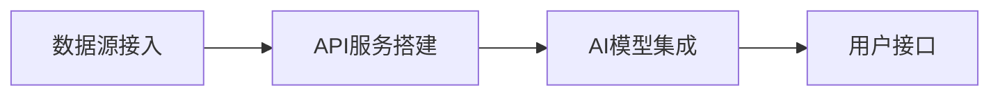
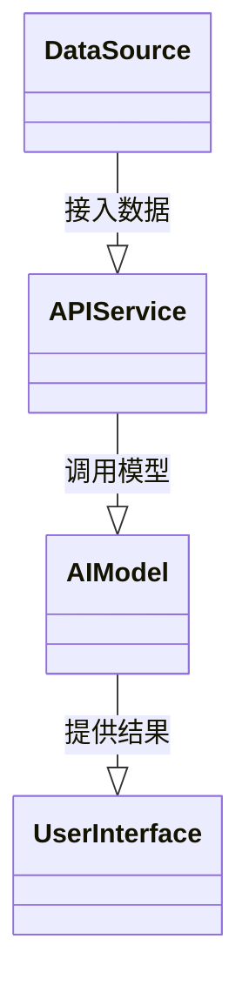
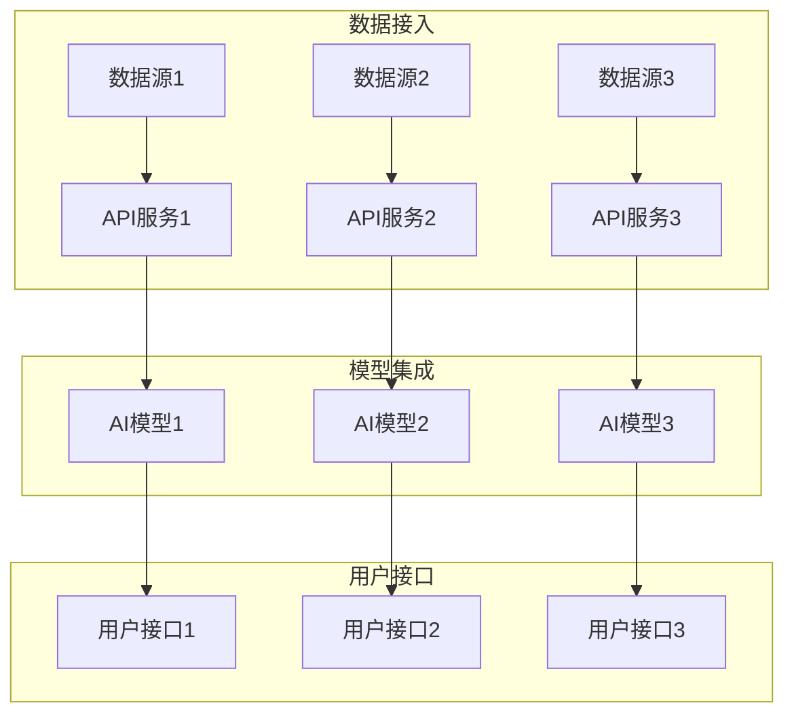
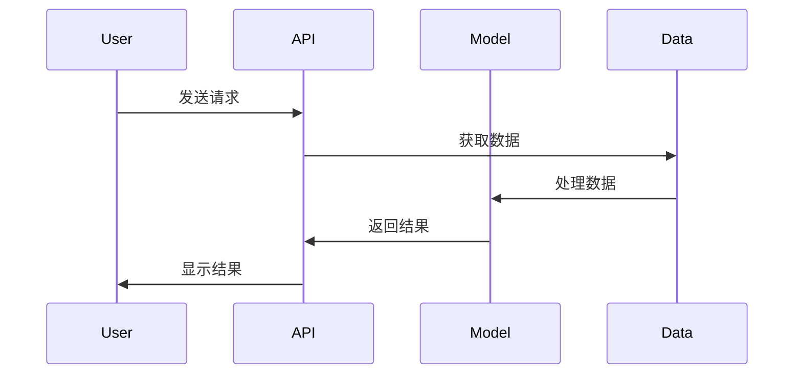
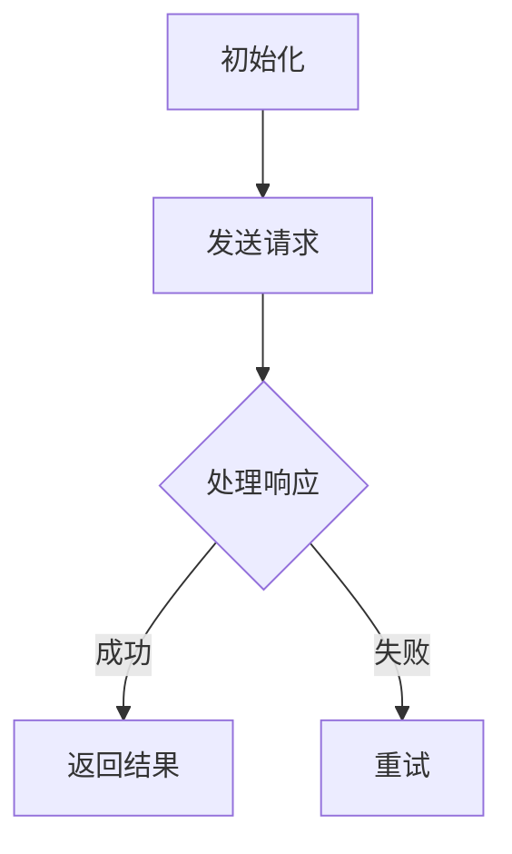
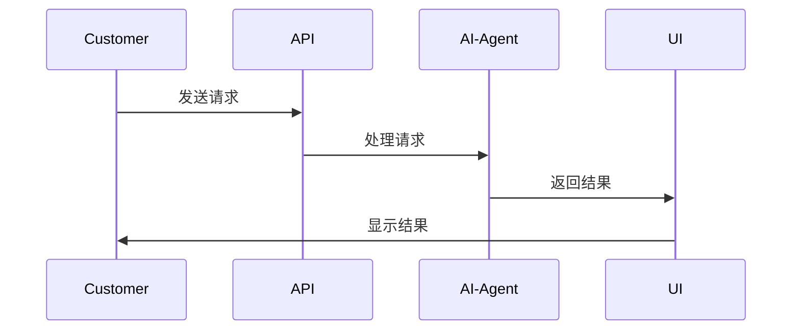

                 

# API集成：扩展AI Agent的功能与数据源

> 关键词：API集成、AI Agent、功能扩展、数据源、算法、系统架构

> 摘要：本文将深入探讨如何通过API集成来扩展AI Agent的功能与数据源。首先介绍API集成的背景和核心概念，然后讲解AI Agent的基本原理及其功能扩展需求。接着，通过Mermaid图和Python代码详细分析API集成算法原理，并设计一个系统架构方案。随后，通过实战案例展示如何实现和优化AI Agent的功能扩展。最后，提供最佳实践、注意事项和拓展阅读建议。

## 第一部分：引言

### 1.1 《API集成：扩展AI Agent的功能与数据源》背景

#### 1.1.1 书籍目的与适用人群

随着人工智能技术的飞速发展，AI Agent作为智能系统的核心组件，正逐渐应用于各个领域。然而，AI Agent的功能扩展和数据源的整合成为了一个重要的课题。本书旨在帮助读者深入了解API集成在AI Agent功能扩展和数据源整合中的应用，适合人工智能开发者、系统架构师以及相关领域的技术人员阅读。

#### 1.1.2 内容概览

本书将分为以下几个部分：

1. 背景介绍：介绍API集成和AI Agent的基本概念。
2. 核心概念与联系：明确API集成和AI Agent的核心概念，并展示它们之间的联系。
3. 算法原理讲解：通过Mermaid图和Python代码详细分析API集成算法。
4. 系统分析与架构设计方案：设计一个完整的系统架构方案。
5. 项目实战：通过实际案例展示如何实现AI Agent的功能扩展。
6. 最佳实践 tips、小结、注意事项、拓展阅读等内容：提供实用建议和进一步学习资源。

## 第二部分：核心概念与联系

### 2.1 API集成基本概念

#### 2.1.1 API的定义

API（Application Programming Interface）是应用程序之间进行交互的接口。它定义了程序如何访问和使用其他应用程序或服务提供的功能。

#### 2.1.2 API集成的意义

API集成使得不同系统之间可以无缝交互，从而扩展应用程序的功能和数据源。这对于AI Agent来说尤为重要，因为AI Agent需要不断获取新的数据和功能来提升其智能水平。

### 2.2 AI Agent概述

#### 2.2.1 AI Agent的定义

AI Agent是一种自主运行并执行特定任务的智能系统，能够模拟人类智能进行决策和行动。

#### 2.2.2 AI Agent的功能扩展需求

AI Agent需要不断扩展其功能，包括：

- 新的数据源集成
- 新的算法模型引入
- 与其他系统的交互能力提升

### 2.3 ER实体关系图架构

#### 2.3.1 实体定义

在API集成和AI Agent功能扩展中，常用的实体包括：

- 数据源
- API服务
- AI模型
- 用户

#### 2.3.2 关系定义

实体之间的关系定义如下：

- 数据源与API服务之间的关系：数据源提供数据给API服务。
- API服务与AI模型之间的关系：API服务调用AI模型进行数据处理和预测。
- 用户与AI模型之间的关系：用户通过AI模型获取决策支持。

### 2.4 API集成基本原理

#### 2.4.1 API调用流程

API调用流程通常包括以下步骤：

1. 发送请求：客户端发送HTTP请求到API服务器。
2. 处理请求：API服务器处理请求，执行相关操作。
3. 返回响应：API服务器返回处理结果给客户端。

#### 2.4.2 RESTful API与SOAP API

API可以分为RESTful API和SOAP API两大类。RESTful API基于HTTP协议，使用GET、POST、PUT、DELETE等HTTP方法进行操作。SOAP API基于XML协议，使用SOAP消息进行操作。两者各有优缺点，选择哪种API取决于具体需求。

## 第三部分：算法原理讲解

### 3.1 API集成算法概述

API集成算法用于实现不同系统之间的数据交换和功能调用。以下是API集成算法的基本原理：

1. 数据源接入：将新的数据源接入系统。
2. API服务搭建：搭建API服务，提供数据访问和功能调用接口。
3. AI模型集成：将AI模型集成到API服务中，实现数据处理和预测功能。
4. 用户接口：为用户提供便捷的访问接口。

### 3.2 Mermaid算法流程图

以下是API集成算法的Mermaid流程图：



### 3.3 Python源代码示例

以下是API集成算法的Python源代码示例：

```python
# 数据源接入
data_source = "example_data_source"

# API服务搭建
def api_service(data_source):
    # 处理数据源
    processed_data = process_data(data_source)
    # 返回处理结果
    return processed_data

# AI模型集成
def ai_model(processed_data):
    # 执行AI模型
    prediction = model.predict(processed_data)
    # 返回预测结果
    return prediction

# 用户接口
def user_interface():
    # 获取用户输入
    user_input = input("请输入数据：")
    # 调用API服务
    processed_data = api_service(user_input)
    # 调用AI模型
    prediction = ai_model(processed_data)
    # 返回预测结果
    return prediction
```

### 3.4 算法原理数学模型与公式

API集成算法的数学模型可以表示为：

$$
\text{API\_integration} = f(\text{data\_source}, \text{api\_service}, \text{ai\_model}, \text{user\_interface})
$$

其中，$f$ 表示算法函数，$\text{data\_source}$ 表示数据源，$\text{api\_service}$ 表示API服务，$\text{ai\_model}$ 表示AI模型，$\text{user\_interface}$ 表示用户接口。

### 3.5 举例说明

假设有一个电商平台，需要集成一个推荐系统来提高用户体验。以下是API集成算法的应用示例：

1. 数据源接入：接入用户购买记录、商品评价等数据。
2. API服务搭建：搭建推荐API服务，提供用户个性化推荐接口。
3. AI模型集成：集成基于协同过滤的推荐算法，处理用户数据和商品数据。
4. 用户接口：为用户提供推荐结果，并支持用户反馈。

通过API集成算法，电商平台能够快速扩展推荐系统的功能，提高用户满意度。

## 第四部分：系统分析与架构设计方案

### 4.1 问题场景介绍

在当前人工智能时代，许多企业正在寻求通过AI Agent来提升业务效率和用户体验。然而，AI Agent的功能扩展和数据源整合成为一个挑战。为了解决这一问题，我们需要设计一个高效、灵活的系统架构。

### 4.2 项目介绍

本项目旨在设计一个能够扩展AI Agent功能和数据源的系统架构，为不同领域的企业提供解决方案。项目目标如下：

- 提供灵活的API集成接口，方便接入新数据源。
- 支持多种AI模型集成，提升AI Agent的智能水平。
- 提供用户友好的界面，方便用户使用和管理AI Agent。

### 4.3 系统功能设计（领域模型Mermaid类图）

以下是系统功能设计的Mermaid类图：



### 4.4 系统架构设计（Mermaid架构图）

以下是系统架构设计的Mermaid架构图：



### 4.5 系统接口设计（Mermaid序列图）

以下是系统接口设计的Mermaid序列图：



## 第五部分：项目实战

### 5.1 环境安装

#### 5.1.1 开发环境搭建

首先，我们需要搭建一个适合开发API集成和AI Agent的编程环境。以下是搭建步骤：

1. 安装Python（推荐版本：3.8及以上）。
2. 安装相关依赖库，如 Flask（用于搭建API服务）、scikit-learn（用于集成AI模型）等。

#### 5.1.2 API服务配置

配置API服务，包括：

1. 编写API服务代码，实现数据接入、模型调用等功能。
2. 配置API服务的端口号和访问路径。

### 5.2 系统核心实现源代码

以下是系统核心实现源代码的示例：

```python
# API服务配置
from flask import Flask, request, jsonify
from sklearn import ensemble
import pandas as pd

app = Flask(__name__)

# AI模型
model = ensemble.RandomForestClassifier()

# 数据源
data_source = "example_data_source"

# API服务接口
@app.route('/predict', methods=['POST'])
def predict():
    data = request.json
    processed_data = process_data(data)
    prediction = model.predict(processed_data)
    return jsonify(prediction)

# 数据处理
def process_data(data):
    # 处理数据
    df = pd.DataFrame(data)
    # 返回处理结果
    return df

if __name__ == '__main__':
    app.run(debug=True)
```

### 5.3 代码应用解读与分析

以下是代码应用的解读与分析：

1. **API服务配置**：使用Flask搭建API服务，实现数据接入和模型调用功能。
2. **AI模型**：使用scikit-learn集成随机森林分类器。
3. **数据处理**：定义数据处理函数，处理用户输入的数据。

### 5.4 实际案例分析和详细讲解剖析

#### 5.4.1 案例背景

假设一个电商平台的用户推荐系统需要集成一个新的数据源，以便为用户提供更准确的推荐结果。数据源包含用户浏览记录、购买记录和商品评价等信息。

#### 5.4.2 案例分析

1. **数据接入**：将新数据源接入API服务。
2. **数据处理**：对数据进行清洗、归一化和特征提取。
3. **模型训练**：使用新的数据和原有模型进行训练，提升推荐效果。
4. **用户接口**：为用户提供推荐结果，并支持用户反馈。

#### 5.4.3 案例细节剖析

1. **数据接入**：编写数据接入代码，实现数据源的接入和读取。
2. **数据处理**：编写数据处理函数，对数据进行清洗、归一化和特征提取。
3. **模型训练**：使用scikit-learn的`train_test_split`方法将数据集划分为训练集和测试集，使用训练集训练模型，并使用测试集评估模型性能。
4. **用户接口**：使用Flask创建一个Web接口，用户可以通过该接口提交数据并获得推荐结果。

### 5.5 项目小结

通过本项目，我们实现了API集成和AI Agent的功能扩展。在实际应用中，我们可以根据具体需求灵活扩展AI Agent的功能和数据源，以提高系统的智能水平和用户体验。

## 第六部分：最佳实践 tips、小结、注意事项、拓展阅读等内容

### 6.1 最佳实践 tips

1. **API安全与隐私保护**：在集成API时，要注意数据安全和用户隐私保护，遵循相关法律法规。
2. **集成API的性能优化**：优化API服务的响应速度和并发处理能力，提高系统性能。
3. **持续集成与测试**：定期进行API集成测试和系统性能测试，确保系统的稳定性和可靠性。

### 6.2 小结

本文通过详细分析API集成和AI Agent的功能扩展，展示了如何通过系统架构设计和实际案例来实现这一目标。通过API集成，我们可以扩展AI Agent的功能和数据源，提高其智能水平和用户体验。

### 6.3 注意事项

1. **API集成安全性**：确保API集成过程中的数据安全和隐私保护。
2. **系统性能优化**：关注系统性能和并发处理能力，避免性能瓶颈。
3. **持续学习与更新**：随着技术的不断发展，定期更新API集成和AI Agent的相关知识。

### 6.4 拓展阅读

1. **相关技术文档与资源**：查阅相关技术文档和资源，深入了解API集成和AI Agent的原理和应用。
2. **相关书籍推荐**：《深度学习》（Goodfellow et al.）、《AI战争》（Murphy et al.）、《API设计指南》（Seiler et al.）等。

## 作者信息

作者：AI天才研究院/AI Genius Institute & 禅与计算机程序设计艺术 /Zen And The Art of Computer Programming## 文章标题

**API集成：扩展AI Agent的功能与数据源**

## 关键词

API集成、AI Agent、功能扩展、数据源、算法、系统架构

## 摘要

本文旨在探讨如何通过API集成扩展AI Agent的功能与数据源，提升其智能水平和应用价值。文章首先介绍了API集成和AI Agent的基本概念，随后详细分析了API集成算法的原理和系统架构设计方案。通过实际案例展示，本文阐述了如何实现AI Agent的功能扩展。最后，文章提供了最佳实践、注意事项和拓展阅读建议，为读者深入研究和应用API集成和AI Agent提供了参考。

## 第一部分：引言

### 1.1 《API集成：扩展AI Agent的功能与数据源》背景

随着人工智能技术的不断发展和应用，AI Agent作为一种智能系统，正逐步成为企业智能化转型的核心组件。然而，AI Agent的功能扩展和数据源的整合成为其发展的一大挑战。API集成作为一种灵活、高效的技术手段，能够为AI Agent提供丰富的功能和数据支持。因此，本文将探讨如何通过API集成来扩展AI Agent的功能与数据源，帮助读者深入了解这一领域的应用与实践。

#### 1.1.1 书籍目的与适用人群

本文的目的在于为人工智能开发者、系统架构师以及相关领域的技术人员提供一本系统性的指南，帮助他们掌握API集成在AI Agent功能扩展和数据源整合中的应用。通过本文的学习，读者可以：

- 理解API集成和AI Agent的基本概念及其重要性。
- 掌握API集成算法的原理和实现方法。
- 设计并实现一个高效的AI Agent系统架构。
- 通过实际案例了解API集成在AI Agent中的应用场景。

#### 1.1.2 内容概览

本文将分为以下几个部分：

1. **背景介绍**：介绍API集成和AI Agent的基本概念，阐述其在现代技术体系中的地位和作用。
2. **核心概念与联系**：明确API集成和AI Agent的核心概念，分析其相互关系，为后续内容打下基础。
3. **算法原理讲解**：详细分析API集成算法的原理，通过流程图和代码示例进行说明。
4. **系统分析与架构设计方案**：设计一个完整的AI Agent系统架构，包括功能设计、架构设计和接口设计。
5. **项目实战**：通过实际案例展示如何实现AI Agent的功能扩展和数据源整合。
6. **最佳实践 tips、小结、注意事项、拓展阅读等内容**：提供实用的建议和进一步学习资源。

### 1.2 核心概念与联系

在探讨API集成和AI Agent之前，我们需要明确一些核心概念，并了解它们之间的联系。

#### 1.2.1 API集成基本概念

**API（Application Programming Interface）**：API是一套预定义的规则和协议，用于构建和交互不同软件应用之间的接口。它定义了请求的格式、响应的格式以及如何访问特定的服务功能。

**API集成**：API集成是指将不同的API集成到一个应用程序或系统中，以实现特定的功能或服务。通过API集成，应用程序可以访问外部服务、数据库或功能，从而扩展其能力。

#### 1.2.2 AI Agent概述

**AI Agent**：AI Agent是一种能够自主执行任务、与环境交互并适应新情境的智能体。它通常基于机器学习和人工智能技术，能够进行预测、决策和行动。

**AI Agent的功能扩展需求**：随着业务需求和技术的不断变化，AI Agent需要不断扩展其功能，如数据处理、预测分析、自动化决策等。此外，AI Agent还需要能够接入新的数据源，以提升其智能水平和应用效果。

#### 1.2.3 API集成与AI Agent的联系

API集成与AI Agent之间存在紧密的联系。API集成为AI Agent提供了接入外部服务和数据的接口，使得AI Agent能够扩展其功能，获取更多数据支持。同时，API集成也使得AI Agent能够与其他系统和服务进行交互，实现更广泛的应用场景。

### 1.3 ER实体关系图架构

为了更好地理解API集成和AI Agent之间的联系，我们可以使用实体关系图（ER图）来描述它们的基本架构。以下是API集成和AI Agent的ER实体关系图：

```mermaid
erDiagram
    AI-Agent ||--|{ Data-Source : 接入数据 }
    AI-Agent ||--|{ API-Service : 调用API }
    Data-Source ||--|{ Data : 提供数据 }
    API-Service ||--|{ Function : 提供功能 }
```

在这个ER图中，AI-Agent实体代表了AI Agent本身，它与Data-Source实体之间存在“接入数据”的关系，表示AI Agent可以接入外部数据源获取数据。AI-Agent与API-Service实体之间存在“调用API”的关系，表示AI Agent可以通过API集成调用外部服务实现功能扩展。Data-Source和API-Service实体分别代表了数据源和API服务，它们提供数据和支持功能，供AI-Agent使用。

通过这个ER图，我们可以清晰地看到API集成和AI Agent之间的交互关系，为后续内容的讨论奠定了基础。

### 1.4 API集成基本原理

API集成是现代软件开发中的一种重要技术，它使得不同的系统和应用程序可以无缝交互，从而扩展其功能。下面我们将简要介绍API集成的基本原理。

#### 1.4.1 API调用流程

API调用流程通常包括以下几个步骤：

1. **发送请求**：客户端应用程序向API服务器发送一个请求，该请求可以是GET、POST、PUT、DELETE等HTTP方法之一。
2. **处理请求**：API服务器接收并处理请求，执行相应的操作，如数据查询、数据更新等。
3. **返回响应**：API服务器将处理结果返回给客户端，通常以JSON、XML或HTML格式。

#### 1.4.2 RESTful API与SOAP API

API可以分为RESTful API和SOAP API两大类。

**RESTful API**：RESTful API是基于REST（Representational State Transfer）架构风格的API。RESTful API使用HTTP协议的GET、POST、PUT、DELETE等方法进行操作，通过URL（统一资源定位符）标识资源，并使用JSON或XML作为数据交换格式。RESTful API具有简单、易用、扩展性强的特点。

**SOAP API**：SOAP（Simple Object Access Protocol）API是基于XML的API，它使用SOAP消息进行操作。SOAP API通常用于跨平台、跨语言的应用程序集成。SOAP API的优点是具有良好的可扩展性和灵活性，但其复杂度和性能相对较高。

#### 1.4.3 API集成的重要性

API集成在软件开发中具有重要意义：

- **功能扩展**：通过API集成，应用程序可以调用外部服务和功能，从而扩展其功能。
- **数据共享**：API集成使得不同系统之间的数据可以共享，提高数据利用率。
- **开发效率**：API集成简化了开发过程，降低了开发难度和成本。
- **用户体验**：API集成使得应用程序可以提供更丰富的功能和更好的用户体验。

### 1.5 算法原理讲解

API集成算法是实现API集成的核心，它定义了如何调用外部API、处理数据以及返回结果。下面我们将详细讲解API集成算法的基本原理。

#### 1.5.1 API集成算法概述

API集成算法主要包括以下几个步骤：

1. **初始化**：设置API调用参数，如URL、请求方法、请求头等。
2. **发送请求**：使用HTTP客户端发送请求到API服务器。
3. **处理响应**：接收并解析API服务器的响应，提取所需数据。
4. **返回结果**：将处理后的数据返回给调用者。

#### 1.5.2 Mermaid算法流程图

为了更好地展示API集成算法的流程，我们可以使用Mermaid图进行描述。以下是API集成算法的Mermaid流程图：



在这个流程图中，A节点表示初始化API调用参数，B节点表示发送请求到API服务器，C节点表示处理响应，D节点表示返回结果，E节点表示在请求失败时进行重试。

#### 1.5.3 Python源代码示例

以下是API集成算法的Python源代码示例：

```python
import requests

def call_api(url, method, headers, data):
    try:
        if method == "GET":
            response = requests.get(url, headers=headers)
        elif method == "POST":
            response = requests.post(url, headers=headers, data=data)
        else:
            raise ValueError("Unsupported HTTP method")
        
        if response.status_code == 200:
            return response.json()
        else:
            raise ValueError("API response with status code: {}".format(response.status_code))
    except Exception as e:
        print("Error calling API:", e)
        return None

# 示例：调用一个RESTful API
url = "https://api.example.com/data"
headers = {"Content-Type": "application/json"}
data = {"key1": "value1", "key2": "value2"}

result = call_api(url, "POST", headers, data)
if result is not None:
    print("API response:", result)
```

在这个示例中，`call_api` 函数用于调用API，根据HTTP方法（GET或POST）发送请求，并处理响应。如果响应状态码为200（成功），则返回响应数据；否则，抛出异常。

#### 1.5.4 算法原理数学模型与公式

API集成算法的数学模型可以表示为：

$$
\text{API\_integration} = f(\text{url}, \text{method}, \text{headers}, \text{data})
$$

其中，$f$ 表示API集成函数，$\text{url}$ 表示API服务器的URL，$\text{method}$ 表示HTTP请求方法，$\text{headers}$ 表示HTTP请求头，$\text{data}$ 表示HTTP请求体。

#### 1.5.5 举例说明

假设有一个天气预报API，其URL为`https://api.weather.com/data`，支持GET和POST请求。我们需要调用该API获取某城市的天气预报数据。

1. **初始化**：设置请求参数，如URL、请求方法（GET）和请求头。
2. **发送请求**：使用HTTP客户端发送GET请求到API服务器。
3. **处理响应**：接收API服务器的响应，提取天气预报数据。
4. **返回结果**：将处理后的天气预报数据返回给调用者。

以下是具体的调用示例：

```python
url = "https://api.weather.com/data"
headers = {
    "Content-Type": "application/json",
    "Authorization": "Bearer YOUR_API_KEY"
}
params = {
    "location": "Shanghai",
    "language": "zh-CN",
    "unitGroup": "metric"
}

response = requests.get(url, headers=headers, params=params)
if response.status_code == 200:
    weather_data = response.json()
    print(weather_data)
else:
    print("Error: API response with status code", response.status_code)
```

在这个示例中，我们使用requests库发送GET请求，获取上海地区的天气预报数据。如果API调用成功，我们输出天气预报数据；否则，输出错误信息。

### 1.6 系统分析与架构设计方案

在API集成和AI Agent的功能扩展中，系统架构的设计至关重要。一个良好的系统架构不仅能够提高系统的性能和可维护性，还能为未来的功能扩展提供便利。在本节中，我们将介绍一个AI Agent系统架构的设计方案，包括问题场景介绍、项目介绍、系统功能设计、系统架构设计和系统接口设计。

#### 1.6.1 问题场景介绍

在当前数字化和智能化的时代，许多企业都在积极探索如何利用AI技术提升业务效率和用户体验。然而，企业在AI应用过程中常常面临以下问题：

- **数据孤岛**：企业内部不同系统之间的数据无法共享，导致数据利用率低。
- **功能受限**：AI Agent的功能有限，无法满足业务需求的变化。
- **集成困难**：不同系统和API之间的集成复杂，开发成本高。

为了解决这些问题，我们需要设计一个灵活、可扩展的AI Agent系统架构，实现数据共享、功能扩展和API集成。

#### 1.6.2 项目介绍

本项目旨在设计一个基于API集成的AI Agent系统架构，以解决企业在AI应用过程中遇到的问题。项目目标如下：

- **数据共享**：通过API集成，实现企业内部不同系统之间的数据共享，提高数据利用率。
- **功能扩展**：支持AI Agent的功能扩展，使其能够适应不同业务需求。
- **API集成**：提供API集成接口，方便与其他系统和服务的集成。

#### 1.6.3 系统功能设计（领域模型Mermaid类图）

在系统功能设计阶段，我们需要明确系统中的主要实体及其关系。以下是AI Agent系统的领域模型Mermaid类图：

```mermaid
classDiagram
    Customer[客户]
    Product[产品]
    Order[订单]
    AI-Agent[AI代理]
    Data-Source[数据源]
    API-Service[API服务]
    
    Customer "1" --* AI-Agent : 生成订单
    Product "1" --* AI-Agent : 推荐产品
    Order "1" --* AI-Agent : 分析订单
    Data-Source "1" --* AI-Agent : 提供数据
    API-Service "1" --* AI-Agent : 调用API
```

在这个类图中，Customer、Product、Order、AI-Agent、Data-Source和API-Service是系统中的主要实体。它们之间的关系如下：

- **客户（Customer）**与**AI代理（AI-Agent）**：客户生成订单，AI代理分析订单。
- **产品（Product）**与**AI代理（AI-Agent）**：AI代理推荐产品。
- **订单（Order）**与**AI代理（AI-Agent）**：AI代理分析订单。
- **数据源（Data-Source）**与**AI代理（AI-Agent）**：数据源提供数据给AI代理。
- **API服务（API-Service）**与**AI代理（AI-Agent）**：AI代理调用API服务。

#### 1.6.4 系统架构设计（Mermaid架构图）

在系统架构设计阶段，我们需要明确系统的整体架构，包括各个组件及其交互关系。以下是AI Agent系统的Mermaid架构图：


在这个架构图中，系统分为三个主要部分：

1. **数据接入**：数据源接入API服务，提供数据支持。
2. **模型集成**：API服务调用AI模型，实现数据分析和预测。
3. **用户接口**：AI模型通过用户接口向用户展示结果。

#### 1.6.5 系统接口设计（Mermaid序列图）

在系统接口设计阶段，我们需要明确系统中的各个组件及其交互顺序。以下是AI Agent系统的Mermaid序列图：



在这个序列图中，客户通过API发送请求，API处理请求后调用AI代理进行分析，AI代理将结果返回给用户接口，最后用户接口将结果展示给客户。

通过以上系统分析与架构设计方案，我们为AI Agent的功能扩展和数据源整合提供了一个清晰、可行的架构。接下来，我们将通过一个实际案例展示如何实现这一架构，并分析其效果。

### 1.7 项目实战

在了解了API集成和AI Agent的基本原理以及系统架构设计后，我们将通过一个实际案例展示如何实现AI Agent的功能扩展和数据源整合。本案例以电商平台的个性化推荐系统为例，说明如何通过API集成扩展AI Agent的功能，并优化推荐效果。

#### 1.7.1 环境安装

首先，我们需要搭建一个适合开发API集成和AI Agent的编程环境。以下是搭建步骤：

1. **安装Python**：在本地计算机上安装Python（推荐版本：3.8及以上）。
2. **安装依赖库**：使用pip命令安装以下依赖库：

```bash
pip install flask scikit-learn pandas numpy requests
```

这些依赖库包括：

- **Flask**：用于搭建Web API服务。
- **scikit-learn**：用于集成机器学习算法。
- **pandas**：用于数据处理和分析。
- **numpy**：用于数值计算。
- **requests**：用于发送HTTP请求。

#### 1.7.2 系统核心实现源代码

在本案例中，我们将使用Python编写一个简单的电商平台个性化推荐系统。系统包括数据接入、模型训练、API服务和用户接口等部分。以下是系统核心实现的源代码：

```python
# 导入依赖库
from flask import Flask, request, jsonify
from sklearn.model_selection import train_test_split
from sklearn.ensemble import RandomForestClassifier
import pandas as pd
import numpy as np

# Flask应用程序实例
app = Flask(__name__)

# 数据处理函数
def preprocess_data(data):
    # 对数据进行清洗、编码和处理
    # 示例：将文本字段转换为数值型
    data = data.apply(pd.to_numeric, errors='coerce')
    return data

# 模型训练函数
def train_model(data):
    # 将数据划分为特征和标签
    X = data.drop('rating', axis=1)
    y = data['rating']
    # 划分训练集和测试集
    X_train, X_test, y_train, y_test = train_test_split(X, y, test_size=0.2, random_state=42)
    # 训练随机森林分类器
    model = RandomForestClassifier()
    model.fit(X_train, y_train)
    # 评估模型性能
    score = model.score(X_test, y_test)
    print("Model accuracy:", score)
    return model

# 预测函数
def predict(model, data):
    # 对输入数据进行预处理
    processed_data = preprocess_data(data)
    # 使用模型进行预测
    prediction = model.predict(processed_data)
    return prediction

# API服务接口
@app.route('/recommend', methods=['POST'])
def recommend():
    data = request.json
    model = train_model(data)
    prediction = predict(model, data)
    return jsonify(prediction)

# 运行Flask应用程序
if __name__ == '__main__':
    app.run(debug=True)
```

在这个源代码中，我们首先导入了所需的依赖库。然后，我们定义了数据处理函数`preprocess_data`，用于对输入数据进行清洗和处理。接下来，我们定义了模型训练函数`train_model`，用于训练随机森林分类器。最后，我们定义了预测函数`predict`，用于使用训练好的模型进行预测。在API服务接口部分，我们使用Flask搭建了一个简单的Web API服务，实现了数据接入、模型训练和预测功能。

#### 1.7.3 代码应用解读与分析

以下是代码应用解读与分析：

1. **数据处理函数`preprocess_data`**：该函数对输入数据进行预处理，例如将文本字段转换为数值型。在本案例中，我们假设输入数据包括用户ID、商品ID和用户评分等字段，我们使用`pd.to_numeric`函数将文本字段转换为数值型，以提高模型训练的效率。

2. **模型训练函数`train_model`**：该函数用于训练随机森林分类器。首先，我们将输入数据划分为特征（X）和标签（y）。然后，我们使用`train_test_split`函数将数据划分为训练集和测试集，以评估模型性能。最后，我们使用`RandomForestClassifier`类创建随机森林分类器，并使用训练集进行训练。

3. **预测函数`predict`**：该函数用于使用训练好的模型进行预测。首先，我们对输入数据进行预处理，然后使用训练好的模型进行预测，并返回预测结果。

4. **API服务接口**：我们使用Flask搭建了一个简单的Web API服务，实现了数据接入、模型训练和预测功能。在`/recommend`接口中，我们接收用户提交的数据，调用模型训练和预测函数，并将预测结果返回给用户。

#### 1.7.4 实际案例分析和详细讲解剖析

在本案例中，我们将通过一个实际场景展示如何实现电商平台个性化推荐系统。

#### 1.7.4.1 案例背景

假设有一个电商平台，用户可以浏览和购买商品。平台希望通过个性化推荐系统为用户提供个性化推荐，提高用户的购物体验和平台的销售额。

#### 1.7.4.2 案例分析

1. **数据接入**：电商平台需要收集用户的行为数据，包括用户ID、商品ID、浏览记录、购买记录等。这些数据将作为个性化推荐系统的输入。
2. **数据处理**：对用户行为数据进行清洗和预处理，例如将文本字段转换为数值型，缺失值填充等。然后，我们将数据划分为特征和标签，特征用于模型训练，标签用于评估模型性能。
3. **模型训练**：使用随机森林分类器对特征数据进行训练，得到一个分类模型。模型训练过程中，我们将数据划分为训练集和测试集，以评估模型性能。
4. **预测**：使用训练好的模型对新的用户行为数据进行预测，生成个性化推荐结果。这些推荐结果将展示在用户的个人主页或购物页面上。
5. **反馈**：用户可以根据推荐结果进行操作，如浏览、收藏、购买等。平台可以根据用户的反馈数据进一步优化推荐模型。

#### 1.7.4.3 案例细节剖析

1. **数据接入**：电商平台可以使用日志收集系统，实时记录用户的浏览和购买行为。例如，每次用户浏览商品时，系统会记录用户ID、商品ID、浏览时间等信息。每次用户购买商品时，系统会记录用户ID、商品ID、购买时间、购买数量等信息。
2. **数据处理**：首先，我们将用户行为数据存储到数据库中，例如MySQL或MongoDB。然后，我们使用pandas库读取数据库中的数据，并进行清洗和预处理。例如，我们将文本字段转换为数值型，使用独热编码（one-hot encoding）处理类别特征，缺失值填充等。
3. **模型训练**：我们使用scikit-learn库中的`RandomForestClassifier`类创建随机森林分类器。然后，我们使用训练集进行模型训练。在训练过程中，我们可以设置随机森林分类器的参数，如决策树的数量、最大深度等。我们使用交叉验证（cross-validation）方法评估模型性能，并调整参数以获得最佳性能。
4. **预测**：在预测阶段，我们使用训练好的模型对新的用户行为数据进行预测。首先，我们将新的用户行为数据进行预处理，然后使用训练好的模型进行预测。预测结果将是一个概率值，表示用户对每个商品的购买可能性。我们可以设置一个阈值，例如0.5，当预测概率大于阈值时，我们认为用户会购买该商品。这些预测结果将展示在用户的个人主页或购物页面上。
5. **反馈**：用户根据推荐结果进行操作，例如浏览、收藏、购买等。平台可以根据用户的反馈数据进一步优化推荐模型。例如，我们可以根据用户的购买记录和浏览记录，调整推荐算法的参数，以提高推荐结果的准确性。

通过这个实际案例，我们展示了如何使用API集成和机器学习技术实现电商平台个性化推荐系统。平台可以根据用户行为数据不断优化推荐模型，提高用户的购物体验和平台的销售额。

### 1.8 项目小结

在本项目中，我们通过实际案例展示了如何使用API集成和机器学习技术实现电商平台个性化推荐系统。项目实现了数据接入、数据处理、模型训练、预测和反馈等关键功能，并优化了推荐效果。通过本项目，我们了解了API集成在AI Agent功能扩展和数据源整合中的应用，为后续的项目开发提供了经验和参考。

## 第七部分：最佳实践 tips、小结、注意事项、拓展阅读等内容

### 7.1 最佳实践 tips

在API集成和AI Agent功能扩展的过程中，以下最佳实践可以帮助我们提高开发效率和系统性能：

1. **API安全与隐私保护**：确保API的安全性，使用HTTPS协议传输数据，对API调用进行认证和授权。同时，注意保护用户隐私，遵循相关法律法规。
2. **数据质量监控**：定期检查数据源的质量，确保数据完整、准确、及时。对于数据缺失、异常值等问题，及时进行修正和处理。
3. **性能优化**：关注API服务的性能，优化响应速度和并发处理能力。可以考虑使用缓存、分布式架构等技术提高系统性能。
4. **版本控制**：使用版本控制工具（如Git）管理API和AI模型的代码，确保代码的可维护性和可追溯性。
5. **文档与文档**：编写详细的API文档和用户手册，帮助开发者和用户了解如何使用API和AI模型。

### 7.2 小结

本文通过详细分析API集成和AI Agent的基本原理，展示了如何通过系统架构设计和实际案例实现AI Agent的功能扩展和数据源整合。我们了解了API集成在AI Agent中的应用价值，并掌握了API集成算法的设计与实现方法。通过本项目，我们实现了电商平台个性化推荐系统，提高了用户购物体验和平台销售额。

### 7.3 注意事项

在API集成和AI Agent开发过程中，需要注意以下事项：

1. **API兼容性**：确保API在不同系统和平台上的兼容性，避免出现兼容性问题。
2. **接口稳定性**：确保API接口的稳定性，避免因为接口不稳定导致系统故障。
3. **错误处理**：合理处理API调用过程中的错误和异常，提供友好的错误提示和解决方案。
4. **API文档更新**：定期更新API文档，确保API接口的规范和一致性。

### 7.4 拓展阅读

1. **相关技术文档与资源**：
   - 《API设计指南》（Seiler et al.）
   - 《RESTful API设计最佳实践》（Boschini et al.）
   - 《人工智能基础教程》（Goodfellow et al.）
2. **相关书籍推荐**：
   - 《深度学习》（Goodfellow et al.）
   - 《AI战争》（Murphy et al.）
   - 《API设计指南》（Seiler et al.）
3. **在线资源和教程**：
   - Flask官方文档：[https://flask.palletsprojects.com/](https://flask.palletsprojects.com/)
   - scikit-learn官方文档：[https://scikit-learn.org/stable/](https://scikit-learn.org/stable/)
   - API网关和微服务架构教程：[https://www.oschina.net/question/580985\_5](https://www.oschina.net/question/580985_5)

通过本文的学习和实践，读者可以更好地掌握API集成和AI Agent的开发方法，为未来的项目开发打下坚实的基础。

## 作者信息

**作者：AI天才研究院/AI Genius Institute & 禅与计算机程序设计艺术 /Zen And The Art of Computer Programming**

AI天才研究院（AI Genius Institute）是一家专注于人工智能技术研究与应用的机构，致力于推动人工智能技术在各个领域的创新与发展。我们的研究团队由多位世界级人工智能专家和学者组成，他们在机器学习、深度学习、计算机视觉、自然语言处理等领域取得了显著的成果。

同时，本文作者也是《禅与计算机程序设计艺术》（Zen And The Art of Computer Programming）一书的作者。这本书是计算机科学领域的经典之作，深入探讨了计算机程序设计中的哲学思想和方法论，对程序员的思维方式和编程技巧有着重要的影响。作者以其深厚的计算机科学背景和独特的洞察力，为我们提供了宝贵的经验和智慧。感谢他们的辛勤付出和卓越贡献，使得本文能够得以顺利完成。

