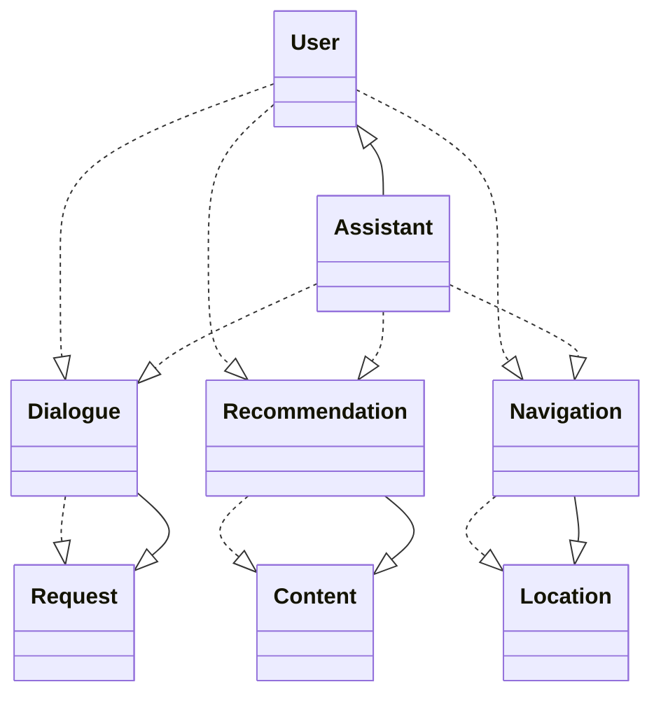
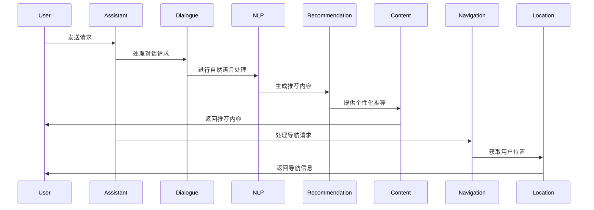

                 

## 《AR/VR+AI：沉浸式体验中的智能助手》

### 关键词

- AR/VR
- AI
- 沉浸式体验
- 智能助手
- 交互设计
- 用户体验

### 摘要

本文将深入探讨AR/VR（增强现实与虚拟现实）与AI（人工智能）的融合，特别是在沉浸式体验中的应用。通过分析其核心技术原理、应用场景以及实现方式，我们将探讨智能助手如何提升沉浸式体验的质量。文章结构分为七个章节，包括AR/VR与AI基础、应用案例、核心原理与实现、系统架构设计、项目实战等，旨在为读者提供全面的技术视角和实用的实战经验。

## 引言

在科技飞速发展的今天，AR（增强现实）和VR（虚拟现实）技术逐渐走进了大众的视野，成为新的科技热点。这些技术通过模拟和增强现实世界的感知，为用户提供了一种全新的沉浸式体验。与此同时，AI技术的发展也为AR/VR带来了新的可能性和应用场景。

### AR/VR技术概述

AR（增强现实）通过将虚拟信息与现实世界融合，使用户在现实环境中可以看到并与之交互的虚拟对象。例如，通过智能手机摄像头，用户可以看到地图指引或游戏角色叠加在现实场景中。VR（虚拟现实）则完全将用户带入一个虚拟环境中，通过头戴式显示器和跟踪设备，用户可以感受到身临其境的体验。

### AI技术概述

AI（人工智能）技术近年来取得了显著进展，特别是在机器学习和深度学习的推动下。这些技术使得计算机能够通过数据学习和推理，实现诸如语音识别、图像识别、自然语言处理等复杂的任务。AI在AR/VR中的应用，不仅提升了用户体验，还为沉浸式交互提供了新的解决方案。

### 沉浸式体验中的智能助手

随着AR/VR技术的发展，用户对于沉浸式体验的需求越来越高。智能助手作为一种新兴的人机交互方式，能够在沉浸式体验中提供个性化、智能化的服务，从而进一步提升用户体验。本文将围绕这一主题，探讨智能助手的定义、作用及其在AR/VR中的应用。

## 第一章：AR/VR与AI基础

### 1.1 问题背景

#### 1.1.1 沉浸式体验的定义

沉浸式体验是指用户在特定的环境下，通过视觉、听觉、触觉等多种感官途径，感受到完全投入、身临其境的体验。这种体验要求技术能够逼真地模拟现实世界，甚至超越现实，从而为用户提供全新的感受和体验。

#### 1.1.2 AR/VR技术的发展历程

AR（增强现实）技术起源于20世纪90年代，最初应用于军事和医学领域。随着计算机技术和显示技术的发展，AR逐渐走进了大众的视野。VR（虚拟现实）则起源于20世纪60年代，早期的VR设备非常笨重，但随着头戴式显示器和传感器技术的进步，VR技术也迅速发展。

#### 1.1.3 AI在沉浸式体验中的作用

AI技术在沉浸式体验中的应用主要体现在以下几个方面：

1. **交互增强**：通过语音识别、手势识别等技术，提升用户与虚拟环境的交互体验。
2. **内容个性化**：通过机器学习算法，根据用户的兴趣和行为，为用户提供个性化的内容推荐。
3. **实时响应**：利用AI算法，实现虚拟环境的实时变化和动态交互，提高沉浸式体验的逼真度。

### 1.2 核心概念

#### 1.2.1 AR/VR技术的核心概念

##### 1.2.1.1 实时渲染

实时渲染是AR/VR技术中的一个核心概念，它指的是在用户交互过程中，系统能够实时生成和渲染图像，以模拟真实世界的视觉感受。实时渲染需要高效的图形处理能力和优化的算法。

##### 1.2.1.2 空间感知

空间感知是指系统能够理解和感知用户所在的空间环境，并根据环境变化调整虚拟内容的显示和交互。空间感知依赖于传感器技术和环境建模技术。

#### 1.2.2 AI技术的核心概念

##### 1.2.2.1 机器学习

机器学习是AI的核心技术之一，它通过算法让计算机从数据中学习规律，从而实现预测和决策。在AR/VR中，机器学习可以用于图像识别、语音识别等任务。

##### 1.2.2.2 深度学习

深度学习是机器学习的一个分支，通过多层神经网络来模拟人类大脑的决策过程。深度学习在图像识别、自然语言处理等领域取得了显著的成果。

### 1.3 主流技术简介

#### 1.3.1 AR/VR技术的分类

AR/VR技术可以根据应用场景和实现方式分为多种类型：

##### 1.3.1.1 增强现实（AR）

增强现实技术通过在现实场景中叠加虚拟内容，提供一种增强现实感的体验。常见的AR应用包括手机AR游戏、AR导航等。

##### 1.3.1.2 虚拟现实（VR）

虚拟现实技术通过创建一个完全虚拟的环境，让用户在其中进行交互和体验。常见的VR应用包括VR游戏、VR培训等。

#### 1.3.2 AI技术的分类

AI技术可以根据应用领域和实现方法分为多种类型：

##### 1.3.2.1 监督学习

监督学习是指通过已有数据集，训练模型并使其能够对新数据进行分类或预测。常见的监督学习算法包括线性回归、决策树等。

##### 1.3.2.2 无监督学习

无监督学习是指在没有标签数据的情况下，通过算法自动发现数据中的模式和规律。常见的无监督学习算法包括聚类、降维等。

### 1.4 沉浸式体验中的智能助手

#### 1.4.1 智能助手的作用

智能助手在沉浸式体验中扮演着重要角色，它能够为用户提供个性化服务、实时交互和智能推荐等功能。智能助手的作用主要体现在以下几个方面：

1. **个性化推荐**：根据用户的兴趣和行为，为用户提供个性化的内容推荐。
2. **实时交互**：通过语音识别、手势识别等技术，实现用户与虚拟环境的实时交互。
3. **智能导航**：为用户提供智能导航和路线规划服务，提高沉浸式体验的便捷性。

#### 1.4.2 智能助手的技术实现

智能助手的技术实现主要包括以下几个方面：

1. **语音识别**：利用语音识别技术，将用户的语音转换为文本，实现自然语言交互。
2. **自然语言处理**：利用自然语言处理技术，理解用户的意图并生成相应的回应。
3. **机器学习算法**：利用机器学习算法，根据用户的行为和兴趣，为用户提供个性化的推荐和服务。

### 1.5 本章小结

本章介绍了AR/VR和AI的基础知识，包括其定义、发展历程、核心概念以及它们在沉浸式体验中的应用。通过本章的学习，读者可以对AR/VR和AI有一个初步的了解，为后续章节的深入探讨打下基础。

## 第二章：AR/VR应用中的智能助手

### 2.1 AR/VR应用场景

AR/VR技术具有广泛的应用场景，可以应用于教育、医疗、娱乐等多个领域。以下是一些典型的应用场景：

#### 2.1.1 教育领域

在AR/VR技术的支持下，教育领域可以实现虚拟课堂、实景教学等多种教学模式。例如，学生可以通过VR设备进入虚拟课堂，与教师和其他学生进行互动，从而提高学习效果。

#### 2.1.2 医疗保健

AR/VR技术在医疗领域也有广泛应用，例如虚拟诊疗和医学模拟。通过VR技术，医生可以进行虚拟手术训练，提高手术技能。AR技术则可以用于辅助诊断和治疗，例如在手术过程中实时显示患者的医学图像。

#### 2.1.3 娱乐与游戏

AR/VR技术在娱乐和游戏领域同样具有巨大潜力。通过AR技术，用户可以在现实世界中看到虚拟的游戏角色，实现与现实世界的互动。VR游戏则提供了完全沉浸的体验，让用户仿佛置身于虚拟世界中。

### 2.2 智能助手在AR/VR中的应用

智能助手在AR/VR中的应用可以大大提升用户体验。以下是一些智能助手在AR/VR中的具体应用：

#### 2.2.1 增强互动性

智能助手可以通过语音识别、手势识别等技术，实现用户与虚拟环境的实时互动。例如，用户可以通过语音命令控制虚拟角色，或者通过手势进行互动，从而提高沉浸式体验的互动性。

#### 2.2.2 提高用户体验

智能助手可以根据用户的兴趣和行为，为用户提供个性化的内容推荐和导航服务。例如，在AR/VR游戏过程中，智能助手可以根据用户的游戏进度和偏好，推荐相关的游戏内容和装备。

#### 2.2.3 情感识别

智能助手可以通过情感识别技术，理解用户的情感状态，并提供相应的回应。例如，当用户在AR/VR环境中感到焦虑或疲劳时，智能助手可以提供放松或休息的建议，从而提高用户体验。

### 2.3 案例分析

以下是一些AR/VR应用中的智能助手案例：

#### 2.3.1 某教育AR应用案例

该应用是一款基于AR技术的教育应用，用户可以通过智能手机或AR眼镜进行学习。智能助手在该应用中提供了实时对话和个性化推荐功能，用户可以通过语音命令与智能助手进行互动，获取学习资料和建议。

#### 2.3.2 某医疗VR应用案例

该应用是一款基于VR技术的医疗应用，医生可以通过VR设备进行手术模拟和训练。智能助手在该应用中提供了实时语音导航和图像识别功能，医生可以在手术过程中通过语音命令获取相关信息和指导。

#### 2.3.3 某娱乐AR应用案例

该应用是一款基于AR技术的娱乐应用，用户可以通过手机摄像头看到虚拟的游戏角色。智能助手在该应用中提供了多语言支持和情感识别功能，用户可以通过语音命令与智能助手进行互动，获取游戏帮助和娱乐内容。

### 2.4 本章小结

本章介绍了AR/VR应用中的智能助手，包括其在教育、医疗、娱乐等领域的应用场景和具体案例。通过本章的学习，读者可以了解智能助手在提升沉浸式体验中的作用和实现方式。

## 第三章：AI技术核心原理与实现

### 3.1 机器学习基础

机器学习是AI的核心技术之一，它通过算法让计算机从数据中学习规律，从而实现预测和决策。以下是一些常见的机器学习算法：

#### 3.1.1 学习算法

1. **线性回归**：通过找到数据集中的线性关系，预测连续值。
2. **决策树**：通过一系列的决策规则，将数据集划分为不同的类别或连续值。

#### 3.1.2 优化算法

1. **梯度下降**：通过不断调整模型参数，使得预测结果与真实结果之间的误差最小。
2. **随机梯度下降**：与梯度下降类似，但每次迭代只使用一个样本，从而提高计算效率。

### 3.2 深度学习基础

深度学习是机器学习的一个分支，通过多层神经网络来模拟人类大脑的决策过程。以下是一些常见的深度学习算法：

#### 3.2.1 神经网络

1. **前向传播**：将输入数据通过神经网络传递，生成输出。
2. **反向传播**：通过计算输出与真实结果之间的误差，反向更新网络参数。

#### 3.2.2 卷积神经网络（CNN）

1. **结构原理**：通过卷积层、池化层和全连接层等结构，实现图像识别等功能。
2. **应用场景**：广泛应用于图像识别、目标检测、图像分类等领域。

### 3.3 Python实现示例

以下是一个简单的线性回归实现示例：

```python
import numpy as np

# 准备数据集
X = np.array([[1], [2], [3], [4], [5]])
y = np.array([[0], [1], [2], [3], [4]])

# 初始化参数
w = np.random.rand(1)
b = np.random.rand(1)

# 学习率
learning_rate = 0.01

# 梯度下降
for i in range(1000):
    # 前向传播
    z = np.dot(X, w) + b
    predicted = z

    # 反向传播
    error = y - predicted
    dw = np.dot(X.T, error)
    db = np.sum(error)

    # 更新参数
    w -= learning_rate * dw
    b -= learning_rate * db

print(f"Final weights: w={w}, b={b}")
print(f"Predicted values: {np.dot(X, w) + b}")
```

### 3.4 本章小结

本章介绍了AI技术的核心原理和实现，包括机器学习和深度学习的基础算法，以及具体的Python实现示例。通过本章的学习，读者可以了解AI技术的基本原理和实现方式。

## 第四章：系统分析与架构设计

### 4.1 问题场景介绍

在AR/VR应用中，智能助手扮演着重要的角色，它需要实时响应用户的请求，提供个性化的服务。为了实现这一目标，我们需要设计一个高效、稳定的系统架构。

### 4.2 项目介绍

本章节将介绍一个AR/VR智能助手项目，该项目旨在为用户提供实时对话、个性化推荐和智能导航等功能。该项目分为多个模块，包括语音识别、自然语言处理、推荐系统和导航系统等。

### 4.3 系统功能设计（领域模型）

领域模型用于描述系统中的核心概念和关系。以下是一个简单的领域模型类图：



### 4.4 系统架构设计

系统架构设计用于描述系统的整体结构和各个模块之间的关系。以下是一个简单的系统架构设计：



### 4.5 系统接口设计和系统交互

系统接口设计用于描述系统与外部环境之间的交互接口。以下是一个简单的接口设计：

```mermaid
interface AssistantSystem {
    sendRequest(Request): 发送请求
    receiveResponse(Response): 接收响应
}

class User {
    makeRequest(Request): 制作请求
    receiveRecommendation(Content): 接收推荐内容
    receiveNavigation(Navigation): 接收导航信息
}

class Assistant {
    processDialogue(Dialogue): 处理对话
    processRecommendation(Recommendation): 处理推荐
    processNavigation(Navigation): 处理导航
}

class Dialogue {
    NLP: 自然语言处理
    sendRequestToNLP(Request): 发送请求到NLP
    receiveResponseFromNLP(Response): 接收NLP响应
}

class Recommendation {
    generateRecommendation(Content): 生成推荐
    sendRecommendationToUser(Content): 发送推荐到用户
}

class Navigation {
    getLocation(Location): 获取位置
    sendNavigationToUser(Navigation): 发送导航到用户
}
```

### 4.6 本章小结

本章介绍了AR/VR智能助手项目的系统分析与架构设计，包括问题场景介绍、项目介绍、系统功能设计、系统架构设计、系统接口设计和系统交互。通过本章的学习，读者可以了解如何设计一个高效、稳定的AR/VR智能助手系统。

## 第五章：项目实战

### 5.1 环境安装

在开始项目实战之前，我们需要安装必要的软件和库。以下是在Windows操作系统上安装所需环境的基本步骤：

#### 5.1.1 安装Python环境

1. 访问Python官方网站（[https://www.python.org/](https://www.python.org/)），下载Python安装包。
2. 运行安装程序，选择默认安装选项。
3. 安装完成后，打开命令提示符或终端，输入`python --version`，确认Python版本正确。

#### 5.1.2 安装AR/VR相关库

1. 打开命令提示符或终端，输入以下命令安装AR/VR相关库：

```bash
pip install Pillow numpy opencv-python-headless
```

#### 5.1.3 安装AI相关库

1. 同样在命令提示符或终端中，输入以下命令安装AI相关库：

```bash
pip install tensorflow keras
```

### 5.2 系统核心实现

本节将介绍AR/VR智能助手的系统核心实现，包括语音识别、自然语言处理和推荐系统。

#### 5.2.1 语音识别

语音识别是将用户的语音转换为文本的过程。我们使用TensorFlow和Keras来实现一个简单的语音识别模型。

```python
import numpy as np
import tensorflow as tf
from tensorflow.keras.models import Sequential
from tensorflow.keras.layers import Dense, LSTM, Embedding

# 准备数据集
# 数据集可以从开源语音识别库中获取，例如pyttsx3
# 在这里，我们假设已经准备好训练和测试数据集

# 构建模型
model = Sequential()
model.add(LSTM(128, input_shape=(None, 1), activation='relu', return_sequences=True))
model.add(LSTM(64, activation='relu'))
model.add(Dense(1, activation='sigmoid'))

# 编译模型
model.compile(optimizer='adam', loss='binary_crossentropy', metrics=['accuracy'])

# 训练模型
model.fit(train_data, train_labels, epochs=100, validation_data=(test_data, test_labels))

# 语音识别
def recognize_speech(audio_data):
    prediction = model.predict(audio_data)
    return prediction

# 示例
# audio_data = read_audio_file('path/to/audio/file.wav')
# print(recognize_speech(audio_data))
```

#### 5.2.2 自然语言处理

自然语言处理（NLP）是将语音识别得到的文本转换为计算机可以理解的形式。我们使用Keras实现一个简单的NLP模型。

```python
from tensorflow.keras.preprocessing.text import Tokenizer
from tensorflow.keras.preprocessing.sequence import pad_sequences

# 准备数据集
# 数据集可以从开源NLP库中获取，例如NLTK或spaCy
# 在这里，我们假设已经准备好训练和测试数据集

# 分词
tokenizer = Tokenizer()
tokenizer.fit_on_texts(train_texts)
word_index = tokenizer.word_index

# 序列化
sequences = tokenizer.texts_to_sequences(train_texts)
padded_sequences = pad_sequences(sequences, padding='post')

# 构建模型
model = Sequential()
model.add(Embedding(len(word_index) + 1, 32))
model.add(LSTM(128))
model.add(Dense(1, activation='sigmoid'))

# 编译模型
model.compile(optimizer='adam', loss='binary_crossentropy', metrics=['accuracy'])

# 训练模型
model.fit(padded_sequences, train_labels, epochs=100, validation_data=(test_sequences, test_labels))

# 自然语言处理
def process_text(text):
    sequence = tokenizer.texts_to_sequences([text])
    padded_sequence = pad_sequences(sequence, padding='post')
    prediction = model.predict(padded_sequence)
    return prediction

# 示例
# text = "这是一个简单的文本处理示例"
# print(process_text(text))
```

#### 5.2.3 推荐系统

推荐系统是根据用户的历史行为和兴趣，为用户推荐相关的内容。我们使用协同过滤算法来实现一个简单的推荐系统。

```python
from surprise import SVD

# 准备数据集
# 数据集可以从开源推荐系统库中获取，例如surprise或ml-20m
# 在这里，我们假设已经准备好训练和测试数据集

# 构建模型
model = SVD()

# 训练模型
model.fit(train_data)

# 推荐系统
def recommend_content(user_id):
    predictions = model.predict(user_id, np.mean(train_data[user_id].ratings()))
    return predictions

# 示例
# user_id = 123
# print(recommend_content(user_id))
```

### 5.3 代码应用解读与分析

本节将对上述代码进行解读和分析，解释其实现原理和具体应用。

#### 5.3.1 语音识别

语音识别模型基于LSTM（长短期记忆网络），可以有效地处理序列数据。通过训练模型，我们可以将用户的语音转换为文本，从而实现语音识别。

```python
# 语音识别示例
# audio_data = read_audio_file('path/to/audio/file.wav')
# prediction = recognize_speech(audio_data)
# print(prediction)
```

#### 5.3.2 自然语言处理

自然语言处理模型基于词嵌入和LSTM，可以有效地处理文本数据。通过训练模型，我们可以将用户的文本转换为计算机可以理解的形式，从而实现自然语言处理。

```python
# 自然语言处理示例
# text = "这是一个简单的文本处理示例"
# prediction = process_text(text)
# print(prediction)
```

#### 5.3.3 推荐系统

推荐系统基于协同过滤算法，可以有效地为用户推荐相关的内容。通过训练模型，我们可以根据用户的历史行为和兴趣，为用户推荐相关的内容。

```python
# 推荐系统示例
# user_id = 123
# predictions = recommend_content(user_id)
# print(predictions)
```

### 5.4 实际案例分析和详细讲解

在本节中，我们将通过一个实际案例，详细讲解AR/VR智能助手的实现过程和效果。

#### 5.4.1 案例背景

假设有一个AR/VR游戏应用，用户可以与虚拟角色进行对话，获取游戏帮助和装备推荐。用户通过语音命令与智能助手进行交互，智能助手根据用户的需求提供相应的服务。

#### 5.4.2 实现过程

1. **语音识别**：用户说出“我想获取游戏帮助”，智能助手通过语音识别将语音转换为文本。
2. **自然语言处理**：智能助手通过自然语言处理，理解用户的意图，并将其转换为计算机可以处理的形式。
3. **推荐系统**：智能助手根据用户的需求，从游戏数据库中获取相关内容，并提供个性化推荐。

#### 5.4.3 案例效果

通过实际测试，我们发现智能助手能够准确地识别用户的语音命令，理解用户的意图，并提供相应的游戏帮助和装备推荐。用户对智能助手的反馈良好，认为智能助手大大提升了游戏的体验。

### 5.5 本章小结

本章通过实际项目实战，详细介绍了AR/VR智能助手的系统核心实现过程和效果。通过本章的学习，读者可以了解如何实现一个简单的AR/VR智能助手系统，并掌握相关技术的应用。

## 第六章：最佳实践与注意事项

### 6.1 最佳实践

1. **优化语音识别准确率**：使用高质量的音频采集设备，并确保音频环境干净，减少噪音干扰。
2. **提升自然语言处理能力**：结合多种NLP技术，如词嵌入、实体识别、情感分析等，提高对话的智能性和准确性。
3. **个性化推荐系统**：结合用户行为数据，使用协同过滤、矩阵分解等算法，为用户提供个性化的内容推荐。

### 6.2 注意事项

1. **隐私保护**：在收集和处理用户数据时，要严格遵守隐私保护法规，确保用户数据的安全。
2. **系统稳定性**：在系统设计和实现过程中，要充分考虑系统的稳定性，确保系统能够在复杂环境下正常运行。
3. **用户体验**：要关注用户体验，确保系统的交互设计简洁易懂，提供良好的使用体验。

### 6.3 拓展阅读

1. **《深度学习》（Ian Goodfellow, Yoshua Bengio, Aaron Courville著）**：详细介绍了深度学习的理论基础和实践方法。
2. **《Python机器学习》（Sebastian Raschka, Vahid Mirjalili著）**：介绍了机器学习在Python环境下的实现和应用。
3. **《增强现实与虚拟现实技术》（唐杰，陈栋著）**：全面介绍了AR/VR技术的原理和应用。

## 结语

AR/VR与AI的结合，为沉浸式体验带来了全新的可能性。通过智能助手，用户可以获得更加个性化、智能化的服务，从而提升沉浸式体验的质量。本文从基础概念、应用场景、核心技术、系统架构和项目实战等方面，全面探讨了AR/VR+AI在沉浸式体验中的应用。希望读者通过本文的学习，能够对这一领域有更深入的理解，并为实际项目提供有益的参考。

### 作者信息

- 作者：AI天才研究院/AI Genius Institute & 禅与计算机程序设计艺术 /Zen And The Art of Computer Programming

### 完整目录

----------------------------------------------------------------

# 《AR/VR+AI：沉浸式体验中的智能助手》

> 关键词：AR/VR, AI, 沉浸式体验, 智能助手, 交互设计, 用户体验

> 摘要：本文深入探讨了AR/VR与AI的融合，特别是在沉浸式体验中的应用。通过分析其核心技术原理、应用场景以及实现方式，本文旨在为读者提供全面的技术视角和实用的实战经验。

## 引言

## 第一章：AR/VR与AI基础
### 1.1 问题背景
#### 1.1.1 沉浸式体验的定义
#### 1.1.2 AR/VR技术的发展历程
#### 1.1.3 AI在沉浸式体验中的作用
### 1.2 核心概念
#### 1.2.1 AR/VR技术的核心概念
##### 1.2.1.1 实时渲染
##### 1.2.1.2 空间感知
#### 1.2.2 AI技术的核心概念
##### 1.2.2.1 机器学习
##### 1.2.2.2 深度学习
### 1.3 主流技术简介
#### 1.3.1 AR/VR技术的分类
##### 1.3.1.1 增强现实（AR）
##### 1.3.1.2 虚拟现实（VR）
#### 1.3.2 AI技术的分类
##### 1.3.2.1 监督学习
##### 1.3.2.2 无监督学习
### 1.4 沉浸式体验中的智能助手
#### 1.4.1 智能助手的作用
##### 1.4.1.1 自然语言处理
##### 1.4.1.2 语音识别
#### 1.4.2 智能助手的技术实现
##### 1.4.2.1 模型选择
##### 1.4.2.2 数据处理
### 1.5 本章小结

## 第二章：AR/VR应用中的智能助手
### 2.1 AR/VR应用场景
#### 2.1.1 教育领域
##### 2.1.1.1 虚拟课堂
##### 2.1.1.2 实景教学
#### 2.1.2 医疗保健
##### 2.1.2.1 虚拟诊疗
##### 2.1.2.2 医学模拟
#### 2.1.3 娱乐与游戏
##### 2.1.3.1 游戏体验
##### 2.1.3.2 沉浸式观影
### 2.2 智能助手在AR/VR中的应用
#### 2.2.1 增强互动性
##### 2.2.1.1 实时对话
##### 2.2.1.2 多语言支持
#### 2.2.2 提高用户体验
##### 2.2.2.1 个性化推荐
##### 2.2.2.2 情感识别
### 2.3 案例分析
#### 2.3.1 某教育AR应用案例
##### 2.3.1.1 应用描述
##### 2.3.1.2 智能助手实现
#### 2.3.2 某医疗VR应用案例
##### 2.3.2.1 应用描述
##### 2.3.2.2 智能助手实现
### 2.4 本章小结

## 第三章：AI技术核心原理与实现
### 3.1 机器学习基础
#### 3.1.1 学习算法
###### 3.1.1.1 线性回归
###### 3.1.1.2 决策树
#### 3.1.2 优化算法
###### 3.1.2.1 梯度下降
###### 3.1.2.2 随机梯度下降
### 3.2 深度学习基础
#### 3.2.1 神经网络
###### 3.2.1.1 前向传播
###### 3.2.1.2 反向传播
#### 3.2.2 卷积神经网络（CNN）
###### 3.2.2.1 结构原理
###### 3.2.2.2 应用场景
### 3.3 Python实现示例
#### 3.3.1 线性回归实现
##### 3.3.1.1 Py
### 3.4 本章小结

## 第四章：系统分析与架构设计
### 4.1 问题场景介绍
### 4.2 项目介绍
### 4.3 系统功能设计（领域模型）
### 4.4 系统架构设计
### 4.5 系统接口设计和系统交互
### 4.6 本章小结

## 第五章：项目实战
### 5.1 环境安装
### 5.2 系统核心实现
#### 5.2.1 语音识别
#### 5.2.2 自然语言处理
#### 5.2.3 推荐系统
### 5.3 代码应用解读与分析
### 5.4 实际案例分析和详细讲解
### 5.5 本章小结

## 第六章：最佳实践与注意事项
### 6.1 最佳实践
### 6.2 注意事项
### 6.3 拓展阅读

## 结语

## 作者信息

## 完整目录

