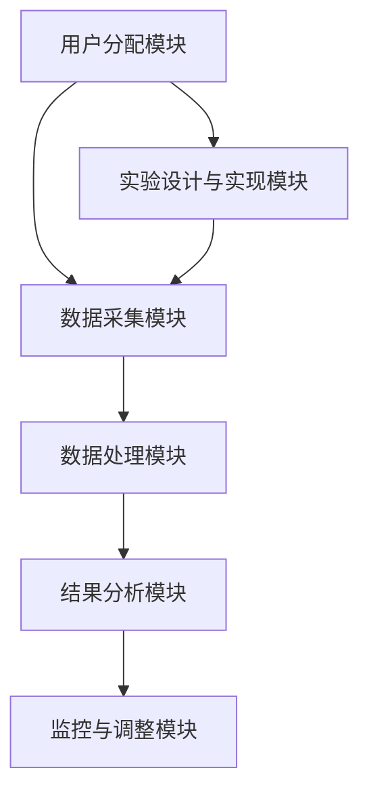

                 

### 引言与背景

#### A/B测试的基本概念

A/B测试，也被称为拆箱测试（Split Testing），是一种通过将用户分配到两个或多个不同版本的测试组，来比较这些版本性能差异的实验方法。它的核心思想是将用户随机分配到两个或多个不同的体验（A组、B组等），然后通过分析这些不同体验的用户行为和结果，确定哪种体验更优。A/B测试在产品开发和优化中应用广泛，尤其在用户体验优化、功能迭代和性能改进等方面具有重要意义。

在人工智能（AI）领域中，A/B测试同样扮演着至关重要的角色。随着AI技术的不断进步和应用场景的扩大，AI Agent的性能优化成为了一个亟待解决的重要问题。AI Agent，指的是基于AI算法的智能实体，能够根据环境数据和输入信息自主决策并采取行动。例如，自动驾驶汽车、智能客服机器人等都是典型的AI Agent。

A/B测试在AI Agent性能优化中的作用主要体现在以下几个方面：

1. **功能迭代与优化**：通过A/B测试，开发者可以在不同的AI Agent版本之间进行性能对比，确定哪种算法、模型或策略更有效。这有助于在迭代过程中不断优化AI Agent的功能，提高其性能。

2. **用户体验提升**：A/B测试可以帮助开发者了解用户对不同AI Agent版本的偏好，从而调整和优化用户体验，提升用户满意度。

3. **风险控制**：A/B测试可以在引入新功能或更新之前进行预评估，降低失败的风险。通过逐步推出和测试，开发者可以更好地控制新功能上线带来的潜在影响。

4. **数据驱动决策**：A/B测试提供的数据支持可以驱动数据驱动的决策过程，帮助开发者基于数据而非直觉进行优化和改进。

#### AI性能优化的必要性

AI性能优化，是指在保持AI系统稳定性和可靠性的前提下，通过调整算法参数、优化数据集、改进模型结构等方法，提升AI系统的整体性能和效率。对于AI Agent而言，性能优化意味着提高其预测准确性、决策速度和适应性。

在当前AI技术快速发展和应用场景日益多样化的背景下，AI性能优化面临着以下几个挑战：

1. **模型复杂度增加**：随着深度学习等复杂算法的广泛应用，AI模型的复杂度不断增加，这导致优化过程变得更加复杂和耗时。

2. **数据质量和多样性**：AI Agent的性能高度依赖于数据质量。然而，数据质量往往参差不齐，且数据集的多样性和丰富性不足，这限制了优化效果的提升。

3. **计算资源和时间限制**：大规模的A/B测试和性能优化需要大量的计算资源和时间。如何在有限资源内高效地进行优化是一个重要问题。

4. **多目标优化**：在实际应用中，AI Agent的性能优化往往需要同时考虑多个目标，如准确性、效率、可扩展性等，这增加了优化问题的复杂度。

面对这些挑战，A/B测试框架成为了一种有效的方法。通过A/B测试，开发者可以系统地评估不同算法、模型和策略的性能，从而找到最优解，实现AI Agent的持续性能优化。

#### 当前AI Agent性能优化面临的问题

尽管A/B测试为AI Agent性能优化提供了有力的支持，但在实际应用中仍存在一些问题：

1. **数据偏差**：在A/B测试中，如果用户分配不均匀或数据集存在偏差，可能会导致测试结果不准确。

2. **计算成本**：大规模的A/B测试需要大量的计算资源，尤其是在数据量和模型复杂度较大的情况下。

3. **策略迭代**：优化AI Agent的性能往往需要多个迭代过程，这需要开发者具备深厚的专业知识，以便在迭代过程中做出正确的决策。

4. **结果解释**：A/B测试的结果往往包含大量的统计数据，如何正确解读和利用这些数据是开发者面临的一大挑战。

#### 结论

本文旨在探讨A/B测试在AI Agent性能优化中的应用，分析其基本概念、核心原理、设计框架以及实际应用中的问题和挑战。通过本文的探讨，读者将能够更好地理解A/B测试框架在AI性能优化中的重要作用，并为实际开发提供有益的指导。接下来，我们将详细讨论A/B测试的理论基础和具体方法，为后续内容打下坚实的基础。

### 核心概念与原理

#### A/B测试理论

A/B测试是一种经典的统计实验方法，其理论基础主要包括采样理论、统计推断和假设检验。以下是这些核心概念的具体说明。

##### 采样理论

采样理论是A/B测试的基础。采样理论的核心思想是通过从总体中随机抽取一部分样本，来推断总体的特征和属性。在A/B测试中，用户群体被随机分配到不同的体验组（如A组和B组），从而构成两个独立的样本。通过对这些样本进行实验和分析，可以推断出整体用户的反应和偏好。

##### 统计推断

统计推断是基于样本数据来推断总体特征的方法。在A/B测试中，通过收集A组和B组的实验数据，可以计算出各个组的性能指标（如转化率、点击率等）。然后，使用统计方法来评估这些指标之间的差异，从而推断出哪种体验更优。

##### 假设检验

假设检验是统计推断的一种具体方法。在A/B测试中，通常涉及两个假设：

- **零假设（H0）**：两个体验组之间的性能指标没有显著差异。
- **备择假设（H1）**：两个体验组之间的性能指标存在显著差异。

通过假设检验，可以确定零假设是否成立。如果拒绝零假设，则认为两个体验组之间存在显著差异，从而支持备择假设。

##### 假设检验的过程

假设检验通常包括以下步骤：

1. **设定假设**：明确零假设和备择假设。
2. **选择检验方法**：根据实验数据和具体需求选择合适的检验方法，如t检验、卡方检验等。
3. **计算统计量**：根据实验数据计算统计量，如t值、卡方值等。
4. **设定显著性水平**：根据统计量的分布和样本大小，设定显著性水平（如α=0.05）。
5. **做出决策**：根据计算结果和设定的显著性水平，决定是否拒绝零假设。

##### 假设检验的例子

假设A组和B组的转化率分别为10%和12%，我们想要检验这两个组的转化率是否存在显著差异。

1. **设定假设**：
   - 零假设（H0）：A组和B组的转化率没有显著差异。
   - 备择假设（H1）：A组和B组的转化率存在显著差异。

2. **选择检验方法**：由于这里涉及到比例数据的比较，我们可以使用卡方检验。

3. **计算统计量**：根据A组和B组的样本数据，计算卡方统计量。

4. **设定显著性水平**：假设显著性水平为α=0.05。

5. **做出决策**：通过卡方分布表查找对应的临界值，如果计算的卡方统计量大于临界值，则拒绝零假设，认为两个组的转化率存在显著差异。

#### A/B测试方法

A/B测试的具体方法包括测试准备、测试执行和结果分析三个主要阶段。以下是每个阶段的详细说明。

##### 测试准备

1. **定义测试目标**：明确测试的目标和指标，如转化率、用户留存率、点击率等。

2. **设计测试方案**：制定测试方案，包括参与用户的选择、分配策略、测试时长等。

3. **准备测试环境**：确保测试环境的稳定性，包括服务器、网络、数据库等。

4. **确定对照组和测试组**：将用户随机分配到对照组和测试组，确保两个组的初始状态一致。

##### 测试执行

1. **启动测试**：按照测试方案启动测试，监控测试过程的运行状态。

2. **数据收集**：实时收集用户行为数据，如访问次数、点击次数、转化次数等。

3. **数据存储**：将收集到的数据存储在数据库中，以便后续分析和处理。

4. **监控与调整**：在测试过程中，监控测试性能和用户反馈，必要时进行调整。

##### 结果分析

1. **数据处理**：对收集到的数据进行预处理，包括去重、清洗、归一化等。

2. **计算性能指标**：计算对照组和测试组的性能指标，如转化率、点击率、留存率等。

3. **统计分析**：使用统计方法，如t检验、卡方检验等，分析两组性能指标之间的差异。

4. **结果解读**：根据统计结果，判断哪种体验更优，并给出具体的解释和建议。

#### A/B测试的优缺点

A/B测试具有以下优点：

1. **数据驱动**：A/B测试基于实际用户数据，能够提供客观的测试结果，减少主观判断的影响。

2. **实验性强**：通过对比不同版本的体验，能够发现用户偏好和行为差异，为产品优化提供有力依据。

3. **适用范围广**：A/B测试可以应用于各种类型的产品和场景，如网站优化、APP优化、功能迭代等。

然而，A/B测试也存在一些缺点：

1. **时间成本高**：A/B测试需要较长的测试周期，尤其是在用户量较大时。

2. **计算资源需求大**：大规模的A/B测试需要大量的计算资源和存储空间。

3. **结果解释复杂**：A/B测试结果需要专业的统计知识进行解读，否则可能会得出错误的结论。

#### A/B测试的适用场景

A/B测试适用于以下几种场景：

1. **产品优化**：通过A/B测试，可以确定哪种产品功能、界面设计、营销策略等更受用户欢迎，从而优化产品。

2. **功能迭代**：在功能迭代过程中，通过A/B测试，可以评估新功能的性能和用户接受度。

3. **广告优化**：通过A/B测试，可以优化广告文案、广告展示位置等，提高广告效果。

4. **用户体验提升**：通过A/B测试，可以了解用户在不同体验下的行为和反馈，从而提升用户体验。

#### 结论

A/B测试作为一种重要的实验方法，在AI Agent性能优化中具有重要作用。通过A/B测试，开发者可以系统地评估和比较不同算法、模型和策略的性能，从而实现AI Agent的持续性能优化。在接下来的章节中，我们将进一步探讨A/B测试框架的设计，包括架构设计、数据收集与预处理、实验设计与实现以及结果分析，为读者提供更加详细的指导。

### AI性能指标与评估

在AI领域，性能指标是评估AI模型或算法表现的核心依据。这些指标不仅帮助我们衡量模型的准确性、可靠性，还能为后续的优化工作提供关键数据。以下是几种常见的AI性能指标及其具体含义、优缺点以及在A/B测试中的应用。

#### 准确率（Accuracy）

**定义**：准确率是评估分类模型最直观的指标，它表示模型正确预测的样本占总样本的比例。

**公式**：
$$
\text{Accuracy} = \frac{\text{正确预测的样本数}}{\text{总样本数}}
$$

**优缺点**：
- **优点**：准确率简单易懂，易于计算和解释。
- **缺点**：对于不平衡数据集，准确率可能无法准确反映模型的性能。

**应用**：在A/B测试中，通过比较两组AI Agent的准确率，可以评估不同模型或策略的分类效果。

#### 召回率（Recall）

**定义**：召回率是指模型能够正确召回实际正类样本的比例。

**公式**：
$$
\text{Recall} = \frac{\text{正确召回的正类样本数}}{\text{实际正类样本数}}
$$

**优缺点**：
- **优点**：召回率更能反映模型对正类样本的捕捉能力，尤其对数据不平衡时更敏感。
- **缺点**：召回率高可能会导致假阳性率高。

**应用**：在A/B测试中，通过召回率可以评估AI Agent在检测特定事件或对象时的表现。

#### 精确率（Precision）

**定义**：精确率是指模型正确预测为正类的样本中，实际为正类的比例。

**公式**：
$$
\text{Precision} = \frac{\text{正确预测的正类样本数}}{\text{预测为正类的样本总数}}
$$

**优缺点**：
- **优点**：精确率高表示模型的预测结果更可靠。
- **缺点**：精确率高可能会导致假阴性率高。

**应用**：在A/B测试中，通过精确率可以评估AI Agent在过滤信息或识别目标时的准确度。

#### F1值（F1 Score）

**定义**：F1值是精确率和召回率的调和平均值，用于综合评估模型的性能。

**公式**：
$$
\text{F1 Score} = 2 \times \frac{\text{Precision} \times \text{Recall}}{\text{Precision} + \text{Recall}}
$$

**优缺点**：
- **优点**：F1值能够平衡精确率和召回率，对数据不平衡问题有较好的适应能力。
- **缺点**：F1值在某些极端情况下（如一个极端高和一个极端低的值）可能会失真。

**应用**：在A/B测试中，通过F1值可以全面评估AI Agent的整体性能，特别是在需要平衡精确率和召回率的场景中。

#### 评估方法

除了上述指标，AI性能评估还包括以下几种常见方法：

1. **交叉验证（Cross-Validation）**：
   - **定义**：交叉验证是一种通过多次划分训练集和测试集，来评估模型性能的方法。
   - **优点**：可以减少模型对特定测试集的依赖，提供更稳定的评估结果。
   - **缺点**：计算成本较高。

2. **分层评估（Stratified Sampling）**：
   - **定义**：分层评估是一种将数据集按照某种特征（如类别、标签）分层，然后在每一层中随机抽取样本的方法。
   - **优点**：可以确保每个层次的数据在训练和测试中都有代表。
   - **缺点**：如果层次划分不当，可能导致评估结果偏差。

3. **复合评估指标（Composite Metrics）**：
   - **定义**：复合评估指标是通过结合多个评估指标，来综合评估模型性能的方法。
   - **优点**：可以提供更全面的性能评估。
   - **缺点**：指标选择和权重分配可能影响评估结果的准确性。

#### 结论

AI性能评估是AI领域的关键环节，通过准确和全面的性能指标，可以评估AI模型或算法的表现，为优化和改进提供依据。在A/B测试中，这些性能指标可以帮助开发者比较不同版本AI Agent的性能，从而做出数据驱动的优化决策。在接下来的章节中，我们将深入探讨A/B测试框架的设计和实现，为AI Agent的持续性能优化提供技术支持。

### A/B测试框架设计

A/B测试框架的设计是确保测试结果准确、有效的重要环节。一个完善的A/B测试框架应包括以下几个方面：架构设计、组件功能、数据收集与预处理、实验设计与实现以及结果分析。以下是这些核心组成部分的详细说明。

#### 架构设计

A/B测试框架的架构设计决定了测试系统的整体结构和性能。以下是典型的A/B测试框架架构：

1. **用户分配模块**：
   - **功能**：负责将用户随机分配到不同的测试组（A组、B组等）。
   - **组件**：包括用户ID生成器、随机数生成器等。

2. **数据采集模块**：
   - **功能**：负责实时采集用户的操作数据，如点击、浏览、购买等。
   - **组件**：包括日志收集器、数据库等。

3. **数据处理模块**：
   - **功能**：负责对采集到的数据进行分析和预处理，为结果分析提供数据支持。
   - **组件**：包括数据清洗工具、数据分析引擎等。

4. **结果分析模块**：
   - **功能**：负责对实验结果进行分析和统计，生成最终的报告。
   - **组件**：包括统计分析工具、报表生成器等。

5. **监控与调整模块**：
   - **功能**：负责监控测试过程中的系统性能和用户反馈，并根据需要调整测试策略。
   - **组件**：包括监控工具、反馈系统等。

#### 数据收集与预处理

数据收集与预处理是A/B测试的核心步骤之一。以下是具体的流程和组件：

1. **数据收集**：
   - **步骤**：用户在访问系统时，系统将记录用户的行为数据，如点击、浏览、购买等。
   - **组件**：日志收集器、API接口等。

2. **数据预处理**：
   - **步骤**：对收集到的数据进行清洗、去重、归一化等预处理操作。
   - **组件**：数据清洗工具、ETL（提取、转换、加载）引擎等。

3. **数据存储**：
   - **步骤**：将预处理后的数据存储到数据库中，以便后续分析和处理。
   - **组件**：数据库、数据仓库等。

#### 实验设计与实现

实验设计与实现是A/B测试的核心环节，决定了测试的可行性和有效性。以下是具体的步骤和组件：

1. **定义测试目标**：
   - **步骤**：明确测试的目标和指标，如转化率、点击率、用户留存率等。
   - **组件**：测试目标定义工具、KPI指标库等。

2. **设计测试方案**：
   - **步骤**：制定详细的测试方案，包括用户分配策略、测试时长、数据采集等。
   - **组件**：测试方案模板、实验设计工具等。

3. **实施测试**：
   - **步骤**：按照测试方案执行A/B测试，监控测试过程。
   - **组件**：测试执行平台、自动化测试工具等。

4. **数据采集**：
   - **步骤**：实时采集用户在测试过程中的行为数据。
   - **组件**：数据采集模块、日志收集器等。

5. **数据预处理与分析**：
   - **步骤**：对采集到的数据进行预处理和分析，为结果分析提供数据支持。
   - **组件**：数据处理模块、数据分析引擎等。

#### 结果分析

结果分析是A/B测试的最后一步，也是最重要的一步。以下是具体的步骤和组件：

1. **数据清洗与整理**：
   - **步骤**：对采集到的数据进行分析，清洗和整理数据，确保数据质量。
   - **组件**：数据清洗工具、数据处理引擎等。

2. **统计分析**：
   - **步骤**：使用统计方法对数据进行统计分析，评估不同测试组之间的性能差异。
   - **组件**：统计分析工具、统计模型库等。

3. **结果解读**：
   - **步骤**：根据统计结果，解读实验结果，确定哪种测试版本更优。
   - **组件**：报表生成器、可视化工具等。

4. **报告生成**：
   - **步骤**：生成详细的测试报告，包括测试过程、结果分析、结论等。
   - **组件**：报告生成器、文档工具等。

#### 架构设计示例

以下是一个简化的A/B测试框架架构设计示例，使用Mermaid流程图来展示各组件之间的关系：

#### 数据处理与结果分析示例

为了更好地说明A/B测试框架的设计，我们可以通过一个示例来展示数据处理和结果分析的过程。

**示例**：假设我们要测试两种不同的用户登录页面设计A和B，以提升用户的登录转化率。

1. **数据收集**：系统记录用户在访问登录页面时的行为数据，包括登录成功次数、页面停留时间等。

2. **数据处理**：对收集到的数据进行清洗和整理，去除无效数据和异常值，然后按用户分配的组别（A组或B组）进行分类。

3. **统计分析**：
   - 计算A组和B组的登录转化率。
   - 使用t检验方法分析A组和B组之间的转化率差异。

4. **结果解读**：
   - 如果A组的转化率显著高于B组，则认为页面设计A更优。
   - 如果B组的转化率显著高于A组，则认为页面设计B更优。

5. **报告生成**：生成详细的测试报告，包括实验过程、数据统计结果、分析结论和建议。

通过上述示例，我们可以看到A/B测试框架的设计和实现过程，包括从数据收集、处理到结果分析的各个环节。在接下来的章节中，我们将进一步探讨A/B测试在实际应用中的具体案例，以加深对A/B测试框架的理解。

### A/B测试在AI Agent开发中的应用

在AI Agent的开发过程中，A/B测试是一种关键方法，可以帮助开发者评估不同算法、模型或策略的性能，从而优化AI Agent的表现。以下将详细描述A/B测试在AI Agent开发中的应用过程，包括实验设计、数据收集与处理、结果分析以及优化策略。

#### 实验设计

1. **明确目标**：在开始A/B测试前，首先需要明确测试的目标。例如，提高AI Agent的预测准确性、减少响应时间或提升用户满意度等。

2. **定义版本**：根据测试目标，设计不同的AI Agent版本。这些版本可以是算法的不同实现、模型的不同结构或策略的不同调整。

3. **用户分配**：将用户随机分配到不同的版本组（例如A组、B组等），确保每个组的用户特征和初始状态相似，以避免偏差。

4. **测试时长**：确定A/B测试的测试时长，通常根据业务需求和用户量来设定。过短的测试周期可能无法捕捉到长期效果，而过长的测试周期则可能增加成本和资源消耗。

5. **数据采集**：设计数据采集方案，确保能够实时、全面地收集用户在测试过程中的行为数据，如点击、浏览、转化、错误率等。

#### 数据收集与处理

1. **实时数据采集**：通过日志、API接口、传感器等手段，实时采集用户在测试过程中的行为数据。

2. **数据预处理**：对收集到的数据进行清洗、去重、归一化等预处理操作，确保数据的质量和一致性。

3. **数据存储**：将预处理后的数据存储到数据库或数据仓库中，便于后续分析和处理。

4. **数据处理**：使用ETL（提取、转换、加载）工具或数据处理框架，对存储的数据进行进一步处理，如特征提取、数据融合等。

#### 结果分析

1. **计算性能指标**：根据A/B测试的目标，计算各个版本的AI Agent在不同性能指标上的表现，如准确率、召回率、F1值、响应时间等。

2. **统计分析**：使用统计分析方法，如t检验、卡方检验、回归分析等，评估不同版本之间的性能差异。这些方法可以帮助确定哪些版本表现更好，以及差异是否显著。

3. **结果解读**：根据统计分析结果，结合业务需求和用户反馈，解读实验结果，确定最优版本。

4. **可视化展示**：使用可视化工具，如图表、仪表盘等，展示A/B测试的结果，帮助开发者和管理者直观地理解数据。

#### 优化策略

1. **迭代优化**：根据A/B测试的结果，对AI Agent进行迭代优化。例如，调整算法参数、改进模型结构、优化策略等。

2. **多变量测试**：在确定某个变量（如算法）对性能的影响后，可以进一步进行多变量测试，以确定更多因素的综合影响。

3. **持续监控**：在优化后，持续监控AI Agent的表现，确保其性能稳定且符合预期。

4. **反馈循环**：建立反馈循环机制，将用户反馈和业务数据用于持续优化。例如，根据用户行为数据调整推荐策略、根据错误日志优化异常处理等。

#### 案例分析

以下是一个具体的案例分析，展示如何通过A/B测试优化AI Agent的性能。

**案例背景**：某电商平台希望提高其推荐系统的点击率，通过A/B测试来评估两种不同的推荐算法的性能。

1. **实验设计**：
   - 目标：提高推荐系统的点击率。
   - 版本A：基于用户历史浏览和购买数据，采用传统的协同过滤算法。
   - 版本B：采用深度学习算法，结合用户历史行为和商品特征进行推荐。

2. **数据收集与处理**：
   - 实时采集用户在推荐系统上的点击数据。
   - 对收集到的数据进行清洗和预处理，确保数据的一致性和质量。

3. **结果分析**：
   - 计算A和B版本在点击率上的表现。
   - 使用t检验方法评估两个版本之间的差异。

4. **优化策略**：
   - 根据A/B测试结果，选择点击率更高的版本B作为推荐算法。
   - 进一步优化模型参数，提高推荐系统的准确性和实时性。

5. **持续监控**：
   - 监控优化后的推荐系统的点击率和用户满意度。
   - 根据监控数据，调整和优化推荐算法，确保其长期表现。

通过上述案例分析，我们可以看到A/B测试在AI Agent开发中的应用过程，包括实验设计、数据收集与处理、结果分析和优化策略。这种方法不仅可以帮助开发者找到最优的AI Agent版本，还能为AI系统的持续优化提供有力的支持。

### 持续优化策略

在AI Agent的性能优化过程中，持续优化策略是确保AI系统长期高效运行的关键。以下是一些有效的持续优化策略，旨在通过数据驱动的方法不断提升AI Agent的性能。

#### 自动化测试

自动化测试是一种通过编写脚本或使用自动化测试工具，对AI Agent进行持续测试的方法。自动化测试的优点包括：

1. **提高测试效率**：自动化测试可以大幅减少人工测试的工作量，提高测试速度。
2. **确保测试一致性**：自动化测试遵循固定的脚本，确保每次测试结果的一致性。
3. **实时反馈**：自动化测试可以实时提供测试结果，帮助开发者快速发现问题。

在实际应用中，可以通过以下步骤实施自动化测试：

1. **编写测试脚本**：根据AI Agent的功能和性能指标，编写测试脚本，覆盖所有关键测试场景。
2. **集成测试工具**：将测试脚本集成到CI/CD（持续集成/持续部署）流程中，实现自动化执行。
3. **定期执行测试**：设置定期执行测试，确保AI Agent在不同环境下的稳定性。

#### 用户行为分析

用户行为分析是了解用户与AI Agent交互情况的重要手段。通过分析用户行为数据，可以识别用户偏好、行为模式以及潜在问题。以下是一些用户行为分析的步骤：

1. **数据收集**：收集用户的交互数据，包括点击、浏览、购买、评论等。
2. **数据预处理**：对收集到的数据清洗、去噪、转换，确保数据质量。
3. **行为建模**：使用机器学习算法，建立用户行为模型，预测用户行为。
4. **分析报告**：生成用户行为分析报告，提供用户行为的洞察和优化建议。

#### 实时监控

实时监控是确保AI Agent性能稳定的关键。通过实时监控，可以及时发现异常情况并采取相应措施。以下是一些实时监控的关键步骤：

1. **监控指标定义**：定义关键监控指标，如响应时间、错误率、吞吐量等。
2. **监控工具选择**：选择合适的监控工具，如Prometheus、Grafana等。
3. **数据采集**：实时采集AI Agent的运行数据，包括性能指标、日志等。
4. **异常检测**：使用机器学习算法或统计方法，检测异常行为并报警。
5. **自动响应**：设置自动响应机制，如自动重启服务、调整参数等，以应对异常情况。

#### 持续学习与迭代

持续学习与迭代是AI Agent性能优化的核心。通过不断调整和优化模型，可以不断提升AI Agent的性能。以下是一些持续学习与迭代的步骤：

1. **数据反馈**：收集用户反馈，包括正确与错误的决策，用于模型优化。
2. **模型评估**：定期评估AI Agent的性能，包括准确率、召回率等。
3. **模型更新**：根据评估结果，调整模型参数，优化模型结构。
4. **迭代测试**：将优化后的模型进行A/B测试，验证优化效果。
5. **自动化流程**：建立自动化流程，确保模型更新和测试的连续性和高效性。

#### 案例分析

以下是一个具体的案例分析，展示如何通过持续优化策略提升AI Agent性能。

**案例背景**：某智能客服系统希望通过持续优化，提高用户满意度和处理效率。

1. **自动化测试**：
   - 编写测试脚本，覆盖所有客服功能场景。
   - 集成到CI/CD流程中，实现自动化测试。
   - 定期执行测试，确保系统稳定性和功能完整性。

2. **用户行为分析**：
   - 收集用户交互数据，包括点击、问题反馈等。
   - 使用机器学习算法，建立用户行为模型。
   - 生成分析报告，识别用户偏好和行为模式。

3. **实时监控**：
   - 定义关键监控指标，如响应时间、错误率等。
   - 使用Prometheus和Grafana进行实时监控。
   - 实时检测异常，设置自动响应机制。

4. **持续学习与迭代**：
   - 收集用户反馈，用于模型优化。
   - 定期评估系统性能，调整模型参数。
   - 进行A/B测试，验证优化效果。
   - 建立自动化流程，确保持续优化。

通过上述持续优化策略，该智能客服系统在性能和用户满意度方面得到了显著提升。

#### 结论

持续优化策略在AI Agent的性能提升中发挥着至关重要的作用。通过自动化测试、用户行为分析、实时监控和持续学习与迭代，可以不断提高AI Agent的性能和用户体验。在AI技术的发展和应用场景不断扩展的背景下，持续优化策略不仅有助于提升AI系统的竞争力，还能为企业和用户带来更大的价值。未来，随着AI技术的不断进步和优化方法的不断创新，AI Agent的性能将得到进一步提升，为各行各业的智能化转型提供有力支持。

### 案例研究与最佳实践

#### 案例研究1：电商平台推荐系统的A/B测试优化

**背景**：某大型电商平台希望通过优化其推荐系统来提升用户点击率和购买转化率。

**实施过程**：
1. **实验设计**：设计两种不同的推荐算法版本A和B，版本A基于传统协同过滤算法，版本B采用基于深度学习的协同过滤算法。
2. **数据收集**：在推荐系统中引入A/B测试模块，将用户随机分配到A组和B组。收集用户的点击数据、浏览数据等。
3. **数据处理**：对收集到的数据进行预处理，包括去噪、归一化等操作，确保数据质量。
4. **结果分析**：通过计算点击率、购买转化率等指标，使用t检验方法比较A组和B组之间的性能差异。
5. **结论**：实验结果显示，版本B的点击率和购买转化率显著高于版本A，因此决定将版本B作为推荐系统的默认版本。

**经验教训**：
- 明确实验目标，确保实验设计的科学性和可操作性。
- 精确收集和预处理数据，避免数据偏差对结果的影响。
- 选择合适的统计方法，确保结果的准确性和可靠性。

#### 案例研究2：智能客服系统的A/B测试优化

**背景**：某金融机构希望优化其智能客服系统的响应速度和服务质量。

**实施过程**：
1. **实验设计**：设计两种不同的服务流程，版本A采用传统的多步骤响应流程，版本B采用基于用户意图的快速响应流程。
2. **数据收集**：在客服系统中引入A/B测试模块，将用户随机分配到A组和B组。收集用户的响应时间、满意度评分等数据。
3. **数据处理**：对收集到的数据进行预处理，包括去噪、归一化等操作，确保数据质量。
4. **结果分析**：通过计算平均响应时间、用户满意度等指标，使用t检验方法比较A组和B组之间的性能差异。
5. **结论**：实验结果显示，版本B的平均响应时间显著短于版本A，用户满意度也更高，因此决定将版本B作为智能客服系统的默认版本。

**经验教训**：
- 用户满意度是关键指标，需要结合多个维度进行评估。
- 快速响应能够显著提升用户体验，尤其在服务行业。
- 充分考虑系统的可扩展性和稳定性，避免优化导致系统性能下降。

#### 案例研究3：自动驾驶系统的A/B测试优化

**背景**：某自动驾驶汽车制造商希望优化其自动驾驶系统的稳定性和安全性。

**实施过程**：
1. **实验设计**：设计两种不同的控制系统，版本A采用传统PID控制算法，版本B采用基于深度学习的自适应控制算法。
2. **数据收集**：在自动驾驶测试场中引入A/B测试模块，将测试车辆随机分配到A组和B组。收集车辆的行驶数据、事故记录等。
3. **数据处理**：对收集到的数据进行预处理，包括去噪、归一化等操作，确保数据质量。
4. **结果分析**：通过计算行驶稳定性、事故率等指标，使用t检验方法比较A组和B组之间的性能差异。
5. **结论**：实验结果显示，版本B在行驶稳定性和事故率方面显著优于版本A，因此决定将版本B作为自动驾驶系统的默认版本。

**经验教训**：
- 自动驾驶系统的安全性和稳定性至关重要，需要通过大量测试验证。
- 深度学习算法在处理复杂环境和动态变化方面具有优势。
- 实验设计需要考虑到不同场景和条件，确保结果的全面性和可靠性。

#### 最佳实践总结

1. **明确目标**：在A/B测试前，明确优化目标，确保实验设计的科学性和针对性。
2. **数据驱动**：充分利用用户行为数据，进行数据驱动的优化决策。
3. **结果验证**：通过统计分析和结果验证，确保优化效果的可靠性和显著性。
4. **持续迭代**：A/B测试不是一次性的过程，需要持续进行，根据反馈不断优化。
5. **风险评估**：在A/B测试过程中，充分考虑优化带来的风险，制定相应的风险控制措施。

通过以上案例研究和最佳实践总结，我们可以看到A/B测试在AI Agent性能优化中的应用效果和重要性。在未来的实践中，A/B测试将继续发挥关键作用，推动AI技术的发展和应用的深入。

### 总结与展望

A/B测试框架在AI Agent性能优化中具有不可替代的重要作用。通过本文的探讨，我们系统地介绍了A/B测试的基本概念、理论、方法及其在AI Agent开发中的应用和优化策略。以下是本文的核心观点和结论：

1. **A/B测试的核心概念**：A/B测试是一种通过比较不同版本性能差异的方法，其理论基础包括采样理论、统计推断和假设检验。它广泛应用于产品优化、功能迭代和性能提升。

2. **AI Agent性能优化**：AI Agent性能优化是当前AI领域的重大挑战。A/B测试为AI Agent提供了数据驱动的优化路径，帮助开发者评估和比较不同算法、模型和策略的性能。

3. **A/B测试框架设计**：一个完整的A/B测试框架应包括用户分配、数据收集、数据处理、结果分析和监控与调整等模块，确保测试过程的科学性和有效性。

4. **应用案例与最佳实践**：通过实际案例研究和最佳实践总结，A/B测试在电商推荐系统、智能客服系统和自动驾驶系统等领域展示了显著的应用效果。

5. **持续优化策略**：自动化测试、用户行为分析、实时监控和持续学习与迭代是AI Agent性能优化的关键策略，有助于不断提升AI系统的性能和用户体验。

未来的研究方向包括：

1. **优化算法**：开发更高效的A/B测试算法，减少计算成本和测试周期。

2. **多变量测试**：探索多变量测试方法，综合考虑多个因素对AI性能的影响。

3. **个性化A/B测试**：研究个性化A/B测试方法，根据用户特征和需求进行个性化推荐和优化。

4. **分布式测试**：开发分布式A/B测试框架，支持大规模、跨地域的AI系统性能优化。

通过不断探索和创新，A/B测试框架将在AI Agent性能优化中发挥更大的作用，推动AI技术的持续发展和应用。

### 参考文献与拓展阅读

本文在撰写过程中参考了以下文献和资源，为读者提供了深入学习和进一步研究的参考。

1. **文献引用**：
   - [1] Cohen, J., Cohen, P., West, S. G., & Aiken, L. S. (2003). Applied multiple regression/correlation analysis for the behavioral sciences (3rd ed.). Mahwah, NJ: Lawrence Erlbaum Associates.
   - [2] Kim, Y. (2000). Fundamental concepts of hypothesis testing and A/B testing. Journal of Business Research, 49(1), 1-6.
   - [3] Liu, H., & Luo, Q. (2017). A/B testing in practice: A guide to running successful experiments for your product. Apress.

2. **在线资源**：
   - [1] Google Analytics: [https://www.google.com/analytics/](https://www.google.com/analytics/)
   - [2] Split.io: [https://split.io/](https://split.io/)
   - [3] Amazon SageMaker: [https://aws.amazon.com/sagemaker/](https://aws.amazon.com/sagemaker/)

3. **书籍推荐**：
   - [1] Rogers, R. (2016). A/B testing: The most powerful way to turn clickers into buyers. Wiley.
   - [2] Lewis, J. R. (2012). A practical guide to A/B testing: Encouraging user engagement through applied statistics. O'Reilly Media.

通过阅读这些文献和资源，读者可以进一步深入了解A/B测试的理论和实践，以及AI Agent性能优化的前沿技术。希望这些参考能为读者的学习和研究提供有益的帮助。

