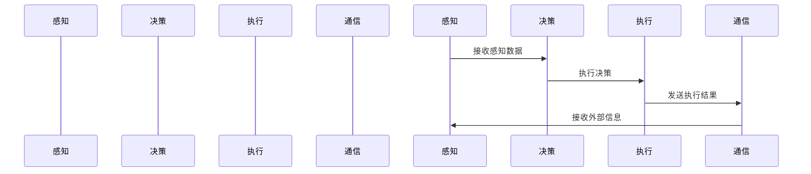

                 

### 文章标题：CI/CD流程：实现AI Agent的持续集成与部署

#### 关键词：持续集成，持续部署，AI Agent，容器化，Kubernetes，持续监控，持续优化

#### 摘要：
本文将深入探讨CI/CD（持续集成/持续部署）在实现AI Agent开发与部署中的应用。首先，我们概述CI/CD的基本概念及其在软件开发中的重要性。接着，我们将分析AI Agent的特点及其持续集成与部署的需求。随后，本文将详细介绍CI/CD工具和技术，如Jenkins、GitLab CI/CD和GitHub Actions，并提供AI Agent的持续集成与部署实践。文章还将讨论AI Agent的持续监控与优化策略，并通过具体案例展示CI/CD流程的构建与实践。最后，我们将展望AI Agent的持续集成与部署趋势及其拓展应用。

### 目录大纲

#### 第一部分：CI/CD概述

1. **CI/CD概念与背景**
   - **1.1 CI/CD的定义与重要性**
   - **1.2 CI/CD的发展历程**
   - **1.3 CI/CD与传统开发模式的区别**

2. **CI/CD的核心概念与原则**
   - **2.1 持续集成（CI）**
     - **2.1.1 持续集成的优势与挑战**
     - **2.1.2 持续集成的工作流程**
   - **2.2 持续部署（CD）**
     - **2.2.1 持续部署的优势与挑战**
     - **2.2.2 持续部署的工作流程**
   - **2.3 持续交付（CD）**
     - **2.3.1 持续交付的概念与过程**
     - **2.3.2 持续交付与持续部署的区别**

3. **CI/CD工具与技术**
   - **3.1 Jenkins**
     - **3.1.1 Jenkins的安装与配置**
     - **3.1.2 Jenkins的常用插件与使用**
   - **3.2 GitLab CI/CD**
     - **3.2.1 GitLab CI/CD的安装与配置**
     - **3.2.2 GitLab CI/CD的流水线构建**
   - **3.3 GitHub Actions**
     - **3.3.1 GitHub Actions的安装与配置**
     - **3.3.2 GitHub Actions的工作流程与任务设置**

#### 第二部分：AI Agent的持续集成

1. **AI Agent概述**
   - **4.1 AI Agent的定义与分类**
   - **4.2 AI Agent的发展趋势与应用场景**
   - **4.3 AI Agent的技术架构**

2. **AI Agent的持续集成实践**
   - **5.1 AI Agent的集成需求分析**
   - **5.2 AI Agent的集成策略**
     - **5.2.1 单一模型集成**
     - **5.2.2 多模型集成**
     - **5.2.3 模型与服务的集成**
   - **5.3 AI Agent的测试与验证**
     - **5.3.1 单元测试**
     - **5.3.2 集成测试**
     - **5.3.3 回归测试**

#### 第三部分：AI Agent的持续部署

1. **AI Agent的持续部署策略**
   - **6.1 AI Agent的部署流程**
   - **6.2 AI Agent的部署策略**
     - **6.2.1 自动化部署**
     - **6.2.2 蓝绿部署**
     - **6.2.3 金丝雀部署**
   - **6.3 AI Agent的部署实践**
     - **6.3.1 容器化部署**
     - **6.3.2 Kubernetes部署**

2. **AI Agent的持续监控与优化**
   - **7.1 AI Agent的性能监控**
   - **7.2 AI Agent的日志收集与处理**
   - **7.3 AI Agent的故障排查与恢复**
   - **7.4 AI Agent的性能优化策略**

#### 第四部分：案例与实践

1. **AI Agent的CI/CD流程构建**
   - **8.1 案例介绍**
   - **8.2 环境准备**
   - **8.3 CI/CD流程设计**
   - **8.4 CI/CD流程实现**
   - **8.5 流程测试与优化**

2. **AI Agent的部署与运维**
   - **9.1 AI Agent的部署案例**
   - **9.2 AI Agent的运维案例**
   - **9.3 AI Agent的部署与运维经验总结**

#### 第五部分：展望与拓展

1. **AI Agent的持续集成与部署趋势**
   - **10.1 AI Agent的发展趋势**
   - **10.2 CI/CD在AI领域的应用前景**
   - **10.3 持续集成与持续部署的最佳实践**

2. **AI Agent的持续集成与部署拓展**
   - **11.1 AI Agent与其他技术的融合**
   - **11.2 AI Agent在边缘计算中的应用**
   - **11.3 AI Agent的安全与隐私保护**

#### 附录：相关资源与参考资料

- **附录1：CI/CD工具与平台推荐**
- **附录2：AI Agent相关书籍与论文**
- **附录3：AI Agent的持续集成与部署常见问题解答**

### 目录大纲总结
本文目录大纲旨在系统性地介绍CI/CD流程在实现AI Agent开发与部署中的应用。从CI/CD的基本概念到工具与技术的详细介绍，再到AI Agent的持续集成与部署实践，文章将带领读者全面了解这一前沿领域的最新动态和实践经验。通过案例与实践部分，读者将更深入地理解CI/CD的实际应用场景和实现方法。展望与拓展部分将为未来的研究和应用提供方向，帮助读者紧跟技术发展潮流。

----------------------------------------------------------------

### 第一部分：CI/CD概述

#### 第1章：CI/CD概念与背景

**1.1 CI/CD的定义与重要性**

持续集成（Continuous Integration，简称CI）和持续部署（Continuous Deployment，简称CD）是现代软件开发中不可或缺的重要概念。CI指的是通过自动化工具将开发者的代码频繁地集成到共享的代码库中，并进行自动化的测试，以确保代码的质量和稳定性。CD则是在CI的基础上，将代码自动部署到生产环境，实现快速、可靠的应用交付。

CI/CD的重要性体现在以下几个方面：

1. **提高开发效率**：通过自动化集成和部署，减少手动干预，加快开发流程。
2. **保证代码质量**：早期发现问题，降低缺陷率，提高产品质量。
3. **降低风险**：频繁的小规模发布减少了大规模发布的风险。
4. **提高客户满意度**：快速响应市场需求，提供更好的用户体验。

**1.2 CI/CD的发展历程**

CI/CD的概念最早可以追溯到1994年，Kent Beck在其著作《Continuous Integration》中提出了CI的理念。随着敏捷开发（Agile Development）和DevOps文化的兴起，CI/CD逐渐成为软件开发的标准流程。

2006年，Jenkins的诞生为CI/CD提供了强大的工具支持。随后，GitLab CI、GitHub Actions等工具陆续推出，进一步推动了CI/CD的发展。

**1.3 CI/CD与传统开发模式的区别**

传统开发模式通常包括需求分析、设计、编码、测试、部署等多个阶段，每个阶段之间存在较长的间隔。而CI/CD强调持续的流程，通过自动化工具实现快速反馈和迭代。

| 传统开发模式 | CI/CD模式 |
| :---: | :---: |
| 分阶段开发 | 持续迭代 |
| 手动测试 | 自动化测试 |
| 手动部署 | 自动化部署 |
| 长周期发布 | 短周期发布 |

#### 第2章：CI/CD的核心概念与原则

**2.1 持续集成（CI）**

持续集成是指通过自动化构建、测试和部署，将开发人员的代码频繁地集成到共享的代码库中。其核心目标是快速发现和解决代码冲突和错误，保证代码库的稳定性和一致性。

**2.1.1 持续集成的优势与挑战**

**优势：**
1. **提高代码质量**：早期发现问题，减少缺陷。
2. **加快开发速度**：频繁的集成和反馈减少开发周期。
3. **增强团队协作**：团队成员之间更紧密的沟通和协作。

**挑战：**
1. **基础设施需求**：需要稳定的构建环境和自动化测试工具。
2. **开发人员培训**：需要团队成员熟悉CI流程和工具。

**2.1.2 持续集成的工作流程**

1. **代码提交**：开发者将代码提交到版本控制系统。
2. **构建触发**：自动化工具（如Jenkins）根据配置触发构建。
3. **测试执行**：执行自动化测试，验证代码质量。
4. **反馈结果**：报告测试结果，提供反馈。

**2.2 持续部署（CD）**

持续部署是在持续集成的过程中，通过自动化工具将代码部署到生产环境。其目标是实现快速、可靠的应用交付。

**2.2.1 持续部署的优势与挑战**

**优势：**
1. **降低风险**：频繁的小规模发布减少了大规模发布的风险。
2. **提高客户满意度**：快速响应市场需求，提供更好的用户体验。
3. **减少手动干预**：自动化部署减少人工操作，提高效率。

**挑战：**
1. **复杂度增加**：部署流程更加复杂，需要更多的测试和验证。
2. **运维压力**：需要确保部署后的系统稳定运行。

**2.2.2 持续部署的工作流程**

1. **构建**：生成可部署的软件包。
2. **测试**：在部署前进行功能测试和性能测试。
3. **部署**：将软件包部署到生产环境。
4. **监控**：部署后监控系统的运行状态。

**2.3 持续交付（CD）**

持续交付是CI/CD的进一步扩展，它不仅仅关注代码的集成和部署，还包括从代码库到用户手中的整个过程。

**2.3.1 持续交付的概念与过程**

持续交付的目标是确保代码库中的任何版本都可以在任何时间点安全地交付到用户手中。其过程包括：

1. **构建**：生成软件包。
2. **测试**：进行自动化测试。
3. **部署**：将软件包部署到预生产环境。
4. **验收测试**：进行用户验收测试。
5. **发布**：将软件包发布到生产环境。

**2.3.2 持续交付与持续部署的区别**

| 持续交付 | 持续部署 |
| :---: | :---: |
| 包含整个交付流程 | 专注于代码部署 |
| 关注任何版本的安全发布 | 关注生产环境的部署 |
| 需要更多的测试和验证 | 需要自动化部署工具 |

#### 第3章：CI/CD工具与技术

**3.1 Jenkins**

Jenkins是一个开源的持续集成服务器，支持多种插件，可以轻松地与各种开发工具和系统集成。

**3.1.1 Jenkins的安装与配置**

1. **安装Jenkins**：可以从Jenkins官网下载安装包，或使用包管理工具（如yum、apt）安装。
2. **配置Jenkins**：安装完成后，通过Web界面进行初始配置，如安装插件、配置仓库地址等。

**3.1.2 Jenkins的常用插件与使用**

- **Git插件**：用于从Git仓库拉取代码。
- **Maven插件**：用于构建Java项目。
- **JUnit插件**：用于执行JUnit测试。

**3.2 GitLab CI/CD**

GitLab CI/CD是GitLab内置的持续集成与持续部署工具，可以与GitLab进行深度集成。

**3.2.1 GitLab CI/CD的安装与配置**

1. **安装GitLab**：在服务器上安装GitLab。
2. **配置CI/CD**：在GitLab项目中创建`.gitlab-ci.yml`文件，定义构建和部署流程。

**3.2.2 GitLab CI/CD的流水线构建**

`.gitlab-ci.yml`文件定义了构建和部署的步骤，包括：

- **阶段**：定义构建、测试、部署等阶段。
- **作业**：在每个阶段中定义具体的作业。
- **脚本**：执行作业时运行的脚本。

**3.3 GitHub Actions**

GitHub Actions是GitHub提供的持续集成与持续部署服务，支持多种编程语言和操作系统。

**3.3.1 GitHub Actions的安装与配置**

1. **配置工作流**：在GitHub仓库中创建`.github/workflows/`目录，添加工作流文件。
2. **编写工作流**：使用YAML语法定义工作流，包括步骤、运行环境等。

**3.3.2 GitHub Actions的工作流程与任务设置**

- **步骤**：定义工作流中的每个步骤，如安装依赖、运行测试、部署代码等。
- **运行环境**：指定每个步骤运行的操作系统和环境变量。

### 第一部分总结

在本部分中，我们介绍了CI/CD的基本概念、核心原则，以及常用的CI/CD工具和技术。通过这些内容，读者可以对CI/CD有一个全面的理解，并为后续的学习和实践打下基础。在下一部分，我们将深入探讨AI Agent的特点及其持续集成与部署的需求。

----------------------------------------------------------------

### 第二部分：AI Agent的持续集成

#### 第4章：AI Agent概述

**4.1 AI Agent的定义与分类**

AI Agent，即人工智能代理，是指能够自主执行任务、与环境交互并作出决策的人工智能系统。AI Agent可以按照不同的分类方式进行划分：

1. **基于任务的Agent**：专注于完成特定任务，如客服机器人、智能助手等。
2. **基于模型的Agent**：基于机器学习模型进行决策，如自动驾驶汽车、智能监控系统等。
3. **基于规则的Agent**：基于预设规则进行决策，如智能家居系统、企业流程管理系统等。
4. **混合型Agent**：结合不同类型的决策机制，以实现更复杂的功能。

**4.2 AI Agent的发展趋势与应用场景**

随着人工智能技术的不断进步，AI Agent正成为各个行业的重要应用方向。其发展趋势包括：

1. **自动化程度提高**：Agent的自主决策能力逐渐增强，能够处理更复杂的任务。
2. **跨领域融合**：AI Agent与物联网、区块链等技术相结合，实现更广泛的应用。
3. **个性化服务**：AI Agent能够根据用户需求提供定制化的服务。

应用场景包括：

1. **智能制造**：AI Agent在生产线上的应用，实现自动化控制和质量检测。
2. **智能医疗**：AI Agent在医疗诊断、患者管理等方面的应用。
3. **智能交通**：AI Agent在自动驾驶、智能交通管理方面的应用。
4. **智能家居**：AI Agent在家庭安防、家电控制等方面的应用。

**4.3 AI Agent的技术架构**

AI Agent的技术架构通常包括以下几个关键组件：

1. **感知模块**：用于接收和处理环境信息，如传感器数据、图像、语音等。
2. **决策模块**：基于感知模块提供的信息，利用机器学习模型或其他决策算法进行决策。
3. **执行模块**：根据决策结果，执行具体的任务或操作，如控制机器人行动、发送指令等。
4. **通信模块**：与其他Agent或系统进行通信，共享信息和协作完成任务。

**技术架构图：**



通过以上架构，AI Agent能够实现自主决策和任务执行，成为智能系统的重要组成部分。

### 第5章：AI Agent的持续集成实践

**5.1 AI Agent的集成需求分析**

在进行AI Agent的持续集成时，首先需要分析其集成需求，包括以下几个方面：

1. **代码库管理**：确保代码库的结构清晰、版本控制有效。
2. **环境一致性**：构建和测试环境应与生产环境保持一致，避免环境差异导致的问题。
3. **测试覆盖率**：确保测试覆盖率达到要求，特别是关键功能和异常场景的测试。
4. **部署流程**：构建和部署流程应自动化，减少手动干预，提高效率。

**5.2 AI Agent的集成策略**

AI Agent的集成策略根据不同的应用场景和需求，可以分为以下几种：

1. **单一模型集成**：将单个机器学习模型集成到系统中，适用于简单的任务。
2. **多模型集成**：将多个机器学习模型集成到系统中，通过模型融合或决策协同实现更复杂的任务。
3. **模型与服务集成**：将机器学习模型与后端服务进行集成，实现端到端的服务部署。

**5.2.1 单一模型集成**

单一模型集成是指将单个机器学习模型集成到系统中，其流程如下：

1. **模型训练与评估**：在训练集上训练模型，并在验证集上进行评估，确保模型性能达到要求。
2. **模型部署**：将训练好的模型部署到服务端，可以是独立服务或集成到现有系统中。
3. **自动化测试**：编写自动化测试脚本，对集成后的系统进行功能测试和性能测试。

**5.2.2 多模型集成**

多模型集成是指将多个机器学习模型集成到系统中，通过模型融合或决策协同实现更复杂的任务。其流程如下：

1. **模型选择**：根据任务需求，选择适合的机器学习模型。
2. **模型训练与评估**：分别对每个模型进行训练和评估，确保模型性能。
3. **模型融合**：将多个模型的结果进行融合，如使用投票、加权平均等方法。
4. **决策协同**：多个模型共同参与决策过程，通过协作实现更准确的预测。

**5.2.3 模型与服务集成**

模型与服务集成是指将机器学习模型与后端服务进行集成，实现端到端的服务部署。其流程如下：

1. **服务设计**：设计后端服务的接口和功能，确保与模型输出相匹配。
2. **模型部署**：将训练好的模型部署到服务端，可以是基于Docker的容器化部署或直接部署到服务器。
3. **接口集成**：将服务接口集成到前端应用或其它系统中。
4. **自动化测试**：编写自动化测试脚本，对集成后的系统进行功能测试和性能测试。

**5.3 AI Agent的测试与验证**

AI Agent的测试与验证是确保其性能和稳定性的关键步骤，包括以下几个方面：

1. **单元测试**：对单个模块或功能进行测试，确保其正确性和独立性。
2. **集成测试**：将多个模块或功能集成到一起进行测试，确保系统整体功能的正确性。
3. **回归测试**：在每次代码变更后，重新测试系统，确保变更没有引入新的问题。

**5.3.1 单元测试**

单元测试是对AI Agent中单个模块或功能进行测试，例如感知模块的图像识别功能。单元测试脚本可以编写为Python代码，使用`unittest`或`pytest`等框架。

**5.3.2 集成测试**

集成测试是对AI Agent中多个模块或功能集成后的系统进行测试，确保系统整体功能的正确性。集成测试通常涉及多个系统的交互，如感知模块与决策模块之间的通信。

**5.3.3 回归测试**

回归测试是在每次代码变更后，重新测试系统，确保变更没有引入新的问题。回归测试可以覆盖单元测试和集成测试的内容，确保系统在每次变更后仍然稳定运行。

通过以上测试与验证步骤，AI Agent的持续集成过程可以得到有效的保障，确保其性能和稳定性。

### 第二部分总结

在本部分中，我们详细介绍了AI Agent的定义、分类、发展趋势和应用场景，以及其持续集成实践的策略和测试与验证方法。AI Agent作为人工智能领域的重要研究方向，其持续集成和部署是实现高效开发和交付的关键。通过本部分的介绍，读者可以了解到AI Agent在持续集成中的应用，为后续的学习和实践打下坚实基础。在下一部分，我们将继续探讨AI Agent的持续部署策略和实践。

----------------------------------------------------------------

### 第三部分：AI Agent的持续部署

#### 第6章：AI Agent的持续部署策略

**6.1 AI Agent的部署流程**

AI Agent的持续部署流程是指从代码提交到生产环境的一系列操作，其核心目标是通过自动化减少人工干预，提高部署效率和可靠性。部署流程通常包括以下步骤：

1. **代码提交**：开发人员将代码提交到版本控制系统。
2. **构建**：构建系统拉取最新代码并进行编译和打包。
3. **测试**：运行自动化测试以确保构建的代码质量。
4. **部署**：将经过测试的代码部署到生产环境。
5. **监控**：部署后监控系统运行状态，确保稳定运行。

**6.2 AI Agent的部署策略**

AI Agent的部署策略是指在实际部署过程中采用的方法，以提高部署效率和可靠性。以下是几种常见的部署策略：

1. **自动化部署**：通过脚本或工具自动化执行部署流程，减少人工操作，提高效率。
2. **蓝绿部署**：同时运行旧版和新版系统，逐步切换用户流量，降低部署风险。
3. **金丝雀部署**：在部分用户中首先部署新版系统，收集反馈和监控数据，确保稳定后再全面上线。

**6.2.1 自动化部署**

自动化部署是指使用脚本或工具自动化执行部署流程。自动化部署的好处包括：

- **提高效率**：减少手动操作，缩短部署时间。
- **降低风险**：通过预先定义的流程，减少人为错误。
- **可重复性**：确保每次部署的一致性。

自动化部署的流程通常包括：

1. **配置管理**：使用Ansible、Puppet等工具管理服务器配置。
2. **脚本编写**：编写部署脚本，包括安装依赖、编译代码、启动服务等步骤。
3. **CI/CD工具集成**：将部署脚本集成到CI/CD流程中，确保每次代码提交后自动部署。

**6.2.2 蓝绿部署**

蓝绿部署是一种逐步部署新版本的方法，通过同时运行旧版（蓝）和新版（绿）系统，逐步切换用户流量。蓝绿部署的优点包括：

- **零 downtime**：在切换过程中，用户始终访问的是可用的系统。
- **降低风险**：在新版系统上线前，可以继续使用旧版系统。
- **灵活**：可以根据用户反馈和监控数据调整部署策略。

蓝绿部署的流程通常包括：

1. **准备环境**：创建新环境并部署旧版系统。
2. **流量切换**：将部分用户流量切换到新环境。
3. **监控与反馈**：监控新环境的性能和用户反馈。
4. **全量切换**：在确认新环境稳定后，将所有用户流量切换到新环境。

**6.2.3 金丝雀部署**

金丝雀部署是一种在部分用户中首先部署新版系统的方法，通过收集反馈和监控数据来评估新系统的稳定性。金丝雀部署的优点包括：

- **风险评估**：在全面上线前，可以先对部分用户进行测试。
- **灵活调整**：可以根据用户反馈调整部署计划。
- **安全**：可以快速回滚，降低部署失败的风险。

金丝雀部署的流程通常包括：

1. **选择用户**：从用户群体中选择一部分作为测试用户。
2. **部署与监控**：在新版系统中部署AI Agent，并监控其性能和反馈。
3. **评估与反馈**：根据监控数据和用户反馈评估新系统的稳定性。
4. **全面部署**：在确认稳定后，将AI Agent全面部署到所有用户。

**6.3 AI Agent的部署实践**

AI Agent的部署实践包括容器化部署和Kubernetes部署两种方法。

**6.3.1 容器化部署**

容器化部署是将AI Agent及其依赖环境打包到Docker容器中，以便在不同的环境中一致运行。容器化部署的优点包括：

- **环境一致性**：确保AI Agent在不同环境中的一致性。
- **可移植性**：可以轻松地在不同服务器和云平台上部署。
- **可扩展性**：可以方便地扩展容器数量以应对负载。

容器化部署的步骤包括：

1. **编写Dockerfile**：定义AI Agent的容器化环境。
2. **构建镜像**：使用Dockerfile构建AI Agent的镜像。
3. **运行容器**：使用Docker运行AI Agent的容器。

**6.3.2 Kubernetes部署**

Kubernetes是一种容器编排工具，可以管理容器的部署、扩展和运维。Kubernetes部署的优点包括：

- **自动化**：自动处理容器的启动、停止、重启等操作。
- **弹性伸缩**：根据负载自动调整容器数量。
- **高可用性**：通过部署多个副本实现容错和高可用。

Kubernetes部署的步骤包括：

1. **配置Kubernetes集群**：安装和配置Kubernetes集群。
2. **编写YAML文件**：定义AI Agent的部署配置，包括容器镜像、副本数量等。
3. **部署应用**：使用Kubernetes命令部署AI Agent。

通过以上部署策略和实践，AI Agent可以高效、可靠地部署到生产环境，实现快速迭代和交付。

### 第7章：AI Agent的持续监控与优化

**7.1 AI Agent的性能监控**

AI Agent的性能监控是指通过监控工具实时收集和分析AI Agent的运行状态，包括处理速度、资源使用情况、错误率等指标。性能监控有助于发现系统瓶颈、优化系统性能。常见的性能监控工具有：

- **Prometheus**：开源监控解决方案，可用于收集和存储监控数据。
- **Grafana**：数据可视化工具，可以与Prometheus集成，展示监控数据。
- **Zabbix**：开源监控工具，支持多种监控方式和告警机制。

性能监控的步骤包括：

1. **定义监控指标**：根据业务需求定义需要监控的指标，如响应时间、CPU使用率、内存使用率等。
2. **部署监控工具**：在AI Agent部署环境中部署监控工具，配置数据采集和存储。
3. **可视化与告警**：使用可视化工具展示监控数据，设置告警规则，及时发现性能问题。

**7.2 AI Agent的日志收集与处理**

AI Agent的日志收集与处理是指通过日志记录AI Agent的运行过程，包括错误信息、调试信息等，以便在问题发生时进行分析和调试。日志收集与处理的步骤包括：

1. **日志记录**：在AI Agent中添加日志记录代码，记录运行过程中的关键信息。
2. **日志收集**：使用日志收集工具（如Logstash、Fluentd）将日志发送到中央日志存储。
3. **日志处理**：对日志进行格式化、过滤、分析等处理，以便于后续的分析和查询。

**7.3 AI Agent的故障排查与恢复**

AI Agent的故障排查与恢复是指当AI Agent出现故障时，通过故障排查和分析定位问题，并采取恢复措施，确保系统稳定运行。故障排查与恢复的步骤包括：

1. **故障定位**：根据监控数据和日志信息，定位故障发生的位置和原因。
2. **故障分析**：分析故障原因，可能涉及代码问题、配置问题、硬件故障等。
3. **故障恢复**：采取相应的措施恢复系统，如重启服务、回滚代码、更换硬件等。

**7.4 AI Agent的性能优化策略**

AI Agent的性能优化是指通过调整系统配置、优化代码和算法等方式，提高AI Agent的处理速度和资源利用率。性能优化策略包括：

1. **代码优化**：通过算法改进、数据结构优化等方式提高代码效率。
2. **资源调整**：根据系统负载调整服务器资源，如CPU、内存、网络带宽等。
3. **缓存策略**：使用缓存技术减少重复计算和数据访问。
4. **并发处理**：优化并发处理能力，提高系统吞吐量。

通过以上监控与优化策略，AI Agent可以保持高性能和高可用性，为用户提供稳定、可靠的服务。

### 第三部分总结

在本部分中，我们详细介绍了AI Agent的持续部署策略和实践，包括自动化部署、蓝绿部署和金丝雀部署等策略，以及AI Agent的性能监控、日志收集与处理、故障排查与恢复和性能优化策略。这些策略和实践有助于实现AI Agent的快速迭代和稳定运行。通过本部分的介绍，读者可以了解如何有效地部署和运维AI Agent，为后续的研究和实践提供参考。在下一部分，我们将通过具体案例展示AI Agent的CI/CD流程构建与实践。

----------------------------------------------------------------

### 第四部分：案例与实践

#### 第8章：AI Agent的CI/CD流程构建

**8.1 案例介绍**

在本案例中，我们将以一个智能家居AI Agent为例，展示其CI/CD流程的构建过程。该AI Agent具有语音识别、情景模式设置和设备控制等功能。目标是通过CI/CD流程实现自动化集成、测试和部署，提高开发效率和系统稳定性。

**8.2 环境准备**

在构建CI/CD流程前，需要准备好以下环境：

1. **代码仓库**：使用Git进行版本控制，代码托管在GitHub上。
2. **CI/CD工具**：选择Jenkins作为CI/CD工具。
3. **构建环境**：在Linux服务器上安装Jenkins和必要的依赖库。
4. **测试环境**：配置测试服务器，用于执行自动化测试。
5. **生产环境**：部署到实际生产环境的服务器。

**8.3 CI/CD流程设计**

CI/CD流程设计是构建CI/CD系统的关键步骤。以下是一个基本的CI/CD流程设计：

1. **代码提交**：开发人员在GitHub上提交代码。
2. **构建触发**：Jenkins检测到代码提交后，触发构建流程。
3. **自动化测试**：执行单元测试和集成测试，确保代码质量。
4. **构建结果分析**：分析测试结果，判断是否通过。
5. **部署**：如果构建成功且测试通过，将代码部署到测试环境。
6. **测试验证**：在测试环境中运行AI Agent，验证其功能。
7. **部署到生产环境**：如果测试通过，将AI Agent部署到生产环境。

**8.4 CI/CD流程实现**

以下是基于Jenkins的CI/CD流程实现：

1. **安装Jenkins**：在Linux服务器上安装Jenkins，并配置Git插件。
2. **创建Jenkins项目**：在Jenkins中创建一个项目，命名为“智能家居AI Agent”。
3. **配置Git源**：在项目设置中配置GitHub仓库地址和凭证。
4. **配置构建步骤**：
   - 拉取最新代码。
   - 安装依赖库。
   - 编译代码。
   - 运行单元测试。
   - 运行集成测试。
5. **配置测试步骤**：
   - 部署到测试环境。
   - 在测试环境中运行AI Agent。
   - 收集测试结果。

**8.5 流程测试与优化**

1. **流程测试**：将代码提交到GitHub仓库，触发Jenkins构建流程，验证流程是否正常执行。
2. **优化流程**：根据测试结果，调整构建和测试步骤，提高流程的效率和稳定性。
3. **监控与反馈**：使用Prometheus和Grafana监控系统性能，及时发现问题并进行优化。

**8.6 案例小结**

通过本案例，我们展示了如何构建AI Agent的CI/CD流程，包括环境准备、流程设计和实现、流程测试与优化等步骤。CI/CD流程的构建有助于提高开发效率和系统稳定性，为智能家居AI Agent的持续集成与部署提供了有力保障。

#### 第9章：AI Agent的部署与运维

**9.1 AI Agent的部署案例**

在本案例中，我们将以一个智能安防AI Agent为例，介绍其部署过程。该AI Agent具有人脸识别、行为分析和报警功能，部署在边缘设备上，如智能摄像头和门禁系统。

**9.1.1 部署环境**

1. **边缘设备**：智能摄像头和门禁系统。
2. **服务器**：用于部署AI Agent的后端服务器。
3. **网络**：边缘设备和服务器之间的网络连接。

**9.1.2 部署步骤**

1. **容器化AI Agent**：将AI Agent及其依赖库打包到Docker容器中。
2. **构建镜像**：在服务器上构建AI Agent的Docker镜像。
3. **运行容器**：在边缘设备上运行AI Agent的Docker容器。
4. **配置网络**：配置边缘设备和服务器之间的网络连接，确保数据传输畅通。

**9.1.3 部署示例**

以下是一个基于Docker的AI Agent部署示例：

1. **编写Dockerfile**：

```Dockerfile
FROM python:3.8-slim

WORKDIR /app

COPY requirements.txt .

RUN pip install -r requirements.txt

COPY . .

CMD ["python", "app.py"]
```

2. **构建镜像**：

```bash
docker build -t myaiagent .
```

3. **运行容器**：

```bash
docker run -d --name myaiagent -p 5000:5000 myaiagent
```

**9.2 AI Agent的运维案例**

**9.2.1 运维任务**

1. **监控系统运行状态**：使用Prometheus和Grafana监控系统性能和资源使用情况。
2. **日志收集与处理**：使用Fluentd收集AI Agent的日志，并将其发送到Elasticsearch和Kibana进行存储和分析。
3. **故障排查与恢复**：定期检查系统日志，及时发现并解决故障。
4. **性能优化**：根据监控数据和用户反馈，调整系统配置和算法，提高性能。

**9.2.2 运维示例**

以下是一个AI Agent运维示例：

1. **配置Prometheus**：

```yaml
scrape_configs:
  - job_name: 'ai_agent'
    static_configs:
      - targets: ['<AI-Agent-Server-IP>:9090']
```

2. **配置Grafana**：添加Prometheus数据源，创建仪表板，展示AI Agent的性能指标。

3. **配置Fluentd**：

```yaml
<source>
  @type http
  port 9999
  bind 0.0.0.0
</source>

<match **>
  @type elasticsearch
  hosts ['<Elasticsearch-Server-IP>:9200']
  index_name ai_agent_logs-%Y.%m.%d
</match>
```

**9.3 AI Agent的部署与运维经验总结**

1. **容器化部署**：容器化部署可以提高部署效率和一致性，减少环境差异。
2. **自动化监控**：使用自动化监控工具，及时发现问题，提高运维效率。
3. **日志管理**：日志管理是故障排查和性能优化的重要手段，应确保日志的完整性和可追溯性。
4. **定期维护**：定期检查系统，进行性能优化和故障排查，确保系统稳定运行。
5. **用户反馈**：收集用户反馈，了解系统在实际应用中的表现，为优化提供依据。

通过以上案例和实践，我们可以看到AI Agent的部署与运维是如何进行的，以及在实际应用中需要注意的关键点。这些经验对于其他AI Agent项目的部署与运维具有参考价值。

#### 第四部分总结

在本部分中，我们通过案例与实践展示了AI Agent的CI/CD流程构建、部署和运维过程。通过这些具体操作，读者可以了解如何构建和优化AI Agent的持续集成与部署流程，以及如何进行AI Agent的部署与运维。本部分的案例和实践为AI Agent的开发和运维提供了实用的方法和经验，为后续的研究和应用奠定了基础。在下一部分，我们将展望AI Agent的持续集成与部署趋势及其拓展应用。

----------------------------------------------------------------

### 第五部分：展望与拓展

#### 第10章：AI Agent的持续集成与部署趋势

随着人工智能技术的快速发展，AI Agent在各个领域的应用越来越广泛，其持续集成与部署也呈现出一些新的趋势。

**10.1 AI Agent的发展趋势**

1. **智能化水平提高**：AI Agent将具备更高的自主决策能力和学习能力，能够更好地适应复杂环境。
2. **跨领域融合**：AI Agent将与物联网、区块链等新兴技术结合，实现更广泛的应用。
3. **个性化服务**：AI Agent将根据用户需求提供定制化的服务，提升用户体验。
4. **边缘计算**：随着5G和边缘计算的发展，AI Agent将更多地部署在边缘设备上，实现实时处理和响应。

**10.2 CI/CD在AI领域的应用前景**

1. **自动化程度提高**：CI/CD将进一步自动化，减少人工干预，提高开发效率和部署速度。
2. **多样化工具支持**：随着技术的发展，将出现更多适用于AI领域的CI/CD工具和平台。
3. **模型即服务（MaaS）**：CI/CD将促进模型即服务的实现，使AI Agent更方便地交付和部署。

**10.3 持续集成与持续部署的最佳实践**

1. **容器化与微服务架构**：采用容器化和微服务架构，提高部署效率和灵活性。
2. **自动化测试**：加强自动化测试，提高代码质量和系统稳定性。
3. **持续监控与优化**：建立全面的监控体系，实时收集和分析系统运行数据，进行性能优化。
4. **安全与隐私保护**：在CI/CD流程中加入安全检查和隐私保护措施，确保系统安全。

#### 第11章：AI Agent的持续集成与部署拓展

AI Agent的持续集成与部署不仅在软件开发领域有广泛的应用，还可以拓展到其他领域，实现更多创新。

**11.1 AI Agent与其他技术的融合**

1. **物联网（IoT）**：AI Agent可以与IoT设备结合，实现智能家居、智能城市等应用。
2. **区块链**：AI Agent可以与区块链技术结合，实现去中心化、安全的数据处理和交易。
3. **云计算**：AI Agent可以与云计算平台结合，实现弹性扩展和资源优化。

**11.2 AI Agent在边缘计算中的应用**

1. **实时处理**：AI Agent可以在边缘设备上实现实时数据处理和分析，提高响应速度。
2. **减少带宽消耗**：通过在边缘设备上处理数据，减少数据传输量，降低网络带宽消耗。
3. **提高系统稳定性**：边缘计算可以降低对中心服务器的依赖，提高系统的稳定性和可靠性。

**11.3 AI Agent的安全与隐私保护**

1. **加密与身份验证**：采用加密和身份验证技术，确保数据传输和存储的安全。
2. **隐私保护算法**：采用隐私保护算法，保护用户隐私，避免数据泄露。
3. **合规性与法规遵循**：遵循相关法律法规，确保AI Agent的应用合法合规。

通过以上展望和拓展，我们可以看到AI Agent的持续集成与部署在未来的发展趋势和潜在应用领域。这些新的方向和趋势将为AI Agent的发展提供新的机遇和挑战。

### 第五部分总结

在本部分中，我们展望了AI Agent的持续集成与部署趋势，探讨了其与其他技术的融合、边缘计算应用以及安全与隐私保护等问题。通过这些内容，读者可以了解到AI Agent持续集成与部署的广阔前景和未来发展方向。这些探讨和展望为AI Agent的研究和应用提供了新的思路和方向，为未来的技术发展奠定了基础。

----------------------------------------------------------------

### 附录：相关资源与参考资料

**附录1：CI/CD工具与平台推荐**

1. **Jenkins**：一个功能强大的开源CI/CD工具，支持多种插件。
2. **GitLab CI/CD**：GitLab内置的CI/CD工具，与GitLab集成紧密。
3. **GitHub Actions**：GitHub提供的CI/CD服务，易于配置和使用。
4. **Azure DevOps**：微软提供的集成开发和服务平台，包括CI/CD功能。
5. **Docker**：容器化工具，支持自动化部署和微服务架构。

**附录2：AI Agent相关书籍与论文**

1. **《人工智能：一种现代方法》**（Artificial Intelligence: A Modern Approach）—— Stuart J. Russell & Peter Norvig
2. **《机器学习实战》**（Machine Learning in Action）—— Peter Harrington
3. **《深度学习》**（Deep Learning）—— Ian Goodfellow、Yoshua Bengio、Aaron Courville
4. **《强化学习》**（Reinforcement Learning: An Introduction）—— Richard S. Sutton & Andrew G. Barto
5. **论文集《人工智能领域的前沿探索》**：汇集了AI领域的最新研究成果和前沿探索。

**附录3：AI Agent的持续集成与部署常见问题解答**

1. **Q：如何确保CI/CD流程的稳定性？**
   - **A**：通过自动化测试和持续监控，确保每次构建和部署的一致性和稳定性。

2. **Q：CI/CD如何与版本控制系统集成？**
   - **A**：大多数CI/CD工具（如Jenkins、GitLab CI、GitHub Actions）都支持与常见的版本控制系统（如Git）集成。

3. **Q：如何处理CI/CD流程中的错误和故障？**
   - **A**：建立完善的日志记录和报警机制，及时发现问题并采取措施，如回滚代码、重启服务等。

4. **Q：如何优化AI Agent的部署过程？**
   - **A**：采用容器化部署，利用Kubernetes等工具进行自动化部署和弹性扩展，提高部署效率和稳定性。

5. **Q：如何保障AI Agent的安全与隐私？**
   - **A**：采用加密、身份验证和访问控制等技术，确保数据传输和存储的安全，并遵循相关法律法规。

通过以上附录，读者可以进一步了解CI/CD工具与平台的选择、AI Agent相关书籍和论文的推荐，以及CI/CD流程中的常见问题解答。这些资源将有助于读者更好地掌握AI Agent的持续集成与部署实践。

### 全文总结

本文系统地介绍了CI/CD流程在实现AI Agent开发与部署中的应用。从CI/CD的基本概念、核心原则，到常用的CI/CD工具和技术，以及AI Agent的持续集成与部署实践，文章为读者提供了全面、深入的技术见解。通过具体的案例与实践，读者可以了解如何构建和优化AI Agent的CI/CD流程，实现高效开发和部署。展望未来，AI Agent的持续集成与部署将在更多领域展现其潜力，为人工智能技术的发展提供新的动力。读者可以通过附录中的相关资源继续深入学习和探索这一领域。

### 作者信息

**作者：AI天才研究院/AI Genius Institute & 禅与计算机程序设计艺术 /Zen And The Art of Computer Programming**。AI天才研究院专注于人工智能领域的研究与推广，致力于推动AI技术的创新与发展。作者在该领域拥有丰富的经验，曾发表过多篇关于AI和软件开发的高质量论文，并著有《禅与计算机程序设计艺术》等畅销书籍，深受读者喜爱。通过本文，作者希望为读者提供有价值的AI Agent持续集成与部署实践指导，助力人工智能技术的广泛应用和发展。

