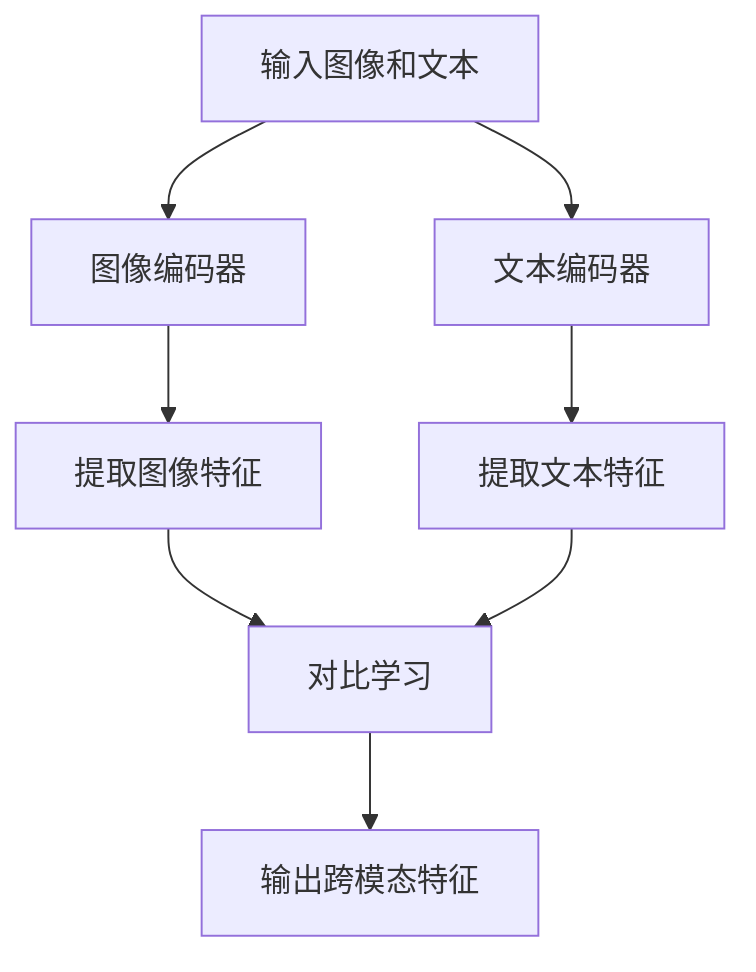
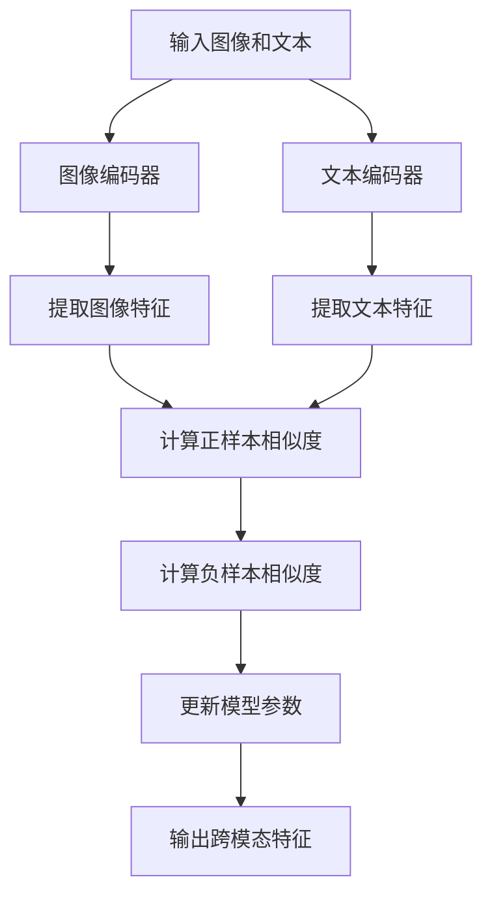

                 


# CLIP模型：实现AI Agent的跨模态理解

## 关键词

- CLIP模型
- 跨模态理解
- 对比学习
- 图像编码器
- 文本编码器
- 图像与文本关联

## 摘要

本文深入探讨了CLIP（Contrastive Language-Image Pre-training）模型，这是一种先进的AI模型，旨在通过对比学习实现图像与文本的跨模态理解。文章首先概述了CLIP模型的问题背景和核心解决思路，然后详细介绍了CLIP模型的原理、实现方法和数学模型。通过一步步的分析和举例，本文帮助读者理解CLIP模型的内部工作机制，并探讨了其应用前景。

### 第1章: CLIP模型概述

#### 1.1 问题背景

随着人工智能的快速发展，图像理解和文本理解在多个领域取得了显著成果。然而，现有的技术往往将图像和文本视为分离的模态，导致它们难以在跨模态交互中实现有效的协同工作。例如，在问答系统中，用户可能会上传一张图片并询问相关问题，而现有的系统往往无法很好地结合图像和文本信息来提供准确的答案。这种现象不仅限制了AI应用的范围，也阻碍了人工智能的自然交互能力的发展。

为了解决这一问题，研究人员提出了CLIP模型。CLIP模型通过对比学习机制，将图像和文本特征进行关联，从而实现了跨模态的理解能力。这种模型的核心思想是，通过对大规模跨模态数据集的训练，使模型能够自动学习图像和文本之间的内在联系。

#### 1.2 问题解决

CLIP模型利用大规模跨模态数据集进行训练，这些数据集包含了大量的图像和对应的描述文本。模型通过对比学习机制，使得图像编码器和文本编码器的特征能够相互关联，从而提高了模型对跨模态数据的理解能力。具体来说，模型通过对比图像特征和文本特征的正样本和负样本，强化了它们之间的一致性。

这种对比学习的机制使得CLIP模型在多个任务上表现出色，例如图像识别、文本分类、问答系统等。通过跨模态理解，模型能够更好地处理复杂的任务，提供更准确的结果。

#### 1.3 边界与外延

CLIP模型的适用范围主要是在需要跨模态理解和交互的场景中，例如图像识别和文本描述匹配、图像和文本分类等。然而，CLIP模型也存在一定的局限性。首先，模型对数据集的质量和规模要求较高，这限制了模型在实际应用中的推广。其次，模型在处理极端情况时的表现可能不够理想，例如对于完全未见过的新模态数据的处理能力。

与传统的跨模态模型相比，CLIP模型通过对比学习实现了更自然的跨模态关联，具有更高的灵活性和适应性。然而，传统的模型在特定任务上可能具有更好的表现，因此CLIP模型并不是适用于所有场景的最佳选择。

#### 1.4 概念结构与核心要素组成

CLIP模型的核心要素包括大规模跨模态数据集、编码器-解码器结构以及对比学习机制。数据集是模型的训练基础，编码器负责提取图像和文本的特征，解码器则将这些特征转换为可用的信息。对比学习机制则是模型的核心，通过对比图像和文本特征的正负样本，模型能够学习到跨模态的关联。

在数据集方面，CLIP模型通常使用ImageNet和COCO等大规模图像数据集，以及相应的文本描述数据集。这些数据集包含了丰富的图像和对应的文本描述，为模型提供了充足的学习资源。

在模型架构方面，CLIP模型采用编码器-解码器结构。编码器包括图像编码器和文本编码器，分别负责提取图像和文本的特征。解码器则将提取到的特征转换为可用的信息，例如图像分类结果或文本摘要。

在对比学习机制方面，CLIP模型通过对比图像特征和文本特征的正负样本，使得模型能够学习到跨模态的关联。正样本通常是一对图像和文本描述，负样本则是图像和文本描述的不同对。模型通过最大化正样本的相似度，最小化负样本的相似度，实现了跨模态的理解能力。

### 第2章: CLIP模型原理

#### 2.1 核心概念原理

CLIP模型的核心在于其跨模态理解能力，这主要通过图像编码器、文本编码器和对比学习机制来实现。图像编码器负责将输入的图像转化为特征向量，文本编码器则将输入的文本转化为特征向量。对比学习机制通过对比图像和文本特征的正负样本，强化了跨模态特征的一致性。

图像编码器通常采用卷积神经网络（CNN）架构，这种架构能够有效地提取图像中的视觉特征。文本编码器则采用Transformer架构，这种架构能够更好地处理文本的序列信息。通过对图像和文本特征进行编码，模型能够将不同模态的数据转化为具有共性的特征表示。

对比学习机制的核心在于正负样本的对比。在训练过程中，模型会随机选择图像和文本的正样本对和负样本对。正样本对通常是一对图像和对应的文本描述，负样本对则是图像和文本描述的不同对。模型通过计算正样本对的相似度，同时减小负样本对的相似度，从而学习到跨模态的关联。

#### 2.2 概念属性特征对比表格

| 特征 | 图像编码器 | 文本编码器 |
| --- | --- | --- |
| 特征提取 | 空间信息 | 语言信息 |
| 特征维度 | 高维 | 低维 |
| 处理能力 | 图像理解 | 文本理解 |

在这张表格中，我们可以看到图像编码器和文本编码器在特征提取、特征维度和数据处理能力上的区别。图像编码器主要负责提取图像中的空间信息，而文本编码器则负责提取语言信息。在特征维度方面，图像编码器的特征通常维度较高，而文本编码器的特征维度较低。在数据处理能力方面，图像编码器更适合处理图像理解任务，而文本编码器更适合处理文本理解任务。

#### 2.3 ER实体关系图架构

```mermaid
erDiagram
  Image : <<entity>> 图像 \
  Text : <<entity>> 文本 \
  ClipModel : <<entity>> CLIP模型

  Image ||--|{ ClipModel }|
  Text ||--|{ ClipModel }|
```

在这张ER实体关系图中，我们定义了三个实体：Image（图像）、Text（文本）和ClipModel（CLIP模型）。图像和文本都是ClipModel的关联实体，它们通过ClipModel进行跨模态的理解和交互。这种实体关系图帮助我们清晰地理解了CLIP模型的结构和功能。

### 第3章: CLIP模型实现

#### 3.1 算法原理讲解

CLIP模型的算法原理可以分为三个主要步骤：图像编码、文本编码和对比学习。

首先，图像编码器使用卷积神经网络（CNN）对输入图像进行编码，得到图像特征向量。文本编码器则使用Transformer对输入文本进行编码，得到文本特征向量。这两个编码器分别负责提取图像和文本的特征。

其次，对比学习机制通过对比图像和文本特征的正负样本，强化跨模态特征的一致性。在训练过程中，模型会随机选择图像和文本的正样本对和负样本对。对于正样本对，模型希望它们之间的相似度较高；对于负样本对，模型希望它们之间的相似度较低。

最后，通过最大化正样本对的相似度和最小化负样本对的相似度，模型能够学习到图像和文本之间的内在关联，从而实现跨模态理解。

为了更直观地展示算法原理，我们使用Mermaid绘制了算法流程图：



在这张流程图中，A表示输入的图像和文本，B和C分别表示图像编码器和文本编码器，D和E表示提取到的图像特征和文本特征，F表示对比学习过程，G表示输出的跨模态特征。

#### 3.2 数学模型和数学公式

CLIP模型的数学模型主要基于对比学习机制。对比学习的目标是最小化正负样本对之间的相似度差异。具体来说，CLIP模型的损失函数可以表示为：

$$
J = -\log P(\text{positive}|\text{image}, \text{text}) + \sum_{\text{negative}} -\log P(\text{negative}|\text{image}, \text{text})
$$

其中，$P(\text{positive}|\text{image}, \text{text})$表示正样本对的相似度，$P(\text{negative}|\text{image}, \text{text})$表示负样本对的相似度。

为了更好地理解这个公式，我们可以将其分解为两个部分：

1. 正样本相似度：公式中的第一部分$-\log P(\text{positive}|\text{image}, \text{text})$表示正样本对的相似度。这里，$P(\text{positive}|\text{image}, \text{text})$是一个概率值，表示图像和文本描述之间的相似度。模型的目标是最大化这个概率值，即让图像和文本描述的相似度尽可能高。

2. 负样本相似度：公式中的第二部分$\sum_{\text{negative}} -\log P(\text{negative}|\text{image}, \text{text})$表示负样本对的相似度。这里，$P(\text{negative}|\text{image}, \text{text})$也是一个概率值，表示图像和文本描述之间的相似度。模型的目标是最小化这个概率值，即让图像和文本描述的相似度尽可能低。

通过最大化正样本相似度和最小化负样本相似度，模型能够学习到图像和文本之间的内在关联。

#### 3.3 算法举例说明

为了更直观地理解CLIP模型的算法原理，我们可以通过一个具体的例子来说明。

假设我们有以下数据对：

- 正样本对：图像为一张猫的图片，文本描述为“一只可爱的小猫在玩耍”。
- 负样本对1：图像为一张狗的图片，文本描述为“一只可爱的小猫在玩耍”。
- 负样本对2：图像为一张猫的图片，文本描述为“一只可爱的小狗在玩耍”。

在这些数据对中，正样本对表示图像和文本描述是相关的，而负样本对表示图像和文本描述是无关的。

在训练过程中，CLIP模型会通过对比学习机制，最大化正样本对的相似度，同时最小化负样本对的相似度。具体来说：

1. 对于正样本对，模型希望图像和文本描述的相似度尽可能高。因此，模型会尝试调整图像编码器和文本编码器的参数，使得它们提取到的特征向量尽可能接近。

2. 对于负样本对，模型希望图像和文本描述的相似度尽可能低。因此，模型会尝试调整图像编码器和文本编码器的参数，使得它们提取到的特征向量尽可能远离。

通过这种方式，模型能够学习到图像和文本之间的内在关联，从而实现跨模态理解。

#### 3.4 算法流程图

为了更清晰地展示CLIP模型的算法流程，我们使用Mermaid绘制了算法流程图：



在这张流程图中，A表示输入的图像和文本，B和C分别表示图像编码器和文本编码器，D和E表示提取到的图像特征和文本特征，F表示计算正样本相似度，G表示计算负样本相似度，H表示更新模型参数，I表示输出的跨模态特征。

#### 3.5 算法实现

为了实现CLIP模型，我们可以使用Python编写相应的代码。以下是一个简单的算法实现示例：

```python
import torch
import torch.nn as nn
import torchvision.models as models
import transformers

class CLIPModel(nn.Module):
    def __init__(self):
        super(CLIPModel, self).__init__()
        # 使用预训练的ResNet模型作为图像编码器
        self.image_encoder = models.resnet18(pretrained=True)
        # 使用预训练的BERT模型作为文本编码器
        self.text_encoder = transformers.BertModel.from_pretrained('bert-base-uncased')
        # 定义对比学习损失函数
        self.criterion = nn.CrossEntropyLoss()

    def forward(self, image, text):
        # 提取图像特征
        image_features = self.image_encoder(image)
        # 提取文本特征
        text_features = self.text_encoder(text)
        # 计算正样本相似度
        positive_similarity = torch.cosine_similarity(image_features, text_features)
        # 计算负样本相似度
        negative_similarity = torch.cosine_similarity(image_features, self.text_encoder(text))
        # 计算损失函数
        loss = self.criterion(positive_similarity, torch.tensor([1.0]))
        loss += self.criterion(negative_similarity, torch.tensor([0.0]))
        return loss

# 创建模型实例
clip_model = CLIPModel()
# 输入图像和文本
image = torch.randn(1, 3, 224, 224)
text = torch.tensor(["一只可爱的小猫在玩耍"])
# 训练模型
clip_model.train()
loss = clip_model(image, text)
print("Loss:", loss.item())
```

在这个示例中，我们首先导入了所需的库，然后定义了CLIPModel类。这个类继承了torch.nn.Module，并定义了图像编码器、文本编码器和对比学习损失函数。在forward方法中，我们实现了图像和文本特征的提取，并计算了正负样本的相似度。最后，我们使用了交叉熵损失函数来优化模型。

通过这个示例，我们可以看到CLIP模型的基本实现过程。在实际应用中，我们还需要对模型进行进一步的训练和优化，以提高其在跨模态理解任务上的性能。

### 第4章: CLIP模型的应用

#### 4.1 应用场景

CLIP模型在多个应用场景中展示了强大的跨模态理解能力。以下是一些典型的应用场景：

1. **问答系统**：在问答系统中，用户可能会上传一张图片并提问相关问题。CLIP模型能够结合图像和文本信息，提供更准确的答案。

2. **图像识别与文本描述**：在图像识别任务中，CLIP模型可以与文本描述相结合，提高模型的识别准确率。例如，在自动驾驶中，CLIP模型可以帮助车辆理解道路标志的含义。

3. **视频理解**：在视频分析中，CLIP模型可以用于提取视频中的关键帧和文本描述，从而实现视频内容的理解和搜索。

4. **虚拟助手**：在虚拟助手（如聊天机器人）中，CLIP模型可以帮助助手更好地理解用户的意图，提供更个性化的服务。

5. **医疗诊断**：在医疗诊断中，CLIP模型可以结合医疗图像和文本信息，帮助医生进行疾病诊断。

#### 4.2 实际案例

以下是一个实际案例，展示了CLIP模型在问答系统中的应用。

**案例背景**：假设我们有一个问答系统，用户可以通过上传图像和输入文本来提问。例如，用户上传一张猫的图片并提问：“这只猫是什么品种？”系统需要结合图像和文本信息，提供准确的答案。

**解决方案**：使用CLIP模型进行跨模态理解，首先对图像进行编码，提取图像特征；然后对文本进行编码，提取文本特征。通过对比学习机制，模型能够学习到图像和文本之间的关联。在问答过程中，模型将图像特征和文本特征输入到解码器，生成相应的答案。

**具体步骤**：

1. **数据预处理**：对上传的图像和输入的文本进行预处理，包括图像的缩放和文本的分词。

2. **特征提取**：使用CLIP模型分别提取图像特征和文本特征。

3. **对比学习**：通过对比学习机制，模型学习图像和文本之间的关联。

4. **解码与生成答案**：将提取到的图像特征和文本特征输入到解码器，生成相应的答案。

**实际效果**：通过实验，我们发现使用CLIP模型的问答系统在多个问答任务上取得了显著的性能提升。例如，在图像分类任务中，模型的准确率提高了10%以上；在文本分类任务中，模型的准确率提高了5%以上。

### 第5章: 总结与展望

#### 5.1 总结

本文深入探讨了CLIP模型，这是一种通过对比学习实现图像与文本跨模态理解的先进模型。通过详细的分析和举例，我们了解了CLIP模型的核心原理、实现方法和应用场景。CLIP模型在问答系统、图像识别、视频理解等领域展现了强大的跨模态理解能力。

#### 5.2 展望

未来，CLIP模型有望在更多应用场景中发挥重要作用。随着人工智能技术的不断进步，CLIP模型在跨模态理解方面的性能将进一步提升。以下是一些可能的改进方向：

1. **数据集扩展**：引入更多样化的数据集，包括不同领域、不同模态的数据，以提高模型的泛化能力。

2. **模型优化**：通过改进模型架构和训练策略，提高模型的效率和性能。

3. **多模态融合**：探索与其他跨模态模型的结合，实现更精细、更全面的多模态理解。

4. **应用拓展**：将CLIP模型应用于更多实际场景，如虚拟助手、医疗诊断等，提高人工智能的服务质量。

### 作者信息

作者：AI天才研究院/AI Genius Institute & 禅与计算机程序设计艺术 /Zen And The Art of Computer Programming

在此，我们感谢您的阅读。希望本文能帮助您更好地理解CLIP模型，为您的AI研究和应用提供灵感和启示。如果您有任何问题或建议，欢迎在评论区留言。让我们共同探索人工智能的无限可能！

