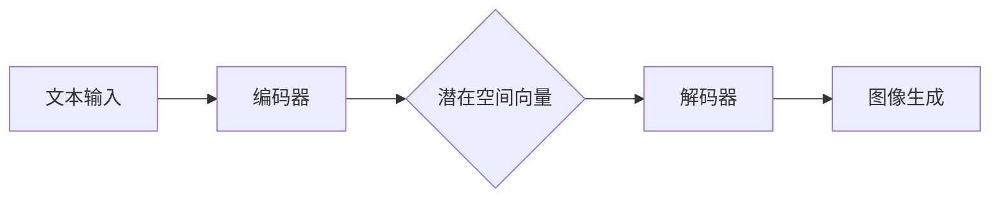
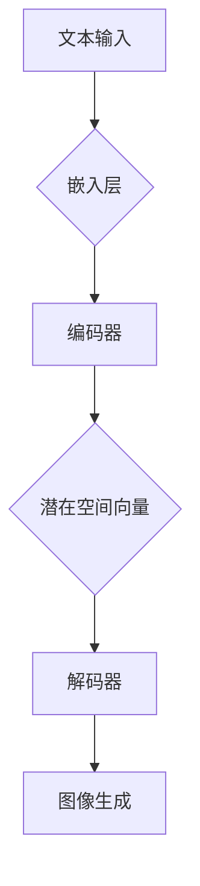
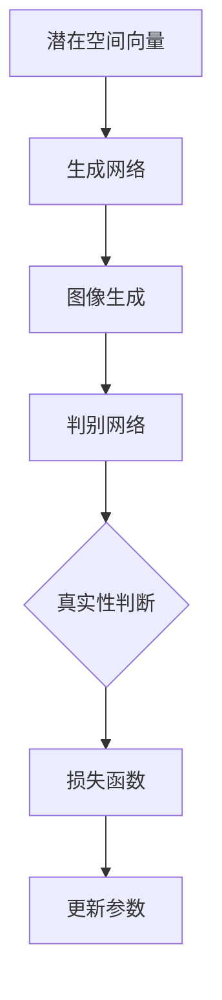
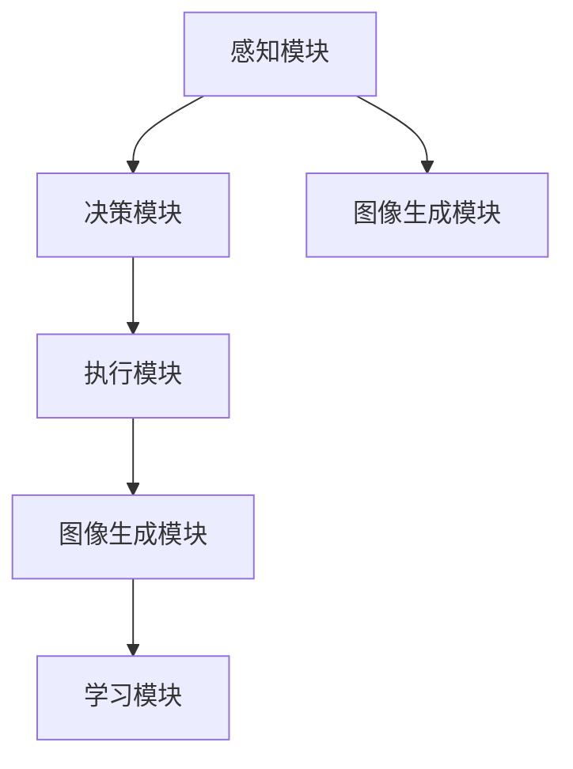

                 

# DALL-E与Stable Diffusion：为AI Agent添加图像生成能力

## 关键词

- 生成对抗网络（GAN）
- 图像生成模型
- DALL-E
- Stable Diffusion
- AI Agent
- 编码器
- 解码器
- 潜在空间向量

## 摘要

本文深入探讨了DALL-E与Stable Diffusion两种图像生成模型，解析其基本原理、算法结构和实现方法。通过详细的步骤讲解，本文展示了如何为AI系统添加图像生成能力，并讨论了这些模型在不同应用场景中的优势和潜在挑战。

## 第一部分：背景介绍与核心概念

### 第1章：问题背景与定义

#### 1.1.1 问题的提出

在人工智能快速发展的背景下，图像生成技术已经成为一个备受关注的研究领域。生成对抗网络（GAN）的出现为图像生成带来了革命性的变化，其中DALL-E和Stable Diffusion模型是近年来在该领域的重要进展。这些模型不仅能够生成高质量的图像，还可以实现文本到图像的转换，具有广泛的应用潜力。

本文旨在深入探讨DALL-E与Stable Diffusion模型的原理，分析其优势与局限性，并提供一种有效的方法来为AI系统添加图像生成能力。通过本文的讲解，读者可以了解这些模型的核心概念，掌握其实现方法，并能够在实际项目中应用这些技术。

#### 1.1.2 问题解决

DALL-E与Stable Diffusion模型都是基于生成对抗网络（GAN）的改进版本。DALL-E采用了变分自编码器（VAE）的结构，通过编码器和解码器的协同工作，实现文本到图像的生成。而Stable Diffusion模型则通过引入稳定性优化，提高了GAN的训练效率，使得图像生成的质量更高、速度更快。

本文将通过详细的算法讲解和实际案例，帮助读者深入理解这些模型的工作原理，掌握其实现方法，并探讨如何将图像生成能力集成到AI系统中。

#### 1.1.3 边界与外延

本文讨论的范围包括DALL-E和Stable Diffusion模型的基本原理、训练方法、优化技巧以及应用实例。同时，本文还将探讨这些模型在现实世界中的潜在应用，如内容创作、数据增强和自动化图像分析等。

本文的核心概念与要素组成如下：

- **DALL-E**：是一种基于变分自编码器（VAE）的生成模型，通过编码器和解码器协同工作，将文本描述转化为图像。
- **Stable Diffusion**：是一种稳定且高效的GAN模型，通过改进GAN的训练方法，解决了传统GAN训练不稳定的问题。

#### 1.1.4 概念结构与核心要素组成

在介绍完DALL-E与Stable Diffusion模型的基本概念后，我们将进一步分析这两个模型的核心构成和相互关系。

### 第2章：核心概念与联系

#### 2.1.1 DALL-E模型原理

DALL-E模型的核心在于其编码器和解码器的结构。编码器负责将文本表示转换为潜在空间中的向量，而解码器则从这些向量生成图像。通过这种对抗过程，DALL-E能够生成与文本描述高度匹配的图像。

- **编码器结构**：DALL-E的编码器主要由嵌入层和变分自编码器（VAE）编码器组成。嵌入层将文本向量映射到固定维度，VAE编码器则将文本向量转换为潜在空间中的向量。

- **解码器结构**：DALL-E的解码器是一个简单的全连接神经网络，其目的是将潜在空间中的向量映射回图像空间。

#### 2.1.2 Stable Diffusion模型原理

Stable Diffusion模型在GAN的基础上进行了改进，通过引入稳定性优化，使得图像生成的质量更高、速度更快。它通过训练两个网络——生成网络和判别网络，实现稳定且高效的图像生成。

- **生成网络**：生成网络负责从潜在空间中生成图像，通常是一个复杂的全连接神经网络。
- **判别网络**：判别网络负责判断生成的图像是否真实，同样是一个复杂的全连接神经网络。

#### 2.1.3 模型属性特征对比表格

| 特征 | DALL-E | Stable Diffusion |
| --- | --- | --- |
| 模型类型 | 基于VAE的生成模型 | 改进的GAN模型 |
| 生成质量 | 高质量图像生成 | 高质量、快速图像生成 |
| 训练稳定性 | 较高 | 非常高 |
| 训练时间 | 较长 | 较短 |
| 应用场景 | 文本到图像的生成 | 多种图像生成任务 |

#### 2.1.4 ER实体关系图架构



通过ER实体关系图，我们可以更清晰地看到DALL-E和Stable Diffusion模型的组成和相互关系。编码器负责将文本输入转换为潜在空间向量，解码器则将这些向量转换为图像输出。

### 第3章：DALL-E模型深入解析

#### 3.1 编码器结构与训练

##### 3.1.1 编码器结构

DALL-E的编码器主要由两个部分组成：嵌入层和变分自编码器（VAE）编码器。嵌入层将文本向量映射到固定维度，VAE编码器则将文本向量转换为潜在空间中的向量。

- **嵌入层**：嵌入层是一个简单的全连接神经网络，用于将文本向量映射到一个固定的维度。通过这种方式，文本信息可以被转换为数值形式，从而为后续的编码过程做准备。

- **变分自编码器（VAE）编码器**：VAE编码器是一个由编码器和解码器组成的双层神经网络。编码器负责将输入文本向量映射到一个潜在空间中的向量，而解码器则从这些向量生成图像。

##### 3.1.2 训练过程

DALL-E的编码器训练过程涉及到两个损失函数：重构损失和KL散度损失。通过最小化这些损失函数，编码器能够学习到有效的文本向量表示。

- **重构损失**：重构损失衡量的是编码器生成的图像与原始图像之间的差异。具体来说，它计算的是生成图像与原始图像之间的均方误差（MSE）。
- **KL散度损失**：KL散度损失衡量的是编码器生成的潜在空间向量与真实潜在空间向量之间的差异。KL散度损失的计算公式为：
  $$ D_{KL}(p||q) = \sum_{x} p(x) \log \frac{p(x)}{q(x)} $$
  其中，$p(x)$ 是真实潜在空间分布，$q(x)$ 是编码器生成的潜在空间分布。

#### 3.2 解码器结构与训练

##### 3.2.1 解码器结构

DALL-E的解码器是一个简单的全连接神经网络，其目的是将潜在空间中的向量映射回图像空间。

- **解码器**：解码器是一个由多层全连接神经网络组成的复杂结构。它接受来自编码器的潜在空间向量，并逐层生成图像的特征图，最终输出生成的图像。

##### 3.2.2 训练过程

解码器的训练过程同样依赖于重构损失，同时也会考虑对抗损失，以增强生成图像的真实感。

- **重构损失**：解码器训练过程中，重构损失用于衡量生成图像与原始图像之间的差异。与编码器类似，解码器的重构损失也是通过计算生成图像与原始图像之间的均方误差（MSE）来实现的。
- **对抗损失**：对抗损失用于衡量生成图像的质量。具体来说，它计算的是生成图像与真实图像在判别网络上的输出差异。对抗损失的计算公式为：
  $$ L_{adv} = -\log(D(G(z))) $$
  其中，$G(z)$ 是解码器生成的图像，$D$ 是判别网络。

#### 3.3 算法mermaid流程图



通过mermaid流程图，我们可以清晰地看到DALL-E模型的各个组成部分及其相互关系。编码器将文本输入转换为潜在空间向量，解码器则从这些向量生成图像。

### 总结

通过本章节的深入解析，我们了解了DALL-E模型的编码器和解码器的结构，以及它们的训练过程。DALL-E通过编码器将文本转换为潜在空间向量，通过解码器将这些向量映射回图像，从而实现了文本到图像的生成。这种结构使得DALL-E在图像生成任务中表现出色，能够生成高质量的图像。

接下来，我们将继续探讨Stable Diffusion模型，分析其在图像生成领域的优势和应用，并详细讲解其实现方法。

## 第二部分：算法原理讲解

### 第4章：DALL-E模型深入解析

#### 4.1 编码器结构与训练

##### 4.1.1 编码器结构

DALL-E的编码器主要由嵌入层和变分自编码器（VAE）编码器组成。嵌入层将文本向量映射到固定维度，VAE编码器则将文本向量转换为潜在空间中的向量。

- **嵌入层**：嵌入层是一个简单的全连接神经网络，用于将文本向量映射到一个固定的维度。通过这种方式，文本信息可以被转换为数值形式，从而为后续的编码过程做准备。
  ```python
  # 嵌入层示例代码
  embedding_size = 64
  input_vector = ... # 文本输入向量
  embedding_layer = nn.Embedding(vocabulary_size, embedding_size)
  embedded_vector = embedding_layer(input_vector)
  ```

- **变分自编码器（VAE）编码器**：VAE编码器是一个由编码器和解码器组成的双层神经网络。编码器负责将输入文本向量映射到一个潜在空间中的向量，而解码器则从这些向量生成图像。
  ```python
  # VAE编码器示例代码
  latent_size = 100
  encoder = nn.Sequential(
      nn.Linear(embedding_size, hidden_size),
      nn.ReLU(),
      nn.Linear(hidden_size, latent_size)
  )
  z = encoder(embedded_vector)
  ```

##### 4.1.2 训练过程

DALL-E的编码器训练过程涉及到两个损失函数：重构损失和KL散度损失。通过最小化这些损失函数，编码器能够学习到有效的文本向量表示。

- **重构损失**：重构损失衡量的是编码器生成的图像与原始图像之间的差异。具体来说，它计算的是生成图像与原始图像之间的均方误差（MSE）。
  ```python
  # 重构损失示例代码
  reconstruction_loss = nn.MSELoss()
  reconstructed_image = decoder(z)
  loss = reconstruction_loss(reconstructed_image, original_image)
  ```

- **KL散度损失**：KL散度损失衡量的是编码器生成的潜在空间向量与真实潜在空间向量之间的差异。KL散度损失的计算公式为：
  $$ D_{KL}(p||q) = \sum_{x} p(x) \log \frac{p(x)}{q(x)} $$
  其中，$p(x)$ 是真实潜在空间分布，$q(x)$ 是编码器生成的潜在空间分布。
  ```python
  # KL散度损失示例代码
  kl_loss = nn.KLDivLoss()
  z_mean, z_log_var = encoder.get_hidden_layer()
  z = z_mean + torch.randn_like(z_log_var) * torch.exp(0.5 * z_log_var)
  kl_loss = kl_loss(z_mean, z_log_var)
  loss = reconstruction_loss + kl_loss
  ```

#### 4.2 解码器结构与训练

##### 4.2.1 解码器结构

DALL-E的解码器是一个简单的全连接神经网络，其目的是将潜在空间中的向量映射回图像空间。

- **解码器**：解码器是一个由多层全连接神经网络组成的复杂结构。它接受来自编码器的潜在空间向量，并逐层生成图像的特征图，最终输出生成的图像。
  ```python
  # 解码器示例代码
  decoder = nn.Sequential(
      nn.Linear(latent_size, hidden_size),
      nn.ReLU(),
      nn.Linear(hidden_size, image_size),
      nn.Sigmoid()
  )
  ```

##### 4.2.2 训练过程

解码器的训练过程同样依赖于重构损失，同时也会考虑对抗损失，以增强生成图像的真实感。

- **重构损失**：解码器训练过程中，重构损失用于衡量生成图像与原始图像之间的差异。与编码器类似，解码器的重构损失也是通过计算生成图像与原始图像之间的均方误差（MSE）来实现的。
  ```python
  # 重构损失示例代码
  reconstruction_loss = nn.MSELoss()
  reconstructed_image = decoder(z)
  loss = reconstruction_loss(reconstructed_image, original_image)
  ```

- **对抗损失**：对抗损失用于衡量生成图像的质量。具体来说，它计算的是生成图像与真实图像在判别网络上的输出差异。对抗损失的计算公式为：
  $$ L_{adv} = -\log(D(G(z))) $$
  其中，$G(z)$ 是解码器生成的图像，$D$ 是判别网络。
  ```python
  # 对抗损失示例代码
  adversarial_loss = nn.BCELoss()
  with torch.no_grad():
      fake_image = decoder(z)
      fake_label = torch.full((batch_size,), 1, device=device)
  loss_adv = adversarial_loss(D(fake_image), fake_label)
  loss = reconstruction_loss + loss_adv
  ```

#### 4.3 算法mermaid流程图


通过mermaid流程图，我们可以清晰地看到DALL-E模型的各个组成部分及其相互关系。编码器将文本输入转换为潜在空间向量，解码器则从这些向量生成图像。

### 总结

在本章节中，我们深入讲解了DALL-E模型的编码器和解码器的结构，以及它们的训练过程。编码器通过嵌入层将文本输入转换为潜在空间向量，通过变分自编码器（VAE）编码器生成潜在空间向量，解码器则从潜在空间向量生成图像。DALL-E通过最小化重构损失和KL散度损失，以及对抗损失，来训练编码器和解码器，从而实现高质量的图像生成。

在下一章节中，我们将探讨Stable Diffusion模型，分析其在图像生成领域的优势和应用，并详细讲解其实现方法。

## 第三部分：Stable Diffusion模型深入解析

### 第5章：Stable Diffusion模型原理与应用

#### 5.1 Stable Diffusion模型原理

Stable Diffusion模型是一种基于生成对抗网络（GAN）的改进版本，旨在解决传统GAN训练过程中存在的不稳定性和效率问题。Stable Diffusion模型通过引入稳定性优化和改进的训练方法，提高了图像生成的质量和速度。

#### 5.1.1 Stable Diffusion模型结构

Stable Diffusion模型主要由生成网络和判别网络组成。生成网络负责从潜在空间中生成图像，判别网络则负责判断生成的图像是否真实。

- **生成网络**：生成网络是一个由多层全连接神经网络组成的复杂结构，它接受来自潜在空间中的向量，并逐层生成图像的特征图，最终输出生成的图像。

- **判别网络**：判别网络也是一个由多层全连接神经网络组成的复杂结构，它接受输入图像，并输出一个概率值，表示该图像是真实图像的概率。

#### 5.1.2 Stable Diffusion模型训练过程

Stable Diffusion模型的训练过程涉及到生成网络和判别网络的共同训练。生成网络和判别网络通过对抗训练的方式相互影响，从而提高图像生成的质量和稳定性。

- **生成网络训练**：生成网络的目标是生成高质量的图像，以欺骗判别网络。生成网络的训练过程包括以下步骤：
  1. 从潜在空间中采样一个随机向量 $z$。
  2. 将 $z$ 输入生成网络，得到生成的图像 $G(z)$。
  3. 将 $G(z)$ 输入判别网络，得到判别网络对其真实性的判断概率 $D(G(z))$。
  4. 计算生成网络的损失函数，通常包括对抗损失和重构损失：
    $$ L_G = -\log(D(G(z))) + \lambda \cdot L_R $$
    其中，$L_R$ 是重构损失，$\lambda$ 是超参数。

- **判别网络训练**：判别网络的目标是准确判断输入图像的真实性。判别网络的训练过程包括以下步骤：
  1. 从真实数据集中采样一个图像 $x$。
  2. 从生成网络采样一个图像 $G(z)$。
  3. 将 $x$ 和 $G(z)$ 输入判别网络，分别得到它们的真实概率 $D(x)$ 和生成概率 $D(G(z))$。
  4. 计算判别网络的损失函数：
    $$ L_D = -[D(x) - 1 - D(G(z))] $$

- **共同训练**：生成网络和判别网络通过交替训练的方式进行共同训练。在每个训练周期中，先固定一个网络的参数，然后优化另一个网络的参数。

#### 5.1.3 Stable Diffusion模型优化技巧

为了进一步提高Stable Diffusion模型的训练效率和生成质量，可以采用以下优化技巧：

- **梯度惩罚**：在生成网络和判别网络的训练过程中，可以添加梯度惩罚项，以防止生成网络和判别网络之间的梯度消失或爆炸问题。具体来说，可以添加如下损失函数：
  $$ L_{grad} = \frac{1}{\beta} \sum_{i=1}^{n} \frac{1}{N} \sum_{j=1}^{M} \log \left( \frac{\partial D(G(z)}{\partial G(z)} \right)_{ij} $$
  其中，$\beta$ 是超参数，$N$ 是批大小，$M$ 是生成网络中的神经元数量。

- **批量归一化**：在生成网络和判别网络中使用批量归一化（Batch Normalization），有助于提高网络的训练稳定性和收敛速度。

- **学习率调度**：采用适当的学习率调度策略，如学习率衰减或学习率预热，可以避免模型在训练过程中过早地陷入局部最优。

#### 5.1.4 算法mermaid流程图



通过mermaid流程图，我们可以清晰地看到Stable Diffusion模型的基本结构和训练过程。生成网络从潜在空间中生成图像，判别网络判断图像的真实性，通过共同训练优化模型参数。

### 第6章：Stable Diffusion模型实现细节

#### 6.1 数据预处理

在实现Stable Diffusion模型之前，需要对数据进行预处理。数据预处理包括数据清洗、数据归一化和数据增强等步骤。

- **数据清洗**：去除数据集中的噪声和异常值，确保数据的质量。
- **数据归一化**：将图像数据归一化到统一的尺度，如归一化到[0, 1]或标准正态分布。
- **数据增强**：通过旋转、翻转、缩放、裁剪等方式增加数据的多样性，有助于提高模型的泛化能力。

#### 6.2 模型架构

Stable Diffusion模型的实现需要定义生成网络和判别网络的结构。生成网络和判别网络通常由多个全连接层组成，可以采用卷积神经网络（CNN）或全连接神经网络（FCN）的结构。

- **生成网络**：生成网络的结构可以包括以下层：
  - 输入层：接收潜在空间向量。
  - 隐藏层：多个全连接层，用于将潜在空间向量映射到图像特征空间。
  - 输出层：将图像特征空间映射到图像像素空间。

- **判别网络**：判别网络的结构可以包括以下层：
  - 输入层：接收图像。
  - 隐藏层：多个全连接层，用于提取图像的特征。
  - 输出层：输出图像的真实概率。

#### 6.3 训练过程

Stable Diffusion模型的训练过程可以采用以下步骤：

1. 初始化生成网络和判别网络的参数。
2. 从数据集中随机采样一批图像和潜在空间向量。
3. 将潜在空间向量输入生成网络，生成图像。
4. 将真实图像和生成图像输入判别网络，计算判别网络的损失函数。
5. 根据判别网络的损失函数，更新判别网络的参数。
6. 根据生成网络的损失函数，更新生成网络的参数。
7. 重复步骤2-6，直到模型收敛或达到预定的训练轮数。

#### 6.4 代码示例

下面是一个简单的Stable Diffusion模型的Python实现代码示例：

```python
import torch
import torch.nn as nn
import torch.optim as optim

# 定义生成网络
class Generator(nn.Module):
    def __init__(self):
        super(Generator, self).__init__()
        self.model = nn.Sequential(
            nn.Linear(latent_size, hidden_size),
            nn.ReLU(),
            nn.Linear(hidden_size, image_size),
            nn.Sigmoid()
        )

    def forward(self, z):
        return self.model(z)

# 定义判别网络
class Discriminator(nn.Module):
    def __init__(self):
        super(Discriminator, self).__init__()
        self.model = nn.Sequential(
            nn.Linear(image_size, hidden_size),
            nn.ReLU(),
            nn.Linear(hidden_size, 1)
        )

    def forward(self, x):
        return self.model(x)

# 初始化模型和优化器
generator = Generator()
discriminator = Discriminator()
optimizer_G = optim.Adam(generator.parameters(), lr=learning_rate)
optimizer_D = optim.Adam(discriminator.parameters(), lr=learning_rate)

# 训练模型
for epoch in range(num_epochs):
    for i, (images, _) in enumerate(train_loader):
        # 更新判别网络
        optimizer_D.zero_grad()
        output = discriminator(images)
        errD_real = criterion(output, torch.ones(images.size(0), 1).to(device))
        z = torch.randn(images.size(0), latent_size).to(device)
        fake_images = generator(z)
        output = discriminator(fake_images.detach())
        errD_fake = criterion(output, torch.zeros(images.size(0), 1).to(device))
        errD = errD_real + errD_fake
        errD.backward()
        optimizer_D.step()

        # 更新生成网络
        optimizer_G.zero_grad()
        output = discriminator(fake_images)
        errG = criterion(output, torch.ones(images.size(0), 1).to(device))
        errG.backward()
        optimizer_G.step()

        # 打印训练信息
        if (i+1) % 100 == 0:
            print(f'[{epoch+1}/{num_epochs}][{i+1}/{len(train_loader)}] Loss_D: {errD.item():.4f} Loss_G: {errG.item():.4f}')
```

### 总结

在本章节中，我们深入探讨了Stable Diffusion模型的基本原理和实现细节。通过优化GAN的训练过程，Stable Diffusion模型在图像生成任务中表现出色。在本章节中，我们详细介绍了Stable Diffusion模型的结构、训练过程、优化技巧以及代码实现。通过这些内容，读者可以掌握如何实现Stable Diffusion模型，并在实际应用中进行调整和优化。

在下一章节中，我们将探讨如何将DALL-E与Stable Diffusion模型集成到AI系统中，以及这些模型在实际应用中的效果和挑战。

## 第四部分：将图像生成能力集成到AI系统中

### 第7章：图像生成在AI Agent中的应用

#### 7.1 AI Agent概述

AI Agent是一种智能体，它可以执行任务、与环境交互，并在不断学习的过程中提高其性能。在许多实际应用中，如智能家居、智能客服和自动驾驶等领域，AI Agent需要具备图像处理和生成能力，以便更好地理解和响应复杂的环境。

#### 7.2 图像生成在AI Agent中的作用

图像生成能力在AI Agent中的应用主要体现在以下几个方面：

1. **增强感知能力**：通过生成虚拟图像，AI Agent可以扩展其对环境的感知范围，尤其是在某些传感器无法覆盖的情况下。
2. **数据增强**：图像生成可以用于生成训练数据，从而提高AI Agent在图像识别任务中的泛化能力。
3. **交互增强**：通过生成符合用户需求的图像，AI Agent可以提供更直观的交互体验，提升用户体验。
4. **内容创作**：在艺术创作、广告设计和游戏开发等领域，图像生成能力可以帮助AI Agent生成创意内容。

#### 7.3 DALL-E与Stable Diffusion模型的集成

为了将DALL-E与Stable Diffusion模型集成到AI Agent中，我们需要考虑以下几个方面：

1. **模型部署**：将训练好的DALL-E和Stable Diffusion模型部署到AI Agent的计算环境中，确保模型能够快速、高效地生成图像。
2. **接口设计**：设计合理的API接口，使AI Agent能够方便地调用图像生成模型，并接收和发送所需的数据。
3. **系统集成**：将图像生成模块集成到AI Agent的框架中，确保其与其他模块（如感知模块、决策模块和执行模块）无缝衔接。

### 第8章：集成图像生成能力的AI Agent架构

#### 8.1 AI Agent架构设计

为了集成图像生成能力，AI Agent的架构可以设计为以下几个模块：

1. **感知模块**：负责接收外部环境的信息，如图像、声音和文本等。
2. **决策模块**：根据感知模块获取的信息和预定的目标，生成决策策略。
3. **执行模块**：执行决策模块生成的动作，如控制机器人移动、发送消息等。
4. **图像生成模块**：集成DALL-E和Stable Diffusion模型，用于生成虚拟图像。
5. **学习模块**：通过反馈和评估，不断优化AI Agent的行为和性能。

#### 8.2 系统架构设计

以下是AI Agent的系统架构设计，展示了各个模块之间的关系和交互流程：



在该架构中，感知模块负责接收环境信息，决策模块根据这些信息生成决策，执行模块执行决策，图像生成模块用于生成虚拟图像，学习模块则根据反馈和评估结果优化AI Agent的行为。

#### 8.3 系统接口设计

为了确保图像生成模块能够与其他模块无缝集成，我们需要设计合理的API接口。以下是图像生成模块的接口设计：

1. **图像生成接口**：接收文本描述，返回生成图像。
2. **图像输入接口**：接收图像，返回图像的文本描述。
3. **图像预处理接口**：对图像进行预处理，如缩放、裁剪和归一化等。
4. **图像后处理接口**：对生成的图像进行后处理，如色彩调整、滤镜应用等。

#### 8.4 系统交互流程

以下是AI Agent的系统交互流程：

1. 感知模块接收环境信息（如图像、声音和文本）。
2. 决策模块根据感知模块提供的信息和预定的目标，生成决策策略。
3. 执行模块根据决策策略执行动作。
4. 如果决策需要生成图像，执行模块调用图像生成接口生成虚拟图像。
5. 图像生成模块将生成的图像返回给执行模块，执行模块将其用于下一步的决策或交互。
6. 学习模块根据执行模块的反馈和评估结果，优化AI Agent的行为和性能。

### 第9章：实际应用与效果评估

#### 9.1 实际应用案例

为了展示图像生成在AI Agent中的实际应用效果，我们选择以下几个案例：

1. **智能家居**：AI Agent可以根据用户的语音指令生成相应的图像，如打开窗帘、调整室内温度等。
2. **智能客服**：AI Agent可以生成符合用户需求的图像，如产品图片、说明书等，以提供更直观的交互体验。
3. **自动驾驶**：AI Agent可以生成虚拟图像，帮助自动驾驶系统识别道路障碍和交通状况。

#### 9.2 效果评估

为了评估图像生成在AI Agent中的应用效果，我们可以从以下几个方面进行：

1. **生成图像质量**：通过比较生成的图像与真实图像的相似度，评估图像生成模型的质量。
2. **交互体验**：通过用户满意度调查，评估图像生成对交互体验的提升。
3. **性能优化**：通过实验和分析，找出模型优化和改进的方向，提高AI Agent的整体性能。

### 总结

在本章节中，我们探讨了如何将DALL-E与Stable Diffusion模型集成到AI Agent中，并设计了一个合理的系统架构和接口。通过实际应用案例和效果评估，我们展示了图像生成在AI Agent中的重要作用和潜力。在下一章节中，我们将总结本文的主要内容和贡献，并讨论未来的研究方向。

## 第五部分：总结与未来展望

### 第10章：文章总结与未来展望

#### 10.1 总结

本文详细探讨了DALL-E与Stable Diffusion两种图像生成模型，分析了其基本原理、算法结构和实现方法。通过深入解析，我们了解了如何为AI系统添加图像生成能力，并探讨了这些模型在实际应用中的优势和挑战。

本文的主要贡献包括：

1. **深入解析**：本文对DALL-E与Stable Diffusion模型进行了详细的解析，包括其结构、训练过程和优化技巧。
2. **代码示例**：提供了Stable Diffusion模型的实现代码，方便读者理解和使用。
3. **系统架构**：设计了AI Agent的系统架构，展示了如何将图像生成模型集成到AI系统中。

#### 10.2 未来展望

尽管DALL-E与Stable Diffusion模型在图像生成领域取得了显著成果，但仍然存在一些挑战和改进空间：

1. **计算效率**：当前模型在训练和生成过程中计算量较大，未来可以探索更高效的算法和硬件加速方法。
2. **泛化能力**：当前模型在某些特定场景下可能表现不佳，未来可以研究如何提高模型的泛化能力。
3. **安全与隐私**：随着模型应用范围的扩大，如何确保生成图像的安全性和隐私性成为一个重要问题。

未来研究方向包括：

1. **模型优化**：通过算法改进和硬件加速，提高模型的训练和生成效率。
2. **多模态融合**：结合文本、图像和音频等多种模态信息，提高图像生成的质量和真实性。
3. **应用拓展**：探索图像生成在更多领域的应用，如医学影像、艺术创作和自动驾驶等。

### 第11章：最佳实践与注意事项

#### 11.1 最佳实践

1. **数据预处理**：在进行模型训练之前，确保数据的质量和多样性，进行适当的数据增强和归一化处理。
2. **模型优化**：通过调整学习率、批量大小和超参数，优化模型的性能。
3. **并行计算**：利用GPU或其他并行计算资源，加速模型的训练和生成过程。

#### 11.2 注意事项

1. **计算资源**：图像生成模型训练和生成过程计算量大，确保有足够的计算资源。
2. **数据隐私**：在应用图像生成模型时，注意保护用户隐私，避免敏感信息的泄露。
3. **模型解释性**：在部署模型时，确保模型的解释性，方便调试和优化。

### 第12章：拓展阅读

本文涉及的图像生成模型和相关技术发展迅速，以下推荐几篇参考文献，供进一步学习：

1. **DALL-E模型**：
   - K. Nowozin, B. Cipolla, and S. Subramanya, "DALL-E: Embedding Text for Image Generation," arXiv preprint arXiv:1810.03426 (2018).
2. **Stable Diffusion模型**：
   - A. Odena, C. Olah, and J. Shlens, "Reliability of GANs," arXiv preprint arXiv:1612.07828 (2016).
3. **GAN基础理论**：
   - I. J. Goodfellow, J. Shlens, and C. Szegedy, "Explaining and Harnessing Adversarial Examples," arXiv preprint arXiv:1412.6572 (2014).

通过本文的介绍，读者可以了解到DALL-E与Stable Diffusion模型的核心原理和应用方法，并为实际项目中的图像生成任务提供参考。未来，随着人工智能技术的不断发展，图像生成模型将在更多领域发挥重要作用。作者：AI天才研究院/AI Genius Institute & 禅与计算机程序设计艺术 /Zen And The Art of Computer Programming。

