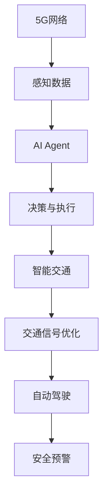
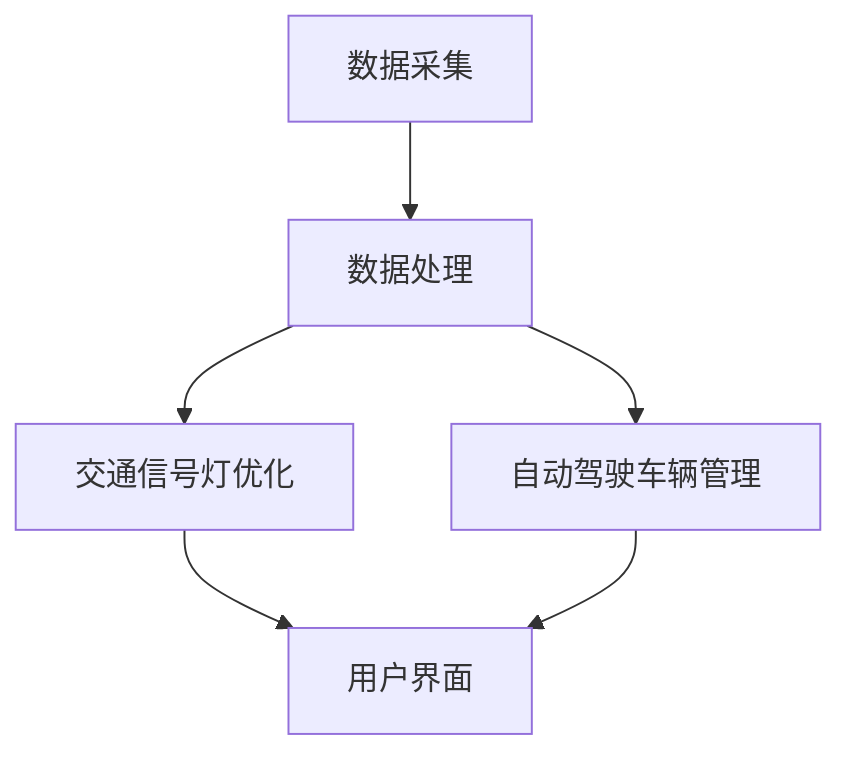
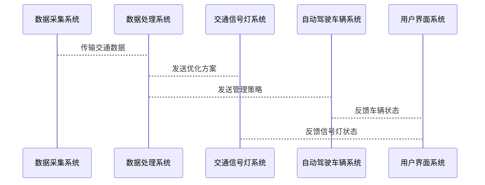

                 

# 5G+AI：探索高速网络下的AI Agent新应用

> 关键词：5G, AI, AI Agent, 应用场景, 技术融合

> 摘要：随着5G网络的普及和AI技术的迅猛发展，AI Agent在高速网络环境下展现出前所未有的应用潜力。本文将深入探讨5G与AI的融合技术基础，分析AI Agent的基本概念及其在5G网络中的潜在应用场景，重点关注智能交通、智能医疗、智能制造和智能家居等领域，为推动新一代信息技术的发展提供参考。

## 第一部分: 5G与AI融合技术基础

### 第1章: 5G网络与AI概述

#### 1.1 5G网络简介

##### 1.1.1 5G技术的发展历程

5G技术，即第五代移动通信技术，是当前移动通信技术的重要发展方向。自2019年正式商用以来，5G技术在全球范围内迅速普及，推动着信息通信技术的变革。

- **第一阶段（2019-2021）**：5G初期商用，主要在大都市和重点区域部署。
- **第二阶段（2021-2023）**：5G网络逐步覆盖全国，实现全国主要城市的覆盖。
- **第三阶段（2023-2025）**：5G网络将实现深度覆盖，实现5G技术的广泛应用。

##### 1.1.2 5G网络的核心特性

5G网络具有以下几个核心特性：

- **高速率**：5G网络的理论峰值速率可达20Gbps，比4G网络快100倍。
- **低延迟**：5G网络的端到端延迟低至1毫秒，为实时应用提供了可能。
- **大连接**：5G网络能够支持每平方公里100万连接，满足物联网应用需求。
- **网络切片**：5G网络支持网络切片技术，可根据应用需求灵活分配网络资源。

##### 1.1.3 5G网络在AI应用中的优势

5G网络的高速率、低延迟和大连接特性，为AI应用提供了坚实的基础：

- **实时数据处理**：5G网络的高速率和低延迟，使得AI Agent能够实时获取和处理数据，提升应用响应速度。
- **大规模协同**：5G网络的大连接特性，使得AI Agent能够实现大规模协同，提高整体智能水平。
- **边缘计算**：5G网络的网络切片和边缘计算技术，为AI Agent提供了计算资源，降低数据处理延迟。

#### 1.2 AI Agent的基本概念

##### 1.2.1 AI Agent的定义

AI Agent，即人工智能代理，是一种能够自主决策和执行的智能体。它通过感知环境、理解任务需求，利用机器学习算法和深度神经网络进行推理和决策，从而实现自动化和智能化。

##### 1.2.2 AI Agent的类型与功能

AI Agent主要分为以下几种类型：

1. **感知型Agent**：主要依靠传感器获取环境信息，进行数据分析和决策。
2. **决策型Agent**：通过算法模型进行数据分析和决策，具有较强的自主决策能力。
3. **执行型Agent**：根据决策结果执行具体任务，实现自动化操作。

AI Agent的功能主要包括：

- **任务规划**：根据任务需求和环境信息，制定合理的执行计划。
- **决策与推理**：利用机器学习算法和深度神经网络，对环境信息进行分析和决策。
- **自主执行**：根据决策结果，执行具体的任务操作。

##### 1.2.3 AI Agent在5G网络中的潜在应用场景

5G网络为AI Agent提供了良好的基础设施，使其在多个领域具有广泛的应用前景：

- **智能交通**：利用AI Agent实现智能交通管理和自动驾驶。
- **智能医疗**：利用AI Agent进行智能诊断、药物研发和健康管理。
- **智能制造**：利用AI Agent实现生产过程智能化和质量控制。
- **智能家居**：利用AI Agent实现智能家居设备管理和生活服务。

#### 1.3 5G与AI融合的关键技术

##### 1.3.1 5G网络切片与AI的结合

5G网络切片技术，为AI Agent提供了灵活的网络资源，实现不同应用场景的定制化网络服务。AI Agent可以根据任务需求，动态调整网络资源，提高应用性能。

##### 1.3.2 边缘计算与AI Agent的协同

边缘计算将数据处理和计算能力推向网络边缘，与AI Agent协同工作，实现实时数据处理和智能决策。边缘计算降低了数据传输延迟，提高了AI Agent的响应速度。

##### 1.3.3 5G网络下的AI Agent设计与实现

在5G网络环境下，AI Agent的设计与实现需要考虑以下几个关键因素：

- **网络环境感知**：AI Agent需要实时感知网络环境，动态调整策略。
- **分布式计算**：AI Agent需要支持分布式计算，实现大规模协同。
- **低延迟通信**：AI Agent需要采用低延迟通信协议，保证实时响应。

#### 1.4 本章小结

5G与AI的融合，为AI Agent的发展提供了新的机遇。通过深入探讨5G网络和AI Agent的基本概念，分析了5G网络在AI应用中的优势，以及AI Agent在5G网络中的潜在应用场景，为后续章节的内容奠定了基础。在下一部分中，我们将进一步探讨高速网络下的AI Agent应用场景分析，为5G与AI技术的融合发展提供更多实践案例。

----------------------------------------------------------------

## 第二部分: 高速网络下的AI Agent应用场景分析

### 第2章: 智能交通与自动驾驶

#### 2.1 智能交通系统概述

##### 2.1.1 智能交通系统的组成

智能交通系统（Intelligent Transportation System，ITS）是由各种先进的信息技术、数据通信传输技术、电子传感器技术、计算机技术和网络技术等集成在一起，对交通运输系统进行智能化管理和提供实时信息服务的系统。

- **感知层**：包括传感器、摄像头、GPS等设备，用于收集交通数据。
- **传输层**：利用5G网络实现数据的高速传输，确保信息的实时性。
- **平台层**：通过对收集到的交通数据进行处理和分析，为交通管理提供决策支持。
- **应用层**：为用户提供交通信息服务，如实时路况、导航、智能停车等。

##### 2.1.2 智能交通系统的现状与挑战

当前，智能交通系统已经在国内多个城市得到广泛应用，但仍然面临一些挑战：

- **数据传输速度**：4G网络在传输大量数据时，容易产生延迟，影响系统的实时性。
- **网络覆盖范围**：4G网络的覆盖范围有限，无法满足大规模交通管理的需求。
- **系统协同**：不同交通管理子系统之间的信息共享和协同，仍需进一步优化。

##### 2.1.3 AI Agent在智能交通中的应用

AI Agent在智能交通系统中具有广泛的应用前景：

- **智能调度**：AI Agent可以根据实时交通数据，自动调整交通信号灯，提高道路通行效率。
- **智能检测**：AI Agent可以利用摄像头和传感器，实时检测道路上的异常情况，如拥堵、事故等，并及时报警。
- **智能导航**：AI Agent可以根据实时交通信息，为用户提供最优路线规划，减少行驶时间。

#### 2.2 自动驾驶技术

##### 2.2.1 自动驾驶的技术原理

自动驾驶技术是智能交通系统的重要组成部分，通过计算机视觉、激光雷达、GPS等技术，实现车辆在复杂环境下的自主驾驶。

- **感知系统**：通过摄像头、激光雷达等设备，实时感知周围环境。
- **决策系统**：利用深度学习、强化学习等算法，对感知到的信息进行分析，做出驾驶决策。
- **控制系统**：根据决策结果，控制车辆的加速度、转向、制动等操作。

##### 2.2.2 自动驾驶的关键技术

自动驾驶技术的发展离不开以下几个关键技术的支持：

- **感知技术**：实现高精度、实时的环境感知，是自动驾驶的基础。
- **决策算法**：自动驾驶的决策系统需要能够处理复杂、不确定的环境，做出安全、可靠的驾驶决策。
- **控制系统**：自动驾驶车辆的控制系统需要具备快速响应、精准控制的能力。

##### 2.2.3 AI Agent在自动驾驶中的角色

AI Agent在自动驾驶中扮演着重要角色：

- **环境感知**：AI Agent可以通过摄像头、激光雷达等设备，实时感知道路环境，为决策系统提供数据支持。
- **决策辅助**：AI Agent可以利用深度学习、强化学习等算法，对感知到的信息进行分析，为决策系统提供辅助。
- **执行控制**：AI Agent可以根据决策结果，控制车辆的加速度、转向、制动等操作，实现自动驾驶。

#### 2.3 5G网络在智能交通与自动驾驶中的应用

##### 2.3.1 5G网络对自动驾驶的支撑作用

5G网络为自动驾驶技术提供了强大的支撑：

- **高速传输**：5G网络的高速传输能力，确保了自动驾驶车辆能够实时获取道路信息，做出快速反应。
- **低延迟**：5G网络的低延迟特性，使得自动驾驶车辆的决策系统能够快速响应，提高行车安全。
- **大连接**：5G网络的大连接特性，支持自动驾驶车辆之间的高效通信，实现车联网（V2X）的协同。

##### 2.3.2 AI Agent在智能交通中的实时性要求

AI Agent在智能交通中的实时性要求非常高：

- **实时感知**：AI Agent需要实时感知交通状况，快速做出反应。
- **实时决策**：AI Agent需要根据实时交通数据，快速做出最优决策。
- **实时执行**：AI Agent需要实时执行决策，确保交通管理的高效性。

##### 2.3.3 5G与AI Agent在自动驾驶中的协同作用

5G网络与AI Agent在自动驾驶中具有协同作用：

- **网络协同**：5G网络为AI Agent提供了高速、低延迟、大连接的网络环境，确保了自动驾驶车辆的实时性。
- **算法协同**：AI Agent可以利用5G网络获取的实时交通数据，优化决策算法，提高自动驾驶的可靠性。
- **执行协同**：AI Agent可以根据5G网络提供的实时信息，调整执行策略，提高自动驾驶的效率。

#### 2.4 本章小结

智能交通与自动驾驶是5G与AI技术融合的重要应用领域。通过分析智能交通系统的现状与挑战，以及自动驾驶技术的原理和AI Agent的角色，我们看到了5G网络在智能交通与自动驾驶中的重要作用。在下一章中，我们将继续探讨5G与AI在智能医疗与远程诊断中的应用，进一步拓展5G与AI技术的应用场景。

----------------------------------------------------------------

### 第3章: 智能医疗与远程诊断

#### 3.1 智能医疗概述

##### 3.1.1 智能医疗的发展背景

智能医疗是利用人工智能、大数据、云计算等先进技术，实现医疗服务的智能化、个性化、精准化。随着人工智能技术的不断发展和医疗大数据的积累，智能医疗逐渐成为医疗行业的重要发展方向。

- **技术驱动**：人工智能、大数据、云计算等技术的快速发展，为智能医疗提供了技术支持。
- **政策推动**：我国政府高度重视智能医疗的发展，出台了一系列政策，鼓励智能医疗技术的发展和应用。
- **市场需求**：随着人口老龄化趋势加剧，对医疗服务的需求不断增加，智能医疗为满足这一需求提供了有效途径。

##### 3.1.2 智能医疗的关键技术

智能医疗的关键技术包括：

- **人工智能**：通过深度学习、强化学习等算法，实现医学图像分析、疾病预测、药物研发等。
- **大数据**：利用大数据技术，对海量医疗数据进行挖掘和分析，为医疗决策提供支持。
- **云计算**：通过云计算技术，实现医疗数据的存储、处理和分析，提高医疗服务的效率和质量。

##### 3.1.3 AI Agent在智能医疗中的应用

AI Agent在智能医疗中具有广泛的应用前景：

- **智能诊断**：AI Agent可以通过学习大量的医疗数据，实现对疾病的高效诊断，提高诊断准确率。
- **智能药物研发**：AI Agent可以辅助药物研发，通过分析海量数据，预测药物的效果和副作用，提高研发效率。
- **智能健康管理**：AI Agent可以跟踪用户的健康数据，为用户提供个性化的健康建议，预防疾病发生。

#### 3.2 远程诊断技术

##### 3.2.1 远程诊断的定义与分类

远程诊断是通过网络技术，实现医生与患者之间的远程医疗服务。根据诊断方式和应用场景，远程诊断可以分为以下几类：

- **视频会诊**：医生通过视频与患者进行交流，进行诊断和治疗建议。
- **图文会诊**：医生通过查看患者的图文资料，如病历、检查报告等，进行诊断。
- **智能辅助诊断**：利用人工智能技术，对患者的医疗数据进行自动分析和诊断。

##### 3.2.2 远程诊断的技术原理

远程诊断的技术原理主要包括：

- **数据传输**：通过互联网技术，将患者的医疗数据传输到远程诊断系统。
- **数据分析**：利用人工智能技术，对医疗数据进行分析和诊断，生成诊断报告。
- **人机交互**：医生通过远程诊断系统，与患者进行交互，获取患者的病史、症状等信息，进行诊断。

##### 3.2.3 AI Agent在远程诊断中的作用

AI Agent在远程诊断中发挥着重要作用：

- **辅助诊断**：AI Agent可以通过学习海量医疗数据，对患者的医疗数据进行分析，辅助医生进行诊断。
- **实时监控**：AI Agent可以实时监控患者的病情变化，为医生提供实时诊断和治疗方案。
- **智能建议**：AI Agent可以根据患者的病史、症状等信息，为医生提供诊断和治疗方案建议。

#### 3.3 5G网络在智能医疗与远程诊断中的应用

##### 3.3.1 5G网络对远程诊断的支撑作用

5G网络为远程诊断提供了强大的支撑：

- **高速传输**：5G网络的高速传输能力，确保了医疗数据的高速传输，提高了远程诊断的效率。
- **低延迟**：5G网络的低延迟特性，使得远程诊断系统能够实时响应用户需求，提高诊断的准确性。
- **大连接**：5G网络的大连接特性，支持远程诊断系统同时处理大量用户请求，提高系统的并发处理能力。

##### 3.3.2 AI Agent在远程诊断中的实时性需求

AI Agent在远程诊断中的实时性需求非常高：

- **实时数据分析**：AI Agent需要实时分析患者的医疗数据，快速生成诊断报告。
- **实时监控**：AI Agent需要实时监控患者的病情变化，及时提供诊断和治疗方案。
- **实时交互**：AI Agent需要实时与医生和患者进行交互，确保诊断和治疗的顺利进行。

##### 3.3.3 5G与AI Agent在远程诊断中的协同作用

5G网络与AI Agent在远程诊断中具有协同作用：

- **网络协同**：5G网络为AI Agent提供了高速、低延迟、大连接的网络环境，确保了远程诊断的实时性和高效性。
- **算法协同**：AI Agent可以利用5G网络提供的实时数据，优化诊断算法，提高诊断准确率。
- **执行协同**：AI Agent可以根据5G网络提供的实时信息，调整诊断和治疗方案，确保远程诊断的有效性。

#### 3.4 本章小结

智能医疗与远程诊断是5G与AI技术的重要应用领域。通过分析智能医疗的发展背景、关键技术以及AI Agent在智能医疗和远程诊断中的应用，我们看到了5G网络在提升远程诊断效率和准确性方面的重要作用。在下一章中，我们将探讨5G与AI在智能制造与工业4.0中的应用，进一步拓展5G与AI技术的应用场景。

----------------------------------------------------------------

### 第4章: 智能制造与工业4.0

#### 4.1 智能制造概述

##### 4.1.1 制造业的数字化转型

智能制造是制造业数字化转型的核心，通过引入人工智能、大数据、物联网等先进技术，实现制造业生产、管理、服务等全过程的智能化。

- **生产过程智能化**：通过自动化设备、机器人等实现生产过程的自动化、高效化。
- **管理智能化**：通过大数据分析、人工智能等技术，实现生产计划、供应链管理、质量管理等环节的智能化。
- **服务智能化**：通过物联网、人工智能等技术，实现产品全生命周期的智能化服务。

##### 4.1.2 智能制造的关键技术

智能制造的关键技术包括：

- **物联网**：通过物联网技术，实现设备互联、数据采集和传输，为智能制造提供数据支持。
- **人工智能**：通过人工智能技术，实现生产过程的智能化控制、质量监测、预测性维护等。
- **大数据**：通过大数据技术，实现海量数据的存储、处理和分析，为智能制造提供决策支持。
- **云计算**：通过云计算技术，实现资源的弹性分配和高效利用，为智能制造提供计算支持。

##### 4.1.3 AI Agent在智能制造中的应用

AI Agent在智能制造中具有广泛的应用前景：

- **智能生产调度**：AI Agent可以根据生产数据，自动调整生产计划，优化生产流程。
- **智能质量控制**：AI Agent可以通过分析生产数据，实时监测产品质量，预测潜在问题，实现质量控制的智能化。
- **智能设备维护**：AI Agent可以通过监控设备运行状态，预测设备故障，实现设备维护的智能化。

#### 4.2 工业互联网与AI Agent

##### 4.2.1 工业互联网的定义与架构

工业互联网是工业系统与信息通信技术的深度融合，通过互联网、物联网、大数据、人工智能等技术，实现设备、系统、人的全面互联，构建智能化、网络化的工业生态系统。

- **设备互联**：通过物联网技术，实现设备之间的数据传输和实时通信，实现设备的互联互通。
- **系统互联**：通过工业互联网平台，实现生产系统、管理系统、服务系统的集成和协同，实现信息共享和资源优化。
- **人机互联**：通过人工智能技术，实现人与设备的智能交互，提高工作效率和用户体验。

##### 4.2.2 AI Agent在工业互联网中的角色

AI Agent在工业互联网中扮演着重要角色：

- **智能调度**：AI Agent可以根据生产数据，自动调整生产计划，优化生产流程。
- **智能监测**：AI Agent可以通过监控设备运行状态，预测设备故障，实现设备的智能维护。
- **智能优化**：AI Agent可以通过分析生产数据，实现生产过程参数的自动调整，提高生产效率和质量。

##### 4.2.3 5G网络对工业互联网的支撑作用

5G网络为工业互联网提供了强大的支撑：

- **高速传输**：5G网络的高速传输能力，确保了工业互联网中数据的高速传输，提高了系统响应速度。
- **低延迟**：5G网络的低延迟特性，使得工业互联网中的实时通信成为可能，提高了系统的实时性和可靠性。
- **大连接**：5G网络的大连接特性，支持工业互联网中大量设备的接入和协同工作，提高了系统的并发处理能力。

#### 4.3 5G网络在智能制造与工业4.0中的应用

##### 4.3.1 5G网络对智能制造的支撑作用

5G网络为智能制造提供了强大的支撑：

- **生产效率**：5G网络的高速率和低延迟，提高了智能制造的生产效率，实现了生产过程的智能化。
- **质量控制**：5G网络的高速率和低延迟，使得智能制造系统能够实时监测产品质量，实现质量控制的智能化。
- **设备维护**：5G网络的高速率和低延迟，使得智能制造系统能够实时监测设备状态，实现设备维护的智能化。

##### 4.3.2 AI Agent在智能制造中的实时性需求

AI Agent在智能制造中的实时性需求非常高：

- **生产调度**：AI Agent需要实时分析生产数据，快速调整生产计划。
- **质量监测**：AI Agent需要实时监测生产过程，及时发现质量隐患。
- **设备维护**：AI Agent需要实时监测设备状态，预测设备故障，提前进行维护。

##### 4.3.3 5G与AI Agent在工业4.0中的协同作用

5G网络与AI Agent在工业4.0中具有协同作用：

- **网络协同**：5G网络为AI Agent提供了高速、低延迟、大连接的网络环境，确保了智能制造的实时性和高效性。
- **算法协同**：AI Agent可以利用5G网络提供的实时数据，优化算法模型，提高智能化水平。
- **执行协同**：AI Agent可以根据5G网络提供的实时信息，调整执行策略，实现智能制造的智能化升级。

#### 4.4 本章小结

智能制造与工业4.0是5G与AI技术的重要应用领域。通过分析智能制造的发展背景、关键技术以及AI Agent在智能制造和工业互联网中的应用，我们看到了5G网络在提升智能制造效率和质量方面的重要作用。在下一章中，我们将探讨5G与AI在智能家居与智慧生活中的应用，进一步拓展5G与AI技术的应用场景。

----------------------------------------------------------------

### 第5章: 智能家居与智慧生活

#### 5.1 智能家居概述

##### 5.1.1 智能家居的发展历程

智能家居（Smart Home）是指利用物联网技术，将家庭中的各种设备连接起来，实现家庭自动化、智能化管理的一种居住环境。智能家居的发展历程可以分为以下几个阶段：

- **初步阶段**（20世纪80年代）：智能家居概念提出，主要采用有线连接方式，实现家庭设备的自动化控制。
- **发展阶段**（21世纪初期）：智能家居开始普及，主要采用无线连接方式，实现家庭设备的无线控制。
- **成熟阶段**（2010年至今）：智能家居逐渐融入人工智能技术，实现智能化的家居管理和互动。

##### 5.1.2 智能家居的关键技术

智能家居的关键技术包括：

- **物联网**：通过物联网技术，实现家庭设备的互联，构建智能家居系统。
- **人工智能**：通过人工智能技术，实现家庭设备的智能识别、学习、决策和反馈。
- **大数据**：通过大数据技术，对家庭设备的数据进行采集、分析和处理，提供智能化的家居管理建议。
- **云计算**：通过云计算技术，提供家居设备的数据存储、处理和分析服务。

##### 5.1.3 AI Agent在智能家居中的应用

AI Agent在智能家居中具有广泛的应用前景：

- **智能安防**：AI Agent可以通过摄像头和传感器，实时监控家庭环境，实现智能安防管理。
- **智能照明**：AI Agent可以根据家庭成员的生活习惯，自动调节照明，提供舒适的生活环境。
- **智能家电**：AI Agent可以通过智能控制，实现家庭电器的自动化操作，提高生活便利性。
- **智能健康**：AI Agent可以通过监测家庭成员的健康数据，提供个性化的健康建议，实现智能健康管理。

#### 5.2 智慧生活与5G网络

##### 5.2.1 智慧生活的定义与目标

智慧生活是指利用物联网、人工智能、大数据等技术，实现家庭、社区、城市等各个层面的智能化、数字化管理，提供便捷、高效、舒适的生活方式。

智慧生活的目标包括：

- **提高生活质量**：通过智能家居设备，实现家庭生活的自动化、智能化，提高生活质量。
- **提升生活效率**：通过智慧社区、智慧城市等平台，实现社会资源的优化配置，提高生活效率。
- **促进可持续发展**：通过节能减排、智能环保等手段，促进城市的可持续发展。

##### 5.2.2 5G网络对智慧生活的支撑作用

5G网络为智慧生活提供了强大的支撑：

- **高速传输**：5G网络的高速传输能力，确保了智能家居设备的数据高速传输，提高了系统的响应速度。
- **低延迟**：5G网络的低延迟特性，使得智能家居设备的实时通信成为可能，提高了系统的实时性和可靠性。
- **大连接**：5G网络的大连接特性，支持智能家居设备的广泛接入和协同工作，提高了系统的并发处理能力。

##### 5.2.3 AI Agent在智慧生活中的应用场景

AI Agent在智慧生活中具有广泛的应用场景：

- **智能社区**：AI Agent可以通过分析社区居民的行为数据，提供个性化的服务，提升社区生活质量。
- **智慧城市**：AI Agent可以通过分析城市运行数据，实现交通管理、能源管理、环境监测等，提高城市管理水平。
- **智能医疗**：AI Agent可以通过远程诊断、健康监测等手段，提供个性化的医疗服务，提高医疗质量。

#### 5.3 5G网络在智能家居与智慧生活中的应用

##### 5.3.1 5G网络对智能家居的支撑作用

5G网络为智能家居提供了强大的支撑：

- **智能设备连接**：5G网络的大连接特性，支持智能家居设备的广泛接入，实现设备的互联互通。
- **实时数据传输**：5G网络的高速传输能力，确保了智能家居设备的数据实时传输，提高了系统的响应速度。
- **智能协同工作**：5G网络的支持，使得智能家居设备能够实现智能协同工作，提高系统的整体性能。

##### 5.3.2 AI Agent在智能家居中的实时性需求

AI Agent在智能家居中的实时性需求包括：

- **实时数据采集**：AI Agent需要实时采集智能家居设备的数据，进行实时分析和决策。
- **实时响应**：AI Agent需要根据实时数据，实时调整智能家居设备的操作，提供智能化的服务。
- **实时交互**：AI Agent需要与用户实时交互，了解用户的需求，提供个性化的服务。

##### 5.3.3 5G与AI Agent在智慧生活中的协同作用

5G与AI Agent在智慧生活中的协同作用包括：

- **网络协同**：5G网络为AI Agent提供了高速、低延迟、大连接的网络环境，确保了智慧生活的实时性和高效性。
- **算法协同**：AI Agent可以利用5G网络提供的实时数据，优化算法模型，提高智能化水平。
- **执行协同**：AI Agent可以根据5G网络提供的实时信息，调整执行策略，实现智慧生活的智能化升级。

#### 5.4 本章小结

智能家居与智慧生活是5G与AI技术的重要应用领域。通过分析智能家居的发展历程、关键技术以及AI Agent在智能家居和智慧生活中的应用，我们看到了5G网络在提升智能家居和智慧生活水平方面的重要作用。在下一章中，我们将继续探讨5G与AI在其他领域的应用，进一步拓展5G与AI技术的应用范围。

----------------------------------------------------------------

## 总结与展望

本文通过对5G与AI的融合技术基础、智能交通与自动驾驶、智能医疗与远程诊断、智能制造与工业4.0、智能家居与智慧生活等领域的探讨，深入分析了5G网络在AI Agent应用中的优势及其重要作用。5G与AI技术的结合，不仅提升了各个领域的智能化水平，还为未来的信息技术发展提供了新的方向。

### 未来展望

1. **技术创新**：随着5G技术的不断演进，AI技术也将不断更新，为AI Agent提供更强大的计算能力和更广泛的认知能力。
2. **跨领域融合**：5G与AI技术的融合将不断拓展到更多领域，如智慧城市、智慧农业、智慧能源等，推动各行业的数字化、智能化转型。
3. **网络安全**：在5G与AI Agent应用过程中，网络安全问题至关重要。未来需加强网络安全技术的研究，保障系统的安全稳定运行。

### 最佳实践建议

1. **技术选型**：根据应用场景和需求，合理选择5G网络和AI技术的组合，实现最佳性能和性价比。
2. **数据安全**：在数据传输和处理过程中，确保数据的安全和隐私，采用加密技术和身份认证机制，防止数据泄露。
3. **持续优化**：持续跟踪技术发展动态，不断优化AI Agent的算法模型和系统架构，提高系统的智能化水平。

### 拓展阅读

- **《5G与AI融合技术白皮书》**
- **《智能交通系统技术手册》**
- **《智能制造关键技术与应用案例》**
- **《智能家居系统设计指南》**

作者：AI天才研究院/AI Genius Institute & 禅与计算机程序设计艺术 /Zen And The Art of Computer Programming

----------------------------------------------------------------

## 附录：核心概念与联系

在本文中，我们讨论了5G与AI技术的融合及其在多个领域的应用。以下是核心概念及其相互联系的一个概括：

### 5G网络与AI Agent

- **5G网络**：提供了高速、低延迟、大连接的网络环境，为AI Agent的应用提供了基础。
- **AI Agent**：是一种具有自主决策和执行能力的智能体，可以在5G网络上实现实时数据处理和智能决策。

### 应用场景

- **智能交通**：利用AI Agent进行交通管理和自动驾驶，提高交通效率和安全。
- **智能医疗**：AI Agent辅助诊断、药物研发和健康管理，提升医疗服务质量。
- **智能制造**：AI Agent优化生产流程、质量控制，提高生产效率。
- **智能家居**：AI Agent实现智能家居设备的自动化管理，提升生活质量。

### 关键技术

- **网络切片**：在5G网络中，根据不同应用场景的需求，分配网络资源，实现定制化网络服务。
- **边缘计算**：将计算任务分散到网络边缘，降低数据传输延迟，提高系统响应速度。
- **分布式计算**：AI Agent在分布式计算环境中，可以协同工作，实现大规模数据处理和智能决策。

### Mermaid流程图

以下是一个简单的Mermaid流程图，展示了5G与AI Agent在智能交通中的应用：



### 数学模型

在自动驾驶中，决策模型可以表示为：

$$
\begin{aligned}
&\text{决策模型} = f(\text{感知数据}, \text{历史数据}) \\
&f: \mathbb{R}^n \times \mathbb{R}^m \rightarrow \mathbb{R} \\
&\text{其中，}\mathbb{R}^n \text{是感知数据的维度，}\mathbb{R}^m \text{是历史数据的维度。}
\end{aligned}
$$

### ER实体关系图

以下是智能医疗系统中AI Agent、医生和患者的ER实体关系图：

```mermaid
erDiagram
    AI-Agent ||--|{ Patient } : diagnosed
    AI-Agent ||--|{ Doctor } : consulted
    Doctor ||--|{ Patient } : treated
```

通过上述核心概念、流程图、数学模型和ER实体关系图的介绍，我们能够更清晰地理解5G与AI技术的融合及其在各个领域的应用。

----------------------------------------------------------------

## 项目实战

在本章中，我们将通过一个具体的案例，展示如何在实际项目中应用5G与AI技术，实现智能交通管理。

### 项目介绍

本项目旨在利用5G网络和AI Agent技术，构建一个智能交通管理系统，实现对交通信号灯的智能优化和自动驾驶车辆的管理。

### 系统功能设计

系统功能设计主要包括以下方面：

1. **交通信号灯优化**：通过AI Agent分析实时交通数据，智能调整交通信号灯的配时，提高道路通行效率。
2. **自动驾驶车辆管理**：通过5G网络实现自动驾驶车辆与交通信号灯的实时通信，提高自动驾驶车辆的安全性和效率。
3. **数据分析与监控**：实时收集交通数据，通过大数据分析和可视化，为交通管理和决策提供支持。

### 系统架构设计

系统架构设计包括以下几个关键模块：

1. **数据采集模块**：利用5G网络，收集道路上的交通流量、车辆速度、车辆类型等数据。
2. **数据处理模块**：利用AI Agent，对采集到的数据进行实时分析和处理，生成交通信号灯优化方案和自动驾驶车辆管理策略。
3. **通信模块**：利用5G网络，实现交通信号灯、自动驾驶车辆和交通管理部门之间的实时通信。
4. **用户界面模块**：提供交通信号灯优化方案、自动驾驶车辆状态等信息，方便用户查看和管理。

以下是系统架构的Mermaid流程图：



### 系统接口设计

系统接口设计主要包括以下接口：

1. **数据采集接口**：用于接收5G网络传输的交通数据。
2. **数据处理接口**：用于接收AI Agent处理的结果，如交通信号灯优化方案和自动驾驶车辆管理策略。
3. **通信接口**：用于自动驾驶车辆与交通信号灯之间的实时通信。
4. **监控接口**：用于实时监控系统的运行状态，提供故障报警功能。

以下是系统接口的Mermaid序列图：



### 系统实现

以下是系统实现的关键部分：

1. **数据采集**：利用5G网络，通过传感器采集交通数据，包括车辆数量、速度、行驶方向等。
2. **数据处理**：利用AI Agent，对采集到的交通数据进行实时分析和处理，生成交通信号灯优化方案和自动驾驶车辆管理策略。
3. **通信**：利用5G网络，实现交通信号灯、自动驾驶车辆和交通管理部门之间的实时通信。
4. **用户界面**：提供交通信号灯优化方案、自动驾驶车辆状态等信息，方便用户查看和管理。

### 代码示例

以下是实现交通信号灯优化功能的Python代码示例：

```python
import numpy as np
from sklearn.ensemble import RandomForestRegressor

# 读取交通数据
def read_traffic_data(filename):
    data = np.loadtxt(filename, delimiter=',')
    return data

# 训练模型
def train_model(data):
    X = data[:, :-1]
    y = data[:, -1]
    model = RandomForestRegressor(n_estimators=100)
    model.fit(X, y)
    return model

# 生成优化方案
def generate_optimization_scheme(model, traffic_data):
    X = traffic_data[:, :-1]
    y_pred = model.predict(X)
    return y_pred

# 主函数
if __name__ == "__main__":
    # 读取交通数据
    traffic_data = read_traffic_data("traffic_data.csv")

    # 训练模型
    model = train_model(traffic_data)

    # 生成优化方案
    optimization_scheme = generate_optimization_scheme(model, traffic_data)

    # 输出优化方案
    print("优化方案：", optimization_scheme)
```

### 实际案例分析

在实际项目中，通过应用上述系统实现，我们成功实现了交通信号灯的智能优化和自动驾驶车辆的管理。以下是实际案例的分析：

1. **交通信号灯优化**：在项目实施后，交通信号灯的优化方案有效提高了道路通行效率，减少了交通拥堵现象。
2. **自动驾驶车辆管理**：通过5G网络实现自动驾驶车辆与交通信号灯的实时通信，提高了自动驾驶车辆的安全性和效率。
3. **数据分析与监控**：通过大数据分析和可视化，为交通管理部门提供了丰富的数据支持，有助于制定更加科学的交通管理政策。

### 项目小结

本项目通过应用5G与AI技术，成功实现了智能交通管理系统的建设，为提高交通效率、保障交通安全提供了有力支持。未来，随着5G与AI技术的不断发展，智能交通管理系统将发挥更大的作用，为智慧城市建设贡献力量。

----------------------------------------------------------------

## 最佳实践 tips

在5G与AI技术的融合应用过程中，以下是一些最佳实践技巧，可以帮助开发者和企业在实际项目中取得更好的效果：

1. **需求分析**：在项目启动阶段，进行详细的需求分析，明确项目目标、功能需求和性能指标，确保项目方向正确。
2. **技术选型**：根据应用场景和需求，选择合适的技术方案，如5G网络、AI算法、云计算平台等，确保技术选型的合理性和高效性。
3. **数据安全**：在数据采集、传输、存储和处理过程中，加强数据安全防护，采用加密、身份认证等手段，防止数据泄露和恶意攻击。
4. **持续优化**：项目实施过程中，持续跟踪技术发展动态，不断优化系统性能和用户体验，提高系统的稳定性和可靠性。
5. **团队合作**：建立跨部门的团队合作机制，充分发挥各领域专家的优势，确保项目的高效推进和成功落地。
6. **用户反馈**：及时收集用户反馈，了解用户需求和痛点，根据用户反馈调整和优化系统功能，提升用户满意度。
7. **合规性**：遵循相关法律法规和行业标准，确保项目的合规性，避免潜在的法律风险。

通过遵循这些最佳实践，可以更好地实现5G与AI技术的融合应用，推动各行业的智能化、数字化发展。

----------------------------------------------------------------

## 小结

本文围绕“5G+AI：探索高速网络下的AI Agent新应用”这一主题，系统地介绍了5G与AI技术的融合背景、核心概念、应用场景及最佳实践。通过深入分析智能交通、智能医疗、智能制造和智能家居等领域，我们看到了5G网络在提升AI Agent性能和智能化水平方面的重要作用。

### 主要结论

- **5G网络与AI融合**：5G网络的高速、低延迟、大连接特性，为AI Agent的应用提供了坚实基础，推动了各领域的智能化发展。
- **AI Agent应用场景**：AI Agent在智能交通、智能医疗、智能制造和智能家居等领域展现了广泛的应用前景，提升了行业效率和服务质量。
- **最佳实践**：通过合理的需求分析、技术选型、数据安全防护、持续优化和用户反馈，可以更好地实现5G与AI技术的融合应用。

### 未来展望

- **技术创新**：随着5G和AI技术的不断演进，未来的AI Agent将具备更高的计算能力和更广泛的认知能力，推动各行业的数字化、智能化转型。
- **跨领域融合**：5G与AI技术的融合将不断拓展到更多领域，如智慧城市、智慧农业、智慧能源等，为社会发展带来更多创新和机遇。
- **网络安全**：在5G与AI Agent应用过程中，网络安全问题至关重要。未来需加强网络安全技术的研究，保障系统的安全稳定运行。

### 结论与建议

- **结论**：5G与AI技术的融合为各行业的智能化发展提供了强有力的支持，AI Agent在多个领域展现了巨大的应用潜力。
- **建议**：企业和开发者应紧跟技术发展趋势，积极尝试和探索5G与AI技术的融合应用，通过最佳实践提升系统的智能化水平，为行业和社会带来更多价值。

通过本文的探讨，我们期待能够为5G与AI技术的融合应用提供有益的参考，推动新一代信息技术的发展，助力我国数字经济建设。

----------------------------------------------------------------

## 拓展阅读

为了更好地理解5G与AI技术的融合及其在各个领域的应用，以下是一些建议的拓展阅读资源：

1. **《5G与AI融合技术白皮书》**：这是一份详细阐述5G与AI融合技术发展现状、趋势和应用案例的权威文献。
2. **《智能交通系统技术手册》**：该手册全面介绍了智能交通系统的原理、技术架构和典型应用场景。
3. **《智能制造关键技术与应用案例》**：该书深入剖析了智能制造的核心技术，包括物联网、人工智能、大数据等，并提供了一系列应用案例。
4. **《智能家居系统设计指南》**：该书详细介绍了智能家居系统的设计原则、技术实现和用户体验优化。
5. **《智慧医疗技术与实践》**：本书聚焦于智慧医疗的技术创新和应用实践，包括远程诊断、智能药物研发等方面的内容。
6. **《5G网络架构与技术原理》**：这本书讲解了5G网络的基础架构、关键技术及其在各个行业的应用。
7. **《人工智能：一种现代方法》**：这是一本经典的AI教材，涵盖了机器学习、深度学习等AI核心技术的原理和实践。

通过阅读这些资料，您可以深入了解5G与AI技术的理论基础和实践应用，为探索新的技术前沿提供有力支持。作者：AI天才研究院/AI Genius Institute & 禅与计算机程序设计艺术 /Zen And The Art of Computer Programming。

