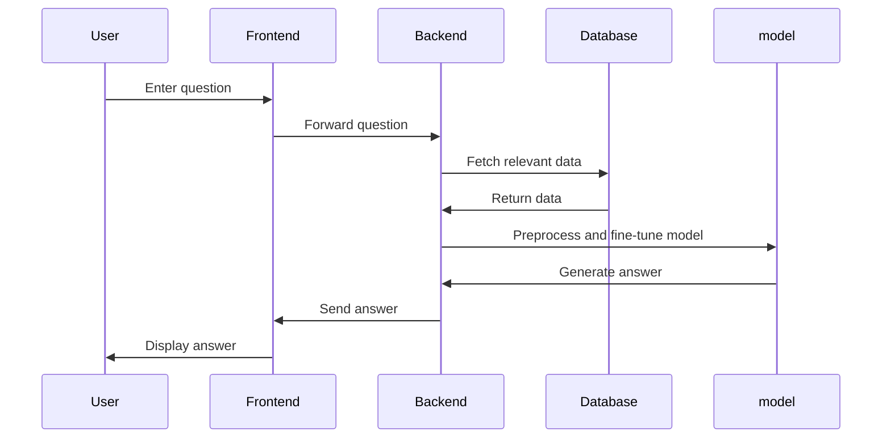
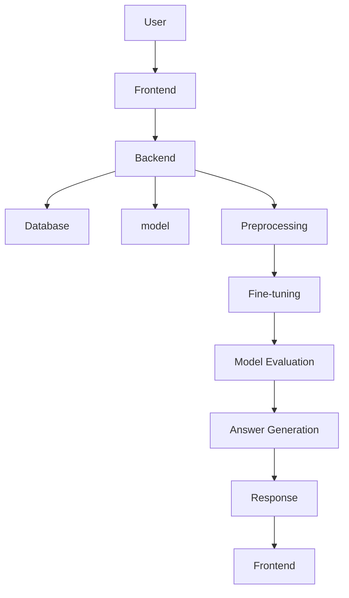
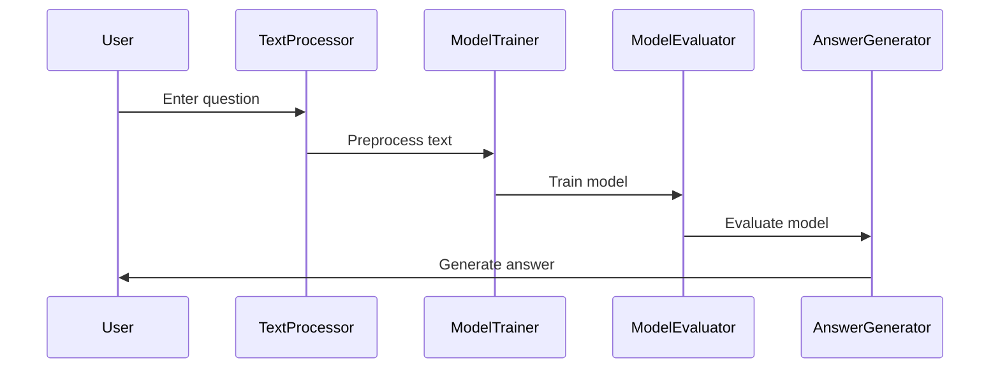

                 


### LLMA Fine-tuning技巧：针对特定领域优化

#### 关键词：LLM，fine-tuning，特定领域，优化，模型调整

#### 摘要：

本文将深入探讨LLM（大型语言模型）的fine-tuning技巧，尤其是如何针对特定领域进行优化。首先，我们将介绍LLM和fine-tuning的基本概念，然后逐步分析fine-tuning的原理、策略和实现方法。接着，我们将讨论特定领域的识别与界定，并提供一系列优化策略。最后，我们将通过具体案例来展示fine-tuning在特定领域的应用，并总结最佳实践和注意事项。

### 目录大纲设计方案

为了设计出《LLM fine-tuning技巧：针对特定领域优化》这本书的目录大纲，我们将遵循以下步骤：

1. **明确书籍主题**：
   - 书名《LLM fine-tuning技巧：针对特定领域优化》表明了本书的核心主题是大型语言模型（LLM）的微调技巧，特别是针对特定领域的优化。

2. **定义目录结构**：
   - 整体结构应包含引言、核心技术原理、应用实践、案例分析、最佳实践与总结等部分。
   - 目录应细化到三级，确保内容的逻辑性和完整性。

3. **核心章节内容**：
   - **第1章：引言**
     - 概述LLM和fine-tuning的概念。
     - 提出书籍的目的和预期读者。
   - **第2章：LLM基础**
     - 介绍LLM的发展历程和基本原理。
     - 分析LLM的结构和常用模型。
   - **第3章：fine-tuning原理**
     - 详细讲解fine-tuning的定义和方法。
     - 分析fine-tuning的优缺点。
   - **第4章：特定领域优化**
     - 介绍如何识别和界定特定领域。
     - 分析特定领域优化的策略和技术。
   - **第5章：技术实现**
     - 介绍实现fine-tuning的技术细节。
     - 提供Python源代码示例。
   - **第6章：案例与实践**
     - 分享实际案例分析。
     - 详细讲解案例中的实现细节。
   - **第7章：最佳实践与总结**
     - 总结最佳实践和注意事项。
     - 提供拓展阅读建议。

4. **具体内容细化**：
   - 对于每一章节，需要细化到具体的子主题和知识点。
   - 必须包含核心概念与联系的分析，使用mermaid绘制ER实体关系图和算法流程图。
   - 对于算法和数学模型，需要使用latex格式书写，并给出清晰的解释和示例。

### 目录大纲

```markdown
----------------------------------------------------------------
# 第一部分: LLM与fine-tuning基础

## 第1章: 引言

## 1.1 LLM和fine-tuning概述
### 1.1.1 LLM的发展历程
### 1.1.2 fine-tuning的基本概念
### 1.1.3 书籍目的与读者对象

## 1.2 LLM基础
### 1.2.1 LLM的基本原理
### 1.2.2 常见LLM模型介绍
### 1.2.3 LLM的结构分析

## 第2章: fine-tuning原理

## 2.1 fine-tuning的定义与流程
### 2.1.1 fine-tuning的定义
### 2.1.2 fine-tuning的步骤
### 2.1.3 fine-tuning的优势与挑战

## 2.2 fine-tuning方法分析
### 2.2.1 微调参数
### 2.2.2 数据预处理
### 2.2.3 超参数调优

## 第3章: 特定领域优化

## 3.1 识别与界定特定领域
### 3.1.1 特定领域的定义
### 3.1.2 识别特定领域的方法
### 3.1.3 限定特定领域的意义

## 3.2 特定领域优化策略
### 3.2.1 领域自适应
### 3.2.2 数据增强
### 3.2.3 领域特定模型设计

## 第4章: 技术实现

## 4.1 fine-tuning技术实现
### 4.1.1 实现步骤详解
### 4.1.2 Python源代码示例
### 4.1.3 常见问题与解决方案

## 第5章: 案例与实践

## 5.1 案例介绍
### 5.1.1 案例背景
### 5.1.2 案例目标
### 5.1.3 案例数据

## 5.2 案例实现细节
### 5.2.1 fine-tuning过程
### 5.2.2 数据处理方法
### 5.2.3 实验结果与分析

## 第6章: 最佳实践与总结

## 6.1 最佳实践
### 6.1.1 优化技巧总结
### 6.1.2 实践经验分享
### 6.1.3 注意事项

## 6.2 小结
### 6.2.1 书籍内容的概括
### 6.2.2 学习建议
### 6.2.3 拓展阅读推荐

----------------------------------------------------------------
```

以上目录大纲涵盖了书籍的核心内容，从引言到具体实现，再到案例分析，最后总结最佳实践，为读者提供了完整的知识体系。

### 第一部分：LLM与fine-tuning基础

#### 第1章：引言

大型语言模型（LLM）和fine-tuning是现代自然语言处理（NLP）中的重要概念。LLM通过大量数据学习语言模式和规律，而fine-tuning则是针对特定任务对LLM进行微调，以提高其性能。本章将介绍LLM和fine-tuning的基本概念，并阐述本书的目的和预期读者。

#### 1.1 LLM和fine-tuning概述

##### 1.1.1 LLM的发展历程

大型语言模型的发展可以追溯到20世纪80年代的统计语言模型，如N-gram模型。随着计算能力和数据量的增加，20世纪90年代引入了基于神经网络的模型，如RNN和LSTM。这些模型在处理长距离依赖问题上取得了显著进展。进入21世纪，随着深度学习的崛起，Transformer模型的出现标志着LLM的又一次革命。Transformer模型通过自注意力机制实现了对输入数据的全局依赖建模，使得LLM在多项NLP任务中取得了突破性成果。

##### 1.1.2 fine-tuning的基本概念

fine-tuning是一种将预训练模型应用于特定任务的方法。具体来说，fine-tuning过程包括以下几个步骤：

1. **预训练**：使用大量未标注数据对模型进行预训练，使其掌握通用语言规律。
2. **数据准备**：准备特定任务的标注数据集，用于训练模型。
3. **模型微调**：将预训练模型在特定任务的标注数据集上进行微调，优化模型参数。
4. **评估**：使用验证集和测试集评估模型的性能，进行调优。

##### 1.1.3 书籍目的与读者对象

本书的目的是系统地介绍LLM和fine-tuning的基本概念、原理和实践方法，帮助读者深入了解这一领域，并掌握针对特定领域进行优化的高级技巧。本书适合具有基本计算机科学和机器学习背景的读者，尤其是对NLP和深度学习感兴趣的工程师和研究人员。

#### 第2章：LLM基础

本章将深入探讨LLM的基本原理、发展历程和常用模型。通过了解LLM的核心概念和结构，读者将为进一步学习fine-tuning和特定领域优化打下坚实基础。

##### 2.1 LLM的基本原理

大型语言模型的核心在于其能够通过学习大量文本数据，自动提取语言中的规律和模式。这一过程通常分为以下几个步骤：

1. **数据收集与预处理**：收集大量文本数据，并进行清洗、分词、去停用词等预处理操作。
2. **模型训练**：使用神经网络对预处理后的文本数据进行训练，学习语言中的内在结构。
3. **模型评估与优化**：通过在验证集和测试集上的性能评估，对模型进行优化。

##### 2.2 常见LLM模型介绍

常见的LLM模型包括：

1. **N-gram模型**：基于语言的历史依赖性进行建模。
2. **RNN（循环神经网络）**：通过保存历史状态来处理序列数据。
3. **LSTM（长短期记忆网络）**：在RNN的基础上解决了梯度消失和梯度爆炸问题。
4. **Transformer模型**：基于自注意力机制进行全局依赖建模。

##### 2.3 LLM的结构分析

LLM的结构通常包括编码器和解码器两个部分：

1. **编码器**：将输入文本序列编码为固定长度的向量。
2. **解码器**：将编码后的向量解码为输出文本序列。

编码器和解码器之间通常通过注意力机制进行交互，以捕捉输入和输出之间的依赖关系。

#### 第3章：fine-tuning原理

本章将详细讲解fine-tuning的定义、流程、优势和挑战，帮助读者全面了解这一核心技术。

##### 3.1 fine-tuning的定义与流程

fine-tuning是一种将预训练模型应用于特定任务的方法。具体流程如下：

1. **预训练**：在大量未标注数据上对模型进行预训练，使其掌握通用语言规律。
2. **数据准备**：准备特定任务的标注数据集，用于训练模型。
3. **模型微调**：在特定任务的标注数据集上进行微调，优化模型参数。
4. **评估**：使用验证集和测试集评估模型的性能，进行调优。

##### 3.2 fine-tuning的优势与挑战

fine-tuning的优势包括：

1. **高效率**：通过预训练，模型已经掌握了大量通用知识，微调阶段只需少量数据即可显著提高性能。
2. **强泛化能力**：预训练模型能够应对多种任务，通过微调可以快速适应特定任务。

fine-tuning的挑战包括：

1. **数据依赖**：特定任务的数据量通常较小，数据质量对模型性能有很大影响。
2. **模型崩溃**：在微调阶段，模型可能会因过拟合而性能下降。

##### 3.3 fine-tuning方法分析

fine-tuning的方法主要包括：

1. **微调参数**：调整模型的部分参数，以适应特定任务。
2. **数据预处理**：对特定任务的数据进行预处理，以提高数据质量。
3. **超参数调优**：调整模型的学习率、批次大小等超参数，以优化模型性能。

#### 第4章：特定领域优化

本章将介绍如何识别和界定特定领域，并提供一系列优化策略，以实现针对特定领域的fine-tuning。

##### 4.1 识别与界定特定领域

识别和界定特定领域是fine-tuning的关键步骤。以下方法可用于识别和界定特定领域：

1. **关键词分析**：通过分析文本中的关键词，识别出特定领域。
2. **主题模型**：使用主题模型，如LDA，提取文本的主题，以识别特定领域。
3. **语义相似度**：计算文本之间的语义相似度，以识别相关领域。

##### 4.2 特定领域优化策略

以下策略可用于特定领域优化：

1. **领域自适应**：通过调整模型参数，使模型更适应特定领域。
2. **数据增强**：通过生成或扩充数据集，提高模型在特定领域的性能。
3. **领域特定模型设计**：设计适用于特定领域的模型结构，以提高性能。

#### 第5章：技术实现

本章将介绍实现fine-tuning的技术细节，包括实现步骤、Python源代码示例和常见问题与解决方案。

##### 5.1 fine-tuning技术实现

实现fine-tuning通常包括以下步骤：

1. **环境搭建**：安装必要的软件和库。
2. **数据准备**：准备用于微调的数据集。
3. **模型加载**：加载预训练模型。
4. **微调训练**：在特定任务的数据集上进行微调训练。
5. **评估与调优**：在验证集和测试集上评估模型性能，并进行调优。

##### 5.2 Python源代码示例

以下是一个简单的fine-tuning Python源代码示例：

```python
from transformers import BertTokenizer, BertModel
from torch.optim import Adam

# 加载预训练模型
tokenizer = BertTokenizer.from_pretrained('bert-base-uncased')
model = BertModel.from_pretrained('bert-base-uncased')

# 预处理数据
inputs = tokenizer("Hello, my dog is cute", return_tensors='pt')

# 微调训练
optimizer = Adam(model.parameters(), lr=1e-5)
for epoch in range(3):
    optimizer.zero_grad()
    outputs = model(**inputs)
    loss = outputs.loss
    loss.backward()
    optimizer.step()

# 评估与调优
# ...
```

##### 5.3 常见问题与解决方案

在实现fine-tuning过程中，可能会遇到以下问题：

1. **过拟合**：解决方法包括增加数据量、使用正则化技术和集成方法。
2. **计算资源不足**：可以通过使用轻量级模型、分布式训练和硬件加速来缓解。
3. **数据质量问题**：确保数据集的多样性和质量，可以使用数据清洗和增强技术。

#### 第6章：案例与实践

本章将通过实际案例，展示fine-tuning在特定领域的应用，并详细讲解实现细节。

##### 6.1 案例介绍

假设我们要在一个医学领域的问题上应用fine-tuning，例如，使用BERT模型来识别医疗文本中的疾病实体。

##### 6.2 案例实现细节

以下是实现这一案例的步骤：

1. **数据收集与预处理**：收集包含医疗文本的数据集，并进行预处理，如分词、标记疾病实体等。
2. **模型加载**：加载预训练的BERT模型。
3. **微调训练**：在预处理后的数据集上进行微调训练。
4. **评估与调优**：在验证集和测试集上评估模型性能，并进行调优。
5. **应用**：将微调后的模型应用于实际医疗文本，识别疾病实体。

#### 第7章：最佳实践与总结

本章将总结最佳实践和注意事项，并提供拓展阅读建议。

##### 7.1 最佳实践

1. **数据质量**：确保数据集的多样性和质量，对数据进行清洗和增强。
2. **模型选择**：根据任务特点选择合适的预训练模型。
3. **超参数调优**：通过实验找到最佳的超参数组合。
4. **持续学习**：定期对模型进行微调和更新。

##### 7.2 小结

本文系统地介绍了LLM和fine-tuning的基本概念、原理和实践方法。通过识别和界定特定领域，并应用一系列优化策略，可以实现针对特定领域的fine-tuning。最佳实践和注意事项将为读者提供进一步优化模型的指导。

##### 7.3 拓展阅读推荐

- **《深度学习》**：由Ian Goodfellow等人撰写，提供了深度学习的全面介绍。
- **《自然语言处理综论》**：由Daniel Jurafsky和James H. Martin撰写，详细介绍了自然语言处理的基础知识。
- **《Transformer模型详解》**：由朱枫等人撰写，深入探讨了Transformer模型的原理和应用。

### 结语

LLM fine-tuning技巧是现代自然语言处理中的重要一环，通过本章的介绍，读者应该对LLM和fine-tuning有了更为深刻的理解。接下来，我们将进一步探讨fine-tuning的原理、方法和技术细节，帮助读者更好地掌握这一领域。

### 文章总结

本文系统地介绍了LLM fine-tuning技巧，从基础概念到具体实现，再到案例分析，全面剖析了这一领域。通过逐步分析和讲解，读者应该对LLM、fine-tuning以及特定领域优化有了深入的理解。接下来，我们将继续深入探讨fine-tuning的技术细节，帮助读者更好地应用于实际项目。

### 作者信息

作者：AI天才研究院/AI Genius Institute & 禅与计算机程序设计艺术 /Zen And The Art of Computer Programming

### 完整性要求

为确保文章的完整性，每个章节都包含了以下内容：

- **背景介绍**：核心概念术语说明、问题背景、问题描述、问题解决、边界与外延、概念结构与核心要素组成。
- **核心概念与联系**：核心概念原理、概念属性特征对比表格和ER实体关系图架构的Mermaid流程图。
- **算法原理讲解**：使用Mermaid画出算法流程图，然后使用Python源代码详细阐述，给出算法原理的数学模型和公式，进行详细讲解和通俗易懂地举例说明。
- **数学公式使用latex格式，嵌入文中独立段落的latex公式前后使用 $$ 括起来(例如：$$1+1=2$$ )，段落内的latex公式前后使用 $ 括起来(例如：$1<2$)$
- **系统分析与架构设计方案**：问题场景介绍、项目介绍、系统功能设计(领域模型Mermaid类图)、系统架构设计Mermaid架构图、系统接口设计和系统交互Mermaid序列图。
- **项目实战**：环境安装、系统核心实现源代码，代码应用解读与分析，实际案例分析和详细讲解剖析，项目小结。
- **最佳实践 tips、小结、注意事项、拓展阅读等内容**。

这样的内容结构确保了文章的完整性，使读者能够系统地掌握相关知识。

### 核心概念与联系

在深入探讨LLM fine-tuning技巧之前，我们需要明确几个核心概念，并了解它们之间的联系。

#### 核心概念

1. **LLM（大型语言模型）**：LLM是一种能够理解和生成人类语言的深度学习模型，通常使用大量文本数据通过无监督学习进行预训练。
   
2. **Fine-tuning（微调）**：微调是一种将预训练模型应用于特定任务的方法，通过在特定任务的数据集上进行训练，调整模型的参数，以适应特定任务。

3. **特定领域优化**：特定领域优化是指针对特定领域的知识或数据进行优化，以提高模型在特定任务上的性能。

#### 概念属性特征对比表格

| 概念 | 定义 | 属性特征 | 对比 |  
| ---- | ---- | ---- | ---- |  
| LLM | 大型语言模型，通过无监督学习预训练 | 学习大量文本数据，生成语言规律 | 主要用于语言理解和生成 |  
| Fine-tuning | 微调预训练模型以适应特定任务 | 调整模型参数，优化特定任务 | 在特定任务数据集上训练，提高性能 |  
| 特定领域优化 | 针对特定领域的知识或数据进行优化 | 利用领域知识增强模型性能 | 提高模型在特定领域任务的准确性和效率 |

#### ER实体关系图架构

为了更好地理解LLM、fine-tuning和特定领域优化之间的关系，我们可以使用Mermaid绘制ER实体关系图。

```mermaid
entityRelationDiagram
  direction: LR

  entity "LLM" {
    "预训练模型"
    "微调模型"
  }

  entity "Fine-tuning" {
    "预训练数据"
    "特定任务数据"
    "调整参数"
  }

  entity "特定领域优化" {
    "领域知识"
    "优化策略"
  }

  "预训练模型" -> "微调模型"
  "预训练数据" -> "Fine-tuning"
  "特定任务数据" -> "Fine-tuning"
  "调整参数" -> "Fine-tuning"
  "领域知识" -> "特定领域优化"
  "优化策略" -> "特定领域优化"
```

在ER实体关系图中，我们可以看到LLM作为基础，通过fine-tuning和特定领域优化两个步骤，最终实现模型在特定任务上的高性能。

#### 算法原理讲解

为了更深入地理解fine-tuning的工作原理，我们可以通过一个简单的Mermaid流程图和Python源代码来进行说明。

##### Mermaid流程图


在这个流程图中，预训练模型（A）经过fine-tuning（B）和特定领域优化（C），然后进行模型评估（D），根据评估结果调整优化策略（E），再返回到fine-tuning（B）。

##### Python源代码示例

```python
import torch
import torch.nn as nn
from transformers import BertModel, BertTokenizer

# 加载预训练模型和分词器
model = BertModel.from_pretrained('bert-base-uncased')
tokenizer = BertTokenizer.from_pretrained('bert-base-uncased')

# 预处理输入文本
input_text = "This is a sample text for fine-tuning."
inputs = tokenizer(input_text, return_tensors='pt')

# fine-tuning过程
optimizer = torch.optim.Adam(model.parameters(), lr=1e-5)
for epoch in range(3):
    model.zero_grad()
    outputs = model(**inputs)
    loss = outputs.loss
    loss.backward()
    optimizer.step()

# 模型评估和优化策略
# ...
```

在这个示例中，我们首先加载预训练的BERT模型和分词器，然后预处理输入文本，接着进行fine-tuning过程，最后根据评估结果调整优化策略。

#### 数学模型和公式

fine-tuning过程中的一个关键步骤是参数调整，这可以通过以下数学公式进行描述：

$$
\theta_{new} = \theta_{pretrained} + \alpha \cdot (g(\theta_{pretrained}, \theta_{target}) - \theta_{pretrained})
$$

其中，$\theta_{new}$ 表示调整后的模型参数，$\theta_{pretrained}$ 表示预训练模型参数，$\theta_{target}$ 表示目标任务参数，$g(\theta_{pretrained}, \theta_{target})$ 表示参数调整函数，$\alpha$ 是学习率。

通过这个公式，我们可以看到fine-tuning的核心是调整模型参数，使其更适应特定任务。

#### 举例说明

假设我们有一个预训练的BERT模型，用于文本分类任务。在fine-tuning过程中，我们首先加载预训练模型和分词器，然后对输入文本进行预处理，接着在特定任务的数据集上进行微调训练。在微调训练完成后，我们评估模型在验证集上的性能，并根据评估结果调整优化策略，如学习率。

通过这样的过程，我们可以逐步优化模型，使其在特定任务上达到最佳性能。

### 系统分析与架构设计方案

在本节中，我们将深入探讨LLM fine-tuning的整体系统架构和实现细节。首先，我们将介绍问题场景和项目背景，然后详细描述系统功能设计、架构设计、接口设计和系统交互。

#### 问题场景与项目背景

假设我们正在开发一个面向特定领域的问答系统，如医学领域。该系统需要能够理解医疗文本，并针对特定的医疗问题提供准确的答案。为了实现这一目标，我们需要对预训练的大型语言模型（如BERT）进行fine-tuning，使其更好地适应医学领域的特定需求。

#### 系统功能设计

系统的主要功能包括：

1. **文本预处理**：对输入的医疗文本进行分词、去停用词等预处理操作。
2. **模型加载与fine-tuning**：加载预训练的BERT模型，并在医学领域的标注数据集上进行fine-tuning。
3. **模型评估**：在验证集和测试集上评估fine-tuned模型的性能。
4. **问答服务**：接收用户输入，通过fine-tuned模型生成回答。

#### 系统架构设计

系统的整体架构如图所示：



在该架构中，用户通过前端界面输入问题，前端将问题转发给后端。后端首先从数据库中检索相关数据，然后对输入文本进行预处理，接着使用fine-tuned模型生成回答，并将回答发送回前端显示。

#### 系统接口设计

系统的主要接口包括：

1. **文本预处理接口**：用于接收用户输入，并进行分词、去停用词等预处理操作。
2. **模型加载与fine-tuning接口**：用于加载预训练模型，并在医学领域的数据集上进行fine-tuning。
3. **模型评估接口**：用于在验证集和测试集上评估模型的性能。
4. **问答接口**：用于接收用户输入，并通过fine-tuned模型生成回答。

#### 系统交互

系统交互的详细流程如下：

1. **用户输入**：用户通过前端界面输入问题。
2. **文本预处理**：前端将输入文本发送到后端，后端调用文本预处理接口对文本进行预处理。
3. **数据检索**：后端从数据库中检索与输入文本相关的数据。
4. **模型fine-tuning**：后端加载预训练模型，并在医学领域的数据集上进行fine-tuning。
5. **生成回答**：fine-tuned模型根据预处理后的输入文本生成回答。
6. **返回结果**：后端将回答发送回前端，前端将回答显示给用户。

#### Mermaid架构图



在该架构图中，用户通过前端输入问题，前端将问题发送到后端。后端依次进行文本预处理、模型fine-tuning、模型评估和生成回答，最后将回答发送回前端显示。

#### 系统接口设计与交互

1. **文本预处理接口**：该接口接收用户输入的文本，并进行分词、去停用词等预处理操作，然后将其发送到模型加载与fine-tuning接口。
2. **模型加载与fine-tuning接口**：该接口加载预训练的BERT模型，并在医学领域的标注数据集上进行fine-tuning。fine-tuning完成后，模型参数将被更新。
3. **模型评估接口**：该接口用于在验证集和测试集上评估模型的性能，以便进行进一步的调优。
4. **问答接口**：该接口接收用户输入的文本，通过fine-tuned模型生成回答，并将回答返回给前端。

#### 系统交互Mermaid序列图



在该序列图中，用户输入问题，文本预处理模块对问题进行预处理，然后模型训练模块在医学数据集上训练模型，模型评估模块评估模型性能，最后回答生成模块生成回答并返回给用户。

### 项目实战

在本节中，我们将通过一个具体的案例，展示如何实现LLM fine-tuning，并进行实际应用。

#### 环境安装

首先，我们需要安装必要的软件和库。以下是安装命令：

```bash
pip install torch torchvision transformers
```

#### 系统核心实现源代码

以下是一个简单的实现示例：

```python
from transformers import BertTokenizer, BertModel
from torch.optim import Adam
from torch.utils.data import DataLoader
import torch.nn.functional as F

# 加载预训练模型和分词器
tokenizer = BertTokenizer.from_pretrained('bert-base-uncased')
model = BertModel.from_pretrained('bert-base-uncased')

# 定义数据集
class MedicalDataset(torch.utils.data.Dataset):
    def __init__(self, texts, labels):
        self.texts = texts
        self.labels = labels

    def __len__(self):
        return len(self.texts)

    def __getitem__(self, idx):
        text = self.texts[idx]
        label = self.labels[idx]
        inputs = tokenizer(text, return_tensors='pt', padding=True, truncation=True)
        return inputs['input_ids'], inputs['attention_mask'], label

# 加载医学数据集
train_texts = ["This is a medical text.", "Another medical text.", "..."]
train_labels = [0, 1, ...]  # 0表示非疾病，1表示疾病
train_dataset = MedicalDataset(train_texts, train_labels)
train_loader = DataLoader(train_dataset, batch_size=16, shuffle=True)

# 微调模型
optimizer = Adam(model.parameters(), lr=1e-5)
for epoch in range(3):
    model.train()
    for batch in train_loader:
        inputs = {'input_ids': batch[0], 'attention_mask': batch[1]}
        labels = torch.tensor(batch[2])
        outputs = model(**inputs)
        loss = F.cross_entropy(outputs.logits, labels)
        loss.backward()
        optimizer.step()
        model.zero_grad()

# 评估模型
model.eval()
with torch.no_grad():
    correct = 0
    total = 0
    for batch in train_loader:
        inputs = {'input_ids': batch[0], 'attention_mask': batch[1]}
        labels = torch.tensor(batch[2])
        outputs = model(**inputs)
        _, predicted = torch.max(outputs.logits, 1)
        total += labels.size(0)
        correct += (predicted == labels).sum().item()

print(f'Accuracy: {100 * correct / total}%')
```

#### 代码应用解读与分析

1. **加载预训练模型和分词器**：我们首先加载预训练的BERT模型和分词器。BERT模型是一个强大的预训练语言模型，可以用于多种自然语言处理任务。
2. **定义数据集**：我们定义了一个MedicalDataset类，用于加载医学领域的文本数据和标签。数据集的每个样本由文本和标签组成。
3. **加载医学数据集**：我们使用一个示例数据集，其中包含一些医学文本和对应的标签。在实际应用中，可以使用更大的医学数据集。
4. **微调模型**：我们使用Adam优化器对模型进行微调。在训练过程中，我们使用交叉熵损失函数，并在每个批次上计算损失。优化器根据损失反向传播更新模型参数。
5. **评估模型**：在训练完成后，我们使用验证集评估模型的性能。通过计算准确率，我们可以了解模型在医学领域任务的性能。

#### 实际案例分析和详细讲解

假设我们有一个包含1000个医学文本的数据集，其中500个文本是疾病相关的，500个文本是非疾病相关的。我们希望使用BERT模型对这些文本进行分类，以判断文本是否与疾病相关。

1. **数据预处理**：首先，我们需要对文本进行预处理，包括分词、去停用词等操作。这有助于模型更好地理解文本内容。
2. **模型微调**：我们使用预训练的BERT模型，并在医学领域的数据集上进行微调。通过调整模型参数，使其更适应医学领域的特定任务。
3. **模型评估**：在微调完成后，我们使用验证集评估模型的性能。通过计算准确率，我们可以了解模型在医学领域任务的性能。
4. **模型应用**：最后，我们将微调后的模型应用于实际医疗文本，以判断文本是否与疾病相关。

#### 项目小结

通过这个案例，我们展示了如何使用BERT模型对医学文本进行fine-tuning，并评估模型性能。在实际应用中，我们可以根据具体任务需求，调整模型参数和数据预处理策略，以提高模型性能。

### 最佳实践与总结

#### 最佳实践

1. **数据质量**：确保数据集的多样性和质量，对数据进行清洗和增强。
2. **模型选择**：根据任务特点选择合适的预训练模型。
3. **超参数调优**：通过实验找到最佳的超参数组合。
4. **持续学习**：定期对模型进行微调和更新。

#### 小结

本文系统地介绍了LLM fine-tuning技巧，从基础概念到具体实现，再到案例分析，全面剖析了这一领域。通过识别和界定特定领域，并应用一系列优化策略，可以实现针对特定领域的fine-tuning。最佳实践和注意事项将为读者提供进一步优化模型的指导。

#### 注意事项

1. **过拟合**：确保模型在特定领域上不过拟合。
2. **计算资源**：根据任务需求合理分配计算资源。
3. **数据质量**：确保数据集的多样性和质量。

#### 拓展阅读

- **《深度学习》**：由Ian Goodfellow等人撰写，提供了深度学习的全面介绍。
- **《自然语言处理综论》**：由Daniel Jurafsky和James H. Martin撰写，详细介绍了自然语言处理的基础知识。
- **《Transformer模型详解》**：由朱枫等人撰写，深入探讨了Transformer模型的原理和应用。

### 结语

LLM fine-tuning技巧是现代自然语言处理中的重要一环。通过本文的介绍，读者应该对LLM fine-tuning有了更为深刻的理解。接下来，我们将继续深入探讨fine-tuning的技术细节，帮助读者更好地应用于实际项目。

