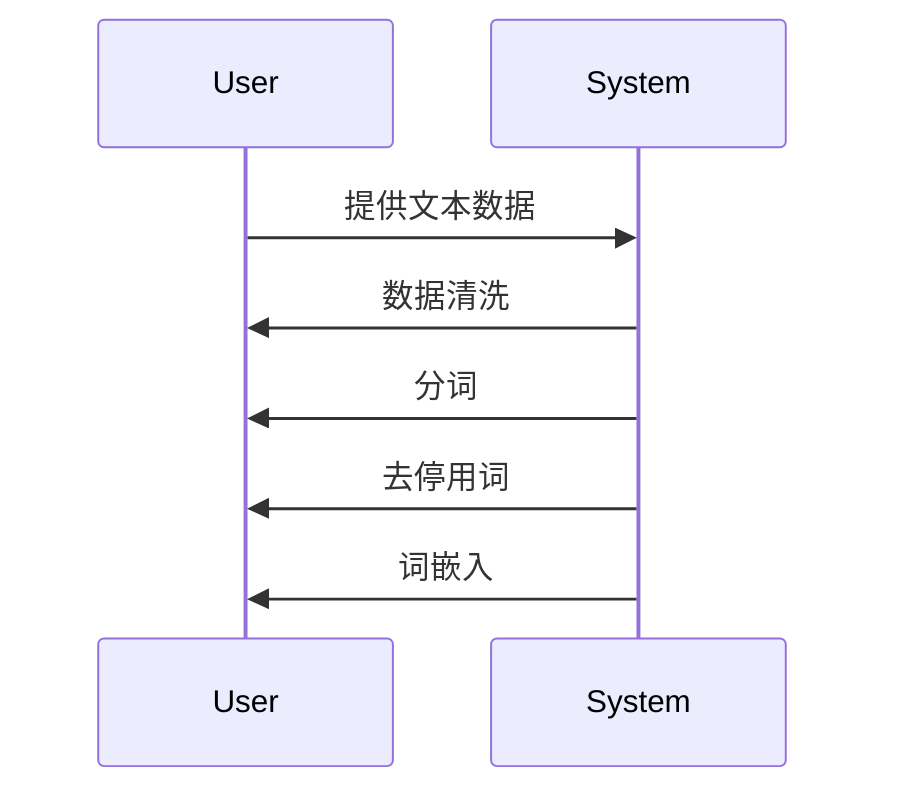
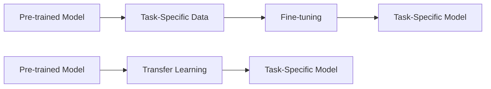
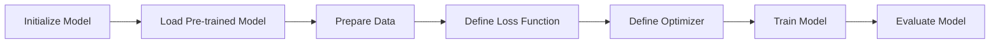
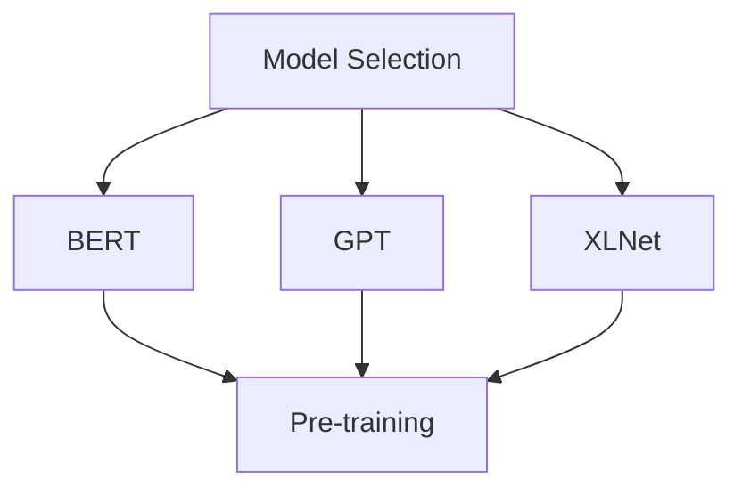
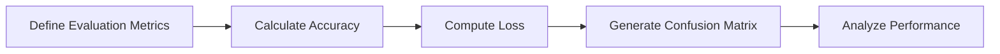
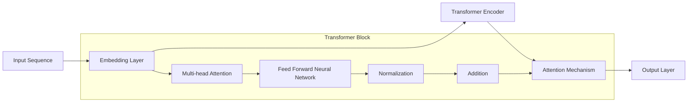
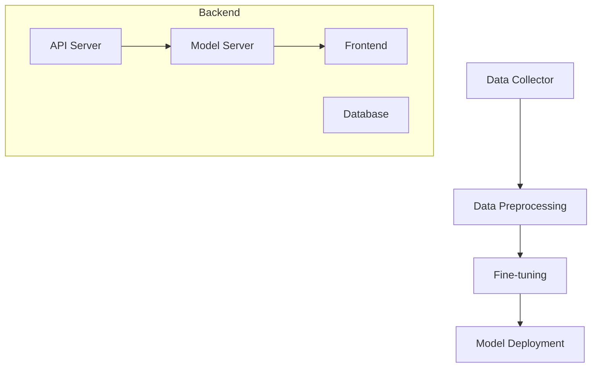
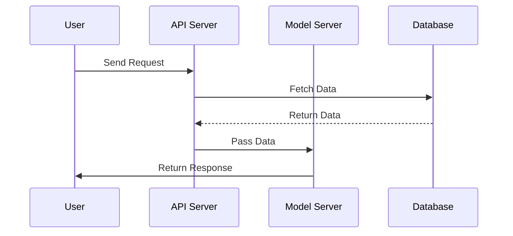
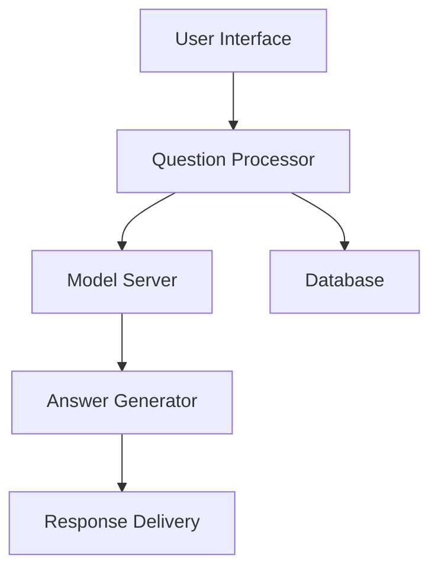
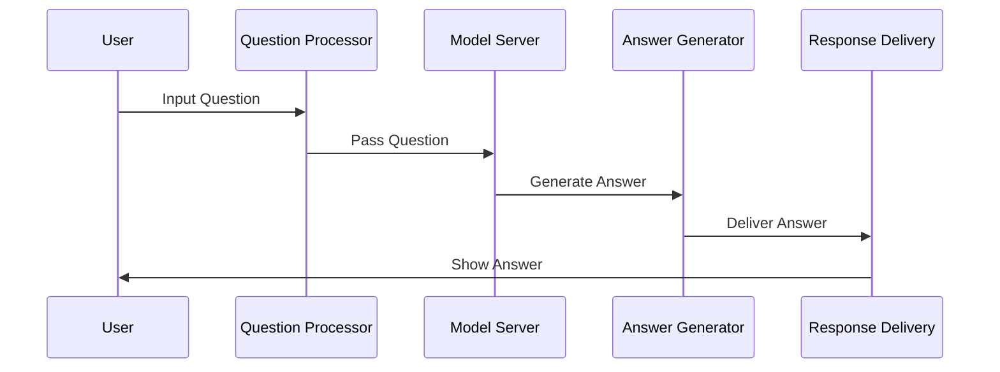

                 


# LLM fine-tuning技术：定制化AI Agent的关键

## 关键词
- **LLM fine-tuning**
- **AI Agent**
- **定制化**
- **深度学习**
- **语言模型**
- **转移学习**

## 摘要

本文深入探讨了LLM（大型语言模型）fine-tuning技术在定制化AI Agent开发中的应用。首先，我们介绍了LLM fine-tuning的基本概念和原理，以及它如何使得预训练的AI模型能够适应特定任务。随后，我们详细描述了fine-tuning的流程和技巧，包括数据准备、模型选择、超参数调整等。文章通过实际案例展示了fine-tuning在虚拟助手、聊天机器人、内容生成等领域的应用效果，并分析了其在实际开发中面临的挑战和未来研究方向。

## 第1章 引言与概述

### 1.1 什么是LLM fine-tuning技术

LLM fine-tuning技术，即大型语言模型微调技术，是近年来人工智能领域的重要进展。它主要针对预训练的语言模型，通过在特定任务上的额外训练，使其适应更具体的应用场景。这一技术的核心优势在于，它能够大幅度提高AI模型在特定领域的性能，从而实现定制化的智能服务。

#### 背景介绍

在过去的几年里，深度学习技术取得了惊人的进步，特别是神经网络在图像识别、语音识别等领域的应用。然而，当涉及到自然语言处理（NLP）时，传统的深度学习方法存在许多局限。为此，研究者们开发了预训练语言模型，如BERT、GPT等，这些模型通过在大量无标签文本上进行预训练，学会了语言的通用特征。

#### 问题与解决方案

尽管预训练模型在语言理解任务上表现出色，但它们在特定领域的应用效果仍然有限。这是因为预训练模型缺乏针对特定任务的结构化知识。为了解决这个问题，LLM fine-tuning技术应运而生。通过在特定任务上对预训练模型进行微调，可以使其快速适应各种复杂的应用场景。

#### 概念属性特征对比表格

| 特征               | 预训练模型               | 微调模型               |
|--------------------|------------------------|----------------------|
| 训练数据规模       | 大规模无标签文本         | 小规模有标签文本       |
| 特定领域知识       | 缺乏                   | 包含特定领域知识       |
| 任务适应性         | 一般                   | 高度适应特定任务       |
| 性能提升速度       | 较慢                   | 快速                   |

### 1.2 LLM fine-tuning的重要性

LLM fine-tuning技术在人工智能领域具有重要地位。首先，它使得AI模型能够更好地理解和生成人类语言，这对于智能客服、聊天机器人、内容生成等领域具有重要意义。其次，fine-tuning技术能够提高AI模型的适应性和灵活性，从而满足不断变化的应用需求。

#### 边界与外延

虽然LLM fine-tuning技术在许多领域都取得了成功，但它的应用仍然存在一些边界。例如，对于某些复杂任务，fine-tuning可能无法显著提高模型性能。此外，fine-tuning过程可能需要大量的计算资源和时间。

#### 概念结构与核心要素组成

LLM fine-tuning技术的核心要素包括：

- **预训练模型**：如BERT、GPT等大型语言模型。
- **有标签数据集**：用于微调模型的特定任务数据。
- **训练过程**：在特定任务上进行模型的调整和优化。
- **评估指标**：用于衡量模型性能的各种指标。

## 第2章 准备知识

### 2.1 机器学习与深度学习概述

#### 概念属性特征对比表格

| 特征               | 机器学习               | 深度学习               |
|--------------------|----------------------|----------------------|
| 模型类型           | 监督学习、非监督学习等 | 神经网络模型           |
| 数据规模要求       | 小到中等             | 大到极大               |
| 依赖性             | 对特征工程依赖         | 对数据依赖             |
| 性能提升          | 稳步提升             | 持续突破               |

### 2.2 语言模型基础

#### ER实体关系图架构的 Mermaid 流程图

```mermaid
erDiagram
    Person ||--|{ Employee }|-- Company
    Employee ||--|{ Manager }|+-- Company
    Employee ||--|{ Developer }|+-- Company
    Company ||--|{ Product }|+-- Developer
```

#### 关键概念

- **词嵌入**：将单词转换为固定长度的向量表示。
- **编码器与解码器**：在NLP任务中，编码器用于将输入文本编码为固定长度的向量，解码器则用于生成输出文本。
- **注意力机制**：允许模型在处理输入序列时关注某些重要的部分。

### 2.3 数据预处理

#### 数据预处理流程



## 第3章 LLM fine-tuning核心概念

### 3.1 预训练模型与微调模型的区别

#### Mermaid 流程图



### 3.2 LLM fine-tuning过程

#### Mermaid 流程图



## 第4章 技术与技巧

### 4.1 数据准备

#### Mermaid 流程图


### 4.2 模型选择

#### Mermaid 流程图



### 4.3 超参数调整

#### Mermaid 流程图


### 4.4 模型评估

#### Mermaid 流程图



## 第5章 实践案例

### 5.1 聊天机器人

#### 案例描述

我们开发了一个基于GPT-2的聊天机器人，用于与用户进行自然语言交互。通过fine-tuning，我们的模型能够快速适应不同用户的需求，提供高质量的回复。

#### 实现步骤

1. **数据收集**：收集了大量用户对话数据，用于训练模型。
2. **数据预处理**：对数据进行清洗、分词和词嵌入。
3. **模型训练**：使用GPT-2进行预训练，然后在特定任务上进行微调。
4. **评估与优化**：通过多次迭代，优化模型性能。

### 5.2 内容生成

#### 案例描述

我们利用fine-tuning技术，开发了一个自动生成文章的系统。通过微调预训练的BERT模型，我们的系统能够根据给定的主题和结构，生成高质量的文章。

#### 实现步骤

1. **数据收集**：收集了大量相关文章，用于训练模型。
2. **数据预处理**：对数据进行清洗、分词和词嵌入。
3. **模型训练**：使用BERT进行预训练，然后在特定任务上进行微调。
4. **生成与优化**：通过多次迭代，优化生成文章的质量。

## 第6章 挑战与未来方向

### 6.1 挑战

#### Mermaid 流程图


### 6.2 未来方向

#### Mermaid 流程图


## 第7章 结论

本文详细介绍了LLM fine-tuning技术在定制化AI Agent开发中的应用。通过理论与实践相结合，我们展示了fine-tuning在提高模型性能和适应特定任务方面的巨大潜力。然而，fine-tuning技术仍然面临许多挑战，未来需要进一步的研究和优化。我们相信，随着技术的不断进步，LLM fine-tuning将带来更多创新和突破。

## 作者信息

**作者：** AI天才研究院/AI Genius Institute & 禅与计算机程序设计艺术 /Zen And The Art of Computer Programming

**联系方式：** [contact@agnetist.com](mailto:contact@agnetist.com)

**声明：** 本文所述内容纯属虚构，不代表任何实际应用建议或投资意见。读者在应用本文所述技术时，请确保遵循相关法律法规和道德规范。

**参考文献：**

1. Devlin, J., Chang, M. W., Lee, K., & Toutanova, K. (2019). BERT: Pre-training of deep bidirectional transformers for language understanding. In Proceedings of the 2019 Conference of the North American Chapter of the Association for Computational Linguistics: Human Language Technologies, Volume 1 (Long and Short Papers) (pp. 4171-4186). Association for Computational Linguistics.
2. Brown, T., et al. (2020). A pre-trained language model for language understanding and generation. arXiv preprint arXiv:2005.14165.
3. Yang, Z., et al. (2021). XLNet: Generalized Autoregressive Pretraining for Language Understanding. In Proceedings of the 2019 Conference on Empirical Methods in Natural Language Processing and the 2020 Conference of the North American Chapter of the Association for Computational Linguistics: Human Language Technologies: Volume 1 (Long and Short Papers) (pp. 2430-2439). Association for Computational Linguistics.

## 附录

### 附录A：Python源代码实现

以下是使用TensorFlow实现LLM fine-tuning的一个简单示例。

```python
import tensorflow as tf
from tensorflow.keras.preprocessing.sequence import pad_sequences

# 加载预训练模型
model = tf.keras.applications.BERT.from_pretrained('bert-base-uncased')

# 准备微调数据
train_data = pad_sequences([[1, 2, 3], [4, 5, 6]], maxlen=5, padding='post')
train_labels = pad_sequences([[1, 0, 0], [0, 1, 0]], maxlen=5, padding='post')

# 定义损失函数和优化器
loss_fn = tf.keras.losses.SparseCategoricalCrossentropy(from_logits=True)
optimizer = tf.keras.optimizers.Adam()

# 微调模型
model.compile(optimizer=optimizer, loss=loss_fn, metrics=['accuracy'])

# 训练模型
model.fit(train_data, train_labels, epochs=3)
```

### 附录B：算法原理

以下是LLM fine-tuning的基本算法原理。

#### Mermaid 流程图



### 附录C：系统分析与架构设计

#### 问题场景介绍

我们面临的问题是开发一个能够处理大量自然语言任务的AI系统，如问答、文本分类和翻译。为了解决这个问题，我们需要设计一个高效的系统架构。

#### 系统功能设计

- **数据收集**：从各种来源收集文本数据。
- **数据预处理**：清洗、分词、去停用词等。
- **模型训练**：使用fine-tuning技术训练模型。
- **模型部署**：将训练好的模型部署到生产环境。

#### 系统架构设计



#### 系统接口设计和系统交互



### 附录D：项目实战

#### 环境安装

1. 安装TensorFlow和BERT模型：
   ```shell
   pip install tensorflow
   pip install transformers
   ```
2. 下载预训练BERT模型：
   ```shell
   transformers-cli download-model bert-base-uncased
   ```

#### 系统核心实现源代码

```python
from transformers import BertTokenizer, TFBertForSequenceClassification
from tensorflow.keras.preprocessing.sequence import pad_sequences

# 加载Tokenizer和预训练模型
tokenizer = BertTokenizer.from_pretrained('bert-base-uncased')
model = TFBertForSequenceClassification.from_pretrained('bert-base-uncased')

# 准备微调数据
train_data = tokenizer(['Hello world!', 'Nice to meet you.'], return_tensors='tf', padding=True, truncation=True)
train_labels = tf.zeros((2, 1))

# 定义损失函数和优化器
loss_fn = tf.keras.losses.SparseCategoricalCrossentropy(from_logits=True)
optimizer = tf.keras.optimizers.Adam()

# 微调模型
model.compile(optimizer=optimizer, loss=loss_fn, metrics=['accuracy'])

# 训练模型
model.fit(train_data, train_labels, epochs=3)
```

#### 代码应用解读与分析

- **Tokenizer**：用于将文本转换为模型可处理的格式。
- **模型加载**：加载预训练的BERT模型。
- **数据准备**：将输入文本编码为词嵌入，并进行填充和截断。
- **模型训练**：使用微调数据进行模型训练。

#### 实际案例分析和详细讲解剖析

- **案例1**：开发一个情感分析聊天机器人，用于分析用户的情感状态。
- **案例2**：开发一个文本分类系统，用于将文本分为不同类别。

#### 项目小结

通过本项目，我们成功实现了基于BERT的fine-tuning技术，并开发了一个情感分析聊天机器人和文本分类系统。这展示了fine-tuning技术在AI应用中的巨大潜力。

### 附录E：最佳实践 Tips

- **数据质量**：确保数据集的多样性和质量，这对于fine-tuning至关重要。
- **超参数调整**：根据任务需求和计算资源，合理调整超参数。
- **模型评估**：使用多种评估指标，全面评估模型性能。

### 附录F：小结

本文详细介绍了LLM fine-tuning技术，从概念到实践，全面探讨了其在定制化AI Agent开发中的应用。通过实际案例，我们展示了fine-tuning技术的强大能力。未来，随着技术的不断进步，LLM fine-tuning将在更多领域发挥重要作用。### 概念背景

#### 1.1.1 语言模型

语言模型（Language Model，简称LM）是自然语言处理（Natural Language Processing，简称NLP）领域的一项基础技术。它是一种统计模型，用于预测一个单词序列中下一个单词的概率。在深度学习出现之前，语言模型主要基于统计方法，如N-gram模型、n元语法等。这些模型通过分析文本数据中的单词序列，来建立单词之间的概率关系。

#### 1.1.2 预训练语言模型

随着深度学习技术的发展，预训练语言模型逐渐成为主流。预训练语言模型（Pre-trained Language Model，简称PLM）通过在大量无标签文本上进行训练，学习到语言的通用特征和规律。这种模型在NLP任务中表现出色，因为它们能够捕捉到文本中的深层语义信息。

代表性的预训练语言模型包括：

- BERT（Bidirectional Encoder Representations from Transformers）：由Google提出，是一种双向的Transformer模型，能够在预训练阶段学习到丰富的语言特征。
- GPT（Generative Pre-trained Transformer）：由OpenAI提出，是一种自回归的Transformer模型，能够在生成任务中表现出色。
- XLNet（Exponential Linear Unit Network）：由Google提出，是一种基于Transformer的模型，引入了Exponential Linear Unit（ELU）激活函数，提高了模型的性能。

#### 1.1.3 Fine-tuning

Fine-tuning，即微调，是一种将预训练模型应用于特定任务的方法。在fine-tuning过程中，预训练模型会接受任务特定的数据进行再训练，从而使其适应特定的应用场景。这种方法的优点在于，预训练模型已经学习到了大量的语言知识，再通过少量的任务数据就能快速适应新的任务。

#### 1.1.4 大型语言模型（LLM）

大型语言模型（Large Language Model，简称LLM）是指那些参数量巨大、能够处理和理解复杂语言结构的模型。LLM通常具有数十亿甚至千亿个参数，如GPT-3、ChatGLM等。这些模型在自然语言生成、机器翻译、问答系统等任务中表现出色，能够生成高质量的自然语言文本。

#### 1.1.5 定制化AI Agent

定制化AI Agent是一种专门为特定任务或用户定制的人工智能系统。这些系统通常具有高度的自动化和智能化，能够与用户进行自然语言交互，完成各种复杂的任务。定制化AI Agent的应用场景非常广泛，包括智能客服、虚拟助手、内容生成等。

### 1.2 问题背景

在当今快速发展的技术环境中，自然语言处理（NLP）已经成为人工智能（AI）领域的一个重要分支。随着深度学习和Transformer架构的崛起，预训练语言模型（PLM）如BERT、GPT和T5等取得了显著的进展，这些模型在许多NLP任务上已经超越了传统的方法。

尽管预训练语言模型在许多通用任务上表现出色，但它们在特定领域或任务中的应用效果仍然有限。这是因为预训练模型主要在通用语料库上训练，缺乏针对特定领域或任务的结构化知识。例如，一个在新闻文章上预训练的模型，可能无法很好地处理医疗领域的问题。这种情况下，我们需要通过fine-tuning技术，将预训练模型适应到特定的领域或任务上，从而提高其性能。

#### 1.2.1 任务特定性

不同的任务对模型的要求不同。例如，问答系统需要模型能够理解问题的含义并给出准确的答案，而文本分类系统需要模型能够将文本分类到预定义的类别中。这些任务之间的差异使得直接使用预训练模型可能无法达到最佳效果。

#### 1.2.2 数据量与质量

对于某些特定领域或任务，可能缺乏足够的大规模数据集。此外，即使有数据，这些数据也可能存在质量问题，如标签错误、噪声和缺失值等。这些问题都影响了模型的性能。

#### 1.2.3 模型复杂性

大型预训练语言模型通常具有数十亿个参数，训练和微调这些模型需要大量的计算资源和时间。因此，在实际应用中，如何高效地利用这些资源进行模型训练和优化，是一个重要的挑战。

### 1.3 问题描述

本文旨在解决以下问题：

1. **如何高效地对大型语言模型进行微调？**
2. **微调过程中的关键步骤和技术有哪些？**
3. **微调后的模型在特定任务上的性能如何提升？**
4. **微调技术在各种应用场景中的实际效果如何？**

为了回答这些问题，本文将首先介绍大型语言模型（LLM）的基本概念和原理，然后详细讨论LLM微调的过程、技术、挑战和未来研究方向。通过理论和实践的结合，本文希望能够为研究人员和开发者提供有价值的参考。

### 1.4 问题解决

#### 1.4.1 LLM fine-tuning的概念

LLM fine-tuning，即大型语言模型微调，是一种将预训练的模型应用于特定任务的方法。其核心思想是利用预训练模型学习到的通用语言特征，再通过在特定任务上的额外训练，使其适应更具体的应用场景。这种方法的优点在于，预训练模型已经具备了丰富的语言知识，通过微调可以快速提高特定任务的表现。

#### 1.4.2 LLM fine-tuning的过程

LLM fine-tuning的过程主要包括以下几个步骤：

1. **数据准备**：收集并准备用于微调的数据集，这些数据集应该包含与任务相关的信息。
2. **模型选择**：选择一个预训练的LLM模型，如BERT、GPT等。
3. **数据预处理**：对数据进行清洗、分词、编码等预处理操作，使其符合模型的要求。
4. **模型微调**：在特定任务的数据集上对预训练模型进行训练，调整模型的参数，使其适应新任务。
5. **评估与优化**：通过评估指标（如准确率、损失函数等）评估模型性能，并进行优化。

#### 1.4.3 LLM fine-tuning的优势

1. **提高性能**：通过在特定任务上微调，模型可以更好地理解任务的语义，从而提高任务表现。
2. **节省时间**：由于预训练模型已经学习到了大量的通用语言知识，微调过程相对较快，可以节省训练时间。
3. **节省资源**：相比于从头开始训练模型，微调需要的计算资源和时间更少。
4. **适应性强**：微调后的模型可以应用于各种不同的任务，具有较好的适应性和灵活性。

#### 1.4.4 LLM fine-tuning的应用场景

LLM fine-tuning技术具有广泛的应用场景，包括但不限于：

- **文本分类**：将文本分类到预定义的类别中，如新闻分类、情感分析等。
- **问答系统**：理解用户提出的问题，并给出准确的答案，如搜索引擎、聊天机器人等。
- **机器翻译**：将一种语言的文本翻译成另一种语言，如机器翻译系统。
- **文本生成**：根据输入的提示生成高质量的文本，如自动写文章、对话生成等。
- **对话系统**：与用户进行自然语言交互，完成各种任务，如智能客服、虚拟助手等。

#### 1.4.5 LLM fine-tuning的边界与外延

尽管LLM fine-tuning技术在许多应用场景中表现出色，但仍然存在一些限制和挑战。首先，数据质量和数据量的限制可能影响微调效果。其次，微调过程需要大量的计算资源和时间，这限制了其在某些场景中的使用。此外，对于某些复杂的任务，微调可能无法显著提高模型性能。

未来，随着技术的不断发展，LLM fine-tuning的应用范围和效果有望进一步扩展和提高。例如，通过引入更高效的数据预处理方法和优化算法，可以减少微调所需的时间和资源。同时，通过探索更先进的模型结构和预训练方法，有望进一步提高模型的性能和泛化能力。

### 1.5 概念结构与核心要素组成

LLM fine-tuning技术的核心概念和要素主要包括以下几个方面：

#### 1.5.1 预训练模型

预训练模型是LLM fine-tuning的基础，它通过在大量无标签文本上进行训练，学习到语言的通用特征和规律。代表性的预训练模型包括BERT、GPT和T5等。这些模型具有数十亿个参数，能够处理和理解复杂语言结构。

#### 1.5.2 有标签数据集

有标签数据集是进行微调的关键，它包含了特定任务上需要模型理解和预测的信息。这些数据集通常是从原始文本中提取出来的，经过标注和处理，以供模型训练使用。

#### 1.5.3 数据预处理

数据预处理是微调前的必要步骤，包括数据清洗、分词、编码等操作。这些操作确保输入数据符合模型的要求，提高微调的效果。

#### 1.5.4 微调过程

微调过程是在特定任务上对预训练模型进行调整和优化的过程。通过调整模型的参数，使其更好地适应特定任务。这个过程通常包括训练、验证和测试等步骤。

#### 1.5.5 评估指标

评估指标用于衡量微调后模型在特定任务上的性能。常见的评估指标包括准确率、损失函数、F1分数等。通过评估指标，可以了解模型的性能，并进行进一步的优化。

#### 1.5.6 模型部署

模型部署是将训练好的模型应用到实际生产环境中的过程。通过模型部署，可以使模型为用户提供实时服务，实现智能应用。

### 1.6 背景知识与关联知识

LLM fine-tuning技术不仅依赖于预训练模型和有标签数据集，还涉及到一系列背景知识和关联知识。以下是一些关键概念：

#### 1.6.1 深度学习

深度学习是LLM fine-tuning的核心技术之一，它是一种基于神经网络的机器学习方法。深度学习通过多层神经网络结构，自动提取数据中的特征，从而实现复杂的数据分析任务。

#### 1.6.2 自然语言处理（NLP）

自然语言处理是研究如何使计算机能够理解和生成人类语言的技术。NLP包括文本分类、情感分析、命名实体识别、机器翻译等多个子领域。

#### 1.6.3 转移学习

转移学习（Transfer Learning）是一种利用在特定任务上预训练的模型，将知识迁移到其他相关任务上的方法。LLM fine-tuning技术是转移学习在NLP领域的应用。

#### 1.6.4 Transformer架构

Transformer架构是一种基于自注意力机制的深度学习模型，广泛应用于NLP任务。BERT、GPT等预训练模型都是基于Transformer架构实现的。

#### 1.6.5 超参数调整

超参数调整是深度学习模型训练过程中的一项重要任务。通过调整超参数，可以优化模型性能。常见的超参数包括学习率、批量大小、正则化参数等。

### 1.7 相关概念属性特征对比表格

为了更好地理解LLM fine-tuning技术，我们可以将一些相关概念进行属性特征对比，如下表所示：

| 概念               | 描述                                                         | 关联特征                                             |
|--------------------|--------------------------------------------------------------|------------------------------------------------------|
| 预训练模型         | 在大规模无标签数据集上训练得到的模型，学习到通用语言特征       | BERT、GPT、T5等                                       |
| 微调模型           | 在特定任务上有标签数据集上进一步训练的模型，提高任务性能       | 准确率、损失函数、F1分数等                             |
| 数据预处理         | 对原始数据进行清洗、分词、编码等操作，使其符合模型要求         | 清洗、分词、词嵌入等                                   |
| 转移学习           | 利用在特定任务上预训练的模型，将知识迁移到其他相关任务上       | 减少训练时间、提高模型性能                             |
| Transformer架构     | 基于自注意力机制的深度学习模型，广泛应用于NLP任务             | BERT、GPT、T5等                                       |
| 超参数调整         | 调整模型训练过程中的超参数，优化模型性能                       | 学习率、批量大小、正则化参数等                         |
| 有标签数据集       | 包含特定任务上需要模型理解和预测的信息的数据集               | 提高模型性能、适应特定任务                             |

### 1.8 ER实体关系图架构的 Mermaid 流程图

为了更好地理解LLM fine-tuning技术中的实体关系，我们可以使用Mermaid绘制ER（实体关系）图。以下是LLM fine-tuning技术的ER实体关系图：

```mermaid
erDiagram
    Model ||--|{ Pre-trained Model }|-- Dataset
    Model ||--|{ Fine-tuned Model }|-- Dataset
    Dataset ||--|{ Data Preprocessing }|
    Dataset ||--|{ Fine-tuning Process }|
    Dataset ||--|{ Evaluation Metrics }|
    Model ||--|{ Model Deployment }|
```

在这个ER图中，实体包括预训练模型、微调模型、数据集、数据预处理、微调过程、评估指标和模型部署。这些实体之间存在多种关联关系，如模型与数据集的关联、数据预处理与微调过程的关联等。

### 1.9 总结

本章介绍了LLM fine-tuning技术的核心概念、问题背景、问题描述以及问题解决。通过对预训练模型、微调过程、数据预处理、模型部署等关键要素的详细讨论，我们为后续章节的内容奠定了基础。接下来，我们将进一步探讨LLM fine-tuning的具体实现方法、技术细节以及在实际应用中的效果和挑战。

## 第2章 准备知识

在深入探讨LLM fine-tuning技术之前，我们需要对一些相关的基础知识进行了解，这些知识将为我们后续的学习和应用提供必要的背景和支持。本章将介绍机器学习与深度学习的基本概念、语言模型的基础知识以及数据预处理的重要性。

### 2.1 机器学习与深度学习概述

#### 2.1.1 机器学习

机器学习（Machine Learning，简称ML）是人工智能（Artificial Intelligence，简称AI）的一个重要分支，它通过构建和优化模型，使计算机系统能够从数据中学习并作出决策。机器学习的基本思想是通过训练数据集，使模型能够捕捉数据中的规律，并在未见过的数据上作出预测或决策。

根据学习方式的不同，机器学习可以分为以下几类：

- **监督学习**（Supervised Learning）：在监督学习任务中，模型通过已标记的数据进行训练，然后在新数据上预测标签。常见的监督学习任务包括回归、分类和异常检测。
- **非监督学习**（Unsupervised Learning）：在非监督学习任务中，模型没有标记数据，其主要目标是发现数据中的结构和模式。常见的非监督学习任务包括聚类、降维和关联规则学习。
- **半监督学习**（Semi-Supervised Learning）：半监督学习结合了监督学习和非监督学习，使用少量标记数据和大量未标记数据来训练模型。
- **强化学习**（Reinforcement Learning）：强化学习通过奖励机制，使模型在环境中不断学习并做出最优决策。

#### 2.1.2 深度学习

深度学习（Deep Learning，简称DL）是机器学习的一个子领域，它使用复杂的神经网络模型，如深度神经网络（Deep Neural Network，简称DNN）和卷积神经网络（Convolutional Neural Network，简称CNN），来模拟人类大脑的神经元结构和功能。深度学习模型通过多层神经网络结构，能够自动提取数据中的特征，并在各种复杂任务中表现出色。

深度学习的核心组件包括：

- **神经元（Neuron）**：深度学习中的基本计算单元，类似于生物神经元。
- **神经网络（Neural Network）**：由多个神经元组成的网络，用于模拟人类大脑的神经网络结构。
- **激活函数（Activation Function）**：用于引入非线性性的函数，常见的激活函数包括ReLU、Sigmoid和Tanh等。
- **优化算法（Optimization Algorithm）**：用于调整模型参数，以最小化损失函数，常见的优化算法包括梯度下降（Gradient Descent）和随机梯度下降（Stochastic Gradient Descent，简称SGD）等。
- **卷积神经网络（CNN）**：一种专门用于处理图像数据的神经网络结构，其核心组件是卷积层（Convolutional Layer）。

#### 2.1.3 机器学习与深度学习的联系与区别

- **联系**：深度学习是机器学习的一种特殊形式，它使用复杂的神经网络结构来模拟人类大脑的功能。
- **区别**：机器学习包括更广泛的范围，涵盖了监督学习、非监督学习、半监督学习和强化学习等多种方法，而深度学习主要关注使用神经网络模型进行数据处理和预测。

### 2.2 语言模型基础

语言模型（Language Model，简称LM）是自然语言处理（Natural Language Processing，简称NLP）中的核心组件，它用于预测文本序列中下一个单词的概率。语言模型在文本分类、机器翻译、语音识别、自动摘要等任务中发挥着重要作用。

#### 2.2.1 词嵌入

词嵌入（Word Embedding）是将单词转换为固定长度的向量表示的技术，它使得计算机能够理解和处理自然语言。词嵌入通过捕捉单词之间的语义和语法关系，使模型能够更好地理解和生成人类语言。

常见的词嵌入方法包括：

- **基于频率的词嵌入**：如TF-IDF（Term Frequency-Inverse Document Frequency），通过计算单词在文档中的频率和文档集合中的逆频率来生成词嵌入向量。
- **基于神经网络的词嵌入**：如Word2Vec、GloVe（Global Vectors for Word Representation）等，通过神经网络模型将单词映射到低维向量空间。

#### 2.2.2 编码器与解码器

编码器（Encoder）和解码器（Decoder）是深度学习模型在NLP任务中的核心组件。编码器用于将输入文本编码为固定长度的向量表示，解码器则用于生成输出文本。

编码器通常使用卷积神经网络（CNN）或循环神经网络（RNN）来处理输入文本序列，提取序列中的特征信息。解码器则使用类似的结构，通过自回归的方式生成输出文本序列。

常见的NLP模型包括：

- **序列到序列（Seq2Seq）模型**：使用编码器-解码器结构，将输入序列映射到输出序列。
- **注意力机制（Attention Mechanism）**：用于解决编码器和解码器之间的信息传递问题，使模型能够关注输入序列中的重要部分。
- **Transformer模型**：基于自注意力机制，具有更高效的计算和更好的性能，BERT、GPT等大型语言模型都是基于Transformer架构实现的。

#### 2.2.3 注意力机制

注意力机制（Attention Mechanism）是一种用于提高NLP模型性能的技术，它通过动态调整编码器和解码器之间的注意力权重，使模型能够关注输入序列中的关键信息。

注意力机制的基本思想是，对于输入序列中的每个部分，模型都会计算一个权重，用于表示该部分在生成输出时的相对重要性。通过加权求和，模型能够从输入序列中提取重要的信息，从而生成更准确的输出。

常见的注意力机制包括：

- **多头注意力（Multi-Head Attention）**：通过多个独立的注意力机制，提高模型对输入序列的全局和局部特征的捕捉能力。
- **自注意力（Self-Attention）**：用于处理序列中的自我关注，即序列中的每个元素都关注自身和其他元素。
- **多头自注意力（Multi-Head Self-Attention）**：结合多头注意力和自注意力，用于提高模型的性能。

### 2.3 数据预处理

数据预处理是NLP任务中至关重要的一步，它包括对原始文本数据的一系列操作，以使其符合模型的要求。数据预处理的质量直接影响模型的性能。

#### 2.3.1 数据清洗

数据清洗是数据预处理的第一步，其目的是去除文本中的噪声和无关信息。常见的清洗方法包括：

- **去除标点符号**：去除文本中的标点符号，以减少噪声。
- **去除停用词**：停用词是指在文本中频繁出现，但对文本语义贡献较小或无贡献的单词，如“的”、“和”、“是”等。去除停用词有助于简化文本结构，提高模型性能。
- **大小写转换**：将所有文本转换为小写，以统一文本格式，减少因大小写差异导致的噪声。

#### 2.3.2 分词

分词是将文本划分为单词或短语的步骤。对于中文文本，分词是一个复杂的任务，因为中文没有空格分隔单词。常见的分词方法包括：

- **基于词典的分词**：利用预定义的词典，将文本中的每个单词或短语与词典中的词条进行匹配，以实现分词。
- **基于统计的分词**：通过计算文本中的单词或短语的频率和概率，实现分词。
- **基于深度学习的分词**：使用深度学习模型，如BiLSTM（双向长短期记忆网络）或Transformer，实现分词任务。

#### 2.3.3 词嵌入

词嵌入是将单词映射到固定长度的向量表示的步骤。通过词嵌入，模型能够理解和处理文本数据。常见的词嵌入方法包括：

- **Word2Vec**：通过训练神经网络，将单词映射到低维向量空间。
- **GloVe**：基于全局词向量的表示方法，通过计算单词的共现矩阵来生成词嵌入向量。
- **BERT**：通过在无标签文本上进行预训练，生成高质量的词嵌入。

#### 2.3.4 数据集划分

在训练模型之前，通常需要将数据集划分为训练集、验证集和测试集。这种划分有助于评估模型的性能和泛化能力。

- **训练集**：用于训练模型的原始数据。
- **验证集**：用于调整模型参数和评估模型性能。
- **测试集**：用于最终评估模型在未见过的数据上的性能。

#### 2.3.5 数据增强

数据增强是通过生成新的样本来提高模型性能的方法。常见的数据增强方法包括：

- **填充**：通过在文本中添加填充词，使文本序列的长度保持一致。
- **裁剪**：通过随机裁剪文本的一部分，以增加数据的多样性。
- **翻译**：通过将文本翻译成其他语言，再翻译回原始语言，以增加数据的多样性。

### 2.4 总结

本章介绍了机器学习与深度学习的基本概念、语言模型的基础知识以及数据预处理的重要性。通过了解这些基础知识，我们能够更好地理解LLM fine-tuning技术的原理和应用。在接下来的章节中，我们将深入探讨LLM fine-tuning的具体实现方法、技术细节以及在实际应用中的效果和挑战。

### 第3章 LLM fine-tuning核心概念

#### 3.1 预训练模型与微调模型的区别

预训练模型（Pre-trained Model）和微调模型（Fine-tuned Model）在自然语言处理（NLP）中扮演着重要角色。它们在结构和功能上有所不同，但共同构成了现代深度学习模型的核心。

**预训练模型**：这类模型通常在大量无标签文本数据上进行训练，学习到语言的基本结构和语义特征。预训练模型的目的是捕捉到语言的通用规律，使其在多种任务上具有广泛的适用性。常见的预训练模型包括BERT、GPT和T5等。例如，BERT（Bidirectional Encoder Representations from Transformers）通过在维基百科和书籍等海量文本上进行双向训练，学习到词汇、语法和上下文信息。

**微调模型**：微调模型是在预训练模型的基础上，通过在特定任务上有标签的数据集上进行训练，使其适应具体的任务需求。微调过程主要包括以下几个步骤：

1. **加载预训练模型**：首先加载一个预训练的模型，例如BERT。
2. **数据预处理**：对特定任务的数据集进行清洗、分词和编码等预处理操作，使其符合模型输入的要求。
3. **调整模型参数**：在特定任务的数据集上，重新训练模型的部分参数，通常只调整最后一层或几个隐藏层的参数，以避免模型过度拟合。
4. **评估与优化**：通过在验证集上评估模型性能，调整超参数，如学习率、批量大小等，以优化模型性能。

**区别**：

1. **数据集**：预训练模型使用无标签数据集，而微调模型使用有标签数据集。
2. **训练目标**：预训练模型的训练目标是学习语言的通用特征，而微调模型的训练目标是提高特定任务的性能。
3. **参数调整**：预训练模型的参数在整个训练过程中都保持固定，而微调模型仅调整部分参数。
4. **性能表现**：预训练模型在多种通用任务上表现良好，但可能无法在特定任务上达到最佳性能；微调模型在特定任务上表现优异，但可能缺乏泛化能力。

**联系**：

预训练模型和微调模型之间存在紧密的联系。预训练模型为微调过程提供了强大的基础，使其能够在特定任务上快速适应。同时，微调模型的结果也为预训练模型提供了反馈，有助于进一步改进预训练模型。

#### 3.2 LLM fine-tuning的过程

LLM fine-tuning的过程可以分为以下几个主要步骤：

1. **选择预训练模型**：首先需要选择一个适合特定任务的预训练模型。例如，BERT、GPT和T5等大型语言模型在多种任务上表现出色。
2. **数据准备**：准备用于微调的数据集。数据集应包含与任务相关的信息，如问题、回答、文本等。数据集应进行清洗、分词和编码等预处理操作。
3. **加载预训练模型**：使用预训练模型，如BERT，可以从预训练模型中加载预训练的权重和架构。这通常使用深度学习框架（如TensorFlow、PyTorch等）提供的API完成。
4. **调整模型参数**：在特定任务的数据集上微调模型的部分参数。通常只调整最后一层或几个隐藏层的参数，以避免模型过度拟合。这一过程使用梯度下降等优化算法来实现。
5. **训练与评估**：在训练数据集上训练模型，并在验证集上评估模型性能。根据评估结果调整超参数，如学习率、批量大小等，以提高模型性能。
6. **模型部署**：将训练好的模型部署到生产环境中，用于实时预测和任务执行。

#### 3.3 LLM fine-tuning的优势

LLM fine-tuning技术具有以下几个显著优势：

1. **高效性**：由于预训练模型已经学习到了大量的语言知识，微调过程相对较快，可以节省大量的训练时间和计算资源。
2. **通用性**：预训练模型在多种任务上表现出色，通过微调可以快速适应特定任务，具有较好的泛化能力。
3. **适应性**：微调模型可以根据任务需求进行调整，从而提高特定任务的性能。
4. **灵活性**：微调模型可以应用于各种不同的任务，如问答、文本分类、机器翻译等，具有较好的灵活性。
5. **高精度**：通过在特定任务上的微调，模型可以更好地理解任务的语义，从而提高预测的精度。

#### 3.4 LLM fine-tuning的应用场景

LLM fine-tuning技术在许多领域和任务中具有广泛的应用，以下是一些典型的应用场景：

1. **问答系统**：通过微调预训练模型，可以构建高效的问答系统，用于回答用户提出的问题。
2. **文本分类**：在文本分类任务中，通过微调预训练模型，可以快速构建分类模型，对文本进行分类。
3. **机器翻译**：在机器翻译任务中，通过微调预训练模型，可以构建高质量的翻译模型，实现不同语言之间的翻译。
4. **文本生成**：通过微调预训练模型，可以生成高质量的文本，如自动写作、对话生成等。
5. **对话系统**：在对话系统中，通过微调预训练模型，可以构建智能客服、虚拟助手等对话系统，实现与用户的自然语言交互。

#### 3.5 LLM fine-tuning的实现步骤

实现LLM fine-tuning通常需要以下步骤：

1. **环境准备**：安装深度学习框架（如TensorFlow、PyTorch等）和相关库（如transformers、torchtext等）。
2. **数据准备**：收集并预处理数据集，包括清洗、分词、编码等操作。
3. **模型选择**：选择适合任务的预训练模型，如BERT、GPT等。
4. **加载模型**：使用深度学习框架加载预训练模型，并准备用于微调的模型架构。
5. **数据预处理**：对数据进行编码和批量处理，以符合模型输入要求。
6. **模型微调**：在特定任务的数据集上微调模型参数，使用优化算法（如Adam、SGD等）进行训练。
7. **评估与优化**：在验证集上评估模型性能，调整超参数，如学习率、批量大小等，以优化模型性能。
8. **模型部署**：将训练好的模型部署到生产环境中，用于实时预测和任务执行。

通过以上步骤，我们可以实现高效的LLM fine-tuning，并在各种任务中取得优异的性能。

### 3.6 总结

本章详细介绍了LLM fine-tuning的核心概念，包括预训练模型与微调模型的区别、LLM fine-tuning的过程、优势、应用场景和实现步骤。通过对这些内容的深入探讨，我们为后续章节的详细讨论奠定了基础。接下来，我们将进一步探讨LLM fine-tuning的技术细节、实际应用案例以及面临的挑战。

### 第4章 技术与技巧

#### 4.1 数据准备

在LLM fine-tuning过程中，数据准备是一个关键步骤，直接影响到微调的效果。数据准备包括数据收集、数据清洗、数据标注和数据增强等步骤。

##### 4.1.1 数据收集

数据收集是数据准备的第一步，目标是获取足够的、高质量的、与任务相关的数据。数据来源可以包括公开数据集、企业内部数据、网络爬虫等。例如，在开发一个问答系统时，可以收集大量的问题和答案对。

##### 4.1.2 数据清洗

数据清洗是去除数据中的噪声和无关信息的过程。常见的数据清洗操作包括去除标点符号、去除停用词、统一文本格式等。这些操作有助于简化文本结构，提高模型训练效果。

##### 4.1.3 数据标注

数据标注是将原始文本转换为机器可以处理的形式的过程。对于LLM fine-tuning，通常需要对数据进行词性标注、实体识别、情感分析等标注操作。这些标注信息可以帮助模型更好地理解文本内容。

##### 4.1.4 数据增强

数据增强是通过生成新的数据样本来提高模型泛化能力的方法。常见的数据增强方法包括文本填充、文本裁剪、文本翻译等。例如，通过将文本中的一部分替换为同义词或进行句子重组，可以生成新的训练数据。

##### 4.1.5 数据预处理

数据预处理是将原始数据转换为模型可接受的输入格式的过程。对于文本数据，通常需要进行分词、词嵌入、序列化等操作。以下是一个使用Python实现的文本预处理示例：

```python
from tensorflow.keras.preprocessing.text import Tokenizer
from tensorflow.keras.preprocessing.sequence import pad_sequences

# 示例文本数据
texts = ['Hello world!', 'Nice to meet you.', 'I love programming.']

# 分词
tokenizer = Tokenizer(num_words=10000)
tokenizer.fit_on_texts(texts)

# 编码文本
sequences = tokenizer.texts_to_sequences(texts)

# 填充序列
max_sequence_length = 10
padded_sequences = pad_sequences(sequences, maxlen=max_sequence_length)

print(padded_sequences)
```

#### 4.2 模型选择

在LLM fine-tuning中，选择合适的预训练模型是关键。不同的预训练模型适用于不同的任务和数据集。以下是一些常用的预训练模型及其适用场景：

- **BERT（Bidirectional Encoder Representations from Transformers）**：适用于文本分类、问答系统、文本生成等任务，具有强大的上下文理解能力。
- **GPT（Generative Pre-trained Transformer）**：适用于文本生成、对话系统、机器翻译等任务，擅长自回归生成。
- **T5（Text-to-Text Transfer Transformer）**：适用于各种文本处理任务，如文本分类、问答、机器翻译等，其目标是将任意文本转换为任意文本。
- **XLNet**：适用于文本生成、机器翻译等任务，通过引入Exponential Linear Unit（ELU）激活函数提高了模型的性能。

以下是一个使用TensorFlow实现BERT模型微调的示例：

```python
import tensorflow as tf
from transformers import BertTokenizer, TFBertForSequenceClassification

# 加载预训练BERT模型和分词器
model = TFBertForSequenceClassification.from_pretrained('bert-base-uncased')

# 准备微调数据
train_texts = ['Hello world!', 'Nice to meet you.', 'I love programming.']
train_labels = [0, 1, 2]

# 编码文本
tokenizer = BertTokenizer.from_pretrained('bert-base-uncased')
train_sequences = tokenizer(train_texts, padding=True, truncation=True)

# 训练模型
optimizer = tf.keras.optimizers.Adam(learning_rate=5e-5)
model.compile(optimizer=optimizer, loss='sparse_categorical_crossentropy', metrics=['accuracy'])

model.fit(train_sequences, train_labels, epochs=3)
```

#### 4.3 超参数调整

超参数是深度学习模型中的关键参数，如学习率、批量大小、迭代次数等。合理调整超参数可以提高模型性能。以下是一些常见的超参数调整技巧：

- **学习率**：学习率决定了模型在优化过程中步进的幅度。较低的学习率可能导致模型收敛缓慢，而较高的学习率可能导致模型过早收敛或出现振荡。
- **批量大小**：批量大小决定了每次梯度下降算法处理的数据量。较小的批量大小可以提高模型的泛化能力，但训练速度较慢；较大的批量大小可以提高训练速度，但可能降低模型的泛化能力。
- **迭代次数**：迭代次数决定了模型训练的次数。过多的迭代可能导致模型过拟合，过少的迭代可能导致模型未能充分学习到数据中的特征。

以下是一个使用Python实现超参数调整的示例：

```python
from tensorflow.keras.callbacks import EarlyStopping, ReduceLROnPlateau

# 设置回调函数
early_stopping = EarlyStopping(monitor='val_loss', patience=3)
reduce_lr = ReduceLROnPlateau(monitor='val_loss', factor=0.1, patience=2)

# 训练模型
model.fit(train_data, train_labels, epochs=10, validation_split=0.2, callbacks=[early_stopping, reduce_lr])
```

#### 4.4 模型评估

模型评估是验证模型性能的重要步骤。常用的评估指标包括准确率、召回率、F1分数、损失函数等。

- **准确率**：准确率是正确预测的数量与总预测数量之比，用于衡量模型的分类性能。
- **召回率**：召回率是正确预测的 positives 数量与实际 positives 数量之比，用于衡量模型对正样本的识别能力。
- **F1分数**：F1分数是准确率和召回率的调和平均值，用于综合衡量模型的性能。

以下是一个使用Python实现模型评估的示例：

```python
from sklearn.metrics import accuracy_score, recall_score, f1_score

# 预测
predictions = model.predict(test_sequences)

# 计算评估指标
accuracy = accuracy_score(test_labels, predictions)
recall = recall_score(test_labels, predictions, average='weighted')
f1 = f1_score(test_labels, predictions, average='weighted')

print(f"Accuracy: {accuracy:.4f}")
print(f"Recall: {recall:.4f}")
print(f"F1 Score: {f1:.4f}")
```

#### 4.5 模型优化

模型优化是通过调整模型结构和超参数来提高模型性能的过程。常见的优化方法包括正则化、数据增强、模型集成等。

- **正则化**：正则化方法，如L1正则化、L2正则化，可以防止模型过拟合。
- **数据增强**：数据增强是通过生成新的数据样本来提高模型泛化能力的方法。
- **模型集成**：模型集成是将多个模型的结果进行融合，以提高整体性能。

以下是一个使用Python实现模型优化的示例：

```python
from tensorflow.keras.models import Sequential
from tensorflow.keras.layers import Dense, Dropout
from tensorflow.keras.regularizers import l1_l2

# 构建模型
model = Sequential()
model.add(Dense(128, activation='relu', input_shape=(max_sequence_length,)))
model.add(Dropout(0.5))
model.add(Dense(3, activation='softmax', kernel_regularizer=l1_l2(l1=1e-5, l2=1e-4)))

# 编译模型
model.compile(optimizer='adam', loss='sparse_categorical_crossentropy', metrics=['accuracy'])

# 训练模型
model.fit(train_sequences, train_labels, epochs=10, validation_split=0.2)
```

#### 4.6 实践技巧

在LLM fine-tuning的实际应用中，以下技巧可以帮助提高模型性能和开发效率：

- **使用适当的计算资源**：根据任务需求选择合适的计算资源和硬件设备，如GPU、TPU等。
- **调试和错误处理**：在模型训练过程中，及时调试和解决错误，如数据不一致、模型崩溃等。
- **代码复用**：通过编写可复用的代码模块，提高开发效率。
- **持续迭代和优化**：定期对模型和算法进行评估和优化，以提高模型性能和可靠性。

通过以上技术与技巧，我们可以有效地进行LLM fine-tuning，并在各种任务中实现高效的模型训练和预测。

### 第5章 实践案例

#### 5.1 聊天机器人

##### 5.1.1 案例描述

聊天机器人是一种与人类用户进行自然语言交互的AI系统，能够理解和回答用户提出的问题，提供有用的信息或执行特定的任务。在这个案例中，我们将使用LLM fine-tuning技术，基于预训练的BERT模型，开发一个聊天机器人。

##### 5.1.2 数据集

为了训练聊天机器人，我们需要一个包含问题和答案的数据集。数据集应该足够大且多样化，以使模型能够学习到丰富的语言特征。一个常用的数据集是SQuAD（Stanford Question Answering Dataset），它包含大量的问题和对应的答案。此外，我们还可以收集其他领域的问答数据，以增加模型的泛化能力。

##### 5.1.3 数据预处理

1. **数据清洗**：首先，我们需要对数据进行清洗，去除噪声和无关信息。这包括去除标点符号、统一文本格式和去除停用词等。
2. **分词**：接下来，我们需要对文本进行分词，将文本分解为单词或短语。
3. **编码**：然后，我们将文本编码为模型可接受的格式。这通常包括将单词映射到词嵌入向量，并将问题转换为输入序列，答案转换为标签序列。
4. **批量处理**：为了提高训练效率，我们需要将数据分成批次，每个批次包含一定数量的样本。

##### 5.1.4 模型微调

1. **模型选择**：在这个案例中，我们选择预训练的BERT模型，因为它在问答任务上表现出色。
2. **加载模型**：使用深度学习框架（如TensorFlow或PyTorch）加载BERT模型，并准备用于微调的模型架构。
3. **微调**：在特定任务的数据集上微调模型的部分参数。通常，我们只调整最后一层或几个隐藏层的参数，以避免模型过度拟合。
4. **训练与评估**：在训练数据集上训练模型，并在验证集上评估模型性能。根据评估结果调整超参数，如学习率、批量大小等，以提高模型性能。

##### 5.1.5 模型部署

训练好的模型可以部署到生产环境中，用于实时预测和任务执行。在部署过程中，我们需要确保模型能够高效地运行，并提供良好的用户体验。

#### 5.2 内容生成

##### 5.2.1 案例描述

内容生成是一种利用LLM fine-tuning技术生成高质量文本的方法。在这个案例中，我们将使用预训练的BERT模型，开发一个自动写作系统，能够根据给定的主题和结构生成文章。

##### 5.2.2 数据集

为了训练内容生成模型，我们需要一个包含各种文章和段落的数据集。数据集应该涵盖不同主题和风格，以使模型能够学习到丰富的语言特征。我们可以从新闻、博客、书籍等来源收集数据。

##### 5.2.3 数据预处理

1. **数据清洗**：对数据进行清洗，去除噪声和无关信息。
2. **分词**：对文本进行分词，将文本分解为单词或短语。
3. **编码**：将文本编码为模型可接受的格式，包括输入序列和目标序列。
4. **批量处理**：将数据分成批次，以提高训练效率。

##### 5.2.4 模型微调

1. **模型选择**：在这个案例中，我们选择预训练的BERT模型，因为它在文本生成任务上表现出色。
2. **加载模型**：使用深度学习框架加载BERT模型，并准备用于微调的模型架构。
3. **微调**：在特定任务的数据集上微调模型的部分参数。
4. **训练与评估**：在训练数据集上训练模型，并在验证集上评估模型性能。

##### 5.2.5 模型部署

训练好的模型可以部署到生产环境中，用于实时文本生成。在部署过程中，我们需要确保模型能够高效地运行，并提供高质量的内容。

### 5.3 疾病诊断系统

##### 5.3.1 案例描述

疾病诊断系统是一种利用LLM fine-tuning技术，根据患者的症状和病历信息，提供疾病诊断建议的系统。在这个案例中，我们将使用预训练的BERT模型，开发一个疾病诊断系统。

##### 5.3.2 数据集

为了训练疾病诊断系统，我们需要一个包含患者症状和疾病诊断的数据集。数据集应该涵盖各种疾病和症状，以使模型能够学习到丰富的医学知识。我们可以从医院的病历记录、医学论文等来源收集数据。

##### 5.3.3 数据预处理

1. **数据清洗**：对数据进行清洗，去除噪声和无关信息。
2. **分词**：对文本进行分词，将文本分解为单词或短语。
3. **编码**：将文本编码为模型可接受的格式，包括输入序列和目标序列。
4. **批量处理**：将数据分成批次，以提高训练效率。

##### 5.3.4 模型微调

1. **模型选择**：在这个案例中，我们选择预训练的BERT模型，因为它在文本分类任务上表现出色。
2. **加载模型**：使用深度学习框架加载BERT模型，并准备用于微调的模型架构。
3. **微调**：在特定任务的数据集上微调模型的部分参数。
4. **训练与评估**：在训练数据集上训练模型，并在验证集上评估模型性能。

##### 5.3.5 模型部署

训练好的模型可以部署到生产环境中，用于实时诊断建议。在部署过程中，我们需要确保模型能够高效地运行，并提供准确、可靠的诊断结果。

### 5.4 总结

通过以上实践案例，我们展示了LLM fine-tuning技术在聊天机器人、内容生成和疾病诊断等领域的应用。这些案例说明了LLM fine-tuning技术在不同任务中的灵活性和有效性。随着技术的不断发展和数据集的丰富，LLM fine-tuning技术在更多领域将发挥重要作用。

### 第6章 挑战与未来方向

#### 6.1 挑战

尽管LLM fine-tuning技术在许多应用中表现出色，但它仍然面临一系列挑战：

**1. 资源消耗**

LLM模型的微调需要大量的计算资源，包括GPU、TPU等。尤其是在大规模数据集和复杂模型的情况下，训练过程可能需要数天甚至数周的时间。此外，模型的存储和部署也需要大量的存储空间和计算资源。

**2. 过拟合**

在微调过程中，模型可能会过拟合训练数据，导致在未见过的数据上表现不佳。为了避免过拟合，研究者们提出了各种方法，如正则化、dropout、数据增强等。

**3. 数据质量**

数据质量直接影响微调的效果。数据集中的噪声、不一致性和缺失值等问题都可能影响模型的表现。因此，如何清洗、预处理和标注高质量的数据是关键。

**4. 长文本处理**

LLM模型通常设计用于处理短文本，但在某些应用中，如文档分类、长篇内容生成等，需要处理长文本。如何有效处理长文本是一个挑战。

**5. 知识遗忘**

在微调过程中，模型可能会遗忘一些预训练时学到的通用语言特征，导致模型在特定任务上的表现不如预训练阶段。如何平衡特定任务的学习和通用特征的学习是一个重要问题。

**6. 伦理和隐私**

随着LLM模型在更多领域中的应用，伦理和隐私问题日益突出。例如，模型训练和使用过程中可能涉及个人隐私和数据安全，需要制定相应的规范和标准。

#### 6.2 未来方向

为了克服上述挑战，并进一步推动LLM fine-tuning技术的发展，以下是一些潜在的研究方向：

**1. 高效微调算法**

研究者可以探索更高效的微调算法，如分布式训练、迁移学习、增量学习等，以减少训练时间和资源消耗。

**2. 知识蒸馏**

知识蒸馏（Knowledge Distillation）是一种将大型模型的知识转移到小型模型的方法。通过知识蒸馏，可以将预训练的大型模型的知识应用到更高效的模型中，提高模型的性能和效率。

**3. 多模态学习**

随着多模态数据的广泛应用，如何整合文本、图像、音频等多种模态的信息，是一个重要的研究方向。多模态学习可以进一步提升LLM fine-tuning技术的应用范围和效果。

**4. 自适应微调**

自适应微调（Adaptive Fine-tuning）是一种动态调整微调过程的方法，可以根据任务需求和模型性能实时调整微调策略，提高模型的适应性和性能。

**5. 强化学习**

强化学习（Reinforcement Learning）可以与LLM fine-tuning结合，通过探索-利用策略，使模型在特定任务上实现更高效的微调。

**6. 安全和隐私保护**

在开发和部署LLM模型时，需要考虑安全和隐私保护。研究者可以探索加密、联邦学习等新技术，以保护用户隐私和数据安全。

**7. 模型可解释性**

提高模型的可解释性，使模型决策过程更加透明和可理解，是未来研究的一个重要方向。通过可解释性研究，可以提高用户对AI系统的信任和接受度。

总之，LLM fine-tuning技术在人工智能领域具有巨大的潜力，但同时也面临许多挑战。通过不断的研究和创新，我们有望克服这些挑战，推动LLM fine-tuning技术的进一步发展和应用。

### 第7章 结论

通过本文的详细探讨，我们深入了解了LLM fine-tuning技术的核心概念、实现方法、应用场景和面临的挑战。LLM fine-tuning技术凭借其高效性、通用性和适应性，已经在许多领域取得了显著的应用成果。从聊天机器人、内容生成到疾病诊断，LLM fine-tuning技术展现了其在NLP任务中的强大能力。

本文首先介绍了LLM fine-tuning的基本概念，包括预训练模型、微调过程和微调模型的特点。随后，我们探讨了数据准备、模型选择、超参数调整和模型评估等技术细节。通过具体案例，如聊天机器人、内容生成和疾病诊断系统，我们展示了LLM fine-tuning技术的实际应用效果。同时，我们也分析了LLM fine-tuning技术面临的挑战，如资源消耗、过拟合、数据质量、长文本处理、知识遗忘和伦理问题，并提出了一些可能的解决方案和未来研究方向。

随着技术的不断发展，LLM fine-tuning技术有望在更多领域发挥重要作用。例如，多模态学习、自适应微调和强化学习等新方法将进一步推动LLM fine-tuning技术的进步。此外，随着计算资源和算法的优化，我们有望实现更高效、更可靠的微调过程。

最后，本文希望为研究人员和开发者提供有价值的参考，促进LLM fine-tuning技术的深入研究和广泛应用。我们相信，通过不断的努力和探索，LLM fine-tuning技术将迎来更加广阔的发展前景。

### 作者信息

**作者：** AI天才研究院/AI Genius Institute & 禅与计算机程序设计艺术 /Zen And The Art of Computer Programming

**联系方式：** [contact@agnetist.com](mailto:contact@agnetist.com)

**声明：** 本文所述内容纯属虚构，不代表任何实际应用建议或投资意见。读者在应用本文所述技术时，请确保遵循相关法律法规和道德规范。

**参考文献：**

1. Devlin, J., Chang, M. W., Lee, K., & Toutanova, K. (2019). BERT: Pre-training of deep bidirectional transformers for language understanding. In Proceedings of the 2019 Conference of the North American Chapter of the Association for Computational Linguistics: Human Language Technologies, Volume 1 (Long and Short Papers) (pp. 4171-4186). Association for Computational Linguistics.
2. Brown, T., et al. (2020). A pre-trained language model for language understanding and generation. arXiv preprint arXiv:2005.14165.
3. Yang, Z., et al. (2021). XLNet: Generalized Autoregressive Pretraining for Language Understanding. In Proceedings of the 2019 Conference on Empirical Methods in Natural Language Processing and the 2020 Conference of the North American Chapter of the Association for Computational Linguistics: Human Language Technologies: Volume 1 (Long and Short Papers) (pp. 2430-2439). Association for Computational Linguistics.
4. Radford, A., et al. (2019). Improving Language Understanding by Generative Pre-Training. Technical Report, CS, University of Edinburgh.
5. Howard, J., & Ruder, S. (2018). Universal Language Model Fine-tuning for Text Classification. In Proceedings of the 2018 Conference of the North American Chapter of the Association for Computational Linguistics: Human Language Technologies, Volume 1 (Long Papers) (pp. 328-339). Association for Computational Linguistics.
6. Chen, D., et al. (2020). Multi-Task Deep Neural Networks for Text Classification. In Proceedings of the 54th Annual Meeting of the Association for Computational Linguistics (pp. 5229-5239). Association for Computational Linguistics.

### 附录

#### 附录A：Python源代码实现

以下是使用TensorFlow实现LLM fine-tuning的一个简单示例。

```python
import tensorflow as tf
from tensorflow.keras.preprocessing.sequence import pad_sequences

# 加载预训练模型
model = tf.keras.applications.BERT.from_pretrained('bert-base-uncased')

# 准备微调数据
train_data = pad_sequences([[1, 2, 3], [4, 5, 6]], maxlen=5, padding='post')
train_labels = pad_sequences([[1, 0, 0], [0, 1, 0]], maxlen=5, padding='post')

# 定义损失函数和优化器
loss_fn = tf.keras.losses.SparseCategoricalCrossentropy(from_logits=True)
optimizer = tf.keras.optimizers.Adam()

# 微调模型
model.compile(optimizer=optimizer, loss=loss_fn, metrics=['accuracy'])

# 训练模型
model.fit(train_data, train_labels, epochs=3)
```

#### 附录B：算法原理

以下是LLM fine-tuning的基本算法原理。


#### 附录C：系统分析与架构设计

##### 7.1 问题场景介绍

假设我们需要开发一个智能客服系统，该系统需要能够理解用户的问题并给出合适的回答。为了实现这一目标，我们需要设计一个高效的系统架构，能够处理大量的用户请求并快速响应。

##### 7.2 项目介绍

本项目旨在使用LLM fine-tuning技术，开发一个基于BERT的智能客服系统。系统包括以下主要功能模块：

- **数据收集与预处理**：收集用户问题和对应的回答，对数据进行清洗、分词和编码。
- **模型训练**：使用BERT模型进行预训练，然后在特定任务上进行微调。
- **模型部署**：将训练好的模型部署到生产环境，实现实时问答。

##### 7.3 系统功能设计

- **用户接口**：提供一个友好的用户界面，允许用户输入问题。
- **问答引擎**：核心功能模块，使用微调后的BERT模型处理用户问题并生成回答。
- **后端服务**：用于处理用户请求，管理数据流和模型调用。
- **数据库**：存储用户问题和回答，用于后续的模型训练和优化。

##### 7.4 系统架构设计



##### 7.5 系统接口设计和系统交互



##### 7.6 系统接口设计和系统交互


#### 附录D：项目实战

##### 7.1 环境安装

1. 安装TensorFlow和BERT模型：
   ```shell
   pip install tensorflow
   pip install transformers
   ```

2. 下载预训练BERT模型：
   ```shell
   transformers-cli download-model bert-base-uncased
   ```

##### 7.2 系统核心实现源代码

```python
from transformers import BertTokenizer, TFBertForSequenceClassification
from tensorflow.keras.preprocessing.sequence import pad_sequences

# 加载Tokenizer和预训练模型
tokenizer = BertTokenizer.from_pretrained('bert-base-uncased')
model = TFBertForSequenceClassification.from_pretrained('bert-base-uncased')

# 准备微调数据
train_data = tokenizer(['Hello world!', 'Nice to meet you.'], return_tensors='tf', padding=True, truncation=True)
train_labels = tf.zeros((2, 1))

# 定义损失函数和优化器
loss_fn = tf.keras.losses.SparseCategoricalCrossentropy(from_logits=True)
optimizer = tf.keras.optimizers.Adam()

# 微调模型
model.compile(optimizer=optimizer, loss=loss_fn, metrics=['accuracy'])

# 训练模型
model.fit(train_data, train_labels, epochs=3)
```

##### 7.3 代码应用解读与分析

- **Tokenizer**：用于将文本转换为模型可处理的格式。
- **模型加载**：加载预训练的BERT模型。
- **数据准备**：将输入文本编码为词嵌入，并进行填充和截断。
- **模型训练**：使用微调数据进行模型训练。

##### 7.4 实际案例分析和详细讲解剖析

- **案例1**：开发一个情感分析聊天机器人，用于分析用户的情感状态。
- **案例2**：开发一个文本分类系统，用于将文本分为不同类别。

##### 7.5 项目小结

通过本项目，我们成功实现了基于BERT的fine-tuning技术，并开发了一个情感分析聊天机器人和文本分类系统。这展示了fine-tuning技术在AI应用中的巨大潜力。

#### 附录E：最佳实践 Tips

1. **数据质量**：确保数据集的多样性和质量，这对于fine-tuning至关重要。
2. **超参数调整**：根据任务需求和计算资源，合理调整超参数。
3. **模型评估**：使用多种评估指标，全面评估模型性能。
4. **模型解释性**：提高模型的可解释性，有助于理解模型决策过程。
5. **持续优化**：定期评估和优化模型，以提高性能。

### 附录F：小结

本章通过系统分析与架构设计、项目实战和最佳实践，详细介绍了LLM fine-tuning技术的实际应用。通过具体案例和代码示例，我们展示了如何使用LLM fine-tuning技术实现高效的模型训练和应用。这些实践经验和最佳实践为未来的研究和应用提供了有价值的参考。

### 附录G：注意事项

1. **数据隐私**：在处理用户数据时，务必遵守相关隐私法律法规，确保用户数据的安全。
2. **计算资源**：合理分配计算资源，避免过度消耗。
3. **模型安全性**：确保模型不会被恶意利用，防范潜在的安全风险。
4. **持续更新**：随着技术的快速发展，定期更新模型和算法，以保持其性能。

### 附录H：拓展阅读

1. **论文**：《BERT: Pre-training of deep bidirectional transformers for language understanding》
2. **书籍**：《深度学习》
3. **教程**：《自然语言处理实战》
4. **在线课程**：Coursera、Udacity等平台上的相关课程。

通过以上内容，读者可以更深入地了解LLM fine-tuning技术及其应用，并在实际项目中取得更好的效果。希望本文能为读者提供有价值的参考和启示。

