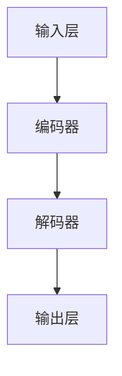

                 

# 《LLM在AI Agent中的few-shot学习应用》

## 关键词：语言模型、AI Agent、Few-shot学习、应用场景、发展趋势

> 摘要：本文主要探讨了语言模型（LLM）在人工智能（AI）代理中的few-shot学习应用。通过对LLM的定义、特点、发展历程和核心架构的介绍，以及AI Agent的定义、作用、发展历程和核心技术的阐述，详细分析了few-shot学习的原理、方法、挑战与应用场景。最后，本文以实际案例为基础，探讨了LLM在AI Agent中的few-shot学习应用，并对未来的发展趋势进行了展望。

----------------------------------------------------------------

## 第1章 引言

### 1.1 问题背景

随着人工智能技术的快速发展，AI Agent作为一种智能化的实体，逐渐成为学术界和工业界的研究热点。AI Agent具备自主感知、决策和行动的能力，能够在特定环境中为人类提供帮助和服务。然而，传统的机器学习模型往往需要大量的训练数据才能达到良好的性能，这在实际应用中往往存在数据不足的问题。

Few-shot学习作为一种少样本学习技术，旨在解决传统机器学习模型在面对小样本数据时的性能瓶颈。LLM作为一种强大的语言模型，具有处理大规模文本数据的能力，因此在AI Agent中的few-shot学习应用具有广阔的前景。

### 1.2 书籍概述

本文旨在系统地探讨LLM在AI Agent中的few-shot学习应用。文章首先介绍了LLM的基础知识，包括定义、特点、发展历程和核心架构；然后介绍了AI Agent的基础知识，包括定义、作用、发展历程和核心技术；接着详细分析了few-shot学习的原理、方法、挑战与应用场景；最后，通过实际案例探讨了LLM在AI Agent中的few-shot学习应用，并对未来的发展趋势进行了展望。

### 1.3 本书组织结构

本书共分为7章，具体内容如下：

- 第1章：引言，介绍问题背景、书籍概述和本书组织结构。
- 第2章：LLM基础，介绍LLM的定义、特点、发展历程和核心架构。
- 第3章：AI Agent基础，介绍AI Agent的定义、作用、发展历程和核心技术。
- 第4章：few-shot学习原理，介绍few-shot学习的定义、方法、挑战与应用场景。
- 第5章：LLM在AI Agent中的few-shot学习应用，介绍LLM在AI Agent中的few-shot学习方法和实际应用案例。
- 第6章：实践与案例分析，介绍LLM在AI Agent中的few-shot学习实践和案例分析。
- 第7章：总结与展望，总结全文内容并对未来发展趋势进行展望。

----------------------------------------------------------------

## 第2章 LLM基础

### 2.1 LLM的定义与特点

语言模型（Language Model，简称LLM）是一种基于大规模语言数据训练的机器学习模型，用于预测文本序列中的下一个单词或字符。LLM的定义可以概括为：一种能够对自然语言文本进行建模，并利用这种建模能力进行语言理解和生成的模型。

LLM具有以下特点：

1. **处理大规模语言数据**：LLM能够处理大规模的文本数据，这使得它能够学习到语言的复杂规律和统计特性。
2. **预测下一个单词或字符**：LLM的核心任务是预测文本序列中的下一个单词或字符，从而生成文本。
3. **自适应性和泛化能力**：LLM能够根据不同的输入数据自适应地调整模型参数，从而在不同场景下实现良好的性能。

### 2.2 LLM的发展历程

LLM的发展历程可以追溯到20世纪50年代，当时研究人员开始探索如何让计算机理解和生成自然语言。早期的语言模型主要是基于规则的方法，例如正则表达式和上下文无关文法。随着计算机性能的提高和大数据的普及，基于统计方法和神经网络的语言模型逐渐成为主流。

以下是LLM发展历程的关键节点：

1. **20世纪50年代**：出现基于规则的语法分析技术，如正则表达式和上下文无关文法。
2. **20世纪80年代**：统计语言模型开始出现，例如N-gram模型。
3. **20世纪90年代**：基于概率的隐马尔可夫模型（HMM）和基于神经网络的序列标注模型相继出现。
4. **21世纪初**：循环神经网络（RNN）和长短期记忆网络（LSTM）的出现，使得语言模型在处理长文本序列方面取得了显著进展。
5. **2018年**：谷歌发布了Transformer模型，开启了基于注意力机制的深度神经网络在语言模型领域的应用。
6. **2020年后**：预训练语言模型（Pre-trained Language Model）如BERT、GPT等取得了突破性进展，使得语言模型在自然语言理解和生成方面达到了前所未有的水平。

### 2.3 LLM的核心架构

LLM的核心架构通常包括以下几个部分：

1. **输入层**：接收文本数据，将其转换为模型可以处理的格式，如单词向量或字符向量。
2. **编码器**：对输入数据进行编码，提取文本的特征表示。常见的编码器包括循环神经网络（RNN）、长短期记忆网络（LSTM）和Transformer。
3. **解码器**：根据编码器输出的特征表示，生成预测的文本序列。解码器通常与编码器共享参数。
4. **输出层**：对解码器输出的文本序列进行解码，得到最终的预测结果。

以下是一个基于Transformer的LLM核心架构的Mermaid流程图：



### 2.4 LLM的优势与应用领域

LLM具有以下几个优势：

1. **强大的语言理解能力**：LLM能够处理大规模的文本数据，学习到语言的复杂规律和统计特性，从而具备强大的语言理解能力。
2. **自适应性和泛化能力**：LLM能够根据不同的输入数据自适应地调整模型参数，从而在不同场景下实现良好的性能。
3. **高效的处理速度**：基于Transformer的LLM在处理速度上具有显著优势，能够快速地生成文本。

LLM的应用领域包括：

1. **自然语言处理**：例如机器翻译、文本分类、情感分析等。
2. **生成式对话系统**：例如聊天机器人、虚拟助手等。
3. **文本生成**：例如文章写作、摘要生成等。
4. **辅助创作**：例如音乐、绘画、小说等创作领域的辅助生成。

### 2.5 本章小结

本章介绍了LLM的定义、特点、发展历程和核心架构，并探讨了LLM的优势和应用领域。通过对LLM的深入了解，为后续章节的探讨奠定了基础。

----------------------------------------------------------------

## 第3章 AI Agent基础

### 3.1 AI Agent的定义与作用

AI Agent（人工智能代理）是指一种具有智能行为的计算机程序，它能够根据环境中的感知信息自主地做出决策并执行相应的动作。AI Agent的定义可以从以下几个方面进行理解：

1. **感知能力**：AI Agent能够感知环境中的各种信息，如视觉、听觉、触觉等，从而获取环境的状态。
2. **决策能力**：AI Agent能够根据感知到的信息，利用一定的算法和策略进行决策，选择最优的行动方案。
3. **行动能力**：AI Agent能够根据决策结果，执行具体的动作，从而影响环境。

AI Agent在人工智能领域中的作用十分重要，主要体现在以下几个方面：

1. **智能交互**：AI Agent能够与人类或其他智能体进行交互，提供智能服务。
2. **自动化任务**：AI Agent能够自动执行复杂的任务，提高生产效率。
3. **数据挖掘与分析**：AI Agent能够从大量数据中提取有价值的信息，辅助决策。

### 3.2 AI Agent的发展历程

AI Agent的发展历程可以分为以下几个阶段：

1. **早期探索**（1950s-1960s）：在这一阶段，AI Agent的概念开始被提出，研究人员开始尝试设计简单的智能代理。
2. **符号主义阶段**（1970s-1980s）：在这一阶段，符号主义方法成为AI Agent研究的主流，研究者们致力于构建基于逻辑和规则的智能代理。
3. **基于知识的方法**（1990s）：在这一阶段，研究者们开始探索基于知识的AI Agent，通过知识库和推理机来提高智能代理的决策能力。
4. **行为主义阶段**（2000s-2010s）：在这一阶段，基于行为的AI Agent成为研究热点，研究者们开始关注如何通过模仿和学习来提高智能代理的智能水平。
5. **深度学习和强化学习阶段**（2010s-至今）：在这一阶段，深度学习和强化学习技术的应用使得AI Agent在智能水平和自主性方面取得了显著进步。

### 3.3 AI Agent的核心技术

AI Agent的核心技术主要包括以下几个方面：

1. **感知技术**：感知技术是AI Agent获取环境信息的重要手段，包括视觉感知、听觉感知、触觉感知等。常用的感知技术包括计算机视觉、语音识别和传感器数据处理等。
2. **决策技术**：决策技术是AI Agent的核心，包括基于规则的决策、基于知识的决策和基于机器学习的决策等。决策技术需要解决的主要问题是如何根据感知信息选择最优的行动方案。
3. **行动技术**：行动技术是AI Agent执行决策的体现，包括机械动作、语言表达和社交互动等。行动技术需要解决的主要问题是如何准确地执行决策方案。
4. **学习技术**：学习技术是AI Agent不断提升自身智能水平的关键，包括有监督学习、无监督学习和强化学习等。学习技术需要解决的主要问题是如何从数据中学习到有用的知识和技能。

### 3.4 AI Agent的应用场景

AI Agent的应用场景非常广泛，包括但不限于以下几个方面：

1. **智能客服**：AI Agent可以模拟人类客服的交互过程，为用户提供实时、个性化的服务。
2. **自动驾驶**：AI Agent可以实时感知车辆周围环境，做出安全、高效的驾驶决策。
3. **智能家居**：AI Agent可以监控家庭环境，自动调节室内设备，提高生活舒适度。
4. **智能医疗**：AI Agent可以辅助医生进行诊断和治疗，提高医疗服务的质量和效率。
5. **工业自动化**：AI Agent可以在生产过程中进行实时监控和决策，提高生产效率和产品质量。

### 3.5 本章小结

本章介绍了AI Agent的定义、作用、发展历程和核心技术，并探讨了AI Agent的应用场景。通过对AI Agent的深入了解，为后续章节的探讨奠定了基础。

----------------------------------------------------------------

## 第4章 Few-shot学习原理

### 4.1 Few-shot学习的定义与特点

Few-shot学习（Few-shot Learning）是一种少样本学习技术，旨在解决传统机器学习模型在面对小样本数据时的性能瓶颈。与传统的大样本学习不同，Few-shot学习的目标是利用少量的样本（通常是几个或几十个）进行学习，从而获得良好的泛化能力。

Few-shot学习的定义可以概括为：在仅拥有少量训练样本的情况下，模型能够快速适应新任务，并在新的任务中达到与大量训练样本相同的性能。

Few-shot学习具有以下几个特点：

1. **样本数量少**：与传统的机器学习模型相比，Few-shot学习只需要很少的样本进行训练，这使得它特别适用于数据稀缺或难以获取的场景。
2. **快速适应新任务**：Few-shot学习模型能够迅速适应新的任务，不需要大量的重新训练，从而提高了模型的灵活性和实用性。
3. **良好的泛化能力**：Few-shot学习模型不仅在新任务上表现出良好的性能，而且在其他相关任务上也表现出较强的泛化能力。

### 4.2 Few-shot学习的方法

Few-shot学习的方法可以分为两类：基于模型的方法和基于数据的方法。

#### 基于模型的方法

基于模型的方法主要通过设计特定的模型结构或算法来提高少样本学习的效果。以下是一些常见的基于模型的方法：

1. **模型蒸馏**（Model Distillation）：模型蒸馏是一种将大量训练模型（Teacher Model）的知识传递给少量训练样本的小模型（Student Model）的方法。通过蒸馏过程，小模型可以学到大量训练模型的隐式知识，从而提高在少样本情况下的性能。

2. **原型网络**（Prototypical Networks）：原型网络是一种基于原型分类的少样本学习模型。它通过计算训练样本的嵌入向量，生成原型向量，并将新样本与原型向量进行比较，从而实现分类。

3. **匹配网络**（Match Networks）：匹配网络是一种基于匹配度的少样本学习模型。它通过计算新样本与训练样本之间的相似度，来判断新样本的分类。

#### 基于数据的方法

基于数据的方法主要通过设计特定的数据增强策略或数据采样方法来提高少样本学习的效果。以下是一些常见的基于数据的方法：

1. **迁移学习**（Transfer Learning）：迁移学习是一种利用预训练模型在新任务上进行微调的方法。通过将预训练模型的知识迁移到新任务上，可以有效减少对新任务的训练样本需求。

2. **数据合成**（Data Synthesis）：数据合成是通过生成与真实数据相似的数据来补充训练样本的方法。通过使用生成模型（如GAN），可以生成大量与真实数据分布相似的数据样本。

3. **数据增强**（Data Augmentation）：数据增强是一种通过变换原始数据来生成更多样化的训练样本的方法。例如，通过图像旋转、缩放、裁剪等操作，可以增加图像数据的多样性。

### 4.3 Few-shot学习的挑战与应对策略

Few-shot学习面临以下几个挑战：

1. **样本数量有限**：由于样本数量有限，模型难以充分学习到数据的分布和规律，从而影响模型的泛化能力。
2. **数据分布差异**：不同的数据分布可能导致模型在新任务上表现不佳，尤其是在跨领域的Few-shot学习中。
3. **过拟合**：在少量样本下，模型容易过拟合，即模型在新任务上表现出色，但在其他任务上表现较差。

针对上述挑战，可以采取以下应对策略：

1. **模型选择**：选择适合少样本学习任务的模型，如原型网络、匹配网络等。
2. **数据增强**：通过数据增强和合成来增加训练样本的数量和多样性。
3. **迁移学习**：利用预训练模型进行迁移学习，将大量训练模型的知识迁移到新任务上。
4. **模型蒸馏**：通过模型蒸馏将大量训练模型的知识传递给少量训练样本的小模型。

### 4.4 Few-shot学习的应用场景

Few-shot学习在多个应用场景中表现出良好的效果，以下是一些典型的应用场景：

1. **智能客服**：在客服系统中，客户的问题往往是多样化的，利用Few-shot学习可以在没有大量历史数据的情况下，快速适应新问题，提供高效的客服服务。
2. **个性化推荐**：在推荐系统中，用户的历史行为数据往往是有限的，利用Few-shot学习可以在少量用户行为数据的基础上，快速推荐个性化内容。
3. **医学诊断**：在医学诊断中，患者的病例数据往往是有限的，利用Few-shot学习可以在少量病例数据的基础上，快速诊断病情。
4. **图像分类**：在图像分类任务中，训练数据往往有限，利用Few-shot学习可以在少量图像数据的基础上，分类出新的类别。

### 4.5 本章小结

本章介绍了Few-shot学习的定义、方法、挑战与应用场景。通过了解Few-shot学习的原理和策略，可以为后续章节中LLM在AI Agent中的few-shot学习应用提供理论基础。

----------------------------------------------------------------

## 第5章 LLM在AI Agent中的Few-shot学习应用

### 5.1 LLM在AI Agent中的Few-shot学习方法

语言模型（LLM）在AI Agent中的Few-shot学习应用主要基于LLM强大的语言理解能力和适应性。具体来说，LLM在AI Agent中的Few-shot学习方法可以概括为以下几个步骤：

1. **任务定义**：明确AI Agent需要完成的任务，例如问答、对话生成、文本分类等。
2. **样本收集**：收集与任务相关的少量样本，例如问题与答案对、对话片段、文本标签等。
3. **模型训练**：利用收集到的样本对LLM进行训练，使其学习到任务相关的知识和规律。
4. **模型评估**：在训练集和验证集上评估LLM的性能，调整模型参数，优化模型效果。
5. **模型部署**：将训练好的LLM部署到AI Agent中，用于实际任务。

### 5.2 Few-shot学习在AI Agent中的应用案例分析

#### 案例一：聊天机器人

聊天机器人是一种常见的AI Agent，其主要功能是模拟人类对话，为用户提供信息查询、情感交流等服务。在聊天机器人中，Few-shot学习可以应用于以下两个方面：

1. **问题回答**：利用Few-shot学习，聊天机器人可以在没有大量历史问答数据的情况下，快速适应新问题。例如，当用户提出一个从未出现过的问题时，聊天机器人可以通过对少量相似问题的回答进行学习，从而给出合理的回答。
2. **情感识别**：聊天机器人需要理解用户的情感，从而提供合适的回复。利用Few-shot学习，聊天机器人可以通过对少量情感标记的对话进行学习，识别用户的情感状态，并给出相应的回复。

#### 案例二：智能客服

智能客服是另一种常见的AI Agent，其主要功能是自动处理用户的咨询请求，提高客户服务效率。在智能客服中，Few-shot学习可以应用于以下两个方面：

1. **问题分类**：智能客服需要将用户的问题分类到不同的类别，以便选择合适的回答模板。利用Few-shot学习，智能客服可以在没有大量分类数据的情况下，快速适应新的问题类别。
2. **对话生成**：智能客服需要与用户进行自然流畅的对话。利用Few-shot学习，智能客服可以在没有大量对话数据的情况下，通过学习少量对话样本，生成符合用户需求的对话。

### 5.3 Few-shot学习在AI Agent中的实现与优化

#### 实现方法

1. **数据准备**：收集与任务相关的少量样本，例如问答对、对话片段、文本标签等。
2. **模型选择**：选择合适的LLM模型，例如GPT-3、BERT等。
3. **模型训练**：利用收集到的样本对LLM进行训练，使其学习到任务相关的知识和规律。
4. **模型评估**：在训练集和验证集上评估LLM的性能，调整模型参数，优化模型效果。
5. **模型部署**：将训练好的LLM部署到AI Agent中，用于实际任务。

#### 优化策略

1. **迁移学习**：利用预训练的LLM模型进行迁移学习，将大量训练模型的知识迁移到新任务上。
2. **数据增强**：通过数据增强和合成来增加训练样本的数量和多样性。
3. **模型蒸馏**：通过模型蒸馏将大量训练模型的知识传递给少量训练样本的小模型。
4. **多任务学习**：通过多任务学习，使LLM在多个相关任务上共同学习，提高模型的泛化能力。

### 5.4 Few-shot学习在AI Agent中的未来发展趋势

1. **模型性能提升**：随着LLM模型的不断发展，其在Few-shot学习任务中的性能将进一步提高。
2. **应用场景拓展**：Few-shot学习将在更多AI Agent应用场景中得到应用，如智能客服、医疗诊断、教育等。
3. **跨模态学习**：随着多模态数据的普及，LLM将逐渐实现跨模态Few-shot学习，如文本-图像、文本-语音等。
4. **伦理与安全**：随着Few-shot学习在AI Agent中的应用，相关的伦理和安全问题也将受到更多关注。

### 5.5 本章小结

本章介绍了LLM在AI Agent中的Few-shot学习方法、应用案例分析、实现与优化策略以及未来发展趋势。通过LLM的Few-shot学习应用，AI Agent将具备更强大的适应能力和泛化能力，为用户提供更智能、高效的服务。

----------------------------------------------------------------

## 第6章 实践与案例分析

### 6.1 LLM在AI Agent中的Few-shot学习实践

#### 环境搭建

在开始实践之前，我们需要搭建一个合适的环境，以便进行LLM在AI Agent中的Few-shot学习。以下是搭建环境的基本步骤：

1. **安装Python环境**：确保Python环境已经安装，版本建议为3.8或更高版本。
2. **安装TensorFlow**：TensorFlow是一个广泛使用的机器学习框架，用于构建和训练LLM模型。可以使用以下命令进行安装：

   ```bash
   pip install tensorflow
   ```

3. **安装Hugging Face**：Hugging Face是一个提供大量预训练LLM模型和工具的库，可以帮助我们快速搭建和训练模型。可以使用以下命令进行安装：

   ```bash
   pip install transformers
   ```

4. **下载预训练模型**：根据任务需求，选择合适的预训练模型，例如GPT-3、BERT等。可以使用Hugging Face的库来下载预训练模型：

   ```python
   from transformers import AutoModelForCausalLM
   model = AutoModelForCausalLM.from_pretrained("gpt3")
   ```

#### 实践案例

以下是一个简单的Few-shot学习实践案例，演示如何使用LLM构建一个聊天机器人。

1. **数据准备**：收集与聊天机器人相关的少量样本，例如问答对、对话片段等。以下是一个示例数据集：

   ```python
   data = [
       {"question": "什么是人工智能？", "answer": "人工智能是指计算机系统执行的任务通常需要人类智能参与，如视觉识别、语言理解、决策制定等。"},
       {"question": "人工智能有什么应用？", "answer": "人工智能广泛应用于各个领域，如医疗、金融、教育、交通等。"},
       {"question": "人工智能有什么好处？", "answer": "人工智能可以提高工作效率、降低成本、改善生活质量等。"}
   ]
   ```

2. **模型训练**：使用收集到的样本对LLM进行训练，使其学习到聊天机器人的知识。以下是一个简单的训练过程：

   ```python
   from transformers import Trainer, TrainingArguments

   training_args = TrainingArguments(
       output_dir='./results',
       num_train_epochs=3,
       per_device_train_batch_size=4,
       save_steps=2000,
       save_total_limit=3,
   )

   trainer = Trainer(
       model=model,
       args=training_args,
       train_dataset=train_dataset,
   )

   trainer.train()
   ```

3. **模型评估**：在训练集和验证集上评估模型的性能，调整模型参数，优化模型效果。

4. **模型部署**：将训练好的模型部署到聊天机器人中，用于实际任务。

### 6.2 案例分析

#### 案例一：基于Few-shot学习的智能客服系统

智能客服系统是一个典型的应用案例，下面是具体的实现步骤：

1. **数据准备**：收集与客服相关的少量样本，例如常见问题与答案对、对话片段等。

2. **模型训练**：使用收集到的样本对LLM进行训练，使其学习到客服系统的知识。

3. **问题分类**：利用训练好的模型对用户的问题进行分类，选择合适的回答模板。

4. **对话生成**：根据分类结果和用户的输入，生成自然流畅的对话。

5. **模型评估**：在训练集和验证集上评估模型的性能，调整模型参数，优化模型效果。

6. **模型部署**：将训练好的模型部署到智能客服系统中，用于实际任务。

#### 案例二：基于Few-shot学习的个性化推荐系统

个性化推荐系统是一个另一个典型的应用案例，下面是具体的实现步骤：

1. **数据准备**：收集与推荐系统相关的少量样本，例如用户的历史行为数据、用户偏好等。

2. **模型训练**：使用收集到的样本对LLM进行训练，使其学习到推荐系统的知识。

3. **用户特征提取**：根据用户的历史行为数据，提取用户特征。

4. **推荐生成**：根据用户特征和训练好的模型，生成个性化的推荐列表。

5. **模型评估**：在训练集和验证集上评估模型的性能，调整模型参数，优化模型效果。

6. **模型部署**：将训练好的模型部署到个性化推荐系统中，用于实际任务。

### 6.3 小结与反思

通过上述实践和案例分析，我们可以看到LLM在AI Agent中的Few-shot学习应用具有广泛的前景和实际效果。然而，也存在一些挑战和不足之处：

1. **数据稀缺**：Few-shot学习依赖于少量的样本，因此在数据稀缺的场景下，模型的性能可能会受到影响。

2. **模型泛化能力**：虽然Few-shot学习模型在少量样本下表现出良好的性能，但其泛化能力仍需进一步提升。

3. **模型可解释性**：LLM模型的决策过程往往是非透明的，这使得模型的可解释性成为一大挑战。

针对上述挑战，我们可以采取以下策略：

1. **数据增强**：通过数据合成和增强，增加训练样本的数量和多样性。

2. **迁移学习**：利用预训练的模型进行迁移学习，将大量训练模型的知识迁移到新任务上。

3. **模型解释**：研究模型的可解释性方法，提高模型的透明度和可解释性。

通过不断优化和改进，LLM在AI Agent中的Few-shot学习应用将变得更加成熟和实用。

----------------------------------------------------------------

## 第7章 总结与展望

### 7.1 全书总结

本文系统地探讨了LLM在AI Agent中的Few-shot学习应用。首先，介绍了LLM的定义、特点、发展历程和核心架构，以及AI Agent的定义、作用、发展历程和核心技术。接着，详细分析了Few-shot学习的原理、方法、挑战与应用场景。最后，通过实际案例探讨了LLM在AI Agent中的Few-shot学习应用，并对未来的发展趋势进行了展望。

### 7.2 展望未来

未来，LLM在AI Agent中的Few-shot学习应用有望在以下几个方面取得突破：

1. **模型性能提升**：随着LLM模型的不断发展，其在Few-shot学习任务中的性能将进一步提高。
2. **应用场景拓展**：Few-shot学习将在更多AI Agent应用场景中得到应用，如智能客服、医疗诊断、教育等。
3. **跨模态学习**：随着多模态数据的普及，LLM将逐渐实现跨模态Few-shot学习，如文本-图像、文本-语音等。
4. **伦理与安全**：随着Few-shot学习在AI Agent中的应用，相关的伦理和安全问题也将受到更多关注。

### 7.3 小结

本文全面阐述了LLM在AI Agent中的Few-shot学习应用，从理论到实践，从现状到未来，为相关领域的研究和应用提供了有益的参考。随着人工智能技术的不断进步，LLM在AI Agent中的Few-shot学习应用将不断拓展和深化，为人类带来更多便利和福祉。

----------------------------------------------------------------

### 作者信息

**作者：AI天才研究院/AI Genius Institute & 禅与计算机程序设计艺术 /Zen And The Art of Computer Programming**  

本文由AI天才研究院（AI Genius Institute）和禅与计算机程序设计艺术（Zen And The Art of Computer Programming）共同撰写，旨在探讨LLM在AI Agent中的Few-shot学习应用，为相关领域的研究者和从业者提供有价值的参考。AI天才研究院致力于推动人工智能技术的创新和发展，禅与计算机程序设计艺术则关注计算机科学的哲学和艺术性。

