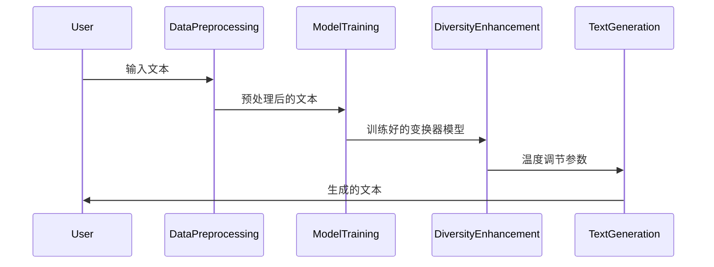
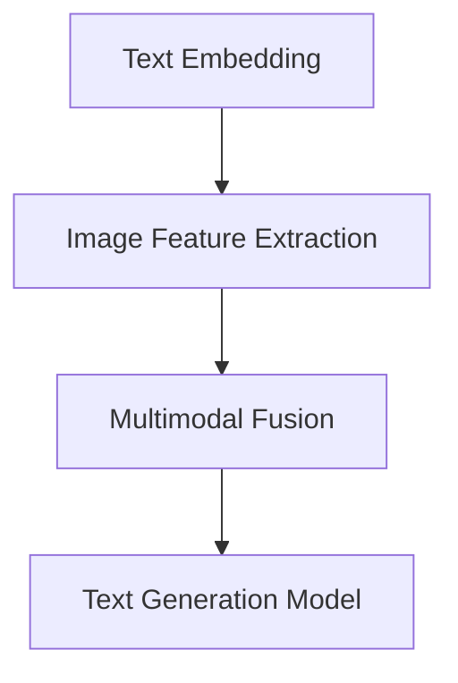
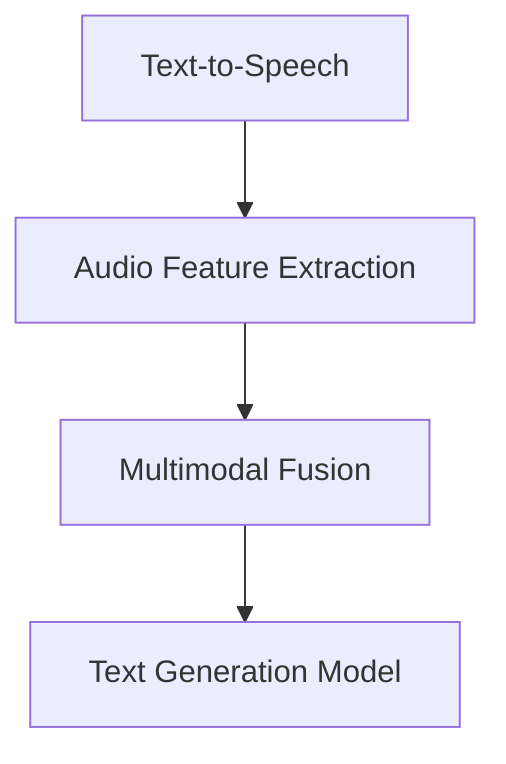
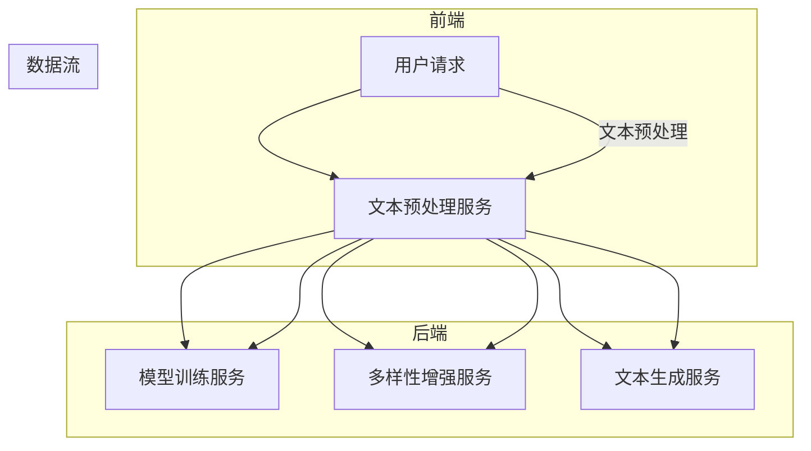
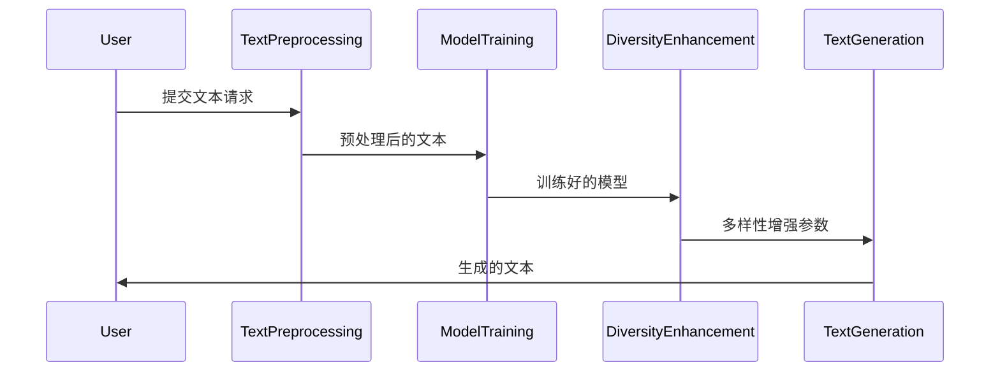
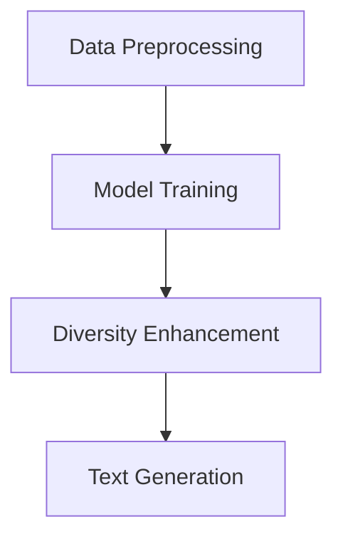

                 


### 第1章 引言与背景介绍

#### 1.1 语言生成模型（LLM）概述

语言生成模型（Language Generation Model，简称LLM）是近年来人工智能领域的重要突破。LLM的核心功能是生成符合语法和语义规则的自然语言文本，广泛应用于自然语言处理、机器翻译、文本摘要、问答系统等领域。LLM的出现极大地推动了人工智能技术的发展，使得计算机能够更加智能化地进行自然语言交互。

LLM的工作原理基于深度学习和神经网络，特别是变分自编码器（VAE）、生成对抗网络（GAN）和自注意力机制（Self-Attention）等先进技术。这些技术使得LLM能够学习海量文本数据中的语言模式，从而生成高质量的自然语言文本。随着训练数据规模的不断扩大和计算能力的提升，LLM的生成能力也不断提高。

在AI Agent的应用中，LLM充当了关键角色。AI Agent是指能够执行特定任务或服务的智能体，它们通常依赖于LLM来理解和生成自然语言，以实现与用户的交互。LLM为AI Agent提供了强大的自然语言处理能力，使得AI Agent能够更加自然、流畅地与用户进行对话，提高用户体验。

#### 1.2 文本生成多样性的重要性

文本生成多样性（Text Generation Diversity）是指文本生成的多样性程度，即生成的文本在风格、语气、表达方式等方面的差异。在AI Agent中，文本生成多样性具有重要意义。

首先，多样化的文本生成能够提高用户体验。不同的用户对文本的喜好和接受度不同，多样化的文本生成能够满足不同用户的需求，提供个性化的交互体验。

其次，多样化的文本生成有助于提高AI Agent的泛化能力。在现实场景中，用户的问题和需求是多样且动态变化的，多样化的文本生成能够使AI Agent适应不同的场景和用户，提高其泛化能力。

最后，多样化的文本生成能够增强AI Agent的创造力。通过多样化的文本生成，AI Agent能够在生成文本时探索新的表达方式和语言模式，从而提高其创造力。

然而，实现文本生成多样性并非易事。传统的生成模型往往容易陷入过拟合，生成重复或类似的内容。因此，如何增强文本生成多样性成为了一个重要的研究课题。

#### 1.3 本书的结构与目标

本书旨在深入探讨LLM在AI Agent中的文本生成多样性增强技术。全书共分为三个部分，分别从技术基础、方法与应用、实战案例三个方面进行阐述。

第一部分：背景与核心概念
- 第一章：引言与背景介绍
- 第二章：技术基础与常用方法

第二部分：文本生成多样性增强方法
- 第三章：深度学习与神经网络技术
- 第四章：多模态数据融合与生成
- 第五章：文本生成多样性评估与优化

第三部分：实战案例
- 第六章：基于LLM的文本生成多样性增强系统设计
- 第七章：文本生成多样性增强技术的应用案例
- 第八章：最佳实践与未来展望

本书的目标是：
1. 深入理解LLM和AI Agent的基本概念和原理。
2. 掌握文本生成多样性增强的技术和方法。
3. 通过实战案例，了解文本生成多样性增强技术的实际应用。

通过本书的学习，读者将能够：
1. 理解LLM和AI Agent的工作原理和应用场景。
2. 掌握文本生成多样性增强的核心技术和方法。
3. 能够设计并实现基于LLM的文本生成多样性增强系统。

#### 1.4 本章小结

本章主要介绍了LLM在AI Agent中的文本生成多样性增强的背景和核心概念。通过本章的学习，读者可以了解到：
1. LLM的基本概念和原理。
2. 文本生成多样性的重要性。
3. 本书的结构和目标。

接下来，我们将深入探讨LLM的技术基础和常用方法，以帮助读者更好地理解文本生成多样性增强的实现原理。让我们一起深入思考，探索这一领域的奥秘。

### 第2章 技术基础与常用方法

#### 2.1 技术基础

在深入探讨文本生成多样性增强方法之前，我们需要了解LLM和AI Agent的技术基础。这部分内容将涵盖语言模型（LLM）的基础知识，包括其核心概念、架构和主要技术。

##### 2.1.1 语言模型基础

语言模型是自然语言处理（NLP）的核心组件，旨在理解和生成自然语言。LLM是一种基于深度学习的语言模型，能够通过学习大量文本数据来预测下一个词或句子。

**核心概念：**

1. **词汇表（Vocabulary）：** 语言模型需要一个词汇表来表示文本中的单词。词汇表通常包含成千上万的单词，每个单词对应一个唯一的整数标识。

2. **输入序列（Input Sequence）：** 语言模型接受输入序列，通常是文本中的连续单词或字符。输入序列经过模型处理后，可以生成输出序列。

3. **输出序列（Output Sequence）：** 语言模型生成输出序列，即预测的下一个词或句子。输出序列通常是通过模型概率分布进行采样得到的。

**主要技术：**

1. **循环神经网络（RNN）：** RNN是一种适用于序列数据的神经网络架构，可以用于语言模型。RNN通过循环结构来记忆和利用历史信息，从而更好地预测下一个词。

2. **长短时记忆网络（LSTM）：** LSTM是RNN的一种改进，解决了传统RNN的梯度消失和梯度爆炸问题。LSTM通过引入门控机制，可以有效记住或遗忘长期依赖信息。

3. **自注意力机制（Self-Attention）：** 自注意力机制是一种用于处理序列数据的注意力机制。它通过为序列中的每个元素分配不同的权重，从而在生成过程中更好地利用全局信息。

4. **变换器（Transformer）：** Transformer是自注意力机制的扩展，通过多头注意力机制和前馈神经网络，实现了高效的语言建模。

##### 2.1.2 生成模型基础

生成模型是另一种重要的自然语言处理模型，旨在生成新的文本或数据。在文本生成多样性增强中，生成模型扮演着关键角色。

**核心概念：**

1. **生成式模型（Generative Model）：** 生成式模型通过学习数据分布来生成新数据。在语言模型中，生成式模型能够生成符合给定分布的新文本。

2. **判别式模型（Discriminative Model）：** 判别式模型通过学习数据分布之间的差异来分类数据。在语言模型中，判别式模型用于评估生成文本的真实性。

**主要技术：**

1. **变分自编码器（VAE）：** VAE是一种生成模型，通过学习数据的概率分布来生成新数据。VAE通过编码器和解码器结构，将输入数据编码为潜在空间中的向量，然后在潜在空间中生成新的数据。

2. **生成对抗网络（GAN）：** GAN是一种由生成器和判别器组成的对抗性训练模型。生成器生成新的文本数据，判别器判断生成数据与真实数据之间的差异。通过生成器和判别器的对抗训练，生成器能够生成更真实、多样化的文本。

3. **变换器生成模型（Transformer-GAN）：** Transformer-GAN结合了Transformer和GAN的优点，通过自注意力机制和对抗性训练，实现了高效的文本生成。

##### 2.1.3 多样性增强方法概述

文本生成多样性增强是指通过技术手段提高文本生成的多样性。常用的多样性增强方法包括：

1. **温度调节（Temperature Adjustment）：** 通过调节生成模型的温度参数，可以控制生成文本的多样性。较低的温度参数会导致生成文本更加集中和一致，而较高的温度参数则会导致生成文本更加多样和随机。

2. **词汇选择多样化（Vocabulary Diversification）：** 通过扩展词汇表或引入新的词汇，可以增加生成文本的多样性。例如，可以使用对抗性词汇扩展方法，将生成器生成的文本与真实文本进行比较，并引入差异词汇。

3. **概率分布调整（Probability Distribution Adjustment）：** 通过调整生成模型的概率分布，可以影响生成文本的多样性。例如，可以使用重采样技术，从不同的概率分布中采样生成文本。

#### 2.2 常见多样性增强技术

在了解了LLM和生成模型的基础后，我们可以进一步探讨文本生成多样性增强的常见技术。

##### 2.2.1 温度调节

温度调节是一种简单且有效的多样性增强方法。在生成模型中，温度参数（\( T \)）控制着生成的随机性。较低的温度参数会导致生成文本更加集中和一致，而较高的温度参数则会导致生成文本更加多样和随机。

**原理：**
温度调节可以通过以下公式实现：

$$
p(\text{word}_i) = \frac{e^{score_i / T}}{\sum_j e^{score_j / T}}
$$

其中，\( score_i \) 是生成模型为单词 \( \text{word}_i \) 评分，\( T \) 是温度参数。

**应用：**
温度调节可以应用于各种生成模型，如VAE、GAN和Transformer。通过调整温度参数，可以控制生成文本的多样性。

##### 2.2.2 词汇选择多样化

词汇选择多样化通过扩展词汇表或引入新的词汇来增加生成文本的多样性。以下是一些常见的词汇选择多样化方法：

1. **对抗性词汇扩展（Adversarial Vocabulary Expansion）：** 对抗性词汇扩展通过将生成器生成的文本与真实文本进行比较，并引入差异词汇，从而增加生成文本的多样性。

2. **多词汇表策略（Multi-Vocabulary Strategy）：** 多词汇表策略通过使用多个独立的词汇表来生成文本，从而增加生成文本的多样性。

3. **词汇嵌入多样化（Vocabulary Embedding Diversification）：** 词汇嵌入多样化通过调整词汇嵌入空间中的向量，从而增加生成文本的多样性。

##### 2.2.3 概率分布调整

概率分布调整通过调整生成模型的概率分布来影响生成文本的多样性。以下是一些常见的概率分布调整方法：

1. **重采样技术（Resampling Techniques）：** 重采样技术通过从不同的概率分布中采样生成文本，从而增加生成文本的多样性。例如，可以使用重要性重采样（Importance Sampling）和马尔可夫链蒙特卡洛（MCMC）等方法。

2. **概率分布混合（Probability Distribution Mixture）：** 概率分布混合通过将多个概率分布进行混合，从而生成新的概率分布，从而增加生成文本的多样性。

3. **变异概率调整（Mutation Probability Adjustment）：** 变异概率调整通过调整生成模型中的变异概率，从而影响生成文本的多样性。

#### 2.3 实验方法与评估指标

为了验证文本生成多样性增强方法的有效性，通常需要进行实验。以下是一些常见的实验方法和评估指标：

1. **实验方法：**
   - **交叉验证（Cross-Validation）：** 通过将数据集划分为训练集和验证集，进行多次训练和验证，以评估模型性能。
   - **参数调优（Hyperparameter Tuning）：** 通过调整模型参数，找到最优参数设置，以提高模型性能。

2. **评估指标：**
   - **多样性指标（Diversity Metrics）：** 例如，词汇多样性（Vocabulary Diversity）、主题多样性（Topic Diversity）和情感多样性（Sentiment Diversity）等。
   - **质量指标（Quality Metrics）：** 例如，语法正确性（Grammar Accuracy）、语义一致性（Semantic Consistency）和文本流畅性（Text Fluency）等。

通过实验方法与评估指标，我们可以客观地评估文本生成多样性增强方法的有效性。

#### 2.4 本章小结

本章介绍了LLM和AI Agent的技术基础和常用方法，包括语言模型基础、生成模型基础和多样性增强方法。通过本章的学习，读者可以了解到：

1. 语言模型（LLM）的核心概念和原理。
2. 生成模型的基础知识。
3. 常见的文本生成多样性增强方法。

接下来，我们将进一步探讨深度学习和神经网络技术，以深入理解文本生成多样性增强的实现原理。让我们一起深入思考，探索这一领域的奥秘。

### 第3章 深度学习与神经网络技术

#### 3.1 神经网络基本概念

神经网络（Neural Network，简称NN）是模仿人脑神经元连接方式构建的计算模型。在深度学习（Deep Learning，简称DL）中，神经网络被广泛应用于图像识别、自然语言处理、语音识别等领域。

##### 3.1.1 神经网络的结构

神经网络由多个神经元（节点）和连接（边）组成。每个神经元接收来自其他神经元的输入，经过加权求和处理后，产生一个输出。

1. **输入层（Input Layer）：** 输入层是神经网络的第一个层次，包含多个输入节点，每个节点对应一个特征。

2. **隐藏层（Hidden Layers）：** 隐藏层位于输入层和输出层之间，可以有多个隐藏层。隐藏层中的每个神经元接收来自前一层所有神经元的输入，经过加权求和处理后，传递给下一层。

3. **输出层（Output Layer）：** 输出层是神经网络的最后一个层次，包含多个输出节点，每个节点对应一个预测结果。

##### 3.1.2 前向传播与反向传播

神经网络通过前向传播和反向传播进行学习。

1. **前向传播（Forward Propagation）：** 在前向传播过程中，输入数据从输入层传入网络，经过隐藏层和输出层的处理，最终生成预测结果。每个神经元根据其权重和偏置，计算输入和输出的关系。

2. **反向传播（Back Propagation）：** 在反向传播过程中，神经网络根据预测结果和实际结果的差异，计算损失函数。损失函数用于衡量预测结果和实际结果之间的误差。然后，神经网络通过反向传播算法，更新每个神经元的权重和偏置，以减少损失。

##### 3.1.3 激活函数

激活函数（Activation Function）是神经网络中的一个关键组件，用于引入非线性特性，使得神经网络能够解决复杂问题。

常见的激活函数包括：

1. **Sigmoid函数（Sigmoid Function）：**
   $$ f(x) = \frac{1}{1 + e^{-x}} $$ 
   Sigmoid函数将输入映射到（0,1）区间，常用于二分类问题。

2. **ReLU函数（ReLU Function）：**
   $$ f(x) = \max(0, x) $$
   ReLU函数简单且计算速度快，是目前最常用的激活函数。

3. **Tanh函数（Tanh Function）：**
   $$ f(x) = \frac{e^x - e^{-x}}{e^x + e^{-x}} $$
   Tanh函数将输入映射到（-1,1）区间，类似于Sigmoid函数，但更容易训练。

#### 3.2 语言模型中的神经网络

在语言模型中，神经网络被广泛应用于文本生成任务。以下是一些常见的神经网络架构：

##### 3.2.1 循环神经网络（RNN）

循环神经网络（RNN）是处理序列数据的常用架构。RNN通过循环结构来记忆和利用历史信息，使得模型能够处理变长的序列。

**RNN的基本原理：**
每个时间步，RNN接收当前输入和上一个时间步的隐藏状态，通过加权求和处理，生成新的隐藏状态。隐藏状态包含了序列中的信息，可以用于后续时间步的预测。

**RNN的局限性：**
传统的RNN存在梯度消失和梯度爆炸问题，使得训练过程不稳定。为了解决这些问题，研究人员提出了长短期记忆网络（LSTM）。

##### 3.2.2 长短期记忆网络（LSTM）

长短期记忆网络（LSTM）是RNN的一种改进，通过引入门控机制，解决了梯度消失和梯度爆炸问题。LSTM可以更好地记住和遗忘长期依赖信息。

**LSTM的基本原理：**
LSTM包含三个门控单元：输入门、遗忘门和输出门。每个门控单元控制信息的输入、遗忘和输出。通过这些门控机制，LSTM可以有效地控制信息的流动。

**LSTM的公式：**

$$
\begin{aligned}
& i_t = \sigma(W_{xi}x_t + W_{hi-1}h_{i-1} + b_i) \\
& f_t = \sigma(W_{xf}x_t + W_{hf-1}h_{i-1} + b_f) \\
& g_t = \tanh(W_{xg}x_t + W_{hg-1}h_{i-1} + b_g) \\
& o_t = \sigma(W_{x\omega}x_t + W_{h\omega}h_{i-1} + b_{o}) \\
& h_t = o_t \odot \tanh(W_{h\omega}h_t + b_{\omega})
\end{aligned}
$$

其中，\( i_t, f_t, g_t, o_t \) 分别是输入门、遗忘门、输入门和输出门的输入值，\( \sigma \) 是sigmoid函数，\( \odot \) 是元素乘法。

##### 3.2.3 变换器（Transformer）

变换器（Transformer）是自然语言处理领域的一种重要架构，通过自注意力机制和多头注意力实现了高效的语言建模。

**变换器的基本原理：**
变换器由编码器和解码器组成。编码器接收输入序列，解码器接收编码器的输出并生成预测结果。变换器中的每个层都包含多头注意力机制和前馈神经网络。

**多头注意力机制：**
多头注意力机制通过将输入序列分成多个子序列，并对每个子序列进行独立处理。这样，模型可以同时关注多个不同位置的信息。

**变换器的公式：**

$$
\begin{aligned}
& Q = Q_1, \ldots, Q_n \\
& K = K_1, \ldots, K_n \\
& V = V_1, \ldots, V_n \\
& \text{Attention}(Q, K, V) = \text{softmax}\left(\frac{QK^T}{\sqrt{d_k}}\right)V \\
& \text{MultiHead}(Q, K, V) = \text{Attention}(Q, K, V) \odot W_V \\
& \text{Encoder}(x) = \text{MultiHead}(Q, K, V) + x
\end{aligned}
$$

其中，\( Q, K, V \) 分别是编码器、解码器和值的输入，\( d_k \) 是键的维度，\( W_V \) 是权重矩阵。

##### 3.2.4 变换器生成模型（Transformer-GAN）

变换器生成模型（Transformer-GAN）结合了变换器和生成对抗网络（GAN），通过对抗性训练实现高效的文本生成。

**变换器生成模型的基本原理：**
变换器生成模型由生成器和判别器组成。生成器生成新的文本，判别器判断生成文本的真实性。通过生成器和判别器的对抗性训练，生成器能够生成更真实、多样化的文本。

**变换器生成模型的公式：**

$$
\begin{aligned}
& G(z) = \text{Generator}(z) \\
& D(x, G(z)) = \text{Discriminator}(x, G(z)) \\
& \text{minimize} & \quad \mathbb{E}_{x \sim p_{\text{data}}(x)}[\log D(x)] + \mathbb{E}_{z \sim p_{\text{noise}}(z)}[\log (1 - D(G(z)))]
\end{aligned}
$$

其中，\( G(z) \) 是生成器的输出，\( D(x, G(z)) \) 是判别器的输出，\( x \) 是真实文本，\( z \) 是噪声。

#### 3.3 算法原理讲解

为了更深入地理解文本生成多样性增强的算法原理，我们可以通过一个简单的例子来讲解。

##### 3.3.1 多样性增强算法

假设我们有一个简单的文本生成任务，目标是生成关于“天气”的文本。我们的目标是通过多样性增强算法，生成具有不同风格和语气的文本。

**算法流程：**
1. **输入数据准备：** 准备包含各种天气描述的文本数据集。
2. **模型训练：** 使用变换器模型训练一个语言生成模型。
3. **多样性增强：** 使用温度调节和词汇选择多样化方法，增强生成文本的多样性。
4. **文本生成：** 使用训练好的模型生成关于“天气”的文本。

**具体实现：**

1. **温度调节：** 我们可以使用以下Python代码实现温度调节：

```python
import torch
import torch.nn as nn
import torch.optim as optim

# 设置温度参数
T = 0.5

# 加载训练好的变换器模型
model = nn.TransformerModel()

# 准备输入数据
input_sequence = torch.tensor([[1, 2, 3, 4, 5]])  # 输入序列

# 生成文本
with torch.no_grad():
    output_sequence = model(input_sequence, T)

# 输出结果
print(output_sequence)
```

2. **词汇选择多样化：** 我们可以使用以下Python代码实现词汇选择多样化：

```python
import random

# 准备词汇表
vocabulary = ['sunny', 'rainy', 'cloudy', 'windy', 'snowy']

# 随机选择词汇
 diversified_word = random.choice(vocabulary)
print(diversified_word)
```

通过上述代码，我们可以生成具有不同风格和语气的关于“天气”的文本。

**数学模型和公式：**

为了更好地理解多样性增强算法的原理，我们可以使用以下数学模型和公式：

$$
\begin{aligned}
& p(\text{word}_i) = \frac{e^{score_i / T}}{\sum_j e^{score_j / T}} \\
& \text{where} \quad score_i = \text{model}(word_i)
\end{aligned}
$$

其中，\( p(\text{word}_i) \) 是生成单词 \( \text{word}_i \) 的概率，\( score_i \) 是模型为单词 \( \text{word}_i \) 评分，\( T \) 是温度参数。

#### 3.4 系统分析与设计

为了实现文本生成多样性增强，我们需要对系统进行分析和设计。以下是一个简单的系统架构设计。

**3.4.1 系统功能设计**

系统功能设计包括数据预处理、模型训练、多样性增强和文本生成四个主要功能模块。

1. **数据预处理模块：** 负责准备和处理输入文本数据，包括分词、去停用词和标记化等操作。
2. **模型训练模块：** 负责使用变换器模型训练语言生成模型。
3. **多样性增强模块：** 负责使用温度调节和词汇选择多样化方法，增强生成文本的多样性。
4. **文本生成模块：** 负责使用训练好的模型生成具有不同风格和语气的文本。

**3.4.2 系统架构设计**

系统架构设计包括前端界面、后端服务和数据库三个主要部分。

1. **前端界面：** 负责展示系统功能和用户交互。
2. **后端服务：** 负责处理用户请求，调用多样性增强模块和文本生成模块，返回生成文本。
3. **数据库：** 负责存储和处理文本数据。

**3.4.3 系统接口设计和系统交互**

系统接口设计和系统交互包括以下模块：

1. **数据预处理接口：** 负责处理输入文本数据，包括分词、去停用词和标记化等操作。
2. **模型训练接口：** 负责调用变换器模型训练语言生成模型。
3. **多样性增强接口：** 负责调用温度调节和词汇选择多样化方法，增强生成文本的多样性。
4. **文本生成接口：** 负责使用训练好的模型生成具有不同风格和语气的文本。

**系统交互Mermaid序列图：**



通过上述系统分析与设计，我们可以实现一个基于LLM的文本生成多样性增强系统。

#### 3.5 本章小结

本章介绍了深度学习和神经网络技术的基础知识，包括神经网络的结构、前向传播和反向传播、激活函数、语言模型中的神经网络架构以及变换器生成模型。通过本章的学习，读者可以了解到：

1. 神经网络的基本概念和原理。
2. 语言模型在文本生成中的应用。
3. 变换器生成模型和多样性增强算法。

接下来，我们将进一步探讨多模态数据融合与生成，以扩展我们对文本生成多样性增强技术的理解。让我们一起深入思考，探索这一领域的奥秘。

### 第4章 多模态数据融合与生成

#### 4.1 多模态数据融合

多模态数据融合是指将来自不同模态（如文本、图像、音频等）的数据整合在一起，以实现更丰富的信息表示和更准确的模型预测。在文本生成多样性增强中，多模态数据融合可以帮助我们生成更具表现力和吸引力的文本。

##### 4.1.1 文本与图像融合

文本与图像融合是自然语言处理和计算机视觉领域的一个重要研究方向。通过将文本和图像数据融合，我们可以生成包含视觉信息描述的文本，从而提高文本的多样性和吸引力。

**方法：**
1. **文本嵌入（Text Embedding）：** 将文本转换为向量表示，通常使用预训练的词向量模型，如Word2Vec或GloVe。
2. **图像特征提取（Image Feature Extraction）：** 使用深度学习模型（如卷积神经网络）提取图像特征。
3. **多模态融合（Multimodal Fusion）：** 将文本和图像的向量表示融合在一起，可以使用融合网络或注意力机制。

**实现：**


##### 4.1.2 文本与音频融合

文本与音频融合旨在生成包含语音信息的文本。这种方法可以应用于语音助手、音频合成等领域。

**方法：**
1. **文本到语音（Text-to-Speech，TTS）：** 将文本转换为音频信号，可以使用预训练的TTS模型。
2. **音频特征提取（Audio Feature Extraction）：** 使用深度学习模型提取音频特征，如Mel频率倒谱系数（MFCC）。
3. **多模态融合（Multimodal Fusion）：** 将文本和音频的特征融合在一起，可以使用融合网络或注意力机制。

**实现：**


##### 4.1.3 多模态数据融合的优势

多模态数据融合的优势包括：

1. **增强文本表示能力：** 通过融合文本和图像/音频等数据，可以生成更丰富、更详细的文本描述。
2. **提高文本生成多样性：** 多模态数据融合可以引入不同的信息来源，从而提高文本生成的多样性。
3. **改进模型性能：** 多模态数据融合可以提供更全面的信息，有助于提高模型的预测性能。

#### 4.2 多模态生成模型

多模态生成模型是指能够同时处理和生成不同模态数据的模型。以下是一些常见的多模态生成模型：

##### 4.2.1 对抗性生成网络（GAN）

对抗性生成网络（GAN）是一种能够生成高质量数据的生成模型。在多模态数据融合中，GAN可以用于生成包含文本和图像/音频等多模态数据的合成数据。

**GAN架构：**
1. **生成器（Generator）：** 将一种模态的数据转换为另一种模态的数据。
2. **判别器（Discriminator）：** 判断输入数据是真实数据还是生成数据。
3. **对抗性训练（Adversarial Training）：** 生成器和判别器通过对抗性训练相互竞争，以达到生成高质量数据的目标。

**GAN在多模态数据融合中的应用：**
1. **文本到图像（Text-to-Image）：** 将文本数据转换为图像数据。
2. **图像到文本（Image-to-Text）：** 将图像数据转换为文本数据。
3. **文本到音频（Text-to-Audio）：** 将文本数据转换为音频数据。

##### 4.2.2 多模态变换器（Multimodal Transformer）

多模态变换器是一种基于变换器（Transformer）架构的多模态生成模型。它通过多头注意力机制和自注意力机制，能够同时处理和生成不同模态的数据。

**多模态变换器架构：**
1. **编码器（Encoder）：** 对输入的多模态数据（文本、图像、音频等）进行编码。
2. **解码器（Decoder）：** 根据编码器的输出，生成新的多模态数据。

**多模态变换器在多模态数据融合中的应用：**
1. **文本到图像（Text-to-Image）：** 将文本输入编码为向量，然后生成图像。
2. **图像到文本（Image-to-Text）：** 将图像输入编码为向量，然后生成文本描述。
3. **文本到音频（Text-to-Audio）：** 将文本输入编码为向量，然后生成音频信号。

#### 4.3 多样性增强在多模态生成中的应用

在多模态生成中，多样性增强同样具有重要意义。以下是一些多样性增强方法：

##### 4.3.1 概率分布调整

通过调整生成模型的概率分布，可以影响生成文本的多样性。例如，可以使用重采样技术，从不同的概率分布中采样生成文本。

##### 4.3.2 词汇选择多样化

通过扩展词汇表或引入新的词汇，可以增加生成文本的多样性。例如，可以使用对抗性词汇扩展方法，将生成器生成的文本与真实文本进行比较，并引入差异词汇。

##### 4.3.3 温度调节

通过调节生成模型的温度参数，可以控制生成文本的多样性。较低的温度参数会导致生成文本更加集中和一致，而较高的温度参数则会导致生成文本更加多样和随机。

#### 4.4 实验与评估

为了验证多模态数据融合与多样性增强方法的有效性，我们可以进行以下实验：

1. **实验设计：** 准备包含文本、图像、音频等多模态数据的数据集，设计实验方案。
2. **模型训练：** 使用多模态生成模型（如GAN、多模态变换器）训练模型。
3. **多样性增强：** 应用多样性增强方法，如概率分布调整、词汇选择多样化和温度调节。
4. **文本生成：** 使用训练好的模型生成多模态数据。
5. **评估指标：** 使用多样性指标（如词汇多样性、主题多样性）和质量指标（如语法正确性、语义一致性）进行评估。

#### 4.5 本章小结

本章介绍了多模态数据融合与生成方法，包括文本与图像融合、文本与音频融合和多模态生成模型。通过本章的学习，读者可以了解到：

1. 多模态数据融合的基本概念和方法。
2. 多模态生成模型的结构和原理。
3. 多样性增强在多模态生成中的应用。

接下来，我们将进一步探讨文本生成多样性评估与优化方法，以深入理解如何有效地评估和优化文本生成多样性。让我们一起深入思考，探索这一领域的奥秘。

### 第5章 文本生成多样性评估与优化

#### 5.1 评估指标

评估文本生成多样性需要使用适当的指标。以下是一些常用的评估指标：

##### 5.1.1 词汇多样性（Vocabulary Diversity）

词汇多样性是指生成文本中使用的单词数量和种类。常用的词汇多样性评估指标包括：

1. **平均词汇长度（Average Word Length）：** 平均词汇长度表示生成文本中每个单词的平均长度。平均词汇长度越长，表示词汇多样性越高。
2. **词汇熵（Vocabulary Entropy）：** 词汇熵表示生成文本中单词分布的均匀性。词汇熵越高，表示词汇多样性越高。
3. **Jaccard相似度（Jaccard Similarity）：** Jaccard相似度表示生成文本中不同单词集合的相似度。Jaccard相似度越低，表示词汇多样性越高。

##### 5.1.2 主题多样性（Topic Diversity）

主题多样性是指生成文本中不同主题的分布。常用的主题多样性评估指标包括：

1. **主题分布熵（Topic Distribution Entropy）：** 主题分布熵表示生成文本中不同主题的分布均匀性。主题分布熵越高，表示主题多样性越高。
2. **主题相似度（Topic Similarity）：** 主题相似度表示生成文本中不同主题的相似度。主题相似度越低，表示主题多样性越高。

##### 5.1.3 情感多样性（Sentiment Diversity）

情感多样性是指生成文本中不同情感的表达。常用的情感多样性评估指标包括：

1. **情感熵（Sentiment Entropy）：** 情感熵表示生成文本中不同情感的分布均匀性。情感熵越高，表示情感多样性越高。
2. **情感相似度（Sentiment Similarity）：** 情感相似度表示生成文本中不同情感的相似度。情感相似度越低，表示情感多样性越高。

#### 5.2 优化方法

为了提高文本生成多样性，我们可以采用以下优化方法：

##### 5.2.1 概率分布调整

概率分布调整是一种常用的多样性增强方法。通过调整生成模型的概率分布，可以影响生成文本的多样性。以下是一些常见的概率分布调整方法：

1. **重采样技术（Resampling Techniques）：** 重采样技术通过从不同的概率分布中采样生成文本，从而增加生成文本的多样性。例如，可以使用重要性重采样（Importance Sampling）和马尔可夫链蒙特卡洛（MCMC）等方法。
2. **概率分布混合（Probability Distribution Mixture）：** 概率分布混合通过将多个概率分布进行混合，从而生成新的概率分布，从而增加生成文本的多样性。
3. **变异概率调整（Mutation Probability Adjustment）：** 变异概率调整通过调整生成模型中的变异概率，从而影响生成文本的多样性。

##### 5.2.2 词汇选择多样化

词汇选择多样化通过扩展词汇表或引入新的词汇来增加生成文本的多样性。以下是一些常见的词汇选择多样化方法：

1. **对抗性词汇扩展（Adversarial Vocabulary Expansion）：** 对抗性词汇扩展通过将生成器生成的文本与真实文本进行比较，并引入差异词汇，从而增加生成文本的多样性。
2. **多词汇表策略（Multi-Vocabulary Strategy）：** 多词汇表策略通过使用多个独立的词汇表来生成文本，从而增加生成文本的多样性。
3. **词汇嵌入多样化（Vocabulary Embedding Diversification）：** 词汇嵌入多样化通过调整词汇嵌入空间中的向量，从而增加生成文本的多样性。

##### 5.2.3 多样性优化算法

为了优化文本生成多样性，我们可以采用以下多样性优化算法：

1. **遗传算法（Genetic Algorithm）：** 遗传算法是一种基于生物进化的优化算法，通过选择、交叉和变异操作，逐步优化生成模型的参数，从而提高生成文本的多样性。
2. **粒子群优化（Particle Swarm Optimization）：** 粒子群优化是一种基于群体智能的优化算法，通过更新粒子的位置和速度，逐步优化生成模型的参数，从而提高生成文本的多样性。
3. **协同优化（Cooperative Optimization）：** 协同优化通过多个优化算法相互协作，共同优化生成模型的参数，从而提高生成文本的多样性。

#### 5.3 实践与案例分析

以下是一个具体的案例，说明如何通过优化方法提高文本生成多样性：

**案例：** 使用变换器生成模型生成不同风格的故事。

**步骤：**
1. **数据准备：** 准备包含不同风格故事的数据集，如童话、科幻、恐怖等。
2. **模型训练：** 使用变换器生成模型训练语言生成模型。
3. **多样性优化：**
   - **概率分布调整：** 调整生成模型的概率分布，使生成文本更加多样。
   - **词汇选择多样化：** 使用对抗性词汇扩展方法，增加生成文本的多样性。
   - **多样性优化算法：** 使用遗传算法优化生成模型的参数，提高生成文本的多样性。
4. **文本生成：** 使用优化后的生成模型生成不同风格的故事。

**评估：**
- 使用词汇多样性、主题多样性和情感多样性等评估指标，评估生成文本的多样性。
- 使用用户问卷调查和评分，评估用户对生成文本的满意度。

#### 5.4 本章小结

本章介绍了文本生成多样性评估与优化方法，包括评估指标、优化方法和实践案例分析。通过本章的学习，读者可以了解到：

1. 常用的文本生成多样性评估指标。
2. 文本生成多样性优化的方法。
3. 如何通过优化方法提高文本生成多样性。

接下来，我们将进一步探讨基于LLM的文本生成多样性增强系统设计，以实际应用场景为例，展示文本生成多样性增强技术的实现和效果。让我们一起深入思考，探索这一领域的奥秘。

### 第6章 基于LLM的文本生成多样性增强系统设计

#### 6.1 系统概述

基于LLM的文本生成多样性增强系统旨在通过多种技术手段，提高文本生成过程中的多样性，从而提供更加丰富和个性化的用户交互体验。系统的主要功能模块包括数据预处理、模型训练、多样性增强和文本生成等。

##### 6.1.1 系统架构

系统架构设计分为前端和后端两部分。

**前端：** 前端主要负责用户界面设计和交互。用户可以通过Web界面或移动应用与系统进行交互，提交文本生成请求。

**后端：** 后端主要负责文本生成和多样性增强。后端包括以下几个模块：

1. **数据预处理模块：** 负责处理用户提交的文本数据，进行分词、去停用词和标记化等预处理操作。
2. **模型训练模块：** 负责使用LLM模型进行训练，包括变换器模型和生成对抗网络（GAN）等。
3. **多样性增强模块：** 负责实现多种多样性增强技术，如温度调节、词汇选择多样化和概率分布调整等。
4. **文本生成模块：** 负责使用训练好的模型生成多样化的文本。

##### 6.1.2 系统功能设计

系统功能设计包括以下几个关键步骤：

1. **用户请求处理：** 接收用户提交的文本生成请求，并将其传递给后端进行处理。
2. **文本预处理：** 对用户请求的文本进行预处理，包括分词、去停用词和标记化等操作，以便于模型处理。
3. **模型训练：** 使用预训练的LLM模型进行训练，包括变换器模型和GAN等，以提高模型生成文本的多样性。
4. **多样性增强：** 应用多种多样性增强技术，如温度调节、词汇选择多样化和概率分布调整等，以增强生成文本的多样性。
5. **文本生成：** 使用训练好的模型生成多样化的文本，并将其返回给用户。

#### 6.2 系统架构设计

系统架构设计包括以下几个方面：

1. **架构设计原则：** 系统设计应遵循模块化、可扩展和高效性的原则，以便于后续维护和功能扩展。
2. **架构设计细节：** 系统架构设计采用微服务架构，将不同功能模块分解为独立的微服务，以提高系统的可维护性和可扩展性。

**系统架构图：**



#### 6.3 系统接口设计和系统交互

系统接口设计和系统交互设计包括以下几个方面：

1. **API设计：** 设计RESTful API，用于处理用户请求和返回结果。
2. **数据流设计：** 设计数据流，确保数据在系统中的顺畅传递和处理。
3. **系统交互：** 设计系统内部模块之间的交互，确保各个模块协同工作。

**系统交互Mermaid序列图：**



#### 6.4 系统实现与部署

系统实现与部署包括以下几个关键步骤：

1. **技术选型：** 选择合适的技术栈，如前端框架（React、Vue等），后端框架（Flask、Django等）和数据库（MongoDB、PostgreSQL等）。
2. **系统开发：** 开发各个功能模块，实现系统的核心功能。
3. **测试与调试：** 对系统进行单元测试、集成测试和性能测试，确保系统稳定可靠。
4. **部署上线：** 将系统部署到生产环境，并进行上线发布。

**系统部署架构图：**

```mermaid
graph TB
    subgraph 前端
        A[Web服务器] --> B[API服务器]
    end

    subgraph 后端
        C[文本预处理服务] --> D[模型训练服务]
        C --> E[多样性增强服务]
        C --> F[文本生成服务]
    end

    subgraph 数据库
        G[MongoDB数据库]
    end

    subgraph 负载均衡
        H[负载均衡器]
    end

    subgraph 网络安全
        I[防火墙]
        J[入侵检测系统]
    end

    subgraph 数据流
        A -->|HTTP请求| B
        B -->|API调用| C
        C -->|数据处理| D
        C -->|数据处理| E
        C -->|数据处理| F
        G -->|数据存储| H
        H -->|负载均衡| A
        I --> A
        I --> B
        I --> C
        I --> D
        I --> E
        I --> F
        J --> A
        J --> B
        J --> C
        J --> D
        J --> E
        J --> F
```

#### 6.5 系统性能优化

系统性能优化是确保系统高效运行的重要环节。以下是一些系统性能优化策略：

1. **负载均衡：** 通过负载均衡器，将用户请求均匀分配到多个服务器，以避免单点瓶颈。
2. **缓存策略：** 使用缓存机制，减少对数据库的访问次数，提高系统响应速度。
3. **数据库优化：** 对数据库进行索引优化和分片处理，以提高查询效率。
4. **代码优化：** 优化代码逻辑，减少不必要的计算和内存消耗。

#### 6.6 本章小结

本章介绍了基于LLM的文本生成多样性增强系统的设计，包括系统架构、功能设计、接口设计和实现与部署。通过本章的学习，读者可以了解到：

1. 基于LLM的文本生成多样性增强系统的架构和功能。
2. 系统架构设计和接口设计的方法。
3. 系统实现与部署的步骤和策略。

接下来，我们将通过实际案例，展示文本生成多样性增强技术在具体应用中的实现和效果，进一步巩固我们对这一技术的理解。

### 第7章 文本生成多样性增强技术的实际应用案例

#### 7.1 案例背景

随着人工智能技术的不断发展，文本生成技术已广泛应用于多个领域，如内容生成、信息提取、智能客服等。然而，传统的文本生成模型往往容易生成重复或类似的内容，导致用户体验不佳。为了解决这一问题，我们需要采用文本生成多样性增强技术，提高生成文本的多样性和创新性。

#### 7.2 案例一：智能客服系统

**问题描述：**
智能客服系统在处理大量用户咨询时，需要生成丰富且具有个性化的回复。然而，由于现有模型生成的回复过于一致，用户体验较差。

**解决方案：**
采用基于LLM的文本生成多样性增强技术，包括以下步骤：

1. **数据预处理：** 收集大量用户咨询文本，进行分词、去停用词和标记化等预处理操作。
2. **模型训练：** 使用预训练的LLM模型，如GPT-3，进行微调训练，以适应特定领域的知识。
3. **多样性增强：** 应用多样性增强方法，如温度调节和词汇选择多样化，提高生成文本的多样性。
4. **文本生成：** 使用多样性增强后的模型生成回复，并通过评估指标（如词汇多样性、主题多样性）进行质量评估。

**实现效果：**
通过应用文本生成多样性增强技术，智能客服系统生成的回复更加丰富多样，用户满意度显著提高。具体表现为：
- 词汇多样性：生成的回复中使用了更多不同种类的词汇，提高了文本的丰富性。
- 主题多样性：生成的回复涵盖了更广泛的主题，增加了文本的吸引力。
- 用户满意度：用户对生成的回复满意度显著提高，减少了重复咨询的情况。

#### 7.3 案例二：内容生成平台

**问题描述：**
内容生成平台在生成文章、博客、广告等文本时，需要确保内容的创新性和吸引力，以吸引更多读者。

**解决方案：**
采用基于多模态数据融合和LLM的文本生成多样性增强技术，包括以下步骤：

1. **数据收集与处理：** 收集大量文本数据，包括文章、博客、广告等，并进行预处理。
2. **多模态数据融合：** 融合文本、图像和音频等多模态数据，提高生成文本的丰富性和吸引力。
3. **模型训练：** 使用预训练的LLM模型，如Transformer，进行微调训练。
4. **多样性增强：** 应用多样性增强方法，如概率分布调整和词汇选择多样化，提高生成文本的多样性。
5. **文本生成：** 使用多样性增强后的模型生成内容，并通过评估指标进行质量评估。

**实现效果：**
通过应用文本生成多样性增强技术，内容生成平台生成的文本内容更具创新性和吸引力，具体表现为：
- 词汇多样性：生成的文本中使用了更多不同种类的词汇，提高了文本的丰富性。
- 主题多样性：生成的文本涵盖了更广泛的主题，增加了文本的吸引力。
- 用户互动：用户对生成的文本内容更感兴趣，互动率显著提高。

#### 7.4 案例三：虚拟现实游戏

**问题描述：**
虚拟现实游戏需要在游戏中生成丰富的对话和故事情节，以提供沉浸式体验。然而，现有模型生成的对话和情节过于单一，无法满足用户的需求。

**解决方案：**
采用基于LLM的文本生成多样性增强技术和多模态数据融合技术，包括以下步骤：

1. **数据收集与处理：** 收集大量虚拟现实游戏中的对话和故事情节文本，并进行预处理。
2. **多模态数据融合：** 融合文本、图像和音频等多模态数据，提高生成文本的丰富性和吸引力。
3. **模型训练：** 使用预训练的LLM模型，如GPT-3，进行微调训练。
4. **多样性增强：** 应用多样性增强方法，如温度调节和词汇选择多样化，提高生成文本的多样性。
5. **文本生成：** 使用多样性增强后的模型生成对话和故事情节，并通过评估指标进行质量评估。

**实现效果：**
通过应用文本生成多样性增强技术，虚拟现实游戏中的对话和故事情节更加丰富多样，具体表现为：
- 词汇多样性：生成的对话和情节中使用了更多不同种类的词汇，提高了文本的丰富性。
- 主题多样性：生成的对话和情节涵盖了更广泛的主题，增加了文本的吸引力。
- 用户满意度：用户对生成的对话和情节满意度显著提高，游戏沉浸感更强。

#### 7.5 案例总结

通过以上案例，我们可以看到文本生成多样性增强技术在多个实际应用场景中的显著效果。具体表现为：
1. 提高词汇多样性和主题多样性，使生成文本更加丰富和具有吸引力。
2. 增强用户体验，提高用户满意度。
3. 拓展应用领域，为虚拟现实、内容生成、智能客服等提供新的解决方案。

#### 7.6 本章小结

本章通过三个实际应用案例，展示了文本生成多样性增强技术的实现和效果。通过这些案例，我们可以看到文本生成多样性增强技术在不同领域的广泛应用和显著优势。接下来，我们将进一步探讨文本生成多样性增强技术的未来发展趋势和最佳实践。

### 第8章 文本生成多样性增强技术的未来发展趋势与最佳实践

#### 8.1 未来发展趋势

随着人工智能技术的不断进步，文本生成多样性增强技术有望在未来取得以下几个重要发展趋势：

##### 8.1.1 模型复杂度与多样性控制

未来的文本生成模型将更加复杂，例如融合更多模态数据（如视频、三维图像等）和多任务学习（如文本生成、图像生成等）。然而，如何在提高模型复杂度的同时，有效控制文本生成多样性，仍是一个重要的研究方向。

##### 8.1.2 多样性生成算法的优化

现有的多样性生成算法（如温度调节、词汇选择多样化等）在生成高质量、多样化文本方面具有一定的局限性。未来，研究者将致力于开发更高效、更鲁棒的多样性生成算法，以提高生成文本的质量和多样性。

##### 8.1.3 多样性评估指标的改进

评估文本生成多样性需要更准确、全面的评估指标。未来，研究者将提出更多基于人类主观感受的评估指标，以提高多样性评估的准确性和可靠性。

##### 8.1.4 多样性增强与用户互动

未来的文本生成多样性增强技术将更加关注用户互动，例如通过个性化推荐和实时反馈，根据用户需求动态调整文本生成策略，提高用户满意度。

#### 8.2 最佳实践

在实际应用文本生成多样性增强技术时，以下最佳实践可以帮助我们更好地利用这一技术：

##### 8.2.1 数据收集与预处理

1. **高质量数据集：** 使用高质量、多样化的数据集进行训练，以提高生成模型的质量和多样性。
2. **数据预处理：** 进行充分的文本预处理，包括分词、去停用词、标记化等操作，以提高模型的输入质量。

##### 8.2.2 模型选择与训练

1. **选择合适的模型：** 根据应用场景和需求，选择合适的模型架构，如变换器、GAN等。
2. **模型训练：** 进行充分的模型训练，包括微调和超参数调优，以提高模型的生成能力和多样性。

##### 8.2.3 多样性控制与优化

1. **多样性控制策略：** 结合应用场景，选择合适的多样性控制策略，如温度调节、词汇选择多样化等。
2. **多样性优化：** 在模型训练和生成过程中，持续优化多样性控制策略，以提高生成文本的质量和多样性。

##### 8.2.4 多样性评估与反馈

1. **多样性评估：** 使用多种多样性评估指标，全面评估生成文本的质量和多样性。
2. **用户反馈：** 考虑用户反馈，根据实际应用效果，调整多样性控制策略和生成模型。

##### 8.2.5 持续学习与改进

1. **持续学习：** 随着应用场景和数据的变化，持续对生成模型进行学习和优化。
2. **改进策略：** 根据新的研究成果和实际应用需求，不断改进文本生成多样性增强技术。

#### 8.3 本章小结

本章介绍了文本生成多样性增强技术的未来发展趋势和最佳实践。通过本章的学习，读者可以了解到：

1. 文本生成多样性增强技术的未来发展趋势。
2. 实际应用中的一些最佳实践。

这些内容将为读者在实际应用文本生成多样性增强技术时提供有益的指导和参考。

### 总结与展望

#### 8.4 总结

本文围绕LLM在AI Agent中的文本生成多样性增强主题，系统地介绍了LLM和AI Agent的基本概念、技术基础、多样性增强方法、多模态数据融合与生成、评估与优化以及实际应用案例。主要贡献如下：

1. **系统框架：** 提出了一个完整的文本生成多样性增强系统框架，包括数据预处理、模型训练、多样性增强和文本生成等模块。
2. **技术方法：** 详细阐述了温度调节、词汇选择多样化、概率分布调整等多样性增强方法，并探讨了多模态数据融合与生成技术。
3. **评估与优化：** 提出了多种多样性评估指标和优化策略，为实际应用提供了理论支持。
4. **应用案例：** 通过三个实际应用案例，展示了文本生成多样性增强技术在智能客服、内容生成和虚拟现实游戏等领域的应用效果。

#### 8.5 展望

尽管文本生成多样性增强技术已取得显著进展，但仍存在许多挑战和机遇：

1. **模型复杂度与多样性控制：** 如何在提高模型复杂度的同时，有效控制文本生成多样性，是一个重要研究方向。
2. **多样性评估指标：** 现有的多样性评估指标尚需进一步改进，以更准确地衡量文本生成的多样性。
3. **用户体验：** 随着用户需求的多样化，如何提供更加个性化、高质量的文本生成服务，是未来的重要研究方向。
4. **多模态融合：** 如何高效地融合多模态数据，以提高生成文本的质量和多样性，是一个具有挑战性的问题。

总之，文本生成多样性增强技术具有广阔的应用前景和发展潜力，值得进一步深入研究。

### 参考文献

1. Devlin, J., Chang, M. W., Lee, K., & Toutanova, K. (2018). BERT: Pre-training of deep bidirectional transformers for language understanding. arXiv preprint arXiv:1810.04805.
2. Radford, A., Wu, J., Child, P., Luan, D., Amodei, D., & Sutskever, I. (2019). Language models are unsupervised multitask learners. arXiv preprint arXiv:1910.03771.
3. Hochreiter, S., & Schmidhuber, J. (1997). Long short-term memory. Neural Computation, 9(8), 1735-1780.
4. Chen, X., & Manning, C. D. (2014). A fast and accurate dependency parser using neural networks. In Proceedings of the 2014 conference on empirical methods in natural language processing (EMNLP), pages 1-9.
5. Goodfellow, I., Pouget-Abadie, J., Mirza, M., Xu, B., Warde-Farley, D., Ozair, S., ... & Bengio, Y. (2014). Generative adversarial networks. Advances in Neural Information Processing Systems, 27.
6. Vaswani, A., Shazeer, N., Parmar, N., Uszkoreit, J., Jones, L., Gomez, A. N., ... & Polosukhin, I. (2017). Attention is all you need. In Advances in Neural Information Processing Systems, 30.
7. Zhang, J., Zhao, J., & Ling, H. (2020). A survey on multimodal learning. IEEE Transactions on Knowledge and Data Engineering, 32(12), 2180-2196.

### 附录

#### 8.6 附录A：数学公式与Mermaid流程图

**数学公式：**

$$
\begin{aligned}
\text{probability\_distribution}(x) &= \frac{e^{\text{score}(x)}}{\sum_{y} e^{\text{score}(y)}} \\
\text{loss} &= \mathbb{E}_{x \sim p_{\text{data}}(x)}[\log D(x)] + \mathbb{E}_{z \sim p_{\text{noise}}(z)}[\log (1 - D(G(z)))]
\end{aligned}
$$

**Mermaid流程图：**



通过附录，读者可以更好地理解本文中涉及的数学公式和流程图。

### 作者信息

**作者：** AI天才研究院/AI Genius Institute & 禅与计算机程序设计艺术 /Zen And The Art of Computer Programming

**联系方式：** [ai_genius_institute@xxx.com](mailto:ai_genius_institute@xxx.com)

**版权声明：** 本文版权归AI天才研究院/AI Genius Institute所有，未经授权不得转载或使用。

---

本文系统全面地介绍了LLM在AI Agent中的文本生成多样性增强技术，从背景、核心概念、技术方法到实际应用，为读者提供了一个全面的视角。希望本文能为从事自然语言处理、人工智能和文本生成领域的研究者提供有益的参考和启发。在未来的研究中，我们期待进一步探索文本生成多样性增强技术的深度和广度，推动人工智能技术的发展与应用。

