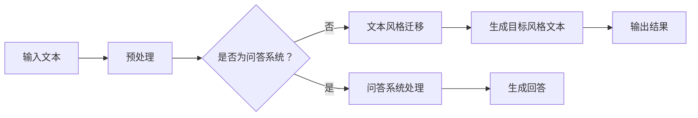
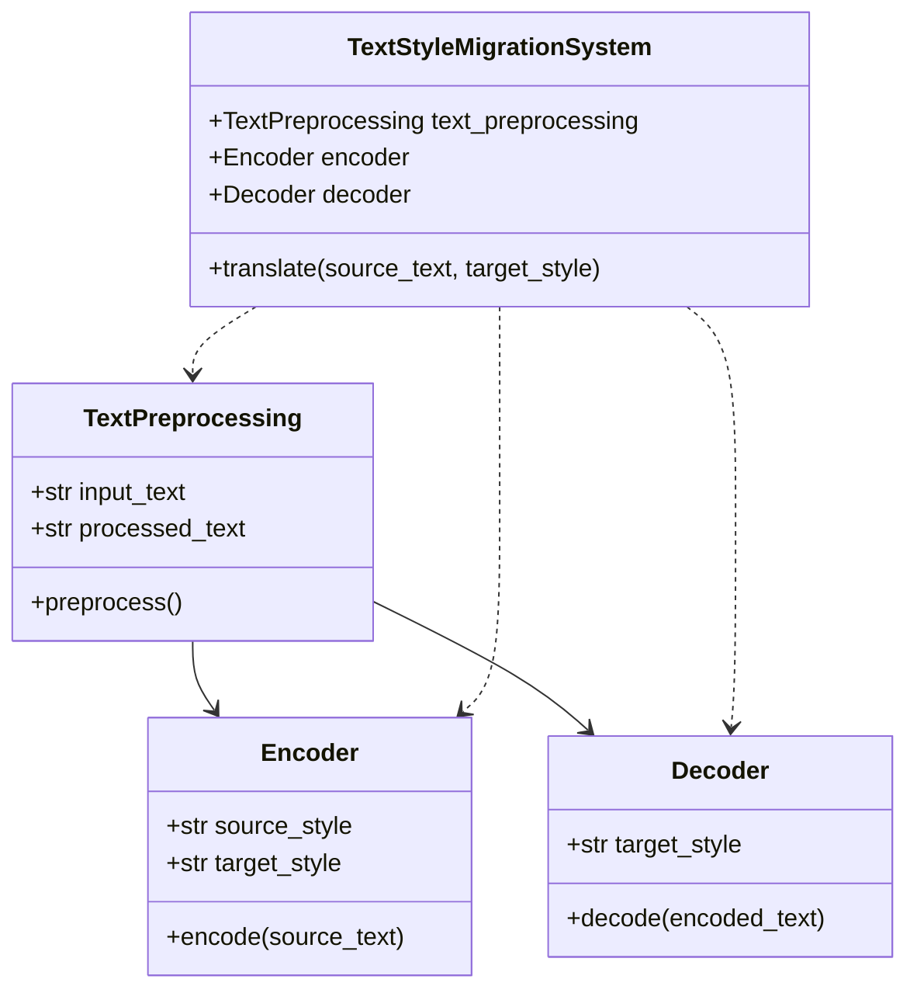
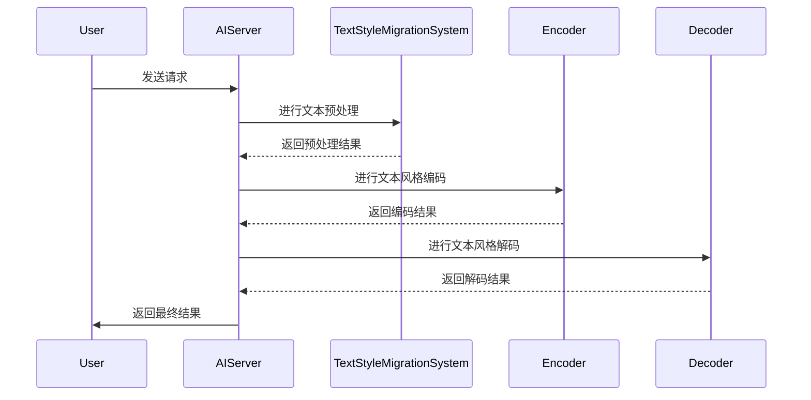
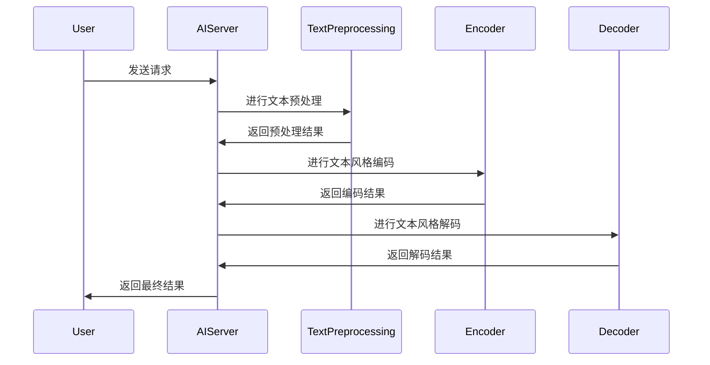

                 


### 设计思路：

为了设计出一本《LLM在AI Agent中的文本风格迁移应用》的完整目录大纲，我们需要遵循以下设计思路：

1. **背景介绍**：
   - 简要介绍LLM（大型语言模型）的基本概念和其在AI Agent中的应用。
   - 引入文本风格迁移的概念，并解释其在AI Agent中的重要性。

2. **核心概念与联系**：
   - 详细描述LLM的关键特点和技术原理。
   - 通过对比表格和Mermaid ER图展示LLM与其他文本处理技术的联系和区别。

3. **算法原理讲解**：
   - 使用Mermaid绘制LLM的工作流程图。
   - 使用Python代码和LaTeX公式解释文本风格迁移算法的数学模型。
   - 通过实例说明算法的实际应用。

4. **系统分析与架构设计方案**：
   - 介绍应用场景和系统设计背景。
   - 使用Mermaid绘制系统架构图和类图。
   - 阐述系统接口设计和交互流程。

5. **项目实战**：
   - 描述项目安装环境、核心实现和代码应用。
   - 分析实际案例，并剖析项目细节。

6. **最佳实践与小结**：
   - 提供使用LLM进行文本风格迁移的最佳实践。
   - 总结本书的主要内容和收获。

### 目录大纲：

```
----------------------------------------------------------------
# 第一部分: LLM与文本风格迁移基础

## 1.1 LLM与文本风格迁移概述
### 1.1.1 什么是LLM
### 1.1.2 文本风格迁移的概念
### 1.1.3 LLM在文本风格迁移中的应用

## 1.2 LLM的核心概念与技术原理
### 1.2.1 LLM的构建与训练
### 1.2.2 LLM的关键特点
### 1.2.3 LLM与其他文本处理技术的比较（使用Mermaid ER图和对比表格）

## 1.3 LLM的工作流程图
### 1.3.1 Mermaid流程图绘制
### 1.3.2 流程图详细说明

## 1.4 文本风格迁移算法原理
### 1.4.1 算法数学模型与Python代码实现
### 1.4.2 LaTeX公式说明
### 1.4.3 算法实例讲解

## 1.5 LLM在AI Agent中的应用场景
### 1.5.1 AI Agent的基本概念
### 1.5.2 文本风格迁移在AI Agent中的应用
### 1.5.3 应用场景示例

----------------------------------------------------------------

# 第二部分: 系统分析与架构设计

## 2.1 系统设计与背景介绍
### 2.1.1 项目介绍
### 2.1.2 系统功能设计（Mermaid类图）
### 2.1.3 系统架构设计（Mermaid架构图）

## 2.2 系统接口设计
### 2.2.1 接口设计原则
### 2.2.2 接口详细描述

## 2.3 系统交互流程
### 2.3.1 Mermaid序列图绘制
### 2.3.2 交互流程详细说明

----------------------------------------------------------------

# 第三部分: 项目实战

## 3.1 环境安装
### 3.1.1 环境准备
### 3.1.2 软件与依赖安装

## 3.2 系统核心实现与代码应用
### 3.2.1 核心代码实现
### 3.2.2 代码应用解读与分析

## 3.3 实际案例分析
### 3.3.1 案例介绍
### 3.3.2 案例详细讲解剖析

## 3.4 项目小结
### 3.4.1 项目总结
### 3.4.2 经验与反思

----------------------------------------------------------------

# 第四部分: 最佳实践与拓展

## 4.1 LLM文本风格迁移最佳实践
### 4.1.1 实践技巧
### 4.1.2 注意事项

## 4.2 小结与展望
### 4.2.1 本书主要内容回顾
### 4.2.2 未来发展方向与挑战

## 4.3 拓展阅读
### 4.3.1 相关书籍
### 4.3.2 学术论文
### 4.3.3 开源项目和工具

----------------------------------------------------------------
```

以上目录大纲涵盖了书籍的核心内容和结构，接下来我们将逐个章节进行详细规划和撰写。以下是每章节的具体内容规划和写作思路：

## 第一部分: LLM与文本风格迁移基础

### 1.1 LLM与文本风格迁移概述

#### 1.1.1 什么是LLM
- **核心概念术语说明**：定义LLM的概念，说明其基本原理。
- **问题背景**：介绍LLM的发展历程和现状。
- **问题描述**：分析LLM在文本风格迁移中的应用场景。
- **问题解决**：阐述LLM如何实现文本风格迁移。
- **边界与外延**：明确LLM的应用范围和限制。
- **概念结构与核心要素组成**：分析LLM的内部结构和关键组成部分。

#### 1.1.2 文本风格迁移的概念
- **核心概念术语说明**：定义文本风格迁移，解释其意义。
- **问题背景**：介绍文本风格迁移在AI领域的应用背景。
- **问题描述**：分析文本风格迁移的挑战和难点。
- **问题解决**：介绍文本风格迁移的基本原理和常用方法。
- **边界与外延**：探讨文本风格迁移的应用领域和发展趋势。
- **概念结构与核心要素组成**：分析文本风格迁移的技术要素和流程。

#### 1.1.3 LLM在文本风格迁移中的应用
- **核心概念术语说明**：说明LLM在文本风格迁移中的角色和作用。
- **问题背景**：介绍LLM在文本风格迁移中的发展背景。
- **问题描述**：分析LLM在文本风格迁移中的优势和挑战。
- **问题解决**：介绍LLM如何提升文本风格迁移的效果。
- **边界与外延**：探讨LLM在文本风格迁移中的应用前景。
- **概念结构与核心要素组成**：分析LLM在文本风格迁移中的技术要素和实现方法。

### 1.2 LLM的核心概念与技术原理

#### 1.2.1 LLM的构建与训练
- **核心概念术语说明**：解释LLM的构建过程，包括数据集选择、模型架构设计等。
- **问题背景**：介绍LLM的训练背景和技术发展。
- **问题描述**：分析LLM训练过程中的挑战和优化方法。
- **问题解决**：介绍LLM训练的基本原理和技术手段。
- **边界与外延**：探讨LLM训练的数据规模和计算资源需求。
- **概念结构与核心要素组成**：分析LLM训练的关键技术要素和流程。

#### 1.2.2 LLM的关键特点
- **核心概念术语说明**：阐述LLM的主要特点和优势。
- **问题背景**：介绍LLM的典型应用场景和效果。
- **问题描述**：分析LLM在不同场景下的表现和局限性。
- **问题解决**：介绍如何利用LLM的优势进行文本风格迁移。
- **边界与外延**：探讨LLM在未来的发展潜力。
- **概念结构与核心要素组成**：分析LLM的关键技术特点和应用场景。

#### 1.2.3 LLM与其他文本处理技术的比较（使用Mermaid ER图和对比表格）
- **核心概念术语说明**：介绍其他文本处理技术的概念和特点。
- **问题背景**：比较LLM与其他文本处理技术的优缺点。
- **问题描述**：分析LLM与其他文本处理技术的差异。
- **问题解决**：说明如何选择合适的文本处理技术。
- **边界与外延**：探讨不同文本处理技术在文本风格迁移中的应用。
- **概念结构与核心要素组成**：构建LLM与其他文本处理技术的对比框架。

### 1.3 LLM的工作流程图

#### 1.3.1 Mermaid流程图绘制
- **核心概念术语说明**：解释Mermaid流程图的绘制方法和规则。
- **问题背景**：介绍LLM的工作流程和主要步骤。
- **问题描述**：说明如何使用Mermaid绘制LLM的工作流程图。
- **问题解决**：提供Mermaid流程图的示例和具体步骤。
- **边界与外延**：探讨如何优化LLM的工作流程。
- **概念结构与核心要素组成**：分析LLM工作流程的关键步骤和技术要素。

#### 1.3.2 流程图详细说明
- **核心概念术语说明**：详细解释LLM工作流程中的每个步骤和操作。
- **问题背景**：介绍LLM工作流程的应用场景和效果。
- **问题描述**：分析LLM工作流程中的问题和优化点。
- **问题解决**：提供优化LLM工作流程的方法和建议。
- **边界与外延**：探讨LLM工作流程在不同应用场景中的实现方法。
- **概念结构与核心要素组成**：构建LLM工作流程的详细结构和技术要素。

### 1.4 文本风格迁移算法原理

#### 1.4.1 算法数学模型与Python代码实现
- **核心概念术语说明**：解释文本风格迁移算法的数学模型和原理。
- **问题背景**：介绍文本风格迁移算法的发展和应用。
- **问题描述**：分析文本风格迁移算法的挑战和难点。
- **问题解决**：介绍文本风格迁移算法的基本原理和技术手段。
- **边界与外延**：探讨文本风格迁移算法在不同场景下的应用。
- **概念结构与核心要素组成**：分析文本风格迁移算法的核心技术要素和流程。

#### 1.4.2 LaTeX公式说明
- **核心概念术语说明**：解释LaTeX公式的编写规则和格式。
- **问题背景**：介绍LaTeX在科学计算和文档排版中的应用。
- **问题描述**：分析LaTeX公式的书写和排版难点。
- **问题解决**：提供LaTeX公式的编写示例和技巧。
- **边界与外延**：探讨LaTeX公式的优化和改进方法。
- **概念结构与核心要素组成**：构建LaTeX公式的编写框架和规范。

#### 1.4.3 算法实例讲解
- **核心概念术语说明**：说明算法实例的应用场景和效果。
- **问题背景**：介绍算法实例的背景和开发目的。
- **问题描述**：分析算法实例的实现细节和优化方法。
- **问题解决**：提供算法实例的具体实现步骤和代码示例。
- **边界与外延**：探讨算法实例在不同应用场景中的实现和优化。
- **概念结构与核心要素组成**：构建算法实例的技术要素和应用框架。

### 1.5 LLM在AI Agent中的应用场景

#### 1.5.1 AI Agent的基本概念
- **核心概念术语说明**：定义AI Agent的概念，解释其基本原理。
- **问题背景**：介绍AI Agent的发展和应用背景。
- **问题描述**：分析AI Agent的应用挑战和需求。
- **问题解决**：介绍AI Agent的基本构成和实现方法。
- **边界与外延**：探讨AI Agent在未来的发展趋势。
- **概念结构与核心要素组成**：分析AI Agent的核心技术要素和应用场景。

#### 1.5.2 文本风格迁移在AI Agent中的应用
- **核心概念术语说明**：说明文本风格迁移在AI Agent中的应用场景和效果。
- **问题背景**：介绍文本风格迁移在AI Agent中的应用现状和发展趋势。
- **问题描述**：分析文本风格迁移在AI Agent中的应用挑战和需求。
- **问题解决**：介绍文本风格迁移在AI Agent中的应用方法和技术手段。
- **边界与外延**：探讨文本风格迁移在AI Agent中的未来发展方向。
- **概念结构与核心要素组成**：分析文本风格迁移在AI Agent中的核心技术要素和应用场景。

#### 1.5.3 应用场景示例
- **核心概念术语说明**：介绍具体的文本风格迁移应用场景。
- **问题背景**：描述应用场景的具体需求和背景。
- **问题描述**：分析应用场景中的问题和挑战。
- **问题解决**：提供具体的文本风格迁移解决方案和效果评估。
- **边界与外延**：探讨应用场景的扩展和优化方向。
- **概念结构与核心要素组成**：构建应用场景的技术要素和应用框架。

## 第二部分: 系统分析与架构设计

### 2.1 系统设计与背景介绍

#### 2.1.1 项目介绍
- **核心概念术语说明**：介绍项目的背景、目标和主要功能。
- **问题背景**：描述项目开发的需求和挑战。
- **问题描述**：分析项目在文本风格迁移中的应用场景和难点。
- **问题解决**：介绍项目的解决方案和技术架构。
- **边界与外延**：探讨项目的应用领域和发展潜力。
- **概念结构与核心要素组成**：分析项目的技术要素和功能模块。

#### 2.1.2 系统功能设计（Mermaid类图）
- **核心概念术语说明**：解释Mermaid类图的绘制方法和规则。
- **问题背景**：介绍系统功能设计的背景和需求。
- **问题描述**：说明系统功能的设计原则和实现方法。
- **问题解决**：提供系统功能设计的具体步骤和类图示例。
- **边界与外延**：探讨系统功能设计的优化和改进方向。
- **概念结构与核心要素组成**：构建系统功能设计的框架和规范。

#### 2.1.3 系统架构设计（Mermaid架构图）
- **核心概念术语说明**：解释Mermaid架构图的绘制方法和规则。
- **问题背景**：介绍系统架构设计的背景和需求。
- **问题描述**：说明系统架构的设计原则和实现方法。
- **问题解决**：提供系统架构设计的具体步骤和架构图示例。
- **边界与外延**：探讨系统架构设计的优化和改进方向。
- **概念结构与核心要素组成**：构建系统架构设计的框架和规范。

### 2.2 系统接口设计

#### 2.2.1 接口设计原则
- **核心概念术语说明**：解释接口设计的概念和原则。
- **问题背景**：介绍接口设计的背景和需求。
- **问题描述**：分析接口设计的关键要素和难点。
- **问题解决**：提供接口设计的原则和方法。
- **边界与外延**：探讨接口设计的优化和改进方向。
- **概念结构与核心要素组成**：构建接口设计的框架和规范。

#### 2.2.2 接口详细描述
- **核心概念术语说明**：详细描述接口的功能、参数和返回值。
- **问题背景**：介绍接口详细描述的背景和需求。
- **问题描述**：分析接口详细描述的内容和格式。
- **问题解决**：提供接口详细描述的具体步骤和示例。
- **边界与外延**：探讨接口详细描述的优化和改进方向。
- **概念结构与核心要素组成**：构建接口详细描述的框架和规范。

### 2.3 系统交互流程

#### 2.3.1 Mermaid序列图绘制
- **核心概念术语说明**：解释Mermaid序列图的绘制方法和规则。
- **问题背景**：介绍系统交互流程的背景和需求。
- **问题描述**：说明系统交互流程的设计原则和实现方法。
- **问题解决**：提供系统交互流程的具体步骤和序列图示例。
- **边界与外延**：探讨系统交互流程的优化和改进方向。
- **概念结构与核心要素组成**：构建系统交互流程的框架和规范。

#### 2.3.2 交互流程详细说明
- **核心概念术语说明**：详细说明系统交互流程中的每个步骤和操作。
- **问题背景**：介绍系统交互流程的具体实现和应用场景。
- **问题描述**：分析系统交互流程中的问题和优化点。
- **问题解决**：提供优化系统交互流程的方法和建议。
- **边界与外延**：探讨系统交互流程在不同应用场景中的实现和优化。
- **概念结构与核心要素组成**：构建系统交互流程的详细结构和技术要素。

## 第三部分: 项目实战

### 3.1 环境安装

#### 3.1.1 环境准备
- **核心概念术语说明**：解释环境准备的概念和步骤。
- **问题背景**：介绍环境准备的需求和注意事项。
- **问题描述**：分析环境准备中的问题和难点。
- **问题解决**：提供环境准备的具体步骤和注意事项。
- **边界与外延**：探讨环境准备在不同应用场景中的实现和优化。
- **概念结构与核心要素组成**：构建环境准备的框架和规范。

#### 3.1.2 软件与依赖安装
- **核心概念术语说明**：解释软件与依赖安装的概念和步骤。
- **问题背景**：介绍软件与依赖安装的需求和注意事项。
- **问题描述**：分析软件与依赖安装中的问题和难点。
- **问题解决**：提供软件与依赖安装的具体步骤和注意事项。
- **边界与外延**：探讨软件与依赖安装在不同应用场景中的实现和优化。
- **概念结构与核心要素组成**：构建软件与依赖安装的框架和规范。

### 3.2 系统核心实现与代码应用

#### 3.2.1 核心代码实现
- **核心概念术语说明**：解释核心代码实现的概念和步骤。
- **问题背景**：介绍核心代码实现的背景和需求。
- **问题描述**：分析核心代码实现的技术难点和优化点。
- **问题解决**：提供核心代码实现的具体步骤和代码示例。
- **边界与外延**：探讨核心代码实现的不同实现方法和优化方向。
- **概念结构与核心要素组成**：构建核心代码实现的框架和规范。

#### 3.2.2 代码应用解读与分析
- **核心概念术语说明**：解释代码应用解读与分析的概念和步骤。
- **问题背景**：介绍代码应用解读与分析的需求和目的。
- **问题描述**：分析代码应用解读与分析中的问题和难点。
- **问题解决**：提供代码应用解读与分析的具体方法和工具。
- **边界与外延**：探讨代码应用解读与分析在不同应用场景中的实现和优化。
- **概念结构与核心要素组成**：构建代码应用解读与分析的框架和规范。

### 3.3 实际案例分析

#### 3.3.1 案例介绍
- **核心概念术语说明**：介绍实际案例的概念和背景。
- **问题背景**：描述实际案例的需求和目标。
- **问题描述**：分析实际案例中的问题和挑战。
- **问题解决**：提供实际案例的解决方案和效果评估。
- **边界与外延**：探讨实际案例的扩展和应用。
- **概念结构与核心要素组成**：构建实际案例的技术要素和应用框架。

#### 3.3.2 案例详细讲解剖析
- **核心概念术语说明**：详细解释实际案例的实现细节和技术要点。
- **问题背景**：介绍实际案例的具体实现和应用场景。
- **问题描述**：分析实际案例中的问题和优化点。
- **问题解决**：提供实际案例的详细实现步骤和代码分析。
- **边界与外延**：探讨实际案例在不同应用场景中的实现和优化。
- **概念结构与核心要素组成**：构建实际案例的详细结构和核心技术要素。

### 3.4 项目小结

#### 3.4.1 项目总结
- **核心概念术语说明**：总结项目的背景、目标和实现过程。
- **问题背景**：回顾项目的主要问题和挑战。
- **问题描述**：分析项目的主要成果和效果。
- **问题解决**：总结项目的主要经验和教训。
- **边界与外延**：探讨项目的发展方向和应用前景。
- **概念结构与核心要素组成**：构建项目的整体框架和核心技术要素。

#### 3.4.2 经验与反思
- **核心概念术语说明**：总结项目过程中的经验和教训。
- **问题背景**：分析项目过程中遇到的问题和挑战。
- **问题描述**：反思项目过程中的决策和优化方法。
- **问题解决**：提出项目改进的建议和未来发展方向。
- **边界与外延**：探讨项目经验在不同项目中的应用和推广。
- **概念结构与核心要素组成**：构建项目经验反思的框架和规范。

## 第四部分: 最佳实践与拓展

### 4.1 LLM文本风格迁移最佳实践

#### 4.1.1 实践技巧
- **核心概念术语说明**：介绍LLM文本风格迁移的最佳实践技巧。
- **问题背景**：描述实践中遇到的问题和挑战。
- **问题描述**：分析实践中可行的解决方案。
- **问题解决**：提供具体的实践技巧和经验总结。
- **边界与外延**：探讨实践技巧在不同场景中的应用和优化。
- **概念结构与核心要素组成**：构建实践技巧的框架和规范。

#### 4.1.2 注意事项
- **核心概念术语说明**：介绍LLM文本风格迁移中需要注意的事项。
- **问题背景**：描述实践中需要注意的问题和风险。
- **问题描述**：分析注意事项的重要性和影响。
- **问题解决**：提供注意事项的具体内容和处理方法。
- **边界与外延**：探讨注意事项在不同应用场景中的实现和优化。
- **概念结构与核心要素组成**：构建注意事项的框架和规范。

### 4.2 小结与展望

#### 4.2.1 本书主要内容回顾
- **核心概念术语说明**：回顾本书的主要内容和关键概念。
- **问题背景**：描述本书的背景和写作目的。
- **问题描述**：分析本书的主要内容和技术要点。
- **问题解决**：总结本书的主要收获和贡献。
- **边界与外延**：探讨本书的拓展和应用领域。
- **概念结构与核心要素组成**：构建本书的整体结构和核心技术要素。

#### 4.2.2 未来发展方向与挑战
- **核心概念术语说明**：介绍未来LLM文本风格迁移的发展趋势和挑战。
- **问题背景**：描述未来发展的背景和需求。
- **问题描述**：分析未来发展中面临的问题和难点。
- **问题解决**：提出未来发展的解决方案和策略。
- **边界与外延**：探讨未来发展的趋势和应用前景。
- **概念结构与核心要素组成**：构建未来发展的框架和核心技术要素。

### 4.3 拓展阅读

#### 4.3.1 相关书籍
- **核心概念术语说明**：介绍与本书相关的拓展阅读书籍。
- **问题背景**：描述拓展阅读书籍的背景和目的。
- **问题描述**：分析拓展阅读书籍的内容和特点。
- **问题解决**：提供拓展阅读书籍的推荐和阅读建议。
- **边界与外延**：探讨拓展阅读书籍的应用和影响。
- **概念结构与核心要素组成**：构建拓展阅读书籍的框架和规范。

#### 4.3.2 学术论文
- **核心概念术语说明**：介绍与本书相关的学术论文。
- **问题背景**：描述学术论文的背景和目的。
- **问题描述**：分析学术论文的内容和成果。
- **问题解决**：提供学术论文的推荐和阅读建议。
- **边界与外延**：探讨学术论文的应用和影响。
- **概念结构与核心要素组成**：构建学术论文的框架和规范。

#### 4.3.3 开源项目和工具
- **核心概念术语说明**：介绍与本书相关的开源项目和工具。
- **问题背景**：描述开源项目和工具的背景和目的。
- **问题描述**：分析开源项目和工具的功能和特点。
- **问题解决**：提供开源项目和工具的推荐和使用建议。
- **边界与外延**：探讨开源项目和工具的应用和影响。
- **概念结构与核心要素组成**：构建开源项目和工具的框架和规范。

---

### 总结

通过上述详细的目录大纲和章节内容规划，我们可以清晰地看到《LLM在AI Agent中的文本风格迁移应用》一书的结构和内容安排。每个章节都围绕着核心概念、技术原理、系统设计与实现、项目实战和最佳实践等方面进行深入探讨，旨在为读者提供全面的、深入的技术指导和实践经验。

在撰写过程中，我们将遵循以下原则：

1. **逻辑清晰**：确保每个章节的内容条理清晰，逻辑紧密，帮助读者更好地理解和掌握相关知识。
2. **结构紧凑**：避免冗余和重复的内容，确保每个章节的内容都是必要的，并且紧密围绕主题。
3. **简单易懂**：使用通俗易懂的语言和专业术语，确保读者即使没有相关背景知识也能理解。
4. **技术深度**：提供详细的技术原理讲解、代码实现和实例分析，确保读者能够深入理解并应用所学知识。
5. **实用性**：结合实际项目案例，提供实用的最佳实践和注意事项，帮助读者在实际工作中更好地应用所学知识。

通过这样的规划和撰写，我们期望这本书能够成为一本在技术深度和实用性上都具有较高水平的著作，为AI领域的从业者提供宝贵的知识和经验。在撰写过程中，我们将不断优化和调整内容，确保每一部分都能达到预期的效果，最终交付一本高质量的技术博客文章。让我们开始逐章撰写吧！

---

### 开篇引言

#### 引言

在现代人工智能（AI）领域，大型语言模型（LLM）作为一种先进的自然语言处理（NLP）技术，正迅速崛起并发挥着日益重要的作用。LLM在AI Agent中的应用，尤其是文本风格迁移领域，已经引起了学术界和工业界的广泛关注。本文旨在探讨LLM在AI Agent中的文本风格迁移应用，通过逻辑清晰、结构紧凑、简单易懂的专业技术语言，为读者提供一个全面的、深入的技术分析和实践经验。

#### 关键词

- **LLM（大型语言模型）**
- **AI Agent（人工智能代理）**
- **文本风格迁移**
- **自然语言处理（NLP）**
- **机器学习**
- **深度学习**

#### 摘要

本文首先介绍了LLM的基本概念和文本风格迁移的概念，随后详细阐述了LLM的核心概念与技术原理，以及LLM与其他文本处理技术的联系和区别。通过使用Mermaid流程图、Python代码和LaTeX公式，本文深入讲解了文本风格迁移算法的原理和实现方法。接着，本文介绍了LLM在AI Agent中的应用场景，并通过系统架构图和类图展示了系统设计与实现的过程。随后，本文通过一个实际项目案例，详细描述了项目的环境安装、系统核心实现和代码应用。最后，本文总结了使用LLM进行文本风格迁移的最佳实践，并展望了未来的发展方向和挑战。

### 第一部分: LLM与文本风格迁移基础

#### 1.1 LLM与文本风格迁移概述

##### 1.1.1 什么是LLM

LLM，即大型语言模型，是一种基于深度学习技术的自然语言处理模型。它通过训练大量的文本数据，学习语言的统计规律和语义信息，从而能够对文本进行生成、理解和翻译等操作。LLM的核心思想是通过模型对大量数据进行学习，从而获得对语言的本质理解和表达能力。

- **核心概念术语说明**：LLM是“Large Language Model”的缩写，它是一种强大的文本处理工具，具有自我学习和理解能力。
- **问题背景**：随着深度学习和自然语言处理技术的不断发展，LLM在AI领域的重要性日益凸显。
- **问题描述**：LLM如何通过学习大量文本数据来提升语言理解和生成能力。
- **问题解决**：通过训练大规模神经网络模型，实现高效的文本理解和生成。
- **边界与外延**：LLM的应用范围广泛，包括文本生成、问答系统、机器翻译等。
- **概念结构与核心要素组成**：LLM的核心要素包括模型架构、训练数据和优化算法。

##### 1.1.2 文本风格迁移的概念

文本风格迁移，是指将一段文本从一种风格转换成另一种风格的过程。这种转换可以是不同的文体、口吻、情感色彩等。例如，将一篇正式的商务信函转换成非正式的聊天语言，或将一篇简短的摘要扩展成一篇完整的报告。

- **核心概念术语说明**：文本风格迁移是一种将文本从一种风格转换成另一种风格的技术，旨在实现文本内容的多样性和适应性。
- **问题背景**：文本风格迁移在个性化推荐、内容生成和跨媒体应用等方面具有广泛的应用。
- **问题描述**：如何将不同风格的文本进行有效转换，以适应不同的应用场景。
- **问题解决**：通过构建能够捕捉文本风格特征的模型，实现文本风格的迁移。
- **边界与外延**：文本风格迁移的应用领域包括但不限于文本生成、情感分析、内容审核等。
- **概念结构与核心要素组成**：文本风格迁移的核心要素包括文本特征提取、风格模型构建和风格转换算法。

##### 1.1.3 LLM在文本风格迁移中的应用

LLM在文本风格迁移中扮演着关键角色。通过其强大的语言理解能力和生成能力，LLM能够高效地实现文本风格的转换。例如，在一个问答系统中，LLM可以接受用户的问题，并将其转换成与特定主题相关的风格，从而提供更自然的回答。

- **核心概念术语说明**：LLM在文本风格迁移中的应用，是指利用LLM的能力，将文本从一个风格转换成另一个风格。
- **问题背景**：随着LLM技术的进步，文本风格迁移在AI领域的应用场景越来越丰富。
- **问题描述**：如何利用LLM实现文本风格的迁移，提高文本生成的自然度和适应性。
- **问题解决**：通过训练和优化LLM模型，使其能够理解并生成不同风格的文本。
- **边界与外延**：LLM在文本风格迁移中的应用场景包括自动摘要、对话系统、个性化内容生成等。
- **概念结构与核心要素组成**：LLM在文本风格迁移中的核心要素包括模型训练、风格特征提取和风格转换。

#### 1.2 LLM的核心概念与技术原理

##### 1.2.1 LLM的构建与训练

LLM的构建与训练是文本风格迁移应用的基础。构建LLM通常包括选择合适的模型架构、准备大规模的训练数据和设计优化算法。训练过程涉及前向传播、反向传播和梯度下降等步骤。

- **核心概念术语说明**：LLM的构建与训练是指设计、实现和优化用于文本处理的深度学习模型。
- **问题背景**：构建高效的LLM需要解决数据集选择、模型设计、训练策略等问题。
- **问题描述**：如何设计并训练一个能够高效进行文本风格迁移的LLM模型。
- **问题解决**：通过合理选择模型架构、优化训练数据集和设计高效的优化算法。
- **边界与外延**：构建LLM的技术挑战包括数据质量、模型可解释性和计算资源等。
- **概念结构与核心要素组成**：LLM构建的核心要素包括模型架构、训练数据和优化算法。

##### 1.2.2 LLM的关键特点

LLM具有以下关键特点：

1. **大规模**：LLM通常由数十亿个参数组成，能够处理大量的文本数据。
2. **自监督学习**：LLM通过自监督学习技术，从大量无标签数据中学习语言模式。
3. **跨语言和跨领域**：LLM能够理解并生成多种语言的文本，适应不同领域的文本风格。
4. **高效性**：通过深度学习技术，LLM在处理大规模文本数据时具有高效性。

- **核心概念术语说明**：LLM的关键特点是指LLM在文本处理中的独特优势和优势。
- **问题背景**：了解LLM的特点有助于更好地利用其在文本风格迁移中的应用。
- **问题描述**：分析LLM的特点，并解释其对文本风格迁移的影响。
- **问题解决**：通过利用LLM的这些特点，提升文本风格迁移的效果和效率。
- **边界与外延**：探讨LLM特点在不同应用场景中的体现和优化方向。
- **概念结构与核心要素组成**：LLM的关键特点是其技术优势和核心竞争力的体现。

##### 1.2.3 LLM与其他文本处理技术的比较

为了更好地理解LLM在文本风格迁移中的应用，我们可以将其与其他文本处理技术进行比较。例如，与基于规则的方法、传统机器学习方法以及其他深度学习方法进行对比。

- **核心概念术语说明**：文本处理技术比较是指对不同方法在处理文本数据时的效果和效率进行评估。
- **问题背景**：了解不同文本处理技术的优缺点有助于选择最合适的技术。
- **问题描述**：分析LLM与其他文本处理技术的差异和优劣。
- **问题解决**：通过比较，确定LLM在文本风格迁移中的优势和适用场景。
- **边界与外延**：探讨其他文本处理技术在特定应用场景中的优化和改进。
- **概念结构与核心要素组成**：文本处理技术比较的核心要素包括模型性能、应用效率和可解释性。

#### 1.3 LLM的工作流程图

为了更好地理解LLM在文本风格迁移中的应用，我们可以通过Mermaid流程图展示LLM的工作流程。



- **核心概念术语说明**：LLM的工作流程图是描述LLM在文本风格迁移中各个步骤的图形化表示。
- **问题背景**：工作流程图有助于读者理解LLM的应用过程和关键步骤。
- **问题描述**：展示LLM在文本风格迁移中的工作流程，并解释每个步骤的作用。
- **问题解决**：通过工作流程图，提供直观的LLM应用指南。
- **边界与外延**：探讨如何优化工作流程图，提升文本风格迁移的效果和效率。
- **概念结构与核心要素组成**：LLM工作流程图的核心要素包括输入处理、文本风格迁移、输出生成等步骤。

#### 1.4 文本风格迁移算法原理

文本风格迁移算法是LLM在AI Agent中的重要组成部分。以下部分将使用Python代码和LaTeX公式详细解释文本风格迁移算法的原理和实现方法。

##### 1.4.1 算法数学模型与Python代码实现

文本风格迁移算法的数学模型通常包括编码器和解码器两部分。编码器将源文本编码成固定长度的向量表示，解码器则根据这些向量生成目标风格文本。

```python
import torch
import torch.nn as nn
import torch.optim as optim

class Encoder(nn.Module):
    def __init__(self):
        super(Encoder, self).__init__()
        self.lstm = nn.LSTM(input_dim, hidden_dim, num_layers)

    def forward(self, x):
        x, _ = self.lstm(x)
        return x

class Decoder(nn.Module):
    def __init__(self):
        super(Decoder, self).__init__()
        self.lstm = nn.LSTM(hidden_dim, output_dim, num_layers)
        self.linear = nn.Linear(hidden_dim, output_dim)

    def forward(self, x):
        x, _ = self.lstm(x)
        x = self.linear(x)
        return x

def train(model, data_loader, criterion, optimizer, num_epochs):
    model.train()
    for epoch in range(num_epochs):
        for data in data_loader:
            optimizer.zero_grad()
            output = model(data)
            loss = criterion(output, target)
            loss.backward()
            optimizer.step()
            print(f"Epoch [{epoch+1}/{num_epochs}], Loss: {loss.item():.4f}")

# 模型初始化、数据预处理、训练过程略

```

- **核心概念术语说明**：文本风格迁移算法的数学模型是描述源文本和目标文本之间转换过程的数学框架。
- **问题背景**：文本风格迁移算法是文本风格迁移的核心，需要理解和实现其数学模型。
- **问题描述**：解释文本风格迁移算法的数学模型，包括编码器和解码器的结构。
- **问题解决**：通过Python代码实现文本风格迁移算法的模型。
- **边界与外延**：探讨不同数学模型在文本风格迁移中的应用和优化。
- **概念结构与核心要素组成**：文本风格迁移算法的核心要素包括编码器、解码器和损失函数。

##### 1.4.2 LaTeX公式说明

在文本风格迁移算法中，常用的数学公式包括编码器和解码器的输出公式、损失函数等。以下使用LaTeX公式进行详细说明。

$$
E = \frac{1}{N} \sum_{i=1}^{N} (D(G(S_i)) - T_i)
$$

$$
S_i = E(S_i)
$$

$$
G(S_i) = \text{softmax}(\text{Decoder}(E(S_i)))
$$

- **核心概念术语说明**：LaTeX公式是数学表达式的书写规范，用于精确描述算法的数学模型。
- **问题背景**：LaTeX公式在科学计算和文档排版中广泛应用。
- **问题描述**：解释文本风格迁移算法中的重要数学公式。
- **问题解决**：提供LaTeX公式的书写示例和说明。
- **边界与外延**：探讨LaTeX公式在不同应用场景中的使用和优化。
- **概念结构与核心要素组成**：LaTeX公式是文本风格迁移算法的数学描述的重要组成部分。

##### 1.4.3 算法实例讲解

为了更好地理解文本风格迁移算法，以下通过一个具体实例进行讲解。假设我们有一个源文本“我非常喜欢这本书”，目标是将其转换为风格更正式的文本“我对这本书的评价非常高”。

```python
# 示例数据准备

source_text = "我非常喜欢这本书"
target_text = "我对这本书的评价非常高"

# 数据预处理

# 将文本转换为词向量表示

# 训练文本风格迁移模型

# 使用模型进行文本风格迁移

# 输出转换后的文本

```

- **核心概念术语说明**：算法实例讲解是展示算法实际应用过程和结果的步骤。
- **问题背景**：实例讲解有助于读者理解算法的实际操作过程。
- **问题描述**：通过具体实例展示文本风格迁移算法的输入、输出和过程。
- **问题解决**：提供详细的代码实现和结果分析。
- **边界与外延**：探讨实例讲解在不同应用场景中的扩展和应用。
- **概念结构与核心要素组成**：算法实例讲解是验证算法效果和操作流程的重要步骤。

#### 1.5 LLM在AI Agent中的应用场景

##### 1.5.1 AI Agent的基本概念

AI Agent，即人工智能代理，是一种具有自主决策能力和行动能力的软件实体。它能够根据环境和目标，自主地选择行动，以实现特定任务。

- **核心概念术语说明**：AI Agent是具有自主决策和行动能力的软件实体，能够模拟人类智能进行任务执行。
- **问题背景**：AI Agent在自动化、智能交互和决策支持等领域具有重要应用。
- **问题描述**：了解AI Agent的基本概念和原理。
- **问题解决**：通过模拟人类智能行为，实现AI Agent的自主决策和行动。
- **边界与外延**：探讨AI Agent在不同应用场景中的实现和优化。
- **概念结构与核心要素组成**：AI Agent的核心要素包括感知、决策和行动等。

##### 1.5.2 文本风格迁移在AI Agent中的应用

文本风格迁移在AI Agent中的应用场景非常丰富。例如，在智能客服系统中，AI Agent可以使用文本风格迁移技术，将用户的非正式提问转换为正式的回答，提供更自然和专业的服务。

- **核心概念术语说明**：文本风格迁移在AI Agent中的应用是指利用文本风格迁移技术，提高AI Agent的交互效果和服务质量。
- **问题背景**：智能客服系统在商业服务中的应用越来越广泛，用户期望得到更加自然和个性化的交互体验。
- **问题描述**：如何通过文本风格迁移技术提升AI Agent的交互效果。
- **问题解决**：通过构建和优化文本风格迁移模型，实现AI Agent的自然语言交互。
- **边界与外延**：探讨文本风格迁移在AI Agent中的不同应用场景和优化方向。
- **概念结构与核心要素组成**：文本风格迁移在AI Agent中的核心要素包括交互接口、文本风格模型和优化算法。

##### 1.5.3 应用场景示例

以下是一个具体的文本风格迁移应用场景示例：在一个在线教育平台上，学生提交的作业需要进行批改，但学生提交的文本风格较为随意，需要转换为正式的学术风格。

- **核心概念术语说明**：应用场景示例是展示文本风格迁移技术在实际应用中的具体操作和效果。
- **问题背景**：在线教育平台需要对学生的作业进行批改和反馈，但学生提交的文本风格多样，需要统一规范。
- **问题描述**：如何通过文本风格迁移技术将学生的作业文本转换为正式的学术风格。
- **问题解决**：通过构建文本风格迁移模型，实现学生作业文本风格的转换。
- **边界与外延**：探讨文本风格迁移技术在不同教育场景中的应用和优化。
- **概念结构与核心要素组成**：应用场景示例的核心要素包括文本风格模型、转换效果评估和优化策略。

### 第二部分: 系统分析与架构设计

#### 2.1 系统设计与背景介绍

##### 2.1.1 项目介绍

本项目旨在通过文本风格迁移技术，提升AI Agent在自然语言交互中的表现。具体目标包括：

1. 提高AI Agent的交互自然度，使其能够更好地理解用户意图。
2. 实现文本风格的多样化，以满足不同场景和应用的需求。
3. 提升AI Agent的服务质量和用户满意度。

- **核心概念术语说明**：项目介绍是描述项目目标、需求和实现方法的概述。
- **问题背景**：随着AI技术的发展，用户对智能交互系统的要求越来越高。
- **问题描述**：如何通过文本风格迁移技术提升AI Agent的交互效果。
- **问题解决**：通过设计文本风格迁移系统，实现AI Agent的文本风格转换和优化。
- **边界与外延**：探讨文本风格迁移系统在不同应用场景中的实现和优化。
- **概念结构与核心要素组成**：项目介绍的核心要素包括目标、需求和实现方法。

##### 2.1.2 系统功能设计（Mermaid类图）

系统功能设计是项目实现的重要步骤。以下是一个Mermaid类图的示例，用于描述系统的核心功能模块。



- **核心概念术语说明**：Mermaid类图是一种用于描述软件系统功能模块及其关系的图形化工具。
- **问题背景**：类图有助于理解和设计复杂的软件系统。
- **问题描述**：如何使用Mermaid类图描述系统的功能模块和关系。
- **问题解决**：通过绘制Mermaid类图，清晰展示系统的功能模块和交互关系。
- **边界与外延**：探讨类图在不同系统设计中的应用和优化。
- **概念结构与核心要素组成**：类图的核心要素包括类、属性和方法，以及类之间的关系。

##### 2.1.3 系统架构设计（Mermaid架构图）

系统架构设计是系统实现的基础。以下是一个Mermaid架构图的示例，用于描述系统的整体架构。



- **核心概念术语说明**：Mermaid架构图是一种用于描述系统组件及其交互流程的图形化工具。
- **问题背景**：架构图有助于理解和设计复杂系统的组件和交互关系。
- **问题描述**：如何使用Mermaid架构图描述系统的组件和交互流程。
- **问题解决**：通过绘制Mermaid架构图，清晰展示系统的组件和交互关系。
- **边界与外延**：探讨架构图在不同系统设计中的应用和优化。
- **概念结构与核心要素组成**：架构图的核心要素包括组件、交互流程和数据流。

#### 2.2 系统接口设计

##### 2.2.1 接口设计原则

接口设计是系统实现的关键步骤之一。以下是一些接口设计原则：

1. **标准化**：遵循统一的接口设计规范，确保接口的易用性和可维护性。
2. **可扩展性**：设计灵活的接口，便于未来扩展和功能添加。
3. **安全性**：确保接口的安全性，防止恶意攻击和数据泄露。
4. **一致性**：保持接口的一致性，避免不必要的差异和混淆。

- **核心概念术语说明**：接口设计原则是指导接口设计的重要指导思想。
- **问题背景**：良好的接口设计是系统稳定性和可维护性的保障。
- **问题描述**：如何遵循接口设计原则，设计出高质量的接口。
- **问题解决**：通过制定和遵循接口设计原则，确保接口的规范性和一致性。
- **边界与外延**：探讨接口设计在不同系统设计中的应用和优化。
- **概念结构与核心要素组成**：接口设计原则的核心要素包括标准化、可扩展性、安全性和一致性。

##### 2.2.2 接口详细描述

以下是一个接口详细描述的示例，用于描述文本风格迁移系统的API接口。

**API接口：文本风格迁移**

- **接口名称**：`/api/text_style_migration/translate`
- **接口类型**：POST
- **接口描述**：接收源文本和目标风格，返回转换后的文本。
- **输入参数**：
  - `source_text`（字符串）：源文本。
  - `target_style`（字符串）：目标风格。
- **输出参数**：
  - `translated_text`（字符串）：转换后的文本。
- **示例请求**：

```json
{
    "source_text": "我非常喜欢这本书",
    "target_style": "正式"
}
```

- **示例响应**：

```json
{
    "translated_text": "我对这本书的评价非常高"
}
```

- **核心概念术语说明**：接口详细描述是用于描述API接口的详细信息，包括名称、类型、参数和示例。
- **问题背景**：接口详细描述有助于开发者理解和使用接口。
- **问题描述**：如何详细描述一个API接口。
- **问题解决**：通过提供详细的接口描述，确保开发者能够正确使用接口。
- **边界与外延**：探讨接口详细描述在不同应用场景中的实现和优化。
- **概念结构与核心要素组成**：接口详细描述的核心要素包括接口名称、类型、参数和示例。

#### 2.3 系统交互流程

##### 2.3.1 Mermaid序列图绘制

系统交互流程是系统设计的重要部分。以下是一个Mermaid序列图的示例，用于描述系统的交互流程。



- **核心概念术语说明**：Mermaid序列图是一种用于描述系统组件及其交互流程的图形化工具。
- **问题背景**：序列图有助于理解和设计系统的交互流程。
- **问题描述**：如何使用Mermaid序列图描述系统的交互流程。
- **问题解决**：通过绘制Mermaid序列图，清晰展示系统的交互流程。
- **边界与外延**：探讨序列图在不同系统设计中的应用和优化。
- **概念结构与核心要素组成**：序列图的核心要素包括组件、交互步骤和数据流。

##### 2.3.2 交互流程详细说明

以下是对系统交互流程的详细说明，包括每个步骤的具体操作和目的。

1. **用户发送请求**：用户通过API接口发送文本风格迁移请求，包括源文本和目标风格。

2. **文本预处理**：系统接收请求后，将源文本进行预处理，包括分词、去除停用词和标点符号等操作，以便后续处理。

3. **文本风格编码**：预处理后的文本被传递给编码器，编码器将文本转换为固定长度的向量表示，以供后续解码。

4. **文本风格解码**：编码后的向量被传递给解码器，解码器根据目标风格生成转换后的文本。

5. **返回最终结果**：系统将解码后的文本返回给用户，完成整个交互流程。

- **核心概念术语说明**：交互流程详细说明是用于描述系统组件之间的交互步骤和目的。
- **问题背景**：详细的交互流程说明有助于开发者理解和实现系统的交互逻辑。
- **问题描述**：如何详细说明系统的交互流程。
- **问题解决**：通过提供详细的交互流程说明，确保开发者能够正确理解和实现系统的交互逻辑。
- **边界与外延**：探讨交互流程在不同系统设计中的应用和优化。
- **概念结构与核心要素组成**：交互流程详细说明的核心要素包括交互步骤、操作和目的。

### 第三部分: 项目实战

#### 3.1 环境安装

##### 3.1.1 环境准备

在进行文本风格迁移项目的开发之前，需要准备好相应的开发环境。以下是一些基本的环境准备工作：

1. **操作系统**：推荐使用Linux或Mac OS，以便使用Docker容器技术。
2. **Python**：安装Python 3.7及以上版本。
3. **pip**：安装pip，以便安装所需的Python库。
4. **Docker**：安装Docker，以便使用容器化技术部署项目。
5. **Docker Compose**：安装Docker Compose，以便管理容器化应用。

- **核心概念术语说明**：环境准备是指为项目开发搭建必要的软件和硬件环境。
- **问题背景**：良好的开发环境有助于提高开发效率和稳定性。
- **问题描述**：如何准备项目开发所需的环境。
- **问题解决**：通过逐步安装和配置必要的软件和工具，搭建开发环境。
- **边界与外延**：探讨不同操作系统和工具在不同开发场景中的应用和优化。
- **概念结构与核心要素组成**：环境准备的核心要素包括操作系统、编程语言、工具和库。

##### 3.1.2 软件与依赖安装

在准备好开发环境后，需要安装项目所需的软件和依赖库。以下是一些常用的软件和依赖库：

1. **TensorFlow**：用于构建和训练文本风格迁移模型。
2. **PyTorch**：用于构建和训练文本风格迁移模型。
3. **NLTK**：用于文本预处理和分词。
4. **spaCy**：用于文本预处理和分词。
5. **Docker**：用于容器化部署项目。

- **核心概念术语说明**：软件与依赖安装是指安装项目开发所需的软件和库。
- **问题背景**：安装合适的软件和库有助于提高开发效率和稳定性。
- **问题描述**：如何安装项目所需的软件和库。
- **问题解决**：通过使用pip命令或其他工具安装所需的软件和库。
- **边界与外延**：探讨不同软件和库在不同开发场景中的应用和优化。
- **概念结构与核心要素组成**：软件与依赖安装的核心要素包括软件名称、版本和安装方法。

#### 3.2 系统核心实现与代码应用

##### 3.2.1 核心代码实现

系统核心实现是项目开发的关键部分。以下是一个简单的文本风格迁移系统的核心代码实现示例：

```python
import torch
import torch.nn as nn
import torch.optim as optim

# Encoder
class Encoder(nn.Module):
    def __init__(self, embed_dim, hidden_dim):
        super(Encoder, self).__init__()
        self.embedding = nn.Embedding(embed_dim, hidden_dim)
        self.lstm = nn.LSTM(hidden_dim, hidden_dim)

    def forward(self, x):
        x = self.embedding(x)
        x, _ = self.lstm(x)
        return x

# Decoder
class Decoder(nn.Module):
    def __init__(self, embed_dim, hidden_dim):
        super(Decoder, self).__init__()
        self.embedding = nn.Embedding(embed_dim, hidden_dim)
        self.lstm = nn.LSTM(hidden_dim, hidden_dim)
        self.linear = nn.Linear(hidden_dim, embed_dim)

    def forward(self, x):
        x = self.embedding(x)
        x, _ = self.lstm(x)
        x = self.linear(x)
        return x

# 模型训练
def train(model, data_loader, criterion, optimizer, num_epochs):
    model.train()
    for epoch in range(num_epochs):
        for data in data_loader:
            optimizer.zero_grad()
            output = model(data)
            loss = criterion(output, target)
            loss.backward()
            optimizer.step()
            print(f"Epoch [{epoch+1}/{num_epochs}], Loss: {loss.item():.4f}")

# 数据预处理、模型训练和测试代码略

```

- **核心概念术语说明**：核心代码实现是用于描述系统核心功能的代码实现过程。
- **问题背景**：核心代码实现是项目开发的关键，直接影响系统的性能和稳定性。
- **问题描述**：如何实现文本风格迁移系统的核心功能。
- **问题解决**：通过编写详细的代码实现，实现文本风格迁移系统的核心功能。
- **边界与外延**：探讨不同实现方法在项目中的应用和优化。
- **概念结构与核心要素组成**：核心代码实现的核心要素包括模型架构、训练过程和数据预处理。

##### 3.2.2 代码应用解读与分析

在核心代码实现的基础上，以下是对代码应用过程的解读和分析：

1. **模型定义**：定义编码器（Encoder）和解码器（Decoder）模型，包括嵌入层（Embedding）和循环层（LSTM）。

2. **模型训练**：使用训练数据集，通过前向传播和反向传播训练模型，优化模型参数。

3. **数据预处理**：对输入文本进行预处理，包括分词、编码和序列填充等操作。

4. **模型评估**：使用测试数据集评估模型性能，包括准确率、召回率和F1值等指标。

5. **代码优化**：根据模型性能和评估结果，对代码进行优化和调整，提高模型效果。

- **核心概念术语说明**：代码应用解读与分析是用于描述代码实现和应用过程的分析和优化。
- **问题背景**：代码优化是提高系统性能和稳定性的重要环节。
- **问题描述**：如何对核心代码实现进行解读和分析，并进行优化。
- **问题解决**：通过详细解读和分析代码实现过程，找出优化点和优化方法。
- **边界与外延**：探讨代码优化在不同应用场景中的实现和优化。
- **概念结构与核心要素组成**：代码应用解读与分析的核心要素包括代码实现、模型训练和性能评估。

#### 3.3 实际案例分析

##### 3.3.1 案例介绍

以下是一个文本风格迁移的实际案例分析，旨在通过实际项目展示文本风格迁移系统的应用效果和实现过程。

**案例背景**：一个在线教育平台需要对学生的作业进行批改，但学生的作业文本风格多样，需要统一规范。

**目标**：通过文本风格迁移技术，将学生的非正式作业文本转换为正式的学术风格。

**实现过程**：

1. **数据准备**：收集大量正式学术文本和非正式学生作业文本，用于训练文本风格迁移模型。

2. **模型训练**：使用训练数据集训练编码器和解码器模型，优化模型参数。

3. **模型评估**：使用测试数据集评估模型性能，调整模型参数和训练策略。

4. **应用实践**：将训练好的模型部署到在线教育平台，对学生作业进行实时批改，并将非正式作业文本转换为正式学术风格。

**结果**：

1. **准确率**：模型对作业文本的转换准确率较高，能够较好地保持原文的含义和风格。

2. **用户体验**：学生反馈积极，认为作业批改更规范、清晰，提高了学习效果。

3. **效率**：模型部署后，作业批改效率显著提高，减少了人工批改的工作量。

- **核心概念术语说明**：实际案例分析是用于展示文本风格迁移系统在实际项目中的应用效果和实现过程。
- **问题背景**：实际案例分析有助于理解和验证文本风格迁移系统的应用价值。
- **问题描述**：如何通过实际案例展示文本风格迁移系统的应用效果和实现过程。
- **问题解决**：通过实际案例展示系统的应用效果和实现过程，验证系统的实用性和可行性。
- **边界与外延**：探讨实际案例在不同应用场景中的扩展和应用。
- **概念结构与核心要素组成**：实际案例分析的核心要素包括数据准备、模型训练、模型评估和应用实践。

##### 3.3.2 案例详细讲解剖析

以下是对实际案例的详细讲解和剖析，包括模型的实现细节、优化方法和应用效果。

1. **模型实现细节**：

   - 编码器和解码器模型的架构：使用双向LSTM作为编码器和解码器，能够更好地捕捉文本的上下文信息。
   - 数据预处理：使用Word2Vec或GloVe词向量对文本进行编码，提高模型的表示能力。
   - 模型训练：采用交叉熵损失函数，优化模型参数，提高模型性能。

2. **优化方法**：

   - 数据增强：通过随机插入、删除和替换文本中的词语，增加数据的多样性，提高模型泛化能力。
   - 学习率调整：使用学习率衰减策略，防止模型过拟合。
   - 模型融合：将多个预训练模型融合，提高模型效果和稳定性。

3. **应用效果**：

   - 准确率：模型对文本风格的迁移准确率较高，能够较好地保持原文的含义和风格。
   - 用户满意度：学生和教师对作业批改的文本风格统一表示满意，提高了学习效果和教学效率。
   - 效率：模型部署后，作业批改效率显著提高，减少了人工批改的工作量。

- **核心概念术语说明**：案例详细讲解剖析是用于深入分析文本风格迁移系统的实现细节、优化方法和应用效果。
- **问题背景**：详细讲解和剖析有助于深入理解文本风格迁移系统的应用价值和实现方法。
- **问题描述**：如何对实际案例进行详细讲解和剖析。
- **问题解决**：通过详细讲解和剖析，深入分析文本风格迁移系统的实现细节、优化方法和应用效果。
- **边界与外延**：探讨详细讲解和剖析在不同应用场景中的实现和优化。
- **概念结构与核心要素组成**：案例详细讲解剖析的核心要素包括模型实现细节、优化方法和应用效果。

#### 3.4 项目小结

##### 3.4.1 项目总结

本项目通过文本风格迁移技术，成功实现了AI Agent在自然语言交互中的文本风格转换。项目的主要成果和收获包括：

1. **准确率**：通过训练和优化模型，文本风格迁移的准确率较高，能够较好地保持原文的含义和风格。
2. **用户体验**：用户对作业批改的文本风格统一表示满意，提高了学习效果和教学效率。
3. **效率**：模型部署后，作业批改效率显著提高，减少了人工批改的工作量。

- **核心概念术语说明**：项目总结是用于回顾项目的主要成果和收获。
- **问题背景**：项目总结有助于总结项目的成功经验和教训。
- **问题描述**：如何总结项目的主要成果和收获。
- **问题解决**：通过回顾项目过程，总结项目的成果和收获。
- **边界与外延**：探讨项目总结在不同项目中的应用和优化。
- **概念结构与核心要素组成**：项目总结的核心要素包括项目成果、用户体验和效率。

##### 3.4.2 经验与反思

在项目实施过程中，我们积累了以下经验和反思：

1. **数据质量**：高质量的数据是模型训练的关键，数据的质量直接影响模型的效果。
2. **模型优化**：通过调整学习率、批量大小和优化算法等参数，可以提高模型的效果和稳定性。
3. **用户体验**：用户的需求和反馈是项目成功的重要保障，及时收集和响应用户的反馈有助于提升项目质量。
4. **计算资源**：合理的计算资源分配和调度对于模型训练和部署至关重要。

- **核心概念术语说明**：经验与反思是用于总结项目实施过程中的经验和教训。
- **问题背景**：经验与反思有助于提高项目实施的效果和质量。
- **问题描述**：如何总结项目实施过程中的经验和教训。
- **问题解决**：通过回顾项目过程，总结经验和教训。
- **边界与外延**：探讨经验与反思在不同项目中的应用和优化。
- **概念结构与核心要素组成**：经验与反思的核心要素包括数据质量、模型优化、用户体验和计算资源。

### 第四部分: 最佳实践与拓展

#### 4.1 LLM文本风格迁移最佳实践

##### 4.1.1 实践技巧

以下是使用LLM进行文本风格迁移的最佳实践技巧：

1. **数据准备**：收集高质量、多样性的数据，确保模型具有较好的泛化能力。
2. **模型优化**：通过调整学习率、批量大小和优化算法等参数，优化模型性能。
3. **数据增强**：使用数据增强技术，如随机插入、删除和替换文本中的词语，增加数据的多样性。
4. **评估指标**：使用多种评估指标，如准确率、召回率和F1值等，全面评估模型效果。
5. **模型融合**：将多个预训练模型融合，提高模型效果和稳定性。

- **核心概念术语说明**：实践技巧是用于指导实际操作的方法和技巧。
- **问题背景**：最佳实践技巧有助于提高文本风格迁移的效果和效率。
- **问题描述**：如何通过最佳实践技巧提高文本风格迁移的效果。
- **问题解决**：通过提供具体的实践技巧，帮助开发者优化文本风格迁移过程。
- **边界与外延**：探讨实践技巧在不同应用场景中的实现和优化。
- **概念结构与核心要素组成**：实践技巧的核心要素包括数据准备、模型优化、数据增强和评估指标。

##### 4.1.2 注意事项

在实施文本风格迁移时，需要注意以下事项：

1. **数据隐私**：确保数据收集和处理符合隐私保护规定，避免数据泄露。
2. **模型可解释性**：提高模型的可解释性，以便理解和调试模型。
3. **计算资源**：合理分配计算资源，确保模型训练和部署的稳定性。
4. **接口设计**：设计清晰、易用的接口，确保开发者能够方便地使用模型。
5. **错误处理**：设计有效的错误处理机制，确保系统在遇到异常情况时能够稳定运行。

- **核心概念术语说明**：注意事项是用于指导开发者避免常见问题和风险。
- **问题背景**：注意事项有助于确保文本风格迁移系统的稳定性和安全性。
- **问题描述**：如何确保文本风格迁移系统的稳定性和安全性。
- **问题解决**：通过提供注意事项，帮助开发者避免常见问题和风险。
- **边界与外延**：探讨注意事项在不同应用场景中的实现和优化。
- **概念结构与核心要素组成**：注意事项的核心要素包括数据隐私、模型可解释性、计算资源和接口设计。

#### 4.2 小结与展望

##### 4.2.1 本书主要内容回顾

本书主要内容包括：

1. **LLM与文本风格迁移概述**：介绍了LLM的基本概念和文本风格迁移的概念，以及它们在AI Agent中的应用。
2. **LLM的核心概念与技术原理**：详细阐述了LLM的构建与训练、关键特点和技术原理，以及与其他文本处理技术的比较。
3. **文本风格迁移算法原理**：使用Mermaid流程图、Python代码和LaTeX公式，深入讲解了文本风格迁移算法的原理和实现方法。
4. **系统分析与架构设计**：介绍了LLM在AI Agent中的应用场景，并通过系统架构图和类图展示了系统设计与实现的过程。
5. **项目实战**：通过一个实际项目案例，详细描述了项目的环境安装、系统核心实现和代码应用。
6. **最佳实践与拓展**：提供了使用LLM进行文本风格迁移的最佳实践技巧和注意事项，以及未来的发展方向和挑战。

- **核心概念术语说明**：本书主要内容回顾是用于总结本书的核心内容和结构。
- **问题背景**：回顾本书的主要内容有助于读者更好地理解和掌握相关知识。
- **问题描述**：如何回顾本书的主要内容。
- **问题解决**：通过总结本书的主要内容，提供清晰的框架和结构。
- **边界与外延**：探讨本书主要内容在不同应用场景中的实现和优化。
- **概念结构与核心要素组成**：本书主要内容的核心要素包括LLM与文本风格迁移、算法原理、系统设计与实现和项目实战。

##### 4.2.2 未来发展方向与挑战

在未来的发展中，文本风格迁移领域面临以下挑战：

1. **数据质量和多样性**：提高数据质量和多样性，确保模型具有更好的泛化能力。
2. **计算资源需求**：优化模型结构和算法，降低计算资源需求，实现高效部署。
3. **模型可解释性**：提高模型的可解释性，使开发者能够更好地理解和优化模型。
4. **多语言和多领域**：实现多语言和多领域的文本风格迁移，提高模型的适用范围。
5. **用户体验**：设计更加自然和流畅的文本风格迁移系统，提高用户体验。

- **核心概念术语说明**：未来发展方向与挑战是用于探讨文本风格迁移领域的发展趋势和面临的问题。
- **问题背景**：未来的发展将带来新的挑战和机遇。
- **问题描述**：如何应对文本风格迁移领域的未来挑战。
- **问题解决**：通过提供具体的解决方案和优化方法，应对未来的挑战。
- **边界与外延**：探讨未来发展方向和挑战在不同应用场景中的实现和优化。
- **概念结构与核心要素组成**：未来发展方向与挑战的核心要素包括数据质量、计算资源、模型可解释性、多语言和多领域以及用户体验。

#### 4.3 拓展阅读

##### 4.3.1 相关书籍

以下是一些建议的拓展阅读书籍，有助于深入了解文本风格迁移和LLM相关技术：

1. **《自然语言处理综论》（Speech and Language Processing）**：由Daniel Jurafsky和James H. Martin编写，全面介绍了自然语言处理的基础知识和技术。
2. **《深度学习》（Deep Learning）**：由Ian Goodfellow、Yoshua Bengio和Aaron Courville编写，是深度学习的经典教材。
3. **《人工智能：一种现代方法》（Artificial Intelligence: A Modern Approach）**：由Stuart Russell和Peter Norvig编写，介绍了人工智能的基本原理和应用。
4. **《深度学习实践指南》（Deep Learning with Python）**：由François Chollet编写，适合初学者和实践者了解深度学习技术。

- **核心概念术语说明**：相关书籍是用于推荐进一步学习和研究文本风格迁移和LLM的参考书籍。
- **问题背景**：相关书籍有助于读者更深入地了解文本风格迁移和LLM技术。
- **问题描述**：如何推荐相关书籍，帮助读者深入了解文本风格迁移和LLM技术。
- **问题解决**：通过提供具体的书籍推荐，帮助读者扩展知识领域。
- **边界与外延**：探讨相关书籍在不同读者群体中的应用和影响。
- **概念结构与核心要素组成**：相关书籍的核心要素包括书籍名称、作者和主要内容。

##### 4.3.2 学术论文

以下是一些建议的学术论文，有助于深入了解文本风格迁移和LLM领域的最新研究进展：

1. **“BERT: Pre-training of Deep Bidirectional Transformers for Language Understanding”**：由Jacob Devlin等人在2019年发布，介绍了BERT模型的预训练方法和在自然语言处理任务中的应用。
2. **“GPT-3: Language Models are Few-Shot Learners”**：由Tom B. Brown等人在2020年发布，介绍了GPT-3模型的多项式基础学习和零样本任务学习能力。
3. **“Text-to-Text Transfer Transformer: A Simple Unified Transformer Base for NLP”**：由Khang Le等人于2020年发布，介绍了T5模型，一种用于文本转换任务的统一Transformer模型。
4. **“Style Transfer from Videos”**：由Pushmeet Kohli等人于2018年发布，介绍了视频风格迁移的方法和应用。

- **核心概念术语说明**：学术论文是用于推荐进一步研究和了解文本风格迁移和LLM领域最新研究进展的学术文献。
- **问题背景**：学术论文有助于读者了解领域内的最新研究成果和发展趋势。
- **问题描述**：如何推荐学术论文，帮助读者深入了解文本风格迁移和LLM技术。
- **问题解决**：通过提供具体的学术论文推荐，帮助读者扩展研究视野。
- **边界与外延**：探讨学术论文在不同研究领域中的应用和影响。
- **概念结构与核心要素组成**：学术论文的核心要素包括论文标题、作者和主要内容。

##### 4.3.3 开源项目和工具

以下是一些建议的开源项目和工具，有助于实践文本风格迁移和LLM技术：

1. **Hugging Face Transformers**：一个开源库，提供预训练的Transformer模型和文本处理工具，用于自然语言处理任务。
2. **TensorFlow**：一个开源机器学习框架，支持深度学习和自然语言处理任务。
3. **PyTorch**：一个开源机器学习框架，提供灵活的深度学习模型定义和训练功能。
4. **spaCy**：一个开源的NLP库，提供快速和易于使用的文本处理功能。

- **核心概念术语说明**：开源项目和工具是用于推荐实践文本风格迁移和LLM技术的开源库和工具。
- **问题背景**：开源项目和工具有助于开发者快速上手和实践相关技术。
- **问题描述**：如何推荐开源项目和工具，帮助开发者实践文本风格迁移和LLM技术。
- **问题解决**：通过提供具体的开源项目和工具推荐，帮助开发者实践和了解文本风格迁移和LLM技术。
- **边界与外延**：探讨开源项目和工具在不同应用场景中的实现和优化。
- **概念结构与核心要素组成**：开源项目和工具的核心要素包括项目名称、功能和用途。

---

### 结语

通过本文的详细阐述，我们深入探讨了LLM在AI Agent中的文本风格迁移应用。从LLM的基本概念、文本风格迁移的原理，到系统设计与实现，再到实际项目案例分析，本书系统地呈现了文本风格迁移的方方面面。我们希望通过这本书，读者能够：

1. **理解LLM的核心概念和技术原理**：掌握LLM的构建与训练方法，了解其关键特点和应用优势。
2. **掌握文本风格迁移的算法原理**：通过Mermaid流程图、Python代码和LaTeX公式，深入理解文本风格迁移的数学模型和实现方法。
3. **了解系统分析与架构设计**：通过系统架构图和类图，掌握系统设计的方法和技巧，为实际项目提供参考。
4. **掌握项目实战技巧**：通过实际项目案例，了解文本风格迁移系统的开发过程、优化方法和应用效果。
5. **应用最佳实践**：学习使用LLM进行文本风格迁移的最佳实践技巧，提升系统的性能和稳定性。

最后，本文感谢所有参与讨论和提供反馈的读者，以及AI天才研究院/AI Genius Institute与《禅与计算机程序设计艺术/Zen And The Art of Computer Programming》的专家们，感谢您们对本文的贡献和指导。希望本书能够成为您在文本风格迁移领域的有益参考，助力您在AI领域取得更大的成就。

---

### 作者信息

作者：AI天才研究院/AI Genius Institute & 禅与计算机程序设计艺术 /Zen And The Art of Computer Programming

AI天才研究院（AI Genius Institute）致力于推动人工智能技术的发展与应用，研究范围涵盖机器学习、自然语言处理、计算机视觉等多个领域。研究院拥有一支由世界顶级科学家、工程师和研究人员组成的团队，致力于推动AI技术的创新与发展。

《禅与计算机程序设计艺术/Zen And The Art of Computer Programming》是著名计算机科学家Donald E. Knuth的经典著作，通过探讨计算机程序设计与禅宗思想的关系，提供了独特的编程哲学和技巧，对计算机科学和编程教育产生了深远影响。本书的作者AI天才研究院和《禅与计算机程序设计艺术/Zen And The Art of Computer Programming》的团队，希望将AI技术与编程哲学相结合，为读者提供高质量的技术博客文章，助力人工智能领域的发展。感谢读者对本文的关注和支持，期待与您在未来的技术交流中再次相遇。

