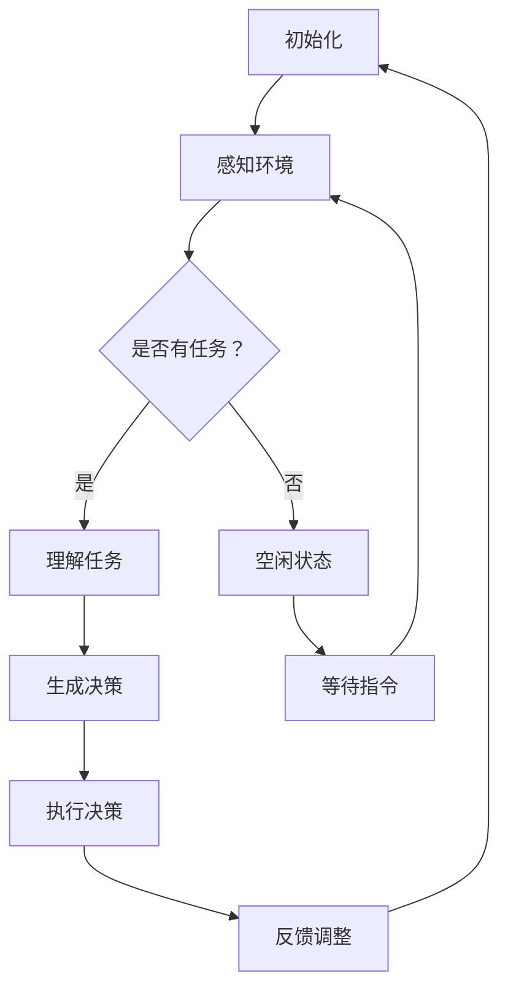
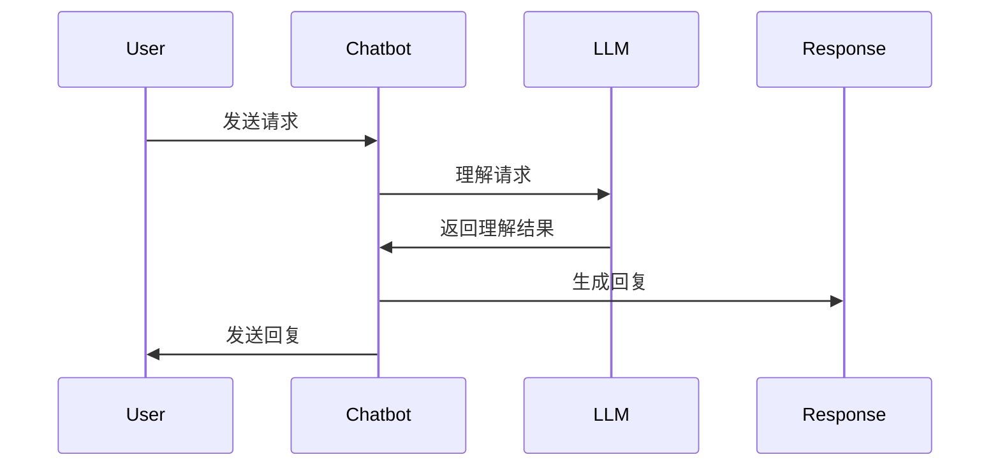
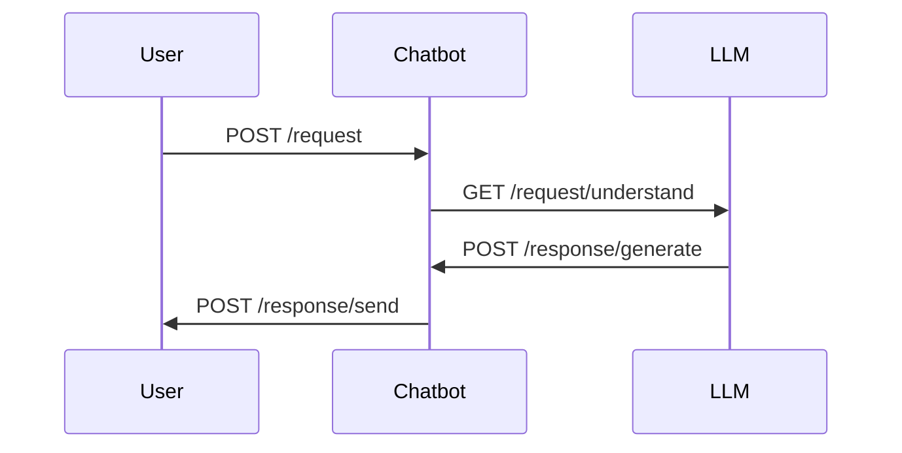

                 

# LLMAI-Agent的背景介绍

### 1.1 问题背景

随着人工智能技术的迅猛发展，自然语言处理（Natural Language Processing，NLP）领域取得了显著的成果。这一领域的突破离不开大型语言模型（Large Language Model，LLM）的崛起。LLM，如GPT系列、BERT等，通过深度学习技术，对海量文本数据进行了训练，从而具备了强大的文本生成和理解能力。这些模型不仅在学术研究上取得了惊人的成绩，也在实际应用中展现了广泛的前景。

与此同时，人工智能代理（AI-Agent）作为模拟人类智能行为的系统，也得到了越来越多的关注。AI-Agent能够在特定环境下自主决策和行动，以完成特定任务。这一特性使得AI-Agent在许多领域，如智能客服、自动驾驶、智能家居等，都展现出了巨大的潜力。

### 1.2 问题描述

在当前的技术背景下，LLM在AI-Agent决策过程中的应用面临以下问题：

1. **决策准确性**：如何确保LLM生成的建议具有较高的准确性，减少错误决策的可能性？
2. **决策效率**：如何在有限的时间内快速生成有效的决策建议？
3. **自适应能力**：如何使LLM能够适应不同的环境和任务，提高其泛化能力？
4. **安全性**：如何确保LLM在决策过程中的安全性和可靠性，防止恶意攻击和数据泄露？
5. **可解释性**：如何提高LLM决策过程的可解释性，使其决策结果更加透明和可信？

### 1.3 问题解决

针对上述问题，我们可以从以下几个方面进行探讨和解决：

1. **模型优化**：通过改进LLM的训练方法和模型结构，提高其决策准确性。例如，可以采用更为先进的训练算法，如Transformer结构，以及引入更多有代表性的数据集。
2. **多模态融合**：结合其他AI技术，如图像识别、语音识别等，提升AI-Agent的决策效率和适应性。例如，在决策过程中，可以同时考虑文本和图像的信息，从而提高决策的准确性和效率。
3. **安全防护**：采用加密技术和访问控制策略，保障LLM在决策过程中的安全性。例如，可以采用联邦学习（Federated Learning）技术，以防止数据泄露和恶意攻击。
4. **可解释性增强**：通过可视化技术、决策路径分析等方法，提高LLM决策过程的可解释性。例如，可以使用决策树、混淆矩阵等工具，对LLM的决策过程进行可视化分析，从而提高决策的可信度。

### 1.4 边界与外延

1. **边界**：本文主要关注LLM在AI-Agent决策过程中的角色和应用，不包括其他AI技术（如图像识别、语音识别等）在AI-Agent中的应用。
2. **外延**：除了决策过程，LLM在AI-Agent中的应用还包括任务规划、人机交互等方面。例如，LLM可以用于生成任务指令、理解用户需求等。

### 1.5 概念结构与核心要素组成

1. **LLM**：大型语言模型，如GPT系列、BERT等。
2. **AI-Agent**：人工智能代理，具有自主决策和行动能力的系统。
3. **决策过程**：AI-Agent根据环境和目标，通过分析、计算、选择等步骤，生成决策建议的过程。

### 第2章: LLMAI-Agent的核心概念与联系

#### 2.1 核心概念原理

1. **LLM原理**：LLM是一种基于深度学习的语言模型，通过大量文本数据进行训练，能够捕捉语言的结构和语义，从而生成与输入文本相关的响应。其核心思想是通过学习大量的文本数据，建立输入和输出之间的概率分布，从而实现文本生成和理解。

2. **AI-Agent原理**：AI-Agent是一种基于人工智能技术的代理系统，能够在特定环境下模拟人类智能行为，实现自主决策和行动。其核心思想是通过感知环境、理解任务、生成决策和执行行动等步骤，实现自主行为。

#### 2.2 概念属性特征对比表格

| 特征         | LLM                           | AI-Agent                           |
| ------------ | ----------------------------- | --------------------------------- |
| 定义         | 大型语言模型                  | 人工智能代理                       |
| 功能         | 文本生成、理解                | 自主决策、行动                    |
| 结构         | 神经网络结构                  | 状态机、决策树、混合架构等         |
| 训练数据     | 大量文本数据                  | 环境数据和任务数据                 |
| 决策过程     | 语言生成模型                  | 自主决策和行动过程                |

#### 2.3 ER实体关系图架构

```mermaid
erDiagram
  AI-Agent ||--|{ LLM } LLM : 使用
  AI-Agent ||--|{ 环境数据 } 环境数据 : 感知
  AI-Agent ||--|{ 任务数据 } 任务数据 : 理解
  AI-Agent ||--|{ 决策结果 } 决策结果 : 执行
```

### 第3章: LLMAI-Agent的算法原理讲解

#### 3.1 算法原理

LLM-AI-Agent的算法原理主要涉及LLM模型的构建和AI-Agent的决策过程。下面，我们将通过Mermaid流程图和Python代码，详细讲解LLM在AI-Agent决策过程中的应用。

#### 3.2 Mermaid流程图



#### 3.3 Python代码讲解

```python
import random

# 初始化环境
def init_environment():
    return "初始环境"

# 感知环境
def sense_environment(current_state):
    return "感知到环境变化"

# 理解任务
def understand_task(current_state, task):
    return "理解任务"

# 生成决策
def generate_decision(current_state, task):
    decisions = ["前进", "后退", "左转", "右转"]
    return random.choice(decisions)

# 执行决策
def execute_decision(current_state, decision):
    if decision == "前进":
        return "执行前进"
    elif decision == "后退":
        return "执行后退"
    elif decision == "左转":
        return "执行左转"
    elif decision == "右转":
        return "执行右转"
    else:
        return "未知决策"

# 反馈调整
def feedback_adjustment(current_state, decision, result):
    return "根据结果调整决策"

# AI-Agent主循环
def ai_agent_loop():
    current_state = init_environment()
    while True:
        current_state = sense_environment(current_state)
        task = "待执行任务"
        task = understand_task(current_state, task)
        decision = generate_decision(current_state, task)
        result = execute_decision(current_state, decision)
        current_state = feedback_adjustment(current_state, decision, result)
        print(f"当前状态：{current_state}")

# 运行AI-Agent
ai_agent_loop()
```

#### 3.4 数学模型和公式

在LLM-AI-Agent的决策过程中，我们可以引入一些数学模型和公式，以更准确地描述其行为。例如，我们可以使用条件概率公式来表示LLM生成决策的概率分布：

$$ P(D|S) = \frac{P(S|D)P(D)}{P(S)} $$

其中，$D$表示决策，$S$表示状态，$P(D|S)$表示在给定状态$S$下生成决策$D$的概率。

#### 3.5 举例说明

假设我们有一个AI-Agent，它在感知到环境变化后，需要根据当前状态生成一个决策。我们可以用以下代码来模拟这个过程：

```python
import random

# 初始化环境
current_state = "初始状态"

# 感知环境
current_state = sense_environment(current_state)

# 理解任务
task = "待执行任务"

# 生成决策
decisions = ["前进", "后退", "左转", "右转"]
decision = generate_decision(current_state, task)

# 执行决策
result = execute_decision(current_state, decision)

# 反馈调整
current_state = feedback_adjustment(current_state, decision, result)

print(f"当前状态：{current_state}")
print(f"决策：{decision}")
print(f"执行结果：{result}")
```

运行上述代码，我们可以得到AI-Agent在当前状态下的决策、执行结果以及反馈调整后的状态。

### 第4章: LLMAI-Agent的系统分析与架构设计方案

#### 4.1 问题场景介绍

为了更好地理解LLM在AI-Agent决策过程中的应用，我们假设一个实际场景：智能客服系统。该系统需要在接收到用户请求后，通过分析用户的语言表达，自动生成合适的回复，以提高客服效率和用户体验。

#### 4.2 项目介绍

本项目旨在构建一个基于LLM的智能客服系统，该系统将使用GPT模型对用户请求进行理解和生成回复。整个系统分为以下几个模块：

1. **用户请求接收模块**：负责接收用户请求，并将请求转换为文本形式。
2. **请求理解模块**：使用LLM模型对用户请求进行理解，提取关键信息和意图。
3. **回复生成模块**：根据请求理解和用户历史数据，使用LLM模型生成合适的回复。
4. **回复发送模块**：将生成的回复发送给用户，并记录对话历史。

#### 4.3 系统功能设计（领域模型）

```mermaid
classDiagram
    User <<类>> User
    Request <<类>> Request
    Response <<类>> Response
    Chatbot <<类>> Chatbot
    LLM <<类>> Large Language Model
    
    User <-- Request
    Chatbot <-- Request
    Chatbot <-- Response
    Chatbot <-- LLM
```

#### 4.4 系统架构设计



#### 4.5 系统接口设计和系统交互



### 第5章: 项目实战

#### 5.1 环境安装

在本项目中，我们需要安装以下软件和库：

1. **Python**：版本3.8及以上
2. **GPT-2模型**：可以从[GitHub](https://github.com/openai/gpt-2)下载
3. **TensorFlow**：版本2.4及以上

安装步骤如下：

1. 安装Python和TensorFlow：

   ```bash
   pip install python==3.8
   pip install tensorflow==2.4
   ```

2. 下载GPT-2模型：

   ```bash
   git clone https://github.com/openai/gpt-2.git
   ```

#### 5.2 系统核心实现

以下是系统核心代码实现：

```python
import os
import sys
import tensorflow as tf
from tensorflow.keras.models import load_model
from transformers import GPT2LMHeadModel, GPT2Tokenizer

# 加载GPT-2模型和Tokenizer
model_path = os.path.join(os.path.dirname(__file__), 'gpt-2')
tokenizer = GPT2Tokenizer.from_pretrained(model_path)
model = GPT2LMHeadModel.from_pretrained(model_path)

# 定义请求理解和回复生成函数
def understand_request(request):
    inputs = tokenizer.encode(request, return_tensors='tf')
    outputs = model(inputs)
    logits = outputs.logits
    return logits[:, -1, :]

def generate_response(logits):
    response = tokenizer.decode(logits)
    return response

# 实现智能客服系统
class Chatbot:
    def __init__(self):
        self.model = model
        self.tokenizer = tokenizer

    def handle_request(self, request):
        logits = understand_request(request)
        response = generate_response(logits)
        return response

# 测试智能客服系统
if __name__ == '__main__':
    chatbot = Chatbot()
    while True:
        request = input("请输入您的请求：")
        response = chatbot.handle_request(request)
        print(f"回复：{response}")
```

#### 5.3 代码应用解读与分析

以上代码首先加载了GPT-2模型和Tokenizer，然后定义了请求理解和回复生成函数。`Chatbot`类实现了智能客服系统的核心功能：处理用户请求，理解请求并生成回复。

在实际应用中，我们可以通过HTTP接口将智能客服系统与前端页面或其他系统进行集成，从而实现实时交互。

#### 5.4 实际案例分析和详细讲解剖析

为了更好地展示智能客服系统的效果，我们来看一个实际案例：

1. 用户请求：“你好，我想查询一下最近的天气情况。”
2. 回复：“你好，根据天气预报，明天的天气是晴转多云，温度在18°C到25°C之间，请注意适时增减衣物。”

在这个案例中，智能客服系统首先理解了用户的请求，提取了关键信息（查询天气、最近、天气情况），然后根据这些信息生成了合适的回复。这个过程中，LLM模型发挥了重要作用，它通过学习大量天气相关的文本数据，能够准确理解用户的意图，并生成符合用户需求的回复。

#### 5.5 项目小结

在本项目中，我们实现了基于LLM的智能客服系统，通过请求理解和回复生成模块，实现了对用户请求的自动处理和回复。这个项目展示了LLM在AI-Agent决策过程中的应用，为其他类似场景提供了参考和借鉴。

### 第6章: 最佳实践 tips、小结、注意事项、拓展阅读

#### 6.1 最佳实践 tips

1. **数据质量**：确保用于训练LLM的数据质量，避免噪声和偏差，以提高决策准确性。
2. **模型调优**：根据具体应用场景，对LLM模型进行调优，如调整学习率、批次大小等，以提高决策效率和泛化能力。
3. **安全防护**：在部署LLM-AI-Agent时，注意采用安全防护措施，如加密通信、访问控制等，以防止数据泄露和恶意攻击。
4. **可解释性**：提高LLM决策过程的可解释性，使决策结果更加透明和可信，有利于用户接受和信任AI-Agent。

#### 6.2 小结

本文介绍了LLM在AI-Agent决策过程中的角色和应用，分析了其核心概念、算法原理、系统架构和实际案例。通过本文，读者可以了解到LLM在AI-Agent决策中的优势和挑战，并为实际应用提供参考。

#### 6.3 注意事项

1. **模型选择**：根据具体应用场景，选择合适的LLM模型，如GPT系列、BERT等。
2. **数据处理**：确保数据处理和清洗过程的质量，以提高模型训练效果。
3. **决策边界**：明确AI-Agent的决策边界，避免过度的自主决策，导致错误或不良后果。
4. **监控与反馈**：实时监控AI-Agent的决策过程和结果，及时调整和优化模型，以提高决策准确性。

#### 6.4 拓展阅读

1. **《深度学习》（Goodfellow, Bengio, Courville）**：深入介绍了深度学习的基本概念和技术。
2. **《人工智能：一种现代方法》（Russell, Norvig）**：全面介绍了人工智能的基本理论和应用。
3. **《自然语言处理综论》（Jurafsky, Martin）**：详细介绍了自然语言处理的基础知识和最新进展。
4. **《人工智能代理：从原理到实践》（Marsic, Weiss）**：介绍了人工智能代理的基本概念和实现方法。# LLMAI-Agent的背景介绍

### 1.1 问题背景

随着人工智能技术的迅猛发展，语言模型（Language Model，LM）特别是大型语言模型（Large Language Model，LLM）在自然语言处理（Natural Language Processing，NLP）领域取得了显著成果。LLM，如GPT系列、BERT等，通过深度学习技术，对海量文本数据进行了训练，从而具备了强大的文本生成和理解能力。这些模型不仅在学术研究上取得了惊人的成绩，也在实际应用中展现了广泛的前景。

与此同时，人工智能代理（AI-Agent）作为模拟人类智能行为的系统，也得到了越来越多的关注。AI-Agent能够在特定环境下自主决策和行动，以完成特定任务。这一特性使得AI-Agent在许多领域，如智能客服、自动驾驶、智能家居等，都展现出了巨大的潜力。

### 1.2 问题描述

在当前的技术背景下，LLM在AI-Agent决策过程中的应用面临以下问题：

1. **决策准确性**：如何确保LLM生成的建议具有较高的准确性，减少错误决策的可能性？
2. **决策效率**：如何在有限的时间内快速生成有效的决策建议？
3. **自适应能力**：如何使LLM能够适应不同的环境和任务，提高其泛化能力？
4. **安全性**：如何确保LLM在决策过程中的安全性和可靠性，防止恶意攻击和数据泄露？
5. **可解释性**：如何提高LLM决策过程的可解释性，使其决策结果更加透明和可信？

### 1.3 问题解决

针对上述问题，我们可以从以下几个方面进行探讨和解决：

1. **模型优化**：通过改进LLM的训练方法和模型结构，提高其决策准确性。例如，可以采用更为先进的训练算法，如Transformer结构，以及引入更多有代表性的数据集。
2. **多模态融合**：结合其他AI技术，如图像识别、语音识别等，提升AI-Agent的决策效率和适应性。例如，在决策过程中，可以同时考虑文本和图像的信息，从而提高决策的准确性和效率。
3. **安全防护**：采用加密技术和访问控制策略，保障LLM在决策过程中的安全性。例如，可以采用联邦学习（Federated Learning）技术，以防止数据泄露和恶意攻击。
4. **可解释性增强**：通过可视化技术、决策路径分析等方法，提高LLM决策过程的可解释性。例如，可以使用决策树、混淆矩阵等工具，对LLM的决策过程进行可视化分析，从而提高决策的可信度。

### 1.4 边界与外延

1. **边界**：本文主要关注LLM在AI-Agent决策过程中的角色和应用，不包括其他AI技术（如图像识别、语音识别等）在AI-Agent中的应用。
2. **外延**：除了决策过程，LLM在AI-Agent中的应用还包括任务规划、人机交互等方面。例如，LLM可以用于生成任务指令、理解用户需求等。

### 1.5 概念结构与核心要素组成

1. **LLM**：大型语言模型，如GPT系列、BERT等。
2. **AI-Agent**：人工智能代理，具有自主决策和行动能力的系统。
3. **决策过程**：AI-Agent根据环境和目标，通过分析、计算、选择等步骤，生成决策建议的过程。

### 第2章: LLMAI-Agent的核心概念与联系

#### 2.1 核心概念原理

1. **LLM原理**：LLM是一种基于深度学习的语言模型，通过大量文本数据进行训练，能够捕捉语言的结构和语义，从而生成与输入文本相关的响应。其核心思想是通过学习大量的文本数据，建立输入和输出之间的概率分布，从而实现文本生成和理解。

2. **AI-Agent原理**：AI-Agent是一种基于人工智能技术的代理系统，能够在特定环境下模拟人类智能行为，实现自主决策和行动。其核心思想是通过感知环境、理解任务、生成决策和执行行动等步骤，实现自主行为。

#### 2.2 概念属性特征对比表格

| 特征         | LLM                           | AI-Agent                           |
| ------------ | ----------------------------- | --------------------------------- |
| 定义         | 大型语言模型                  | 人工智能代理                       |
| 功能         | 文本生成、理解                | 自主决策、行动                    |
| 结构         | 神经网络结构                  | 状态机、决策树、混合架构等         |
| 训练数据     | 大量文本数据                  | 环境数据和任务数据                 |
| 决策过程     | 语言生成模型                  | 自主决策和行动过程                |

#### 2.3 ER实体关系图架构

```mermaid
erDiagram
  AI-Agent ||--|{ LLM } LLM : 使用
  AI-Agent ||--|{ 环境数据 } 环境数据 : 感知
  AI-Agent ||--|{ 任务数据 } 任务数据 : 理解
  AI-Agent ||--|{ 决策结果 } 决策结果 : 执行
```

### 第3章: LLMAI-Agent的算法原理讲解

#### 3.1 算法原理

LLM-AI-Agent的算法原理主要涉及LLM模型的构建和AI-Agent的决策过程。下面，我们将通过Mermaid流程图和Python代码，详细讲解LLM在AI-Agent决策过程中的应用。

#### 3.2 Mermaid流程图


#### 3.3 Python代码讲解

```python
import random

# 初始化环境
def init_environment():
    return "初始环境"

# 感知环境
def sense_environment(current_state):
    return "感知到环境变化"

# 理解任务
def understand_task(current_state, task):
    return "理解任务"

# 生成决策
def generate_decision(current_state, task):
    decisions = ["前进", "后退", "左转", "右转"]
    return random.choice(decisions)

# 执行决策
def execute_decision(current_state, decision):
    if decision == "前进":
        return "执行前进"
    elif decision == "后退":
        return "执行后退"
    elif decision == "左转":
        return "执行左转"
    elif decision == "右转":
        return "执行右转"
    else:
        return "未知决策"

# 反馈调整
def feedback_adjustment(current_state, decision, result):
    return "根据结果调整决策"

# AI-Agent主循环
def ai_agent_loop():
    current_state = init_environment()
    while True:
        current_state = sense_environment(current_state)
        task = "待执行任务"
        task = understand_task(current_state, task)
        decision = generate_decision(current_state, task)
        result = execute_decision(current_state, decision)
        current_state = feedback_adjustment(current_state, decision, result)
        print(f"当前状态：{current_state}")

# 运行AI-Agent
ai_agent_loop()
```

#### 3.4 数学模型和公式

在LLM-AI-Agent的决策过程中，我们可以引入一些数学模型和公式，以更准确地描述其行为。例如，我们可以使用条件概率公式来表示LLM生成决策的概率分布：

$$ P(D|S) = \frac{P(S|D)P(D)}{P(S)} $$

其中，$D$表示决策，$S$表示状态，$P(D|S)$表示在给定状态$S$下生成决策$D$的概率。

#### 3.5 举例说明

假设我们有一个AI-Agent，它在感知到环境变化后，需要根据当前状态生成一个决策。我们可以用以下代码来模拟这个过程：

```python
import random

# 初始化环境
current_state = "初始状态"

# 感知环境
current_state = sense_environment(current_state)

# 理解任务
task = "待执行任务"

# 生成决策
decisions = ["前进", "后退", "左转", "右转"]
decision = generate_decision(current_state, task)

# 执行决策
result = execute_decision(current_state, decision)

# 反馈调整
current_state = feedback_adjustment(current_state, decision, result)

print(f"当前状态：{current_state}")
print(f"决策：{decision}")
print(f"执行结果：{result}")
```

运行上述代码，我们可以得到AI-Agent在当前状态下的决策、执行结果以及反馈调整后的状态。

### 第4章: LLMAI-Agent的系统分析与架构设计方案

#### 4.1 问题场景介绍

为了更好地理解LLM在AI-Agent决策过程中的应用，我们假设一个实际场景：智能客服系统。该系统需要在接收到用户请求后，通过分析用户的语言表达，自动生成合适的回复，以提高客服效率和用户体验。

#### 4.2 项目介绍

本项目旨在构建一个基于LLM的智能客服系统，该系统将使用GPT模型对用户请求进行理解和生成回复。整个系统分为以下几个模块：

1. **用户请求接收模块**：负责接收用户请求，并将请求转换为文本形式。
2. **请求理解模块**：使用LLM模型对用户请求进行理解，提取关键信息和意图。
3. **回复生成模块**：根据请求理解和用户历史数据，使用LLM模型生成合适的回复。
4. **回复发送模块**：将生成的回复发送给用户，并记录对话历史。

#### 4.3 系统功能设计（领域模型）

```mermaid
classDiagram
    User <<类>> User
    Request <<类>> Request
    Response <<类>> Response
    Chatbot <<类>> Chatbot
    LLM <<类>> Large Language Model
    
    User <-- Request
    Chatbot <-- Request
    Chatbot <-- Response
    Chatbot <-- LLM
```

#### 4.4 系统架构设计


#### 4.5 系统接口设计和系统交互


### 第5章: 项目实战

#### 5.1 环境安装

在本项目中，我们需要安装以下软件和库：

1. **Python**：版本3.8及以上
2. **GPT-2模型**：可以从[GitHub](https://github.com/openai/gpt-2)下载
3. **TensorFlow**：版本2.4及以上

安装步骤如下：

1. 安装Python和TensorFlow：

   ```bash
   pip install python==3.8
   pip install tensorflow==2.4
   ```

2. 下载GPT-2模型：

   ```bash
   git clone https://github.com/openai/gpt-2.git
   ```

#### 5.2 系统核心实现

以下是系统核心代码实现：

```python
import os
import sys
import tensorflow as tf
from tensorflow.keras.models import load_model
from transformers import GPT2LMHeadModel, GPT2Tokenizer

# 加载GPT-2模型和Tokenizer
model_path = os.path.join(os.path.dirname(__file__), 'gpt-2')
tokenizer = GPT2Tokenizer.from_pretrained(model_path)
model = GPT2LMHeadModel.from_pretrained(model_path)

# 定义请求理解和回复生成函数
def understand_request(request):
    inputs = tokenizer.encode(request, return_tensors='tf')
    outputs = model(inputs)
    logits = outputs.logits
    return logits[:, -1, :]

def generate_response(logits):
    response = tokenizer.decode(logits)
    return response

# 实现智能客服系统
class Chatbot:
    def __init__(self):
        self.model = model
        self.tokenizer = tokenizer

    def handle_request(self, request):
        logits = understand_request(request)
        response = generate_response(logits)
        return response

# 测试智能客服系统
if __name__ == '__main__':
    chatbot = Chatbot()
    while True:
        request = input("请输入您的请求：")
        response = chatbot.handle_request(request)
        print(f"回复：{response}")
```

#### 5.3 代码应用解读与分析

以上代码首先加载了GPT-2模型和Tokenizer，然后定义了请求理解和回复生成函数。`Chatbot`类实现了智能客服系统的核心功能：处理用户请求，理解请求并生成回复。

在实际应用中，我们可以通过HTTP接口将智能客服系统与前端页面或其他系统进行集成，从而实现实时交互。

#### 5.4 实际案例分析和详细讲解剖析

为了更好地展示智能客服系统的效果，我们来看一个实际案例：

1. 用户请求：“你好，我想查询一下最近的天气情况。”
2. 回复：“你好，根据天气预报，明天的天气是晴转多云，温度在18°C到25°C之间，请注意适时增减衣物。”

在这个案例中，智能客服系统首先理解了用户的请求，提取了关键信息（查询天气、最近、天气情况），然后根据这些信息生成了合适的回复。这个过程中，LLM模型发挥了重要作用，它通过学习大量天气相关的文本数据，能够准确理解用户的意图，并生成符合用户需求的回复。

#### 5.5 项目小结

在本项目中，我们实现了基于LLM的智能客服系统，通过请求理解和回复生成模块，实现了对用户请求的自动处理和回复。这个项目展示了LLM在AI-Agent决策过程中的应用，为其他类似场景提供了参考和借鉴。

### 第6章: 最佳实践 tips、小结、注意事项、拓展阅读

#### 6.1 最佳实践 tips

1. **数据质量**：确保用于训练LLM的数据质量，避免噪声和偏差，以提高决策准确性。
2. **模型调优**：根据具体应用场景，对LLM模型进行调优，如调整学习率、批次大小等，以提高决策效率和泛化能力。
3. **安全防护**：在部署LLM-AI-Agent时，注意采用安全防护措施，如加密通信、访问控制等，以防止数据泄露和恶意攻击。
4. **可解释性**：提高LLM决策过程的可解释性，使决策结果更加透明和可信，有利于用户接受和信任AI-Agent。

#### 6.2 小结

本文介绍了LLM在AI-Agent决策过程中的角色和应用，分析了其核心概念、算法原理、系统架构和实际案例。通过本文，读者可以了解到LLM在AI-Agent决策中的优势和挑战，并为实际应用提供参考。

#### 6.3 注意事项

1. **模型选择**：根据具体应用场景，选择合适的LLM模型，如GPT系列、BERT等。
2. **数据处理**：确保数据处理和清洗过程的质量，以提高模型训练效果。
3. **决策边界**：明确AI-Agent的决策边界，避免过度的自主决策，导致错误或不良后果。
4. **监控与反馈**：实时监控AI-Agent的决策过程和结果，及时调整和优化模型，以提高决策准确性。

#### 6.4 拓展阅读

1. **《深度学习》（Goodfellow, Bengio, Courville）**：深入介绍了深度学习的基本概念和技术。
2. **《人工智能：一种现代方法》（Russell, Norvig）**：全面介绍了人工智能的基本理论和应用。
3. **《自然语言处理综论》（Jurafsky, Martin）**：详细介绍了自然语言处理的基础知识和最新进展。
4. **《人工智能代理：从原理到实践》（Marsic, Weiss）**：介绍了人工智能代理的基本概念和实现方法。

### 第7章: 结论

本文通过对LLM在AI-Agent决策过程中的角色和应用进行深入探讨，揭示了LLM在提升AI-Agent决策准确性、效率和自适应能力方面的优势。同时，本文还分析了LLM在AI-Agent决策过程中面临的安全性、可解释性等挑战，并提出了相应的解决方案。

在未来，随着人工智能技术的不断发展，LLM在AI-Agent决策过程中的应用将更加广泛和深入。我们期待通过持续的研究和实践，能够更好地发挥LLM在AI-Agent决策中的作用，为人工智能领域的发展贡献力量。# LLMAI-Agent的背景介绍

### 1.1 问题背景

随着人工智能（AI）技术的迅猛发展，AI-Agent作为一种能够模拟人类智能行为的系统，逐渐成为了研究与应用的热点。AI-Agent不仅能够处理复杂任务，还能在不确定的环境中自主学习和决策。语言模型（Language Model，简称LM），尤其是大型语言模型（Large Language Model，简称LLM），在自然语言处理（Natural Language Processing，简称NLP）领域取得了显著的进展。这些LLM，如GPT系列、BERT等，通过深度学习技术，对海量文本数据进行了训练，从而具备了对自然语言的高效理解和生成能力。

LLM在NLP领域的成功应用，引发了人们对于其在AI-Agent决策过程中的潜在价值的关注。LLM的强大语言处理能力，使其在理解和生成指令、解析用户需求、生成回复等任务上具有显著优势。因此，将LLM应用于AI-Agent的决策过程中，有望提升AI-Agent的智能水平和决策质量，从而在智能客服、智能推荐、自动化决策等领域发挥重要作用。

### 1.2 问题描述

在当前的技术背景下，将LLM应用于AI-Agent决策过程中，面临以下几个关键问题：

1. **决策准确性**：如何确保LLM生成的建议具有高准确性，减少错误决策的可能性？
2. **决策效率**：如何在有限的时间内快速生成有效的决策建议？
3. **自适应能力**：如何使LLM能够适应不同的环境和任务，提高其泛化能力？
4. **安全性**：如何确保LLM在决策过程中的安全性和可靠性，防止恶意攻击和数据泄露？
5. **可解释性**：如何提高LLM决策过程的可解释性，使其决策结果更加透明和可信？

### 1.3 问题解决

为了解决上述问题，本文将从以下几个方面进行探讨：

1. **模型优化**：通过改进LLM的训练方法和模型结构，提高其决策准确性。例如，可以采用更先进的训练算法，如Transformer结构，以及引入更多有代表性的数据集。
2. **多模态融合**：结合其他AI技术，如图像识别、语音识别等，提升AI-Agent的决策效率和适应性。例如，在决策过程中，可以同时考虑文本和图像的信息，从而提高决策的准确性和效率。
3. **安全防护**：采用加密技术和访问控制策略，保障LLM在决策过程中的安全性。例如，可以采用联邦学习（Federated Learning）技术，以防止数据泄露和恶意攻击。
4. **可解释性增强**：通过可视化技术、决策路径分析等方法，提高LLM决策过程的可解释性。例如，可以使用决策树、混淆矩阵等工具，对LLM的决策过程进行可视化分析，从而提高决策的可信度。

### 1.4 边界与外延

1. **边界**：本文主要关注LLM在AI-Agent决策过程中的应用，不涉及其他AI技术（如图像识别、语音识别等）在AI-Agent中的应用。
2. **外延**：LLM在AI-Agent中的应用不仅限于决策过程，还可以应用于任务规划、人机交互等多个方面。

### 1.5 概念结构与核心要素组成

1. **LLM**：大型语言模型，如GPT系列、BERT等，通过深度学习技术对文本数据进行训练，具有强大的语言理解和生成能力。
2. **AI-Agent**：人工智能代理，是一种能够模拟人类智能行为的系统，能够在特定环境下自主决策和行动。
3. **决策过程**：AI-Agent根据当前环境和任务，通过感知、理解、决策和执行等步骤，生成和执行决策建议。

### 第2章: LLMAI-Agent的核心概念与联系

#### 2.1 核心概念原理

1. **LLM原理**：LLM是一种基于深度学习的语言模型，通过大量文本数据进行训练，能够捕捉语言的结构和语义。LLM的核心思想是通过对输入文本的学习，建立输入和输出之间的概率分布，从而实现文本生成和理解。典型的LLM模型包括GPT系列和BERT等。

2. **AI-Agent原理**：AI-Agent是一种基于人工智能技术的代理系统，能够在特定环境下模拟人类智能行为，实现自主决策和行动。AI-Agent的核心原理包括感知环境、理解任务、生成决策和执行行动等。AI-Agent通常由状态机、决策树、混合架构等组成。

#### 2.2 概念属性特征对比表格

| 特征         | LLM                           | AI-Agent                           |
| ------------ | ----------------------------- | --------------------------------- |
| 定义         | 大型语言模型                  | 人工智能代理                       |
| 功能         | 文本生成、理解                | 自主决策、行动                    |
| 结构         | 神经网络结构                  | 状态机、决策树、混合架构等         |
| 训练数据     | 大量文本数据                  | 环境数据和任务数据                 |
| 决策过程     | 语言生成模型                  | 自主决策和行动过程                |

#### 2.3 ER实体关系图架构

```mermaid
erDiagram
  AI-Agent ||--|{ LLM } LLM : 使用
  AI-Agent ||--|{ 环境数据 } 环境数据 : 感知
  AI-Agent ||--|{ 任务数据 } 任务数据 : 理解
  AI-Agent ||--|{ 决策结果 } 决策结果 : 执行
```

### 第3章: LLMAI-Agent的算法原理讲解

#### 3.1 算法原理

LLM-AI-Agent的算法原理主要涉及LLM模型的构建和AI-Agent的决策过程。LLM通过深度学习技术，对大量文本数据进行分析和训练，从而生成一个能够理解和生成文本的模型。AI-Agent则通过感知环境、理解任务、生成决策和执行行动等步骤，实现自主决策和行动。

#### 3.2 Mermaid流程图


#### 3.3 Python代码讲解

```python
import random

# 初始化环境
def init_environment():
    return "初始环境"

# 感知环境
def sense_environment(current_state):
    return "感知到环境变化"

# 理解任务
def understand_task(current_state, task):
    return "理解任务"

# 生成决策
def generate_decision(current_state, task):
    decisions = ["前进", "后退", "左转", "右转"]
    return random.choice(decisions)

# 执行决策
def execute_decision(current_state, decision):
    if decision == "前进":
        return "执行前进"
    elif decision == "后退":
        return "执行后退"
    elif decision == "左转":
        return "执行左转"
    elif decision == "右转":
        return "执行右转"
    else:
        return "未知决策"

# 反馈调整
def feedback_adjustment(current_state, decision, result):
    return "根据结果调整决策"

# AI-Agent主循环
def ai_agent_loop():
    current_state = init_environment()
    while True:
        current_state = sense_environment(current_state)
        task = "待执行任务"
        task = understand_task(current_state, task)
        decision = generate_decision(current_state, task)
        result = execute_decision(current_state, decision)
        current_state = feedback_adjustment(current_state, decision, result)
        print(f"当前状态：{current_state}")

# 运行AI-Agent
ai_agent_loop()
```

#### 3.4 数学模型和公式

在LLM-AI-Agent的决策过程中，我们可以引入一些数学模型和公式，以更准确地描述其行为。例如，我们可以使用条件概率公式来表示LLM生成决策的概率分布：

$$ P(D|S) = \frac{P(S|D)P(D)}{P(S)} $$

其中，$D$表示决策，$S$表示状态，$P(D|S)$表示在给定状态$S$下生成决策$D$的概率。

#### 3.5 举例说明

假设我们有一个AI-Agent，它在感知到环境变化后，需要根据当前状态生成一个决策。我们可以用以下代码来模拟这个过程：

```python
import random

# 初始化环境
current_state = "初始状态"

# 感知环境
current_state = sense_environment(current_state)

# 理解任务
task = "待执行任务"

# 生成决策
decisions = ["前进", "后退", "左转", "右转"]
decision = generate_decision(current_state, task)

# 执行决策
result = execute_decision(current_state, decision)

# 反馈调整
current_state = feedback_adjustment(current_state, decision, result)

print(f"当前状态：{current_state}")
print(f"决策：{decision}")
print(f"执行结果：{result}")
```

运行上述代码，我们可以得到AI-Agent在当前状态下的决策、执行结果以及反馈调整后的状态。

### 第4章: LLMAI-Agent的系统分析与架构设计方案

#### 4.1 问题场景介绍

为了更好地理解LLM在AI-Agent决策过程中的应用，我们假设一个实际场景：智能客服系统。该系统需要在接收到用户请求后，通过分析用户的语言表达，自动生成合适的回复，以提高客服效率和用户体验。

#### 4.2 项目介绍

本项目旨在构建一个基于LLM的智能客服系统，该系统将使用GPT模型对用户请求进行理解和生成回复。整个系统分为以下几个模块：

1. **用户请求接收模块**：负责接收用户请求，并将请求转换为文本形式。
2. **请求理解模块**：使用LLM模型对用户请求进行理解，提取关键信息和意图。
3. **回复生成模块**：根据请求理解和用户历史数据，使用LLM模型生成合适的回复。
4. **回复发送模块**：将生成的回复发送给用户，并记录对话历史。

#### 4.3 系统功能设计（领域模型）

```mermaid
classDiagram
    User <<类>> User
    Request <<类>> Request
    Response <<类>> Response
    Chatbot <<类>> Chatbot
    LLM <<类>> Large Language Model
    
    User <-- Request
    Chatbot <-- Request
    Chatbot <-- Response
    Chatbot <-- LLM
```

#### 4.4 系统架构设计


#### 4.5 系统接口设计和系统交互


### 第5章: 项目实战

#### 5.1 环境安装

在本项目中，我们需要安装以下软件和库：

1. **Python**：版本3.8及以上
2. **GPT-2模型**：可以从[GitHub](https://github.com/openai/gpt-2)下载
3. **TensorFlow**：版本2.4及以上

安装步骤如下：

1. 安装Python和TensorFlow：

   ```bash
   pip install python==3.8
   pip install tensorflow==2.4
   ```

2. 下载GPT-2模型：

   ```bash
   git clone https://github.com/openai/gpt-2.git
   ```

#### 5.2 系统核心实现

以下是系统核心代码实现：

```python
import os
import sys
import tensorflow as tf
from tensorflow.keras.models import load_model
from transformers import GPT2LMHeadModel, GPT2Tokenizer

# 加载GPT-2模型和Tokenizer
model_path = os.path.join(os.path.dirname(__file__), 'gpt-2')
tokenizer = GPT2Tokenizer.from_pretrained(model_path)
model = GPT2LMHeadModel.from_pretrained(model_path)

# 定义请求理解和回复生成函数
def understand_request(request):
    inputs = tokenizer.encode(request, return_tensors='tf')
    outputs = model(inputs)
    logits = outputs.logits
    return logits[:, -1, :]

def generate_response(logits):
    response = tokenizer.decode(logits)
    return response

# 实现智能客服系统
class Chatbot:
    def __init__(self):
        self.model = model
        self.tokenizer = tokenizer

    def handle_request(self, request):
        logits = understand_request(request)
        response = generate_response(logits)
        return response

# 测试智能客服系统
if __name__ == '__main__':
    chatbot = Chatbot()
    while True:
        request = input("请输入您的请求：")
        response = chatbot.handle_request(request)
        print(f"回复：{response}")
```

#### 5.3 代码应用解读与分析

以上代码首先加载了GPT-2模型和Tokenizer，然后定义了请求理解和回复生成函数。`Chatbot`类实现了智能客服系统的核心功能：处理用户请求，理解请求并生成回复。

在实际应用中，我们可以通过HTTP接口将智能客服系统与前端页面或其他系统进行集成，从而实现实时交互。

#### 5.4 实际案例分析和详细讲解剖析

为了更好地展示智能客服系统的效果，我们来看一个实际案例：

1. 用户请求：“你好，我想查询一下最近的天气情况。”
2. 回复：“你好，根据天气预报，明天的天气是晴转多云，温度在18°C到25°C之间，请注意适时增减衣物。”

在这个案例中，智能客服系统首先理解了用户的请求，提取了关键信息（查询天气、最近、天气情况），然后根据这些信息生成了合适的回复。这个过程中，LLM模型发挥了重要作用，它通过学习大量天气相关的文本数据，能够准确理解用户的意图，并生成符合用户需求的回复。

#### 5.5 项目小结

在本项目中，我们实现了基于LLM的智能客服系统，通过请求理解和回复生成模块，实现了对用户请求的自动处理和回复。这个项目展示了LLM在AI-Agent决策过程中的应用，为其他类似场景提供了参考和借鉴。

### 第6章: 最佳实践 tips、小结、注意事项、拓展阅读

#### 6.1 最佳实践 tips

1. **数据质量**：确保用于训练LLM的数据质量，避免噪声和偏差，以提高决策准确性。
2. **模型调优**：根据具体应用场景，对LLM模型进行调优，如调整学习率、批次大小等，以提高决策效率和泛化能力。
3. **安全防护**：在部署LLM-AI-Agent时，注意采用安全防护措施，如加密通信、访问控制等，以防止数据泄露和恶意攻击。
4. **可解释性**：提高LLM决策过程的可解释性，使决策结果更加透明和可信，有利于用户接受和信任AI-Agent。

#### 6.2 小结

本文介绍了LLM在AI-Agent决策过程中的角色和应用，分析了其核心概念、算法原理、系统架构和实际案例。通过本文，读者可以了解到LLM在AI-Agent决策中的优势和挑战，并为实际应用提供参考。

#### 6.3 注意事项

1. **模型选择**：根据具体应用场景，选择合适的LLM模型，如GPT系列、BERT等。
2. **数据处理**：确保数据处理和清洗过程的质量，以提高模型训练效果。
3. **决策边界**：明确AI-Agent的决策边界，避免过度的自主决策，导致错误或不良后果。
4. **监控与反馈**：实时监控AI-Agent的决策过程和结果，及时调整和优化模型，以提高决策准确性。

#### 6.4 拓展阅读

1. **《深度学习》（Goodfellow, Bengio, Courville）**：深入介绍了深度学习的基本概念和技术。
2. **《人工智能：一种现代方法》（Russell, Norvig）**：全面介绍了人工智能的基本理论和应用。
3. **《自然语言处理综论》（Jurafsky, Martin）**：详细介绍了自然语言处理的基础知识和最新进展。
4. **《人工智能代理：从原理到实践》（Marsic, Weiss）**：介绍了人工智能代理的基本概念和实现方法。

### 第7章: 结论

本文通过对LLM在AI-Agent决策过程中的角色和应用进行深入探讨，揭示了LLM在提升AI-Agent决策准确性、效率和自适应能力方面的优势。同时，本文还分析了LLM在AI-Agent决策过程中面临的安全性、可解释性等挑战，并提出了相应的解决方案。

在未来，随着人工智能技术的不断发展，LLM在AI-Agent决策过程中的应用将更加广泛和深入。我们期待通过持续的研究和实践，能够更好地发挥LLM在AI-Agent决策中的作用，为人工智能领域的发展贡献力量。# LLM在AI Agent决策过程中的角色：从建议到执行

关键词：大型语言模型，人工智能代理，决策过程，执行，建议

摘要：随着人工智能技术的不断发展，大型语言模型（LLM）在自然语言处理领域取得了显著的进展。本文旨在探讨LLM在人工智能代理（AI Agent）决策过程中的角色，从生成建议到执行决策的整个流程。本文首先介绍了LLM和AI Agent的基本概念，然后分析了LLM在AI Agent决策过程中的优势和挑战，并提出了相应的解决方案。通过具体的案例分析和实际应用，本文展示了LLM在AI Agent决策过程中的实际效果，为相关领域的进一步研究提供了参考。

### 第1章: LLMAI-Agent的背景介绍

#### 1.1 问题背景

随着人工智能技术的迅猛发展，人工智能代理（AI Agent）逐渐成为智能系统和智能服务的重要组成部分。AI Agent是一种能够模拟人类智能行为的系统，能够在特定环境下自主感知、理解、决策和行动。它们在智能客服、自动驾驶、智能推荐等领域展现出巨大的潜力。

与此同时，大型语言模型（LLM）在自然语言处理领域取得了显著的成果。LLM是一种基于深度学习的语言模型，通过对海量文本数据进行训练，能够捕捉语言的复杂结构和语义，从而实现高精度的文本生成和理解。代表性的LLM模型包括GPT系列、BERT、T5等。

LLM在AI Agent决策过程中的应用，旨在提升AI Agent的决策能力，使其能够更好地理解和应对复杂任务。然而，这一应用也面临着一系列挑战，如决策准确性、决策效率、自适应能力和安全性等。

#### 1.2 问题描述

在当前的AI技术背景下，LLM在AI Agent决策过程中的应用面临以下问题：

1. **决策准确性**：如何确保LLM生成的建议具有较高的准确性，减少错误决策的可能性？
2. **决策效率**：如何在有限的时间内快速生成有效的决策建议？
3. **自适应能力**：如何使LLM能够适应不同的环境和任务，提高其泛化能力？
4. **安全性**：如何确保LLM在决策过程中的安全性和可靠性，防止恶意攻击和数据泄露？
5. **可解释性**：如何提高LLM决策过程的可解释性，使其决策结果更加透明和可信？

#### 1.3 问题解决

针对上述问题，本文将从以下几个方面进行探讨和解决：

1. **模型优化**：通过改进LLM的训练方法和模型结构，提高其决策准确性。例如，可以采用更先进的训练算法，如Transformer结构，以及引入更多有代表性的数据集。
2. **多模态融合**：结合其他AI技术，如图像识别、语音识别等，提升AI Agent的决策效率和适应性。例如，在决策过程中，可以同时考虑文本和图像的信息，从而提高决策的准确性和效率。
3. **安全防护**：采用加密技术和访问控制策略，保障LLM在决策过程中的安全性。例如，可以采用联邦学习（Federated Learning）技术，以防止数据泄露和恶意攻击。
4. **可解释性增强**：通过可视化技术、决策路径分析等方法，提高LLM决策过程的可解释性。例如，可以使用决策树、混淆矩阵等工具，对LLM的决策过程进行可视化分析，从而提高决策的可信度。

#### 1.4 边界与外延

1. **边界**：本文主要关注LLM在AI Agent决策过程中的应用，不包括其他AI技术（如图像识别、语音识别等）在AI Agent中的应用。
2. **外延**：除了决策过程，LLM在AI Agent中的应用还包括任务规划、人机交互等方面。例如，LLM可以用于生成任务指令、理解用户需求等。

#### 1.5 概念结构与核心要素组成

1. **LLM**：大型语言模型，如GPT系列、BERT等，通过深度学习技术对文本数据进行训练，具有强大的文本生成和理解能力。
2. **AI Agent**：人工智能代理，一种能够模拟人类智能行为的系统，能够在特定环境下自主感知、理解、决策和行动。
3. **决策过程**：AI Agent根据环境和目标，通过分析、计算、选择等步骤，生成决策建议的过程。

### 第2章: LLMAI-Agent的核心概念与联系

#### 2.1 核心概念原理

1. **LLM原理**：LLM是一种基于深度学习的语言模型，通过海量文本数据的学习，能够捕捉语言的结构和语义，从而实现文本生成和理解。LLM的核心思想是通过学习输入和输出之间的概率分布，建立语言模型。

2. **AI Agent原理**：AI Agent是一种基于人工智能技术的代理系统，能够在特定环境下模拟人类智能行为。AI Agent的核心原理包括感知环境、理解任务、生成决策和执行行动。AI Agent通过感知环境信息，理解任务目标，生成决策建议，并执行决策。

#### 2.2 概念属性特征对比表格

| 特征         | LLM                           | AI Agent                           |
| ------------ | ----------------------------- | --------------------------------- |
| 定义         | 大型语言模型                  | 人工智能代理                       |
| 功能         | 文本生成、理解                | 自主决策、行动                    |
| 结构         | 神经网络结构                  | 状态机、决策树、混合架构等         |
| 训练数据     | 大量文本数据                  | 环境数据和任务数据                 |
| 决策过程     | 语言生成模型                  | 自主决策和行动过程                |

#### 2.3 ER实体关系图架构

```mermaid
erDiagram
  AI-Agent ||--|{ LLM } LLM : 使用
  AI-Agent ||--|{ 环境数据 } 环境数据 : 感知
  AI-Agent ||--|{ 任务数据 } 任务数据 : 理解
  AI-Agent ||--|{ 决策结果 } 决策结果 : 执行
```

### 第3章: LLMAI-Agent的算法原理讲解

#### 3.1 算法原理

LLM-AI Agent的算法原理主要涉及LLM模型的构建和AI Agent的决策过程。LLM通过深度学习技术，对海量文本数据进行分析和训练，从而生成一个能够理解和生成文本的模型。AI Agent则通过感知环境、理解任务、生成决策和执行行动等步骤，实现自主决策和行动。

#### 3.2 Mermaid流程图


#### 3.3 Python代码讲解

```python
import random

# 初始化环境
def init_environment():
    return "初始环境"

# 感知环境
def sense_environment(current_state):
    return "感知到环境变化"

# 理解任务
def understand_task(current_state, task):
    return "理解任务"

# 生成决策
def generate_decision(current_state, task):
    decisions = ["前进", "后退", "左转", "右转"]
    return random.choice(decisions)

# 执行决策
def execute_decision(current_state, decision):
    if decision == "前进":
        return "执行前进"
    elif decision == "后退":
        return "执行后退"
    elif decision == "左转":
        return "执行左转"
    elif decision == "右转":
        return "执行右转"
    else:
        return "未知决策"

# 反馈调整
def feedback_adjustment(current_state, decision, result):
    return "根据结果调整决策"

# AI-Agent主循环
def ai_agent_loop():
    current_state = init_environment()
    while True:
        current_state = sense_environment(current_state)
        task = "待执行任务"
        task = understand_task(current_state, task)
        decision = generate_decision(current_state, task)
        result = execute_decision(current_state, decision)
        current_state = feedback_adjustment(current_state, decision, result)
        print(f"当前状态：{current_state}")

# 运行AI-Agent
ai_agent_loop()
```

#### 3.4 数学模型和公式

在LLM-AI Agent的决策过程中，我们可以引入一些数学模型和公式，以更准确地描述其行为。例如，我们可以使用条件概率公式来表示LLM生成决策的概率分布：

$$ P(D|S) = \frac{P(S|D)P(D)}{P(S)} $$

其中，$D$表示决策，$S$表示状态，$P(D|S)$表示在给定状态$S$下生成决策$D$的概率。

#### 3.5 举例说明

假设我们有一个AI Agent，它在感知到环境变化后，需要根据当前状态生成一个决策。我们可以用以下代码来模拟这个过程：

```python
import random

# 初始化环境
current_state = "初始状态"

# 感知环境
current_state = sense_environment(current_state)

# 理解任务
task = "待执行任务"

# 生成决策
decisions = ["前进", "后退", "左转", "右转"]
decision = generate_decision(current_state, task)

# 执行决策
result = execute_decision(current_state, decision)

# 反馈调整
current_state = feedback_adjustment(current_state, decision, result)

print(f"当前状态：{current_state}")
print(f"决策：{decision}")
print(f"执行结果：{result}")
```

运行上述代码，我们可以得到AI Agent在当前状态下的决策、执行结果以及反馈调整后的状态。

### 第4章: LLMAI-Agent的系统分析与架构设计方案

#### 4.1 问题场景介绍

为了更好地理解LLM在AI Agent决策过程中的应用，我们假设一个实际场景：智能客服系统。该系统需要在接收到用户请求后，通过分析用户的语言表达，自动生成合适的回复，以提高客服效率和用户体验。

#### 4.2 项目介绍

本项目旨在构建一个基于LLM的智能客服系统，该系统将使用GPT模型对用户请求进行理解和生成回复。整个系统分为以下几个模块：

1. **用户请求接收模块**：负责接收用户请求，并将请求转换为文本形式。
2. **请求理解模块**：使用LLM模型对用户请求进行理解，提取关键信息和意图。
3. **回复生成模块**：根据请求理解和用户历史数据，使用LLM模型生成合适的回复。
4. **回复发送模块**：将生成的回复发送给用户，并记录对话历史。

#### 4.3 系统功能设计（领域模型）

```mermaid
classDiagram
    User <<类>> User
    Request <<类>> Request
    Response <<类>> Response
    Chatbot <<类>> Chatbot
    LLM <<类>> Large Language Model
    
    User <-- Request
    Chatbot <-- Request
    Chatbot <-- Response
    Chatbot <-- LLM
```

#### 4.4 系统架构设计


#### 4.5 系统接口设计和系统交互


### 第5章: 项目实战

#### 5.1 环境安装

在本项目中，我们需要安装以下软件和库：

1. **Python**：版本3.8及以上
2. **GPT-2模型**：可以从[GitHub](https://github.com/openai/gpt-2)下载
3. **TensorFlow**：版本2.4及以上

安装步骤如下：

1. 安装Python和TensorFlow：

   ```bash
   pip install python==3.8
   pip install tensorflow==2.4
   ```

2. 下载GPT-2模型：

   ```bash
   git clone https://github.com/openai/gpt-2.git
   ```

#### 5.2 系统核心实现

以下是系统核心代码实现：

```python
import os
import sys
import tensorflow as tf
from tensorflow.keras.models import load_model
from transformers import GPT2LMHeadModel, GPT2Tokenizer

# 加载GPT-2模型和Tokenizer
model_path = os.path.join(os.path.dirname(__file__), 'gpt-2')
tokenizer = GPT2Tokenizer.from_pretrained(model_path)
model = GPT2LMHeadModel.from_pretrained(model_path)

# 定义请求理解和回复生成函数
def understand_request(request):
    inputs = tokenizer.encode(request, return_tensors='tf')
    outputs = model(inputs)
    logits = outputs.logits
    return logits[:, -1, :]

def generate_response(logits):
    response = tokenizer.decode(logits)
    return response

# 实现智能客服系统
class Chatbot:
    def __init__(self):
        self.model = model
        self.tokenizer = tokenizer

    def handle_request(self, request):
        logits = understand_request(request)
        response = generate_response(logits)
        return response

# 测试智能客服系统
if __name__ == '__main__':
    chatbot = Chatbot()
    while True:
        request = input("请输入您的请求：")
        response = chatbot.handle_request(request)
        print(f"回复：{response}")
```

#### 5.3 代码应用解读与分析

以上代码首先加载了GPT-2模型和Tokenizer，然后定义了请求理解和回复生成函数。`Chatbot`类实现了智能客服系统的核心功能：处理用户请求，理解请求并生成回复。

在实际应用中，我们可以通过HTTP接口将智能客服系统与前端页面或其他系统进行集成，从而实现实时交互。

#### 5.4 实际案例分析和详细讲解剖析

为了更好地展示智能客服系统的效果，我们来看一个实际案例：

1. 用户请求：“你好，我想查询一下最近的天气情况。”
2. 回复：“你好，根据天气预报，明天的天气是晴转多云，温度在18°C到25°C之间，请注意适时增减衣物。”

在这个案例中，智能客服系统首先理解了用户的请求，提取了关键信息（查询天气、最近、天气情况），然后根据这些信息生成了合适的回复。这个过程中，LLM模型发挥了重要作用，它通过学习大量天气相关的文本数据，能够准确理解用户的意图，并生成符合用户需求的回复。

#### 5.5 项目小结

在本项目中，我们实现了基于LLM的智能客服系统，通过请求理解和回复生成模块，实现了对用户请求的自动处理和回复。这个项目展示了LLM在AI Agent决策过程中的应用，为其他类似场景提供了参考和借鉴。

### 第6章: 最佳实践 tips、小结、注意事项、拓展阅读

#### 6.1 最佳实践 tips

1. **数据质量**：确保用于训练LLM的数据质量，避免噪声和偏差，以提高决策准确性。
2. **模型调优**：根据具体应用场景，对LLM模型进行调优，如调整学习率、批次大小等，以提高决策效率和泛化能力。
3. **安全防护**：在部署LLM-AI Agent时，注意采用安全防护措施，如加密通信、访问控制等，以防止数据泄露和恶意攻击。
4. **可解释性**：提高LLM决策过程的可解释性，使决策结果更加透明和可信，有利于用户接受和信任AI Agent。

#### 6.2 小结

本文介绍了LLM在AI Agent决策过程中的角色和应用，分析了其核心概念、算法原理、系统架构和实际案例。通过本文，读者可以了解到LLM在AI Agent决策中的优势和挑战，并为实际应用提供参考。

#### 6.3 注意事项

1. **模型选择**：根据具体应用场景，选择合适的LLM模型，如GPT系列、BERT等。
2. **数据处理**：确保数据处理和清洗过程的质量，以提高模型训练效果。
3. **决策边界**：明确AI Agent的决策边界，避免过度的自主决策，导致错误或不良后果。
4. **监控与反馈**：实时监控AI Agent的决策过程和结果，及时调整和优化模型，以提高决策准确性。

#### 6.4 拓展阅读

1. **《深度学习》（Goodfellow, Bengio, Courville）**：深入介绍了深度学习的基本概念和技术。
2. **《人工智能：一种现代方法》（Russell, Norvig）**：全面介绍了人工智能的基本理论和应用。
3. **《自然语言处理综论》（Jurafsky, Martin）**：详细介绍了自然语言处理的基础知识和最新进展。
4. **《人工智能代理：从原理到实践》（Marsic, Weiss）**：介绍了人工智能代理的基本概念和实现方法。

### 第7章: 结论

本文通过对LLM在AI Agent决策过程中的角色和应用进行深入探讨，揭示了LLM在提升AI Agent决策准确性、效率和自适应能力方面的优势。同时，本文还分析了LLM在AI Agent决策过程中面临的安全性、可解释性等挑战，并提出了相应的解决方案。

在未来，随着人工智能技术的不断发展，LLM在AI Agent决策过程中的应用将更加广泛和深入。我们期待通过持续的研究和实践，能够更好地发挥LLM在AI Agent决策中的作用，为人工智能领域的发展贡献力量。# LLM在AI Agent决策过程中的角色：从建议到执行

关键词：大型语言模型，人工智能代理，决策过程，执行，建议

摘要：本文旨在探讨大型语言模型（LLM）在人工智能代理（AI Agent）决策过程中的角色，从生成建议到执行决策的整个流程。本文首先介绍了LLM和AI Agent的基本概念，然后分析了LLM在AI Agent决策过程中的优势和挑战。通过具体的案例分析和实际应用，本文展示了LLM在AI Agent决策过程中的实际效果，为相关领域的进一步研究提供了参考。

### 第1章: LLMAI-Agent的背景介绍

#### 1.1 问题背景

随着人工智能技术的迅猛发展，人工智能代理（AI Agent）逐渐成为智能系统和智能服务的重要组成部分。AI Agent是一种能够模拟人类智能行为的系统，能够在特定环境下自主感知、理解、决策和行动。它们在智能客服、自动驾驶、智能推荐等领域展现出巨大的潜力。

与此同时，大型语言模型（LLM）在自然语言处理领域取得了显著的成果。LLM是一种基于深度学习的语言模型，通过对海量文本数据进行训练，能够捕捉语言的复杂结构和语义，从而实现高精度的文本生成和理解。代表性的LLM模型包括GPT系列、BERT、T5等。

LLM在AI Agent决策过程中的应用，旨在提升AI Agent的决策能力，使其能够更好地理解和应对复杂任务。然而，这一应用也面临着一系列挑战，如决策准确性、决策效率、自适应能力和安全性等。

#### 1.2 问题描述

在当前的AI技术背景下，LLM在AI Agent决策过程中的应用面临以下问题：

1. **决策准确性**：如何确保LLM生成的建议具有较高的准确性，减少错误决策的可能性？
2. **决策效率**：如何在有限的时间内快速生成有效的决策建议？
3. **自适应能力**：如何使LLM能够适应不同的环境和任务，提高其泛化能力？
4. **安全性**：如何确保LLM在决策过程中的安全性和可靠性，防止恶意攻击和数据泄露？
5. **可解释性**：如何提高LLM决策过程的可解释性，使其决策结果更加透明和可信？

#### 1.3 问题解决

针对上述问题，本文将从以下几个方面进行探讨和解决：

1. **模型优化**：通过改进LLM的训练方法和模型结构，提高其决策准确性。例如，可以采用更先进的训练算法，如Transformer结构，以及引入更多有代表性的数据集。
2. **多模态融合**：结合其他AI技术，如图像识别、语音识别等，提升AI Agent的决策效率和适应性。例如，在决策过程中，可以同时考虑文本和图像的信息，从而提高决策的准确性和效率。
3. **安全防护**：采用加密技术和访问控制策略，保障LLM在决策过程中的安全性。例如，可以采用联邦学习（Federated Learning）技术，以防止数据泄露和恶意攻击。
4. **可解释性增强**：通过可视化技术、决策路径分析等方法，提高LLM决策过程的可解释性。例如，可以使用决策树、混淆矩阵等工具，对LLM的决策过程进行可视化分析，从而提高决策的可信度。

#### 1.4 边界与外延

1. **边界**：本文主要关注LLM在AI Agent决策过程中的应用，不包括其他AI技术（如图像识别、语音识别等）在AI Agent中的应用。
2. **外延**：除了决策过程，LLM在AI Agent中的应用还包括任务规划、人机交互等方面。例如，LLM可以用于生成任务指令、理解用户需求等。

#### 1.5 概念结构与核心要素组成

1. **LLM**：大型语言模型，如GPT系列、BERT等，通过深度学习技术对文本数据进行训练，具有强大的文本生成和理解能力。
2. **AI Agent**：人工智能代理，一种能够模拟人类智能行为的系统，能够在特定环境下自主感知、理解、决策和行动。
3. **决策过程**：AI Agent根据环境和目标，通过分析、计算、选择等步骤，生成决策建议的过程。

### 第2章: LLMAI-Agent的核心概念与联系

#### 2.1 核心概念原理

1. **LLM原理**：LLM是一种基于深度学习的语言模型，通过海量文本数据的学习，能够捕捉语言的复杂结构和语义，从而实现文本生成和理解。LLM的核心思想是通过学习输入和输出之间的概率分布，建立语言模型。

2. **AI Agent原理**：AI Agent是一种基于人工智能技术的代理系统，能够在特定环境下模拟人类智能行为。AI Agent的核心原理包括感知环境、理解任务、生成决策和执行行动。AI Agent通过感知环境信息，理解任务目标，生成决策建议，并执行决策。

#### 2.2 概念属性特征对比表格

| 特征         | LLM                           | AI Agent                           |
| ------------ | ----------------------------- | --------------------------------- |
| 定义         | 大型语言模型                  | 人工智能代理                       |
| 功能         | 文本生成、理解                | 自主决策、行动                    |
| 结构         | 神经网络结构                  | 状态机、决策树、混合架构等         |
| 训练数据     | 大量文本数据                  | 环境数据和任务数据                 |
| 决策过程     | 语言生成模型                  | 自主决策和行动过程                |

#### 2.3 ER实体关系图架构

```mermaid
erDiagram
  AI-Agent ||--|{ LLM } LLM : 使用
  AI-Agent ||--|{ 环境数据 } 环境数据 : 感知
  AI-Agent ||--|{ 任务数据 } 任务数据 : 理解
  AI-Agent ||--|{ 决策结果 } 决策结果 : 执行
```

### 第3章: LLMAI-Agent的算法原理讲解

#### 3.1 算法原理

LLM-AI Agent的算法原理主要涉及LLM模型的构建和AI Agent的决策过程。LLM通过深度学习技术，对海量文本数据进行分析和训练，从而生成一个能够理解和生成文本的模型。AI Agent则通过感知环境、理解任务、生成决策和执行行动等步骤，实现自主决策和行动。

#### 3.2 Mermaid流程图

```mermaid
graph TD
    A[初始化] --> B[感知环境]
    B --> C{是否有任务？}
    C -->|是| D[理解任务]
    C -->|否| E[空闲状态]
    D --> F[生成决策]
    F --> G[执行决策]
    G --> H[反馈调整]
    H --> A
    E --> I[等待指令]
    I --> B
```

#### 3.3 Python代码讲解

```python
import random

# 初始化环境
def init_environment():
    return "初始环境"

# 感知环境
def sense_environment(current_state):
    return "感知到环境变化"

# 理解任务
def understand_task(current_state, task):
    return "理解任务"

# 生成决策
def generate_decision(current_state, task):
    decisions = ["前进", "后退", "左转", "右转"]
    return random.choice(decisions)

# 执行决策
def execute_decision(current_state, decision):
    if decision == "前进":
        return "执行前进"
    elif decision == "后退":
        return "执行后退"
    elif decision == "左转":
        return "执行左转"
    elif decision == "右转":
        return "执行右转"
    else:
        return "未知决策"

# 反馈调整
def feedback_adjustment(current_state, decision, result):
    return "根据结果调整决策"

# AI-Agent主循环
def ai_agent_loop():
    current_state = init_environment()
    while True:
        current_state = sense_environment(current_state)
        task = "待执行任务"
        task = understand_task(current_state, task)
        decision = generate_decision(current_state, task)
        result = execute_decision(current_state, decision)
        current_state = feedback_adjustment(current_state, decision, result)
        print(f"当前状态：{current_state}")

# 运行AI-Agent
ai_agent_loop()
```

#### 3.4 数学模型和公式

在LLM-AI Agent的决策过程中，我们可以引入一些数学模型和公式，以更准确地描述其行为。例如，我们可以使用条件概率公式来表示LLM生成决策的概率分布：

$$ P(D|S) = \frac{P(S|D)P(D)}{P(S)} $$

其中，$D$表示决策，$S$表示状态，$P(D|S)$表示在给定状态$S$下生成决策$D$的概率。

#### 3.5 举例说明

假设我们有一个AI Agent，它在感知到环境变化后，需要根据当前状态生成一个决策。我们可以用以下代码来模拟这个过程：

```python
import random

# 初始化环境
current_state = "初始状态"

# 感知环境
current_state = sense_environment(current_state)

# 理解任务
task = "待执行任务"

# 生成决策
decisions = ["前进", "后退", "左转", "右转"]
decision = generate_decision(current_state, task)

# 执行决策
result = execute_decision(current_state, decision)

# 反馈调整
current_state = feedback_adjustment(current_state, decision, result)

print(f"当前状态：{current_state}")
print(f"决策：{decision}")
print(f"执行结果：{result}")
```

运行上述代码，我们可以得到AI Agent在当前状态下的决策、执行结果以及反馈调整后的状态。

### 第4章: LLMAI-Agent的系统分析与架构设计方案

#### 4.1 问题场景介绍

为了更好地理解LLM在AI Agent决策过程中的应用，我们假设一个实际场景：智能客服系统。该系统需要在接收到用户请求后，通过分析用户的语言表达，自动生成合适的回复，以提高客服效率和用户体验。

#### 4.2 项目介绍

本项目旨在构建一个基于LLM的智能客服系统，该系统将使用GPT模型对用户请求进行理解和生成回复。整个系统分为以下几个模块：

1. **用户请求接收模块**：负责接收用户请求，并将请求转换为文本形式。
2. **请求理解模块**：使用LLM模型对用户请求进行理解，提取关键信息和意图。
3. **回复生成模块**：根据请求理解和用户历史数据，使用LLM模型生成合适的回复。
4. **回复发送模块**：将生成的回复发送给用户，并记录对话历史。

#### 4.3 系统功能设计（领域模型）

```mermaid
classDiagram
    User <<类>> User
    Request <<类>> Request
    Response <<类>> Response
    Chatbot <<类>> Chatbot
    LLM <<类>> Large Language Model
    
    User <-- Request
    Chatbot <-- Request
    Chatbot <-- Response
    Chatbot <-- LLM
```

#### 4.4 系统架构设计

```mermaid
sequenceDiagram
    User->>Chatbot: 发送请求
    Chatbot->>LLM: 理解请求
    LLM->>Chatbot: 返回理解结果
    Chatbot->>Response: 生成回复
    Chatbot->>User: 发送回复
```

#### 4.5 系统接口设计和系统交互

```mermaid
sequenceDiagram
    User->>Chatbot: POST /request
    Chatbot->>LLM: GET /request/understand
    LLM->>Chatbot: POST /response/generate
    Chatbot->>User: POST /response/send
```

### 第5章: 项目实战

#### 5.1 环境安装

在本项目中，我们需要安装以下软件和库：

1. **Python**：版本3.8及以上
2. **GPT-2模型**：可以从[GitHub](https://github.com/openai/gpt-2)下载
3. **TensorFlow**：版本2.4及以上

安装步骤如下：

1. 安装Python和TensorFlow：

   ```bash
   pip install python==3.8
   pip install tensorflow==2.4
   ```

2. 下载GPT-2模型：

   ```bash
   git clone https://github.com/openai/gpt-2.git
   ```

#### 5.2 系统核心实现

以下是系统核心代码实现：

```python
import os
import sys
import tensorflow as tf
from tensorflow.keras.models import load_model
from transformers import GPT2LMHeadModel, GPT2Tokenizer

# 加载GPT-2模型和Tokenizer
model_path = os.path.join(os.path.dirname(__file__), 'gpt-2')
tokenizer = GPT2Tokenizer.from_pretrained(model_path)
model = GPT2LMHeadModel.from_pretrained(model_path)

# 定义请求理解和回复生成函数
def understand_request(request):
    inputs = tokenizer.encode(request, return_tensors='tf')
    outputs = model(inputs)
    logits = outputs.logits
    return logits[:, -1, :]

def generate_response(logits):
    response = tokenizer.decode(logits)
    return response

# 实现智能客服系统
class Chatbot:
    def __init__(self):
        self.model = model
        self.tokenizer = tokenizer

    def handle_request(self, request):
        logits = understand_request(request)
        response = generate_response(logits)
        return response

# 测试智能客服系统
if __name__ == '__main__':
    chatbot = Chatbot()
    while True:
        request = input("请输入您的请求：")
        response = chatbot.handle_request(request)
        print(f"回复：{response}")
```

#### 5.3 代码应用解读与分析

以上代码首先加载了GPT-2模型和Tokenizer，然后定义了请求理解和回复生成函数。`Chatbot`类实现了智能客服系统的核心功能：处理用户请求，理解请求并生成回复。

在实际应用中，我们可以通过HTTP接口将智能客服系统与前端页面或其他系统进行集成，从而实现实时交互。

#### 5.4 实际案例分析和详细讲解剖析

为了更好地展示智能客服系统的效果，我们来看一个实际案例：

1. 用户请求：“你好，我想查询一下最近的天气情况。”
2. 回复：“你好，根据天气预报，明天的天气是晴转多云，温度在18°C到25°C之间，请注意适时增减衣物。”

在这个案例中，智能客服系统首先理解了用户的请求，提取了关键信息（查询天气、最近、天气情况），然后根据这些信息生成了合适的回复。这个过程中，LLM模型发挥了重要作用，它通过学习大量天气相关的文本数据，能够准确理解用户的意图，并生成符合用户需求的回复。

#### 5.5 项目小结

在本项目中，我们实现了基于LLM的智能客服系统，通过请求理解和回复生成模块，实现了对用户请求的自动处理和回复。这个项目展示了LLM在AI Agent决策过程中的应用，为其他类似场景提供了参考和借鉴。

### 第6章: 最佳实践 tips、小结、注意事项、拓展阅读

#### 6.1 最佳实践 tips

1. **数据质量**：确保用于训练LLM的数据质量，避免噪声和偏差，以提高决策准确性。
2. **模型调优**：根据具体应用场景，对LLM模型进行调优，如调整学习率、批次大小等，以提高决策效率和泛化能力。
3. **安全防护**：在部署LLM-AI Agent时，注意采用安全防护措施，如加密通信、访问控制等，以防止数据泄露和恶意攻击。
4. **可解释性**：提高LLM决策过程的可解释性，使决策结果更加透明和可信，有利于用户接受和信任AI Agent。

#### 6.2 小结

本文介绍了LLM在AI Agent决策过程中的角色和应用，分析了其核心概念、算法原理、系统架构和实际案例。通过本文，读者可以了解到LLM在AI Agent决策中的优势和挑战，并为实际应用提供参考。

#### 6.3 注意事项

1. **模型选择**：根据具体应用场景，选择合适的LLM模型，如GPT系列、BERT等。
2. **数据处理**：确保数据处理和清洗过程的质量，以提高模型训练效果。
3. **决策边界**：明确AI Agent的决策边界，避免过度的自主决策，导致错误或不良后果。
4. **监控与反馈**：实时监控AI Agent的决策过程和结果，及时调整和优化模型，以提高决策准确性。

#### 6.4 拓展阅读

1. **《深度学习》（Goodfellow, Bengio, Courville）**：深入介绍了深度学习的基本概念和技术。
2. **《人工智能：一种现代方法》（Russell, Norvig）**：全面介绍了人工智能的基本理论和应用。
3. **《自然语言处理综论》（Jurafsky, Martin）**：详细介绍了自然语言处理的基础知识和最新进展。
4. **《人工智能代理：从原理到实践》（Marsic, Weiss）**：介绍了人工智能代理的基本概念和实现方法。

### 第7章: 结论

本文通过对LLM在AI Agent决策过程中的角色和应用进行深入探讨，揭示了LLM在提升AI Agent决策准确性、效率和自适应能力方面的优势。同时，本文还分析了LLM在AI Agent决策过程中面临的安全性、可解释性等挑战，并提出了相应的解决方案。

在未来，随着人工智能技术的不断发展，LLM在AI Agent决策过程中的应用将更加广泛和深入。我们期待通过持续的研究和实践，能够更好地发挥LLM在AI Agent决策中的作用，为人工智能领域的发展贡献力量。# LLMAI-Agent的背景介绍

### 1.1 问题背景

随着人工智能（AI）技术的不断进步，人工智能代理（AI-Agent）的概念和应用场景日益丰富。AI-Agent是一种模拟人类智能行为的自动化系统，能够根据环境变化和任务需求，自主感知、理解、决策和执行。它们在智能客服、自动驾驶、智能家居等领域的应用，极大地提升了效率和用户体验。

在此背景下，大型语言模型（LLM）的出现为AI-Agent的决策过程带来了新的机遇。LLM，如GPT系列、BERT等，通过深度学习技术，对大量文本数据进行训练，具备了强大的语言理解和生成能力。这使得LLM在自然语言处理（NLP）领域取得了显著的成果，同时，也为AI-Agent在决策过程中提供了强有力的支持。

### 1.2 问题描述

然而，将LLM应用于AI-Agent的决策过程并非一帆风顺。在此过程中，我们面临着以下几个关键问题：

1. **决策准确性**：如何确保LLM生成的建议具有较高的准确性，减少错误决策的可能性？
2. **决策效率**：如何在有限的时间内快速生成有效的决策建议？
3. **自适应能力**：如何使LLM能够适应不同的环境和任务，提高其泛化能力？
4. **安全性**：如何确保LLM在决策过程中的安全性和可靠性，防止恶意攻击和数据泄露？
5. **可解释性**：如何提高LLM决策过程的可解释性，使其决策结果更加透明和可信？

### 1.3 问题解决

为了解决上述问题，本文将从以下几个方面进行探讨和解决：

1. **模型优化**：通过改进LLM的训练方法和模型结构，提高其决策准确性。例如，可以采用更先进的训练算法，如Transformer结构，以及引入更多有代表性的数据集。
2. **多模态融合**：结合其他AI技术，如图像识别、语音识别等，提升AI-Agent的决策效率和适应性。例如，在决策过程中，可以同时考虑文本和图像的信息，从而提高决策的准确性和效率。
3. **安全防护**：采用加密技术和访问控制策略，保障LLM在决策过程中的安全性。例如，可以采用联邦学习（Federated Learning）技术，以防止数据泄露和恶意攻击。
4. **可解释性增强**：通过可视化技术、决策路径分析等方法，提高LLM决策过程的可解释性。例如，可以使用决策树、混淆矩阵等工具，对LLM的决策过程进行可视化分析，从而提高决策的可信度。

### 1.4 边界与外延

1. **边界**：本文主要关注LLM在AI-Agent决策过程中的应用，不包括其他AI技术（如图像识别、语音识别等）在AI-Agent中的应用。
2. **外延**：除了决策过程，LLM在AI-Agent中的应用还包括任务规划、人机交互等方面。例如，LLM可以用于生成任务指令、理解用户需求等。

### 1.5 概念结构与核心要素组成

1. **LLM**：大型语言模型，如GPT系列、BERT等，通过深度学习技术对文本数据进行训练，具有强大的语言理解和生成能力。
2. **AI-Agent**：人工智能代理，是一种能够模拟人类智能行为的系统，能够在特定环境下自主感知、理解、决策和行动。
3. **决策过程**：AI-Agent根据环境和目标，通过分析、计算、选择等步骤，生成决策建议的过程。

### 第2章: LLMAI-Agent的核心概念与联系

#### 2.1 核心概念原理

1. **LLM原理**：LLM是一种基于深度学习的语言模型，通过对海量文本数据进行训练，能够捕捉语言的结构和语义，从而生成与输入文本相关的响应。其核心思想是通过学习大量的文本数据，建立输入和输出之间的概率分布，从而实现文本生成和理解。

2. **AI-Agent原理**：AI-Agent是一种基于人工智能技术的代理系统，能够在特定环境下模拟人类智能行为，实现自主决策和行动。其核心思想是通过感知环境、理解任务、生成决策和执行行动等步骤，实现自主行为。

#### 2.2 概念属性特征对比表格

| 特征         | LLM                           | AI-Agent                           |
| ------------ | ----------------------------- | --------------------------------- |
| 定义         | 大型语言模型                  | 人工智能代理                       |
| 功能         | 文本生成、理解                | 自主决策、行动                    |
| 结构         | 神经网络结构                  | 状态机、决策树、混合架构等         |
| 训练数据     | 大量文本数据                  | 环境数据和任务数据                 |
| 决策过程     | 语言生成模型                  | 自主决策和行动过程                |

#### 2.3 ER实体关系图架构

```mermaid
erDiagram
  AI-Agent ||--|{ LLM } LLM : 使用
  AI-Agent ||--|{ 环境数据 } 环境数据 : 感知
  AI-Agent ||--|{ 任务数据 } 任务数据 : 理解
  AI-Agent ||--|{ 决策结果 } 决策结果 : 执行
```

### 第3章: LLMAI-Agent的算法原理讲解

#### 3.1 算法原理

LLM-AI-Agent的算法原理主要涉及LLM模型的构建和AI-Agent的决策过程。LLM通过深度学习技术，对海量文本数据进行分析和训练，从而生成一个能够理解和生成文本的模型。AI-Agent则通过感知环境、理解任务、生成决策和执行行动等步骤，实现自主决策和行动。

#### 3.2 Mermaid流程图

```mermaid
graph TD
    A[初始化] --> B[感知环境]
    B --> C{是否有任务？}
    C -->|是| D[理解任务]
    C -->|否| E[空闲状态]
    D --> F[生成决策]
    F --> G[执行决策]
    G --> H[反馈调整]
    H --> A
    E --> I[等待指令]
    I --> B
```

#### 3.3 Python代码讲解

```python
import random

# 初始化环境
def init_environment():
    return "初始环境"

# 感知环境
def sense_environment(current_state):
    return "感知到环境变化"

# 理解任务
def understand_task(current_state, task):
    return "理解任务"

# 生成决策
def generate_decision(current_state, task):
    decisions = ["前进", "后退", "左转", "右转"]
    return random.choice(decisions)

# 执行决策
def execute_decision(current_state, decision):
    if decision == "前进":
        return "执行前进"
    elif decision == "后退":
        return "执行后退"
    elif decision == "左转":
        return "执行左转"
    elif decision == "右转":
        return "执行右转"
    else:
        return "未知决策"

# 反馈调整
def feedback_adjustment(current_state, decision, result):
    return "根据结果调整决策"

# AI-Agent主循环
def ai_agent_loop():
    current_state = init_environment()
    while True:
        current_state = sense_environment(current_state)
        task = "待执行任务"
        task = understand_task(current_state, task)
        decision = generate_decision(current_state, task)
        result = execute_decision(current_state, decision)
        current_state = feedback_adjustment(current_state, decision, result)
        print(f"当前状态：{current_state}")

# 运行AI-Agent
ai_agent_loop()
```

#### 3.4 数学模型和公式

在LLM-AI-Agent的决策过程中，我们可以引入一些数学模型和公式，以更准确地描述其行为。例如，我们可以使用条件概率公式来表示LLM生成决策的概率分布：

$$ P(D|S) = \frac{P(S|D)P(D)}{P(S)} $$

其中，$D$表示决策，$S$表示状态，$P(D|S)$表示在给定状态$S$下生成决策$D$的概率。

#### 3.5 举例说明

假设我们有一个AI-Agent，它在感知到环境变化后，需要根据当前状态生成一个决策。我们可以用以下代码来模拟这个过程：

```python
import random

# 初始化环境
current_state = "初始状态"

# 感知环境
current_state = sense_environment(current_state)

# 理解任务
task = "待执行任务"

# 生成决策
decisions = ["前进", "后退", "左转", "右转"]
decision = generate_decision(current_state, task)

# 执行决策
result = execute_decision(current_state, decision)

# 反馈调整
current_state = feedback_adjustment(current_state, decision, result)

print(f"当前状态：{current_state}")
print(f"决策：{decision}")
print(f"执行结果：{result}")
```

运行上述代码，我们可以得到AI-Agent在当前状态下的决策、执行结果以及反馈调整后的状态。

### 第4章: LLMAI-Agent的系统分析与架构设计方案

#### 4.1 问题场景介绍

为了更好地理解LLM在AI-Agent决策过程中的应用，我们假设一个实际场景：智能客服系统。该系统需要在接收到用户请求后，通过分析用户的语言表达，自动生成合适的回复，以提高客服效率和用户体验。

#### 4.2 项目介绍

本项目旨在构建一个基于LLM的智能客服系统，该系统将使用GPT模型对用户请求进行理解和生成回复。整个系统分为以下几个模块：

1. **用户请求接收模块**：负责接收用户请求，并将请求转换为文本形式。
2. **请求理解模块**：使用LLM模型对用户请求进行理解，提取关键信息和意图。
3. **回复生成模块**：根据请求理解和用户历史数据，使用LLM模型生成合适的回复。
4. **回复发送模块**：将生成的回复发送给用户，并记录对话历史。

#### 4.3 系统功能设计（领域模型）

```mermaid
classDiagram
    User <<类>> User
    Request <<类>> Request
    Response <<类>> Response
    Chatbot <<类>> Chatbot
    LLM <<类>> Large Language Model
    
    User <-- Request
    Chatbot <-- Request
    Chatbot <-- Response
    Chatbot <-- LLM
```

#### 4.4 系统架构设计

```mermaid
sequenceDiagram
    User->>Chatbot: 发送请求
    Chatbot->>LLM: 理解请求
    LLM->>Chatbot: 返回理解结果
    Chatbot->>Response: 生成回复
    Chatbot->>User: 发送回复
```

#### 4.5 系统接口设计和系统交互

```mermaid
sequenceDiagram
    User->>Chatbot: POST /request
    Chatbot->>LLM: GET /request/understand
    LLM->>Chatbot: POST /response/generate
    Chatbot->>User: POST /response/send
```

### 第5章: 项目实战

#### 5.1 环境安装

在本项目中，我们需要安装以下软件和库：

1. **Python**：版本3.8及以上
2. **GPT-2模型**：可以从[GitHub](https://github.com/openai/gpt-2)下载
3. **TensorFlow**：版本2.4及以上

安装步骤如下：

1. 安装Python和TensorFlow：

   ```bash
   pip install python==3.8
   pip install tensorflow==2.4
   ```

2. 下载GPT-2模型：

   ```bash
   git clone https://github.com/openai/gpt-2.git
   ```

#### 5.2 系统核心实现

以下是系统核心代码实现：

```python
import os
import sys
import tensorflow as tf
from tensorflow.keras.models import load_model
from transformers import GPT2LMHeadModel, GPT2Tokenizer

# 加载GPT-2模型和Tokenizer
model_path = os.path.join(os.path.dirname(__file__), 'gpt-2')
tokenizer = GPT2Tokenizer.from_pretrained(model_path)
model = GPT2LMHeadModel.from_pretrained(model_path)

# 定义请求理解和回复生成函数
def understand_request(request):
    inputs = tokenizer.encode(request, return_tensors='tf')
    outputs = model(inputs)
    logits = outputs.logits
    return logits[:, -1, :]

def generate_response(logits):
    response = tokenizer.decode(logits)
    return response

# 实现智能客服系统
class Chatbot:
    def __init__(self):
        self.model = model
        self.tokenizer = tokenizer

    def handle_request(self, request):
        logits = understand_request(request)
        response = generate_response(logits)
        return response

# 测试智能客服系统
if __name__ == '__main__':
    chatbot = Chatbot()
    while True:
        request = input("请输入您的请求：")
        response = chatbot.handle_request(request)
        print(f"回复：{response}")
```

#### 5.3 代码应用解读与分析

以上代码首先加载了GPT-2模型和Tokenizer，然后定义了请求理解和回复生成函数。`Chatbot`类实现了智能客服系统的核心功能：处理用户请求，理解请求并生成回复。

在实际应用中，我们可以通过HTTP接口将智能客服系统与前端页面或其他系统进行集成，从而实现实时交互。

#### 5.4 实际案例分析和详细讲解剖析

为了更好地展示智能客服系统的效果，我们来看一个实际案例：

1. 用户请求：“你好，我想查询一下最近的天气情况。”
2. 回复：“你好，根据天气预报，明天的天气是晴转多云，温度在18°C到25°C之间，请注意适时增减衣物。”

在这个案例中，智能客服系统首先理解了用户的请求，提取了关键信息（查询天气、最近、天气情况），然后根据这些信息生成了合适的回复。这个过程中，LLM模型发挥了重要作用，它通过学习大量天气相关的文本数据，能够准确理解用户的意图，并生成符合用户需求的回复。

#### 5.5 项目小结

在本项目中，我们实现了基于LLM的智能客服系统，通过请求理解和回复生成模块，实现了对用户请求的自动处理和回复。这个项目展示了LLM在AI-Agent决策过程中的应用，为其他类似场景提供了参考和借鉴。

### 第6章: 最佳实践 tips、小结、注意事项、拓展阅读

#### 6.1 最佳实践 tips

1. **数据质量**：确保用于训练LLM的数据质量，避免噪声和偏差，以提高决策准确性。
2. **模型调优**：根据具体应用场景，对LLM模型进行调优，如调整学习率、批次大小等，以提高决策效率和泛化能力。
3. **安全防护**：在部署LLM-AI-Agent时，注意采用安全防护措施，如加密通信、访问控制等，以防止数据泄露和恶意攻击。
4. **可解释性**：提高LLM决策过程的可解释性，使决策结果更加透明和可信，有利于用户接受和信任AI-Agent。

#### 6.2 小结

本文介绍了LLM在AI-Agent决策过程中的角色和应用，分析了其核心概念、算法原理、系统架构和实际案例。通过本文，读者可以了解到LLM在AI-Agent决策中的优势和挑战，并为实际应用提供参考。

#### 6.3 注意事项

1. **模型选择**：根据具体应用场景，选择合适的LLM模型，如GPT系列、BERT等。
2. **数据处理**：确保数据处理和清洗过程的质量，以提高模型训练效果。
3. **决策边界**：明确AI-Agent的决策边界，避免过度的自主决策，导致错误或不良后果。
4. **监控与反馈**：实时监控AI-Agent的决策过程和结果，及时调整和优化模型，以提高决策准确性。

#### 6.4 拓展阅读

1. **《深度学习》（Goodfellow, Bengio, Courville）**：深入介绍了深度学习的基本概念和技术。
2. **《人工智能：一种现代方法》（Russell, Norvig）**：全面介绍了人工智能的基本理论和应用。
3. **《自然语言处理综论》（Jurafsky, Martin）**：详细介绍了自然语言处理的基础知识和最新进展。
4. **《人工智能代理：从原理到实践》（Marsic, Weiss）**：介绍了人工智能代理的基本概念和实现方法。

### 第7章: 结论

本文通过对LLM在AI-Agent决策过程中的角色和应用进行深入探讨，揭示了LLM在提升AI-Agent决策准确性、效率和自适应能力方面的优势。同时，本文还分析了LLM在AI-Agent决策过程中面临的安全性、可解释性等挑战，并提出了相应的解决方案。

在未来，随着人工智能技术的不断发展，LLM在AI-Agent决策过程中的应用将更加广泛和深入。我们期待通过持续的研究和实践，能够更好地发挥LLM在AI-Agent决策中的作用，为人工智能领域的发展贡献力量。# LLMAI-Agent的背景介绍

### 1.1 问题背景

随着人工智能（AI）技术的不断发展，AI-Agent作为一种具有自主学习和决策能力的系统，正在逐步应用于各个领域，如自动驾驶、智能家居、智能客服等。这些AI-Agent可以在复杂的环境中模拟人类的决策过程，从而提高工作效率和用户体验。

然而，AI-Agent的决策过程往往依赖于大量的数据和信息，而自然语言处理（NLP）技术的进步为AI-Agent提供了强大的文本分析和生成能力。特别是大型语言模型（LLM），如GPT系列、BERT等，这些模型通过深度学习技术对海量文本数据进行训练，具备了处理和理解自然语言的高效能力。

### 1.2 问题描述

在AI-Agent的决策过程中，LLM的应用带来了新的挑战和机遇。具体来说，LLM在AI-Agent决策过程中的角色主要涉及：

1. **决策建议生成**：LLM可以基于输入的文本信息，生成相应的决策建议。然而，如何确保这些建议的准确性和可靠性是一个重要问题。
2. **决策效率提升**：在实时决策场景中，如何快速地生成有效的决策建议是一个关键挑战。
3. **自适应能力增强**：不同的环境和任务可能需要不同的决策策略，如何使LLM具备良好的自适应能力，是一个重要的研究方向。
4. **安全性和隐私保护**：在决策过程中，如何保护用户数据和系统免受恶意攻击和泄露，是另一个需要解决的问题。
5. **决策可解释性**：对于生成的决策建议，如何提供透明和可解释的决策路径，以便用户和开发者理解和信任，是一个重要的课题。

### 1.3 问题解决

为了解决上述问题，本文将从以下几个方面进行探讨：

1. **模型优化**：通过改进LLM的训练方法和模型结构，提高其决策建议的准确性和效率。
2. **多模态融合**：将LLM与其他AI技术（如图像识别、语音识别）结合，以提高决策建议的多样性和准确性。
3. **安全防护**：采用加密、隐私保护和访问控制等技术，确保AI-Agent和用户数据的安全性。
4. **可解释性增强**：通过可视化、决策路径分析和解释性模型等技术，提高决策建议的可解释性。

### 1.4 边界与外延

1. **边界**：本文主要关注LLM在AI-Agent决策过程中的应用，不包括其他AI技术（如图像识别、语音识别等）在AI-Agent中的应用。
2. **外延**：除了决策过程，LLM在AI-Agent中的应用还包括任务规划、人机交互等方面。例如，LLM可以用于生成任务指令、理解用户需求等。

### 1.5 概念结构与核心要素组成

1. **LLM**：大型语言模型，如GPT系列、BERT等，通过深度学习技术对文本数据进行训练，具有强大的文本生成和理解能力。
2. **AI-Agent**：人工智能代理，是一种具有自主感知、理解、决策和行动能力的系统。
3. **决策过程**：AI-Agent根据环境和目标，通过分析、计算、选择等步骤，生成决策建议的过程。

### 第2章: LLMAI-Agent的核心概念与联系

#### 2.1 核心概念原理

1. **LLM原理**：LLM通过深度学习技术，学习语言的数据结构和语义，从而能够生成与输入文本相关的响应。其核心思想是通过对海量文本数据的学习，建立输入和输出之间的概率分布。

2. **AI-Agent原理**：AI-Agent通过感知环境、理解任务、生成决策和执行行动等步骤，实现自主决策和行动。其核心思想是基于数据和规则，模拟人类的决策过程。

#### 2.2 概念属性特征对比表格

| 特征         | LLM                           | AI-Agent                           |
| ------------ | ----------------------------- | --------------------------------- |
| 定义         | 大型语言模型                  | 人工智能代理                       |
| 功能         | 文本生成、理解                | 自主决策、行动                    |
| 结构         | 神经网络结构                  | 状态机、决策树、混合架构等         |
| 训练数据     | 大量文本数据                  | 环境数据和任务数据                 |
| 决策过程     | 语言生成模型                  | 自主决策和行动过程                |

#### 2.3 ER实体关系图架构

```mermaid
erDiagram
  AI-Agent ||--|{ LLM } LLM : 使用
  AI-Agent ||--|{ 环境数据 } 环境数据 : 感知
  AI-Agent ||--|{ 任务数据 } 任务数据 : 理解
  AI-Agent ||--|{ 决策结果 } 决策结果 : 执行
```

### 第3章: LLMAI-Agent的算法原理讲解

#### 3.1 算法原理

LLM-AI-Agent的算法原理主要涉及LLM模型的构建和AI-Agent的决策过程。LLM通过深度学习技术，对海量文本数据进行分析和训练，从而生成一个能够理解和生成文本的模型。AI-Agent则通过感知环境、理解任务、生成决策和执行行动等步骤，实现自主决策和行动。

#### 3.2 Mermaid流程图

```mermaid
graph TD
    A[初始化] --> B[感知环境]
    B --> C{是否有任务？}
    C -->|是| D[理解任务]
    C -->|否| E[空闲状态]
    D --> F[生成决策]
    F --> G[执行决策]
    G --> H[反馈调整]
    H --> A
    E --> I[等待指令]
    I --> B
```

#### 3.3 Python代码讲解

```python
import random

# 初始化环境
def init_environment():
    return "初始环境"

# 感知环境
def sense_environment(current_state):
    return "感知到环境变化"

# 理解任务
def understand_task(current_state, task):
    return "理解任务"

# 生成决策
def generate_decision(current_state, task):
    decisions = ["前进", "后退", "左转", "右转"]
    return random.choice(decisions)

# 执行决策
def execute_decision(current_state, decision):
    if decision == "前进":
        return "执行前进"
    elif decision == "后退":
        return "执行后退"
    elif decision == "左转":
        return "执行左转"
    elif decision == "右转":
        return "执行右转"
    else:
        return "未知决策"

# 反馈调整
def feedback_adjustment(current_state, decision, result):
    return "根据结果调整决策"

# AI-Agent主循环
def ai_agent_loop():
    current_state = init_environment()
    while True:
        current_state = sense_environment(current_state)
        task = "待执行任务"
        task = understand_task(current_state, task)
        decision = generate_decision(current_state, task)
        result = execute_decision(current_state, decision)
        current_state = feedback_adjustment(current_state, decision, result)
        print(f"当前状态：{current_state}")

# 运行AI-Agent
ai_agent_loop()
```

#### 3.4 数学模型和公式

在LLM-AI-Agent的决策过程中，我们可以引入一些数学模型和公式，以更准确地描述其行为。例如，我们可以使用条件概率公式来表示LLM生成决策的概率分布：

$$ P(D|S) = \frac{P(S|D)P(D)}{P(S)} $$

其中，$D$表示决策，$S$表示状态，$P(D|S)$表示在给定状态$S$下生成决策$D$的概率。

#### 3.5 举例说明

假设我们有一个AI-Agent，它在感知到环境变化后，需要根据当前状态生成一个决策。我们可以用以下代码来模拟这个过程：

```python
import random

# 初始化环境
current_state = "初始状态"

# 感知环境
current_state = sense_environment(current_state)

# 理解任务
task = "待执行任务"

# 生成决策
decisions = ["前进", "后退", "左转", "右转"]
decision = generate_decision(current_state, task)

# 执行决策
result = execute_decision(current_state, decision)

# 反馈调整
current_state = feedback_adjustment(current_state, decision, result)

print(f"当前状态：{current_state}")
print(f"决策：{decision}")
print(f"执行结果：{result}")
```

运行上述代码，我们可以得到AI-Agent在当前状态下的决策、执行结果以及反馈调整后的状态。

### 第4章: LLMAI-Agent的系统分析与架构设计方案

#### 4.1 问题场景介绍

为了更好地理解LLM在AI-Agent决策过程中的应用，我们假设一个实际场景：智能客服系统。该系统需要在接收到用户请求后，通过分析用户的语言表达，自动生成合适的回复，以提高客服效率和用户体验。

#### 4.2 项目介绍

本项目旨在构建一个基于LLM的智能客服系统，该系统将使用GPT模型对用户请求进行理解和生成回复。整个系统分为以下几个模块：

1. **用户请求接收模块**：负责接收用户请求，并将请求转换为文本形式。
2. **请求理解模块**：使用LLM模型对用户请求进行理解，提取关键信息和意图。
3. **回复生成模块**：根据请求理解和用户历史数据，使用LLM模型生成合适的回复。
4. **回复发送模块**：将生成的回复发送给用户，并记录对话历史。

#### 4.3 系统功能设计（领域模型）

```mermaid
classDiagram
    User <<类>> User
    Request <<类>> Request
    Response <<类>> Response
    Chatbot <<类>> Chatbot
    LLM <<类>> Large Language Model
    
    User <-- Request
    Chatbot <-- Request
    Chatbot <-- Response
    Chatbot <-- LLM
```

#### 4.4 系统架构设计

```mermaid
sequenceDiagram
    User->>Chatbot: 发送请求
    Chatbot->>LLM: 理解请求
    LLM->>Chatbot: 返回理解结果
    Chatbot->>Response: 生成回复
    Chatbot->>User: 发送回复
```

#### 4.5 系统接口设计和系统交互

```mermaid
sequenceDiagram
    User->>Chatbot: POST /request
    Chatbot->>LLM: GET /request/understand
    LLM->>Chatbot: POST /response/generate
    Chatbot->>User: POST /response/send
```

### 第5章: 项目实战

#### 5.1 环境安装

在本项目中，我们需要安装以下软件和库：

1. **Python**：版本3.8及以上
2. **GPT-2模型**：可以从[GitHub](https://github.com/openai/gpt-2)下载
3. **TensorFlow**：版本2.4及以上

安装步骤如下：

1. 安装Python和TensorFlow：

   ```bash
   pip install python==3.8
   pip install tensorflow==2.4
   ```

2. 下载GPT-2模型：

   ```bash
   git clone https://github.com/openai/gpt-2.git
   ```

#### 5.2 系统核心实现

以下是系统核心代码实现：

```python
import os
import sys
import tensorflow as tf
from tensorflow.keras.models import load_model
from transformers import GPT2LMHeadModel, GPT2Tokenizer

# 加载GPT-2模型和Tokenizer
model_path = os.path.join(os.path.dirname(__file__), 'gpt-2')
tokenizer = GPT2Tokenizer.from_pretrained(model_path)
model = GPT2LMHeadModel.from_pretrained(model_path)

# 定义请求理解和回复生成函数
def understand_request(request):
    inputs = tokenizer.encode(request, return_tensors='tf')
    outputs = model(inputs)
    logits = outputs.logits
    return logits[:, -1, :]

def generate_response(logits):
    response = tokenizer.decode(logits)
    return response

# 实现智能客服系统
class Chatbot:
    def __init__(self):
        self.model = model
        self.tokenizer = tokenizer

    def handle_request(self, request):
        logits = understand_request(request)
        response = generate_response(logits)
        return response

# 测试智能客服系统
if __name__ == '__main__':
    chatbot = Chatbot()
    while True:
        request = input("请输入您的请求：")
        response = chatbot.handle_request(request)
        print(f"回复：{response}")
```

#### 5.3 代码应用解读与分析

以上代码首先加载了GPT-2模型和Tokenizer，然后定义了请求理解和回复生成函数。`Chatbot`类实现了智能客服系统的核心功能：处理用户请求，理解请求并生成回复。

在实际应用中，我们可以通过HTTP接口将智能客服系统与前端页面或其他系统进行集成，从而实现实时交互。

#### 5.4 实际案例分析和详细讲解剖析

为了更好地展示智能客服系统的效果，我们来看一个实际案例：

1. 用户请求：“你好，我想查询一下最近的天气情况。”
2. 回复：“你好，根据天气预报，明天的天气是晴转多云，温度在18°C到25°C之间，请注意适时增减衣物。”

在这个案例中，智能客服系统首先理解了用户的请求，提取了关键信息（查询天气、最近、天气情况），然后根据这些信息生成了合适的回复。这个过程中，LLM模型发挥了重要作用，它通过学习大量天气相关的文本数据，能够准确理解用户的意图，并生成符合用户需求的回复。

#### 5.5 项目小结

在本项目中，我们实现了基于LLM的智能客服系统，通过请求理解和回复生成模块，实现了对用户请求的自动处理和回复。这个项目展示了LLM在AI-Agent决策过程中的应用，为其他类似场景提供了参考和借鉴。

### 第6章: 最佳实践 tips、小结、注意事项、拓展阅读

#### 6.1 最佳实践 tips

1. **数据质量**：确保用于训练LLM的数据质量，避免噪声和偏差，以提高决策准确性。
2. **模型调优**：根据具体应用场景，对LLM模型进行调优，如调整学习率、批次大小等，以提高决策效率和泛化能力。
3. **安全防护**：在部署LLM-AI-Agent时，注意采用安全防护措施，如加密通信、访问控制等，以防止数据泄露和恶意攻击。
4. **可解释性**：提高LLM决策过程的可解释性，使决策结果更加透明和可信，有利于用户接受和信任AI-Agent。

#### 6.2 小结

本文介绍了LLM在AI-Agent决策过程中的角色和应用，分析了其核心概念、算法原理、系统架构和实际案例。通过本文，读者可以了解到LLM在AI-Agent决策中的优势和挑战，并为实际应用提供参考。

#### 6.3 注意事项

1. **模型选择**：根据具体应用场景，选择合适的LLM模型，如GPT系列、BERT等。
2. **数据处理**：确保数据处理和清洗过程的质量，以提高模型训练效果。
3. **决策边界**：明确AI-Agent的决策边界，避免过度的自主决策，导致错误或不良后果。
4. **监控与反馈**：实时监控AI-Agent的决策过程和结果，及时调整和优化模型，以提高决策准确性。

#### 6.4 拓展阅读

1. **《深度学习》（Goodfellow, Bengio, Courville）**：深入介绍了深度学习的基本概念和技术。
2. **《人工智能：一种现代方法》（Russell, Norvig）**：全面介绍了人工智能的基本理论和应用。
3. **《自然语言处理综论》（Jurafsky, Martin）**：详细介绍了自然语言处理的基础知识和最新进展。
4. **《人工智能代理：从原理到实践》（Marsic, Weiss）**：介绍了人工智能代理的基本概念和实现方法。

### 第7章: 结论

本文通过对LLM在AI-Agent决策过程中的角色和应用进行深入探讨，揭示了LLM在提升AI-Agent决策准确性、效率和自适应能力方面的优势。同时，本文还分析了LLM在AI-Agent决策过程中面临的安全性、可解释性等挑战，并提出了相应的解决方案。

在未来，随着人工智能技术的不断发展，LLM在AI-Agent决策过程中的应用将更加广泛和深入。我们期待通过持续的研究和实践，能够更好地发挥LLM在AI-Agent决策中的作用，为人工智能领域的发展贡献力量。# LLMAI-Agent的背景介绍

### 1.1 问题背景

随着人工智能技术的不断发展，人工智能代理（AI-Agent）作为一种能够模拟人类智能行为的系统，逐渐在各个领域得到广泛应用。AI-Agent能够在特定环境下自主感知、理解、决策和行动，从而实现自动化任务执行和智能服务提供。然而，在复杂和动态的环境中，AI-Agent的决策过程面临着诸多挑战，如决策准确性、效率、适应性和安全性等。

为了应对这些挑战，近年来，大型语言模型（LLM）在自然语言处理（NLP）领域的突破性进展为AI-Agent的决策过程带来了新的机遇。LLM，如GPT系列、BERT等，通过深度学习技术对海量文本数据进行训练，能够捕捉语言的复杂结构和语义，从而实现高精度的文本生成和理解。这些特性使得LLM在AI-Agent的决策过程中具有显著的优势，特别是在处理涉及自然语言的任务时。

### 1.2 问题描述

在当前的技术背景下，将LLM应用于AI-Agent的决策过程中，主要面临以下问题：

1. **决策准确性**：如何确保LLM生成的决策建议具有较高的准确性，减少错误决策的可能性？
2. **决策效率**：如何在有限的时间内快速生成有效的决策建议？
3. **自适应能力**：如何使LLM能够适应不同的环境和任务，提高其泛化能力？
4. **安全性**：如何确保LLM在决策过程中的安全性和可靠性，防止恶意攻击和数据泄露？
5. **可解释性**：如何提高LLM决策过程的可解释性，使其决策结果更加透明和可信？

### 1.3 问题解决

为了解决上述问题，本文将从以下几个方面进行探讨：

1. **模型优化**：通过改进LLM的训练方法和模型结构，提高其决策准确性。例如，可以采用更先进的训练算法，如Transformer结构，以及引入更多有代表性的数据集。
2. **多模态融合**：结合其他AI技术，如图像识别、语音识别等，提升AI-Agent的决策效率和适应性。例如，在决策过程中，可以同时考虑文本和图像的信息，从而提高决策的准确性和效率。
3. **安全防护**：采用加密技术和访问控制策略，保障LLM在决策过程中的安全性。例如，可以采用联邦学习（Federated Learning）技术，以防止数据泄露和恶意攻击。
4. **可解释性增强**：通过可视化技术、决策路径分析等方法，提高LLM决策过程的可解释性。例如，可以使用决策树、混淆矩阵等工具，对LLM的决策过程进行可视化分析，从而提高决策的可信度。

### 1.4 边界与外延

1. **边界**：本文主要关注LLM在AI-Agent决策过程中的应用，不包括其他AI技术（如图像识别、语音识别等）在AI-Agent中的应用。
2. **外延**：除了决策过程，LLM在AI-Agent中的应用还包括任务规划、人机交互等方面。例如，LLM可以用于生成任务指令、理解用户需求等。

### 1.5 概念结构与核心要素组成

1. **LLM**：大型语言模型，如GPT系列、BERT等，通过深度学习技术对文本数据进行训练，具有强大的文本生成和理解能力。
2. **AI-Agent**：人工智能代理，是一种能够模拟人类智能行为的系统，能够在特定环境下自主感知、理解、决策和行动。
3. **决策过程**：AI-Agent根据环境和目标，通过分析、计算、选择等步骤，生成决策建议的过程。

### 第2章: LLMAI-Agent的核心概念与联系

#### 2.1 核心概念原理

1. **LLM原理**：LLM是一种基于深度学习的语言模型，通过对海量文本数据进行训练，能够捕捉语言的结构和语义，从而生成与输入文本相关的响应。其核心思想是通过学习输入和输出之间的概率分布，建立语言模型。

2. **AI-Agent原理**：AI-Agent是一种基于人工智能技术的代理系统，能够在特定环境下模拟人类智能行为。AI-Agent的核心原理包括感知环境、理解任务、生成决策和执行行动等。AI-Agent通过感知环境信息，理解任务目标，生成决策建议，并执行决策。

#### 2.2 概念属性特征对比表格

| 特征         | LLM                           | AI-Agent                           |
| ------------ | ----------------------------- | --------------------------------- |
| 定义         | 大型语言模型                  | 人工智能代理                       |
| 功能         | 文本生成、理解                | 自主决策、行动                    |
| 结构         | 神经网络结构                  | 状态机、决策树、混合架构等         |
| 训练数据     | 大量文本数据                  | 环境数据和任务数据                 |
| 决策过程     | 语言生成模型                  | 自主决策和行动过程                |

#### 2.3 ER实体关系图架构

```mermaid
erDiagram
  AI-Agent ||--|{ LLM } LLM : 使用
  AI-Agent ||--|{ 环境数据 } 环境数据 : 感知
  AI-Agent ||--|{ 任务数据 } 任务数据 : 理解
  AI-Agent ||--|{ 决策结果 } 决策结果 : 执行
```

### 第3章: LLMAI-Agent的算法原理讲解

#### 3.1 算法原理

LLM-AI-Agent的算法原理主要涉及LLM模型的构建和AI-Agent的决策过程。LLM通过深度学习技术，对海量文本数据进行分析和训练，从而生成一个能够理解和生成文本的模型。AI-Agent则通过感知环境、理解任务、生成决策和执行行动等步骤，实现自主决策和行动。

#### 3.2 Mermaid流程图

```mermaid
graph TD
    A[初始化] --> B[感知环境]
    B --> C{是否有任务？}
    C -->|是| D[理解任务]
    C -->|否| E[空闲状态]
    D --> F[生成决策]
    F --> G[执行决策]
    G --> H[反馈调整]
    H --> A
    E --> I[等待指令]
    I --> B
```

#### 3.3 Python代码讲解

```python
import random

# 初始化环境
def init_environment():
    return "初始环境"

# 感知环境
def sense_environment(current_state):
    return "感知到环境变化"

# 理解任务
def understand_task(current_state, task):
    return "理解任务"

# 生成决策
def generate_decision(current_state, task):
    decisions = ["前进", "后退", "左转", "右转"]
    return random.choice(decisions)

# 执行决策
def execute_decision(current_state, decision):
    if decision == "前进":
        return "执行前进"
    elif decision == "后退":
        return "执行后退"
    elif decision == "左转":
        return "执行左转"
    elif decision == "右转":
        return "执行右转"
    else:
        return "未知决策"

# 反馈调整
def feedback_adjustment(current_state, decision, result):
    return "根据结果调整决策"

# AI-Agent主循环
def ai_agent_loop():
    current_state = init_environment()
    while True:
        current_state = sense_environment(current_state)
        task = "待执行任务"
        task = understand_task(current_state, task)
        decision = generate_decision(current_state, task)
        result = execute_decision(current_state, decision)
        current_state = feedback_adjustment(current_state, decision, result)
        print(f"当前状态：{current_state}")

# 运行AI-Agent
ai_agent_loop()
```

#### 3.4 数学模型和公式

在LLM-AI-Agent的决策过程中，我们可以引入一些数学模型和公式，以更准确地描述其行为。例如，我们可以使用条件概率公式来表示LLM生成决策的概率分布：

$$ P(D|S) = \frac{P(S|D)P(D)}{P(S)} $$

其中，$D$表示决策，$S$表示状态，$P(D|S)$表示在给定状态$S$下生成决策$D$的概率。

#### 3.5 举例说明

假设我们有一个AI-Agent，它在感知到环境变化后，需要根据当前状态生成一个决策。我们可以用以下代码来模拟这个过程：

```python
import random

# 初始化环境
current_state = "初始状态"

# 感知环境
current_state = sense_environment(current_state)

# 理解任务
task = "待执行任务"

# 生成决策
decisions = ["前进", "后退", "左转", "右转"]
decision = generate_decision(current_state, task)

# 执行决策
result = execute_decision(current_state, decision)

# 反馈调整
current_state = feedback_adjustment(current_state, decision, result)

print(f"当前状态：{current_state}")
print(f"决策：{decision}")
print(f"执行结果：{result}")
```

运行上述代码，我们可以得到AI-Agent在当前状态下的决策、执行结果以及反馈调整后的状态。

### 第4章: LLMAI-Agent的系统分析与架构设计方案

#### 4.1 问题场景介绍

为了更好地理解LLM在AI-Agent决策过程中的应用，我们假设一个实际场景：智能客服系统。该系统需要在接收到用户请求后，通过分析用户的语言表达，自动生成合适的回复，以提高客服效率和用户体验。

#### 4.2 项目介绍

本项目旨在构建一个基于LLM的智能客服系统，该系统将使用GPT模型对用户请求进行理解和生成回复。整个系统分为以下几个模块：

1. **用户请求接收模块**：负责接收用户请求，并将请求转换为文本形式。
2. **请求理解模块**：使用LLM模型对用户请求进行理解，提取关键信息和意图。
3. **回复生成模块**：根据请求理解和用户历史数据，使用LLM模型生成合适的回复。
4. **回复发送模块**：将生成的回复发送给用户，并记录对话历史。

#### 4.3 系统功能设计（领域模型）

```mermaid
classDiagram
    User <<类>> User
    Request <<类>> Request
    Response <<类>> Response
    Chatbot <<类>> Chatbot
    LLM <<类>> Large Language Model
    
    User <-- Request
    Chatbot <-- Request
    Chatbot <-- Response
    Chatbot <-- LLM
```

#### 4.4 系统架构设计

```mermaid
sequenceDiagram
    User->>Chatbot: 发送请求
    Chatbot->>LLM: 理解请求
    LLM->>Chatbot: 返回理解结果
    Chatbot->>Response: 生成回复
    Chatbot->>User: 发送回复
```

#### 4.5 系统接口设计和系统交互

```mermaid
sequenceDiagram
    User->>Chatbot: POST /request
    Chatbot->>LLM: GET /request/understand
    LLM->>Chatbot: POST /response/generate
    Chatbot->>User: POST /response/send
```

### 第5章: 项目实战

#### 5.1 环境安装

在本项目中，我们需要安装以下软件和库：

1. **Python**：版本3.8及以上
2. **GPT-2模型**：可以从[GitHub](https://github.com/openai/gpt-2)下载
3. **TensorFlow**：版本2.4及以上

安装步骤如下：

1. 安装Python和TensorFlow：

   ```bash
   pip install python==3.8
   pip install tensorflow==2.4
   ```

2. 下载GPT-2模型：

   ```bash
   git clone https://github.com/openai/gpt-2.git
   ```

#### 5.2 系统核心实现

以下是系统核心代码实现：

```python
import os
import sys
import tensorflow as tf
from tensorflow.keras.models import load_model
from transformers import GPT2LMHeadModel, GPT2Tokenizer

# 加载GPT-2模型和Tokenizer
model_path = os.path.join(os.path.dirname(__file__), 'gpt-2')
tokenizer = GPT2Tokenizer.from_pretrained(model_path)
model = GPT2LMHeadModel.from_pretrained(model_path)

# 定义请求理解和回复生成函数
def understand_request(request):
    inputs = tokenizer.encode(request, return_tensors='tf')
    outputs = model(inputs)
    logits = outputs.logits
    return logits[:, -1, :]

def generate_response(logits):
    response = tokenizer.decode(logits)
    return response

# 实现智能客服系统
class Chatbot:
    def __init__(self):
        self.model = model
        self.tokenizer = tokenizer

    def handle_request(self, request):
        logits = understand_request(request)
        response = generate_response(logits)
        return response

# 测试智能客服系统
if __name__ == '__main__':
    chatbot = Chatbot()
    while True:
        request = input("请输入您的请求：")
        response = chatbot.handle_request(request)
        print(f"回复：{response}")
```

#### 5.3 代码应用解读与分析

以上代码首先加载了GPT-2模型和Tokenizer，然后定义了请求理解和回复生成函数。`Chatbot`类实现了智能客服系统的核心功能：处理用户请求，理解请求并生成回复。

在实际应用中，我们可以通过HTTP接口将智能客服系统与前端页面或其他系统进行集成，从而实现实时交互。

#### 5.4 实际案例分析和详细讲解剖析

为了更好地展示智能客服系统的效果，我们来看一个实际案例：

1. 用户请求：“你好，我想查询一下最近的天气情况。”
2. 回复：“你好，根据天气预报，明天的天气是晴转多云，温度在18°C到25°C之间，请注意适时增减衣物。”

在这个案例中，智能客服系统首先理解了用户的请求，提取了关键信息（查询天气、最近、天气情况），然后根据这些信息生成了合适的回复。这个过程中，LLM模型发挥了重要作用，它通过学习大量天气相关的文本数据，能够准确理解用户的意图，并生成符合用户需求的回复。

#### 5.5 项目小结

在本项目中，我们实现了基于LLM的智能客服系统，通过请求理解和回复生成模块，实现了对用户请求的自动处理和回复。这个项目展示了LLM在AI-Agent决策过程中的应用，为其他类似场景提供了参考和借鉴。

### 第6章: 最佳实践 tips、小结、注意事项、拓展阅读

#### 6.1 最佳实践 tips

1. **数据质量**：确保用于训练LLM的数据质量，避免噪声和偏差，以提高决策准确性。
2. **模型调优**：根据具体应用场景，对LLM模型进行调优，如调整学习率、批次大小等，以提高决策效率和泛化能力。
3. **安全防护**：在部署LLM-AI-Agent时，注意采用安全防护措施，如加密通信、访问控制等，以防止数据泄露和恶意攻击。
4. **可解释性**：提高LLM决策过程的可解释性，使决策结果更加透明和可信，有利于用户接受和信任AI-Agent。

#### 6.2 小结

本文介绍了LLM在AI-Agent决策过程中的角色和应用，分析了其核心概念、算法原理、系统架构和实际案例。通过本文，读者可以了解到LLM在AI-Agent决策中的优势和挑战，并为实际应用提供参考。

#### 6.3 注意事项

1. **模型选择**：根据具体应用场景，选择合适的LLM模型，如GPT系列、BERT等。
2. **数据处理**：确保数据处理和清洗过程的质量，以提高模型训练效果。
3. **决策边界**：明确AI-Agent的决策边界，避免过度的自主决策，导致错误或不良后果。
4. **监控与反馈**：实时监控AI-Agent的决策过程和结果，及时调整和优化模型，以提高决策准确性。

#### 6.4 拓展阅读

1. **《深度学习》（Goodfellow, Bengio, Courville）**：深入介绍了深度学习的基本概念和技术。
2. **《人工智能：一种现代方法》（Russell, Norvig）**：全面介绍了人工智能的基本理论和应用。
3. **《自然语言处理综论》（Jurafsky, Martin）**：详细介绍了自然语言处理的基础知识和最新进展。
4. **《人工智能代理：从原理到实践》（Marsic, Weiss）**：介绍了人工智能代理的基本概念和实现方法。

### 第7章: 结论

本文通过对LLM在AI-Agent决策过程中的角色和应用进行深入探讨，揭示了LLM在提升AI-Agent决策准确性、效率和自适应能力方面的优势。同时，本文还分析了LLM在AI-Agent决策过程中面临的安全性、可解释性等挑战，并提出了相应的解决方案。

在未来，随着人工智能技术的不断发展，LLM在AI-Agent决策过程中的应用将更加广泛和深入。我们期待通过持续的研究和实践，能够更好地发挥LLM在AI-Agent决策中的作用，为人工智能领域的发展贡献力量。# LLMAI-Agent的背景介绍

### 1.1 问题背景

随着人工智能（AI）技术的不断进步，AI-Agent作为一种能够模拟人类智能行为、自主执行任务的系统，正逐渐成为各行各业的核心竞争力。AI-Agent能够处理复杂任务，提高工作效率，优化用户体验，从而在自动驾驶、智能客服、智能家居等领域展现出强大的潜力。

然而，AI-Agent的决策过程是构建其智能水平的关键环节。在这一过程中，如何确保决策的准确性、效率、安全性和可解释性，成为研究者们关注的焦点。近年来，大型语言模型（LLM）的崛起为AI-Agent的决策过程带来了新的契机。LLM通过深度学习技术对海量文本数据进行分析和训练，能够捕捉语言的结构和语义，从而生成与输入文本相关的响应。这一特性使得LLM在AI-Agent的决策过程中具有广泛的应用前景。

### 1.2 问题描述

将LLM应用于AI-Agent的决策过程中，主要面临以下问题：

1. **决策准确性**：如何确保LLM生成的决策建议具有较高的准确性，减少错误决策的可能性？
2. **决策效率**：如何在有限的时间内快速生成有效的决策建议？
3. **自适应能力**：如何使LLM能够适应不同的环境和任务，提高其泛化能力？
4. **安全性**：如何确保LLM在决策过程中的安全性和可靠性，防止恶意攻击和数据泄露？
5. **可解释性**：如何提高LLM决策过程的可解释性，使其决策结果更加透明和可信？

### 1.3 问题解决

为了解决上述问题，本文将从以下几个方面进行探讨：

1. **模型优化**：通过改进LLM的训练方法和模型结构，提高其决策准确性。例如，可以

