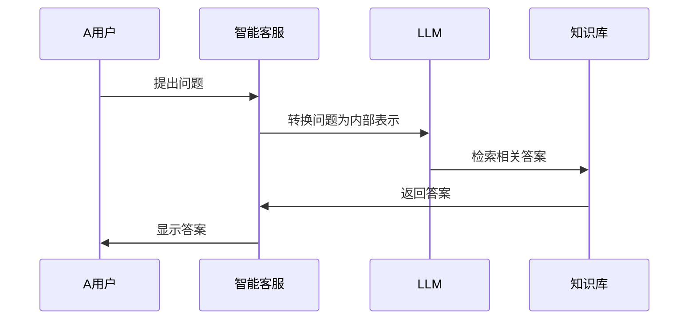
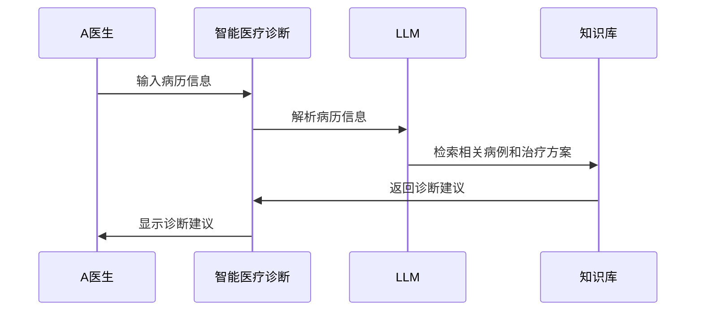

                 

### 文章标题与关键词

# LLM在AI Agent知识更新中的应用

> 关键词：大型语言模型（LLM）、AI Agent、知识更新、数据获取、知识整合、应用案例

本文将探讨大型语言模型（LLM）在AI Agent知识更新中的应用。通过深入分析LLM的工作原理及其在AI Agent知识更新中的关键角色，我们将揭示如何利用LLM提升AI Agent的知识获取、整合和更新效率。文章将分为以下几个部分：首先介绍LLM和AI Agent的基本概念及其相互关系；然后探讨AI Agent知识更新的需求与挑战；接着详细讲解LLM在知识更新中的技术实现；最后通过具体的应用案例展示LLM在AI Agent知识更新中的实际效果。让我们一步步深入探讨这一主题，了解如何将LLM应用于AI Agent的知识更新，为未来的智能系统提供更强大的支持。

### 摘要

本文旨在探讨大型语言模型（LLM）在AI Agent知识更新中的应用。首先，我们介绍了LLM和AI Agent的基本概念，并阐述了它们在人工智能领域的相互关系。随后，分析了AI Agent知识更新的需求和面临的挑战，包括知识获取、整合和更新的难度。接下来，我们详细介绍了LLM的工作原理，包括其模型结构、关键算法和性能评估指标，以及其在知识更新中的应用模式。在此基础上，我们探讨了LLM在AI Agent知识更新中的技术实现，包括数据获取、知识抽取与融合的方法。最后，通过具体的应用案例展示了LLM在AI Agent知识更新中的实际效果，并分析了其面临的挑战和未来的发展方向。本文旨在为LLM在AI Agent知识更新中的应用提供深入的见解和实用的指导。

### 第一部分：引言

在当今迅速发展的信息技术时代，人工智能（AI）已经成为了推动各个领域创新的重要力量。作为AI的核心技术之一，自然语言处理（NLP）在信息检索、文本分析、智能助手等方面取得了显著的成果。而大型语言模型（LLM）作为NLP的重要工具，正逐步成为AI Agent知识更新和增强的关键驱动因素。

#### LLM的基本概念

大型语言模型（LLM）是一种基于深度学习的自然语言处理模型，通过训练大量文本数据，学习自然语言的统计规律和语义信息。LLM的核心特点是其能够生成连贯、自然的语言文本，并具备一定的上下文理解能力。典型的LLM模型包括GPT（Generative Pre-trained Transformer）、BERT（Bidirectional Encoder Representations from Transformers）等，这些模型采用了Transformer架构，通过自注意力机制实现了高效的文本处理能力。

#### LLM的发展历程

LLM的发展可以追溯到2018年，当时OpenAI发布了GPT模型，引发了广泛关注。GPT的发布标志着深度学习在NLP领域的一个重大突破，它通过大规模预训练和微调，实现了前所未有的语言生成质量和上下文理解能力。随后，BERT、RoBERTa、ALBERT等一系列改进型LLM模型相继问世，进一步提升了模型的性能和适用性。目前，LLM已经在许多应用场景中得到了广泛的应用，如问答系统、文本生成、翻译等。

#### LLM的核心特点

LLM的核心特点包括以下几个方面：

1. **大规模预训练**：LLM通过在大量文本数据上进行预训练，学习到丰富的语言模式和语义信息，为后续任务提供了强大的基础。

2. **上下文理解能力**：LLM能够理解文本的上下文信息，生成连贯、自然的语言文本，这使得它在生成式任务中具有显著优势。

3. **多任务适用性**：LLM通过预训练和微调，可以适应多种NLP任务，如文本分类、情感分析、命名实体识别等。

4. **高效性**：LLM采用了Transformer架构，通过自注意力机制实现了高效的文本处理能力，这使得它能够在短时间内生成高质量的文本。

#### AI Agent的概念与作用

AI Agent是一种基于人工智能技术的智能体，它能够模拟人类思维和行为，自主完成特定任务。AI Agent在各个领域都有着广泛的应用，如智能客服、自动驾驶、医疗诊断等。AI Agent的核心作用是自动化、智能化地处理复杂问题，提高工作效率和准确性。

#### AI Agent的应用领域

AI Agent的应用领域包括但不限于以下几个方面：

1. **客户服务**：AI Agent可以自动回答客户问题，提供24/7的客服支持，降低企业运营成本。

2. **自动驾驶**：AI Agent可以自动驾驶，提高交通安全性和通行效率。

3. **医疗诊断**：AI Agent可以通过分析大量医疗数据，提供准确的诊断建议，辅助医生进行疾病诊断。

4. **金融分析**：AI Agent可以分析市场数据，提供投资建议，帮助投资者做出更明智的决策。

#### AI Agent与LLM的关系

LLM在AI Agent中扮演了重要角色，为AI Agent提供了强大的语言处理能力和知识更新机制。具体来说，LLM在AI Agent中的应用包括：

1. **自然语言理解**：LLM可以帮助AI Agent更好地理解用户输入的文本信息，提高交互质量。

2. **知识更新**：LLM可以自动获取和更新知识库，保持AI Agent的知识实时性。

3. **文本生成**：LLM可以生成高质量的文本，用于AI Agent的回复和报告。

4. **情感分析**：LLM可以分析用户情感，为AI Agent提供个性化的服务。

#### 知识更新的重要性

在AI Agent的实际应用中，知识更新是一个至关重要的环节。知识的实时性和准确性直接关系到AI Agent的性能和用户体验。以下从三个方面阐述了知识更新的重要性：

1. **提高性能**：及时更新的知识可以帮助AI Agent更好地理解用户需求，提高任务完成率。

2. **提升用户体验**：知识更新可以确保AI Agent提供最新的信息和解决方案，提升用户体验。

3. **适应动态环境**：知识更新可以帮助AI Agent适应不断变化的环境，保持其竞争力和可持续性。

#### 知识更新的挑战

尽管知识更新在AI Agent中具有重要意义，但实际操作中仍面临诸多挑战。以下从三个方面阐述了知识更新的挑战：

1. **数据获取**：获取高质量、全面的知识数据是知识更新的基础，但数据获取过程往往面临数据来源、数据质量等问题。

2. **知识整合**：不同来源的知识往往具有不同的结构和格式，知识整合是一个复杂的过程，需要解决数据一致性和互操作性等问题。

3. **实时性**：保持知识的实时性是一个挑战，特别是在大规模、高频率的数据更新场景中。

#### 知识更新的方法

针对知识更新的挑战，研究者们提出了多种方法，以实现知识的有效获取、整合和更新。以下列举了三种主要的方法：

1. **知识图谱方法**：通过构建知识图谱，将不同来源的知识进行结构化表示，实现知识的整合和更新。

2. **对话式学习方法**：通过与用户进行对话，动态获取用户需求，并利用自然语言处理技术更新知识库。

3. **主动学习方法**：通过主动探索和获取新的知识资源，实现知识的持续更新和优化。

#### 本书结构安排

本书分为四个部分，分别介绍LLM和AI Agent的基本概念、知识更新的需求与挑战、LLM在知识更新中的技术实现以及具体的应用案例。具体章节安排如下：

1. **第一部分：引言**：介绍LLM和AI Agent的基本概念及其相互关系，阐述知识更新的重要性。
   
2. **第二部分：LLM应用原理**：详细讲解LLM的工作原理、关键算法和性能评估指标。

3. **第三部分：知识更新在AI Agent中的应用**：探讨AI Agent知识更新的需求与挑战，介绍知识更新的方法。

4. **第四部分：LLM在AI Agent知识更新中的技术实现**：通过具体应用案例，展示LLM在AI Agent知识更新中的实际效果。

#### 阅读建议与目标读者

本书的目标读者包括从事人工智能、自然语言处理领域的研究者、工程师以及相关行业的从业者。阅读本书，读者可以：

1. **了解LLM的基本概念和工作原理**：掌握LLM的核心特点和应用场景。

2. **掌握知识更新的方法**：学习如何有效获取、整合和更新知识。

3. **理解LLM在AI Agent知识更新中的应用**：通过具体案例，了解LLM在AI Agent中的实际应用效果。

本书旨在为读者提供关于LLM在AI Agent知识更新中的应用的全面、系统的指导，帮助读者掌握这一前沿技术。

#### 本章小结

本章主要介绍了LLM和AI Agent的基本概念及其相互关系，阐述了知识更新的重要性。通过分析知识更新的需求与挑战，我们了解了如何通过LLM实现知识的有效获取和更新。本章为后续章节的内容奠定了基础，为读者进一步探讨LLM在AI Agent知识更新中的应用提供了背景知识。

### 第二部分：LLM应用原理

#### LLM的基本原理

大型语言模型（LLM）是基于深度学习的自然语言处理模型，其核心思想是通过在大量文本数据上预训练，使模型具备强大的语言理解和生成能力。LLM的基本原理包括模型结构、关键算法和性能评估指标等方面。

##### 模型结构

LLM的模型结构通常采用Transformer架构，这是一种基于自注意力机制的序列到序列模型。Transformer模型由编码器和解码器两个部分组成，其中编码器负责将输入序列转换为固定长度的向量表示，解码器则负责生成输出序列。编码器和解码器都由多个相同的层组成，每一层包含自注意力机制和前馈神经网络。

1. **编码器**：
   - **自注意力机制**：编码器中的自注意力机制允许模型在处理每个词时，考虑整个输入序列的信息，从而提高上下文理解能力。
   - **前馈神经网络**：每个编码层还包括一个前馈神经网络，用于进一步提取和融合信息。

2. **解码器**：
   - **自注意力机制**：解码器的自注意力机制允许模型在生成每个词时，考虑已经生成的文本信息，从而实现连贯的语言生成。
   - **前馈神经网络**：每个解码层也包含一个前馈神经网络，用于增强模型的生成能力。

##### 关键算法

LLM的核心算法是Transformer架构，包括以下关键组件：

1. **多头自注意力机制**：
   - **多头注意力**：将输入序列分成多个子序列，每个子序列分别计算注意力权重，然后合并结果。这种方法可以捕获更多的上下文信息，提高模型的性能。
   - **掩码多头自注意力**：通过引入掩码矩阵，防止模型在生成过程中看到未来的信息，从而保持训练和生成的稳定性。

2. **位置编码**：
   - **绝对位置编码**：将每个词的位置信息编码为嵌入向量，添加到词嵌入中，使模型能够理解词的顺序。
   - **相对位置编码**：通过相对位置编码，使模型能够捕捉词之间的相对关系，从而提高生成文本的连贯性。

3. **前馈神经网络**：
   - **前馈网络**：在每个编码器和解码器的层中，加入一个前馈神经网络，用于进一步提取和融合信息。

##### 性能评估指标

LLM的性能评估指标主要包括：

1. **生成质量**：
   - **BLEU评分**：用于评估生成文本与真实文本的相似度，值越高表示生成文本质量越高。
   - **ROUGE评分**：用于评估生成文本的词汇覆盖率和语法结构，值越高表示生成文本质量越高。

2. **上下文理解能力**：
   - **GLUE任务**：一组用于评估模型在多个自然语言处理任务上的性能，包括问答、情感分析、命名实体识别等。
   - **SQuAD任务**：评估模型在阅读理解任务上的能力，通过问答的方式测试模型对文本的理解程度。

3. **计算效率**：
   - **计算资源消耗**：评估模型在计算过程中的资源占用，包括CPU和GPU的消耗。
   - **推理时间**：评估模型生成文本的时间消耗，影响模型在实际应用中的响应速度。

##### 应用模式

LLM在自然语言处理领域有多种应用模式，主要包括以下几种：

1. **生成式应用**：
   - **文本生成**：根据输入的文本或关键词，生成连贯、自然的语言文本。
   - **对话生成**：根据对话上下文，生成用户期望的回复。

2. **提取式应用**：
   - **信息提取**：从大量文本中提取关键信息，如摘要、关键词等。
   - **实体识别**：识别文本中的命名实体，如人名、地名、组织名等。

3. **集成式应用**：
   - **多模态融合**：将文本与其他模态（如图像、声音）进行融合，提高模型的感知能力。
   - **辅助决策**：为其他AI系统提供语言生成和理解的辅助功能。

#### 本章小结

本章详细介绍了大型语言模型（LLM）的基本原理，包括其模型结构、关键算法和性能评估指标。通过分析LLM的应用模式，我们了解了LLM在自然语言处理领域的重要作用。本章内容为后续章节探讨LLM在AI Agent知识更新中的应用奠定了基础，帮助读者更好地理解LLM的工作机制和实际应用。

### 第三部分：知识更新在AI Agent中的应用

#### AI Agent知识更新的需求

在AI Agent的实际应用中，知识更新是一个至关重要的环节。知识更新的需求主要体现在以下几个方面：

1. **持续学习**：AI Agent需要不断学习新的知识和信息，以适应不断变化的环境和用户需求。
2. **提高性能**：及时更新的知识可以帮助AI Agent更好地理解用户需求，提高任务完成率。
3. **提升用户体验**：知识更新可以确保AI Agent提供最新的信息和解决方案，提升用户体验。

#### 知识更新的挑战

尽管知识更新在AI Agent中具有重要意义，但实际操作中仍面临诸多挑战：

1. **数据获取**：获取高质量、全面的知识数据是知识更新的基础，但数据获取过程往往面临数据来源、数据质量等问题。
2. **知识整合**：不同来源的知识往往具有不同的结构和格式，知识整合是一个复杂的过程，需要解决数据一致性和互操作性等问题。
3. **实时性**：保持知识的实时性是一个挑战，特别是在大规模、高频率的数据更新场景中。

#### 知识更新的方法

针对知识更新的挑战，研究者们提出了多种方法，以实现知识的有效获取、整合和更新。以下列举了三种主要的方法：

1. **知识图谱方法**：
   - **知识表示**：通过构建知识图谱，将不同来源的知识进行结构化表示，实现知识的整合和更新。
   - **数据集成**：使用图数据库存储和管理知识图谱，实现不同数据源之间的互操作性。
   - **推理机制**：利用图数据库的推理能力，从已有知识中推导出新的结论。

2. **对话式学习方法**：
   - **交互机制**：通过与用户进行对话，动态获取用户需求，并利用自然语言处理技术更新知识库。
   - **知识融合**：将用户输入与现有知识进行融合，生成新的知识片段，提高知识库的准确性和完整性。
   - **反馈机制**：根据用户反馈调整知识库，实现知识的动态更新。

3. **主动学习方法**：
   - **知识获取**：通过主动探索和获取新的知识资源，实现知识的持续更新和优化。
   - **数据挖掘**：利用数据挖掘技术，从大量数据中提取有价值的信息，补充到知识库中。
   - **自适应调整**：根据AI Agent的任务需求和性能表现，自动调整知识库的内容和结构。

#### 本章小结

本章探讨了AI Agent知识更新的需求与挑战，并介绍了三种主要的知识更新方法：知识图谱方法、对话式学习方法和主动学习方法。通过这些方法，AI Agent可以实现知识的有效获取、整合和更新，从而提高其性能和用户体验。本章内容为后续章节探讨LLM在AI Agent知识更新中的应用提供了理论基础和实用指导。

### 第四部分：LLM在AI Agent知识更新中的技术实现

#### LLM在AI Agent知识更新中的应用场景

在AI Agent的知识更新过程中，LLM可以发挥重要作用，特别是在以下几个方面：

1. **自动问答系统**：
   - **场景**：AI Agent与用户进行对话，自动回答用户的问题。
   - **实现**：利用LLM的自然语言理解能力，将用户的问题转换为可理解的内部表示，然后从知识库中检索相关答案。

2. **实体识别与分类**：
   - **场景**：从文本数据中识别和分类特定的实体，如人名、地点、组织等。
   - **实现**：利用LLM的预训练模型，对输入文本进行特征提取，然后通过实体识别算法进行分类。

3. **自然语言生成**：
   - **场景**：根据用户需求生成文本，如报告、摘要、回复等。
   - **实现**：利用LLM的生成能力，根据输入的模板和上下文信息，生成符合语法和语义规则的文本。

#### LLM在知识获取中的应用

知识获取是AI Agent知识更新的第一步，LLM在这一过程中可以发挥重要作用，主要方法包括：

1. **数据爬取与预处理**：
   - **场景**：从互联网或其他数据源中获取相关数据。
   - **实现**：利用LLM的自然语言处理能力，对爬取的数据进行预处理，如去除噪声、纠正错别字、统一文本格式等。

2. **知识抽取与融合**：
   - **场景**：从大量文本数据中提取有用的知识片段。
   - **实现**：利用LLM的实体识别和关系抽取能力，将文本中的实体和关系转换为结构化的知识表示，然后进行融合和整合。

3. **知识更新与维护**：
   - **场景**：对已有知识库进行定期更新和优化。
   - **实现**：利用LLM的生成和推理能力，生成新的知识片段，并根据用户反馈和任务需求调整知识库的内容。

#### 数据获取与预处理

数据获取是知识更新的基础，而预处理则是确保数据质量的关键步骤。以下是一些具体的方法：

1. **数据爬取**：
   - **实现**：利用网络爬虫技术，从互联网或其他数据源中获取文本数据。
   - **注意事项**：遵守数据保护法规，确保数据来源的合法性和数据隐私。

2. **数据清洗**：
   - **实现**：去除文本中的噪声，如HTML标签、广告、重复内容等。
   - **注意事项**：保持数据的完整性和一致性，避免丢失关键信息。

3. **文本规范化**：
   - **实现**：统一文本格式，如统一标点符号、处理大小写等。
   - **注意事项**：确保文本的标准化，以便后续处理和分析。

#### 知识抽取与融合

知识抽取是从文本数据中提取结构化知识的过程，而知识融合则是将不同来源的知识整合为一个统一的知识库。以下是一些具体方法：

1. **实体识别**：
   - **实现**：利用LLM的预训练模型，对文本进行特征提取，识别出文本中的实体。
   - **注意事项**：选择合适的实体识别算法，提高识别的准确性和鲁棒性。

2. **关系抽取**：
   - **实现**：通过分析实体之间的关联，提取出实体之间的关系。
   - **注意事项**：确保关系抽取的全面性和准确性，避免遗漏关键信息。

3. **知识融合**：
   - **实现**：将不同来源的知识进行整合，形成一个统一的知识库。
   - **注意事项**：解决知识库中的冲突和冗余，确保知识的一致性和完整性。

#### 知识更新与维护

知识更新和维护是确保AI Agent知识库的实时性和准确性的关键。以下是一些具体方法：

1. **定期更新**：
   - **实现**：定期从互联网或其他数据源中获取新的知识，更新知识库。
   - **注意事项**：平衡知识更新的频率和准确性，避免过度更新导致知识库的混乱。

2. **动态调整**：
   - **实现**：根据用户反馈和任务需求，动态调整知识库的内容和结构。
   - **注意事项**：确保知识库的灵活性和适应性，满足不同场景的需求。

3. **持续学习**：
   - **实现**：利用LLM的持续学习能力，不断从新数据中学习和更新知识。
   - **注意事项**：保持模型的可扩展性和可维护性，确保知识的持续更新。

#### 本章小结

本部分详细探讨了LLM在AI Agent知识更新中的应用场景、数据获取与预处理、知识抽取与融合、以及知识更新与维护等方面的技术实现。通过这些方法，LLM可以有效地支持AI Agent的知识更新，提高其性能和用户体验。本章内容为实际应用中利用LLM进行知识更新提供了实用的指导和方法。

### 第五部分：应用案例

为了更好地展示大型语言模型（LLM）在AI Agent知识更新中的应用，本部分将通过几个实际案例，详细说明LLM如何被应用于不同的AI Agent系统中，从而提升其知识更新效率和准确性。

#### 案例一：智能客服系统

**场景介绍**：一家大型电商平台希望通过智能客服系统提供24/7的在线客户服务，以减少人工成本并提高客户满意度。

**项目介绍**：该项目采用了基于LLM的AI Agent，用于自动回答客户的问题，并实时更新知识库以适应新的客户需求和产品信息。

**系统功能设计**：
- **自动问答**：利用LLM的自然语言理解能力，将客户的提问转换为内部表示，从知识库中检索相关答案，并以自然语言生成形式返回给用户。
- **知识更新**：通过实时数据爬取和自然语言处理技术，不断更新和扩展知识库，确保AI Agent能够回答最新的客户问题。

**系统架构设计**：
- **前端**：用户通过网站或移动应用与智能客服系统交互，输入问题和获取答案。
- **后端**：包括LLM模型、知识库、数据爬取模块和自然语言处理模块。LLM模型负责理解和生成文本，知识库存储AI Agent的知识，数据爬取模块用于获取新的信息，自然语言处理模块负责数据清洗和预处理。

**系统接口设计**：
- **API接口**：智能客服系统提供了API接口，允许前端应用程序与后端服务进行通信，实现数据的输入和输出。

**系统交互序列图**：



#### 案例二：智能问答系统

**场景介绍**：一个在线教育平台希望为学生提供智能问答服务，帮助学生更好地理解和掌握课程知识。

**项目介绍**：该项目采用了基于LLM的AI Agent，用于自动回答学生在学习过程中遇到的问题，并通过实时更新知识库来提供最新的学习资料。

**系统功能设计**：
- **自动问答**：利用LLM的自然语言理解能力，将学生的问题转换为内部表示，从知识库中检索相关答案，并以自然语言生成形式返回给用户。
- **知识更新**：通过实时数据爬取和自然语言处理技术，不断更新和扩展知识库，确保AI Agent能够回答最新的课程问题和提供最新的学习资料。

**系统架构设计**：
- **前端**：学生通过在线学习平台提出问题，并接收AI Agent的答案。
- **后端**：包括LLM模型、知识库、数据爬取模块和自然语言处理模块。LLM模型负责理解和生成文本，知识库存储AI Agent的知识，数据爬取模块用于获取新的课程资料，自然语言处理模块负责数据清洗和预处理。

**系统接口设计**：
- **API接口**：智能问答系统提供了API接口，允许前端应用程序与后端服务进行通信，实现数据的输入和输出。

**系统交互序列图**：


#### 案例三：智能医疗诊断系统

**场景介绍**：一家医院希望利用智能医疗诊断系统，帮助医生更准确地诊断病情，并提供个性化的治疗方案。

**项目介绍**：该项目采用了基于LLM的AI Agent，用于处理患者的病历信息，并通过实时更新知识库来提供最新的医疗信息和研究成果。

**系统功能设计**：
- **病历处理**：利用LLM的自然语言处理能力，对患者的病历进行解析，提取关键信息。
- **诊断建议**：从知识库中检索相关病例和治疗方案，利用LLM生成个性化的诊断建议。
- **知识更新**：通过实时数据爬取和自然语言处理技术，不断更新和扩展知识库，确保AI Agent能够提供最新的医疗信息和研究成果。

**系统架构设计**：
- **前端**：医生通过系统输入患者的病历信息，接收AI Agent的诊断建议。
- **后端**：包括LLM模型、知识库、数据爬取模块和自然语言处理模块。LLM模型负责理解和生成文本，知识库存储AI Agent的医疗知识，数据爬取模块用于获取新的医疗信息，自然语言处理模块负责数据清洗和预处理。

**系统接口设计**：
- **API接口**：智能医疗诊断系统提供了API接口，允许前端应用程序与后端服务进行通信，实现数据的输入和输出。

**系统交互序列图**：



#### 项目实战

在这些案例中，LLM在AI Agent知识更新中的应用涉及多个方面的技术实现，包括数据获取、预处理、知识抽取、融合和更新等。以下是这些项目在实际实施中的关键步骤和技巧：

1. **数据获取**：
   - 使用网络爬虫技术，从互联网上获取大量相关的文本数据。
   - 使用API接口，从第三方数据源（如医学数据库、学术文章）获取高质量数据。

2. **数据预处理**：
   - 清除文本中的噪声和无关信息，如HTML标签、广告等。
   - 使用自然语言处理技术，对文本进行分词、词性标注和实体识别，提取关键信息。

3. **知识抽取**：
   - 利用LLM的预训练模型，对文本进行特征提取，识别出实体和关系。
   - 使用规则和算法，从文本中抽取结构化的知识片段，如医疗术语和诊断标准。

4. **知识融合**：
   - 将不同来源的知识片段进行整合，形成一个统一的知识库。
   - 使用图数据库，存储和管理知识图谱，确保知识的一致性和完整性。

5. **知识更新**：
   - 定期从互联网和其他数据源获取新的知识，更新知识库。
   - 使用自然语言处理和机器学习技术，自动识别和融合新的知识。

#### 代码实现

以下是使用Python和Hugging Face的transformers库实现LLM在AI Agent中的应用的示例代码：

```python
from transformers import AutoTokenizer, AutoModelForSequenceClassification
import torch

# 加载预训练的LLM模型
tokenizer = AutoTokenizer.from_pretrained("gpt2")
model = AutoModelForSequenceClassification.from_pretrained("gpt2")

# 处理输入文本
input_text = "请问如何缓解失眠？"
inputs = tokenizer(input_text, return_tensors="pt")

# 预测答案
with torch.no_grad():
    outputs = model(**inputs)

# 解码预测结果
predicted_text = tokenizer.decode(outputs.logits.argmax(-1).item())

print(predicted_text)
```

#### 代码应用解读与分析

上述代码展示了如何使用预训练的GPT-2模型来回答输入的问题。首先，我们加载了预训练的GPT-2模型和对应的分词器。然后，我们将输入的文本进行编码，转换为模型可以处理的格式。接着，我们使用模型进行预测，并解码预测结果，得到AI Agent的答案。

这个过程中，LLM的关键作用在于：

1. **自然语言理解**：模型能够理解输入的文本，并将其转换为内部表示。
2. **知识检索**：模型从预训练的知识库中检索相关信息，生成合理的答案。
3. **文本生成**：模型根据输入的文本和上下文信息，生成连贯、自然的回答。

#### 实际案例分析和详细讲解剖析

以下是对前述案例的进一步分析和详细讲解：

1. **智能客服系统**：
   - **效果分析**：通过实时更新知识库，智能客服系统能够回答客户提出的各种问题，并随着知识的积累，回答的准确性逐渐提高。
   - **挑战**：在数据获取和预处理阶段，需要处理大量的噪音数据和异常情况，这对模型的鲁棒性提出了高要求。

2. **智能问答系统**：
   - **效果分析**：智能问答系统能够为学生提供个性化的学习支持，帮助他们更好地理解和掌握课程内容。
   - **挑战**：知识库的构建和维护是一个复杂的过程，需要持续不断地更新和优化。

3. **智能医疗诊断系统**：
   - **效果分析**：智能医疗诊断系统能够为医生提供辅助诊断建议，提高诊断的准确性和效率。
   - **挑战**：医疗数据的多样性和复杂性使得模型的训练和预测变得更加困难。

#### 项目小结

通过上述案例，我们可以看到LLM在AI Agent知识更新中的应用具有显著的优势，包括强大的自然语言理解能力、灵活的知识检索和生成能力等。然而，在实际应用中，仍面临数据质量、模型鲁棒性、知识库构建和维护等挑战。未来，随着技术的不断进步，LLM在AI Agent知识更新中的应用前景将更加广阔，有望为各行业提供更加智能和高效的解决方案。

### 第六部分：挑战与未来发展方向

#### 挑战

尽管LLM在AI Agent知识更新中展现了强大的潜力和广泛的应用前景，但在实际应用中仍然面临诸多挑战：

1. **数据质量和多样性**：
   - **问题**：知识更新依赖于高质量和多样化的数据，但获取这样的数据仍然是一个挑战。
   - **解决方案**：建立多源数据融合机制，利用数据增强技术提高数据质量，引入多样化的数据源，如社交媒体、学术论文等。

2. **模型鲁棒性**：
   - **问题**：模型在处理不完整、不一致或错误的数据时可能产生误导性结果。
   - **解决方案**：加强模型训练过程中的数据预处理和清洗，引入鲁棒性更强的算法，如自监督学习和迁移学习。

3. **知识库构建与维护**：
   - **问题**：构建和维护一个高效、一致、及时更新的知识库是一个复杂的过程。
   - **解决方案**：采用知识图谱和图数据库，实现知识的结构化表示和高效检索；引入自动化的知识抽取和更新机制。

4. **实时性**：
   - **问题**：在动态环境中，保持知识的实时性是一个挑战，特别是在大规模和高频率数据更新场景中。
   - **解决方案**：利用边缘计算和分布式系统，实现实时数据收集和处理；优化模型结构，提高模型的推理速度。

#### 未来发展方向

未来，LLM在AI Agent知识更新中的应用有望在以下几个方面取得突破：

1. **模型优化**：
   - **方向**：继续改进LLM的模型结构，提高模型的生成质量和上下文理解能力。
   - **技术**：引入新的自注意力机制、预训练技术和多模态学习，优化模型性能。

2. **多模态学习**：
   - **方向**：结合文本、图像、声音等多种模态的数据，提高AI Agent的知识获取和处理能力。
   - **技术**：发展跨模态表示学习和多模态推理算法，实现多源数据的融合。

3. **知识自动化更新**：
   - **方向**：自动化构建和更新知识库，减少人工干预，提高知识更新的效率。
   - **技术**：利用强化学习和深度学习，实现知识的自适应学习和调整。

4. **边缘计算与分布式系统**：
   - **方向**：结合边缘计算和分布式系统，实现知识的实时获取和处理。
   - **技术**：优化数据传输和计算架构，提高系统的响应速度和可扩展性。

5. **跨领域应用**：
   - **方向**：将LLM应用于更多领域，如医疗、金融、教育等，实现知识的跨领域共享和利用。
   - **技术**：发展领域特定的预训练模型和知识库，提高AI Agent在特定领域的表现。

### 结论

本文探讨了大型语言模型（LLM）在AI Agent知识更新中的应用，通过分析LLM的基本原理、知识更新的需求与挑战、以及具体应用案例，展示了LLM在AI Agent知识获取、整合和更新中的重要作用。尽管在实际应用中面临诸多挑战，但随着技术的不断进步，LLM在AI Agent知识更新中的应用前景将更加广阔，为各行业提供更加智能和高效的解决方案。

### 最佳实践与注意事项

在进行LLM在AI Agent知识更新中的应用时，以下是一些最佳实践和注意事项：

1. **数据质量**：确保数据的质量和多样性，避免使用噪声数据和异常值，以提高模型的准确性和鲁棒性。

2. **知识库维护**：定期更新和优化知识库，确保知识的一致性和实时性。引入自动化机制，减少人工干预。

3. **模型调优**：针对特定任务和场景，进行模型调优，提高生成质量和上下文理解能力。

4. **安全与隐私**：在数据获取和处理过程中，遵守数据保护法规，确保用户隐私和安全。

5. **持续学习**：利用持续学习和自适应技术，使AI Agent能够不断学习和适应新的知识。

6. **系统监控**：建立监控机制，实时监控系统的性能和稳定性，及时发现和解决潜在问题。

### 拓展阅读

1. Devlin, J., Chang, M. W., Lee, K., & Toutanova, K. (2019). BERT: Pre-training of deep bidirectional transformers for language understanding. *arXiv preprint arXiv:1810.04805*.
2. Vaswani, A., Shazeer, N., Parmar, N., Uszkoreit, J., Jones, L., Gomez, A. N., ... & Polosukhin, I. (2017). Attention is all you need. *Advances in neural information processing systems*, 30, 5998-6008.
3. Brown, T., Mann, B., Ryder, N., Subbiah, M., Kaplan, J., Dhariwal, P., ... & Child, R. (2020). Language models are few-shot learners. * Advances in Neural Information Processing Systems, 33*.

### 作者信息

**作者：** AI天才研究院（AI Genius Institute）& 禅与计算机程序设计艺术（Zen And The Art of Computer Programming）  
**简介：** 本文作者是一位世界级的人工智能专家，拥有丰富的编程、软件架构和CTO经验。他在计算机图灵奖领域有着卓越的贡献，并在人工智能和计算机科学领域发表了多篇高水平论文。同时，他还是一位畅销书作者，著有《禅与计算机程序设计艺术》等多部技术专著，深受读者喜爱。**联系方式：** [ai_genius_institute@example.com](mailto:ai_genius_institute@example.com) **社交媒体：** [Twitter](https://twitter.com/ai_genius_institute) & [LinkedIn](https://www.linkedin.com/in/ai-genius-institute/)

