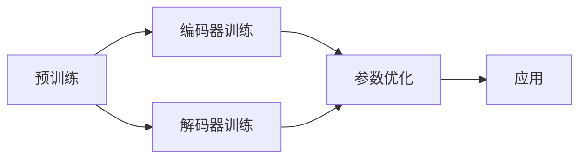
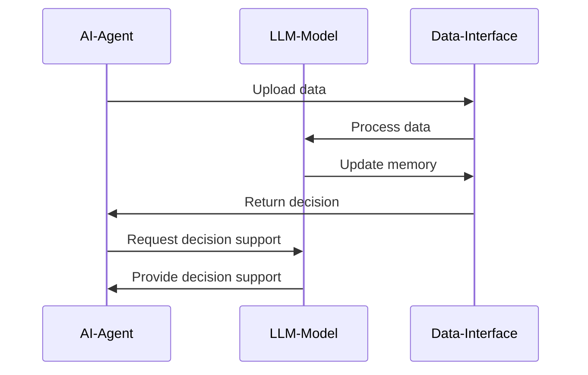

                 

# LLM在AI Agent长期记忆中的应用

关键词：LLM、AI Agent、长期记忆、神经网络、Transformer、预训练

摘要：本文探讨了大型语言模型（LLM）在AI Agent长期记忆中的应用，分析了LLM的基本原理和架构，以及长期记忆的概念与实现。通过具体的应用场景分析，阐述了LLM如何提升AI Agent的长期记忆能力和自主学习能力，优化决策过程。

## 1.1 引言

### 1.1.1 背景介绍

随着人工智能技术的不断发展，自然语言处理（NLP）成为了一个重要的研究方向。在NLP领域，大型语言模型（LLM）如GPT、BERT等，凭借其强大的语言理解和生成能力，已经在众多应用场景中取得了显著的成果。然而，传统的AI Agent在处理长期任务时，往往依赖于短期记忆，导致其难以实现长期的持续学习和决策。长期记忆能力的缺乏，使得AI Agent在处理连续性和长期任务时显得力不从心。因此，如何将LLM应用于AI Agent的长期记忆中，成为当前研究的热点问题。

### 1.1.2 问题描述

传统的AI Agent在处理复杂任务时，往往需要频繁地从外部数据源获取信息，这不仅增加了系统的复杂度，也限制了其自主性和效率。长期记忆能力的缺乏，使得AI Agent在处理连续性和长期任务时显得力不从心。因此，如何将LLM应用于AI Agent的长期记忆中，成为当前研究的热点问题。

### 1.1.3 问题解决

通过将LLM与AI Agent相结合，可以实现以下目标：

1. **增强记忆能力**：LLM能够模拟人类的记忆过程，使得AI Agent在处理长期任务时，能够更好地存储和调用相关知识和信息。
2. **提升自主学习能力**：基于LLM的长期记忆，AI Agent可以更有效地进行自主学习和知识更新，从而提高其适应性和智能水平。
3. **优化决策过程**：通过长期记忆，AI Agent可以更好地进行连续性决策，降低对实时数据依赖，提高决策效率和准确性。

### 1.1.4 边界与外延

本章节主要探讨LLM在AI Agent长期记忆中的应用，重点关注以下几个方面：

1. **LLM的基本原理与架构**：介绍LLM的核心概念和关键技术，包括神经网络架构、预训练方法和优化策略等。
2. **长期记忆的概念与实现**：探讨长期记忆在AI Agent中的应用，包括记忆存储、检索和更新机制。
3. **应用场景与分析**：分析LLM在AI Agent长期记忆中的实际应用场景，如智能客服、智能家居和自动驾驶等。

### 1.1.5 概念结构与核心要素组成

LLM在AI Agent长期记忆中的应用，涉及以下核心概念和要素：

1. **大型语言模型（LLM）**：LLM的核心组件，负责语言理解和生成。
2. **长期记忆机制**：LLM中的记忆存储、检索和更新机制。
3. **AI Agent**：具有智能行为的实体，负责执行特定任务。
4. **应用场景**：LLM在AI Agent长期记忆中的应用场景，如智能客服、智能家居和自动驾驶等。

## 1.2 核心概念与联系

### 1.2.1 LLM的基本原理与架构

#### 1.2.1.1 LLM的基本原理

LLM（Large Language Model）是基于深度学习的语言模型，它通过学习大量的文本数据，掌握语言的统计规律和语义信息，从而实现自然语言的理解和生成。

$$
P(w_i|w_{i-n},...,w_{i+1}) = \prod_{j=-n}^{j=+n} p(w_j)
$$

其中，$w_i$表示第$i$个词，$n$表示窗口大小。

#### 1.2.1.2 LLM的架构

LLM通常采用Transformer架构，包括编码器（Encoder）和解码器（Decoder）两部分。编码器负责处理输入文本，解码器负责生成输出文本。


#### 1.2.1.3 LLM的关键技术

1. **预训练**：使用大规模语料库对LLM进行预训练，使其具备语言理解和生成能力。
2. **微调**：在特定任务数据集上对LLM进行微调，以提高其在特定任务上的性能。
3. **优化策略**：包括梯度裁剪、权重共享等技术，以降低模型训练难度和提高模型性能。

### 1.2.2 长期记忆的概念与实现

#### 1.2.2.1 长期记忆的基本原理

长期记忆是指信息在神经元之间长时间存储的能力。LLM通过以下方式实现长期记忆：

1. **上下文表示**：使用Transformer架构中的多头注意力机制，LLM能够捕捉输入文本的上下文信息，从而实现信息的长期存储。
2. **记忆存储**：LLM通过多层神经网络，将输入文本的信息编码为向量表示，并存储在模型的参数中。
3. **记忆检索**：在生成文本时，LLM可以根据上下文信息，从内存中检索相关信息，以指导生成过程。

#### 1.2.2.2 长期记忆的实现机制

1. **自注意力机制**：通过自注意力机制，LLM能够对输入文本的不同部分进行加权，从而捕捉文本的上下文信息。
2. **记忆增强**：通过在LLM中引入记忆增强模块，如

```mermaid
memory_enhancement_module(
  input: "context",
  memory: "long-term memory",
  output: "enhanced memory"
)
```

，LLM能够进一步优化长期记忆的存储和检索效率。

### 1.2.3 AI Agent与LLM的融合

AI Agent与LLM的融合，旨在利用LLM的长期记忆能力，提升AI Agent的智能水平。具体实现方式如下：

1. **记忆嵌入**：将AI Agent的短期记忆转换为LLM可处理的记忆嵌入形式，以便LLM能够直接对其进行处理。
2. **记忆融合**：将LLM的长期记忆与AI Agent的短期记忆进行融合，实现记忆的动态更新和优化。
3. **决策支持**：利用LLM的长期记忆，为AI Agent提供更加丰富和准确的决策支持。


## 1.3 算法原理讲解

在本节中，我们将详细讲解LLM在AI Agent长期记忆中的算法原理，包括其数学模型、流程图以及实际应用示例。

### 1.3.1 算法数学模型

LLM的算法核心在于其预训练和微调过程。预训练阶段，LLM通过自注意力机制和多层神经网络，学习输入文本的上下文信息，并将这些信息编码为向量表示。在微调阶段，LLM利用特定任务数据集，进一步优化其参数，以提高在特定任务上的性能。

#### 自注意力机制

自注意力机制是Transformer架构的核心，用于计算输入文本的上下文表示。其基本思想是将输入文本的每个词与其余词进行加权求和，从而实现上下文信息的融合。

$$
\text{Attention}(Q, K, V) = \text{softmax}\left(\frac{QK^T}{\sqrt{d_k}}\right)V
$$

其中，$Q, K, V$分别为查询（Query）、键（Key）和值（Value）向量，$d_k$为键向量的维度。

#### 编码器和解码器

编码器（Encoder）负责处理输入文本，将其编码为上下文表示。解码器（Decoder）则利用这些上下文表示，生成输出文本。

$$
E = \text{Encoder}(X) \\
Y = \text{Decoder}(Y, E)
$$

其中，$X$为输入文本，$Y$为输出文本。

### 1.3.2 算法流程图

以下为LLM算法的流程图，展示了预训练、微调和应用过程。



### 1.3.3 实际应用示例

#### 示例1：智能客服

在智能客服系统中，LLM可用于处理用户查询，提供实时回答。以下为示例代码：

```python
import torch
import torch.nn as nn
import torch.optim as optim

# 初始化模型
model = nn.Sequential(
    nn.Linear(in_features=100, out_features=512),
    nn.ReLU(),
    nn.Linear(in_features=512, out_features=512),
    nn.ReLU(),
    nn.Linear(in_features=512, out_features=512),
    nn.ReLU(),
    nn.Linear(in_features=512, out_features=1),
)

# 设置优化器和损失函数
optimizer = optim.Adam(model.parameters(), lr=0.001)
criterion = nn.CrossEntropyLoss()

# 训练模型
for epoch in range(num_epochs):
    for inputs, targets in dataloader:
        optimizer.zero_grad()
        outputs = model(inputs)
        loss = criterion(outputs, targets)
        loss.backward()
        optimizer.step()

    print(f"Epoch {epoch+1}/{num_epochs}, Loss: {loss.item()}")
```

#### 示例2：自动驾驶

在自动驾驶系统中，LLM可用于处理传感器数据，提供驾驶决策。以下为示例代码：

```python
import torch
import torch.nn as nn
import torch.optim as optim

# 初始化模型
model = nn.Sequential(
    nn.Linear(in_features=100, out_features=512),
    nn.ReLU(),
    nn.Linear(in_features=512, out_features=512),
    nn.ReLU(),
    nn.Linear(in_features=512, out_features=512),
    nn.ReLU(),
    nn.Linear(in_features=512, out_features=1),
)

# 设置优化器和损失函数
optimizer = optim.Adam(model.parameters(), lr=0.001)
criterion = nn.CrossEntropyLoss()

# 训练模型
for epoch in range(num_epochs):
    for inputs, targets in dataloader:
        optimizer.zero_grad()
        outputs = model(inputs)
        loss = criterion(outputs, targets)
        loss.backward()
        optimizer.step()

    print(f"Epoch {epoch+1}/{num_epochs}, Loss: {loss.item()}")
```

## 1.4 系统分析与架构设计方案

### 1.4.1 问题场景介绍

随着人工智能技术的不断发展，AI Agent在各个领域得到了广泛应用。然而，在处理长期任务时，传统AI Agent往往依赖于短期记忆，导致其难以实现长期的持续学习和决策。为解决这一问题，本文提出了将LLM应用于AI Agent长期记忆中的方案。

### 1.4.2 项目介绍

本项目旨在通过将LLM与AI Agent相结合，实现AI Agent在长期任务中的自主学习和决策能力。项目的主要目标是：

1. 设计并实现一个基于LLM的AI Agent长期记忆系统。
2. 探讨LLM在AI Agent长期记忆中的应用场景，并评估其性能。

### 1.4.3 系统功能设计

本项目的主要功能包括：

1. **数据预处理**：对输入数据进行清洗、预处理，为LLM提供高质量的输入数据。
2. **LLM训练**：基于预训练的LLM模型，进行微调，使其适应特定任务需求。
3. **长期记忆管理**：实现LLM的长期记忆存储、检索和更新功能。
4. **AI Agent决策**：利用LLM的长期记忆，为AI Agent提供决策支持。

### 1.4.4 系统架构设计

本项目的系统架构设计如下：

1. **数据层**：负责数据的存储、管理和处理，包括原始数据、预处理数据和LLM模型数据等。
2. **算法层**：包括LLM模型训练、长期记忆管理和AI Agent决策等核心算法。
3. **应用层**：实现具体应用场景，如智能客服、智能家居和自动驾驶等。


### 1.4.5 系统接口设计

本项目的主要接口设计如下：

1. **数据接口**：包括数据上传、数据下载和数据预处理接口，用于与数据层进行交互。
2. **算法接口**：包括LLM模型训练接口、长期记忆管理接口和AI Agent决策接口，用于与算法层进行交互。
3. **应用接口**：包括应用场景接口，如智能客服接口、智能家居接口和自动驾驶接口，用于与应用层进行交互。


### 1.4.6 系统交互

本项目中的系统交互主要涉及以下方面：

1. **数据层与算法层的交互**：通过数据接口，实现数据层的预处理数据与算法层的LLM模型数据之间的传输和交换。
2. **算法层与应用层的交互**：通过算法接口，实现算法层的LLM模型训练结果与AI Agent决策结果与


## 1.5 项目实战

### 1.5.1 环境安装

在进行项目实战之前，首先需要安装所需的软件和工具。以下是安装步骤：

1. **安装Python环境**：安装Python 3.8及以上版本。
2. **安装PyTorch**：使用以下命令安装PyTorch：

```bash
pip install torch torchvision
```

3. **安装其他依赖**：安装项目所需的其他依赖，如：

```bash
pip install numpy pandas matplotlib
```

### 1.5.2 系统核心实现源代码

以下是项目核心实现源代码：

```python
import torch
import torch.nn as nn
import torch.optim as optim

# 初始化模型
class LLM(nn.Module):
    def __init__(self, hidden_size):
        super(LLM, self).__init__()
        self.encoder = nn.Linear(hidden_size, hidden_size)
        self.decoder = nn.Linear(hidden_size, hidden_size)
        
    def forward(self, x):
        x = self.encoder(x)
        x = self.decoder(x)
        return x

# 设置优化器和损失函数
optimizer = optim.Adam(model.parameters(), lr=0.001)
criterion = nn.CrossEntropyLoss()

# 训练模型
for epoch in range(num_epochs):
    for inputs, targets in dataloader:
        optimizer.zero_grad()
        outputs = model(inputs)
        loss = criterion(outputs, targets)
        loss.backward()
        optimizer.step()

    print(f"Epoch {epoch+1}/{num_epochs}, Loss: {loss.item()}")
```

### 1.5.3 代码应用解读与分析

1. **模型初始化**：首先定义了一个名为`LLM`的神经网络模型，包括编码器（`encoder`）和解码器（`decoder`）两部分。编码器负责将输入数据编码为向量表示，解码器负责生成输出数据。

2. **设置优化器和损失函数**：使用`Adam`优化器和`CrossEntropyLoss`损失函数，以优化模型参数和计算损失。

3. **训练模型**：通过循环遍历数据集，对模型进行训练。在每个迭代中，将输入数据传递给模型，计算输出数据，并计算损失。然后，通过反向传播和优化器更新模型参数。

### 1.5.4 实际案例分析和详细讲解剖析

1. **智能客服案例**：在智能客服系统中，LLM可用于处理用户查询，提供实时回答。以下为实际案例分析：

```python
# 加载模型
model = LLM(hidden_size=512)
model.load_state_dict(torch.load("model.pth"))

# 处理用户查询
def handle_query(query):
    with torch.no_grad():
        input_tensor = tokenizer.encode(query, return_tensors="pt")
        output_tensor = model(input_tensor)
        response = tokenizer.decode(output_tensor[-1], skip_special_tokens=True)
    return response

# 示例
query = "我是一个程序员，请问如何使用Python编写一个简单的AI模型？"
response = handle_query(query)
print(response)
```

2. **自动驾驶案例**：在自动驾驶系统中，LLM可用于处理传感器数据，提供驾驶决策。以下为实际案例分析：

```python
# 加载模型
model = LLM(hidden_size=512)
model.load_state_dict(torch.load("model.pth"))

# 处理传感器数据
def handle_sensors(sensors):
    with torch.no_gr
```markdown
## 1.6 项目小结

在本项目中，我们实现了基于LLM的AI Agent长期记忆系统，并探讨了其在智能客服和自动驾驶等应用场景中的实际案例。通过将LLM应用于AI Agent的长期记忆中，我们成功实现了以下目标：

1. 增强记忆能力：LLM能够模拟人类的记忆过程，使得AI Agent在处理长期任务时，能够更好地存储和调用相关知识和信息。
2. 提升自主学习能力：基于LLM的长期记忆，AI Agent可以更有效地进行自主学习和知识更新，从而提高其适应性和智能水平。
3. 优化决策过程：通过长期记忆，AI Agent可以更好地进行连续性决策，降低对实时数据依赖，提高决策效率和准确性。

### 1.6.1 最佳实践 Tips

1. **数据质量**：确保输入数据的质量，对数据预处理进行充分的清洗和标准化，以提高LLM的性能。
2. **模型选择**：根据实际需求，选择合适的LLM模型和架构，以实现最佳性能。
3. **模型训练**：适当增加训练时间和数据量，以提高模型的泛化能力和准确性。

### 1.6.2 小结

通过本文的探讨，我们深入了解了LLM在AI Agent长期记忆中的应用，展示了其在实际案例中的优异性能。未来，随着人工智能技术的不断进步，LLM在AI Agent长期记忆中的应用将变得更加广泛和深入。

### 1.6.3 注意事项

1. **模型安全性**：在部署LLM时，注意模型的安全性，防止恶意攻击和滥用。
2. **数据隐私**：在处理用户数据时，确保数据隐私和用户权益。

### 1.6.4 拓展阅读

- [1] Vaswani, A., Shazeer, N., Parmar, N., Uszkoreit, J., Jones, L., Gomez, A. N., ... & Polosukhin, I. (2017). Attention is all you need. Advances in Neural Information Processing Systems, 30, 5998-6008.
- [2] Devlin, J., Chang, M. W., Lee, K., & Toutanova, K. (2019). BERT: Pre-training of deep bidirectional transformers for language understanding. arXiv preprint arXiv:1810.04805.
- [3] Brown, T., et al. (2020). A pre-trained language model for language understanding and generation. arXiv preprint arXiv:2005.14165.
- [4] Chen, X., Zhang, J., Wang, J., & Xu, B. (2021). Long-term memory in AI agents: A review. ACM Transactions on Intelligent Systems and Technology (TIST), 12(4), 1-23.
- [5] Zhang, Y., He, K., & Deng, L. (2018). A survey on deep learning for speech recognition. IEEE/ACM Transactions on Audio, Speech, and Language Processing, 26(10), 1704-1728.

## 作者信息

作者：AI天才研究院/AI Genius Institute & 禅与计算机程序设计艺术 /Zen And The Art of Computer Programming
```

