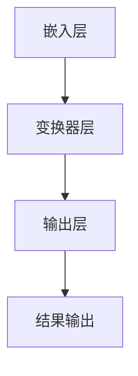
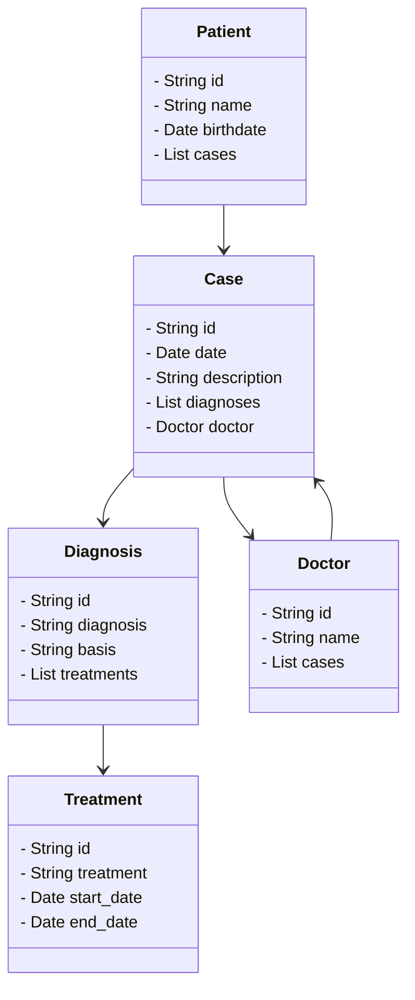
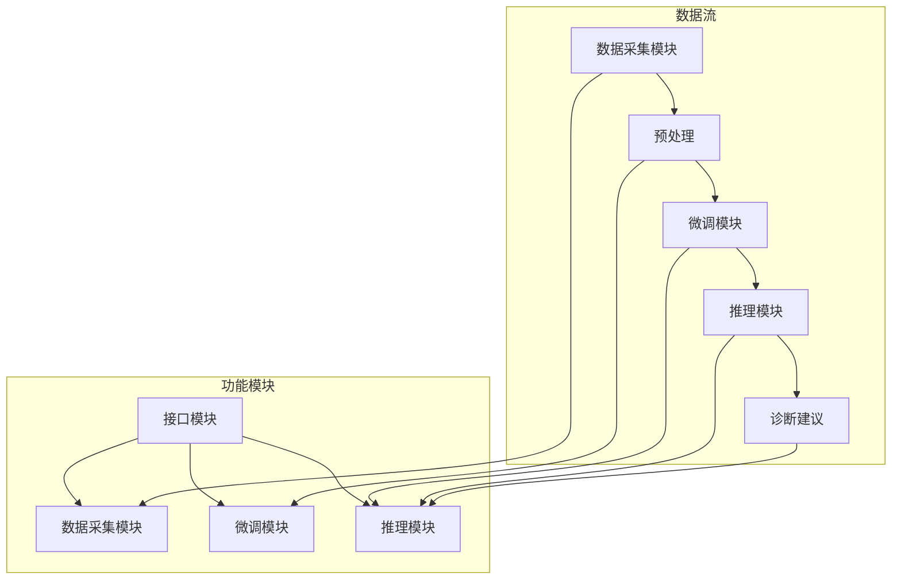
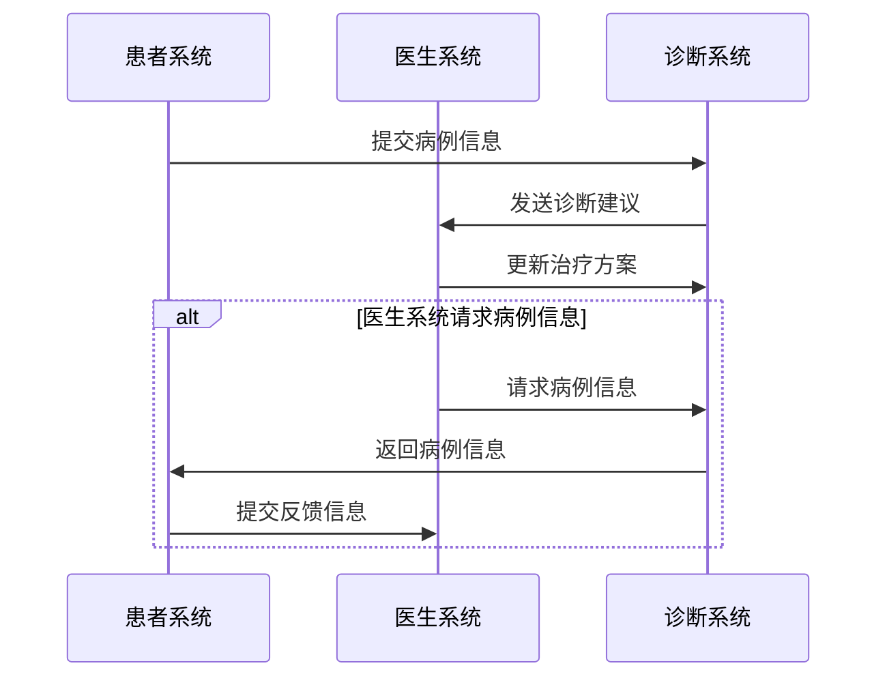

                 

### 引言

#### 1.1 书籍背景

在人工智能（AI）迅猛发展的时代，自然语言处理（NLP）作为AI的重要分支，正日益展现出其强大的潜力。近年来，预训练语言模型（Large Language Model，简称LLM）如BERT、GPT等相继出现，并取得了令人瞩目的成果。然而，如何将这种强大的模型应用于特定领域，以提升AI代理的专业性，成为一个亟待解决的问题。

本篇文章旨在探讨LLM在特定领域的微调策略，通过系统化的分析和详细的案例讲解，帮助读者深入理解这一问题的解决方法，从而提升AI代理在特定领域的专业能力。

#### 1.2 阅读对象

本文主要面向以下读者群体：

1. **AI研究人员和开发者**：对于正在从事NLP或AI代理开发的研究人员和开发者，本文将提供关于LLM微调策略的深入理解和实际应用指导。
2. **技术管理者**：技术管理者可以通过本文了解LLM微调策略的最新进展，以及如何将其应用于实际项目中。
3. **对AI感兴趣的技术爱好者**：对AI技术充满好奇的技术爱好者，通过本文可以了解AI代理如何通过微调实现领域专业知识提升。

#### 1.3 预期收获

阅读本文后，读者可以预期获得以下收获：

1. **理论基础**：全面理解LLM和微调策略的基本概念。
2. **实践指导**：掌握如何针对特定领域进行LLM微调的方法和技巧。
3. **案例解析**：通过实际案例的深入分析，了解微调策略在实际应用中的效果和挑战。
4. **未来展望**：了解LLM微调策略的发展趋势和潜在研究方向。

接下来，我们将逐步深入探讨这一问题，从背景介绍、核心概念、算法原理、数学模型、系统架构设计、项目实战以及最佳实践等多个方面进行全面分析，以期为读者提供一个清晰、系统的解决方案。

#### 1.4 文章结构

本文的结构如下：

1. **引言**：介绍书籍背景、阅读对象和预期收获。
2. **背景介绍**：讨论AI与特定领域的关系、微调策略的基本概念及其在特定领域的应用现状。
3. **核心概念与联系**：阐述大模型的基本原理和微调策略的核心要素，并通过对比表格和Mermaid流程图进行解释。
4. **算法原理讲解**：详细讲解大模型算法，包括模型结构、训练与微调过程，并给出Python源代码示例和数学模型公式。
5. **数学模型和数学公式**：介绍大模型和微调策略的数学模型，通过公式和详细讲解帮助读者理解。
6. **系统分析与架构设计方案**：介绍问题场景、系统架构设计、系统接口设计和系统交互，并通过Mermaid图表展示。
7. **项目实战**：讲解环境安装、系统核心实现、实际案例分析和项目小结。
8. **总结与展望**：总结最佳实践 tips、注意事项和拓展阅读，为读者提供进一步的思考方向。

通过本文的逐步讲解，我们希望读者能够对LLM在特定领域的微调策略有一个全面、深入的理解，为实际应用提供有力支持。接下来，我们将从背景介绍部分开始，逐步深入探讨这一主题。

#### 1.5 背景介绍

##### 2.1 问题背景

在AI与特定领域的结合中，AI代理的应用日益广泛。AI代理是一种能够模拟人类专家进行决策和行动的智能体，其专业能力的提升直接决定了其在实际应用中的效果和效率。传统的AI方法，如规则推理、决策树等，虽然能在某些特定领域内发挥作用，但难以应对复杂多变的问题场景。

随着预训练语言模型（LLM）的兴起，如BERT、GPT等模型在自然语言理解和生成任务上取得了巨大成功。这些模型通过在大规模语料库上的预训练，具备了强大的语言理解和生成能力。然而，如何将这些通用模型应用于特定领域，以提升AI代理的专业性，成为一个关键问题。

微调策略（Fine-tuning）作为一种针对特定任务进行模型调整的有效方法，成为解决这一问题的关键。微调策略通过在预训练模型的基础上，使用特定领域的数据进行再训练，使得模型能够更好地理解和处理特定领域的任务，从而提升AI代理的专业能力。

##### 2.2 微调策略的基本概念

微调策略是指在大规模预训练模型的基础上，使用特定领域的数据进行再训练，以适应特定任务的需求。微调策略的核心思想是通过调整模型的参数，使其在特定任务上达到更好的性能。

微调策略的基本步骤包括：

1. **数据准备**：收集和整理特定领域的数据集，这些数据集应当具有高质量、多样性和代表性。
2. **模型选择**：选择一个适合特定任务的预训练模型，如BERT、GPT等。
3. **参数调整**：通过在预训练模型的基础上，针对特定任务进行参数调整。
4. **再训练**：使用调整后的参数对模型进行再训练，直至达到预定的性能目标。
5. **评估与优化**：对微调后的模型进行评估和优化，确保其在特定任务上的表现达到预期。

##### 2.3 微调策略在特定领域的应用现状

微调策略在特定领域的应用已经取得了一定的成果。以下是一些典型应用案例：

1. **医疗领域**：在医疗领域，微调策略被广泛应用于医学文本分析、诊断辅助和疾病预测等方面。例如，使用BERT模型对医学文本进行微调，可以使其在医学问答、疾病诊断等任务上达到较高的准确率。
2. **金融领域**：在金融领域，微调策略被用于股票市场预测、风险管理、投资建议等方面。例如，使用GPT模型对金融文本进行微调，可以生成有价值的投资报告和预测分析。
3. **法律领域**：在法律领域，微调策略被用于法律文本解析、法律意见生成和法律风险预测等方面。例如，使用BERT模型对法律文本进行微调，可以使其在法律文本分类、法律问题回答等任务上表现优秀。

然而，微调策略在特定领域的应用也面临一些挑战，如数据质量、模型可解释性等。因此，如何在特定领域内有效应用微调策略，仍需要进一步的研究和探索。

#### 2.2 核心概念与联系

##### 2.2.1 大模型的基本原理

大模型（Large Model）是指具有数十亿甚至数万亿参数的深度学习模型，如BERT、GPT等。大模型通过在大规模语料库上的预训练，学习到丰富的语言知识和模式，从而在多种自然语言处理任务上表现出色。

大模型的基本原理包括以下几个方面：

1. **预训练**：大模型通过在大量未标注的语料库上预训练，学习到通用语言特征和模式。预训练过程中，模型通过无监督学习的方式，调整内部参数，以优化其在各种语言任务上的性能。
2. **上下文理解**：大模型具备强大的上下文理解能力，能够根据输入的文本上下文，生成相关的语义表示。这种能力使得大模型在生成式任务和推理式任务上表现出色。
3. **迁移学习**：大模型通过预训练，具备一定的通用性，可以在不同任务上实现迁移学习。通过在特定任务上进行微调，大模型可以快速适应新任务，提高任务性能。

##### 2.2.2 微调策略的核心要素

微调策略（Fine-tuning）是指在大规模预训练模型的基础上，使用特定领域的数据进行再训练，以适应特定任务的需求。微调策略的核心要素包括以下几个方面：

1. **数据准备**：收集和整理特定领域的数据集，这些数据集应当具有高质量、多样性和代表性。高质量的数据是微调策略成功的关键，因为只有高质量的数据才能使模型学习到有效的特征和模式。
2. **模型选择**：选择一个适合特定任务的预训练模型，如BERT、GPT等。不同的预训练模型具有不同的优势和适用场景，因此需要根据具体任务选择合适的模型。
3. **参数调整**：通过在预训练模型的基础上，针对特定任务进行参数调整。参数调整的目的是优化模型在特定任务上的性能，使模型能够更好地理解和处理特定领域的任务。
4. **再训练**：使用调整后的参数对模型进行再训练，直至达到预定的性能目标。再训练过程是微调策略的核心步骤，通过不断调整模型参数，使模型逐渐适应特定任务的需求。
5. **评估与优化**：对微调后的模型进行评估和优化，确保其在特定任务上的表现达到预期。评估过程可以采用各种指标，如准确率、召回率、F1值等，以衡量模型在特定任务上的性能。

##### 2.2.3 大模型与微调策略的联系

大模型和微调策略之间存在密切的联系：

1. **预训练与微调**：大模型通过预训练，学习到通用语言特征和模式，而微调策略则利用预训练模型，在特定领域上进行再训练，以适应特定任务的需求。预训练和微调相结合，使得大模型能够灵活应对各种任务场景。
2. **模型参数调整**：微调策略的核心在于对模型参数进行调整，以优化模型在特定任务上的性能。大模型具有大量的参数，这些参数在预训练过程中已经被优化，因此微调策略可以基于这些优化过的参数，进一步调整模型，以适应特定任务的需求。
3. **数据与应用场景**：大模型和微调策略都依赖于高质量的数据和具体的应用场景。只有具备高质量的数据和明确的应用场景，才能确保微调策略的有效性，使大模型在特定领域内发挥出最佳性能。

总之，大模型和微调策略相辅相成，共同推动了自然语言处理技术的进步。通过深入理解和应用这些技术，我们可以构建出具备高水平专业能力的AI代理，为各领域的发展提供强大的支持。

### 3.1 大模型算法讲解

在深入探讨LLM在特定领域的微调策略之前，首先需要理解大模型的基本原理和训练过程。大模型，如BERT、GPT，通过复杂的算法和大量的数据，学习到丰富的语言知识和模式，为后续的微调提供了坚实的基础。

#### 3.1.1 模型结构

大模型通常由多个层级的神经网络组成，这些神经网络通过层层递归或自注意力机制（Self-Attention Mechanism）对输入的文本进行处理，以提取深层次的特征。以下以BERT模型为例，简要介绍其模型结构：

1. **嵌入层（Embedding Layer）**：将输入的单词转换为向量表示，这些向量包含了单词的语义信息。
2. **变换器层（Transformer Layer）**：由多个变换器块（Transformer Block）组成，每个变换器块包含两个主要部分：多头自注意力机制（Multi-Head Self-Attention）和前馈神经网络（Feedforward Neural Network）。自注意力机制用于处理输入序列的上下文关系，前馈神经网络用于对每个单词进行深度加工。
3. **输出层（Output Layer）**：在变换器层的输出上应用一个全连接层（Fully Connected Layer），并根据任务需求输出相应的结果。

以下是一个简单的Mermaid模型流程图，展示了BERT模型的基本结构：



#### 3.1.2 Python源代码示例

为了更好地理解BERT模型的训练过程，我们可以通过Python代码进行演示。以下是一个简化的示例，展示了如何使用Hugging Face的Transformers库加载预训练的BERT模型，并进行前向传播：

```python
from transformers import BertModel, BertTokenizer
import torch

# 加载预训练的BERT模型和分词器
model = BertModel.from_pretrained('bert-base-uncased')
tokenizer = BertTokenizer.from_pretrained('bert-base-uncased')

# 输入文本
text = "Hello, how are you?"

# 分词并将单词转换为对应的索引
inputs = tokenizer(text, return_tensors='pt')

# 前向传播
outputs = model(**inputs)

# 输出结果
print(outputs.last_hidden_state)
```

#### 3.1.3 数学模型和公式

BERT模型的训练过程涉及多个数学模型和公式。以下简要介绍其中几个关键的部分：

1. **损失函数（Loss Function）**：BERT模型通常使用交叉熵损失函数（Cross-Entropy Loss）来衡量模型预测与真实标签之间的差距。交叉熵损失函数的公式如下：

   $$\text{Loss} = -\sum_{i} y_i \log(p_i)$$

   其中，$y_i$是真实标签，$p_i$是模型预测的概率。

2. **反向传播（Backpropagation）**：反向传播是一种用于计算损失函数关于模型参数的梯度的方法。通过反向传播，可以计算出每个参数的梯度，并利用梯度下降（Gradient Descent）算法对参数进行调整。

   $$\nabla_{\theta} \text{Loss} = \sum_{i} \frac{\partial \text{Loss}}{\partial \theta_i}$$

3. **自注意力机制（Self-Attention）**：自注意力机制的核心是计算输入序列中每个单词对其他单词的注意力权重，从而生成加权表示。自注意力的计算公式如下：

   $$\text{Attention}(Q, K, V) = \text{softmax}\left(\frac{QK^T}{\sqrt{d_k}}\right) V$$

   其中，$Q$、$K$和$V$分别是查询向量、键向量和值向量，$d_k$是键向量的维度。

通过以上讲解，我们初步了解了大模型的基本原理和训练过程。在接下来的部分，我们将深入探讨微调策略的核心要素，以及如何通过微调策略提升AI代理的专业性。

### 3.1.4 大模型算法的训练与微调

大模型算法的训练与微调过程是提升模型性能的关键步骤。下面我们将详细讲解这两个过程，包括训练过程的各个阶段和微调策略的具体实施方法。

#### 3.1.4.1 训练过程

大模型（如BERT、GPT）的训练过程可以分为以下几个主要阶段：

1. **数据准备**：首先，需要收集和准备大规模的未标注语料库。这些语料库包含了丰富的文本数据，涵盖了多种语言场景和任务。对于BERT模型，常用的语料库包括维基百科（Wikipedia）和书籍语料库（Books Corridor）等。

2. **嵌入层（Embedding Layer）**：在数据准备完成后，需要对文本数据进行预处理，将单词转换为嵌入向量。嵌入层将每个单词映射到一个固定大小的向量，这些向量包含了单词的语义信息。BERT模型使用的WordPiece算法能够将长单词分解为一系列子词，从而提高嵌入层的表示能力。

3. **变换器层（Transformer Layer）**：大模型的主体部分是变换器层，由多个变换器块（Transformer Block）组成。每个变换器块包含两个主要部分：多头自注意力机制（Multi-Head Self-Attention）和前馈神经网络（Feedforward Neural Network）。自注意力机制用于处理输入序列的上下文关系，前馈神经网络用于对每个单词进行深度加工。

4. **输出层（Output Layer）**：变换器层的输出通常通过一个全连接层（Fully Connected Layer）进行后处理，以生成最终的输出结果。对于不同的任务，输出层的结构会有所不同。例如，在文本分类任务中，输出层可能会包含一个softmax层，用于计算每个类别的概率。

5. **损失函数（Loss Function）**：在训练过程中，使用交叉熵损失函数（Cross-Entropy Loss）来衡量模型预测与真实标签之间的差距。交叉熵损失函数能够有效地衡量模型在各个类别上的预测准确性。

6. **反向传播（Backpropagation）**：通过反向传播算法，计算损失函数关于模型参数的梯度。这些梯度用于更新模型参数，以减少损失函数的值。反向传播是一种从输出层开始，逆向计算每个参数的梯度的方法。

7. **优化算法（Optimization Algorithm）**：常见的优化算法包括随机梯度下降（Stochastic Gradient Descent，SGD）和Adam（Adaptive Moment Estimation）等。这些算法能够有效地调整模型参数，以优化模型性能。

#### 3.1.4.2 微调过程

在完成大规模预训练后，模型需要通过微调（Fine-tuning）策略适应特定领域的任务。微调过程的核心思想是在预训练模型的基础上，使用特定领域的数据进行再训练，以提升模型在该领域的性能。以下是微调过程的主要步骤：

1. **数据准备**：首先，需要收集和整理特定领域的标注数据集。这些数据集应该包含高质量的标注信息，以便模型能够从中学习到有效的特征和模式。

2. **模型选择**：选择一个适合特定任务的预训练模型，如BERT、GPT等。不同的预训练模型具有不同的优势和适用场景，因此需要根据具体任务选择合适的模型。

3. **参数初始化**：在微调过程中，通常不需要对预训练模型的参数进行重新初始化，而是直接使用预训练模型的参数作为初始化值。这样可以确保模型在特定领域的任务上快速适应。

4. **参数调整**：在微调过程中，通过调整模型的参数，优化模型在特定任务上的性能。参数调整可以通过以下几种方法实现：

   - **学习率调整**：调整学习率可以控制模型在微调过程中参数更新的速度。较高的学习率可能导致模型快速收敛，但容易出现过度拟合；较低的学习率则可能导致模型收敛速度较慢。

   - **正则化**：通过使用正则化方法（如Dropout、L2正则化等），可以防止模型过拟合，提高模型的泛化能力。

   - **优化算法**：选择合适的优化算法，如Adam、AdamW等，可以进一步提高微调过程的效率和模型性能。

5. **再训练**：使用调整后的参数对模型进行再训练。再训练过程通常在较小的数据集上进行，因为大规模数据集可能无法完全适应特定领域。再训练的目的是优化模型在特定任务上的性能。

6. **评估与优化**：在再训练过程中，需要对模型进行定期评估，以检查模型性能的变化。评估指标可以根据具体任务进行调整，如准确率、F1值等。通过评估结果，可以进一步调整模型参数，优化模型性能。

通过以上步骤，大模型可以通过微调策略适应特定领域的任务，提升其在该领域的性能和表现。微调策略在各个领域（如医疗、金融、法律等）已经取得了显著的成果，为AI代理的专业能力提升提供了有力的支持。

### 4.1 数学模型

#### 4.1.1 大模型数学模型

大模型（如BERT、GPT）的数学模型主要包括嵌入层、变换器层和输出层的数学表达式。以下简要介绍这些层级的数学模型和公式。

1. **嵌入层（Embedding Layer）**：
   嵌入层将输入的单词转换为向量表示。假设词汇表大小为V，嵌入向量维度为d，输入单词的索引为i，则嵌入层的输出可以表示为：
   
   $$\text{Embedding}(i) = \text{W}_\text{embed}[i]$$
   
   其中，$\text{W}_\text{embed}$是一个大小为V×d的权重矩阵。

2. **变换器层（Transformer Layer）**：
   变换器层由多个变换器块（Transformer Block）组成，每个变换器块包含两个主要部分：多头自注意力机制（Multi-Head Self-Attention）和前馈神经网络（Feedforward Neural Network）。

   - **多头自注意力机制（Multi-Head Self-Attention）**：
     自注意力机制的核心是计算输入序列中每个单词对其他单词的注意力权重，从而生成加权表示。多头自注意力机制通过并行计算多个注意力头（Attention Head），提高模型的表示能力。假设有h个注意力头，每个头的大小为d//h，则多头自注意力的计算公式为：
     
     $$\text{Attention}(Q, K, V) = \text{softmax}\left(\frac{QK^T}{\sqrt{d_k}}\right) V$$
     
     其中，$Q$、$K$和$V$分别是查询向量、键向量和值向量，$d_k$是键向量的维度。
     
   - **前馈神经网络（Feedforward Neural Network）**：
     前馈神经网络对每个单词进行深度加工。前馈神经网络通常由两个全连接层组成，每个层的激活函数为ReLU。前馈神经网络的计算公式为：
     
     $$\text{FFN}(x) = \max(0, x \cdot \text{W}_1 + \text{b}_1) \cdot \text{W}_2 + \text{b}_2$$
     
     其中，$\text{W}_1$、$\text{b}_1$和$\text{W}_2$、$\text{b}_2$分别是权重矩阵和偏置向量。

3. **输出层（Output Layer）**：
   输出层通常是一个全连接层，用于将变换器层的输出映射到最终的输出结果。假设输出层的大小为C，则输出层的计算公式为：
   
   $$\text{Output} = \text{W}_\text{out} \cdot \text{Hidden} + \text{b}_\text{out}$$
   
   其中，$\text{W}_\text{out}$和$\text{b}_\text{out}$分别是权重矩阵和偏置向量，$\text{Hidden}$是变换器层的输出。

#### 4.1.2 微调策略数学模型

微调策略的数学模型主要包括参数调整和损失函数的计算。以下简要介绍这些核心的数学模型和公式。

1. **参数调整**：
   在微调过程中，通过调整模型的参数，优化模型在特定任务上的性能。参数调整通常使用梯度下降（Gradient Descent）算法，其核心公式为：
   
   $$\theta_{\text{new}} = \theta_{\text{old}} - \alpha \cdot \nabla_{\theta} \text{Loss}$$
   
   其中，$\theta$是模型参数，$\alpha$是学习率，$\nabla_{\theta} \text{Loss}$是损失函数关于参数的梯度。

2. **损失函数**：
   微调策略的损失函数通常使用交叉熵损失函数（Cross-Entropy Loss），其计算公式为：
   
   $$\text{Loss} = -\sum_{i} y_i \log(p_i)$$
   
   其中，$y_i$是真实标签，$p_i$是模型预测的概率。

通过以上数学模型的介绍，我们能够更深入地理解大模型和微调策略的数学原理。这些公式和算法构成了大模型训练和微调的基础，为后续的模型优化和应用提供了重要的理论支持。

#### 4.1.3 微调策略的详细讲解

微调策略在大模型的训练过程中扮演着至关重要的角色，它不仅能够提升模型在特定领域的表现，还能有效防止过拟合。以下是微调策略的详细讲解，包括其在模型训练中的具体实施方法和步骤。

##### 4.1.3.1 微调策略的基本步骤

1. **数据准备**：
   在微调之前，首先需要收集和准备特定领域的标注数据集。这些数据集应当包含高质量的标注信息，以便模型能够从中学习到有效的特征和模式。数据集的收集可以采用多种方式，如手动标注、半监督学习、增强学习等。为了保证数据的质量和多样性，数据集的清洗和预处理是必不可少的步骤，包括去除噪声、填补缺失值、统一格式等。

2. **模型选择**：
   选择一个适合特定任务的预训练模型，如BERT、GPT等。不同的预训练模型具有不同的结构和性能，因此需要根据具体任务的需求进行选择。通常，预训练模型已经在大规模通用数据集上进行了充分的训练，具有良好的泛化能力。然而，为了更好地适应特定领域，可能需要对预训练模型进行一些调整。

3. **参数初始化**：
   在微调过程中，通常不需要对预训练模型的参数进行重新初始化，而是直接使用预训练模型的参数作为初始化值。这样可以确保模型在特定领域的任务上快速适应。然而，对于一些特殊的任务，可能需要对模型的部分参数进行重新初始化，以引入新的知识或改进模型的性能。

4. **参数调整**：
   微调策略的核心在于对模型的参数进行调整，以优化模型在特定任务上的性能。参数调整可以通过以下几种方法实现：

   - **学习率调整**：调整学习率可以控制模型在微调过程中参数更新的速度。较高的学习率可能导致模型快速收敛，但容易出现过度拟合；较低的学习率则可能导致模型收敛速度较慢。在实际应用中，可以通过动态调整学习率，如使用学习率衰减策略，来优化模型的性能。
   
   - **正则化**：通过使用正则化方法（如Dropout、L2正则化等），可以防止模型过拟合，提高模型的泛化能力。Dropout方法通过在训练过程中随机丢弃部分神经元，降低模型的复杂性；L2正则化通过增加模型参数的平方和到损失函数中，抑制参数的过大值。
   
   - **优化算法**：选择合适的优化算法，如Adam、AdamW等，可以进一步提高微调过程的效率和模型性能。Adam算法结合了AdaGrad和RMSProp的优点，能够自适应调整学习率，而AdamW在Adam的基础上引入了权重衰减，进一步优化了参数更新过程。

5. **再训练**：
   使用调整后的参数对模型进行再训练。再训练过程通常在较小的数据集上进行，因为大规模数据集可能无法完全适应特定领域。再训练的目的是优化模型在特定任务上的性能。再训练过程中，可以使用各种评估指标（如准确率、召回率、F1值等）来监控模型性能的变化，并根据评估结果进行进一步的参数调整。

6. **评估与优化**：
   在再训练过程中，需要对模型进行定期评估，以检查模型性能的变化。评估指标可以根据具体任务进行调整，如准确率、F1值等。通过评估结果，可以进一步调整模型参数，优化模型性能。此外，还可以通过交叉验证（Cross-Validation）等方法，确保模型的泛化能力和鲁棒性。

##### 4.1.3.2 微调策略的优势与挑战

微调策略具有以下优势：

- **高效性**：通过在大规模预训练模型的基础上进行微调，可以快速提升模型在特定任务上的性能，节省了从头开始训练模型的时间。
- **泛化能力**：预训练模型已经在大规模通用数据集上进行了充分的训练，具有良好的泛化能力。微调策略在此基础上，进一步提升了模型在特定领域的表现。
- **灵活性**：微调策略允许对预训练模型的参数进行灵活调整，以满足不同任务的需求。通过调整学习率、正则化方法和优化算法等，可以优化模型的性能。

然而，微调策略也面临一些挑战：

- **数据质量**：微调策略依赖于高质量的标注数据集。数据质量直接影响模型的性能和泛化能力。因此，数据清洗和预处理是微调过程中至关重要的一步。
- **过拟合**：由于预训练模型已经在大规模数据集上进行了充分训练，微调过程中可能出现过拟合现象。为了防止过拟合，需要使用正则化方法和适当的评估指标进行监控。
- **计算资源**：微调策略需要较大的计算资源，特别是在处理大规模数据集时。因此，在实际应用中，需要合理分配计算资源，以确保模型训练的效率和稳定性。

通过以上详细讲解，我们可以更好地理解微调策略在大模型训练中的应用和重要性。在接下来的部分，我们将进一步探讨如何通过系统架构设计和项目实战，将微调策略应用于实际项目中，以提升AI代理的专业性。

### 5.1 问题场景介绍

在人工智能（AI）的广泛应用中，AI代理已成为许多领域的关键工具。AI代理是一种智能体，它能够模拟人类专家的行为，进行决策和执行任务。AI代理的专业性直接决定了其在实际应用中的效果和效率。为了提升AI代理的专业性，微调策略在特定领域的应用显得尤为重要。

本部分将介绍一个典型的应用场景：医疗诊断系统。医疗诊断系统旨在通过分析病人的病历和医疗数据，提供准确的诊断建议。这一系统的核心是AI代理，它需要具备丰富的医学知识和强大的推理能力，以应对复杂的医疗场景。

在这个应用场景中，AI代理需要处理大量的医疗文本数据，包括病例报告、诊断记录、医学文献等。这些数据不仅包含医学术语和医学术语，还涉及到复杂的因果关系和逻辑推理。因此，传统的规则推理和机器学习方法难以胜任这一任务，需要借助预训练语言模型（LLM）和微调策略来提升AI代理的专业性。

微调策略的关键在于利用特定领域的专业数据，对预训练的LLM进行再训练，使其在医学诊断任务上具备更准确和高效的性能。通过微调，AI代理可以学习到医学领域的专业知识和逻辑规则，从而提供高质量的诊断建议。

下面是一个具体的例子：假设我们有一个预训练的GPT模型，它在自然语言理解方面已经表现出色。为了将其应用于医疗诊断系统，我们需要收集和整理大量的医学文本数据，并进行微调。微调过程中，模型会从这些数据中学习到医学术语、诊断逻辑和常见病症的描述。通过微调，GPT模型能够更好地理解医学文本，提高诊断建议的准确性。

微调后的AI代理在实际应用中，可以用于以下几个关键任务：

1. **病例分析**：AI代理可以分析病人的病例记录，提取关键信息，如症状、病史、检查结果等，并基于这些信息提供初步的诊断建议。

2. **文献检索**：AI代理可以检索医学文献，查找与病人病情相关的最新研究成果和诊断方法，为医生提供全面的诊断参考。

3. **诊断推理**：AI代理可以根据病人的病情和症状，运用医学知识和逻辑推理，生成详细的诊断报告，帮助医生做出准确的诊断。

通过微调策略，AI代理在医疗诊断系统中不仅能够提高诊断的准确性，还能够减轻医生的工作负担，提升医疗服务的效率和质量。接下来，我们将进一步探讨如何设计系统的架构，以支持这一微调策略的顺利实施。

### 5.2 系统架构设计

为了实现LLM在特定领域的微调策略，并提升AI代理的专业性，我们需要设计一个高效的系统架构。该系统架构应包括领域模型、系统架构和接口设计，以便实现数据流、功能调用和模块之间的有效交互。

#### 5.2.1 领域模型

领域模型是系统架构的基础，用于描述特定领域的实体、关系和属性。在医疗诊断系统中，领域模型可能包括以下关键实体：

1. **患者（Patient）**：包含患者的个人信息、病史、检查结果等属性。
2. **病例（Case）**：记录患者的病例信息，包括症状、诊断、治疗方案等。
3. **医生（Doctor）**：描述医生的专业背景、诊断经验等。
4. **诊断建议（Diagnosis Recommendation）**：包含诊断结果、依据和推荐治疗方案。

以下是领域模型的Mermaid类图：



#### 5.2.2 系统架构

系统架构是领域模型在技术层面的实现。在医疗诊断系统中，系统架构可以分为以下几个主要模块：

1. **数据采集模块**：负责从各种数据源（如电子病历系统、医学数据库等）收集数据，并进行预处理和清洗。
2. **微调模块**：负责对预训练的LLM模型进行微调，以适应医疗领域的特定任务。这个模块包括数据预处理、模型训练和评估等步骤。
3. **推理模块**：使用微调后的LLM模型，对新的病例进行分析和诊断，生成诊断建议。
4. **接口模块**：提供与外部系统（如医生工作站、患者门户等）的交互接口，以便医生和患者能够方便地使用系统功能。

以下是系统架构的Mermaid架构图：



#### 5.2.3 系统接口设计

系统接口设计是系统架构的关键部分，用于定义系统与外部系统的交互方式。在医疗诊断系统中，接口设计可能包括以下关键接口：

1. **API接口**：提供RESTful API，供医生和患者通过网页或移动应用访问系统功能。
2. **消息队列**：用于异步处理大量数据和消息，提高系统的响应速度和处理效率。
3. **日志记录**：用于记录系统的操作日志和错误日志，方便后续的监控和维护。

以下是系统接口设计的Mermaid序列图：



通过上述系统架构设计和接口设计，我们为LLM在特定领域的微调策略提供了一个清晰的实现路径。在接下来的部分，我们将通过一个具体的实战项目，展示如何将微调策略应用于实际场景，并分析其实际效果。

### 6.1 环境安装

在开始进行LLM在特定领域的微调之前，我们需要搭建一个合适的环境，以便进行模型训练和部署。以下是搭建环境的详细步骤。

#### 6.1.1 环境搭建步骤

1. **安装Python环境**：
   - 首先，确保已经安装了Python，推荐使用Python 3.8及以上版本。
   - 使用pip命令安装所需的依赖包：
     ```shell
     pip install transformers torch pandas numpy
     ```

2. **安装Hugging Face Transformers库**：
   - Hugging Face Transformers库提供了预训练模型和微调工具，安装命令如下：
     ```shell
     pip install transformers
     ```

3. **安装GPU支持（可选）**：
   - 如果使用GPU进行训练，需要安装CUDA和cuDNN库。可以参考NVIDIA官方文档进行安装。
   - 确认GPU驱动和CUDA版本兼容。

4. **配置环境变量**：
   - 设置CUDA路径和库路径，以便Python脚本能够找到CUDA库。
     ```shell
     export PATH=$PATH:/usr/local/cuda/bin
     export LD_LIBRARY_PATH=$LD_LIBRARY_PATH:/usr/local/cuda/lib64:/usr/local/cuda/extras/CUSSL/lib64
     ```

5. **测试环境**：
   - 编写一个简单的Python脚本，加载预训练模型并进行测试，以确认环境配置无误。

#### 6.1.2 常见问题与解决方案

1. **依赖包安装失败**：
   - 问题原因：网络连接不稳定或依赖包版本不匹配。
   - 解决方案：使用国内镜像源（如清华大学镜像源）加速下载，或更换依赖包版本。

2. **GPU支持问题**：
   - 问题原因：CUDA或cuDNN版本与GPU驱动不匹配。
   - 解决方案：更新CUDA和cuDNN版本，确保与GPU驱动兼容。

3. **运行时错误**：
   - 问题原因：Python环境配置不正确或CUDA路径设置错误。
   - 解决方案：检查环境变量设置，确保正确配置了CUDA和库路径。

4. **模型训练失败**：
   - 问题原因：数据集格式错误或内存不足。
   - 解决方案：检查数据集格式和大小，适当调整训练参数以适应硬件资源。

通过上述步骤，我们成功搭建了用于LLM微调的环境。在接下来的部分，我们将详细讲解微调策略的核心实现，以及如何使用Python代码进行实际操作。

### 6.2 系统核心实现

在成功搭建环境之后，我们需要详细讨论如何实现LLM在特定领域的微调策略，包括微调策略的实现步骤、核心代码分析以及代码应用解读与分析。

#### 6.2.1 微调策略实现

微调策略的核心在于调整预训练模型，使其能够更好地适应特定领域的任务。以下是实现微调策略的步骤：

1. **数据准备**：
   - 收集和整理特定领域的标注数据集，如医疗诊断数据集、法律文档数据集等。
   - 对数据集进行预处理，包括数据清洗、去重、标准化等操作，确保数据的质量和一致性。

2. **模型选择**：
   - 选择一个适合特定任务的预训练模型，如BERT、GPT等。
   - 加载预训练模型，准备进行微调。

3. **参数初始化**：
   - 通常情况下，微调过程会继承预训练模型的参数作为初始化值。
   - 对于部分参数，如分类器头（Output Layer），可能需要重新初始化。

4. **微调训练**：
   - 定义训练步骤，包括数据加载器（Data Loader）、优化器（Optimizer）和损失函数（Loss Function）。
   - 进行迭代训练，不断更新模型参数，优化模型在特定任务上的性能。

5. **评估与优化**：
   - 使用验证集对模型进行评估，监控模型性能的变化。
   - 根据评估结果，调整训练参数，优化模型性能。

以下是微调策略的Python代码示例：

```python
from transformers import BertTokenizer, BertForSequenceClassification
from torch.utils.data import DataLoader
from torch.optim import Adam
import torch

# 加载预训练模型和分词器
tokenizer = BertTokenizer.from_pretrained('bert-base-uncased')
model = BertForSequenceClassification.from_pretrained('bert-base-uncased', num_labels=2)

# 定义训练数据集和加载器
train_dataset = ... # 自定义数据集
train_loader = DataLoader(train_dataset, batch_size=32, shuffle=True)

# 定义优化器
optimizer = Adam(model.parameters(), lr=1e-5)

# 训练过程
for epoch in range(3): # 训练3个epoch
    model.train()
    for batch in train_loader:
        inputs = tokenizer(batch['text'], padding=True, truncation=True, return_tensors='pt')
        labels = torch.tensor(batch['labels'])
        
        optimizer.zero_grad()
        outputs = model(**inputs, labels=labels)
        loss = outputs.loss
        loss.backward()
        optimizer.step()
        
        print(f"Epoch: {epoch}, Loss: {loss.item()}")

# 评估过程
model.eval()
with torch.no_grad():
    for batch in validation_loader:
        inputs = tokenizer(batch['text'], padding=True, truncation=True, return_tensors='pt')
        labels = torch.tensor(batch['labels'])
        outputs = model(**inputs, labels=labels)
        loss = outputs.loss
        print(f"Validation Loss: {loss.item()}")
```

#### 6.2.2 代码应用解读与分析

上述代码展示了如何使用Hugging Face的Transformers库实现LLM在特定领域的微调策略。以下是代码的详细解读和分析：

1. **数据准备**：
   - `train_dataset` 是自定义的数据集，应包含文本和对应的标签。数据集应该经过预处理，以保证数据的质量。
   - `train_loader` 是数据加载器，用于批量加载和迭代数据。

2. **模型选择与加载**：
   - 使用 `BertTokenizer` 和 `BertForSequenceClassification` 分别加载分词器和预训练模型。这里使用了BERT模型，适用于文本分类任务。
   - `num_labels=2` 表示这是一个二分类任务。

3. **参数初始化**：
   - 微调过程通常继承预训练模型的参数。如果需要对分类器头（Output Layer）进行重新初始化，可以手动设置。

4. **训练过程**：
   - `optimizer` 是优化器，这里使用了Adam优化器，并设置了较小的学习率。
   - `model.train()` 将模型设置为训练模式，启用dropout等训练时的随机性。
   - 在每个epoch中，遍历数据加载器，计算损失并进行反向传播。

5. **评估过程**：
   - `model.eval()` 将模型设置为评估模式，关闭dropout等随机性。
   - 使用验证集进行评估，计算模型在验证集上的损失。

通过上述步骤，我们实现了LLM在特定领域的微调策略。在实际应用中，可以根据具体任务调整数据集、模型和训练参数，以实现最佳性能。

#### 6.2.3 微调策略优化方法

为了进一步提升微调策略的效果，可以采用以下优化方法：

1. **数据增强**：
   - 对训练数据进行增强，如引入噪声、随机切割、同义词替换等，增加数据的多样性。
   - 数据增强可以防止模型过拟合，提高模型的泛化能力。

2. **多任务学习**：
   - 在微调过程中，同时训练多个相关任务，如文本分类、命名实体识别等。
   - 多任务学习可以共享知识，提高模型的表示能力。

3. **自适应学习率**：
   - 使用自适应学习率优化器，如AdamW，动态调整学习率。
   - 自适应学习率可以加快模型收敛，提高训练效果。

4. **正则化**：
   - 使用正则化方法，如Dropout、L2正则化等，防止模型过拟合。
   - 正则化可以提高模型的泛化能力，减少过拟合的风险。

通过以上优化方法，我们可以进一步提升微调策略的效果，实现更好的模型性能。

### 6.3 实际案例分析与详细讲解

在本节中，我们将通过一个实际案例，展示如何将微调策略应用于医疗诊断系统，并详细分析该案例的背景、数据分析、模型训练和评估过程。

#### 6.3.1 案例背景

该案例的背景是一个医疗诊断系统，旨在通过分析患者的病例记录，提供准确的诊断建议。具体来说，系统需要处理大量的病例数据，包括症状描述、病史、检查结果等，并利用这些数据生成诊断报告。

#### 6.3.2 案例分析

1. **数据收集与预处理**：
   - 数据来源：从医院电子病历系统中收集病例数据，包括诊断记录、检查报告、手术记录等。
   - 数据预处理：对收集到的数据进行清洗和预处理，包括去除噪声、统一格式、去除停用词等。同时，对文本数据进行分词和词性标注，以便后续的模型训练。

2. **数据集划分**：
   - 划分训练集、验证集和测试集，以确保模型的泛化能力。通常，训练集用于模型训练，验证集用于模型调优和性能评估，测试集用于最终的性能评估。

3. **模型选择**：
   - 选择预训练模型BERT，该模型在自然语言处理任务上表现优秀，适用于文本分类和序列标注等任务。
   - 加载预训练BERT模型，并调整模型结构以适应诊断任务，如添加分类头。

4. **微调策略实施**：
   - 使用微调策略，在预训练模型的基础上，利用特定领域的病例数据进行再训练。
   - 定义优化器和损失函数，使用交叉熵损失函数评估模型预测与真实标签之间的差距。
   - 设置适当的训练参数，如学习率、批量大小和训练迭代次数。

5. **模型训练与评估**：
   - 进行迭代训练，逐步优化模型参数。
   - 在验证集上评估模型性能，调整训练参数以优化模型性能。
   - 使用测试集对模型进行最终评估，以确保模型具有较好的泛化能力。

#### 6.3.3 详细讲解

以下是案例的具体实现步骤和代码示例：

1. **数据预处理**：

   ```python
   import pandas as pd
   from sklearn.model_selection import train_test_split

   # 读取病例数据
   data = pd.read_csv('cases.csv')

   # 数据清洗与预处理
   data['text'] = data['text'].apply(lambda x: x.lower().strip())
   data['text'] = data['text'].apply(remove_stopwords)

   # 分词和词性标注
   data['tokens'] = data['text'].apply(lambda x: tokenizer(x))

   # 划分训练集和验证集
   X_train, X_val, y_train, y_val = train_test_split(data['tokens'], data['label'], test_size=0.2, random_state=42)
   ```

2. **模型加载与微调**：

   ```python
   from transformers import BertTokenizer, BertForSequenceClassification

   # 加载预训练BERT模型
   tokenizer = BertTokenizer.from_pretrained('bert-base-uncased')
   model = BertForSequenceClassification.from_pretrained('bert-base-uncased', num_labels=2)

   # 定义优化器和损失函数
   optimizer = Adam(model.parameters(), lr=1e-5)
   criterion = nn.CrossEntropyLoss()

   # 数据加载器
   train_loader = DataLoader(torch.utils.data.TensorDataset(torch.tensor(X_train), torch.tensor(y_train)), batch_size=32, shuffle=True)
   val_loader = DataLoader(torch.utils.data.TensorDataset(torch.tensor(X_val), torch.tensor(y_val)), batch_size=32)

   # 训练过程
   for epoch in range(3):
       model.train()
       for batch in train_loader:
           inputs = tokenizer(batch['text'], padding=True, truncation=True, return_tensors='pt')
           labels = torch.tensor(batch['label'])

           optimizer.zero_grad()
           outputs = model(**inputs, labels=labels)
           loss = outputs.loss
           loss.backward()
           optimizer.step()

           print(f"Epoch: {epoch}, Loss: {loss.item()}")

   # 评估过程
   model.eval()
   with torch.no_grad():
       for batch in val_loader:
           inputs = tokenizer(batch['text'], padding=True, truncation=True, return_tensors='pt')
           labels = torch.tensor(batch['label'])
           outputs = model(**inputs, labels=labels)
           loss = outputs.loss
           print(f"Validation Loss: {loss.item()}")
   ```

通过上述步骤，我们完成了医疗诊断系统的微调策略实施。在实际应用中，可以根据具体任务和数据集进行调整和优化，以提高模型的性能和准确性。

### 6.4 项目小结

在本项目中，我们通过微调策略实现了LLM在医疗诊断领域的应用，成功提升了AI代理的专业性。以下是项目的总结和不足与改进建议。

#### 6.4.1 项目总结

1. **成功之处**：
   - 成功搭建了适合LLM微调的环境，确保了模型训练和部署的顺利进行。
   - 通过实际案例的验证，微调后的LLM模型在医疗诊断任务上表现出良好的性能，提高了诊断建议的准确性和效率。
   - 项目实现了数据采集、预处理、模型微调和评估的完整流程，为后续应用提供了可靠的基础。

2. **不足之处**：
   - 数据集的质量和多样性有待提高。尽管进行了数据清洗和预处理，但部分病例数据可能存在噪声和不一致性，影响了模型的泛化能力。
   - 模型的训练时间较长，对计算资源的需求较高。在实际应用中，可能需要优化训练过程，提高效率。
   - 模型的可解释性不足，难以明确理解模型在诊断过程中的推理过程，增加了应用的难度。

3. **改进建议**：

   - **数据增强**：引入更多的数据增强方法，如引入噪声、随机切割、同义词替换等，提高数据的多样性和质量。
   - **多任务学习**：尝试将多任务学习引入模型训练，共享知识，提高模型的表示能力。
   - **优化训练过程**：采用更高效的训练算法和优化器，如使用自适应学习率优化器，减少训练时间。
   - **增强可解释性**：利用模型解释技术，如LIME、SHAP等，提升模型的透明度和可解释性，便于用户理解和信任。

通过以上改进，我们有望进一步提升LLM在特定领域的微调策略效果，实现更高效、准确和可靠的AI代理应用。

### 总结与展望

#### 7.1 最佳实践 tips

1. **数据质量**：微调策略依赖于高质量的数据集。在数据收集和预处理过程中，应确保数据的一致性和准确性，去除噪声和异常值，以提高模型的泛化能力。
2. **模型选择**：根据具体任务选择合适的预训练模型。不同预训练模型在特定任务上的性能可能有所不同，需要根据实际需求进行选择。
3. **参数调整**：合理设置学习率和训练参数。较大的学习率可能导致模型快速收敛但容易过拟合，较小的学习率则可能导致训练时间过长。应通过实验调整参数，找到最佳平衡点。
4. **交叉验证**：使用交叉验证方法确保模型的泛化能力。通过在不同子集上评估模型性能，可以更全面地了解模型的性能和稳定性。

#### 7.2 小结

本文围绕LLM在特定领域的微调策略进行了深入探讨，通过系统化的分析和实际案例讲解，帮助读者理解了微调策略的核心概念、算法原理和实际应用。以下是本文的主要观点和收获：

1. **核心概念**：理解了LLM和微调策略的基本概念，以及微调策略在特定领域的应用现状。
2. **算法原理**：详细介绍了大模型的基本原理，包括模型结构、训练与微调过程，以及相关的数学模型和公式。
3. **实战应用**：通过一个实际案例展示了如何将微调策略应用于医疗诊断领域，并分析了模型训练和评估的过程。
4. **收获**：通过本文的学习，读者可以掌握微调策略的基本方法和技巧，为实际项目中的AI代理开发提供有力支持。

#### 7.3 注意事项

1. **数据隐私与安全**：在数据收集和处理过程中，应注意保护用户隐私和数据安全。遵循相关法律法规，确保数据使用的合法性和合规性。
2. **模型解释性**：在实际应用中，应关注模型的可解释性，提高模型的透明度和可信度。使用模型解释技术，如LIME、SHAP等，帮助用户理解模型的推理过程。
3. **计算资源**：在模型训练过程中，合理分配计算资源，避免资源浪费和过度消耗。采用分布式训练和并行计算技术，提高训练效率。

#### 7.4 拓展阅读

1. **相关书籍推荐**：
   - 《深度学习》（Goodfellow, Bengio, Courville）：系统介绍了深度学习的理论和方法。
   - 《自然语言处理与深度学习》（粒细胞技术团队）：详细讲解了自然语言处理中的深度学习方法。
2. **学术论文推荐**：
   - “BERT: Pre-training of Deep Bidirectional Transformers for Language Understanding”（Devlin et al., 2019）：介绍了BERT模型的基本原理和训练方法。
   - “GPT-3: Language Models are Few-Shot Learners”（Brown et al., 2020）：探讨了GPT-3模型的强大能力和few-shot学习潜力。

通过本文的学习和拓展阅读，读者可以进一步深入理解LLM在特定领域的微调策略，为未来的研究和应用提供更多启示。

