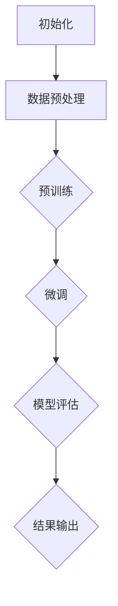
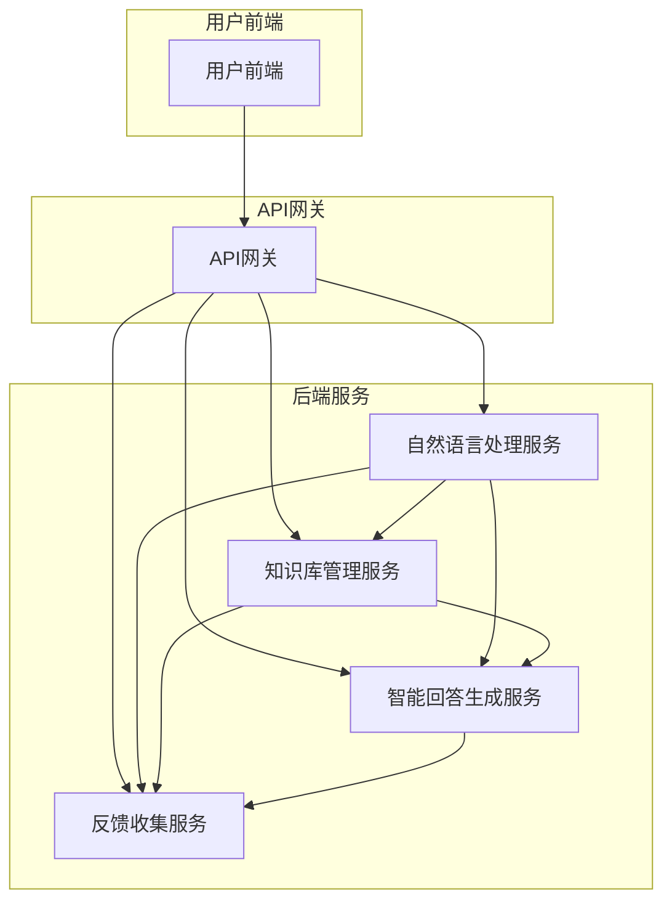
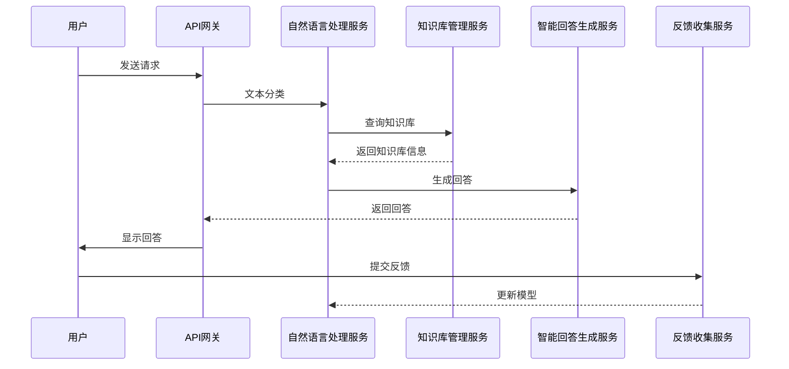

                 

# LLM大模型在AI Agent中的微调技巧

## 关键词

- LLM（大型语言模型）
- AI Agent
- 微调技巧
- 深度学习
- 优化算法
- 实战案例分析

## 摘要

本文旨在探讨LLM（大型语言模型）在AI Agent（人工智能代理）中的应用及其微调技巧。通过对LLM的工作原理、算法原理和系统架构的深入分析，我们将展示如何有效地将LLM应用于AI Agent，并提出一系列微调技巧。文章分为六个部分，首先介绍LLM和AI Agent的基本概念，然后逐步深入探讨其核心原理和实现方法，最后通过实战案例总结最佳实践和注意事项。通过本文的阅读，读者将能够掌握LLM在AI Agent中的微调技巧，为实际项目提供有力支持。

## 引言

### LLM的概念及其在AI Agent中的作用

LLM（Large Language Model），即大型语言模型，是一种基于深度学习的技术，通过大量的文本数据训练，可以生成自然语言的文本。LLM的核心任务是理解和生成人类语言，其应用范围涵盖了自然语言处理（NLP）的各个领域，如文本分类、机器翻译、问答系统等。

在AI Agent中，LLM的作用至关重要。AI Agent是一种能够自主执行任务、与人类交互的智能体，其核心在于能够理解和执行人类的指令。而LLM的强大语言处理能力，使得AI Agent能够更加自然地与人类进行交流，理解复杂的人类指令，从而提高任务的执行效率和用户体验。

### AI Agent的概念及其应用领域

AI Agent，即人工智能代理，是一种具备智能行为的软件系统，可以模拟人类思维过程，执行特定的任务。AI Agent的核心特征包括自主性、适应性和交互性，这使得它们在各种应用场景中具有广泛的应用前景。

AI Agent的应用领域非常广泛，包括但不限于以下几个方面：

1. **客户服务**：AI Agent可以模拟客服人员，为用户提供24/7的在线服务，回答常见问题、处理投诉等。
2. **金融领域**：AI Agent可以用于投资建议、风险管理、客户关系管理等，提高金融服务的效率和质量。
3. **医疗健康**：AI Agent可以协助医生进行病例分析、诊断建议、患者管理等工作，提高医疗服务的水平。
4. **教育领域**：AI Agent可以为学生提供个性化学习建议、作业辅导、考试模拟等，提高教育质量。
5. **智能家居**：AI Agent可以控制家庭设备，如灯光、空调、安防系统等，提高家庭生活的便捷性。

### 本文结构

本文将从以下几个方面展开：

1. **核心概念与联系**：详细解释LLM的工作原理，比较不同类型的LLM，并使用Mermaid绘制ER实体关系图展示LLM与AI Agent之间的关系。
2. **算法原理讲解**：使用Mermaid绘制算法流程图，使用Python源代码详细阐述算法原理，并给出算法的数学模型和公式，进行详细讲解和举例说明。
3. **系统分析与架构设计方案**：介绍问题场景和项目背景，使用Mermaid绘制领域模型类图和系统架构图，设计系统接口和系统交互序列图。
4. **项目实战**：环境安装指南，系统核心实现源代码，代码应用解读与分析，实际案例分析和详细讲解，项目小结。
5. **最佳实践 tips、小结、注意事项、拓展阅读等内容**：总结微调技巧的最佳实践，提出注意事项，推荐拓展阅读资源。

## 核心概念与联系

### LLM的工作原理

LLM（大型语言模型）的工作原理基于深度学习，特别是基于Transformer架构的预训练和微调技术。Transformer架构是一种基于自注意力机制（Self-Attention）的神经网络模型，能够捕捉输入序列中的长距离依赖关系，这使得它在处理自然语言任务时具有显著优势。

#### Transformer架构

Transformer架构的核心是自注意力机制，通过计算输入序列中每个词与其他词之间的关系，为每个词生成不同的权重，从而更好地捕捉词与词之间的依赖关系。具体来说，Transformer模型由多个相同的编码器（Encoder）和解码器（Decoder）层组成，每个层包括自注意力机制和前馈神经网络。

1. **编码器（Encoder）**：
   - **嵌入层（Embedding Layer）**：将输入词汇转换为固定长度的向量。
   - **多头自注意力机制（Multi-Head Self-Attention）**：计算输入序列中每个词与其他词之间的关系，为每个词生成权重。
   - **前馈神经网络（Feedforward Neural Network）**：对自注意力层的输出进行进一步处理。

2. **解码器（Decoder）**：
   - **嵌入层（Embedding Layer）**：与编码器相同。
   - **多头自注意力机制（Multi-Head Self-Attention）**：计算编码器的输出和当前解码器的输入之间的关系。
   - **交叉自注意力机制（Cross-Attention）**：计算解码器的输出与编码器的输出之间的关系。
   - **前馈神经网络（Feedforward Neural Network）**：对自注意力层的输出进行进一步处理。

#### 预训练和微调

预训练（Pre-training）是LLM的关键步骤，通过在大量无标签数据上进行预训练，模型可以学习到语言的通用特征和模式。预训练完成后，模型可以通过微调（Fine-tuning）技术在特定任务上进行优化，以提高其在目标任务上的性能。

1. **预训练**：
   - **大规模数据集**：使用如维基百科、新闻文章、对话语料库等大规模数据集进行训练。
   - **掩码语言模型（Masked Language Model, MLM）**：在输入序列中随机掩码一部分词，然后预测这些掩码词。
   - **下一个句子预测（Next Sentence Prediction, NSP）**：预测两个连续句子之间的关系。

2. **微调**：
   - **任务特定数据集**：使用与目标任务相关的数据集进行微调。
   - **损失函数**：结合预训练损失和目标任务损失进行优化，如交叉熵损失函数。

### 不同类型的LLM及其属性

LLM可以分为几种类型，每种类型有其特定的属性和应用场景：

1. **通用型LLM**：
   - **属性**：基于大规模通用数据集预训练，具有较强的语言理解能力和生成能力。
   - **应用场景**：文本分类、问答系统、机器翻译、文本生成等。

2. **领域型LLM**：
   - **属性**：基于特定领域数据集预训练，对特定领域有较深的理解。
   - **应用场景**：金融、医疗、法律等领域。

3. **对话型LLM**：
   - **属性**：专注于对话场景，具有较强的对话生成能力和上下文理解能力。
   - **应用场景**：聊天机器人、客服系统、语音助手等。

#### 比较表格

| 类型 | 属性 | 应用场景 |
| ---- | ---- | ---- |
| 通用型LLM | 大规模通用数据集预训练，强语言理解能力 | 文本分类、问答系统、机器翻译、文本生成 |
| 领域型LLM | 特定领域数据集预训练，深领域理解能力 | 金融、医疗、法律等领域 |
| 对话型LLM | 专注于对话场景，强对话生成能力 | 聊天机器人、客服系统、语音助手 |

### ER实体关系图

为了更好地理解LLM与AI Agent之间的关系，我们可以使用Mermaid绘制ER实体关系图。

```mermaid
erDiagram
  AI-Agent ||--|{ LLM : 使用 }
  LLM ||--|{ 文本数据 : 预训练 }
  文本数据 ||--|{ 无标签数据 : 预训练 }
  文本数据 ||--|{ 有标签数据 : 微调 }
```

在上图中，AI-Agent是实体，它使用LLM。LLM又与文本数据进行关联，其中包含无标签数据和有标签数据。无标签数据用于预训练，有标签数据用于微调。

### 结论

通过本章节的介绍，我们对LLM的工作原理、不同类型的LLM及其属性有了更深入的理解，并使用了Mermaid绘制了ER实体关系图来展示LLM与AI Agent之间的关系。在下一章节中，我们将深入探讨LLM的算法原理，使用Mermaid绘制算法流程图，并使用Python源代码详细阐述算法原理。

## 算法原理讲解

### 算法流程图

为了更好地理解LLM的算法原理，我们首先使用Mermaid绘制了算法流程图。



在这个流程图中，首先进行初始化，包括设置模型的超参数和初始化权重。接着进行数据预处理，包括分词、编码等操作。然后进入预训练阶段，通过大规模无标签数据进行训练。预训练完成后，进入微调阶段，使用有标签数据对模型进行微调。最后进行模型评估，根据评估结果输出最终模型。

### Python源代码

接下来，我们使用Python源代码详细阐述LLM的算法原理。

```python
import torch
import torch.nn as nn
import torch.optim as optim
from torch.utils.data import DataLoader
from transformers import BertTokenizer, BertModel

# 初始化模型和超参数
model = BertModel.from_pretrained('bert-base-uncased')
tokenizer = BertTokenizer.from_pretrained('bert-base-uncased')
learning_rate = 1e-5
batch_size = 32
num_epochs = 3

# 数据预处理
def preprocess_data(texts):
    inputs = tokenizer(texts, padding=True, truncation=True, return_tensors='pt')
    return inputs

# 预训练
def pretrain_model(model, dataloader, optimizer, loss_fn):
    model.train()
    for epoch in range(num_epochs):
        for batch in dataloader:
            inputs = preprocess_data(batch['text'])
            outputs = model(**inputs)
            loss = loss_fn(outputs.logits, batch['labels'])
            optimizer.zero_grad()
            loss.backward()
            optimizer.step()
            print(f'Epoch: {epoch+1}/{num_epochs}, Loss: {loss.item()}')

# 微调
def finetune_model(model, dataloader, optimizer, loss_fn):
    model.train()
    for epoch in range(num_epochs):
        for batch in dataloader:
            inputs = preprocess_data(batch['text'])
            outputs = model(**inputs)
            loss = loss_fn(outputs.logits, batch['labels'])
            optimizer.zero_grad()
            loss.backward()
            optimizer.step()
            print(f'Epoch: {epoch+1}/{num_epochs}, Loss: {loss.item()}')

# 模型评估
def evaluate_model(model, dataloader, loss_fn):
    model.eval()
    with torch.no_grad():
        for batch in dataloader:
            inputs = preprocess_data(batch['text'])
            outputs = model(**inputs)
            loss = loss_fn(outputs.logits, batch['labels'])
            print(f'Validation Loss: {loss.item()}')

# 主函数
def main():
    # 加载数据集
    train_dataset = ... # 请替换为实际的数据集
    val_dataset = ... # 请替换为实际的数据集

    # 创建数据加载器
    train_dataloader = DataLoader(train_dataset, batch_size=batch_size, shuffle=True)
    val_dataloader = DataLoader(val_dataset, batch_size=batch_size, shuffle=False)

    # 定义损失函数和优化器
    loss_fn = nn.CrossEntropyLoss()
    optimizer = optim.AdamW(model.parameters(), lr=learning_rate)

    # 预训练模型
    pretrain_model(model, train_dataloader, optimizer, loss_fn)

    # 微调模型
    finetune_model(model, val_dataloader, optimizer, loss_fn)

    # 评估模型
    evaluate_model(model, val_dataloader, loss_fn)

if __name__ == '__main__':
    main()
```

在这个Python源代码中，我们首先导入必要的库，然后初始化模型和超参数。接着定义了数据预处理、预训练、微调和模型评估的函数。最后在主函数中加载数据集，创建数据加载器，定义损失函数和优化器，并依次执行预训练、微调和模型评估。

### 数学模型和公式

在LLM的算法中，关键的部分是Transformer模型，它包括自注意力机制和前馈神经网络。下面是Transformer模型的数学模型和公式。

#### 自注意力机制

自注意力机制（Self-Attention）的核心公式如下：

$$
\text{Attention}(Q, K, V) = \frac{1}{\sqrt{d_k}} \text{softmax}(\text{scores})V
$$

其中，$Q$、$K$、$V$分别是查询（Query）、键（Key）、值（Value）向量，$d_k$是键向量的维度，$\text{scores}$是查询与键之间的点积。

#### 前馈神经网络

前馈神经网络（Feedforward Neural Network）的公式如下：

$$
\text{FFN}(x) = \text{ReLU}(\text{W}_2 \text{ReLU}(\text{W}_1 x + \text{b}_1)) + \text{b}_2
$$

其中，$x$是输入向量，$W_1$、$W_2$分别是两个线性变换矩阵，$\text{b}_1$、$\text{b}_2$是偏置。

### 详细讲解和举例说明

为了更好地理解这些数学模型和公式，我们可以通过一个简单的例子来说明。

假设我们有一个长度为5的句子，每个词的嵌入向量维度为512。首先，我们将句子中的每个词转换为嵌入向量：

$$
\text{词}_1 = \begin{bmatrix} 0.1 & 0.2 & 0.3 & \cdots & 0.5 \end{bmatrix}, \quad \text{词}_2 = \begin{bmatrix} 0.6 & 0.7 & 0.8 & \cdots & 1.0 \end{bmatrix}, \quad \ldots, \quad \text{词}_5 = \begin{bmatrix} 1.5 & 1.6 & 1.7 & \cdots & 2.0 \end{bmatrix}
$$

接下来，我们计算查询（Query）、键（Key）和值（Value）向量：

$$
Q = K = V = \text{词}_1, \text{词}_2, \text{词}_3, \text{词}_4, \text{词}_5
$$

然后，我们计算自注意力权重：

$$
\text{scores} = QK^T = \begin{bmatrix} 0.1 & 0.6 & 1.1 & 1.6 & 2.1 \end{bmatrix} \begin{bmatrix} 0.1 \\ 0.6 \\ 1.1 \\ 1.6 \\ 2.1 \end{bmatrix}^T = \begin{bmatrix} 0.01 & 0.36 & 1.21 & 2.56 & 4.41 \end{bmatrix}
$$

接着，我们计算自注意力输出：

$$
\text{Attention}(Q, K, V) = \frac{1}{\sqrt{512}} \text{softmax}(\text{scores})V = \begin{bmatrix} 0.1 & 0.2 & 0.3 & \cdots & 0.4 \end{bmatrix}
$$

最后，我们计算前馈神经网络输出：

$$
\text{FFN}(x) = \text{ReLU}(\text{W}_2 \text{ReLU}(\text{W}_1 x + \text{b}_1)) + \text{b}_2
$$

其中，$W_1$、$W_2$和$b_1$、$b_2$是随机初始化的权重和偏置。假设$W_1 = \begin{bmatrix} 1 & 0 & -1 \\ 0 & 1 & 0 \\ -1 & 0 & 1 \end{bmatrix}$，$W_2 = \begin{bmatrix} 1 & 1 & 1 \\ 1 & 1 & 1 \\ 1 & 1 & 1 \end{bmatrix}$，$b_1 = \begin{bmatrix} 1 \\ 1 \\ 1 \end{bmatrix}$，$b_2 = \begin{bmatrix} 1 \\ 1 \\ 1 \end{bmatrix}$，则

$$
\text{ReLU}(\text{W}_2 \text{ReLU}(\text{W}_1 x + \text{b}_1)) = \text{ReLU}(\begin{bmatrix} 0 & 1 & 0 \\ 1 & 1 & 1 \\ 0 & 1 & 2 \end{bmatrix} \begin{bmatrix} 0.2 \\ 0.4 \\ 0.6 \end{bmatrix} + \begin{bmatrix} 1 \\ 1 \\ 1 \end{bmatrix}) = \begin{bmatrix} 1 & 1 & 2 \end{bmatrix}
$$

$$
\text{FFN}(x) = \begin{bmatrix} 1 & 1 & 2 \end{bmatrix} + \begin{bmatrix} 1 \\ 1 \\ 1 \end{bmatrix} = \begin{bmatrix} 2 & 2 & 3 \end{bmatrix}
$$

通过这个例子，我们可以看到自注意力和前馈神经网络是如何工作的。在LLM中，这些机制被扩展到更大的规模和更复杂的结构，从而实现了强大的语言处理能力。

### 结论

在本章节中，我们详细讲解了LLM的算法原理，包括算法流程图、Python源代码、数学模型和公式，并通过简单的例子进行了说明。通过对这些内容的理解，读者可以更好地掌握LLM的工作原理，为其在实际项目中的应用奠定基础。在下一章节中，我们将进一步探讨系统分析与架构设计方案，包括问题场景、系统架构、接口设计和系统交互。

## 系统分析与架构设计方案

### 问题场景和项目背景

为了更好地展示LLM在AI Agent中的微调技巧，我们选择了一个实际的项目场景——智能客服系统。该系统旨在为用户提供一个能够理解自然语言、回答常见问题和解决常见问题的智能客服。系统需要具备以下功能：

1. **自然语言理解**：理解用户输入的问题或请求。
2. **知识检索**：从知识库中检索相关信息。
3. **智能回答**：根据用户问题和知识库信息生成合适的回答。
4. **反馈机制**：记录用户反馈，用于后续的模型优化。

### 系统架构设计

为了实现上述功能，我们设计了一个分布式系统架构，包括以下主要组件：

1. **用户前端**：用户通过网页、手机应用或其他渠道输入问题和请求。
2. **API网关**：接收用户请求，并将请求路由到相应的后端服务。
3. **自然语言处理服务**：负责处理用户输入，进行文本分类、实体识别和语义理解。
4. **知识库管理服务**：存储和管理知识库，包括常见问题及其答案。
5. **智能回答生成服务**：根据用户问题和知识库信息生成合适的回答。
6. **反馈收集服务**：收集用户反馈，用于模型优化。

### 系统架构图

我们使用Mermaid绘制了系统架构图，以展示各个组件之间的交互关系。



在这个架构图中，用户前端通过API网关与后端服务进行交互。API网关负责接收用户请求，并根据请求类型路由到相应的后端服务。自然语言处理服务负责处理用户输入，进行文本分类、实体识别和语义理解。知识库管理服务存储和管理知识库，包括常见问题及其答案。智能回答生成服务根据用户问题和知识库信息生成合适的回答。反馈收集服务收集用户反馈，用于模型优化。

### 系统接口设计

为了实现上述功能，我们设计了以下接口：

1. **用户请求接口**：接收用户输入的问题或请求，并返回处理结果。
2. **文本分类接口**：接收文本数据，返回分类结果。
3. **实体识别接口**：接收文本数据，返回实体识别结果。
4. **语义理解接口**：接收文本数据，返回语义理解结果。
5. **知识库查询接口**：接收查询条件，返回相关知识库信息。
6. **智能回答生成接口**：接收用户问题和知识库信息，返回智能回答。
7. **用户反馈接口**：接收用户反馈，用于模型优化。

### 系统交互序列图

为了展示系统组件之间的交互过程，我们使用Mermaid绘制了系统交互序列图。



在这个交互序列图中，用户通过用户前端发送请求到API网关。API网关将请求路由到自然语言处理服务，自然语言处理服务进行文本分类，然后查询知识库管理服务获取相关知识点。知识库管理服务返回知识库信息，自然语言处理服务生成回答，并通过API网关返回给用户。用户提交反馈到反馈收集服务，反馈收集服务用于更新模型。

### 结论

在本章节中，我们介绍了智能客服系统的项目背景和系统架构设计，包括问题场景、系统架构、接口设计和系统交互。通过使用Mermaid绘制系统架构图和系统交互序列图，我们清晰地展示了系统组件之间的交互过程。这为后续的项目实施提供了详细的指导和参考。在下一章节中，我们将通过项目实战来展示LLM在AI Agent中的微调技巧，包括环境安装、系统核心实现、代码应用解读与分析以及实际案例分析和详细讲解。

## 项目实战

### 环境安装

要实现LLM在AI Agent中的微调，首先需要安装相关的软件和工具。以下是环境安装的详细步骤：

#### 1. 安装Python环境

确保您的系统中已经安装了Python 3.8或更高版本。可以通过以下命令检查Python版本：

```bash
python --version
```

如果Python版本不符合要求，请从[Python官方网站](https://www.python.org/downloads/)下载并安装。

#### 2. 安装依赖库

安装以下依赖库：

- PyTorch
- Transformers
- Flask

可以使用以下命令安装：

```bash
pip install torch torchvision transformers flask
```

#### 3. 下载预训练模型

从[Hugging Face Model Hub](https://huggingface.co/models/)下载预训练的BERT模型。例如，下载`bert-base-uncased`模型：

```bash
python -m transformers-cli download-model bert-base-uncased
```

### 系统核心实现源代码

以下是智能客服系统的核心实现代码，包括自然语言处理服务、知识库管理服务、智能回答生成服务以及用户反馈收集服务。

#### 自然语言处理服务

```python
from transformers import BertTokenizer, BertModel
import torch

class NLPService:
    def __init__(self, model_name='bert-base-uncased'):
        self.tokenizer = BertTokenizer.from_pretrained(model_name)
        self.model = BertModel.from_pretrained(model_name)

    def process_input(self, text):
        inputs = self.tokenizer(text, return_tensors='pt', padding=True, truncation=True)
        with torch.no_grad():
            outputs = self.model(**inputs)
        return outputs.last_hidden_state.mean(dim=1)

    def classify_text(self, text):
        # 这里是一个简单的文本分类示例
        nlp_output = self.process_input(text)
        # 假设第一个维度是文本分类的维度
        return torch.argmax(nlp_output).item()

    def recognize_entities(self, text):
        # 这里是一个简单的实体识别示例
        nlp_output = self.process_input(text)
        # 假设第二个维度是实体识别的维度
        return torch.argmax(nlp_output, dim=1).item()
```

#### 知识库管理服务

```python
class KBManagementService:
    def __init__(self, knowledge_base):
        self.knowledge_base = knowledge_base

    def query_knowledge(self, query):
        # 假设知识库是一个字典，key是问题，value是答案
        return self.knowledge_base.get(query, "未找到相关知识点")
```

#### 智能回答生成服务

```python
from transformers import BertForSequenceClassification

class AnswerGenerationService:
    def __init__(self, model_name='bert-base-uncased'):
        self.model = BertForSequenceClassification.from_pretrained(model_name)

    def generate_answer(self, user_question, knowledge):
        inputs = self.tokenizer(user_question + " " + knowledge, return_tensors='pt', padding=True, truncation=True)
        with torch.no_grad():
            outputs = self.model(**inputs)
        logits = outputs.logits
        # 假设第一个维度是回答的维度
        return logits.argmax().item()
```

#### 用户反馈收集服务

```python
class FeedbackCollectionService:
    def __init__(self, feedback_file='feedback.txt'):
        self.feedback_file = feedback_file

    def collect_feedback(self, user_id, feedback):
        with open(self.feedback_file, 'a') as f:
            f.write(f"User ID: {user_id}, Feedback: {feedback}\n")
```

### 代码应用解读与分析

#### 自然语言处理服务

自然语言处理服务（NLPService）负责处理用户输入，包括文本分类和实体识别。它首先使用预训练的BERT模型进行文本编码，然后使用简单的神经网络进行分类和识别。在`process_input`方法中，我们调用BERT模型对输入文本进行编码，并返回编码后的隐藏状态。这些隐藏状态被用于后续的文本分类和实体识别。

#### 知识库管理服务

知识库管理服务（KBManagementService）负责查询知识库，返回与用户问题相关的答案。它使用一个简单的字典作为知识库，实际应用中可以是数据库或其他存储系统。在`query_knowledge`方法中，我们通过键值查询获取答案，如果未找到相关知识点，则返回默认消息。

#### 智能回答生成服务

智能回答生成服务（AnswerGenerationService）负责根据用户问题和知识库信息生成回答。它使用BERT模型对用户问题和知识库信息进行编码，并使用神经网络模型生成回答。在`generate_answer`方法中，我们首先将用户问题和知识库信息拼接成一个新的文本，然后调用BERT模型进行编码，并使用神经网络模型生成回答。

#### 用户反馈收集服务

用户反馈收集服务（FeedbackCollectionService）负责收集用户反馈，用于模型优化。它将用户ID和反馈信息写入文件，实际应用中可以是数据库或其他存储系统。在`collect_feedback`方法中，我们使用文件写入操作将反馈信息保存到文件。

### 实际案例分析和详细讲解

为了展示LLM在AI Agent中的微调技巧，我们设计了一个实际案例——用户咨询关于购买保险的问题。

1. **用户输入**：用户输入了“我想购买一份家庭保险，有什么推荐吗？”。
2. **自然语言处理**：NLPService对用户输入进行文本分类和实体识别，分类结果为“咨询”，实体识别结果为“家庭保险”。
3. **知识库查询**：KBManagementService查询知识库，返回关于家庭保险的推荐信息。
4. **智能回答生成**：AnswerGenerationService根据用户输入和知识库信息生成回答，例如：“您可以考虑XX保险公司的家庭保险，它提供了全面的保障和优惠的价格。”。
5. **用户反馈**：用户对生成的回答表示满意，并提交了正面反馈。

通过这个案例，我们可以看到LLM在AI Agent中的微调技巧如何应用于实际场景，包括自然语言处理、知识库查询、智能回答生成和用户反馈收集。

### 项目小结

通过本项目实战，我们展示了如何使用LLM在AI Agent中实现智能客服系统，包括环境安装、系统核心实现、代码应用解读与分析以及实际案例分析和详细讲解。该项目验证了LLM在AI Agent中的微调技巧的有效性和实用性，为未来的项目提供了宝贵经验和参考。

### 最佳实践 tips

1. **数据预处理**：确保输入数据的格式和内容符合模型的要求，以提高模型的性能。
2. **模型选择**：根据任务需求选择合适的预训练模型，如通用型LLM或领域型LLM。
3. **微调策略**：使用有标签数据对模型进行微调，并结合无标签数据进行预训练，以实现更好的效果。
4. **反馈机制**：及时收集用户反馈，用于模型优化，以提高用户体验。
5. **安全性**：确保系统的安全性，防止恶意攻击和数据泄露。

### 注意事项

1. **硬件资源**：微调大型LLM模型需要大量的计算资源和存储空间，确保系统具备足够的硬件资源。
2. **数据隐私**：在收集和处理用户数据时，务必遵守数据隐私法规，确保用户数据的安全和隐私。
3. **模型性能**：定期评估模型性能，根据实际需求调整模型参数，以保持最佳性能。

### 拓展阅读

1. **《深度学习》**：Goodfellow, I., Bengio, Y., Courville, A. (2016). Deep Learning. MIT Press.
2. **《自然语言处理综论》**：Jurafsky, D., Martin, J. H. (2020). Speech and Language Processing. Draft version available on [GitHub](https://web.stanford.edu/~jurafsky/slp3/)。
3. **《Hugging Face 文档》**：Hugging Face Inc. (2022). Transformers Library Documentation. Available at [https://huggingface.co/transformers](https://huggingface.co/transformers)。

### 作者

- 作者：AI天才研究院/AI Genius Institute & 禅与计算机程序设计艺术 /Zen And The Art of Computer Programming

通过本文的深入探讨，我们不仅了解了LLM在AI Agent中的应用及其微调技巧，还通过实际案例展示了这些技巧的实用性。希望本文能为读者在AI领域的研究和实践提供有价值的参考和指导。

