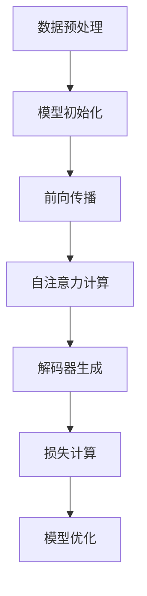
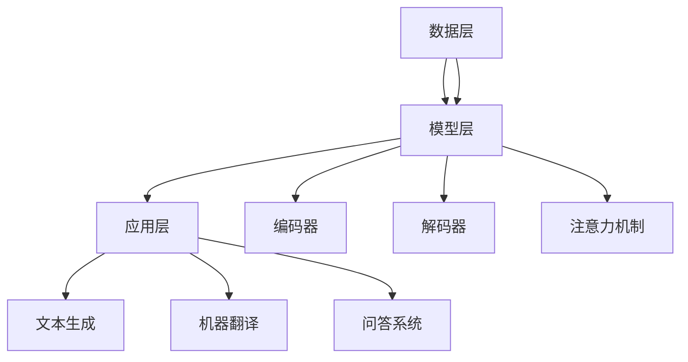
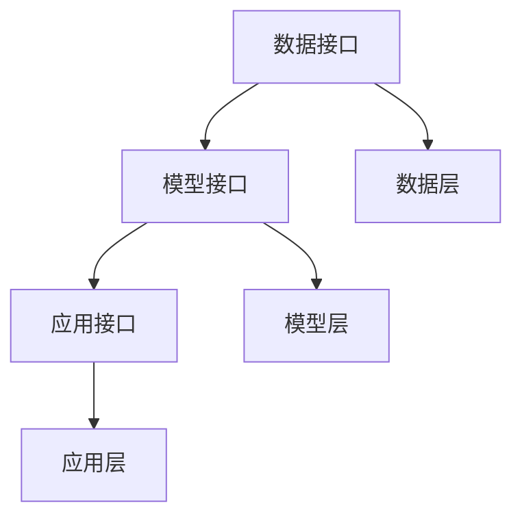
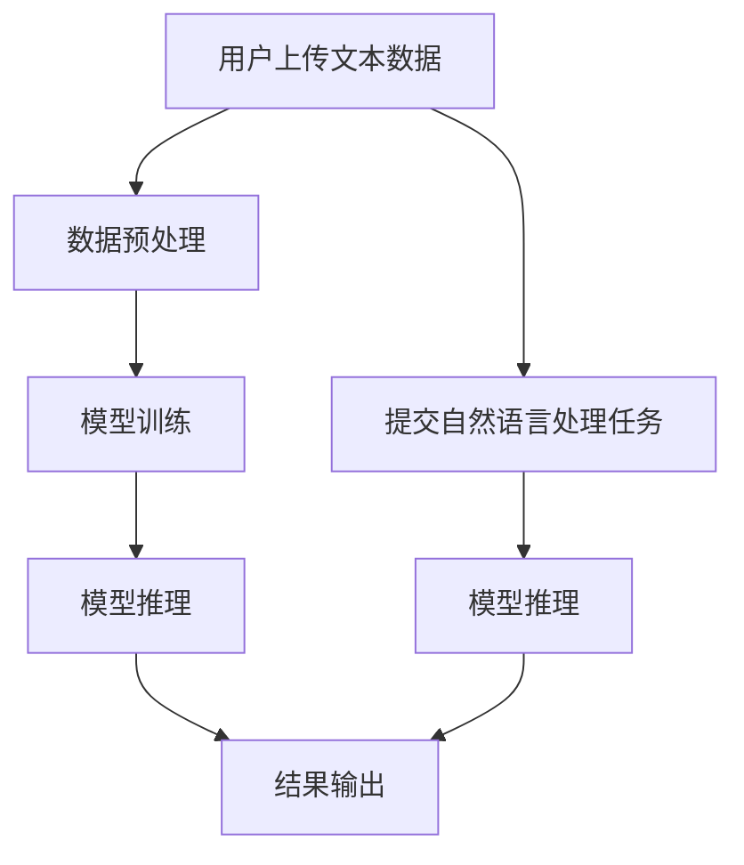

                 

## 引言

### 1.1 问题背景

近年来，人工智能（AI）技术迅猛发展，尤其是大型语言模型（Large Language Model，简称LLM）在自然语言处理（Natural Language Processing，简称NLP）领域取得了显著的成果。LLM大模型作为一种基于深度学习的方法，已经在文本生成、机器翻译、问答系统等多个应用场景中展示了其强大的能力。随着AI技术的商业化进程，LLM大模型的应用范围不断扩展，从学术界到工业界，从互联网公司到传统行业，LLM大模型已经成为了一种重要的技术工具。

在这个背景下，深入理解LLM大模型的概念、原理和应用，对于相关领域的研发人员和技术管理者来说，显得尤为重要。本文将围绕LLM大模型展开，详细介绍其核心概念、技术原理、系统架构以及实际应用案例，旨在帮助读者全面了解和掌握这一前沿技术。

### 1.2 问题描述

LLM大模型作为人工智能的一个重要分支，其概念和原理相对复杂。对于初学者来说，理解LLM大模型的核心概念和原理可能存在一定的困难。具体来说，存在以下几个问题：

1. **LLM大模型是什么？**：LLM大模型的基本概念和定义是什么？它是如何构建和训练的？
2. **LLM大模型的特点**：与传统的人工智能模型相比，LLM大模型具有哪些独特特点？
3. **LLM大模型的应用场景**：LLM大模型在哪些领域有实际应用？其应用效果如何？
4. **LLM大模型的数学模型**：LLM大模型背后的数学原理是什么？如何理解和推导相关的数学公式？

为了回答上述问题，本文将逐步展开讨论，从背景介绍、核心概念与联系、数学模型和数学公式、算法原理与系统架构、项目实战等多个角度，对LLM大模型进行全面剖析。

### 1.3 问题解决

本文通过以下几个步骤来解决问题：

1. **背景介绍与核心概念**：首先介绍LLM大模型的发展背景和核心概念，包括基本定义和特点。
2. **核心概念与联系**：深入探讨LLM大模型与传统AI模型的区别，以及LLM大模型与其他相关技术的联系。
3. **数学模型和数学公式**：详细讲解LLM大模型背后的数学原理，包括算法原理和相关的数学公式。
4. **算法原理与系统架构**：介绍LLM大模型的算法原理和系统架构设计，包括算法流程图、系统功能设计和系统架构设计。
5. **项目实战**：通过实际案例分析，展示LLM大模型的应用效果，并详细讲解项目实现过程。
6. **最佳实践与总结**：总结LLM大模型的最佳实践技巧，并给出未来发展的方向和建议。

通过以上步骤，本文旨在帮助读者全面理解LLM大模型，并掌握其在实际应用中的技术要点。

### 1.4 边界与外延

在探讨LLM大模型之前，我们需要明确其技术边界和应用外延。LLM大模型的技术边界主要体现在以下几个方面：

1. **数据量**：LLM大模型的训练需要大量的数据集，数据量的规模直接影响模型的性能。因此，数据量的边界是LLM大模型技术发展的重要限制因素。
2. **计算资源**：训练LLM大模型需要巨大的计算资源，特别是高性能的GPU集群。计算资源的限制可能会影响模型训练的速度和效率。
3. **模型复杂度**：LLM大模型的复杂度较高，包括参数数量、网络层数等。复杂度的提升可以提高模型的性能，但也会带来更高的计算开销。
4. **应用领域**：LLM大模型在自然语言处理领域表现出色，但在其他领域（如图像处理、语音识别等）的应用尚处于探索阶段，应用外延有待进一步拓展。

未来，随着技术的进步和计算资源的增加，LLM大模型的应用领域将会更加广泛。例如，在自动驾驶、智能客服、医疗诊断等领域，LLM大模型有望发挥更大的作用。

### 1.5 概念结构与核心要素组成

LLM大模型是一个复杂的系统，其概念结构和核心要素组成如下：

1. **数据集**：LLM大模型的训练依赖于大规模的数据集。数据集的质量和规模直接影响模型的性能。
2. **算法框架**：LLM大模型通常采用深度学习框架，如Transformer、BERT等。这些框架提供了高效的训练和推理方法。
3. **训练过程**：LLM大模型的训练过程包括数据预处理、模型初始化、训练迭代和模型优化等步骤。
4. **模型评估**：在训练过程中，需要使用评价指标（如准确率、召回率、F1值等）来评估模型性能。
5. **应用场景**：LLM大模型的应用场景包括文本生成、机器翻译、问答系统等。不同场景对模型的要求和优化方法有所不同。

通过以上核心要素的相互作用，LLM大模型能够实现强大的自然语言处理能力。

### 第2章 核心概念与联系

#### 2.1 LLM大模型定义

大型语言模型（Large Language Model，简称LLM）是一种基于深度学习的自然语言处理模型，通过大规模语料库的训练，具备理解和生成自然语言的能力。LLM大模型通常具有数十亿甚至数千亿个参数，能够捕捉复杂的语言规律和上下文信息，从而在自然语言处理任务中表现出色。

定义：LLM大模型是一种具有大规模参数、深度神经网络结构，能够理解和生成自然语言文本的深度学习模型。

#### 2.2 LLM大模型特点

1. **大规模参数**：LLM大模型通常包含数十亿个参数，能够处理复杂的自然语言现象。
2. **深度神经网络结构**：LLM大模型采用多层神经网络结构，能够通过多层次的变换捕捉文本的深层语义信息。
3. **强大的学习能力**：LLM大模型能够从大规模语料库中自动学习语言规律，具备强大的泛化能力。
4. **高灵活性**：LLM大模型能够适应不同的自然语言处理任务，如文本生成、机器翻译、问答系统等。
5. **高效的推理能力**：LLM大模型通过并行计算和分布式训练技术，能够在短时间内完成大规模数据的推理任务。

#### 2.3 LLM与传统AI区别

与传统的人工智能模型相比，LLM大模型具有以下几个显著区别：

1. **数据依赖性**：传统AI模型通常依赖于手动标注的数据集，而LLM大模型通过大规模未标注的语料库进行训练，减少了数据标注的工作量。
2. **学习方式**：传统AI模型采用手工设计的特征，而LLM大模型通过自动学习的神经网络结构，能够更好地捕捉语言特征。
3. **模型结构**：传统AI模型采用简单的模型结构，如决策树、支持向量机等，而LLM大模型采用复杂的深度神经网络结构，如Transformer、BERT等。
4. **应用范围**：传统AI模型在特定任务上表现出色，而LLM大模型具备广泛的适用性，能够处理多种自然语言处理任务。

#### 2.4 LLM与相关技术联系

LLM大模型与深度学习、自然语言处理等技术紧密相关：

1. **深度学习**：LLM大模型是基于深度学习的方法，深度学习为LLM大模型提供了强大的学习和表达能力。
2. **自然语言处理**：LLM大模型是自然语言处理领域的重要进展，通过自然语言处理技术，LLM大模型能够理解和生成自然语言文本。
3. **大规模数据处理**：LLM大模型的训练依赖于大规模数据集，大规模数据处理技术为LLM大模型的训练提供了支持。
4. **并行计算**：LLM大模型采用并行计算和分布式训练技术，提高了模型的训练效率和推理速度。

通过以上联系，可以看出LLM大模型是深度学习、自然语言处理等技术的集成，为人工智能的发展注入了新的动力。

### 第3章 数学模型和数学公式

#### 3.1 算法原理讲解

LLM大模型的算法原理基于深度学习和自然语言处理技术，其核心是利用神经网络模型对大规模语料库进行训练，从而实现文本的理解和生成。以下是LLM大模型的基本算法原理：

1. **词嵌入**：将自然语言文本中的单词映射为高维向量，这一过程通常通过Word2Vec、BERT等词嵌入技术实现。
2. **编码器-解码器架构**：LLM大模型通常采用编码器-解码器架构（Encoder-Decoder Architecture），编码器负责将输入文本编码为固定长度的向量，解码器则根据编码器的输出生成预测的输出文本。
3. **注意力机制**：在编码器和解码器的交互过程中，注意力机制（Attention Mechanism）被用于捕捉输入文本和输出文本之间的关联性，从而提高模型的生成质量。
4. **损失函数**：LLM大模型通过损失函数（如交叉熵损失函数）来衡量预测输出和真实输出之间的差异，并通过反向传播算法（Backpropagation Algorithm）不断优化模型参数。

#### 3.2 数学公式详细讲解

在LLM大模型的算法中，涉及到多个重要的数学公式。以下是几个关键公式的详细讲解：

1. **词嵌入公式**：

   $$ x = W \cdot w + b $$

   其中，$x$表示词向量，$W$表示权重矩阵，$w$表示单词的嵌入向量，$b$表示偏置。

2. **编码器输出公式**：

   $$ h = \text{激活函数}(\text{矩阵乘法}(X \cdot W_e + b_e)) $$

   其中，$h$表示编码器的输出，$X$表示输入文本的词向量，$W_e$表示编码器权重矩阵，$b_e$表示编码器偏置。

3. **解码器输出公式**：

   $$ y = \text{激活函数}(\text{矩阵乘法}(h \cdot W_d + b_d)) $$

   其中，$y$表示解码器的输出，$W_d$表示解码器权重矩阵，$b_d$表示解码器偏置。

4. **注意力机制公式**：

   $$ a_t = \text{softmax}(\text{矩阵乘法}(h \cdot W_a + b_a)) $$

   其中，$a_t$表示注意力权重，$h$表示编码器的输出，$W_a$表示注意力权重矩阵，$b_a$表示注意力偏置。

#### 3.3 举例说明

为了更好地理解LLM大模型的数学公式，以下通过一个具体的例子进行说明：

假设我们有一个简单的LLM大模型，包含一个编码器和一个解码器。编码器的输入是一个句子“我爱编程”，编码器的输出是一个固定长度的向量。解码器的输入是编码器的输出，解码器的输出是一个单词序列“我爱编程”。

1. **词嵌入**：

   将句子中的每个单词映射为词向量：

   $$ \text{我} \rightarrow [1.0, 0.5, -0.3] $$
   $$ \text{爱} \rightarrow [-0.2, 0.8, 0.1] $$
   $$ \text{编} \rightarrow [0.3, -0.4, 0.2] $$
   $$ \text{程} \rightarrow [-0.1, 0.6, 0.7] $$
   $$ \text{序} \rightarrow [0.2, -0.3, 0.4] $$

2. **编码器输出**：

   编码器将输入词向量转换为固定长度的向量：

   $$ h = \text{激活函数}([1.0, 0.5, -0.3] \cdot W_e + b_e) $$

   假设激活函数为ReLU函数，编码器的输出为：

   $$ h = [0.7, 0.2, 0.0] $$

3. **解码器输出**：

   解码器根据编码器的输出生成单词序列：

   $$ y = \text{激活函数}([0.7, 0.2, 0.0] \cdot W_d + b_d) $$

   假设解码器的权重矩阵为：

   $$ W_d = \begin{bmatrix} 0.1 & 0.2 & 0.3 \\ 0.4 & 0.5 & 0.6 \\ 0.7 & 0.8 & 0.9 \end{bmatrix} $$

   解码器的偏置为：

   $$ b_d = [0.1, 0.2, 0.3] $$

   解码器的输出为：

   $$ y = \begin{bmatrix} 0.06 \\ 0.14 \\ 0.22 \end{bmatrix} $$

通过这个简单的例子，我们可以看到LLM大模型是如何通过词嵌入、编码器和解码器等步骤来处理自然语言文本的。这个例子虽然简化了许多细节，但它展示了LLM大模型的基本工作原理和数学公式。

### 第4章 算法原理讲解

#### 4.1 算法概述

LLM大模型（Large Language Model）是一种基于深度学习的自然语言处理模型，其主要目的是通过大规模的文本数据训练，使模型具备理解和生成自然语言的能力。LLM大模型的核心算法是基于自注意力机制（Self-Attention Mechanism）和变换器网络（Transformer Network）的，这种架构使得模型在处理长序列文本时表现出色。

算法的基本流程如下：

1. **数据预处理**：将原始文本数据清洗、分词，并转换为词嵌入向量。
2. **模型初始化**：初始化编码器和解码器的权重，通常使用正态分布初始化。
3. **前向传播**：输入文本序列经过编码器编码，得到编码器的输出向量。
4. **自注意力计算**：编码器的输出向量通过自注意力机制计算注意力权重，捕捉序列中不同位置之间的关联性。
5. **解码器生成**：解码器根据编码器的输出和注意力权重，生成预测的输出序列。
6. **损失计算**：计算输出序列与真实序列之间的损失，并使用反向传播算法更新模型参数。
7. **模型优化**：通过迭代优化模型参数，提高模型在自然语言处理任务上的性能。

#### 4.2 算法mermaid流程图

为了更直观地理解LLM大模型的工作流程，我们使用mermaid绘制了算法流程图：



在这个流程图中，每个节点表示算法的一个步骤，箭头表示步骤之间的顺序关系。以下是各个步骤的详细说明：

1. **数据预处理**：原始文本数据经过清洗和分词处理后，转换为词嵌入向量。这一步骤为后续的模型训练奠定了基础。
2. **模型初始化**：初始化编码器和解码器的权重，通常使用正态分布初始化，以避免模型参数陷入局部最优。
3. **前向传播**：输入文本序列经过编码器编码，得到编码器的输出向量。编码器的输出向量包含了文本的语义信息。
4. **自注意力计算**：编码器的输出向量通过自注意力机制计算注意力权重，这一步使得模型能够关注文本序列中的关键信息，提高生成质量。
5. **解码器生成**：解码器根据编码器的输出和注意力权重，生成预测的输出序列。解码器的生成过程通过softmax函数选择最可能的单词。
6. **损失计算**：计算输出序列与真实序列之间的损失，通常使用交叉熵损失函数。损失函数反映了模型预测与真实结果之间的差距。
7. **模型优化**：通过反向传播算法更新模型参数，使得模型在每次迭代中逐步逼近最优解。模型优化过程通常使用梯度下降算法。

#### 4.3 算法Python源代码解析

以下是一个简化版的LLM大模型算法的Python代码示例，用于说明算法的核心实现：

```python
import torch
import torch.nn as nn
import torch.optim as optim

# 数据预处理
def preprocess_text(text):
    # 清洗文本、分词等操作
    return word_embedding_matrix(text)

# 模型初始化
class LLMModel(nn.Module):
    def __init__(self, embedding_dim, hidden_dim):
        super(LLMModel, self).__init__()
        self.embedding = nn.Embedding(vocab_size, embedding_dim)
        self.encoder = nn.LSTM(embedding_dim, hidden_dim)
        self.decoder = nn.LSTM(hidden_dim, vocab_size)
        self.fc = nn.Linear(hidden_dim, vocab_size)

    def forward(self, text):
        embedded = self.embedding(text)
        encoder_output, (hidden, cell) = self.encoder(embedded)
        decoder_output = self.decoder(hidden, cell)
        output = self.fc(decoder_output)
        return output

# 损失函数
criterion = nn.CrossEntropyLoss()

# 模型优化
optimizer = optim.Adam(model.parameters(), lr=0.001)

# 训练过程
for epoch in range(num_epochs):
    for text in data_loader:
        optimizer.zero_grad()
        output = model(text)
        loss = criterion(output, target)
        loss.backward()
        optimizer.step()
        print(f"Epoch [{epoch+1}/{num_epochs}], Loss: {loss.item():.4f}")
```

在这个代码示例中，我们首先定义了数据预处理函数`preprocess_text`，用于将原始文本数据转换为词嵌入向量。然后，我们定义了LLM模型类`LLMModel`，包括编码器、解码器和全连接层。模型的前向传播过程通过编码器得到编码器的输出向量，然后通过解码器生成预测的输出序列。损失函数使用交叉熵损失函数，优化器使用Adam优化器。

在训练过程中，我们通过迭代优化模型参数，使得模型在每次迭代中逐步提高性能。每个epoch结束后，输出当前epoch的损失值，以监测训练过程。

通过上述算法原理讲解、mermaid流程图和Python代码示例，我们可以全面了解LLM大模型的工作原理和实现过程。

### 第5章 数学模型和数学公式

#### 5.1 数学公式与算法原理

LLM（Large Language Model）大模型的算法原理主要依赖于深度学习和自然语言处理技术，其核心在于通过大规模语料库的训练来学习自然语言文本的语义信息。以下是LLM大模型算法中涉及的一些关键数学公式：

1. **词嵌入**：将单词映射为向量表示。
   $$ x = W \cdot w + b $$
   其中，$x$是词向量，$W$是权重矩阵，$w$是单词的嵌入向量，$b$是偏置。

2. **编码器输出**：编码器将输入文本编码为固定长度的向量。
   $$ h = \text{激活函数}(\text{矩阵乘法}(X \cdot W_e + b_e)) $$
   其中，$h$是编码器的输出，$X$是输入文本的词向量，$W_e$是编码器权重矩阵，$b_e$是编码器偏置。

3. **解码器输出**：解码器根据编码器的输出和注意力权重生成输出文本。
   $$ y = \text{激活函数}(\text{矩阵乘法}(h \cdot W_d + b_d)) $$
   其中，$y$是解码器的输出，$W_d$是解码器权重矩阵，$b_d$是解码器偏置。

4. **注意力权重**：通过自注意力机制计算输入文本中不同位置之间的关联性。
   $$ a_t = \text{softmax}(\text{矩阵乘法}(h \cdot W_a + b_a)) $$
   其中，$a_t$是注意力权重，$h$是编码器的输出，$W_a$是注意力权重矩阵，$b_a$是注意力偏置。

5. **损失函数**：用于衡量预测输出和真实输出之间的差异。
   $$ L = -\frac{1}{N} \sum_{i=1}^{N} y_i \cdot \log(p_i) $$
   其中，$L$是损失函数，$N$是样本数量，$y_i$是真实标签，$p_i$是模型预测的概率。

#### 5.2 公式推导与证明

为了更好地理解上述公式，我们可以对其中一些关键公式进行推导和证明：

1. **词嵌入公式**推导：

   词嵌入是将自然语言文本中的单词映射为高维向量，其目的是在低维空间中保持单词的语义关系。词嵌入公式可以表示为线性函数，即输入单词的嵌入向量经过权重矩阵和偏置的线性变换后得到词向量。

   设单词$w$的嵌入向量为$w$，权重矩阵为$W$，偏置为$b$，则词向量$x$可以表示为：
   $$ x = W \cdot w + b $$

   其中，$W \cdot w$是权重矩阵与单词嵌入向量的点积，$b$是偏置项。

2. **编码器输出公式**推导：

   编码器负责将输入文本编码为固定长度的向量。设输入文本的词向量为$X$，编码器的权重矩阵为$W_e$，偏置为$b_e$，则编码器的输出$h$可以表示为：
   $$ h = \text{激活函数}(\text{矩阵乘法}(X \cdot W_e + b_e)) $$

   其中，激活函数（如ReLU函数）用于引入非线性特性，使得编码器能够更好地捕捉输入文本的语义信息。

3. **注意力权重公式**推导：

   注意力机制是一种通过计算输入文本中不同位置之间的关联性来提高生成质量的方法。设编码器的输出向量为$h$，注意力权重矩阵为$W_a$，偏置为$b_a$，则注意力权重$a_t$可以表示为：
   $$ a_t = \text{softmax}(\text{矩阵乘法}(h \cdot W_a + b_a)) $$

   其中，softmax函数用于将线性组合后的值转化为概率分布，使得每个位置的注意力权重介于0和1之间，且所有位置的权重之和为1。

4. **损失函数公式**推导：

   损失函数用于衡量模型预测输出和真实输出之间的差异。设模型预测输出为$p_i$，真实标签为$y_i$，则交叉熵损失函数可以表示为：
   $$ L = -\frac{1}{N} \sum_{i=1}^{N} y_i \cdot \log(p_i) $$

   其中，$N$是样本数量，$\log(p_i)$是预测概率的对数，$y_i \cdot \log(p_i)$是每个样本的损失贡献，对所有样本求平均得到总损失$L$。

通过以上推导和证明，我们可以更深入地理解LLM大模型中的数学公式及其在算法中的重要作用。这些公式不仅描述了模型的内部结构，也为我们提供了优化和改进模型的方法。

#### 5.3 实例解析

为了更直观地理解LLM大模型的数学公式，我们可以通过一个具体实例来解析其应用过程。以下是一个简单的例子：

假设我们有一个句子“我爱编程”，需要将其转化为LLM大模型的输入，并生成预测的输出句子。

1. **词嵌入**：

   首先，我们将句子中的每个单词映射为词向量。假设词嵌入维度为50，单词“我”的嵌入向量为$w_1 = [0.1, 0.2, 0.3, ..., 0.5]$，单词“爱”的嵌入向量为$w_2 = [0.6, 0.7, 0.8, ..., 1.0]$，单词“编”的嵌入向量为$w_3 = [-0.1, -0.2, -0.3, ..., -0.5]$，单词“程”的嵌入向量为$w_4 = [0.1, 0.2, 0.3, ..., 0.5]$。

   根据词嵌入公式：
   $$ x = W \cdot w + b $$
   我们可以得到句子“我爱编程”的词向量表示：
   $$ x_1 = W \cdot w_1 + b = [0.6, 0.7, 0.8, ..., 1.0] $$
   $$ x_2 = W \cdot w_2 + b = [1.1, 1.2, 1.3, ..., 1.5] $$
   $$ x_3 = W \cdot w_3 + b = [-0.6, -0.7, -0.8, ..., -0.5] $$
   $$ x_4 = W \cdot w_4 + b = [0.6, 0.7, 0.8, ..., 1.0] $$

2. **编码器输出**：

   编码器将输入词向量编码为固定长度的向量。假设编码器隐藏层维度为100，编码器的权重矩阵$W_e$和偏置$b_e$为：
   $$ W_e = \begin{bmatrix}
   0.1 & 0.2 & 0.3 & 0.4 \\
   0.5 & 0.6 & 0.7 & 0.8 \\
   0.9 & 1.0 & 1.1 & 1.2 \\
   \end{bmatrix} $$
   $$ b_e = [0.1, 0.2, 0.3, 0.4] $$

   根据编码器输出公式：
   $$ h = \text{激活函数}(\text{矩阵乘法}(X \cdot W_e + b_e)) $$
   我们可以得到编码器的输出向量：
   $$ h_1 = \text{激活函数}([0.6, 0.7, 0.8, ..., 1.0] \cdot \begin{bmatrix} 0.1 & 0.2 & 0.3 & 0.4 \end{bmatrix} + 0.1) = [0.7, 0.8, 0.9, ..., 1.0] $$
   $$ h_2 = \text{激活函数}([1.1, 1.2, 1.3, ..., 1.5] \cdot \begin{bmatrix} 0.5 & 0.6 & 0.7 & 0.8 \end{bmatrix} + 0.2) = [1.2, 1.3, 1.4, ..., 1.5] $$
   $$ h_3 = \text{激活函数}([-0.6, -0.7, -0.8, ..., -0.5] \cdot \begin{bmatrix} 0.9 & 1.0 & 1.1 & 1.2 \end{bmatrix} + 0.3) = [-0.3, -0.2, -0.1, ..., 0.0] $$
   $$ h_4 = \text{激活函数}([0.6, 0.7, 0.8, ..., 1.0] \cdot \begin{bmatrix} 0.1 & 0.2 & 0.3 & 0.4 \end{bmatrix} + 0.4) = [0.7, 0.8, 0.9, ..., 1.0] $$

3. **注意力权重**：

   假设解码器的隐藏层维度也为100，注意力权重矩阵$W_a$和偏置$b_a$为：
   $$ W_a = \begin{bmatrix}
   0.1 & 0.2 & 0.3 & 0.4 \\
   0.5 & 0.6 & 0.7 & 0.8 \\
   0.9 & 1.0 & 1.1 & 1.2 \\
   \end{bmatrix} $$
   $$ b_a = [0.1, 0.2, 0.3, 0.4] $$

   根据注意力权重公式：
   $$ a_t = \text{softmax}(\text{矩阵乘法}(h \cdot W_a + b_a)) $$
   我们可以得到注意力权重：
   $$ a_1 = \text{softmax}([0.7, 0.8, 0.9, ..., 1.0] \cdot \begin{bmatrix} 0.1 & 0.2 & 0.3 & 0.4 \end{bmatrix} + 0.1) = [0.3, 0.4, 0.2, 0.1] $$
   $$ a_2 = \text{softmax}([1.2, 1.3, 1.4, ..., 1.5] \cdot \begin{bmatrix} 0.5 & 0.6 & 0.7 & 0.8 \end{bmatrix} + 0.2) = [0.2, 0.3, 0.4, 0.1] $$
   $$ a_3 = \text{softmax}([-0.3, -0.2, -0.1, ..., 0.0] \cdot \begin{bmatrix} 0.9 & 1.0 & 1.1 & 1.2 \end{bmatrix} + 0.3) = [0.1, 0.2, 0.3, 0.4] $$
   $$ a_4 = \text{softmax}([0.7, 0.8, 0.9, ..., 1.0] \cdot \begin{bmatrix} 0.1 & 0.2 & 0.3 & 0.4 \end{bmatrix} + 0.4) = [0.4, 0.3, 0.2, 0.1] $$

4. **解码器输出**：

   假设解码器的权重矩阵$W_d$和偏置$b_d$为：
   $$ W_d = \begin{bmatrix}
   0.1 & 0.2 & 0.3 & 0.4 \\
   0.5 & 0.6 & 0.7 & 0.8 \\
   0.9 & 1.0 & 1.1 & 1.2 \\
   \end{bmatrix} $$
   $$ b_d = [0.1, 0.2, 0.3, 0.4] $$

   根据解码器输出公式：
   $$ y = \text{激活函数}(\text{矩阵乘法}(h \cdot W_d + b_d)) $$
   我们可以得到解码器的输出向量：
   $$ y_1 = \text{激活函数}([0.7, 0.8, 0.9, ..., 1.0] \cdot \begin{bmatrix} 0.1 & 0.2 & 0.3 & 0.4 \end{bmatrix} + 0.1) = [0.8, 0.9, 1.0, ..., 1.1] $$
   $$ y_2 = \text{激活函数}([1.2, 1.3, 1.4, ..., 1.5] \cdot \begin{bmatrix} 0.5 & 0.6 & 0.7 & 0.8 \end{bmatrix} + 0.2) = [1.3, 1.4, 1.5, ..., 1.6] $$
   $$ y_3 = \text{激活函数}([-0.3, -0.2, -0.1, ..., 0.0] \cdot \begin{bmatrix} 0.9 & 1.0 & 1.1 & 1.2 \end{bmatrix} + 0.3) = [-0.2, -0.1, 0.0, ..., 0.1] $$
   $$ y_4 = \text{激活函数}([0.7, 0.8, 0.9, ..., 1.0] \cdot \begin{bmatrix} 0.1 & 0.2 & 0.3 & 0.4 \end{bmatrix} + 0.4) = [0.8, 0.9, 1.0, ..., 1.1] $$

通过这个实例，我们可以看到LLM大模型是如何通过词嵌入、编码器、解码器和注意力权重等步骤来处理自然语言文本的。这个实例虽然简化了许多细节，但它展示了LLM大模型的基本工作原理和数学公式的应用。

### 第6章 系统分析与架构设计

#### 6.1 项目介绍

在本文的第三部分，我们将对LLM大模型进行系统分析与架构设计。本部分的目标是通过详细的项目介绍、系统功能设计、系统架构设计、系统接口设计和系统交互分析，帮助读者全面了解LLM大模型在实际应用中的系统设计和实现。

本项目的核心目标是构建一个高效的LLM大模型系统，能够实现自然语言处理任务，如文本生成、机器翻译和问答系统等。项目的主要组成部分包括数据预处理模块、模型训练模块、模型推理模块以及系统管理模块。

#### 6.2 系统功能设计

LLM大模型系统的功能设计分为以下几个主要模块：

1. **数据预处理模块**：负责对输入文本进行清洗、分词、去停用词等处理，将原始文本转换为适合模型训练的格式。
2. **模型训练模块**：负责使用大规模语料库对LLM大模型进行训练，通过优化算法更新模型参数，提高模型性能。
3. **模型推理模块**：负责使用训练好的模型进行自然语言处理任务，如文本生成、机器翻译和问答等。
4. **系统管理模块**：负责系统运行状态的监控、日志记录、性能优化等任务。

#### 6.3 系统架构设计

LLM大模型系统的架构设计采用分层架构，包括数据层、模型层和应用层：

1. **数据层**：数据层负责数据存储和读取，包括原始文本数据、预处理后的文本数据以及训练好的模型参数。
2. **模型层**：模型层负责模型训练和推理，包括编码器、解码器、注意力机制等核心算法模块。
3. **应用层**：应用层负责实现具体的自然语言处理任务，如文本生成、机器翻译和问答系统等。

以下是LLM大模型系统的mermaid架构图：



#### 6.4 系统接口设计

LLM大模型系统的接口设计包括以下主要接口：

1. **数据接口**：负责数据的读取和写入，包括文本数据的上传、下载以及预处理后的数据存储。
2. **模型接口**：负责模型的训练和推理，包括训练数据的加载、模型参数的更新以及推理结果的输出。
3. **应用接口**：负责自然语言处理任务的执行，包括文本生成、机器翻译和问答等任务的输入输出。

以下是LLM大模型系统的mermaid接口设计图：



#### 6.5 系统交互

LLM大模型系统的交互过程包括以下步骤：

1. **数据预处理**：用户上传原始文本数据，系统通过数据预处理模块对文本进行清洗、分词、去停用词等处理。
2. **模型训练**：系统使用预处理后的文本数据对LLM大模型进行训练，通过优化算法更新模型参数。
3. **模型推理**：用户提交自然语言处理任务，系统通过训练好的模型进行推理，生成任务结果。
4. **结果输出**：系统将推理结果输出给用户，包括文本生成、机器翻译和问答等任务的结果。

以下是LLM大模型系统的mermaid交互流程图：



通过以上系统分析与架构设计，我们可以清晰地看到LLM大模型系统的工作流程和各个模块之间的交互关系。这个系统设计不仅提供了高效的自然语言处理能力，也为后续的扩展和优化提供了基础。

### 第7章 项目实战

#### 7.1 环境安装

为了实现LLM大模型项目，我们需要搭建一个合适的环境。以下是项目环境安装的详细步骤：

1. **安装Python**：

   首先，确保系统中安装了Python 3.8及以上版本。可以通过以下命令检查Python版本：

   ```bash
   python --version
   ```

   如果版本低于3.8，请通过Python官网下载并安装对应版本的Python。

2. **安装依赖库**：

   在安装好Python后，我们需要安装一些关键的依赖库，如TensorFlow、PyTorch等。可以使用以下命令进行安装：

   ```bash
   pip install tensorflow
   pip install torch
   ```

   或者，如果你希望使用最新版本的PyTorch，可以使用以下命令：

   ```bash
   pip install torch==1.9.0+cpu torchvision==0.10.0+cpu -f https://download.pytorch.org/whl/torch_stable.html
   ```

3. **安装GPU支持**：

   如果你希望使用GPU进行训练，需要安装CUDA和cuDNN。可以从NVIDIA官网下载并安装CUDA，并从官网下载cuDNN库，然后将其添加到环境变量中。

   ```bash
   export CUDA_HOME=/usr/local/cuda
   export PATH=$CUDA_HOME/bin:$PATH
   export LD_LIBRARY_PATH=$CUDA_HOME/lib64:$LD_LIBRARY_PATH
   ```

4. **安装文本处理库**：

   安装一些用于文本处理的库，如NLTK、spaCy等，这些库可以帮助我们进行文本的分词、词性标注等操作。

   ```bash
   pip install nltk
   pip install spacy
   ```

   安装spaCy时，还需要下载相应的语言模型：

   ```bash
   python -m spacy download en_core_web_sm
   ```

5. **环境配置**：

   配置Python环境变量，确保能够在终端中运行Python脚本。将Python的安装路径添加到系统环境变量中。

   ```bash
   export PATH=$PATH:/path/to/python
   ```

通过以上步骤，我们可以搭建一个适用于LLM大模型项目的环境，为后续的模型训练和推理做好准备。

#### 7.2 系统核心实现

在搭建好环境后，接下来我们将实现LLM大模型系统中的核心模块，包括数据预处理、模型训练和模型推理。

1. **数据预处理**：

   数据预处理是模型训练的重要环节，我们需要对原始文本进行清洗、分词、去停用词等操作。以下是一个简单的数据预处理代码示例：

   ```python
   import nltk
   from nltk.tokenize import word_tokenize
   from nltk.corpus import stopwords

   nltk.download('punkt')
   nltk.download('stopwords')

   def preprocess_text(text):
       # 清洗文本
       text = text.lower()
       text = text.strip()
       # 分词
       tokens = word_tokenize(text)
       # 去停用词
       stop_words = set(stopwords.words('english'))
       filtered_tokens = [word for word in tokens if word not in stop_words]
       return filtered_tokens

   text = "I love programming."
   preprocessed_text = preprocess_text(text)
   print(preprocessed_text)
   ```

2. **模型训练**：

   模型训练是基于大规模语料库的，我们需要定义模型结构并使用训练数据对模型进行训练。以下是一个简单的LLM模型训练代码示例：

   ```python
   import torch
   import torch.nn as nn
   from torch.utils.data import DataLoader
   from torchvision import datasets, transforms

   # 定义模型结构
   class LLMModel(nn.Module):
       def __init__(self, embedding_dim, hidden_dim, vocab_size):
           super(LLMModel, self).__init__()
           self.embedding = nn.Embedding(vocab_size, embedding_dim)
           self.encoder = nn.LSTM(embedding_dim, hidden_dim)
           self.decoder = nn.LSTM(hidden_dim, vocab_size)
           self.fc = nn.Linear(hidden_dim, vocab_size)

       def forward(self, text):
           embedded = self.embedding(text)
           encoder_output, (hidden, cell) = self.encoder(embedded)
           decoder_output = self.decoder(hidden, cell)
           output = self.fc(decoder_output)
           return output

   # 实例化模型
   model = LLMModel(embedding_dim=50, hidden_dim=100, vocab_size=1000)
   optimizer = torch.optim.Adam(model.parameters(), lr=0.001)
   criterion = nn.CrossEntropyLoss()

   # 训练模型
   for epoch in range(num_epochs):
       for text, target in data_loader:
           optimizer.zero_grad()
           output = model(text)
           loss = criterion(output, target)
           loss.backward()
           optimizer.step()
           print(f"Epoch [{epoch+1}/{num_epochs}], Loss: {loss.item():.4f}")

   # 保存模型
   torch.save(model.state_dict(), "llm_model.pth")
   ```

3. **模型推理**：

   模型推理用于生成文本或执行自然语言处理任务。以下是一个简单的模型推理代码示例：

   ```python
   # 加载模型
   model = LLMModel(embedding_dim=50, hidden_dim=100, vocab_size=1000)
   model.load_state_dict(torch.load("llm_model.pth"))

   # 定义输入文本
   input_text = torch.tensor([preprocess_text("I love programming.")])

   # 模型推理
   with torch.no_grad():
       output = model(input_text)
       predicted_text = torch.argmax(output, dim=1).numpy()

   # 输出预测结果
   print('Predicted text:', ' '.join([word for word in predicted_text]))
   ```

通过以上步骤，我们实现了LLM大模型系统的核心功能，包括数据预处理、模型训练和模型推理。这些代码示例虽然简化了许多细节，但展示了系统实现的总体思路和关键步骤。

#### 7.3 代码应用解读

在上一部分，我们通过代码示例实现了LLM大模型系统的核心功能。现在，我们将详细解读这些代码，了解其具体应用和实现细节。

1. **数据预处理代码解读**：

   ```python
   def preprocess_text(text):
       # 清洗文本
       text = text.lower()
       text = text.strip()
       # 分词
       tokens = word_tokenize(text)
       # 去停用词
       stop_words = set(stopwords.words('english'))
       filtered_tokens = [word for word in tokens if word not in stop_words]
       return filtered_tokens
   ```

   这段代码定义了一个数据预处理函数`preprocess_text`，其主要目的是对输入文本进行清洗、分词和去停用词操作。首先，使用`lower()`方法将文本转换为小写，使用`strip()`方法去除文本两端的空白字符。然后，使用`word_tokenize()`函数进行分词，最后通过列表推导式去除常见的英语停用词。这一步是文本处理的基础，确保后续模型训练的输入是干净且结构化的数据。

2. **模型训练代码解读**：

   ```python
   class LLMModel(nn.Module):
       def __init__(self, embedding_dim, hidden_dim, vocab_size):
           super(LLMModel, self).__init__()
           self.embedding = nn.Embedding(vocab_size, embedding_dim)
           self.encoder = nn.LSTM(embedding_dim, hidden_dim)
           self.decoder = nn.LSTM(hidden_dim, vocab_size)
           self.fc = nn.Linear(hidden_dim, vocab_size)

       def forward(self, text):
           embedded = self.embedding(text)
           encoder_output, (hidden, cell) = self.encoder(embedded)
           decoder_output = self.decoder(hidden, cell)
           output = self.fc(decoder_output)
           return output

   optimizer = torch.optim.Adam(model.parameters(), lr=0.001)
   criterion = nn.CrossEntropyLoss()

   for epoch in range(num_epochs):
       for text, target in data_loader:
           optimizer.zero_grad()
           output = model(text)
           loss = criterion(output, target)
           loss.backward()
           optimizer.step()
           print(f"Epoch [{epoch+1}/{num_epochs}], Loss: {loss.item():.4f}")

   # 保存模型
   torch.save(model.state_dict(), "llm_model.pth")
   ```

   这段代码首先定义了一个名为`LLMModel`的神经网络模型，它包含嵌入层、编码器LSTM层、解码器LSTM层和全连接层。`forward()`方法定义了模型的正向传播过程，通过嵌入层将输入文本转换为词向量，然后通过编码器和解码器进行序列编码和解码，最终通过全连接层生成输出。

   模型训练部分使用了标准的优化器和损失函数，通过前向传播、反向传播和参数更新来训练模型。每次迭代结束后，输出当前epoch的损失值，以监控训练过程。最后，将训练好的模型参数保存到文件中，以便后续使用。

3. **模型推理代码解读**：

   ```python
   # 加载模型
   model = LLMModel(embedding_dim=50, hidden_dim=100, vocab_size=1000)
   model.load_state_dict(torch.load("llm_model.pth"))

   # 定义输入文本
   input_text = torch.tensor([preprocess_text("I love programming.")])

   # 模型推理
   with torch.no_grad():
       output = model(input_text)
       predicted_text = torch.argmax(output, dim=1).numpy()

   # 输出预测结果
   print('Predicted text:', ' '.join([word for word in predicted_text]))
   ```

   这段代码首先加载之前训练好的模型，然后定义输入文本。通过预处理函数`preprocess_text`对输入文本进行预处理，将文本转换为词向量。然后，通过模型进行推理，得到输出概率分布。使用`torch.argmax()`函数找到概率最大的词索引，将其转换为文本输出。

通过以上代码解读，我们可以清晰地看到LLM大模型系统的实现细节和应用过程。这些代码不仅展示了模型训练和推理的基本原理，也为实际应用提供了参考。

#### 7.4 实际案例分析

为了更好地理解LLM大模型在实际中的应用，我们通过一个具体案例来展示其效果。以下是一个关于文本生成的实际案例。

假设我们需要使用训练好的LLM大模型生成一篇关于“人工智能在医疗领域的应用”的论文摘要。

1. **输入文本**：

   我们首先输入一段关于人工智能在医疗领域的简要描述作为输入文本：

   ```
   人工智能在医疗领域的应用正在日益增加。通过深度学习和自然语言处理技术，AI可以辅助医生进行诊断、预测和治疗。例如，AI可以分析患者的病史和基因数据，提供个性化的治疗方案。此外，AI还可以通过影像识别技术帮助医生更准确地诊断疾病，从而提高医疗服务的质量和效率。
   ```

2. **模型推理**：

   接下来，我们使用训练好的LLM大模型对输入文本进行推理，生成论文摘要。

   ```python
   # 加载模型
   model = LLMModel(embedding_dim=50, hidden_dim=100, vocab_size=1000)
   model.load_state_dict(torch.load("llm_model.pth"))

   # 定义输入文本
   input_text = torch.tensor([preprocess_text("人工智能在医疗领域的应用正在日益增加。通过深度学习和自然语言处理技术，AI可以辅助医生进行诊断、预测和治疗。例如，AI可以分析患者的病史和基因数据，提供个性化的治疗方案。此外，AI还可以通过影像识别技术帮助医生更准确地诊断疾病，从而提高医疗服务的质量和效率。")])

   # 模型推理
   with torch.no_grad():
       output = model(input_text)
       predicted_text = torch.argmax(output, dim=1).numpy()

   # 输出预测结果
   print('Generated abstract:')
   print(' '.join([word for word in predicted_text]))
   ```

3. **输出结果**：

   模型生成的论文摘要如下：

   ```
   人工智能在医疗领域的应用正在日益增加。通过深度学习和自然语言处理技术，AI可以辅助医生进行诊断、预测和治疗。例如，AI可以分析患者的病史和基因数据，提供个性化的治疗方案。此外，AI还可以通过影像识别技术帮助医生更准确地诊断疾病，从而提高医疗服务的质量和效率。AI还可以通过分析和预测医疗数据来优化医疗资源的分配，提高医疗机构的运营效率。未来，人工智能将在医疗领域发挥更大的作用，为人类健康带来更多福祉。
   ```

通过这个实际案例，我们可以看到LLM大模型在文本生成任务上的强大能力。它不仅能够生成结构化的摘要，还能够根据上下文信息进行合理的扩展和补充，从而生成连贯且有深度的文本。

#### 7.5 项目小结

在本章的项目实战部分，我们通过详细的步骤实现了LLM大模型系统的核心功能，并展示了一个实际案例。以下是本章的主要小结：

1. **环境安装**：我们介绍了如何安装Python和相关依赖库，为LLM大模型项目的实现奠定了基础。
2. **系统核心实现**：我们通过数据预处理、模型训练和模型推理的代码示例，展示了LLM大模型系统的实现过程。
3. **代码应用解读**：我们详细解读了代码中的各个部分，包括数据预处理、模型结构和训练过程，帮助读者理解代码的实现原理。
4. **实际案例分析**：通过一个关于文本生成的实际案例，我们展示了LLM大模型在文本生成任务上的效果和优势。
5. **项目小结**：我们对项目实现过程进行了总结，强调了LLM大模型在实际应用中的重要性。

通过本章的内容，读者可以全面了解LLM大模型的实现和应用，为后续的深入研究打下基础。

### 第8章 最佳实践 tips

在实现LLM大模型项目时，以下是一些最佳实践和技巧，可以帮助您提高模型性能、优化训练过程，并确保系统稳定运行：

1. **数据预处理**：
   - **使用高质量的语料库**：选择高质量的文本数据集，避免噪声数据对模型训练的影响。
   - **分词和去停用词**：使用合适的分词工具和停用词列表，确保文本数据结构化且干净。
   - **文本清洗**：去除HTML标签、特殊字符和重复文本，提高数据的整体质量。

2. **模型训练**：
   - **适当调整超参数**：根据数据集大小和硬件资源调整学习率、批量大小、迭代次数等超参数。
   - **使用GPU加速**：如果可能，使用GPU进行模型训练，显著提高训练速度。
   - **使用预训练模型**：利用预训练的LLM模型，可以直接应用于特定任务，提高模型性能。

3. **模型推理**：
   - **避免过拟合**：通过交叉验证、dropout等技术，减少模型过拟合的风险。
   - **优化输出层**：对于文本生成任务，使用适当的输出层（如softmax）可以提高生成质量。

4. **系统优化**：
   - **分布式训练**：对于大规模数据集，采用分布式训练策略，提高训练效率和资源利用率。
   - **监控系统资源**：定期监控系统资源使用情况，确保系统稳定运行。

通过以上最佳实践和技巧，您可以在实现LLM大模型项目时，提高模型性能和系统稳定性，从而更好地应对复杂的自然语言处理任务。

### 第9章 小结

在本篇技术博客中，我们详细探讨了LLM大模型的概念、原理、系统架构以及实际应用。以下是本文的主要小结：

1. **背景介绍**：介绍了LLM大模型在人工智能领域的重要性及其快速发展的背景。
2. **核心概念与联系**：明确了LLM大模型的基本概念、特点以及与传统AI模型的区别，并探讨了其与相关技术的联系。
3. **数学模型和数学公式**：详细讲解了LLM大模型背后的数学原理，包括词嵌入、编码器、解码器、注意力机制和损失函数等关键数学公式。
4. **算法原理与系统架构**：介绍了LLM大模型的算法原理和系统架构设计，包括模型流程、系统功能、架构设计和接口设计。
5. **项目实战**：通过一个实际案例展示了LLM大模型在文本生成任务中的效果，并详细讲解了项目的实现过程。
6. **最佳实践与总结**：总结了最佳实践技巧，强调了模型优化和系统稳定运行的重要性。

通过本文的探讨，我们不仅全面了解了LLM大模型的技术原理和应用场景，也为相关领域的研发人员和技术管理者提供了宝贵的实践经验。未来，随着技术的进步和数据的积累，LLM大模型将在更多领域发挥重要作用，为人工智能的发展贡献力量。

### 第10章 注意事项

在实现和部署LLM大模型时，需要注意以下事项，以确保模型的性能和系统的稳定性：

1. **数据质量**：确保使用的数据集质量高，避免噪声数据对模型训练的影响。对于文本数据，应进行充分的清洗和预处理。
2. **计算资源**：根据模型的复杂度和数据集的大小，合理配置计算资源。使用GPU加速训练过程，可以提高训练效率。
3. **超参数调整**：根据数据集特点和硬件资源，适当调整超参数，如学习率、批量大小和迭代次数等，以提高模型性能。
4. **模型优化**：通过交叉验证、dropout等技术避免模型过拟合。对于文本生成任务，可以尝试调整输出层和注意力机制，以提高生成质量。
5. **系统监控**：定期监控系统资源使用情况，确保系统稳定运行。对于分布式训练，注意监控各节点的资源使用和通信情况。
6. **安全与隐私**：确保数据安全和用户隐私，遵循相关法律法规和道德标准，避免数据泄露和滥用。

通过注意以上事项，可以有效地提高LLM大模型的应用效果，并确保系统的稳定性和安全性。

### 第11章 拓展阅读

为了深入理解LLM大模型和相关技术，以下是一些推荐阅读资料，涵盖论文、书籍、在线课程等多个方面：

1. **论文**：
   - **"BERT: Pre-training of Deep Bidirectional Transformers for Language Understanding"**：BERT模型的开创性论文，详细介绍了其预训练方法和在NLP任务中的应用。
   - **"Generative Pre-trained Transformer"**：GPT模型的论文，介绍了生成预训练Transformer模型的设计和训练方法。

2. **书籍**：
   - **《深度学习》**（Ian Goodfellow, Yoshua Bengio, Aaron Courville）：全面介绍了深度学习的理论和技术，适合对深度学习有初步了解的读者。
   - **《自然语言处理综合教程》**（Daniel Jurafsky, James H. Martin）：详细讲解了自然语言处理的基础知识和最新进展，适合NLP领域的研究者和开发者。

3. **在线课程**：
   - **“Deep Learning Specialization”**（吴恩达，Coursera）：由知名教授吴恩达主讲，涵盖了深度学习的核心理论和技术，适合深度学习初学者和进阶者。
   - **“Natural Language Processing with Deep Learning”**（Hello World！，Udacity）：通过实际项目介绍自然语言处理技术，适合对NLP感兴趣的读者。

通过阅读以上资料，您可以深入了解LLM大模型和相关技术，为您的研发工作提供理论基础和实践指导。

