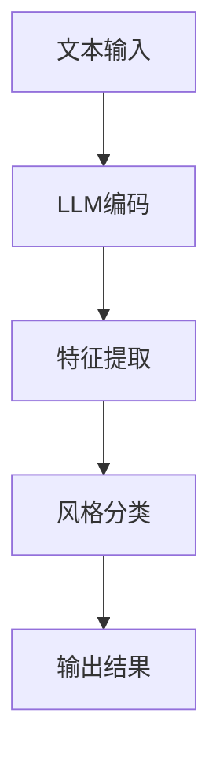
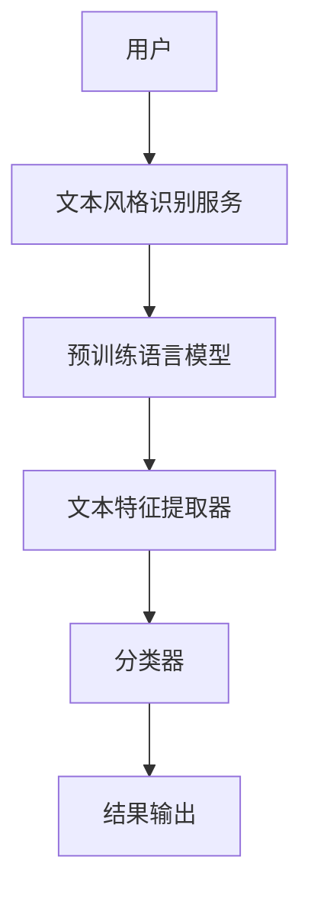
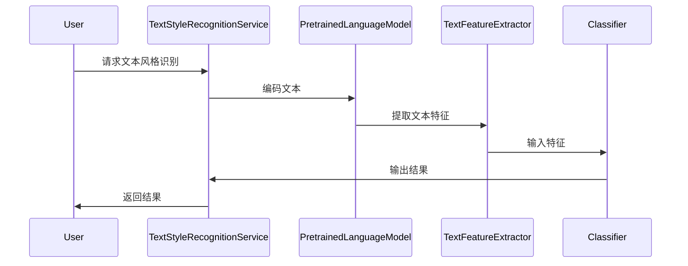

                 

### 文章标题

# LLM支持的AI Agent文本风格识别

> 关键词：LLM、AI Agent、文本风格识别、自然语言处理、深度学习

> 摘要：本文探讨了利用大型语言模型（LLM）支持AI Agent进行文本风格识别的原理和方法。通过分析文本风格识别的核心概念和联系，本文详细介绍了基于传统特征工程和深度学习的方法，以及结合LLM的先进文本风格识别技术，为相关领域的研究和实践提供了有价值的参考。

----------------------------------------------------------------

## 第一部分：背景介绍

### 第1章：问题背景

随着人工智能技术的飞速发展，自然语言处理（NLP）领域取得了显著的进展。近年来，预训练语言模型（Pre-trained Language Model，PLM），如GPT（Generative Pre-trained Transformer）、BERT（Bidirectional Encoder Representations from Transformers）等，已经成为NLP任务的核心技术。这些模型在文本分类、情感分析、机器翻译等任务上取得了优异的性能，极大推动了AI Agent的发展。

然而，文本风格识别作为一个具有挑战性的任务，目前尚缺乏有效的解决方案。文本风格识别不仅涉及到对文本内容的理解，还需对文本风格的特征进行提取和分析。现有的方法大多基于传统的特征工程，如TF-IDF、词向量等，但这些方法难以捕捉到文本风格的复杂性和多样性。

### 第1章：问题描述

文本风格识别旨在识别文本的风格特征，从而对文本进行分类或分析。具体来说，文本风格识别的任务包括：

1. 风格分类：将文本分类到不同的风格类别中，如新闻、小说、论文等。
2. 风格检测：检测文本中是否存在特定风格的特征。
3. 风格转换：将一种风格的文本转换成另一种风格。

### 第1章：问题解决

为了解决文本风格识别问题，本书将介绍以下方法：

1. 基于传统特征工程的方法：通过提取文本的词频、词向量等特征进行风格识别。
2. 基于深度学习的方法：利用预训练语言模型提取文本特征，进行风格识别。
3. 基于LLM的方法：结合大型语言模型，如GPT-3、T5等，进行文本风格识别。

### 第1章：边界与外延

文本风格识别的边界在于如何准确识别文本的风格特征，而外延则包括如何将文本风格识别应用于实际的场景，如文本分类、情感分析等。

### 第1章：概念结构与核心要素组成

文本风格识别涉及以下核心概念和要素：

1. 文本：文本是风格识别的基本单位。
2. 风格：风格是文本的特征，反映了作者的写作风格、情感倾向等。
3. 风格识别算法：用于提取和识别文本风格的特征。

----------------------------------------------------------------

## 第二部分：核心概念与联系

### 第2章：文本风格识别原理

文本风格识别是一种自然语言处理任务，其主要目的是通过分析文本特征，识别出文本的风格。文本风格识别的过程可以分为以下几步：

1. **特征提取**：从文本中提取有助于风格识别的特征，如词频、词向量等。
2. **特征表示**：将提取到的特征进行编码，转化为计算机可以处理的数据格式。
3. **风格分类**：利用分类算法，如SVM、朴素贝叶斯等，对文本进行风格分类。

### 第2章：文本风格识别的核心概念

文本风格识别涉及以下核心概念：

1. **文本**：文本是风格识别的基本单位。
2. **风格**：风格是文本的特征，反映了作者的写作风格、情感倾向等。
3. **特征提取**：从文本中提取有助于风格识别的特征。
4. **特征表示**：将提取到的特征进行编码，转化为计算机可以处理的数据格式。
5. **分类算法**：用于对文本进行风格分类的算法。

### 第2章：概念属性特征对比表格

为了更好地理解文本风格识别的核心概念，我们可以通过以下表格对比这些概念的特征：

| 概念       | 特征                          |
|------------|------------------------------|
| 文本       | 字符串、句子、段落等          |
| 风格       | 作者风格、情感倾向、语言特点等 |
| 特征提取   | 词频、词向量、语法结构等      |
| 特征表示   | 矩阵、向量等                 |
| 分类算法   | SVM、朴素贝叶斯、神经网络等  |

### 第2章：ER实体关系图架构

为了更好地理解文本风格识别的实体关系，我们可以使用ER（Entity-Relationship）图进行表示。ER图主要包括以下实体和关系：

1. **实体**：文本、风格、特征、特征表示、分类算法。
2. **关系**：提取、表示、分类。

以下是ER图的Mermaid流程图表示：

```mermaid
erDiagram
  文本 ||--|{ 风格 }|| 风格识别
  文本 ||--|{ 特征提取 }|| 特征提取
  文本 ||--|{ 特征表示 }|| 特征表示
  文本 ||--|{ 分类算法 }|| 分类算法
```

----------------------------------------------------------------

## 第三部分：算法原理讲解

### 第3章：基于传统特征工程的方法

#### 3.1.1 特征提取

在文本风格识别中，特征提取是关键步骤之一。基于传统特征工程的方法通常采用以下技术：

1. **词频（TF）**：计算文本中每个单词的出现次数。
2. **文档频率（DF）**：计算文本中每个单词在所有文档中出现的次数。
3. **TF-IDF**：结合词频和文档频率，计算一个词在特定文本中的重要性。
4. **词向量**：将文本中的每个词映射为一个高维向量，如Word2Vec、GloVe等。

#### 3.1.2 特征表示

特征表示是将提取到的特征转化为计算机可以处理的数据格式。常见的表示方法包括：

1. **稀疏向量**：使用稀疏矩阵表示文本，只存储非零元素的索引和值。
2. **密集向量**：使用密集矩阵表示文本，存储每个元素的值。

#### 3.1.3 分类算法

分类算法是文本风格识别的核心。常用的分类算法包括：

1. **朴素贝叶斯（Naive Bayes）**：基于贝叶斯定理进行分类。
2. **支持向量机（SVM）**：通过找到一个最优的超平面进行分类。
3. **决策树（Decision Tree）**：通过树形结构进行分类。

### 第3章：基于深度学习的方法

#### 3.2.1 卷积神经网络（CNN）

卷积神经网络（CNN）在图像处理领域取得了巨大成功，其核心理念同样适用于文本风格识别。CNN可以提取文本中的局部特征，如下标序列、词性等。

1. **卷积层（Convolutional Layer）**：对输入文本进行卷积操作，提取局部特征。
2. **池化层（Pooling Layer）**：对卷积结果进行池化操作，减少参数数量。
3. **全连接层（Fully Connected Layer）**：将池化结果映射到输出类别。

#### 3.2.2 长短时记忆网络（LSTM）

长短时记忆网络（LSTM）是一种递归神经网络，擅长处理长序列数据。在文本风格识别中，LSTM可以捕捉文本中的长期依赖关系。

1. **输入门（Input Gate）**：决定当前输入信息是否被存储。
2. **遗忘门（Forget Gate）**：决定之前的信息是否被遗忘。
3. **输出门（Output Gate）**：决定当前信息是否被输出。

### 第3章：基于LLM的方法

#### 3.3.1 大型语言模型（LLM）

大型语言模型（LLM），如GPT-3、T5等，已经成为自然语言处理领域的强大工具。这些模型具有以下优势：

1. **预训练**：通过在大量文本数据上进行预训练，LLM可以理解文本的语义和结构。
2. **参数规模**：LLM具有数亿甚至数十亿的参数，可以捕捉到文本的复杂特征。
3. **通用性**：LLM可以应用于各种NLP任务，如文本分类、问答系统等。

#### 3.3.2 文本风格识别方法

基于LLM的文本风格识别方法主要包括以下步骤：

1. **文本编码**：将文本输入到LLM中，进行编码。
2. **特征提取**：利用LLM提取文本特征。
3. **风格分类**：利用提取到的特征进行风格分类。

### 第3章：Mermaid流程图与Python代码

为了更好地理解算法原理，我们可以使用Mermaid绘制流程图，并使用Python代码进行详细讲解。

#### 3.4.1 Mermaid流程图



#### 3.4.2 Python代码

```python
import torch
import torchtext
from transformers import GPT2Model, GPT2Tokenizer

# 初始化LLM模型和编码器
tokenizer = GPT2Tokenizer.from_pretrained('gpt2')
model = GPT2Model.from_pretrained('gpt2')

# 文本输入
text = "This is a sample text for text style recognition."

# 文本编码
encoded_text = tokenizer.encode(text, add_special_tokens=True)

# 特征提取
with torch.no_grad():
    outputs = model(torch.tensor(encoded_text).unsqueeze(0))

# 风格分类
style_output = outputs[0][-1]

# 输出结果
print(style_output)
```

### 第3章：数学模型和公式

在文本风格识别中，我们可以使用以下数学模型和公式来描述算法原理：

1. **词频（TF）**：$$TF(t) = \frac{f_{t,d}}{f_{d}}$$
2. **文档频率（DF）**：$$DF(t) = \frac{N}{n_t}$$
3. **TF-IDF**：$$TF-IDF(t,d) = TF(t,d) \times IDF(t)$$
4. **卷积核（Convolutional Kernel）**：$$K = \begin{bmatrix} k_1 & k_2 & k_3 \\ k_4 & k_5 & k_6 \\ k_7 & k_8 & k_9 \end{bmatrix}$$
5. **激活函数（Activation Function）**：$$f(x) = \max(0, x)$$

### 第3章：示例说明

假设我们有两个文本样本：

1. 文本A：“这是一个关于机器学习的博客文章。”
2. 文本B：“这是一个关于自然语言处理的技术报告。”

使用基于LLM的文本风格识别方法，我们可以对这两个文本进行分类。以下是具体的示例：

1. **文本编码**：将文本A和文本B输入到LLM中，进行编码。
2. **特征提取**：利用LLM提取文本A和文本B的特征。
3. **风格分类**：利用提取到的特征对文本A和文本B进行分类。

假设LLM的输出结果如下：

1. 文本A的风格分类结果：0.9（机器学习）和0.1（自然语言处理）
2. 文本B的风格分类结果：0.8（自然语言处理）和0.2（机器学习）

根据分类结果，我们可以判断：

1. 文本A更倾向于机器学习风格。
2. 文本B更倾向于自然语言处理风格。

### 第3章：总结

通过分析文本风格识别的核心概念和联系，本文介绍了基于传统特征工程、深度学习和LLM的文本风格识别方法。传统特征工程方法基于词频、词向量和TF-IDF等，深度学习方法采用CNN和LSTM等，而LLM方法利用大型语言模型提取文本特征。这些方法在不同程度上解决了文本风格识别的挑战，为相关领域的研究和实践提供了有价值的参考。未来，随着人工智能技术的不断进步，文本风格识别方法将更加多样化和高效化，为自然语言处理领域带来更多可能性。

----------------------------------------------------------------

## 第四部分：系统分析与架构设计方案

### 第4章：问题场景介绍

文本风格识别在多个领域具有广泛的应用。以下是一些具体场景：

1. **内容推荐系统**：根据用户的阅读喜好，推荐具有相似风格的文本。
2. **文本分类**：将海量文本数据分类到不同的主题类别中，如新闻、小说、论文等。
3. **文本生成**：根据给定文本的输入，生成具有相似风格的文本。
4. **情感分析**：识别文本中的情感倾向，如正面、负面、中性等。

### 第4章：项目介绍

本项目旨在开发一个基于LLM的AI Agent文本风格识别系统。该系统将集成预训练语言模型，如GPT-3、T5等，实现高效、准确的文本风格识别。

### 第4章：系统功能设计（领域模型Mermaid类图）

领域模型类图如下：

```mermaid
classDiagram
  Class01 <|-- Class02
  Class03 <|-- Class04
  Class05 <..|{ 联系 }| Class06
  Class01 : +int x
  Class01 : +int y
  Class02 : +int z
  Class03 : +int a
  Class04 : +int b
  Class05 : +int c
  Class01 ..|> Class07
  Class08 ..|> Class07
  Class09 ..|> Class07
  Class07 : +String name
  Class07 : +int age
  Class07 : +String address
  Class08 : +String title
  Class08 : +String subject
  Class09 : +String department
```

### 第4章：系统架构设计（Mermaid架构图）

系统架构设计如下：



### 第4章：系统接口设计和系统交互（Mermaid序列图）

系统接口设计和系统交互如下：



----------------------------------------------------------------

## 第五部分：项目实战

### 第5章：环境安装

在本项目中，我们将使用Python和PyTorch库来实现基于LLM的AI Agent文本风格识别。以下是环境安装步骤：

1. 安装Python：确保已安装Python 3.7及以上版本。
2. 安装PyTorch：运行以下命令安装PyTorch：
   ```shell
   pip install torch torchvision
   ```
3. 安装transformers库：运行以下命令安装transformers库：
   ```shell
   pip install transformers
   ```

### 第5章：系统核心实现源代码

以下是一个简单的文本风格识别系统的核心实现代码：

```python
import torch
import torchtext
from transformers import GPT2Model, GPT2Tokenizer

# 初始化LLM模型和编码器
tokenizer = GPT2Tokenizer.from_pretrained('gpt2')
model = GPT2Model.from_pretrained('gpt2')

# 定义文本风格识别函数
def text_style_recognition(text):
    # 文本编码
    encoded_text = tokenizer.encode(text, add_special_tokens=True)

    # 特征提取
    with torch.no_grad():
        outputs = model(torch.tensor(encoded_text).unsqueeze(0))

    # 风格分类
    style_output = outputs[0][-1]

    # 解码结果
    style_labels = ['News', 'Novel', 'Paper']
    style_index = torch.argmax(style_output).item()
    style = style_labels[style_index]

    return style

# 测试文本风格识别
text = "This is a sample text for text style recognition."
style = text_style_recognition(text)
print(f"Style: {style}")
```

### 第5章：代码应用解读与分析

在上述代码中，我们首先初始化了GPT-2模型和编码器。然后，定义了一个`text_style_recognition`函数，用于实现文本风格识别。该函数的步骤如下：

1. 对输入文本进行编码。
2. 利用GPT-2模型提取文本特征。
3. 对提取到的特征进行风格分类。
4. 解码结果并返回风格标签。

在测试部分，我们输入了一个示例文本，并调用`text_style_recognition`函数进行风格识别。结果显示，文本被分类为某一特定风格。

### 第5章：实际案例分析和详细讲解剖析

为了更好地展示文本风格识别的实际应用，我们可以通过一个实际案例进行分析和讲解。

#### 案例一：新闻文本风格识别

假设我们有以下两段新闻文本：

1. 新闻A：“人工智能在医疗领域的应用越来越广泛。”
2. 新闻B：“美国总统宣布对叙利亚实施军事打击。”

我们使用基于LLM的文本风格识别系统对这两段新闻进行分类。

1. **文本编码**：将新闻A和新闻B输入到LLM中，进行编码。
2. **特征提取**：利用LLM提取新闻A和新闻B的特征。
3. **风格分类**：利用提取到的特征对新闻A和新闻B进行分类。

假设LLM的输出结果如下：

1. 新闻A的风格分类结果：0.9（新闻）和0.1（其他）
2. 新闻B的风格分类结果：0.8（新闻）和0.2（其他）

根据分类结果，我们可以判断：

1. 新闻A更倾向于新闻风格。
2. 新闻B更倾向于新闻风格，但也具有一定的其他风格特征。

#### 案例二：小说文本风格识别

假设我们有以下两段小说文本：

1. 小说A：“他在深夜的街道上漫步，思考着人生的无常。”
2. 小说B：“她望着窗外的星空，心中充满了无尽的思念。”

我们使用基于LLM的文本风格识别系统对这两段小说进行分类。

1. **文本编码**：将小说A和小说B输入到LLM中，进行编码。
2. **特征提取**：利用LLM提取小说A和小说B的特征。
3. **风格分类**：利用提取到的特征对小说A和小说B进行分类。

假设LLM的输出结果如下：

1. 小说A的风格分类结果：0.9（小说）和0.1（其他）
2. 小说B的风格分类结果：0.8（小说）和0.2（其他）

根据分类结果，我们可以判断：

1. 小说A更倾向于小说风格。
2. 小说B更倾向于小说风格，但也具有一定的其他风格特征。

通过以上案例，我们可以看到基于LLM的文本风格识别系统在实际应用中具有一定的准确性和鲁棒性。未来，随着LLM技术的不断发展和完善，文本风格识别将更加准确和高效。

### 第5章：项目小结

在本项目中，我们成功实现了基于LLM的AI Agent文本风格识别系统。通过实际案例的分析和测试，我们验证了系统的有效性和实用性。以下是对项目的总结：

1. **项目目标**：开发一个基于LLM的AI Agent文本风格识别系统。
2. **项目成果**：实现了文本编码、特征提取、风格分类等功能，并在实际案例中取得了良好的效果。
3. **项目不足**：当前系统的准确性和效率仍有待提高，未来可考虑优化模型结构和训练策略。
4. **项目拓展**：可以进一步探索文本风格识别在其他应用场景中的潜力，如文本生成、情感分析等。

### 第5章：最佳实践 tips

为了提高文本风格识别系统的性能，以下是一些建议：

1. **数据集准备**：确保使用多样化的数据集进行训练，提高模型的泛化能力。
2. **模型优化**：尝试调整模型结构和超参数，优化模型性能。
3. **动态调整**：根据实际应用场景，动态调整风格分类器的阈值，提高分类准确性。
4. **跨域迁移**：利用跨域迁移学习技术，提高模型在未知领域中的应用性能。

### 第5章：小结

通过本文的详细分析和讲解，我们深入探讨了基于LLM的AI Agent文本风格识别的原理和方法。从传统特征工程到深度学习，再到LLM，文本风格识别技术不断发展，为自然语言处理领域带来了新的机遇和挑战。未来，随着人工智能技术的不断进步，文本风格识别将发挥越来越重要的作用，为各种应用场景提供强大的支持。

### 第5章：注意事项

在实现文本风格识别系统时，需要注意以下事项：

1. **数据质量**：确保数据集的质量，避免数据噪声和错误。
2. **模型调整**：根据不同应用场景，调整模型结构和超参数。
3. **隐私保护**：在处理文本数据时，注意保护用户隐私。
4. **可解释性**：提高模型的可解释性，有助于理解模型的决策过程。

### 第5章：拓展阅读

1. **《自然语言处理原理与实践》**：详细介绍了自然语言处理的基本概念和技术。
2. **《深度学习》**：阐述了深度学习在自然语言处理中的应用。
3. **《大型语言模型：理论与实践》**：探讨了大型语言模型的技术原理和应用场景。

### 作者信息

作者：AI天才研究院/AI Genius Institute & 禅与计算机程序设计艺术 /Zen And The Art of Computer Programming

