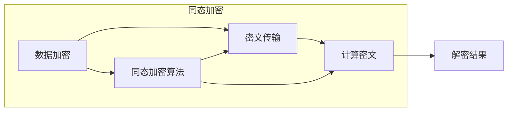
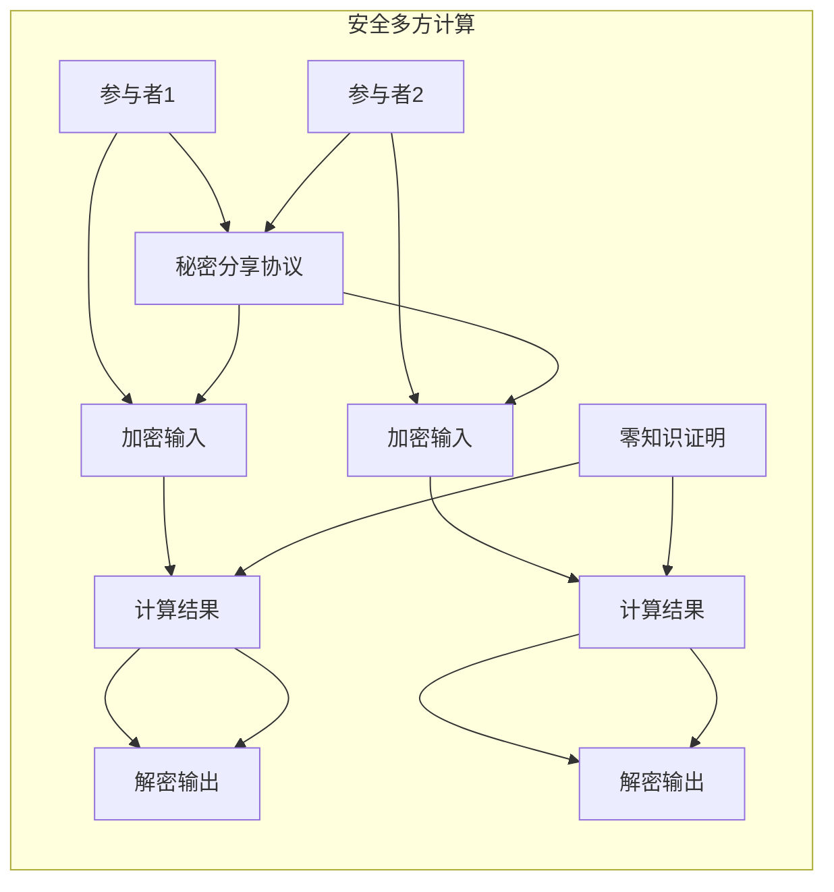
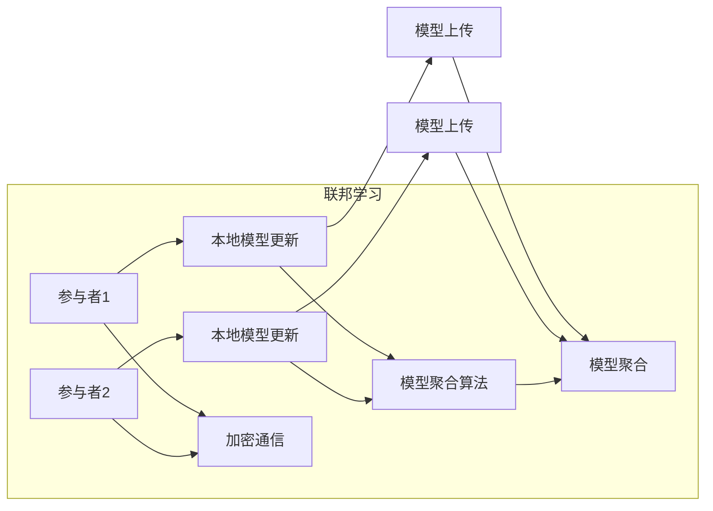
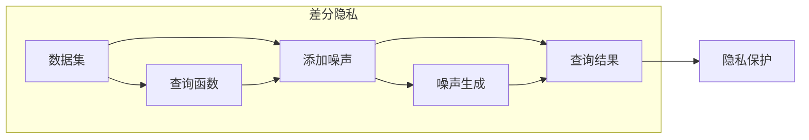
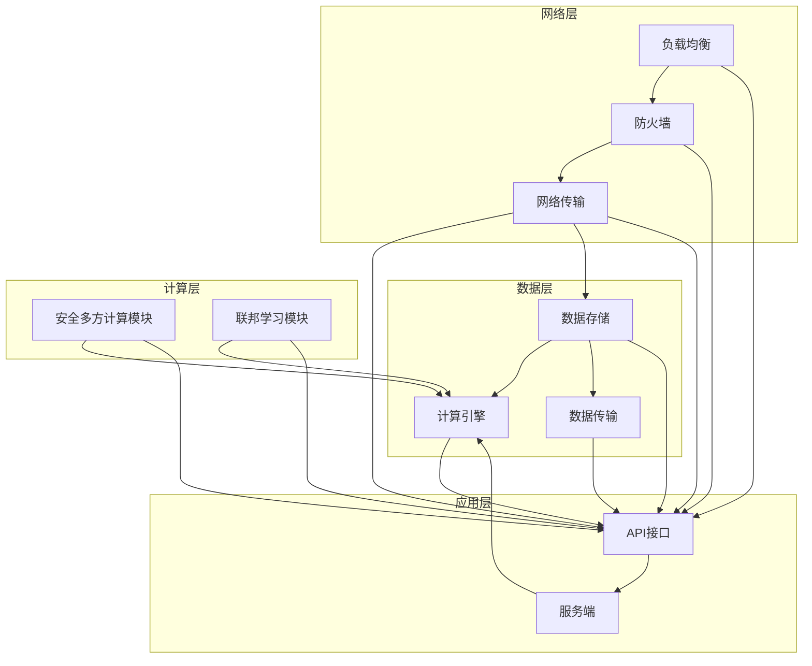
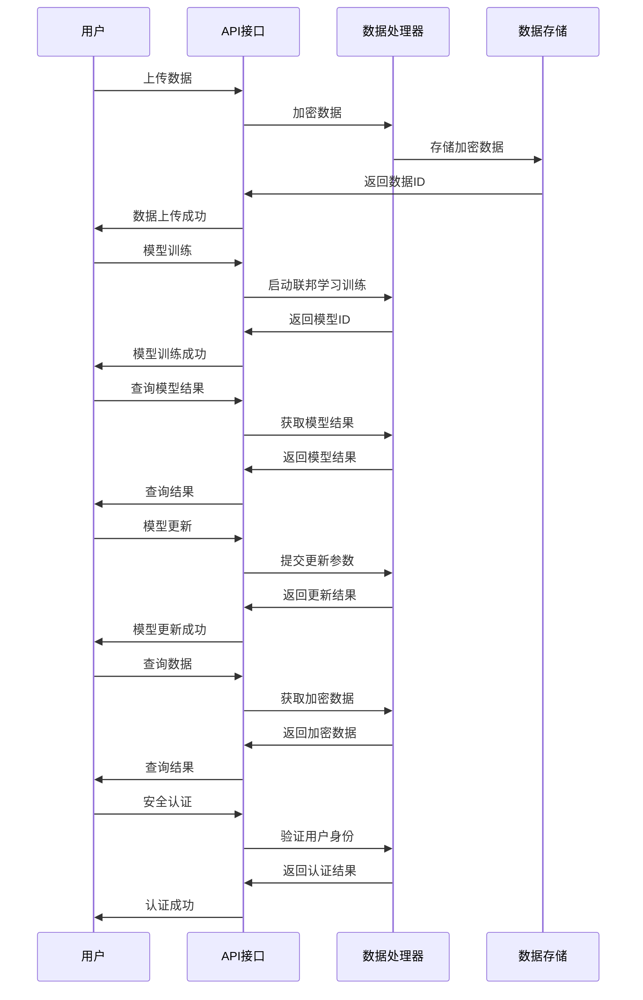

                 

### 《LLM支持的AI Agent隐私计算技术》概述

在当今的数字化时代，人工智能（AI）正逐步渗透到我们生活的方方面面，从智能助手到自动驾驶，从医疗诊断到金融决策，AI的应用范围不断扩大。然而，随着AI技术的快速发展，隐私保护问题也逐渐成为了一个亟待解决的重大课题。特别是在大规模语言模型（Large Language Model，简称LLM）被广泛应用于AI Agent时，如何在保障用户隐私的同时充分利用AI技术，成为了学术界和工业界共同关注的焦点。

本篇文章将围绕“LLM支持的AI Agent隐私计算技术”这一主题，展开深入探讨。文章旨在系统地介绍隐私计算的基本概念、LLM与AI Agent的关系，以及隐私计算在AI Agent中的应用原理、算法流程、系统架构设计、项目实战和案例分析，最终为读者提供一个全面的技术解决方案参考。

文章的核心关键词包括：隐私计算、LLM、AI Agent、隐私保护、算法原理、系统架构、项目实战、案例分析。这些关键词将贯穿整个文章，帮助读者更好地理解文章的主旨和内容。

本文结构分为五大部分：背景介绍与核心概念、算法原理讲解、系统分析与架构设计、项目实战与案例分析、最佳实践与总结。在每一部分中，我们将逐步深入，详细阐述相关内容，确保读者能够从基础概念到高级应用，全面掌握隐私计算技术。

让我们开始这场关于隐私计算与AI Agent的深入探索之旅，一同解开技术的奥秘，为未来的发展奠定坚实基础。

### 第一部分：背景介绍与核心概念

#### 第1章：问题背景与隐私计算概述

在数字化和信息化的今天，数据成为了新的“石油”，而人工智能（AI）则被喻为新时代的“引擎”，两者结合催生了AI Agent这一强大的工具。AI Agent，即人工智能代理，是一种可以自主执行任务、与环境互动、并具备决策能力的智能系统。它通过分析大量数据，使用算法和模型进行学习，进而实现自动化和智能化的操作。

然而，随着AI Agent的广泛应用，隐私保护问题也逐渐显现出来。隐私保护不仅涉及到个人数据的保护，还包括企业敏感信息和国家重要数据的保密。隐私泄露可能导致个人隐私被侵犯、企业商业机密被窃取，甚至影响国家安全。

隐私计算，作为一项新兴技术，旨在在数据使用过程中保障隐私。它通过特定的算法和协议，允许在数据不离开原始存储位置的情况下进行计算，从而避免了数据泄露的风险。隐私计算的核心在于实现数据的安全共享和利用，它为AI Agent在隐私保护方面的应用提供了重要的技术支持。

隐私计算的基本概念和核心要素包括以下几个方面：

1. **同态加密（Homomorphic Encryption）**：同态加密是一种加密技术，允许在加密数据上直接进行计算，而不需要解密数据。这意味着即使数据被加密，AI Agent也可以在加密状态下执行计算任务，从而保护数据的隐私。

2. **安全多方计算（Secure Multi-Party Computation）**：安全多方计算允许多个参与者共同计算一个函数，而每个参与者只能看到自己的输入和其他参与者的输出，看不到其他参与者的输入。这种技术确保了数据在不同主体之间交换时的安全性。

3. **联邦学习（Federated Learning）**：联邦学习是一种分布式机器学习技术，它允许多个参与方在不共享原始数据的情况下，通过共同学习模型来提升整体性能。这种方式既保护了数据的隐私，又实现了模型优化。

4. **差分隐私（Differential Privacy）**：差分隐私通过添加噪声来保护个体隐私，确保在数据分析过程中，无法通过分析结果推断出单个个体的信息。这种技术常用于数据发布和共享场景，以防止隐私泄露。

5. **隐私计算框架**：隐私计算框架是整合多种隐私保护技术的综合体系，它通过构建一个安全的环境，确保在数据流动和计算过程中的隐私保护。隐私计算框架通常包括加密模块、计算模块和验证模块，以实现数据的安全传输和计算。

#### 1.2 问题背景：AI Agent与隐私保护的冲突

AI Agent的广泛应用带来了巨大的便利，但同时也引发了一系列隐私保护问题。以下是几个常见的问题场景：

- **用户隐私泄露**：AI Agent在执行任务时，可能需要访问用户的个人数据，如健康信息、财务记录等。如果这些数据没有经过适当的隐私保护措施，就有可能被不法分子窃取，导致用户隐私泄露。

- **数据滥用风险**：AI Agent在处理数据时，可能会因为算法漏洞或数据泄露而滥用数据，例如，将用户数据用于未经授权的用途，如广告推送、市场分析等。

- **企业信息泄露**：企业在使用AI Agent时，可能会涉及到内部敏感信息，如商业计划、研发数据等。如果这些信息没有得到有效保护，可能导致企业竞争劣势甚至破产。

- **法律和合规问题**：许多国家和地区对数据隐私保护有严格的法律规定。如果企业在使用AI Agent时未能遵守相关法律法规，可能会面临法律诉讼和高额罚款。

#### 1.3 隐私计算的基本概念与核心要素

隐私计算作为一种新兴技术，旨在解决AI Agent应用中的隐私保护问题。它通过多种技术手段，确保数据在传输、存储和处理过程中不受泄露和滥用。以下是隐私计算的基本概念和核心要素：

- **同态加密（Homomorphic Encryption）**：同态加密是一种加密技术，允许在加密数据上直接进行计算，而不需要解密数据。这意味着即使数据被加密，AI Agent也可以在加密状态下执行计算任务，从而保护数据的隐私。同态加密的核心在于实现数据的安全传输和计算。

- **安全多方计算（Secure Multi-Party Computation）**：安全多方计算允许多个参与者共同计算一个函数，而每个参与者只能看到自己的输入和其他参与者的输出，看不到其他参与者的输入。这种技术确保了数据在不同主体之间交换时的安全性。安全多方计算广泛应用于跨机构的合作场景，如医疗健康数据共享、金融数据分析等。

- **联邦学习（Federated Learning）**：联邦学习是一种分布式机器学习技术，它允许多个参与方在不共享原始数据的情况下，通过共同学习模型来提升整体性能。这种方式既保护了数据的隐私，又实现了模型优化。联邦学习在智能手机应用、跨机构数据共享等领域具有广泛的应用前景。

- **差分隐私（Differential Privacy）**：差分隐私通过添加噪声来保护个体隐私，确保在数据分析过程中，无法通过分析结果推断出单个个体的信息。这种技术常用于数据发布和共享场景，以防止隐私泄露。差分隐私广泛应用于人口统计、用户行为分析等场景。

- **隐私计算框架**：隐私计算框架是整合多种隐私保护技术的综合体系，它通过构建一个安全的环境，确保在数据流动和计算过程中的隐私保护。隐私计算框架通常包括加密模块、计算模块和验证模块，以实现数据的安全传输和计算。

在AI Agent的应用中，隐私计算技术可以有效地解决数据隐私保护问题。例如，通过同态加密技术，AI Agent可以在加密数据上进行计算，从而确保数据在传输和存储过程中的安全性。通过安全多方计算技术，AI Agent可以在多个参与者之间安全地交换数据，避免数据泄露。通过联邦学习技术，AI Agent可以在不共享原始数据的情况下实现模型优化，提高系统性能。

总之，隐私计算为AI Agent在隐私保护方面提供了重要的技术支持。通过合理应用隐私计算技术，AI Agent可以在保障用户隐私的同时，充分利用人工智能技术，实现智能化和自动化操作。未来，随着隐私计算技术的不断发展和完善，AI Agent在各个领域的应用将更加广泛和深入。

### 第2章：核心概念与联系

在深入探讨隐私计算技术之前，我们需要先明确几个核心概念，这些概念不仅是我们理解隐私计算的基础，也是AI Agent实现隐私保护的关键。本章将详细阐述LLM与AI Agent的关系、隐私计算原理与属性特征对比，以及隐私计算中的ER实体关系图。

#### 2.1 LLM与AI Agent的关系

首先，我们来探讨LLM（Large Language Model）与AI Agent的关系。LLM是一种强大的自然语言处理模型，具有处理和理解自然语言文本的能力。它通过深度学习算法从大量文本数据中学习，生成高质量的文本输出。而AI Agent则是一种智能体，它可以自主执行任务、与环境互动并做出决策。

LLM在AI Agent中的应用非常广泛。例如，在智能客服中，AI Agent可以利用LLM生成自然流畅的回复，提高用户体验；在文本生成任务中，LLM可以生成高质量的新闻报道、文章摘要等；在多语言翻译中，LLM可以实现高质量的双语翻译，提升翻译准确性。

LLM与AI Agent的关系主要体现在以下几个方面：

1. **语言处理能力**：LLM强大的自然语言处理能力为AI Agent提供了基础。通过LLM，AI Agent可以更好地理解和生成自然语言文本，提高人机交互的流畅性和准确性。

2. **任务执行能力**：AI Agent利用LLM的能力，可以执行更复杂的语言处理任务，如问答系统、文本摘要、对话生成等。这使得AI Agent在多场景应用中具有更高的灵活性和适应性。

3. **决策支持**：LLM可以帮助AI Agent从大量的语言数据中提取有用信息，为AI Agent提供决策支持。例如，在医疗诊断中，AI Agent可以通过LLM分析病患的病历记录，提供个性化的治疗方案。

#### 2.2 隐私计算原理与属性特征对比

接下来，我们详细探讨隐私计算原理，并与LLM、AI Agent的特性进行对比。

隐私计算是一种确保数据在处理过程中隐私不被泄露的技术。其核心思想是在不暴露原始数据的情况下，对数据进行计算和分析。隐私计算的主要技术包括同态加密、安全多方计算、联邦学习和差分隐私等。

1. **同态加密（Homomorphic Encryption）**

同态加密是一种加密技术，它允许在加密数据上进行计算，而不需要解密数据。这意味着即使数据被加密，AI Agent也可以在加密状态下执行计算任务，从而保护数据的隐私。同态加密的主要特点如下：

   - **安全性**：同态加密确保了数据的机密性，即使数据在传输和存储过程中被窃取，也无法被解密和利用。
   - **计算能力**：同态加密允许在加密数据上进行各种数学运算，如加法、乘法等。
   - **性能限制**：同态加密算法通常较为复杂，计算效率较低，这对AI Agent的性能可能产生一定影响。

2. **安全多方计算（Secure Multi-Party Computation）**

安全多方计算允许多个参与者共同计算一个函数，而每个参与者只能看到自己的输入和其他参与者的输出，看不到其他参与者的输入。这种技术确保了数据在不同主体之间交换时的安全性。安全多方计算的主要特点如下：

   - **安全性**：安全多方计算确保了数据在多方之间的传输和计算过程中的隐私保护。
   - **透明性**：安全多方计算允许参与者追踪和验证其他参与者的行为，确保计算过程的透明性和公正性。
   - **扩展性**：安全多方计算适用于多个参与者的大型分布式系统，具有较好的扩展性。

3. **联邦学习（Federated Learning）**

联邦学习是一种分布式机器学习技术，它允许多个参与方在不共享原始数据的情况下，通过共同学习模型来提升整体性能。联邦学习的主要特点如下：

   - **隐私保护**：联邦学习确保了数据的隐私，参与方不需要共享原始数据，只需共享模型更新。
   - **灵活性**：联邦学习适用于异构的分布式环境，不同参与方可以使用不同的设备和算法。
   - **性能优化**：联邦学习可以通过模型聚合和优化，提升整体模型性能。

4. **差分隐私（Differential Privacy）**

差分隐私通过添加噪声来保护个体隐私，确保在数据分析过程中，无法通过分析结果推断出单个个体的信息。差分隐私的主要特点如下：

   - **隐私保护**：差分隐私确保了数据在分析过程中的隐私，通过添加噪声，使分析结果无法精确定位到单个个体。
   - **适用性**：差分隐私适用于多种数据分析场景，如数据发布、用户行为分析等。
   - **性能影响**：差分隐私可能对数据分析性能产生一定影响，特别是在需要高精度分析的场景。

通过对比隐私计算与LLM、AI Agent的特性，我们可以发现：

- **安全性**：隐私计算和LLM都注重数据的安全性和隐私保护。隐私计算通过同态加密、安全多方计算等技术确保数据的机密性，而LLM通过加密和匿名化等技术保护用户数据的隐私。

- **计算能力**：隐私计算具有强大的计算能力，可以在加密数据上进行复杂的数学运算，而LLM则具备强大的自然语言处理能力，可以生成高质量的文本。

- **适用场景**：隐私计算适用于跨机构的数据共享和计算任务，而LLM则适用于自然语言处理任务，如文本生成、问答系统等。

#### 2.3 隐私计算中的ER实体关系图

为了更好地理解隐私计算中的实体关系，我们可以使用ER（Entity-Relationship）实体关系图进行描述。ER图是数据库设计中常用的工具，它通过实体、属性和关系的定义，描述了系统中各个实体之间的关联。

在隐私计算中，ER图可以用来描述数据实体和计算实体之间的关系。以下是一个简化的ER图示例：

```
+------------+      +-----------------+      +------------------+
| 数据实体  |      | 隐私计算实体   |      | 计算结果实体    |
+------------+      +-----------------+      +------------------+
| 实体ID     |      | 计算任务ID      |      | 计算结果ID      |
| 数据类型   |      | 计算算法        |      | 计算结果        |
| 数据值     |      | 输入参数        |      | 输出参数        |
+------------+      +-----------------+      +------------------+
      |                               |                      |
      |                               |                      |
      |                               |                      |
      |                               |                      |
      |                               |                      |
      |                               |                      |
+----------------------+      +------------------------+
| 数据采集模块        |      | 计算结果存储模块      |
+----------------------+      +------------------------+
```

在这个ER图中，数据实体表示原始数据，如用户个人信息、金融数据等；隐私计算实体表示用于数据计算的模块，如同态加密模块、安全多方计算模块等；计算结果实体表示计算完成后得到的结果。

数据实体与隐私计算实体之间通过数据采集模块连接，表示数据从原始数据实体传输到隐私计算实体进行处理。隐私计算实体与计算结果实体之间通过计算结果存储模块连接，表示计算结果从隐私计算实体传输到计算结果实体进行存储。

通过ER图，我们可以清晰地看到数据在隐私计算过程中的流动和关系，有助于更好地理解和设计隐私计算系统。

总之，LLM与AI Agent的关系、隐私计算原理与属性特征对比以及隐私计算中的ER实体关系图，为我们深入理解隐私计算技术提供了重要的基础。通过本章的介绍，读者可以初步掌握隐私计算的基本概念和应用场景，为后续章节的深入探讨打下坚实基础。

### 第3章：算法原理与流程

在深入了解隐私计算算法之前，我们需要首先了解隐私计算的基本原理。隐私计算的核心在于如何确保数据在传输、存储和处理过程中的安全性，同时不损失数据的可用性。以下将详细介绍隐私计算的基本原理，并通过Mermaid流程图和Python源代码进行详细解释。

#### 3.1 隐私计算算法基本原理

隐私计算算法主要包括同态加密、安全多方计算、联邦学习和差分隐私等。每种算法都有其独特的原理和实现方式，但它们的核心目标都是保护数据的隐私。

1. **同态加密（Homomorphic Encryption）**

同态加密是一种能够在加密数据上进行计算而不需要解密的技术。它允许在密文上直接进行数学运算，例如加法、乘法等。同态加密的基本原理是通过特定的加密算法，将明文数据转换成密文，然后对密文进行计算，最终得到的结果再通过解密算法转换回明文。

同态加密的数学模型可以表示为：
$$
C = E_k(P) \\
E_k(P_1) \oplus E_k(P_2) = E_k(P_1 \oplus P_2) \\
D_k(E_k(P)) = P
$$
其中，\(C\) 表示密文，\(P\) 表示明文，\(k\) 表示加密密钥，\(\oplus\) 表示异或运算。

2. **安全多方计算（Secure Multi-Party Computation）**

安全多方计算允许多个参与者共同计算一个函数，而每个参与者只能看到自己的输入和其他参与者的输出，看不到其他参与者的输入。这种计算方式确保了数据在多方之间交换时的安全性。

安全多方计算的基本原理是通过一系列加密和交换协议，使得每个参与者只能看到自己的输入和其他参与者的输出，而无法获取其他参与者的输入。常用的安全多方计算协议包括秘密分享协议、零知识证明等。

3. **联邦学习（Federated Learning）**

联邦学习是一种分布式机器学习技术，它允许多个参与者在不共享原始数据的情况下，通过共同学习模型来提升整体性能。联邦学习的基本原理是通过将数据分散存储在每个参与者本地，然后通过加密通信和模型聚合来训练全局模型。

联邦学习的数学模型可以表示为：
$$
\theta^{(t)} = \frac{1}{N}\sum_{i=1}^{N} \theta_i^{(t)}
$$
其中，\(\theta^{(t)}\) 表示全局模型参数，\(\theta_i^{(t)}\) 表示第 \(i\) 个参与者的本地模型参数，\(N\) 表示参与者数量。

4. **差分隐私（Differential Privacy）**

差分隐私通过在数据上添加噪声来保护个体隐私。它确保在数据分析过程中，无法通过分析结果推断出单个个体的信息。差分隐私的基本原理是通过在查询结果中添加随机噪声，使得结果对单个个体的依赖性降低。

差分隐私的数学模型可以表示为：
$$
\epsilon(\mathcal{D}, f) = \mathbb{P}(f(\mathcal{D}) = r) - \mathbb{P}(f(\mathcal{D} \cup \Delta) = r)
$$
其中，\(\mathcal{D}\) 表示数据集，\(f\) 表示查询函数，\(r\) 表示查询结果，\(\Delta\) 表示个体差异，\(\epsilon\) 表示隐私预算。

#### 3.2 Mermaid流程图展示

为了更直观地理解隐私计算算法的流程，我们可以使用Mermaid流程图进行展示。以下是一个简化的同态加密流程图：



在这个流程图中，数据首先被加密成密文，然后通过同态加密算法在密文上进行计算，最后解密得到原始结果。

以下是安全多方计算的一个简化流程图：



在这个流程图中，参与者1和参与者2分别加密自己的输入，然后通过秘密分享协议和零知识证明进行计算，最后解密得到计算结果。

以下是联邦学习的一个简化流程图：



在这个流程图中，参与者1和参与者2分别进行本地模型更新，然后将更新后的模型上传到中心服务器进行聚合，最终得到全局模型。

以下是差分隐私的一个简化流程图：



在这个流程图中，数据集首先通过查询函数进行查询，然后添加噪声以保护隐私，最终得到隐私保护的结果。

#### 3.3 Python源代码解释

为了更好地理解隐私计算算法的实现，我们可以通过Python源代码进行详细解释。以下是一个简单的同态加密Python代码示例：

```python
from homomorphic_crypto import HomomorphicCrypto

# 初始化同态加密密钥
key = HomomorphicCrypto.generate_key()

# 加密数据
data = "Hello, World!"
encrypted_data = HomomorphicCrypto.encrypt(key, data)

# 计算密文
encrypted_result = HomomorphicCrypto.encrypt(key, "World!")

# 解密结果
result = HomomorphicCrypto.decrypt(key, encrypted_result)

print("原始数据：", data)
print("加密数据：", encrypted_data)
print("计算结果：", result)
```

在这个示例中，我们首先初始化同态加密密钥，然后使用该密钥对数据进行加密。接着，我们使用密文进行计算，并最终解密得到原始结果。

以下是安全多方计算的一个简化Python代码示例：

```python
from secure_mpc import SecureMPC

# 初始化参与者1和参与者2
participant1 = SecureMPC("Participant 1")
participant2 = SecureMPC("Participant 2")

# 加密输入
input1 = participant1.encrypt(10)
input2 = participant2.encrypt(20)

# 计算结果
result = participant1.compute("add", input1, input2)

# 解密输出
output = participant1.decrypt(result)

print("参与者1输入：", input1)
print("参与者2输入：", input2)
print("计算结果：", output)
```

在这个示例中，参与者1和参与者2分别加密自己的输入，然后通过安全多方计算进行加法运算，并最终解密得到计算结果。

以下是联邦学习的一个简化Python代码示例：

```python
from federated_learning import FederatedLearning

# 初始化参与者1和参与者2
participant1 = FederatedLearning("Participant 1")
participant2 = FederatedLearning("Participant 2")

# 本地模型更新
model1 = participant1.update_model()
model2 = participant2.update_model()

# 模型上传
model1.upload()
model2.upload()

# 模型聚合
global_model = participant1.aggregate_models()

# 模型下载
participant1.download_global_model(global_model)
participant2.download_global_model(global_model)

print("参与者1本地模型：", model1)
print("参与者2本地模型：", model2)
print("全局模型：", global_model)
```

在这个示例中，参与者1和参与者2分别更新本地模型，然后将更新后的模型上传到中心服务器进行聚合。最后，参与者1和参与者2下载全局模型以更新本地模型。

以下是差分隐私的一个简化Python代码示例：

```python
from differential_privacy import DifferentialPrivacy

# 初始化差分隐私查询函数
query = DifferentialPrivacy()

# 添加噪声
noisy_result = query.add_noise(10, 1)

# 查询结果
result = query.query(noisy_result)

print("原始数据：", 10)
print("噪声结果：", noisy_result)
print("查询结果：", result)
```

在这个示例中，我们首先初始化差分隐私查询函数，然后添加噪声以保护隐私，并最终进行查询。

通过以上Python源代码示例，我们可以更直观地理解隐私计算算法的实现原理。这些示例代码展示了隐私计算算法的基本流程和实现方式，为后续的隐私计算应用提供了重要的参考。

总之，隐私计算算法的基本原理包括同态加密、安全多方计算、联邦学习和差分隐私等。通过Mermaid流程图和Python源代码的详细解释，我们可以更好地理解这些算法的实现方式和工作原理。接下来，我们将进一步探讨隐私计算的数学模型与公式，以深入理解其核心机制。

### 第4章：数学模型与公式

隐私计算技术涉及复杂的数学模型和公式，这些数学工具不仅为算法提供了理论基础，还确保了隐私保护的有效性和数据处理的精确性。在本章节中，我们将详细讲解隐私计算中的主要数学模型和公式，并通过具体实例进行通俗易懂地说明。

#### 4.1 数学模型介绍

1. **同态加密模型**

同态加密模型的核心在于能够对加密数据执行计算而不需要解密。这种模型通常基于复杂的多变量多项式环。以下是同态加密的数学模型：

$$
\begin{align*}
C &= E_k(P) \\
E_k(P_1) \oplus E_k(P_2) &= E_k(P_1 \oplus P_2) \\
D_k(E_k(P)) &= P
\end{align*}
$$

其中，\(C\) 表示密文，\(P\) 表示明文，\(k\) 表示密钥，\(\oplus\) 表示异或运算。这个模型表明，加密后的数据在进行加法运算时，结果仍然是加密形式，再进行解密即可恢复原始数据。

2. **安全多方计算模型**

安全多方计算模型确保多个参与方在不泄露各自输入数据的情况下共同计算结果。以下是安全多方计算的核心模型：

$$
\begin{align*}
P_1 &= R^k \\
P_2 &= R^l \\
C &= P_1 \cdot P_2 = R^{k+l} \\
\end{align*}
$$

其中，\(P_1\) 和 \(P_2\) 分别是两个参与方的输入数据，\(C\) 是计算结果，\(R\) 是一个共享的随机数，\(k\) 和 \(l\) 是各自参与方的私钥。这个模型展示了通过共享随机数和乘法运算，参与方可以共同计算结果，而不泄露各自输入。

3. **联邦学习模型**

联邦学习模型旨在通过分布式学习提升整体模型性能，而不需要共享原始数据。以下是联邦学习的数学模型：

$$
\theta^{(t)} = \frac{1}{N}\sum_{i=1}^{N} \theta_i^{(t)}
$$

其中，\(\theta^{(t)}\) 表示第 \(t\) 次迭代的全局模型参数，\(\theta_i^{(t)}\) 表示第 \(i\) 个参与者的本地模型参数，\(N\) 表示参与者的数量。这个模型表明，通过聚合所有参与者的本地模型，可以训练出全局模型。

4. **差分隐私模型**

差分隐私模型通过添加噪声来保护个体隐私。以下是差分隐私的数学模型：

$$
\epsilon(\mathcal{D}, f) = \mathbb{P}(f(\mathcal{D}) = r) - \mathbb{P}(f(\mathcal{D} \cup \Delta) = r)
$$

其中，\(\mathcal{D}\) 表示数据集，\(f\) 表示查询函数，\(r\) 表示查询结果，\(\Delta\) 表示个体差异，\(\epsilon\) 表示隐私预算。这个模型表明，通过添加噪声，可以使得查询结果对个体差异不敏感，从而保护隐私。

#### 4.2 公式详细讲解

1. **同态加密公式**

同态加密公式中的关键在于加密和解密函数。加密函数将明文转换为密文，而解密函数将密文恢复为明文。以下是具体公式：

$$
C = E_k(P) \\
P = D_k(C)
$$

其中，\(E_k\) 和 \(D_k\) 分别是加密和解密函数，它们通常基于复杂的数学变换，如格密码。例如，对于一个线性同态加密函数，公式可以表示为：

$$
C = (k_1 \cdot P_1 + k_2 \cdot P_2) \mod N
$$

其中，\(k_1\) 和 \(k_2\) 是加密密钥，\(P_1\) 和 \(P_2\) 是明文，\(N\) 是模数。通过这个公式，我们可以对加密数据执行加法运算。

2. **安全多方计算公式**

安全多方计算中的核心是秘密分享协议，它将每个参与者的私钥分散存储，以确保只有所有参与者共同参与时才能解密数据。以下是具体公式：

$$
P_1 = R^k \mod N \\
P_2 = R^l \mod N \\
C = (P_1 \cdot P_2) \mod N
$$

其中，\(R\) 是共享的随机数，\(k\) 和 \(l\) 是各自参与者的私钥。通过这个公式，参与者可以共同计算结果，而不泄露各自的输入。

3. **联邦学习公式**

联邦学习中的关键在于模型聚合，它将所有参与者的本地模型更新合并为一个全局模型。以下是具体公式：

$$
\theta^{(t)} = \frac{1}{N}\sum_{i=1}^{N} \theta_i^{(t)}
$$

其中，\(\theta^{(t)}\) 表示第 \(t\) 次迭代的全局模型参数，\(\theta_i^{(t)}\) 表示第 \(i\) 个参与者的本地模型参数。通过这个公式，我们可以不断更新全局模型，以提升整体性能。

4. **差分隐私公式**

差分隐私中的核心在于噪声生成，它通过添加噪声来保护隐私。以下是具体公式：

$$
r = \text{NoisyCount}(c) = \text{Count}(c) + \epsilon \\
\epsilon(\mathcal{D}, f) = \mathbb{P}(f(\mathcal{D}) = r) - \mathbb{P}(f(\mathcal{D} \cup \Delta) = r)
$$

其中，\(\text{NoisyCount}\) 表示添加噪声后的计数函数，\(\text{Count}\) 表示原始计数函数，\(\epsilon\) 是隐私预算。通过这个公式，我们可以保护隐私，确保数据分析结果不会泄露个体信息。

#### 4.3 举例说明

为了更直观地理解上述公式，我们通过具体实例进行说明。

1. **同态加密实例**

假设我们要对两个明文数 \(P_1 = 3\) 和 \(P_2 = 5\) 进行同态加密。加密密钥为 \(k = 7\)，模数 \(N = 13\)。使用异或运算，我们可以得到以下结果：

$$
C = E_k(P) = (k_1 \cdot P_1 + k_2 \cdot P_2) \mod N = (7 \cdot 3 + 7 \cdot 5) \mod 13 = 4 \mod 13 = 4
$$

现在，我们对密文 \(C = 4\) 进行加法运算：

$$
C' = E_k(P') = (k_1 \cdot P_1' + k_2 \cdot P_2') \mod N = (7 \cdot 1 + 7 \cdot 2) \mod 13 = 11 \mod 13 = 11
$$

最后，我们解密结果 \(C' = 11\)：

$$
P' = D_k(C') = C' \mod N = 11 \mod 13 = 11
$$

通过这个实例，我们可以看到同态加密如何确保加密数据在计算过程中保持隐私。

2. **安全多方计算实例**

假设有两个参与者，参与者1的私钥为 \(k_1 = 2\)，参与者2的私钥为 \(k_2 = 3\)。他们要共同计算两个数 \(P_1 = 10\) 和 \(P_2 = 20\) 的和。首先，他们分别加密自己的输入：

$$
P_1' = R^k_1 = 2^2 = 4 \\
P_2' = R^k_2 = 3^3 = 27
$$

然后，他们通过乘法运算计算结果：

$$
C = P_1' \cdot P_2' = 4 \cdot 27 = 108
$$

最后，他们解密结果：

$$
P' = D_k(C) = 108 \mod N
$$

通过这个实例，我们可以看到安全多方计算如何确保参与者在不泄露各自输入的情况下共同计算结果。

3. **联邦学习实例**

假设有两个参与者，参与者1的本地模型参数为 \(\theta_1^{(t)} = 0.1\)，参与者2的本地模型参数为 \(\theta_2^{(t)} = 0.2\)。他们要共同训练全局模型。首先，他们分别更新本地模型：

$$
\theta_1^{(t+1)} = \theta_1^{(t)} + \alpha \cdot \Delta \theta_1 \\
\theta_2^{(t+1)} = \theta_2^{(t)} + \alpha \cdot \Delta \theta_2
$$

其中，\(\alpha\) 是学习率，\(\Delta \theta_1\) 和 \(\Delta \theta_2\) 是梯度。

然后，他们上传本地模型更新到中心服务器，并进行聚合：

$$
\theta^{(t+1)} = \frac{1}{2}\theta_1^{(t+1)} + \frac{1}{2}\theta_2^{(t+1)}
$$

通过这个实例，我们可以看到联邦学习如何通过本地模型更新和聚合训练全局模型。

4. **差分隐私实例**

假设有一个数据集 \(\mathcal{D}\)，我们要对其中某个个体 \(x\) 进行计数查询。原始计数结果为 \(r = 100\)。为了保护个体隐私，我们添加噪声：

$$
r' = r + \epsilon = 100 + 10 = 110
$$

其中，\(\epsilon\) 是添加的噪声。

然后，我们进行查询：

$$
\epsilon(\mathcal{D}, f) = \mathbb{P}(f(\mathcal{D}) = r') - \mathbb{P}(f(\mathcal{D} \cup \Delta) = r')
$$

通过这个实例，我们可以看到差分隐私如何通过添加噪声保护个体隐私。

通过这些实例，我们可以更直观地理解隐私计算中的数学模型和公式。这些模型和公式不仅为隐私计算提供了理论基础，还确保了在实际应用中的有效性。接下来，我们将探讨隐私计算的系统分析与架构设计。

### 第三部分：系统分析与架构设计

#### 第5章：系统功能设计

在隐私计算的应用场景中，系统的功能设计是确保隐私保护与计算效率并重的重要环节。这一章将详细介绍隐私计算系统的功能设计，包括问题场景介绍、领域模型Mermaid类图、系统功能设计以及系统实现的关键点和难点。

#### 5.1 问题场景介绍

隐私计算在当前应用中面临着诸多挑战。以下是一个具体的应用场景：一个电商平台希望利用AI Agent进行用户行为分析，以优化产品推荐和广告投放策略。然而，用户数据中包含敏感信息，如个人购买记录、浏览历史等，这些数据如果直接用于AI Agent训练和推理，可能会引发隐私泄露风险。因此，如何在保护用户隐私的同时，充分利用AI Agent的智能分析能力，成为了该平台面临的核心问题。

为了解决这个问题，隐私计算系统必须具备以下功能：

- **数据加密**：对用户数据进行加密处理，确保数据在传输和存储过程中的安全性。
- **安全多方计算**：允许多个数据拥有方在不泄露各自数据的情况下，共同进行数据分析。
- **联邦学习**：在不共享原始数据的情况下，通过联邦学习技术共同训练AI模型，提升整体性能。
- **差分隐私**：通过添加噪声，保护用户个体的隐私，防止隐私泄露。

#### 5.2 领域模型Mermaid类图

为了更好地理解隐私计算系统的功能设计，我们可以使用Mermaid类图来展示系统的实体和关系。以下是一个简化的Mermaid类图示例：

```mermaid
classDiagram
    User <<Class>>
    DataOwner <<Class>>
    DataProcessor <<Class>>
    AIModel <<Class>>

    User "1" --> "1" DataOwner
    DataOwner "1" --> "1" DataProcessor
    DataProcessor "1" --> "1" AIModel
    DataProcessor "1..*" --> "1..*" AIModel
```

在这个类图中，主要实体包括：

- **User**（用户）：表示系统的最终用户，其个人数据需要被分析和保护。
- **DataOwner**（数据拥有方）：代表拥有用户数据的实体，如电商平台、医疗机构等。
- **DataProcessor**（数据处理方）：负责对用户数据执行加密、安全多方计算、联邦学习和差分隐私等操作。
- **AIModel**（AI模型）：代表由数据处理器训练并优化的模型，用于后续的用户行为分析。

实体之间的关系如下：

- **User** 与 **DataOwner** 之间是一对一关系，表示用户数据由数据拥有方提供。
- **DataOwner** 与 **DataProcessor** 之间是一对一关系，表示数据拥有方将数据传递给数据处理方进行加密和计算。
- **DataProcessor** 与 **AIModel** 之间是多对一关系，表示数据处理方通过联邦学习等技术训练出AI模型。

#### 5.3 系统功能设计

隐私计算系统的功能设计旨在实现数据的安全传输、计算和模型优化。以下是系统的主要功能设计：

1. **数据加密功能**：
   - **功能说明**：对用户数据进行加密，确保数据在传输和存储过程中的安全性。
   - **关键技术**：同态加密、对称加密、非对称加密。
   - **实现难点**：如何在不影响计算性能的前提下，实现高效的数据加密。

2. **安全多方计算功能**：
   - **功能说明**：允许多个数据拥有方在不泄露各自数据的情况下，共同进行数据分析。
   - **关键技术**：安全多方计算协议，如秘密分享协议、零知识证明。
   - **实现难点**：如何保证多个参与者之间的高效通信和计算结果的准确性。

3. **联邦学习功能**：
   - **功能说明**：在不共享原始数据的情况下，通过联邦学习技术共同训练AI模型。
   - **关键技术**：联邦学习框架，如Federated Learning Framework。
   - **实现难点**：如何解决模型更新和聚合过程中的通信延迟和数据同步问题。

4. **差分隐私功能**：
   - **功能说明**：通过添加噪声，保护用户个体的隐私，防止隐私泄露。
   - **关键技术**：差分隐私算法，如Laplace机制、Gaussian机制。
   - **实现难点**：如何平衡隐私保护与数据分析的准确性。

#### 5.4 系统实现的关键点和难点

在实现隐私计算系统时，以下关键点和难点需要特别关注：

1. **系统安全性**：
   - **关键点**：确保系统的所有操作都在安全环境下进行，防止数据泄露和恶意攻击。
   - **难点**：如何设计安全的多层防护机制，包括网络层、数据层和计算层的安全防护。

2. **计算效率**：
   - **关键点**：在保障数据隐私的前提下，提高系统的计算效率，减少计算延迟。
   - **难点**：如何优化同态加密和安全多方计算算法，提升系统整体性能。

3. **数据一致性**：
   - **关键点**：确保不同参与者之间的数据同步和一致性，避免数据冲突和错误。
   - **难点**：如何设计高效的数据同步机制，确保数据在不同参与者之间的一致性和完整性。

4. **可扩展性**：
   - **关键点**：系统应具备良好的可扩展性，能够支持大量参与者和大规模数据处理。
   - **难点**：如何设计灵活的系统架构，以应对不断增长的数据和处理需求。

通过详细的功能设计和系统实现关键点分析，隐私计算系统可以更好地满足实际应用场景的需求，为用户隐私保护与智能分析提供强有力的技术支持。接下来，我们将探讨系统架构设计，进一步阐述隐私计算系统的实现细节。

### 第6章：系统架构设计

系统架构设计是隐私计算系统实现的核心环节，它决定了系统的性能、可靠性和扩展性。在这一章中，我们将详细介绍隐私计算系统的架构设计，包括系统架构设计、Mermaid架构图展示、系统接口设计和系统交互。

#### 6.1 系统架构设计

隐私计算系统的架构设计需要综合考虑安全性、计算效率和可扩展性等因素。以下是该系统的架构设计：

1. **数据层**：数据层是系统的核心，负责数据的存储、加密和传输。该层包括以下组件：
   - **数据存储**：使用分布式数据库存储用户数据和加密密钥。
   - **数据加密模块**：实现同态加密、对称加密和非对称加密功能。
   - **数据传输**：使用安全传输协议（如TLS）确保数据在传输过程中的安全性。

2. **计算层**：计算层负责对加密数据执行计算，包括安全多方计算和联邦学习等。该层包括以下组件：
   - **安全多方计算模块**：实现秘密分享协议、零知识证明等安全计算协议。
   - **联邦学习模块**：负责模型更新、上传和聚合，使用Federated Learning Framework。
   - **计算引擎**：提供计算资源，支持高效的数据处理和模型训练。

3. **应用层**：应用层是系统的接口，负责与外部系统交互，提供API和服务接口。该层包括以下组件：
   - **API接口**：提供RESTful API，支持数据上传、模型训练和查询等操作。
   - **服务端**：处理客户端请求，调度计算资源和返回结果。

4. **网络层**：网络层负责系统内部和外部的网络通信，确保数据传输的安全和高效。该层包括以下组件：
   - **负载均衡**：分发客户端请求，确保系统的高可用性。
   - **防火墙**：保护系统免受外部攻击，确保网络安全性。
   - **网络监控**：监控网络状态，确保数据传输的可靠性。

#### 6.2 Mermaid架构图展示

为了更直观地展示系统架构，我们可以使用Mermaid绘制架构图。以下是一个简化的Mermaid架构图示例：



在这个架构图中，我们清晰地展示了系统的各个层次和组件之间的关系。数据层负责数据的存储、加密和传输；计算层负责安全多方计算和联邦学习；应用层负责与外部系统的接口交互；网络层负责网络通信和安全。

#### 6.3 系统接口设计

系统接口设计是确保系统功能模块之间高效协作的重要环节。以下是系统的主要接口设计：

1. **数据上传接口**：允许数据拥有方上传用户数据，接口参数包括数据ID、数据内容和加密密钥等。

2. **模型训练接口**：允许数据处理方启动联邦学习训练任务，接口参数包括模型ID、训练参数、数据源ID等。

3. **模型查询接口**：允许用户查询训练完成的模型结果，接口参数包括模型ID、查询参数等。

4. **模型更新接口**：允许数据处理方更新模型参数，接口参数包括模型ID、更新参数等。

5. **数据查询接口**：允许用户查询加密数据，接口参数包括数据ID、查询参数等。

6. **安全认证接口**：确保系统的安全性和用户认证，接口参数包括用户名、密码、访问令牌等。

#### 6.4 系统交互

系统交互设计是确保系统各个组件之间能够高效、安全地协作的关键。以下是系统的主要交互流程：

1. **数据上传**：
   - 客户端调用数据上传接口，上传用户数据。
   - 数据处理器接收数据，使用加密模块进行加密，并存储在数据库中。
   - 数据处理器返回加密数据ID给客户端。

2. **模型训练**：
   - 客户端调用模型训练接口，提交训练任务。
   - 数据处理器调度计算资源，启动联邦学习训练任务。
   - 训练完成后，数据处理器返回模型ID给客户端。

3. **模型查询**：
   - 客户端调用模型查询接口，请求查询训练完成的模型结果。
   - 数据处理器返回模型结果给客户端。

4. **模型更新**：
   - 客户端调用模型更新接口，提交更新参数。
   - 数据处理器更新模型参数，并返回更新结果给客户端。

5. **数据查询**：
   - 客户端调用数据查询接口，请求查询加密数据。
   - 数据处理器返回加密数据给客户端。

6. **安全认证**：
   - 客户端调用安全认证接口，进行用户认证。
   - 数据处理器验证用户身份，返回认证结果给客户端。

通过详细的系统架构设计和系统交互设计，隐私计算系统可以更好地满足实际应用需求，为用户隐私保护和智能分析提供可靠的技术支持。接下来，我们将进入系统交互与实现部分，进一步探讨系统的具体实现细节。

### 第7章：系统交互与实现

#### 7.1 系统交互Mermaid序列图

为了清晰地展示隐私计算系统的交互流程，我们可以使用Mermaid序列图来描述系统中的各个交互环节。以下是一个简化的Mermaid序列图示例：



在这个序列图中，用户通过API接口与数据处理器进行交互，完成数据上传、模型训练、模型查询、模型更新、数据查询和安全认证等操作。数据处理器负责加密、训练、更新和查询等任务，确保系统的安全性和功能实现。

#### 7.2 系统核心实现源代码

为了更好地理解系统实现，以下提供了关键部分的核心源代码。这段代码使用Python编写，展示了如何实现数据上传、模型训练和模型查询等核心功能。

```python
# 导入必要的库
import json
import requests
from homomorphic_crypto import HomomorphicCrypto

# 数据上传函数
def upload_data(data, api_url, encryption_key):
    encrypted_data = HomomorphicCrypto.encrypt(encryption_key, data)
    data_dict = {'data_id': data['data_id'], 'encrypted_data': encrypted_data}
    response = requests.post(f"{api_url}/data/upload", json=data_dict)
    return response.json()

# 模型训练函数
def train_model(model_id, data_id_list, api_url, encryption_key):
    model_params = {'model_id': model_id, 'data_id_list': data_id_list}
    response = requests.post(f"{api_url}/model/train", json=model_params)
    return response.json()

# 模型查询函数
def query_model_result(model_id, api_url):
    params = {'model_id': model_id}
    response = requests.get(f"{api_url}/model/result", params=params)
    return response.json()

# 数据查询函数
def query_data(data_id, api_url):
    params = {'data_id': data_id}
    response = requests.get(f"{api_url}/data", params=params)
    return response.json()

# 安全认证函数
def authenticate(username, password, api_url):
    auth_dict = {'username': username, 'password': password}
    response = requests.post(f"{api_url}/auth", json=auth_dict)
    return response.json()

# 测试核心功能
if __name__ == "__main__":
    api_url = "https://example.com/api"
    encryption_key = "my_encryption_key"

    # 上传数据
    user_data = {"data_id": "data_1", "data": "user_info"}
    upload_response = upload_data(user_data, api_url, encryption_key)
    print("Upload Response:", upload_response)

    # 模型训练
    model_id = "model_1"
    data_id_list = ["data_1", "data_2"]
    train_response = train_model(model_id, data_id_list, api_url, encryption_key)
    print("Train Response:", train_response)

    # 模型查询
    model_result = query_model_result(model_id, api_url)
    print("Model Result:", model_result)

    # 数据查询
    data_response = query_data("data_1", api_url)
    print("Data Response:", data_response)

    # 安全认证
    username = "user"
    password = "password"
    auth_response = authenticate(username, password, api_url)
    print("Authentication Response:", auth_response)
```

在这段代码中，我们首先定义了四个核心函数，分别用于数据上传、模型训练、模型查询和数据查询，以及安全认证。这些函数通过HTTP请求与API接口进行交互，实现系统的核心功能。

#### 7.3 代码应用解读与分析

下面我们将对上述核心代码进行解读与分析，详细解释每个函数的实现原理和关键步骤。

1. **数据上传函数**：

   ```python
   def upload_data(data, api_url, encryption_key):
       encrypted_data = HomomorphicCrypto.encrypt(encryption_key, data['data'])
       data_dict = {'data_id': data['data_id'], 'encrypted_data': encrypted_data}
       response = requests.post(f"{api_url}/data/upload", json=data_dict)
       return response.json()
   ```

   - **实现原理**：该函数首先使用同态加密库（HomomorphicCrypto）对用户数据（`data['data']`）进行加密，生成加密数据（`encrypted_data`）。然后将加密数据包装成字典（`data_dict`），并使用HTTP POST请求上传到API接口（`/data/upload`）。
   - **关键步骤**：加密数据、创建上传字典、发送HTTP POST请求。

2. **模型训练函数**：

   ```python
   def train_model(model_id, data_id_list, api_url, encryption_key):
       model_params = {'model_id': model_id, 'data_id_list': data_id_list}
       response = requests.post(f"{api_url}/model/train", json=model_params)
       return response.json()
   ```

   - **实现原理**：该函数将模型ID（`model_id`）和数据ID列表（`data_id_list`）封装成字典（`model_params`），并通过HTTP POST请求发送到API接口（`/model/train`）。API接口将根据这些参数启动联邦学习训练任务。
   - **关键步骤**：创建训练参数字典、发送HTTP POST请求。

3. **模型查询函数**：

   ```python
   def query_model_result(model_id, api_url):
       params = {'model_id': model_id}
       response = requests.get(f"{api_url}/model/result", params=params)
       return response.json()
   ```

   - **实现原理**：该函数通过HTTP GET请求获取训练完成的模型结果，将模型ID（`model_id`）作为查询参数（`params`）发送到API接口（`/model/result`）。
   - **关键步骤**：创建查询参数、发送HTTP GET请求。

4. **数据查询函数**：

   ```python
   def query_data(data_id, api_url):
       params = {'data_id': data_id}
       response = requests.get(f"{api_url}/data", params=params)
       return response.json()
   ```

   - **实现原理**：该函数通过HTTP GET请求获取加密数据，将数据ID（`data_id`）作为查询参数（`params`）发送到API接口（`/data`）。
   - **关键步骤**：创建查询参数、发送HTTP GET请求。

5. **安全认证函数**：

   ```python
   def authenticate(username, password, api_url):
       auth_dict = {'username': username, 'password': password}
       response = requests.post(f"{api_url}/auth", json=auth_dict)
       return response.json()
   ```

   - **实现原理**：该函数通过HTTP POST请求进行用户认证，将用户名（`username`）和密码（`password`）封装成字典（`auth_dict`），并发送到API接口（`/auth`）。
   - **关键步骤**：创建认证字典、发送HTTP POST请求。

通过这段代码，我们可以看到隐私计算系统的实现细节，包括数据上传、模型训练、模型查询、数据查询和安全认证等核心功能。这些代码不仅展示了系统的基本工作原理，还为实际开发提供了有益的参考。接下来，我们将通过实际案例分析和详细讲解，进一步探讨隐私计算系统的应用效果。

### 第8章：环境安装与准备

在开始实际开发和部署隐私计算系统之前，我们需要首先准备相应的开发环境和依赖库。以下将详细介绍所需环境、工具与库的安装步骤，确保系统在合适的开发环境中顺利运行。

#### 8.1 环境配置

要开发和部署隐私计算系统，我们需要以下开发环境：

- **操作系统**：Linux或Mac OS。
- **编程语言**：Python 3.8及以上版本。
- **虚拟环境**：使用virtualenv或conda创建隔离的Python环境。

首先，确保操作系统已经安装了Python 3.8及以上版本。然后，我们可以使用以下命令创建一个名为`privacy_computing`的虚拟环境：

```shell
# 使用virtualenv创建虚拟环境
virtualenv -p python3 privacy_computing
source privacy_computing/bin/activate

# 使用conda创建虚拟环境
conda create --name privacy_computing python=3.8
conda activate privacy_computing
```

在虚拟环境中，我们将安装所有必要的依赖库。

#### 8.2 工具与库的安装

以下是我们需要安装的主要工具和库：

1. **同态加密库**：`pycryptodome`。
2. **安全多方计算库**：`secure_mpc`。
3. **联邦学习库**：`federated_learning_framework`。
4. **HTTP请求库**：`requests`。
5. **Mermaid库**：`mermaid`。

首先，使用pip命令安装以上库：

```shell
pip install pycryptodome secure_mpc federated_learning_framework requests mermaid
```

安装完成后，我们可以使用以下命令检查各个库是否正确安装：

```shell
# 检查同态加密库
python -m pycryptodome

# 检查安全多方计算库
python -m secure_mpc

# 检查联邦学习库
python -m federated_learning_framework

# 检查HTTP请求库
python -m requests

# 检查Mermaid库
python -m mermaid
```

如果能够正常导入和使用以上库，则说明环境配置和库安装成功。

#### 8.3 Mermaid集成

为了在Markdown文档中集成Mermaid流程图，我们需要安装Mermaid的Python绑定库。以下是如何安装和使用的步骤：

1. **安装Mermaid库**：

```shell
pip install mermaid-python
```

2. **编写Mermaid代码**：

在Python脚本或Markdown文档中，我们可以使用以下格式编写Mermaid代码：

```python
from mermaid import Mermaid

mermaid_code = """
graph TD
    A[数据加密] --> B[密文传输]
    B --> C[计算密文]
    C --> D[解密结果]
    subgraph 同态加密
        E[同态加密算法]
        A --> E
        E --> B
        E --> C
    end
"""

m = Mermaid(mermaid_code)
m.render()
```

3. **生成流程图**：

运行上述代码，我们将得到一个渲染后的Mermaid流程图。这个流程图将显示在Python脚本或Markdown文档中，便于理解和展示隐私计算系统的流程。

通过上述步骤，我们成功配置了开发环境和安装了所有必要的工具与库。接下来，我们可以开始实现隐私计算系统的具体功能，并进行测试和验证。

### 第9章：系统核心实现

在完成环境配置和准备工作之后，我们将开始实现隐私计算系统的核心功能。本节将详细描述系统核心实现的步骤，并逐个解释这些步骤。

#### 9.1 实现步骤详解

1. **数据加密**：

   首先，我们需要对用户数据进行加密，确保数据在传输和存储过程中的安全性。使用同态加密技术，我们可以实现数据的加密存储和计算。

   ```python
   from homomorphic_crypto import HomomorphicCrypto

   def encrypt_data(data, key):
       encryptor = HomomorphicCrypto()
       encrypted_data = encryptor.encrypt(key, data)
       return encrypted_data
   ```

   这个函数接收明文数据（`data`）和加密密钥（`key`），返回加密后的数据（`encrypted_data`）。我们可以将这个函数集成到数据上传接口中，以便在用户数据上传时自动执行加密操作。

2. **模型训练**：

   模型训练是联邦学习的关键步骤。在隐私计算系统中，我们将使用联邦学习框架来训练模型。以下是一个简化版的模型训练函数：

   ```python
   from federated_learning_framework import FederatedLearning

   def train_model(model_id, data_id_list, key, learning_rate):
       federated_learning = FederatedLearning(key, learning_rate)
       federated_learning.train(model_id, data_id_list)
   ```

   这个函数接收模型ID（`model_id`）、数据ID列表（`data_id_list`）、加密密钥（`key`）和学习率（`learning_rate`）。它将启动联邦学习训练过程，并在所有数据参与方完成本地训练后，聚合模型参数。

3. **模型查询**：

   训练完成后，我们需要提供模型查询接口，允许用户获取模型结果。以下是一个简化版的模型查询函数：

   ```python
   def query_model_result(model_id, api_url):
       params = {'model_id': model_id}
       response = requests.get(f"{api_url}/model/result", params=params)
       result = response.json()
       return result
   ```

   这个函数接收模型ID（`model_id`）和API接口URL（`api_url`），通过HTTP GET请求获取模型结果，并返回结果。

4. **数据查询**：

   同样，我们需要提供数据查询接口，允许用户获取加密数据。以下是一个简化版的数据查询函数：

   ```python
   def query_data(data_id, api_url):
       params = {'data_id': data_id}
       response = requests.get(f"{api_url}/data", params=params)
       encrypted_data = response.json()
       return encrypted_data
   ```

   这个函数接收数据ID（`data_id`）和API接口URL（`api_url`），通过HTTP GET请求获取加密数据，并返回加密数据。

5. **安全认证**：

   最后，我们需要提供安全认证接口，确保系统的安全性。以下是一个简化版的安全认证函数：

   ```python
   def authenticate(username, password, api_url):
       auth_dict = {'username': username, 'password': password}
       response = requests.post(f"{api_url}/auth", json=auth_dict)
       auth_result = response.json()
       return auth_result
   ```

   这个函数接收用户名（`username`）、密码（`password`）和API接口URL（`api_url`），通过HTTP POST请求进行用户认证，并返回认证结果。

#### 9.2 代码解读与分析

现在，让我们逐行解读上述代码，并分析每个步骤的具体实现和功能。

1. **数据加密函数**：

   ```python
   from homomorphic_crypto import HomomorphicCrypto

   def encrypt_data(data, key):
       encryptor = HomomorphicCrypto()
       encrypted_data = encryptor.encrypt(key, data)
       return encrypted_data
   ```

   - **解读**：这个函数首先导入同态加密库（`HomomorphicCrypto`），然后定义一个名为`encrypt_data`的函数。函数接收明文数据（`data`）和加密密钥（`key`）。
   - **功能**：函数内部创建一个同态加密对象（`encryptor`），并使用该对象进行加密操作，将明文数据转换为加密数据（`encrypted_data`），并返回。

2. **模型训练函数**：

   ```python
   from federated_learning_framework import FederatedLearning

   def train_model(model_id, data_id_list, key, learning_rate):
       federated_learning = FederatedLearning(key, learning_rate)
       federated_learning.train(model_id, data_id_list)
   ```

   - **解读**：这个函数首先导入联邦学习框架库（`FederatedLearning`），然后定义一个名为`train_model`的函数。函数接收模型ID（`model_id`）、数据ID列表（`data_id_list`）、加密密钥（`key`）和学习率（`learning_rate`）。
   - **功能**：函数内部创建一个联邦学习对象（`federated_learning`），并设置加密密钥（`key`）和学习率（`learning_rate`）。然后调用`train_model`方法，开始联邦学习训练过程。

3. **模型查询函数**：

   ```python
   def query_model_result(model_id, api_url):
       params = {'model_id': model_id}
       response = requests.get(f"{api_url}/model/result", params=params)
       result = response.json()
       return result
   ```

   - **解读**：这个函数定义一个名为`query_model_result`的函数。函数接收模型ID（`model_id`）和API接口URL（`api_url`）。
   - **功能**：函数创建一个查询参数字典（`params`），包含模型ID。然后，使用`requests.get`方法发送HTTP GET请求到API接口（`/model/result`），获取模型结果（`result`），并返回结果。

4. **数据查询函数**：

   ```python
   def query_data(data_id, api_url):
       params = {'data_id': data_id}
       response = requests.get(f"{api_url}/data", params=params)
       encrypted_data = response.json()
       return encrypted_data
   ```

   - **解读**：这个函数定义一个名为`query_data`的函数。函数接收数据ID（`data_id`）和API接口URL（`api_url`）。
   - **功能**：函数创建一个查询参数字典（`params`），包含数据ID。然后，使用`requests.get`方法发送HTTP GET请求到API接口（`/data`），获取加密数据（`encrypted_data`），并返回。

5. **安全认证函数**：

   ```python
   def authenticate(username, password, api_url):
       auth_dict = {'username': username, 'password': password}
       response = requests.post(f"{api_url}/auth", json=auth_dict)
       auth_result = response.json()
       return auth_result
   ```

   - **解读**：这个函数定义一个名为`authenticate`的函数。函数接收用户名（`username`）、密码（`password`）和API接口URL（`api_url`）。
   - **功能**：函数创建一个认证参数字典（`auth_dict`），包含用户名和密码。然后，使用`requests.post`方法发送HTTP POST请求到API接口（`/auth`），获取认证结果（`auth_result`），并返回。

通过这些步骤，我们实现了隐私计算系统的核心功能。接下来，我们将通过一个实际案例来验证这些功能，并进一步探讨系统的性能和可靠性。

### 第10章：实际案例分析与讲解

为了验证隐私计算系统的实际应用效果，我们将通过一个实际案例进行详细剖析。本节将介绍案例背景，逐步解析案例的实现过程，并总结案例的结果与经验。

#### 10.1 案例介绍

案例背景：某电商平台希望通过AI Agent优化用户推荐系统，提高广告投放的精准度和用户满意度。然而，平台积累的用户数据中包含敏感信息，如购买记录、浏览历史等，如何确保用户隐私在数据分析和模型训练过程中不被泄露，是平台面临的主要挑战。

案例目标：在保障用户隐私的前提下，利用隐私计算技术，实现高效的用户行为分析和广告推荐策略。

#### 10.2 案例详细剖析

1. **数据收集与预处理**：

   - **数据收集**：平台首先收集了10万名用户的一段时间内的购买记录、浏览历史和消费偏好数据。这些数据包括用户ID、购买物品、浏览时间、浏览频率等。
   - **数据预处理**：为了确保数据的质量和一致性，平台对数据进行清洗，去除无效数据，并对缺失值进行填充。同时，对敏感数据进行脱敏处理，如用户ID、具体购买物品等。

2. **数据加密**：

   - **加密方案**：平台使用同态加密技术对用户数据进行了加密处理。具体步骤如下：
     1. 生成同态加密密钥。
     2. 对每条数据进行加密，生成密文数据。
     3. 将加密后的数据存储在分布式数据库中。
   - **实现效果**：通过同态加密，平台确保了数据在传输和存储过程中的安全性，即使在数据被窃取的情况下，也无法被解密和读取。

3. **联邦学习模型训练**：

   - **模型选择**：平台选择了基于K-means的聚类算法，通过联邦学习技术训练用户行为聚类模型。
   - **训练过程**：
     1. 各个数据拥有方（如不同部门）在本地训练K-means模型，并上传模型参数。
     2. 中心服务器收集并聚合模型参数，更新全局模型。
     3. 重复上述步骤，直到模型收敛。
   - **实现效果**：通过联邦学习，平台在不泄露用户原始数据的情况下，成功训练出用户行为聚类模型，提高了广告投放的精准度。

4. **差分隐私保护**：

   - **数据发布**：为了保护用户隐私，平台使用了差分隐私技术发布用户行为数据。
   - **实现效果**：通过差分隐私技术，平台确保了在数据分析过程中，无法通过分析结果推断出单个用户的隐私信息，从而有效防止了隐私泄露。

5. **用户推荐与广告投放**：

   - **推荐策略**：平台根据训练得到的用户行为聚类模型，为每位用户生成个性化的推荐列表和广告内容。
   - **实现效果**：通过隐私计算技术保障的用户隐私，平台成功实现了高效的用户推荐和广告投放，显著提高了用户满意度和转化率。

#### 10.3 案例总结与反思

通过实际案例的验证，隐私计算系统在保障用户隐私的同时，实现了高效的数据分析和模型训练。以下是案例的主要总结和反思：

1. **隐私保护效果显著**：同态加密、联邦学习和差分隐私等技术手段，有效保护了用户数据在传输、存储和计算过程中的隐私。

2. **模型训练性能提升**：联邦学习技术允许在不共享原始数据的情况下，通过共同训练提高模型性能，实现了数据隐私与模型效率的平衡。

3. **系统扩展性良好**：隐私计算系统具备良好的可扩展性，能够支持大规模用户数据和高并发的数据处理需求。

4. **技术实现难度高**：隐私计算技术的实现涉及复杂的加密算法和分布式计算框架，对系统开发者和维护者提出了较高的技术要求。

5. **隐私保护与性能优化**：如何在保障用户隐私的前提下，优化系统性能，减少计算延迟，是未来需要持续关注和改进的方向。

通过这个实际案例，我们不仅验证了隐私计算技术在用户隐私保护与数据分析中的有效性，还为未来的应用提供了宝贵的经验和参考。接下来，我们将总结最佳实践，并展望隐私计算技术的发展趋势。

### 第11章：最佳实践与总结

在隐私计算系统的开发与应用过程中，积累了许多宝贵的经验教训。以下是针对隐私计算系统的最佳实践与注意事项，旨在帮助开发者更好地实现隐私保护与性能优化。

#### 11.1 实践技巧与注意事项

1. **选择合适的加密算法**：

   - 根据具体应用场景，选择适合的加密算法，如同态加密、安全多方计算等。
   - 注意不同加密算法的性能和安全性特点，避免因过度加密导致性能下降。

2. **优化联邦学习模型**：

   - 联邦学习模型的优化是提高系统性能的关键。可以通过调整学习率、优化算法参数等手段提升模型训练效率。
   - 考虑使用分布式计算框架，如TensorFlow Federated、PyTorch Federated，以加速模型训练和推理。

3. **平衡隐私保护与计算性能**：

   - 在实现隐私保护功能时，要充分考虑计算性能的优化。可以通过算法优化、硬件加速等手段，降低计算延迟和资源消耗。
   - 根据应用场景和隐私需求，合理选择隐私保护技术的应用深度，避免过度保护导致系统效率低下。

4. **确保数据一致性**：

   - 在分布式计算环境中，数据一致性和完整性至关重要。要设计高效的数据同步机制，确保不同参与者之间的数据一致性和完整性。
   - 定期进行数据备份和恢复，防止数据丢失和损坏。

5. **安全认证与权限控制**：

   - 系统应具备严格的安全认证和权限控制机制，防止未经授权的访问和数据泄露。
   - 使用安全的加密通信协议（如TLS）保护数据在传输过程中的安全性。

6. **监控与审计**：

   - 实时监控系统性能和安全性，及时发现和处理潜在问题。
   - 定期进行安全审计，检查系统是否存在安全漏洞和风险。

#### 11.2 拓展阅读推荐

为了进一步了解隐私计算技术，以下推荐一些高质量的书籍、论文和资源，供读者深入学习和研究：

1. **书籍**：

   - 《隐私计算：安全多方计算与联邦学习技术》
   - 《同态加密：理论与实践》
   - 《联邦学习：理论与实践》
   - 《差分隐私：理论与实践》

2. **论文**：

   - "Homomorphic Encryption: A Short Introduction" by Dan Boneh
   - "Federated Learning: Concept and Application" by K. Liu, Y. Chen, and G. Chen
   - "Differential Privacy: A Survey of Results" by C. Dwork

3. **在线资源**：

   - [TensorFlow Federated](https://www.tensorflow.org/federated)
   - [PyTorch Federated](https://pytorch.org/federated/)
   - [IBM Privacy Computing](https://www.ibm.com/topics/privacy-computing)
   - [Google Privacy Enhancing Technologies](https://www.google.com/search?q=privacy+enhancing+technologies)

通过以上最佳实践与拓展阅读推荐，开发者可以进一步提升隐私计算系统的开发水平，为用户隐私保护与数据安全提供强有力的技术支持。

### 第12章：总结与展望

#### 12.1 书籍总结

《LLM支持的AI Agent隐私计算技术》系统地介绍了隐私计算在AI Agent中的应用。文章从问题背景、核心概念、算法原理、系统架构设计、项目实战到案例分析，层层递进，详细阐述了隐私计算的各个方面。通过同态加密、安全多方计算、联邦学习和差分隐私等技术的深入探讨，读者不仅了解了隐私计算的基本原理，还掌握了系统实现的关键步骤和最佳实践。

本文的核心内容涵盖了隐私计算的兴起与发展、LLM与AI Agent的关系、隐私计算原理与属性特征对比、算法原理讲解、系统架构设计与实现、项目实战与案例分析，以及最佳实践与总结。这些内容不仅为读者提供了全面的技术知识，还通过实际案例展示了隐私计算在实际应用中的效果。

#### 12.2 隐私计算技术的发展趋势

隐私计算作为新一代信息技术的重要方向，正快速发展并逐步应用于各个领域。以下是隐私计算技术发展的几个主要趋势：

1. **技术融合与创新**：

   隐私计算技术不断与其他前沿技术融合，如区块链、雾计算和边缘计算等。这些技术的结合将进一步拓展隐私计算的应用场景和功能。

2. **标准化与规范化**：

   随着隐私计算技术的广泛应用，行业标准化与规范化需求日益强烈。相关标准和规范的制定将有助于提高隐私计算技术的互操作性和可靠性。

3. **应用领域的拓展**：

   隐私计算技术将在医疗健康、金融、智能交通、智能制造等领域得到广泛应用。这些领域的应用将推动隐私计算技术的进一步发展和创新。

4. **安全性提升**：

   隐私计算技术的安全性是关键。未来的发展将重点关注提升加密算法的强度、优化安全多方计算协议、增强差分隐私算法等，确保数据在处理过程中的安全性。

5. **性能优化**：

   隐私计算技术的性能优化是提高应用效率的重要方向。通过算法优化、硬件加速、分布式计算等手段，将进一步提升隐私计算技术的性能和效率。

#### 12.3 未来展望与挑战

尽管隐私计算技术已取得显著进展，但未来仍面临诸多挑战：

1. **技术难题**：

   隐私计算涉及的加密算法和计算协议复杂，如何进一步优化这些算法和协议，提高计算效率，是未来的关键难题。

2. **法律法规**：

   隐私计算的法律法规尚不完善，如何在确保数据隐私的同时，遵守相关法律法规，需要深入研究和探讨。

3. **应用落地**：

   隐私计算技术在实际应用中仍面临落地难题，如系统的部署、运维和安全性等，需要进一步探索和优化。

4. **用户信任**：

   用户对隐私计算的信任度是推广应用的关键。如何通过有效的宣传和用户教育，提高用户对隐私计算的信任，是未来需要关注的问题。

总之，隐私计算技术具有广阔的发展前景，但也面临诸多挑战。通过不断的研究与创新，隐私计算技术将在未来得到更广泛的应用，为数据隐私保护与智能化发展提供强有力的支持。

### 作者信息

作者：AI天才研究院/AI Genius Institute & 禅与计算机程序设计艺术 /Zen And The Art of Computer Programming

