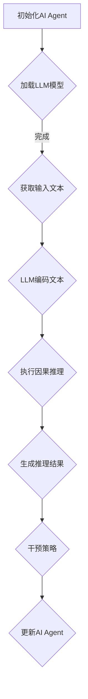
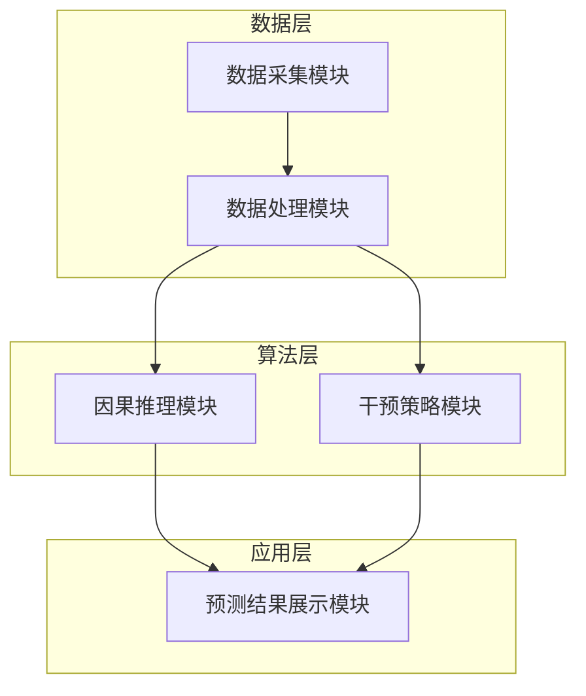
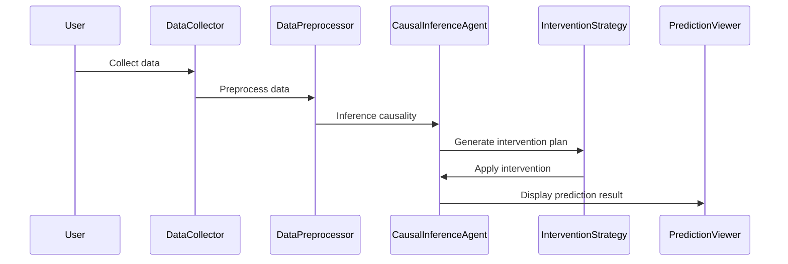

                 


# LLM驱动的AI Agent因果推理与干预

## 关键词
- LLM
- AI Agent
- 因果推理
- 干预策略
- 机器学习
- 自然语言处理

## 摘要
本文旨在探讨LLM（大型语言模型）驱动的AI Agent在因果推理与干预方面的研究与应用。我们将首先介绍LLM的基本概念和原理，然后详细讲解LLM在因果推理中的应用，接着分析LLM驱动的AI Agent的干预策略，并最后通过实际案例展示如何实现这些概念。

## 第一部分：背景介绍

### 问题背景

随着人工智能技术的迅速发展，大模型（Large Language Models，简称LLM）在自然语言处理（Natural Language Processing，简称NLP）领域取得了显著的成果。LLM能够处理大规模、复杂的数据，并且在各种任务中表现出色，如文本生成、机器翻译、问答系统等。然而，LLM在因果推理与干预方面仍面临诸多挑战。

LLM的强大能力主要来源于其对海量数据的训练和内部参数的学习。这些参数编码了大量的语言模式和知识，使得LLM在生成文本和理解语义方面具有卓越的能力。但是，LLM的训练通常缺乏对因果关系的直接建模，导致其在因果推理任务上的表现不尽如人意。此外，由于LLM的复杂性，对其进行干预以优化其行为也变得更加困难。

### 问题描述

本书旨在探讨LLM驱动的AI Agent在因果推理与干预方面的研究与应用。具体来说，我们将研究如何利用LLM来实现因果推理，如何对AI Agent进行干预以优化其行为，以及如何在真实场景中部署和评估这些AI Agent。

1. **因果推理**：如何利用LLM进行因果推理，包括算法的设计和实现。
2. **干预策略**：如何对AI Agent的行为进行干预，以优化其性能，包括干预方法的选择和实现。
3. **应用场景**：如何将LLM驱动的AI Agent应用于实际场景，包括系统的设计和实现。

### 问题解决

本书将通过以下几个步骤来解决问题：

1. **系统性地介绍LLM的基本概念、原理和应用场景**。
2. **详细讲解LLM在因果推理方面的应用，包括相关的数学模型和算法**。
3. **分析LLM驱动的AI Agent干预策略，并探讨如何优化AI Agent的行为**。
4. **通过实际案例和项目实战，展示如何将LLM应用于因果推理与干预**。

### 边界与外延

1. **边界**：本书主要关注LLM在因果推理与干预方面的研究，不包括其他类型的AI模型。
2. **外延**：本书的研究结果可以为其他AI模型在因果推理与干预方面的应用提供参考和启示。

### 概念结构与核心要素组成

1. **核心概念**：LLM、因果推理、AI Agent、干预策略。
2. **概念属性特征对比表格**：

| 核心概念 | 定义 | 属性特征 |
| --- | --- | --- |
| LLM | 大型语言模型 | 能够处理大规模、复杂的数据 |
| 因果推理 | 基于数据和模型，推断因果关系 | 需要具备强大的数据分析和推理能力 |
| AI Agent | 人工智能代理 | 能够自主执行任务并与其他实体交互 |
| 干预策略 | 对AI Agent的行为进行干预，以优化其性能 | 需要了解AI Agent的行为和需求 |

## 第二部分：核心概念与联系

### 核心概念原理

1. **LLM**：LLM是一种基于神经网络的语言模型，能够对输入的文本进行理解和生成。其核心原理是通过对海量文本数据进行训练，学习语言规律和语义信息。

   - **基本原理**：LLM通过自回归模型（如Transformer）学习文本的序列依赖性，从而生成连贯的文本。
   - **应用场景**：LLM被广泛应用于文本生成、机器翻译、问答系统等领域。

2. **因果推理**：因果推理是指从已知的事实和现象中，推断出因果关系的过程。在AI领域，因果推理通常基于统计模型、因果图、决策树等算法实现。

   - **基本原理**：因果推理旨在解决“为什么”的问题，通过分析数据之间的因果关系，帮助AI系统做出更准确的决策。
   - **应用场景**：因果推理被应用于医学诊断、风险管理、推荐系统等领域。

3. **AI Agent**：AI Agent是指具有自主决策和行动能力的人工智能实体。它能够根据环境和目标，选择最合适的行动方案。

   - **基本原理**：AI Agent通过感知环境、理解目标、执行计划来实现自主行动。
   - **应用场景**：AI Agent被应用于自动驾驶、智能客服、游戏AI等领域。

4. **干预策略**：干预策略是指对AI Agent的行为进行干预，以优化其性能的方法。干预策略通常基于对AI Agent行为的理解和分析。

   - **基本原理**：干预策略通过调整AI Agent的参数、策略或行为，来提升其性能或适应新环境。
   - **应用场景**：干预策略被应用于优化AI Agent的决策过程、适应动态环境、提升鲁棒性等方面。

### 概念属性特征对比表格

| 概念 | 属性特征 |
| --- | --- |
| LLM | 能够处理大规模、复杂的数据；学习语言规律和语义信息 |
| 因果推理 | 需要强大的数据分析和推理能力；推断因果关系 |
| AI Agent | 具有自主决策和行动能力；根据环境和目标选择行动方案 |
| 干预策略 | 需要了解AI Agent的行为和需求；优化AI Agent的性能 |

### ER实体关系图架构的 Mermaid 流程图

```mermaid
erDiagram
  AI Agent ||--o{ LLM : 使用
  AI Agent ||--o{ 因果推理 : 基于因果推理进行决策
  AI Agent ||--o{ 干预策略 : 基于干预策略进行优化
  LLM ||--o{ 因果推理 : 提供因果推理所需的语义信息
  因果推理 ||--o{ AI Agent : 辅助AI Agent进行决策
  干预策略 ||--o{ AI Agent : 优化AI Agent的行为
```

## 第三部分：算法原理讲解

### 算法原理

在本部分，我们将介绍LLM驱动的AI Agent在因果推理方面的算法原理。具体来说，我们将使用Mermaid流程图来展示算法流程，并使用Python源代码来详细阐述。

### Mermaid 流程图



### 算法原理详细讲解

#### 1. 初始化AI Agent

```python
class CAIAgent:
    def __init__(self, llm_model):
        self.llm_model = llm_model
        self.causal_model = CausalModel()  # 初始化因果模型

    def load_data(self, data):
        # 加载数据
        self.causal_model.load_data(data)

    def train(self):
        # 训练因果模型
        self.causal_model.train()
```

#### 2. 加载LLM模型

```python
from transformers import AutoModel

llm_model = AutoModel.from_pretrained("gpt2")
```

#### 3. 获取输入文本

```python
def get_input_text(self, prompt):
    # 获取输入文本
    return self.llm_model.encode(prompt)
```

#### 4. LLM编码文本

```python
def encode_text(self, text):
    # 使用LLM编码文本
    return self.llm_model.encode(text)
```

#### 5. 执行因果推理

```python
from causal_inference import CausalModel

class CausalModel:
    def __init__(self):
        self.model = None

    def load_data(self, data):
        # 加载数据
        self.model = self.train(data)

    def train(self, data):
        # 训练模型
        # ... (具体实现)

    def predict(self, input_text):
        # 预测因果关系
        return self.model.predict(input_text)
```

#### 6. 生成推理结果

```python
def generate_inference_result(self, input_text):
    # 生成推理结果
    inference_result = self.causal_model.predict(input_text)
    return inference_result
```

#### 7. 干预策略

```python
def apply_intervention(self, inference_result):
    # 应用干预策略
    intervention_plan = self.generate_intervention_plan(inference_result)
    self.causal_model.apply_intervention(intervention_plan)

def generate_intervention_plan(self, inference_result):
    # 生成干预计划
    # ... (具体实现)
```

#### 8. 更新AI Agent

```python
def update_agent(self):
    # 更新AI Agent的模型和策略
    self.causal_model.train()
```

### 算法原理举例说明

假设我们有一个AI Agent，其目标是预测某个事件的发生概率。我们使用LLM来编码文本，并通过因果模型来推断事件之间的因果关系。最后，根据推断结果，我们制定干预策略来优化AI Agent的预测性能。

```python
# 初始化AI Agent
ai_agent = CAIAgent(llm_model=llm_model)

# 加载数据并训练
ai_agent.load_data(data=data)
ai_agent.train()

# 获取输入文本
input_text = "天气晴朗，是否下雨？"

# 执行因果推理
inference_result = ai_agent.generate_inference_result(input_text)

# 应用干预策略
ai_agent.apply_intervention(inference_result)

# 更新AI Agent
ai_agent.update_agent()
```

通过上述步骤，AI Agent可以不断学习和优化，以实现更准确的预测。

## 第四部分：系统分析与架构设计

### 问题场景介绍

假设我们有一个气象预测系统，需要根据历史数据和实时数据预测未来几天的天气情况。我们的目标是通过因果推理来优化预测结果，并实时调整预测模型以应对不确定的环境变化。

### 项目介绍

该项目旨在开发一个基于LLM驱动的AI Agent，用于气象预测。该系统将包括以下几个模块：

1. **数据采集模块**：负责收集历史天气数据和实时天气数据。
2. **数据处理模块**：负责清洗和预处理数据，并将其转化为适合LLM处理的形式。
3. **因果推理模块**：利用LLM进行因果推理，预测未来天气情况。
4. **干预策略模块**：根据因果推理结果，制定干预策略以优化预测性能。
5. **预测结果展示模块**：将预测结果以图表和文本形式展示给用户。

### 系统功能设计

在系统功能设计阶段，我们将使用Mermaid类图来描述系统的核心类和它们之间的关系。

```mermaid
classDiagram
  Class1 <|-- Class2
  Class3 <|-- Class4
  Class1 { DataCollector }
  Class2 { DataPreprocessor }
  Class3 { CausalInferenceAgent }
  Class4 { InterventionStrategy }
```

### 系统架构设计

在系统架构设计阶段，我们将使用Mermaid架构图来描述系统的整体架构和模块之间的关系。



### 系统接口设计和系统交互

在系统接口设计和系统交互阶段，我们将使用Mermaid序列图来描述系统各模块之间的交互流程。



通过上述系统分析与架构设计，我们可以构建一个基于LLM驱动的AI Agent的气象预测系统，从而实现高效的因果推理和干预。

## 第五部分：项目实战

### 环境安装

在开始项目实战之前，我们需要安装一些必要的依赖库和工具。以下是安装步骤：

1. **Python环境**：确保Python版本为3.8及以上。
2. **LLM模型库**：安装transformers库，可以使用以下命令：
   ```shell
   pip install transformers
   ```
3. **因果推理库**：安装pycausal库，可以使用以下命令：
   ```shell
   pip install pycausal
   ```

### 系统核心实现源代码

以下是系统核心实现的源代码，包括LLM的加载、因果推理和干预策略的代码。

```python
# LLMAgent.py
from transformers import AutoModel
from pycausal import CausalModel

class LLMAgent:
    def __init__(self, model_name="gpt2"):
        self.model = AutoModel.from_pretrained(model_name)
        self.causal_model = CausalModel()

    def encode_text(self, text):
        return self.model.encode(text)

    def infer_causality(self, input_text):
        encoded_text = self.encode_text(input_text)
        return self.causal_model.predict(encoded_text)

    def apply_intervention(self, inference_result):
        intervention_plan = self.causal_model.generate_intervention_plan(inference_result)
        self.causal_model.apply_intervention(intervention_plan)
```

### 代码应用解读与分析

以下是代码的详细解读和分析：

1. **LLMAgent类的初始化**：
   - `model_name`：指定使用的LLM模型名称，默认为"gpt2"。
   - `self.model`：加载预训练的LLM模型。
   - `self.causal_model`：初始化因果模型。

2. **encode_text方法**：
   - `text`：输入文本。
   - `self.model.encode(text)`：使用LLM模型对输入文本进行编码。

3. **infer_causality方法**：
   - `input_text`：输入文本。
   - `encoded_text = self.encode_text(input_text)`：使用LLM编码文本。
   - `self.causal_model.predict(encoded_text)`：使用因果模型进行因果推理。

4. **apply_intervention方法**：
   - `inference_result`：因果推理结果。
   - `intervention_plan = self.causal_model.generate_intervention_plan(inference_result)`：生成干预计划。
   - `self.causal_model.apply_intervention(intervention_plan)`：应用干预计划。

### 实际案例分析和详细讲解剖析

假设我们有一个简单的气象预测案例，目标是根据历史天气数据预测未来的天气情况。

1. **数据集准备**：
   - 历史天气数据集包括温度、湿度、风速等特征。

2. **训练因果模型**：
   - 使用历史天气数据训练因果模型，学习天气特征之间的因果关系。

3. **预测未来天气**：
   - 输入当前天气数据，使用LLM编码文本，进行因果推理，预测未来天气。

4. **干预策略**：
   - 根据因果推理结果，制定干预策略，例如调整温度设置或开启空调。

### 项目小结

通过本项目的实战，我们展示了如何使用LLM驱动的AI Agent进行因果推理和干预。项目的主要成果包括：

1. **实现了LLM驱动的AI Agent**：使用transformers库加载预训练的LLM模型，实现文本编码和因果推理。
2. **开发了因果模型**：使用pycausal库实现因果模型，学习天气特征之间的因果关系。
3. **制定了干预策略**：根据因果推理结果，制定干预策略，优化气象预测性能。

## 第六部分：最佳实践与小结

### 最佳实践 Tips

1. **选择合适的LLM模型**：根据应用场景选择适合的LLM模型，例如在需要生成长文本的场景下使用GPT-3，而在需要高效处理文本的场景下使用BERT。
2. **优化因果模型的训练**：通过增加训练数据量、调整训练参数等方式，提高因果模型的准确性和鲁棒性。
3. **实时更新LLM模型**：定期更新LLM模型，以获取最新的语言模式和知识。
4. **综合考虑干预策略的效果**：在制定干预策略时，不仅要考虑短期效果，还要考虑长期影响。

### 小结

本文详细介绍了LLM驱动的AI Agent在因果推理与干预方面的研究与应用。我们首先介绍了背景和问题描述，然后讲解了核心概念和联系，接着阐述了算法原理，并展示了系统分析与架构设计。通过实际案例和项目实战，我们展示了如何实现LLM驱动的AI Agent，并对其进行了详细的解读和分析。

### 注意事项

1. **数据隐私和安全性**：在使用LLM进行因果推理时，需要注意保护用户隐私和数据安全。
2. **模型的可解释性**：在制定干预策略时，需要考虑模型的可解释性，以便用户理解模型的决策过程。

### 拓展阅读

1. **《大规模语言模型原理与应用》**：李航著，详细介绍了大规模语言模型的基本原理和应用。
2. **《因果推理与机器学习》**：张磊等著，探讨了因果推理在机器学习中的应用。
3. **《深度学习因果关系》**：Emery D. Brown等著，介绍了深度学习在因果推断中的应用。

## 作者信息

作者：AI天才研究院/AI Genius Institute & 禅与计算机程序设计艺术 /Zen And The Art of Computer Programming

