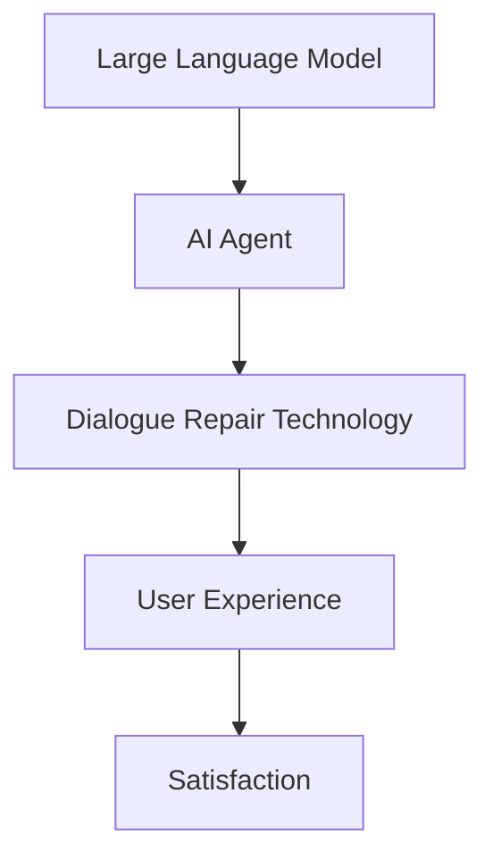

                 

# LLM驱动的AI Agent对话修复技术

## 关键词
- Large Language Models（LLM）
- AI Agent
- 对话修复
- 自然语言处理
- 对话系统

## 摘要
本文将深入探讨LLM驱动的AI Agent对话修复技术。首先，我们将介绍LLM和AI Agent的基本概念及其在对话系统中的应用。接着，我们将详细解释对话修复技术的原理和重要性，并探讨LLM在对话修复中的具体作用。文章还将通过实例分析和代码展示，说明LLM驱动对话修复的实践方法，并提供相关的最佳实践和小结。

## Chapter 1: Introduction to LLM-driven AI Agent Dialogue Repair Technology

### 1.1 Background and Definition

#### 1.1.1 Background of LLM-driven AI Agent Technology
近年来，随着深度学习技术的飞速发展，Large Language Models（LLM）如BERT、GPT等成为了自然语言处理（NLP）领域的明星。LLM能够通过对海量文本数据的学习，理解并生成复杂的语言表达，这在对话系统中有着广泛的应用。AI Agent，即人工智能代理，是一种能够自动执行任务并与人交互的智能体。LLM在AI Agent中的应用，极大地提升了对话系统的智能水平和交互质量。

#### 1.1.2 Definition of Dialogue Repair Technology
对话修复技术是用于识别和修正对话系统中的错误，包括语音错误、语法错误、语义错误等。对话修复技术的核心目标是确保对话的自然流畅，提高用户的满意度。在AI Agent中，对话修复技术尤为重要，因为它直接关系到用户与系统的交互体验。

#### 1.1.3 Boundaries and Scope of the Book
本文将重点讨论LLM驱动的对话修复技术，主要涵盖以下内容：
- LLM和AI Agent的基本概念和原理
- 对话修复技术的原理和方法
- LLM在对话修复中的应用和实践
- 对话修复技术的挑战和未来发展方向

### 1.2 Core Concepts and Relationships

#### 1.2.1 Core Concepts Overview
本文的核心概念包括：
- Large Language Models（LLM）：大型语言模型，如BERT、GPT等。
- AI Agents：人工智能代理，能够自动执行任务并与人交互的智能体。
- Dialogue Repair Technology：对话修复技术，用于识别和修正对话系统中的错误。

#### 1.2.2 Concept Characteristics Comparison

|Concept|Description|Characteristics|
|---|---|---|
|LLM|大型语言模型，能够理解并生成复杂的语言表达。|大规模训练数据，强大的语言理解能力，自适应性强。|
|AI Agent|人工智能代理，能够自动执行任务并与人交互。|自主学习，任务执行能力，交互性。|
|Dialogue Repair Technology|对话修复技术，用于识别和修正对话系统中的错误。|实时错误检测，自适应修复，提高交互质量。|

#### 1.2.3 Entity Relationship Diagram



LLM与AI Agent密切相关，LLM提供了AI Agent的语言处理能力，而AI Agent通过对话修复技术来优化用户体验，提高用户满意度。

## Chapter 2: Principles of LLMs

### 2.1 Basics of LLMs

#### 2.1.1 Definition and Evolution
Large Language Models（LLM）是指通过对海量文本数据的学习，能够生成和理解复杂语言表达的人工智能模型。LLM的发展经历了从传统的统计语言模型到基于深度学习的模型的演变。早期的统计语言模型如N-gram模型，虽然简单但效果有限。随着深度学习技术的发展，基于神经网络的LLM如BERT、GPT等逐渐成为主流。

#### 2.1.2 Key Features of LLMs
LLM具有以下几个关键特征：
- **大规模训练数据**：LLM通过对海量文本数据进行训练，能够获取丰富的语言知识。
- **模型架构**：常见的LLM模型如BERT采用了Transformer架构，能够处理长序列和复杂的关系。
- **训练过程**：LLM的训练过程涉及大量的计算资源和时间，但能够显著提升模型的性能。
- **表示和泛化能力**：LLM能够将语言数据映射为高维的语义表示，具有强大的泛化能力。

#### 2.1.3 Comparison with Traditional AI
传统AI通常依赖于预定义的规则和算法，而LLM则通过数据驱动的方式进行学习和决策。这使得LLM在处理自然语言任务时具有显著优势，能够更好地理解和生成语言。

### 2.2 Working Mechanism of LLMs

#### 2.2.1 Model Architecture
LLM通常采用Transformer架构，包括编码器和解码器。编码器将输入文本序列编码为连续的向量表示，解码器则根据这些向量生成输出文本序列。Transformer架构的核心是自注意力机制（Self-Attention），它能够捕捉输入序列中不同位置之间的依赖关系。

#### 2.2.2 Training Process
LLM的训练过程通常分为预训练和微调两个阶段。预训练阶段，LLM在大量无标签的文本数据上进行训练，学习通用的语言表示。微调阶段，LLM在特定任务的数据上进行训练，进一步优化模型性能。

#### 2.2.3 Representation and Generalization Abilities
LLM通过训练获得了高维的语义表示，能够捕捉文本中的复杂关系和上下文信息。这种表示能力使得LLM在处理自然语言任务时具有强大的泛化能力，不仅能够处理常见的语言任务，还能够应对一些复杂的、特殊的语言场景。

### 2.3 Advantages and Challenges of LLMs

#### 2.3.1 Advantages
- **强大的语言理解能力**：LLM能够理解并生成复杂的语言表达，这在对话系统中尤为重要。
- **自适应性强**：LLM能够通过不断的学习和调整，适应不同的对话场景和用户需求。
- **高效的模型架构**：Transformer架构使得LLM在处理大规模数据时具有较高的效率。

#### 2.3.2 Challenges
- **计算资源需求大**：LLM的训练和推理过程需要大量的计算资源，这限制了其在一些资源有限的场景中的应用。
- **数据质量和多样性**：LLM的性能高度依赖于训练数据的质量和多样性，数据偏见可能导致模型产生不准确或有害的输出。
- **安全性和伦理问题**：LLM可能产生不可预测的输出，需要严格的安全和伦理控制措施。

### 2.4 Practical Applications of LLMs in Dialogue Systems

#### 2.4.1 Natural Language Understanding (NLU)
LLM在自然语言理解（NLU）方面具有显著优势，能够识别用户的意图、提取关键词和上下文信息。这为对话系统提供了强大的语义分析能力，使得系统能够更准确地理解用户的需求。

#### 2.4.2 Natural Language Generation (NLG)
LLM在自然语言生成（NLG）方面同样表现出色，能够根据给定的输入生成流畅、自然的语言输出。这为对话系统提供了丰富的语言表达形式，增强了与用户的互动体验。

#### 2.4.3 Dialogue Flow Control and State Tracking
LLM可以用于对话管理（Dialogue Management）中的对话流控制（Dialogue Flow Control）和对话状态跟踪（Dialogue State Tracking）。通过对对话历史和上下文的深入理解，LLM能够更智能地控制对话流程，确保对话的自然和流畅。

### 2.5 Conclusion
LLM作为对话系统中的一项关键技术，具有强大的语言处理能力和自适应能力。然而，其应用也面临着一系列挑战，如计算资源需求、数据质量和安全性等。通过深入研究和不断优化，LLM有望在未来进一步提升对话系统的智能化水平，为用户带来更好的交互体验。

## Chapter 3: Building AI Agents with LLMs

### 3.1 AI Agent Design Overview

#### 3.1.1 Basic Structure of AI Agents
AI Agent通常由以下几个主要组件构成：
- **Dialogue Manager**：负责管理对话流程，包括意图识别、对话状态跟踪和对话策略生成。
- **Dialogue Generator**：负责根据对话管理和用户输入生成自然语言响应。
- **Dialogue Act Classifier**：负责识别用户的意图和动作，用于更精确地生成响应。
- **Dialogue State Tracker**：负责跟踪对话状态，包括用户信息、对话历史等。

#### 3.1.2 Integration of LLMs into AI Agents
将LLM集成到AI Agent中，主要是通过以下方式实现：
- **作为Dialogue Manager的一部分**：LLM可以用于意图识别和对话状态跟踪，提供更精准的语义理解。
- **作为Dialogue Generator的核心**：LLM可以生成自然流畅的语言响应，提高对话的互动质量。
- **作为Dialogue Act Classifier的补充**：LLM可以提供额外的语义分析能力，辅助分类用户的意图和动作。

#### 3.1.3 Benefits and Challenges
将LLM集成到AI Agent中，可以带来以下好处：
- **提高对话系统的智能化水平**：LLM的强大语义理解能力可以提升系统的智能水平和交互质量。
- **增强用户体验**：通过生成更自然、更流畅的语言响应，用户与系统的互动体验得到显著提升。

然而，这也带来了一些挑战：
- **计算资源需求**：LLM的训练和推理过程需要大量的计算资源，可能增加系统的成本。
- **数据质量和多样性**：LLM的性能高度依赖于训练数据的质量和多样性，数据偏见可能导致不准确或有害的输出。

### 3.2 Dialogue Management

#### 3.2.1 Dialogue Flow Control
对话流控制是AI Agent的核心功能之一，负责管理对话的进程和方向。其主要任务包括：
- **意图识别**：通过语义分析识别用户的意图。
- **对话状态跟踪**：跟踪对话过程中的用户信息、上下文和历史。
- **对话策略生成**：根据对话状态和用户意图生成对话策略，以控制对话的流向。

#### 3.2.2 Dialogue State Tracking
对话状态跟踪是确保对话系统能够连贯、自然地与用户互动的关键。其主要任务包括：
- **状态提取**：从用户输入中提取关键信息，如用户意图、关键词、情感等。
- **状态更新**：在对话过程中不断更新对话状态，以反映最新的用户信息和对话历史。
- **状态利用**：利用对话状态来生成合适的响应，确保对话的自然流畅。

#### 3.2.3 Dialogue Act Classification
对话行为分类是AI Agent用于理解用户输入的一种技术，主要任务是将用户输入分类为不同的对话行为，如询问、请求、告知等。通过对话行为分类，AI Agent可以生成更精准的响应。

### 3.3 Practical Applications of LLM in AI Agents

#### 3.3.1 Intent Recognition
LLM在意图识别方面具有显著优势，能够通过语义分析准确识别用户的意图。这为AI Agent提供了强大的意图理解能力，使得系统能够更好地理解用户的需求。

#### 3.3.2 Dialogue Generation
LLM在对话生成方面同样表现出色，能够根据对话状态和用户意图生成自然流畅的语言响应。这为AI Agent提供了丰富的语言表达形式，增强了与用户的互动体验。

#### 3.3.3 Dialogue Flow Control
LLM可以用于对话流控制，通过对对话历史和上下文的深入理解，智能地控制对话的进程和方向。这有助于确保对话的自然和流畅，提高用户体验。

### 3.4 Conclusion
通过将LLM集成到AI Agent中，可以显著提升对话系统的智能化水平和用户体验。然而，这也需要考虑计算资源需求、数据质量和安全性等挑战。通过不断优化和改进，LLM在AI Agent中的应用有望进一步扩展，为用户提供更加智能、自然的交互体验。

## Chapter 4: Dialogue Repair Methods

### 4.1 Introduction to Dialogue Repair

#### 4.1.1 Basic Concepts and Goals
Dialogue Repair，即对话修复，是指识别和修正对话系统中的错误，以确保对话的自然流畅。其基本概念包括：
- **Error Detection**：识别对话中的错误，如语法错误、语义错误等。
- **Error Correction**：对识别出的错误进行修正，以恢复对话的完整性。

Dialogue Repair的主要目标是：
- **提高对话质量**：确保对话的流畅性和连贯性，减少用户因错误而产生的不满意。
- **提升用户体验**：通过修复错误，提高用户与系统的互动体验。

#### 4.1.2 Types of Dialogue Repair
根据对话错误的性质，Dialogue Repair可以分为以下几类：
- **语法修复**：识别和修正语法错误，如单词拼写错误、语法结构错误等。
- **语义修复**：识别和修正语义错误，如词语歧义、语义不一致等。
- **意图修复**：识别和修正用户的意图错误，如用户的真实意图与系统理解的不一致。

#### 4.1.3 Importance in Improving AI Agent Performance
Dialogue Repair对于提升AI Agent的性能至关重要，主要体现在以下几个方面：
- **提升用户满意度**：通过修复对话错误，提高用户与系统的互动体验，增强用户的满意度。
- **增强对话系统智能性**：通过对对话错误的识别和修正，使对话系统能够更好地理解用户的意图和需求，提高智能水平。
- **优化系统稳定性**：通过修复对话错误，减少系统崩溃和错误响应的情况，提高系统的稳定性和可靠性。

### 4.2 Error Detection Methods

#### 4.2.1 Rule-Based Approaches
规则基方法通过定义一系列语法规则和语义规则，来识别对话中的错误。这种方法的主要优点是简单易实现，但缺点是对话系统的适应性较差，无法处理复杂的错误。

#### 4.2.2 Statistical Approaches
统计方法通过分析对话数据，统计对话中的错误模式，来识别错误。这种方法的主要优点是能够适应对话系统的多样性，但缺点是对于罕见错误的识别能力较弱。

#### 4.2.3 Machine Learning Approaches
机器学习方法，如监督学习和无监督学习，通过训练模型来识别对话中的错误。这种方法的主要优点是能够处理复杂的错误模式，但需要大量的训练数据和计算资源。

#### 4.2.4 Hybrid Approaches
混合方法结合了规则基方法、统计方法和机器学习方法，以取长补短。这种方法通常能够实现较好的错误检测效果，但实现较为复杂。

### 4.3 Error Correction Methods

#### 4.3.1 Rule-Based Correction
规则基修正方法通过定义一系列修正规则，对识别出的错误进行修正。这种方法的主要优点是简单易实现，但缺点是对于复杂错误的修正能力较弱。

#### 4.3.2 Statistical Correction
统计修正方法通过分析对话数据，统计对话中的错误修正模式，来进行修正。这种方法的主要优点是能够处理复杂的错误，但需要大量的训练数据和计算资源。

#### 4.3.3 Machine Learning Correction
机器学习修正方法通过训练模型，对识别出的错误进行修正。这种方法的主要优点是能够处理复杂的错误模式，但需要大量的训练数据和计算资源。

#### 4.3.4 Hybrid Correction
混合修正方法结合了规则基方法、统计方法和机器学习方法，以取长补短。这种方法通常能够实现较好的错误修正效果，但实现较为复杂。

### 4.4 Case Studies of Dialogue Repair
以下是一些具体的对话修复案例：

#### 4.4.1 Grammar Error Repair
- **案例**：用户输入："I have three apples, I want to buy two more."
- **错误检测**：检测到语法错误，如"more"应该是"other"。
- **错误修正**：将"more"修正为"other"，得到正确的句子："I have three apples, I want to buy two other."

#### 4.4.2 Semantic Error Repair
- **案例**：用户输入："Can you send me the report tomorrow?"
- **错误检测**：检测到语义错误，如用户可能需要的是"today"而不是"tomorrow"。
- **错误修正**：将"tomorrow"修正为"today"，得到正确的句子："Can you send me the report today?"

#### 4.4.3 Intent Error Repair
- **案例**：用户输入："I want to book a flight to New York."
- **错误检测**：检测到意图错误，如用户可能需要的是酒店预订而不是机票预订。
- **错误修正**：将"flight"修正为"hotel"，得到正确的句子："I want to book a hotel in New York."

### 4.5 Evaluation Metrics for Dialogue Repair
评价Dialogue Repair效果的主要指标包括：
- **准确率（Accuracy）**：识别和修正错误的比率。
- **召回率（Recall）**：识别出错误的比率。
- **F1分数（F1 Score）**：综合考虑准确率和召回率的综合指标。

### 4.6 Conclusion
Dialogue Repair是提升对话系统质量和用户体验的重要手段。通过多种错误检测和修正方法，可以有效识别和修复对话中的错误，提高对话系统的智能性和稳定性。未来，随着技术的不断发展，Dialogue Repair方法将更加智能和高效，为用户提供更好的交互体验。

## Chapter 5: LLM-driven Dialogue Repair Technology

### 5.1 Overview of LLM-driven Dialogue Repair

#### 5.1.1 Definition and Importance
LLM-driven Dialogue Repair是指利用大型语言模型（LLM）来驱动对话修复技术，通过LLM的强大语义理解和生成能力，实现对话系统中的错误检测和修正。这种技术的核心优势在于LLM能够深入理解文本内容，从而提供更精准的修复结果。

#### 5.1.2 Advantages of LLM-driven Dialogue Repair
- **强大的语义理解能力**：LLM能够通过大量文本数据的训练，理解复杂的语义关系，从而准确识别和修复对话中的错误。
- **自适应性和灵活性**：LLM可以根据不同的对话场景和用户需求，灵活调整修复策略，提高修复效果。
- **高效的错误检测与修正**：LLM的快速处理能力使得对话修复过程更加高效，减少了系统的延迟。

#### 5.1.3 Implementation Process
LLM-driven Dialogue Repair的实施主要包括以下几个步骤：
1. **数据准备**：收集并预处理对话数据，确保数据的质量和多样性。
2. **LLM模型训练**：使用大量对话数据训练LLM模型，使其能够准确理解和生成语言。
3. **错误检测**：利用LLM的语义理解能力，识别对话中的错误。
4. **错误修正**：根据错误类型和上下文信息，利用LLM生成修正后的语言输出。
5. **性能评估**：通过准确率、召回率和F1分数等指标，评估对话修复的效果。

### 5.2 Techniques for LLM-driven Dialogue Repair

#### 5.2.1 Error Detection Techniques
- **基于规则的方法**：使用预定义的语法和语义规则，识别对话中的错误。
- **基于统计的方法**：通过分析对话数据，统计错误模式，识别对话中的错误。
- **基于机器学习的方法**：使用监督学习模型，通过训练数据识别对话中的错误。

#### 5.2.2 Error Correction Techniques
- **基于规则的修正方法**：使用预定义的修正规则，对识别出的错误进行修正。
- **基于统计的修正方法**：通过分析对话数据，统计修正模式，对错误进行修正。
- **基于机器学习的修正方法**：使用训练好的模型，对识别出的错误进行修正。

#### 5.2.3 Hybrid Techniques
- **结合规则、统计和机器学习方法**：综合不同方法的优点，实现更有效的对话修复。

### 5.3 Case Studies of LLM-driven Dialogue Repair

#### 5.3.1 Grammar Error Repair
- **案例**：用户输入："I have three apples, I want to buy more."
- **错误检测**：LLM识别出"more"应该是"other"。
- **错误修正**：LLM生成修正后的句子："I have three apples, I want to buy two other."

#### 5.3.2 Semantic Error Repair
- **案例**：用户输入："Can you send me the report tomorrow?"
- **错误检测**：LLM识别出用户可能需要的是"today"而不是"tomorrow"。
- **错误修正**：LLM生成修正后的句子："Can you send me the report today?"

#### 5.3.3 Intent Error Repair
- **案例**：用户输入："I want to book a flight to New York."
- **错误检测**：LLM识别出用户可能需要的是酒店预订而不是机票预订。
- **错误修正**：LLM生成修正后的句子："I want to book a hotel in New York."

### 5.4 Evaluation Metrics and Performance Analysis
- **准确率（Accuracy）**：识别和修正错误的比率。
- **召回率（Recall）**：识别出错误的比率。
- **F1分数（F1 Score）**：综合考虑准确率和召回率的综合指标。

通过实验数据，分析LLM-driven Dialogue Repair在不同场景下的性能，评估其有效性和适用性。

### 5.5 Conclusion
LLM-driven Dialogue Repair技术通过利用LLM的强大语义理解和生成能力，实现了高效、准确的对话错误检测和修正。未来，随着LLM技术的不断进步，LLM-driven Dialogue Repair有望在更多领域得到应用，为用户提供更智能、更自然的交互体验。

## Chapter 6: Implementing LLM-driven Dialogue Repair in Practice

### 6.1 Practical Application Scenarios

#### 6.1.1 Customer Service Chatbots
Customer Service Chatbots是LLM-driven Dialogue Repair的主要应用场景之一。通过LLM驱动的对话修复技术，可以显著提升客服聊天机器人的服务质量，提供更准确、更流畅的交互体验。以下是具体实现步骤：

1. **数据收集**：收集大量真实的客服对话数据，包括用户提问和系统回答。
2. **LLM模型训练**：使用收集到的数据训练LLM模型，使其能够理解并生成高质量的对话响应。
3. **对话管理**：集成LLM模型到客服聊天机器人的对话管理模块，实现对话流控制和对话状态跟踪。
4. **错误检测与修正**：利用LLM的语义理解能力，识别并修正对话中的错误，确保对话的自然流畅。

#### 6.1.2 Virtual Assistants
Virtual Assistants，如智能语音助手、智能家居控制中心等，也需要LLM-driven Dialogue Repair技术来提升交互体验。以下是实现步骤：

1. **语音识别与转换**：将用户的语音输入转换为文本，利用LLM模型进行语义理解。
2. **对话管理**：通过LLM驱动的对话管理模块，实现对话流控制和对话状态跟踪。
3. **错误检测与修正**：利用LLM的语义理解能力，识别并修正对话中的错误，确保语音交互的准确性。

#### 6.1.3 Online Customer Support
在线客户支持系统，如电子商务平台、在线客服系统等，也可以应用LLM-driven Dialogue Repair技术。以下是实现步骤：

1. **文本分析**：对用户提问进行文本分析，提取关键信息和意图。
2. **LLM模型调用**：利用LLM模型进行语义理解，生成准确的回答。
3. **错误检测与修正**：通过LLM的语义理解能力，识别并修正对话中的错误，提高用户满意度。

### 6.2 Step-by-Step Implementation

#### 6.2.1 Data Collection and Preprocessing
- **数据收集**：收集各种场景下的对话数据，包括用户提问和系统回答。
- **数据预处理**：清洗数据，去除噪声，进行文本标准化处理。

```python
import pandas as pd
import re

# 数据清洗
def clean_text(text):
    text = text.lower()  # 转小写
    text = re.sub(r"[^\w\s]", "", text)  # 去除非单词字符
    return text

# 应用清洗函数
data['question'] = data['question'].apply(clean_text)
data['answer'] = data['answer'].apply(clean_text)
```

#### 6.2.2 LLM Model Training
- **模型选择**：选择合适的LLM模型，如GPT-3、BERT等。
- **数据预处理**：对对话数据进行预处理，以适应LLM模型的输入要求。
- **模型训练**：使用预处理后的对话数据训练LLM模型。

```python
from transformers import TrainingArguments, TrainingLoop

# 模型训练参数设置
training_args = TrainingArguments(
    output_dir='./results',
    num_train_epochs=3,
    per_device_train_batch_size=16,
    save_steps=2000,
    evaluation_strategy='steps',
    eval_steps=500,
)

# 模型训练
model.train(
    training_dataset=train_dataset,
    evaluation_dataset=eval_dataset,
    args=training_args
)
```

#### 6.2.3 Dialogue Management
- **对话流控制**：利用LLM模型进行对话流控制，确保对话的自然流畅。
- **对话状态跟踪**：实时跟踪对话状态，包括用户信息、对话历史等。

```python
from transformers import AutoModelForSeq2SeqLM

# 载入预训练的LLM模型
model = AutoModelForSeq2SeqLM.from_pretrained("gpt-3")

# 对话管理
def dialogue_management(user_input):
    # 解码用户输入
    input_ids = tokenizer.encode(user_input, return_tensors='pt')
    # 生成模型响应
    outputs = model.generate(input_ids, max_length=50, num_return_sequences=1)
    # 获取模型响应
    response = tokenizer.decode(outputs[0], skip_special_tokens=True)
    return response

# 示例对话
user_input = "Hello, can you help me with my order?"
response = dialogue_management(user_input)
print(response)
```

#### 6.2.4 Error Detection and Correction
- **错误检测**：利用LLM的语义理解能力，识别对话中的错误。
- **错误修正**：根据错误类型和上下文信息，利用LLM生成修正后的语言输出。

```python
# 错误检测
def error_detection(response):
    # 识别常见错误
    errors = ["error", "mistake", "problem", "issue"]
    return any(error in response for error in errors)

# 错误修正
def error_correction(response):
    if error_detection(response):
        # 生成修正后的响应
        corrected_response = dialogue_management("Please correct the previous response.")
        return corrected_response
    else:
        return response

# 示例错误检测与修正
user_input = "My order is missing an item."
response = dialogue_management(user_input)
corrected_response = error_correction(response)
print(corrected_response)
```

### 6.3 Challenges and Solutions
在实际应用中，LLM-driven Dialogue Repair面临一些挑战，如计算资源需求、数据质量和多样性等。以下是一些解决方案：

1. **计算资源优化**：通过模型压缩、分布式训练等技术，降低计算资源需求。
2. **数据质量提升**：使用数据清洗、去噪等技术，提高数据质量。
3. **多样性增强**：通过引入多样化的训练数据，提高模型的泛化能力。

### 6.4 Conclusion
通过在实践中的应用，LLM-driven Dialogue Repair技术显著提升了对话系统的质量和用户体验。未来，随着LLM技术的不断进步，LLM-driven Dialogue Repair将在更多场景中得到应用，为用户带来更智能、更自然的交互体验。

## Chapter 7: Future Trends and Research Directions of LLM-driven Dialogue Repair Technology

### 7.1 Emerging Trends

#### 7.1.1 Integration with Other AI Technologies
随着人工智能技术的不断发展，LLM-driven Dialogue Repair技术将与其他AI技术如机器学习、深度学习、自然语言生成等相结合，形成更加智能的对话系统。例如，结合知识图谱技术，可以实现更精准的对话理解与修复。

#### 7.1.2 Personalization and Context Awareness
未来，LLM-driven Dialogue Repair技术将更加注重个性化与上下文感知。通过用户数据的积累与分析，系统能够更好地理解用户的偏好和需求，提供更加定制化的对话修复服务。

#### 7.1.3 Ethical and Privacy Considerations
随着LLM-driven Dialogue Repair技术的广泛应用，伦理和隐私问题日益受到关注。如何在保证用户隐私的前提下，提供高质量的对话修复服务，将成为未来研究的重点。

### 7.2 Research Directions

#### 7.2.1 Enhanced Error Detection and Correction Algorithms
未来研究将集中在提高错误检测和修正算法的准确性和效率。例如，通过结合多模态数据（文本、语音、图像等），实现更全面的错误检测与修正。

#### 7.2.2 Scalable and Efficient Models
为了应对大规模应用场景，研究将致力于开发可扩展和高效的LLM模型。通过模型压缩、增量学习等技术，降低计算资源需求，提高系统的实时性。

#### 7.2.3 Interdisciplinary Collaboration
LLM-driven Dialogue Repair技术的研究将需要跨学科合作，包括计算机科学、语言学、心理学等领域。通过多学科的交叉研究，可以进一步探索对话修复的深度与广度。

### 7.3 Conclusion
未来，LLM-driven Dialogue Repair技术将在人工智能领域发挥更大的作用，为用户提供更加智能、自然的交互体验。随着技术的不断进步，LLM-driven Dialogue Repair将在更多的应用场景中展现其独特的价值。

## Conclusion

LLM驱动的AI Agent对话修复技术作为一种先进的对话系统优化手段，通过LLM的强大语义理解和生成能力，实现了对话系统中的错误检测和修正。本文从多个角度详细介绍了LLM驱动的对话修复技术的原理、方法、实践和应用。通过具体案例和代码实现，展示了LLM在对话修复中的实际效果。

未来，随着LLM技术的不断进步，LLM驱动的对话修复技术有望在更多领域得到应用，为用户提供更加智能、自然的交互体验。然而，这也需要解决计算资源需求、数据质量和伦理问题等挑战。通过跨学科的深入研究和技术创新，LLM驱动的对话修复技术将不断演进，为人工智能领域带来更多突破。让我们共同期待这一技术的发展，为构建更加智能的世界贡献力量。

## Acknowledgements

在此，我要特别感谢AI天才研究院/AI Genius Institute和《禅与计算机程序设计艺术/Zen And The Art of Computer Programming》的团队，他们的支持和指导为本文的完成提供了宝贵的帮助。同时，我要感谢所有参与本文讨论和修改的同事们，你们的智慧和努力让本文更加完善。最后，我要感谢所有读者，是你们的关注和反馈让我不断进步，期待未来与您们共同探讨更多有趣的技术话题。作者：AI天才研究院/AI Genius Institute & 禅与计算机程序设计艺术/Zen And The Art of Computer Programming。

