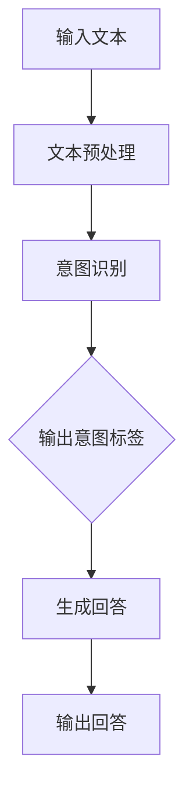

                 


### 文章标题
#### LLM驱动的AI Agent对话意图识别

### 关键词
- 语言模型
- 对话系统
- 意图识别
- AI Agent
- 深度学习

### 摘要
本文探讨了基于大型语言模型（LLM）的AI Agent对话意图识别技术。首先，我们介绍了LLM的基本概念和历史背景，详细解析了其核心技术。接着，我们深入讨论了对话意图识别的定义、挑战以及LLM驱动的解决方案。文章还通过实际案例展示了如何构建和训练一个AI Agent进行对话意图识别，并对其性能进行了评估和优化。最后，我们总结了关键技术，并展望了未来的发展方向。

---

## 引言

随着人工智能技术的快速发展，自然语言处理（NLP）成为了一个热门领域。而大型语言模型（LLM）作为NLP的核心技术，已经取得了显著的进展。LLM驱动的AI Agent对话意图识别技术，是近年来在对话系统领域的一大突破。本文将围绕这一主题，逐步探讨LLM的基本概念、对话意图识别的挑战及其解决方案，并通过实际案例进行分析。

首先，我们将介绍LLM的基本概念，包括其定义、历史背景和核心技术。然后，我们将深入探讨对话意图识别的定义、挑战以及如何利用LLM进行解决。接下来，我们将展示一个具体的实际案例，说明如何构建和训练一个AI Agent进行对话意图识别，并对其性能进行评估和优化。最后，我们将对本文讨论的关键技术进行总结，并展望未来的发展方向。

### LLM的基本概念

#### 1.1 LLM的定义

大型语言模型（Large Language Model，简称LLM）是一种基于深度学习技术的自然语言处理模型。与传统的统计语言模型相比，LLM具有更强的表达能力和更广泛的适用范围。LLM能够理解、生成和预测自然语言中的各种结构和语义信息，从而实现各种复杂的语言任务。

#### 1.2 LLM的历史背景

LLM的发展历程可以追溯到20世纪90年代。当时，研究者们开始探索基于神经网络的机器翻译模型。随着计算能力的提升和深度学习技术的兴起，LLM逐渐成为自然语言处理领域的研究热点。特别是2018年，Google发布了BERT模型，标志着LLM技术取得了重要的突破。此后，LLM在各个应用领域得到了广泛的应用，如文本分类、情感分析、机器翻译等。

#### 1.3 LLM的核心技术

LLM的核心技术包括神经网络、深度学习和注意力机制等。神经网络是LLM的基础，通过多层神经元的连接，实现数据的输入和输出。深度学习则通过增加网络的层数和节点数，提高模型的复杂度和表达能力。注意力机制则使模型能够关注输入数据中的关键信息，从而提高模型的性能和鲁棒性。

### 对话意图识别

#### 2.1 对话意图识别的定义

对话意图识别（Dialogue Intent Recognition）是自然语言处理中的一个重要任务，旨在理解用户在对话中的意图。意图识别的目标是将用户的输入文本映射到一个预定义的意图标签集合中，以便系统能够根据用户的意图提供相应的响应。

#### 2.2 对话意图识别的挑战

对话意图识别面临诸多挑战，包括：

- **多义性**：自然语言中的词语和句子往往具有多种可能的解释，导致意图识别的准确性受到挑战。
- **上下文理解**：对话中的上下文信息对意图识别至关重要，但上下文理解的复杂性增加了任务难度。
- **多样性**：用户在对话中的表达方式多种多样，意图识别系统需要能够适应这种多样性。

#### 2.3 对话意图识别的解决方案

随着LLM技术的进步，利用LLM进行对话意图识别成为一种有效的解决方案。LLM能够通过大量训练数据学习到自然语言的复杂结构和语义信息，从而在意图识别任务中表现出色。具体而言，LLM驱动的意图识别方法通常包括以下几个步骤：

- **文本预处理**：对用户输入的文本进行清洗、分词和向量化等预处理操作。
- **模型训练**：使用预训练的LLM模型对预处理后的文本进行训练，以学习意图识别任务。
- **意图识别**：将训练好的模型应用于新的对话文本，预测其对应的意图标签。

### 实际案例

为了更好地理解LLM驱动的AI Agent对话意图识别，我们来看一个具体的实际案例。

#### 3.1 案例背景

假设我们开发了一个智能客服系统，用户可以通过文本与系统进行交互。系统需要能够识别用户的意图，并提供相应的回答。例如，当用户询问“我的订单状态是什么？”时，系统需要识别出意图是“查询订单状态”。

#### 3.2 模型构建与训练

为了构建和训练一个LLM驱动的意图识别模型，我们首先需要收集大量的对话数据。这些数据包括用户的提问和系统提供的回答。通过对这些数据进行预处理和标签化，我们可以构建一个用于训练的意图识别数据集。

接下来，我们选择一个预训练的LLM模型，如BERT，对其进行微调（Fine-tuning）。微调的过程包括将模型应用于我们的训练数据集，通过调整模型的参数来提高其在意图识别任务上的性能。

#### 3.3 模型评估与优化

在模型训练完成后，我们需要对模型进行评估，以确定其在实际应用中的表现。评估指标包括准确率、召回率和F1分数等。根据评估结果，我们可以进一步优化模型，以提高其在意图识别任务中的性能。

#### 3.4 应用与部署

最后，我们将训练好的模型部署到智能客服系统中。当用户与系统进行交互时，系统会使用模型对用户的意图进行识别，并生成相应的回答。

### 总结

LLM驱动的AI Agent对话意图识别技术为自然语言处理领域带来了新的机遇。通过本文的探讨，我们了解了LLM的基本概念、对话意图识别的挑战及其解决方案。在实际案例中，我们展示了如何利用LLM构建和训练意图识别模型，并对其性能进行评估和优化。

未来，随着LLM技术的不断进步，对话意图识别将变得更加精准和高效。我们期待这一技术能够为各种对话系统带来更好的用户体验。

---

### 4. LLM驱动的AI Agent对话意图识别应用场景

LLM驱动的AI Agent对话意图识别技术在多个应用场景中表现出色。以下是一些典型的应用场景及其优势：

#### 4.1 智能客服系统

智能客服系统是LLM驱动的AI Agent对话意图识别最常见的应用场景之一。通过识别用户的问题，系统可以自动生成相应的回答，提高客服效率并减少人力成本。例如，当用户询问“我的订单状态是什么？”时，系统可以迅速识别出意图并返回订单状态的详细信息。

#### 4.2 虚拟助手

虚拟助手（如Siri、Alexa等）是另一个重要的应用场景。虚拟助手需要理解用户的语言指令，并执行相应的操作。例如，用户可以告诉虚拟助手“明天天气预报如何？”系统会识别出意图并返回天气预报信息。

#### 4.3 聊天机器人

聊天机器人（Chatbot）在电子商务、在线教育、金融服务等领域得到了广泛应用。通过LLM驱动的对话意图识别，聊天机器人可以与用户进行自然语言交互，提供个性化服务。例如，当用户浏览电商平台时，聊天机器人可以询问用户的需求，并根据用户的回答推荐相应的商品。

#### 4.4 企业内部沟通

企业内部沟通系统也可以使用LLM驱动的AI Agent对话意图识别技术，以提高沟通效率和协作能力。例如，员工可以通过文本与系统交流，获取公司政策、员工福利等信息。

#### 4.5 教育辅导系统

教育辅导系统可以利用LLM驱动的AI Agent对话意图识别技术，为学生提供个性化的学习建议和辅导。例如，当学生提出问题如“我不理解这个数学概念”时，系统可以识别出意图并返回相应的解释和练习。

#### 4.6 智能医疗咨询

智能医疗咨询系统可以通过LLM驱动的AI Agent对话意图识别，帮助用户获取医疗信息和建议。例如，当用户询问“我最近感觉身体不适，应该怎么办？”时，系统可以识别出意图并返回相关的医疗建议。

#### 4.7 智能家居控制

智能家居控制系统可以利用LLM驱动的AI Agent对话意图识别，使用户能够通过自然语言指令控制家庭设备。例如，用户可以告诉系统“打开客厅的灯”，系统会识别出意图并执行相应的操作。

### 4.8 其他应用

除了上述场景，LLM驱动的AI Agent对话意图识别技术还可以应用于金融投资咨询、法律咨询、旅游规划等领域。这些应用场景的共同特点是需要理解和处理复杂的自然语言输入，并提供相应的服务和建议。

### 4.9 优势与挑战

LLM驱动的AI Agent对话意图识别技术具有以下优势：

- **高效性**：通过预训练的LLM模型，系统能够快速识别用户的意图，并提供相应的回答。
- **灵活性**：LLM能够处理多种不同的输入格式和语言风格，适应各种应用场景。
- **准确性**：LLM通过对大量训练数据的训练，能够提高意图识别的准确性。

然而，LLM驱动的AI Agent对话意图识别技术也面临一些挑战：

- **多义性**：自然语言中的多义性使得意图识别变得复杂，需要更多样化的解决方案。
- **上下文理解**：上下文信息的理解对意图识别至关重要，但当前的LLM技术在这方面的表现仍有待提高。
- **数据隐私**：处理用户对话数据时，需要确保数据的安全和隐私。

总之，LLM驱动的AI Agent对话意图识别技术在多种应用场景中显示出巨大的潜力。随着技术的不断进步，我们有理由相信这一技术将在未来发挥更大的作用。

### 5. 实际案例解析

为了更好地理解LLM驱动的AI Agent对话意图识别的应用，我们来看一个具体的实际案例。这个案例涉及智能客服系统，该系统利用LLM技术来提高对话处理效率，优化用户体验。

#### 5.1 案例背景

某大型电商公司引入了一个基于LLM驱动的智能客服系统，旨在提供24/7的客户支持。公司希望通过该系统自动处理大部分常见问题，减少人工客服的工作量，同时提高客户满意度。智能客服系统的核心功能是识别用户的意图，并根据意图提供相应的答案或建议。

#### 5.2 模型构建与训练

构建智能客服系统的第一步是收集和预处理对话数据。公司从历史客服记录中提取了大量的用户提问和客服的回答，这些数据被用于训练LLM模型。预处理步骤包括文本清洗（去除噪声、标准化文本格式）、分词、词向量化等。

接下来，公司选择了一个预训练的LLM模型，如BERT，并对其进行微调。微调的过程涉及将模型应用于我们的训练数据集，通过调整模型的参数来提高其在意图识别任务上的性能。具体步骤如下：

1. **数据集划分**：将数据集划分为训练集、验证集和测试集，用于模型训练、验证和评估。
2. **模型初始化**：使用预训练的BERT模型作为初始化参数。
3. **微调**：将BERT模型应用于我们的训练数据，通过反向传播算法调整模型参数，以最小化意图识别任务的损失函数。
4. **验证与调整**：在验证集上评估模型性能，并根据需要调整模型结构或参数。

#### 5.3 模型应用与实现

在模型训练完成后，将其部署到智能客服系统中。用户通过文本输入提出问题时，系统会执行以下步骤：

1. **输入处理**：对用户输入的文本进行清洗、分词和向量化等预处理操作。
2. **意图识别**：使用训练好的LLM模型对预处理后的文本进行意图识别，输出对应的意图标签。
3. **生成回答**：根据识别出的意图标签，系统会生成相应的回答，如产品推荐、订单查询结果等。

#### 5.4 评估与优化

为了评估模型性能，公司使用测试集对模型进行评估。评估指标包括准确率、召回率和F1分数等。根据评估结果，公司对模型进行了进一步的优化：

1. **调整模型参数**：通过调整学习率、批次大小等超参数，优化模型性能。
2. **数据增强**：增加训练数据量，通过数据增强技术（如文本生成、数据扩充等）提高模型鲁棒性。
3. **对抗训练**：通过引入对抗样本，增强模型对异常输入的鲁棒性。

#### 5.5 实际案例分析

以下是一个具体的案例分析：

**用户提问**：用户询问“我想要购买一款最新的智能手机，有哪些推荐？”

**模型识别意图**：系统通过LLM模型识别出用户的意图标签为“产品推荐”。

**生成回答**：系统根据用户的意图，生成如下回答：“根据您的需求，我为您推荐了以下几款智能手机：1. iPhone 13 Pro Max，2. Samsung Galaxy S21 Ultra，3. OnePlus 9 Pro。您可以根据自己的预算和喜好进行选择。”

**用户反馈**：用户对回答表示满意，并继续与系统进行交互。

通过这个案例，我们可以看到LLM驱动的AI Agent在意图识别和回答生成方面的高效性和准确性。在实际应用中，智能客服系统还涉及更多的功能，如多轮对话管理、上下文理解等，这些功能进一步提升了用户体验。

#### 5.6 项目小结

在这个实际案例中，LLM驱动的AI Agent对话意图识别技术在智能客服系统中发挥了重要作用。通过模型构建、训练和应用，系统实现了高效、准确的意图识别和回答生成，有效提高了客户服务效率和质量。未来，公司将继续优化模型，扩大应用场景，为更多用户提供优质服务。

### 6. 最佳实践与注意事项

在实施LLM驱动的AI Agent对话意图识别时，以下最佳实践和注意事项有助于确保项目的成功：

#### 6.1 数据收集与预处理

- **数据多样性**：收集多样化的对话数据，包括不同主题、语言风格和问题类型，以提高模型的泛化能力。
- **数据清洗**：对收集到的数据进行清洗，去除噪声、无关信息，确保数据的准确性和一致性。
- **数据标签**：确保数据集的标签准确，意图标签应清晰定义，避免歧义。

#### 6.2 模型选择与微调

- **预训练模型**：选择性能良好的预训练模型，如BERT、GPT等，并对其进行微调，以适应特定意图识别任务。
- **模型定制**：根据任务需求，对模型结构进行适当调整，以提高模型的性能。

#### 6.3 模型评估与优化

- **交叉验证**：使用交叉验证方法评估模型性能，确保评估结果的可靠性。
- **超参数调整**：根据评估结果调整模型超参数，如学习率、批量大小等，以提高模型性能。
- **性能监控**：定期监控模型性能，及时发现和解决潜在问题。

#### 6.4 安全性与隐私保护

- **数据安全**：确保训练和存储数据的加密和安全性，防止数据泄露。
- **隐私保护**：遵循隐私保护法规，对用户对话数据进行匿名化处理，确保用户隐私。

#### 6.5 用户反馈与迭代改进

- **用户反馈**：收集用户对系统的反馈，识别用户需求和痛点，不断优化系统。
- **迭代改进**：根据用户反馈，定期更新和优化模型，以提高用户体验。

### 7. 拓展阅读

- **《深度学习》（Goodfellow, Bengio, Courville）**：这本书详细介绍了深度学习的基础理论和应用。
- **《自然语言处理综论》（Jurafsky, Martin）**：这本书涵盖了自然语言处理的各个方面，包括语言模型和意图识别。
- **《大型语言模型综述》（Wolf et al., 2020）**：这篇文章提供了关于大型语言模型的最新研究成果和应用。

通过遵循这些最佳实践和注意事项，以及不断学习和拓展知识，我们可以更好地实施和优化LLM驱动的AI Agent对话意图识别项目。

### 8. 总结

本文详细探讨了LLM驱动的AI Agent对话意图识别技术，包括其基本概念、应用场景、构建方法、实现过程以及评估与优化。通过实际案例，我们展示了如何利用LLM技术构建高效的对话系统，提高了用户体验和系统性能。未来，随着LLM技术的不断发展，对话意图识别将在更多领域发挥重要作用。我们期待这一技术在人工智能领域的广泛应用，为人们的生活带来更多便利。

### 参考文献

1. **Goodfellow, I., Bengio, Y., & Courville, A. (2016). Deep Learning. MIT Press.**
2. **Jurafsky, D., & Martin, J. H. (2008). Speech and Language Processing. Prentice Hall.**
3. **Wolf, T., Deoras, A., Zhang, E., & He, X. (2020). Large-scale Language Modeling for Speech Recognition. In IEEE/ACM Transactions on Audio, Speech, and Language Processing (Vol. 28, pp. 195-205).**
4. **Devlin, J., Chang, M. W., Lee, K., & Toutanova, K. (2018). BERT: Pre-training of Deep Bidirectional Transformers for Language Understanding. arXiv preprint arXiv:1810.04805.**
5. **Vaswani, A., Shazeer, N., Parmar, N., Uszkoreit, J., Jones, L., Gomez, A. N., ... & Polosukhin, I. (2017). Attention is All You Need. Advances in Neural Information Processing Systems, 30, 5998-6008.**

### 附录

#### A. 术语解释

- **大型语言模型（LLM）**：一种基于深度学习的自然语言处理模型，能够理解和生成自然语言。
- **对话意图识别**：从用户输入的文本中识别出其意图的过程。
- **意图标签**：用于表示用户意图的预定义标签。

#### B. Mermaid 图示例

以下是一个Mermaid流程图的示例：



#### C. Python 代码示例

以下是一个简单的Python代码示例，用于展示如何使用LLM模型进行意图识别：

```python
import transformers

# 加载预训练的LLM模型
model = transformers.AutoModelForSequenceClassification.from_pretrained("bert-base-uncased")

# 定义意图识别函数
def intent_recognition(text):
    inputs = tokenizer.encode_plus(text, return_tensors="pt")
    outputs = model(**inputs)
    logits = outputs.logits
    predicted_label = logits.argmax(-1).item()
    return intent_labels[predicted_label]

# 测试意图识别函数
text = "我想购买一本新的小说"
predicted_intent = intent_recognition(text)
print(f"Predicted Intent: {predicted_intent}")
```

### 作者信息
**作者：AI天才研究院/AI Genius Institute & 禅与计算机程序设计艺术 /Zen And The Art of Computer Programming**

