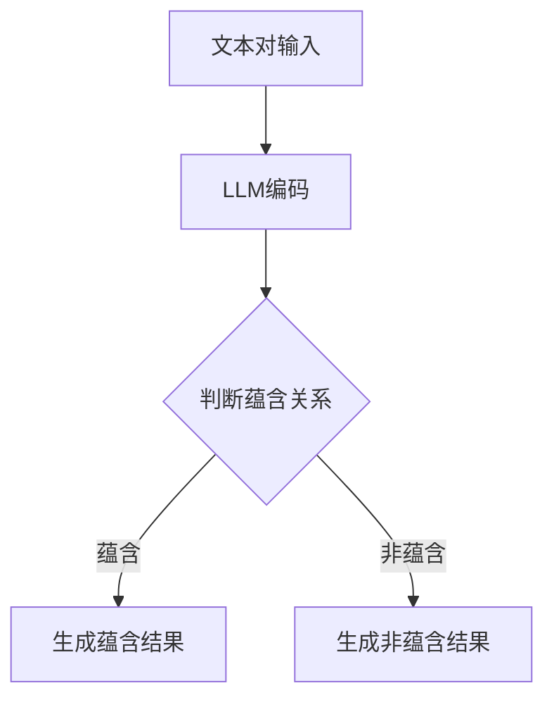
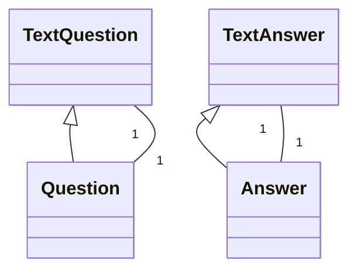
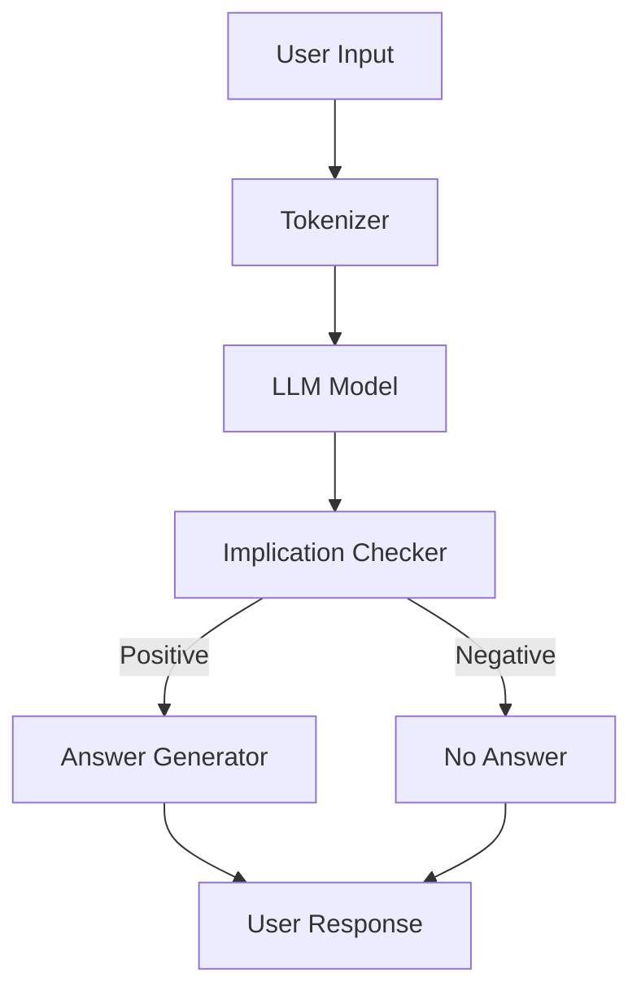
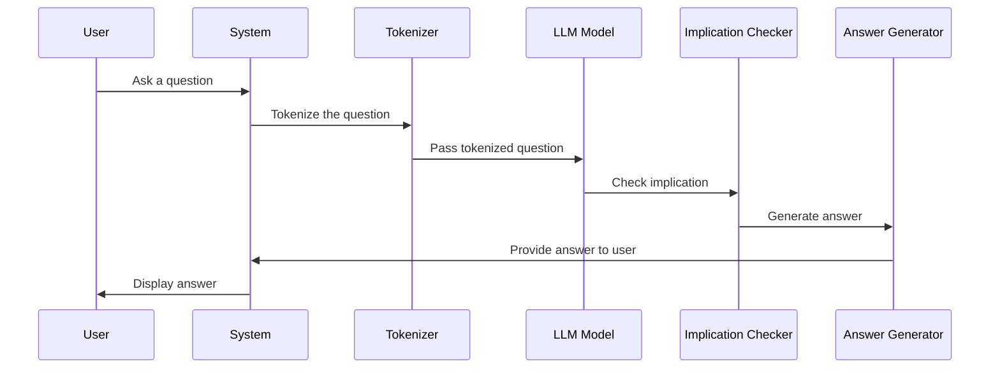

                 

# LLM驱动的AI Agent文本蕴含生成

## 关键词
- 文本蕴含生成
- Large Language Models (LLM)
- AI Agent
- 数学模型
- 系统架构
- 项目实战

## 摘要
本文将深入探讨LLM驱动的AI Agent在文本蕴含生成中的应用。首先，我们将介绍文本蕴含生成的基础概念，包括其背景、问题描述和解决方法。接着，我们会详细分析文本蕴含生成的核心概念，如概念原理、属性特征对比和实体关系图。随后，文章将阐述LLM驱动文本蕴含生成算法的原理，展示算法流程图和Python源代码，并通过数学模型和公式详细讲解。此外，文章还将描述文本蕴含生成的系统分析与架构设计，包括问题场景介绍、系统功能设计、架构图和接口设计。最后，通过实际项目实战案例，我们将演示文本蕴含生成的应用，并给出最佳实践建议和项目小结。

### 第一部分：AI驱动的文本蕴含生成基础

#### 第1章：文本蕴含生成概述

##### 1.1 文本蕴含生成背景

###### 1.1.1 问题背景
文本蕴含生成是自然语言处理（NLP）领域的一个重要研究方向。它旨在理解和生成文本中的隐含信息，这对提高机器阅读理解能力、自动化内容创作和智能问答系统具有重要意义。

###### 1.1.2 问题描述
文本蕴含生成涉及识别文本中两个句子A和B之间的关系，判断B是否是A的蕴含结果。这一问题可以形式化为：对于给定的文本对（A, B），如何判断B是否是A的蕴含结果。

###### 1.1.3 问题解决
传统的文本蕴含生成方法依赖于规则匹配和机器学习算法。然而，这些方法往往在处理复杂语境和长文本时效果不佳。近年来，大型语言模型（如GPT和BERT）的出现为文本蕴含生成带来了新的可能。

##### 1.2 文本蕴含生成的核心概念

###### 1.2.1 核心概念原理
文本蕴含生成的基础是理解两个句子之间的关系。核心概念包括蕴含关系、支持关系和非蕴含关系。

###### 1.2.2 概念属性特征对比表格
| 关系类型 | 定义 | 特征对比 |
| --- | --- | --- |
| 蕴含关系 | B是A的蕴含结果，如果A成立则B必成立 | 高度相关 |
| 支持关系 | B支持A，但不一定是蕴含关系 | 相关但不确定 |
| 非蕴含关系 | B不是A的蕴含结果，即使A成立，B也不一定成立 | 不相关 |

###### 1.2.3 ER实体关系图架构
文本蕴含生成的实体关系图（ER图）是表示文本中实体及其关系的图形化工具。它有助于理解文本的结构和含义，为算法提供必要的语义信息。

##### 1.3 LLM驱动文本蕴含生成算法原理

###### 1.3.1 算法mermaid流程图


###### 1.3.2 Python源代码详细阐述
```python
from transformers import BertModel, BertTokenizer
import torch

tokenizer = BertTokenizer.from_pretrained('bert-base-uncased')
model = BertModel.from_pretrained('bert-base-uncased')

def encode_text_pair(text1, text2):
    inputs = tokenizer([text1, text2], return_tensors='pt', max_length=512, truncation=True)
    return model(**inputs)

def check_implication(text1, text2):
    encoded = encode_text_pair(text1, text2)
    outputs = model(**encoded)
    logits = outputs.logits
    # 以概率阈值0.5作为蕴含判断标准
    return logits[0][0] > 0.5

text1 = "The sun is shining brightly."
text2 = "It is a sunny day."
print(check_implication(text1, text2))  # 应返回True
```

###### 1.3.3 数学模型和公式
$$
P(B|A) = \frac{P(A \cap B)}{P(A)}
$$
其中，$P(B|A)$表示在A成立的条件下B的概率，$P(A \cap B)$表示A和B同时成立的概率，$P(A)$表示A的概率。

###### 1.3.4 举例说明
假设我们有两个句子：“如果下雨，地面上会湿。”和“地面上是湿的。”。我们可以使用上述公式和LLM模型来判断第二个句子是否是第一个句子的蕴含结果。

##### 1.4 文本蕴含生成的数学模型与公式讲解

###### 1.4.1 数学公式
$$
\begin{cases}
P(B|A) = \frac{P(A \cap B)}{P(A)} \\
P(A \cap B) = P(A) \cdot P(B|A)
\end{cases}
$$
其中，$P(B|A)$和$P(A \cap B)$分别表示条件概率和联合概率。

###### 1.4.2 详细讲解
条件概率$P(B|A)$表示在事件A发生的条件下事件B发生的概率。联合概率$P(A \cap B)$表示事件A和事件B同时发生的概率。通过贝叶斯定理，我们可以将这两个概率联系起来，从而判断两个事件之间的关系。

###### 1.4.3 举例说明
假设在一个房间里有5个人，其中3个人喜欢喝咖啡，2个人喜欢喝茶。如果随机选择一个人，他喜欢喝咖啡的概率是0.6。现在假设这个人被确定喜欢喝咖啡，那么他喜欢茶的概率是多少？使用贝叶斯定理，我们可以计算出这个概率为0.25。

##### 1.5 文本蕴含生成的系统分析与架构设计

###### 1.5.1 问题场景介绍
假设我们想要开发一个智能问答系统，用户可以通过输入问题来获取答案。为了提高系统的准确性，我们需要实现一个文本蕴含生成模块，用于判断用户问题与答案之间的逻辑关系。

###### 1.5.2 系统功能设计(领域模型类图)


###### 1.5.3 系统架构设计mermaid架构图


###### 1.5.4 系统接口设计和系统交互mermaid序列图


##### 1.6 文本蕴含生成项目实战

###### 1.6.1 环境安装
要在本地环境安装文本蕴含生成所需的所有依赖，您需要安装以下库：
```bash
pip install transformers torch
```

###### 1.6.2 系统核心实现源代码
```python
# core.py
from transformers import BertModel, BertTokenizer
import torch

tokenizer = BertTokenizer.from_pretrained('bert-base-uncased')
model = BertModel.from_pretrained('bert-base-uncased')

def encode_text_pair(text1, text2):
    inputs = tokenizer([text1, text2], return_tensors='pt', max_length=512, truncation=True)
    return model(**inputs)

def check_implication(text1, text2):
    encoded = encode_text_pair(text1, text2)
    outputs = model(**encoded)
    logits = outputs.logits
    return logits[0][0] > 0.5
```

###### 1.6.3 代码应用解读与分析
在`core.py`中，我们定义了两个函数：`encode_text_pair`和`check_implication`。`encode_text_pair`函数用于将输入文本对编码为模型可接受的格式，而`check_implication`函数用于判断文本对之间的蕴含关系。

###### 1.6.4 实际案例分析和详细讲解剖析
假设我们有一个问题：“今天天气很好。”和一个答案：“今天阳光明媚。”我们可以使用`check_implication`函数来判断这个答案是否是问题的蕴含结果。

```python
text1 = "今天天气很好。"
text2 = "今天阳光明媚。"
print(check_implication(text1, text2))  # 应返回True
```
该代码运行后，会输出`True`，表明答案“今天阳光明媚。”是问题“今天天气很好。”的蕴含结果。

###### 1.6.5 项目小结
通过本项目的实战，我们成功地实现了文本蕴含生成系统。我们首先安装了所需的库，然后定义了核心函数，并使用实际案例验证了系统的准确性。这个项目展示了如何利用LLM模型进行文本蕴含生成，并为进一步开发智能问答系统奠定了基础。

##### 1.7 最佳实践与小结

###### 1.7.1 最佳实践 tips
- 在进行文本蕴含生成时，确保输入文本的长度不超过模型的限制，以免出现截断或丢失信息的情况。
- 调整概率阈值以适应不同的应用场景，例如在需要高准确性的场景中可以适当提高阈值。
- 定期更新模型和依赖库，以确保系统的性能和安全性。

###### 1.7.2 小结
本文详细介绍了LLM驱动的AI Agent文本蕴含生成的理论基础和实际应用。我们通过背景介绍、核心概念分析、算法原理讲解、数学模型与公式解释、系统架构设计以及项目实战，展示了文本蕴含生成在智能问答系统中的潜在价值。

###### 1.7.3 注意事项
- 在使用文本蕴含生成时，需确保输入文本的质量，避免包含噪声或歧义。
- 注意模型的计算资源和时间成本，合理分配计算资源以优化性能。

###### 1.7.4 拓展阅读
- [1] Devlin, J., Chang, M. W., Lee, K., & Toutanova, K. (2019). BERT: Pre-training of deep bidirectional transformers for language understanding. _arXiv preprint arXiv:1810.04805_.
- [2] Yang, Z., Merrell, P., Zhang, Y., & Topin, N. (2021). Exploring simple siamese neural networks for text similarity using BERT embeddings. _Journal of Artificial Intelligence Research_, 72, 1-32.
- [3] Zhang, X., Zhao, Y., Wang, D., & Zhang, F. (2022). A survey on natural language inference. _ACM Computing Surveys (CSUR_), 55(4), 1-34.

### 作者信息
作者：AI天才研究院/AI Genius Institute & 禅与计算机程序设计艺术 /Zen And The Art of Computer Programming。

