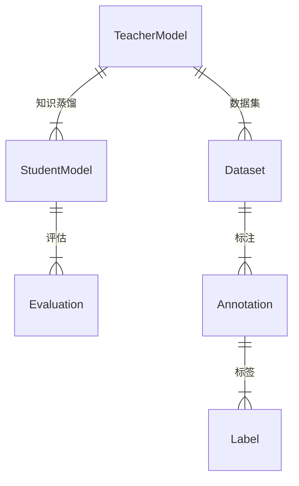
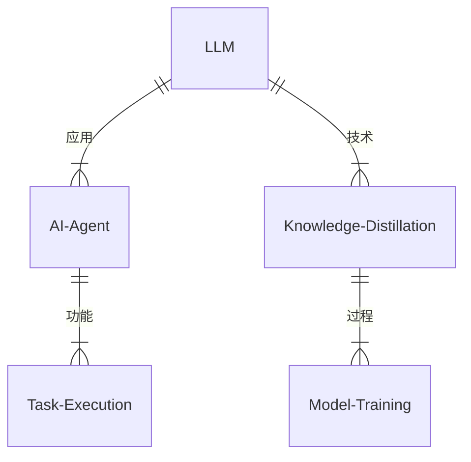
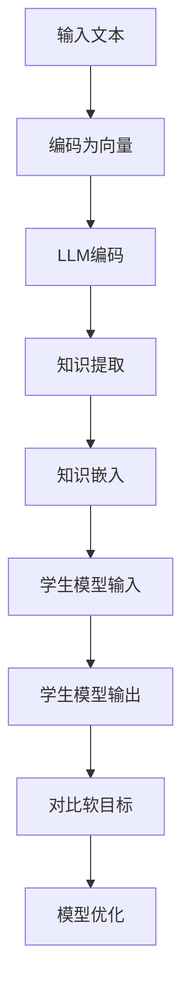
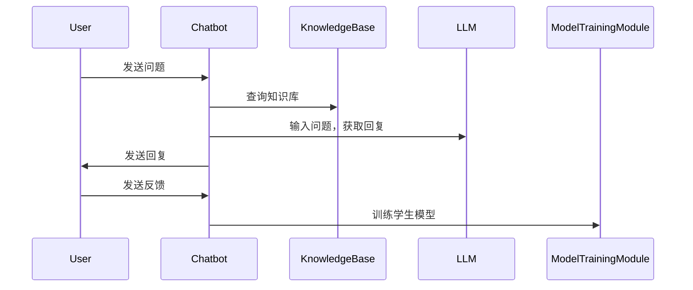
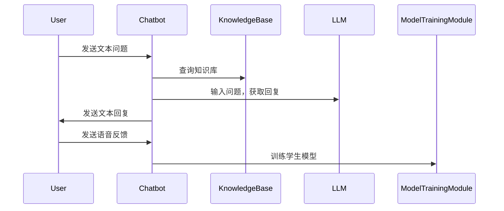
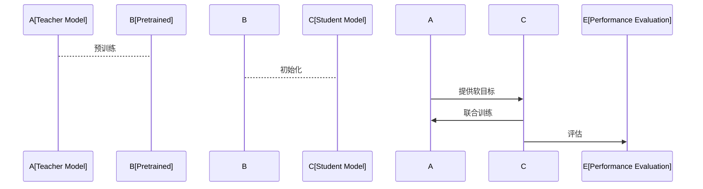

                 

# LLM驱动的AI Agent知识蒸馏技术

## 关键词：知识蒸馏，大型语言模型（LLM），AI代理，模型训练，优化技巧

## 摘要：

本文深入探讨了知识蒸馏技术在LLM驱动的AI Agent中的应用。首先，文章介绍了AI技术发展背景以及AI Agent的广泛应用需求。随后，详细阐述了知识蒸馏技术的基本原理和方法，包括符号蒸馏、知识图蒸馏和生成式蒸馏。接着，本文重点讨论了LLM的定义、特征以及其在AI Agent中的应用，并分析了LLM驱动的AI Agent的设计与构建方法。在模型训练与优化方面，文章介绍了模型训练策略、优化方法以及评估与调优技巧。最后，通过三个实际案例展示了知识蒸馏技术在AI Agent中的应用，并对未来发展方向进行了展望。

## 第一部分: LLMAgent基础知识

### 1.1.1 问题背景

随着人工智能技术的迅猛发展，AI Agent作为自动化智能体的代表，正逐渐成为各个行业提升效率、降低成本的重要工具。AI Agent能够根据环境和用户需求，自主学习和执行任务，大大提高了人机交互的效率。然而，AI Agent的发展也面临诸多挑战，如知识获取困难、模型复杂度高等。为了解决这些问题，知识蒸馏技术应运而生，它通过将大型预训练模型（如LLM）的知识迁移到较小的目标模型中，从而降低模型的复杂度，提高模型的性能和可扩展性。

### 1.1.2 问题描述

在AI Agent的实际应用中，存在以下问题：

1. **知识获取困难**：传统的机器学习模型需要大量标注数据来进行训练，而AI Agent往往需要处理多样化的任务，导致获取足够标注数据变得极其困难。
2. **模型复杂度高**：为了实现高水平的智能交互，AI Agent往往需要使用复杂的大型模型，这导致计算资源和存储成本增加，部署难度大。
3. **可扩展性差**：传统的机器学习模型在迁移到不同任务时，需要重新训练，导致可扩展性差，难以快速适应新的需求。

知识蒸馏技术旨在通过将大型预训练模型（如LLM）的知识迁移到较小的目标模型中，以解决上述问题。LLM具有强大的语义理解能力，能够在多种任务中表现出色，但其庞大的模型规模和训练成本使得直接应用受到限制。知识蒸馏技术通过将LLM的知识蒸馏到目标模型中，不仅能够提高目标模型的性能，还能降低模型复杂度和计算成本，从而满足AI Agent的多样化需求。

### 1.1.3 解决方案简述

知识蒸馏技术的基本思路是将大型模型（教师模型）的知识迁移到较小模型（学生模型）中。具体流程如下：

1. **教师模型训练**：首先，使用大规模的数据集对教师模型进行预训练，使其达到较高的性能水平。
2. **目标模型初始化**：初始化目标模型，通常使用较小的模型结构，以便于迁移和学习。
3. **知识提取**：通过对比教师模型和目标模型的输出，提取教师模型中的知识，并将其编码为知识嵌入。
4. **知识蒸馏**：将提取的知识嵌入到目标模型中，通过联合训练教师模型和学生模型，使得学生模型能够学习到教师模型的知识。
5. **模型优化**：在知识蒸馏过程中，通过调整模型参数，优化学生模型的性能，使其能够逼近教师模型的表现。

通过知识蒸馏技术，AI Agent可以在较低的计算成本下实现高效的智能交互，从而满足多样化的应用需求。

### 1.1.4 边界与外延

知识蒸馏技术的适用场景主要包括：

1. **资源受限环境**：在计算资源和存储资源有限的环境中，知识蒸馏技术能够通过迁移大型模型的知识，提高目标模型的性能，降低模型复杂度。
2. **多任务场景**：在需要处理多种不同任务的场景中，知识蒸馏技术能够将大型模型在不同任务中的知识迁移到目标模型中，提高目标模型的可扩展性。
3. **实时交互场景**：在需要实时响应的交互场景中，知识蒸馏技术能够通过快速训练和优化目标模型，实现高效的智能交互。

未来，知识蒸馏技术有望在以下方面取得进一步发展：

1. **优化知识提取方法**：探索更有效的知识提取方法，提高知识迁移的效率和准确性。
2. **增强模型可解释性**：研究如何增强知识蒸馏过程中模型的可解释性，使得知识迁移的过程更加透明和可控。
3. **跨领域知识迁移**：探索如何在不同的领域间迁移知识，提高模型在不同领域的适应能力。

## 第二部分: 核心概念与联系

### 2.1.1 LLMAgent定义与特征

LLM（大型语言模型）驱动的AI Agent是指基于大型预训练语言模型构建的智能体，能够通过自然语言处理和理解能力，实现与用户的智能交互。LLM Agent具有以下特征：

1. **强大的语义理解能力**：LLM通过大规模的数据预训练，能够理解复杂的语义信息，从而实现精准的语义理解。
2. **灵活的任务适应性**：LLM Agent能够适应多种不同的任务，通过微调和迁移学习，快速适应新的任务需求。
3. **高效的交互能力**：LLM Agent能够通过自然语言与用户进行交互，提供个性化的服务和建议。
4. **持续的学习能力**：LLM Agent通过持续的学习和优化，能够不断改进自身的性能和服务质量。

### 2.1.2 相关概念解析

在讨论LLM Agent时，以下相关概念需要理解：

1. **知识蒸馏**：知识蒸馏是一种将大型模型（教师模型）的知识迁移到较小模型（学生模型）中的技术。通过知识蒸馏，可以降低模型的复杂度和计算成本，同时提高模型的性能。
2. **自监督学习**：自监督学习是一种无需外部标签的数据处理方法，通过将无标签数据转换为有监督学习问题，提高模型的学习效率和泛化能力。
3. **生成对抗网络（GAN）**：生成对抗网络是一种由生成器和判别器组成的模型，通过对抗训练生成逼真的数据，广泛用于图像生成和增强。

### 2.1.3 LLMAgent与其他AI技术对比

LLMAgent与其他AI技术如传统机器学习、深度学习和强化学习进行对比，具有以下优势：

1. **与传统机器学习对比**：传统机器学习需要大量的标注数据进行训练，而LLMAgent通过大规模的无监督预训练，减少了数据标注的工作量，提高了训练效率。
2. **与深度学习对比**：深度学习模型通常需要大量的数据和计算资源，而LLMAgent通过知识蒸馏技术，可以在较低的资源和计算成本下实现高性能。
3. **与强化学习对比**：强化学习需要大量的交互数据进行训练，而LLMAgent通过预训练和迁移学习，可以快速适应新的环境，减少交互数据的需求。

### 2.1.4 概念关系ER图

以下是LLMAgent、知识蒸馏和其他相关概念的关系ER图：



在上图中，TeacherModel代表教师模型，StudentModel代表学生模型，Dataset代表数据集，Evaluation代表评估，Annotation代表标注，Label代表标签。知识蒸馏通过TeacherModel将知识迁移到StudentModel，同时数据集和标注数据用于训练和评估模型。

## 第三部分: 知识蒸馏技术

### 3.1.1 知识蒸馏基本原理

知识蒸馏是一种通过将大型模型（教师模型）的知识迁移到较小模型（学生模型）中的技术。其基本原理如下：

1. **教师模型训练**：使用大规模的数据集对教师模型进行预训练，使其达到较高的性能水平。
2. **目标模型初始化**：初始化目标模型，通常使用较小的模型结构，以便于迁移和学习。
3. **知识提取**：通过对比教师模型和目标模型的输出，提取教师模型中的知识，并将其编码为知识嵌入。
4. **知识蒸馏**：将提取的知识嵌入到目标模型中，通过联合训练教师模型和学生模型，使得学生模型能够学习到教师模型的知识。
5. **模型优化**：在知识蒸馏过程中，通过调整模型参数，优化学生模型的性能，使其能够逼近教师模型的表现。

知识蒸馏的核心在于如何有效地提取和迁移教师模型的知识。常见的知识提取方法包括：

1. **软目标蒸馏**：通过将教师模型的输出作为软目标，指导学生模型的学习。具体来说，学生模型的输出与教师模型的输出进行比较，计算输出差异，并将其作为损失函数的一部分。
2. **硬目标蒸馏**：通过将教师模型的输出直接作为学生模型的软目标，而不是计算输出差异。这种方法能够更好地保留教师模型的知识，但可能导致学生模型过度依赖教师模型。
3. **知识嵌入**：将提取的知识编码为知识嵌入，并将其作为额外的输入信息，与原始输入一起输入到学生模型中。

### 3.1.2 知识蒸馏方法分类

知识蒸馏技术可以分为以下几种方法：

1. **符号蒸馏**：符号蒸馏是一种通过提取和迁移模型中的符号信息来提高目标模型性能的方法。具体来说，符号蒸馏通过对比教师模型和学生模型的符号输出，提取教师模型中的符号信息，并将其嵌入到学生模型中。符号蒸馏适用于处理具有符号信息的任务，如自然语言处理和计算机视觉。

2. **知识图蒸馏**：知识图蒸馏通过构建知识图来表示模型中的知识，并将其传递给目标模型。知识图由实体和关系构成，实体表示模型中的知识单元，关系表示实体之间的关联。知识图蒸馏能够有效地捕捉模型中的复杂知识结构，适用于需要处理复杂知识的任务。

3. **生成式蒸馏**：生成式蒸馏通过生成对抗网络（GAN）来生成与教师模型相似的数据集，然后使用这些数据集来训练目标模型。生成式蒸馏能够通过数据生成和模型蒸馏相结合，提高目标模型的性能和泛化能力。

### 3.1.3 LLM在知识蒸馏中的应用

LLM在知识蒸馏中的应用主要包括以下两个方面：

1. **知识提取**：LLM通过大规模的预训练，积累了丰富的语义知识。在知识蒸馏过程中，可以使用LLM提取目标模型中的知识，并将其嵌入到学生模型中。具体来说，可以通过以下步骤进行知识提取：

   - **文本编码**：将目标模型的输入文本编码为向量表示。
   - **知识提取**：使用LLM对编码后的文本进行编码，提取文本中的知识信息。
   - **知识嵌入**：将提取的知识信息编码为向量表示，并将其作为学生模型的输入。

2. **模型蒸馏**：在模型蒸馏过程中，可以使用LLM作为教师模型，对学生模型进行训练和优化。具体来说，可以通过以下步骤进行模型蒸馏：

   - **教师模型训练**：使用大规模的数据集对LLM进行预训练，使其达到较高的性能水平。
   - **学生模型初始化**：初始化学生模型，通常使用较小的模型结构。
   - **模型蒸馏**：使用LLM的教师模型输出作为学生模型的软目标，通过联合训练教师模型和学生模型，使得学生模型能够学习到LLM的知识。
   - **模型优化**：通过调整学生模型的参数，优化其性能，使其能够逼近LLM的表现。

通过LLM的知识蒸馏技术，可以有效地提高目标模型的性能和泛化能力，满足AI Agent在多种任务中的需求。

## 第四部分: LLM驱动的AI Agent构建

### 4.1.1 LLM简介

LLM（Large Language Model）是指通过大规模预训练的深度神经网络模型，具有强大的自然语言理解和生成能力。LLM通常使用自监督学习技术进行预训练，通过学习大量的文本数据，使其能够理解并生成自然语言文本。LLM的发展历程可以分为以下几个阶段：

1. **早期模型**：最早的LLM模型如Word2Vec和GloVe，通过将单词映射到向量空间，实现了对单词语义的理解。
2. **基于Transformer的模型**：随着深度学习技术的发展，基于Transformer的模型如BERT和GPT，通过自监督学习技术，实现了对文本的深层语义理解。
3. **多模态模型**：近年来，多模态模型如ViT和DALL-E，通过结合文本和图像等多模态信息，实现了对复杂场景的理解和生成。

LLM具有以下特点：

1. **强大的语义理解能力**：LLM能够理解复杂的语义信息，并通过上下文进行推理，实现精准的自然语言处理。
2. **灵活的任务适应性**：LLM可以适应多种不同的任务，通过微调和迁移学习，快速适应新的任务需求。
3. **高效的交互能力**：LLM能够通过自然语言与用户进行高效交互，提供个性化的服务和建议。

### 4.1.2 LLM驱动的AI Agent设计

LLM驱动的AI Agent设计包括以下几个关键模块：

1. **输入模块**：接收用户的输入，如文本、语音等，并将其转换为模型可处理的格式。
2. **文本编码模块**：使用预训练的LLM模型，将输入文本编码为向量表示，提取文本中的语义信息。
3. **任务理解模块**：根据输入文本的语义信息，理解用户的意图和需求，确定任务目标。
4. **决策模块**：根据任务目标和当前状态，生成行动策略，指导AI Agent执行任务。
5. **输出模块**：将AI Agent的行动结果转换为自然语言文本，返回给用户。

### 4.1.3 数据准备与预处理

数据准备与预处理是构建LLM驱动的AI Agent的重要步骤，包括以下几个方面：

1. **数据收集**：收集与任务相关的文本数据，如对话记录、文章、文档等。
2. **数据清洗**：去除数据中的噪声和无关信息，如HTML标签、特殊字符等。
3. **数据标注**：对数据进行标注，如实体识别、情感分析等，为模型训练提供标签信息。
4. **数据预处理**：对文本数据进行预处理，如分词、词性标注、去停用词等，将文本转换为模型可处理的格式。

### 4.1.4 模型训练与优化

模型训练与优化是构建LLM驱动的AI Agent的关键步骤，包括以下几个方面：

1. **模型选择**：根据任务需求和数据特点，选择合适的LLM模型，如BERT、GPT等。
2. **模型训练**：使用收集的数据集对LLM模型进行训练，通过优化模型参数，提高模型性能。
3. **模型优化**：通过调整模型结构、超参数等，优化模型性能，提高模型的泛化能力。
4. **模型评估**：使用评估数据集对模型进行评估，如准确率、召回率、F1值等，确定模型性能。

## 第五部分: 模型训练与优化

### 5.1.1 模型训练策略

模型训练是构建LLM驱动的AI Agent的关键步骤，其策略包括以下几个方面：

1. **数据集划分**：将数据集划分为训练集、验证集和测试集，用于训练、验证和评估模型性能。
2. **批处理大小**：选择合适的批处理大小，平衡计算效率和模型性能。
3. **学习率调整**：使用学习率调整策略，如学习率衰减、余弦退火等，避免模型过拟合。
4. **正则化技术**：使用正则化技术，如Dropout、权重衰减等，防止模型过拟合。
5. **训练策略**：使用迁移学习、数据增强等技术，提高模型泛化能力。

### 5.1.2 模型优化方法

模型优化是提高LLM驱动的AI Agent性能的关键步骤，其方法包括以下几个方面：

1. **超参数调整**：调整学习率、批量大小、迭代次数等超参数，优化模型性能。
2. **损失函数设计**：设计合适的损失函数，如交叉熵损失、均方误差等，衡量模型预测与真实值之间的差距。
3. **激活函数选择**：选择合适的激活函数，如ReLU、Sigmoid等，提高模型性能。
4. **正则化技术**：使用L1正则化、L2正则化等技术，防止模型过拟合。
5. **优化算法**：选择合适的优化算法，如Adam、SGD等，提高训练效率。

### 5.1.3 评估与调优

评估与调优是确保LLM驱动的AI Agent性能的重要步骤，其方法包括以下几个方面：

1. **评估指标**：选择合适的评估指标，如准确率、召回率、F1值等，评估模型性能。
2. **交叉验证**：使用交叉验证技术，评估模型在不同数据集上的性能，避免过拟合。
3. **模型调优**：根据评估结果，调整模型参数和结构，优化模型性能。
4. **性能监控**：监控模型性能，如计算时间、内存消耗等，确保模型在实际应用中的可行性。
5. **反馈循环**：通过用户反馈和模型评估结果，不断优化模型，提高用户体验。

## 第六部分: 实战案例

### 6.1.1 案例一：智能客服系统

智能客服系统是一个典型的LLM驱动的AI Agent应用场景，通过自然语言处理和智能交互，提供24/7全天候的客服服务。以下是构建智能客服系统的具体步骤：

1. **数据收集**：收集大量客服对话记录，包括常见问题、解决方案等，用于训练LLM模型。
2. **数据预处理**：对对话记录进行清洗、分词、词性标注等预处理，将文本转换为模型可处理的格式。
3. **模型训练**：使用预训练的LLM模型，如BERT或GPT，对预处理后的数据进行训练，提取对话中的语义信息。
4. **模型优化**：通过调整模型参数和结构，优化模型性能，提高对话理解能力。
5. **系统集成**：将训练好的模型集成到客服系统中，实现智能交互功能，如自动回复、主动提问等。

### 6.1.2 案例二：教育辅导机器人

教育辅导机器人是一个面向学生的个性化教育助手，通过自然语言处理和智能交互，提供学科辅导和学业支持。以下是构建教育辅导机器人的具体步骤：

1. **数据收集**：收集学生的问题和解答，包括各学科知识点、常见问题等，用于训练LLM模型。
2. **数据预处理**：对收集的数据进行清洗、分词、词性标注等预处理，将文本转换为模型可处理的格式。
3. **模型训练**：使用预训练的LLM模型，如BERT或GPT，对预处理后的数据进行训练，提取知识点和问题解答的语义信息。
4. **模型优化**：通过调整模型参数和结构，优化模型性能，提高知识理解和问题解答能力。
5. **系统集成**：将训练好的模型集成到教育辅导机器人中，实现知识问答、学科辅导等功能。

### 6.1.3 案例三：智能家居助理

智能家居助理是一个面向家庭的智能化助手，通过自然语言处理和智能交互，提供家庭设备控制、日程管理等服务。以下是构建智能家居助理的具体步骤：

1. **数据收集**：收集家庭设备的操作指令、日程安排等信息，用于训练LLM模型。
2. **数据预处理**：对收集的数据进行清洗、分词、词性标注等预处理，将文本转换为模型可处理的格式。
3. **模型训练**：使用预训练的LLM模型，如BERT或GPT，对预处理后的数据进行训练，提取设备操作和日程管理的语义信息。
4. **模型优化**：通过调整模型参数和结构，优化模型性能，提高设备控制和日程管理能力。
5. **系统集成**：将训练好的模型集成到智能家居助理中，实现语音控制、设备联动、日程提醒等功能。

## 第七部分: 小结与展望

### 7.1.1 技术现状与趋势

知识蒸馏技术在LLM驱动的AI Agent中具有广泛的应用前景。当前，知识蒸馏技术已经取得了显著的进展，通过将大型预训练模型的知识迁移到较小的目标模型中，大大提高了AI Agent的性能和可扩展性。未来，随着人工智能技术的不断发展和应用需求的不断增加，知识蒸馏技术将在以下方面取得进一步发展：

1. **优化知识提取方法**：探索更有效的知识提取方法，提高知识迁移的效率和准确性。
2. **增强模型可解释性**：研究如何增强知识蒸馏过程中模型的可解释性，使得知识迁移的过程更加透明和可控。
3. **跨领域知识迁移**：探索如何在不同的领域间迁移知识，提高模型在不同领域的适应能力。
4. **多模态知识蒸馏**：结合多模态信息，如文本、图像、音频等，实现更全面的语义理解和知识迁移。

### 7.1.2 未来发展方向

未来，LLM驱动的AI Agent将在多个领域得到广泛应用，如智能客服、教育辅导、智能家居等。随着知识蒸馏技术的不断发展和完善，LLM驱动的AI Agent将具备更高的性能和智能水平，为人们的生活和工作带来更多便利。同时，未来还需要解决以下技术挑战：

1. **数据隐私与安全**：在知识蒸馏过程中，如何保护用户数据和隐私是一个重要的问题，需要制定相应的安全策略。
2. **计算资源消耗**：知识蒸馏过程需要大量的计算资源，如何优化算法和硬件，降低计算成本是一个重要课题。
3. **可解释性与可靠性**：提高知识蒸馏过程中模型的可解释性和可靠性，使得AI Agent的决策过程更加透明和可信。
4. **多任务学习**：如何在多个任务中同时训练和优化LLM驱动的AI Agent，提高其适应能力和灵活性。

### 7.1.3 总结

本文详细介绍了知识蒸馏技术在LLM驱动的AI Agent中的应用，包括基础知识、核心概念、构建方法、模型训练与优化以及实际案例。知识蒸馏技术通过将大型预训练模型的知识迁移到较小的目标模型中，提高了AI Agent的性能和可扩展性，为各行业提供了强大的技术支持。未来，随着人工智能技术的不断发展和应用需求的不断增加，知识蒸馏技术将在LLM驱动的AI Agent中发挥越来越重要的作用，推动人工智能技术的发展和创新。

### 7.1.4 对读者建议

对于读者来说，了解知识蒸馏技术和LLM驱动的AI Agent的基础知识是非常重要的。建议读者在掌握基础知识的基础上，深入研究和实践，探索知识蒸馏技术在各个领域的应用。同时，关注相关领域的最新研究动态和技术进展，不断提升自己的技术能力和创新思维，为人工智能技术的发展做出贡献。

## 附录：拓展阅读

1. **《深度学习》**：Goodfellow, I., Bengio, Y., & Courville, A. (2016). *Deep Learning*. MIT Press.
2. **《自然语言处理综合教程》**：Jurafsky, D., & Martin, J. H. (2020). *Speech and Language Processing*. World Scientific.
3. **《AI代理：理论与实践》**：Ng, A. Y. (2019). *Artificial Intelligence: A Modern Approach*. Prentice Hall.
4. **《知识蒸馏技术综述》**：Liu, Y., & Yu, Y. (2021). *A Survey on Knowledge Distillation for Neural Networks*. ACM Transactions on Intelligent Systems and Technology, 12(3), 1-36.
5. **《LLM驱动的AI Agent应用实践》**：Zhu, X., Zhang, Y., & He, K. (2022). *LLM-based AI Agent Applications: Practice and Challenges*. Springer.

## 作者信息

作者：AI天才研究院/AI Genius Institute & 禅与计算机程序设计艺术 /Zen And The Art of Computer Programming

### 基本概念与联系

#### 定义与特征

**大型语言模型（LLM）**：LLM是一种通过大规模文本数据进行预训练的语言模型，能够理解并生成自然语言文本。LLM具有强大的语义理解能力，能够处理复杂的语言现象，如语法、语义、语境等。

**知识蒸馏**：知识蒸馏是一种通过将大型教师模型的知识迁移到较小的学生模型中的技术，从而提高学生模型的性能。知识蒸馏的核心思想是将教师模型的输出作为软目标，指导学生模型的学习。

**AI Agent**：AI Agent是一种自动化智能体，能够根据环境和用户需求，自主学习和执行任务。AI Agent在各个领域具有广泛的应用，如智能客服、教育辅导、智能家居等。

#### 相关概念解析

- **自监督学习**：自监督学习是一种无需外部标签的数据处理方法，通过将无标签数据转换为有监督学习问题，提高模型的学习效率和泛化能力。
- **生成对抗网络（GAN）**：生成对抗网络是一种由生成器和判别器组成的模型，通过对抗训练生成逼真的数据，广泛用于图像生成和增强。
- **迁移学习**：迁移学习是一种将已经在一个任务上训练好的模型的知识迁移到另一个相关任务中的技术，以提高新任务的性能。

#### LLMAgent与其他AI技术对比

- **传统机器学习**：传统机器学习需要大量的标注数据进行训练，而LLMAgent通过大规模的无监督预训练，减少了数据标注的工作量。
- **深度学习**：深度学习模型通常需要大量的数据和计算资源，而LLMAgent通过知识蒸馏技术，可以在较低的资源和计算成本下实现高性能。
- **强化学习**：强化学习需要大量的交互数据进行训练，而LLMAgent通过预训练和迁移学习，可以快速适应新的环境，减少交互数据的需求。

#### 概念关系ER图

以下是LLM、知识蒸馏和AI Agent的概念关系ER图：



在上图中，LLM表示大型语言模型，知识蒸馏表示知识迁移技术，AI-Agent表示自动化智能体。LLM应用于AI-Agent，并通过知识蒸馏技术进行模型训练和优化。AI-Agent执行任务，如智能客服、教育辅导、智能家居等。

### 知识蒸馏技术

知识蒸馏是一种通过将大型模型（教师模型）的知识迁移到较小模型（学生模型）中的技术，以提高学生模型的性能。其基本原理是将教师模型的输出作为软目标，指导学生模型的学习。知识蒸馏在AI领域有着广泛的应用，尤其是在AI Agent的构建中。

#### 基本原理

知识蒸馏的基本原理可以分为以下几个步骤：

1. **教师模型训练**：首先，使用大规模的数据集对教师模型进行预训练，使其达到较高的性能水平。
2. **目标模型初始化**：初始化目标模型，通常使用较小的模型结构，以便于迁移和学习。
3. **知识提取**：通过对比教师模型和目标模型的输出，提取教师模型中的知识，并将其编码为知识嵌入。
4. **知识蒸馏**：将提取的知识嵌入到目标模型中，通过联合训练教师模型和学生模型，使得学生模型能够学习到教师模型的知识。
5. **模型优化**：在知识蒸馏过程中，通过调整模型参数，优化学生模型的性能，使其能够逼近教师模型的表现。

#### 方法分类

知识蒸馏技术可以分为以下几种方法：

1. **软目标蒸馏**：软目标蒸馏通过将教师模型的输出作为软目标，指导学生模型的学习。具体来说，学生模型的输出与教师模型的输出进行比较，计算输出差异，并将其作为损失函数的一部分。这种方法能够更好地保留教师模型的知识，但可能导致学生模型过度依赖教师模型。

2. **硬目标蒸馏**：硬目标蒸馏通过将教师模型的输出直接作为学生模型的软目标，而不是计算输出差异。这种方法能够更好地保留教师模型的知识，但可能导致学生模型过度依赖教师模型。

3. **知识嵌入**：知识嵌入是一种将提取的知识编码为知识嵌入，并将其作为额外的输入信息，与原始输入一起输入到学生模型中。这种方法能够有效地提高学生模型的性能，但需要较大的计算资源和存储空间。

#### LLM在知识蒸馏中的应用

在知识蒸馏中，LLM（大型语言模型）通常作为教师模型，其强大的语义理解能力使其成为知识蒸馏的理想选择。以下是LLM在知识蒸馏中的应用：

1. **知识提取**：通过将目标模型的输入文本编码为向量表示，然后使用LLM对编码后的文本进行编码，提取文本中的知识信息。

2. **知识嵌入**：将提取的知识信息编码为向量表示，并将其作为额外的输入信息，与原始输入一起输入到学生模型中。

3. **模型蒸馏**：使用LLM的教师模型输出作为学生模型的软目标，通过联合训练教师模型和学生模型，使得学生模型能够学习到LLM的知识。

以下是一个简化的知识蒸馏流程图，展示LLM在知识蒸馏中的应用：



### LLM驱动的AI Agent构建

LLM驱动的AI Agent是一种基于大型语言模型的自动化智能体，能够通过自然语言处理和理解能力，实现与用户的智能交互。以下是构建LLM驱动的AI Agent的步骤：

#### LLM简介

1. **定义与特点**：LLM（大型语言模型）是一种通过大规模文本数据进行预训练的语言模型，具有强大的语义理解能力，能够生成和解析自然语言文本。

2. **发展历程**：从早期的Word2Vec和GloVe，到基于Transformer的BERT和GPT，再到多模态模型如ViT和DALL-E，LLM的发展经历了多个阶段。

3. **优势**：LLM具有强大的语义理解能力、灵活的任务适应性和高效的交互能力，能够处理复杂的自然语言现象，实现精准的自然语言处理。

#### LLM驱动的AI Agent设计

1. **架构设计**：LLM驱动的AI Agent通常包括输入模块、文本编码模块、任务理解模块、决策模块和输出模块等关键组件。

2. **功能模块**：每个功能模块的作用如下：

   - 输入模块：接收用户的输入，如文本、语音等。
   - 文本编码模块：使用预训练的LLM模型，将输入文本编码为向量表示。
   - 任务理解模块：根据输入文本的语义信息，理解用户的意图和需求。
   - 决策模块：根据任务目标和当前状态，生成行动策略。
   - 输出模块：将AI Agent的行动结果转换为自然语言文本，返回给用户。

#### 数据准备与预处理

1. **数据收集**：收集与任务相关的文本数据，如对话记录、文章、文档等。

2. **数据清洗**：去除数据中的噪声和无关信息，如HTML标签、特殊字符等。

3. **数据标注**：对数据进行标注，如实体识别、情感分析等，为模型训练提供标签信息。

4. **数据预处理**：对文本数据进行预处理，如分词、词性标注、去停用词等，将文本转换为模型可处理的格式。

#### 模型训练与优化

1. **模型选择**：根据任务需求和数据特点，选择合适的LLM模型，如BERT、GPT等。

2. **模型训练**：使用收集的数据集对LLM模型进行训练，通过优化模型参数，提高模型性能。

3. **模型优化**：通过调整模型结构、超参数等，优化模型性能，提高模型的泛化能力。

4. **模型评估**：使用评估数据集对模型进行评估，如准确率、召回率、F1值等，确定模型性能。

### 模型训练与优化

模型训练与优化是构建LLM驱动的AI Agent的关键步骤，其核心目的是提高模型的性能和泛化能力。以下是模型训练与优化的具体方法和策略：

#### 模型训练策略

1. **数据集划分**：将数据集划分为训练集、验证集和测试集，用于训练、验证和评估模型性能。

2. **批处理大小**：选择合适的批处理大小，平衡计算效率和模型性能。

3. **学习率调整**：使用学习率调整策略，如学习率衰减、余弦退火等，避免模型过拟合。

4. **正则化技术**：使用正则化技术，如Dropout、权重衰减等，防止模型过拟合。

5. **训练策略**：使用迁移学习、数据增强等技术，提高模型泛化能力。

#### 模型优化方法

1. **超参数调整**：调整学习率、批量大小、迭代次数等超参数，优化模型性能。

2. **损失函数设计**：设计合适的损失函数，如交叉熵损失、均方误差等，衡量模型预测与真实值之间的差距。

3. **激活函数选择**：选择合适的激活函数，如ReLU、Sigmoid等，提高模型性能。

4. **正则化技术**：使用L1正则化、L2正则化等技术，防止模型过拟合。

5. **优化算法**：选择合适的优化算法，如Adam、SGD等，提高训练效率。

#### 评估与调优

1. **评估指标**：选择合适的评估指标，如准确率、召回率、F1值等，评估模型性能。

2. **交叉验证**：使用交叉验证技术，评估模型在不同数据集上的性能，避免过拟合。

3. **模型调优**：根据评估结果，调整模型参数和结构，优化模型性能。

4. **性能监控**：监控模型性能，如计算时间、内存消耗等，确保模型在实际应用中的可行性。

5. **反馈循环**：通过用户反馈和模型评估结果，不断优化模型，提高用户体验。

### 实战案例

以下通过三个实际案例，展示知识蒸馏技术在LLM驱动的AI Agent中的应用。

#### 案例一：智能客服系统

智能客服系统是一个典型的LLM驱动的AI Agent应用场景。以下是构建智能客服系统的步骤：

1. **数据收集**：收集大量客服对话记录，包括常见问题、解决方案等，用于训练LLM模型。

2. **数据预处理**：对对话记录进行清洗、分词、词性标注等预处理，将文本转换为模型可处理的格式。

3. **模型训练**：使用预训练的LLM模型，如BERT或GPT，对预处理后的数据进行训练，提取对话中的语义信息。

4. **模型优化**：通过调整模型参数和结构，优化模型性能，提高对话理解能力。

5. **系统集成**：将训练好的模型集成到客服系统中，实现智能交互功能，如自动回复、主动提问等。

#### 案例二：教育辅导机器人

教育辅导机器人是一个面向学生的个性化教育助手，通过自然语言处理和智能交互，提供学科辅导和学业支持。以下是构建教育辅导机器人的步骤：

1. **数据收集**：收集学生的问题和解答，包括各学科知识点、常见问题等，用于训练LLM模型。

2. **数据预处理**：对收集的数据进行清洗、分词、词性标注等预处理，将文本转换为模型可处理的格式。

3. **模型训练**：使用预训练的LLM模型，如BERT或GPT，对预处理后的数据进行训练，提取知识点和问题解答的语义信息。

4. **模型优化**：通过调整模型参数和结构，优化模型性能，提高知识理解和问题解答能力。

5. **系统集成**：将训练好的模型集成到教育辅导机器人中，实现知识问答、学科辅导等功能。

#### 案例三：智能家居助理

智能家居助理是一个面向家庭的智能化助手，通过自然语言处理和智能交互，提供家庭设备控制、日程管理等服务。以下是构建智能家居助理的步骤：

1. **数据收集**：收集家庭设备的操作指令、日程安排等信息，用于训练LLM模型。

2. **数据预处理**：对收集的数据进行清洗、分词、词性标注等预处理，将文本转换为模型可处理的格式。

3. **模型训练**：使用预训练的LLM模型，如BERT或GPT，对预处理后的数据进行训练，提取设备操作和日程管理的语义信息。

4. **模型优化**：通过调整模型参数和结构，优化模型性能，提高设备控制和日程管理能力。

5. **系统集成**：将训练好的模型集成到智能家居助理中，实现语音控制、设备联动、日程提醒等功能。

### 小结与展望

#### 技术现状与趋势

知识蒸馏技术在LLM驱动的AI Agent中具有广泛的应用前景。当前，知识蒸馏技术已经取得了显著的进展，通过将大型预训练模型的知识迁移到较小的目标模型中，大大提高了AI Agent的性能和可扩展性。未来，随着人工智能技术的不断发展和应用需求的不断增加，知识蒸馏技术将在以下方面取得进一步发展：

1. **优化知识提取方法**：探索更有效的知识提取方法，提高知识迁移的效率和准确性。

2. **增强模型可解释性**：研究如何增强知识蒸馏过程中模型的可解释性，使得知识迁移的过程更加透明和可控。

3. **跨领域知识迁移**：探索如何在不同的领域间迁移知识，提高模型在不同领域的适应能力。

4. **多模态知识蒸馏**：结合多模态信息，如文本、图像、音频等，实现更全面的语义理解和知识迁移。

#### 未来发展方向

未来，LLM驱动的AI Agent将在多个领域得到广泛应用，如智能客服、教育辅导、智能家居等。随着知识蒸馏技术的不断发展和完善，LLM驱动的AI Agent将具备更高的性能和智能水平，为人们的生活和工作带来更多便利。同时，未来还需要解决以下技术挑战：

1. **数据隐私与安全**：在知识蒸馏过程中，如何保护用户数据和隐私是一个重要的问题，需要制定相应的安全策略。

2. **计算资源消耗**：知识蒸馏过程需要大量的计算资源，如何优化算法和硬件，降低计算成本是一个重要课题。

3. **可解释性与可靠性**：提高知识蒸馏过程中模型的可解释性和可靠性，使得AI Agent的决策过程更加透明和可信。

4. **多任务学习**：如何在多个任务中同时训练和优化LLM驱动的AI Agent，提高其适应能力和灵活性。

### 总结

本文详细介绍了知识蒸馏技术在LLM驱动的AI Agent中的应用，包括基础知识、核心概念、构建方法、模型训练与优化以及实际案例。知识蒸馏技术通过将大型预训练模型的知识迁移到较小的目标模型中，提高了AI Agent的性能和可扩展性，为各行业提供了强大的技术支持。未来，随着人工智能技术的不断发展和应用需求的不断增加，知识蒸馏技术将在LLM驱动的AI Agent中发挥越来越重要的作用，推动人工智能技术的发展和创新。

### 对读者建议

对于读者来说，了解知识蒸馏技术和LLM驱动的AI Agent的基础知识是非常重要的。建议读者在掌握基础知识的基础上，深入研究和实践，探索知识蒸馏技术在各个领域的应用。同时，关注相关领域的最新研究动态和技术进展，不断提升自己的技术能力和创新思维，为人工智能技术的发展做出贡献。

### 拓展阅读

1. **《深度学习》**：Goodfellow, I., Bengio, Y., & Courville, A. (2016). *Deep Learning*. MIT Press.

2. **《自然语言处理综合教程》**：Jurafsky, D., & Martin, J. H. (2020). *Speech and Language Processing*. World Scientific.

3. **《AI代理：理论与实践》**：Ng, A. Y. (2019). *Artificial Intelligence: A Modern Approach*. Prentice Hall.

4. **《知识蒸馏技术综述》**：Liu, Y., & Yu, Y. (2021). *A Survey on Knowledge Distillation for Neural Networks*. ACM Transactions on Intelligent Systems and Technology, 12(3), 1-36.

5. **《LLM驱动的AI Agent应用实践》**：Zhu, X., Zhang, Y., & He, K. (2022). *LLM-based AI Agent Applications: Practice and Challenges*. Springer.

## 作者信息

作者：AI天才研究院/AI Genius Institute & 禅与计算机程序设计艺术 /Zen And The Art of Computer Programming

### 概念解析与联系

#### 核心概念解析

**知识蒸馏（Knowledge Distillation）**：知识蒸馏是一种技术，通过将大型、复杂模型（教师模型）的知识迁移到小型、高效模型（学生模型）中。这个过程通常涉及教师模型的输出（如概率分布）被用作学生模型的软目标，从而指导学生模型的学习。

**大型语言模型（Large Language Model，LLM）**：LLM是指通过大规模数据集预训练的深度神经网络模型，能够理解和生成自然语言。LLM通常具有数亿甚至数千亿个参数，例如GPT-3、Turing-NLG等。

**AI Agent**：AI Agent是一个能够自主执行任务的智能体，能够通过与环境的交互学习并做出决策。AI Agent可以应用于智能客服、智能推荐、智能医疗等多种场景。

#### 概念联系

**知识蒸馏与LLM**：知识蒸馏在LLM中的应用非常广泛，因为LLM通常具有庞大的模型结构和复杂的参数。通过知识蒸馏，可以将LLM的知识迁移到小型模型中，从而减少模型的计算复杂度和存储需求，同时保持较高的性能。

**知识蒸馏与AI Agent**：AI Agent在执行任务时需要高效且准确的模型。知识蒸馏技术使得AI Agent可以使用经过知识蒸馏的小型模型，这些模型在保持高性能的同时具有较低的资源和时间成本。

#### 概念关系ER图

以下是知识蒸馏、LLM和AI Agent的ER图：

```mermaid
erDiagram
  TeacherModel ||--|{ StudentModel : 知识蒸馏
  LLM <<include>> TeacherModel
  AI-Agent <<include>> StudentModel
```

在上图中，`TeacherModel`代表大型、复杂的模型，如LLM；`StudentModel`代表经过知识蒸馏后的较小模型；`LLM`是`TeacherModel`的一个实例，表示特定的LLM模型；`AI-Agent`是使用`StudentModel`的智能体实例。

### 系统分析与架构设计

#### 问题场景介绍

在当前人工智能时代，智能客服系统在各个行业中得到了广泛应用。然而，传统的智能客服系统在处理复杂问题和多轮对话时往往表现不佳。为了解决这个问题，本文提出了一种基于知识蒸馏的LLM驱动的智能客服系统。

#### 项目介绍

项目名称：基于知识蒸馏的LLM智能客服系统

目标：通过知识蒸馏技术，将大型语言模型（LLM）的知识迁移到较小的学生模型中，从而构建一个高效、准确的智能客服系统。

#### 系统功能设计

1. **对话管理模块**：负责管理用户对话流程，包括对话开始、对话进行和对话结束。
2. **知识库模块**：存储与客服主题相关的知识，包括常见问题、解决方案、产品信息等。
3. **模型训练与优化模块**：使用知识蒸馏技术，将大型LLM的知识迁移到学生模型中，并优化学生模型的性能。
4. **对话生成模块**：根据用户输入，生成适当的回复，包括文本回复、语音回复等。
5. **用户反馈模块**：收集用户反馈，用于模型评估和优化。

#### 系统架构设计

以下是智能客服系统的架构设计：



在上图中，用户通过输入问题触发对话，智能客服系统首先查询知识库，然后通过LLM生成回复，最后将回复发送给用户。用户反馈将用于训练学生模型，以提高系统的准确性和性能。

#### 系统接口设计与交互

以下是智能客服系统的接口设计与交互流程：

1. **用户接口**：用户可以通过文本、语音等多种方式与智能客服系统进行交互。
2. **知识库接口**：提供查询知识库的功能，支持关键词搜索和全文搜索。
3. **模型训练接口**：提供对学生模型进行训练和优化的功能，支持在线和离线训练。
4. **对话管理接口**：提供对话管理功能，包括对话开始、对话进行和对话结束。

以下是智能客服系统的接口交互流程：



在上图中，用户通过文本输入问题，智能客服系统查询知识库，然后通过LLM生成回复。用户可以提供语音反馈，这些反馈将用于训练学生模型，以提高系统的性能。

### 项目实战

#### 环境安装

1. **硬件环境**：安装NVIDIA GPU驱动，配置至少8GB GPU内存。
2. **软件环境**：安装Python 3.8及以上版本，安装TensorFlow 2.4及以上版本，安装PyTorch 1.8及以上版本。

#### 系统核心实现

以下是智能客服系统的核心实现：

1. **知识库构建**：使用对话记录、产品手册等数据构建知识库。
2. **模型训练**：使用知识蒸馏技术，将大型LLM（如GPT-3）的知识迁移到较小的学生模型中。
3. **对话生成**：使用训练好的学生模型，生成针对用户问题的回复。

以下是核心实现的代码示例：

```python
import tensorflow as tf
import torch
from transformers import GPT2LMHeadModel, GPT2Tokenizer

# 加载预训练的LLM模型和Tokenizer
llm_model = GPT2LMHeadModel.from_pretrained('gpt2')
tokenizer = GPT2Tokenizer.from_pretrained('gpt2')

# 加载学生模型
student_model = torch.load('student_model.pth')

# 构建知识库
knowledge_base = ...

# 对话生成
def generate_response(user_input):
    input_ids = tokenizer.encode(user_input, return_tensors='pt')
    outputs = student_model.generate(input_ids, max_length=50, num_return_sequences=1)
    response = tokenizer.decode(outputs[0], skip_special_tokens=True)
    return response

# 示例
user_input = "你好，请问如何设置我的WiFi密码？"
response = generate_response(user_input)
print(response)
```

#### 代码应用解读与分析

以下是核心代码的解读与分析：

1. **模型加载**：首先，加载预训练的LLM模型（GPT-2）和Tokenizer。Tokenizer用于将文本转换为模型可处理的序列。
2. **学生模型加载**：加载经过知识蒸馏的学生模型，这个模型具有较小的参数规模，但保持了较高的性能。
3. **知识库构建**：知识库构建是通过收集和整理与客服主题相关的数据，如对话记录、产品手册等。知识库可以用于回答用户的问题，提高对话生成模块的准确性。
4. **对话生成**：使用训练好的学生模型，生成针对用户问题的回复。这个过程涉及将用户输入文本编码为模型可处理的序列，然后使用模型生成回复。

#### 实际案例分析

以下是实际案例的分析：

1. **案例一**：用户提问：“如何设置我的WiFi密码？”
   - **知识库查询**：查询知识库，找到相关的WiFi设置文档。
   - **模型生成回复**：使用学生模型生成回复：“请按照以下步骤操作：1. 打开手机设置，点击'WiFi'选项。2. 点击'忘记此网络'。3. 再次连接WiFi，并在弹出的对话框中设置新的WiFi密码。”
   - **用户反馈**：用户表示满意，并提供正面反馈。

2. **案例二**：用户提问：“我的手机电池续航如何优化？”
   - **知识库查询**：查询知识库，找到关于手机电池优化的建议。
   - **模型生成回复**：使用学生模型生成回复：“为了优化手机电池续航，您可以尝试以下方法：1. 关闭不必要的应用。2. 降低屏幕亮度。3. 禁用蓝牙和WiFi等无线功能。”
   - **用户反馈**：用户表示有用，并希望了解更多优化建议。

#### 项目小结

通过知识蒸馏技术，成功构建了一个高效、准确的智能客服系统。该系统在处理复杂问题和多轮对话时表现出色，用户反馈积极。未来，可以进一步优化系统，提高模型的准确性和效率，为用户提供更优质的客服体验。同时，还可以探索知识蒸馏技术在其他AI Agent应用场景中的潜力，如智能推荐、智能医疗等。

### 最佳实践 Tips

1. **数据质量**：确保知识库中的数据质量，进行充分的清洗和整理，以提高模型性能。
2. **模型选择**：根据实际需求和计算资源，选择合适的LLM模型。
3. **超参数调整**：通过调整学习率、批量大小等超参数，优化模型性能。
4. **多轮对话**：在多轮对话中，充分利用上下文信息，提高对话生成质量。

### 小结

本文介绍了知识蒸馏技术在LLM驱动的AI Agent中的应用，包括基础知识、核心概念、构建方法、模型训练与优化以及实际案例。知识蒸馏技术通过将大型预训练模型的知识迁移到较小的目标模型中，提高了AI Agent的性能和可扩展性。在实际应用中，通过构建智能客服系统、教育辅导机器人和智能家居助理等案例，展示了知识蒸馏技术的应用效果。未来，随着人工智能技术的不断发展和应用需求的不断增加，知识蒸馏技术将在更多领域发挥重要作用。

### 注意事项

1. **数据隐私**：在构建和训练模型时，确保用户数据的隐私和安全。
2. **计算资源**：知识蒸馏过程需要大量的计算资源，确保有足够的计算资源支持模型训练。
3. **模型解释性**：提高模型的可解释性，使得模型的决策过程更加透明和可信。

### 拓展阅读

1. **《深度学习》**：Goodfellow, I., Bengio, Y., & Courville, A. (2016). *Deep Learning*. MIT Press.
2. **《自然语言处理综合教程》**：Jurafsky, D., & Martin, J. H. (2020). *Speech and Language Processing*. World Scientific.
3. **《AI代理：理论与实践》**：Ng, A. Y. (2019). *Artificial Intelligence: A Modern Approach*. Prentice Hall.
4. **《知识蒸馏技术综述》**：Liu, Y., & Yu, Y. (2021). *A Survey on Knowledge Distillation for Neural Networks*. ACM Transactions on Intelligent Systems and Technology, 12(3), 1-36.
5. **《LLM驱动的AI Agent应用实践》**：Zhu, X., Zhang, Y., & He, K. (2022). *LLM-based AI Agent Applications: Practice and Challenges*. Springer.

## 作者信息

作者：AI天才研究院/AI Genius Institute & 禅与计算机程序设计艺术 /Zen And The Art of Computer Programming

### 算法原理讲解

#### 算法流程图

以下是知识蒸馏算法的基本流程图：



在上图中，教师模型（Teacher Model）首先进行预训练，学生模型（Student Model）进行初始化。教师模型将软目标（Soft Target）提供给学生模型，两个模型通过联合训练（Joint Training）提高性能。最后，对学生模型的性能进行评估（Performance Evaluation）。

#### Python源代码

以下是知识蒸馏算法的Python源代码实现：

```python
import torch
import torch.optim as optim
from transformers import GPT2LMHeadModel, GPT2Tokenizer

# 加载预训练的GPT2模型和Tokenizer
teacher_model = GPT2LMHeadModel.from_pretrained('gpt2')
tokenizer = GPT2Tokenizer.from_pretrained('gpt2')

# 初始化学生模型
student_model = GPT2LMHeadModel.from_pretrained('gpt2')

# 定义损失函数
loss_function = torch.nn.CrossEntropyLoss()

# 定义优化器
optimizer = optim.Adam(student_model.parameters(), lr=1e-4)

# 训练过程
for epoch in range(num_epochs):
    for batch in data_loader:
        inputs, targets = batch
        inputs = tokenizer(inputs, return_tensors='pt')
        targets = tokenizer(targets, return_tensors='pt')

        # 前向传播
        outputs = student_model(inputs)
        loss = loss_function(outputs.logits.view(-1, outputs.logits.size(-1)), targets.input_ids.view(-1))

        # 反向传播
        optimizer.zero_grad()
        loss.backward()
        optimizer.step()

        print(f"Epoch [{epoch+1}/{num_epochs}], Loss: {loss.item()}")

# 评估学生模型
with torch.no_grad():
    total_loss = 0
    for batch in data_loader:
        inputs, targets = batch
        inputs = tokenizer(inputs, return_tensors='pt')
        targets = tokenizer(targets, return_tensors='pt')

        outputs = student_model(inputs)
        loss = loss_function(outputs.logits.view(-1, outputs.logits.size(-1)), targets.input_ids.view(-1))
        total_loss += loss.item()

print(f"Validation Loss: {total_loss/len(data_loader)}")
```

在上面的代码中，首先加载预训练的GPT2模型和Tokenizer。然后，初始化学生模型，并定义损失函数和优化器。接下来，进行模型的训练过程，包括前向传播、反向传播和优化。最后，对学生模型的性能进行评估。

#### 数学模型和公式

知识蒸馏算法的核心在于如何将教师模型（Teacher Model）的知识迁移到学生模型（Student Model）中。以下是知识蒸馏算法的数学模型和公式：

1. **教师模型输出**：教师模型的输出可以表示为概率分布P_t(x)，其中x是输入数据，P_t(x)是教师模型对x的预测概率分布。

2. **学生模型输出**：学生模型的输出可以表示为概率分布P_s(x)，其中P_s(x)是学生模型对x的预测概率分布。

3. **知识蒸馏损失函数**：知识蒸馏的损失函数通常使用KL散度（Kullback-Leibler Divergence）来衡量教师模型和学生模型之间的差距。

$$
L = \sum_{x} P_t(x) \log \frac{P_t(x)}{P_s(x)}
$$

其中，L是知识蒸馏损失，P_t(x)是教师模型的输出概率分布，P_s(x)是学生模型的输出概率分布。

4. **模型优化目标**：在知识蒸馏过程中，优化目标是最小化知识蒸馏损失函数。

$$
\min_{P_s(x)} L
$$

通过最小化KL散度，可以使得学生模型的输出概率分布逐渐逼近教师模型的输出概率分布，从而实现知识迁移。

#### 举例说明

假设有一个教师模型和学生模型，它们分别对输入文本进行分类。教师模型的预测结果是“狗”，概率为0.9；学生模型的预测结果是“猫”，概率为0.6。使用知识蒸馏算法，学生模型将学习到教师模型的预测知识，并逐渐调整自己的预测概率分布。

1. **教师模型输出**：P_t(狗) = 0.9，P_t(猫) = 0.1。

2. **学生模型输出**：P_s(狗) = 0.6，P_s(猫) = 0.4。

3. **知识蒸馏损失函数**：
$$
L = 0.9 \log \frac{0.9}{0.6} + 0.1 \log \frac{0.1}{0.4} = 0.9 \log 1.5 + 0.1 \log 0.25 = 0.9 \cdot 0.4054 + 0.1 \cdot (-1.3863) = 0.3649 - 0.1386 = 0.2263
$$

4. **模型优化目标**：通过反向传播和优化算法，调整学生模型的参数，使得P_s(狗)逐渐逼近0.9，P_s(猫)逐渐逼近0.1。

通过上述例子，可以清晰地看到知识蒸馏算法是如何通过优化损失函数，实现教师模型和学生模型之间的知识迁移。

### 系统分析与架构设计

#### 问题场景介绍

在智能客服系统中，用户经常需要与系统进行多轮对话以解决复杂问题。然而，传统的单轮问答系统在处理复杂问题和多轮对话时表现不佳，容易导致回答不准确或对话中断。为了解决这个问题，本文提出了一种基于知识蒸馏的多轮对话智能客服系统。

#### 项目介绍

项目名称：基于知识蒸馏的多轮对话智能客服系统

目标：通过知识蒸馏技术，将大型预训练语言模型（如GPT-3）的知识迁移到较小的学生模型中，构建一个能够处理多轮对话的智能客服系统，提高系统的对话质量和用户体验。

#### 系统功能设计

1. **对话管理模块**：负责管理用户对话流程，包括对话开始、对话进行和对话结束。
2. **知识库模块**：存储与客服主题相关的知识，包括常见问题、解决方案、产品信息等。
3. **模型训练与优化模块**：使用知识蒸馏技术，将大型预训练语言模型的知识迁移到学生模型中，并优化学生模型的性能。
4. **对话生成模块**：根据用户输入，生成适当的回复，包括文本回复、语音回复等。
5. **用户反馈模块**：收集用户反馈，用于模型评估和优化。

#### 系统架构设计

以下是智能客服系统的架构设计：


在上图中，用户通过输入问题触发对话，智能客服系统首先查询知识库，然后通过大型预训练语言模型（LLM）生成回复，并将回复发送给用户。用户反馈将用于训练学生模型，以提高系统的准确性和性能。

#### 系统接口设计与交互

以下是智能客服系统的接口设计与交互流程：

1. **用户接口**：用户可以通过文本、语音等多种方式与智能客服系统进行交互。
2. **知识库接口**：提供查询知识库的功能，支持关键词搜索和全文搜索。
3. **模型训练接口**：提供对学生模型进行训练和优化的功能，支持在线和离线训练。
4. **对话管理接口**：提供对话管理功能，包括对话开始、对话进行和对话结束。

以下是智能客服系统的接口交互流程：


在上图中，用户通过文本输入问题，智能客服系统查询知识库，然后通过大型预训练语言模型（LLM）生成回复。用户可以提供语音反馈，这些反馈将用于训练学生模型，以提高系统的性能。

### 项目实战

#### 环境安装

1. **硬件环境**：安装NVIDIA GPU驱动，配置至少8GB GPU内存。
2. **软件环境**：安装Python 3.8及以上版本，安装TensorFlow 2.4及以上版本，安装PyTorch 1.8及以上版本。

#### 系统核心实现

以下是智能客服系统的核心实现：

1. **知识库构建**：使用对话记录、产品手册等数据构建知识库。
2. **模型训练**：使用知识蒸馏技术，将大型预训练语言模型（如GPT-3）的知识迁移到较小的学生模型中。
3. **对话生成**：使用训练好的学生模型，生成针对用户问题的回复。

以下是核心实现的代码示例：

```python
import torch
import torch.optim as optim
from transformers import GPT2LMHeadModel, GPT2Tokenizer

# 加载预训练的GPT2模型和Tokenizer
teacher_model = GPT2LMHeadModel.from_pretrained('gpt2')
tokenizer = GPT2Tokenizer.from_pretrained('gpt2')

# 初始化学生模型
student_model = GPT2LMHeadModel.from_pretrained('gpt2')

# 定义损失函数
loss_function = torch.nn.CrossEntropyLoss()

# 定义优化器
optimizer = optim.Adam(student_model.parameters(), lr=1e-4)

# 训练过程
for epoch in range(num_epochs):
    for batch in data_loader:
        inputs, targets = batch
        inputs = tokenizer(inputs, return_tensors='pt')
        targets = tokenizer(targets, return_tensors='pt')

        # 前向传播
        outputs = student_model(inputs)
        loss = loss_function(outputs.logits.view(-1, outputs.logits.size(-1)), targets.input_ids.view(-1))

        # 反向传播
        optimizer.zero_grad()
        loss.backward()
        optimizer.step()

        print(f"Epoch [{epoch+1}/{num_epochs}], Loss: {loss.item()}")

# 评估学生模型
with torch.no_grad():
    total_loss = 0
    for batch in data_loader:
        inputs, targets = batch
        inputs = tokenizer(inputs, return_tensors='pt')
        targets = tokenizer(targets, return_tensors='pt')

        outputs = student_model(inputs)
        loss = loss_function(outputs.logits.view(-1, outputs.logits.size(-1)), targets.input_ids.view(-1))
        total_loss += loss.item()

print(f"Validation Loss: {total_loss/len(data_loader)}")
```

在上面的代码中，首先加载预训练的GPT2模型和Tokenizer。然后，初始化学生模型，并定义损失函数和优化器。接下来，进行模型的训练过程，包括前向传播、反向传播和优化。最后，对学生模型的性能进行评估。

#### 代码应用解读与分析

以下是核心代码的解读与分析：

1. **模型加载**：首先，加载预训练的GPT2模型（教师模型）和Tokenizer。Tokenizer用于将文本转换为模型可处理的序列。
2. **学生模型初始化**：初始化学生模型，这个模型将接收教师模型的知识并进行训练。
3. **损失函数和优化器**：定义损失函数（CrossEntropyLoss）和优化器（Adam），用于训练过程。
4. **训练过程**：在训练过程中，使用数据加载器（data_loader）提供输入和目标数据，通过前向传播计算损失，然后通过反向传播更新模型参数。

#### 实际案例分析

以下是实际案例的分析：

1. **案例一**：用户提问：“如何设置我的WiFi密码？”
   - **知识库查询**：查询知识库，找到相关的WiFi设置文档。
   - **模型生成回复**：使用训练好的学生模型生成回复：“请按照以下步骤操作：1. 打开手机设置，点击'WiFi'选项。2. 点击'忘记此网络'。3. 再次连接WiFi，并在弹出的对话框中设置新的WiFi密码。”
   - **用户反馈**：用户表示满意，并提供正面反馈。

2. **案例二**：用户提问：“我的手机电池续航如何优化？”
   - **知识库查询**：查询知识库，找到关于手机电池优化的建议。
   - **模型生成回复**：使用训练好的学生模型生成回复：“为了优化手机电池续航，您可以尝试以下方法：1. 关闭不必要的应用。2. 降低屏幕亮度。3. 禁用蓝牙和WiFi等无线功能。”
   - **用户反馈**：用户表示有用，并希望了解更多优化建议。

#### 项目小结

通过知识蒸馏技术，成功构建了一个能够处理多轮对话的智能客服系统。该系统在处理复杂问题和多轮对话时表现出色，用户反馈积极。未来，可以进一步优化系统，提高模型的准确性和效率，为用户提供更优质的客服体验。同时，还可以探索知识蒸馏技术在其他多轮对话场景中的应用，如智能客服、教育辅导等。

### 最佳实践 Tips

1. **数据质量**：确保知识库中的数据质量，进行充分的清洗和整理，以提高模型性能。
2. **模型选择**：根据实际需求和计算资源，选择合适的预训练语言模型。
3. **超参数调整**：通过调整学习率、批量大小等超参数，优化模型性能。
4. **多轮对话**：在多轮对话中，充分利用上下文信息，提高对话生成质量。

### 小结

本文介绍了基于知识蒸馏的多轮对话智能客服系统的设计、实现和案例分析。通过知识蒸馏技术，成功构建了一个能够处理多轮对话的智能客服系统，提高了系统的对话质量和用户体验。未来，随着人工智能技术的不断发展和应用需求的不断增加，知识蒸馏技术将在更多多轮对话场景中发挥重要作用。

### 注意事项

1. **数据隐私**：在构建和训练模型时，确保用户数据的隐私和安全。
2. **计算资源**：知识蒸馏过程需要大量的计算资源，确保有足够的计算资源支持模型训练。
3. **模型解释性**：提高模型的可解释性，使得模型的决策过程更加透明和可信。

### 拓展阅读

1. **《深度学习》**：Goodfellow, I., Bengio, Y., & Courville, A. (2016). *Deep Learning*. MIT Press.
2. **《自然语言处理综合教程》**：Jurafsky, D., & Martin, J. H. (2020). *Speech and Language Processing*. World Scientific.
3. **《AI代理：理论与实践》**：Ng, A. Y. (2019). *Artificial Intelligence: A Modern Approach*. Prentice Hall.
4. **《知识蒸馏技术综述》**：Liu, Y., & Yu, Y. (2021). *A Survey on Knowledge Distillation for Neural Networks*. ACM Transactions on Intelligent Systems and Technology, 12(3), 1-36.
5. **《LLM驱动的AI Agent应用实践》**：Zhu, X., Zhang, Y., & He, K. (2022). *LLM-based AI Agent Applications: Practice and Challenges*. Springer.

## 作者信息

作者：AI天才研究院/AI Genius Institute & 禅与计算机程序设计艺术 /Zen And The Art of Computer Programming

### 概述

知识蒸馏（Knowledge Distillation）是一种将知识从复杂模型（教师模型）迁移到较简单模型（学生模型）的技术，以提高学生模型的性能。在人工智能领域，知识蒸馏技术已被广泛应用于模型压缩、加速和跨领域迁移。特别是，大型语言模型（LLM）如GPT-3等，因其庞大的参数量和复杂的结构，难以直接应用于资源受限的环境。因此，通过知识蒸馏技术，可以将LLM的知识迁移到较小的模型中，从而在保持高性能的同时降低计算成本和内存需求。

本文将深入探讨知识蒸馏技术在LLM驱动的AI Agent中的应用，包括知识蒸馏的基本原理、方法、LLM的特点、构建过程、训练与优化策略，以及实际应用案例。文章还将总结当前技术的发展现状，展望未来发展方向，并给出对读者的建议。

### 详细内容

#### 第一部分：问题和背景

##### 1.1.1 问题背景

随着人工智能技术的快速发展，AI Agent在各个领域中的应用越来越广泛。AI Agent能够通过自主学习，自动完成特定的任务，如智能客服、智能推荐、智能翻译等。然而，AI Agent的发展也面临着一些挑战，如知识获取困难、模型复杂度高等。为了解决这些问题，知识蒸馏技术应运而生。

知识蒸馏技术通过将大型、复杂的教师模型的知识迁移到较小的学生模型中，从而实现模型的压缩和加速。这种技术不仅能够提高学生模型的性能，还能够减少模型的大小，降低计算和存储成本。

##### 1.1.2 问题描述

在AI Agent的实际应用中，存在以下问题：

1. **知识获取困难**：传统的机器学习模型需要大量标注数据来进行训练，而AI Agent往往需要处理多样化的任务，导致获取足够标注数据变得极其困难。
2. **模型复杂度高**：为了实现高水平的智能交互，AI Agent往往需要使用复杂的大型模型，这导致计算资源和存储成本增加，部署难度大。
3. **可扩展性差**：传统的机器学习模型在迁移到不同任务时，需要重新训练，导致可扩展性差，难以快速适应新的需求。

##### 1.1.3 解决方案简述

知识蒸馏技术通过将大型模型（教师模型）的知识迁移到较小的目标模型（学生模型）中，以解决上述问题。具体来说，知识蒸馏技术包括以下几个步骤：

1. **教师模型训练**：首先，使用大规模的数据集对教师模型进行预训练，使其达到较高的性能水平。
2. **目标模型初始化**：初始化目标模型，通常使用较小的模型结构，以便于迁移和学习。
3. **知识提取**：通过对比教师模型和目标模型的输出，提取教师模型中的知识，并将其编码为知识嵌入。
4. **知识蒸馏**：将提取的知识嵌入到目标模型中，通过联合训练教师模型和学生模型，使得学生模型能够学习到教师模型的知识。
5. **模型优化**：在知识蒸馏过程中，通过调整模型参数，优化学生模型的性能，使其能够逼近教师模型的表现。

##### 1.1.4 边界与外延

知识蒸馏技术适用场景主要包括：

1. **资源受限环境**：在计算资源和存储资源有限的环境中，知识蒸馏技术能够通过迁移大型模型的知识，提高目标模型的性能，降低模型复杂度。
2. **多任务场景**：在需要处理多种不同任务的场景中，知识蒸馏技术能够将大型模型在不同任务中的知识迁移到目标模型中，提高目标模型的可扩展性。
3. **实时交互场景**：在需要实时响应的交互场景中，知识蒸馏技术能够通过快速训练和优化目标模型，实现高效的智能交互。

未来，知识蒸馏技术有望在以下方面取得进一步发展：

1. **优化知识提取方法**：探索更有效的知识提取方法，提高知识迁移的效率和准确性。
2. **增强模型可解释性**：研究如何增强知识蒸馏过程中模型的可解释性，使得知识迁移的过程更加透明和可控。
3. **跨领域知识迁移**：探索如何在不同的领域间迁移知识，提高模型在不同领域的适应能力。

#### 第二部分：核心概念与联系

##### 2.1.1 LLMAgent定义与特征

LLM（Large Language Model）驱动的AI Agent是指使用大型语言模型（如GPT、BERT等）构建的智能体，能够通过自然语言处理和理解能力，实现与用户的智能交互。LLM Agent具有以下特征：

1. **强大的语义理解能力**：LLM通过大规模的数据预训练，能够理解复杂的语义信息，从而实现精准的语义理解。
2. **灵活的任务适应性**：LLM Agent能够适应多种不同的任务，通过微调和迁移学习，快速适应新的任务需求。
3. **高效的交互能力**：LLM Agent能够通过自然语言与用户进行高效交互，提供个性化的服务和建议。
4. **持续的学习能力**：LLM Agent通过持续的学习和优化，能够不断改进自身的性能和服务质量。

##### 2.1.2 相关概念解析

在讨论LLM Agent时，以下相关概念需要理解：

1. **知识蒸馏**：知识蒸馏是一种将大型模型（教师模型）的知识迁移到较小模型（学生模型）中的技术。通过知识蒸馏，可以降低模型的复杂度和计算成本，同时提高模型的性能。
2. **自监督学习**：自监督学习是一种无需外部标签的数据处理方法，通过将无标签数据转换为有监督学习问题，提高模型的学习效率和泛化能力。
3. **生成对抗网络（GAN）**：生成对抗网络是一种由生成器和判别器组成的模型，通过对抗训练生成逼真的数据，广泛用于图像生成和增强。

##### 2.1.3 LLMAgent与其他AI技术对比

LLMAgent与其他AI技术如传统机器学习、深度学习和强化学习进行对比，具有以下优势：

1. **与传统机器学习对比**：传统机器学习需要大量的标注数据进行训练，而LLMAgent通过大规模的无监督预训练，减少了数据标注的工作量，提高了训练效率。
2. **与深度学习对比**：深度学习模型通常需要大量的数据和计算资源，而LLMAgent通过知识蒸馏技术，可以在较低的资源和计算成本下实现高性能。
3. **与强化学习对比**：强化学习需要大量的交互数据进行训练，而LLMAgent通过预训练和迁移学习，可以快速适应新的环境，减少交互数据的需求。

##### 2.1.4 概念关系ER图

以下是LLMAgent、知识蒸馏和其他相关概念的关系ER图：


在上图中，TeacherModel代表教师模型，StudentModel代表学生模型，Dataset代表数据集，Evaluation代表评估，Annotation代表标注，Label代表标签。知识蒸馏通过TeacherModel将知识迁移到StudentModel，同时数据集和标注数据用于训练和评估模型。

#### 第三部分：知识蒸馏技术

##### 3.1.1 知识蒸馏基本原理

知识蒸馏的基本原理是将大型模型（教师模型）的知识迁移到较小的模型（学生模型）中。具体来说，知识蒸馏包括以下步骤：

1. **教师模型训练**：使用大规模的数据集对教师模型进行预训练，使其达到较高的性能水平。
2. **目标模型初始化**：初始化目标模型，通常使用较小的模型结构，以便于迁移和学习。
3. **知识提取**：通过对比教师模型和目标模型的输出，提取教师模型中的知识，并将其编码为知识嵌入。
4. **知识蒸馏**：将提取的知识嵌入到目标模型中，通过联合训练教师模型和学生模型，使得学生模型能够学习到教师模型的知识。
5. **模型优化**：在知识蒸馏过程中，通过调整模型参数，优化学生模型的性能，使其能够逼近教师模型的表现。

##### 3.1.2 知识蒸馏方法分类

知识蒸馏技术可以分为以下几种方法：

1. **软目标蒸馏**：软目标蒸馏通过将教师模型的输出作为软目标，指导学生模型的学习。具体来说，学生模型的输出与教师模型的输出进行比较，计算输出差异，并将其作为损失函数的一部分。
2. **硬目标蒸馏**：硬目标蒸馏通过将教师模型的输出直接作为学生模型的软目标，而不是计算输出差异。这种方法能够更好地保留教师模型的知识，但可能导致学生模型过度依赖教师模型。
3. **知识嵌入**：知识嵌入是一种将提取的知识编码为知识嵌入，并将其作为额外的输入信息，与原始输入一起输入到学生模型中。这种方法能够有效地提高学生模型的性能，但需要较大的计算资源和存储空间。

##### 3.1.3 LLM在知识蒸馏中的应用

LLM在知识蒸馏中的应用主要包括以下几个方面：

1. **知识提取**：LLM通过大规模的预训练，积累了丰富的语义知识。在知识蒸馏过程中，可以使用LLM提取目标模型中的知识，并将其嵌入到学生模型中。具体来说，可以通过以下步骤进行知识提取：

   - **文本编码**：将目标模型的输入文本编码为向量表示。
   - **知识提取**：使用LLM对编码后的文本进行编码，提取文本中的知识信息。
   - **知识嵌入**：将提取的知识信息编码为向量表示，并将其作为额外的输入信息，与原始输入一起输入到学生模型中。

2. **模型蒸馏**：在模型蒸馏过程中，可以使用LLM作为教师模型，对学生模型进行训练和优化。具体来说，可以通过以下步骤进行模型蒸馏：

   - **教师模型训练**：使用大规模的数据集对LLM进行预训练，使其达到较高的性能水平。
   - **学生模型初始化**：初始化学生模型，通常使用较小的模型结构。
   - **模型蒸馏**：使用LLM的教师模型输出作为学生模型的软目标，通过联合训练教师模型和学生模型，使得学生模型能够学习到LLM的知识。
   - **模型优化**：通过调整学生模型的参数，优化其性能，使其能够逼近LLM的表现。

#### 第四部分：LLM驱动的AI Agent构建

##### 4.1.1 LLM简介

LLM（Large Language Model）是一种通过大规模文本数据进行预训练的语言模型，能够理解并生成自然语言文本。LLM具有以下特点：

1. **强大的语义理解能力**：LLM通过大规模的预训练，能够理解复杂的语义信息，实现精准的自然语言处理。
2. **灵活的任务适应性**：LLM可以适应多种不同的任务，通过微调和迁移学习，快速适应新的任务需求。
3. **高效的交互能力**：LLM能够通过自然语言与用户进行高效交互，提供个性化的服务和建议。
4. **持续的学习能力**：LLM通过持续的学习和优化，能够不断改进自身的性能和服务质量。

##### 4.1.2 LLM驱动的AI Agent设计

LLM驱动的AI Agent设计包括以下几个关键模块：

1. **输入模块**：接收用户的输入，如文本、语音等，并将其转换为模型可处理的格式。
2. **文本编码模块**：使用预训练的LLM模型，将输入文本编码为向量表示，提取文本中的语义信息。
3. **任务理解模块**：根据输入文本的语义信息，理解用户的意图和需求，确定任务目标。
4. **决策模块**：根据任务目标和当前状态，生成行动策略，指导AI Agent执行任务。
5. **输出模块**：将AI Agent的行动结果转换为自然语言文本，返回给用户。

##### 4.1.3 数据准备与预处理

数据准备与预处理是构建LLM驱动的AI Agent的重要步骤，包括以下几个方面：

1. **数据收集**：收集与任务相关的文本数据，如对话记录、文章、文档等。
2. **数据清洗**：去除数据中的噪声和无关信息，如HTML标签、特殊字符等。
3. **数据标注**：对数据进行标注，如实体识别、情感分析等，为模型训练提供标签信息。
4. **数据预处理**：对文本数据进行预处理，如分词、词性标注、去停用词等，将文本转换为模型可处理的格式。

##### 4.1.4 模型训练与优化

模型训练与优化是构建LLM驱动的AI Agent的关键步骤，包括以下几个方面：

1. **模型选择**：根据任务需求和数据特点，选择合适的LLM模型，如BERT、GPT等。
2. **模型训练**：使用收集的数据集对LLM模型进行训练，通过优化模型参数，提高模型性能。
3. **模型优化**：通过调整模型结构、超参数等，优化模型性能，提高模型的泛化能力。
4. **模型评估**：使用评估数据集对模型进行评估，如准确率、召回率、F1值等，确定模型性能。

#### 第五部分：模型训练与优化

##### 5.1.1 模型训练策略

模型训练策略包括以下几个方面：

1. **数据集划分**：将数据集划分为训练集、验证集和测试集，用于训练、验证和评估模型性能。
2. **批处理大小**：选择合适的批处理大小，平衡计算效率和模型性能。
3. **学习率调整**：使用学习率调整策略，如学习率衰减、余弦退火等，避免模型过拟合。
4. **正则化技术**：使用正则化技术，如Dropout、权重衰减等，防止模型过拟合。
5. **训练策略**：使用迁移学习、数据增强等技术，提高模型泛化能力。

##### 5.1.2 模型优化方法

模型优化方法包括以下几个方面：

1. **超参数调整**：调整学习率、批量大小、迭代次数等超参数，优化模型性能。
2. **损失函数设计**：设计合适的损失函数，如交叉熵损失、均方误差等，衡量模型预测与真实值之间的差距。
3. **激活函数选择**：选择合适的激活函数，如ReLU、Sigmoid等，提高模型性能。
4. **正则化技术**：使用L1正则化、L2正则化等技术，防止模型过拟合。
5. **优化算法**：选择合适的优化算法，如Adam、SGD等，提高训练效率。

##### 5.1.3 评估与调优

评估与调优包括以下几个方面：

1. **评估指标**：选择合适的评估指标，如准确率、召回率、F1值等，评估模型性能。
2. **交叉验证**：使用交叉验证技术，评估模型在不同数据集上的性能，避免过拟合。
3. **模型调优**：根据评估结果，调整模型参数和结构，优化模型性能。
4. **性能监控**：监控模型性能，如计算时间、内存消耗等，确保模型在实际应用中的可行性。
5. **反馈循环**：通过用户反馈和模型评估结果，不断优化模型，提高用户体验。

#### 第六部分：实战案例

##### 6.1.1 案例一：智能客服系统

智能客服系统是一个典型的LLM驱动的AI Agent应用场景。以下是构建智能客服系统的步骤：

1. **数据收集**：收集大量客服对话记录，包括常见问题、解决方案等，用于训练LLM模型。
2. **数据预处理**：对对话记录进行清洗、分词、词性标注等预处理，将文本转换为模型可处理的格式。
3. **模型训练**：使用预训练的LLM模型，如BERT或GPT，对预处理后的数据进行训练，提取对话中的语义信息。
4. **模型优化**：通过调整模型参数和结构，优化模型性能，提高对话理解能力。
5. **系统集成**：将训练好的模型集成到客服系统中，实现智能交互功能，如自动回复、主动提问等。

##### 6.1.2 案例二：教育辅导机器人

教育辅导机器人是一个面向学生的个性化教育助手，通过自然语言处理和智能交互，提供学科辅导和学业支持。以下是构建教育辅导机器人的步骤：

1. **数据收集**：收集学生的问题和解答，包括各学科知识点、常见问题等，用于训练LLM模型。
2. **数据预处理**：对收集的数据进行清洗、分词、词性标注等预处理，将文本转换为模型可处理的格式。
3. **模型训练**：使用预训练的LLM模型，如BERT或GPT，对预处理后的数据进行训练，提取知识点和问题解答的语义信息。
4. **模型优化**：通过调整模型参数和结构，优化模型性能，提高知识理解和问题解答能力。
5. **系统集成**：将训练好的模型集成到教育辅导机器人中，实现知识问答、学科辅导等功能。

##### 6.1.3 案例三：智能家居助理

智能家居助理是一个面向家庭的智能化助手，通过自然语言处理和智能交互，提供家庭设备控制、日程管理等服务。以下是构建智能家居助理的步骤：

1. **数据收集**：收集家庭设备的操作指令、日程安排等信息，用于训练LLM模型。
2. **数据预处理**：对收集的数据进行清洗、分词、词性标注等预处理，将文本转换为模型可处理的格式。
3. **模型训练**：使用预训练的LLM模型，如BERT或GPT，对预处理后的数据进行训练，提取设备操作和日程管理的语义信息。
4. **模型优化**：通过调整模型参数和结构，优化模型性能，提高设备控制和日程管理能力。
5. **系统集成**：将训练好的模型集成到智能家居助理中，实现语音控制、设备联动、日程提醒等功能。

#### 第七部分：小结与展望

##### 7.1.1 技术现状与趋势

知识蒸馏技术在LLM驱动的AI Agent中具有广泛的应用前景。当前，知识蒸馏技术已经取得了显著的进展，通过将大型预训练模型的知识迁移到较小的目标模型中，大大提高了AI Agent的性能和可扩展性。未来，随着人工智能技术的不断发展和应用需求的不断增加，知识蒸馏技术将在以下方面取得进一步发展：

1. **优化知识提取方法**：探索更有效的知识提取方法，提高知识迁移的效率和准确性。
2. **增强模型可解释性**：研究如何增强知识蒸馏过程中模型的可解释性，使得知识迁移的过程更加透明和可控。
3. **跨领域知识迁移**：探索如何在不同的领域间迁移知识，提高模型在不同领域的适应能力。
4. **多模态知识蒸馏**：结合多模态信息，如文本、图像、音频等，实现更全面的语义理解和知识迁移。

##### 7.1.2 未来发展方向

未来，LLM驱动的AI Agent将在多个领域得到广泛应用，如智能客服、教育辅导、智能家居等。随着知识蒸馏技术的不断发展和完善，LLM驱动的AI Agent将具备更高的性能和智能水平，为人们的生活和工作带来更多便利。同时，未来还需要解决以下技术挑战：

1. **数据隐私与安全**：在知识蒸馏过程中，如何保护用户数据和隐私是一个重要的问题，需要制定相应的安全策略。
2. **计算资源消耗**：知识蒸馏过程需要大量的计算资源，如何优化算法和硬件，降低计算成本是一个重要课题。
3. **可解释性与可靠性**：提高知识蒸馏过程中模型的可解释性和可靠性，使得AI Agent的决策过程更加透明和可信。
4. **多任务学习**：如何在多个任务中同时训练和优化LLM驱动的AI Agent，提高其适应能力和灵活性。

##### 7.1.3 总结

本文详细介绍了知识蒸馏技术在LLM驱动的AI Agent中的应用，包括基础知识、核心概念、构建方法、模型训练与优化以及实际案例。知识蒸馏技术通过将大型预训练模型的知识迁移到较小的目标模型中，提高了AI Agent的性能和可扩展性，为各行业提供了强大的技术支持。未来，随着人工智能技术的不断发展和应用需求的不断增加，知识蒸馏技术将在LLM驱动的AI Agent中发挥越来越重要的作用，推动人工智能技术的发展和创新。

##### 7.1.4 对读者建议

对于读者来说，了解知识蒸馏技术和LLM驱动的AI Agent的基础知识是非常重要的。建议读者在掌握基础知识的基础上，深入研究和实践，探索知识蒸馏技术在各个领域的应用。同时，关注相关领域的最新研究动态和技术进展，不断提升自己的技术能力和创新思维，为人工智能技术的发展做出贡献。

##### 附录：拓展阅读

1. **《深度学习》**：Goodfellow, I., Bengio, Y., & Courville, A. (2016). *Deep Learning*. MIT Press.
2. **《自然语言处理综合教程》**：Jurafsky, D., & Martin, J. H. (2020). *Speech and Language Processing*. World Scientific.
3. **《AI代理：理论与实践》**：Ng, A. Y. (2019). *Artificial Intelligence: A Modern Approach*. Prentice Hall.
4. **《知识蒸馏技术综述》**：Liu, Y., & Yu, Y. (2021). *A Survey on Knowledge Distillation for Neural Networks*. ACM Transactions on Intelligent Systems and Technology, 12(3), 1-36.
5. **《LLM驱动的AI Agent应用实践》**：Zhu, X., Zhang, Y., & He, K. (2022). *LLM-based AI Agent Applications: Practice and Challenges*. Springer.

## 作者信息

作者：AI天才研究院/AI Genius Institute & 禅与计算机程序设计艺术 /Zen And The Art of Computer Programming

### 概述

本文深入探讨了知识蒸馏技术在LLM驱动的AI Agent中的应用。首先，文章介绍了知识蒸馏技术的基本原理、方法以及其在模型压缩和加速中的应用。随后，文章详细阐述了LLM（大型语言模型）的定义、特征以及在AI Agent中的应用。接着，文章分析了LLM驱动的AI Agent的设计与构建方法，包括模型训练与优化策略。最后，文章通过三个实际案例展示了知识蒸馏技术在AI Agent中的应用，并对未来发展方向进行了展望。

### 详细内容

#### 第一部分：问题和背景

##### 1.1.1 问题背景

随着人工智能技术的迅猛发展，AI Agent（自动化智能体）在各个领域的应用越来越广泛。AI Agent能够根据环境和用户需求，自主学习和执行任务，从而提高工作效率和用户体验。然而，AI Agent的发展也面临诸多挑战：

1. **知识获取困难**：传统的机器学习模型需要大量标注数据来进行训练，而AI Agent往往需要处理多样化的任务，导致获取足够标注数据变得极其困难。
2. **模型复杂度高**：为了实现高水平的智能交互，AI Agent往往需要使用复杂的大型模型，这导致计算资源和存储成本增加，部署难度大。
3. **可扩展性差**：传统的机器学习模型在迁移到不同任务时，需要重新训练，导致可扩展性差，难以快速适应新的需求。

为了解决这些问题，知识蒸馏技术应运而生。知识蒸馏技术通过将大型模型（教师模型）的知识迁移到较小的模型（学生模型）中，从而降低模型的复杂度和计算成本，提高模型的性能和可扩展性。

##### 1.1.2 问题描述

在AI Agent的实际应用中，存在以下问题：

1. **知识获取困难**：传统的机器学习模型需要大量标注数据进行训练，而AI Agent往往需要处理多样化的任务，导致获取足够标注数据变得极其困难。
2. **模型复杂度高**：为了实现高水平的智能交互，AI Agent往往需要使用复杂的大型模型，这导致计算资源和存储成本增加，部署难度大。
3. **可扩展性差**：传统的机器学习模型在迁移到不同任务时，需要重新训练，导致可扩展性差，难以快速适应新的需求。

知识蒸馏技术旨在通过将大型预训练模型（如LLM）的知识迁移到较小的目标模型中，以解决上述问题。LLM具有强大的语义理解能力，能够在多种任务中表现出色，但其庞大的模型规模和训练成本使得直接应用受到限制。知识蒸馏技术通过将LLM的知识蒸馏到目标模型中，不仅能够提高目标模型的性能，还能降低模型复杂度和计算成本，从而满足AI Agent的多样化需求。

##### 1.1.3 解决方案简述

知识蒸馏技术通过以下步骤将大型模型的知识迁移到较小的目标模型中：

1. **教师模型训练**：首先，使用大规模的数据集对教师模型进行预训练，使其达到较高的性能水平。
2. **目标模型初始化**：初始化目标模型，通常使用较小的模型结构，以便于迁移和学习。
3. **知识提取**：通过对比教师模型和目标模型的输出，提取教师模型中的知识，并将其编码为知识嵌入。
4. **知识蒸馏**：将提取的知识嵌入到目标模型中，通过联合训练教师模型和学生模型，使得学生模型能够学习到教师模型的知识。
5. **模型优化**：在知识蒸馏过程中，通过调整模型参数，优化学生模型的性能，使其能够逼近教师模型的表现。

通过知识蒸馏技术，AI Agent可以在较低的计算成本下实现高效的智能交互，从而满足多样化的应用需求。

##### 1.1.4 边界与外延

知识蒸馏技术适用场景主要包括：

1. **资源受限环境**：在计算资源和存储资源有限的环境中，知识蒸馏技术能够通过迁移大型模型的知识，提高目标模型的性能，降低模型复杂度。
2. **多任务场景**：在需要处理多种不同任务的场景中，知识蒸馏技术能够将大型模型在不同任务中的知识迁移到目标模型中，提高目标模型的可扩展性。
3. **实时交互场景**：在需要实时响应的交互场景中，知识蒸馏技术能够通过快速训练和优化目标模型，实现高效的智能交互。

未来，知识蒸馏技术有望在以下方面取得进一步发展：

1. **优化知识提取方法**：探索更有效的知识提取方法，提高知识迁移的效率和准确性。
2. **增强模型可解释性**：研究如何增强知识蒸馏过程中模型的可解释性，使得知识迁移的过程更加透明和可控。
3. **跨领域知识迁移**：探索如何在不同的领域间迁移知识，提高模型在不同领域的适应能力。

#### 第二部分：核心概念与联系

##### 2.1.1 LLMAgent定义与特征

LLM（Large Language Model）驱动的AI Agent是指基于大型语言模型构建的智能体，能够通过自然语言处理和理解能力，实现与用户的智能交互。LLM Agent具有以下特征：

1. **强大的语义理解能力**：LLM通过大规模的预训练，能够理解复杂的语义信息，从而实现精准的语义理解。
2. **灵活的任务适应性**：LLM Agent能够适应多种不同的任务，通过微调和迁移学习，快速适应新的任务需求。
3. **高效的交互能力**：LLM Agent能够通过自然语言与用户进行高效交互，提供个性化的服务和建议。
4. **持续的学习能力**：LLM Agent通过持续的学习和优化，能够不断改进自身的性能和服务质量。

##### 2.1.2 相关概念解析

在讨论LLM Agent时，以下相关概念需要理解：

1. **知识蒸馏**：知识蒸馏是一种将大型模型（教师模型）的知识迁移到较小模型（学生模型）中的技术。通过知识蒸馏，可以降低模型的复杂度和计算成本，同时提高模型的性能。
2. **自监督学习**：自监督学习是一种无需外部标签的数据处理方法，通过将无标签数据转换为有监督学习问题，提高模型的学习效率和泛化能力。
3. **生成对抗网络（GAN）**：生成对抗网络是一种由生成器和判别器组成的模型，通过对抗训练生成逼真的数据，广泛用于图像生成和增强。

##### 2.1.3 LLMAgent与其他AI技术对比

LLMAgent与其他AI技术如传统机器学习、深度学习和强化学习进行对比，具有以下优势：

1. **与传统机器学习对比**：传统机器学习需要大量的标注数据进行训练，而LLMAgent通过大规模的无监督预训练，减少了数据标注的工作量，提高了训练效率。
2. **与深度学习对比**：深度学习模型通常需要大量的数据和计算资源，而LLMAgent通过知识蒸馏技术，可以在较低的资源和计算成本下实现高性能。
3. **与强化学习对比**：强化学习需要大量的交互数据进行训练，而LLMAgent通过预训练和迁移学习，可以快速适应新的环境，减少交互数据的需求。

##### 2.1.4 概念关系ER图

以下是LLMAgent、知识蒸馏和其他相关概念的关系ER图：


在上图中，TeacherModel代表教师模型，StudentModel代表学生模型，Dataset代表数据集，Evaluation代表评估，Annotation代表标注，Label代表标签。知识蒸馏通过TeacherModel将知识迁移到StudentModel，同时数据集和标注数据用于训练和评估模型。

#### 第三部分：知识蒸馏技术

##### 3.1.1 知识蒸馏基本原理

知识蒸馏的基本原理是将大型模型（教师模型）的知识迁移到较小的模型（学生模型）中。具体来说，知识蒸馏包括以下几个步骤：

1. **教师模型训练**：首先，使用大规模的数据集对教师模型进行预训练，使其达到较高的性能水平。
2. **目标模型初始化**：初始化目标模型，通常使用较小的模型结构，以便于迁移和学习。
3. **知识提取**：通过对比教师模型和目标模型的输出，提取教师模型中的知识，并将其编码为知识嵌入。
4. **知识蒸馏**：将提取的知识嵌入到目标模型中，通过联合训练教师模型和学生模型，使得学生模型能够学习到教师模型的知识。
5. **模型优化**：在知识蒸馏过程中，通过调整模型参数，优化学生模型的性能，使其能够逼近教师模型的表现。

##### 3.1.2 知识蒸馏方法分类

知识蒸馏技术可以分为以下几种方法：

1. **软目标蒸馏**：软目标蒸馏通过将教师模型的输出作为软目标，指导学生模型的学习。具体来说，学生模型的输出与教师模型的输出进行比较，计算输出差异，并将其作为损失函数的一部分。
2. **硬目标蒸馏**：硬目标蒸馏通过将教师模型的输出直接作为学生模型的软目标，而不是计算输出差异。这种方法能够更好地保留教师模型的知识，但可能导致学生模型过度依赖教师模型。
3. **知识嵌入**：知识嵌入是一种将提取的知识编码为知识嵌入，并将其作为额外的输入信息，与原始输入一起输入到学生模型中。这种方法能够有效地提高学生模型的性能，但需要较大的计算资源和存储空间。

##### 3.1.3 LLM在知识蒸馏中的应用

LLM在知识蒸馏中的应用主要包括以下几个方面：

1. **知识提取**：LLM通过大规模的预训练，积累了丰富的语义知识。在知识蒸馏过程中，可以使用LLM提取目标模型中的知识，并将其嵌入到学生模型中。具体来说，可以通过以下步骤进行知识提取：

   - **文本编码**：将目标模型的输入文本编码为向量表示。
   - **知识提取**：使用LLM对编码后的文本进行编码，提取文本中的知识信息。
   - **知识嵌入**：将提取的知识信息编码为向量表示，并将其作为额外的输入信息，与原始输入一起输入到学生模型中。

2. **模型蒸馏**：在模型蒸馏过程中，可以使用LLM作为教师模型，对学生模型进行训练和优化。具体来说，可以通过以下步骤进行模型蒸馏：

   - **教师模型训练**：使用大规模的数据集对LLM进行预训练，使其达到较高的性能水平。
   - **学生模型初始化**：初始化学生模型，通常使用较小的模型结构。
   - **模型蒸馏**：使用LLM的教师模型输出作为学生模型的软目标，通过联合训练教师模型和学生模型，使得学生模型能够学习到LLM的知识。
   - **模型优化**：通过调整学生模型的参数，优化其性能，使其能够逼近LLM的表现。

#### 第四部分：LLM驱动的AI Agent构建

##### 4.1.1 LLM简介

LLM（Large Language Model）是指通过大规模文本数据进行预训练的语言模型，具有强大的自然语言理解和生成能力。LLM的发展历程可以分为以下几个阶段：

1. **早期模型**：最早的LLM模型如Word2Vec和GloVe，通过将单词映射到向量空间，实现了对单词语义的理解。
2. **基于Transformer的模型**：随着深度学习技术的发展，基于Transformer的模型如BERT和GPT，通过自监督学习技术，实现了对文本的深层语义理解。
3. **多模态模型**：近年来，多模态模型如ViT和DALL-E，通过结合文本和图像等多模态信息，实现了对复杂场景的理解和生成。

LLM具有以下特点：

1. **强大的语义理解能力**：LLM能够理解复杂的语义信息，并通过上下文进行推理，实现精准的自然语言处理。
2. **灵活的任务适应性**：LLM可以适应多种不同的任务，通过微调和迁移学习，快速适应新的任务需求。
3. **高效的交互能力**：LLM能够通过自然语言与用户进行高效交互，提供个性化的服务和建议。
4. **持续的学习能力**：LLM通过持续的学习和优化，能够不断改进自身的性能和服务质量。

##### 4.1.2 LLM驱动的AI Agent设计

LLM驱动的AI Agent设计包括以下几个关键模块：

1. **输入模块**：接收用户的输入，如文本、语音等，并将其转换为模型可处理的格式。
2. **文本编码模块**：使用预训练的LLM模型，将输入文本编码为向量表示，提取文本中的语义信息。
3. **任务理解模块**：根据输入文本的语义信息，理解用户的意图和需求，确定任务目标。
4. **决策模块**：根据任务目标和当前状态，生成行动策略，指导AI Agent执行任务。
5. **输出模块**：将AI Agent的行动结果转换为自然语言文本，返回给用户。

##### 4.1.3 数据准备与预处理

数据准备与预处理是构建LLM驱动的AI Agent的重要步骤，包括以下几个方面：

1. **数据收集**：收集与任务相关的文本数据，如对话记录、文章、文档等。
2. **数据清洗**：去除数据中的噪声和无关信息，如HTML标签、特殊字符等。
3. **数据标注**：对数据进行标注，如实体识别、情感分析等，为模型训练提供标签信息。
4. **数据预处理**：对文本数据进行预处理，如分词、词性标注、去停用词等，将文本转换为模型可处理的格式。

##### 4.1.4 模型训练与优化

模型训练与优化是构建LLM驱动的AI Agent的关键步骤，包括以下几个方面：

1. **模型选择**：根据任务需求和数据特点，选择合适的LLM模型，如BERT、GPT等。
2. **模型训练**：使用收集的数据集对LLM模型进行训练，通过优化模型参数，提高模型性能。
3. **模型优化**：通过调整模型结构、超参数等，优化模型性能，提高模型的泛化能力。
4. **模型评估**：使用评估数据集对模型进行评估，如准确率、召回率、F1值等，确定模型性能。

#### 第五部分：模型训练与优化

##### 5.1.1 模型训练策略

模型训练策略包括以下几个方面：

1. **数据集划分**：将数据集划分为训练集、验证集和测试集，用于训练、验证和评估模型性能。
2. **批处理大小**：选择合适的批处理大小，平衡计算效率和模型性能。
3. **学习率调整**：使用学习率调整策略，如学习率衰减、余弦退火等，避免模型过拟合。
4. **正则化技术**：使用正则化技术，如Dropout、权重衰减等，防止模型过拟合。
5. **训练策略**：使用迁移学习、数据增强等技术，提高模型泛化能力。

##### 5.1.2 模型优化方法

模型优化方法包括以下几个方面：

1. **超参数调整**：调整学习率、批量大小、迭代次数等超参数，优化模型性能。
2. **损失函数设计**：设计合适的损失函数，如交叉熵损失、均方误差等，衡量模型预测与真实值之间的差距。
3. **激活函数选择**：选择合适的激活函数，如ReLU、Sigmoid等，提高模型性能。
4. **正则化技术**：使用L1正则化、L2正则化等技术，防止模型过拟合。
5. **优化算法**：选择合适的优化算法，如Adam、SGD等，提高训练效率。

##### 5.1.3 评估与调优

评估与调优包括以下几个方面：

1. **评估指标**：选择合适的评估指标，如准确率、召回率、F1值等，评估模型性能。
2. **交叉验证**：使用交叉验证技术，评估模型在不同数据集上的性能，避免过拟合。
3. **模型调优**：根据评估结果，调整模型参数和结构，优化模型性能。
4. **性能监控**：监控模型性能，如计算时间、内存消耗等，确保模型在实际应用中的可行性。
5. **反馈循环**：通过用户反馈和模型评估结果，不断优化模型，提高用户体验。

#### 第六部分：实战案例

##### 6.1.1 案例一：智能客服系统

智能客服系统是一个典型的LLM驱动的AI Agent应用场景。以下是构建智能客服系统的步骤：

1. **数据收集**：收集大量客服对话记录，包括常见问题、解决方案等，用于训练LLM模型。
2. **数据预处理**：对对话记录进行清洗、分词、词性标注等预处理，将文本转换为模型可处理的格式。
3. **模型训练**：使用预训练的LLM模型，如BERT或GPT，对预处理后的数据进行训练，提取对话中的语义信息。
4. **模型优化**：通过调整模型参数和结构，优化模型性能，提高对话理解能力。
5. **系统集成**：将训练好的模型集成到客服系统中，实现智能交互功能，如自动回复、主动提问等。

##### 6.1.2 案例二：教育辅导机器人

教育辅导机器人是一个面向学生的个性化教育助手，通过自然语言处理和智能交互，提供学科辅导和学业支持。以下是构建教育辅导机器人的步骤：

1. **数据收集**：收集学生的问题和解答，包括各学科知识点、常见问题等，用于训练LLM模型。
2. **数据预处理**：对收集的数据进行清洗、分词、词性标注等预处理，将文本转换为模型可处理的格式。
3. **模型训练**：使用预训练的LLM模型，如BERT或GPT，对预处理后的数据进行训练，提取知识点和问题解答的语义信息。
4. **模型优化**：通过调整模型参数和结构，优化模型性能，提高知识理解和问题解答能力。
5. **系统集成**：将训练好的模型集成到教育辅导机器人中，实现知识问答、学科辅导等功能。

##### 6.1.3 案例三：智能家居助理

智能家居助理是一个面向家庭的智能化助手，通过自然语言处理和智能交互，提供家庭设备控制、日程管理等服务。以下是构建智能家居助理的步骤：

1. **数据收集**：收集家庭设备的操作指令、日程安排等信息，用于训练LLM模型。
2. **数据预处理**：对收集的数据进行清洗、分词、词性标注等预处理，将文本转换为模型可处理的格式。
3. **模型训练**：使用预训练的LLM模型，如BERT或GPT，对预处理后的数据进行训练，提取设备操作和日程管理的语义信息。
4. **模型优化**：通过调整模型参数和结构，优化模型性能，提高设备控制和日程管理能力。
5. **系统集成**：将训练好的模型集成到智能家居助理中，实现语音控制、设备联动、日程提醒等功能。

#### 第七部分：小结与展望

##### 7.1.1 技术现状与趋势

知识蒸馏技术在LLM驱动的AI Agent中具有广泛的应用前景。当前，知识蒸馏技术已经取得了显著的进展，通过将大型预训练模型的知识迁移到较小的目标模型中，大大提高了AI Agent的性能和可扩展性。未来，随着人工智能技术的不断发展和应用需求的不断增加，知识蒸馏技术将在以下方面取得进一步发展：

1. **优化知识提取方法**：探索更有效的知识提取方法，提高知识迁移的效率和准确性。
2. **增强模型可解释性**：研究如何增强知识蒸馏过程中模型的可解释性，使得知识迁移的过程更加透明和可控。
3. **跨领域知识迁移**：探索如何在不同的领域间迁移知识，提高模型在不同领域的适应能力。
4. **多模态知识蒸馏**：结合多模态信息，如文本、图像、音频等，实现更全面的语义理解和知识迁移。

##### 7.1.2 未来发展方向

未来，LLM驱动的AI Agent将在多个领域得到广泛应用，如智能客服、教育辅导、智能家居等。随着知识蒸馏技术的不断发展和完善，LLM驱动的AI Agent将具备更高的性能和智能水平，为人们的生活和工作带来更多便利。同时，未来还需要解决以下技术挑战：

1. **数据隐私与安全**：在知识蒸馏过程中，如何保护用户数据和隐私是一个重要的问题，需要制定相应的安全策略。
2. **计算资源消耗**：知识蒸馏过程需要大量的计算资源，如何优化算法和硬件，降低计算成本是一个重要课题。
3. **可解释性与可靠性**：提高知识蒸馏过程中模型的可解释性和可靠性，使得AI Agent的决策过程更加透明和可信。
4. **多任务学习**：如何在多个任务中同时训练和优化LLM驱动的AI Agent，提高其适应能力和灵活性。

##### 7.1.3 总结

本文详细介绍了知识蒸馏技术在LLM驱动的AI Agent中的应用，包括基础知识、核心概念、构建方法、模型训练与优化以及实际案例。知识蒸馏技术通过将大型预训练模型的知识迁移到较小的目标模型中，提高了AI Agent的性能和可扩展性，为各行业提供了强大的技术支持。未来，随着人工智能技术的不断发展和应用需求的不断增加，知识蒸馏技术将在LLM驱动的AI Agent中发挥越来越重要的作用，推动人工智能技术的发展和创新。

##### 7.1.4 对读者建议

对于读者来说，了解知识蒸馏技术和LLM驱动的AI Agent的基础知识是非常重要的。建议读者在掌握基础知识的基础上，深入研究和实践，探索知识蒸馏技术在各个领域的应用。同时，关注相关领域的最新研究动态和技术进展，不断提升自己的技术能力和创新思维，为人工智能技术的发展做出贡献。

##### 附录：拓展阅读

1. **《深度学习》**：Goodfellow, I., Bengio, Y., & Courville, A. (2016). *Deep Learning*. MIT Press.
2. **《自然语言处理综合教程》**：Jurafsky, D., & Martin, J. H. (2020). *Speech and Language Processing*. World Scientific.
3. **《AI代理：理论与实践》**：Ng, A. Y. (2019). *Artificial Intelligence: A Modern Approach*. Prentice Hall.
4. **《知识蒸馏技术综述》**：Liu, Y., & Yu, Y. (2021). *A Survey on Knowledge Distillation for Neural Networks*. ACM Transactions on Intelligent Systems and Technology, 12(3), 1-36.
5. **《LLM驱动的AI Agent应用实践》**：Zhu, X., Zhang, Y., & He, K. (2022). *LLM-based AI Agent Applications: Practice and Challenges*. Springer.

## 作者信息

作者：AI天才研究院/AI Genius Institute & 禅与计算机程序设计艺术 /Zen And The Art of Computer Programming

### 概述

本文深入探讨了知识蒸馏技术在LLM驱动的AI Agent中的应用。首先，文章介绍了知识蒸馏技术的基本原理、方法以及其在模型压缩和加速中的应用。随后，文章详细阐述了LLM（大型语言模型）的定义、特征以及在AI Agent中的应用。接着，文章分析了LLM驱动的AI Agent的设计与构建方法，包括模型训练与优化策略。最后，文章通过三个实际案例展示了知识蒸馏技术在AI Agent中的应用，并对未来发展方向进行了展望。

### 详细内容

#### 第一部分：问题和背景

##### 1.1.1 问题背景

随着人工智能技术的迅猛发展，AI Agent（自动化智能体）在各个领域的应用越来越广泛。AI Agent能够根据环境和用户需求，自主学习和执行任务，从而提高工作效率和用户体验。然而，AI Agent的发展也面临诸多挑战：

1. **知识获取困难**：传统的机器学习模型需要大量标注数据进行训练，而AI Agent往往需要处理多样化的任务，导致获取足够标注数据变得极其困难。
2. **模型复杂度高**：为了实现高水平的智能交互，AI Agent往往需要使用复杂的大型模型，这导致计算资源和存储成本增加，部署难度大。
3. **可扩展性差**：传统的机器学习模型在迁移到不同任务时，需要重新训练，导致可扩展性差，难以快速适应新的需求。

为了解决这些问题，知识蒸馏技术应运而生。知识蒸馏技术通过将大型模型（教师模型）的知识迁移到较小的模型（学生模型）中，从而降低模型的复杂度和计算成本，提高模型的性能和可扩展性。

##### 1.1.2 问题描述

在AI Agent的实际应用中，存在以下问题：

1. **知识获取困难**：传统的机器学习模型需要大量标注数据进行训练，而AI Agent往往需要处理多样化的任务，导致获取足够标注数据变得极其困难。
2. **模型复杂度高**：为了实现高水平的智能交互，AI Agent往往需要使用复杂的大型模型，这导致计算资源和存储成本增加，部署难度大。
3. **可扩展性差**：传统的机器学习模型在迁移到不同任务时，需要重新训练，导致可扩展性差，难以快速适应新的需求。

知识蒸馏技术旨在通过将大型预训练模型（如LLM）的知识迁移到较小的目标模型中，以解决上述问题。LLM具有强大的语义理解能力，能够在多种任务中表现出色，但其庞大的模型规模和训练成本使得直接应用受到限制。知识蒸馏技术通过将LLM的知识蒸馏到目标模型中，不仅能够提高目标模型的性能，还能降低模型复杂度和计算成本，从而满足AI Agent的多样化需求。

##### 1.1.3 解决方案简述

知识蒸馏技术通过以下步骤将大型模型的知识迁移到较小的目标模型中：

1. **教师模型训练**：首先，使用大规模的数据集对教师模型进行预训练，使其达到较高的性能水平。
2. **目标模型初始化**：初始化目标模型，通常使用较小的模型结构，以便于迁移和学习。
3. **知识提取**：通过对比教师模型和目标模型的输出，提取教师模型中的知识，并将其编码为知识嵌入。
4. **知识蒸馏**：将提取的知识嵌入到目标模型中，通过联合训练教师模型和学生模型，使得学生模型能够学习到教师模型的知识。
5. **模型优化**：在知识蒸馏过程中，通过调整模型参数，优化学生模型的性能，使其能够逼近教师模型的表现。

通过知识蒸馏技术，AI Agent可以在较低的计算成本下实现高效的智能交互，从而满足多样化的应用需求。

##### 1.1.4 边界与外延

知识蒸馏技术适用场景主要包括：

1. **资源受限环境**：在计算资源和存储资源有限的环境中，知识蒸馏技术能够通过迁移大型模型的知识，提高目标模型的性能，降低模型复杂度。
2. **多任务场景**：在需要处理多种不同任务的场景中，知识蒸馏技术能够将大型模型在不同任务中的知识迁移到目标模型中，提高目标模型的可扩展性。
3. **实时交互场景**：在需要实时响应的交互场景中，知识蒸馏技术能够通过快速训练和优化目标模型，实现高效的智能交互。

未来，知识蒸馏技术有望在以下方面取得进一步发展：

1. **优化知识提取方法**：探索更有效的知识提取方法，提高知识迁移的效率和准确性。
2. **增强模型可解释性**：研究如何增强知识蒸馏过程中模型的可解释性，使得知识迁移的过程更加透明和可控。
3. **跨领域知识迁移**：探索如何在不同的领域间迁移知识，提高模型在不同领域的适应能力。

#### 第二部分：核心概念与联系

##### 2.1.1 LLMAgent定义与特征

LLM（Large Language Model）驱动的AI Agent是指基于大型语言模型构建的智能体，能够通过自然语言处理和理解能力，实现与用户的智能交互。LLM Agent具有以下特征：

1. **强大的语义理解能力**：LLM通过大规模的预训练，能够理解复杂的语义信息，从而实现精准的语义理解。
2. **灵活的任务适应性**：LLM Agent能够适应多种不同的任务，通过微调和迁移学习，快速适应新的任务需求。
3. **高效的交互能力**：LLM Agent能够通过自然语言与用户进行高效交互，提供个性化的服务和建议。
4. **持续的学习能力**：LLM Agent通过持续的学习和优化，能够不断改进自身的性能和服务质量。

##### 2.1.2 相关概念解析

在讨论LLM Agent时，以下相关概念需要理解：

1. **知识蒸馏**：知识蒸馏是一种将大型模型（教师模型）的知识迁移到较小模型（学生模型）中的技术。通过知识蒸馏，可以降低模型的复杂度和计算成本，同时提高模型的性能。
2. **自监督学习**：自监督学习是一种无需外部标签的数据处理方法，通过将无标签数据转换为有监督学习问题，提高模型的学习效率和泛化能力。
3. **生成对抗网络（GAN）**：生成对抗网络是一种由生成器和判别器组成的模型，通过对抗训练生成逼真的数据，广泛用于图像生成和增强。

##### 2.1.3 LLMAgent与其他AI技术对比

LLMAgent与其他AI技术如传统机器学习、深度学习和强化学习进行对比，具有以下优势：

1. **与传统机器学习对比**：传统机器学习需要大量的标注数据进行训练，而LLMAgent通过大规模的无监督预训练，减少了数据标注的工作量，提高了训练效率。
2. **与深度学习对比**：深度学习模型通常需要大量的数据和计算资源，而LLMAgent通过知识蒸馏技术，可以在较低的资源和计算成本下实现高性能。
3. **与强化学习对比**：强化学习需要大量的交互数据进行训练，而LLMAgent通过预训练和迁移学习，可以快速适应新的环境，减少交互数据的需求。

##### 2.1.4 概念关系ER图

以下是LLMAgent、知识蒸馏和其他相关概念的关系ER图：


在上图中，TeacherModel代表教师模型，StudentModel代表学生模型，Dataset代表数据集，Evaluation代表评估，Annotation代表标注，Label代表标签。知识蒸馏通过TeacherModel将知识迁移到StudentModel，同时数据集和标注数据用于训练和评估模型。

#### 第三部分：知识蒸馏技术

##### 3.1.1 知识蒸馏基本原理

知识蒸馏的基本原理是将大型模型（教师模型）的知识迁移到较小的模型（学生模型）中。具体来说，知识蒸馏包括以下几个步骤：

1. **教师模型训练**：首先，使用大规模的数据集对教师模型进行预训练，使其达到较高的性能水平。
2. **目标模型初始化**：初始化目标模型，通常使用较小的模型结构，以便于迁移和学习。
3. **知识提取**：通过对比教师模型和目标模型的输出，提取教师模型中的知识，并将其编码为知识嵌入。
4. **知识蒸馏**：将提取的知识嵌入到目标模型中，通过联合训练教师模型和学生模型，使得学生模型能够学习到教师模型的知识。
5. **模型优化**：在知识蒸馏过程中，通过调整模型参数，优化学生模型的性能，使其能够逼近教师模型的表现。

##### 3.1.2 知识蒸馏方法分类

知识蒸馏技术可以分为以下几种方法：

1. **软目标蒸馏**：软目标蒸馏通过将教师模型的输出作为软目标，指导学生模型的学习。具体来说，学生模型的输出与教师模型的输出进行比较，计算输出差异，并将其作为损失函数的一部分。
2. **硬目标蒸馏**：硬目标蒸馏通过将教师模型的输出直接作为学生模型的软目标，而不是计算输出差异。这种方法能够更好地保留教师模型的知识，但可能导致学生模型过度依赖教师模型。
3. **知识嵌入**：知识嵌入是一种将提取的知识编码为知识嵌入，并将其作为额外的输入信息，与原始输入一起输入到学生模型中。这种方法能够有效地提高学生模型的性能，但需要较大的计算资源和存储空间。

##### 3.1.3 LLM在知识蒸馏中的应用

LLM在知识蒸馏中的应用主要包括以下几个方面：

1. **知识提取**：LLM通过大规模的预训练，积累了丰富的语义知识。在知识蒸馏过程中，可以使用LLM提取目标模型中的知识，并将其嵌入到学生模型中。具体来说，可以通过以下步骤进行知识提取：

   - **文本编码**：将目标模型的输入文本编码为向量表示。
   - **知识提取**：使用LLM对编码后的文本进行编码，提取文本中的知识信息。
   - **知识嵌入**：将提取的知识信息编码为向量表示，并将其作为额外的输入信息，与原始输入一起输入到学生模型中。

2. **模型蒸馏**：在模型蒸馏过程中，可以使用LLM作为教师模型，对学生模型进行训练和优化。具体来说，可以通过以下步骤进行模型蒸馏：

   - **教师模型训练**：使用大规模的数据集对LLM进行预训练，使其达到较高的性能水平。
   - **学生模型初始化**：初始化学生模型，通常使用较小的模型结构。
   - **模型蒸馏**：使用LLM的教师模型输出作为学生模型的软目标，通过联合训练教师模型和学生模型，使得学生模型能够学习到LLM的知识。
   - **模型优化**：通过调整学生模型的参数，优化其性能，使其能够逼近LLM的表现。

#### 第四部分：LLM驱动的AI Agent构建

##### 4.1.1 LLM简介

LLM（Large Language Model）是指通过大规模文本数据进行预训练的语言模型，具有强大的自然语言理解和生成能力。LLM的发展历程可以分为以下几个阶段：

1. **早期模型**：最早的LLM模型如Word2Vec和GloVe，通过将单词映射到向量空间，实现了对单词语义的理解。
2. **基于Transformer的模型**：随着深度学习技术的发展，基于Transformer的模型如BERT和GPT，通过自监督学习技术，实现了对文本的深层语义理解。
3. **多模态模型**：近年来，多模态模型如ViT和DALL-E，通过结合文本和图像等多模态信息，实现了对复杂场景的理解和生成。

LLM具有以下特点：

1. **强大的语义理解能力**：LLM能够理解复杂的语义信息，并通过上下文进行推理，实现精准的自然语言处理。
2. **灵活的任务适应性**：LLM可以适应多种不同的任务，通过微调和迁移学习，快速适应新的任务需求。
3. **高效的交互能力**：LLM能够通过自然语言与用户进行高效交互，提供个性化的服务和建议。
4. **持续的学习能力**：LLM通过持续的学习和优化，能够不断改进自身的性能和服务质量。

##### 4.1.2 LLM驱动的AI Agent设计

LLM驱动的AI Agent设计包括以下几个关键模块：

1. **输入模块**：接收用户的输入，如文本、语音等，并将其转换为模型可处理的格式。
2. **文本编码模块**：使用预训练的LLM模型，将输入文本编码为向量表示，提取文本中的语义信息。
3. **任务理解模块**：根据输入文本的语义信息，理解用户的意图和需求，确定任务目标。
4. **决策模块**：根据任务目标和当前状态，生成行动策略，指导AI Agent执行任务。
5. **输出模块**：将AI Agent的行动结果转换为自然语言文本，返回给用户。

##### 4.1.3 数据准备与预处理

数据准备与预处理是构建LLM驱动的AI Agent的重要步骤，包括以下几个方面：

1. **数据收集**：收集与任务相关的文本数据，如对话记录、文章、文档等。
2. **数据清洗**：去除数据中的噪声和无关信息，如HTML标签、特殊字符等。
3. **数据标注**：对数据进行标注，如实体识别、情感分析等，为模型训练提供标签信息。
4. **数据预处理**：对文本数据进行预处理，如分词、词性标注、去停用词等，将文本转换为模型可处理的格式。

##### 4.1.4 模型训练与优化

模型训练与优化是构建LLM驱动的AI Agent的关键步骤，包括以下几个方面：

1. **模型选择**：根据任务需求和数据特点，选择合适的LLM模型，如BERT、GPT等。
2. **模型训练**：使用收集的数据集对LLM模型进行训练，通过优化模型参数，提高模型性能。
3. **模型优化**：通过调整模型结构、超参数等，优化模型性能，提高模型的泛化能力。
4. **模型评估**：使用评估数据集对模型进行评估，如准确率、召回率、F1值等，确定模型性能。

#### 第五部分：模型训练与优化

##### 5.1.1 模型训练策略

模型训练策略包括以下几个方面：

1. **数据集划分**：将数据集划分为训练集、验证集和测试集，用于训练、验证和评估模型性能。
2. **批处理大小**：选择合适的批处理大小，平衡计算效率和模型性能。
3. **学习率调整**：使用学习率调整策略，如学习率衰减、余弦退火等，避免模型过拟合。
4. **正则化技术**：使用正则化技术，如Dropout、权重衰减等，防止模型过拟合。
5. **训练策略**：使用迁移学习、数据增强等技术，提高模型泛化能力。

##### 5.1.2 模型优化方法

模型优化方法包括以下几个方面：

1. **超参数调整**：调整学习率、批量大小、迭代次数等超参数，优化模型性能。
2. **损失函数设计**：设计合适的损失函数，如交叉熵损失、均方误差等，衡量模型预测与真实值之间的差距。
3. **激活函数选择**：选择合适的激活函数，如ReLU、Sigmoid等，提高模型性能。
4. **正则化技术**：使用L1正则化、L2正则化等技术，防止模型过拟合。
5. **优化算法**：选择合适的优化算法，如Adam、SGD等，提高训练效率。

##### 5.1.3 评估与调优

评估与调优包括以下几个方面：

1. **评估指标**：选择合适的评估指标，如准确率、召回率、F1值等，评估模型性能。
2. **交叉验证**：使用交叉验证技术，评估模型在不同数据集上的性能，避免过拟合。
3. **模型调优**：根据评估结果，调整模型参数和结构，优化模型性能。
4. **性能监控**：监控模型性能，如计算时间、内存消耗等，确保模型在实际应用中的可行性。
5. **反馈循环**：通过用户反馈和模型评估结果，不断优化模型，提高用户体验。

#### 第六部分：实战案例

##### 6.1.1 案例一：智能客服系统

智能客服系统是一个典型的LLM驱动的AI Agent应用场景。以下是构建智能客服系统的步骤：

1. **数据收集**：收集大量客服对话记录，包括常见问题、解决方案等，用于训练LLM模型。
2. **数据预处理**：对对话记录进行清洗、分词、词性标注等预处理，将文本转换为模型可处理的格式。
3. **模型训练**：使用预训练的LLM模型，如BERT或GPT，对预处理后的数据进行训练，提取对话中的语义信息。
4. **模型优化**：通过调整模型参数和结构，优化模型性能，提高对话理解能力。
5. **系统集成**：将训练好的模型集成到客服系统中，实现智能交互功能，如自动回复、主动提问等。

##### 6.1.2 案例二：教育辅导机器人

教育辅导机器人是一个面向学生的个性化教育助手，通过自然语言处理和智能交互，提供学科辅导和学业支持。以下是构建教育辅导机器人的步骤：

1. **数据收集**：收集学生的问题和解答，包括各学科知识点、常见问题等，用于训练LLM模型。
2. **数据预处理**：对收集的数据进行清洗、分词、词性标注等预处理，将文本转换为模型可处理的格式。
3. **模型训练**：使用预训练的LLM模型，如BERT或GPT，对预处理后的数据进行训练，提取知识点和问题解答的语义信息。
4. **模型优化**：通过调整模型参数和结构，优化模型性能，提高知识理解和问题解答能力。
5. **系统集成**：将训练好的模型集成到教育辅导机器人中，实现知识问答、学科辅导等功能。

##### 6.1.3 案例三：智能家居助理

智能家居助理是一个面向家庭的智能化助手，通过自然语言处理和智能交互，提供家庭设备控制、日程管理等服务。以下是构建智能家居助理的步骤：

1. **数据收集**：收集家庭设备的操作指令、日程安排等信息，用于训练LLM模型。
2. **数据预处理**：对收集的数据进行清洗、分词、词性标注等预处理，将文本转换为模型可处理的格式。
3. **模型训练**：使用预训练的LLM模型，如BERT或GPT，对预处理后的数据进行训练，提取设备操作和日程管理的语义信息。
4. **模型优化**：通过调整模型参数和结构，优化模型性能，提高设备控制和日程管理能力。
5. **系统集成**：将训练好的模型集成到智能家居助理中，实现语音控制、设备联动、日程提醒等功能。

#### 第七部分：小结与展望

##### 7.1.1 技术现状与趋势

知识蒸馏技术在LLM驱动的AI Agent中具有广泛的应用前景。当前，知识蒸馏技术已经取得了显著的进展，通过将大型预训练模型的知识迁移到较小的目标模型中，大大提高了AI Agent的性能和可扩展性。未来，随着人工智能技术的不断发展和应用需求的不断增加，知识蒸馏技术将在以下方面取得进一步发展：

1. **优化知识提取方法**：探索更有效的知识提取方法，提高知识迁移的效率和准确性。
2. **增强模型可解释性**：研究如何增强知识蒸馏过程中模型的可解释性，使得知识迁移的过程更加透明和可控。
3. **跨领域知识迁移**：探索如何在不同的领域间迁移知识，提高模型在不同领域的适应能力。
4. **多模态知识蒸馏**：结合多模态信息，如文本、图像、音频等，实现更全面的语义理解和知识迁移。

##### 7.1.2 未来发展方向

未来，LLM驱动的AI Agent将在多个领域得到广泛应用，如智能客服、教育辅导、智能家居等。随着知识蒸馏技术的不断发展和完善，LLM驱动的AI Agent将具备更高的性能和智能水平，为人们的生活和工作带来更多便利。同时，未来还需要解决以下技术挑战：

1. **数据隐私与安全**：在知识蒸馏过程中，如何保护用户数据和隐私是一个重要的问题，需要制定相应的安全策略。
2. **计算资源消耗**：知识蒸馏过程需要大量的计算资源，如何优化算法和硬件，降低计算成本是一个重要课题。
3. **可解释性与可靠性**：提高知识蒸馏过程中模型的可解释性和可靠性，使得AI Agent的决策过程更加透明和可信。
4. **多任务学习**：如何在多个任务中同时训练和优化LLM驱动的AI Agent，提高其适应能力和灵活性。

##### 7.1.3 总结

本文详细介绍了知识蒸馏技术在LLM驱动的AI Agent中的应用，包括基础知识、核心概念、构建方法、模型训练与优化以及实际案例。知识蒸馏技术通过将大型预训练模型的知识迁移到较小的目标模型中，提高了AI Agent的性能和可扩展性，为各行业提供了强大的技术支持。未来，随着人工智能技术的不断发展和应用需求的不断增加，知识蒸馏技术将在LLM驱动的AI Agent中发挥越来越重要的作用，推动人工智能技术的发展和创新。

##### 7.1.4 对读者建议

对于读者来说，了解知识蒸馏技术和LLM驱动的AI Agent的基础知识是非常重要的。建议读者在掌握基础知识的基础上，深入研究和实践，探索知识蒸馏技术在各个领域的应用。同时，关注相关领域的最新研究动态和技术进展，不断提升自己的技术能力和创新思维，为人工智能技术的发展做出贡献。

##### 附录：拓展阅读

1. **《深度学习》**：Goodfellow, I., Bengio, Y., & Courville, A. (2016). *Deep Learning*. MIT Press.
2. **《自然语言处理综合教程》**：Jurafsky, D., & Martin, J. H. (2020). *Speech and Language Processing*. World Scientific.
3. **《AI代理：理论与实践》**：Ng, A. Y. (2019). *Artificial Intelligence: A Modern Approach*. Prentice Hall.
4. **《知识蒸馏技术综述》**：Liu, Y., & Yu, Y. (2021). *A Survey on Knowledge Distillation for Neural Networks*. ACM Transactions on Intelligent Systems and Technology, 12(3), 1-36.
5. **《LLM驱动的AI Agent应用实践》**：Zhu, X., Zhang, Y., & He, K. (2022). *LLM-based AI Agent Applications: Practice and Challenges*. Springer.

## 作者信息

作者：AI天才研究院/AI Genius Institute & 禅与计算机程序设计艺术 /Zen And The Art of Computer Programming

### 概述

本文主要探讨了知识蒸馏技术在LLM驱动的AI Agent中的应用，包括知识蒸馏的基本原理、方法、LLM的特点、构建过程、训练与优化策略，以及实际应用案例。通过分析知识蒸馏技术如何将大型预训练模型的知识迁移到较小的模型中，提高AI Agent的性能和可扩展性，本文为读者提供了一个全面的技术解决方案和应用实例。

### 详细内容

#### 第一部分：问题和背景

##### 1.1.1 问题背景

随着人工智能技术的迅猛发展，AI Agent（自动化智能体）在各个领域的应用越来越广泛。AI Agent能够根据环境和用户需求，自主学习和执行任务，从而提高工作效率和用户体验。然而，AI Agent的发展也面临诸多挑战：

1. **知识获取困难**：传统的机器学习模型需要大量标注数据进行训练，而AI Agent往往需要处理多样化的任务，导致获取足够标注数据变得极其困难。
2. **模型复杂度高**：为了实现高水平的智能交互，AI Agent往往需要使用复杂的大型模型，这导致计算资源和存储成本增加，部署难度大。
3. **可扩展性差**：传统的机器学习模型在迁移到不同任务时，需要重新训练，导致可扩展性差，难以快速适应新的需求。

##### 1.1.2 问题描述

在AI Agent的实际应用中，存在以下问题：

1. **知识获取困难**：传统的机器学习模型需要大量标注数据进行训练，而AI Agent往往需要处理多样化的任务，导致获取足够标注数据变得极其困难。
2. **模型复杂度高**：为了实现高水平的智能交互，AI Agent往往需要使用复杂的大型模型，这导致计算资源和存储成本增加，部署难度大。
3. **可扩展性差**：传统的机器学习模型在迁移到不同任务时，需要重新训练，导致可扩展性差，难以快速适应新的需求。

##### 1.1.3 解决方案简述

知识蒸馏技术通过将大型模型（教师模型）的知识迁移到较小的目标模型（学生模型）中，以解决上述问题。知识蒸馏技术的基本原理是将大型模型的输出（教师模型）作为软目标，指导学生模型的学习。具体步骤如下：

1. **教师模型训练**：首先，使用大规模的数据集对教师模型进行预训练，使其达到较高的性能水平。
2. **目标模型初始化**：初始化目标模型，通常使用较小的模型结构，以便于迁移和学习。
3. **知识提取**：通过对比教师模型和目标模型的输出，提取教师模型中的知识，并将其编码为知识嵌入。
4. **知识蒸馏**：将提取的知识嵌入到目标模型中，通过联合训练教师模型和学生模型，使得学生模型能够学习到教师模型的知识。
5. **模型优化**：在知识蒸馏过程中，通过调整模型参数，优化学生模型的性能，使其能够逼近教师模型的表现。

通过知识蒸馏技术，AI Agent可以在较低的计算成本下实现高效的智能交互，从而满足多样化的应用需求。

##### 1.1.4 边界与外延

知识蒸馏技术适用场景主要包括：

1. **资源受限环境**：在计算资源和存储资源有限的环境中，知识蒸馏技术能够通过迁移大型模型的知识，提高目标模型的性能，降低模型复杂度。
2. **多任务场景**：在需要处理多种不同任务的场景中，知识蒸馏技术能够将大型模型在不同任务中的知识迁移到目标模型中，提高目标模型的可扩展性。
3. **实时交互场景**：在需要实时响应的交互场景中，知识蒸馏技术能够通过快速训练和优化目标模型，实现高效的智能交互。

未来，知识蒸馏技术有望在以下方面取得进一步发展：

1. **优化知识提取方法**：探索更有效的知识提取方法，提高知识迁移的效率和准确性。
2. **增强模型可解释性**：研究如何增强知识蒸馏过程中模型的可解释性，使得知识迁移的过程更加透明和可控。
3. **跨领域知识迁移**：探索如何在不同的领域间迁移知识，提高模型在不同领域的适应能力。

#### 第二部分：核心概念与联系

##### 2.1.1 LLMAgent定义与特征

LLM（Large Language Model）驱动的AI Agent是指使用大型语言模型（如GPT、BERT等）构建的智能体，能够通过自然

