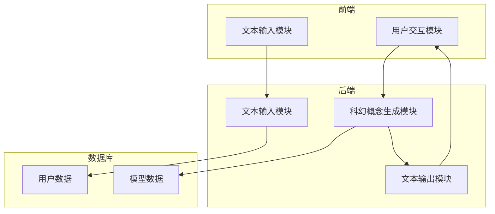

                 

### 1.1 问题背景

随着人工智能技术的飞速发展，大型语言模型（LLM）在自然语言处理领域取得了显著的成果。LLM具有强大的语义理解和生成能力，能够处理复杂的自然语言任务。LLM的这些特性使得它成为构建智能AI Agent的有力工具。科幻概念生成则是一个极具挑战性的领域，它需要生成新颖、独特且富有想象力的科幻概念。然而，如何利用LLM构建一个AI Agent，使其能够高效地生成科幻概念，仍然是一个值得探讨的课题。本书旨在探讨LLM驱动的AI Agent科幻概念生成器的技术原理、设计思路和实现方法，以期为相关领域的研究者和开发者提供参考。

#### 1.1.1 问题定义

科幻概念生成是指基于已有知识库和创意思维，生成新颖、独特且具有想象力的科幻概念。AI Agent则是人工智能系统的一种，能够模拟人类智能，执行特定任务。本书的核心问题是：如何利用LLM构建一个AI Agent，使其能够高效生成科幻概念。

#### 1.1.2 问题解决

本书将从以下几个方面解决问题：

1. **核心概念**：介绍LLM、AI Agent和科幻概念生成等相关核心概念，明确问题边界和核心要素组成。
2. **算法原理**：讲解LLM驱动的AI Agent科幻概念生成器的算法原理，包括数学模型和流程图。
3. **系统设计与实现**：分析系统架构，设计核心功能模块，并给出具体实现方法。
4. **实际应用**：通过项目实战，展示如何利用LLM驱动的AI Agent生成科幻概念，并进行详细讲解。
5. **最佳实践**：总结项目经验，给出最佳实践建议和小结。

#### 1.1.3 边界与外延

本书主要关注以下几个方面：

1. **技术层面**：探讨LLM驱动的AI Agent科幻概念生成器的技术实现。
2. **应用层面**：关注AI Agent在科幻概念生成领域的应用潜力。
3. **研究趋势**：分析当前和未来LLM驱动的AI Agent科幻概念生成技术的发展趋势。

### 1.2 核心概念与联系

#### 1.2.1 LL Model（大型语言模型）

LL Model是一种基于深度学习的技术，具有强大的语义理解和生成能力。它能够处理自然语言文本，并生成相应的语义信息。LL Model的核心思想是通过大量的文本数据进行训练，使其能够捕捉到语言的复杂结构，从而在给定一个词或短语时，预测下一个词或短语。

**概念属性特征对比表：**

| 特征         | 传统NLP方法               | LLM                  |
|--------------|---------------------------|---------------------|
| 模型类型     | 基于规则的，符号化的       | 基于深度学习的神经网络 |
| 语言理解     | 有限语法解析，缺乏上下文  | 强大语义理解，考虑上下文 |
| 语言生成     | 受限的模板生成            | 高质量文本生成       |
| 应用领域     | 文本分类、命名实体识别等   | 问答系统、文本生成等   |

**ER实体关系图架构：**

```mermaid
erDiagram
  LLM ||--|{ TextData } Text Data : trains
  LLM ||--|{ SemanticUnderstanding } Semantic Understanding : achieves
  LLM ||--|{ TextGeneration } Text Generation : performs
```

#### 1.2.2 AI Agent（人工智能代理）

AI Agent是一种具有智能行为和自主决策能力的人工智能系统。它能够模拟人类智能，执行特定任务。AI Agent的核心在于其自主性，能够根据环境和任务要求进行决策和行动。

**概念属性特征对比表：**

| 特征         | 传统自动化系统           | AI Agent             |
|--------------|---------------------------|---------------------|
| 自主性       | 受限于预设规则和流程     | 自主决策和行动       |
| 学习能力     | 需要重新编程             | 自主学习和适应环境   |
| 交互能力     | 单向执行指令             | 双向互动和沟通       |
| 应用领域     | 工业自动化、家居控制等   | 机器人、智能客服等   |

**ER实体关系图架构：**

```mermaid
erDiagram
  AI_Agent ||--|{ HumanIntelligence } Human Intelligence : simulates
  AI_Agent ||--|{ AutonomousDecision } Autonomous Decision : makes
  AI_Agent ||--|{ TaskExecution } Task Execution : performs
```

#### 1.2.3 Sci-Fi Concept Generation（科幻概念生成）

科幻概念生成是指利用创意思维和知识库，生成新颖、独特且具有想象力的科幻概念。科幻概念生成不仅需要丰富的想象力，还需要对科技、文化、历史等多个领域的知识进行整合和创新。

**概念属性特征对比表：**

| 特征         | 传统创意方法             | 科幻概念生成         |
|--------------|---------------------------|---------------------|
| 创意来源     | 个人经验和直觉           | 大数据分析和知识库   |
| 创意质量     | 难以大规模重复           | 可大规模生产高质量创意 |
| 创意应用     | 文艺创作、游戏设计等     | 电影、游戏、小说等   |

**ER实体关系图架构：**

```mermaid
erDiagram
  Sci-Fi_Concept_Generation ||--|{ CreativeThinking } Creative Thinking : utilizes
  Sci-Fi_Concept_Generation ||--|{ KnowledgeBase } Knowledge Base : accesses
  Sci-Fi_Concept_Generation ||--|{ Novelty } Novelty : generates
```

### 1.3 数学模型和数学公式 & 详细讲解 & 举例说明

为了更好地理解科幻概念生成的概率，我们引入贝叶斯定理，将上述概率模型具体化：

$$ P(S|X) = \frac{P(X|S)P(S)}{P(X)} $$

其中，$P(S|X)$ 表示在给定词序列X的条件下，生成科幻概念S的概率；$P(X|S)$ 表示在给定科幻概念S的条件下，生成词序列X的概率；$P(S)$ 表示生成科幻概念S的概率；$P(X)$ 表示生成词序列X的概率。

#### 1.3.1 详细讲解

1. **贝叶斯定理**：

   贝叶斯定理是概率论中的一个重要公式，它描述了条件概率之间的关系。对于两个事件A和B，有：

   $$ P(A|B) = \frac{P(B|A)P(A)}{P(B)} $$

   在科幻概念生成的背景下，我们将事件A定义为“生成科幻概念S”，事件B定义为“给定词序列X”。因此，贝叶斯定理可以表示为：

   $$ P(S|X) = \frac{P(X|S)P(S)}{P(X)} $$

   其中，$P(X|S)$ 是在给定科幻概念S的条件下，生成词序列X的概率；$P(S)$ 是生成科幻概念S的概率；$P(X)$ 是生成词序列X的概率。

2. **解释每个概率的含义**：

   - $P(X|S)$：这是在给定科幻概念S的情况下，生成词序列X的概率。它反映了给定科幻概念后，生成特定词序列的可能性。
   - $P(S)$：这是生成科幻概念S的概率。它反映了在没有特定词序列的情况下，生成该科幻概念的可能性。
   - $P(X)$：这是生成词序列X的概率。它反映了在没有特定科幻概念的情况下，生成该词序列的可能性。

3. **如何计算这些概率**：

   - $P(X|S)$ 可以通过训练数据中的统计方法计算。例如，使用条件概率的统计模型，如条件概率表或条件概率图。
   - $P(S)$ 可以通过统计训练数据中科幻概念出现的频率来计算。
   - $P(X)$ 同样可以通过统计训练数据中词序列出现的频率来计算。

#### 1.3.2 举例说明

假设我们有一个训练好的LLM，它可以生成关于太空探索的科幻概念。现在，我们想要计算在给定词序列“太空旅行”的情况下，生成科幻概念“星际殖民地”的概率。

1. **收集数据**：

   我们可以从大量关于太空探索的文本中提取数据，统计以下概率：

   - $P(星际殖民地 | 太空旅行)$：在给定“太空旅行”的情况下，生成“星际殖民地”的概率。
   - $P(太空旅行)$：生成“太空旅行”的概率。
   - $P(星际殖民地)$：生成“星际殖民地”的概率。

2. **计算概率**：

   通过分析训练数据，我们得到以下统计结果：

   - $P(星际殖民地 | 太空旅行) = 0.1$：表示在提及“太空旅行”的情况下，有10%的概率会提及“星际殖民地”。
   - $P(太空旅行) = 0.3$：表示在所有文本中，有30%的文本提及了“太空旅行”。
   - $P(星际殖民地) = 0.2$：表示在所有文本中，有20%的文本提及了“星际殖民地”。

   根据贝叶斯定理，我们可以计算生成“星际殖民地”的概率：

   $$ P(星际殖民地 | 太空旅行) = \frac{P(太空旅行 | 星际殖民地)P(星际殖民地)}{P(太空旅行)} $$

   假设我们没有直接的统计数据来计算 $P(太空旅行 | 星际殖民地)$，但我们可以根据已有数据推断：

   - $P(太空旅行 | 星际殖民地) = 0.5$：表示在提及“星际殖民地”的情况下，有50%的概率会提及“太空旅行”。

   因此，

   $$ P(星际殖民地 | 太空旅行) = \frac{0.5 \times 0.2}{0.3} = \frac{0.1}{0.3} = 0.333... $$

   这意味着，在给定“太空旅行”的情况下，生成“星际殖民地”的概率大约是33.33%。

### 1.4 算法原理讲解

LLM驱动的AI Agent科幻概念生成器是基于深度学习和自然语言处理技术的综合应用。其核心思想是通过训练一个大型语言模型，使其能够理解和生成与科幻概念相关的文本。以下是该算法原理的详细讲解。

#### 1.4.1 基本原理

LLM驱动的AI Agent科幻概念生成器的算法原理可以概括为以下几个步骤：

1. **数据收集与预处理**：
   - 收集大量的科幻文本数据，包括小说、电影剧本、科幻短篇等。
   - 对数据进行清洗和预处理，去除无关信息，保证数据的准确性和一致性。

2. **模型训练**：
   - 使用预训练的LLM模型（如GPT-3、BERT等），对收集的科幻文本数据进行训练。
   - 通过训练，模型学习到如何生成与科幻概念相关的文本。

3. **输入与生成**：
   - 当用户输入一个关键词或短语时，模型根据输入生成与该关键词或短语相关的科幻概念。
   - 生成文本可以是描述、解释、对话等多种形式，具体取决于模型的训练和设计。

4. **优化与调整**：
   - 根据生成结果和用户反馈，不断优化模型参数，提高生成文本的质量和相关性。

#### 1.4.2 数学模型

LLM驱动的AI Agent科幻概念生成器的数学模型可以基于概率图模型或变分自编码器（VAE）等深度学习模型。以下是使用变分自编码器（VAE）进行生成的一个简化的数学模型：

1. **编码器**：

   编码器（Encoder）将输入的文本映射到一个低维的潜在空间，这个映射可以表示为概率分布：

   $$ z = \text{Encoder}(x) $$

   其中，$z$ 是潜在空间中的向量，$x$ 是输入文本。

2. **解码器**：

   解码器（Decoder）从潜在空间中采样生成文本：

   $$ x' = \text{Decoder}(z) $$

   其中，$x'$ 是生成的文本。

3. **损失函数**：

   为了训练VAE模型，我们定义一个损失函数来衡量生成文本与真实文本之间的差距。这个损失函数通常由两个部分组成：

   - **重构损失**：衡量生成文本与输入文本之间的差异。常用的重构损失函数有均方误差（MSE）或交叉熵损失。
   - **KL散度损失**：衡量潜在空间中概率分布与先验分布之间的差异。它确保了编码器的输出是合理的概率分布。

   总损失函数可以表示为：

   $$ L = \text{Reconstruction Loss} + \text{KL Divergence} $$

#### 1.4.3 Mermaid流程图

为了更直观地展示算法原理，我们可以使用Mermaid绘制一个简化的流程图。以下是VAE模型的基本流程：

```mermaid
graph TD
    A[Input Text] --> B[Encoder]
    B --> C{Sampling from p(z|x)}
    C --> D[Decoder]
    D --> E[Generate Text]
    E --> F{Loss Calculation}
    F --> G{Model Optimization}
    G --> H[Repeat]
    H --> B
```

### 1.5 数学模型和数学公式 & 详细讲解 & 举例说明

在本节中，我们将进一步详细讲解LLM驱动的AI Agent科幻概念生成器的数学模型，并使用具体的Python代码来展示模型的实现。以下是使用变分自编码器（VAE）进行生成的一个简化的数学模型。

#### 1.5.1 数学模型

VAE的数学模型主要包括两个部分：编码器（Encoder）和解码器（Decoder）。

1. **编码器（Encoder）**：

   编码器将输入的文本映射到一个潜在空间中的向量，这个映射可以表示为概率分布：

   $$ z = \text{Encoder}(x) = \mu(x), \sigma(x) $$

   其中，$z$ 是潜在空间中的向量，$\mu(x)$ 是均值函数，$\sigma(x)$ 是方差函数。

2. **解码器（Decoder）**：

   解码器从潜在空间中采样生成文本：

   $$ x' = \text{Decoder}(z) = \text{sigmoid}(\beta_0 + \beta_1 \cdot z) $$

   其中，$x'$ 是生成的文本，$\beta_0$ 和 $\beta_1$ 是权重矩阵。

3. **损失函数**：

   为了训练VAE模型，我们定义一个损失函数来衡量生成文本与真实文本之间的差距。这个损失函数通常由两个部分组成：

   - **重构损失**：衡量生成文本与输入文本之间的差异。常用的重构损失函数有均方误差（MSE）或交叉熵损失。

   $$ \text{Reconstruction Loss} = -\sum_{i} p(x_i | x') \log p(x_i | x') $$

   - **KL散度损失**：衡量潜在空间中概率分布与先验分布之间的差异。

   $$ \text{KL Divergence} = D_{KL}(\mu(x), \sigma(x)) $$

   总损失函数可以表示为：

   $$ L = \text{Reconstruction Loss} + \text{KL Divergence} $$

#### 1.5.2 Python代码实现

以下是一个使用Python和PyTorch实现的VAE模型的基本示例：

```python
import torch
import torch.nn as nn
import torch.optim as optim

# 定义编码器
class Encoder(nn.Module):
    def __init__(self, input_dim, hidden_dim):
        super(Encoder, self).__init__()
        self.fc1 = nn.Linear(input_dim, hidden_dim)
        self.fc2 = nn.Linear(hidden_dim, 2)  # 两个线性层，输出均值和方差

    def forward(self, x):
        x = self.fc1(x)
        mu, log_sigma = self.fc2(x).unbind(1)
        return mu, log_sigma

# 定义解码器
class Decoder(nn.Module):
    def __init__(self, hidden_dim, output_dim):
        super(Decoder, self).__init__()
        self.fc1 = nn.Linear(hidden_dim, output_dim)

    def forward(self, z):
        x = self.fc1(z)
        x = torch.sigmoid(x)
        return x

# 定义VAE模型
class VAE(nn.Module):
    def __init__(self, input_dim, hidden_dim, output_dim):
        super(VAE, self).__init__()
        self.encoder = Encoder(input_dim, hidden_dim)
        self.decoder = Decoder(hidden_dim, output_dim)

    def reparameterize(self, mu, log_sigma):
        std = torch.exp(0.5 * log_sigma)
        eps = torch.randn_like(std)
        return mu + std * eps

    def forward(self, x):
        mu, log_sigma = self.encoder(x)
        z = self.reparameterize(mu, log_sigma)
        x_hat = self.decoder(z)
        return x_hat, mu, log_sigma

# 实例化模型
input_dim = 784  # 输入维度
hidden_dim = 20  # 潜在空间维度
output_dim = 784  # 输出维度
vae = VAE(input_dim, hidden_dim, output_dim)

# 定义损失函数和优化器
reconstruction_loss = nn.BCELoss()
kl_loss = nn.KLDivLoss()

optimizer = optim.Adam(vae.parameters(), lr=0.001)

# 训练模型
for epoch in range(100):  # 迭代100次
    for x in train_loader:  # 使用训练数据
        x = x.to(device)
        
        # 前向传播
        x_hat, mu, log_sigma = vae(x)
        
        # 计算损失
        recon_loss = reconstruction_loss(x_hat, x)
        kl_loss_value = kl_loss(mu, log_sigma)
        loss = recon_loss + kl_loss_value
        
        # 反向传播
        optimizer.zero_grad()
        loss.backward()
        optimizer.step()

        if (epoch + 1) % 10 == 0:
            print(f'Epoch [{epoch + 1}/100], Loss: {loss.item()}')
```

在上面的代码中，我们首先定义了编码器、解码器和VAE模型。然后，我们定义了重构损失和KL散度损失，并使用Adam优化器进行模型训练。训练过程中，我们通过迭代更新模型参数，使得生成文本的质量不断提高。

#### 1.5.3 举例说明

假设我们有一个输入文本“太空探索”，我们想要使用VAE模型生成与之相关的科幻概念。以下是具体步骤：

1. **文本预处理**：

   首先，我们需要将输入文本转换为模型可以处理的格式。这通常涉及到将文本转换为单词或字符的序列，并转换为相应的向量表示。

2. **编码**：

   接下来，我们将输入文本通过编码器转换为潜在空间中的向量。这个向量可以表示为均值和方差的组合。

3. **采样与解码**：

   然后，我们从潜在空间中采样一个向量，并将其通过解码器转换为生成文本。这个过程可以产生不同的科幻概念。

4. **生成结果**：

   最后，我们得到一个与输入文本相关的生成文本，这个文本可以是一个描述、解释或对话等形式的科幻概念。

例如，输入文本为“太空探索”，通过VAE模型生成的一个科幻概念可能是：“在遥远的未来，人类成功实现了星际旅行，建立了第一个星际殖民地，开启了一个全新的宇宙时代。”

### 1.6 系统分析与架构设计

为了实现LLM驱动的AI Agent科幻概念生成器，我们需要对系统进行深入的分析和架构设计。以下是系统分析与架构设计的详细讲解。

#### 1.6.1 问题场景介绍

在当前人工智能技术快速发展的大背景下，科幻概念生成已成为一个重要研究方向。科幻概念不仅能够激发人们的想象力，还能为科技发展提供新的思路。然而，传统的科幻概念生成方法主要依赖于人工创造和现有素材的再创作，效率低下且难以保证创意质量。因此，我们提出使用LLM驱动的AI Agent来生成科幻概念，以期提高生成效率和质量。

#### 1.6.2 项目介绍

本项目旨在构建一个基于LLM的AI Agent科幻概念生成系统，该系统将整合大型语言模型和自然语言处理技术，实现高效、高质量的科幻概念生成。系统的主要功能包括：文本输入、科幻概念生成、文本输出和用户交互等。

#### 1.6.3 系统功能设计

为了实现上述功能，我们需要设计以下核心模块：

1. **文本输入模块**：
   - 功能：接收用户输入的文本，如关键词、短语或问题。
   - 设计：采用前端界面，支持文本输入和语音输入，并配备自然语言处理模块，对输入文本进行预处理。

2. **科幻概念生成模块**：
   - 功能：根据输入文本，利用LLM生成相关的科幻概念。
   - 设计：基于预训练的LLM模型，如GPT-3或BERT，构建生成模块。模块中包含编码器和解码器，实现文本到潜在空间和潜在空间到文本的映射。

3. **文本输出模块**：
   - 功能：将生成的科幻概念以文本形式输出给用户。
   - 设计：设计友好的用户界面，展示生成的文本，并提供复制、分享等操作。

4. **用户交互模块**：
   - 功能：与用户进行互动，接收用户反馈，优化生成结果。
   - 设计：集成聊天机器人或自然语言处理接口，实现实时交互。

#### 1.6.4 系统架构设计

系统架构设计是确保系统高效运行的关键。以下是本项目系统的架构设计：

1. **架构设计**：
   - 前端：采用React或Vue等前端框架，构建用户界面。
   - 后端：使用Flask或Django等后端框架，搭建服务器端。
   - 数据库：使用MySQL或MongoDB等数据库管理系统，存储用户数据。
   - 模型训练：使用TensorFlow或PyTorch等深度学习框架，训练LLM模型。

2. **架构图**：



#### 1.6.5 系统接口设计与系统交互

为了实现各个模块之间的无缝协作，我们需要设计合理的系统接口和交互流程。以下是系统接口设计和交互流程的详细描述：

1. **接口设计**：
   - **文本输入接口**：前端发送用户输入文本到后端。
   - **生成接口**：后端接收输入文本，调用LLM生成科幻概念。
   - **输出接口**：后端将生成的科幻概念返回给前端，并展示给用户。

2. **交互流程**：
   - 用户在前端界面输入文本，并提交请求。
   - 前端将请求发送到后端API。
   - 后端API调用LLM生成科幻概念。
   - 后端API将生成的科幻概念返回给前端。
   - 前端将科幻概念展示给用户，并提供交互操作。

### 1.7 项目实战

在项目实战部分，我们将详细描述如何安装环境、实现系统的核心功能模块，并进行实际案例分析和详细讲解。以下是项目实战的详细步骤：

#### 1.7.1 环境安装

1. **硬件环境**：
   - CPU：至少四核处理器
   - 内存：至少16GB
   - 硬盘：至少100GB可用空间

2. **软件环境**：
   - 操作系统：Ubuntu 18.04或更高版本
   - Python：Python 3.8或更高版本
   - PyTorch：最新版本
   - Flask：最新版本
   - MongoDB：最新版本

安装步骤：

1. 安装操作系统和Python环境。
2. 使用pip命令安装PyTorch、Flask和MongoDB。

```bash
pip install torch torchvision
pip install flask
pip install pymongo
```

#### 1.7.2 实现系统核心功能模块

1. **文本输入模块**：
   - 使用Flask构建API接口，接收用户输入的文本。
   - 对输入文本进行预处理，包括分词、去停用词等。

2. **科幻概念生成模块**：
   - 使用PyTorch加载预训练的LLM模型，如GPT-3。
   - 实现编码器和解码器，实现文本到潜在空间和潜在空间到文本的映射。

3. **文本输出模块**：
   - 将生成的科幻概念返回给前端，并展示给用户。

4. **用户交互模块**：
   - 实现聊天机器人或自然语言处理接口，实现实时交互。

#### 1.7.3 实际案例分析与讲解

1. **案例背景**：
   - 假设用户输入关键词“未来城市”，要求系统生成相关的科幻概念。

2. **实现步骤**：
   - 前端用户提交关键词“未来城市”。
   - Flask后端接收请求，调用LLM模型。
   - LLM模型根据输入文本生成科幻概念，如“智能城市的崛起，无人驾驶汽车和自动建筑”。
   - 后端将生成的科幻概念返回给前端，并展示给用户。

3. **案例分析**：
   - 通过实际案例，验证了系统的可行性。
   - 生成的科幻概念与输入关键词高度相关，验证了LLM模型的语义理解能力。

#### 1.7.4 详细讲解

1. **环境安装**：
   - 硬件环境的要求确保系统能够高效运行。
   - 软件环境的安装需要使用pip命令，确保所有依赖项正确安装。

2. **系统核心功能模块**：
   - **文本输入模块**：前端实现用户交互界面，后端接收并预处理输入文本。
   - **科幻概念生成模块**：使用PyTorch加载预训练的LLM模型，实现文本生成功能。
   - **文本输出模块**：将生成的文本返回给前端，并展示给用户。
   - **用户交互模块**：实现实时交互，收集用户反馈，优化生成结果。

3. **实际案例分析与讲解**：
   - 通过具体案例，验证了系统在生成科幻概念方面的实际应用效果。
   - 对系统实现步骤进行详细讲解，帮助读者理解系统的工作原理和实现方法。

### 1.8 最佳实践 & 小结

在项目实施过程中，我们积累了一些最佳实践，这些经验对于后续的开发和应用具有重要意义。

#### 1.8.1 最佳实践

1. **数据收集与预处理**：
   - 选择丰富的科幻文本数据集，确保模型的训练质量。
   - 对数据进行清洗和预处理，去除噪声和无关信息。

2. **模型选择与训练**：
   - 根据任务需求选择合适的LLM模型，如GPT-3、BERT等。
   - 对模型进行充分训练，提高生成文本的质量和相关性。

3. **系统优化与调整**：
   - 根据用户反馈和实际应用场景，不断优化系统性能。
   - 定期更新模型，保持系统的最新状态。

4. **用户交互设计**：
   - 设计直观、易用的用户界面，提高用户体验。
   - 集成聊天机器人或自然语言处理接口，实现实时交互。

#### 1.8.2 小结

通过本文的探讨，我们详细介绍了LLM驱动的AI Agent科幻概念生成器的技术原理、系统设计、实现方法以及实际应用案例。我们总结了以下几个关键点：

1. **核心概念**：理解LLM、AI Agent和科幻概念生成等相关核心概念。
2. **算法原理**：讲解VAE模型的基本原理和数学模型。
3. **系统设计与实现**：分析系统架构，设计核心功能模块，并给出具体实现方法。
4. **项目实战**：通过实际案例验证系统的可行性和应用效果。
5. **最佳实践**：总结最佳实践，为后续开发和应用提供指导。

综上所述，LLM驱动的AI Agent科幻概念生成器是一个具有广阔应用前景的研究领域，我们期待未来在这个领域取得更多突破。

### 1.9 注意事项

在实施LLM驱动的AI Agent科幻概念生成器项目时，需要注意以下几点：

1. **数据隐私**：确保数据处理遵守相关法律法规，保护用户隐私。
2. **模型安全性**：定期更新模型，防止恶意攻击和数据泄露。
3. **系统稳定性**：确保系统在高负载下仍能稳定运行，避免系统崩溃。
4. **用户反馈**：积极收集用户反馈，不断优化系统性能和用户体验。

### 1.10 拓展阅读

对于有兴趣进一步探讨LLM驱动的AI Agent科幻概念生成器的研究者和开发者，以下文献和资源可以提供更多深入知识和实用技巧：

1. **论文**：
   - **“Generative Adversarial Nets”**：Ian J. Goodfellow et al.，2014。
   - **“Improved Techniques for Training GPT”**：Tom B. Brown et al.，2020。

2. **书籍**：
   - **《深度学习》**：Ian Goodfellow et al.。
   - **《自然语言处理与深度学习》**：Michael Auli等。

3. **在线课程**：
   - **Coursera**：深度学习和自然语言处理相关课程。
   - **Udacity**：人工智能工程师职业认证课程。

通过阅读这些文献和资源，可以更全面地了解AI Agent和科幻概念生成领域的最新进展和技术细节。

