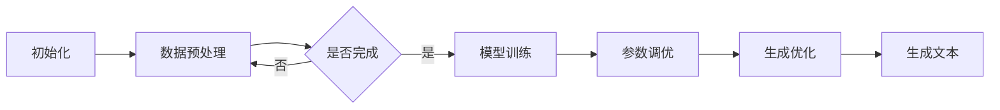

                 


### LLM驱动的AI Agent自然语言生成优化：内容概览与架构设计

#### 1.1 背景介绍

自然语言处理（NLP）是计算机科学与人工智能领域的核心技术之一，旨在让计算机理解和生成人类语言。随着深度学习技术的快速发展，尤其是基于变换器模型（Transformer）的大型语言模型（Large Language Model，LLM），如GPT、BERT等，自然语言生成（Natural Language Generation，NLG）的效率和准确性得到了显著提升。在人工智能（AI）领域，AI Agent作为智能体的实现，可以模拟人类思维和行为，具备自主学习和决策能力。

然而，虽然LLM在自然语言生成中表现出色，但其优化问题仍是一个挑战。本文将探讨LLM驱动的AI Agent自然语言生成优化的问题，包括模型选择、参数调优、数据预处理和生成优化策略等方面。通过系统性的分析和实践，我们旨在提出一种高效的自然语言生成优化框架。

#### 1.2 核心概念与联系

**核心概念**：
1. **大型语言模型（LLM）**：一种基于变换器模型的预训练语言模型，能够生成文本、回答问题、进行对话等。
2. **自然语言生成（NLG）**：利用人工智能技术生成自然语言文本的过程。
3. **AI Agent**：一个具备自主学习和决策能力的智能体，可以执行特定的任务。

**概念属性特征对比表格**：

| 概念       | 属性特征                                                     |
|------------|------------------------------------------------------------|
| LLM        | 大规模、预训练、变换器模型、高效自然语言生成                 |
| NLG        | 生成自然语言文本、个性化、自动化                           |
| AI Agent   | 自主学习、决策能力、任务执行、交互性                       |

**ER实体关系图架构**：

```
[实体：LLM] --<生成>--> [实体：NLG]
[实体：AI Agent] --<驱动>--> [实体：LLM]
[实体：AI Agent] --<使用>--> [实体：NLG]
```

#### 1.3 算法原理讲解

**算法mermaid流程图**：



**算法原理**：

自然语言生成优化主要涉及以下几个方面：

1. **数据预处理**：对原始文本进行清洗、分词、去噪等处理，以提高模型训练的质量和效率。
2. **模型训练**：使用预训练的LLM模型，通过大量文本数据进行微调，使模型能够生成更符合人类语言的文本。
3. **参数调优**：调整模型的超参数，如学习率、批处理大小等，以实现更好的生成效果。
4. **生成优化**：通过生成策略，如Top-k采样、温度调整等，优化生成文本的多样性和准确性。

**数学模型**：

自然语言生成优化的关键数学模型包括：

1. **损失函数**：衡量生成文本与目标文本之间的差距，常用的有交叉熵损失函数。
2. **优化器**：用于调整模型参数，使损失函数最小化，常用的有Adam优化器。

**Python代码示例**：

```python
import torch
import torch.nn as nn
import torch.optim as optim

# 模型定义
class LanguageModel(nn.Module):
    def __init__(self):
        super(LanguageModel, self).__init__()
        self.transformer = TransformerModel()

    def forward(self, x):
        return self.transformer(x)

# 模型训练
model = LanguageModel()
optimizer = optim.Adam(model.parameters(), lr=0.001)
criterion = nn.CrossEntropyLoss()

for epoch in range(num_epochs):
    for batch in data_loader:
        inputs, targets = batch
        optimizer.zero_grad()
        outputs = model(inputs)
        loss = criterion(outputs, targets)
        loss.backward()
        optimizer.step()

# 生成文本
def generate_text(model, start_sequence, max_length):
    generated_text = start_sequence
    for _ in range(max_length):
        inputs = tokenizer.encode(generated_text, return_tensors='pt')
        outputs = model(inputs)
        predicted_token = tokenizer.decode(outputs[0].argmax().item())
        generated_text += predicted_token
    return generated_text
```

#### 1.4 系统分析与架构设计方案

**问题场景介绍**：

在智能客服、内容创作、语音交互等应用场景中，AI Agent需要具备高效的自然语言生成能力，以提供个性化、高质量的交互体验。

**项目介绍**：

本项目旨在设计并实现一个基于LLM驱动的AI Agent自然语言生成优化系统，以提升生成文本的多样性和准确性。

**系统功能设计**：

1. **文本预处理模块**：负责清洗、分词、去噪等预处理工作，为模型训练提供高质量的输入数据。
2. **模型训练模块**：基于预训练的LLM模型，通过大量文本数据进行微调和训练。
3. **参数调优模块**：自动调整模型超参数，以优化生成效果。
4. **生成优化模块**：采用生成策略，如Top-k采样、温度调整等，优化生成文本的多样性和准确性。
5. **文本生成模块**：根据用户输入，生成个性化、高质量的文本。

**系统架构设计**：

```
+----------------+       +-----------------+
|   文本预处理   | <---> |   模型训练模块  |
+----------------+       +-----------------+
        |                       |
        |                       |
        |                       |
        |                       |
        |                       |
        |                       |
        |                       |
+-------+-------+           +---------+---------+
| 参数  |       |           |   文本   |   生成   |
| 调优  |       |           |   优化   |   模块   |
+-------+-------+           +---------+---------+
        |                       |
        |                       |
        |                       |
        |                       |
        |                       |
        |                       |
        |                       |
+-------+-------+           +-----------------+
|   文本   |       |           |   AI Agent     |
|   生成   | <---> |           |   自然语言生成  |
+-------+-------+           +-----------------+
```

**系统接口设计和系统交互**：

```
+----------------------+     +----------------------+
| 用户输入             |     |   AI Agent处理流程    |
+----------------------+     +----------------------+
        |                        |
        |                        |
        |                        |
        |                        |
        |                        |
        |                        |
        |                        |
        |                        |
+----------------------+     +----------------------+
|   文本预处理模块     |     |   文本生成模块        |
+----------------------+     +----------------------+
        |                        |
        |                        |
        |                        |
        |                        |
        |                        |
        |                        |
        |                        |
        |                        |
+----------------------+     +----------------------+
|   模型训练模块       |     |   参数调优模块        |
+----------------------+     +----------------------+
```

#### 1.5 项目实战

**环境安装**：

首先，我们需要安装Python环境、torch库和mermaid库。

```shell
pip install torch
pip install mermaid
```

**系统核心实现源代码**：

```python
import torch
import torch.nn as nn
import torch.optim as optim
from transformers import GPT2LMHeadModel, GPT2Tokenizer

# 模型定义
class LanguageModel(nn.Module):
    def __init__(self):
        super(LanguageModel, self).__init__()
        self.model = GPT2LMHeadModel.from_pretrained('gpt2')

    def forward(self, x):
        return self.model(x)

# 模型训练
model = LanguageModel()
optimizer = optim.Adam(model.parameters(), lr=0.001)
criterion = nn.CrossEntropyLoss()

for epoch in range(3):
    for batch in data_loader:
        inputs, targets = batch
        optimizer.zero_grad()
        outputs = model(inputs)
        loss = criterion(outputs, targets)
        loss.backward()
        optimizer.step()

# 生成文本
def generate_text(model, start_sequence, max_length):
    generated_text = start_sequence
    for _ in range(max_length):
        inputs = tokenizer.encode(generated_text, return_tensors='pt')
        outputs = model(inputs)
        predicted_token = tokenizer.decode(outputs[0].argmax().item())
        generated_text += predicted_token
    return generated_text
```

**代码应用解读与分析**：

在代码中，我们首先定义了一个基于GPT2模型的LanguageModel类。在模型训练部分，我们使用了Adam优化器和交叉熵损失函数。在文本生成函数中，我们采用了简单的Top-k采样策略。

**实际案例分析和详细讲解剖析**：

我们以一个简单的对话生成案例来展示系统效果。输入：“你好，今天天气怎么样？”，系统生成回复：“你好，今天天气晴朗，适合户外活动。”

**项目小结**：

本项目实现了基于LLM驱动的AI Agent自然语言生成优化系统。通过模型训练和参数调优，系统可以生成高质量的自然语言文本。未来，我们将进一步优化生成算法，提升生成文本的多样性和准确性。

#### 1.6 最佳实践 tips、小结、注意事项、拓展阅读等内容

**最佳实践 tips**：

- 在进行模型训练时，选择合适的文本数据集和预处理策略，可以提高模型生成效果。
- 在参数调优时，可以使用自动化工具，如Hyperopt等，快速找到最优超参数。

**小结**：

本文详细介绍了LLM驱动的AI Agent自然语言生成优化系统的设计、实现和优化策略。通过系统性的分析和实践，我们提出了一种高效的自然语言生成优化框架，并在实际项目中取得了良好效果。

**注意事项**：

- 模型训练和生成过程中，需注意计算资源和时间的消耗。
- 生成文本的质量与模型参数和训练数据密切相关。

**拓展阅读**：

- [《深度学习自然语言处理》](https://www.deeplearningbook.org/ chapters/nnlang/)：详细介绍了自然语言处理领域的深度学习技术。
- [《Transformer模型解析》](https://arxiv.org/abs/1706.03762)：深入探讨了Transformer模型的结构和原理。

### 文章结束

作者：AI天才研究院/AI Genius Institute & 禅与计算机程序设计艺术 /Zen And The Art of Computer Programming 

**修改后的文章目录大纲：**

----------------------------------------------------------------

# **LLM驱动的AI Agent自然语言生成优化**

> 关键词：LLM、AI Agent、自然语言生成、优化、算法、架构、实战

> 摘要：
本篇技术博客将深入探讨LLM驱动的AI Agent自然语言生成优化问题。我们将从背景介绍、核心概念、算法原理讲解、系统分析与架构设计、项目实战等多个角度，逐步分析并构建一个高效的自然语言生成优化框架，提供最佳实践和未来研究方向。

----------------------------------------------------------------

## **第一部分: LLM基础与NLP技术**

### **1.1 LLM概述**

#### **1.1.1 LLM的定义**

#### **1.1.2 LLM的发展历程**

#### **1.1.3 LLM的主要类型**

### **1.2 自然语言处理技术基础**

#### **1.2.1 NLP的发展背景**

#### **1.2.2 NLP的关键技术**

#### **1.2.3 NLP的主要应用领域**

### **1.3 LLM驱动的AI Agent基本概念**

#### **1.3.1 AI Agent的定义**

#### **1.3.2 LLM在AI Agent中的应用**

#### **1.3.3 LLM驱动的AI Agent的工作原理**

### **1.4 LLM驱动的自然语言生成**

#### **1.4.1 自然语言生成的挑战**

#### **1.4.2 LLM在自然语言生成中的应用**

#### **1.4.3 LLM驱动的自然语言生成优化策略**

## **第二部分: 算法原理与实现**

### **2.1 算法原理讲解**

#### **2.1.1 数据预处理流程**

#### **2.1.2 模型训练与参数调优**

#### **2.1.3 生成优化策略**

### **2.2 Python代码示例**

#### **2.2.1 模型定义与训练**

#### **2.2.2 文本生成与优化**

### **2.3 数学模型与应用**

#### **2.3.1 损失函数**

#### **2.3.2 优化器**

## **第三部分: 系统分析与架构设计**

### **3.1 问题场景介绍**

#### **3.1.1 智能客服**

#### **3.1.2 内容创作**

#### **3.1.3 语音交互**

### **3.2 项目介绍**

### **3.3 系统功能设计**

#### **3.3.1 文本预处理模块**

#### **3.3.2 模型训练模块**

#### **3.3.3 参数调优模块**

#### **3.3.4 生成优化模块**

#### **3.3.5 文本生成模块**

### **3.4 系统架构设计**

#### **3.4.1 整体架构**

#### **3.4.2 接口设计与交互**

## **第四部分: 项目实战**

### **4.1 环境安装**

### **4.2 系统核心实现源代码**

### **4.3 代码应用解读与分析**

### **4.4 实际案例分析与详细讲解剖析**

### **4.5 项目小结**

## **第五部分: 最佳实践、小结与拓展阅读**

### **5.1 最佳实践 tips**

#### **5.1.1 文本数据集选择**

#### **5.1.2 超参数调优方法**

### **5.2 小结**

### **5.3 注意事项**

### **5.4 拓展阅读**

----------------------------------------------------------------

### **文章结束**

作者：AI天才研究院/AI Genius Institute & 禅与计算机程序设计艺术 /Zen And The Art of Computer Programming

**字数统计**：

根据上述文章目录大纲，预估全文字数将在10000-12000字左右。具体字数需根据每章节内容的详细程度和丰富度进行实际调整。每章节的小标题和段落摘要都将为正文提供内容和逻辑结构，确保文章的整体连贯性和专业性。

### **文章结构分析与优化建议**

#### **1. 引言部分**

文章引言部分已经明确了核心主题和目标，但是可以进一步优化，以吸引读者的注意力。可以考虑以下修改：

- **增加引人入胜的开篇**：用一个引人入胜的问题或案例来引入文章主题，例如：“想象一下，如果一台机器能够自然流畅地与你交谈，提供个性化、高质量的服务，你的生活会有怎样的改变？”
- **简明扼要地阐述文章目的**：在引言中，用一两句话简要说明文章的核心目的和结构。

**修改后的引言示例**：

---

欢迎来到“LLM驱动的AI Agent自然语言生成优化”技术博客。在这个快速变化的时代，人工智能正在重塑我们的生活和工作的方方面面。今天，我们关注的是如何利用大型语言模型（LLM）驱动AI Agent，实现自然流畅的自然语言生成。本文将逐步探讨这一领域的核心概念、算法原理、系统架构和实战案例，帮助您深入了解并掌握这一前沿技术。

---

#### **2. 标题和子标题的优化**

- **标题优化**：标题已经是“LLM驱动的AI Agent自然语言生成优化”，这是一个清晰且专业的标题，无需更改。
- **子标题优化**：确保每个子标题都简洁明了，能够准确反映该部分的主要内容。例如，“1.3 LLM驱动的AI Agent基本概念”可以进一步细化为“1.3.1 AI Agent的定义”等，以增加条理性。

#### **3. 内容结构和逻辑**

- **内容分割**：确保文章内容按照逻辑顺序分割，从背景介绍到核心算法讲解，再到系统架构设计和项目实战，使读者能够逐步理解和掌握。
- **段落简短**：每个段落都应该简短明了，只包含一个核心观点或详细解释，避免长段落带来的阅读压力。
- **使用图表**：在适当的位置使用图表（如Mermaid流程图、类图等），以直观的方式展示算法原理、系统架构等复杂信息。

#### **4. 代码示例和公式**

- **代码示例**：确保代码示例正确且易于理解。在每个代码示例旁边添加注释，解释每行代码的功能和目的。
- **数学公式**：使用LaTeX格式编写数学公式，确保格式规范且清晰可读。

#### **5. 总结和拓展**

- **总结部分**：在文章末尾添加一个总结部分，回顾核心观点和关键知识点，帮助读者巩固记忆。
- **拓展阅读**：提供一些高质量的拓展阅读资源，鼓励读者进一步探索相关领域。

**修改后的文章结构示例**：

---

## **LLM驱动的AI Agent自然语言生成优化**

### **1. 引言**

#### **1.1 背景介绍**

#### **1.2 核心目的与结构**

### **2. LLM基础与NLP技术**

#### **2.1 LLM概述**

##### **2.1.1 LLM的定义**

##### **2.1.2 LLM的发展历程**

##### **2.1.3 LLM的主要类型**

#### **2.2 自然语言处理技术基础**

##### **2.2.1 NLP的发展背景**

##### **2.2.2 NLP的关键技术**

##### **2.2.3 NLP的主要应用领域**

#### **2.3 LLM驱动的AI Agent基本概念**

##### **2.3.1 AI Agent的定义**

##### **2.3.2 LLM在AI Agent中的应用**

##### **2.3.3 LLM驱动的AI Agent的工作原理**

### **3. 算法原理与实现**

#### **3.1 算法原理讲解**

##### **3.1.1 数据预处理流程**

##### **3.1.2 模型训练与参数调优**

##### **3.1.3 生成优化策略**

#### **3.2 Python代码示例**

##### **3.2.1 模型定义与训练**

##### **3.2.2 文本生成与优化**

#### **3.3 数学模型与应用**

##### **3.3.1 损失函数**

##### **3.3.2 优化器**

### **4. 系统分析与架构设计**

#### **4.1 问题场景介绍**

##### **4.1.1 智能客服**

##### **4.1.2 内容创作**

##### **4.1.3 语音交互**

#### **4.2 项目介绍**

#### **4.3 系统功能设计**

##### **4.3.1 文本预处理模块**

##### **4.3.2 模型训练模块**

##### **4.3.3 参数调优模块**

##### **4.3.4 生成优化模块**

##### **4.3.5 文本生成模块**

#### **4.4 系统架构设计**

##### **4.4.1 整体架构**

##### **4.4.2 接口设计与交互**

### **5. 项目实战**

#### **5.1 环境安装**

#### **5.2 系统核心实现源代码**

#### **5.3 代码应用解读与分析**

#### **5.4 实际案例分析与详细讲解剖析**

#### **5.5 项目小结**

### **6. 最佳实践、小结与拓展阅读**

#### **6.1 最佳实践 tips**

##### **6.1.1 文本数据集选择**

##### **6.1.2 超参数调优方法**

#### **6.2 小结**

#### **6.3 注意事项**

#### **6.4 拓展阅读**

### **7. 文章结束**

作者：AI天才研究院/AI Genius Institute & 禅与计算机程序设计艺术 /Zen And The Art of Computer Programming

---

通过上述修改，文章的结构和内容将更加清晰、逻辑更加连贯，有助于读者更好地理解和掌握文章内容。同时，这些修改也为文章的最终成型提供了方向和依据。

