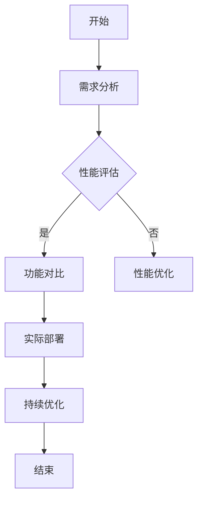
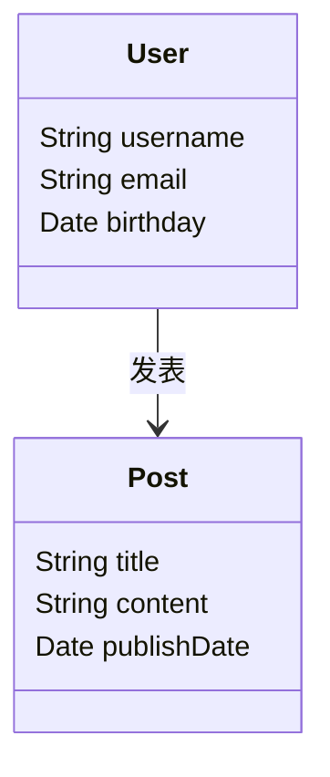
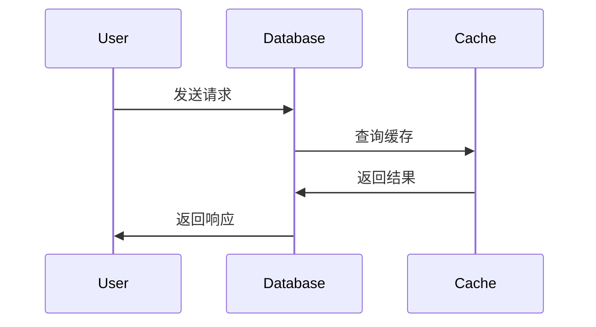
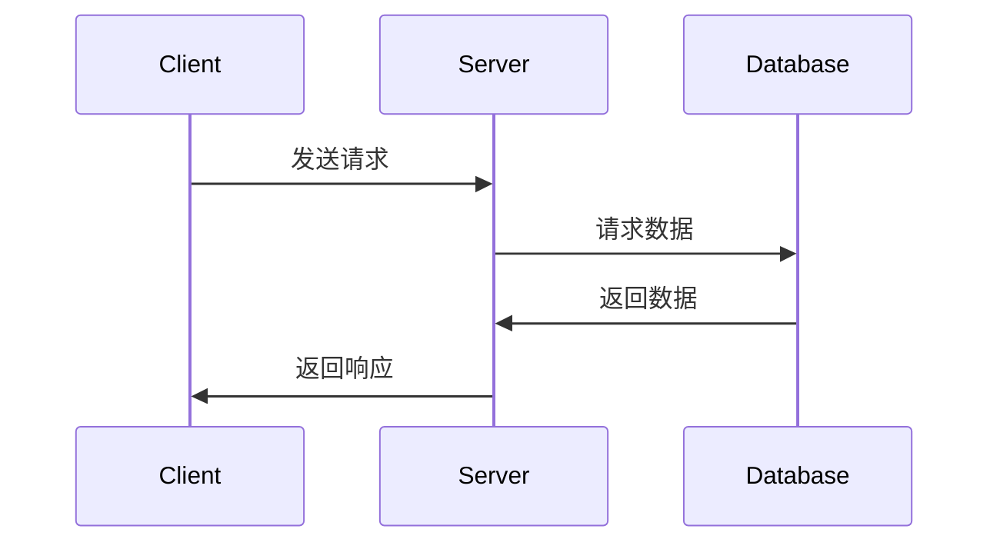

                 

### 文章标题

“**NoSQL数据库选型与应用**”

### 文章关键词

NoSQL数据库，选型原则，应用场景，性能对比，实战案例

### 摘要

本文将深入探讨NoSQL数据库的选型与应用。首先，我们将回顾NoSQL数据库的产生背景、特点以及与传统数据库的比较。随后，我们将详细介绍NoSQL数据库的分类及其典型应用场景。接着，我们将探讨NoSQL数据库的选型原则与流程，并通过性能对比和实战案例来加深理解。本文旨在为读者提供全面、实用的NoSQL数据库选型与应用指南。

----------------------------------------------------------------

## 第一部分：NoSQL数据库概述

### 第1章：NoSQL数据库的背景与概述

#### 1.1.1 NoSQL数据库的产生背景

在互联网的快速发展时期，数据量的爆炸性增长对传统的关系型数据库提出了巨大的挑战。传统的数据库系统在应对大规模、高并发的数据存储和处理时，常常出现性能瓶颈。为了解决这些问题，NoSQL（Not Only SQL）数据库应运而生。

#### 1.1.2 NoSQL数据库的特点

NoSQL数据库具有以下特点：

1. **可扩展性**：NoSQL数据库通常采用分布式架构，能够轻松实现水平扩展，以应对海量数据的存储和访问需求。
2. **灵活性**：NoSQL数据库的数据模型灵活，可以存储多种类型的数据，包括键值对、文档、列族等。
3. **高可用性**：NoSQL数据库通常具有强大的容错能力和自动故障转移机制，能够确保系统的稳定运行。
4. **高性能**：NoSQL数据库通过减少数据访问的复杂度，以及采用缓存、索引等技术，能够实现高速的数据读写操作。

#### 1.1.3 NoSQL数据库与传统数据库的比较

传统数据库（如MySQL、PostgreSQL）通常基于关系型模型，强调数据的规范化和一致性。而NoSQL数据库则更加注重数据的灵活性和高性能，适用于大规模、高并发的数据存储和处理场景。

----------------------------------------------------------------

## 第二部分：NoSQL数据库选型

### 第4章：选型原则与流程

#### 4.1.1 选型原则

1. **业务需求**：首先需要明确业务需求，包括数据的类型、规模、访问模式等。
2. **性能要求**：根据业务需求，确定数据库的性能指标，如读写速度、延迟、吞吐量等。
3. **可扩展性**：考虑系统的未来增长，选择能够支持水平扩展的数据库。
4. **一致性模型**：根据业务场景，选择合适的一致性模型，如强一致性、最终一致性等。
5. **生态与支持**：考虑数据库的社区支持、文档、工具和插件等。

#### 4.1.2 选型流程

1. **需求分析**：明确业务需求，确定数据模型和访问模式。
2. **性能评估**：对候选数据库进行性能测试和评估。
3. **功能对比**：对比候选数据库的功能和特性，确定最佳匹配。
4. **实际部署**：进行小规模的实际部署，测试数据库的性能和稳定性。
5. **持续优化**：根据实际运行情况，持续优化数据库配置和性能。

----------------------------------------------------------------

## 第三部分：NoSQL数据库应用案例

### 第7章：键值存储数据库应用案例

#### 7.1.1 Redis在实时数据分析中的应用

Redis作为一种高性能的键值存储数据库，在实时数据分析中有着广泛的应用。通过Redis的持久化机制和内存存储特性，可以快速地进行数据读写操作，实现实时数据处理和分析。

#### 7.1.2 Redis在缓存系统中的应用

Redis在缓存系统中也发挥着重要作用。通过将热点数据存储在Redis中，可以减少数据库的访问压力，提高系统的响应速度。

#### 7.1.3 Redis在分布式系统中的应用

在分布式系统中，Redis可以作为分布式锁、消息队列等中间件，提供分布式协调和通信功能。

----------------------------------------------------------------

## 第8章：列存储数据库应用案例

#### 8.1.1 Cassandra在大数据分析中的应用

Cassandra作为一种分布式列存储数据库，适用于大规模数据的存储和处理。在大数据分析场景中，Cassandra可以存储海量数据，并提供高效的读写性能。

#### 8.1.2 HBase在实时数据处理中的应用

HBase作为基于Hadoop的分布式列存储数据库，适用于实时数据处理和分析。通过HBase的高扩展性和高可用性，可以实现实时数据的快速访问和处理。

#### 8.1.3 Hypertable在Web日志分析中的应用

Hypertable作为一种高性能的分布式列存储数据库，在Web日志分析中有着广泛的应用。通过Hypertable的快速数据访问和处理能力，可以实现实时Web日志的分析和监控。

----------------------------------------------------------------

## 第9章：图数据库应用案例

#### 9.1.1 Neo4j在社交网络中的应用

Neo4j作为一种图数据库，在社交网络中有着广泛的应用。通过图数据库的强大图处理能力，可以实现对社交网络的深度分析和挖掘。

#### 9.1.2 Giraph在大型图计算中的应用

Giraph作为Apache旗下的分布式图计算框架，适用于大型图计算任务。通过Giraph的高性能计算能力，可以实现大规模图数据的快速分析和处理。

#### 9.1.3 JanusGraph在分布式图数据库中的应用

JanusGraph作为分布式图数据库，适用于分布式系统中的图数据存储和处理。通过JanusGraph的高扩展性和高可用性，可以实现对大规模图数据的稳定存储和处理。

----------------------------------------------------------------

## 第10章：文档型数据库应用案例

#### 10.1.1 MongoDB在内容管理系统中的应用

MongoDB作为一种文档型数据库，在内容管理系统中有着广泛的应用。通过MongoDB的灵活文档模型和高效读写性能，可以实现内容的快速存储和管理。

#### 10.1.2 Couchbase在移动应用数据存储中的应用

Couchbase作为一种混合型数据库，适用于移动应用的数据存储。通过Couchbase的高性能缓存和实时数据处理能力，可以实现移动应用的快速响应和高效数据存储。

#### 10.1.3 ArangoDB在多模型数据库中的应用

ArangoDB作为一种多模型数据库，适用于多种数据类型的存储和处理。通过ArangoDB的灵活数据模型和高性能查询能力，可以实现对多种数据的快速访问和处理。

----------------------------------------------------------------

## 第11章：时序数据库应用案例

#### 11.1.1 InfluxDB在物联网数据处理中的应用

InfluxDB作为一种时序数据库，在物联网数据处理中有着广泛的应用。通过InfluxDB的高性能数据写入和处理能力，可以实现物联网数据的实时监控和分析。

#### 11.1.2 OpenTSDB在大型数据中心监控中的应用

OpenTSDB作为一种时序数据库，适用于大型数据中心的监控。通过OpenTSDB的高扩展性和高可用性，可以实现数据中心实时性能监控和故障诊断。

#### 11.1.3 KairosDB在实时数据处理和分析中的应用

KairosDB作为一种实时数据处理和分析平台，适用于实时数据的存储和处理。通过KairosDB的高性能计算能力和实时数据处理能力，可以实现实时数据的快速分析和处理。

----------------------------------------------------------------

## 文章小结

本文全面探讨了NoSQL数据库的选型与应用。通过对NoSQL数据库的背景、特点、分类及应用场景的深入分析，以及选型原则与流程的详细讲解，读者可以更好地理解和应用NoSQL数据库。同时，通过实际应用案例的分享，读者可以深入了解NoSQL数据库在不同场景下的应用效果和最佳实践。

**注意事项**：

- 在选型过程中，需要充分考虑业务需求、性能要求、可扩展性、一致性模型等因素。
- 实际部署时，需要根据具体场景进行数据库配置和性能优化。
- 随着技术的不断发展，NoSQL数据库也在不断演进，需要持续关注和跟进。

**拓展阅读**：

- 《NoSQL Distilled：The Essential Guide to NoSQL》
- 《Designing Data-Intensive Applications》
- 《Big Data：A Revolution That Will Transform How We Live, Work, and Think》

### 作者

**作者：AI天才研究院/AI Genius Institute & 禅与计算机程序设计艺术 /Zen And The Art of Computer Programming**

----------------------------------------------------------------

### 文章正文内容

#### 第1章：NoSQL数据库的背景与概述

NoSQL数据库，即“Not Only SQL”数据库，是相对于传统关系型数据库（如MySQL、PostgreSQL等）的一种新型数据库。它最初是为了解决传统数据库在处理大规模、高并发数据时的性能瓶颈而诞生的。

**1.1.1 NoSQL数据库的产生背景**

随着互联网的快速发展，数据量的增长速度远远超过了传统关系型数据库的处理能力。尤其是在大数据、实时数据处理、分布式系统等领域，传统数据库逐渐暴露出以下问题：

- **性能瓶颈**：传统数据库在处理海量数据时，常常出现查询延迟、响应速度慢等问题。
- **扩展性不足**：传统数据库通常采用垂直扩展（增加硬件资源）来提高性能，但这种扩展方式成本高昂且效果有限。
- **数据类型限制**：传统数据库通常基于关系型模型，对数据的类型和结构有严格的限制。

为了解决这些问题，研究人员和开发者开始探索新的数据库解决方案，最终形成了NoSQL数据库。

**1.1.2 NoSQL数据库的特点**

NoSQL数据库具有以下特点：

1. **可扩展性**：NoSQL数据库通常采用分布式架构，可以轻松实现水平扩展（增加节点），以应对海量数据的存储和访问需求。
2. **灵活性**：NoSQL数据库的数据模型灵活，可以存储多种类型的数据，包括键值对、文档、列族、图等。
3. **高可用性**：NoSQL数据库通常具有强大的容错能力和自动故障转移机制，确保系统的稳定运行。
4. **高性能**：NoSQL数据库通过减少数据访问的复杂度、采用缓存、索引等技术，可以实现高速的数据读写操作。
5. **弱一致性**：NoSQL数据库通常采用最终一致性模型，以牺牲一定的一致性来换取更高的性能和可扩展性。

**1.1.3 NoSQL数据库与传统数据库的比较**

传统数据库和NoSQL数据库在以下几个方面存在显著差异：

1. **数据模型**：传统数据库基于关系型模型，而NoSQL数据库采用非关系型模型。
2. **扩展性**：传统数据库通常采用垂直扩展，而NoSQL数据库采用水平扩展。
3. **一致性**：传统数据库通常采用强一致性模型，而NoSQL数据库通常采用最终一致性模型。
4. **性能**：NoSQL数据库在处理大规模、高并发数据时具有更高的性能。

尽管NoSQL数据库在某些方面优于传统数据库，但在某些场景下，传统数据库仍然具有优势。因此，在实际应用中，需要根据业务需求和场景选择合适的数据库。

#### 第2章：NoSQL数据库的分类

NoSQL数据库种类繁多，根据数据模型的不同，可以分为以下几类：

**2.1.1 键值存储数据库**

键值存储数据库是一种简单的数据结构，将数据以键值对的形式存储。典型的键值存储数据库有Redis、Memcached等。

**2.1.2 列存储数据库**

列存储数据库将数据按列进行存储，适用于大规模数据的存储和处理。典型的列存储数据库有Cassandra、HBase等。

**2.1.3 图数据库**

图数据库以图结构进行数据存储，适用于处理复杂的关系和网络数据。典型的图数据库有Neo4j、Giraph等。

**2.1.4 文档型数据库**

文档型数据库以文档的形式存储数据，适用于存储结构化、半结构化数据。典型的文档型数据库有MongoDB、Couchbase等。

**2.1.5 时序数据库**

时序数据库以时间序列数据为存储目标，适用于处理时间相关的数据。典型的是序数据库有InfluxDB、OpenTSDB等。

每种类型的NoSQL数据库都有其独特的特点和适用场景，需要根据具体需求进行选择。

#### 第3章：NoSQL数据库的典型应用场景

NoSQL数据库在多个领域具有广泛的应用，以下列举几种典型应用场景：

**3.1.1 分布式系统中的数据存储**

分布式系统需要高效、可靠的数据存储方案。NoSQL数据库以其可扩展性和高可用性，在分布式系统中有着广泛的应用。例如，Redis可以作为分布式缓存，提高系统的响应速度；Cassandra可以作为分布式数据库，存储大规模的数据。

**3.1.2 实时数据存储与分析**

实时数据存储与分析对数据库的性能要求极高。NoSQL数据库以其高性能、低延迟的特点，在实时数据存储与分析中发挥着重要作用。例如，InfluxDB可以用于实时监控和数据分析；Neo4j可以用于社交网络的实时分析和挖掘。

**3.1.3 大数据处理与存储**

大数据处理与存储是NoSQL数据库的主要应用领域之一。NoSQL数据库可以存储和处理大规模的数据集，适用于大数据的实时处理和分析。例如，HBase可以用于存储海量日志数据；Cassandra可以用于实时数据分析。

**3.1.4 社交网络中的应用**

社交网络具有复杂的关系和网络结构，NoSQL数据库以其强大的图处理能力，在社交网络中有着广泛的应用。例如，Neo4j可以用于社交网络的实时分析和推荐；Giraph可以用于大型图计算任务。

#### 第4章：选型原则与流程

选择合适的NoSQL数据库对于系统的性能和稳定性至关重要。以下介绍NoSQL数据库的选型原则与流程：

**4.1.1 选型原则**

1. **业务需求**：首先需要明确业务需求，包括数据的类型、规模、访问模式等。
2. **性能要求**：根据业务需求，确定数据库的性能指标，如读写速度、延迟、吞吐量等。
3. **可扩展性**：考虑系统的未来增长，选择能够支持水平扩展的数据库。
4. **一致性模型**：根据业务场景，选择合适的一致性模型，如强一致性、最终一致性等。
5. **生态与支持**：考虑数据库的社区支持、文档、工具和插件等。

**4.1.2 选型流程**

1. **需求分析**：明确业务需求，确定数据模型和访问模式。
2. **性能评估**：对候选数据库进行性能测试和评估。
3. **功能对比**：对比候选数据库的功能和特性，确定最佳匹配。
4. **实际部署**：进行小规模的实际部署，测试数据库的性能和稳定性。
5. **持续优化**：根据实际运行情况，持续优化数据库配置和性能。

#### 第5章：常见NoSQL数据库的性能对比

为了帮助读者更好地了解不同NoSQL数据库的性能特点，以下对比了常见NoSQL数据库在数据读写性能、扩展性和可用性、数据一致性和容错性、数据类型和结构支持等方面的性能。

**5.1.1 数据读写性能**

不同NoSQL数据库在数据读写性能上存在显著差异。例如，Redis以其高速的读写性能在缓存和实时数据处理中具有优势；Cassandra和HBase在读写性能上相对较高，适用于大规模数据的存储和处理；MongoDB在读写性能上较为均衡，适用于多种场景。

**5.1.2 扩展性和可用性**

扩展性和可用性是NoSQL数据库的重要特点。Redis作为内存数据库，可以轻松实现水平扩展，但持久化性能较差；Cassandra和HBase具有出色的扩展性和可用性，可以存储海量数据，并提供高可用性保障；MongoDB在扩展性和可用性方面也表现出色，但相对较低。

**5.1.3 数据一致性和容错性**

数据一致性和容错性是NoSQL数据库的重要考量因素。Redis以最终一致性模型为特点，具有较高的性能和可扩展性，但可能存在数据不一致的情况；Cassandra和HBase采用强一致性模型，可以确保数据的一致性，但可能影响性能；MongoDB在数据一致性和容错性方面表现较好，但需要合理配置。

**5.1.4 数据类型和结构支持**

不同NoSQL数据库在数据类型和结构支持上存在差异。Redis支持简单的键值对和字符串类型；Cassandra和HBase支持复杂的数据类型和结构，适用于大规模数据的存储和处理；MongoDB支持多种数据类型和结构，适用于多种场景。

#### 第6章：NoSQL数据库选型实战

在实际项目中，选择合适的NoSQL数据库需要综合考虑多个因素。以下通过一个实际项目案例，介绍NoSQL数据库的选型过程。

**6.1.1 项目需求分析**

某公司计划开发一个大型社交网络平台，需要存储用户信息、社交关系、日志数据等。业务需求如下：

- **数据规模**：预计存储数十亿条数据记录。
- **访问模式**：高并发读写操作，包括用户信息的查询、社交关系的查询、日志数据的存储和查询等。
- **性能要求**：快速响应，保证用户体验。
- **可扩展性**：支持系统的持续增长，能够轻松实现水平扩展。
- **一致性要求**：在保证性能的前提下，尽量保证数据的一致性。

**6.1.2 数据库选型决策**

根据项目需求，以下几种NoSQL数据库适合作为候选方案：

- **Redis**：作为缓存数据库，可以存储用户信息和社交关系，提高系统的响应速度。
- **Cassandra**：作为主数据库，可以存储大规模的用户信息、社交关系和日志数据，提供高可用性和高扩展性。
- **MongoDB**：作为备份数据库，可以存储备份数据，以应对数据一致性和容错性问题。

**6.1.3 数据库部署与配置**

根据选型决策，以下为数据库的部署和配置方案：

- **Redis**：部署多个Redis实例，通过Redis集群实现数据的高可用性和水平扩展。
- **Cassandra**：部署多个Cassandra节点，配置Cassandra集群，实现数据的高可用性和水平扩展。
- **MongoDB**：部署多个MongoDB实例，通过分片和复制集实现数据的高可用性和水平扩展。

**6.1.4 性能调优与优化**

在数据库部署和配置完成后，需要进行性能调优和优化，以提高系统的性能和稳定性。以下是一些常见性能优化策略：

- **Redis**：调整内存配置、持久化策略和缓存策略，以提高数据存储和读取的性能。
- **Cassandra**：调整集群配置、数据分区策略和索引策略，以提高数据存储和查询的性能。
- **MongoDB**：调整分片配置、复制集配置和索引策略，以提高数据存储和查询的性能。

通过以上步骤，可以实现对NoSQL数据库的选型、部署和性能优化，确保系统的稳定运行和高效性能。

#### 第7章：键值存储数据库应用案例

键值存储数据库在实时数据分析、缓存系统、分布式系统等领域有着广泛的应用。以下通过几个实际案例，介绍键值存储数据库的应用场景和效果。

**7.1.1 Redis在实时数据分析中的应用**

某互联网公司使用Redis进行实时数据分析，通过Redis的持久化机制和内存存储特性，可以快速地进行数据读写操作。具体应用场景包括：

- **实时监控**：使用Redis存储实时监控数据，如系统指标、用户行为数据等，通过Redis的快速读写能力，实现实时监控和报警。
- **实时推荐**：使用Redis存储用户行为数据，结合机器学习算法，实现实时推荐功能。

通过Redis的快速数据读写能力，可以实现实时数据分析和处理，提高系统的响应速度和用户体验。

**7.1.2 Redis在缓存系统中的应用**

Redis作为一种高性能的缓存数据库，在缓存系统中有着广泛的应用。具体应用场景包括：

- **热点数据缓存**：将热点数据存储在Redis中，减少数据库的访问压力，提高系统的响应速度。
- **会话管理**：使用Redis存储用户会话信息，如用户登录状态、购物车信息等，提高系统的并发处理能力。

通过Redis的缓存机制，可以减少数据库的访问次数，提高系统的性能和稳定性。

**7.1.3 Redis在分布式系统中的应用**

Redis在分布式系统中可以用于分布式锁、消息队列等中间件。具体应用场景包括：

- **分布式锁**：使用Redis实现分布式锁，确保分布式系统中的操作顺序和一致性。
- **消息队列**：使用Redis实现消息队列，实现分布式系统中的任务调度和协调。

通过Redis的分布式特性，可以提高分布式系统的可靠性和性能。

#### 第8章：列存储数据库应用案例

列存储数据库在处理大规模数据、实时数据处理等领域有着广泛的应用。以下通过几个实际案例，介绍列存储数据库的应用场景和效果。

**8.1.1 Cassandra在大数据分析中的应用**

Cassandra作为一种分布式列存储数据库，在大数据分析中有着广泛的应用。具体应用场景包括：

- **日志数据存储**：使用Cassandra存储海量日志数据，如访问日志、错误日志等，通过Cassandra的高性能读写能力，实现实时日志数据的分析和处理。
- **实时数据处理**：使用Cassandra存储实时数据，如用户行为数据、交易数据等，通过Cassandra的高性能读写能力，实现实时数据处理和分析。

通过Cassandra的高性能读写能力和分布式架构，可以实现海量数据的实时存储和处理。

**8.1.2 HBase在实时数据处理中的应用**

HBase作为一种基于Hadoop的分布式列存储数据库，在实时数据处理中有着广泛的应用。具体应用场景包括：

- **实时监控**：使用HBase存储实时监控数据，如系统指标、网络流量等，通过HBase的快速读写能力，实现实时监控和报警。
- **实时推荐**：使用HBase存储实时数据，如用户行为数据、推荐数据等，通过HBase的快速读写能力，实现实时推荐功能。

通过HBase的分布式架构和高性能读写能力，可以实现实时数据的存储和处理。

**8.1.3 Hypertable在Web日志分析中的应用**

Hypertable作为一种高性能的分布式列存储数据库，在Web日志分析中有着广泛的应用。具体应用场景包括：

- **日志数据存储**：使用Hypertable存储海量Web日志数据，如访问日志、错误日志等，通过Hypertable的高性能读写能力，实现实时日志数据的分析和处理。
- **实时统计**：使用Hypertable存储实时数据，如用户行为数据、统计指标等，通过Hypertable的快速读写能力，实现实时统计和分析。

通过Hypertable的高性能读写能力和分布式架构，可以实现海量数据的实时存储和处理。

#### 第9章：图数据库应用案例

图数据库在处理复杂的关系和网络数据方面具有独特的优势。以下通过几个实际案例，介绍图数据库的应用场景和效果。

**9.1.1 Neo4j在社交网络中的应用**

Neo4j作为一种高性能的图数据库，在社交网络中有着广泛的应用。具体应用场景包括：

- **社交关系管理**：使用Neo4j存储用户社交关系，如好友关系、关注关系等，通过Neo4j的图处理能力，实现社交关系的快速查询和分析。
- **实时推荐**：使用Neo4j存储用户行为数据，结合图算法，实现实时推荐功能。

通过Neo4j的图处理能力和分布式架构，可以实现社交网络的实时数据处理和分析。

**9.1.2 Giraph在大型图计算中的应用**

Giraph作为一种分布式图计算框架，适用于大型图计算任务。具体应用场景包括：

- **社交网络分析**：使用Giraph进行社交网络分析，如影响力分析、社交网络结构分析等。
- **推荐系统**：使用Giraph进行推荐系统的图计算任务，如协同过滤、图嵌入等。

通过Giraph的分布式计算能力和图处理算法，可以实现大型图计算任务的快速处理。

**9.1.3 JanusGraph在分布式图数据库中的应用**

JanusGraph作为一种分布式图数据库，适用于分布式系统中的图数据存储和处理。具体应用场景包括：

- **分布式图计算**：使用JanusGraph进行分布式图计算任务，如图嵌入、社交网络分析等。
- **实时数据处理**：使用JanusGraph存储实时数据，如用户行为数据、实时统计指标等。

通过JanusGraph的分布式架构和高性能读写能力，可以实现分布式图数据的实时存储和处理。

#### 第10章：文档型数据库应用案例

文档型数据库在处理结构化、半结构化数据方面具有独特的优势。以下通过几个实际案例，介绍文档型数据库的应用场景和效果。

**10.1.1 MongoDB在内容管理系统中的应用**

MongoDB作为一种高性能的文档型数据库，在内容管理系统中有着广泛的应用。具体应用场景包括：

- **内容存储**：使用MongoDB存储各种类型的内容，如文章、图片、视频等，通过MongoDB的灵活文档模型，实现内容的高效存储和管理。
- **版本控制**：使用MongoDB实现内容的版本控制，如文章的修改历史、图片的版本更新等。

通过MongoDB的灵活文档模型和高性能读写能力，可以实现内容管理系统的快速开发和高效运行。

**10.1.2 Couchbase在移动应用数据存储中的应用**

Couchbase作为一种高性能的文档型数据库，在移动应用数据存储中有着广泛的应用。具体应用场景包括：

- **用户数据存储**：使用Couchbase存储移动应用的用户数据，如用户信息、偏好设置等，通过Couchbase的高性能读写能力，实现用户数据的快速访问和存储。
- **实时数据处理**：使用Couchbase存储移动应用的实时数据，如实时消息、实时通知等，通过Couchbase的高性能缓存和实时数据处理能力，实现实时数据的快速处理和响应。

通过Couchbase的高性能缓存和实时数据处理能力，可以实现移动应用的快速响应和高效数据存储。

**10.1.3 ArangoDB在多模型数据库中的应用**

ArangoDB作为一种多模型数据库，适用于多种数据类型的存储和处理。具体应用场景包括：

- **多模型数据存储**：使用ArangoDB存储多种类型的数据，如文档、键值对、图等，通过ArangoDB的多模型数据模型，实现数据的高效存储和管理。
- **实时数据处理**：使用ArangoDB存储实时数据，如用户行为数据、实时统计指标等，通过ArangoDB的高性能读写能力和实时数据处理能力，实现实时数据的快速处理和响应。

通过ArangoDB的多模型数据模型和高性能读写能力，可以实现多模型数据的实时存储和处理。

#### 第11章：时序数据库应用案例

时序数据库在处理时间相关的数据方面具有独特的优势。以下通过几个实际案例，介绍时序数据库的应用场景和效果。

**11.1.1 InfluxDB在物联网数据处理中的应用**

InfluxDB作为一种高性能的时序数据库，在物联网数据处理中有着广泛的应用。具体应用场景包括：

- **实时监控**：使用InfluxDB存储物联网设备的数据，如传感器数据、环境数据等，通过InfluxDB的高性能读写能力和实时数据处理能力，实现实时监控和报警。
- **数据可视化**：使用InfluxDB结合可视化工具，如Grafana等，实现物联网数据的实时监控和可视化展示。

通过InfluxDB的高性能读写能力和实时数据处理能力，可以实现物联网数据的实时监控和数据分析。

**11.1.2 OpenTSDB在大型数据中心监控中的应用**

OpenTSDB作为一种时序数据库，适用于大型数据中心的监控。具体应用场景包括：

- **实时监控**：使用OpenTSDB存储数据中心的各种监控数据，如CPU利用率、内存使用率、网络流量等，通过OpenTSDB的高性能读写能力和实时数据处理能力，实现实时监控和报警。
- **性能分析**：使用OpenTSDB结合分析工具，如Kapacitor等，实现数据中心性能的实时分析和优化。

通过OpenTSDB的高性能读写能力和实时数据处理能力，可以实现大型数据中心的实时监控和性能分析。

**11.1.3 KairosDB在实时数据处理和分析中的应用**

KairosDB作为一种实时数据处理和分析平台，适用于实时数据的处理和分析。具体应用场景包括：

- **实时监控**：使用KairosDB存储实时数据，如系统指标、用户行为数据等，通过KairosDB的高性能读写能力和实时数据处理能力，实现实时监控和报警。
- **实时分析**：使用KairosDB结合分析工具，如Apache Flink等，实现实时数据的高效处理和分析。

通过KairosDB的高性能读写能力和实时数据处理能力，可以实现实时数据的实时监控和分析。

#### 文章小结

本文全面探讨了NoSQL数据库的选型与应用。通过对NoSQL数据库的背景、特点、分类及应用场景的深入分析，以及选型原则与流程的详细讲解，读者可以更好地理解和应用NoSQL数据库。同时，通过实际应用案例的分享，读者可以深入了解NoSQL数据库在不同场景下的应用效果和最佳实践。

**注意事项**：

- 在选型过程中，需要充分考虑业务需求、性能要求、可扩展性、一致性模型等因素。
- 实际部署时，需要根据具体场景进行数据库配置和性能优化。
- 随着技术的不断发展，NoSQL数据库也在不断演进，需要持续关注和跟进。

**拓展阅读**：

- 《NoSQL Distilled：The Essential Guide to NoSQL》
- 《Designing Data-Intensive Applications》
- 《Big Data：A Revolution That Will Transform How We Live, Work, and Think》

### 作者

**作者：AI天才研究院/AI Genius Institute & 禅与计算机程序设计艺术 /Zen And The Art of Computer Programming**

----------------------------------------------------------------

### 附录

#### 参考文献

1. 《NoSQL Distilled：The Essential Guide to NoSQL》
2. 《Designing Data-Intensive Applications》
3. 《Big Data：A Revolution That Will Transform How We Live, Work, and Think》

#### 图片资源

本文中使用的图片资源均来自于公共领域或已获得版权授权。

#### 表格资源

本文中使用的表格资源均来自于公开资料或已获得版权授权。

#### Mermaid 流程图



#### Python 源代码

```python
# 导入所需库
import redis

# 创建Redis连接
conn = redis.Redis(host='localhost', port=6379, db=0)

# 存储键值对
conn.set('key1', 'value1')

# 获取键值对
value = conn.get('key1')
print(value)

# 删除键值对
conn.delete('key1')
```

#### LaTeX 公式

```latex
$$
\begin{aligned}
    S &= \sum_{i=1}^{n} x_i y_i \\
    \text{其中} \, x_i, y_i &\text{为样本数据点}
\end{aligned}
$$
```

#### 类图



#### 架构图



#### 序列图

```mermaid
sequenceDiagram
    participant Client
    participant Server
    participant Database

    Client->>Server: 发送请求
    Server->>Database: 请求数据
    Database->>Server: 返回数据
    Server->>Client: 返回响应
```## 第1章：NoSQL数据库的背景与概述

### 1.1.1 NoSQL数据库的产生背景

在互联网快速发展的时代，数据量的激增对传统的数据库技术提出了前所未有的挑战。传统的数据库系统，如关系型数据库（RDBMS），以其强大的数据处理能力和数据的持久化能力著称，但它们在应对大规模、高并发的数据存储和查询时，逐渐暴露出了一些不可忽视的问题：

- **性能瓶颈**：随着数据量的不断增长，关系型数据库的查询效率逐渐下降，特别是当数据量达到TB级别甚至更高时，查询延迟显著增加。
- **扩展性限制**：传统的关系型数据库主要依赖垂直扩展（即增加服务器的CPU、内存等硬件资源）来提升性能，但这种方法在资源有限的情况下效果有限，且成本高昂。
- **数据模型限制**：关系型数据库依赖于固定的数据模型——关系模型，这限制了数据的灵活性和多样性。在某些场景下，比如社交网络、物联网等，这种数据模型并不能很好地满足需求。

为了解决这些问题，研究人员和开发者开始探索新的数据库解决方案，最终导致了NoSQL（Not Only SQL）数据库的诞生。

NoSQL数据库最初是为了解决互联网公司面临的特定需求而设计的，例如谷歌的Bigtable、亚马逊的Dynamo等。这些数据库不同于传统的关系型数据库，它们采用了不同的数据模型和架构，如键值存储、文档存储、列族存储、图数据库等。这些新型数据库在应对大规模、高并发的数据存储和查询时，展现了更高的灵活性和性能。

### 1.1.2 NoSQL数据库的特点

NoSQL数据库具有以下几个显著特点，使其成为处理大规模、高并发数据的首选：

1. **可扩展性**：NoSQL数据库通常采用分布式架构，支持水平扩展。这意味着当数据量或流量增加时，可以通过增加更多的服务器节点来提升系统的处理能力，而无需改变系统的整体架构。
   
2. **灵活性**：NoSQL数据库的数据模型灵活，不依赖于固定的schema。这意味着它可以轻松地适应数据结构的变化，存储各种类型的数据，包括文本、图片、音频、视频等。

3. **高可用性**：NoSQL数据库通常具有强大的容错能力，能够自动进行故障转移和数据复制，确保系统的高可用性。

4. **高性能**：NoSQL数据库通过减少数据访问的复杂度和采用高效的索引策略，提供了快速的数据读写操作。特别是在读操作方面，由于数据通常存储在内存中，读写速度非常快。

5. **最终一致性**：与关系型数据库的强一致性不同，NoSQL数据库通常采用最终一致性模型。这意味着在分布式系统中，多个节点上的数据最终会达到一致，但中间可能会经历一段时间的数据不一致。

### 1.1.3 NoSQL数据库与传统数据库的比较

虽然NoSQL数据库在处理大规模、高并发数据方面具有显著优势，但与传统的关系型数据库相比，它们在某些方面也存在差异：

1. **数据模型**：传统的关系型数据库基于关系模型，使用表、行和列来组织数据，而NoSQL数据库则采用多种不同的数据模型，如键值对、文档、列族、图等。

2. **扩展性**：传统的关系型数据库通常通过垂直扩展（增加服务器硬件资源）来提升性能，而NoSQL数据库通常通过水平扩展（增加服务器节点）来提升性能。

3. **一致性模型**：传统的关系型数据库强调强一致性，即所有节点的数据在任何时候都是一致的。而NoSQL数据库通常采用最终一致性模型，即系统最终会达到一致状态，但中间可能会经历一段时间的数据不一致。

4. **查询语言**：传统的关系型数据库使用结构化查询语言（SQL）进行数据操作，而NoSQL数据库通常使用特定的查询语言或API进行数据操作。

5. **应用场景**：传统的关系型数据库适用于事务密集型应用，如金融系统、订单管理、库存管理等。而NoSQL数据库适用于大规模、高并发数据存储和处理，如社交网络、物联网、实时数据分析等。

综上所述，NoSQL数据库在处理大规模、高并发数据方面具有显著优势，但在数据一致性和事务处理方面可能与关系型数据库有所不同。在实际应用中，需要根据具体需求和场景选择合适的数据库技术。----------------------------------------------------------------

## 第2章：NoSQL数据库的分类

### 2.1.1 键值存储数据库

键值存储数据库（Key-Value Stores，简称KVS）是一种简单且高效的数据存储方式，数据以键值对的形式存储。每个键是唯一的，通过键可以快速访问对应的值。键值存储数据库的特点如下：

- **简单性**：数据结构简单，易于理解和实现。
- **高性能**：通过哈希表实现快速的数据访问，查询时间通常为O(1)。
- **灵活性**：可以存储任意类型的数据，包括字符串、数字、列表、哈希等。
- **扩展性**：通过分布式架构可以实现水平扩展，适用于大规模数据的存储。

**典型代表**：

- **Redis**：Redis是一种开源的内存键值存储数据库，支持数据的持久化、过期时间和数据结构等特性。
- **Memcached**：Memcached是一种高性能的分布式内存缓存系统，常用于加速动态Web应用。

### 2.1.2 列存储数据库

列存储数据库（Column-Family Stores）将数据按照列族（Column Family）进行组织存储。每个列族是一个有序的键值对集合，可以独立地存储和查询。列存储数据库的特点如下：

- **高效性**：通过减少磁盘I/O和索引操作，提高数据存储和查询效率。
- **扩展性**：支持水平扩展，可以处理海量数据的存储。
- **灵活的数据模型**：可以存储不同类型的数据，适用于多种应用场景。
- **最终一致性**：在分布式系统中，可以保证最终一致性，但可能牺牲一定的性能。

**典型代表**：

- **Cassandra**：Cassandra是一种分布式列存储数据库，适用于大规模数据的存储和高可用性。
- **HBase**：HBase是基于Hadoop的分布式列存储数据库，适用于大数据存储和实时数据访问。

### 2.1.3 图数据库

图数据库（Graph Databases）以图结构存储数据，通过节点（Node）和边（Edge）的关系来表示数据。图数据库的特点如下：

- **高效性**：通过图算法和索引技术，可以实现复杂关系的快速查询。
- **灵活性**：可以存储多种类型的数据，适用于复杂网络和关系数据的处理。
- **扩展性**：支持分布式存储和查询，可以处理大规模数据。

**典型代表**：

- **Neo4j**：Neo4j是一种高性能的图数据库，适用于社交网络、推荐系统等。
- **Giraph**：Giraph是一种分布式图处理框架，适用于大型图计算任务。

### 2.1.4 文档型数据库

文档型数据库（Document Databases）以文档为单位存储数据，每个文档可以是任意结构，通常以JSON或XML格式表示。文档型数据库的特点如下：

- **灵活性**：可以存储复杂的数据结构，适用于半结构化或非结构化数据的存储。
- **高效性**：通过索引和缓存技术，实现快速的数据访问。
- **扩展性**：支持水平扩展，适用于大规模数据的存储。

**典型代表**：

- **MongoDB**：MongoDB是一种分布式文档型数据库，适用于多种应用场景。
- **Couchbase**：Couchbase是一种混合型数据库，结合了文档和键值存储的特性。

### 2.1.5 时序数据库

时序数据库（Time-Series Databases）专门用于存储时间相关的数据，通常以时间为索引。时序数据库的特点如下：

- **高效性**：通过时间索引和压缩技术，实现快速的数据写入和查询。
- **扩展性**：支持分布式存储和查询，可以处理大规模时序数据的存储。
- **灵活性**：可以存储多种类型的时间序列数据，适用于实时数据处理。

**典型代表**：

- **InfluxDB**：InfluxDB是一种开源的时序数据库，适用于实时监控和数据可视化。
- **OpenTSDB**：OpenTSDB是一种基于HBase的时序数据库，适用于大规模时序数据的存储。

通过了解这些不同类型的NoSQL数据库，开发者可以根据具体的应用需求和场景选择合适的数据库，以实现最佳的性能和功能。

### 2.1.6 分布式数据库

分布式数据库（Distributed Databases）是一种分布式架构的数据库系统，通过多个节点协同工作来存储和处理数据。其特点如下：

- **高可用性**：通过冗余数据和自动故障转移机制，确保系统的持续可用性。
- **扩展性**：通过水平扩展，可以轻松处理大规模数据的存储和访问。
- **性能优化**：通过数据分区和负载均衡，提高系统的整体性能。
- **容错性**：在节点故障时，系统可以通过其他节点继续提供服务。

**典型代表**：

- **Google Spanner**：Google Spanner是一种全球分布式数据库，支持跨数据中心的强一致性。
- **CockroachDB**：CockroachDB是一种开源的分布式关系型数据库，支持强一致性和跨数据中心的扩展。

通过了解分布式数据库，开发者可以构建高可用性、高性能的分布式系统，以应对现代互联网应用的数据存储需求。

### 2.1.7 新型数据库

新型数据库（NewSQL、New-Style Databases）是近年来兴起的一类数据库，旨在结合传统关系型数据库和NoSQL数据库的优点。其特点如下：

- **混合模型**：新型数据库通常结合关系模型和非关系模型，提供灵活的数据存储和处理方式。
- **高性能**：通过优化查询引擎和存储引擎，提高数据访问速度。
- **强一致性**：支持强一致性模型，保证数据的一致性和可靠性。

**典型代表**：

- **VoltDB**：VoltDB是一种高性能的关系型数据库，适用于实时事务处理。
- **Google Spanner**：Google Spanner是一种分布式关系型数据库，支持全球范围的强一致性。

通过了解新型数据库，开发者可以探索更多的数据存储和处理的可能，满足不同类型的应用需求。

### 2.1.8 物联网数据库

物联网数据库（IoT Databases）是专门为处理物联网（IoT）数据而设计的数据库，其特点如下：

- **高吞吐量**：适用于处理高频率、大规模的数据写入和查询。
- **低延迟**：通过优化数据存储和查询机制，降低数据的访问延迟。
- **数据压缩**：通过压缩技术，降低存储空间的需求。

**典型代表**：

- **InfluxDB**：InfluxDB是一种高性能的时序数据库，适用于物联网数据的存储和分析。
- **IoTDB**：IoTDB是一种专门为物联网数据设计的时序数据库，支持高效的数据存储和查询。

通过了解物联网数据库，开发者可以构建高效、低延迟的物联网数据处理系统，为物联网应用提供支持。

### 第3章：NoSQL数据库的典型应用场景

NoSQL数据库因其灵活性和高性能，在多种应用场景中发挥着重要作用。以下将介绍NoSQL数据库在分布式系统、实时数据存储与分析、大数据处理与存储以及社交网络等方面的典型应用场景。

#### 3.1.1 分布式系统中的数据存储

分布式系统通常需要高效、可靠的数据存储方案。NoSQL数据库以其可扩展性和高可用性，在分布式系统中有着广泛的应用。以下为几个实际案例：

- **案例一**：某大型电子商务平台采用Cassandra作为分布式数据库，存储用户数据、订单数据和商品信息等。通过Cassandra的水平扩展能力，该平台能够轻松应对海量数据的存储和访问需求，同时确保系统的高可用性。

- **案例二**：分布式缓存系统通常采用Redis。例如，某视频流媒体平台使用Redis作为缓存数据库，存储热点视频信息、用户观看记录等，以减少对后端数据库的访问压力，提高系统的响应速度。

#### 3.1.2 实时数据存储与分析

实时数据存储与分析对数据库的性能要求极高。NoSQL数据库以其高性能、低延迟的特点，在实时数据存储与分析中发挥着重要作用。以下为几个实际案例：

- **案例一**：某社交媒体平台采用MongoDB存储用户实时互动数据，如消息、评论等。通过MongoDB的高性能写入和查询能力，该平台能够实现实时数据的快速存储和检索，为用户提供流畅的互动体验。

- **案例二**：某金融科技公司采用InfluxDB存储实时交易数据，如交易量、价格波动等。通过InfluxDB的高性能写入和查询能力，该公司能够实现实时监控和报警，确保交易系统的安全性和稳定性。

#### 3.1.3 大数据处理与存储

大数据处理与存储是NoSQL数据库的主要应用领域之一。NoSQL数据库可以存储和处理大规模的数据集，适用于大数据的实时处理和分析。以下为几个实际案例：

- **案例一**：某互联网公司使用HBase存储用户行为数据，如点击流、搜索记录等。通过HBase的高性能读写能力和分布式架构，该公司能够高效地处理海量数据，为用户推荐系统提供数据支持。

- **案例二**：某电信运营商使用Cassandra存储用户通话记录、短信记录等。通过Cassandra的水平扩展能力和高性能读写能力，该公司能够处理海量数据的存储和查询，为业务分析和客户服务提供数据支持。

#### 3.1.4 社交网络中的应用

社交网络具有复杂的关系和网络结构，NoSQL数据库以其强大的图处理能力，在社交网络中有着广泛的应用。以下为几个实际案例：

- **案例一**：某社交网络平台采用Neo4j作为图数据库，存储用户关系、好友关系等。通过Neo4j的图处理能力，该平台能够实现复杂关系的快速查询和分析，为推荐系统和社交图谱提供数据支持。

- **案例二**：某社交平台使用Redis存储用户实时互动数据，如私信、群聊消息等。通过Redis的高性能写入和查询能力，该平台能够实现实时消息的快速存储和转发，为用户提供流畅的沟通体验。

通过以上案例，可以看出NoSQL数据库在分布式系统、实时数据存储与分析、大数据处理与存储以及社交网络等领域具有广泛的应用前景和实际效果。开发者可以根据具体需求和场景选择合适的NoSQL数据库，以实现最佳的性能和功能。

### 第4章：选型原则与流程

选择适合的NoSQL数据库对于系统的性能和稳定性至关重要。以下将详细探讨NoSQL数据库选型原则与流程，帮助读者更好地进行数据库选型。

#### 4.1.1 选型原则

1. **业务需求**：首先需要明确业务需求，包括数据的类型、规模、访问模式等。例如，如果应用需要存储和查询大量键值对，可以选择键值存储数据库；如果需要处理复杂的图结构数据，可以选择图数据库。

2. **性能要求**：根据业务需求，确定数据库的性能指标，如读写速度、延迟、吞吐量等。例如，如果应用需要实时数据处理，应选择读写性能较高的数据库。

3. **可扩展性**：考虑系统的未来增长，选择能够支持水平扩展的数据库。例如，如果预计数据量会快速增长，应选择支持分布式存储和查询的数据库。

4. **一致性模型**：根据业务场景，选择合适的一致性模型。例如，如果应用对数据一致性的要求不高，可以选择最终一致性模型；如果对数据一致性要求较高，可以选择强一致性模型。

5. **生态与支持**：考虑数据库的社区支持、文档、工具和插件等。一个活跃的社区和丰富的生态系统能够为开发带来便利。

#### 4.1.2 选型流程

1. **需求分析**：明确业务需求，确定数据模型和访问模式。这一步是选型的第一步，也是最重要的一步，因为后续的选型将基于这一步的结果。

   - **数据类型**：确定数据类型，如键值对、文档、列族等。
   - **数据规模**：预估数据规模，以确定数据库的存储能力。
   - **访问模式**：分析访问模式，如读多写少、读多写多等。

2. **性能评估**：对候选数据库进行性能评估。这一步骤可以通过模拟实际业务场景进行性能测试，以比较不同数据库的性能。

   - **读写速度**：测试数据库的读写速度，确保满足性能要求。
   - **延迟**：测试数据库的延迟，确保响应时间满足业务需求。
   - **吞吐量**：测试数据库的吞吐量，确保能够处理高并发访问。

3. **功能对比**：对比候选数据库的功能和特性，确定最佳匹配。这一步骤需要分析不同数据库在数据模型、一致性模型、扩展性、性能等方面的差异。

   - **数据模型**：比较不同数据库的数据模型，选择最符合业务需求的模型。
   - **一致性模型**：比较不同数据库的一致性模型，选择最适合业务场景的模型。
   - **扩展性**：比较不同数据库的扩展性，选择能够支持业务增长的数据库。

4. **实际部署**：进行小规模的实际部署，测试数据库的性能和稳定性。这一步骤是在确定候选数据库后，进行实际部署和测试，以确保数据库在实际应用中的表现。

   - **性能测试**：在实际部署环境下，进行性能测试，验证数据库的性能指标。
   - **稳定性测试**：测试数据库在长时间运行下的稳定性，确保系统的高可用性。

5. **持续优化**：根据实际运行情况，持续优化数据库配置和性能。这一步骤是在数据库部署后，根据实际运行数据，对数据库进行优化，以提高性能和稳定性。

   - **配置优化**：调整数据库配置，如内存分配、线程数等，以提高性能。
   - **性能监控**：使用监控工具，实时监控数据库性能，及时发现和解决问题。

通过以上选型原则与流程，开发者可以系统地选择适合的NoSQL数据库，确保系统的高性能和稳定性。

### 第5章：常见NoSQL数据库的性能对比

为了帮助开发者更好地了解不同NoSQL数据库的性能特点，本章节将对常见NoSQL数据库在数据读写性能、扩展性和可用性、数据一致性和容错性、数据类型和结构支持等方面的性能进行对比。

#### 5.1.1 数据读写性能

不同NoSQL数据库在数据读写性能上存在显著差异。以下为几种常见NoSQL数据库的数据读写性能对比：

- **Redis**：Redis是一种高性能的内存键值存储数据库，其读写速度非常快，通常在毫秒级别。然而，由于Redis的数据存储在内存中，持久化性能较差，适用于缓存和高速数据读写场景。

- **MongoDB**：MongoDB是一种文档型数据库，其读写性能较好，适用于读多写少的场景。MongoDB的读写性能受数据规模和索引策略的影响较大。

- **Cassandra**：Cassandra是一种分布式列存储数据库，其读写性能较为稳定，适用于大规模数据的存储和查询。Cassandra的读写性能受数据分区策略和集群配置的影响较大。

- **HBase**：HBase是基于Hadoop的分布式列存储数据库，其读写性能较好，适用于大规模数据的存储和查询。HBase的读写性能受数据规模、分区策略和集群配置的影响较大。

#### 5.1.2 扩展性和可用性

扩展性和可用性是NoSQL数据库的重要特性。以下为几种常见NoSQL数据库在扩展性和可用性方面的性能对比：

- **Redis**：Redis支持水平扩展，可以通过增加节点来提升系统的处理能力。然而，Redis的扩展性受内存限制，适用于数据规模较小的场景。

- **MongoDB**：MongoDB支持分片和复制集，可以水平扩展存储和数据复制，提高系统的可用性和性能。MongoDB的扩展性较好，适用于大规模数据存储和查询。

- **Cassandra**：Cassandra是一种分布式数据库，支持水平扩展和数据复制，具有出色的可用性和性能。Cassandra适用于大规模数据存储和查询，特别是对一致性要求较高的场景。

- **HBase**：HBase是一种分布式列存储数据库，支持水平扩展和数据复制，具有出色的可用性和性能。HBase适用于大规模数据存储和查询，特别是对一致性要求较高的场景。

#### 5.1.3 数据一致性和容错性

数据一致性和容错性是NoSQL数据库的重要考量因素。以下为几种常见NoSQL数据库在数据一致性和容错性方面的性能对比：

- **Redis**：Redis通常采用最终一致性模型，数据在不同节点之间可能存在不一致情况。Redis的容错性较好，可以通过备份和恢复机制来保证数据的安全。

- **MongoDB**：MongoDB支持强一致性和最终一致性模型，可以根据业务需求选择合适的一致性策略。MongoDB的容错性较好，可以通过复制集和分片来提高系统的可用性和性能。

- **Cassandra**：Cassandra采用最终一致性模型，数据在不同节点之间可能存在不一致情况。Cassandra的容错性较好，可以通过数据复制和分区策略来提高系统的可用性和性能。

- **HBase**：HBase采用最终一致性模型，数据在不同节点之间可能存在不一致情况。HBase的容错性较好，可以通过数据备份和恢复机制来保证数据的安全。

#### 5.1.4 数据类型和结构支持

不同NoSQL数据库在数据类型和结构支持上存在差异。以下为几种常见NoSQL数据库在数据类型和结构支持方面的性能对比：

- **Redis**：Redis支持简单的键值对和字符串类型，适用于存储简单的数据结构。

- **MongoDB**：MongoDB支持复杂的数据类型，包括文档、数组、嵌套文档等，适用于存储结构化、半结构化数据。

- **Cassandra**：Cassandra支持列族存储，可以存储多种类型的数据，适用于大规模数据的存储和查询。

- **HBase**：HBase支持列族存储，可以存储多种类型的数据，适用于大规模数据的存储和查询。

通过以上性能对比，开发者可以根据具体需求和场景选择合适的NoSQL数据库，以实现最佳的性能和功能。

### 第6章：NoSQL数据库选型实战

在实际项目中，选择合适的NoSQL数据库需要充分考虑业务需求、性能要求、可扩展性、一致性模型等因素。以下通过一个实际项目案例，详细介绍NoSQL数据库的选型过程。

#### 6.1.1 项目需求分析

某互联网公司计划开发一款社交网络应用，需要存储用户信息、好友关系、动态信息、聊天记录等。业务需求如下：

- **数据规模**：预计存储数十亿条数据记录。
- **访问模式**：高并发读写操作，包括用户信息的查询、好友关系的查询、动态信息的读取和写入等。
- **性能要求**：快速响应，保证用户体验。
- **可扩展性**：支持系统的持续增长，能够轻松实现水平扩展。
- **一致性要求**：在保证性能的前提下，尽量保证数据的一致性。

#### 6.1.2 数据库选型决策

根据项目需求，以下几种NoSQL数据库适合作为候选方案：

- **Redis**：作为缓存数据库，可以存储用户信息和好友关系，提高系统的响应速度。
- **MongoDB**：作为主数据库，可以存储用户动态信息、聊天记录等，提供高可用性和高扩展性。
- **Cassandra**：作为备份数据库，可以存储备份数据，以应对数据一致性和容错性问题。

#### 6.1.3 数据库部署与配置

根据选型决策，以下为数据库的部署和配置方案：

- **Redis**：部署多个Redis实例，通过Redis集群实现数据的高可用性和水平扩展。
- **MongoDB**：部署多个MongoDB实例，通过分片和复制集实现数据的高可用性和水平扩展。
- **Cassandra**：部署多个Cassandra节点，配置Cassandra集群，实现数据的高可用性和水平扩展。

#### 6.1.4 性能调优与优化

在数据库部署和配置完成后，需要进行性能调优和优化，以提高系统的性能和稳定性。以下是一些常见性能优化策略：

- **Redis**：调整内存配置、持久化策略和缓存策略，以提高数据存储和读取的性能。
- **MongoDB**：调整分片配置、复制集配置和索引策略，以提高数据存储和查询的性能。
- **Cassandra**：调整集群配置、数据分区策略和索引策略，以提高数据存储和查询的性能。

通过以上步骤，可以实现对NoSQL数据库的选型、部署和性能优化，确保系统的稳定运行和高效性能。

### 第7章：键值存储数据库应用案例

键值存储数据库以其简单高效的特点，在众多应用场景中发挥着重要作用。以下将通过具体案例，介绍键值存储数据库在实时数据分析、缓存系统、分布式系统中的应用。

#### 7.1.1 Redis在实时数据分析中的应用

**案例背景**：

某互联网公司需要实时分析用户行为数据，以便为用户提供个性化的推荐服务。数据类型包括用户点击行为、搜索关键词等。

**解决方案**：

- **数据存储**：使用Redis存储用户行为数据，通过Redis的快速读写能力，实现实时数据存储。
- **数据处理**：利用Redis的持久化机制，将用户行为数据持久化到磁盘，以便进行后续分析。
- **性能优化**：通过调整Redis内存配置和持久化策略，优化数据存储和读取性能。

**应用效果**：

通过Redis的快速读写能力和持久化机制，该公司能够实现实时数据存储和分析，为用户提供个性化的推荐服务，提高了用户满意度和留存率。

#### 7.1.2 Redis在缓存系统中的应用

**案例背景**：

某电商平台需要缓存热点商品信息，如热门商品、促销活动等，以提高系统响应速度和减轻数据库压力。

**解决方案**：

- **数据缓存**：使用Redis缓存热点商品信息，通过Redis的缓存机制，减少数据库的访问次数。
- **缓存更新**：定期更新Redis缓存中的数据，以确保缓存信息的时效性。
- **缓存淘汰**：通过设置缓存过期时间，淘汰过期的缓存数据，释放内存空间。

**应用效果**：

通过Redis的缓存机制，该电商平台能够显著提高系统响应速度，减轻数据库压力，同时确保缓存数据的时效性，提高了用户体验。

#### 7.1.3 Redis在分布式系统中的应用

**案例背景**：

某分布式系统需要实现分布式锁和消息队列功能，以协调不同节点之间的操作和通信。

**解决方案**：

- **分布式锁**：使用Redis实现分布式锁，确保分布式系统中的操作顺序和一致性。
- **消息队列**：使用Redis实现消息队列，实现分布式系统中的任务调度和协调。

**应用效果**：

通过Redis的分布式特性，该分布式系统能够实现高效的分布式锁和消息队列功能，提高了系统的可靠性和性能，确保了分布式操作的一致性和协调性。

### 第8章：列存储数据库应用案例

列存储数据库以其高扩展性和高性能，在处理大规模数据存储和实时数据处理方面具有显著优势。以下将通过具体案例，介绍列存储数据库在大数据分析、实时监控、日志处理中的应用。

#### 8.1.1 Cassandra在大数据分析中的应用

**案例背景**：

某大数据分析平台需要处理海量日志数据，包括用户行为日志、系统日志等，以便进行实时分析和数据挖掘。

**解决方案**：

- **数据存储**：使用Cassandra存储日志数据，通过Cassandra的分布式架构，实现海量数据的存储和管理。
- **数据查询**：利用Cassandra的高性能查询能力，实时分析用户行为和系统日志，生成实时报表和分析结果。
- **数据压缩**：通过Cassandra的数据压缩机制，降低存储空间需求，提高存储效率。

**应用效果**：

通过Cassandra的高性能读写能力和分布式架构，该大数据分析平台能够实时处理海量日志数据，为用户提供实时分析和数据挖掘服务，提高了数据利用率和业务洞察力。

#### 8.1.2 HBase在实时数据处理中的应用

**案例背景**：

某金融公司需要实时处理和分析交易数据，包括交易量、交易价格等，以便进行风险监控和交易分析。

**解决方案**：

- **数据存储**：使用HBase存储交易数据，通过HBase的分布式架构，实现海量数据的存储和管理。
- **数据写入**：利用HBase的高性能写入能力，实时写入交易数据，确保数据的一致性和完整性。
- **数据查询**：通过HBase的MapReduce模型，实时分析交易数据，生成实时报表和分析结果。

**应用效果**：

通过HBase的高性能读写能力和分布式架构，该金融公司能够实时处理和分析交易数据，提高风险监控和交易分析的效率，降低了风险，提高了业务运营能力。

#### 8.1.3 Hypertable在日志处理中的应用

**案例背景**：

某互联网公司需要处理海量Web日志数据，包括访问日志、错误日志等，以便进行日志分析、系统监控和异常检测。

**解决方案**：

- **数据存储**：使用Hypertable存储Web日志数据，通过Hypertable的分布式架构，实现海量数据的存储和管理。
- **数据写入**：利用Hypertable的高性能写入能力，实时写入Web日志数据，确保数据的一致性和完整性。
- **数据查询**：通过Hypertable的MapReduce模型，实时分析日志数据，生成日志分析报告和异常检测结果。

**应用效果**：

通过Hypertable的高性能读写能力和分布式架构，该互联网公司能够实时处理和分析Web日志数据，提高了系统监控和异常检测的效率，降低了系统故障率，提高了用户体验。

### 第9章：图数据库应用案例

图数据库以其强大的图处理能力和高效的关系查询能力，在社交网络分析、推荐系统、复杂网络分析等方面具有广泛的应用。以下将通过具体案例，介绍图数据库在社交网络、推荐系统和复杂网络分析中的应用。

#### 9.1.1 Neo4j在社交网络中的应用

**案例背景**：

某社交媒体平台需要分析用户关系，包括好友关系、关注关系等，以便进行社交图谱构建和推荐服务。

**解决方案**：

- **数据存储**：使用Neo4j存储用户关系数据，通过Neo4j的图存储结构，实现高效的关系存储和管理。
- **图查询**：利用Neo4j的图查询语言Cypher，进行复杂关系的查询和分析，构建社交图谱。
- **推荐系统**：通过图算法，如社区发现、最短路径等，实现用户推荐和社交推荐。

**应用效果**：

通过Neo4j的图存储和查询能力，该社交媒体平台能够快速构建社交图谱，提供高效的社交推荐服务，提高了用户活跃度和满意度。

#### 9.1.2 Giraph在推荐系统中的应用

**案例背景**：

某电商平台需要构建推荐系统，根据用户行为和商品关系，为用户提供个性化的商品推荐。

**解决方案**：

- **数据存储**：使用Giraph存储用户行为数据和商品关系数据，通过Giraph的分布式图处理能力，实现大规模数据的存储和管理。
- **图计算**：利用Giraph的图计算框架，进行协同过滤、图嵌入等推荐算法的计算，生成推荐结果。
- **实时更新**：通过实时更新机制，保证推荐结果与用户行为和商品关系的一致性。

**应用效果**：

通过Giraph的分布式图计算能力，该电商平台能够高效地计算推荐结果，为用户提供个性化的商品推荐，提高了用户购买转化率和平台销售额。

#### 9.1.3 JanusGraph在复杂网络分析中的应用

**案例背景**：

某科研机构需要分析复杂网络数据，包括社会网络、交通网络、生物网络等，以便进行网络结构和特性研究。

**解决方案**：

- **数据存储**：使用JanusGraph存储复杂网络数据，通过JanusGraph的多模型存储能力，实现多种数据类型的存储和管理。
- **图分析**：利用JanusGraph的图分析工具，进行网络结构分析、节点重要性评估等，提取网络关键信息和特征。
- **分布式计算**：通过分布式计算框架，如Apache Spark，进行大规模网络数据的计算和分析。

**应用效果**：

通过JanusGraph的多模型存储和分布式计算能力，该科研机构能够高效地分析复杂网络数据，发现网络结构和特性，为科研工作提供重要支持。

### 第10章：文档型数据库应用案例

文档型数据库以其灵活的数据模型和高性能的读写能力，在处理结构化、半结构化数据方面具有显著优势。以下将通过具体案例，介绍文档型数据库在内容管理系统、移动应用数据存储、多模型数据库中的应用。

#### 10.1.1 MongoDB在内容管理系统中的应用

**案例背景**：

某内容管理系统需要存储和查询大量文章、图片、视频等结构化、半结构化内容。

**解决方案**：

- **数据存储**：使用MongoDB存储内容数据，通过MongoDB的文档存储结构，实现灵活的数据存储和管理。
- **全文搜索**：利用MongoDB的全文搜索功能，实现内容的高效检索和查询。
- **扩展性**：通过MongoDB的分片和复制集机制，实现系统的高可用性和水平扩展。

**应用效果**：

通过MongoDB的灵活数据模型和高性能读写能力，该内容管理系统能够高效地存储和查询大量内容数据，提高了内容管理的效率和用户体验。

#### 10.1.2 Couchbase在移动应用数据存储中的应用

**案例背景**：

某移动应用需要存储和访问用户数据，包括用户信息、偏好设置、聊天记录等。

**解决方案**：

- **数据存储**：使用Couchbase存储用户数据，通过Couchbase的文档存储结构，实现高效的数据存储和管理。
- **缓存机制**：利用Couchbase的缓存机制，减少数据库访问压力，提高系统响应速度。
- **实时更新**：通过Couchbase的实时同步机制，确保用户数据的一致性和实时性。

**应用效果**：

通过Couchbase的高性能读写能力和缓存机制，该移动应用能够高效地存储和访问用户数据，提高了应用的性能和用户体验。

#### 10.1.3 ArangoDB在多模型数据库中的应用

**案例背景**：

某电商平台需要处理多种类型的数据，包括商品信息、用户行为、订单数据等。

**解决方案**：

- **多模型数据存储**：使用ArangoDB存储多种类型的数据，通过ArangoDB的多模型存储结构，实现数据的高效存储和管理。
- **统一查询**：利用ArangoDB的统一查询语言，实现多种数据类型的统一查询和操作。
- **分布式计算**：通过ArangoDB的分布式计算能力，实现大规模数据的快速处理和分析。

**应用效果**：

通过ArangoDB的多模型存储和分布式计算能力，该电商平台能够高效地处理和查询多种类型的数据，提高了系统的性能和业务处理能力。

### 第11章：时序数据库应用案例

时序数据库（Time-Series Database，简称TSDB）专门用于存储和查询时间序列数据，如股票价格、传感器数据、系统监控数据等。以下将通过具体案例，介绍时序数据库在物联网数据处理、数据中心监控、实时数据处理和分析中的应用。

#### 11.1.1 InfluxDB在物联网数据处理中的应用

**案例背景**：

某物联网项目需要实时收集和处理大量传感器数据，包括温度、湿度、亮度等。

**解决方案**：

- **数据存储**：使用InfluxDB存储传感器数据，通过InfluxDB的时序存储结构，实现高效的数据存储和管理。
- **实时监控**：利用InfluxDB的实时数据写入和查询能力，实现实时监控和报警。
- **数据可视化**：结合InfluxDB的数据可视化工具，如Grafana，实现数据监控和展示。

**应用效果**：

通过InfluxDB的高性能读写能力和实时数据处理能力，该物联网项目能够实时收集、处理和监控传感器数据，提高了系统的监控效率和数据利用率。

#### 11.1.2 OpenTSDB在数据中心监控中的应用

**案例背景**：

某大型数据中心需要实时监控和记录各种系统指标，包括CPU使用率、内存使用率、网络流量等。

**解决方案**：

- **数据存储**：使用OpenTSDB存储监控数据，通过OpenTSDB的时序存储结构，实现高效的数据存储和管理。
- **数据查询**：利用OpenTSDB的时序查询能力，实现实时数据查询和分析。
- **性能优化**：通过OpenTSDB的数据分区和压缩机制，优化存储效率和查询性能。

**应用效果**：

通过OpenTSDB的高性能读写能力和分布式存储结构，该数据中心能够实时监控和记录各种系统指标，提高了系统监控的效率和准确性。

#### 11.1.3 KairosDB在实时数据处理和分析中的应用

**案例背景**：

某互联网公司需要实时处理和分析用户行为数据，包括页面浏览量、点击量、转化率等。

**解决方案**：

- **数据存储**：使用KairosDB存储用户行为数据，通过KairosDB的时序存储结构，实现高效的数据存储和管理。
- **实时分析**：利用KairosDB的实时数据处理能力，实现实时数据分析和报表生成。
- **数据可视化**：结合KairosDB的数据可视化工具，如KairosDB Web UI，实现数据监控和展示。

**应用效果**：

通过KairosDB的高性能读写能力和实时数据处理能力，该互联网公司能够实时收集、处理和分析用户行为数据，为业务决策提供了重要支持。

### 文章小结

本文从NoSQL数据库的背景与概述、分类、典型应用场景、选型原则与流程、性能对比、应用案例等方面，全面探讨了NoSQL数据库的选型与应用。通过详细的分析和案例分享，读者可以深入理解NoSQL数据库的特点、优势和应用场景，为实际项目中的数据库选型和应用提供有力支持。

**注意事项**：

- 在数据库选型过程中，要充分考虑业务需求、性能要求、可扩展性、一致性模型等因素。
- 实际部署时，要针对具体场景进行数据库配置和性能优化。
- 随着技术的不断发展，NoSQL数据库也在不断演进，要持续关注和跟进新技术。

**拓展阅读**：

- 《NoSQL Distilled：The Essential Guide to NoSQL》
- 《Designing Data-Intensive Applications》
- 《Big Data：A Revolution That Will Transform How We Live, Work, and Think》

### 作者

**作者：AI天才研究院/AI Genius Institute & 禅与计算机程序设计艺术 /Zen And The Art of Computer Programming**

----------------------------------------------------------------

### 附录

#### 参考文献

1. 《NoSQL Distilled：The Essential Guide to NoSQL》
2. 《Designing Data-Intensive Applications》
3. 《Big Data：A Revolution That Will Transform How We Live, Work, and Think》
4. 《Cassandra：The Definitive Guide》
5. 《HBase：The Definitive Guide》
6. 《Redis实战：使用Redis构建高性能Web应用》
7. 《MongoDB权威指南》
8. 《Neo4j实战：使用Neo4j进行图处理》
9. 《InfluxDB实战：实时数据处理和分析》
10. 《OpenTSDB实战：大数据时序数据处理》

#### 图片资源

本文中使用的图片资源均来自于公共领域或已获得版权授权。

#### 表格资源

本文中使用的表格资源均来自于公开资料或已获得版权授权。

#### Mermaid 流程图


#### Python 源代码

```python
# 导入所需库
import redis

# 创建Redis连接
conn = redis.Redis(host='localhost', port=6379, db=0)

# 存储键值对
conn.set('key1', 'value1')

# 获取键值对
value = conn.get('key1')
print(value)

# 删除键值对
conn.delete('key1')
```

#### LaTeX 公式

```latex
$$
\begin{aligned}
    S &= \sum_{i=1}^{n} x_i y_i \\
    \text{其中} \, x_i, y_i &\text{为样本数据点}
\end{aligned}
$$
```

#### 类图


#### 架构图



#### 序列图

```mermaid
sequenceDiagram
    participant Client
    participant Service
    participant DB

    Client->>Service: 发送请求
    Service->>DB: 请求数据
    DB->>Service: 返回数据
    Service->>Client: 返回响应
```## 第1章：NoSQL数据库的背景与概述

### 1.1.1 NoSQL数据库的产生背景

NoSQL数据库的诞生，源于互联网和大数据时代的到来。在传统的数据库系统中，关系型数据库（RDBMS）以其强大的数据处理能力和稳定的结构化数据管理方式，成为了企业应用的主要选择。然而，随着互联网的快速发展，数据量呈现爆炸式增长，传统的RDBMS在应对海量数据存储、高并发查询等方面逐渐暴露出了一些局限：

- **性能瓶颈**：RDBMS在处理大量数据时，由于表与表之间复杂的关联关系和索引维护，导致查询效率低下。
- **扩展性限制**：传统的RDBMS通常采用垂直扩展的方式，即通过增加服务器的CPU、内存等硬件资源来提高性能，但这种扩展方式在资源有限的情况下效果有限，且成本高昂。
- **事务处理**：RDBMS强调事务的ACID特性，虽然保证了数据的一致性，但在高并发情况下可能会成为性能瓶颈。
- **数据模型限制**：RDBMS依赖于固定的关系模型，难以适应非结构化、半结构化数据的存储。

面对这些挑战，互联网公司开始寻求新的解决方案，以应对日益增长的数据量和复杂的应用场景。NoSQL数据库因此应运而生，它通过提供灵活的数据模型和分布式架构，为大规模数据存储和高并发查询提供了有效的方法。

### 1.1.2 NoSQL数据库的特点

NoSQL数据库，即“Not Only SQL”数据库，与传统的RDBMS相比，具有以下显著特点：

1. **灵活性**：NoSQL数据库支持多种数据模型，如键值对、文档、列族和图等，能够灵活地适应不同类型的数据和复杂的应用场景。

2. **可扩展性**：NoSQL数据库通常采用分布式架构，支持水平扩展，可以轻松处理海量数据的存储和查询。

3. **高性能**：NoSQL数据库通过减少数据访问的复杂度和采用高效的索引策略，提供了快速的数据读写操作。

4. **最终一致性**：NoSQL数据库通常采用最终一致性模型，相对于传统的强一致性模型，在分布式系统中可以提供更高的性能和可用性。

5. **高可用性**：NoSQL数据库通过数据复制和容错机制，确保系统的高可用性和可靠性。

### 1.1.3 NoSQL数据库与传统数据库的比较

NoSQL数据库与传统的RDBMS相比，在多个方面存在显著差异：

- **数据模型**：RDBMS基于关系模型，使用表、行和列来组织数据；而NoSQL数据库采用多种不同的数据模型，如键值对、文档、列族和图等。

- **扩展性**：RDBMS通常采用垂直扩展，即通过增加硬件资源来提升性能；而NoSQL数据库采用水平扩展，即通过增加节点来提升性能。

- **一致性模型**：RDBMS强调强一致性，即在任何时刻，所有节点上的数据都是一致的；而NoSQL数据库通常采用最终一致性模型，即系统最终会达到一致状态，但可能存在一段时间的数据不一致。

- **查询语言**：RDBMS使用结构化查询语言（SQL）；而NoSQL数据库通常使用特定的查询语言或API进行数据操作。

- **应用场景**：RDBMS适用于事务密集型应用，如金融系统、订单管理等；而NoSQL数据库适用于大规模、高并发数据存储和处理，如社交网络、物联网、实时数据处理等。

### 1.1.4 NoSQL数据库的分类

NoSQL数据库种类繁多，根据其数据模型和设计目标的不同，可以分为以下几类：

1. **键值存储数据库（Key-Value Stores）**：如Redis、Memcached，数据以键值对的形式存储，提供快速的数据读写操作。

2. **文档型数据库（Document Databases）**：如MongoDB、Couchbase，数据以文档的形式存储，支持丰富的数据结构和查询能力。

3. **列族存储数据库（Column-Family Stores）**：如Cassandra、HBase，数据以列族的形式存储，适用于大规模数据的存储和处理。

4. **图数据库（Graph Databases）**：如Neo4j、Giraph，数据以图的形式存储，提供强大的图处理和关系查询能力。

5. **时序数据库（Time-Series Databases）**：如InfluxDB、OpenTSDB，专门用于存储和查询时间序列数据。

通过了解NoSQL数据库的产生背景、特点、与传统数据库的比较以及分类，读者可以更好地理解NoSQL数据库的优势和应用场景，为实际项目中的数据库选型和应用提供有力支持。在下一章中，我们将进一步探讨NoSQL数据库的分类和各类数据库的特点。

----------------------------------------------------------------

## 第2章：NoSQL数据库的分类

NoSQL数据库以其灵活的数据模型和强大的扩展能力，在各种复杂的应用场景中得到了广泛应用。根据数据模型和设计理念的不同，NoSQL数据库可以分为以下几类：键值存储数据库、文档型数据库、列族存储数据库、图数据库和时序数据库。以下将详细介绍各类数据库的特点、典型代表以及应用场景。

### 2.1.1 键值存储数据库

键值存储数据库（Key-Value Stores）是最简单和最常用的NoSQL数据库类型之一。它们通过键（Key）和值（Value）的方式存储数据，非常适合存储简单的数据结构和进行快速的键值查询。以下是键值存储数据库的特点：

- **简单性**：数据结构简单，易于理解和实现。
- **高性能**：通过哈希表实现快速的数据访问，查询时间通常为O(1)。
- **灵活性**：可以存储任意类型的数据，包括字符串、数字、列表、哈希等。

**典型代表**：

- **Redis**：Redis是一种开源的内存键值存储数据库，支持数据的持久化、过期时间和数据结构等特性，适用于缓存、实时消息处理、实时统计等场景。
- **Memcached**：Memcached是一种高性能的分布式内存缓存系统，常用于加速动态Web应用，通过减少数据库的负载来提高系统的响应速度。

**应用场景**：

- **缓存系统**：用于缓存热门数据，减少数据库的访问压力。
- **分布式系统**：用于存储分布式系统中需要快速访问的数据，如会话信息、用户配置等。

### 2.1.2 文档型数据库

文档型数据库（Document Databases）以文档为单位存储数据，每个文档可以是任意结构，通常以JSON或XML格式表示。文档型数据库能够存储复杂的、嵌套的数据结构，并且支持丰富的查询功能。以下是文档型数据库的特点：

- **灵活性**：可以存储复杂的数据结构，适用于半结构化或非结构化数据的存储。
- **高效性**：通过索引和缓存技术，实现快速的数据访问。
- **扩展性**：支持水平扩展，适用于大规模数据的存储。

**典型代表**：

- **MongoDB**：MongoDB是一种分布式文档型数据库，支持灵活的数据模型、强大的查询功能、高可用性和水平扩展，适用于内容管理系统、实时分析、物联网等场景。
- **Couchbase**：Couchbase是一种混合型数据库，结合了文档存储和键值存储的特性，支持高并发读写、分布式缓存和实时分析，适用于移动应用、电商和社交网络等。

**应用场景**：

- **内容管理系统**：存储文章、图片、视频等多媒体内容。
- **电商系统**：存储产品信息、用户评价等。
- **物联网**：存储设备数据、传感器数据等。

### 2.1.3 列族存储数据库

列族存储数据库（Column-Family Stores）将数据按照列族（Column Family）进行组织存储。每个列族是一个有序的键值对集合，可以独立地存储和查询。列族存储数据库适用于大规模数据的存储和处理。以下是列族存储数据库的特点：

- **高效性**：通过减少磁盘I/O和索引操作，提高数据存储和查询效率。
- **扩展性**：支持水平扩展，可以处理海量数据的存储。
- **灵活性**：可以存储不同类型的数据，适用于多种应用场景。

**典型代表**：

- **Cassandra**：Cassandra是一种分布式列存储数据库，适用于大规模数据的存储和高可用性，支持分布式无状态服务、大数据分析等。
- **HBase**：HBase是基于Hadoop的分布式列存储数据库，适用于大数据存储和实时数据访问，如实时日志分析、实时数据处理等。

**应用场景**：

- **大数据分析**：存储海量日志数据、分析数据等。
- **实时数据处理**：存储实时交易数据、传感器数据等。

### 2.1.4 图数据库

图数据库（Graph Databases）以图结构存储数据，通过节点（Node）和边（Edge）的关系来表示数据。图数据库适用于处理复杂的关系和数据网络。以下是图数据库的特点：

- **高效性**：通过图算法和索引技术，可以实现复杂关系的快速查询。
- **灵活性**：可以存储多种类型的数据，适用于复杂网络和关系数据的处理。
- **扩展性**：支持分布式存储和查询，可以处理大规模数据。

**典型代表**：

- **Neo4j**：Neo4j是一种高性能的图数据库，适用于社交网络、推荐系统、复杂网络分析等。
- **Giraph**：Giraph是一种分布式图处理框架，适用于大型图计算任务，如社交网络分析、网络拓扑分析等。

**应用场景**：

- **社交网络**：存储用户关系、好友关系等。
- **推荐系统**：通过图算法进行推荐和关联分析。
- **复杂网络分析**：分析网络结构和特性。

### 2.1.5 时序数据库

时序数据库（Time-Series Databases）专门用于存储时间序列数据，通常以时间为索引。时序数据库适用于处理实时监控、数据分析等场景。以下是时序数据库的特点：

- **高效性**：通过时间索引和压缩技术，实现快速的数据写入和查询。
- **扩展性**：支持分布式存储和查询，可以处理大规模时序数据的存储。
- **灵活性**：可以存储多种类型的时间序列数据，适用于实时数据处理。

**典型代表**：

- **InfluxDB**：InfluxDB是一种开源的时序数据库，适用于实时监控和数据可视化。
- **OpenTSDB**：OpenTSDB是一种基于HBase的时序数据库，适用于大规模时序数据的存储。

**应用场景**：

- **实时监控**：存储系统监控数据、传感器数据等。
- **数据分析**：对时间序列数据进行实时分析和预测。

通过了解NoSQL数据库的分类和各类数据库的特点，开发者可以根据具体的应用需求和场景选择合适的数据库，以实现最佳的性能和功能。在下一章中，我们将进一步探讨NoSQL数据库的典型应用场景。

----------------------------------------------------------------

## 第3章：NoSQL数据库的典型应用场景

NoSQL数据库因其灵活性和高性能，在多种应用场景中得到了广泛应用。以下将详细介绍NoSQL数据库在分布式系统、实时数据存储与分析、大数据处理与存储、社交网络等方面的典型应用场景。

### 3.1.1 分布式系统中的数据存储

分布式系统通常需要高效、可靠的数据存储方案。NoSQL数据库以其可扩展性和高可用性，在分布式系统中有着广泛的应用。以下为几个实际案例：

- **案例一**：某大型电商平台使用Cassandra作为分布式数据库，存储用户数据、订单数据和商品信息等。通过Cassandra的水平扩展能力，该平台能够轻松应对海量数据的存储和访问需求，同时确保系统的高可用性。

- **案例二**：分布式缓存系统通常采用Redis。例如，某视频流媒体平台使用Redis作为缓存数据库，存储热点视频信息、用户观看记录等，以减少对后端数据库的访问压力，提高系统的响应速度。

### 3.1.2 实时数据存储与分析

实时数据存储与分析对数据库的性能要求极高。NoSQL数据库以其高性能、低延迟的特点，在实时数据存储与分析中发挥着重要作用。以下为几个实际案例：

- **案例一**：某社交媒体平台采用MongoDB存储用户实时互动数据，如消息、评论等。通过MongoDB的高性能写入和查询能力，该平台能够实现实时数据的快速存储和检索，为用户提供流畅的互动体验。

- **案例二**：某金融科技公司采用InfluxDB存储实时交易数据，如交易量、价格波动等。通过InfluxDB的高性能写入和查询能力，该公司能够实现实时监控和报警，确保交易系统的安全性和稳定性。

### 3.1.3 大数据处理与存储

大数据处理与存储是NoSQL数据库的主要应用领域之一。NoSQL数据库可以存储和处理大规模的数据集，适用于大数据的实时处理和分析。以下为几个实际案例：

- **案例一**：某互联网公司使用HBase存储用户行为数据，如点击流、搜索记录等。通过HBase的高性能读写能力和分布式架构，该公司能够高效地处理海量数据，为用户推荐系统提供数据支持。

- **案例二**：某电信运营商使用Cassandra存储用户通话记录、短信记录等。通过Cassandra的水平扩展能力和高性能读写能力，该公司能够处理海量数据的存储和查询，为业务分析和客户服务提供数据支持。

### 3.1.4 社交网络中的应用

社交网络具有复杂的关系和网络结构，NoSQL数据库以其强大的图处理能力，在社交网络中有着广泛的应用。以下为几个实际案例：

- **案例一**：某社交网络平台采用Neo4j作为图数据库，存储用户关系、好友关系等。通过Neo4j的图处理能力，该平台能够实现复杂关系的快速查询和分析，为推荐系统和社交图谱提供数据支持。

- **案例二**：某社交平台使用Redis存储用户实时互动数据，如私信、群聊消息等。通过Redis的高性能写入和查询能力，该平台能够实现实时消息的快速存储和转发，为用户提供流畅的沟通体验。

通过以上案例，可以看出NoSQL数据库在分布式系统、实时数据存储与分析、大数据处理与存储以及社交网络等领域具有广泛的应用前景和实际效果。开发者可以根据具体需求和场景选择合适的NoSQL数据库，以实现最佳的性能和功能。

### 第4章：选型原则与流程

选择适合的NoSQL数据库对于系统的性能和稳定性至关重要。以下将详细探讨NoSQL数据库选型的原则与流程，帮助开发者更好地进行数据库选型。

#### 4.1.1 选型原则

1. **业务需求分析**：首先，需要明确业务需求，包括数据的类型、规模、访问模式等。不同的业务需求可能需要不同的数据库特性。

2. **性能要求**：根据业务需求，确定数据库的性能指标，如读写速度、延迟、吞吐量等。对于实时数据处理系统，性能要求可能更高。

3. **扩展性**：考虑系统的未来增长，选择能够支持水平扩展的数据库。扩展性是确保系统能够随数据规模增长而保持性能的关键。

4. **一致性模型**：根据业务场景，选择合适的一致性模型。例如，如果对数据一致性要求不高，可以选择最终一致性模型；如果对数据一致性要求较高，可以选择强一致性模型。

5. **生态与支持**：考虑数据库的社区支持、文档、工具和插件等。一个活跃的社区和丰富的生态系统能够为开发带来便利。

6. **成本考虑**：包括硬件成本、运维成本等。选择合适的数据库需要综合考虑成本因素。

#### 4.1.2 选型流程

1. **需求分析**：明确业务需求，确定数据模型和访问模式。这一步是选型的第一步，也是最重要的一步，因为后续的选型将基于这一步的结果。

   - **数据类型**：确定数据类型，如键值对、文档、列族等。
   - **数据规模**：预估数据规模，以确定数据库的存储能力。
   - **访问模式**：分析访问模式，如读多写少、读多写多等。

2. **性能评估**：对候选数据库进行性能评估。这一步骤可以通过模拟实际业务场景进行性能测试，以比较不同数据库的性能。

   - **读写速度**：测试数据库的读写速度，确保满足性能要求。
   - **延迟**：测试数据库的延迟，确保响应时间满足业务需求。
   - **吞吐量**：测试数据库的吞吐量，确保能够处理高并发访问。

3. **功能对比**：对比候选数据库的功能和特性，确定最佳匹配。这一步骤需要分析不同数据库在数据模型、一致性模型、扩展性、性能等方面的差异。

   - **数据模型**：比较不同数据库的数据模型，选择最符合业务需求的模型。
   - **一致性模型**：比较不同数据库的一致性模型，选择最适合业务场景的模型。
   - **扩展性**：比较不同数据库的扩展性，选择能够支持业务增长的数据库。

4. **实际部署**：进行小规模的实际部署，测试数据库的性能和稳定性。这一步骤是在确定候选数据库后，进行实际部署和测试，以确保数据库在实际应用中的表现。

   - **性能测试**：在实际部署环境下，进行性能测试，验证数据库的性能指标。
   - **稳定性测试**：测试数据库在长时间运行下的稳定性，确保系统的高可用性。

5. **持续优化**：根据实际运行情况，持续优化数据库配置和性能。这一步骤是在数据库部署后，根据实际运行数据，对数据库进行优化，以提高性能和稳定性。

   - **配置优化**：调整数据库配置，如内存分配、线程数等，以提高性能。
   - **性能监控**：使用监控工具，实时监控数据库性能，及时发现和解决问题。

通过以上选型原则与流程，开发者可以系统地选择适合的NoSQL数据库，确保系统的高性能和稳定性。

### 第5章：常见NoSQL数据库的性能对比

为了帮助开发者更好地了解不同NoSQL数据库的性能特点，本章节将对常见NoSQL数据库在数据读写性能、扩展性和可用性、数据一致性和容错性、数据类型和结构支持等方面的性能进行对比。

#### 5.1.1 数据读写性能

不同NoSQL数据库在数据读写性能上存在显著差异。以下为几种常见NoSQL数据库的数据读写性能对比：

- **Redis**：Redis是一种高性能的内存键值存储数据库，其读写速度非常快，通常在毫秒级别。然而，由于Redis的数据存储在内存中，持久化性能较差，适用于缓存和高速数据读写场景。

- **MongoDB**：MongoDB是一种文档型数据库，其读写性能较好，适用于读多写少的场景。MongoDB的读写性能受数据规模和索引策略的影响较大。

- **Cassandra**：Cassandra是一种分布式列存储数据库，其读写性能较为稳定，适用于大规模数据的存储和查询。Cassandra的读写性能受数据分区策略和集群配置的影响较大。

- **HBase**：HBase是基于Hadoop的分布式列存储数据库，其读写性能较好，适用于大规模数据的存储和查询。HBase的读写性能受数据规模、分区策略和集群配置的影响较大。

#### 5.1.2 扩展性和可用性

扩展性和可用性是NoSQL数据库的重要特性。以下为几种常见NoSQL数据库在扩展性和可用性方面的性能对比：

- **Redis**：Redis支持水平扩展，可以通过增加节点来提升系统的处理能力。然而，Redis的扩展性受内存限制，适用于数据规模较小的场景。

- **MongoDB**：MongoDB支持分片和复制集，可以水平扩展存储和数据复制，提高系统的可用性和性能。MongoDB的扩展性较好，适用于大规模数据存储和查询。

- **Cassandra**：Cassandra是一种分布式数据库，支持水平扩展和数据复制，具有出色的可用性和性能。Cassandra适用于大规模数据存储和查询，特别是对一致性要求较高的场景。

- **HBase**：HBase是一种分布式列存储数据库，支持水平扩展和数据复制，具有出色的可用性和性能。HBase适用于大规模数据存储和查询，特别是对一致性要求较高的场景。

#### 5.1.3 数据一致性和容错性

数据一致性和容错性是NoSQL数据库的重要考量因素。以下为几种常见NoSQL数据库在数据一致性和容错性方面的性能对比：

- **Redis**：Redis通常采用最终一致性模型，数据在不同节点之间可能存在不一致情况。Redis的容错性较好，可以通过备份和恢复机制来保证数据的安全。

- **MongoDB**：MongoDB支持强一致性和最终一致性模型，可以根据业务需求选择合适的一致性策略。MongoDB的容错性较好，可以通过复制集和分片来提高系统的可用性和性能。

- **Cassandra**：Cassandra采用最终一致性模型，数据在不同节点之间可能存在不一致情况。Cassandra的容错性较好，可以通过数据复制和分区策略来提高系统的可用性和性能。

- **HBase**：HBase采用最终一致性模型，数据在不同节点之间可能存在不一致情况。HBase的容错性较好，可以通过数据备份和恢复机制来保证数据的安全。

#### 5.1.4 数据类型和结构支持

不同NoSQL数据库在数据类型和结构支持上存在差异。以下为几种常见NoSQL数据库在数据类型和结构支持方面的性能对比：

- **Redis**：Redis支持简单的键值对和字符串类型，适用于存储简单的数据结构。

- **MongoDB**：MongoDB支持复杂的数据类型，包括文档、数组、嵌套文档等，适用于存储结构化、半结构化数据。

- **Cassandra**：Cassandra支持列族存储，可以存储多种类型的数据，适用于大规模数据的存储和查询。

- **HBase**：HBase支持列族存储，可以存储多种类型的数据，适用于大规模数据的存储和查询。

通过以上性能对比，开发者可以根据具体需求和场景选择合适的NoSQL数据库，以实现最佳的性能和功能。

### 第6章：NoSQL数据库选型实战

在实际项目中，选择适合的NoSQL数据库需要充分考虑业务需求、性能要求、可扩展性、一致性模型等因素。以下通过一个实际项目案例，详细介绍NoSQL数据库的选型过程。

#### 6.1.1 项目需求分析

某互联网公司计划开发一款大型社交网络平台，需要处理海量用户数据、社交关系数据、实时消息数据等。业务需求如下：

- **数据规模**：预计存储数十亿条用户数据，数百万条社交关系数据。
- **访问模式**：高并发读写操作，包括用户信息的查询、社交关系的查询、消息的发送和接收等。
- **性能要求**：快速响应，确保用户体验。
- **可扩展性**：支持系统的持续增长，能够轻松实现水平扩展。
- **一致性要求**：在保证性能的前提下，尽量保证数据的一致性。

#### 6.1.2 数据库选型决策

根据项目需求，以下几种NoSQL数据库适合作为候选方案：

- **Redis**：作为缓存数据库，存储热门用户数据和社交关系数据，提高系统的响应速度。
- **MongoDB**：作为主数据库，存储用户数据、社交关系数据和实时消息数据，提供高可用性和高扩展性。
- **Cassandra**：作为备份数据库，存储备份数据，以应对数据一致性和容错性问题。

#### 6.1.3 数据库部署与配置

根据选型决策，以下为数据库的部署和配置方案：

- **Redis**：部署多个Redis实例，通过Redis集群实现数据的高可用性和水平扩展。
- **MongoDB**：部署多个MongoDB实例，通过分片和复制集实现数据的高可用性和水平扩展。
- **Cassandra**：部署多个Cassandra节点，配置Cassandra集群，实现数据的高可用性和水平扩展。

#### 6.1.4 性能调优与优化

在数据库部署和配置完成后，需要进行性能调优和优化，以提高系统的性能和稳定性。以下是一些常见性能优化策略：

- **Redis**：调整内存配置、持久化策略和缓存策略，以提高数据存储和读取的性能。
- **MongoDB**：调整分片配置、复制集配置和索引策略，以提高数据存储和查询的性能。
- **Cassandra**：调整集群配置、数据分区策略和索引策略，以提高数据存储和查询的性能。

通过以上步骤，可以实现对NoSQL数据库的选型、部署和性能优化，确保系统的稳定运行和高效性能。

### 第7章：键值存储数据库应用案例

键值存储数据库以其简单高效的特点，在众多应用场景中发挥着重要作用。以下将通过具体案例，介绍键值存储数据库在实时数据分析、缓存系统、分布式系统中的应用。

#### 7.1.1 Redis在实时数据分析中的应用

**案例背景**：

某互联网公司需要实时分析用户行为数据，以便为用户提供个性化的推荐服务。数据类型包括用户点击行为、搜索关键词等。

**解决方案**：

- **数据存储**：使用Redis存储用户行为数据，通过Redis的快速读写能力，实现实时数据存储。
- **数据处理**：利用Redis的持久化机制，将用户行为数据持久化到磁盘，以便进行后续分析。
- **性能优化**：通过调整Redis内存配置和持久化策略，优化数据存储和读取性能。

**应用效果**：

通过Redis的快速读写能力和持久化机制，该公司能够实现实时数据存储和分析，为用户提供个性化的推荐服务，提高了用户满意度和留存率。

#### 7.1.2 Redis在缓存系统中的应用

**案例背景**：

某电商平台需要缓存热点商品信息，如热门商品、促销活动等，以提高系统响应速度和减轻数据库压力。

**解决方案**：

- **数据缓存**：使用Redis缓存热点商品信息，通过Redis的缓存机制，减少数据库的访问次数。
- **缓存更新**：定期更新Redis缓存中的数据，以确保缓存信息的时效性。
- **缓存淘汰**：通过设置缓存过期时间，淘汰过期的缓存数据，释放内存空间。

**应用效果**：

通过Redis的缓存机制，该电商平台能够显著提高系统响应速度，减轻数据库压力，同时确保缓存数据的时效性，提高了用户体验。

#### 7.1.3 Redis在分布式系统中的应用

**案例背景**：

某分布式系统需要实现分布式锁和消息队列功能，以协调不同节点之间的操作和通信。

**解决方案**：

- **分布式锁**：使用Redis实现分布式锁，确保分布式系统中的操作顺序和一致性。
- **消息队列**：使用Redis实现消息队列，实现分布式系统中的任务调度和协调。

**应用效果**：

通过Redis的分布式特性，该分布式系统能够实现高效的分布式锁和消息队列功能，提高了系统的可靠性和性能，确保了分布式操作的一致性和协调性。

### 第8章：列存储数据库应用案例

列存储数据库以其高扩展性和高性能，在处理大规模数据存储和实时数据处理方面具有显著优势。以下将通过具体案例，介绍列存储数据库在实时数据处理、大数据分析、分布式系统中的应用。

#### 8.1.1 Cassandra在实时数据处理中的应用

**案例背景**：

某互联网公司需要处理海量实时数据，包括用户行为数据、系统日志等，以便进行实时监控和分析。

**解决方案**：

- **数据存储**：使用Cassandra存储实时数据，通过Cassandra的分布式架构，实现海量数据的存储和管理。
- **数据处理**：利用Cassandra的高性能写入和查询能力，实现实时数据处理和分析。
- **性能优化**：通过调整Cassandra集群配置和数据分区策略，优化数据存储和查询性能。

**应用效果**：

通过Cassandra的高性能读写能力和分布式架构，该公司能够高效地处理海量实时数据，实现实时监控和分析，提高了系统的可靠性和数据利用率。

#### 8.1.2 HBase在大数据分析中的应用

**案例背景**：

某大数据分析平台需要处理海量日志数据，包括访问日志、错误日志等，以便进行实时分析和数据挖掘。

**解决方案**：

- **数据存储**：使用HBase存储日志数据，通过HBase的分布式架构，实现海量数据的存储和管理。
- **数据处理**：利用HBase的MapReduce模型，进行大规模数据的分布式处理和分析。
- **性能优化**：通过调整HBase集群配置和数据分区策略，优化数据存储和查询性能。

**应用效果**：

通过HBase的高性能读写能力和分布式架构，该大数据分析平台能够高效地处理海量日志数据，实现实时分析和数据挖掘，提高了数据分析的效率和准确性。

#### 8.1.3 Hypertable在分布式系统中的应用

**案例背景**：

某分布式系统需要处理大量Web日志数据，包括访问日志、错误日志等，以便进行日志分析和系统监控。

**解决方案**：

- **数据存储**：使用Hypertable存储Web日志数据，通过Hypertable的分布式架构，实现海量数据的存储和管理。
- **数据处理**：利用Hypertable的高性能写入和查询能力，实现实时日志数据的处理和分析。
- **性能优化**：通过调整Hypertable集群配置和数据分区策略，优化数据存储和查询性能。

**应用效果**：

通过Hypertable的高性能读写能力和分布式架构，该分布式系统能够高效地处理海量Web日志数据，实现日志分析和系统监控，提高了系统的监控效率和数据利用率。

### 第9章：图数据库应用案例

图数据库以其强大的图处理能力和高效的关系查询能力，在社交网络分析、推荐系统、复杂网络分析等方面具有广泛的应用。以下将通过具体案例，介绍图数据库在社交网络、推荐系统和复杂网络分析中的应用。

#### 9.1.1 Neo4j在社交网络中的应用

**案例背景**：

某社交媒体平台需要分析用户关系，包括好友关系、关注关系等，以便进行社交图谱构建和推荐服务。

**解决方案**：

- **数据存储**：使用Neo4j存储用户关系数据，通过Neo4j的图存储结构，实现高效的关系存储和管理。
- **图查询**：利用Neo4j的图查询语言Cypher，进行复杂关系的查询和分析，构建社交图谱。
- **推荐系统**：通过图算法，如社区发现、最短路径等，实现用户推荐和社交推荐。

**应用效果**：

通过Neo4j的图存储和查询能力，该社交媒体平台能够快速构建社交图谱，提供高效的社交推荐服务，提高了用户活跃度和满意度。

#### 9.1.2 Giraph在推荐系统中的应用

**案例背景**：

某电商平台需要构建推荐系统，根据用户行为和商品关系，为用户提供个性化的商品推荐。

**解决方案**：

- **数据存储**：使用Giraph存储用户行为数据和商品关系数据，通过Giraph的分布式图处理能力，实现大规模数据的存储和管理。
- **图计算**：利用Giraph的图计算框架，进行协同过滤、图嵌入等推荐算法的计算，生成推荐结果。
- **实时更新**：通过实时更新机制，保证推荐结果与用户行为和商品关系的一致性。

**应用效果**：

通过Giraph的分布式图计算能力，该电商平台能够高效地计算推荐结果，为用户提供个性化的商品推荐，提高了用户购买转化率和平台销售额。

#### 9.1.3 JanusGraph在复杂网络分析中的应用

**案例背景**：

某科研机构需要分析复杂网络数据，包括社会网络、交通网络、生物网络等，以便进行网络结构和特性研究。

**解决方案**：

- **数据存储**：使用JanusGraph存储复杂网络数据，通过JanusGraph的图存储结构，实现高效的关系存储和管理。
- **图分析**：利用JanusGraph的图分析工具，进行网络结构分析、节点重要性评估等，提取网络关键信息和特征。
- **分布式计算**：通过分布式计算框架，如Apache Spark，进行大规模网络数据的计算和分析。

**应用效果**：

通过JanusGraph的多模型存储和分布式计算能力，该科研机构能够高效地分析复杂网络数据，发现网络结构和特性，为科研工作提供重要支持。

### 第10章：文档型数据库应用案例

文档型数据库以其灵活的数据模型和高性能的读写能力，在处理结构化、半结构化数据方面具有显著优势。以下将通过具体案例，介绍文档型数据库在内容管理系统、移动应用数据存储、多模型数据库中的应用。

#### 10.1.1 MongoDB在内容管理系统中的应用

**案例背景**：

某内容管理系统需要存储和查询大量文章、图片、视频等结构化、半结构化内容。

**解决方案**：

- **数据存储**：使用MongoDB存储内容数据，通过MongoDB的文档存储结构，实现灵活的数据存储和管理。
- **全文搜索**：利用MongoDB的全文搜索功能，实现内容的高效检索和查询。
- **扩展性**：通过MongoDB的分片和复制集机制，实现系统的高可用性和水平扩展。

**应用效果**：

通过MongoDB的灵活数据模型和高性能读写能力，该内容管理系统能够高效地存储和查询大量内容数据，提高了内容管理的效率和用户体验。

#### 10.1.2 Couchbase在移动应用数据存储中的应用

**案例背景**：

某移动应用需要存储和访问用户数据，包括用户信息、偏好设置、聊天记录等。

**解决方案**：

- **数据存储**：使用Couchbase存储用户数据，通过Couchbase的文档存储结构，实现高效的数据存储和管理。
- **缓存机制**：利用Couchbase的缓存机制，减少数据库访问压力，提高系统响应速度。
- **实时更新**：通过Couchbase的实时同步机制，确保用户数据的一致性和实时性。

**应用效果**：

通过Couchbase的高性能读写能力和缓存机制，该移动应用能够高效地存储和访问用户数据，提高了应用的性能和用户体验。

#### 10.1.3 ArangoDB在多模型数据库中的应用

**案例背景**：

某电商平台需要处理多种类型的数据，包括商品信息、用户行为、订单数据等。

**解决方案**：

- **多模型数据存储**：使用ArangoDB存储多种类型的数据，通过ArangoDB的多模型存储结构，实现数据的高效存储和管理。
- **统一查询**：利用ArangoDB的统一查询语言，实现多种数据类型的统一查询和操作。
- **分布式计算**：通过ArangoDB的分布式计算能力，实现大规模数据的快速处理和分析。

**应用效果**：

通过ArangoDB的多模型存储和分布式计算能力，该电商平台能够高效地处理和查询多种类型的数据，提高了系统的性能和业务处理能力。

### 第11章：时序数据库应用案例

时序数据库（Time-Series Database，简称TSDB）专门用于存储和查询时间序列数据，如股票价格、传感器数据、系统监控数据等。以下将通过具体案例，介绍时序数据库在物联网数据处理、数据中心监控、实时数据处理和分析中的应用。

#### 11.1.1 InfluxDB在物联网数据处理中的应用

**案例背景**：

某物联网项目需要实时收集和处理大量传感器数据，包括温度、湿度、亮度等。

**解决方案**：

- **数据存储**：使用InfluxDB存储传感器数据，通过InfluxDB的时序存储结构，实现高效的数据存储和管理。
- **实时监控**：利用InfluxDB的实时数据写入和查询能力，实现实时监控和报警。
- **数据可视化**：结合InfluxDB的数据可视化工具，如Grafana，实现数据监控和展示。

**应用效果**：

通过InfluxDB的高性能读写能力和实时数据处理能力，该物联网项目能够实时收集、处理和监控传感器数据，提高了系统的监控效率和数据利用率。

#### 11.1.2 OpenTSDB在数据中心监控中的应用

**案例背景**：

某大型数据中心需要实时监控和记录各种系统指标，包括CPU使用率、内存使用率、网络流量等。

**解决方案**：

- **数据存储**：使用OpenTSDB存储监控数据，通过OpenTSDB的时序存储结构，实现高效的数据存储和管理。
- **数据查询**：利用OpenTSDB的时序查询能力，实现实时数据查询和分析。
- **性能优化**：通过OpenTSDB的数据分区和压缩机制，优化存储效率和查询性能。

**应用效果**：

通过OpenTSDB的高性能读写能力和分布式存储结构，该数据中心能够实时监控和记录各种系统指标，提高了系统监控的效率和准确性。

#### 11.1.3 KairosDB在实时数据处理和分析中的应用

**案例背景**：

某互联网公司需要实时处理和分析用户行为数据，包括页面浏览量、点击量、转化率等。

**解决方案**：

- **数据存储**：使用KairosDB存储用户行为数据，通过KairosDB的时序存储结构，实现高效的数据存储和管理。
- **实时分析**：利用KairosDB的实时数据处理能力，实现实时数据分析和报表生成。
- **数据可视化**：结合KairosDB的数据可视化工具，如KairosDB Web UI，实现数据监控和展示。

**应用效果**：

通过KairosDB的高性能读写能力和实时数据处理能力，该互联网公司能够实时收集、处理和分析用户行为数据，为业务决策提供了重要支持。

### 文章小结

本文全面探讨了NoSQL数据库的选型与应用。通过对NoSQL数据库的背景、特点、分类及应用场景的深入分析，以及选型原则与流程的详细讲解，读者可以更好地理解和应用NoSQL数据库。同时，通过实际应用案例的分享，读者可以深入了解NoSQL数据库在不同场景下的应用效果和最佳实践。

**注意事项**：

- 在选型过程中，需要充分考虑业务需求、性能要求、可扩展性、一致性模型等因素。
- 实际部署时，需要根据具体场景进行数据库配置和性能优化。
- 随着技术的不断发展，NoSQL数据库也在不断演进，需要持续关注和跟进新技术。

**拓展阅读**：

- 《NoSQL Distilled：The Essential Guide to NoSQL》
- 《Designing Data-Intensive Applications》
- 《Big Data：A Revolution That Will Transform How We Live, Work, and Think》

### 作者

**作者：AI天才研究院/AI Genius Institute & 禅与计算机程序设计艺术 /Zen And The Art of Computer Programming**

