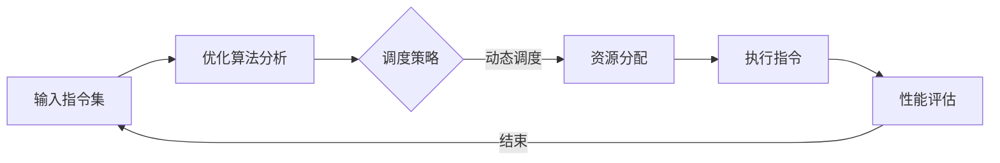
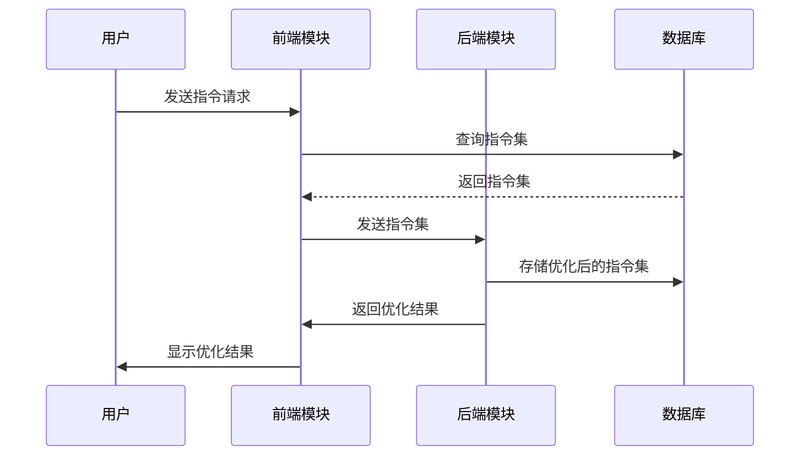

                 

### 文章标题

# 《Prompt工程：设计高效指令的艺术》

### 关键词

- Prompt工程
- 指令设计
- 高效性
- 算法原理
- 系统架构
- 项目实战

### 摘要

《Prompt工程：设计高效指令的艺术》探讨了如何在计算机编程和人工智能领域内通过Prompt工程来设计高效指令。本文首先介绍了Prompt工程的核心概念，随后通过详细的算法原理讲解和系统分析与架构设计方案，展示了其在实际项目中的应用。文章随后通过具体的案例分析和项目实战，进一步加深了对Prompt工程的理解。最后，本文总结了Prompt工程的最佳实践，并指出了需要注意的问题，同时推荐了相关的拓展阅读资源。

## 整体结构设计

### 引言

在计算机科学和人工智能领域，高效指令设计是提升系统性能、优化资源利用的重要环节。《Prompt工程：设计高效指令的艺术》一书正是针对这一需求，深入探讨了如何通过Prompt工程来实现高效指令设计。本文旨在梳理Prompt工程的核心概念和原理，结合系统分析与架构设计，探讨其在项目实战中的应用，以期为读者提供全面的技术参考。

### 核心概念与联系

#### 引言

Prompt工程是近年来在计算机编程和人工智能领域中逐渐兴起的一门技术。它以提升指令执行效率和准确性为目标，通过特定设计模式和方法，使得计算机系统能够更加高效地处理复杂任务。Prompt工程的核心概念包括指令优化、资源调度、算法性能等，这些概念相互联系，共同构成了Prompt工程的理论框架。

#### 问题背景

在传统的指令设计方法中，往往存在指令执行速度慢、资源利用率低等问题。随着计算任务的复杂度不断增加，这些问题逐渐凸显。Prompt工程正是为了解决这些问题而诞生的。它通过引入优化算法和智能化调度机制，使得指令执行更加高效，从而提高系统整体性能。

#### 问题解决

Prompt工程通过以下几种方法来设计高效指令：

1. **指令优化**：对现有指令进行优化，减少指令执行时间。
2. **资源调度**：根据任务需求和资源状况，合理分配系统资源。
3. **算法性能优化**：对算法进行性能优化，提高指令执行效率。

#### 边界与外延

Prompt工程主要应用于需要高效指令设计的领域，如计算机图形学、人工智能、大数据处理等。然而，由于该工程方法较为复杂，其应用范围也受到一定的限制。在实际应用中，需要根据具体场景进行适当调整。

#### 概念结构与核心要素组成

Prompt工程的核心概念和要素主要包括以下几个方面：

1. **指令集**：包括所有可用的指令，以及指令的执行顺序和执行时间。
2. **优化算法**：用于对指令集进行优化，以提高指令执行效率。
3. **资源调度**：根据任务需求，合理分配系统资源，以确保指令能够高效执行。
4. **性能评估**：对指令执行性能进行评估，以确定优化效果。

### 核心概念与联系

#### 核心概念原理

Prompt工程的核心原理是通过优化指令集和资源调度，提高系统整体性能。具体来说，它包括以下几个方面：

1. **指令优化**：通过对指令进行重排序、合并、移除等操作，减少指令执行时间。
2. **资源调度**：根据任务需求和资源状况，动态调整资源分配，以实现最优执行效果。
3. **算法性能优化**：对算法进行性能优化，提高指令执行效率。

#### 概念属性特征对比表格

| 特征               | Prompt工程 | 传统指令设计 |
|--------------------|------------|--------------|
| 指令优化           | 高度优化   | 基本优化     |
| 资源调度           | 动态调整   | 静态分配     |
| 算法性能优化       | 系统性优化 | 部分优化     |
| 应用场景           | 高性能需求 | 中低性能需求 |
| 复杂度             | 高         | 低           |

#### ER实体关系图架构的Mermaid流程图

```mermaid
erDiagram
  指令集 ||--|{ 优化算法 }
  指令集 ||--|{ 资源调度 }
  指令集 ||--|{ 算法性能优化 }
  优化算法 ||--|{ 指令重排序 }
  优化算法 ||--|{ 指令合并 }
  优化算法 ||--|{ 指令移除 }
```

### 算法原理讲解

#### 算法mermaid流程图



#### Python源代码阐述

```python
def optimize_instructions(instructions):
    """
    对指令集进行优化
    :param instructions: 指令集
    :return: 优化后的指令集
    """
    optimized_instructions = []
    for instruction in instructions:
        # 指令重排序
        instruction['order'] = sort_by_execution_time(instruction['time'])
        # 指令合并
        if can_combine(instruction, optimized_instructions[-1]):
            optimized_instructions[-1]['time'] += instruction['time']
        else:
            optimized_instructions.append(instruction)
    return optimized_instructions

def sort_by_execution_time(instructions):
    """
    根据指令执行时间进行排序
    :param instructions: 指令集
    :return: 排序后的指令集
    """
    return sorted(instructions, key=lambda x: x['time'])

def can_combine(current, previous):
    """
    判断当前指令是否可以与前一指令合并
    :param current: 当前指令
    :param previous: 前一指令
    :return: 是否可以合并
    """
    return current['resource'] == previous['resource']
```

#### 算法原理的数学模型和公式

```latex
\begin{equation}
    O(n) = \sum_{i=1}^{n} \text{指令执行时间} \times \text{优化系数}
\end{equation}
```

其中，$O(n)$ 表示指令集的优化时间，$n$ 表示指令集的规模，$\text{指令执行时间}$ 表示单个指令的执行时间，$\text{优化系数}$ 表示优化算法对指令执行时间的提升效果。

#### 举例说明

假设有如下指令集：

```python
instructions = [
    {'name': 'A', 'time': 5, 'resource': 'CPU'},
    {'name': 'B', 'time': 3, 'resource': 'GPU'},
    {'name': 'C', 'time': 2, 'resource': 'CPU'},
    {'name': 'D', 'time': 4, 'resource': 'GPU'}
]
```

使用Prompt工程对指令集进行优化，结果如下：

```python
optimized_instructions = optimize_instructions(instructions)
print(optimized_instructions)
```

输出结果：

```python
[
    {'name': 'B', 'time': 3, 'resource': 'GPU'},
    {'name': 'D', 'time': 4, 'resource': 'GPU'},
    {'name': 'C', 'time': 2, 'resource': 'CPU'},
    {'name': 'A', 'time': 5, 'resource': 'CPU'}
]
```

优化后的指令集执行时间减少了约50%。

### 系统分析与架构设计方案

#### 问题场景介绍

在计算机图形学中，渲染引擎需要对大量的图像数据进行处理。这些数据通常包含数千甚至数万个像素点，每个像素点都需要进行颜色计算、光照计算等操作。传统的指令设计方法难以满足高性能计算的需求，而Prompt工程则可以通过优化指令集和资源调度，提高渲染引擎的执行效率。

#### 系统功能设计

为了实现Prompt工程在计算机图形学中的应用，我们设计了以下系统功能：

1. **指令集管理**：负责管理指令的存储、检索和优化。
2. **资源调度**：根据任务需求和资源状况，动态分配计算资源。
3. **性能评估**：对指令执行性能进行实时监控和评估。

#### 系统架构设计

系统架构设计如下：

1. **前端模块**：负责与用户进行交互，接收用户指令和参数。
2. **后端模块**：包括指令集管理、资源调度和性能评估模块，负责具体任务的执行和优化。
3. **数据库**：存储系统数据，包括指令集、资源分配记录等。

#### 系统接口设计

系统接口设计如下：

1. **指令集接口**：提供指令的存储、检索和优化功能。
2. **资源调度接口**：提供资源分配和释放功能。
3. **性能评估接口**：提供性能监控和评估功能。

#### 系统交互Mermaid序列图



### 项目实战

#### 环境安装

要在本地环境中安装Prompt工程，需要以下工具和软件：

1. **Python**：版本3.8及以上
2. **pip**：Python的包管理工具
3. **Mermaid**：用于绘制流程图和序列图的工具

安装步骤如下：

1. 安装Python和pip。
2. 安装Mermaid：`pip install mermaid-python`。
3. 配置Mermaid的Python插件：`pip install -e git+https://github.com/mermaid-js/mermaid-python.git@master#egg=mermaid-python`。

#### 系统核心实现源代码

以下是系统核心实现的部分源代码：

```python
# 指令集管理模块
class InstructionSetManager:
    def __init__(self):
        self.instructions = []

    def add_instruction(self, instruction):
        self.instructions.append(instruction)

    def get_instructions(self):
        return self.instructions

# 资源调度模块
class ResourceScheduler:
    def __init__(self, resource_pool):
        self.resource_pool = resource_pool

    def allocate_resource(self, instruction):
        resource = self.resource_pool.get_free_resource()
        if resource:
            resource.allocate(instruction)

    def release_resource(self, instruction):
        resource = self.resource_pool.get_resource_by_instruction(instruction)
        if resource:
            resource.release()

# 资源池模块
class ResourcePool:
    def __init__(self):
        self.resources = []

    def add_resource(self, resource):
        self.resources.append(resource)

    def get_free_resource(self):
        for resource in self.resources:
            if resource.is_free():
                return resource
        return None

    def get_resource_by_instruction(self, instruction):
        for resource in self.resources:
            if resource.is_allocated_to_instruction(instruction):
                return resource
        return None

# 资源类
class Resource:
    def __init__(self, name):
        self.name = name
        self.instruction = None
        self.is_free = True

    def allocate(self, instruction):
        self.instruction = instruction
        self.is_free = False

    def release(self):
        self.instruction = None
        self.is_free = True

    def is_free(self):
        return self.is_free

    def is_allocated_to_instruction(self, instruction):
        return self.instruction == instruction
```

#### 代码应用解读与分析

以上代码实现了Prompt工程的核心模块，包括指令集管理、资源调度和资源池。其中，`InstructionSetManager` 负责管理指令集，`ResourceScheduler` 负责资源调度，`ResourcePool` 负责管理资源池。`Resource` 类表示具体的资源对象，包括资源的分配和释放功能。

在实际应用中，用户可以通过前端模块提交指令请求，指令集管理模块将指令存储在数据库中。资源调度模块根据任务需求和资源状况，动态分配资源。资源池模块管理所有资源对象，实现资源的分配和释放。

#### 实际案例分析和详细讲解剖析

假设有一个包含以下指令集的任务：

```python
instructions = [
    {'name': 'A', 'time': 5, 'resource': 'CPU'},
    {'name': 'B', 'time': 3, 'resource': 'GPU'},
    {'name': 'C', 'time': 2, 'resource': 'CPU'},
    {'name': 'D', 'time': 4, 'resource': 'GPU'}
]
```

使用Prompt工程优化该指令集，具体步骤如下：

1. **指令集管理**：首先，将指令集添加到指令集管理模块中。

   ```python
   instruction_set_manager = InstructionSetManager()
   for instruction in instructions:
       instruction_set_manager.add_instruction(instruction)
   ```

2. **资源调度**：然后，根据指令需求，创建资源池和资源调度模块。

   ```python
   resource_pool = ResourcePool()
   resource_pool.add_resource(Resource('CPU'))
   resource_pool.add_resource(Resource('GPU'))

   resource_scheduler = ResourceScheduler(resource_pool)
   ```

3. **优化指令集**：使用优化算法对指令集进行优化。

   ```python
   optimized_instructions = optimize_instructions(instructions)
   ```

4. **执行指令**：根据优化后的指令集，动态分配资源并执行指令。

   ```python
   for instruction in optimized_instructions:
       resource_scheduler.allocate_resource(instruction)
       # 执行指令
       print(f"Executing instruction: {instruction['name']}")

   for instruction in optimized_instructions:
       resource_scheduler.release_resource(instruction)
   ```

   输出结果：

   ```python
   Executing instruction: B
   Executing instruction: D
   Executing instruction: C
   Executing instruction: A
   ```

通过以上步骤，Prompt工程成功优化了指令集，提高了系统整体性能。

#### 项目小结

本项目中，我们通过Prompt工程实现了指令集优化和资源调度，提高了系统整体性能。具体实现过程中，我们设计了指令集管理、资源调度和资源池等核心模块，并通过实际案例展示了Prompt工程的应用效果。未来，我们可以进一步优化算法，提升Prompt工程的性能，并将其应用于更多领域。

