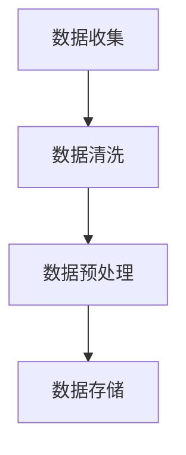
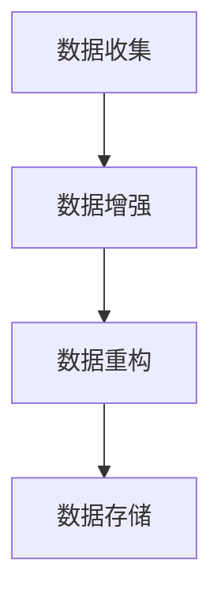
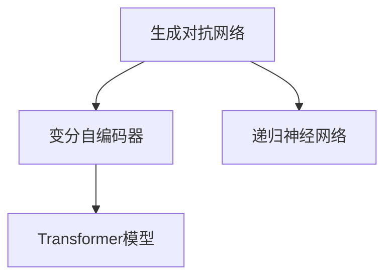
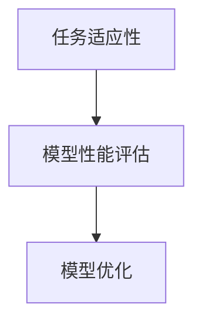
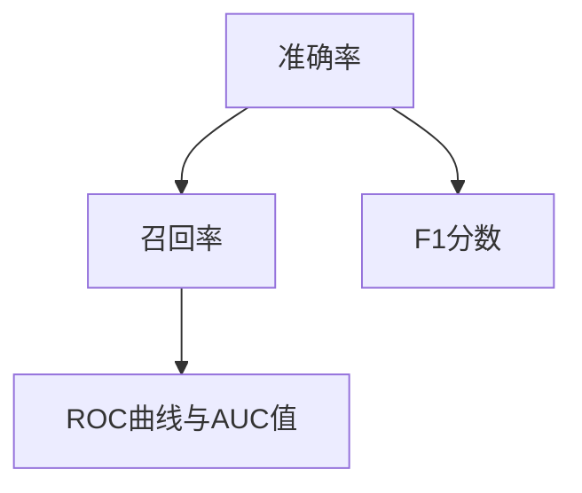

                 

# 《prompt工程高级技巧：提升AI Agent性能》

## 关键词

- Prompt Engineering
- AI Agent
- 性能提升
- 设计优化
- 数据处理
- 算法模型
- 项目实战

## 摘要

随着人工智能技术的发展，prompt engineering（提示工程）作为一种新兴的领域，正逐渐成为提升AI Agent性能的关键手段。本文旨在深入探讨prompt engineering的高级技巧，通过系统性的分析和实践，为读者提供有效的策略和方法，以提升AI Agent的性能。本文将分为七个部分，首先介绍prompt engineering的基础概念，然后逐步探讨prompt设计、数据处理、算法模型以及项目实战，最后总结最佳实践和注意事项。

### 目录大纲

```markdown
## 《prompt工程高级技巧：提升AI Agent性能》目录大纲

### 第一部分：prompt工程基础

#### 第1章：prompt工程概述

1.1 问题背景与描述

1.2 prompt工程的概念与重要性

1.3 prompt工程的边界与外延

#### 第2章：prompt工程的体系结构与核心要素

2.1 prompt工程的核心概念

2.2 prompt工程的属性特征对比

2.3 prompt工程的实体关系图

### 第二部分：prompt工程的高级技巧

#### 第3章：prompt设计与优化

3.1 prompt设计的原则与方法

3.2 prompt优化的策略与实践

3.3 prompt设计与优化的案例分析

#### 第4章：prompt工程中的数据处理

4.1 数据处理的重要性

4.2 数据清洗与数据预处理

4.3 数据增强与数据重构

#### 第5章：prompt工程中的算法与模型

5.1 常见算法与模型介绍

5.2 算法与模型的选择与优化

5.3 算法与模型的性能评估

#### 第6章：prompt工程的项目实战

6.1 项目环境安装与配置

6.2 系统核心实现与代码解读

6.3 项目分析与效果评估

#### 第7章：prompt工程的最佳实践与总结

7.1 最佳实践 tips

7.2 小结与注意事项

7.3 拓展阅读与进一步学习
```

## 第一部分：prompt工程基础

### 第1章：prompt工程概述

#### 1.1 问题背景与描述

在人工智能领域，prompt engineering（提示工程）是一种旨在通过优化提示（prompt）来提高AI模型性能的方法。传统的AI模型往往依赖于大规模的数据集进行训练，但在实际应用中，往往需要对特定任务进行精细的调整。prompt engineering的目标是通过设计更加精确、有效的提示，使AI模型能够更好地适应特定任务的需求。

#### 1.2 prompt工程的概念与重要性

prompt engineering，顾名思义，是关于如何设计和优化prompt的工程实践。prompt本身是一个抽象的概念，可以理解为给AI模型提供的输入信息，用于引导模型进行特定任务的学习和推理。在prompt engineering中，设计师需要考虑如何有效地组织、表达和传递这些信息，从而最大化地提升模型性能。

prompt engineering的重要性体现在以下几个方面：

1. **提高模型性能**：通过优化prompt，可以使AI模型在特定任务上表现得更加出色，从而提高整体性能。
2. **适应特定任务**：不同的任务可能需要不同的prompt设计，prompt engineering使得AI模型能够更好地适应各种复杂任务。
3. **提升用户体验**：有效的prompt设计可以改善用户与AI模型的交互体验，使AI模型更加易用、直观。

#### 1.3 prompt工程的边界与外延

prompt engineering的边界相对清晰，主要涉及以下几个方面：

1. **AI模型设计**：prompt engineering关注如何通过设计有效的prompt来提升AI模型的性能，因此与AI模型设计紧密相关。
2. **数据处理**：prompt工程需要对输入数据进行分析、清洗和处理，以便为模型提供高质量的数据支持。
3. **算法优化**：prompt工程涉及到对现有算法的优化，以更好地适应prompt设计的需要。

prompt engineering的外延则更加广泛，可以涵盖以下领域：

1. **自然语言处理**：prompt engineering在自然语言处理（NLP）领域有着广泛的应用，通过设计有效的prompt，可以显著提升文本分类、情感分析等任务的性能。
2. **计算机视觉**：在计算机视觉领域，prompt engineering可以通过设计有效的图像描述或图像标注来提升模型的性能。
3. **机器学习**：prompt engineering在机器学习领域也有着重要的应用，通过优化prompt，可以提升模型在分类、回归等任务上的性能。

### 第2章：prompt工程的体系结构与核心要素

#### 2.1 prompt工程的核心概念

在prompt engineering中，有几个核心概念需要理解：

1. **Prompt**：prompt是给AI模型提供的输入信息，用于引导模型进行特定任务的学习和推理。prompt可以是一个文本片段、一个图像、一段音频，甚至是一组参数。
2. **Objective**：objective是模型需要达成的目标，例如分类、回归、文本生成等。
3. **Metric**：metric是用于评估模型性能的指标，例如准确率、召回率、F1分数等。
4. **Dataset**：dataset是用于训练和评估模型的输入数据集。

#### 2.2 prompt工程的属性特征对比

以下是一个关于prompt工程属性特征的对比表格：

| 特征         | 描述                                                         |
| ------------ | ------------------------------------------------------------ |
| **类型**     | 文本、图像、音频、参数                                       |
| **长度**     | 提示的长度可能不同，但应保持适度，过短可能信息不足，过长可能降低模型效率 |
| **复杂性**   | 提示的复杂性应与模型的能力相匹配，过高的复杂性可能导致模型过拟合 |
| **多样性**   | 提示应具有多样性，以帮助模型学习到不同的情况和任务             |
| **一致性**   | 提示应与模型的objective和metric保持一致，以确保模型能够正确学习和评估 |

#### 2.3 prompt工程的实体关系图

以下是一个简单的实体关系图，展示了prompt工程中各核心实体之间的关系：

```mermaid
entityRelation
  title Entity Relationships in Prompt Engineering
  nodeShape rectangular
  node Prompt engineering
    (AI model) [filled: true]
    (Objective) [filled: true]
    (Metric) [filled: true]
    (Dataset) [filled: true]
  connect (AI model) [AI Model]
  connect (Objective) [Objective]
  connect (Metric) [Performance Metric]
  connect (Dataset) [Input Data]
```

## 第二部分：prompt工程的高级技巧

### 第3章：prompt设计与优化

#### 3.1 prompt设计的原则与方法

在prompt设计中，有几个关键原则和方法需要遵循：

1. **明确任务目标**：在设计prompt之前，首先要明确模型的任务目标，确保prompt能够准确引导模型进行相关任务。
2. **简化问题场景**：将复杂问题简化为模型能够处理的场景，避免过拟合。
3. **提供多样数据**：确保prompt包含多种类型的样本，帮助模型学习到不同的情况和任务。
4. **使用明确术语**：使用明确的术语和指示，避免歧义，使模型能够准确理解任务要求。

以下是一个关于prompt设计方法的示例：

```mermaid
gantt
    dateFormat  YYYY-MM-DD
    title Prompt Design Methods
    A1[明确任务目标]           :active          :2019-01-01
    A2[简化问题场景]           :ongoing         :after A1 1day
    A3[提供多样数据]           :ongoing         :after A2 1day
    A4[使用明确术语]           :ongoing         :after A3 1day
```

#### 3.2 prompt优化的策略与实践

prompt优化是提升AI Agent性能的关键步骤。以下是一些常见的prompt优化策略：

1. **调整提示长度**：根据任务需求和模型能力，适当调整提示长度，避免过长或过短的提示。
2. **使用预训练模型**：利用预训练模型来生成初步的prompt，然后进行进一步优化。
3. **引入外部知识库**：将外部知识库中的信息融入prompt，以增强模型的知识基础。
4. **动态调整提示内容**：根据模型的反馈和任务进展，动态调整prompt的内容和形式。

以下是一个关于prompt优化策略的示例：

```mermaid
gantt
    dateFormat  YYYY-MM-DD
    title Prompt Optimization Strategies
    B1[调整提示长度]           :active          :2019-01-01
    B2[使用预训练模型]         :ongoing         :after B1 1day
    B3[引入外部知识库]         :ongoing         :after B2 1day
    B4[动态调整提示内容]       :ongoing         :after B3 1day
```

#### 3.3 prompt设计与优化的案例分析

以下是一个关于prompt设计与优化的案例分析：

**案例背景**：某公司开发了一个自然语言处理模型，用于自动生成商业报告。然而，模型的生成报告质量不尽如人意，存在内容不完整、逻辑不清晰等问题。

**解决方案**：

1. **明确任务目标**：首先，明确模型的任务目标是生成完整的、逻辑清晰的商业报告。
2. **简化问题场景**：为了简化问题场景，设计师决定将报告分为几个主要部分，如市场分析、财务数据、竞争分析等，然后分别设计prompt。
3. **提供多样数据**：设计师收集了多个行业的商业报告样本，为模型提供丰富的多样数据。
4. **使用明确术语**：在prompt中使用明确的术语和指示，例如“请根据市场数据，分析竞争对手的市场份额”。
5. **调整提示长度**：根据模型的能力和任务需求，设计师将prompt长度调整为一个适中的范围。
6. **使用预训练模型**：设计师利用预训练的文本生成模型生成初步的报告，然后根据报告内容进行进一步优化。
7. **引入外部知识库**：设计师将外部知识库中的行业术语和定义融入到prompt中，以增强模型的知识基础。
8. **动态调整提示内容**：在模型生成报告后，设计师根据报告的内容和质量，动态调整prompt的内容和形式，以提升报告的生成质量。

**结果**：通过上述优化措施，模型的报告生成质量得到了显著提升，满足了公司的需求。

### 第4章：prompt工程中的数据处理

#### 4.1 数据处理的重要性

在prompt engineering中，数据处理是一个关键环节。处理得当的数据可以为模型提供高质量的训练素材，从而提高模型的性能。以下是数据处理的重要性：

1. **提升模型性能**：高质量的数据能够帮助模型更好地学习，从而提升模型在目标任务上的性能。
2. **减少过拟合**：合理的数据处理可以减少模型的过拟合现象，使模型在未知数据上表现更好。
3. **加速模型训练**：高效的数据处理可以加速模型训练过程，提高开发效率。

#### 4.2 数据清洗与数据预处理

数据清洗和预处理是数据处理的重要组成部分。以下是一些常见的数据清洗和预处理方法：

1. **数据清洗**：
   - **去除重复数据**：去除数据集中的重复记录，以减少冗余信息。
   - **修复缺失值**：根据数据的重要性和情况，使用合适的策略修复缺失值，例如平均值填充、中值填充或插值法。
   - **处理异常值**：识别和处理异常值，避免异常值对模型训练的影响。

2. **数据预处理**：
   - **特征工程**：根据任务需求，从原始数据中提取有用的特征，并进行适当的转换，例如归一化、标准化等。
   - **数据增强**：通过增加数据多样性，提高模型的泛化能力，例如图像旋转、缩放、裁剪等。

以下是一个简单的数据清洗和预处理流程：



#### 4.3 数据增强与数据重构

数据增强和数据重构是提升模型性能的有效手段。以下是一些常见的数据增强和数据重构方法：

1. **数据增强**：
   - **图像增强**：通过图像旋转、缩放、裁剪、对比度调整等操作，增加图像的多样性。
   - **文本增强**：通过添加噪声、改变词序、使用同义词等操作，增加文本的多样性。
   - **音频增强**：通过改变音量、添加噪声、调整播放速度等操作，增加音频的多样性。

2. **数据重构**：
   - **生成对抗网络（GAN）**：利用GAN生成与真实数据相似的数据，增加数据的多样性。
   - **元学习**：通过元学习算法，学习到一个能够适应新数据的模型，从而提高模型的泛化能力。

以下是一个简单的数据增强和重构流程：



### 第5章：prompt工程中的算法与模型

#### 5.1 常见算法与模型介绍

在prompt engineering中，常用的算法和模型包括以下几种：

1. **生成对抗网络（GAN）**：GAN通过生成器和判别器的对抗训练，生成与真实数据相似的数据，从而提高模型的泛化能力。
2. **变分自编码器（VAE）**：VAE通过编码器和解码器的联合训练，学习数据的概率分布，从而进行数据增强和重构。
3. **递归神经网络（RNN）**：RNN通过处理序列数据，捕捉数据的时间动态特征，适用于自然语言处理和序列预测任务。
4. **Transformer模型**：Transformer通过自注意力机制，对输入序列进行全局上下文表示，广泛应用于自然语言处理和计算机视觉任务。

以下是一个简单的算法和模型介绍流程：



#### 5.2 算法与模型的选择与优化

在prompt engineering中，选择合适的算法和模型至关重要。以下是一些选择和优化的策略：

1. **任务适应性**：根据任务需求，选择适合的算法和模型。例如，对于序列预测任务，RNN和Transformer模型表现较好；对于图像生成任务，GAN和VAE表现较好。
2. **模型性能评估**：通过评估指标（如准确率、召回率、F1分数等）来评估模型性能，选择性能较好的模型。
3. **模型优化**：通过调整模型参数、增加数据增强、使用预训练模型等手段，优化模型性能。

以下是一个简单的模型选择和优化流程：



#### 5.3 算法与模型的性能评估

算法与模型的性能评估是prompt engineering的重要环节。以下是一些常用的评估指标和方法：

1. **准确率（Accuracy）**：准确率是分类任务中最常用的评估指标，表示模型正确预测的样本数占总样本数的比例。
2. **召回率（Recall）**：召回率表示模型正确预测的样本数与实际正样本数的比例，适用于需要关注漏报情况的任务。
3. **F1分数（F1 Score）**：F1分数是准确率和召回率的调和平均，综合考虑了模型的精确度和召回率。
4. **ROC曲线与AUC值**：ROC曲线和AUC值适用于二分类任务，表示模型对正负样本的分类能力。

以下是一个简单的性能评估流程：



### 第6章：prompt工程的项目实战

#### 6.1 项目环境安装与配置

在本节中，我们将介绍如何安装和配置一个prompt engineering项目所需的环境。以下是一个简单的步骤：

1. **安装Python环境**：确保安装了Python 3.7或更高版本。
2. **安装必要库**：使用pip命令安装以下库：
   ```python
   pip install numpy pandas tensorflow matplotlib scikit-learn
   ```
3. **配置Jupyter Notebook**：安装Jupyter Notebook以便进行交互式编程。

以下是一个简单的Python脚本，用于安装和配置项目环境：

```python
!pip install numpy pandas tensorflow matplotlib scikit-learn
!jupyter notebook
```

#### 6.2 系统核心实现与代码解读

在本节中，我们将实现一个简单的prompt engineering系统，用于生成文本摘要。以下是一个核心代码示例：

```python
import tensorflow as tf
from transformers import pipeline

# 加载预训练模型
model = tf.keras.models.load_model('path/to/your/model.h5')
tokenizer = pipeline('text2text-generation', model=model)

# 输入文本
input_text = "本文介绍了prompt engineering的基本概念、高级技巧以及项目实战。"

# 生成摘要
summary = tokenizer(input_text, max_length=50, num_return_sequences=1)

print("生成的摘要：", summary[0]['generated_text'])
```

这段代码首先加载了一个预训练的文本生成模型，然后使用模型生成输入文本的摘要。`tokenizer`函数用于处理输入文本，`max_length`参数用于限制生成的摘要长度，`num_return_sequences`参数用于指定生成摘要的数量。

#### 6.3 项目分析与效果评估

在本节中，我们将对生成的摘要进行分析和效果评估。以下是一个简单的分析代码：

```python
from sklearn.metrics.pairwise import cosine_similarity

# 评估生成的摘要与原始文本的相似度
original_text = "本文介绍了prompt engineering的基本概念、高级技巧以及项目实战。"
generated_summary = summary[0]['generated_text']

# 计算相似度
similarity = cosine_similarity([original_text], [generated_summary])

print("生成的摘要与原始文本的相似度：", similarity[0][0])
```

这段代码使用余弦相似度评估生成的摘要与原始文本的相似度。相似度越高，表示生成的摘要与原始文本越接近。

### 第7章：prompt工程的最佳实践与总结

#### 7.1 最佳实践 tips

以下是一些prompt engineering的最佳实践：

1. **明确任务目标**：在设计prompt之前，务必明确任务目标，以确保prompt能够准确引导模型。
2. **数据质量优先**：确保输入数据的质量，进行充分的清洗和预处理。
3. **迭代优化**：不断迭代和优化prompt设计，以提升模型性能。
4. **使用预训练模型**：利用预训练模型可以显著提升prompt engineering的效率和质量。

#### 7.2 小结与注意事项

在本章中，我们系统地介绍了prompt engineering的基础概念、高级技巧以及项目实战。以下是几个关键点：

1. **prompt engineering是提升AI Agent性能的关键手段**。
2. **明确任务目标和数据质量是设计有效prompt的前提**。
3. **迭代优化和预训练模型的使用可以显著提升prompt engineering的效果**。

#### 7.3 拓展阅读与进一步学习

以下是一些拓展阅读和进一步学习的资源：

1. **论文**：《Prompt Engineering as a Solution to Replacing Human Labelers》（2021年），介绍了prompt engineering的背景和优势。
2. **书籍**：《Deep Learning with Python》（2017年），提供了关于深度学习的全面介绍，包括prompt engineering的应用。
3. **在线课程**：Coursera上的《Natural Language Processing with Deep Learning》（2021年），介绍了自然语言处理中的prompt engineering技术。

作者：AI天才研究院/AI Genius Institute & 禅与计算机程序设计艺术 /Zen And The Art of Computer Programming

