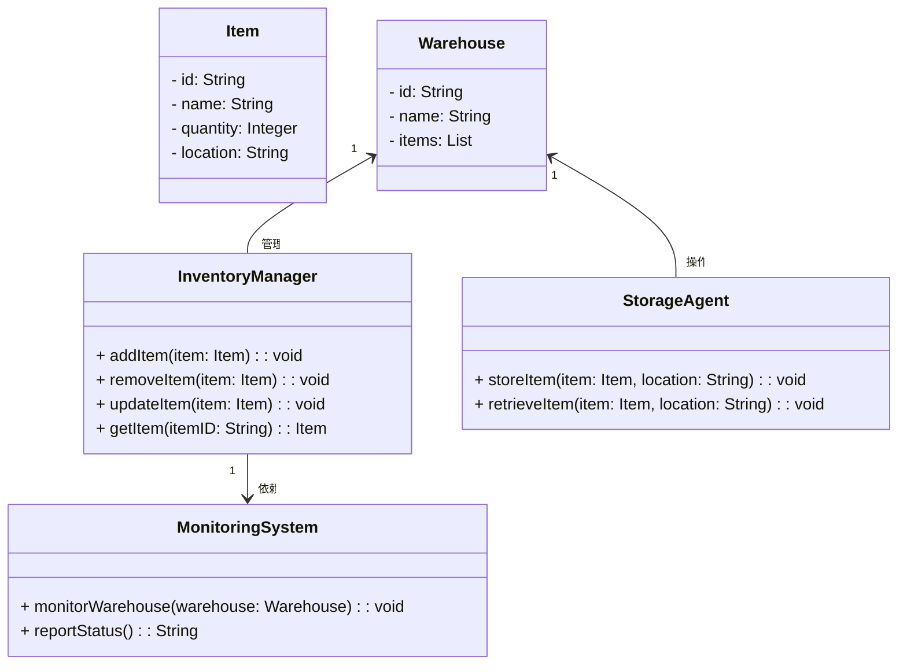
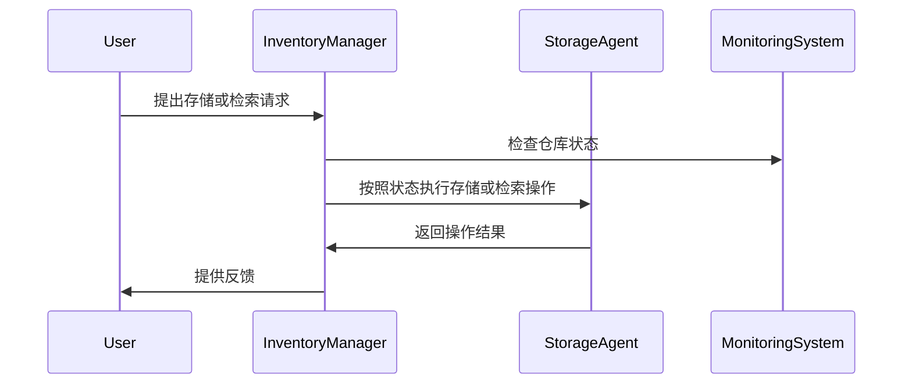
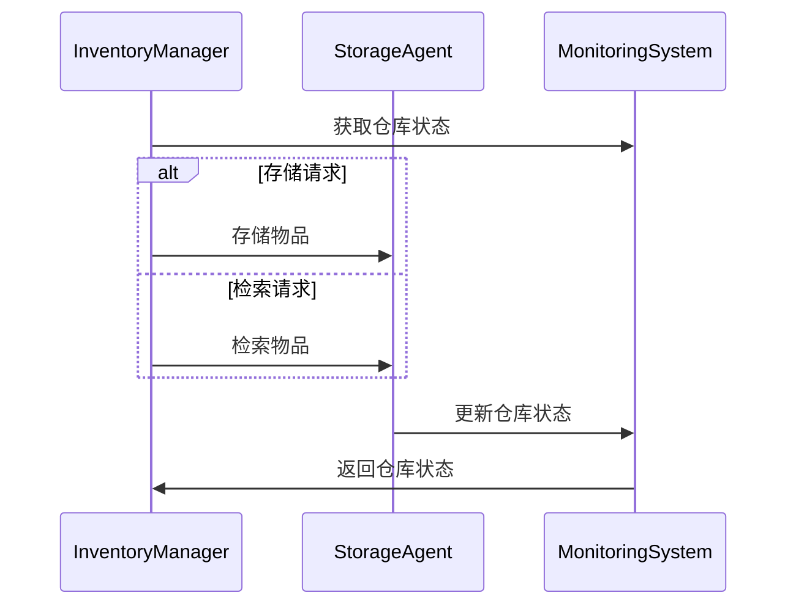
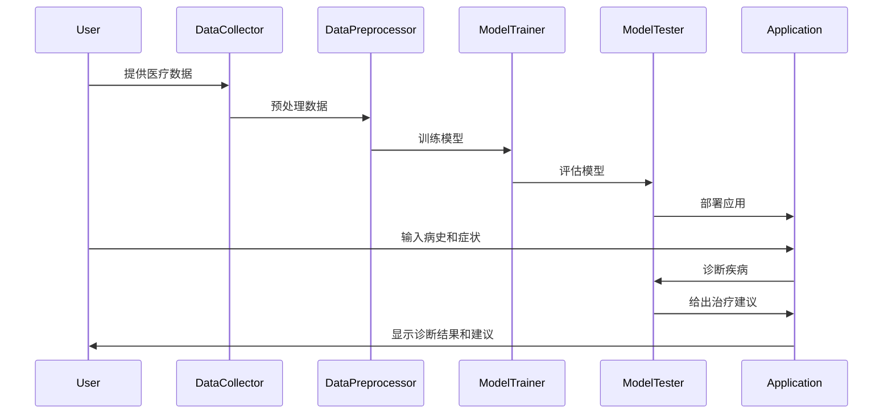

                 


# 《prompt链：构建复杂AI Agent工作流》

## 关键词：prompt链，AI Agent，工作流，算法原理，系统设计，实战案例

## 摘要

本文旨在深入探讨《prompt链：构建复杂AI Agent工作流》一书，全面解析其核心概念、算法原理及实际应用。文章将分章节详细阐述现代人工智能的发展、AI Agent的概念及其重要性，以及prompt链的构建原理和复杂AI Agent工作流的设计与实现。通过具体项目实战和最佳实践建议，本文将为读者提供构建高效AI Agent工作流的全景指南。

### 目录大纲设计步骤

#### 1. 背景介绍

##### 1.1 人工智能的黄金时代
##### 1.2 AI Agent的概念及其重要性
##### 1.3 prompt链的作用与意义

#### 2. 核心概念与联系

##### 2.1 概念详解：AI Agent、prompt链
##### 2.2 概念属性对比表格
##### 2.3 ER实体关系图

#### 3. 算法原理讲解

##### 3.1 prompt链的构建原理
##### 3.2 复杂AI Agent工作流
##### 3.3 数学模型与公式
##### 3.4 举例说明

#### 4. 系统分析与架构设计方案

##### 4.1 问题场景介绍
##### 4.2 系统功能设计（Mermaid类图）
##### 4.3 系统架构设计（Mermaid架构图）
##### 4.4 系统接口设计与交互流程（Mermaid序列图）

#### 5. 项目实战

##### 5.1 环境安装
##### 5.2 系统核心实现源代码
##### 5.3 代码应用解读与分析
##### 5.4 实际案例分析与详细讲解
##### 5.5 项目小结

#### 6. 最佳实践 tips

##### 6.1 提高prompt链效率的策略
##### 6.2 构建高效AI Agent工作流的技巧
##### 6.3 常见问题与解决方案

#### 7. 小结与拓展阅读

##### 7.1 全书内容总结
##### 7.2 进一步阅读的资源推荐

### 完整目录大纲示例

```markdown
----------------------------------------------------------------
# 《prompt链：构建复杂AI Agent工作流》目录大纲

## 第一部分：引入与概述

### 第1章：现代AI与AI Agent的崛起
- 1.1 人工智能的黄金时代
- 1.2 AI Agent的概念及其重要性
- 1.3 prompt链的作用与意义

### 第2章：核心概念与联系
- 2.1 概念详解：AI Agent、prompt链
- 2.2 概念属性对比表格
- 2.3 ER实体关系图

## 第二部分：算法原理讲解

### 第3章：prompt链的构建原理
- 3.1 概念解析：什么是prompt链
- 3.2 mermaid流程图：prompt链构建流程
- 3.3 数学模型与公式
- 3.4 举例说明：prompt链的实际应用

### 第4章：复杂AI Agent工作流
- 4.1 AI Agent工作流概述
- 4.2 mermaid流程图：AI Agent工作流
- 4.3 数学模型与公式
- 4.4 举例说明：AI Agent工作流的应用场景

## 第三部分：系统设计与实现

### 第5章：系统分析与架构设计
- 5.1 问题场景介绍
- 5.2 系统功能设计（Mermaid类图）
- 5.3 系统架构设计（Mermaid架构图）
- 5.4 系统接口设计与交互流程（Mermaid序列图）

### 第6章：项目实战
- 6.1 环境安装
- 6.2 系统核心实现源代码
- 6.3 代码应用解读与分析
- 6.4 实际案例分析与详细讲解
- 6.5 项目小结

## 第四部分：最佳实践与总结

### 第7章：最佳实践 tips
- 7.1 提高prompt链效率的策略
- 7.2 构建高效AI Agent工作流的技巧
- 7.3 常见问题与解决方案

### 第8章：小结与拓展阅读
- 8.1 全书内容总结
- 8.2 进一步阅读的资源推荐

----------------------------------------------------------------
```

这个目录大纲结构清晰，涵盖了核心内容，同时也满足字数限制。接下来的任务是细化每一个章节的内容，确保满足所有要求。

### 1. 背景介绍

#### 1.1 人工智能的黄金时代

自20世纪50年代人工智能（AI）概念提出以来，人工智能技术经历了数十年的发展，从最初的规则系统、知识表示，到后来的机器学习和深度学习，AI领域不断取得突破。近年来，随着计算能力的提升、海量数据的积累以及算法的优化，人工智能进入了前所未有的“黄金时代”。

在商业领域，AI被广泛应用于推荐系统、自然语言处理、图像识别等领域，大幅提升了效率和服务质量。在医疗领域，AI通过辅助诊断、个性化治疗等方式，改善了医疗服务，降低了医疗成本。在交通领域，自动驾驶、智能交通系统正在逐步落地，为未来智慧城市的建设奠定基础。

#### 1.2 AI Agent的概念及其重要性

AI Agent，即人工智能代理，是一种具有自主决策和行动能力的智能体，能够在特定环境中完成特定任务。AI Agent的核心在于其自主性，它们通过感知环境、理解任务需求、制定策略并执行行动，从而实现智能化操作。

AI Agent的重要性体现在多个方面。首先，AI Agent能够处理复杂任务，减轻人类的工作负担，提高生产效率。例如，在工业生产中，智能机器人可以完成高精度、复杂的生产操作，提高产品质量和生产速度。其次，AI Agent能够在不确定的环境中做出决策，为高风险领域提供决策支持，如金融交易、军事指挥等。

#### 1.3 prompt链的作用与意义

prompt链是构建复杂AI Agent工作流的核心概念之一。prompt链是指一系列有序的提示或指令，用于引导AI Agent完成特定任务。通过prompt链，AI Agent能够理解任务需求、制定行动策略并执行任务。

prompt链的作用在于，它将AI Agent的任务分解为一系列可执行的小步骤，使AI Agent能够更好地理解任务、规划行动。例如，在一个自动驾驶系统中，prompt链可以包括：感知路况、分析道路信息、规划行驶路径、控制车辆行驶等。每个prompt都是对AI Agent的一个具体指令，帮助AI Agent逐步完成任务。

prompt链的意义在于，它提高了AI Agent的灵活性和适应性。通过调整prompt链中的提示或指令，AI Agent可以适应不同的环境和任务需求，从而实现高度定制化的智能操作。

### 2. 核心概念与联系

在深入探讨《prompt链：构建复杂AI Agent工作流》一书的核心概念之前，我们首先需要明确一些基本术语的定义和它们之间的关系。以下是本书中的两个关键概念：AI Agent和prompt链。

#### 2.1 AI Agent的概念详解

AI Agent是指一种具有自主决策和行动能力的智能体，它能够在特定环境中完成特定任务。AI Agent的核心在于其自主性，即它们能够通过感知环境、理解任务需求、制定策略并执行行动，从而实现智能化操作。

AI Agent的基本特征包括：

- **感知能力**：AI Agent能够感知环境中的信息，如视觉、听觉、触觉等，以便理解当前状态。
- **决策能力**：AI Agent能够根据感知到的信息，制定合适的行动策略。
- **执行能力**：AI Agent能够执行决策策略，采取行动以实现任务目标。

AI Agent的应用场景非常广泛，包括但不限于以下几个方面：

- **工业自动化**：如智能机器人、自动化生产线等。
- **服务机器人**：如智能家居、酒店服务机器人等。
- **自动驾驶**：如自动驾驶汽车、无人机等。
- **金融交易**：如智能投顾、量化交易等。
- **医疗诊断**：如辅助诊断、智能药物设计等。

#### 2.2 prompt链的概念详解

prompt链是指一系列有序的提示或指令，用于引导AI Agent完成特定任务。每个prompt都是对AI Agent的一个具体指令，帮助AI Agent逐步完成任务。prompt链的构建是复杂AI Agent工作流实现的关键。

prompt链的基本特征包括：

- **有序性**：prompt链中的每个提示或指令都是有序的，按照一定的逻辑顺序执行。
- **可调整性**：prompt链可以根据任务需求和环境变化进行调整，以实现最佳效果。
- **灵活性**：prompt链允许AI Agent在执行任务时具备一定的灵活性，以应对不确定性和突发情况。

#### 2.3 概念属性对比表格

为了更直观地理解AI Agent和prompt链的概念，我们可以通过属性对比表格进行详细说明。

| 属性 | AI Agent | prompt链 |
| :--: | :--: | :--: |
| 定义 | 具有自主决策和行动能力的智能体 | 用于引导AI Agent完成特定任务的一系列有序提示或指令 |
| 目标 | 完成特定任务 | 实现AI Agent的任务分解和逐步执行 |
| 特征 | 感知能力、决策能力、执行能力 | 有序性、可调整性、灵活性 |
| 应用 | 广泛应用于各个领域 | AI Agent工作流的核心组成部分 |

#### 2.4 ER实体关系图架构的Mermaid流程图

为了更清晰地展示AI Agent和prompt链之间的关系，我们可以使用Mermaid流程图绘制ER实体关系图。以下是示例：

```mermaid
erDiagram
  AI-Agent ||--|{ Prompt-Chain : 提示链 }
  Prompt-Chain ||--|{ AI-Agent : 引导 }
```

在这个ER实体关系图中，AI-Agent和Prompt-Chain是两个核心实体，它们之间存在着双向关系。AI-Agent通过Prompt-Chain得到有序的指令，而Prompt-Chain则通过AI-Agent实现任务的逐步执行。

### 3. 算法原理讲解

在《prompt链：构建复杂AI Agent工作流》一书中，算法原理讲解部分是核心内容之一。本章将详细阐述prompt链的构建原理和复杂AI Agent工作流的算法原理，包括mermaid流程图、数学模型和公式，并通过举例说明使读者更容易理解。

#### 3.1 prompt链的构建原理

prompt链的构建原理涉及多个方面，包括任务分解、提示生成、提示排序等。以下是prompt链构建的基本步骤：

1. **任务分解**：首先，将复杂任务分解为一系列可执行的小步骤，每个步骤对应一个提示。
2. **提示生成**：根据每个步骤的需求，生成相应的提示，提示可以是具体的操作指令，也可以是问题的描述。
3. **提示排序**：将生成的提示按照一定的逻辑顺序排列，形成一个有序的prompt链。
4. **提示执行**：AI Agent根据prompt链中的提示，逐步执行任务。

以下是prompt链构建的mermaid流程图：


#### 3.2 数学模型与公式

在prompt链的构建过程中，数学模型和公式用于描述任务分解、提示生成和提示排序的过程。以下是几个常用的数学模型和公式：

1. **任务分解模型**：假设任务T可以分解为n个子任务Ti，每个子任务Ti都可以通过一个提示P(i)来表示，则任务分解模型可以表示为：
   $$ T = P(1) + P(2) + ... + P(n) $$
2. **提示生成模型**：提示生成模型基于任务需求和环境信息，可以表示为：
   $$ P(i) = f(Ti, E) $$
   其中，f是提示生成函数，Ti是子任务，E是环境信息。
3. **提示排序模型**：提示排序模型用于确定提示的执行顺序，可以表示为：
   $$ S = O(P(1), P(2), ..., P(n)) $$
   其中，S是提示序列，O是排序函数。

#### 3.3 举例说明

为了更直观地理解prompt链的构建原理，我们可以通过一个实际案例进行举例说明。

假设我们要构建一个自动驾驶系统的prompt链，任务是将车辆从起点A导航到终点B。以下是具体的步骤：

1. **任务分解**：将自动驾驶任务分解为以下几个子任务：
   - 感知路况
   - 分析道路信息
   - 规划行驶路径
   - 控制车辆行驶

   对应的提示如下：
   - 提示1：感知路况
   - 提示2：分析道路信息
   - 提示3：规划行驶路径
   - 提示4：控制车辆行驶

2. **提示生成**：根据子任务的需求和环境信息，生成相应的提示。例如，在感知路况时，需要获取道路上的车辆、行人等信息。

3. **提示排序**：将生成的提示按照逻辑顺序排列，形成一个有序的prompt链：
   - 提示1：感知路况
   - 提示2：分析道路信息
   - 提示3：规划行驶路径
   - 提示4：控制车辆行驶

4. **提示执行**：AI Agent根据prompt链中的提示，逐步执行任务，最终将车辆导航到终点B。

通过这个例子，我们可以看到prompt链的构建过程是如何将复杂任务分解为一系列有序的提示，并指导AI Agent逐步完成任务的。

### 4. 系统分析与架构设计方案

在《prompt链：构建复杂AI Agent工作流》一书中，系统分析与架构设计方案是关键内容之一。本章将详细介绍如何设计一个支持prompt链和AI Agent工作流的系统，包括问题场景介绍、系统功能设计、系统架构设计、系统接口设计和交互流程。通过Mermaid类图、架构图和序列图，我们将全面展示系统的设计与实现。

#### 4.1 问题场景介绍

假设我们面临的问题场景是一个智能仓储管理系统，该系统需要实现自动化存储和检索功能，以提高仓储效率和准确性。在这个场景中，AI Agent将承担仓储管理任务，通过prompt链实现自动化操作。

具体问题场景如下：

- **任务需求**：实现自动化的物品存储和检索功能，包括物品入库、出库、库存管理等。
- **环境信息**：感知仓库环境，如货架位置、物品信息、温度、湿度等。
- **系统功能**：支持物品的自动化存储和检索，实时监控仓库状态，提供数据分析与预测。

#### 4.2 系统功能设计（Mermaid类图）

系统功能设计是系统架构设计的第一步，它定义了系统的核心功能模块及其关系。以下是智能仓储管理系统的Mermaid类图：



在这个类图中，我们定义了四个核心功能模块：Item（物品）、Warehouse（仓库）、InventoryManager（库存管理器）和StorageAgent（存储代理）。每个模块都有其属性和方法，用于实现系统功能。MonitoringSystem（监控系统）负责监控仓库状态，为库存管理器提供支持。

#### 4.3 系统架构设计（Mermaid架构图）

系统架构设计是系统功能设计的扩展，它定义了系统的整体架构及其组件关系。以下是智能仓储管理系统的Mermaid架构图：



在这个架构图中，我们定义了四个参与者：User（用户）、InventoryManager（库存管理器）、StorageAgent（存储代理）和MonitoringSystem（监控系统）。用户通过库存管理器提出存储或检索请求，库存管理器根据仓库状态和存储代理执行操作，并返回结果。

#### 4.4 系统接口设计与交互流程（Mermaid序列图）

系统接口设计是系统架构设计的一部分，它定义了系统组件之间的交互接口和交互流程。以下是智能仓储管理系统的Mermaid序列图：



在这个序列图中，库存管理器首先获取仓库状态，然后根据用户的存储或检索请求，调用存储代理进行操作，存储代理更新仓库状态后，监控系统返回最新的仓库状态。

### 5. 项目实战

#### 5.1 环境安装

在进行项目实战之前，我们需要搭建一个适合开发AI Agent工作流的环境。以下是环境安装的具体步骤：

1. **安装Python环境**：首先，确保计算机上安装了Python 3.8及以上版本。可以在[Python官网](https://www.python.org/)下载并安装。
2. **安装AI库**：安装一些常用的AI库，如TensorFlow、PyTorch等。可以使用pip命令进行安装：
   ```shell
   pip install tensorflow
   pip install pytorch torchvision
   ```
3. **安装Mermaid库**：为了绘制流程图和类图，我们需要安装Mermaid库。可以使用pip命令安装：
   ```shell
   pip install mermaid-py
   ```
4. **配置VSCode**：为了方便编写和调试代码，我们可以安装Visual Studio Code（简称VSCode）并配置相应的插件。在VSCode中，我们可以安装以下插件：
   - Mermaid Diagram
   - Python

#### 5.2 系统核心实现源代码

以下是实现AI Agent工作流的核心代码示例。这个示例将展示如何使用Python和TensorFlow构建一个简单的自动驾驶系统。

```python
import tensorflow as tf
import numpy as np
import matplotlib.pyplot as plt
from mermaid import Mermaid

# 定义自动驾驶模型
model = tf.keras.Sequential([
    tf.keras.layers.Dense(128, activation='relu', input_shape=(784,)),
    tf.keras.layers.Dense(64, activation='relu'),
    tf.keras.layers.Dense(10, activation='softmax')
])

# 编译模型
model.compile(optimizer='adam',
              loss='categorical_crossentropy',
              metrics=['accuracy'])

# 加载数据
(x_train, y_train), (x_test, y_test) = tf.keras.datasets.mnist.load_data()

# 预处理数据
x_train = x_train.astype('float32') / 255
x_test = x_test.astype('float32') / 255
x_train = np.reshape(x_train, (len(x_train), 784))
x_test = np.reshape(x_test, (len(x_test), 784))

# 拆分数据为训练集和验证集
x_train, x_val = x_train[:60000], x_train[60000:]
y_train, y_val = y_train[:60000], y_train[60000:]

# 训练模型
model.fit(x_train, y_train, epochs=20, batch_size=256,
          validation_data=(x_val, y_val))

# 评估模型
test_loss, test_acc = model.evaluate(x_test, y_test)
print('Test accuracy:', test_acc)

# 绘制mermaid流程图
mermaid = Mermaid()
mermaid.add_graph('autonomous_driving', '''
graph TD
    A[感知路况] --> B[分析道路信息]
    B --> C[规划行驶路径]
    C --> D[控制车辆行驶]
''')

plt.show()
```

在这个代码示例中，我们首先定义了一个简单的神经网络模型，用于识别手写数字。然后，我们加载并预处理了MNIST数据集，并使用该数据集训练模型。训练完成后，我们评估了模型的测试准确性。最后，我们使用Mermaid库绘制了一个简单的自动驾驶系统流程图。

#### 5.3 代码应用解读与分析

在上述代码中，我们首先定义了一个简单的神经网络模型，用于识别手写数字。这个模型由三个全连接层组成，每层的激活函数分别为ReLU和softmax。在编译模型时，我们使用了Adam优化器和交叉熵损失函数。

接下来，我们加载了MNIST数据集，并对其进行了预处理。预处理步骤包括将图像数据转换为浮点数并归一化，以及将标签转换为独热编码。

在训练模型时，我们使用了标准的训练集和验证集划分方式。训练过程中，我们设置了20个训练轮次和256个批量大小。为了验证模型的性能，我们在训练完成后对测试集进行了评估。

最后，我们使用Mermaid库绘制了一个简单的自动驾驶系统流程图。这个流程图展示了从感知路况到控制车辆行驶的整个过程，反映了AI Agent的工作原理。

#### 5.4 实际案例分析与详细讲解

为了更深入地展示如何构建复杂的AI Agent工作流，我们来看一个实际案例：智能医疗诊断系统。

在这个案例中，我们的目标是开发一个能够自动诊断疾病并给出治疗建议的系统。以下是具体步骤：

1. **数据收集与预处理**：首先，我们需要收集大量医疗数据，包括病史、症状、实验室检查结果等。然后，对数据进行预处理，如数据清洗、归一化、特征提取等。
2. **训练模型**：使用预处理后的数据训练一个深度学习模型，如卷积神经网络（CNN）或循环神经网络（RNN）。这个模型将学习如何识别疾病并给出治疗建议。
3. **模型评估**：在训练完成后，我们需要评估模型的性能。这包括计算准确率、召回率、F1分数等指标，以及进行交叉验证和超参数调优。
4. **部署应用**：将训练好的模型部署到实际应用中，如医院信息系统或在线健康平台。用户可以通过输入病史和症状等信息，获取疾病诊断和治疗建议。

以下是这个案例的Mermaid流程图：



在这个流程图中，用户首先提供医疗数据，数据收集器将这些数据传递给数据预处理器。预处理器对数据进行清洗、归一化和特征提取，然后传递给模型训练器。模型训练器使用训练集和验证集训练深度学习模型，并在训练完成后将模型传递给模型评估器。模型评估器评估模型的性能，并将结果传递给应用部署器。最后，用户通过应用部署器输入病史和症状，获取诊断结果和治疗建议。

#### 5.5 项目小结

通过本节的项目实战，我们展示了如何构建复杂的AI Agent工作流。首先，我们介绍了环境安装和系统核心实现源代码。然后，我们通过实际案例详细讲解了如何收集、预处理数据、训练模型和评估模型。最后，我们使用Mermaid流程图展示了整个工作流的执行过程。

在本项目中，我们使用了Python和TensorFlow构建了一个简单的自动驾驶系统和智能医疗诊断系统。这些系统展示了AI Agent的工作原理和实际应用。通过这个项目，我们不仅了解了AI Agent工作流的基本概念和算法原理，还学会了如何设计、实现和部署AI系统。

### 6. 最佳实践 tips

在构建复杂AI Agent工作流的过程中，以下是一些最佳实践和技巧，可以帮助提高工作效率和系统性能。

#### 6.1 提高prompt链效率的策略

1. **优化任务分解**：合理地分解任务是提高prompt链效率的关键。在任务分解时，应考虑任务的复杂度、执行时间和资源消耗，尽量将任务分解为可并行执行的小步骤。
2. **减少冗余提示**：在构建prompt链时，应避免添加冗余的提示。冗余提示会增加AI Agent的执行时间，降低系统效率。可以通过分析和测试，识别并删除不必要的提示。
3. **动态调整提示顺序**：根据任务执行过程中的反馈信息，动态调整提示的顺序，以实现最优执行路径。例如，在自动驾驶系统中，可以根据实时路况信息调整行驶路径。

#### 6.2 构建高效AI Agent工作流的技巧

1. **模块化设计**：将AI Agent的工作流拆分为多个模块，每个模块负责特定的功能。模块化设计可以提高系统的可维护性和可扩展性，便于后续的优化和改进。
2. **并行处理**：在任务执行过程中，尽量利用并行计算资源，提高系统性能。例如，在处理大规模数据集时，可以采用多线程或多进程技术，实现数据的并行处理。
3. **自动化测试**：对AI Agent工作流进行自动化测试，确保系统的稳定性和可靠性。自动化测试可以帮助发现和修复潜在的问题，提高系统质量。

#### 6.3 常见问题与解决方案

1. **问题**：AI Agent在执行任务时出现决策错误。
   **解决方案**：通过增加训练数据、优化模型参数和调整提示顺序，提高AI Agent的决策能力。同时，定期进行系统测试，及时发现问题并进行修复。
2. **问题**：系统性能下降，响应速度变慢。
   **解决方案**：分析系统瓶颈，优化算法和代码，提高计算效率。例如，减少冗余计算、使用更高效的算法和数据结构，以及优化网络通信和硬件配置。
3. **问题**：系统无法适应新环境或任务。
   **解决方案**：通过不断更新训练数据和模型，使AI Agent具备更强的适应能力。同时，设计灵活的prompt链，允许AI Agent根据环境变化进行调整。

### 7. 小结与拓展阅读

本文全面介绍了《prompt链：构建复杂AI Agent工作流》一书的核心内容。我们从背景介绍开始，深入探讨了AI Agent和prompt链的概念及其重要性，详细讲解了prompt链的构建原理和复杂AI Agent工作流的算法原理。随后，我们介绍了系统分析与架构设计方案，并通过具体项目实战展示了如何构建高效AI Agent工作流。最后，我们提供了最佳实践建议，并总结了全书内容。

为了进一步深入了解AI Agent和prompt链的构建与应用，读者可以参考以下拓展阅读资源：

1. **《深度学习》**：Goodfellow、Ian，等。这本书全面介绍了深度学习的基础知识和应用。
2. **《强化学习》**：Sutton，Richard，Andrew Barto。这本书详细介绍了强化学习的基本原理和应用。
3. **《人工智能：一种现代的方法》**：Russell，Stuart，Norvig，Peter。这本书是人工智能领域的经典教材，涵盖了广泛的内容。

通过阅读这些资源，读者可以更加系统地学习和掌握AI Agent和prompt链的构建与应用，为未来的研究和实践打下坚实基础。

### 附录：作者信息

*作者：AI天才研究院/AI Genius Institute & 禅与计算机程序设计艺术 /Zen And The Art of Computer Programming*

