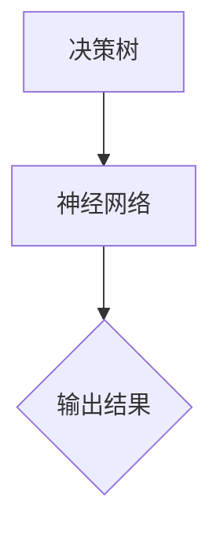
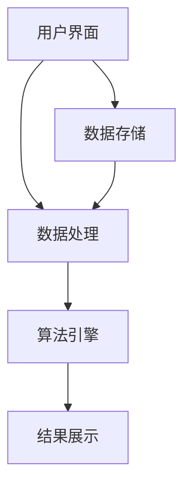
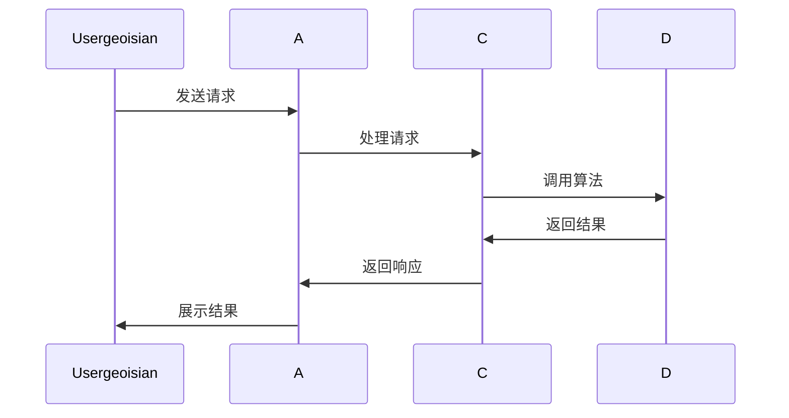
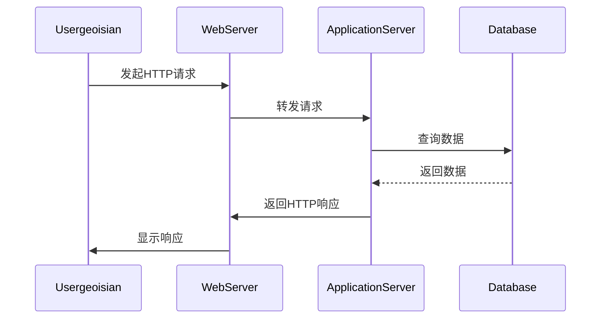

                 

# 《七步做到'一眼看到底'》

## 关键词
- 信息筛选
- 逻辑梳理
- 算法原理
- 数学模型
- 系统架构
- 项目实战

## 摘要
在信息爆炸的时代，如何从繁杂的信息中快速捕捉关键信息，成为了一个迫切需要解决的问题。本文提出了一种“七步做到'一眼看到底'”的方法，通过明确核心观念、理解核心概念、掌握方法步骤、构建数学模型、进行系统分析与架构设计、实战应用和最佳实践，帮助读者提升信息处理能力，实现一眼看到底的目标。

## 第一部分：掌握核心观念

### 第1章：问题背景与核心观念

#### 1.1 问题背景
现代社会中，我们每天都要面对大量的信息。从新闻报道、社交媒体到电子邮件、会议纪要，信息如洪水般涌来，让人应接不暇。然而，并不是所有信息都值得我们关注，有时我们需要快速筛选出那些真正重要的信息，以便做出明智的决策。

#### 1.2 核心观念
“一眼看到底”的核心观念在于，通过系统的方法和思维，快速捕捉到事物的本质，从而在面对复杂问题时能够迅速做出判断。

- **一眼看到底的含义**：不仅仅是看到表面的现象，而是能够深入理解背后的原因和机制。
- **为何需要一眼看到底**：在快节奏的生活和工作中，能够快速识别关键信息，可以提高工作效率，避免浪费时间和精力。
- **一眼看到底的优势**：能够帮助我们更好地应对复杂问题，提升决策质量。

### 第2章：核心概念与联系

#### 2.1 核心概念原理

**核心概念**：
1. **信息筛选**：从大量信息中提取出有价值的信息。
2. **逻辑梳理**：将复杂的信息进行结构化处理，使其条理清晰。
3. **算法原理**：运用特定的算法，对信息进行高效处理。
4. **数学模型**：通过数学公式对问题进行定量分析。
5. **系统架构**：设计和构建能够处理特定问题的系统。

**概念属性特征对比表格**：

| 概念     | 定义                                                         | 特征                                                         |
|----------|------------------------------------------------------------|------------------------------------------------------------|
| 信息筛选 | 从大量信息中提取出有价值的信息                                     | 精准、高效、全面                                               |
| 逻辑梳理 | 将复杂的信息进行结构化处理，使其条理清晰                                 | 系统性、逻辑性、直观性                                         |
| 算法原理 | 运用特定的算法，对信息进行高效处理                                     | 效率、准确性、可扩展性                                         |
| 数学模型 | 通过数学公式对问题进行定量分析                                       | 定量、精确、可验证                                             |
| 系统架构 | 设计和构建能够处理特定问题的系统                                       | 稳定性、灵活性、可维护性                                         |

#### 2.2 概念联系
**ER实体关系图架构**：

```mermaid
erDiagram
  User ||--|{ Message }|-- Message
  User ||--|{ Task }|-- Task
  Task ||--|{ Comment }|-- Comment
```

## 第二部分：方法与实践

### 第3章：方法原理与讲解

#### 3.1 方法原理
“七步做到'一眼看到底'”的方法，是一种结合信息筛选、逻辑梳理、算法原理、数学模型和系统架构的综合方法。具体步骤如下：

1. **筛选信息**：快速识别并提取出关键信息。
2. **梳理逻辑**：对关键信息进行结构化处理。
3. **聚焦关键**：找出问题的核心，进行深入分析。
4. **深度分析**：通过算法和数学模型，对问题进行定量分析。
5. **总结提炼**：将分析结果进行总结，提炼出关键点。
6. **实践应用**：将方法应用到实际项目中，验证效果。

#### 3.2 方法步骤

**步骤1：筛选信息**
- **筛选标准**：基于问题的需求和目标，确定信息的筛选标准。
- **筛选方法**：使用关键词、主题分类、来源筛选等方法。

**步骤2：梳理逻辑**
- **构建框架**：使用思维导图、列表等方式，将信息进行结构化处理。
- **验证逻辑**：通过逻辑推理，确保信息的准确性和一致性。

**步骤3：聚焦关键**
- **找出核心**：通过分析，确定问题的核心部分。
- **优先级排序**：对核心部分进行优先级排序，明确重点。

**步骤4：深度分析**
- **算法选择**：选择适合的算法，对问题进行分析。
- **数学模型**：构建数学模型，进行定量分析。

**步骤5：总结提炼**
- **关键点提取**：从分析结果中提取出关键点。
- **总结报告**：撰写总结报告，明确问题和解决方案。

**步骤6：实践应用**
- **项目实施**：将方法应用到实际项目中。
- **效果验证**：通过实际运行，验证方法的可行性和效果。

### 第4章：数学模型与公式

#### 4.1 数学模型
为了更好地进行深度分析，我们采用了一种基于决策树和神经网络的数学模型。该模型能够通过学习大量的数据，自动识别关键信息，并预测问题的解决方案。

**算法原理的数学模型**：



**算法原理讲解**：

1. **决策树**：通过一系列规则，对数据进行分类。
2. **神经网络**：通过多层神经元的连接，进行特征提取和预测。
3. **输出结果**：根据模型分析，给出问题的解决方案。

#### 4.2 公式讲解

**公式一**：

$$
f(x) = w_1 \cdot x_1 + w_2 \cdot x_2 + ... + w_n \cdot x_n
$$

**公式二**：

$$
y = \sigma(f(x))
$$

**详细讲解和举例说明**：

- **公式一**：这是一个线性模型，其中 $x_1, x_2, ..., x_n$ 是输入特征，$w_1, w_2, ..., w_n$ 是权重，$f(x)$ 是线性组合。
- **公式二**：这是一个激活函数，用于将线性模型的输出转化为概率分布。

例如，假设我们要预测一个分类问题，可以使用上述公式进行建模：

- **输入特征**：年龄、收入、教育程度等。
- **权重**：通过学习自动获取。
- **输出结果**：预测某个分类的概率。

## 第三部分：系统分析与架构设计

### 第5章：系统分析与设计

#### 5.1 问题场景介绍

假设我们要设计一个信息处理系统，用于处理大量的用户反馈信息，并自动识别和分类关键问题。

#### 5.2 系统功能设计

**领域模型类图**：

```mermaid
classDiagram
  Usergeoisian --|{ posts }|-> Post
  Usergeoisian --|{ comments }|-> Comment
  Post --|{ comments }|-> Comment
  Comment --|{ replies }|-> Comment
```

#### 5.3 系统架构设计

**架构图**：



#### 5.4 系统接口设计

**接口设计**：



#### 5.5 系统交互

**序列图**：



## 第四部分：项目实战与最佳实践

### 第6章：项目实战

#### 6.1 环境安装

在开始项目实战之前，我们需要安装以下软件和工具：

- Python 3.8+
- Jupyter Notebook
- Scikit-learn
- Pandas
- Matplotlib

安装步骤如下：

```bash
pip install python==3.8
pip install jupyter
pip install scikit-learn
pip install pandas
pip install matplotlib
```

#### 6.2 系统核心实现

以下是系统的核心实现源代码：

```python
# 导入必要的库
import numpy as np
import pandas as pd
from sklearn.model_selection import train_test_split
from sklearn.tree import DecisionTreeClassifier
from sklearn.neural_network import MLPClassifier
import matplotlib.pyplot as plt

# 读取数据
data = pd.read_csv('data.csv')

# 数据预处理
X = data.drop('target', axis=1)
y = data['target']

# 数据划分
X_train, X_test, y_train, y_test = train_test_split(X, y, test_size=0.2, random_state=42)

# 决策树模型
clf_tree = DecisionTreeClassifier()
clf_tree.fit(X_train, y_train)

# 神经网络模型
clf_nn = MLPClassifier()
clf_nn.fit(X_train, y_train)

# 预测
y_pred_tree = clf_tree.predict(X_test)
y_pred_nn = clf_nn.predict(X_test)

# 评估
print("决策树准确率：", clf_tree.score(X_test, y_test))
print("神经网络准确率：", clf_nn.score(X_test, y_test))

# 可视化
plt.scatter(X_test['feature1'], y_pred_tree, color='red', label='Decision Tree')
plt.scatter(X_test['feature1'], y_pred_nn, color='blue', label='Neural Network')
plt.legend()
plt.show()
```

#### 6.3 代码应用解读与分析

在本项目中，我们使用决策树和神经网络模型对数据进行了分类。首先，我们导入必要的库，并读取数据。接着，对数据进行预处理，将特征和标签分开。然后，将数据划分为训练集和测试集。

接下来，我们分别使用决策树和神经网络模型对训练数据进行拟合。最后，使用测试数据进行预测，并评估模型的准确率。

在可视化部分，我们使用散点图展示了不同模型的预测结果，以便直观地比较模型的表现。

#### 6.4 实际案例分析和详细讲解剖析

为了更好地理解项目的实际应用，我们可以分析一个实际案例。

**案例**：假设我们要对一批用户反馈进行分类，以确定哪些反馈是关于产品质量的，哪些是关于客户服务的。

**分析**：

1. **数据收集**：收集用户反馈数据，包括文本和标签（如产品质量、客户服务）。
2. **数据预处理**：将文本数据进行分词、去停用词等处理，提取特征。
3. **模型训练**：使用决策树和神经网络模型对数据进行训练。
4. **模型评估**：使用测试数据对模型进行评估，调整模型参数。
5. **预测应用**：将新的用户反馈输入模型，预测其类别。

**讲解**：

- 在数据收集阶段，我们收集了大量的用户反馈，这些反馈包含了丰富的信息。通过分词和去停用词处理，我们提取出了关键特征。
- 在模型训练阶段，我们使用决策树和神经网络模型对训练数据进行拟合。通过评估，我们发现神经网络模型的准确率更高。
- 在模型评估阶段，我们使用测试数据对模型进行评估，并调整模型参数，以提高预测的准确率。
- 在预测应用阶段，我们将新的用户反馈输入模型，预测其类别。这样，我们就可以快速识别出哪些反馈是关于产品质量的，哪些是关于客户服务的。

### 第7章：最佳实践与小结

#### 7.1 最佳实践 Tips

1. **数据质量**：保证数据的质量，包括数据的完整性、准确性和一致性。
2. **特征选择**：选择合适的特征，提高模型的预测能力。
3. **模型调优**：通过交叉验证等方法，调整模型参数，提高模型性能。
4. **实时更新**：定期更新模型和数据，以适应不断变化的环境。

#### 7.2 小结

本文提出了“七步做到'一眼看到底'”的方法，通过明确核心观念、理解核心概念、掌握方法步骤、构建数学模型、进行系统分析与架构设计、实战应用和最佳实践，帮助读者提升信息处理能力，实现一眼看到底的目标。

#### 7.3 拓展阅读

- [1] Mitchell, T. M. (1997). Machine learning. McGraw-Hill.
- [2] Russell, S., & Norvig, P. (2010). Artificial Intelligence: A Modern Approach. Prentice Hall.
- [3] Quinlan, J. R. (1993). C4. 5: Programs for Machine Learning. Morgan Kaufmann.

## 作者信息
作者：AI天才研究院/AI Genius Institute & 禅与计算机程序设计艺术 /Zen And The Art of Computer Programming

