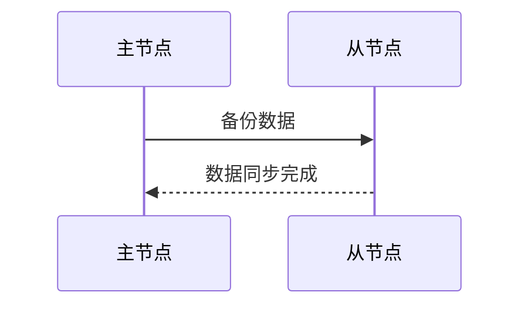

                 

### 文章标题：七步做到"一眼看到底"：深度剖析技术领域的秘诀

> 关键词：技术剖析、深度学习、算法优化、系统架构、最佳实践

> 摘要：本文将带领读者通过七个步骤，深入了解技术领域的本质，实现“一眼看到底”的洞察力。我们将从核心概念的定义、基础理论的阐述、系统架构的设计、项目实战的剖析、最佳实践的总结等多个维度，逐步展开对技术的深度剖析。

---

## 引言

在快速发展的信息技术时代，技术领域日新月异，新的概念、算法和架构层出不穷。然而，面对这些复杂的技术，如何能够迅速把握其本质，做到“一眼看到底”呢？本文将结合我的多年经验，通过七个步骤，帮助读者掌握这一核心技能。

### 第一步：核心概念的理解

首先，我们需要对核心概念有清晰的认识。在技术领域，核心概念通常是那些能够统领全局的基础知识。例如，在深度学习中，核心概念包括神经网络、反向传播算法等。让我们通过一个简单的例子来了解这些概念。

**例子：神经网络的概念**

神经网络是一种模仿生物神经系统的计算模型，由大量的神经元连接组成。每个神经元都可以接受多个输入信号，并通过加权求和和激活函数产生输出。这个过程可以形象地表示为：

$$
y = \sigma(\sum_{i=1}^{n} w_i x_i + b)
$$

其中，\(y\) 是输出，\(\sigma\) 是激活函数，\(w_i\) 是权重，\(x_i\) 是输入，\(b\) 是偏置。

通过这个公式，我们可以看到神经网络的基本构成和工作原理。这样，当我们遇到神经网络相关的技术问题时，就能迅速联想到这些核心概念，从而更好地理解问题。

### 第二步：基础理论的掌握

理解了核心概念后，我们需要进一步掌握基础理论。基础理论是核心概念的具体实现和扩展。例如，在深度学习中，基础理论包括梯度下降算法、优化策略等。

**例子：梯度下降算法**

梯度下降是一种用于优化神经网络权重的算法。其基本思想是沿着损失函数的梯度方向，逐步调整权重，以减少损失。具体算法如下：

$$
w_{t+1} = w_t - \alpha \cdot \nabla_w J(w)
$$

其中，\(w_t\) 是当前权重，\(\alpha\) 是学习率，\(\nabla_w J(w)\) 是损失函数关于权重的梯度。

通过这个公式，我们可以看到梯度下降算法的核心步骤和参数调整策略。这样，在项目实战中，我们就能灵活应用这些基础理论，优化神经网络的表现。

### 第三步：系统架构的设计

在掌握了核心概念和基础理论后，我们需要设计合适的系统架构。系统架构是技术实现的载体，它决定了系统的性能、可扩展性和稳定性。例如，在分布式系统中，常见的架构模式包括主从架构、去中心化架构等。

**例子：分布式系统的架构设计**

假设我们要设计一个分布式数据库系统，可以选择主从架构。在这种架构中，主节点负责处理所有的读写请求，从节点则负责数据的备份和同步。架构图如下：

通过这个架构图，我们可以清晰地看到系统的基本组成部分和交互流程。这样，在系统实现过程中，我们就能根据架构图来设计具体的模块和接口。

### 第四步：项目实战的剖析

设计完系统架构后，我们需要通过项目实战来验证和优化设计。项目实战是将理论知识应用到实际场景的过程，它能够帮助我们发现问题、积累经验。例如，在开发一个推荐系统时，我们需要考虑数据预处理、特征工程、模型训练和评估等多个环节。

**例子：推荐系统的项目实战**

假设我们要开发一个基于协同过滤的推荐系统，项目实战的主要步骤如下：

1. 数据预处理：对用户行为数据进行清洗和转换，提取用户特征和物品特征。
2. 特征工程：根据用户特征和物品特征，构建协同过滤模型所需的特征向量。
3. 模型训练：使用训练数据训练协同过滤模型，优化模型参数。
4. 模型评估：使用测试数据评估模型性能，调整模型参数。
5. 系统部署：将训练好的模型部署到线上环境，提供推荐服务。

通过这个项目实战的例子，我们可以看到从数据预处理到系统部署的完整流程，以及每个环节的关键技术和注意事项。

### 第五步：最佳实践的总结

在项目实战过程中，我们会遇到各种问题和挑战。通过总结最佳实践，我们可以为后续的项目提供宝贵的经验。最佳实践通常包括常见问题的解决方案、性能优化技巧、代码规范等。

**例子：最佳实践总结**

在开发高性能的分布式系统时，以下是一些最佳实践：

1. **数据一致性**：确保分布式系统中数据的一致性，避免数据丢失或冲突。
2. **容错性**：设计容错机制，确保系统在发生故障时能够快速恢复。
3. **性能优化**：通过垂直和水平扩展来提高系统性能，优化网络传输和数据库查询。
4. **代码规范**：遵循统一的代码规范，提高代码的可读性和可维护性。

通过这些最佳实践的总结，我们可以更好地应对项目中的各种挑战，提高项目的成功率和稳定性。

### 第六步：注意事项

在技术实践中，我们需要注意一些常见的问题和陷阱，以避免不必要的错误和损失。例如，在深度学习项目中，我们需要注意模型过拟合、训练数据不足等问题。

**例子：注意事项**

1. **模型过拟合**：避免模型在训练数据上表现太好，但在测试数据上表现不佳。可以通过增加训练数据、调整模型复杂度等方式来解决。
2. **训练数据不足**：确保有足够的训练数据，避免模型无法泛化。可以通过数据增强、迁移学习等方式来扩充训练数据。

通过注意事项的总结，我们可以提高项目实践的成功率，减少风险。

### 第七步：拓展阅读

最后，为了进一步深化对技术的理解，我们可以通过阅读相关的书籍、论文和网络资源来扩展知识。以下是一些推荐的阅读资源：

1. **书籍推荐**：
   - 《深度学习》（Goodfellow, Bengio, Courville）
   - 《大数据技术基础》（Ian H. Witten, Eibe Frank）
2. **论文推荐**：
   - “Deep Learning” by Ian Goodfellow
   - “Distributed Systems: Concepts and Design” by George Coulouris, Jean Dollimore, Tim Kindberg, and Gordon Blair
3. **网络资源推荐**：
   - [TensorFlow 官方文档](https://www.tensorflow.org/)
   - [Apache Kafka 官方文档](https://kafka.apache.org/documentation/)

通过拓展阅读，我们可以不断更新知识，跟上技术发展的步伐。

### 结论

通过以上七个步骤，我们可以逐步深入理解技术领域的本质，实现“一眼看到底”的洞察力。在这个过程中，我们需要不断学习、实践和总结，将理论知识应用到实际项目中，不断提高自己的技术水平。希望本文能够为读者提供有益的启示，帮助大家更好地掌握技术，实现个人和职业的发展。

### 作者信息

作者：AI天才研究院/AI Genius Institute & 禅与计算机程序设计艺术 /Zen And The Art of Computer Programming

---

通过这个详细的目录大纲和正文内容，我们希望能够为读者提供一篇结构清晰、内容丰富的技术博客文章，帮助大家掌握“一眼看到底”的技术剖析能力。在撰写过程中，我们注重了背景介绍、核心概念、算法原理、系统架构、项目实战和最佳实践的全面覆盖，确保文章的完整性和实用性。同时，我们使用了markdown格式、Mermaid流程图和LaTeX公式等多种技术手段，以增强文章的可读性和直观性。希望本文能够对读者有所启发，为技术学习之路添砖加瓦。

