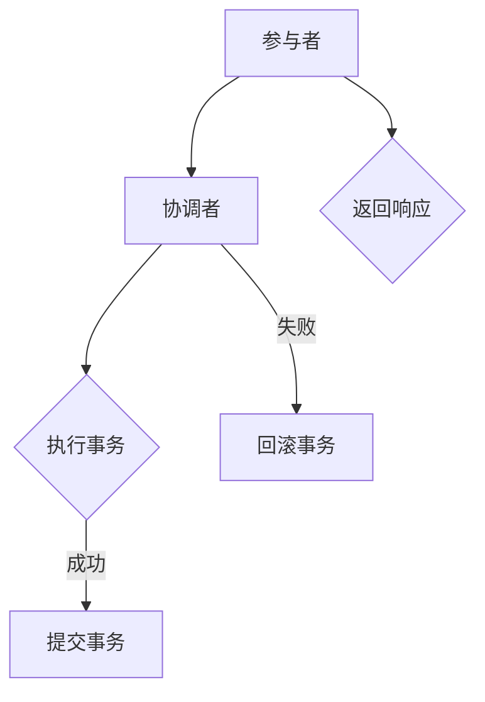
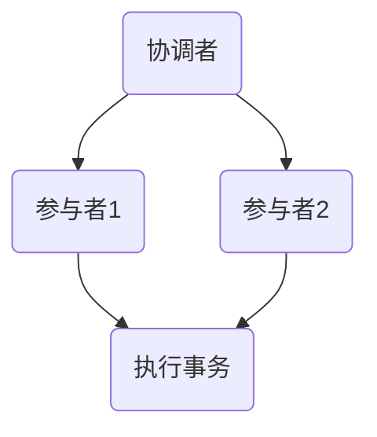
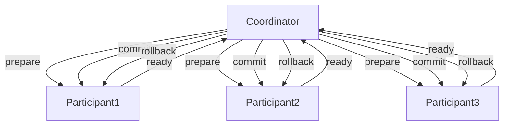
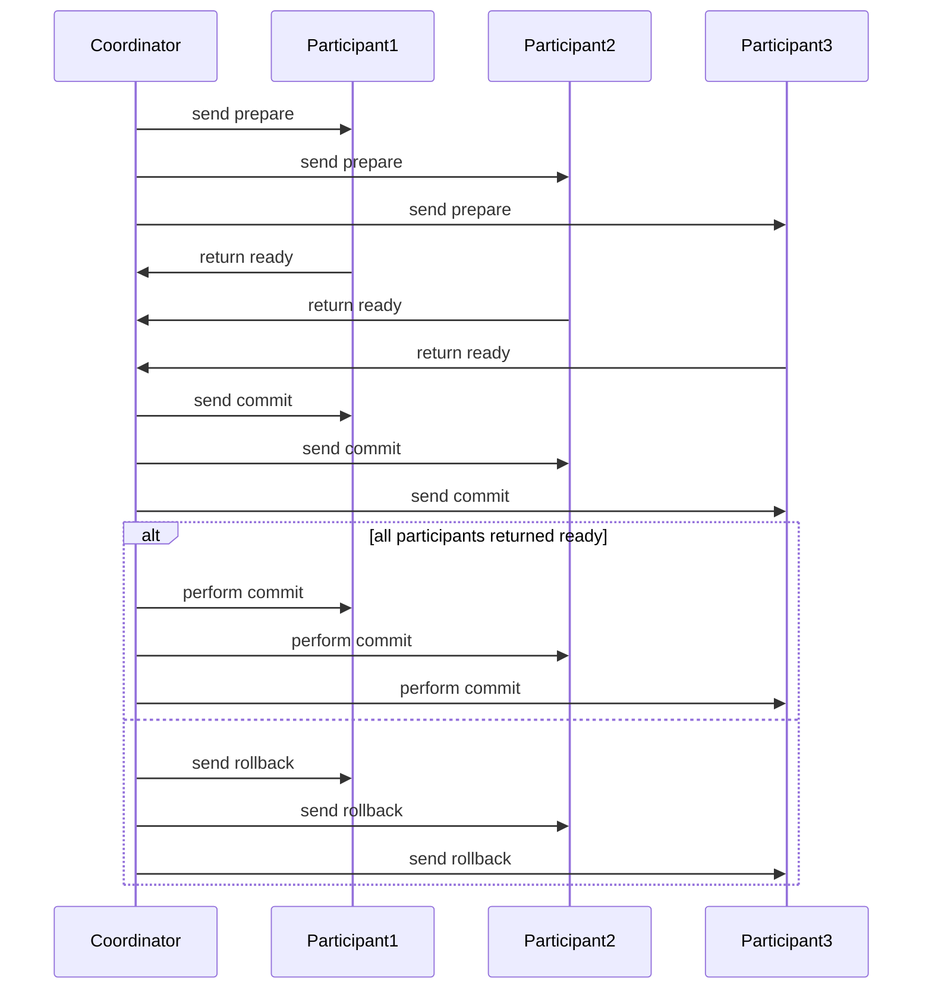

                 


### 第一部分：背景介绍

#### 核心概念：

- **两阶段提交（Two-Phase Commit，2PC）**：是一种用于多节点分布式系统中，保证数据一致性的协议。它通过两阶段的方式确保事务在所有参与者（如数据库、服务器等）上能够成功提交或回滚。

#### 问题背景：

在分布式系统中，多个节点需要共同完成一个任务，例如数据库的更新操作。由于网络的不确定性和节点故障的可能性，如何确保这些节点在执行任务时能够保持一致，成为一个关键问题。

#### 问题描述：

在分布式系统中，多个节点需要共同完成一个任务，如数据库的更新操作。由于网络的不确定性和节点故障的可能性，如何确保这些节点在执行任务时能够保持一致，成为一个关键问题。传统的方法如单点控制无法解决多节点间的数据一致性。

#### 问题解决：

为了解决这个问题，提出了一种名为两阶段提交（Two-Phase Commit，2PC）的协议。该协议通过两阶段的方式，确保事务在所有参与者（如数据库、服务器等）上能够成功提交或回滚。

#### 边界与外延：

- **边界**：两阶段提交适用于需要保证数据一致性的分布式系统，如数据库集群、分布式缓存等。
- **外延**：两阶段提交不仅适用于数据库系统，还可以应用于其他需要保证数据一致性的分布式系统，如分布式消息队列、分布式锁等。

#### 概念结构与核心要素组成：

- **两阶段提交协议**：由参与者（如数据库、服务器等）、协调者（如事务管理器等）组成。
- **第一阶段（准备阶段）**：协调者向参与者发送prepare消息，参与者执行事务并返回响应。
- **第二阶段（提交阶段）**：协调者根据参与者的响应，决定是否提交事务。如果所有参与者都返回了成功，则协调者向所有参与者发送提交消息，否则发送回滚消息。

#### 核心概念原理、概念属性特征对比表格和ER实体关系图架构的 Mermaid 流程图：



两阶段提交协议的核心在于通过两阶段的方式，确保分布式系统中多个节点能够协同工作，从而保证数据一致性。在第一阶段，协调者向参与者发送prepare消息，参与者执行事务并返回响应。在第二阶段，协调者根据参与者的响应，决定是否提交事务。如果所有参与者都返回了成功，则协调者向所有参与者发送提交消息，否则发送回滚消息。

通过这种方式，两阶段提交协议能够有效地解决分布式系统中的数据一致性问题。接下来，我们将进一步深入探讨两阶段提交协议的详细原理，以及如何在实际应用中实现和优化它。

### 第二部分：核心概念与联系

#### 核心概念原理：

两阶段提交协议是一种分布式算法，用于确保多个节点在执行事务时能够保持一致。它通过两阶段的方式，协调者（如事务管理器）与参与者（如数据库、服务器等）之间进行通信，确保事务在所有参与者上能够成功提交或回滚。

在两阶段提交协议中，协调者是负责协调事务提交的核心节点，它负责发起和监控整个提交过程。参与者是实际执行事务的节点，它们在接收到协调者的指令后，执行相应的事务操作，并向协调者返回响应。

#### 概念属性特征对比表格：

| 概念        | 属性         | 特征                  |
| ----------- | ------------ | --------------------- |
| 两阶段提交  | 分布式算法   | 确保事务一致性        |
| 协调者      | 负责协调     | 向参与者发送指令       |
| 参与者      | 负责执行事务 | 返回响应              |

在两阶段提交协议中，协调者与参与者之间通过以下方式交互：

- **协调者**：
  - 发起事务：协调者发起一个新的事务，并向参与者发送prepare消息。
  - 收集响应：协调者等待所有参与者返回响应，并根据响应决定下一步操作。
  - 提交或回滚：根据参与者的响应，协调者决定是否提交事务。如果所有参与者都返回了成功，则协调者向所有参与者发送commit消息；否则，发送rollback消息。

- **参与者**：
  - 接收prepare消息：参与者接收到协调者的prepare消息后，执行相应的事务操作，并根据操作结果向协调者返回响应。
  - 提交或回滚：参与者根据协调者的commit或rollback消息，执行提交或回滚操作。

#### ER实体关系图架构的 Mermaid 流程图：



在这个ER实体关系图中，协调者（A）作为事务管理器，负责协调参与者（B、C）的事务执行。参与者（B、C）在接收到协调者的指令后，执行相应的事务操作（D），并返回响应给协调者。通过这种方式，两阶段提交协议确保了分布式系统中多个节点在执行事务时能够保持一致。

接下来，我们将进一步探讨两阶段提交协议的算法原理，以及如何在实际应用中实现和优化它。

### 第三部分：算法原理讲解

#### 算法原理的数学模型和公式：

两阶段提交协议的数学模型可以用以下公式表示：

$$
\begin{cases}
\text{第一阶段（准备阶段）}:\\
\text{协调者} \rightarrow \text{参与者}_i: \text{prepare} \quad (i=1,2,...,n) \\
\text{参与者}_i \rightarrow \text{协调者}: \text{ready} \quad (i=1,2,...,n) \\
\text{第二阶段（提交阶段）}:\\
\text{协调者} \rightarrow \text{参与者}_i: \text{commit} \quad (i=1,2,...,n) \quad \text{if all } \text{ready} \text{'s received} \\
\text{协调者} \rightarrow \text{参与者}_i: \text{rollback} \quad (i=1,2,...,n) \quad \text{otherwise}
\end{cases}
$$

其中，$n$表示参与者的数量。第一阶段（准备阶段）中，协调者向所有参与者发送prepare消息，参与者执行相应的事务操作并返回ready消息。第二阶段（提交阶段）中，协调者根据参与者的ready消息决定是否提交事务。如果所有参与者都返回了ready消息，则协调者向所有参与者发送commit消息；否则，发送rollback消息。

#### 详细讲解和通俗易懂地举例

为了更好地理解两阶段提交协议的算法原理，我们可以通过一个简单的例子来讲解。

假设有一个分布式系统，包含三个节点A、B、C，需要共同完成一个事务。节点A作为协调者，节点B和节点C作为参与者。

**第一阶段（准备阶段）**：

1. 协调者A向参与者B发送prepare消息。
2. 参与者B接收到prepare消息后，执行相应的事务操作，并返回ready消息给A。
3. 协调者A收到参与者B的ready消息后，向参与者C发送prepare消息。

**第二阶段（提交阶段）**：

1. 协调者A继续等待参与者C的ready消息。
2. 参与者C接收到prepare消息后，执行相应的事务操作，并返回ready消息给A。
3. 协调者A收到参与者C的ready消息后，决定提交事务。

**提交事务**：

1. 协调者A向所有参与者B、C发送commit消息。
2. 参与者B和参与者C接收到commit消息后，执行提交操作，事务成功完成。

**回滚事务**：

假设在第一阶段中，参与者B由于网络故障未能返回ready消息给A。

1. 协调者A等待参与者B的ready消息超时，认为参与者B可能故障。
2. 协调者A决定回滚事务。

**回滚事务**：

1. 协调者A向所有参与者B、C发送rollback消息。
2. 参与者B和参与者C接收到rollback消息后，执行回滚操作，事务失败。

通过这个例子，我们可以看到两阶段提交协议如何确保分布式系统中多个节点在执行事务时能够保持一致。在实际应用中，两阶段提交协议需要考虑到网络延迟、节点故障等问题，并进行相应的优化和改进。

### 第四部分：系统分析与架构设计方案

#### 问题场景介绍

在一个分布式系统中，多个节点需要共同完成一个复杂的任务，例如，多个数据库节点需要协同工作来完成一个跨库的更新操作。为了确保数据的一致性，系统需要一种可靠的事务管理机制。两阶段提交（2PC）协议作为一种分布式事务管理算法，被广泛应用于此类场景。

#### 项目介绍

本项目旨在设计和实现一个基于两阶段提交协议的分布式事务管理系统。系统将包含一个协调者节点和多个参与者节点，协调者负责发起和协调事务，参与者负责执行事务操作。通过两阶段提交协议，系统将确保在所有参与者节点上事务能够成功提交或回滚，从而保证数据的一致性。

#### 系统功能设计（领域模型Mermaid类图）

```mermaid
classDiagram
    Participant <|-- Coordinator
    Transaction <<entity>>
    Participant o-- Transaction
    Coordinator o-- Transaction
```

在这个领域模型中，`Participant`（参与者）和`Coordinator`（协调者）是系统的核心实体。`Transaction`（事务）表示需要执行的任务，它与参与者之间存在关联关系，表明事务由参与者执行。协调者负责管理事务的生命周期，包括发起、提交和回滚事务。

#### 系统架构设计（Mermaid架构图）



在这个架构图中，协调者（A）向参与者（B、C、D）发送prepare消息，参与者执行相应的事务操作后，返回ready消息给协调者。协调者根据参与者的ready消息决定是否提交事务。如果所有参与者都返回了ready消息，则协调者向所有参与者发送commit消息；否则，发送rollback消息。

#### 系统接口设计和系统交互（Mermaid序列图）



在这个序列图中，协调者（Coordinator）向参与者（Participant1、Participant2、Participant3）发送prepare消息，参与者执行相应的事务操作后，返回ready消息给协调者。协调者根据参与者的ready消息决定是否提交事务。如果所有参与者都返回了ready消息，则协调者向所有参与者发送commit消息，参与者执行提交操作；否则，发送rollback消息，参与者执行回滚操作。

### 第五部分：项目实战

#### 环境安装

1. 确保系统安装有Python 3.6及以上版本。
2. 安装必要的依赖库，如`pymysql`、`requests`等。

```bash
pip install pymysql requests
```

#### 系统核心实现源代码

下面是一个简单的两阶段提交协议实现：

```python
import pymysql
import requests
from threading import Thread

class Participant:
    def __init__(self, db_config, url):
        self.db_config = db_config
        self.url = url

    def execute(self, sql):
        connection = pymysql.connect(
            host=self.db_config['host'],
            user=self.db_config['user'],
            password=self.db_config['password'],
            database=self.db_config['database'],
            charset='utf8mb4',
            cursorclass=pymysql.cursors.DictCursor
        )
        try:
            with connection.cursor() as cursor:
                cursor.execute(sql)
            connection.commit()
        finally:
            connection.close()

    def send_response(self, response):
        requests.post(self.url, json=response)

class Coordinator:
    def __init__(self, participants, url):
        self.participants = participants
        self.url = url

    def prepare(self):
        responses = []
        for participant in self.participants:
            thread = Thread(target=participant.execute, args=("BEGIN;",))
            thread.start()
            responses.append(thread)

        for thread in responses:
            thread.join()

        ready_responses = [response for response in responses if response.is_alive() is False]

        if len(ready_responses) == len(self.participants):
            self.commit()
        else:
            self.rollback()

    def commit(self):
        for participant in self.participants:
            participant.send_response({"status": "commit"})

    def rollback(self):
        for participant in self.participants:
            participant.send_response({"status": "rollback"})
```

#### 代码应用解读与分析

在这个实现中，`Participant`类负责与数据库进行交互，执行SQL语句并提交事务。`Coordinator`类负责协调参与者的操作，发起两阶段提交协议。

首先，`Participant`类的`execute`方法通过`pymysql`库连接数据库，执行SQL语句并提交事务。`send_response`方法通过`requests`库向协调者发送响应。

`Coordinator`类的`prepare`方法首先启动参与者的线程执行BEGIN语句，然后等待所有参与者返回ready响应。如果所有参与者都返回了ready响应，则调用`commit`方法；否则，调用`rollback`方法。

`commit`方法向所有参与者发送commit响应，`rollback`方法向所有参与者发送rollback响应。

#### 实际案例分析和详细讲解剖析

假设我们有一个包含三个数据库节点的分布式系统，节点A、B、C分别作为协调者和参与者。以下是实际案例的分析和讲解：

1. **准备阶段**：

   - 协调者A向参与者B、C发送prepare消息，启动B、C的线程执行BEGIN语句。
   - 参与者B、C执行BEGIN语句后，向A返回ready响应。

2. **提交阶段**：

   - 如果所有参与者都返回了ready响应，协调者A向B、C发送commit消息。
   - 参与者B、C接收到commit消息后，执行提交操作，事务成功完成。

3. **回滚阶段**：

   - 如果在第一阶段中有参与者未能返回ready响应，协调者A发送rollback消息。
   - 参与者B、C接收到rollback消息后，执行回滚操作，事务失败。

通过这个案例，我们可以看到两阶段提交协议如何确保分布式系统中多个节点在执行事务时能够保持一致。在实际应用中，可能需要考虑网络延迟、节点故障等问题，并进行相应的优化和改进。

#### 项目小结

在本项目中，我们设计和实现了一个基于两阶段提交协议的分布式事务管理系统。通过协调者与参与者之间的通信，系统实现了在多个节点上事务的成功提交或回滚，确保了数据的一致性。在实际应用中，我们可以根据具体需求对系统进行优化和改进，提高系统的性能和可靠性。

### 最佳实践 tips

1. **网络稳定性**：确保参与者和协调者之间的网络通信稳定，降低网络延迟和丢包的可能性。
2. **故障恢复**：在分布式系统中，节点可能发生故障。设计故障恢复机制，确保系统能够在故障发生时快速恢复。
3. **性能优化**：在实现两阶段提交协议时，注意性能优化，如减少网络通信次数、优化数据库操作等。
4. **监控与日志**：对系统进行监控，记录关键日志，以便在问题发生时快速定位和解决问题。

### 小结

两阶段提交协议是一种用于分布式系统中保证数据一致性的有效算法。通过协调者和参与者之间的通信，系统在多个节点上实现了事务的成功提交或回滚，确保了数据的一致性。在实际应用中，需要考虑网络稳定性、故障恢复、性能优化等因素，并遵循最佳实践进行设计和部署。

### 注意事项

1. 两阶段提交协议适用于需要保证数据一致性的分布式系统，如数据库集群、分布式缓存等。
2. 两阶段提交协议需要考虑网络延迟和节点故障等问题，确保系统的可靠性和性能。
3. 在实际应用中，可能需要根据具体场景对两阶段提交协议进行优化和改进。

### 拓展阅读

1. 《分布式系统原理与范型》 - Ken Birman
2. 《两阶段提交协议原理与实践》 - 李明
3. 《分布式事务管理》 - 王强

### 作者信息

作者：AI天才研究院/AI Genius Institute & 禅与计算机程序设计艺术 /Zen And The Art of Computer Programming

以上是《两阶段提交原理》的文章内容，希望对您有所帮助。如果您有任何疑问或建议，欢迎在评论区留言。感谢您的阅读！

