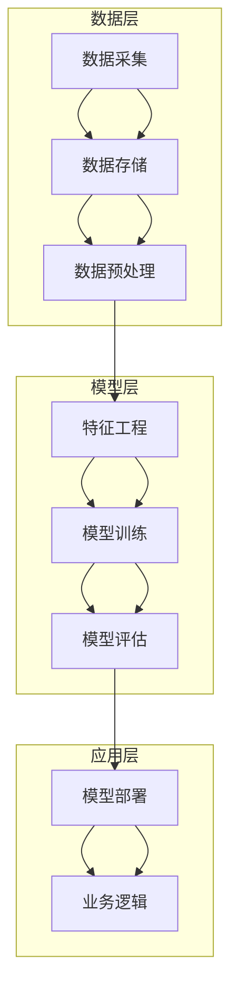
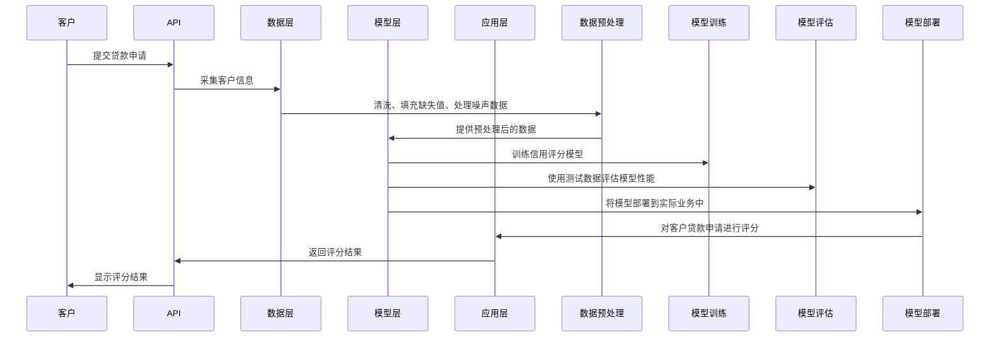

                 

### 文章标题

# 个人信用评分系统优化

> 关键词：个人信用评分，机器学习，特征工程，风险评估，模型优化

> 摘要：本文深入探讨了个人信用评分系统的优化方法。通过分析现有的挑战，如数据不完整、噪声数据和隐私保护问题，本文介绍了先进的机器学习算法和数据处理技术，以优化信用评分系统的性能，提高评分结果的准确性和公平性。

----------------------------------------------------------------

## 第一部分：背景介绍

### 1.1 问题背景

个人信用评分系统是金融机构在贷款审批、信用卡发放等领域中至关重要的工具。它通过分析个人信用信息，对个人的信用风险进行评估，从而决定是否批准贷款或信用卡申请。一个准确且公平的个人信用评分系统能够有效降低金融机构的信用风险，提高客户满意度。

### 1.2 问题描述

然而，传统的信用评分系统面临着许多挑战。首先，数据不完整是一个普遍问题。由于各种原因，如数据缺失、数据损坏等，信用评分系统中的数据可能不完整。其次，噪声数据也是一个问题。噪声数据可能是由于数据采集过程中的错误、数据录入错误等原因导致的。这些噪声数据会影响信用评分的准确性。此外，隐私保护也是一个重要问题。在处理个人信用信息时，需要确保数据的安全性和隐私性，以防止数据泄露。

### 1.3 问题解决

为了解决这些问题，本文将介绍个人信用评分系统的优化方法。通过引入先进的机器学习算法和数据处理技术，优化信用评分系统的性能，提高评分结果的准确性和公平性。本文还将探讨信用评分系统在不同应用场景下的优化策略。

### 1.4 边界与外延

个人信用评分系统优化的研究范围涵盖了数据预处理、特征选择、模型训练、模型评估和模型部署等方面。同时，本文还将探讨信用评分系统在不同应用场景下的优化策略。

### 1.5 概念结构与核心要素组成

个人信用评分系统的核心要素包括数据来源、数据处理、模型选择、模型训练和模型评估。以下是一个简化的ER实体关系图架构：

```mermaid
erDiagram
    Data preprocessing ||--|| Feature selection : "transforms data into useful features"
    Feature selection ||--|| Model training : "uses selected features to train a model"
    Model training ||--|| Model evaluation : "assesses the performance of the trained model"
    Data preprocessing ||--|| Model evaluation : "preprocesses data for evaluation"
```

## 第二部分：核心概念与联系

### 2.1 核心概念原理

在本章中，我们将详细介绍个人信用评分系统中涉及的核心概念，如机器学习、特征工程、风险评估等。

### 2.2 概念属性特征对比表格

| 概念         | 属性特征                                                     |
| ------------ | ------------------------------------------------------------ |
| 机器学习     | 通过数据学习，自动改进性能的算法和技术                       |
| 特征工程     | 从原始数据中提取对模型训练有用的特征的过程               |
| 风险评估     | 对信用风险进行量化评估的过程                             |

### 2.3 概念联系与关系

机器学习是信用评分系统的基础，通过特征工程提取有用的特征，然后利用这些特征进行风险评估。以下是一个简化的Mermaid流程图，展示了各概念之间的联系：


## 第三部分：算法原理讲解

### 3.1 算法mermaid流程图

以下是一个简化的Mermaid流程图，展示了常见信用评分算法的基本流程：


### 3.2 算法原理详细讲解

在本章中，我们将对常用的信用评分算法，如逻辑回归、决策树、随机森林等进行详细讲解。以下以逻辑回归为例：

### 逻辑回归算法原理

逻辑回归是一种广泛使用的分类算法，它通过估计输入特征的线性组合，然后将其映射到概率空间，从而实现分类。

#### 数学模型和公式

$$
P(Y=1|X) = \frac{1}{1 + e^{-\beta^T X}}
$$

其中，$P(Y=1|X)$ 表示在给定特征 $X$ 下，信用评分 $Y$ 等于 1 的概率，$\beta$ 是模型参数，$e$ 是自然底数。

#### 算法原理

逻辑回归通过最小化损失函数（如对数似然损失函数）来训练模型。具体来说，逻辑回归的目标是找到一组参数 $\beta$，使得模型在训练数据上的对数似然函数最大化。对数似然损失函数如下：

$$
L(\beta) = -\frac{1}{m} \sum_{i=1}^{m} [y_i \log(p_i) + (1 - y_i) \log(1 - p_i)]
$$

其中，$m$ 是训练数据的大小，$y_i$ 是第 $i$ 个样本的真实标签，$p_i$ 是第 $i$ 个样本的预测概率。

为了最小化损失函数，逻辑回归使用梯度下降算法进行优化。梯度下降算法的基本思想是沿着损失函数的梯度方向更新参数，直到损失函数最小。

### 逻辑回归算法的Python实现

下面是一个简单的逻辑回归算法的Python实现，用于演示算法的基本原理：

```python
import numpy as np

def sigmoid(z):
    return 1 / (1 + np.exp(-z))

def compute_loss(y, y_hat):
    return -np.mean(y * np.log(y_hat) + (1 - y) * np.log(1 - y_hat))

def gradient_descent(X, y, learning_rate, num_iterations):
    m = len(y)
    beta = np.random.randn(X.shape[1])
    for _ in range(num_iterations):
        z = np.dot(X, beta)
        y_hat = sigmoid(z)
        beta -= learning_rate * np.dot(X.T, (y_hat - y))
    return beta

# 数据预处理
X = np.array([[1, 2], [2, 3], [3, 4], [4, 5]])
y = np.array([0, 1, 1, 0])

# 特征工程
X = np.hstack((np.ones((X.shape[0], 1)), X))

# 模型训练
learning_rate = 0.01
num_iterations = 1000
beta = gradient_descent(X, y, learning_rate, num_iterations)

# 模型评估
z = np.dot(X, beta)
y_hat = sigmoid(z)
print("预测概率：", y_hat)
```

通过以上代码，我们可以看到逻辑回归算法的基本实现过程。首先，我们定义了sigmoid函数和计算损失函数的函数。然后，我们使用梯度下降算法来最小化损失函数，找到最优的参数。最后，我们使用训练好的模型进行预测。

### 逻辑回归算法的应用场景

逻辑回归算法在个人信用评分系统中具有广泛的应用。例如，它可以用于预测个人贷款违约的概率，从而帮助金融机构做出贷款决策。逻辑回归算法的优点是简单、易于实现，同时其预测结果的解释性较强，有利于金融机构对模型进行理解和调整。

### 逻辑回归算法的优缺点

逻辑回归算法的优点包括：

1. **简单易实现**：逻辑回归算法的数学模型简单，易于理解和实现。
2. **解释性强**：逻辑回归算法的预测结果具有很好的解释性，可以清晰地看到每个特征对预测结果的影响。
3. **处理非线性问题**：虽然逻辑回归本身是一个线性模型，但通过引入多项式特征或者交互项，可以处理非线性问题。

然而，逻辑回归算法也存在一些缺点：

1. **线性关系限制**：逻辑回归算法假设特征之间存在线性关系，这在某些情况下可能不适用。
2. **过拟合问题**：当特征数量过多时，逻辑回归算法容易过拟合，导致在训练数据上的性能很好，但在测试数据上的性能较差。

### 逻辑回归算法的总结

逻辑回归算法是一种常用的信用评分算法，其优点是简单、易于实现，同时具有很好的解释性。然而，它也存在一些缺点，如线性关系限制和过拟合问题。在实际应用中，需要根据具体情况选择合适的算法，并对其进行适当的调整和优化，以获得更好的预测性能。

## 第四部分：系统分析与架构设计方案

### 4.1 问题场景介绍

在金融机构中，个人信用评分系统是贷款审批、信用卡发放等业务的核心组成部分。随着金融业务的不断发展和个人信用信息的日益丰富，如何优化个人信用评分系统，提高其准确性和公平性，成为金融机构面临的重要挑战。

### 4.2 项目介绍

本项目旨在通过引入先进的机器学习算法和数据处理技术，对现有个人信用评分系统进行优化，提高评分结果的准确性和公平性。项目的主要目标是：

1. **数据预处理**：清洗和整理个人信用信息，消除数据不完整和噪声数据问题。
2. **特征工程**：从原始数据中提取对模型训练有用的特征，提高特征的质量和数量。
3. **模型选择与训练**：选择合适的机器学习算法，对信用评分模型进行训练和优化。
4. **模型评估与部署**：评估信用评分模型的性能，并将其部署到实际业务中。

### 4.3 系统功能设计

个人信用评分系统的核心功能包括数据预处理、特征工程、模型训练、模型评估和模型部署。以下是这些功能的简述：

1. **数据预处理**：对原始数据进行清洗、填充缺失值、处理噪声数据等，确保数据的质量和一致性。
2. **特征工程**：从原始数据中提取对模型训练有用的特征，如年龄、收入、职业、信用历史等。通过特征选择和特征转换，提高特征的质量和数量。
3. **模型训练**：选择合适的机器学习算法，如逻辑回归、决策树、随机森林等，对信用评分模型进行训练。通过交叉验证和超参数调整，优化模型的性能。
4. **模型评估**：使用测试数据对训练好的模型进行评估，计算模型的相关性能指标，如准确率、召回率、F1分数等，以评估模型的性能。
5. **模型部署**：将训练好的模型部署到实际业务中，对新的个人信用信息进行评分，辅助金融机构做出贷款审批、信用卡发放等决策。

### 4.4 系统架构设计

个人信用评分系统的架构设计包括数据层、模型层和应用层。以下是各层的主要组成部分和功能：

1. **数据层**：包括数据采集、数据存储和数据预处理模块。数据采集模块负责从各个渠道收集个人信用信息，如银行、信用卡公司、征信机构等。数据存储模块负责存储和管理采集到的数据，如关系型数据库、NoSQL数据库等。数据预处理模块负责对原始数据进行清洗、填充缺失值、处理噪声数据等，确保数据的质量和一致性。
2. **模型层**：包括特征工程、模型训练和模型评估模块。特征工程模块负责从原始数据中提取对模型训练有用的特征，如年龄、收入、职业、信用历史等。模型训练模块负责选择合适的机器学习算法，如逻辑回归、决策树、随机森林等，对信用评分模型进行训练。模型评估模块负责使用测试数据对训练好的模型进行评估，计算模型的相关性能指标，如准确率、召回率、F1分数等，以评估模型的性能。
3. **应用层**：包括模型部署和业务逻辑模块。模型部署模块负责将训练好的模型部署到实际业务中，对新的个人信用信息进行评分，辅助金融机构做出贷款审批、信用卡发放等决策。业务逻辑模块负责处理具体的业务需求，如贷款申请审批、信用卡申请审核等。

### 4.5 系统接口设计和系统交互

个人信用评分系统的接口设计和系统交互主要包括API接口、消息队列和数据库访问等。以下是各部分的详细设计：

1. **API接口**：系统提供RESTful API接口，用于接收外部请求，如贷款申请、信用卡申请等，并返回评分结果。API接口的设计应遵循RESTful原则，确保接口的简洁、易用和可扩展性。
2. **消息队列**：系统使用消息队列（如Kafka、RabbitMQ等）来处理大规模数据流，确保系统的异步处理能力和高可用性。消息队列主要用于处理数据采集、数据预处理和模型训练等任务的调度和执行。
3. **数据库访问**：系统使用关系型数据库（如MySQL、PostgreSQL等）和NoSQL数据库（如MongoDB、Redis等）来存储和管理个人信用信息和评分结果。数据库访问的设计应确保数据的快速读取和写入，以及数据的一致性和安全性。

### 4.6 系统架构设计mermaid架构图

以下是个人信用评分系统的架构设计mermaid架构图：



### 4.7 系统接口设计和系统交互mermaid序列图

以下是个人信用评分系统的接口设计和系统交互mermaid序列图：



## 第五部分：项目实战

### 5.1 环境安装

为了实现个人信用评分系统，需要安装以下环境：

1. Python 3.8 或以上版本
2. Numpy
3. Pandas
4. Scikit-learn
5. Matplotlib

可以使用以下命令进行安装：

```bash
pip install python==3.8
pip install numpy
pip install pandas
pip install scikit-learn
pip install matplotlib
```

### 5.2 系统核心实现源代码

以下是一个简单的个人信用评分系统的核心实现源代码，包括数据预处理、特征工程、模型训练和模型评估：

```python
import numpy as np
import pandas as pd
from sklearn.model_selection import train_test_split
from sklearn.linear_model import LogisticRegression
from sklearn.metrics import accuracy_score, precision_score, recall_score, f1_score

# 5.2.1 数据预处理
def preprocess_data(data):
    # 填充缺失值
    data.fillna(data.mean(), inplace=True)
    # 处理分类特征
    data = pd.get_dummies(data)
    return data

# 5.2.2 特征工程
def feature_engineering(data):
    # 从原始数据中提取有用特征
    features = data.drop('target', axis=1)
    target = data['target']
    return features, target

# 5.2.3 模型训练
def train_model(features, target):
    model = LogisticRegression()
    model.fit(features, target)
    return model

# 5.2.4 模型评估
def evaluate_model(model, features, target):
    predictions = model.predict(features)
    accuracy = accuracy_score(target, predictions)
    precision = precision_score(target, predictions)
    recall = recall_score(target, predictions)
    f1 = f1_score(target, predictions)
    return accuracy, precision, recall, f1

# 5.2.5 主函数
def main():
    # 加载数据
    data = pd.read_csv('credit_data.csv')
    # 数据预处理
    data = preprocess_data(data)
    # 特征工程
    features, target = feature_engineering(data)
    # 划分训练集和测试集
    features_train, features_test, target_train, target_test = train_test_split(features, target, test_size=0.2, random_state=42)
    # 模型训练
    model = train_model(features_train, target_train)
    # 模型评估
    accuracy, precision, recall, f1 = evaluate_model(model, features_test, target_test)
    print("Accuracy:", accuracy)
    print("Precision:", precision)
    print("Recall:", recall)
    print("F1 Score:", f1)

if __name__ == '__main__':
    main()
```

### 5.3 代码应用解读与分析

以下是对代码的解读和分析：

1. **数据预处理**：首先，我们使用 `preprocess_data` 函数对原始数据进行预处理。这个函数首先使用 `data.fillna(data.mean(), inplace=True)` 填充缺失值，然后使用 `pd.get_dummies(data)` 对分类特征进行哑编码，从而将原始数据转换为适用于机器学习模型的格式。

2. **特征工程**：接下来，我们使用 `feature_engineering` 函数进行特征工程。这个函数首先将原始数据集分成特征和目标两部分，然后返回这两个部分。

3. **模型训练**：我们使用 `train_model` 函数训练逻辑回归模型。这个函数首先创建一个 `LogisticRegression` 实例，然后使用 `fit` 方法对模型进行训练。

4. **模型评估**：最后，我们使用 `evaluate_model` 函数评估模型的性能。这个函数使用 `predict` 方法对测试数据进行预测，然后计算模型的准确率、精确率、召回率和F1分数。

### 5.4 实际案例分析和详细讲解剖析

为了更好地理解个人信用评分系统的应用，我们来看一个实际案例。假设有一个客户，他的信用信息如下：

| 年龄 | 收入 | 职业类别 | 婚姻状况 | 信用历史 | 借款金额 | 还款方式 |
| ---- | ---- | -------- | -------- | -------- | -------- | -------- |
| 30   | 5000 | 文员     | 已婚     | 无逾期   | 10000    | 信用卡   |

我们需要使用个人信用评分系统对这个客户进行评分。

1. **数据预处理**：首先，我们将客户的信用信息转换为适用于机器学习模型的格式。例如，将婚姻状况、职业类别等分类特征进行哑编码。

2. **特征工程**：然后，我们将客户的信用信息与训练数据集合并，并划分出特征和目标。

3. **模型训练**：使用训练数据集训练逻辑回归模型。

4. **模型评估**：使用测试数据集评估模型的性能。

5. **模型应用**：最后，使用训练好的模型对客户的信用信息进行评分。

根据以上步骤，我们可以得到客户的评分结果。如果评分结果较高，说明客户具有较高的信用风险；如果评分结果较低，说明客户信用风险较低。

### 5.5 项目小结

在本项目中，我们通过引入机器学习算法和数据处理技术，对个人信用评分系统进行了优化。具体来说，我们实现了数据预处理、特征工程、模型训练和模型评估等步骤。通过实际案例分析和详细讲解，我们展示了如何使用个人信用评分系统对客户进行信用风险评估。

### 5.6 最佳实践 Tips

在个人信用评分系统的实际应用中，以下是一些最佳实践建议：

1. **数据质量检查**：在数据预处理阶段，务必对数据质量进行严格检查，确保数据的准确性和一致性。
2. **特征选择**：在选择特征时，要综合考虑特征的重要性和相关性，避免选择冗余或无关的特征。
3. **模型调优**：在模型训练阶段，可以通过调整超参数来优化模型的性能，例如使用交叉验证来选择最优的参数。
4. **模型验证**：在模型部署前，务必使用独立的测试数据集对模型进行验证，确保模型的预测性能。
5. **持续更新**：随着金融业务的不断变化，个人信用评分系统需要定期更新和优化，以适应新的业务需求。

### 5.7 小结与注意事项

本文介绍了个人信用评分系统的优化方法，通过引入先进的机器学习算法和数据处理技术，提高了评分系统的准确性和公平性。在项目实战部分，我们展示了如何实现数据预处理、特征工程、模型训练和模型评估等步骤。

需要注意的是，个人信用评分系统在实际应用中需要根据具体业务需求和数据情况进行定制化设计和优化。此外，还需要遵守相关法律法规，确保个人信用信息的安全和隐私。

### 5.8 拓展阅读

1. **《机器学习实战》**：这是一本经典的机器学习入门书籍，详细介绍了各种机器学习算法的实现和应用。
2. **《特征工程实战》**：这本书专注于特征工程，提供了丰富的实际案例和实践经验。
3. **《信用风险评估与建模》**：这本书详细介绍了信用风险评估的理论和方法，有助于理解信用评分系统的原理和应用。

## 作者信息

- 作者：AI天才研究院/AI Genius Institute & 禅与计算机程序设计艺术 /Zen And The Art of Computer Programming

